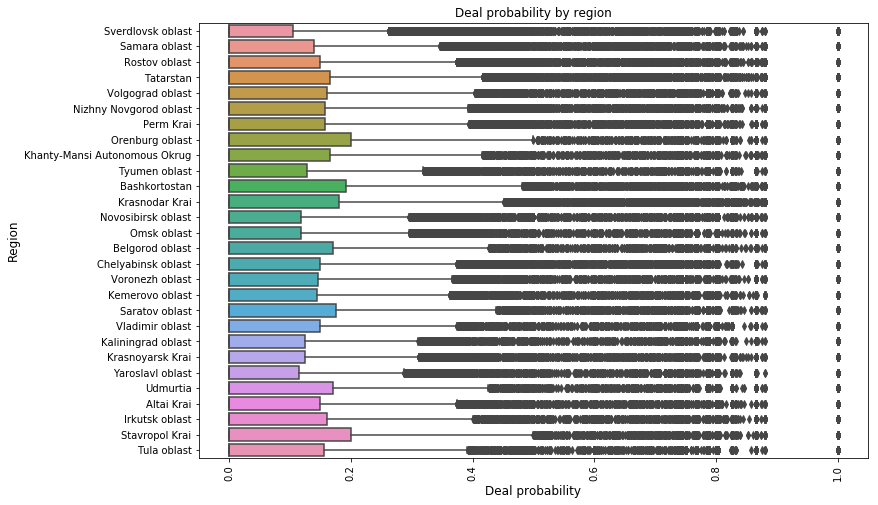

```python
import numpy as np 
import pandas as pd 
import os
import gc
import psutil
```


```python
print(os.listdir('E:\\kaggle\\Avito Demand Prediction Challenge\\dataset\\'))
```

    ['avito_region_city_features.csv', 'city_population_wiki_v3.csv', 'periods_test.csv', 'periods_train.csv', 'region.csv', 'test.csv', 'test_active.csv', 'train.csv', 'train_active.csv']
    


```python
dirpath='E:\\kaggle\\Avito Demand Prediction Challenge\\dataset\\'
train_df = pd.read_csv(dirpath+"train.csv", parse_dates=["activation_date"])
```


```python
train_df.head()
```


<div>
<style scoped>
    .dataframe tbody tr th:only-of-type {
        vertical-align: middle;
    }

    .dataframe tbody tr th {
        vertical-align: top;
    }

    .dataframe thead th {
        text-align: right;
    }
</style>
<table border="1" class="dataframe">
  <thead>
    <tr style="text-align: right;">
      <th></th>
      <th>item_id</th>
      <th>user_id</th>
      <th>region</th>
      <th>city</th>
      <th>parent_category_name</th>
      <th>category_name</th>
      <th>param_1</th>
      <th>param_2</th>
      <th>param_3</th>
      <th>title</th>
      <th>description</th>
      <th>price</th>
      <th>item_seq_number</th>
      <th>activation_date</th>
      <th>user_type</th>
      <th>image</th>
      <th>image_top_1</th>
      <th>deal_probability</th>
    </tr>
  </thead>
  <tbody>
    <tr>
      <th>0</th>
      <td>b912c3c6a6ad</td>
      <td>e00f8ff2eaf9</td>
      <td>Свердловская область</td>
      <td>Екатеринбург</td>
      <td>Личные вещи</td>
      <td>Товары для детей и игрушки</td>
      <td>Постельные принадлежности</td>
      <td>NaN</td>
      <td>NaN</td>
      <td>Кокоби(кокон для сна)</td>
      <td>Кокон для сна малыша,пользовались меньше месяц...</td>
      <td>400.0</td>
      <td>2</td>
      <td>2017-03-28</td>
      <td>Private</td>
      <td>d10c7e016e03247a3bf2d13348fe959fe6f436c1caf64c...</td>
      <td>1008.0</td>
      <td>0.12789</td>
    </tr>
    <tr>
      <th>1</th>
      <td>2dac0150717d</td>
      <td>39aeb48f0017</td>
      <td>Самарская область</td>
      <td>Самара</td>
      <td>Для дома и дачи</td>
      <td>Мебель и интерьер</td>
      <td>Другое</td>
      <td>NaN</td>
      <td>NaN</td>
      <td>Стойка для Одежды</td>
      <td>Стойка для одежды, под вешалки. С бутика.</td>
      <td>3000.0</td>
      <td>19</td>
      <td>2017-03-26</td>
      <td>Private</td>
      <td>79c9392cc51a9c81c6eb91eceb8e552171db39d7142700...</td>
      <td>692.0</td>
      <td>0.00000</td>
    </tr>
    <tr>
      <th>2</th>
      <td>ba83aefab5dc</td>
      <td>91e2f88dd6e3</td>
      <td>Ростовская область</td>
      <td>Ростов-на-Дону</td>
      <td>Бытовая электроника</td>
      <td>Аудио и видео</td>
      <td>Видео, DVD и Blu-ray плееры</td>
      <td>NaN</td>
      <td>NaN</td>
      <td>Philips bluray</td>
      <td>В хорошем состоянии, домашний кинотеатр с blu ...</td>
      <td>4000.0</td>
      <td>9</td>
      <td>2017-03-20</td>
      <td>Private</td>
      <td>b7f250ee3f39e1fedd77c141f273703f4a9be59db4b48a...</td>
      <td>3032.0</td>
      <td>0.43177</td>
    </tr>
    <tr>
      <th>3</th>
      <td>02996f1dd2ea</td>
      <td>bf5cccea572d</td>
      <td>Татарстан</td>
      <td>Набережные Челны</td>
      <td>Личные вещи</td>
      <td>Товары для детей и игрушки</td>
      <td>Автомобильные кресла</td>
      <td>NaN</td>
      <td>NaN</td>
      <td>Автокресло</td>
      <td>Продам кресло от0-25кг</td>
      <td>2200.0</td>
      <td>286</td>
      <td>2017-03-25</td>
      <td>Company</td>
      <td>e6ef97e0725637ea84e3d203e82dadb43ed3cc0a1c8413...</td>
      <td>796.0</td>
      <td>0.80323</td>
    </tr>
    <tr>
      <th>4</th>
      <td>7c90be56d2ab</td>
      <td>ef50846afc0b</td>
      <td>Волгоградская область</td>
      <td>Волгоград</td>
      <td>Транспорт</td>
      <td>Автомобили</td>
      <td>С пробегом</td>
      <td>ВАЗ (LADA)</td>
      <td>2110</td>
      <td>ВАЗ 2110, 2003</td>
      <td>Все вопросы по телефону.</td>
      <td>40000.0</td>
      <td>3</td>
      <td>2017-03-16</td>
      <td>Private</td>
      <td>54a687a3a0fc1d68aed99bdaaf551c5c70b761b16fd0a2...</td>
      <td>2264.0</td>
      <td>0.20797</td>
    </tr>
  </tbody>
</table>
</div>


```python
# date time features
train_df['weekday'] = train_df.activation_date.dt.weekday
train_df['month'] = train_df.activation_date.dt.month
train_df['day'] = train_df.activation_date.dt.day
train_df['week'] = train_df.activation_date.dt.week 

# length of description
train_df['description'] = train_df['description'].fillna(" ")
train_df['description_len'] = train_df['description'].apply(lambda x : len(x.split()))

# length of title
train_df['title'] = train_df['title'].fillna(" ")
train_df['title_len'] = train_df['title'].apply(lambda x : len(x.split()))

# param_combined and its length
train_df['param_combined'] = train_df.apply(lambda row: ' '.join([str(row['param_1']), str(row['param_2']),  str(row['param_3'])]), axis=1)
train_df['param_combined'] = train_df['param_combined'].fillna(" ")
train_df['param_combined_len'] = train_df['param_combined'].apply(lambda x : len(x.split()))

# charater len of text columns
train_df['description_char'] = train_df['description'].apply(len)
train_df['title_char'] = train_df['title'].apply(len)
train_df['param_char'] = train_df['param_combined'].apply(len)

# english mapped of weekday
daymap = {0:'Sun', 1:'Mon', 2:'Tue', 3:'Wed', 4:'Thu', 5:'Fri', 6:'Sat'}
train_df['weekday_en'] = train_df['weekday'].apply(lambda x : daymap[x])

# bins of deal probability
interval = (-0.99, .10, .20, .30, .40, .50, .60, .70, .80, .90, 1.1)
cats = ['0-0.1', '0.1-0.2', '0.2-0.3', '0.3-0.4', '0.4-0.5', '0.5-0.6', '0.6-0.7', '0.7-0.8', '0.8-0.9','0.9-1.0']
train_df['deal_class'] = train_df['deal_probability'].apply(lambda x: ">=0.5" if x >=0.5 else "<0.5")
train_df["deal_class_2"] = pd.cut(train_df.deal_probability, interval, labels=cats)
```


```python
train_df.head()
```


<div>
<style scoped>
    .dataframe tbody tr th:only-of-type {
        vertical-align: middle;
    }

    .dataframe tbody tr th {
        vertical-align: top;
    }

    .dataframe thead th {
        text-align: right;
    }
</style>
<table border="1" class="dataframe">
  <thead>
    <tr style="text-align: right;">
      <th></th>
      <th>item_id</th>
      <th>user_id</th>
      <th>region</th>
      <th>city</th>
      <th>parent_category_name</th>
      <th>category_name</th>
      <th>param_1</th>
      <th>param_2</th>
      <th>param_3</th>
      <th>title</th>
      <th>...</th>
      <th>description_len</th>
      <th>title_len</th>
      <th>param_combined</th>
      <th>param_combined_len</th>
      <th>description_char</th>
      <th>title_char</th>
      <th>param_char</th>
      <th>weekday_en</th>
      <th>deal_class</th>
      <th>deal_class_2</th>
    </tr>
  </thead>
  <tbody>
    <tr>
      <th>0</th>
      <td>b912c3c6a6ad</td>
      <td>e00f8ff2eaf9</td>
      <td>Свердловская область</td>
      <td>Екатеринбург</td>
      <td>Личные вещи</td>
      <td>Товары для детей и игрушки</td>
      <td>Постельные принадлежности</td>
      <td>NaN</td>
      <td>NaN</td>
      <td>Кокоби(кокон для сна)</td>
      <td>...</td>
      <td>7</td>
      <td>3</td>
      <td>Постельные принадлежности nan nan</td>
      <td>4</td>
      <td>58</td>
      <td>21</td>
      <td>33</td>
      <td>Mon</td>
      <td>&lt;0.5</td>
      <td>0.1-0.2</td>
    </tr>
    <tr>
      <th>1</th>
      <td>2dac0150717d</td>
      <td>39aeb48f0017</td>
      <td>Самарская область</td>
      <td>Самара</td>
      <td>Для дома и дачи</td>
      <td>Мебель и интерьер</td>
      <td>Другое</td>
      <td>NaN</td>
      <td>NaN</td>
      <td>Стойка для Одежды</td>
      <td>...</td>
      <td>7</td>
      <td>3</td>
      <td>Другое nan nan</td>
      <td>3</td>
      <td>41</td>
      <td>17</td>
      <td>14</td>
      <td>Sat</td>
      <td>&lt;0.5</td>
      <td>0-0.1</td>
    </tr>
    <tr>
      <th>2</th>
      <td>ba83aefab5dc</td>
      <td>91e2f88dd6e3</td>
      <td>Ростовская область</td>
      <td>Ростов-на-Дону</td>
      <td>Бытовая электроника</td>
      <td>Аудио и видео</td>
      <td>Видео, DVD и Blu-ray плееры</td>
      <td>NaN</td>
      <td>NaN</td>
      <td>Philips bluray</td>
      <td>...</td>
      <td>17</td>
      <td>2</td>
      <td>Видео, DVD и Blu-ray плееры nan nan</td>
      <td>7</td>
      <td>99</td>
      <td>14</td>
      <td>35</td>
      <td>Sun</td>
      <td>&lt;0.5</td>
      <td>0.4-0.5</td>
    </tr>
    <tr>
      <th>3</th>
      <td>02996f1dd2ea</td>
      <td>bf5cccea572d</td>
      <td>Татарстан</td>
      <td>Набережные Челны</td>
      <td>Личные вещи</td>
      <td>Товары для детей и игрушки</td>
      <td>Автомобильные кресла</td>
      <td>NaN</td>
      <td>NaN</td>
      <td>Автокресло</td>
      <td>...</td>
      <td>3</td>
      <td>1</td>
      <td>Автомобильные кресла nan nan</td>
      <td>4</td>
      <td>22</td>
      <td>10</td>
      <td>28</td>
      <td>Fri</td>
      <td>&gt;=0.5</td>
      <td>0.8-0.9</td>
    </tr>
    <tr>
      <th>4</th>
      <td>7c90be56d2ab</td>
      <td>ef50846afc0b</td>
      <td>Волгоградская область</td>
      <td>Волгоград</td>
      <td>Транспорт</td>
      <td>Автомобили</td>
      <td>С пробегом</td>
      <td>ВАЗ (LADA)</td>
      <td>2110</td>
      <td>ВАЗ 2110, 2003</td>
      <td>...</td>
      <td>4</td>
      <td>3</td>
      <td>С пробегом ВАЗ (LADA) 2110</td>
      <td>5</td>
      <td>24</td>
      <td>14</td>
      <td>26</td>
      <td>Wed</td>
      <td>&lt;0.5</td>
      <td>0.2-0.3</td>
    </tr>
  </tbody>
</table>
<p>5 rows × 32 columns</p>
</div>


Translating few key columns in the dataset from russian to english language. These ready to use dictionaries are prepared using yandex. 


```python
parent_category_name_map = {"Личные вещи" : "Personal belongings",
                            "Для дома и дачи" : "For the home and garden",
                            "Бытовая электроника" : "Consumer electronics",
                            "Недвижимость" : "Real estate",
                            "Хобби и отдых" : "Hobbies & leisure",
                            "Транспорт" : "Transport",
                            "Услуги" : "Services",
                            "Животные" : "Animals",
                            "Для бизнеса" : "For business"}

region_map = {"Свердловская область" : "Sverdlovsk oblast",
            "Самарская область" : "Samara oblast",
            "Ростовская область" : "Rostov oblast",
            "Татарстан" : "Tatarstan",
            "Волгоградская область" : "Volgograd oblast",
            "Нижегородская область" : "Nizhny Novgorod oblast",
            "Пермский край" : "Perm Krai",
            "Оренбургская область" : "Orenburg oblast",
            "Ханты-Мансийский АО" : "Khanty-Mansi Autonomous Okrug",
            "Тюменская область" : "Tyumen oblast",
            "Башкортостан" : "Bashkortostan",
            "Краснодарский край" : "Krasnodar Krai",
            "Новосибирская область" : "Novosibirsk oblast",
            "Омская область" : "Omsk oblast",
            "Белгородская область" : "Belgorod oblast",
            "Челябинская область" : "Chelyabinsk oblast",
            "Воронежская область" : "Voronezh oblast",
            "Кемеровская область" : "Kemerovo oblast",
            "Саратовская область" : "Saratov oblast",
            "Владимирская область" : "Vladimir oblast",
            "Калининградская область" : "Kaliningrad oblast",
            "Красноярский край" : "Krasnoyarsk Krai",
            "Ярославская область" : "Yaroslavl oblast",
            "Удмуртия" : "Udmurtia",
            "Алтайский край" : "Altai Krai",
            "Иркутская область" : "Irkutsk oblast",
            "Ставропольский край" : "Stavropol Krai",
            "Тульская область" : "Tula oblast"}


category_map = {"Одежда, обувь, аксессуары":"Clothing, shoes, accessories",
"Детская одежда и обувь":"Children's clothing and shoes",
"Товары для детей и игрушки":"Children's products and toys",
"Квартиры":"Apartments",
"Телефоны":"Phones",
"Мебель и интерьер":"Furniture and interior",
"Предложение услуг":"Offer services",
"Автомобили":"Cars",
"Ремонт и строительство":"Repair and construction",
"Бытовая техника":"Appliances",
"Товары для компьютера":"Products for computer",
"Дома, дачи, коттеджи":"Houses, villas, cottages",
"Красота и здоровье":"Health and beauty",
"Аудио и видео":"Audio and video",
"Спорт и отдых":"Sports and recreation",
"Коллекционирование":"Collecting",
"Оборудование для бизнеса":"Equipment for business",
"Земельные участки":"Land",
"Часы и украшения":"Watches and jewelry",
"Книги и журналы":"Books and magazines",
"Собаки":"Dogs",
"Игры, приставки и программы":"Games, consoles and software",
"Другие животные":"Other animals",
"Велосипеды":"Bikes",
"Ноутбуки":"Laptops",
"Кошки":"Cats",
"Грузовики и спецтехника":"Trucks and buses",
"Посуда и товары для кухни":"Tableware and goods for kitchen",
"Растения":"Plants",
"Планшеты и электронные книги":"Tablets and e-books",
"Товары для животных":"Pet products",
"Комнаты":"Room",
"Фототехника":"Photo",
"Коммерческая недвижимость":"Commercial property",
"Гаражи и машиноместа":"Garages and Parking spaces",
"Музыкальные инструменты":"Musical instruments",
"Оргтехника и расходники":"Office equipment and consumables",
"Птицы":"Birds",
"Продукты питания":"Food",
"Мотоциклы и мототехника":"Motorcycles and bikes",
"Настольные компьютеры":"Desktop computers",
"Аквариум":"Aquarium",
"Охота и рыбалка":"Hunting and fishing",
"Билеты и путешествия":"Tickets and travel",
"Водный транспорт":"Water transport",
"Готовый бизнес":"Ready business",
"Недвижимость за рубежом":"Property abroad"}

train_df['region_en'] = train_df['region'].apply(lambda x : region_map[x])
train_df['parent_category_name_en'] = train_df['parent_category_name'].apply(lambda x : parent_category_name_map[x])
train_df['category_name_en'] = train_df['category_name'].apply(lambda x : category_map[x])
```


```python
train_df.head()
```


<div>
<style scoped>
    .dataframe tbody tr th:only-of-type {
        vertical-align: middle;
    }

    .dataframe tbody tr th {
        vertical-align: top;
    }

    .dataframe thead th {
        text-align: right;
    }
</style>
<table border="1" class="dataframe">
  <thead>
    <tr style="text-align: right;">
      <th></th>
      <th>item_id</th>
      <th>user_id</th>
      <th>region</th>
      <th>city</th>
      <th>parent_category_name</th>
      <th>category_name</th>
      <th>param_1</th>
      <th>param_2</th>
      <th>param_3</th>
      <th>title</th>
      <th>...</th>
      <th>param_combined_len</th>
      <th>description_char</th>
      <th>title_char</th>
      <th>param_char</th>
      <th>weekday_en</th>
      <th>deal_class</th>
      <th>deal_class_2</th>
      <th>region_en</th>
      <th>parent_category_name_en</th>
      <th>category_name_en</th>
    </tr>
  </thead>
  <tbody>
    <tr>
      <th>0</th>
      <td>b912c3c6a6ad</td>
      <td>e00f8ff2eaf9</td>
      <td>Свердловская область</td>
      <td>Екатеринбург</td>
      <td>Личные вещи</td>
      <td>Товары для детей и игрушки</td>
      <td>Постельные принадлежности</td>
      <td>NaN</td>
      <td>NaN</td>
      <td>Кокоби(кокон для сна)</td>
      <td>...</td>
      <td>4</td>
      <td>58</td>
      <td>21</td>
      <td>33</td>
      <td>Mon</td>
      <td>&lt;0.5</td>
      <td>0.1-0.2</td>
      <td>Sverdlovsk oblast</td>
      <td>Personal belongings</td>
      <td>Children's products and toys</td>
    </tr>
    <tr>
      <th>1</th>
      <td>2dac0150717d</td>
      <td>39aeb48f0017</td>
      <td>Самарская область</td>
      <td>Самара</td>
      <td>Для дома и дачи</td>
      <td>Мебель и интерьер</td>
      <td>Другое</td>
      <td>NaN</td>
      <td>NaN</td>
      <td>Стойка для Одежды</td>
      <td>...</td>
      <td>3</td>
      <td>41</td>
      <td>17</td>
      <td>14</td>
      <td>Sat</td>
      <td>&lt;0.5</td>
      <td>0-0.1</td>
      <td>Samara oblast</td>
      <td>For the home and garden</td>
      <td>Furniture and interior</td>
    </tr>
    <tr>
      <th>2</th>
      <td>ba83aefab5dc</td>
      <td>91e2f88dd6e3</td>
      <td>Ростовская область</td>
      <td>Ростов-на-Дону</td>
      <td>Бытовая электроника</td>
      <td>Аудио и видео</td>
      <td>Видео, DVD и Blu-ray плееры</td>
      <td>NaN</td>
      <td>NaN</td>
      <td>Philips bluray</td>
      <td>...</td>
      <td>7</td>
      <td>99</td>
      <td>14</td>
      <td>35</td>
      <td>Sun</td>
      <td>&lt;0.5</td>
      <td>0.4-0.5</td>
      <td>Rostov oblast</td>
      <td>Consumer electronics</td>
      <td>Audio and video</td>
    </tr>
    <tr>
      <th>3</th>
      <td>02996f1dd2ea</td>
      <td>bf5cccea572d</td>
      <td>Татарстан</td>
      <td>Набережные Челны</td>
      <td>Личные вещи</td>
      <td>Товары для детей и игрушки</td>
      <td>Автомобильные кресла</td>
      <td>NaN</td>
      <td>NaN</td>
      <td>Автокресло</td>
      <td>...</td>
      <td>4</td>
      <td>22</td>
      <td>10</td>
      <td>28</td>
      <td>Fri</td>
      <td>&gt;=0.5</td>
      <td>0.8-0.9</td>
      <td>Tatarstan</td>
      <td>Personal belongings</td>
      <td>Children's products and toys</td>
    </tr>
    <tr>
      <th>4</th>
      <td>7c90be56d2ab</td>
      <td>ef50846afc0b</td>
      <td>Волгоградская область</td>
      <td>Волгоград</td>
      <td>Транспорт</td>
      <td>Автомобили</td>
      <td>С пробегом</td>
      <td>ВАЗ (LADA)</td>
      <td>2110</td>
      <td>ВАЗ 2110, 2003</td>
      <td>...</td>
      <td>5</td>
      <td>24</td>
      <td>14</td>
      <td>26</td>
      <td>Wed</td>
      <td>&lt;0.5</td>
      <td>0.2-0.3</td>
      <td>Volgograd oblast</td>
      <td>Transport</td>
      <td>Cars</td>
    </tr>
  </tbody>
</table>
<p>5 rows × 35 columns</p>
</div>


```python
import matplotlib.pyplot as plt
import seaborn as sns

color = sns.color_palette()
%matplotlib inline

import plotly.offline as py
py.init_notebook_mode(connected=True)
import plotly.graph_objs as go
import plotly.tools as tls

pd.options.mode.chained_assignment = None
pd.options.display.max_columns = 999
```


<script>requirejs.config({paths: { 'plotly': ['https://cdn.plot.ly/plotly-latest.min']},});if(!window.Plotly) {{require(['plotly'],function(plotly) {window.Plotly=plotly;});}}</script>


```python
plt.figure(figsize=(15,5))
sns.distplot(train_df["deal_probability"].values, bins=120)
plt.xlabel('Deal Probility', fontsize=14)
plt.title("Distribution of Deal Probability", fontsize=14)
plt.show()
```


**Result**  
1. From the deal probability distribution plot, it is clear that most of the items have exteremely low deal probability, about 78%, while very few values have the deal probability of 0.7 or larger.  
2. A very small tower is observed near the deal probability of 1.0, indicating that there are some items in the dataset having very high value of deal probability.  


```python
temp_series = train_df['region_en'].value_counts()
labels = (np.array(temp_series.index))
sizes = (np.array((temp_series / temp_series.sum())*100))

trace = go.Pie(labels=labels, values=sizes)
layout = go.Layout(title='Region distribution',width=900,height=900)
data = [trace]
fig = go.Figure(data=data, layout=layout)
py.iplot(fig, filename="region")
```


<div id="a5e2243f-df59-4b93-8928-092f487b0bcd" style="height: 900px; width: 900px;" class="plotly-graph-div"></div><script type="text/javascript">require(["plotly"], function(Plotly) { window.PLOTLYENV=window.PLOTLYENV || {};window.PLOTLYENV.BASE_URL="https://plot.ly";Plotly.newPlot("a5e2243f-df59-4b93-8928-092f487b0bcd", [{"type": "pie", "values": [9.406261972670386, 6.283989080924609, 5.9860026180239245, 5.4065918862543105, 5.21070569579839, 4.898352028436422, 4.882654527265761, 4.542364629006854, 4.1707462432420925, 4.156246009109872, 3.5546858371291132, 3.3021290068536886, 3.2590939083053083, 2.9688896811544847, 2.9343684815461244, 2.928648205695798, 2.856080520199225, 2.761695968668852, 2.6065168575199014, 2.3553568387893233, 2.1826178110765824, 2.178759950619386, 1.9490842237452641, 1.9201502703162912, 1.9095744114767357, 1.8981338597760844, 1.7786732152739348, 1.7116262611212807], "labels": ["Krasnodar Krai", "Sverdlovsk oblast", "Rostov oblast", "Tatarstan", "Chelyabinsk oblast", "Nizhny Novgorod oblast", "Samara oblast", "Bashkortostan", "Perm Krai", "Novosibirsk oblast", "Krasnoyarsk Krai", "Saratov oblast", "Volgograd oblast", "Kemerovo oblast", "Voronezh oblast", "Irkutsk oblast", "Omsk oblast", "Altai Krai", "Stavropol Krai", "Tyumen oblast", "Yaroslavl oblast", "Kaliningrad oblast", "Orenburg oblast", "Belgorod oblast", "Khanty-Mansi Autonomous Okrug", "Udmurtia", "Vladimir oblast", "Tula oblast"]}], {"height": 900, "width": 900, "title": "Region distribution"}, {"showLink": true, "linkText": "Export to plot.ly"})});</script>


**The regions have percentage of ads between 1.71% to 9.41%. So the top regions are:**
1. Krasnodar region - 9.41%
2. Sverdlovsk region - 6.28%
3. Rostov region - 5.99%


```python
plt.figure(figsize=(12,8))
sns.boxplot(y="region_en", x="deal_probability", data=train_df)
plt.xlabel('Deal probability', fontsize=12)
plt.ylabel('Region', fontsize=12)
plt.title("Deal probability by region")
plt.xticks(rotation='vertical')
plt.show()
```





```python
temp_series = train_df['parent_category_name_en'].value_counts()
labels = (np.array(temp_series.index))
sizes = (np.array((temp_series / temp_series.sum())*100))

trace = go.Pie(labels=labels, values=sizes)
layout = go.Layout(title='Parent Category distribution',width=900,height=900)
data = [trace]
fig = go.Figure(data=data, layout=layout)
py.iplot(fig, filename="parentcategory")
```


<div id="2c0edbc8-02e8-411d-82f7-bf03d5c0af26" style="height: 900px; width: 900px;" class="plotly-graph-div"></div><script type="text/javascript">require(["plotly"], function(Plotly) { window.PLOTLYENV=window.PLOTLYENV || {};window.PLOTLYENV.BASE_URL="https://plot.ly";Plotly.newPlot("2c0edbc8-02e8-411d-82f7-bf03d5c0af26", [{"type": "pie", "values": [46.40227906432251, 11.894382423055639, 11.507598654803967, 10.189407645481248, 5.721007513515815, 5.310477949001745, 4.282557681665319, 3.49003341705334, 1.2022556511004214], "labels": ["Personal belongings", "For the home and garden", "Consumer electronics", "Real estate", "Hobbies & leisure", "Transport", "Services", "Animals", "For business"]}], {"height": 900, "width": 900, "title": "Parent Category distribution"}, {"showLink": true, "linkText": "Export to plot.ly"})});</script>


46.4% of the ads are for Personal belongings, 11.9% are for home and garden and 11.5% for consumer electronics.


```python
plt.figure(figsize=(12,8))
sns.boxplot(x="deal_probability",y="parent_category_name_en" , data=train_df)
plt.xlabel('Deal probability', fontsize=12)
plt.ylabel('Parent Category', fontsize=12)
plt.title("Deal probability by parent category", fontsize=14)
plt.xticks(rotation='vertical')
plt.show()
```


Services category seems to have slightly higher deal probability compared to others.


```python
temp_series = train_df['user_type'].value_counts()
labels = (np.array(temp_series.index))
sizes = (np.array((temp_series / temp_series.sum())*100))

trace = go.Pie(labels=labels, values=sizes)
layout = go.Layout(title='User Type distribution',width=600,height=600)
data = [trace]
fig = go.Figure(data=data, layout=layout)
py.iplot(fig, filename="usertype")
```


<div id="92ea2bf9-b8fb-40ed-918c-af7b5dc82a90" style="height: 600px; width: 600px;" class="plotly-graph-div"></div><script type="text/javascript">require(["plotly"], function(Plotly) { window.PLOTLYENV=window.PLOTLYENV || {};window.PLOTLYENV.BASE_URL="https://plot.ly";Plotly.newPlot("92ea2bf9-b8fb-40ed-918c-af7b5dc82a90", [{"type": "pie", "values": [71.55040760291176, 23.09721010174109, 5.352382295347154], "labels": ["Private", "Company", "Shop"]}], {"height": 600, "width": 600, "title": "User Type distribution"}, {"showLink": true, "linkText": "Export to plot.ly"})});</script>


Private users take about 72% of the data followed by company and shop.


```python
train_df["price_new"] = train_df["price"].values
train_df["price_new"].fillna(np.nanmean(train_df["price"].values), inplace=True)

plt.figure(figsize=(12,8))
sns.distplot(np.log1p(train_df["price_new"].values), bins=100, kde=False)
plt.xlabel('Log of price', fontsize=12)
plt.title("Log of Price Histogram", fontsize=14)
plt.show()
```


```python
def _generate_bar_plot_ver(df, col, title, color, w=None, h=None, lm=0, limit=100, need_trace = False):
    cnt_srs = df[col].value_counts()[:limit]
    trace = go.Bar(x=list(cnt_srs.index), y=list(cnt_srs.values),
        marker=dict(color = color))
    if need_trace:
        return trace
    if w != None and h != None:
        layout = dict(title=title, margin=dict(l=lm), width=w, height=h)
    else:
        layout = dict(title=title, margin=dict(l=lm))
    data = [trace]
    fig = go.Figure(data=data, layout=layout)
    iplot(fig)
    
trace1 = _generate_bar_plot_ver(train_df, "title_len", "Title Length", '#f7a92c', 700, 400, 200, limit=30, need_trace = True)
trace2 = _generate_bar_plot_ver(train_df, "description_len", "Description Length", '#f7a92c', 700, 400, 200, limit=30, need_trace = True)

fig = tls.make_subplots(rows=1, cols=2, print_grid=False, subplot_titles = ['Title Word Count','Description Word Count'])
fig.append_trace(trace1, 1, 1);
fig.append_trace(trace2, 1, 2);

fig['layout'].update(height=400, title='', showlegend=False);
py.iplot(fig); 
```


<div id="012fffc8-08c2-452f-a593-83f9e31cddec" style="height: 400px; width: 100%;" class="plotly-graph-div"></div><script type="text/javascript">require(["plotly"], function(Plotly) { window.PLOTLYENV=window.PLOTLYENV || {};window.PLOTLYENV.BASE_URL="https://plot.ly";Plotly.newPlot("012fffc8-08c2-452f-a593-83f9e31cddec", [{"marker": {"color": "#f7a92c"}, "yaxis": "y1", "x": [2, 3, 1, 4, 6, 5, 7, 8, 9, 10, 11, 12, 13, 14, 16, 15, 21], "y": [360736, 335489, 235219, 206671, 143321, 122982, 70964, 18283, 6752, 2283, 517, 170, 27, 7, 1, 1, 1], "type": "bar", "xaxis": "x1"}, {"marker": {"color": "#f7a92c"}, "yaxis": "y2", "x": [0, 6, 7, 5, 8, 4, 9, 10, 3, 11, 12, 13, 14, 2, 15, 16, 17, 18, 19, 20, 21, 22, 23, 1, 24, 25, 26, 27, 28, 29], "y": [116276, 66341, 65831, 64832, 62604, 59228, 58696, 54663, 53251, 50954, 46716, 42740, 39456, 39401, 36397, 32911, 30899, 27969, 25846, 23932, 22369, 20381, 18899, 17810, 17592, 16461, 15607, 14655, 13501, 12755], "type": "bar", "xaxis": "x2"}], {"xaxis1": {"domain": [0.0, 0.45], "anchor": "y1"}, "height": 400, "yaxis2": {"domain": [0.0, 1.0], "anchor": "x2"}, "yaxis1": {"domain": [0.0, 1.0], "anchor": "x1"}, "title": "", "xaxis2": {"domain": [0.55, 1.0], "anchor": "y2"}, "annotations": [{"showarrow": false, "font": {"size": 16}, "text": "Title Word Count", "yanchor": "bottom", "xref": "paper", "yref": "paper", "x": 0.225, "y": 1.0, "xanchor": "center"}, {"showarrow": false, "font": {"size": 16}, "text": "Description Word Count", "yanchor": "bottom", "xref": "paper", "yref": "paper", "x": 0.775, "y": 1.0, "xanchor": "center"}], "showlegend": false}, {"showLink": true, "linkText": "Export to plot.ly"})});</script>


1. Items present in the dataset have a range of 1 to 10 words in the title, with title having 2 words in them have the highest number.
2. The length of description with range from 0 to 25 is most common. And a large number of items with no description are present in the dataset.
3. Items having description containing 6 words are highest.


```python
import folium

cities = pd.read_csv('citynames.csv')
cities = cities.dropna()

map_osm = folium.Map(location=[63.5907183,97.4981968], zoom_start=3)

for i, row in cities.iterrows():
    folium.CircleMarker([row['Lat'], row['Long']],radius=row['size'],color=row['color'],fill_color=row['color']
                       ).add_to(map_osm)

map_osm
```


<div style="width:100%;"><div style="position:relative;width:100%;height:0;padding-bottom:60%;"><iframe src="data:text/html;charset=utf-8;base64,PCFET0NUWVBFIGh0bWw+CjxoZWFkPiAgICAKICAgIDxtZXRhIGh0dHAtZXF1aXY9ImNvbnRlbnQtdHlwZSIgY29udGVudD0idGV4dC9odG1sOyBjaGFyc2V0PVVURi04IiAvPgogICAgPHNjcmlwdD5MX1BSRUZFUl9DQU5WQVMgPSBmYWxzZTsgTF9OT19UT1VDSCA9IGZhbHNlOyBMX0RJU0FCTEVfM0QgPSBmYWxzZTs8L3NjcmlwdD4KICAgIDxzY3JpcHQgc3JjPSJodHRwczovL2Nkbi5qc2RlbGl2ci5uZXQvbnBtL2xlYWZsZXRAMS4yLjAvZGlzdC9sZWFmbGV0LmpzIj48L3NjcmlwdD4KICAgIDxzY3JpcHQgc3JjPSJodHRwczovL2FqYXguZ29vZ2xlYXBpcy5jb20vYWpheC9saWJzL2pxdWVyeS8xLjExLjEvanF1ZXJ5Lm1pbi5qcyI+PC9zY3JpcHQ+CiAgICA8c2NyaXB0IHNyYz0iaHR0cHM6Ly9tYXhjZG4uYm9vdHN0cmFwY2RuLmNvbS9ib290c3RyYXAvMy4yLjAvanMvYm9vdHN0cmFwLm1pbi5qcyI+PC9zY3JpcHQ+CiAgICA8c2NyaXB0IHNyYz0iaHR0cHM6Ly9jZG5qcy5jbG91ZGZsYXJlLmNvbS9hamF4L2xpYnMvTGVhZmxldC5hd2Vzb21lLW1hcmtlcnMvMi4wLjIvbGVhZmxldC5hd2Vzb21lLW1hcmtlcnMuanMiPjwvc2NyaXB0PgogICAgPGxpbmsgcmVsPSJzdHlsZXNoZWV0IiBocmVmPSJodHRwczovL2Nkbi5qc2RlbGl2ci5uZXQvbnBtL2xlYWZsZXRAMS4yLjAvZGlzdC9sZWFmbGV0LmNzcyIvPgogICAgPGxpbmsgcmVsPSJzdHlsZXNoZWV0IiBocmVmPSJodHRwczovL21heGNkbi5ib290c3RyYXBjZG4uY29tL2Jvb3RzdHJhcC8zLjIuMC9jc3MvYm9vdHN0cmFwLm1pbi5jc3MiLz4KICAgIDxsaW5rIHJlbD0ic3R5bGVzaGVldCIgaHJlZj0iaHR0cHM6Ly9tYXhjZG4uYm9vdHN0cmFwY2RuLmNvbS9ib290c3RyYXAvMy4yLjAvY3NzL2Jvb3RzdHJhcC10aGVtZS5taW4uY3NzIi8+CiAgICA8bGluayByZWw9InN0eWxlc2hlZXQiIGhyZWY9Imh0dHBzOi8vbWF4Y2RuLmJvb3RzdHJhcGNkbi5jb20vZm9udC1hd2Vzb21lLzQuNi4zL2Nzcy9mb250LWF3ZXNvbWUubWluLmNzcyIvPgogICAgPGxpbmsgcmVsPSJzdHlsZXNoZWV0IiBocmVmPSJodHRwczovL2NkbmpzLmNsb3VkZmxhcmUuY29tL2FqYXgvbGlicy9MZWFmbGV0LmF3ZXNvbWUtbWFya2Vycy8yLjAuMi9sZWFmbGV0LmF3ZXNvbWUtbWFya2Vycy5jc3MiLz4KICAgIDxsaW5rIHJlbD0ic3R5bGVzaGVldCIgaHJlZj0iaHR0cHM6Ly9yYXdnaXQuY29tL3B5dGhvbi12aXN1YWxpemF0aW9uL2ZvbGl1bS9tYXN0ZXIvZm9saXVtL3RlbXBsYXRlcy9sZWFmbGV0LmF3ZXNvbWUucm90YXRlLmNzcyIvPgogICAgPHN0eWxlPmh0bWwsIGJvZHkge3dpZHRoOiAxMDAlO2hlaWdodDogMTAwJTttYXJnaW46IDA7cGFkZGluZzogMDt9PC9zdHlsZT4KICAgIDxzdHlsZT4jbWFwIHtwb3NpdGlvbjphYnNvbHV0ZTt0b3A6MDtib3R0b206MDtyaWdodDowO2xlZnQ6MDt9PC9zdHlsZT4KICAgIAogICAgICAgICAgICA8c3R5bGU+ICNtYXBfOTFlMTEzNGFhMWVhNDUyNzhkY2Q2Y2NkMzE2OWY5MDggewogICAgICAgICAgICAgICAgcG9zaXRpb24gOiByZWxhdGl2ZTsKICAgICAgICAgICAgICAgIHdpZHRoIDogMTAwLjAlOwogICAgICAgICAgICAgICAgaGVpZ2h0OiAxMDAuMCU7CiAgICAgICAgICAgICAgICBsZWZ0OiAwLjAlOwogICAgICAgICAgICAgICAgdG9wOiAwLjAlOwogICAgICAgICAgICAgICAgfQogICAgICAgICAgICA8L3N0eWxlPgogICAgICAgIAo8L2hlYWQ+Cjxib2R5PiAgICAKICAgIAogICAgICAgICAgICA8ZGl2IGNsYXNzPSJmb2xpdW0tbWFwIiBpZD0ibWFwXzkxZTExMzRhYTFlYTQ1Mjc4ZGNkNmNjZDMxNjlmOTA4IiA+PC9kaXY+CiAgICAgICAgCjwvYm9keT4KPHNjcmlwdD4gICAgCiAgICAKCiAgICAgICAgICAgIAogICAgICAgICAgICAgICAgdmFyIGJvdW5kcyA9IG51bGw7CiAgICAgICAgICAgIAoKICAgICAgICAgICAgdmFyIG1hcF85MWUxMTM0YWExZWE0NTI3OGRjZDZjY2QzMTY5ZjkwOCA9IEwubWFwKAogICAgICAgICAgICAgICAgICAgICAgICAgICAgICAgICAgJ21hcF85MWUxMTM0YWExZWE0NTI3OGRjZDZjY2QzMTY5ZjkwOCcsCiAgICAgICAgICAgICAgICAgICAgICAgICAgICAgICAgICB7Y2VudGVyOiBbNjMuNTkwNzE4Myw5Ny40OTgxOTY4XSwKICAgICAgICAgICAgICAgICAgICAgICAgICAgICAgICAgIHpvb206IDMsCiAgICAgICAgICAgICAgICAgICAgICAgICAgICAgICAgICBtYXhCb3VuZHM6IGJvdW5kcywKICAgICAgICAgICAgICAgICAgICAgICAgICAgICAgICAgIGxheWVyczogW10sCiAgICAgICAgICAgICAgICAgICAgICAgICAgICAgICAgICB3b3JsZENvcHlKdW1wOiBmYWxzZSwKICAgICAgICAgICAgICAgICAgICAgICAgICAgICAgICAgIGNyczogTC5DUlMuRVBTRzM4NTcKICAgICAgICAgICAgICAgICAgICAgICAgICAgICAgICAgfSk7CiAgICAgICAgICAgIAogICAgICAgIAogICAgCiAgICAgICAgICAgIHZhciB0aWxlX2xheWVyX2FkMTBkZjhhM2RjNTRiNmNiODFlMDhlOGU0MmJjYzgxID0gTC50aWxlTGF5ZXIoCiAgICAgICAgICAgICAgICAnaHR0cHM6Ly97c30udGlsZS5vcGVuc3RyZWV0bWFwLm9yZy97en0ve3h9L3t5fS5wbmcnLAogICAgICAgICAgICAgICAgewogICJhdHRyaWJ1dGlvbiI6IG51bGwsCiAgImRldGVjdFJldGluYSI6IGZhbHNlLAogICJtYXhab29tIjogMTgsCiAgIm1pblpvb20iOiAxLAogICJub1dyYXAiOiBmYWxzZSwKICAic3ViZG9tYWlucyI6ICJhYmMiCn0KICAgICAgICAgICAgICAgICkuYWRkVG8obWFwXzkxZTExMzRhYTFlYTQ1Mjc4ZGNkNmNjZDMxNjlmOTA4KTsKICAgICAgICAKICAgIAogICAgICAgICAgICB2YXIgY2lyY2xlX21hcmtlcl9kYjgxYmJlNDc2NTM0ZDgyYTIxYzllMGI1NDQ4NzM3ZiA9IEwuY2lyY2xlTWFya2VyKAogICAgICAgICAgICAgICAgWzQ1LjAzOTI2NzQsMzguOTg3MjIwOV0sCiAgICAgICAgICAgICAgICB7CiAgImJ1YmJsaW5nTW91c2VFdmVudHMiOiB0cnVlLAogICJjb2xvciI6ICIjMDA2MWZmIiwKICAiZGFzaEFycmF5IjogbnVsbCwKICAiZGFzaE9mZnNldCI6IG51bGwsCiAgImZpbGwiOiBmYWxzZSwKICAiZmlsbENvbG9yIjogIiMwMDYxZmYiLAogICJmaWxsT3BhY2l0eSI6IDAuMiwKICAiZmlsbFJ1bGUiOiAiZXZlbm9kZCIsCiAgImxpbmVDYXAiOiAicm91bmQiLAogICJsaW5lSm9pbiI6ICJyb3VuZCIsCiAgIm9wYWNpdHkiOiAxLjAsCiAgInJhZGl1cyI6IDEwLAogICJzdHJva2UiOiB0cnVlLAogICJ3ZWlnaHQiOiAzCn0KICAgICAgICAgICAgICAgICkuYWRkVG8obWFwXzkxZTExMzRhYTFlYTQ1Mjc4ZGNkNmNjZDMxNjlmOTA4KTsKICAgICAgICAgICAgCiAgICAKICAgICAgICAgICAgdmFyIGNpcmNsZV9tYXJrZXJfZjRjNWNhMmJiM2RlNDAxYWIwZTY3ZDU1ZmIyZjA1ZWIgPSBMLmNpcmNsZU1hcmtlcigKICAgICAgICAgICAgICAgIFs1Ni44Mzg5MjYxMDAwMDAwMSw2MC42MDU3MDI1XSwKICAgICAgICAgICAgICAgIHsKICAiYnViYmxpbmdNb3VzZUV2ZW50cyI6IHRydWUsCiAgImNvbG9yIjogIiMwMDYxZmYiLAogICJkYXNoQXJyYXkiOiBudWxsLAogICJkYXNoT2Zmc2V0IjogbnVsbCwKICAiZmlsbCI6IGZhbHNlLAogICJmaWxsQ29sb3IiOiAiIzAwNjFmZiIsCiAgImZpbGxPcGFjaXR5IjogMC4yLAogICJmaWxsUnVsZSI6ICJldmVub2RkIiwKICAibGluZUNhcCI6ICJyb3VuZCIsCiAgImxpbmVKb2luIjogInJvdW5kIiwKICAib3BhY2l0eSI6IDEuMCwKICAicmFkaXVzIjogMTAsCiAgInN0cm9rZSI6IHRydWUsCiAgIndlaWdodCI6IDMKfQogICAgICAgICAgICAgICAgKS5hZGRUbyhtYXBfOTFlMTEzNGFhMWVhNDUyNzhkY2Q2Y2NkMzE2OWY5MDgpOwogICAgICAgICAgICAKICAgIAogICAgICAgICAgICB2YXIgY2lyY2xlX21hcmtlcl85NzY0ODc1MmYwMzg0ZWUwOWY5OGY4NzBlNWMxY2ZhNiA9IEwuY2lyY2xlTWFya2VyKAogICAgICAgICAgICAgICAgWzU1LjAwODM1MjYwMDAwMDAxLDgyLjkzNTczMjddLAogICAgICAgICAgICAgICAgewogICJidWJibGluZ01vdXNlRXZlbnRzIjogdHJ1ZSwKICAiY29sb3IiOiAiIzAwNjFmZiIsCiAgImRhc2hBcnJheSI6IG51bGwsCiAgImRhc2hPZmZzZXQiOiBudWxsLAogICJmaWxsIjogZmFsc2UsCiAgImZpbGxDb2xvciI6ICIjMDA2MWZmIiwKICAiZmlsbE9wYWNpdHkiOiAwLjIsCiAgImZpbGxSdWxlIjogImV2ZW5vZGQiLAogICJsaW5lQ2FwIjogInJvdW5kIiwKICAibGluZUpvaW4iOiAicm91bmQiLAogICJvcGFjaXR5IjogMS4wLAogICJyYWRpdXMiOiAxMCwKICAic3Ryb2tlIjogdHJ1ZSwKICAid2VpZ2h0IjogMwp9CiAgICAgICAgICAgICAgICApLmFkZFRvKG1hcF85MWUxMTM0YWExZWE0NTI3OGRjZDZjY2QzMTY5ZjkwOCk7CiAgICAgICAgICAgIAogICAgCiAgICAgICAgICAgIHZhciBjaXJjbGVfbWFya2VyX2UyY2ZhMmQxZjg3MTRmMWM5OTAyMWM0NWU1ZDRmY2FjID0gTC5jaXJjbGVNYXJrZXIoCiAgICAgICAgICAgICAgICBbNDcuMjM1NzEzNzAwMDAwMDEsMzkuNzAxNTA1XSwKICAgICAgICAgICAgICAgIHsKICAiYnViYmxpbmdNb3VzZUV2ZW50cyI6IHRydWUsCiAgImNvbG9yIjogIiMwMDYxZmYiLAogICJkYXNoQXJyYXkiOiBudWxsLAogICJkYXNoT2Zmc2V0IjogbnVsbCwKICAiZmlsbCI6IGZhbHNlLAogICJmaWxsQ29sb3IiOiAiIzAwNjFmZiIsCiAgImZpbGxPcGFjaXR5IjogMC4yLAogICJmaWxsUnVsZSI6ICJldmVub2RkIiwKICAibGluZUNhcCI6ICJyb3VuZCIsCiAgImxpbmVKb2luIjogInJvdW5kIiwKICAib3BhY2l0eSI6IDEuMCwKICAicmFkaXVzIjogMTAsCiAgInN0cm9rZSI6IHRydWUsCiAgIndlaWdodCI6IDMKfQogICAgICAgICAgICAgICAgKS5hZGRUbyhtYXBfOTFlMTEzNGFhMWVhNDUyNzhkY2Q2Y2NkMzE2OWY5MDgpOwogICAgICAgICAgICAKICAgIAogICAgICAgICAgICB2YXIgY2lyY2xlX21hcmtlcl83ZjY3OWU1OTBhNzc0OTJkYmE5OTgzOTY1ZDc1MzY4YyA9IEwuY2lyY2xlTWFya2VyKAogICAgICAgICAgICAgICAgWzU2LjI5NjUwMzksNDMuOTM2MDU5XSwKICAgICAgICAgICAgICAgIHsKICAiYnViYmxpbmdNb3VzZUV2ZW50cyI6IHRydWUsCiAgImNvbG9yIjogIiMwMDYxZmYiLAogICJkYXNoQXJyYXkiOiBudWxsLAogICJkYXNoT2Zmc2V0IjogbnVsbCwKICAiZmlsbCI6IGZhbHNlLAogICJmaWxsQ29sb3IiOiAiIzAwNjFmZiIsCiAgImZpbGxPcGFjaXR5IjogMC4yLAogICJmaWxsUnVsZSI6ICJldmVub2RkIiwKICAibGluZUNhcCI6ICJyb3VuZCIsCiAgImxpbmVKb2luIjogInJvdW5kIiwKICAib3BhY2l0eSI6IDEuMCwKICAicmFkaXVzIjogMTAsCiAgInN0cm9rZSI6IHRydWUsCiAgIndlaWdodCI6IDMKfQogICAgICAgICAgICAgICAgKS5hZGRUbyhtYXBfOTFlMTEzNGFhMWVhNDUyNzhkY2Q2Y2NkMzE2OWY5MDgpOwogICAgICAgICAgICAKICAgIAogICAgICAgICAgICB2YXIgY2lyY2xlX21hcmtlcl80ZDVlMmViNDY0MmE0MDFkYTYxNjNkY2I1NzM1MjMyMCA9IEwuY2lyY2xlTWFya2VyKAogICAgICAgICAgICAgICAgWzU1LjE2NDQ0MTksNjEuNDM2ODQzMjAwMDAwMDFdLAogICAgICAgICAgICAgICAgewogICJidWJibGluZ01vdXNlRXZlbnRzIjogdHJ1ZSwKICAiY29sb3IiOiAiIzAwNjFmZiIsCiAgImRhc2hBcnJheSI6IG51bGwsCiAgImRhc2hPZmZzZXQiOiBudWxsLAogICJmaWxsIjogZmFsc2UsCiAgImZpbGxDb2xvciI6ICIjMDA2MWZmIiwKICAiZmlsbE9wYWNpdHkiOiAwLjIsCiAgImZpbGxSdWxlIjogImV2ZW5vZGQiLAogICJsaW5lQ2FwIjogInJvdW5kIiwKICAibGluZUpvaW4iOiAicm91bmQiLAogICJvcGFjaXR5IjogMS4wLAogICJyYWRpdXMiOiAxMCwKICAic3Ryb2tlIjogdHJ1ZSwKICAid2VpZ2h0IjogMwp9CiAgICAgICAgICAgICAgICApLmFkZFRvKG1hcF85MWUxMTM0YWExZWE0NTI3OGRjZDZjY2QzMTY5ZjkwOCk7CiAgICAgICAgICAgIAogICAgCiAgICAgICAgICAgIHZhciBjaXJjbGVfbWFya2VyXzA4NTA5ODFlNGMzZDQ1MGY4ZjhiYTE4ZGJiNzEyN2YyID0gTC5jaXJjbGVNYXJrZXIoCiAgICAgICAgICAgICAgICBbNTguMDI5NjgxMyw1Ni4yNjY3OTE2XSwKICAgICAgICAgICAgICAgIHsKICAiYnViYmxpbmdNb3VzZUV2ZW50cyI6IHRydWUsCiAgImNvbG9yIjogIiMwMDYxZmYiLAogICJkYXNoQXJyYXkiOiBudWxsLAogICJkYXNoT2Zmc2V0IjogbnVsbCwKICAiZmlsbCI6IGZhbHNlLAogICJmaWxsQ29sb3IiOiAiIzAwNjFmZiIsCiAgImZpbGxPcGFjaXR5IjogMC4yLAogICJmaWxsUnVsZSI6ICJldmVub2RkIiwKICAibGluZUNhcCI6ICJyb3VuZCIsCiAgImxpbmVKb2luIjogInJvdW5kIiwKICAib3BhY2l0eSI6IDEuMCwKICAicmFkaXVzIjogMTAsCiAgInN0cm9rZSI6IHRydWUsCiAgIndlaWdodCI6IDMKfQogICAgICAgICAgICAgICAgKS5hZGRUbyhtYXBfOTFlMTEzNGFhMWVhNDUyNzhkY2Q2Y2NkMzE2OWY5MDgpOwogICAgICAgICAgICAKICAgIAogICAgICAgICAgICB2YXIgY2lyY2xlX21hcmtlcl81NmM3NjYyZmMzNjg0MTUxOGYzZWNhMjE1YjRlZTdmNSA9IEwuY2lyY2xlTWFya2VyKAogICAgICAgICAgICAgICAgWzU1LjgzMDQzMDcsNDkuMDY2MDgwNjAwMDAwMDFdLAogICAgICAgICAgICAgICAgewogICJidWJibGluZ01vdXNlRXZlbnRzIjogdHJ1ZSwKICAiY29sb3IiOiAiIzAwNjFmZiIsCiAgImRhc2hBcnJheSI6IG51bGwsCiAgImRhc2hPZmZzZXQiOiBudWxsLAogICJmaWxsIjogZmFsc2UsCiAgImZpbGxDb2xvciI6ICIjMDA2MWZmIiwKICAiZmlsbE9wYWNpdHkiOiAwLjIsCiAgImZpbGxSdWxlIjogImV2ZW5vZGQiLAogICJsaW5lQ2FwIjogInJvdW5kIiwKICAibGluZUpvaW4iOiAicm91bmQiLAogICJvcGFjaXR5IjogMS4wLAogICJyYWRpdXMiOiAxMCwKICAic3Ryb2tlIjogdHJ1ZSwKICAid2VpZ2h0IjogMwp9CiAgICAgICAgICAgICAgICApLmFkZFRvKG1hcF85MWUxMTM0YWExZWE0NTI3OGRjZDZjY2QzMTY5ZjkwOCk7CiAgICAgICAgICAgIAogICAgCiAgICAgICAgICAgIHZhciBjaXJjbGVfbWFya2VyX2ExYzE1N2QwOGE3YzRmMTY4ZDM4ODUzMTRmNDcwZTAzID0gTC5jaXJjbGVNYXJrZXIoCiAgICAgICAgICAgICAgICBbNTMuMjQxNTA0MSw1MC4yMjEyNDYzXSwKICAgICAgICAgICAgICAgIHsKICAiYnViYmxpbmdNb3VzZUV2ZW50cyI6IHRydWUsCiAgImNvbG9yIjogIiMwMDYxZmYiLAogICJkYXNoQXJyYXkiOiBudWxsLAogICJkYXNoT2Zmc2V0IjogbnVsbCwKICAiZmlsbCI6IGZhbHNlLAogICJmaWxsQ29sb3IiOiAiIzAwNjFmZiIsCiAgImZpbGxPcGFjaXR5IjogMC4yLAogICJmaWxsUnVsZSI6ICJldmVub2RkIiwKICAibGluZUNhcCI6ICJyb3VuZCIsCiAgImxpbmVKb2luIjogInJvdW5kIiwKICAib3BhY2l0eSI6IDEuMCwKICAicmFkaXVzIjogMTAsCiAgInN0cm9rZSI6IHRydWUsCiAgIndlaWdodCI6IDMKfQogICAgICAgICAgICAgICAgKS5hZGRUbyhtYXBfOTFlMTEzNGFhMWVhNDUyNzhkY2Q2Y2NkMzE2OWY5MDgpOwogICAgICAgICAgICAKICAgIAogICAgICAgICAgICB2YXIgY2lyY2xlX21hcmtlcl81MzBmNDliMzI0YzM0MGY0OWU2ZjE1NzQ1N2ZkNDJlNSA9IEwuY2lyY2xlTWFya2VyKAogICAgICAgICAgICAgICAgWzU0Ljk4ODQ4MDQsNzMuMzI0MjM2MV0sCiAgICAgICAgICAgICAgICB7CiAgImJ1YmJsaW5nTW91c2VFdmVudHMiOiB0cnVlLAogICJjb2xvciI6ICIjMDA2MWZmIiwKICAiZGFzaEFycmF5IjogbnVsbCwKICAiZGFzaE9mZnNldCI6IG51bGwsCiAgImZpbGwiOiBmYWxzZSwKICAiZmlsbENvbG9yIjogIiMwMDYxZmYiLAogICJmaWxsT3BhY2l0eSI6IDAuMiwKICAiZmlsbFJ1bGUiOiAiZXZlbm9kZCIsCiAgImxpbmVDYXAiOiAicm91bmQiLAogICJsaW5lSm9pbiI6ICJyb3VuZCIsCiAgIm9wYWNpdHkiOiAxLjAsCiAgInJhZGl1cyI6IDEwLAogICJzdHJva2UiOiB0cnVlLAogICJ3ZWlnaHQiOiAzCn0KICAgICAgICAgICAgICAgICkuYWRkVG8obWFwXzkxZTExMzRhYTFlYTQ1Mjc4ZGNkNmNjZDMxNjlmOTA4KTsKICAgICAgICAgICAgCiAgICAKICAgICAgICAgICAgdmFyIGNpcmNsZV9tYXJrZXJfMGZmODliMTE3NGRkNGM0ZWEwMzU2NDYyNWIxZWU5OGEgPSBMLmNpcmNsZU1hcmtlcigKICAgICAgICAgICAgICAgIFs1NC43Mzg3NjIxLDU1Ljk3MjA1NTRdLAogICAgICAgICAgICAgICAgewogICJidWJibGluZ01vdXNlRXZlbnRzIjogdHJ1ZSwKICAiY29sb3IiOiAiIzAwNjFmZiIsCiAgImRhc2hBcnJheSI6IG51bGwsCiAgImRhc2hPZmZzZXQiOiBudWxsLAogICJmaWxsIjogZmFsc2UsCiAgImZpbGxDb2xvciI6ICIjMDA2MWZmIiwKICAiZmlsbE9wYWNpdHkiOiAwLjIsCiAgImZpbGxSdWxlIjogImV2ZW5vZGQiLAogICJsaW5lQ2FwIjogInJvdW5kIiwKICAibGluZUpvaW4iOiAicm91bmQiLAogICJvcGFjaXR5IjogMS4wLAogICJyYWRpdXMiOiAxMCwKICAic3Ryb2tlIjogdHJ1ZSwKICAid2VpZ2h0IjogMwp9CiAgICAgICAgICAgICAgICApLmFkZFRvKG1hcF85MWUxMTM0YWExZWE0NTI3OGRjZDZjY2QzMTY5ZjkwOCk7CiAgICAgICAgICAgIAogICAgCiAgICAgICAgICAgIHZhciBjaXJjbGVfbWFya2VyX2ZmNGUzZmFmZTQzMTQ2OTRhMmExNjZmZjdkYzVhYWQ3ID0gTC5jaXJjbGVNYXJrZXIoCiAgICAgICAgICAgICAgICBbNTYuMDE1MjgzNCw5Mi44OTMyNDc2XSwKICAgICAgICAgICAgICAgIHsKICAiYnViYmxpbmdNb3VzZUV2ZW50cyI6IHRydWUsCiAgImNvbG9yIjogIiMwMDYxZmYiLAogICJkYXNoQXJyYXkiOiBudWxsLAogICJkYXNoT2Zmc2V0IjogbnVsbCwKICAiZmlsbCI6IGZhbHNlLAogICJmaWxsQ29sb3IiOiAiIzAwNjFmZiIsCiAgImZpbGxPcGFjaXR5IjogMC4yLAogICJmaWxsUnVsZSI6ICJldmVub2RkIiwKICAibGluZUNhcCI6ICJyb3VuZCIsCiAgImxpbmVKb2luIjogInJvdW5kIiwKICAib3BhY2l0eSI6IDEuMCwKICAicmFkaXVzIjogMTAsCiAgInN0cm9rZSI6IHRydWUsCiAgIndlaWdodCI6IDMKfQogICAgICAgICAgICAgICAgKS5hZGRUbyhtYXBfOTFlMTEzNGFhMWVhNDUyNzhkY2Q2Y2NkMzE2OWY5MDgpOwogICAgICAgICAgICAKICAgIAogICAgICAgICAgICB2YXIgY2lyY2xlX21hcmtlcl9lZjc5NzZjNzM3MTc0ZDViYTIzNjEzYTZhNzBiNDUzMiA9IEwuY2lyY2xlTWFya2VyKAogICAgICAgICAgICAgICAgWzUxLjY3NTQ5NjYsMzkuMjA4ODgyM10sCiAgICAgICAgICAgICAgICB7CiAgImJ1YmJsaW5nTW91c2VFdmVudHMiOiB0cnVlLAogICJjb2xvciI6ICIjMDA2MWZmIiwKICAiZGFzaEFycmF5IjogbnVsbCwKICAiZGFzaE9mZnNldCI6IG51bGwsCiAgImZpbGwiOiBmYWxzZSwKICAiZmlsbENvbG9yIjogIiMwMDYxZmYiLAogICJmaWxsT3BhY2l0eSI6IDAuMiwKICAiZmlsbFJ1bGUiOiAiZXZlbm9kZCIsCiAgImxpbmVDYXAiOiAicm91bmQiLAogICJsaW5lSm9pbiI6ICJyb3VuZCIsCiAgIm9wYWNpdHkiOiAxLjAsCiAgInJhZGl1cyI6IDEwLAogICJzdHJva2UiOiB0cnVlLAogICJ3ZWlnaHQiOiAzCn0KICAgICAgICAgICAgICAgICkuYWRkVG8obWFwXzkxZTExMzRhYTFlYTQ1Mjc4ZGNkNmNjZDMxNjlmOTA4KTsKICAgICAgICAgICAgCiAgICAKICAgICAgICAgICAgdmFyIGNpcmNsZV9tYXJrZXJfNzQ4OGIzNDJmNzMzNGM0MmI2OTdjYTRmNjk4YzNjNTIgPSBMLmNpcmNsZU1hcmtlcigKICAgICAgICAgICAgICAgIFs0OC43MDgwNDgsNDQuNTEzMzAzNV0sCiAgICAgICAgICAgICAgICB7CiAgImJ1YmJsaW5nTW91c2VFdmVudHMiOiB0cnVlLAogICJjb2xvciI6ICIjMDA2MWZmIiwKICAiZGFzaEFycmF5IjogbnVsbCwKICAiZGFzaE9mZnNldCI6IG51bGwsCiAgImZpbGwiOiBmYWxzZSwKICAiZmlsbENvbG9yIjogIiMwMDYxZmYiLAogICJmaWxsT3BhY2l0eSI6IDAuMiwKICAiZmlsbFJ1bGUiOiAiZXZlbm9kZCIsCiAgImxpbmVDYXAiOiAicm91bmQiLAogICJsaW5lSm9pbiI6ICJyb3VuZCIsCiAgIm9wYWNpdHkiOiAxLjAsCiAgInJhZGl1cyI6IDEwLAogICJzdHJva2UiOiB0cnVlLAogICJ3ZWlnaHQiOiAzCn0KICAgICAgICAgICAgICAgICkuYWRkVG8obWFwXzkxZTExMzRhYTFlYTQ1Mjc4ZGNkNmNjZDMxNjlmOTA4KTsKICAgICAgICAgICAgCiAgICAKICAgICAgICAgICAgdmFyIGNpcmNsZV9tYXJrZXJfMzA1MzM0ZTk1MzEyNDJlMzljNGI2YTcyYjQ4OTYxZDcgPSBMLmNpcmNsZU1hcmtlcigKICAgICAgICAgICAgICAgIFs1MS41OTIzNjU0LDQ1Ljk2MDgwMzFdLAogICAgICAgICAgICAgICAgewogICJidWJibGluZ01vdXNlRXZlbnRzIjogdHJ1ZSwKICAiY29sb3IiOiAiIzAwNjFmZiIsCiAgImRhc2hBcnJheSI6IG51bGwsCiAgImRhc2hPZmZzZXQiOiBudWxsLAogICJmaWxsIjogZmFsc2UsCiAgImZpbGxDb2xvciI6ICIjMDA2MWZmIiwKICAiZmlsbE9wYWNpdHkiOiAwLjIsCiAgImZpbGxSdWxlIjogImV2ZW5vZGQiLAogICJsaW5lQ2FwIjogInJvdW5kIiwKICAibGluZUpvaW4iOiAicm91bmQiLAogICJvcGFjaXR5IjogMS4wLAogICJyYWRpdXMiOiAxMCwKICAic3Ryb2tlIjogdHJ1ZSwKICAid2VpZ2h0IjogMwp9CiAgICAgICAgICAgICAgICApLmFkZFRvKG1hcF85MWUxMTM0YWExZWE0NTI3OGRjZDZjY2QzMTY5ZjkwOCk7CiAgICAgICAgICAgIAogICAgCiAgICAgICAgICAgIHZhciBjaXJjbGVfbWFya2VyX2FlMDAyOTViOTg4OTQ0NWI4MDVmMzYyZTNmOWUzZDA2ID0gTC5jaXJjbGVNYXJrZXIoCiAgICAgICAgICAgICAgICBbNTcuMTYxMjk3NSw2NS41MjUwMTcyMDAwMDAwMV0sCiAgICAgICAgICAgICAgICB7CiAgImJ1YmJsaW5nTW91c2VFdmVudHMiOiB0cnVlLAogICJjb2xvciI6ICIjMDA2MWZmIiwKICAiZGFzaEFycmF5IjogbnVsbCwKICAiZGFzaE9mZnNldCI6IG51bGwsCiAgImZpbGwiOiBmYWxzZSwKICAiZmlsbENvbG9yIjogIiMwMDYxZmYiLAogICJmaWxsT3BhY2l0eSI6IDAuMiwKICAiZmlsbFJ1bGUiOiAiZXZlbm9kZCIsCiAgImxpbmVDYXAiOiAicm91bmQiLAogICJsaW5lSm9pbiI6ICJyb3VuZCIsCiAgIm9wYWNpdHkiOiAxLjAsCiAgInJhZGl1cyI6IDEwLAogICJzdHJva2UiOiB0cnVlLAogICJ3ZWlnaHQiOiAzCn0KICAgICAgICAgICAgICAgICkuYWRkVG8obWFwXzkxZTExMzRhYTFlYTQ1Mjc4ZGNkNmNjZDMxNjlmOTA4KTsKICAgICAgICAgICAgCiAgICAKICAgICAgICAgICAgdmFyIGNpcmNsZV9tYXJrZXJfNTE0ZTEyYjc0YzQwNGRkNDg1Y2QwMDc5ODQwMDk0NjEgPSBMLmNpcmNsZU1hcmtlcigKICAgICAgICAgICAgICAgIFs1NC43MTA0MjY0LDIwLjQ1MjIxNDM5OTk5OTk5NV0sCiAgICAgICAgICAgICAgICB7CiAgImJ1YmJsaW5nTW91c2VFdmVudHMiOiB0cnVlLAogICJjb2xvciI6ICIjMDA2MWZmIiwKICAiZGFzaEFycmF5IjogbnVsbCwKICAiZGFzaE9mZnNldCI6IG51bGwsCiAgImZpbGwiOiBmYWxzZSwKICAiZmlsbENvbG9yIjogIiMwMDYxZmYiLAogICJmaWxsT3BhY2l0eSI6IDAuMiwKICAiZmlsbFJ1bGUiOiAiZXZlbm9kZCIsCiAgImxpbmVDYXAiOiAicm91bmQiLAogICJsaW5lSm9pbiI6ICJyb3VuZCIsCiAgIm9wYWNpdHkiOiAxLjAsCiAgInJhZGl1cyI6IDEwLAogICJzdHJva2UiOiB0cnVlLAogICJ3ZWlnaHQiOiAzCn0KICAgICAgICAgICAgICAgICkuYWRkVG8obWFwXzkxZTExMzRhYTFlYTQ1Mjc4ZGNkNmNjZDMxNjlmOTA4KTsKICAgICAgICAgICAgCiAgICAKICAgICAgICAgICAgdmFyIGNpcmNsZV9tYXJrZXJfMGYxMWUyZTkwMTcxNGEyNTlkMWUyZjI1Mjg1NWY4NmMgPSBMLmNpcmNsZU1hcmtlcigKICAgICAgICAgICAgICAgIFs1My4zNTQ3NzkyLDgzLjc2OTc4MzNdLAogICAgICAgICAgICAgICAgewogICJidWJibGluZ01vdXNlRXZlbnRzIjogdHJ1ZSwKICAiY29sb3IiOiAiIzAwNjFmZiIsCiAgImRhc2hBcnJheSI6IG51bGwsCiAgImRhc2hPZmZzZXQiOiBudWxsLAogICJmaWxsIjogZmFsc2UsCiAgImZpbGxDb2xvciI6ICIjMDA2MWZmIiwKICAiZmlsbE9wYWNpdHkiOiAwLjIsCiAgImZpbGxSdWxlIjogImV2ZW5vZGQiLAogICJsaW5lQ2FwIjogInJvdW5kIiwKICAibGluZUpvaW4iOiAicm91bmQiLAogICJvcGFjaXR5IjogMS4wLAogICJyYWRpdXMiOiAxMCwKICAic3Ryb2tlIjogdHJ1ZSwKICAid2VpZ2h0IjogMwp9CiAgICAgICAgICAgICAgICApLmFkZFRvKG1hcF85MWUxMTM0YWExZWE0NTI3OGRjZDZjY2QzMTY5ZjkwOCk7CiAgICAgICAgICAgIAogICAgCiAgICAgICAgICAgIHZhciBjaXJjbGVfbWFya2VyX2ZhYzE3ZDVkYmVhYzQ2ZjZhZTIxNjAyZDg5MjgwYzllID0gTC5jaXJjbGVNYXJrZXIoCiAgICAgICAgICAgICAgICBbNTcuNjI2MDc0Mzk5OTk5OTksMzkuODg0NDcwOV0sCiAgICAgICAgICAgICAgICB7CiAgImJ1YmJsaW5nTW91c2VFdmVudHMiOiB0cnVlLAogICJjb2xvciI6ICIjMDA2MWZmIiwKICAiZGFzaEFycmF5IjogbnVsbCwKICAiZGFzaE9mZnNldCI6IG51bGwsCiAgImZpbGwiOiBmYWxzZSwKICAiZmlsbENvbG9yIjogIiMwMDYxZmYiLAogICJmaWxsT3BhY2l0eSI6IDAuMiwKICAiZmlsbFJ1bGUiOiAiZXZlbm9kZCIsCiAgImxpbmVDYXAiOiAicm91bmQiLAogICJsaW5lSm9pbiI6ICJyb3VuZCIsCiAgIm9wYWNpdHkiOiAxLjAsCiAgInJhZGl1cyI6IDEwLAogICJzdHJva2UiOiB0cnVlLAogICJ3ZWlnaHQiOiAzCn0KICAgICAgICAgICAgICAgICkuYWRkVG8obWFwXzkxZTExMzRhYTFlYTQ1Mjc4ZGNkNmNjZDMxNjlmOTA4KTsKICAgICAgICAgICAgCiAgICAKICAgICAgICAgICAgdmFyIGNpcmNsZV9tYXJrZXJfMDkyNjNmYzlmZDM2NGUwYmFkYTg3ZDYwZWJlZGI4OGUgPSBMLmNpcmNsZU1hcmtlcigKICAgICAgICAgICAgICAgIFs1Mi4yODY5NzQxLDEwNC4zMDUwMTgzXSwKICAgICAgICAgICAgICAgIHsKICAiYnViYmxpbmdNb3VzZUV2ZW50cyI6IHRydWUsCiAgImNvbG9yIjogIiMwMDYxZmYiLAogICJkYXNoQXJyYXkiOiBudWxsLAogICJkYXNoT2Zmc2V0IjogbnVsbCwKICAiZmlsbCI6IGZhbHNlLAogICJmaWxsQ29sb3IiOiAiIzAwNjFmZiIsCiAgImZpbGxPcGFjaXR5IjogMC4yLAogICJmaWxsUnVsZSI6ICJldmVub2RkIiwKICAibGluZUNhcCI6ICJyb3VuZCIsCiAgImxpbmVKb2luIjogInJvdW5kIiwKICAib3BhY2l0eSI6IDEuMCwKICAicmFkaXVzIjogMTAsCiAgInN0cm9rZSI6IHRydWUsCiAgIndlaWdodCI6IDMKfQogICAgICAgICAgICAgICAgKS5hZGRUbyhtYXBfOTFlMTEzNGFhMWVhNDUyNzhkY2Q2Y2NkMzE2OWY5MDgpOwogICAgICAgICAgICAKICAgIAogICAgICAgICAgICB2YXIgY2lyY2xlX21hcmtlcl82ODYwYTkxOGI3NmY0MjJkOTU1M2YzZDg3MWRlZmY5MiA9IEwuY2lyY2xlTWFya2VyKAogICAgICAgICAgICAgICAgWzUxLjc2NjY0ODIsNTUuMTAwNDUzOF0sCiAgICAgICAgICAgICAgICB7CiAgImJ1YmJsaW5nTW91c2VFdmVudHMiOiB0cnVlLAogICJjb2xvciI6ICIjMDA2MWZmIiwKICAiZGFzaEFycmF5IjogbnVsbCwKICAiZGFzaE9mZnNldCI6IG51bGwsCiAgImZpbGwiOiBmYWxzZSwKICAiZmlsbENvbG9yIjogIiMwMDYxZmYiLAogICJmaWxsT3BhY2l0eSI6IDAuMiwKICAiZmlsbFJ1bGUiOiAiZXZlbm9kZCIsCiAgImxpbmVDYXAiOiAicm91bmQiLAogICJsaW5lSm9pbiI6ICJyb3VuZCIsCiAgIm9wYWNpdHkiOiAxLjAsCiAgInJhZGl1cyI6IDEwLAogICJzdHJva2UiOiB0cnVlLAogICJ3ZWlnaHQiOiAzCn0KICAgICAgICAgICAgICAgICkuYWRkVG8obWFwXzkxZTExMzRhYTFlYTQ1Mjc4ZGNkNmNjZDMxNjlmOTA4KTsKICAgICAgICAgICAgCiAgICAKICAgICAgICAgICAgdmFyIGNpcmNsZV9tYXJrZXJfN2IzYmJhOTYyOWQ4NDUwNDhhNTZjNWNmZTM3ZjRiYTIgPSBMLmNpcmNsZU1hcmtlcigKICAgICAgICAgICAgICAgIFs0My42MDI4MDc5LDM5LjczNDE1NDI5OTk5OTk5XSwKICAgICAgICAgICAgICAgIHsKICAiYnViYmxpbmdNb3VzZUV2ZW50cyI6IHRydWUsCiAgImNvbG9yIjogIiMwMDYxZmYiLAogICJkYXNoQXJyYXkiOiBudWxsLAogICJkYXNoT2Zmc2V0IjogbnVsbCwKICAiZmlsbCI6IGZhbHNlLAogICJmaWxsQ29sb3IiOiAiIzAwNjFmZiIsCiAgImZpbGxPcGFjaXR5IjogMC4yLAogICJmaWxsUnVsZSI6ICJldmVub2RkIiwKICAibGluZUNhcCI6ICJyb3VuZCIsCiAgImxpbmVKb2luIjogInJvdW5kIiwKICAib3BhY2l0eSI6IDEuMCwKICAicmFkaXVzIjogMTAsCiAgInN0cm9rZSI6IHRydWUsCiAgIndlaWdodCI6IDMKfQogICAgICAgICAgICAgICAgKS5hZGRUbyhtYXBfOTFlMTEzNGFhMWVhNDUyNzhkY2Q2Y2NkMzE2OWY5MDgpOwogICAgICAgICAgICAKICAgIAogICAgICAgICAgICB2YXIgY2lyY2xlX21hcmtlcl8yYjcxYzVlZTE4YWM0N2E3YjA1MjVkMmI2NjgyMGUwNyA9IEwuY2lyY2xlTWFya2VyKAogICAgICAgICAgICAgICAgWzU2Ljg2MTg2MDEsNTMuMjMyNDI4NF0sCiAgICAgICAgICAgICAgICB7CiAgImJ1YmJsaW5nTW91c2VFdmVudHMiOiB0cnVlLAogICJjb2xvciI6ICIjMDA2MWZmIiwKICAiZGFzaEFycmF5IjogbnVsbCwKICAiZGFzaE9mZnNldCI6IG51bGwsCiAgImZpbGwiOiBmYWxzZSwKICAiZmlsbENvbG9yIjogIiMwMDYxZmYiLAogICJmaWxsT3BhY2l0eSI6IDAuMiwKICAiZmlsbFJ1bGUiOiAiZXZlbm9kZCIsCiAgImxpbmVDYXAiOiAicm91bmQiLAogICJsaW5lSm9pbiI6ICJyb3VuZCIsCiAgIm9wYWNpdHkiOiAxLjAsCiAgInJhZGl1cyI6IDEwLAogICJzdHJva2UiOiB0cnVlLAogICJ3ZWlnaHQiOiAzCn0KICAgICAgICAgICAgICAgICkuYWRkVG8obWFwXzkxZTExMzRhYTFlYTQ1Mjc4ZGNkNmNjZDMxNjlmOTA4KTsKICAgICAgICAgICAgCiAgICAKICAgICAgICAgICAgdmFyIGNpcmNsZV9tYXJrZXJfYzExYjMzY2E1YTRlNDViYWE2NDhmZmNjOWE2YzE3MTIgPSBMLmNpcmNsZU1hcmtlcigKICAgICAgICAgICAgICAgIFs1My41MDg2MDAyLDQ5LjQxOTgzNDRdLAogICAgICAgICAgICAgICAgewogICJidWJibGluZ01vdXNlRXZlbnRzIjogdHJ1ZSwKICAiY29sb3IiOiAiIzAwNjFmZiIsCiAgImRhc2hBcnJheSI6IG51bGwsCiAgImRhc2hPZmZzZXQiOiBudWxsLAogICJmaWxsIjogZmFsc2UsCiAgImZpbGxDb2xvciI6ICIjMDA2MWZmIiwKICAiZmlsbE9wYWNpdHkiOiAwLjIsCiAgImZpbGxSdWxlIjogImV2ZW5vZGQiLAogICJsaW5lQ2FwIjogInJvdW5kIiwKICAibGluZUpvaW4iOiAicm91bmQiLAogICJvcGFjaXR5IjogMS4wLAogICJyYWRpdXMiOiAxMCwKICAic3Ryb2tlIjogdHJ1ZSwKICAid2VpZ2h0IjogMwp9CiAgICAgICAgICAgICAgICApLmFkZFRvKG1hcF85MWUxMTM0YWExZWE0NTI3OGRjZDZjY2QzMTY5ZjkwOCk7CiAgICAgICAgICAgIAogICAgCiAgICAgICAgICAgIHZhciBjaXJjbGVfbWFya2VyXzIzYjVhNmU0YmRiYTQxNjg4YjgwNjlmYzY0Mjg2YmVlID0gTC5jaXJjbGVNYXJrZXIoCiAgICAgICAgICAgICAgICBbNTUuMzQ1MDIzMTAwMDAwMDEsODYuMDYyMzA0NDAwMDAwMDJdLAogICAgICAgICAgICAgICAgewogICJidWJibGluZ01vdXNlRXZlbnRzIjogdHJ1ZSwKICAiY29sb3IiOiAiIzAwNjFmZiIsCiAgImRhc2hBcnJheSI6IG51bGwsCiAgImRhc2hPZmZzZXQiOiBudWxsLAogICJmaWxsIjogZmFsc2UsCiAgImZpbGxDb2xvciI6ICIjMDA2MWZmIiwKICAiZmlsbE9wYWNpdHkiOiAwLjIsCiAgImZpbGxSdWxlIjogImV2ZW5vZGQiLAogICJsaW5lQ2FwIjogInJvdW5kIiwKICAibGluZUpvaW4iOiAicm91bmQiLAogICJvcGFjaXR5IjogMS4wLAogICJyYWRpdXMiOiAxMCwKICAic3Ryb2tlIjogdHJ1ZSwKICAid2VpZ2h0IjogMwp9CiAgICAgICAgICAgICAgICApLmFkZFRvKG1hcF85MWUxMTM0YWExZWE0NTI3OGRjZDZjY2QzMTY5ZjkwOCk7CiAgICAgICAgICAgIAogICAgCiAgICAgICAgICAgIHZhciBjaXJjbGVfbWFya2VyX2NlODBlZjQ4MjgxYTQ0NTg5Zjk5MTk3MTRhZmNmNDI3ID0gTC5jaXJjbGVNYXJrZXIoCiAgICAgICAgICAgICAgICBbNTAuNTk5NzEzNCwzNi41OTgyNjIxMDAwMDAwMV0sCiAgICAgICAgICAgICAgICB7CiAgImJ1YmJsaW5nTW91c2VFdmVudHMiOiB0cnVlLAogICJjb2xvciI6ICIjMDA2MWZmIiwKICAiZGFzaEFycmF5IjogbnVsbCwKICAiZGFzaE9mZnNldCI6IG51bGwsCiAgImZpbGwiOiBmYWxzZSwKICAiZmlsbENvbG9yIjogIiMwMDYxZmYiLAogICJmaWxsT3BhY2l0eSI6IDAuMiwKICAiZmlsbFJ1bGUiOiAiZXZlbm9kZCIsCiAgImxpbmVDYXAiOiAicm91bmQiLAogICJsaW5lSm9pbiI6ICJyb3VuZCIsCiAgIm9wYWNpdHkiOiAxLjAsCiAgInJhZGl1cyI6IDEwLAogICJzdHJva2UiOiB0cnVlLAogICJ3ZWlnaHQiOiAzCn0KICAgICAgICAgICAgICAgICkuYWRkVG8obWFwXzkxZTExMzRhYTFlYTQ1Mjc4ZGNkNmNjZDMxNjlmOTA4KTsKICAgICAgICAgICAgCiAgICAKICAgICAgICAgICAgdmFyIGNpcmNsZV9tYXJrZXJfZTgwYWY5OWM1MTExNDY3Zjk2MzVmNWY5Njc5NzQ5NGIgPSBMLmNpcmNsZU1hcmtlcigKICAgICAgICAgICAgICAgIFs1NC4yMDQ4MzYsMzcuNjE4NDkxNV0sCiAgICAgICAgICAgICAgICB7CiAgImJ1YmJsaW5nTW91c2VFdmVudHMiOiB0cnVlLAogICJjb2xvciI6ICIjMDA2MWZmIiwKICAiZGFzaEFycmF5IjogbnVsbCwKICAiZGFzaE9mZnNldCI6IG51bGwsCiAgImZpbGwiOiBmYWxzZSwKICAiZmlsbENvbG9yIjogIiMwMDYxZmYiLAogICJmaWxsT3BhY2l0eSI6IDAuMiwKICAiZmlsbFJ1bGUiOiAiZXZlbm9kZCIsCiAgImxpbmVDYXAiOiAicm91bmQiLAogICJsaW5lSm9pbiI6ICJyb3VuZCIsCiAgIm9wYWNpdHkiOiAxLjAsCiAgInJhZGl1cyI6IDEwLAogICJzdHJva2UiOiB0cnVlLAogICJ3ZWlnaHQiOiAzCn0KICAgICAgICAgICAgICAgICkuYWRkVG8obWFwXzkxZTExMzRhYTFlYTQ1Mjc4ZGNkNmNjZDMxNjlmOTA4KTsKICAgICAgICAgICAgCiAgICAKICAgICAgICAgICAgdmFyIGNpcmNsZV9tYXJrZXJfNjU1NzM5YjkwYjVlNGRjN2E4Mjc0NGU2YjJhNDU5NTkgPSBMLmNpcmNsZU1hcmtlcigKICAgICAgICAgICAgICAgIFs0NS4wNDU0NzY0LDQxLjk2ODM0MzEwMDAwMDAxXSwKICAgICAgICAgICAgICAgIHsKICAiYnViYmxpbmdNb3VzZUV2ZW50cyI6IHRydWUsCiAgImNvbG9yIjogIiMwMDYxZmYiLAogICJkYXNoQXJyYXkiOiBudWxsLAogICJkYXNoT2Zmc2V0IjogbnVsbCwKICAiZmlsbCI6IGZhbHNlLAogICJmaWxsQ29sb3IiOiAiIzAwNjFmZiIsCiAgImZpbGxPcGFjaXR5IjogMC4yLAogICJmaWxsUnVsZSI6ICJldmVub2RkIiwKICAibGluZUNhcCI6ICJyb3VuZCIsCiAgImxpbmVKb2luIjogInJvdW5kIiwKICAib3BhY2l0eSI6IDEuMCwKICAicmFkaXVzIjogMTAsCiAgInN0cm9rZSI6IHRydWUsCiAgIndlaWdodCI6IDMKfQogICAgICAgICAgICAgICAgKS5hZGRUbyhtYXBfOTFlMTEzNGFhMWVhNDUyNzhkY2Q2Y2NkMzE2OWY5MDgpOwogICAgICAgICAgICAKICAgIAogICAgICAgICAgICB2YXIgY2lyY2xlX21hcmtlcl9lYThmZWI0ZmZiZTU0OWM2ODkyMTM0MmE0ZDcxOTY3MiA9IEwuY2lyY2xlTWFya2VyKAogICAgICAgICAgICAgICAgWzU1LjcxODUwNTQsNTIuMzcyMTAzNzk5OTk5OTldLAogICAgICAgICAgICAgICAgewogICJidWJibGluZ01vdXNlRXZlbnRzIjogdHJ1ZSwKICAiY29sb3IiOiAiIzAwNjFmZiIsCiAgImRhc2hBcnJheSI6IG51bGwsCiAgImRhc2hPZmZzZXQiOiBudWxsLAogICJmaWxsIjogZmFsc2UsCiAgImZpbGxDb2xvciI6ICIjMDA2MWZmIiwKICAiZmlsbE9wYWNpdHkiOiAwLjIsCiAgImZpbGxSdWxlIjogImV2ZW5vZGQiLAogICJsaW5lQ2FwIjogInJvdW5kIiwKICAibGluZUpvaW4iOiAicm91bmQiLAogICJvcGFjaXR5IjogMS4wLAogICJyYWRpdXMiOiAxMCwKICAic3Ryb2tlIjogdHJ1ZSwKICAid2VpZ2h0IjogMwp9CiAgICAgICAgICAgICAgICApLmFkZFRvKG1hcF85MWUxMTM0YWExZWE0NTI3OGRjZDZjY2QzMTY5ZjkwOCk7CiAgICAgICAgICAgIAogICAgCiAgICAgICAgICAgIHZhciBjaXJjbGVfbWFya2VyXzVmMjZmN2QwNDIyODQ2MjNhOTlmNjM0ZGRiZDljYmViID0gTC5jaXJjbGVNYXJrZXIoCiAgICAgICAgICAgICAgICBbNTMuNzU5NTkzNTAwMDAwMDEsODcuMTIxNTcwNDk5OTk5OThdLAogICAgICAgICAgICAgICAgewogICJidWJibGluZ01vdXNlRXZlbnRzIjogdHJ1ZSwKICAiY29sb3IiOiAiIzAwNjFmZiIsCiAgImRhc2hBcnJheSI6IG51bGwsCiAgImRhc2hPZmZzZXQiOiBudWxsLAogICJmaWxsIjogZmFsc2UsCiAgImZpbGxDb2xvciI6ICIjMDA2MWZmIiwKICAiZmlsbE9wYWNpdHkiOiAwLjIsCiAgImZpbGxSdWxlIjogImV2ZW5vZGQiLAogICJsaW5lQ2FwIjogInJvdW5kIiwKICAibGluZUpvaW4iOiAicm91bmQiLAogICJvcGFjaXR5IjogMS4wLAogICJyYWRpdXMiOiAxMCwKICAic3Ryb2tlIjogdHJ1ZSwKICAid2VpZ2h0IjogMwp9CiAgICAgICAgICAgICAgICApLmFkZFRvKG1hcF85MWUxMTM0YWExZWE0NTI3OGRjZDZjY2QzMTY5ZjkwOCk7CiAgICAgICAgICAgIAogICAgCiAgICAgICAgICAgIHZhciBjaXJjbGVfbWFya2VyX2VhN2YzMDY3NGM4NTQ5NTg4ODAwZWQ1NjZlY2RjYzk2ID0gTC5jaXJjbGVNYXJrZXIoCiAgICAgICAgICAgICAgICBbNTYuMTQ0NTk1Niw0MC40MTc4Njg3MDAwMDAwMV0sCiAgICAgICAgICAgICAgICB7CiAgImJ1YmJsaW5nTW91c2VFdmVudHMiOiB0cnVlLAogICJjb2xvciI6ICIjMDA2MWZmIiwKICAiZGFzaEFycmF5IjogbnVsbCwKICAiZGFzaE9mZnNldCI6IG51bGwsCiAgImZpbGwiOiBmYWxzZSwKICAiZmlsbENvbG9yIjogIiMwMDYxZmYiLAogICJmaWxsT3BhY2l0eSI6IDAuMiwKICAiZmlsbFJ1bGUiOiAiZXZlbm9kZCIsCiAgImxpbmVDYXAiOiAicm91bmQiLAogICJsaW5lSm9pbiI6ICJyb3VuZCIsCiAgIm9wYWNpdHkiOiAxLjAsCiAgInJhZGl1cyI6IDEwLAogICJzdHJva2UiOiB0cnVlLAogICJ3ZWlnaHQiOiAzCn0KICAgICAgICAgICAgICAgICkuYWRkVG8obWFwXzkxZTExMzRhYTFlYTQ1Mjc4ZGNkNmNjZDMxNjlmOTA4KTsKICAgICAgICAgICAgCiAgICAKICAgICAgICAgICAgdmFyIGNpcmNsZV9tYXJrZXJfNjE0NTIwY2Q3ZjE4NGQzNDhkMmY5YWE3ZmVmY2JkOTEgPSBMLmNpcmNsZU1hcmtlcigKICAgICAgICAgICAgICAgIFs2MS4yNTU5NTAzLDczLjM4NDU0NzA5OTk5OTk4XSwKICAgICAgICAgICAgICAgIHsKICAiYnViYmxpbmdNb3VzZUV2ZW50cyI6IHRydWUsCiAgImNvbG9yIjogIiMwMDYxZmYiLAogICJkYXNoQXJyYXkiOiBudWxsLAogICJkYXNoT2Zmc2V0IjogbnVsbCwKICAiZmlsbCI6IGZhbHNlLAogICJmaWxsQ29sb3IiOiAiIzAwNjFmZiIsCiAgImZpbGxPcGFjaXR5IjogMC4yLAogICJmaWxsUnVsZSI6ICJldmVub2RkIiwKICAibGluZUNhcCI6ICJyb3VuZCIsCiAgImxpbmVKb2luIjogInJvdW5kIiwKICAib3BhY2l0eSI6IDEuMCwKICAicmFkaXVzIjogMTAsCiAgInN0cm9rZSI6IHRydWUsCiAgIndlaWdodCI6IDMKfQogICAgICAgICAgICAgICAgKS5hZGRUbyhtYXBfOTFlMTEzNGFhMWVhNDUyNzhkY2Q2Y2NkMzE2OWY5MDgpOwogICAgICAgICAgICAKICAgIAogICAgICAgICAgICB2YXIgY2lyY2xlX21hcmtlcl9kZjlmZDAxZTQ4NWI0YjVkYTI4MGU2MmNiYjAwMTQ5NCA9IEwuY2lyY2xlTWFya2VyKAogICAgICAgICAgICAgICAgWzUzLjQxMjk0MjksNTkuMDAxNjIzM10sCiAgICAgICAgICAgICAgICB7CiAgImJ1YmJsaW5nTW91c2VFdmVudHMiOiB0cnVlLAogICJjb2xvciI6ICIjMDA2MWZmIiwKICAiZGFzaEFycmF5IjogbnVsbCwKICAiZGFzaE9mZnNldCI6IG51bGwsCiAgImZpbGwiOiBmYWxzZSwKICAiZmlsbENvbG9yIjogIiMwMDYxZmYiLAogICJmaWxsT3BhY2l0eSI6IDAuMiwKICAiZmlsbFJ1bGUiOiAiZXZlbm9kZCIsCiAgImxpbmVDYXAiOiAicm91bmQiLAogICJsaW5lSm9pbiI6ICJyb3VuZCIsCiAgIm9wYWNpdHkiOiAxLjAsCiAgInJhZGl1cyI6IDEwLAogICJzdHJva2UiOiB0cnVlLAogICJ3ZWlnaHQiOiAzCn0KICAgICAgICAgICAgICAgICkuYWRkVG8obWFwXzkxZTExMzRhYTFlYTQ1Mjc4ZGNkNmNjZDMxNjlmOTA4KTsKICAgICAgICAgICAgCiAgICAKICAgICAgICAgICAgdmFyIGNpcmNsZV9tYXJrZXJfMWRlZDIyNWZiNzQ2NDIwN2E2YTI4ZjBlNDNlYTEzNWEgPSBMLmNpcmNsZU1hcmtlcigKICAgICAgICAgICAgICAgIFs1Ny45MjE0OTEyLDU5Ljk4MTYxODVdLAogICAgICAgICAgICAgICAgewogICJidWJibGluZ01vdXNlRXZlbnRzIjogdHJ1ZSwKICAiY29sb3IiOiAiIzAwNjFmZiIsCiAgImRhc2hBcnJheSI6IG51bGwsCiAgImRhc2hPZmZzZXQiOiBudWxsLAogICJmaWxsIjogZmFsc2UsCiAgImZpbGxDb2xvciI6ICIjMDA2MWZmIiwKICAiZmlsbE9wYWNpdHkiOiAwLjIsCiAgImZpbGxSdWxlIjogImV2ZW5vZGQiLAogICJsaW5lQ2FwIjogInJvdW5kIiwKICAibGluZUpvaW4iOiAicm91bmQiLAogICJvcGFjaXR5IjogMS4wLAogICJyYWRpdXMiOiAxMCwKICAic3Ryb2tlIjogdHJ1ZSwKICAid2VpZ2h0IjogMwp9CiAgICAgICAgICAgICAgICApLmFkZFRvKG1hcF85MWUxMTM0YWExZWE0NTI3OGRjZDZjY2QzMTY5ZjkwOCk7CiAgICAgICAgICAgIAogICAgCiAgICAgICAgICAgIHZhciBjaXJjbGVfbWFya2VyXzI1NjE5NGUwMTc1ZDRjNDJiYjcxNjFhNjM2ZmI0M2FhID0gTC5jaXJjbGVNYXJrZXIoCiAgICAgICAgICAgICAgICBbNDQuNzE1NDAxNCwzNy43NjE5NjY5XSwKICAgICAgICAgICAgICAgIHsKICAiYnViYmxpbmdNb3VzZUV2ZW50cyI6IHRydWUsCiAgImNvbG9yIjogIiMwMDYxZmYiLAogICJkYXNoQXJyYXkiOiBudWxsLAogICJkYXNoT2Zmc2V0IjogbnVsbCwKICAiZmlsbCI6IGZhbHNlLAogICJmaWxsQ29sb3IiOiAiIzAwNjFmZiIsCiAgImZpbGxPcGFjaXR5IjogMC4yLAogICJmaWxsUnVsZSI6ICJldmVub2RkIiwKICAibGluZUNhcCI6ICJyb3VuZCIsCiAgImxpbmVKb2luIjogInJvdW5kIiwKICAib3BhY2l0eSI6IDEuMCwKICAicmFkaXVzIjogMTAsCiAgInN0cm9rZSI6IHRydWUsCiAgIndlaWdodCI6IDMKfQogICAgICAgICAgICAgICAgKS5hZGRUbyhtYXBfOTFlMTEzNGFhMWVhNDUyNzhkY2Q2Y2NkMzE2OWY5MDgpOwogICAgICAgICAgICAKICAgIAogICAgICAgICAgICB2YXIgY2lyY2xlX21hcmtlcl8yYTM0YjA3M2ZmYWM0NDQ4YTVmYzY2MjkzMGJjMWE0ZSA9IEwuY2lyY2xlTWFya2VyKAogICAgICAgICAgICAgICAgWzQ3LjI0MTYzMzQsMzguODY3NjAxM10sCiAgICAgICAgICAgICAgICB7CiAgImJ1YmJsaW5nTW91c2VFdmVudHMiOiB0cnVlLAogICJjb2xvciI6ICIjMDA2MWZmIiwKICAiZGFzaEFycmF5IjogbnVsbCwKICAiZGFzaE9mZnNldCI6IG51bGwsCiAgImZpbGwiOiBmYWxzZSwKICAiZmlsbENvbG9yIjogIiMwMDYxZmYiLAogICJmaWxsT3BhY2l0eSI6IDAuMiwKICAiZmlsbFJ1bGUiOiAiZXZlbm9kZCIsCiAgImxpbmVDYXAiOiAicm91bmQiLAogICJsaW5lSm9pbiI6ICJyb3VuZCIsCiAgIm9wYWNpdHkiOiAxLjAsCiAgInJhZGl1cyI6IDEwLAogICJzdHJva2UiOiB0cnVlLAogICJ3ZWlnaHQiOiAzCn0KICAgICAgICAgICAgICAgICkuYWRkVG8obWFwXzkxZTExMzRhYTFlYTQ1Mjc4ZGNkNmNjZDMxNjlmOTA4KTsKICAgICAgICAgICAgCiAgICAKICAgICAgICAgICAgdmFyIGNpcmNsZV9tYXJrZXJfNzZhYzNmZjdjMTg0NDY2OTliMzMxNGEwNDhjNWFmYzkgPSBMLmNpcmNsZU1hcmtlcigKICAgICAgICAgICAgICAgIFs1My42NTU0MzUzLDU1Ljk0Mzg5MzFdLAogICAgICAgICAgICAgICAgewogICJidWJibGluZ01vdXNlRXZlbnRzIjogdHJ1ZSwKICAiY29sb3IiOiAiIzAwNjFmZiIsCiAgImRhc2hBcnJheSI6IG51bGwsCiAgImRhc2hPZmZzZXQiOiBudWxsLAogICJmaWxsIjogZmFsc2UsCiAgImZpbGxDb2xvciI6ICIjMDA2MWZmIiwKICAiZmlsbE9wYWNpdHkiOiAwLjIsCiAgImZpbGxSdWxlIjogImV2ZW5vZGQiLAogICJsaW5lQ2FwIjogInJvdW5kIiwKICAibGluZUpvaW4iOiAicm91bmQiLAogICJvcGFjaXR5IjogMS4wLAogICJyYWRpdXMiOiAxMCwKICAic3Ryb2tlIjogdHJ1ZSwKICAid2VpZ2h0IjogMwp9CiAgICAgICAgICAgICAgICApLmFkZFRvKG1hcF85MWUxMTM0YWExZWE0NTI3OGRjZDZjY2QzMTY5ZjkwOCk7CiAgICAgICAgICAgIAogICAgCiAgICAgICAgICAgIHZhciBjaXJjbGVfbWFya2VyXzc0ZmZmMDM4NzkxNjRiNmE5MTU4MDQwNDM3Y2ZmMWZhID0gTC5jaXJjbGVNYXJrZXIoCiAgICAgICAgICAgICAgICBbNDguODE3NjQ5NCw0NC43NzA3Mjk0XSwKICAgICAgICAgICAgICAgIHsKICAiYnViYmxpbmdNb3VzZUV2ZW50cyI6IHRydWUsCiAgImNvbG9yIjogIiMwMDYxZmYiLAogICJkYXNoQXJyYXkiOiBudWxsLAogICJkYXNoT2Zmc2V0IjogbnVsbCwKICAiZmlsbCI6IGZhbHNlLAogICJmaWxsQ29sb3IiOiAiIzAwNjFmZiIsCiAgImZpbGxPcGFjaXR5IjogMC4yLAogICJmaWxsUnVsZSI6ICJldmVub2RkIiwKICAibGluZUNhcCI6ICJyb3VuZCIsCiAgImxpbmVKb2luIjogInJvdW5kIiwKICAib3BhY2l0eSI6IDEuMCwKICAicmFkaXVzIjogMTAsCiAgInN0cm9rZSI6IHRydWUsCiAgIndlaWdodCI6IDMKfQogICAgICAgICAgICAgICAgKS5hZGRUbyhtYXBfOTFlMTEzNGFhMWVhNDUyNzhkY2Q2Y2NkMzE2OWY5MDgpOwogICAgICAgICAgICAKICAgIAogICAgICAgICAgICB2YXIgY2lyY2xlX21hcmtlcl8xZDBkNTFkNzBjNjk0ZDNiYmM3NWUxY2I3NjJhYTIzMiA9IEwuY2lyY2xlTWFya2VyKAogICAgICAgICAgICAgICAgWzU2LjI0NDA5OTIwMDAwMDAxLDQzLjQzNTE4MDVdLAogICAgICAgICAgICAgICAgewogICJidWJibGluZ01vdXNlRXZlbnRzIjogdHJ1ZSwKICAiY29sb3IiOiAiIzAwNjFmZiIsCiAgImRhc2hBcnJheSI6IG51bGwsCiAgImRhc2hPZmZzZXQiOiBudWxsLAogICJmaWxsIjogZmFsc2UsCiAgImZpbGxDb2xvciI6ICIjMDA2MWZmIiwKICAiZmlsbE9wYWNpdHkiOiAwLjIsCiAgImZpbGxSdWxlIjogImV2ZW5vZGQiLAogICJsaW5lQ2FwIjogInJvdW5kIiwKICAibGluZUpvaW4iOiAicm91bmQiLAogICJvcGFjaXR5IjogMS4wLAogICJyYWRpdXMiOiAxMCwKICAic3Ryb2tlIjogdHJ1ZSwKICAid2VpZ2h0IjogMwp9CiAgICAgICAgICAgICAgICApLmFkZFRvKG1hcF85MWUxMTM0YWExZWE0NTI3OGRjZDZjY2QzMTY5ZjkwOCk7CiAgICAgICAgICAgIAogICAgCiAgICAgICAgICAgIHZhciBjaXJjbGVfbWFya2VyX2IwODUzYTg3OWY4NTRhNjU4NmUzY2FiN2E3YmY3Y2Q4ID0gTC5jaXJjbGVNYXJrZXIoCiAgICAgICAgICAgICAgICBbNTEuNDc1MzI5Nyw0Ni4xMTM2NzczXSwKICAgICAgICAgICAgICAgIHsKICAiYnViYmxpbmdNb3VzZUV2ZW50cyI6IHRydWUsCiAgImNvbG9yIjogIiMwMDYxZmYiLAogICJkYXNoQXJyYXkiOiBudWxsLAogICJkYXNoT2Zmc2V0IjogbnVsbCwKICAiZmlsbCI6IGZhbHNlLAogICJmaWxsQ29sb3IiOiAiIzAwNjFmZiIsCiAgImZpbGxPcGFjaXR5IjogMC4yLAogICJmaWxsUnVsZSI6ICJldmVub2RkIiwKICAibGluZUNhcCI6ICJyb3VuZCIsCiAgImxpbmVKb2luIjogInJvdW5kIiwKICAib3BhY2l0eSI6IDEuMCwKICAicmFkaXVzIjogMTAsCiAgInN0cm9rZSI6IHRydWUsCiAgIndlaWdodCI6IDMKfQogICAgICAgICAgICAgICAgKS5hZGRUbyhtYXBfOTFlMTEzNGFhMWVhNDUyNzhkY2Q2Y2NkMzE2OWY5MDgpOwogICAgICAgICAgICAKICAgIAogICAgICAgICAgICB2YXIgY2lyY2xlX21hcmtlcl82MGM2ODI2YTUwNDM0OTJlYTlkM2I2ZjQ4ZTI2YTJkOCA9IEwuY2lyY2xlTWFya2VyKAogICAgICAgICAgICAgICAgWzUyLjUwNzI3NDcsODUuMTQ3MjAwNF0sCiAgICAgICAgICAgICAgICB7CiAgImJ1YmJsaW5nTW91c2VFdmVudHMiOiB0cnVlLAogICJjb2xvciI6ICIjMDA2MWZmIiwKICAiZGFzaEFycmF5IjogbnVsbCwKICAiZGFzaE9mZnNldCI6IG51bGwsCiAgImZpbGwiOiBmYWxzZSwKICAiZmlsbENvbG9yIjogIiMwMDYxZmYiLAogICJmaWxsT3BhY2l0eSI6IDAuMiwKICAiZmlsbFJ1bGUiOiAiZXZlbm9kZCIsCiAgImxpbmVDYXAiOiAicm91bmQiLAogICJsaW5lSm9pbiI6ICJyb3VuZCIsCiAgIm9wYWNpdHkiOiAxLjAsCiAgInJhZGl1cyI6IDEwLAogICJzdHJva2UiOiB0cnVlLAogICJ3ZWlnaHQiOiAzCn0KICAgICAgICAgICAgICAgICkuYWRkVG8obWFwXzkxZTExMzRhYTFlYTQ1Mjc4ZGNkNmNjZDMxNjlmOTA4KTsKICAgICAgICAgICAgCiAgICAKICAgICAgICAgICAgdmFyIGNpcmNsZV9tYXJrZXJfNmI0N2U2NGI1YjViNDVlNGJlMTcxYmUzYTg1MzkyZGYgPSBMLmNpcmNsZU1hcmtlcigKICAgICAgICAgICAgICAgIFs1Mi41MTU1NzAyMDAwMDAwMDYsMTAzLjkxNzE2XSwKICAgICAgICAgICAgICAgIHsKICAiYnViYmxpbmdNb3VzZUV2ZW50cyI6IHRydWUsCiAgImNvbG9yIjogIiMwMDYxZmYiLAogICJkYXNoQXJyYXkiOiBudWxsLAogICJkYXNoT2Zmc2V0IjogbnVsbCwKICAiZmlsbCI6IGZhbHNlLAogICJmaWxsQ29sb3IiOiAiIzAwNjFmZiIsCiAgImZpbGxPcGFjaXR5IjogMC4yLAogICJmaWxsUnVsZSI6ICJldmVub2RkIiwKICAibGluZUNhcCI6ICJyb3VuZCIsCiAgImxpbmVKb2luIjogInJvdW5kIiwKICAib3BhY2l0eSI6IDEuMCwKICAicmFkaXVzIjogMTAsCiAgInN0cm9rZSI6IHRydWUsCiAgIndlaWdodCI6IDMKfQogICAgICAgICAgICAgICAgKS5hZGRUbyhtYXBfOTFlMTEzNGFhMWVhNDUyNzhkY2Q2Y2NkMzE2OWY5MDgpOwogICAgICAgICAgICAKICAgIAogICAgICAgICAgICB2YXIgY2lyY2xlX21hcmtlcl8yMGM3ODkzNGE3NTI0Yzk4OTVmOWFmNDZmNGRkYjU4MSA9IEwuY2lyY2xlTWFya2VyKAogICAgICAgICAgICAgICAgWzQ0Ljg4NTcwMDgsMzcuMzE5OTE5Ml0sCiAgICAgICAgICAgICAgICB7CiAgImJ1YmJsaW5nTW91c2VFdmVudHMiOiB0cnVlLAogICJjb2xvciI6ICIjMDA2MWZmIiwKICAiZGFzaEFycmF5IjogbnVsbCwKICAiZGFzaE9mZnNldCI6IG51bGwsCiAgImZpbGwiOiBmYWxzZSwKICAiZmlsbENvbG9yIjogIiMwMDYxZmYiLAogICJmaWxsT3BhY2l0eSI6IDAuMiwKICAiZmlsbFJ1bGUiOiAiZXZlbm9kZCIsCiAgImxpbmVDYXAiOiAicm91bmQiLAogICJsaW5lSm9pbiI6ICJyb3VuZCIsCiAgIm9wYWNpdHkiOiAxLjAsCiAgInJhZGl1cyI6IDEwLAogICJzdHJva2UiOiB0cnVlLAogICJ3ZWlnaHQiOiAzCn0KICAgICAgICAgICAgICAgICkuYWRkVG8obWFwXzkxZTExMzRhYTFlYTQ1Mjc4ZGNkNmNjZDMxNjlmOTA4KTsKICAgICAgICAgICAgCiAgICAKICAgICAgICAgICAgdmFyIGNpcmNsZV9tYXJrZXJfMGVlOGZmZTM2ZDZhNDk3NDhiYTc4M2EzNTY1Y2QzNzMgPSBMLmNpcmNsZU1hcmtlcigKICAgICAgICAgICAgICAgIFs1Ni4xNzM3NjYxLDEwMS42MDM4OTc3XSwKICAgICAgICAgICAgICAgIHsKICAiYnViYmxpbmdNb3VzZUV2ZW50cyI6IHRydWUsCiAgImNvbG9yIjogIiMwMDYxZmYiLAogICJkYXNoQXJyYXkiOiBudWxsLAogICJkYXNoT2Zmc2V0IjogbnVsbCwKICAiZmlsbCI6IGZhbHNlLAogICJmaWxsQ29sb3IiOiAiIzAwNjFmZiIsCiAgImZpbGxPcGFjaXR5IjogMC4yLAogICJmaWxsUnVsZSI6ICJldmVub2RkIiwKICAibGluZUNhcCI6ICJyb3VuZCIsCiAgImxpbmVKb2luIjogInJvdW5kIiwKICAib3BhY2l0eSI6IDEuMCwKICAicmFkaXVzIjogMTAsCiAgInN0cm9rZSI6IHRydWUsCiAgIndlaWdodCI6IDMKfQogICAgICAgICAgICAgICAgKS5hZGRUbyhtYXBfOTFlMTEzNGFhMWVhNDUyNzhkY2Q2Y2NkMzE2OWY5MDgpOwogICAgICAgICAgICAKICAgIAogICAgICAgICAgICB2YXIgY2lyY2xlX21hcmtlcl84ZjM3ZjMxZjY2NWU0ZWU3YjlmZWYxMGUwOWU1Mzg2MyA9IEwuY2lyY2xlTWFya2VyKAogICAgICAgICAgICAgICAgWzYwLjk0MzExODUsNzYuNTQzMzcyNDAwMDAwMDJdLAogICAgICAgICAgICAgICAgewogICJidWJibGluZ01vdXNlRXZlbnRzIjogdHJ1ZSwKICAiY29sb3IiOiAiIzAwNjFmZiIsCiAgImRhc2hBcnJheSI6IG51bGwsCiAgImRhc2hPZmZzZXQiOiBudWxsLAogICJmaWxsIjogZmFsc2UsCiAgImZpbGxDb2xvciI6ICIjMDA2MWZmIiwKICAiZmlsbE9wYWNpdHkiOiAwLjIsCiAgImZpbGxSdWxlIjogImV2ZW5vZGQiLAogICJsaW5lQ2FwIjogInJvdW5kIiwKICAibGluZUpvaW4iOiAicm91bmQiLAogICJvcGFjaXR5IjogMS4wLAogICJyYWRpdXMiOiAxMCwKICAic3Ryb2tlIjogdHJ1ZSwKICAid2VpZ2h0IjogMwp9CiAgICAgICAgICAgICAgICApLmFkZFRvKG1hcF85MWUxMTM0YWExZWE0NTI3OGRjZDZjY2QzMTY5ZjkwOCk7CiAgICAgICAgICAgIAogICAgCiAgICAgICAgICAgIHZhciBjaXJjbGVfbWFya2VyX2Y5ZmRkZTQxMWMxYzQwNGU4M2YyMjhlNjNhMWVhZjgxID0gTC5jaXJjbGVNYXJrZXIoCiAgICAgICAgICAgICAgICBbNDQuMDQ5ODkzMyw0My4wMzk2MzZdLAogICAgICAgICAgICAgICAgewogICJidWJibGluZ01vdXNlRXZlbnRzIjogdHJ1ZSwKICAiY29sb3IiOiAiIzAwNjFmZiIsCiAgImRhc2hBcnJheSI6IG51bGwsCiAgImRhc2hPZmZzZXQiOiBudWxsLAogICJmaWxsIjogZmFsc2UsCiAgImZpbGxDb2xvciI6ICIjMDA2MWZmIiwKICAiZmlsbE9wYWNpdHkiOiAwLjIsCiAgImZpbGxSdWxlIjogImV2ZW5vZGQiLAogICJsaW5lQ2FwIjogInJvdW5kIiwKICAibGluZUpvaW4iOiAicm91bmQiLAogICJvcGFjaXR5IjogMS4wLAogICJyYWRpdXMiOiAxMCwKICAic3Ryb2tlIjogdHJ1ZSwKICAid2VpZ2h0IjogMwp9CiAgICAgICAgICAgICAgICApLmFkZFRvKG1hcF85MWUxMTM0YWExZWE0NTI3OGRjZDZjY2QzMTY5ZjkwOCk7CiAgICAgICAgICAgIAogICAgCiAgICAgICAgICAgIHZhciBjaXJjbGVfbWFya2VyXzNjZTgxOWM0ZTE5MTQ2NTM5YTFiOTNlOTBiOTFmNmJhID0gTC5jaXJjbGVNYXJrZXIoCiAgICAgICAgICAgICAgICBbNTEuMjk4MDgyNCwzNy44Mzc5NTkzXSwKICAgICAgICAgICAgICAgIHsKICAiYnViYmxpbmdNb3VzZUV2ZW50cyI6IHRydWUsCiAgImNvbG9yIjogIiMwMDYxZmYiLAogICJkYXNoQXJyYXkiOiBudWxsLAogICJkYXNoT2Zmc2V0IjogbnVsbCwKICAiZmlsbCI6IGZhbHNlLAogICJmaWxsQ29sb3IiOiAiIzAwNjFmZiIsCiAgImZpbGxPcGFjaXR5IjogMC4yLAogICJmaWxsUnVsZSI6ICJldmVub2RkIiwKICAibGluZUNhcCI6ICJyb3VuZCIsCiAgImxpbmVKb2luIjogInJvdW5kIiwKICAib3BhY2l0eSI6IDEuMCwKICAicmFkaXVzIjogMTAsCiAgInN0cm9rZSI6IHRydWUsCiAgIndlaWdodCI6IDMKfQogICAgICAgICAgICAgICAgKS5hZGRUbyhtYXBfOTFlMTEzNGFhMWVhNDUyNzhkY2Q2Y2NkMzE2OWY5MDgpOwogICAgICAgICAgICAKICAgIAogICAgICAgICAgICB2YXIgY2lyY2xlX21hcmtlcl9kNTgwMTAxNjQ2MjA0NGU3YmM2NTUyYWQ1OGViZDI2NiA9IEwuY2lyY2xlTWFya2VyKAogICAgICAgICAgICAgICAgWzU1LjYxMzE5Niw1MS44NDY5OTc0XSwKICAgICAgICAgICAgICAgIHsKICAiYnViYmxpbmdNb3VzZUV2ZW50cyI6IHRydWUsCiAgImNvbG9yIjogIiMwMDYxZmYiLAogICJkYXNoQXJyYXkiOiBudWxsLAogICJkYXNoT2Zmc2V0IjogbnVsbCwKICAiZmlsbCI6IGZhbHNlLAogICJmaWxsQ29sb3IiOiAiIzAwNjFmZiIsCiAgImZpbGxPcGFjaXR5IjogMC4yLAogICJmaWxsUnVsZSI6ICJldmVub2RkIiwKICAibGluZUNhcCI6ICJyb3VuZCIsCiAgImxpbmVKb2luIjogInJvdW5kIiwKICAib3BhY2l0eSI6IDEuMCwKICAicmFkaXVzIjogMTAsCiAgInN0cm9rZSI6IHRydWUsCiAgIndlaWdodCI6IDMKfQogICAgICAgICAgICAgICAgKS5hZGRUbyhtYXBfOTFlMTEzNGFhMWVhNDUyNzhkY2Q2Y2NkMzE2OWY5MDgpOwogICAgICAgICAgICAKICAgIAogICAgICAgICAgICB2YXIgY2lyY2xlX21hcmtlcl83ZjlhNmJhNzk1ZmY0OGVkODE4NTEzZTk0YjAxZjAyNCA9IEwuY2lyY2xlTWFya2VyKAogICAgICAgICAgICAgICAgWzUyLjAyNDU1ODcwMDAwMDAxLDQ3Ljc4MDY2MjddLAogICAgICAgICAgICAgICAgewogICJidWJibGluZ01vdXNlRXZlbnRzIjogdHJ1ZSwKICAiY29sb3IiOiAiIzAwNjFmZiIsCiAgImRhc2hBcnJheSI6IG51bGwsCiAgImRhc2hPZmZzZXQiOiBudWxsLAogICJmaWxsIjogZmFsc2UsCiAgImZpbGxDb2xvciI6ICIjMDA2MWZmIiwKICAiZmlsbE9wYWNpdHkiOiAwLjIsCiAgImZpbGxSdWxlIjogImV2ZW5vZGQiLAogICJsaW5lQ2FwIjogInJvdW5kIiwKICAibGluZUpvaW4iOiAicm91bmQiLAogICJvcGFjaXR5IjogMS4wLAogICJyYWRpdXMiOiAxMCwKICAic3Ryb2tlIjogdHJ1ZSwKICAid2VpZ2h0IjogMwp9CiAgICAgICAgICAgICAgICApLmFkZFRvKG1hcF85MWUxMTM0YWExZWE0NTI3OGRjZDZjY2QzMTY5ZjkwOCk7CiAgICAgICAgICAgIAogICAgCiAgICAgICAgICAgIHZhciBjaXJjbGVfbWFya2VyXzYzNTFkYzIyZWYxYjRkNTI5NTg0MGM5OTI0OWI2ZDExID0gTC5jaXJjbGVNYXJrZXIoCiAgICAgICAgICAgICAgICBbNjYuNzg2ODM0NiwxNjkuNTU2NjM2OF0sCiAgICAgICAgICAgICAgICB7CiAgImJ1YmJsaW5nTW91c2VFdmVudHMiOiB0cnVlLAogICJjb2xvciI6ICIjMzRlZjZjIiwKICAiZGFzaEFycmF5IjogbnVsbCwKICAiZGFzaE9mZnNldCI6IG51bGwsCiAgImZpbGwiOiBmYWxzZSwKICAiZmlsbENvbG9yIjogIiMzNGVmNmMiLAogICJmaWxsT3BhY2l0eSI6IDAuMiwKICAiZmlsbFJ1bGUiOiAiZXZlbm9kZCIsCiAgImxpbmVDYXAiOiAicm91bmQiLAogICJsaW5lSm9pbiI6ICJyb3VuZCIsCiAgIm9wYWNpdHkiOiAxLjAsCiAgInJhZGl1cyI6IDgsCiAgInN0cm9rZSI6IHRydWUsCiAgIndlaWdodCI6IDMKfQogICAgICAgICAgICAgICAgKS5hZGRUbyhtYXBfOTFlMTEzNGFhMWVhNDUyNzhkY2Q2Y2NkMzE2OWY5MDgpOwogICAgICAgICAgICAKICAgIAogICAgICAgICAgICB2YXIgY2lyY2xlX21hcmtlcl85MDYzYmU0ZWQ4OTk0NzEwYWJkZWQzYjY0NzQ1MmIxZCA9IEwuY2lyY2xlTWFya2VyKAogICAgICAgICAgICAgICAgWzU0Ljg5MzcxMjgsNTIuMzE3MjkzXSwKICAgICAgICAgICAgICAgIHsKICAiYnViYmxpbmdNb3VzZUV2ZW50cyI6IHRydWUsCiAgImNvbG9yIjogIiMzNGVmNmMiLAogICJkYXNoQXJyYXkiOiBudWxsLAogICJkYXNoT2Zmc2V0IjogbnVsbCwKICAiZmlsbCI6IGZhbHNlLAogICJmaWxsQ29sb3IiOiAiIzM0ZWY2YyIsCiAgImZpbGxPcGFjaXR5IjogMC4yLAogICJmaWxsUnVsZSI6ICJldmVub2RkIiwKICAibGluZUNhcCI6ICJyb3VuZCIsCiAgImxpbmVKb2luIjogInJvdW5kIiwKICAib3BhY2l0eSI6IDEuMCwKICAicmFkaXVzIjogOCwKICAic3Ryb2tlIjogdHJ1ZSwKICAid2VpZ2h0IjogMwp9CiAgICAgICAgICAgICAgICApLmFkZFRvKG1hcF85MWUxMTM0YWExZWE0NTI3OGRjZDZjY2QzMTY5ZjkwOCk7CiAgICAgICAgICAgIAogICAgCiAgICAgICAgICAgIHZhciBjaXJjbGVfbWFya2VyX2Q5NjIzMDMzNDZlODQ2OTA5YWEzNjkxMmY0YTg2ZTVlID0gTC5jaXJjbGVNYXJrZXIoCiAgICAgICAgICAgICAgICBbNTguMDU3NDg2LDM4LjgxMTY5NjhdLAogICAgICAgICAgICAgICAgewogICJidWJibGluZ01vdXNlRXZlbnRzIjogdHJ1ZSwKICAiY29sb3IiOiAiIzM0ZWY2YyIsCiAgImRhc2hBcnJheSI6IG51bGwsCiAgImRhc2hPZmZzZXQiOiBudWxsLAogICJmaWxsIjogZmFsc2UsCiAgImZpbGxDb2xvciI6ICIjMzRlZjZjIiwKICAiZmlsbE9wYWNpdHkiOiAwLjIsCiAgImZpbGxSdWxlIjogImV2ZW5vZGQiLAogICJsaW5lQ2FwIjogInJvdW5kIiwKICAibGluZUpvaW4iOiAicm91bmQiLAogICJvcGFjaXR5IjogMS4wLAogICJyYWRpdXMiOiA4LAogICJzdHJva2UiOiB0cnVlLAogICJ3ZWlnaHQiOiAzCn0KICAgICAgICAgICAgICAgICkuYWRkVG8obWFwXzkxZTExMzRhYTFlYTQ1Mjc4ZGNkNmNjZDMxNjlmOTA4KTsKICAgICAgICAgICAgCiAgICAKICAgICAgICAgICAgdmFyIGNpcmNsZV9tYXJrZXJfYjdhOGQ1NmIxZjc3NDM2NzgyMjEzMDQ2Y2Y3MGVjMzAgPSBMLmNpcmNsZU1hcmtlcigKICAgICAgICAgICAgICAgIFs0Ny41MDYwNDc0LDQyLjE3OTQzMzZdLAogICAgICAgICAgICAgICAgewogICJidWJibGluZ01vdXNlRXZlbnRzIjogdHJ1ZSwKICAiY29sb3IiOiAiIzM0ZWY2YyIsCiAgImRhc2hBcnJheSI6IG51bGwsCiAgImRhc2hPZmZzZXQiOiBudWxsLAogICJmaWxsIjogZmFsc2UsCiAgImZpbGxDb2xvciI6ICIjMzRlZjZjIiwKICAiZmlsbE9wYWNpdHkiOiAwLjIsCiAgImZpbGxSdWxlIjogImV2ZW5vZGQiLAogICJsaW5lQ2FwIjogInJvdW5kIiwKICAibGluZUpvaW4iOiAicm91bmQiLAogICJvcGFjaXR5IjogMS4wLAogICJyYWRpdXMiOiA4LAogICJzdHJva2UiOiB0cnVlLAogICJ3ZWlnaHQiOiAzCn0KICAgICAgICAgICAgICAgICkuYWRkVG8obWFwXzkxZTExMzRhYTFlYTQ1Mjc4ZGNkNmNjZDMxNjlmOTA4KTsKICAgICAgICAgICAgCiAgICAKICAgICAgICAgICAgdmFyIGNpcmNsZV9tYXJrZXJfYzJmNzNjOTUzNjI1NDIxYWEwMWQzMGVmZjc3YTQ5YjUgPSBMLmNpcmNsZU1hcmtlcigKICAgICAgICAgICAgICAgIFs1My4xNTA0NTA0LDQ4LjM5Nzg5Nl0sCiAgICAgICAgICAgICAgICB7CiAgImJ1YmJsaW5nTW91c2VFdmVudHMiOiB0cnVlLAogICJjb2xvciI6ICIjMzRlZjZjIiwKICAiZGFzaEFycmF5IjogbnVsbCwKICAiZGFzaE9mZnNldCI6IG51bGwsCiAgImZpbGwiOiBmYWxzZSwKICAiZmlsbENvbG9yIjogIiMzNGVmNmMiLAogICJmaWxsT3BhY2l0eSI6IDAuMiwKICAiZmlsbFJ1bGUiOiAiZXZlbm9kZCIsCiAgImxpbmVDYXAiOiAicm91bmQiLAogICJsaW5lSm9pbiI6ICJyb3VuZCIsCiAgIm9wYWNpdHkiOiAxLjAsCiAgInJhZGl1cyI6IDgsCiAgInN0cm9rZSI6IHRydWUsCiAgIndlaWdodCI6IDMKfQogICAgICAgICAgICAgICAgKS5hZGRUbyhtYXBfOTFlMTEzNGFhMWVhNDUyNzhkY2Q2Y2NkMzE2OWY5MDgpOwogICAgICAgICAgICAKICAgIAogICAgICAgICAgICB2YXIgY2lyY2xlX21hcmtlcl8wZWY2NzFkMDgwYmI0YTMxYjg4NGQ4NmRmYjZhMDFjMyA9IEwuY2lyY2xlTWFya2VyKAogICAgICAgICAgICAgICAgWzQ3LjQxNzc2ODcsNDAuMDcyNjc4NF0sCiAgICAgICAgICAgICAgICB7CiAgImJ1YmJsaW5nTW91c2VFdmVudHMiOiB0cnVlLAogICJjb2xvciI6ICIjMzRlZjZjIiwKICAiZGFzaEFycmF5IjogbnVsbCwKICAiZGFzaE9mZnNldCI6IG51bGwsCiAgImZpbGwiOiBmYWxzZSwKICAiZmlsbENvbG9yIjogIiMzNGVmNmMiLAogICJmaWxsT3BhY2l0eSI6IDAuMiwKICAiZmlsbFJ1bGUiOiAiZXZlbm9kZCIsCiAgImxpbmVDYXAiOiAicm91bmQiLAogICJsaW5lSm9pbiI6ICJyb3VuZCIsCiAgIm9wYWNpdHkiOiAxLjAsCiAgInJhZGl1cyI6IDgsCiAgInN0cm9rZSI6IHRydWUsCiAgIndlaWdodCI6IDMKfQogICAgICAgICAgICAgICAgKS5hZGRUbyhtYXBfOTFlMTEzNGFhMWVhNDUyNzhkY2Q2Y2NkMzE2OWY5MDgpOwogICAgICAgICAgICAKICAgIAogICAgICAgICAgICB2YXIgY2lyY2xlX21hcmtlcl9mZTVjNzQ4NjlhOGU0NjkzYjg0OTBiNWM4M2ZmZjhkNyA9IEwuY2lyY2xlTWFya2VyKAogICAgICAgICAgICAgICAgWzU5LjQxMzE4MjcwMDAwMDAxLDU2Ljc4NDkzMThdLAogICAgICAgICAgICAgICAgewogICJidWJibGluZ01vdXNlRXZlbnRzIjogdHJ1ZSwKICAiY29sb3IiOiAiIzM0ZWY2YyIsCiAgImRhc2hBcnJheSI6IG51bGwsCiAgImRhc2hPZmZzZXQiOiBudWxsLAogICJmaWxsIjogZmFsc2UsCiAgImZpbGxDb2xvciI6ICIjMzRlZjZjIiwKICAiZmlsbE9wYWNpdHkiOiAwLjIsCiAgImZpbGxSdWxlIjogImV2ZW5vZGQiLAogICJsaW5lQ2FwIjogInJvdW5kIiwKICAibGluZUpvaW4iOiAicm91bmQiLAogICJvcGFjaXR5IjogMS4wLAogICJyYWRpdXMiOiA4LAogICJzdHJva2UiOiB0cnVlLAogICJ3ZWlnaHQiOiAzCn0KICAgICAgICAgICAgICAgICkuYWRkVG8obWFwXzkxZTExMzRhYTFlYTQ1Mjc4ZGNkNmNjZDMxNjlmOTA4KTsKICAgICAgICAgICAgCiAgICAKICAgICAgICAgICAgdmFyIGNpcmNsZV9tYXJrZXJfMjFiMWE3MDk1ZTZiNDVjYmJiZWM4ODhiMTg0YjgyNGUgPSBMLmNpcmNsZU1hcmtlcigKICAgICAgICAgICAgICAgIFs1NS4wNTA2Nzk1LDYwLjEwMzQ5NjFdLAogICAgICAgICAgICAgICAgewogICJidWJibGluZ01vdXNlRXZlbnRzIjogdHJ1ZSwKICAiY29sb3IiOiAiIzM0ZWY2YyIsCiAgImRhc2hBcnJheSI6IG51bGwsCiAgImRhc2hPZmZzZXQiOiBudWxsLAogICJmaWxsIjogZmFsc2UsCiAgImZpbGxDb2xvciI6ICIjMzRlZjZjIiwKICAiZmlsbE9wYWNpdHkiOiAwLjIsCiAgImZpbGxSdWxlIjogImV2ZW5vZGQiLAogICJsaW5lQ2FwIjogInJvdW5kIiwKICAibGluZUpvaW4iOiAicm91bmQiLAogICJvcGFjaXR5IjogMS4wLAogICJyYWRpdXMiOiA4LAogICJzdHJva2UiOiB0cnVlLAogICJ3ZWlnaHQiOiAzCn0KICAgICAgICAgICAgICAgICkuYWRkVG8obWFwXzkxZTExMzRhYTFlYTQ1Mjc4ZGNkNmNjZDMxNjlmOTA4KTsKICAgICAgICAgICAgCiAgICAKICAgICAgICAgICAgdmFyIGNpcmNsZV9tYXJrZXJfZDVkN2ZhOWRmYmI5NGQ4NWI1NTk0ZWYzM2VhYTE0ODEgPSBMLmNpcmNsZU1hcmtlcigKICAgICAgICAgICAgICAgIFs1Ni40MjUzMzg5LDYxLjkyMjI5NzldLAogICAgICAgICAgICAgICAgewogICJidWJibGluZ01vdXNlRXZlbnRzIjogdHJ1ZSwKICAiY29sb3IiOiAiIzM0ZWY2YyIsCiAgImRhc2hBcnJheSI6IG51bGwsCiAgImRhc2hPZmZzZXQiOiBudWxsLAogICJmaWxsIjogZmFsc2UsCiAgImZpbGxDb2xvciI6ICIjMzRlZjZjIiwKICAiZmlsbE9wYWNpdHkiOiAwLjIsCiAgImZpbGxSdWxlIjogImV2ZW5vZGQiLAogICJsaW5lQ2FwIjogInJvdW5kIiwKICAibGluZUpvaW4iOiAicm91bmQiLAogICJvcGFjaXR5IjogMS4wLAogICJyYWRpdXMiOiA4LAogICJzdHJva2UiOiB0cnVlLAogICJ3ZWlnaHQiOiAzCn0KICAgICAgICAgICAgICAgICkuYWRkVG8obWFwXzkxZTExMzRhYTFlYTQ1Mjc4ZGNkNmNjZDMxNjlmOTA4KTsKICAgICAgICAgICAgCiAgICAKICAgICAgICAgICAgdmFyIGNpcmNsZV9tYXJrZXJfZjcyZTY0MzU4NWI5NGFjMzhkZWU4YTZjYTQ3NDgxYWYgPSBMLmNpcmNsZU1hcmtlcigKICAgICAgICAgICAgICAgIFs1Ni4yMzYwODQxLDkwLjQ5MDMxNTNdLAogICAgICAgICAgICAgICAgewogICJidWJibGluZ01vdXNlRXZlbnRzIjogdHJ1ZSwKICAiY29sb3IiOiAiIzM0ZWY2YyIsCiAgImRhc2hBcnJheSI6IG51bGwsCiAgImRhc2hPZmZzZXQiOiBudWxsLAogICJmaWxsIjogZmFsc2UsCiAgImZpbGxDb2xvciI6ICIjMzRlZjZjIiwKICAiZmlsbE9wYWNpdHkiOiAwLjIsCiAgImZpbGxSdWxlIjogImV2ZW5vZGQiLAogICJsaW5lQ2FwIjogInJvdW5kIiwKICAibGluZUpvaW4iOiAicm91bmQiLAogICJvcGFjaXR5IjogMS4wLAogICJyYWRpdXMiOiA4LAogICJzdHJva2UiOiB0cnVlLAogICJ3ZWlnaHQiOiAzCn0KICAgICAgICAgICAgICAgICkuYWRkVG8obWFwXzkxZTExMzRhYTFlYTQ1Mjc4ZGNkNmNjZDMxNjlmOTA4KTsKICAgICAgICAgICAgCiAgICAKICAgICAgICAgICAgdmFyIGNpcmNsZV9tYXJrZXJfYzgxMWRjOWJlMDk1NDM1YmIyNTViY2UyYjVjZjhkYzIgPSBMLmNpcmNsZU1hcmtlcigKICAgICAgICAgICAgICAgIFs0NC45ODczNjAyOTk5OTk5OSw0MS4xMTExMzI2XSwKICAgICAgICAgICAgICAgIHsKICAiYnViYmxpbmdNb3VzZUV2ZW50cyI6IHRydWUsCiAgImNvbG9yIjogIiMzNGVmNmMiLAogICJkYXNoQXJyYXkiOiBudWxsLAogICJkYXNoT2Zmc2V0IjogbnVsbCwKICAiZmlsbCI6IGZhbHNlLAogICJmaWxsQ29sb3IiOiAiIzM0ZWY2YyIsCiAgImZpbGxPcGFjaXR5IjogMC4yLAogICJmaWxsUnVsZSI6ICJldmVub2RkIiwKICAibGluZUNhcCI6ICJyb3VuZCIsCiAgImxpbmVKb2luIjogInJvdW5kIiwKICAib3BhY2l0eSI6IDEuMCwKICAicmFkaXVzIjogOCwKICAic3Ryb2tlIjogdHJ1ZSwKICAid2VpZ2h0IjogMwp9CiAgICAgICAgICAgICAgICApLmFkZFRvKG1hcF85MWUxMTM0YWExZWE0NTI3OGRjZDZjY2QzMTY5ZjkwOCk7CiAgICAgICAgICAgIAogICAgCiAgICAgICAgICAgIHZhciBjaXJjbGVfbWFya2VyX2VlZDdhNmNkZGUwZjQ3YjFiODUzOWVmNDliNDZiN2Q2ID0gTC5jaXJjbGVNYXJrZXIoCiAgICAgICAgICAgICAgICBbNTYuMTAyNjA4MSw1NC4yODY3Mzk0XSwKICAgICAgICAgICAgICAgIHsKICAiYnViYmxpbmdNb3VzZUV2ZW50cyI6IHRydWUsCiAgImNvbG9yIjogIiMzNGVmNmMiLAogICJkYXNoQXJyYXkiOiBudWxsLAogICJkYXNoT2Zmc2V0IjogbnVsbCwKICAiZmlsbCI6IGZhbHNlLAogICJmaWxsQ29sb3IiOiAiIzM0ZWY2YyIsCiAgImZpbGxPcGFjaXR5IjogMC4yLAogICJmaWxsUnVsZSI6ICJldmVub2RkIiwKICAibGluZUNhcCI6ICJyb3VuZCIsCiAgImxpbmVKb2luIjogInJvdW5kIiwKICAib3BhY2l0eSI6IDEuMCwKICAicmFkaXVzIjogOCwKICAic3Ryb2tlIjogdHJ1ZSwKICAid2VpZ2h0IjogMwp9CiAgICAgICAgICAgICAgICApLmFkZFRvKG1hcF85MWUxMTM0YWExZWE0NTI3OGRjZDZjY2QzMTY5ZjkwOCk7CiAgICAgICAgICAgIAogICAgCiAgICAgICAgICAgIHZhciBjaXJjbGVfbWFya2VyXzAwODQ5YmNmNjI4ZTQwMDc5NzE0Mjc3ZjhmNmU4MzAyID0gTC5jaXJjbGVNYXJrZXIoCiAgICAgICAgICAgICAgICBbNTYuMzU2NzY4OTk5OTk5OTksNDEuMzIyNjMxMV0sCiAgICAgICAgICAgICAgICB7CiAgImJ1YmJsaW5nTW91c2VFdmVudHMiOiB0cnVlLAogICJjb2xvciI6ICIjMzRlZjZjIiwKICAiZGFzaEFycmF5IjogbnVsbCwKICAiZGFzaE9mZnNldCI6IG51bGwsCiAgImZpbGwiOiBmYWxzZSwKICAiZmlsbENvbG9yIjogIiMzNGVmNmMiLAogICJmaWxsT3BhY2l0eSI6IDAuMiwKICAiZmlsbFJ1bGUiOiAiZXZlbm9kZCIsCiAgImxpbmVDYXAiOiAicm91bmQiLAogICJsaW5lSm9pbiI6ICJyb3VuZCIsCiAgIm9wYWNpdHkiOiAxLjAsCiAgInJhZGl1cyI6IDgsCiAgInN0cm9rZSI6IHRydWUsCiAgIndlaWdodCI6IDMKfQogICAgICAgICAgICAgICAgKS5hZGRUbyhtYXBfOTFlMTEzNGFhMWVhNDUyNzhkY2Q2Y2NkMzE2OWY5MDgpOwogICAgICAgICAgICAKICAgIAogICAgICAgICAgICB2YXIgY2lyY2xlX21hcmtlcl84NzcwZWNjN2VkZGQ0ZTA4OGFjZmEwNGI1ZmQ0Y2M5OCA9IEwuY2lyY2xlTWFya2VyKAogICAgICAgICAgICAgICAgWzU0LjAxMDkwMzQsMzguMjk2MzA2M10sCiAgICAgICAgICAgICAgICB7CiAgImJ1YmJsaW5nTW91c2VFdmVudHMiOiB0cnVlLAogICJjb2xvciI6ICIjMzRlZjZjIiwKICAiZGFzaEFycmF5IjogbnVsbCwKICAiZGFzaE9mZnNldCI6IG51bGwsCiAgImZpbGwiOiBmYWxzZSwKICAiZmlsbENvbG9yIjogIiMzNGVmNmMiLAogICJmaWxsT3BhY2l0eSI6IDAuMiwKICAiZmlsbFJ1bGUiOiAiZXZlbm9kZCIsCiAgImxpbmVDYXAiOiAicm91bmQiLAogICJsaW5lSm9pbiI6ICJyb3VuZCIsCiAgIm9wYWNpdHkiOiAxLjAsCiAgInJhZGl1cyI6IDgsCiAgInN0cm9rZSI6IHRydWUsCiAgIndlaWdodCI6IDMKfQogICAgICAgICAgICAgICAgKS5hZGRUbyhtYXBfOTFlMTEzNGFhMWVhNDUyNzhkY2Q2Y2NkMzE2OWY5MDgpOwogICAgICAgICAgICAKICAgIAogICAgICAgICAgICB2YXIgY2lyY2xlX21hcmtlcl9kNzNmYjlmMzJiOTE0ZjFjYTk4NjI3MTM2MGEwNDcwNSA9IEwuY2lyY2xlTWFya2VyKAogICAgICAgICAgICAgICAgWzQyLjk2NDU5MSwtODUuNjg2MDc3XSwKICAgICAgICAgICAgICAgIHsKICAiYnViYmxpbmdNb3VzZUV2ZW50cyI6IHRydWUsCiAgImNvbG9yIjogIiMzNGVmNmMiLAogICJkYXNoQXJyYXkiOiBudWxsLAogICJkYXNoT2Zmc2V0IjogbnVsbCwKICAiZmlsbCI6IGZhbHNlLAogICJmaWxsQ29sb3IiOiAiIzM0ZWY2YyIsCiAgImZpbGxPcGFjaXR5IjogMC4yLAogICJmaWxsUnVsZSI6ICJldmVub2RkIiwKICAibGluZUNhcCI6ICJyb3VuZCIsCiAgImxpbmVKb2luIjogInJvdW5kIiwKICAib3BhY2l0eSI6IDEuMCwKICAicmFkaXVzIjogOCwKICAic3Ryb2tlIjogdHJ1ZSwKICAid2VpZ2h0IjogMwp9CiAgICAgICAgICAgICAgICApLmFkZFRvKG1hcF85MWUxMTM0YWExZWE0NTI3OGRjZDZjY2QzMTY5ZjkwOCk7CiAgICAgICAgICAgIAogICAgCiAgICAgICAgICAgIHZhciBjaXJjbGVfbWFya2VyXzZlNjRmYzQyNzNjMDRlZDQ5NjNlMDRiMWQ4Y2MzMzY4ID0gTC5jaXJjbGVNYXJrZXIoCiAgICAgICAgICAgICAgICBbNDQuNTkxODYxNSwzOC4wMjQxNjYzXSwKICAgICAgICAgICAgICAgIHsKICAiYnViYmxpbmdNb3VzZUV2ZW50cyI6IHRydWUsCiAgImNvbG9yIjogIiMzNGVmNmMiLAogICJkYXNoQXJyYXkiOiBudWxsLAogICJkYXNoT2Zmc2V0IjogbnVsbCwKICAiZmlsbCI6IGZhbHNlLAogICJmaWxsQ29sb3IiOiAiIzM0ZWY2YyIsCiAgImZpbGxPcGFjaXR5IjogMC4yLAogICJmaWxsUnVsZSI6ICJldmVub2RkIiwKICAibGluZUNhcCI6ICJyb3VuZCIsCiAgImxpbmVKb2luIjogInJvdW5kIiwKICAib3BhY2l0eSI6IDEuMCwKICAicmFkaXVzIjogOCwKICAic3Ryb2tlIjogdHJ1ZSwKICAid2VpZ2h0IjogMwp9CiAgICAgICAgICAgICAgICApLmFkZFRvKG1hcF85MWUxMTM0YWExZWE0NTI3OGRjZDZjY2QzMTY5ZjkwOCk7CiAgICAgICAgICAgIAogICAgCiAgICAgICAgICAgIHZhciBjaXJjbGVfbWFya2VyX2NhYzcxOTVmMGExZTQ5NWU5YzFlZThhNmJlYTI0ZjllID0gTC5jaXJjbGVNYXJrZXIoCiAgICAgICAgICAgICAgICBbNTUuNTY3Mzk3NSw0Mi4wMTY1ODUyXSwKICAgICAgICAgICAgICAgIHsKICAiYnViYmxpbmdNb3VzZUV2ZW50cyI6IHRydWUsCiAgImNvbG9yIjogIiMzNGVmNmMiLAogICJkYXNoQXJyYXkiOiBudWxsLAogICJkYXNoT2Zmc2V0IjogbnVsbCwKICAiZmlsbCI6IGZhbHNlLAogICJmaWxsQ29sb3IiOiAiIzM0ZWY2YyIsCiAgImZpbGxPcGFjaXR5IjogMC4yLAogICJmaWxsUnVsZSI6ICJldmVub2RkIiwKICAibGluZUNhcCI6ICJyb3VuZCIsCiAgImxpbmVKb2luIjogInJvdW5kIiwKICAib3BhY2l0eSI6IDEuMCwKICAicmFkaXVzIjogOCwKICAic3Ryb2tlIjogdHJ1ZSwKICAid2VpZ2h0IjogMwp9CiAgICAgICAgICAgICAgICApLmFkZFRvKG1hcF85MWUxMTM0YWExZWE0NTI3OGRjZDZjY2QzMTY5ZjkwOCk7CiAgICAgICAgICAgIAogICAgCiAgICAgICAgICAgIHZhciBjaXJjbGVfbWFya2VyXzI5ZDg4N2Y1ODA5ZjRiOGZiZWJlOTI4MzdjOGEzZDc5ID0gTC5jaXJjbGVNYXJrZXIoCiAgICAgICAgICAgICAgICBbNjkuMzU1NzksODguMTg5MjkzOV0sCiAgICAgICAgICAgICAgICB7CiAgImJ1YmJsaW5nTW91c2VFdmVudHMiOiB0cnVlLAogICJjb2xvciI6ICIjMzRlZjZjIiwKICAiZGFzaEFycmF5IjogbnVsbCwKICAiZGFzaE9mZnNldCI6IG51bGwsCiAgImZpbGwiOiBmYWxzZSwKICAiZmlsbENvbG9yIjogIiMzNGVmNmMiLAogICJmaWxsT3BhY2l0eSI6IDAuMiwKICAiZmlsbFJ1bGUiOiAiZXZlbm9kZCIsCiAgImxpbmVDYXAiOiAicm91bmQiLAogICJsaW5lSm9pbiI6ICJyb3VuZCIsCiAgIm9wYWNpdHkiOiAxLjAsCiAgInJhZGl1cyI6IDgsCiAgInN0cm9rZSI6IHRydWUsCiAgIndlaWdodCI6IDMKfQogICAgICAgICAgICAgICAgKS5hZGRUbyhtYXBfOTFlMTEzNGFhMWVhNDUyNzhkY2Q2Y2NkMzE2OWY5MDgpOwogICAgICAgICAgICAKICAgIAogICAgICAgICAgICB2YXIgY2lyY2xlX21hcmtlcl81Y2Y4YWI2MTg5NWE0YjhmODhmZjUzNTg5MDcwM2UwMyA9IEwuY2lyY2xlTWFya2VyKAogICAgICAgICAgICAgICAgWzU1LjM5NjQ2MDksNDMuODI5OTE3NV0sCiAgICAgICAgICAgICAgICB7CiAgImJ1YmJsaW5nTW91c2VFdmVudHMiOiB0cnVlLAogICJjb2xvciI6ICIjMzRlZjZjIiwKICAiZGFzaEFycmF5IjogbnVsbCwKICAiZGFzaE9mZnNldCI6IG51bGwsCiAgImZpbGwiOiBmYWxzZSwKICAiZmlsbENvbG9yIjogIiMzNGVmNmMiLAogICJmaWxsT3BhY2l0eSI6IDAuMiwKICAiZmlsbFJ1bGUiOiAiZXZlbm9kZCIsCiAgImxpbmVDYXAiOiAicm91bmQiLAogICJsaW5lSm9pbiI6ICJyb3VuZCIsCiAgIm9wYWNpdHkiOiAxLjAsCiAgInJhZGl1cyI6IDgsCiAgInN0cm9rZSI6IHRydWUsCiAgIndlaWdodCI6IDMKfQogICAgICAgICAgICAgICAgKS5hZGRUbyhtYXBfOTFlMTEzNGFhMWVhNDUyNzhkY2Q2Y2NkMzE2OWY5MDgpOwogICAgICAgICAgICAKICAgIAogICAgICAgICAgICB2YXIgY2lyY2xlX21hcmtlcl81M2Y2ZTUxMWEwOTc0YjIxYmFiNDYxMzA2ZjUwOGJjYyA9IEwuY2lyY2xlTWFya2VyKAogICAgICAgICAgICAgICAgWzU2Ljg5OTkxNTgsNTkuOTUyMTEyOF0sCiAgICAgICAgICAgICAgICB7CiAgImJ1YmJsaW5nTW91c2VFdmVudHMiOiB0cnVlLAogICJjb2xvciI6ICIjMzRlZjZjIiwKICAiZGFzaEFycmF5IjogbnVsbCwKICAiZGFzaE9mZnNldCI6IG51bGwsCiAgImZpbGwiOiBmYWxzZSwKICAiZmlsbENvbG9yIjogIiMzNGVmNmMiLAogICJmaWxsT3BhY2l0eSI6IDAuMiwKICAiZmlsbFJ1bGUiOiAiZXZlbm9kZCIsCiAgImxpbmVDYXAiOiAicm91bmQiLAogICJsaW5lSm9pbiI6ICJyb3VuZCIsCiAgIm9wYWNpdHkiOiAxLjAsCiAgInJhZGl1cyI6IDgsCiAgInN0cm9rZSI6IHRydWUsCiAgIndlaWdodCI6IDMKfQogICAgICAgICAgICAgICAgKS5hZGRUbyhtYXBfOTFlMTEzNGFhMWVhNDUyNzhkY2Q2Y2NkMzE2OWY5MDgpOwogICAgICAgICAgICAKICAgIAogICAgICAgICAgICB2YXIgY2lyY2xlX21hcmtlcl9kMmU0ZjkyODQ4Yjc0MmZhODY4NDg4MmY1MzU0YzY4OCA9IEwuY2lyY2xlTWFya2VyKAogICAgICAgICAgICAgICAgWzUzLjM4NjA0MzcsNTUuOTI1OTQ3MjAwMDAwMDFdLAogICAgICAgICAgICAgICAgewogICJidWJibGluZ01vdXNlRXZlbnRzIjogdHJ1ZSwKICAiY29sb3IiOiAiIzM0ZWY2YyIsCiAgImRhc2hBcnJheSI6IG51bGwsCiAgImRhc2hPZmZzZXQiOiBudWxsLAogICJmaWxsIjogZmFsc2UsCiAgImZpbGxDb2xvciI6ICIjMzRlZjZjIiwKICAiZmlsbE9wYWNpdHkiOiAwLjIsCiAgImZpbGxSdWxlIjogImV2ZW5vZGQiLAogICJsaW5lQ2FwIjogInJvdW5kIiwKICAibGluZUpvaW4iOiAicm91bmQiLAogICJvcGFjaXR5IjogMS4wLAogICJyYWRpdXMiOiA4LAogICJzdHJva2UiOiB0cnVlLAogICJ3ZWlnaHQiOiAzCn0KICAgICAgICAgICAgICAgICkuYWRkVG8obWFwXzkxZTExMzRhYTFlYTQ1Mjc4ZGNkNmNjZDMxNjlmOTA4KTsKICAgICAgICAgICAgCiAgICAKICAgICAgICAgICAgdmFyIGNpcmNsZV9tYXJrZXJfZmMzZmZiNGIzM2MyNDBjZmIwMzQwMWRiYzA5ODNhOTMgPSBMLmNpcmNsZU1hcmtlcigKICAgICAgICAgICAgICAgIFs0NC42MzgwMTUsNDEuOTUwNDYzOV0sCiAgICAgICAgICAgICAgICB7CiAgImJ1YmJsaW5nTW91c2VFdmVudHMiOiB0cnVlLAogICJjb2xvciI6ICIjMzRlZjZjIiwKICAiZGFzaEFycmF5IjogbnVsbCwKICAiZGFzaE9mZnNldCI6IG51bGwsCiAgImZpbGwiOiBmYWxzZSwKICAiZmlsbENvbG9yIjogIiMzNGVmNmMiLAogICJmaWxsT3BhY2l0eSI6IDAuMiwKICAiZmlsbFJ1bGUiOiAiZXZlbm9kZCIsCiAgImxpbmVDYXAiOiAicm91bmQiLAogICJsaW5lSm9pbiI6ICJyb3VuZCIsCiAgIm9wYWNpdHkiOiAxLjAsCiAgInJhZGl1cyI6IDgsCiAgInN0cm9rZSI6IHRydWUsCiAgIndlaWdodCI6IDMKfQogICAgICAgICAgICAgICAgKS5hZGRUbyhtYXBfOTFlMTEzNGFhMWVhNDUyNzhkY2Q2Y2NkMzE2OWY5MDgpOwogICAgICAgICAgICAKICAgIAogICAgICAgICAgICB2YXIgY2lyY2xlX21hcmtlcl82OTRhZDg2MTQwYjg0ZTU5OGI1ZjAzNzgwM2U4NWI5ZSA9IEwuY2lyY2xlTWFya2VyKAogICAgICAgICAgICAgICAgWzYxLjAwOTA5MTksNjkuMDM3NDU5NTk5OTk5OTldLAogICAgICAgICAgICAgICAgewogICJidWJibGluZ01vdXNlRXZlbnRzIjogdHJ1ZSwKICAiY29sb3IiOiAiIzM0ZWY2YyIsCiAgImRhc2hBcnJheSI6IG51bGwsCiAgImRhc2hPZmZzZXQiOiBudWxsLAogICJmaWxsIjogZmFsc2UsCiAgImZpbGxDb2xvciI6ICIjMzRlZjZjIiwKICAiZmlsbE9wYWNpdHkiOiAwLjIsCiAgImZpbGxSdWxlIjogImV2ZW5vZGQiLAogICJsaW5lQ2FwIjogInJvdW5kIiwKICAibGluZUpvaW4iOiAicm91bmQiLAogICJvcGFjaXR5IjogMS4wLAogICJyYWRpdXMiOiA4LAogICJzdHJva2UiOiB0cnVlLAogICJ3ZWlnaHQiOiAzCn0KICAgICAgICAgICAgICAgICkuYWRkVG8obWFwXzkxZTExMzRhYTFlYTQ1Mjc4ZGNkNmNjZDMxNjlmOTA4KTsKICAgICAgICAgICAgCiAgICAKICAgICAgICAgICAgdmFyIGNpcmNsZV9tYXJrZXJfNGRlMThiNTA4MDVlNGIwMzhhNDkxOTU4MGI1MmRhZTIgPSBMLmNpcmNsZU1hcmtlcigKICAgICAgICAgICAgICAgIFs1MS41MTQwMzk5LDgxLjIzMTc2ODNdLAogICAgICAgICAgICAgICAgewogICJidWJibGluZ01vdXNlRXZlbnRzIjogdHJ1ZSwKICAiY29sb3IiOiAiIzM0ZWY2YyIsCiAgImRhc2hBcnJheSI6IG51bGwsCiAgImRhc2hPZmZzZXQiOiBudWxsLAogICJmaWxsIjogZmFsc2UsCiAgImZpbGxDb2xvciI6ICIjMzRlZjZjIiwKICAiZmlsbE9wYWNpdHkiOiAwLjIsCiAgImZpbGxSdWxlIjogImV2ZW5vZGQiLAogICJsaW5lQ2FwIjogInJvdW5kIiwKICAibGluZUpvaW4iOiAicm91bmQiLAogICJvcGFjaXR5IjogMS4wLAogICJyYWRpdXMiOiA4LAogICJzdHJva2UiOiB0cnVlLAogICJ3ZWlnaHQiOiAzCn0KICAgICAgICAgICAgICAgICkuYWRkVG8obWFwXzkxZTExMzRhYTFlYTQ1Mjc4ZGNkNmNjZDMxNjlmOTA4KTsKICAgICAgICAgICAgCiAgICAKICAgICAgICAgICAgdmFyIGNpcmNsZV9tYXJrZXJfNGMwYzZhM2M1NWEwNDBmMDlhN2FjOGY4NGRhYzAzM2QgPSBMLmNpcmNsZU1hcmtlcigKICAgICAgICAgICAgICAgIFs1NC43NzUwNjM3OTk5OTk5OSw4My4wODAwMzE0OTk5OTk5OF0sCiAgICAgICAgICAgICAgICB7CiAgImJ1YmJsaW5nTW91c2VFdmVudHMiOiB0cnVlLAogICJjb2xvciI6ICIjMzRlZjZjIiwKICAiZGFzaEFycmF5IjogbnVsbCwKICAiZGFzaE9mZnNldCI6IG51bGwsCiAgImZpbGwiOiBmYWxzZSwKICAiZmlsbENvbG9yIjogIiMzNGVmNmMiLAogICJmaWxsT3BhY2l0eSI6IDAuMiwKICAiZmlsbFJ1bGUiOiAiZXZlbm9kZCIsCiAgImxpbmVDYXAiOiAicm91bmQiLAogICJsaW5lSm9pbiI6ICJyb3VuZCIsCiAgIm9wYWNpdHkiOiAxLjAsCiAgInJhZGl1cyI6IDgsCiAgInN0cm9rZSI6IHRydWUsCiAgIndlaWdodCI6IDMKfQogICAgICAgICAgICAgICAgKS5hZGRUbyhtYXBfOTFlMTEzNGFhMWVhNDUyNzhkY2Q2Y2NkMzE2OWY5MDgpOwogICAgICAgICAgICAKICAgIAogICAgICAgICAgICB2YXIgY2lyY2xlX21hcmtlcl9mM2Y3YzA1OGI5YzQ0NmM4ODU3MmMxNjk4NzU1ZjkzOSA9IEwuY2lyY2xlTWFya2VyKAogICAgICAgICAgICAgICAgWzQ3LjEzOTc2MSwzOS43Mzc4NDc3XSwKICAgICAgICAgICAgICAgIHsKICAiYnViYmxpbmdNb3VzZUV2ZW50cyI6IHRydWUsCiAgImNvbG9yIjogIiMzNGVmNmMiLAogICJkYXNoQXJyYXkiOiBudWxsLAogICJkYXNoT2Zmc2V0IjogbnVsbCwKICAiZmlsbCI6IGZhbHNlLAogICJmaWxsQ29sb3IiOiAiIzM0ZWY2YyIsCiAgImZpbGxPcGFjaXR5IjogMC4yLAogICJmaWxsUnVsZSI6ICJldmVub2RkIiwKICAibGluZUNhcCI6ICJyb3VuZCIsCiAgImxpbmVKb2luIjogInJvdW5kIiwKICAib3BhY2l0eSI6IDEuMCwKICAicmFkaXVzIjogOCwKICAic3Ryb2tlIjogdHJ1ZSwKICAid2VpZ2h0IjogMwp9CiAgICAgICAgICAgICAgICApLmFkZFRvKG1hcF85MWUxMTM0YWExZWE0NTI3OGRjZDZjY2QzMTY5ZjkwOCk7CiAgICAgICAgICAgIAogICAgCiAgICAgICAgICAgIHZhciBjaXJjbGVfbWFya2VyXzFmM2NjZjUwNzZjYzQxMTI4MDQ1ZGQ3OTUyNTFhMGI0ID0gTC5jaXJjbGVNYXJrZXIoCiAgICAgICAgICAgICAgICBbNDYuNjgyNTc4NCwzOC4yNzAyOTQxXSwKICAgICAgICAgICAgICAgIHsKICAiYnViYmxpbmdNb3VzZUV2ZW50cyI6IHRydWUsCiAgImNvbG9yIjogIiMzNGVmNmMiLAogICJkYXNoQXJyYXkiOiBudWxsLAogICJkYXNoT2Zmc2V0IjogbnVsbCwKICAiZmlsbCI6IGZhbHNlLAogICJmaWxsQ29sb3IiOiAiIzM0ZWY2YyIsCiAgImZpbGxPcGFjaXR5IjogMC4yLAogICJmaWxsUnVsZSI6ICJldmVub2RkIiwKICAibGluZUNhcCI6ICJyb3VuZCIsCiAgImxpbmVKb2luIjogInJvdW5kIiwKICAib3BhY2l0eSI6IDEuMCwKICAicmFkaXVzIjogOCwKICAic3Ryb2tlIjogdHJ1ZSwKICAid2VpZ2h0IjogMwp9CiAgICAgICAgICAgICAgICApLmFkZFRvKG1hcF85MWUxMTM0YWExZWE0NTI3OGRjZDZjY2QzMTY5ZjkwOCk7CiAgICAgICAgICAgIAogICAgCiAgICAgICAgICAgIHZhciBjaXJjbGVfbWFya2VyXzdlODEzZDY2MjRiYzQyYjA5ZmMzMWI4Y2M1OWI4NjlkID0gTC5jaXJjbGVNYXJrZXIoCiAgICAgICAgICAgICAgICBbNTkuNjcyMDMzMSw1Ni43NTU3NjY5XSwKICAgICAgICAgICAgICAgIHsKICAiYnViYmxpbmdNb3VzZUV2ZW50cyI6IHRydWUsCiAgImNvbG9yIjogIiMzNGVmNmMiLAogICJkYXNoQXJyYXkiOiBudWxsLAogICJkYXNoT2Zmc2V0IjogbnVsbCwKICAiZmlsbCI6IGZhbHNlLAogICJmaWxsQ29sb3IiOiAiIzM0ZWY2YyIsCiAgImZpbGxPcGFjaXR5IjogMC4yLAogICJmaWxsUnVsZSI6ICJldmVub2RkIiwKICAibGluZUNhcCI6ICJyb3VuZCIsCiAgImxpbmVKb2luIjogInJvdW5kIiwKICAib3BhY2l0eSI6IDEuMCwKICAicmFkaXVzIjogOCwKICAic3Ryb2tlIjogdHJ1ZSwKICAid2VpZ2h0IjogMwp9CiAgICAgICAgICAgICAgICApLmFkZFRvKG1hcF85MWUxMTM0YWExZWE0NTI3OGRjZDZjY2QzMTY5ZjkwOCk7CiAgICAgICAgICAgIAogICAgCiAgICAgICAgICAgIHZhciBjaXJjbGVfbWFya2VyXzMwZGNhYjI5ZTI5ZjQyNDFhN2JjYzE2ZGQ5OTA5NWYxID0gTC5jaXJjbGVNYXJrZXIoCiAgICAgICAgICAgICAgICBbNTAuMDk0NjM0NCw0NS4zOTM5ODIxXSwKICAgICAgICAgICAgICAgIHsKICAiYnViYmxpbmdNb3VzZUV2ZW50cyI6IHRydWUsCiAgImNvbG9yIjogIiMzNGVmNmMiLAogICJkYXNoQXJyYXkiOiBudWxsLAogICJkYXNoT2Zmc2V0IjogbnVsbCwKICAiZmlsbCI6IGZhbHNlLAogICJmaWxsQ29sb3IiOiAiIzM0ZWY2YyIsCiAgImZpbGxPcGFjaXR5IjogMC4yLAogICJmaWxsUnVsZSI6ICJldmVub2RkIiwKICAibGluZUNhcCI6ICJyb3VuZCIsCiAgImxpbmVKb2luIjogInJvdW5kIiwKICAib3BhY2l0eSI6IDEuMCwKICAicmFkaXVzIjogOCwKICAic3Ryb2tlIjogdHJ1ZSwKICAid2VpZ2h0IjogMwp9CiAgICAgICAgICAgICAgICApLmFkZFRvKG1hcF85MWUxMTM0YWExZWE0NTI3OGRjZDZjY2QzMTY5ZjkwOCk7CiAgICAgICAgICAgIAogICAgCiAgICAgICAgICAgIHZhciBjaXJjbGVfbWFya2VyXzU0MThkMjRiYTMzYTQ1YjQ4ZmMwNDBjMTEwOTVkNGE5ID0gTC5jaXJjbGVNYXJrZXIoCiAgICAgICAgICAgICAgICBbNjEuMDk4MDY0MTAwMDAwMDEsNzIuNTgxNjQ2NTk5OTk5OThdLAogICAgICAgICAgICAgICAgewogICJidWJibGluZ01vdXNlRXZlbnRzIjogdHJ1ZSwKICAiY29sb3IiOiAiIzM0ZWY2YyIsCiAgImRhc2hBcnJheSI6IG51bGwsCiAgImRhc2hPZmZzZXQiOiBudWxsLAogICJmaWxsIjogZmFsc2UsCiAgImZpbGxDb2xvciI6ICIjMzRlZjZjIiwKICAiZmlsbE9wYWNpdHkiOiAwLjIsCiAgImZpbGxSdWxlIjogImV2ZW5vZGQiLAogICJsaW5lQ2FwIjogInJvdW5kIiwKICAibGluZUpvaW4iOiAicm91bmQiLAogICJvcGFjaXR5IjogMS4wLAogICJyYWRpdXMiOiA4LAogICJzdHJva2UiOiB0cnVlLAogICJ3ZWlnaHQiOiAzCn0KICAgICAgICAgICAgICAgICkuYWRkVG8obWFwXzkxZTExMzRhYTFlYTQ1Mjc4ZGNkNmNjZDMxNjlmOTA4KTsKICAgICAgICAgICAgCiAgICAKICAgICAgICAgICAgdmFyIGNpcmNsZV9tYXJrZXJfNzc4ODliMDI1NjNjNGYxZDgzOWQxNzJmYTU4MzE0NmMgPSBMLmNpcmNsZU1hcmtlcigKICAgICAgICAgICAgICAgIFs0NS4yNTg4MDA4LDM4LjEyNDg1OV0sCiAgICAgICAgICAgICAgICB7CiAgImJ1YmJsaW5nTW91c2VFdmVudHMiOiB0cnVlLAogICJjb2xvciI6ICIjMzRlZjZjIiwKICAiZGFzaEFycmF5IjogbnVsbCwKICAiZGFzaE9mZnNldCI6IG51bGwsCiAgImZpbGwiOiBmYWxzZSwKICAiZmlsbENvbG9yIjogIiMzNGVmNmMiLAogICJmaWxsT3BhY2l0eSI6IDAuMiwKICAiZmlsbFJ1bGUiOiAiZXZlbm9kZCIsCiAgImxpbmVDYXAiOiAicm91bmQiLAogICJsaW5lSm9pbiI6ICJyb3VuZCIsCiAgIm9wYWNpdHkiOiAxLjAsCiAgInJhZGl1cyI6IDgsCiAgInN0cm9rZSI6IHRydWUsCiAgIndlaWdodCI6IDMKfQogICAgICAgICAgICAgICAgKS5hZGRUbyhtYXBfOTFlMTEzNGFhMWVhNDUyNzhkY2Q2Y2NkMzE2OWY5MDgpOwogICAgICAgICAgICAKICAgIAogICAgICAgICAgICB2YXIgY2lyY2xlX21hcmtlcl9kZWM0ZWJmMDk0ZmQ0MGVjODUzOTgwZDNkYmE4N2QxYyA9IEwuY2lyY2xlTWFya2VyKAogICAgICAgICAgICAgICAgWzUzLjg4ODc1Myw4Ni43NTkxODI5XSwKICAgICAgICAgICAgICAgIHsKICAiYnViYmxpbmdNb3VzZUV2ZW50cyI6IHRydWUsCiAgImNvbG9yIjogIiMzNGVmNmMiLAogICJkYXNoQXJyYXkiOiBudWxsLAogICJkYXNoT2Zmc2V0IjogbnVsbCwKICAiZmlsbCI6IGZhbHNlLAogICJmaWxsQ29sb3IiOiAiIzM0ZWY2YyIsCiAgImZpbGxPcGFjaXR5IjogMC4yLAogICJmaWxsUnVsZSI6ICJldmVub2RkIiwKICAibGluZUNhcCI6ICJyb3VuZCIsCiAgImxpbmVKb2luIjogInJvdW5kIiwKICAib3BhY2l0eSI6IDEuMCwKICAicmFkaXVzIjogOCwKICAic3Ryb2tlIjogdHJ1ZSwKICAid2VpZ2h0IjogMwp9CiAgICAgICAgICAgICAgICApLmFkZFRvKG1hcF85MWUxMTM0YWExZWE0NTI3OGRjZDZjY2QzMTY5ZjkwOCk7CiAgICAgICAgICAgIAogICAgCiAgICAgICAgICAgIHZhciBjaXJjbGVfbWFya2VyXzNlN2VmYzJmMDYwYjQ4ZTA4NDY5ZWQ4NzVjYTc4OWI2ID0gTC5jaXJjbGVNYXJrZXIoCiAgICAgICAgICAgICAgICBbNTIuNzczMjgyNDk5OTk5OTksNTIuMjYxMzI0OF0sCiAgICAgICAgICAgICAgICB7CiAgImJ1YmJsaW5nTW91c2VFdmVudHMiOiB0cnVlLAogICJjb2xvciI6ICIjMzRlZjZjIiwKICAiZGFzaEFycmF5IjogbnVsbCwKICAiZGFzaE9mZnNldCI6IG51bGwsCiAgImZpbGwiOiBmYWxzZSwKICAiZmlsbENvbG9yIjogIiMzNGVmNmMiLAogICJmaWxsT3BhY2l0eSI6IDAuMiwKICAiZmlsbFJ1bGUiOiAiZXZlbm9kZCIsCiAgImxpbmVDYXAiOiAicm91bmQiLAogICJsaW5lSm9pbiI6ICJyb3VuZCIsCiAgIm9wYWNpdHkiOiAxLjAsCiAgInJhZGl1cyI6IDgsCiAgInN0cm9rZSI6IHRydWUsCiAgIndlaWdodCI6IDMKfQogICAgICAgICAgICAgICAgKS5hZGRUbyhtYXBfOTFlMTEzNGFhMWVhNDUyNzhkY2Q2Y2NkMzE2OWY5MDgpOwogICAgICAgICAgICAKICAgIAogICAgICAgICAgICB2YXIgY2lyY2xlX21hcmtlcl81Mzc5MTM0ODk3YTI0ZGI1ODgzNmM1NjVlNDY3YjU0NSA9IEwuY2lyY2xlTWFya2VyKAogICAgICAgICAgICAgICAgWzU0LjQ3NzIwMTUsNTMuNDg5NTM5NF0sCiAgICAgICAgICAgICAgICB7CiAgImJ1YmJsaW5nTW91c2VFdmVudHMiOiB0cnVlLAogICJjb2xvciI6ICIjMzRlZjZjIiwKICAiZGFzaEFycmF5IjogbnVsbCwKICAiZGFzaE9mZnNldCI6IG51bGwsCiAgImZpbGwiOiBmYWxzZSwKICAiZmlsbENvbG9yIjogIiMzNGVmNmMiLAogICJmaWxsT3BhY2l0eSI6IDAuMiwKICAiZmlsbFJ1bGUiOiAiZXZlbm9kZCIsCiAgImxpbmVDYXAiOiAicm91bmQiLAogICJsaW5lSm9pbiI6ICJyb3VuZCIsCiAgIm9wYWNpdHkiOiAxLjAsCiAgInJhZGl1cyI6IDgsCiAgInN0cm9rZSI6IHRydWUsCiAgIndlaWdodCI6IDMKfQogICAgICAgICAgICAgICAgKS5hZGRUbyhtYXBfOTFlMTEzNGFhMWVhNDUyNzhkY2Q2Y2NkMzE2OWY5MDgpOwogICAgICAgICAgICAKICAgIAogICAgICAgICAgICB2YXIgY2lyY2xlX21hcmtlcl9lZjMxNWQzNDM5ZmE0ZmY0OTZkYzhlOTUyOThjOGY4MSA9IEwuY2lyY2xlTWFya2VyKAogICAgICAgICAgICAgICAgWzQ1LjQyOTYwNDksNDAuNTU0MDM1Ml0sCiAgICAgICAgICAgICAgICB7CiAgImJ1YmJsaW5nTW91c2VFdmVudHMiOiB0cnVlLAogICJjb2xvciI6ICIjMzRlZjZjIiwKICAiZGFzaEFycmF5IjogbnVsbCwKICAiZGFzaE9mZnNldCI6IG51bGwsCiAgImZpbGwiOiBmYWxzZSwKICAiZmlsbENvbG9yIjogIiMzNGVmNmMiLAogICJmaWxsT3BhY2l0eSI6IDAuMiwKICAiZmlsbFJ1bGUiOiAiZXZlbm9kZCIsCiAgImxpbmVDYXAiOiAicm91bmQiLAogICJsaW5lSm9pbiI6ICJyb3VuZCIsCiAgIm9wYWNpdHkiOiAxLjAsCiAgInJhZGl1cyI6IDgsCiAgInN0cm9rZSI6IHRydWUsCiAgIndlaWdodCI6IDMKfQogICAgICAgICAgICAgICAgKS5hZGRUbyhtYXBfOTFlMTEzNGFhMWVhNDUyNzhkY2Q2Y2NkMzE2OWY5MDgpOwogICAgICAgICAgICAKICAgIAogICAgICAgICAgICB2YXIgY2lyY2xlX21hcmtlcl9mODllMWE1NGFhMDA0NmQ0YjYwMGQzMDE1N2I1YmExMCA9IEwuY2lyY2xlTWFya2VyKAogICAgICAgICAgICAgICAgWzU2LjIxNjgxNDEwMDAwMDAxLDk1LjcxOTgxNDZdLAogICAgICAgICAgICAgICAgewogICJidWJibGluZ01vdXNlRXZlbnRzIjogdHJ1ZSwKICAiY29sb3IiOiAiIzM0ZWY2YyIsCiAgImRhc2hBcnJheSI6IG51bGwsCiAgImRhc2hPZmZzZXQiOiBudWxsLAogICJmaWxsIjogZmFsc2UsCiAgImZpbGxDb2xvciI6ICIjMzRlZjZjIiwKICAiZmlsbE9wYWNpdHkiOiAwLjIsCiAgImZpbGxSdWxlIjogImV2ZW5vZGQiLAogICJsaW5lQ2FwIjogInJvdW5kIiwKICAibGluZUpvaW4iOiAicm91bmQiLAogICJvcGFjaXR5IjogMS4wLAogICJyYWRpdXMiOiA4LAogICJzdHJva2UiOiB0cnVlLAogICJ3ZWlnaHQiOiAzCn0KICAgICAgICAgICAgICAgICkuYWRkVG8obWFwXzkxZTExMzRhYTFlYTQ1Mjc4ZGNkNmNjZDMxNjlmOTA4KTsKICAgICAgICAgICAgCiAgICAKICAgICAgICAgICAgdmFyIGNpcmNsZV9tYXJrZXJfZGY3NWI2YmJmOGUzNGRkMThhZGRjZjRhNDc1OTMzMDIgPSBMLmNpcmNsZU1hcmtlcigKICAgICAgICAgICAgICAgIFs0NC4wNDU1MTIxLDQyLjg1NzUyMzJdLAogICAgICAgICAgICAgICAgewogICJidWJibGluZ01vdXNlRXZlbnRzIjogdHJ1ZSwKICAiY29sb3IiOiAiIzM0ZWY2YyIsCiAgImRhc2hBcnJheSI6IG51bGwsCiAgImRhc2hPZmZzZXQiOiBudWxsLAogICJmaWxsIjogZmFsc2UsCiAgImZpbGxDb2xvciI6ICIjMzRlZjZjIiwKICAiZmlsbE9wYWNpdHkiOiAwLjIsCiAgImZpbGxSdWxlIjogImV2ZW5vZGQiLAogICJsaW5lQ2FwIjogInJvdW5kIiwKICAibGluZUpvaW4iOiAicm91bmQiLAogICJvcGFjaXR5IjogMS4wLAogICJyYWRpdXMiOiA4LAogICJzdHJva2UiOiB0cnVlLAogICJ3ZWlnaHQiOiAzCn0KICAgICAgICAgICAgICAgICkuYWRkVG8obWFwXzkxZTExMzRhYTFlYTQ1Mjc4ZGNkNmNjZDMxNjlmOTA4KTsKICAgICAgICAgICAgCiAgICAKICAgICAgICAgICAgdmFyIGNpcmNsZV9tYXJrZXJfZjZkMTMzNTYxNTMxNDI1NWEzOGZkZDdkZGFlNzY1MmYgPSBMLmNpcmNsZU1hcmtlcigKICAgICAgICAgICAgICAgIFs1OC4yMDAwMjQsNjguMjYzNTIyOF0sCiAgICAgICAgICAgICAgICB7CiAgImJ1YmJsaW5nTW91c2VFdmVudHMiOiB0cnVlLAogICJjb2xvciI6ICIjMzRlZjZjIiwKICAiZGFzaEFycmF5IjogbnVsbCwKICAiZGFzaE9mZnNldCI6IG51bGwsCiAgImZpbGwiOiBmYWxzZSwKICAiZmlsbENvbG9yIjogIiMzNGVmNmMiLAogICJmaWxsT3BhY2l0eSI6IDAuMiwKICAiZmlsbFJ1bGUiOiAiZXZlbm9kZCIsCiAgImxpbmVDYXAiOiAicm91bmQiLAogICJsaW5lSm9pbiI6ICJyb3VuZCIsCiAgIm9wYWNpdHkiOiAxLjAsCiAgInJhZGl1cyI6IDgsCiAgInN0cm9rZSI6IHRydWUsCiAgIndlaWdodCI6IDMKfQogICAgICAgICAgICAgICAgKS5hZGRUbyhtYXBfOTFlMTEzNGFhMWVhNDUyNzhkY2Q2Y2NkMzE2OWY5MDgpOwogICAgICAgICAgICAKICAgIAogICAgICAgICAgICB2YXIgY2lyY2xlX21hcmtlcl9iNDE4ODg2NDhiYjg0YjE2YTNjNmU1OTc0NWU2NjI1MiA9IEwuY2lyY2xlTWFya2VyKAogICAgICAgICAgICAgICAgWzU2LjQ1MjE0NjIwMDAwMDAxLDUzLjc4MzM2MjgwMDAwMDAwNl0sCiAgICAgICAgICAgICAgICB7CiAgImJ1YmJsaW5nTW91c2VFdmVudHMiOiB0cnVlLAogICJjb2xvciI6ICIjMzRlZjZjIiwKICAiZGFzaEFycmF5IjogbnVsbCwKICAiZGFzaE9mZnNldCI6IG51bGwsCiAgImZpbGwiOiBmYWxzZSwKICAiZmlsbENvbG9yIjogIiMzNGVmNmMiLAogICJmaWxsT3BhY2l0eSI6IDAuMiwKICAiZmlsbFJ1bGUiOiAiZXZlbm9kZCIsCiAgImxpbmVDYXAiOiAicm91bmQiLAogICJsaW5lSm9pbiI6ICJyb3VuZCIsCiAgIm9wYWNpdHkiOiAxLjAsCiAgInJhZGl1cyI6IDgsCiAgInN0cm9rZSI6IHRydWUsCiAgIndlaWdodCI6IDMKfQogICAgICAgICAgICAgICAgKS5hZGRUbyhtYXBfOTFlMTEzNGFhMWVhNDUyNzhkY2Q2Y2NkMzE2OWY5MDgpOwogICAgICAgICAgICAKICAgIAogICAgICAgICAgICB2YXIgY2lyY2xlX21hcmtlcl9lZmNkNzI1Y2YzNjM0ZGY0YThkOTk0OThlMTY0ZWMzYyA9IEwuY2lyY2xlTWFya2VyKAogICAgICAgICAgICAgICAgWzQ0LjEwNjUxOCwzOS4wODA2NDU0XSwKICAgICAgICAgICAgICAgIHsKICAiYnViYmxpbmdNb3VzZUV2ZW50cyI6IHRydWUsCiAgImNvbG9yIjogIiMzNGVmNmMiLAogICJkYXNoQXJyYXkiOiBudWxsLAogICJkYXNoT2Zmc2V0IjogbnVsbCwKICAiZmlsbCI6IGZhbHNlLAogICJmaWxsQ29sb3IiOiAiIzM0ZWY2YyIsCiAgImZpbGxPcGFjaXR5IjogMC4yLAogICJmaWxsUnVsZSI6ICJldmVub2RkIiwKICAibGluZUNhcCI6ICJyb3VuZCIsCiAgImxpbmVKb2luIjogInJvdW5kIiwKICAib3BhY2l0eSI6IDEuMCwKICAicmFkaXVzIjogOCwKICAic3Ryb2tlIjogdHJ1ZSwKICAid2VpZ2h0IjogMwp9CiAgICAgICAgICAgICAgICApLmFkZFRvKG1hcF85MWUxMTM0YWExZWE0NTI3OGRjZDZjY2QzMTY5ZjkwOCk7CiAgICAgICAgICAgIAogICAgCiAgICAgICAgICAgIHZhciBjaXJjbGVfbWFya2VyXzgyNmFhZTFlNTJjMzQxZDNiNDBhN2I0ZDQxZGM3YzA0ID0gTC5jaXJjbGVNYXJrZXIoCiAgICAgICAgICAgICAgICBbNDguMzE0MTE3Nyw0MC4yNjg5NTQzXSwKICAgICAgICAgICAgICAgIHsKICAiYnViYmxpbmdNb3VzZUV2ZW50cyI6IHRydWUsCiAgImNvbG9yIjogIiMzNGVmNmMiLAogICJkYXNoQXJyYXkiOiBudWxsLAogICJkYXNoT2Zmc2V0IjogbnVsbCwKICAiZmlsbCI6IGZhbHNlLAogICJmaWxsQ29sb3IiOiAiIzM0ZWY2YyIsCiAgImZpbGxPcGFjaXR5IjogMC4yLAogICJmaWxsUnVsZSI6ICJldmVub2RkIiwKICAibGluZUNhcCI6ICJyb3VuZCIsCiAgImxpbmVKb2luIjogInJvdW5kIiwKICAib3BhY2l0eSI6IDEuMCwKICAicmFkaXVzIjogOCwKICAic3Ryb2tlIjogdHJ1ZSwKICAid2VpZ2h0IjogMwp9CiAgICAgICAgICAgICAgICApLmFkZFRvKG1hcF85MWUxMTM0YWExZWE0NTI3OGRjZDZjY2QzMTY5ZjkwOCk7CiAgICAgICAgICAgIAogICAgCiAgICAgICAgICAgIHZhciBjaXJjbGVfbWFya2VyX2E1YWU3YmI2NzQzZDQwNjViMjAzZWU0OTliOGEwMzliID0gTC5jaXJjbGVNYXJrZXIoCiAgICAgICAgICAgICAgICBbNDQuNzU5MTk3MiwzOS44ODE3MTU3XSwKICAgICAgICAgICAgICAgIHsKICAiYnViYmxpbmdNb3VzZUV2ZW50cyI6IHRydWUsCiAgImNvbG9yIjogIiMzNGVmNmMiLAogICJkYXNoQXJyYXkiOiBudWxsLAogICJkYXNoT2Zmc2V0IjogbnVsbCwKICAiZmlsbCI6IGZhbHNlLAogICJmaWxsQ29sb3IiOiAiIzM0ZWY2YyIsCiAgImZpbGxPcGFjaXR5IjogMC4yLAogICJmaWxsUnVsZSI6ICJldmVub2RkIiwKICAibGluZUNhcCI6ICJyb3VuZCIsCiAgImxpbmVKb2luIjogInJvdW5kIiwKICAib3BhY2l0eSI6IDEuMCwKICAicmFkaXVzIjogOCwKICAic3Ryb2tlIjogdHJ1ZSwKICAid2VpZ2h0IjogMwp9CiAgICAgICAgICAgICAgICApLmFkZFRvKG1hcF85MWUxMTM0YWExZWE0NTI3OGRjZDZjY2QzMTY5ZjkwOCk7CiAgICAgICAgICAgIAogICAgCiAgICAgICAgICAgIHZhciBjaXJjbGVfbWFya2VyXzU1ZWM5ODc0ZmM2NTRlZTc5NjE5NmEyNjQ2YTJlMTJlID0gTC5jaXJjbGVNYXJrZXIoCiAgICAgICAgICAgICAgICBbNDQuMjExNjc1LDQzLjEyMzg1MjddLAogICAgICAgICAgICAgICAgewogICJidWJibGluZ01vdXNlRXZlbnRzIjogdHJ1ZSwKICAiY29sb3IiOiAiIzM0ZWY2YyIsCiAgImRhc2hBcnJheSI6IG51bGwsCiAgImRhc2hPZmZzZXQiOiBudWxsLAogICJmaWxsIjogZmFsc2UsCiAgImZpbGxDb2xvciI6ICIjMzRlZjZjIiwKICAiZmlsbE9wYWNpdHkiOiAwLjIsCiAgImZpbGxSdWxlIjogImV2ZW5vZGQiLAogICJsaW5lQ2FwIjogInJvdW5kIiwKICAibGluZUpvaW4iOiAicm91bmQiLAogICJvcGFjaXR5IjogMS4wLAogICJyYWRpdXMiOiA4LAogICJzdHJva2UiOiB0cnVlLAogICJ3ZWlnaHQiOiAzCn0KICAgICAgICAgICAgICAgICkuYWRkVG8obWFwXzkxZTExMzRhYTFlYTQ1Mjc4ZGNkNmNjZDMxNjlmOTA4KTsKICAgICAgICAgICAgCiAgICAKICAgICAgICAgICAgdmFyIGNpcmNsZV9tYXJrZXJfMTUxNGM3ZjZjZGUwNGM2YmFmYTljYzFkZDkyZWUzNzQgPSBMLmNpcmNsZU1hcmtlcigKICAgICAgICAgICAgICAgIFs1NS4xMzM5Njk0OTk5OTk5OSw2MS42NDU3NjM3XSwKICAgICAgICAgICAgICAgIHsKICAiYnViYmxpbmdNb3VzZUV2ZW50cyI6IHRydWUsCiAgImNvbG9yIjogIiMzNGVmNmMiLAogICJkYXNoQXJyYXkiOiBudWxsLAogICJkYXNoT2Zmc2V0IjogbnVsbCwKICAiZmlsbCI6IGZhbHNlLAogICJmaWxsQ29sb3IiOiAiIzM0ZWY2YyIsCiAgImZpbGxPcGFjaXR5IjogMC4yLAogICJmaWxsUnVsZSI6ICJldmVub2RkIiwKICAibGluZUNhcCI6ICJyb3VuZCIsCiAgImxpbmVKb2luIjogInJvdW5kIiwKICAib3BhY2l0eSI6IDEuMCwKICAicmFkaXVzIjogOCwKICAic3Ryb2tlIjogdHJ1ZSwKICAid2VpZ2h0IjogMwp9CiAgICAgICAgICAgICAgICApLmFkZFRvKG1hcF85MWUxMTM0YWExZWE0NTI3OGRjZDZjY2QzMTY5ZjkwOCk7CiAgICAgICAgICAgIAogICAgCiAgICAgICAgICAgIHZhciBjaXJjbGVfbWFya2VyXzJhNGQ4ZGJhMmRkYzRiZTc4OWFkNWZjNjhkMjE3M2RhID0gTC5jaXJjbGVNYXJrZXIoCiAgICAgICAgICAgICAgICBbNTYuNzY2MTE2LDU0LjEyNzY3MTNdLAogICAgICAgICAgICAgICAgewogICJidWJibGluZ01vdXNlRXZlbnRzIjogdHJ1ZSwKICAiY29sb3IiOiAiIzM0ZWY2YyIsCiAgImRhc2hBcnJheSI6IG51bGwsCiAgImRhc2hPZmZzZXQiOiBudWxsLAogICJmaWxsIjogZmFsc2UsCiAgImZpbGxDb2xvciI6ICIjMzRlZjZjIiwKICAiZmlsbE9wYWNpdHkiOiAwLjIsCiAgImZpbGxSdWxlIjogImV2ZW5vZGQiLAogICJsaW5lQ2FwIjogInJvdW5kIiwKICAibGluZUpvaW4iOiAicm91bmQiLAogICJvcGFjaXR5IjogMS4wLAogICJyYWRpdXMiOiA4LAogICJzdHJva2UiOiB0cnVlLAogICJ3ZWlnaHQiOiAzCn0KICAgICAgICAgICAgICAgICkuYWRkVG8obWFwXzkxZTExMzRhYTFlYTQ1Mjc4ZGNkNmNjZDMxNjlmOTA4KTsKICAgICAgICAgICAgCiAgICAKICAgICAgICAgICAgdmFyIGNpcmNsZV9tYXJrZXJfZWVlMGNiOGZlOGZmNDI2MmJiYjQ5M2Y5MTA4M2QzODcgPSBMLmNpcmNsZU1hcmtlcigKICAgICAgICAgICAgICAgIFs1NC40MTAyOTY5MDAwMDAwMSw4Ni4yOTM2OTQ3XSwKICAgICAgICAgICAgICAgIHsKICAiYnViYmxpbmdNb3VzZUV2ZW50cyI6IHRydWUsCiAgImNvbG9yIjogIiMzNGVmNmMiLAogICJkYXNoQXJyYXkiOiBudWxsLAogICJkYXNoT2Zmc2V0IjogbnVsbCwKICAiZmlsbCI6IGZhbHNlLAogICJmaWxsQ29sb3IiOiAiIzM0ZWY2YyIsCiAgImZpbGxPcGFjaXR5IjogMC4yLAogICJmaWxsUnVsZSI6ICJldmVub2RkIiwKICAibGluZUNhcCI6ICJyb3VuZCIsCiAgImxpbmVKb2luIjogInJvdW5kIiwKICAib3BhY2l0eSI6IDEuMCwKICAicmFkaXVzIjogOCwKICAic3Ryb2tlIjogdHJ1ZSwKICAid2VpZ2h0IjogMwp9CiAgICAgICAgICAgICAgICApLmFkZFRvKG1hcF85MWUxMTM0YWExZWE0NTI3OGRjZDZjY2QzMTY5ZjkwOCk7CiAgICAgICAgICAgIAogICAgCiAgICAgICAgICAgIHZhciBjaXJjbGVfbWFya2VyXzJkYzg3OTVkY2ZjMTRjNjBiNWU0YmY5MGU5Mzk4ZTVkID0gTC5jaXJjbGVNYXJrZXIoCiAgICAgICAgICAgICAgICBbNTUuODUxNjAzNyw0OC41MzcxNTI5XSwKICAgICAgICAgICAgICAgIHsKICAiYnViYmxpbmdNb3VzZUV2ZW50cyI6IHRydWUsCiAgImNvbG9yIjogIiMzNGVmNmMiLAogICJkYXNoQXJyYXkiOiBudWxsLAogICJkYXNoT2Zmc2V0IjogbnVsbCwKICAiZmlsbCI6IGZhbHNlLAogICJmaWxsQ29sb3IiOiAiIzM0ZWY2YyIsCiAgImZpbGxPcGFjaXR5IjogMC4yLAogICJmaWxsUnVsZSI6ICJldmVub2RkIiwKICAibGluZUNhcCI6ICJyb3VuZCIsCiAgImxpbmVKb2luIjogInJvdW5kIiwKICAib3BhY2l0eSI6IDEuMCwKICAicmFkaXVzIjogOCwKICAic3Ryb2tlIjogdHJ1ZSwKICAid2VpZ2h0IjogMwp9CiAgICAgICAgICAgICAgICApLmFkZFRvKG1hcF85MWUxMTM0YWExZWE0NTI3OGRjZDZjY2QzMTY5ZjkwOCk7CiAgICAgICAgICAgIAogICAgCiAgICAgICAgICAgIHZhciBjaXJjbGVfbWFya2VyX2E2NDQxMDMzMTdhNTQ2Njk4NGJlOWUyYzMyOWZlMGJlID0gTC5jaXJjbGVNYXJrZXIoCiAgICAgICAgICAgICAgICBbNDQuMTQ5NzY2Nyw0My40NTc3Njg5XSwKICAgICAgICAgICAgICAgIHsKICAiYnViYmxpbmdNb3VzZUV2ZW50cyI6IHRydWUsCiAgImNvbG9yIjogIiMzNGVmNmMiLAogICJkYXNoQXJyYXkiOiBudWxsLAogICJkYXNoT2Zmc2V0IjogbnVsbCwKICAiZmlsbCI6IGZhbHNlLAogICJmaWxsQ29sb3IiOiAiIzM0ZWY2YyIsCiAgImZpbGxPcGFjaXR5IjogMC4yLAogICJmaWxsUnVsZSI6ICJldmVub2RkIiwKICAibGluZUNhcCI6ICJyb3VuZCIsCiAgImxpbmVKb2luIjogInJvdW5kIiwKICAib3BhY2l0eSI6IDEuMCwKICAicmFkaXVzIjogOCwKICAic3Ryb2tlIjogdHJ1ZSwKICAid2VpZ2h0IjogMwp9CiAgICAgICAgICAgICAgICApLmFkZFRvKG1hcF85MWUxMTM0YWExZWE0NTI3OGRjZDZjY2QzMTY5ZjkwOCk7CiAgICAgICAgICAgIAogICAgCiAgICAgICAgICAgIHZhciBjaXJjbGVfbWFya2VyXzNkNDUyODBiMmYwODQzZWY4ZTFlYTQxMTdmNjEzMTg1ID0gTC5jaXJjbGVNYXJrZXIoCiAgICAgICAgICAgICAgICBbNDMuOTA1NjAxNCw0Mi43MjgwOTQ5XSwKICAgICAgICAgICAgICAgIHsKICAiYnViYmxpbmdNb3VzZUV2ZW50cyI6IHRydWUsCiAgImNvbG9yIjogIiMzNGVmNmMiLAogICJkYXNoQXJyYXkiOiBudWxsLAogICJkYXNoT2Zmc2V0IjogbnVsbCwKICAiZmlsbCI6IGZhbHNlLAogICJmaWxsQ29sb3IiOiAiIzM0ZWY2YyIsCiAgImZpbGxPcGFjaXR5IjogMC4yLAogICJmaWxsUnVsZSI6ICJldmVub2RkIiwKICAibGluZUNhcCI6ICJyb3VuZCIsCiAgImxpbmVKb2luIjogInJvdW5kIiwKICAib3BhY2l0eSI6IDEuMCwKICAicmFkaXVzIjogOCwKICAic3Ryb2tlIjogdHJ1ZSwKICAid2VpZ2h0IjogMwp9CiAgICAgICAgICAgICAgICApLmFkZFRvKG1hcF85MWUxMTM0YWExZWE0NTI3OGRjZDZjY2QzMTY5ZjkwOCk7CiAgICAgICAgICAgIAogICAgCiAgICAgICAgICAgIHZhciBjaXJjbGVfbWFya2VyXzQxZTQyNmFhYWZmZTQ5NzU4NDAzMzQ3MGZlYjRkZTczID0gTC5jaXJjbGVNYXJrZXIoCiAgICAgICAgICAgICAgICBbNTcuNDMxNjQxMDAwMDAwMDA2LDU2LjkzOTcxMjJdLAogICAgICAgICAgICAgICAgewogICJidWJibGluZ01vdXNlRXZlbnRzIjogdHJ1ZSwKICAiY29sb3IiOiAiIzM0ZWY2YyIsCiAgImRhc2hBcnJheSI6IG51bGwsCiAgImRhc2hPZmZzZXQiOiBudWxsLAogICJmaWxsIjogZmFsc2UsCiAgImZpbGxDb2xvciI6ICIjMzRlZjZjIiwKICAiZmlsbE9wYWNpdHkiOiAwLjIsCiAgImZpbGxSdWxlIjogImV2ZW5vZGQiLAogICJsaW5lQ2FwIjogInJvdW5kIiwKICAibGluZUpvaW4iOiAicm91bmQiLAogICJvcGFjaXR5IjogMS4wLAogICJyYWRpdXMiOiA4LAogICJzdHJva2UiOiB0cnVlLAogICJ3ZWlnaHQiOiAzCn0KICAgICAgICAgICAgICAgICkuYWRkVG8obWFwXzkxZTExMzRhYTFlYTQ1Mjc4ZGNkNmNjZDMxNjlmOTA4KTsKICAgICAgICAgICAgCiAgICAKICAgICAgICAgICAgdmFyIGNpcmNsZV9tYXJrZXJfYmNkMGIxYWUzZmUxNGZkMTg5Y2IxM2U0NDMwMmI2NDAgPSBMLmNpcmNsZU1hcmtlcigKICAgICAgICAgICAgICAgIFs1NC42Njk5MTI4MDAwMDAwMSw4Ni4xNzM0NTM3OTk5OTk5OF0sCiAgICAgICAgICAgICAgICB7CiAgImJ1YmJsaW5nTW91c2VFdmVudHMiOiB0cnVlLAogICJjb2xvciI6ICIjMzRlZjZjIiwKICAiZGFzaEFycmF5IjogbnVsbCwKICAiZGFzaE9mZnNldCI6IG51bGwsCiAgImZpbGwiOiBmYWxzZSwKICAiZmlsbENvbG9yIjogIiMzNGVmNmMiLAogICJmaWxsT3BhY2l0eSI6IDAuMiwKICAiZmlsbFJ1bGUiOiAiZXZlbm9kZCIsCiAgImxpbmVDYXAiOiAicm91bmQiLAogICJsaW5lSm9pbiI6ICJyb3VuZCIsCiAgIm9wYWNpdHkiOiAxLjAsCiAgInJhZGl1cyI6IDgsCiAgInN0cm9rZSI6IHRydWUsCiAgIndlaWdodCI6IDMKfQogICAgICAgICAgICAgICAgKS5hZGRUbyhtYXBfOTFlMTEzNGFhMWVhNDUyNzhkY2Q2Y2NkMzE2OWY5MDgpOwogICAgICAgICAgICAKICAgIAogICAgICAgICAgICB2YXIgY2lyY2xlX21hcmtlcl8wZTc1ZTI3MjFjYzg0MWE3YWEzNzM5Njk3ZmI5ZTUyYiA9IEwuY2lyY2xlTWFya2VyKAogICAgICAgICAgICAgICAgWzQ1Ljg2NzY1MTUsNDAuMTA1MDk1XSwKICAgICAgICAgICAgICAgIHsKICAiYnViYmxpbmdNb3VzZUV2ZW50cyI6IHRydWUsCiAgImNvbG9yIjogIiMzNGVmNmMiLAogICJkYXNoQXJyYXkiOiBudWxsLAogICJkYXNoT2Zmc2V0IjogbnVsbCwKICAiZmlsbCI6IGZhbHNlLAogICJmaWxsQ29sb3IiOiAiIzM0ZWY2YyIsCiAgImZpbGxPcGFjaXR5IjogMC4yLAogICJmaWxsUnVsZSI6ICJldmVub2RkIiwKICAibGluZUNhcCI6ICJyb3VuZCIsCiAgImxpbmVKb2luIjogInJvdW5kIiwKICAib3BhY2l0eSI6IDEuMCwKICAicmFkaXVzIjogOCwKICAic3Ryb2tlIjogdHJ1ZSwKICAid2VpZ2h0IjogMwp9CiAgICAgICAgICAgICAgICApLmFkZFRvKG1hcF85MWUxMTM0YWExZWE0NTI3OGRjZDZjY2QzMTY5ZjkwOCk7CiAgICAgICAgICAgIAogICAgCiAgICAgICAgICAgIHZhciBjaXJjbGVfbWFya2VyXzU3MTdmMzk5ZTU4ZjRkNmRiMGE0MDAxNTY3YWUyZjU1ID0gTC5jaXJjbGVNYXJrZXIoCiAgICAgICAgICAgICAgICBbNTMuNjk3ODIxMSw5MS42OTYzMTcyXSwKICAgICAgICAgICAgICAgIHsKICAiYnViYmxpbmdNb3VzZUV2ZW50cyI6IHRydWUsCiAgImNvbG9yIjogIiMzNGVmNmMiLAogICJkYXNoQXJyYXkiOiBudWxsLAogICJkYXNoT2Zmc2V0IjogbnVsbCwKICAiZmlsbCI6IGZhbHNlLAogICJmaWxsQ29sb3IiOiAiIzM0ZWY2YyIsCiAgImZpbGxPcGFjaXR5IjogMC4yLAogICJmaWxsUnVsZSI6ICJldmVub2RkIiwKICAibGluZUNhcCI6ICJyb3VuZCIsCiAgImxpbmVKb2luIjogInJvdW5kIiwKICAib3BhY2l0eSI6IDEuMCwKICAicmFkaXVzIjogOCwKICAic3Ryb2tlIjogdHJ1ZSwKICAid2VpZ2h0IjogMwp9CiAgICAgICAgICAgICAgICApLmFkZFRvKG1hcF85MWUxMTM0YWExZWE0NTI3OGRjZDZjY2QzMTY5ZjkwOCk7CiAgICAgICAgICAgIAogICAgCiAgICAgICAgICAgIHZhciBjaXJjbGVfbWFya2VyXzQ3MzBiMmI4NzhjMzQ4ZWRhZWQwMjkwNjg2MmJlZDE1ID0gTC5jaXJjbGVNYXJrZXIoCiAgICAgICAgICAgICAgICBbNDcuMDk0NzQ0NiwzOS40MTM2NTUyXSwKICAgICAgICAgICAgICAgIHsKICAiYnViYmxpbmdNb3VzZUV2ZW50cyI6IHRydWUsCiAgImNvbG9yIjogIiMzNGVmNmMiLAogICJkYXNoQXJyYXkiOiBudWxsLAogICJkYXNoT2Zmc2V0IjogbnVsbCwKICAiZmlsbCI6IGZhbHNlLAogICJmaWxsQ29sb3IiOiAiIzM0ZWY2YyIsCiAgImZpbGxPcGFjaXR5IjogMC4yLAogICJmaWxsUnVsZSI6ICJldmVub2RkIiwKICAibGluZUNhcCI6ICJyb3VuZCIsCiAgImxpbmVKb2luIjogInJvdW5kIiwKICAib3BhY2l0eSI6IDEuMCwKICAicmFkaXVzIjogOCwKICAic3Ryb2tlIjogdHJ1ZSwKICAid2VpZ2h0IjogMwp9CiAgICAgICAgICAgICAgICApLmFkZFRvKG1hcF85MWUxMTM0YWExZWE0NTI3OGRjZDZjY2QzMTY5ZjkwOCk7CiAgICAgICAgICAgIAogICAgCiAgICAgICAgICAgIHZhciBjaXJjbGVfbWFya2VyXzc4MGFmMDM3YTYwNjQ3NzY5YmIxYTQ3OWRjNTE0OTMyID0gTC5jaXJjbGVNYXJrZXIoCiAgICAgICAgICAgICAgICBbNTMuMDk2MDY2Niw0OS44OTEyODg4XSwKICAgICAgICAgICAgICAgIHsKICAiYnViYmxpbmdNb3VzZUV2ZW50cyI6IHRydWUsCiAgImNvbG9yIjogIiMzNGVmNmMiLAogICJkYXNoQXJyYXkiOiBudWxsLAogICJkYXNoT2Zmc2V0IjogbnVsbCwKICAiZmlsbCI6IGZhbHNlLAogICJmaWxsQ29sb3IiOiAiIzM0ZWY2YyIsCiAgImZpbGxPcGFjaXR5IjogMC4yLAogICJmaWxsUnVsZSI6ICJldmVub2RkIiwKICAibGluZUNhcCI6ICJyb3VuZCIsCiAgImxpbmVKb2luIjogInJvdW5kIiwKICAib3BhY2l0eSI6IDEuMCwKICAicmFkaXVzIjogOCwKICAic3Ryb2tlIjogdHJ1ZSwKICAid2VpZ2h0IjogMwp9CiAgICAgICAgICAgICAgICApLmFkZFRvKG1hcF85MWUxMTM0YWExZWE0NTI3OGRjZDZjY2QzMTY5ZjkwOCk7CiAgICAgICAgICAgIAogICAgCiAgICAgICAgICAgIHZhciBjaXJjbGVfbWFya2VyXzkwYzM1MzJjMmE4ZjQ4YWU4NGU0MTZiZTQ1MTcxMWQ3ID0gTC5jaXJjbGVNYXJrZXIoCiAgICAgICAgICAgICAgICBbNTQuNTk4NTM0LDUzLjY5MjE4MzcwMDAwMDAxXSwKICAgICAgICAgICAgICAgIHsKICAiYnViYmxpbmdNb3VzZUV2ZW50cyI6IHRydWUsCiAgImNvbG9yIjogIiMzNGVmNmMiLAogICJkYXNoQXJyYXkiOiBudWxsLAogICJkYXNoT2Zmc2V0IjogbnVsbCwKICAiZmlsbCI6IGZhbHNlLAogICJmaWxsQ29sb3IiOiAiIzM0ZWY2YyIsCiAgImZpbGxPcGFjaXR5IjogMC4yLAogICJmaWxsUnVsZSI6ICJldmVub2RkIiwKICAibGluZUNhcCI6ICJyb3VuZCIsCiAgImxpbmVKb2luIjogInJvdW5kIiwKICAib3BhY2l0eSI6IDEuMCwKICAicmFkaXVzIjogOCwKICAic3Ryb2tlIjogdHJ1ZSwKICAid2VpZ2h0IjogMwp9CiAgICAgICAgICAgICAgICApLmFkZFRvKG1hcF85MWUxMTM0YWExZWE0NTI3OGRjZDZjY2QzMTY5ZjkwOCk7CiAgICAgICAgICAgIAogICAgCiAgICAgICAgICAgIHZhciBjaXJjbGVfbWFya2VyXzE0ZjRiYWI2ZWQ5ZjQ3OTdhZGM1M2NmNzcyMGNhOTk2ID0gTC5jaXJjbGVNYXJrZXIoCiAgICAgICAgICAgICAgICBbNTIuNzY2NDIzNiwxMDMuNjM4MTcxMV0sCiAgICAgICAgICAgICAgICB7CiAgImJ1YmJsaW5nTW91c2VFdmVudHMiOiB0cnVlLAogICJjb2xvciI6ICIjMzRlZjZjIiwKICAiZGFzaEFycmF5IjogbnVsbCwKICAiZGFzaE9mZnNldCI6IG51bGwsCiAgImZpbGwiOiBmYWxzZSwKICAiZmlsbENvbG9yIjogIiMzNGVmNmMiLAogICJmaWxsT3BhY2l0eSI6IDAuMiwKICAiZmlsbFJ1bGUiOiAiZXZlbm9kZCIsCiAgImxpbmVDYXAiOiAicm91bmQiLAogICJsaW5lSm9pbiI6ICJyb3VuZCIsCiAgIm9wYWNpdHkiOiAxLjAsCiAgInJhZGl1cyI6IDgsCiAgInN0cm9rZSI6IHRydWUsCiAgIndlaWdodCI6IDMKfQogICAgICAgICAgICAgICAgKS5hZGRUbyhtYXBfOTFlMTEzNGFhMWVhNDUyNzhkY2Q2Y2NkMzE2OWY5MDgpOwogICAgICAgICAgICAKICAgIAogICAgICAgICAgICB2YXIgY2lyY2xlX21hcmtlcl81ZTA1YzkwNGI1M2Y0ZThlOWUwYzdmZmFmMDNiZTUxMSA9IEwuY2lyY2xlTWFya2VyKAogICAgICAgICAgICAgICAgWzUxLjU0MzE4MSw0My4xNzcwOTU5XSwKICAgICAgICAgICAgICAgIHsKICAiYnViYmxpbmdNb3VzZUV2ZW50cyI6IHRydWUsCiAgImNvbG9yIjogIiMzNGVmNmMiLAogICJkYXNoQXJyYXkiOiBudWxsLAogICJkYXNoT2Zmc2V0IjogbnVsbCwKICAiZmlsbCI6IGZhbHNlLAogICJmaWxsQ29sb3IiOiAiIzM0ZWY2YyIsCiAgImZpbGxPcGFjaXR5IjogMC4yLAogICJmaWxsUnVsZSI6ICJldmVub2RkIiwKICAibGluZUNhcCI6ICJyb3VuZCIsCiAgImxpbmVKb2luIjogInJvdW5kIiwKICAib3BhY2l0eSI6IDEuMCwKICAicmFkaXVzIjogOCwKICAic3Ryb2tlIjogdHJ1ZSwKICAid2VpZ2h0IjogMwp9CiAgICAgICAgICAgICAgICApLmFkZFRvKG1hcF85MWUxMTM0YWExZWE0NTI3OGRjZDZjY2QzMTY5ZjkwOCk7CiAgICAgICAgICAgIAogICAgCiAgICAgICAgICAgIHZhciBjaXJjbGVfbWFya2VyX2NhMjQ2ODY0YTU5NzQ4MDJiNWI1YTEzNTA1NDcxOTUxID0gTC5jaXJjbGVNYXJrZXIoCiAgICAgICAgICAgICAgICBbNTkuNjEwNDY0NSw2MC42MTc3NDMyXSwKICAgICAgICAgICAgICAgIHsKICAiYnViYmxpbmdNb3VzZUV2ZW50cyI6IHRydWUsCiAgImNvbG9yIjogIiMzNGVmNmMiLAogICJkYXNoQXJyYXkiOiBudWxsLAogICJkYXNoT2Zmc2V0IjogbnVsbCwKICAiZmlsbCI6IGZhbHNlLAogICJmaWxsQ29sb3IiOiAiIzM0ZWY2YyIsCiAgImZpbGxPcGFjaXR5IjogMC4yLAogICJmaWxsUnVsZSI6ICJldmVub2RkIiwKICAibGluZUNhcCI6ICJyb3VuZCIsCiAgImxpbmVKb2luIjogInJvdW5kIiwKICAib3BhY2l0eSI6IDEuMCwKICAicmFkaXVzIjogOCwKICAic3Ryb2tlIjogdHJ1ZSwKICAid2VpZ2h0IjogMwp9CiAgICAgICAgICAgICAgICApLmFkZFRvKG1hcF85MWUxMTM0YWExZWE0NTI3OGRjZDZjY2QzMTY5ZjkwOCk7CiAgICAgICAgICAgIAogICAgCiAgICAgICAgICAgIHZhciBjaXJjbGVfbWFya2VyX2Y2ODMxZjEwNWIyMzRjZjM4OWVmYWE2MjIwNDgyNjEzID0gTC5jaXJjbGVNYXJrZXIoCiAgICAgICAgICAgICAgICBbNTguMTM2ODgzNzAwMDAwMDEsNTIuNjU0ODM0MV0sCiAgICAgICAgICAgICAgICB7CiAgImJ1YmJsaW5nTW91c2VFdmVudHMiOiB0cnVlLAogICJjb2xvciI6ICIjMzRlZjZjIiwKICAiZGFzaEFycmF5IjogbnVsbCwKICAiZGFzaE9mZnNldCI6IG51bGwsCiAgImZpbGwiOiBmYWxzZSwKICAiZmlsbENvbG9yIjogIiMzNGVmNmMiLAogICJmaWxsT3BhY2l0eSI6IDAuMiwKICAiZmlsbFJ1bGUiOiAiZXZlbm9kZCIsCiAgImxpbmVDYXAiOiAicm91bmQiLAogICJsaW5lSm9pbiI6ICJyb3VuZCIsCiAgIm9wYWNpdHkiOiAxLjAsCiAgInJhZGl1cyI6IDgsCiAgInN0cm9rZSI6IHRydWUsCiAgIndlaWdodCI6IDMKfQogICAgICAgICAgICAgICAgKS5hZGRUbyhtYXBfOTFlMTEzNGFhMWVhNDUyNzhkY2Q2Y2NkMzE2OWY5MDgpOwogICAgICAgICAgICAKICAgIAogICAgICAgICAgICB2YXIgY2lyY2xlX21hcmtlcl81Mjk3YTU2ZmZkNDY0YTViODFiNDFkNWRiY2ZmMWU3ZSA9IEwuY2lyY2xlTWFya2VyKAogICAgICAgICAgICAgICAgWzU3LjA0MDk0NDIwMDAwMDAxLDUzLjk3NjkzMDI5OTk5OTk5XSwKICAgICAgICAgICAgICAgIHsKICAiYnViYmxpbmdNb3VzZUV2ZW50cyI6IHRydWUsCiAgImNvbG9yIjogIiMzNGVmNmMiLAogICJkYXNoQXJyYXkiOiBudWxsLAogICJkYXNoT2Zmc2V0IjogbnVsbCwKICAiZmlsbCI6IGZhbHNlLAogICJmaWxsQ29sb3IiOiAiIzM0ZWY2YyIsCiAgImZpbGxPcGFjaXR5IjogMC4yLAogICJmaWxsUnVsZSI6ICJldmVub2RkIiwKICAibGluZUNhcCI6ICJyb3VuZCIsCiAgImxpbmVKb2luIjogInJvdW5kIiwKICAib3BhY2l0eSI6IDEuMCwKICAicmFkaXVzIjogOCwKICAic3Ryb2tlIjogdHJ1ZSwKICAid2VpZ2h0IjogMwp9CiAgICAgICAgICAgICAgICApLmFkZFRvKG1hcF85MWUxMTM0YWExZWE0NTI3OGRjZDZjY2QzMTY5ZjkwOCk7CiAgICAgICAgICAgIAogICAgCiAgICAgICAgICAgIHZhciBjaXJjbGVfbWFya2VyX2NhN2Y5NDQ0MTIyOTQzMmQ5ZTUxOTIxYWJmMDFiODQ5ID0gTC5jaXJjbGVNYXJrZXIoCiAgICAgICAgICAgICAgICBbNTcuMjU3NTIzOSw2MC4wODM0NDg3MDAwMDAwMV0sCiAgICAgICAgICAgICAgICB7CiAgImJ1YmJsaW5nTW91c2VFdmVudHMiOiB0cnVlLAogICJjb2xvciI6ICIjMzRlZjZjIiwKICAiZGFzaEFycmF5IjogbnVsbCwKICAiZGFzaE9mZnNldCI6IG51bGwsCiAgImZpbGwiOiBmYWxzZSwKICAiZmlsbENvbG9yIjogIiMzNGVmNmMiLAogICJmaWxsT3BhY2l0eSI6IDAuMiwKICAiZmlsbFJ1bGUiOiAiZXZlbm9kZCIsCiAgImxpbmVDYXAiOiAicm91bmQiLAogICJsaW5lSm9pbiI6ICJyb3VuZCIsCiAgIm9wYWNpdHkiOiAxLjAsCiAgInJhZGl1cyI6IDgsCiAgInN0cm9rZSI6IHRydWUsCiAgIndlaWdodCI6IDMKfQogICAgICAgICAgICAgICAgKS5hZGRUbyhtYXBfOTFlMTEzNGFhMWVhNDUyNzhkY2Q2Y2NkMzE2OWY5MDgpOwogICAgICAgICAgICAKICAgIAogICAgICAgICAgICB2YXIgY2lyY2xlX21hcmtlcl9jMzQxODZlN2RhYjE0NzdlYjViNWZmMTJjMzQ1NWQ3NiA9IEwuY2lyY2xlTWFya2VyKAogICAgICAgICAgICAgICAgWzU2LjEzMjg4NTEsNDQuMTc0MDA5N10sCiAgICAgICAgICAgICAgICB7CiAgImJ1YmJsaW5nTW91c2VFdmVudHMiOiB0cnVlLAogICJjb2xvciI6ICIjMzRlZjZjIiwKICAiZGFzaEFycmF5IjogbnVsbCwKICAiZGFzaE9mZnNldCI6IG51bGwsCiAgImZpbGwiOiBmYWxzZSwKICAiZmlsbENvbG9yIjogIiMzNGVmNmMiLAogICJmaWxsT3BhY2l0eSI6IDAuMiwKICAiZmlsbFJ1bGUiOiAiZXZlbm9kZCIsCiAgImxpbmVDYXAiOiAicm91bmQiLAogICJsaW5lSm9pbiI6ICJyb3VuZCIsCiAgIm9wYWNpdHkiOiAxLjAsCiAgInJhZGl1cyI6IDgsCiAgInN0cm9rZSI6IHRydWUsCiAgIndlaWdodCI6IDMKfQogICAgICAgICAgICAgICAgKS5hZGRUbyhtYXBfOTFlMTEzNGFhMWVhNDUyNzhkY2Q2Y2NkMzE2OWY5MDgpOwogICAgICAgICAgICAKICAgIAogICAgICAgICAgICB2YXIgY2lyY2xlX21hcmtlcl85MzdjYmIxMmU1MDc0OTBkOTMxZjNiMmU1ZWYzNDhkNiA9IEwuY2lyY2xlTWFya2VyKAogICAgICAgICAgICAgICAgWzUxLjIxNDUyNDIsNTguNTQ0MDU2NV0sCiAgICAgICAgICAgICAgICB7CiAgImJ1YmJsaW5nTW91c2VFdmVudHMiOiB0cnVlLAogICJjb2xvciI6ICIjMzRlZjZjIiwKICAiZGFzaEFycmF5IjogbnVsbCwKICAiZGFzaE9mZnNldCI6IG51bGwsCiAgImZpbGwiOiBmYWxzZSwKICAiZmlsbENvbG9yIjogIiMzNGVmNmMiLAogICJmaWxsT3BhY2l0eSI6IDAuMiwKICAiZmlsbFJ1bGUiOiAiZXZlbm9kZCIsCiAgImxpbmVDYXAiOiAicm91bmQiLAogICJsaW5lSm9pbiI6ICJyb3VuZCIsCiAgIm9wYWNpdHkiOiAxLjAsCiAgInJhZGl1cyI6IDgsCiAgInN0cm9rZSI6IHRydWUsCiAgIndlaWdodCI6IDMKfQogICAgICAgICAgICAgICAgKS5hZGRUbyhtYXBfOTFlMTEzNGFhMWVhNDUyNzhkY2Q2Y2NkMzE2OWY5MDgpOwogICAgICAgICAgICAKICAgIAogICAgICAgICAgICB2YXIgY2lyY2xlX21hcmtlcl9hOTI4OWQ1OGM0MWQ0OWQ3YTMzNzFhZWQ5YWM2YzFiYyA9IEwuY2lyY2xlTWFya2VyKAogICAgICAgICAgICAgICAgWzUxLjI4MjQxNzI5OTk5OTk5LDM3LjU0MzQ5NTFdLAogICAgICAgICAgICAgICAgewogICJidWJibGluZ01vdXNlRXZlbnRzIjogdHJ1ZSwKICAiY29sb3IiOiAiIzM0ZWY2YyIsCiAgImRhc2hBcnJheSI6IG51bGwsCiAgImRhc2hPZmZzZXQiOiBudWxsLAogICJmaWxsIjogZmFsc2UsCiAgImZpbGxDb2xvciI6ICIjMzRlZjZjIiwKICAiZmlsbE9wYWNpdHkiOiAwLjIsCiAgImZpbGxSdWxlIjogImV2ZW5vZGQiLAogICJsaW5lQ2FwIjogInJvdW5kIiwKICAibGluZUpvaW4iOiAicm91bmQiLAogICJvcGFjaXR5IjogMS4wLAogICJyYWRpdXMiOiA4LAogICJzdHJva2UiOiB0cnVlLAogICJ3ZWlnaHQiOiAzCn0KICAgICAgICAgICAgICAgICkuYWRkVG8obWFwXzkxZTExMzRhYTFlYTQ1Mjc4ZGNkNmNjZDMxNjlmOTA4KTsKICAgICAgICAgICAgCiAgICAKICAgICAgICAgICAgdmFyIGNpcmNsZV9tYXJrZXJfNjk1YmU2YWQ0MDdkNDExZDgzODA4ZTc3NzhiMTI4MzAgPSBMLmNpcmNsZU1hcmtlcigKICAgICAgICAgICAgICAgIFs1MC4yMDIzMzE1LDM5LjU4ODQ4OTIwMDAwMDAxXSwKICAgICAgICAgICAgICAgIHsKICAiYnViYmxpbmdNb3VzZUV2ZW50cyI6IHRydWUsCiAgImNvbG9yIjogIiMzNGVmNmMiLAogICJkYXNoQXJyYXkiOiBudWxsLAogICJkYXNoT2Zmc2V0IjogbnVsbCwKICAiZmlsbCI6IGZhbHNlLAogICJmaWxsQ29sb3IiOiAiIzM0ZWY2YyIsCiAgImZpbGxPcGFjaXR5IjogMC4yLAogICJmaWxsUnVsZSI6ICJldmVub2RkIiwKICAibGluZUNhcCI6ICJyb3VuZCIsCiAgImxpbmVKb2luIjogInJvdW5kIiwKICAib3BhY2l0eSI6IDEuMCwKICAicmFkaXVzIjogOCwKICAic3Ryb2tlIjogdHJ1ZSwKICAid2VpZ2h0IjogMwp9CiAgICAgICAgICAgICAgICApLmFkZFRvKG1hcF85MWUxMTM0YWExZWE0NTI3OGRjZDZjY2QzMTY5ZjkwOCk7CiAgICAgICAgICAgIAogICAgCiAgICAgICAgICAgIHZhciBjaXJjbGVfbWFya2VyX2NiMTY3ZDIwYjQ4ZTQ1NTk4MmRiM2ZlYzA4ZTRkMzIxID0gTC5jaXJjbGVNYXJrZXIoCiAgICAgICAgICAgICAgICBbNTQuNTIyMDMxNCw1Mi44MjYwODA1XSwKICAgICAgICAgICAgICAgIHsKICAiYnViYmxpbmdNb3VzZUV2ZW50cyI6IHRydWUsCiAgImNvbG9yIjogIiMzNGVmNmMiLAogICJkYXNoQXJyYXkiOiBudWxsLAogICJkYXNoT2Zmc2V0IjogbnVsbCwKICAiZmlsbCI6IGZhbHNlLAogICJmaWxsQ29sb3IiOiAiIzM0ZWY2YyIsCiAgImZpbGxPcGFjaXR5IjogMC4yLAogICJmaWxsUnVsZSI6ICJldmVub2RkIiwKICAibGluZUNhcCI6ICJyb3VuZCIsCiAgImxpbmVKb2luIjogInJvdW5kIiwKICAib3BhY2l0eSI6IDEuMCwKICAicmFkaXVzIjogOCwKICAic3Ryb2tlIjogdHJ1ZSwKICAid2VpZ2h0IjogMwp9CiAgICAgICAgICAgICAgICApLmFkZFRvKG1hcF85MWUxMTM0YWExZWE0NTI3OGRjZDZjY2QzMTY5ZjkwOCk7CiAgICAgICAgICAgIAogICAgCiAgICAgICAgICAgIHZhciBjaXJjbGVfbWFya2VyXzFkN2FhZjNmOWFjNzRhNDc5ZDc3ZTBlYWNiN2RjZjQ2ID0gTC5jaXJjbGVNYXJrZXIoCiAgICAgICAgICAgICAgICBbNDQuOTI3Nzg1NCwzNy45OTMyMTI2XSwKICAgICAgICAgICAgICAgIHsKICAiYnViYmxpbmdNb3VzZUV2ZW50cyI6IHRydWUsCiAgImNvbG9yIjogIiMzNGVmNmMiLAogICJkYXNoQXJyYXkiOiBudWxsLAogICJkYXNoT2Zmc2V0IjogbnVsbCwKICAiZmlsbCI6IGZhbHNlLAogICJmaWxsQ29sb3IiOiAiIzM0ZWY2YyIsCiAgImZpbGxPcGFjaXR5IjogMC4yLAogICJmaWxsUnVsZSI6ICJldmVub2RkIiwKICAibGluZUNhcCI6ICJyb3VuZCIsCiAgImxpbmVKb2luIjogInJvdW5kIiwKICAib3BhY2l0eSI6IDEuMCwKICAicmFkaXVzIjogOCwKICAic3Ryb2tlIjogdHJ1ZSwKICAid2VpZ2h0IjogMwp9CiAgICAgICAgICAgICAgICApLmFkZFRvKG1hcF85MWUxMTM0YWExZWE0NTI3OGRjZDZjY2QzMTY5ZjkwOCk7CiAgICAgICAgICAgIAogICAgCiAgICAgICAgICAgIHZhciBjaXJjbGVfbWFya2VyX2U2ZWJjODZmYTdmYTQxMDQ5NTk0Yzc0M2IxM2RiMjQ5ID0gTC5jaXJjbGVNYXJrZXIoCiAgICAgICAgICAgICAgICBbNDQuNzkyNTIwNCw0NC4xNTM2MTYyXSwKICAgICAgICAgICAgICAgIHsKICAiYnViYmxpbmdNb3VzZUV2ZW50cyI6IHRydWUsCiAgImNvbG9yIjogIiMzNGVmNmMiLAogICJkYXNoQXJyYXkiOiBudWxsLAogICJkYXNoT2Zmc2V0IjogbnVsbCwKICAiZmlsbCI6IGZhbHNlLAogICJmaWxsQ29sb3IiOiAiIzM0ZWY2YyIsCiAgImZpbGxPcGFjaXR5IjogMC4yLAogICJmaWxsUnVsZSI6ICJldmVub2RkIiwKICAibGluZUNhcCI6ICJyb3VuZCIsCiAgImxpbmVKb2luIjogInJvdW5kIiwKICAib3BhY2l0eSI6IDEuMCwKICAicmFkaXVzIjogOCwKICAic3Ryb2tlIjogdHJ1ZSwKICAid2VpZ2h0IjogMwp9CiAgICAgICAgICAgICAgICApLmFkZFRvKG1hcF85MWUxMTM0YWExZWE0NTI3OGRjZDZjY2QzMTY5ZjkwOCk7CiAgICAgICAgICAgIAogICAgCiAgICAgICAgICAgIHZhciBjaXJjbGVfbWFya2VyXzNmNmY0ZTYxOGUwNDRkYTA4NDgwODI3NjU1OWY5MzkzID0gTC5jaXJjbGVNYXJrZXIoCiAgICAgICAgICAgICAgICBbNTUuMzI2MjE0NjAwMDAwMDEsNDIuMTcwMTddLAogICAgICAgICAgICAgICAgewogICJidWJibGluZ01vdXNlRXZlbnRzIjogdHJ1ZSwKICAiY29sb3IiOiAiIzM0ZWY2YyIsCiAgImRhc2hBcnJheSI6IG51bGwsCiAgImRhc2hPZmZzZXQiOiBudWxsLAogICJmaWxsIjogZmFsc2UsCiAgImZpbGxDb2xvciI6ICIjMzRlZjZjIiwKICAiZmlsbE9wYWNpdHkiOiAwLjIsCiAgImZpbGxSdWxlIjogImV2ZW5vZGQiLAogICJsaW5lQ2FwIjogInJvdW5kIiwKICAibGluZUpvaW4iOiAicm91bmQiLAogICJvcGFjaXR5IjogMS4wLAogICJyYWRpdXMiOiA4LAogICJzdHJva2UiOiB0cnVlLAogICJ3ZWlnaHQiOiAzCn0KICAgICAgICAgICAgICAgICkuYWRkVG8obWFwXzkxZTExMzRhYTFlYTQ1Mjc4ZGNkNmNjZDMxNjlmOTA4KTsKICAgICAgICAgICAgCiAgICAKICAgICAgICAgICAgdmFyIGNpcmNsZV9tYXJrZXJfOTdlYzExY2Q3YmE0NDhlMGJjYzc3ODczZTdhOGFlNzkgPSBMLmNpcmNsZU1hcmtlcigKICAgICAgICAgICAgICAgIFs1Ni4zOTQ3MzA5LDM4LjcxMjAzN10sCiAgICAgICAgICAgICAgICB7CiAgImJ1YmJsaW5nTW91c2VFdmVudHMiOiB0cnVlLAogICJjb2xvciI6ICIjMzRlZjZjIiwKICAiZGFzaEFycmF5IjogbnVsbCwKICAiZGFzaE9mZnNldCI6IG51bGwsCiAgImZpbGwiOiBmYWxzZSwKICAiZmlsbENvbG9yIjogIiMzNGVmNmMiLAogICJmaWxsT3BhY2l0eSI6IDAuMiwKICAiZmlsbFJ1bGUiOiAiZXZlbm9kZCIsCiAgImxpbmVDYXAiOiAicm91bmQiLAogICJsaW5lSm9pbiI6ICJyb3VuZCIsCiAgIm9wYWNpdHkiOiAxLjAsCiAgInJhZGl1cyI6IDgsCiAgInN0cm9rZSI6IHRydWUsCiAgIndlaWdodCI6IDMKfQogICAgICAgICAgICAgICAgKS5hZGRUbyhtYXBfOTFlMTEzNGFhMWVhNDUyNzhkY2Q2Y2NkMzE2OWY5MDgpOwogICAgICAgICAgICAKICAgIAogICAgICAgICAgICB2YXIgY2lyY2xlX21hcmtlcl82MTRjNWRlOTI0MWU0ODg4YjQ5MzI1YmRkMjc0MjIxOCA9IEwuY2lyY2xlTWFya2VyKAogICAgICAgICAgICAgICAgWzU3LjA0OTc0MDU5OTk5OTk5LDY1LjcxMjk0MTFdLAogICAgICAgICAgICAgICAgewogICJidWJibGluZ01vdXNlRXZlbnRzIjogdHJ1ZSwKICAiY29sb3IiOiAiIzM0ZWY2YyIsCiAgImRhc2hBcnJheSI6IG51bGwsCiAgImRhc2hPZmZzZXQiOiBudWxsLAogICJmaWxsIjogZmFsc2UsCiAgImZpbGxDb2xvciI6ICIjMzRlZjZjIiwKICAiZmlsbE9wYWNpdHkiOiAwLjIsCiAgImZpbGxSdWxlIjogImV2ZW5vZGQiLAogICJsaW5lQ2FwIjogInJvdW5kIiwKICAibGluZUpvaW4iOiAicm91bmQiLAogICJvcGFjaXR5IjogMS4wLAogICJyYWRpdXMiOiA4LAogICJzdHJva2UiOiB0cnVlLAogICJ3ZWlnaHQiOiAzCn0KICAgICAgICAgICAgICAgICkuYWRkVG8obWFwXzkxZTExMzRhYTFlYTQ1Mjc4ZGNkNmNjZDMxNjlmOTA4KTsKICAgICAgICAgICAgCiAgICAKICAgICAgICAgICAgdmFyIGNpcmNsZV9tYXJrZXJfNGExNzBjZmY4YWNmNGYwZmE4ODJhMDczYTc2NjFhNzggPSBMLmNpcmNsZU1hcmtlcigKICAgICAgICAgICAgICAgIFs1NS43Mjk3NjQyOTk5OTk5OSw4NC44OTQ0NTE5XSwKICAgICAgICAgICAgICAgIHsKICAiYnViYmxpbmdNb3VzZUV2ZW50cyI6IHRydWUsCiAgImNvbG9yIjogIiMzNGVmNmMiLAogICJkYXNoQXJyYXkiOiBudWxsLAogICJkYXNoT2Zmc2V0IjogbnVsbCwKICAiZmlsbCI6IGZhbHNlLAogICJmaWxsQ29sb3IiOiAiIzM0ZWY2YyIsCiAgImZpbGxPcGFjaXR5IjogMC4yLAogICJmaWxsUnVsZSI6ICJldmVub2RkIiwKICAibGluZUNhcCI6ICJyb3VuZCIsCiAgImxpbmVKb2luIjogInJvdW5kIiwKICAib3BhY2l0eSI6IDEuMCwKICAicmFkaXVzIjogOCwKICAic3Ryb2tlIjogdHJ1ZSwKICAid2VpZ2h0IjogMwp9CiAgICAgICAgICAgICAgICApLmFkZFRvKG1hcF85MWUxMTM0YWExZWE0NTI3OGRjZDZjY2QzMTY5ZjkwOCk7CiAgICAgICAgICAgIAogICAgCiAgICAgICAgICAgIHZhciBjaXJjbGVfbWFya2VyX2NmZGVjNGQwYzI3MzQzYTg5ZTc2MjE3OTUzMjU2ODg0ID0gTC5jaXJjbGVNYXJrZXIoCiAgICAgICAgICAgICAgICBbNTYuMTE0NjMwNzk5OTk5OTksNjkuNDc3MTI0NV0sCiAgICAgICAgICAgICAgICB7CiAgImJ1YmJsaW5nTW91c2VFdmVudHMiOiB0cnVlLAogICJjb2xvciI6ICIjMzRlZjZjIiwKICAiZGFzaEFycmF5IjogbnVsbCwKICAiZGFzaE9mZnNldCI6IG51bGwsCiAgImZpbGwiOiBmYWxzZSwKICAiZmlsbENvbG9yIjogIiMzNGVmNmMiLAogICJmaWxsT3BhY2l0eSI6IDAuMiwKICAiZmlsbFJ1bGUiOiAiZXZlbm9kZCIsCiAgImxpbmVDYXAiOiAicm91bmQiLAogICJsaW5lSm9pbiI6ICJyb3VuZCIsCiAgIm9wYWNpdHkiOiAxLjAsCiAgInJhZGl1cyI6IDgsCiAgInN0cm9rZSI6IHRydWUsCiAgIndlaWdodCI6IDMKfQogICAgICAgICAgICAgICAgKS5hZGRUbyhtYXBfOTFlMTEzNGFhMWVhNDUyNzhkY2Q2Y2NkMzE2OWY5MDgpOwogICAgICAgICAgICAKICAgIAogICAgICAgICAgICB2YXIgY2lyY2xlX21hcmtlcl80MDlkMjYzYzY0NzQ0NzZiOWMwMTEwYzYwNWZiNTgyZiA9IEwuY2lyY2xlTWFya2VyKAogICAgICAgICAgICAgICAgWzU0LjA3NDc1NzQsNjEuNTY3MDUwOV0sCiAgICAgICAgICAgICAgICB7CiAgImJ1YmJsaW5nTW91c2VFdmVudHMiOiB0cnVlLAogICJjb2xvciI6ICIjMzRlZjZjIiwKICAiZGFzaEFycmF5IjogbnVsbCwKICAiZGFzaE9mZnNldCI6IG51bGwsCiAgImZpbGwiOiBmYWxzZSwKICAiZmlsbENvbG9yIjogIiMzNGVmNmMiLAogICJmaWxsT3BhY2l0eSI6IDAuMiwKICAiZmlsbFJ1bGUiOiAiZXZlbm9kZCIsCiAgImxpbmVDYXAiOiAicm91bmQiLAogICJsaW5lSm9pbiI6ICJyb3VuZCIsCiAgIm9wYWNpdHkiOiAxLjAsCiAgInJhZGl1cyI6IDgsCiAgInN0cm9rZSI6IHRydWUsCiAgIndlaWdodCI6IDMKfQogICAgICAgICAgICAgICAgKS5hZGRUbyhtYXBfOTFlMTEzNGFhMWVhNDUyNzhkY2Q2Y2NkMzE2OWY5MDgpOwogICAgICAgICAgICAKICAgIAogICAgICAgICAgICB2YXIgY2lyY2xlX21hcmtlcl8xODA3NTg0MmZiMTc0MWI5YTk0NmNhZmZhNjNkOGE5MiA9IEwuY2lyY2xlTWFya2VyKAogICAgICAgICAgICAgICAgWzU2LjkwODg3ODYsNjAuNzk1MDA1N10sCiAgICAgICAgICAgICAgICB7CiAgImJ1YmJsaW5nTW91c2VFdmVudHMiOiB0cnVlLAogICJjb2xvciI6ICIjMzRlZjZjIiwKICAiZGFzaEFycmF5IjogbnVsbCwKICAiZGFzaE9mZnNldCI6IG51bGwsCiAgImZpbGwiOiBmYWxzZSwKICAiZmlsbENvbG9yIjogIiMzNGVmNmMiLAogICJmaWxsT3BhY2l0eSI6IDAuMiwKICAiZmlsbFJ1bGUiOiAiZXZlbm9kZCIsCiAgImxpbmVDYXAiOiAicm91bmQiLAogICJsaW5lSm9pbiI6ICJyb3VuZCIsCiAgIm9wYWNpdHkiOiAxLjAsCiAgInJhZGl1cyI6IDgsCiAgInN0cm9rZSI6IHRydWUsCiAgIndlaWdodCI6IDMKfQogICAgICAgICAgICAgICAgKS5hZGRUbyhtYXBfOTFlMTEzNGFhMWVhNDUyNzhkY2Q2Y2NkMzE2OWY5MDgpOwogICAgICAgICAgICAKICAgIAogICAgICAgICAgICB2YXIgY2lyY2xlX21hcmtlcl8yY2YxODFhMjhlYmI0NGVhYTdlOTVmZGMyZGI0ZDAzOCA9IEwuY2lyY2xlTWFya2VyKAogICAgICAgICAgICAgICAgWzQzLjEyMDA4NiwxMzEuODc3NDQwNF0sCiAgICAgICAgICAgICAgICB7CiAgImJ1YmJsaW5nTW91c2VFdmVudHMiOiB0cnVlLAogICJjb2xvciI6ICIjMzRlZjZjIiwKICAiZGFzaEFycmF5IjogbnVsbCwKICAiZGFzaE9mZnNldCI6IG51bGwsCiAgImZpbGwiOiBmYWxzZSwKICAiZmlsbENvbG9yIjogIiMzNGVmNmMiLAogICJmaWxsT3BhY2l0eSI6IDAuMiwKICAiZmlsbFJ1bGUiOiAiZXZlbm9kZCIsCiAgImxpbmVDYXAiOiAicm91bmQiLAogICJsaW5lSm9pbiI6ICJyb3VuZCIsCiAgIm9wYWNpdHkiOiAxLjAsCiAgInJhZGl1cyI6IDgsCiAgInN0cm9rZSI6IHRydWUsCiAgIndlaWdodCI6IDMKfQogICAgICAgICAgICAgICAgKS5hZGRUbyhtYXBfOTFlMTEzNGFhMWVhNDUyNzhkY2Q2Y2NkMzE2OWY5MDgpOwogICAgICAgICAgICAKICAgIAogICAgICAgICAgICB2YXIgY2lyY2xlX21hcmtlcl9hODQ5ZDIyZmMxMDY0NzI5YjRhZDBiMjVkMGVkZmFjOSA9IEwuY2lyY2xlTWFya2VyKAogICAgICAgICAgICAgICAgWzUzLjQ0MTU3MjEsODMuOTIwODM1MDk5OTk5OThdLAogICAgICAgICAgICAgICAgewogICJidWJibGluZ01vdXNlRXZlbnRzIjogdHJ1ZSwKICAiY29sb3IiOiAiIzM0ZWY2YyIsCiAgImRhc2hBcnJheSI6IG51bGwsCiAgImRhc2hPZmZzZXQiOiBudWxsLAogICJmaWxsIjogZmFsc2UsCiAgImZpbGxDb2xvciI6ICIjMzRlZjZjIiwKICAiZmlsbE9wYWNpdHkiOiAwLjIsCiAgImZpbGxSdWxlIjogImV2ZW5vZGQiLAogICJsaW5lQ2FwIjogInJvdW5kIiwKICAibGluZUpvaW4iOiAicm91bmQiLAogICJvcGFjaXR5IjogMS4wLAogICJyYWRpdXMiOiA4LAogICJzdHJva2UiOiB0cnVlLAogICJ3ZWlnaHQiOiAzCn0KICAgICAgICAgICAgICAgICkuYWRkVG8obWFwXzkxZTExMzRhYTFlYTQ1Mjc4ZGNkNmNjZDMxNjlmOTA4KTsKICAgICAgICAgICAgCiAgICAKICAgICAgICAgICAgdmFyIGNpcmNsZV9tYXJrZXJfYjNlOWM1ZDBiMjE5NGJkNDhlNGE5ZmNiNGZmNDZmZjggPSBMLmNpcmNsZU1hcmtlcigKICAgICAgICAgICAgICAgIFs1MS4zNzYwNzAyMDAwMDAwMSw0Mi4wNzM1MTU1MDAwMDAwMDZdLAogICAgICAgICAgICAgICAgewogICJidWJibGluZ01vdXNlRXZlbnRzIjogdHJ1ZSwKICAiY29sb3IiOiAiIzM0ZWY2YyIsCiAgImRhc2hBcnJheSI6IG51bGwsCiAgImRhc2hPZmZzZXQiOiBudWxsLAogICJmaWxsIjogZmFsc2UsCiAgImZpbGxDb2xvciI6ICIjMzRlZjZjIiwKICAiZmlsbE9wYWNpdHkiOiAwLjIsCiAgImZpbGxSdWxlIjogImV2ZW5vZGQiLAogICJsaW5lQ2FwIjogInJvdW5kIiwKICAibGluZUpvaW4iOiAicm91bmQiLAogICJvcGFjaXR5IjogMS4wLAogICJyYWRpdXMiOiA4LAogICJzdHJva2UiOiB0cnVlLAogICJ3ZWlnaHQiOiAzCn0KICAgICAgICAgICAgICAgICkuYWRkVG8obWFwXzkxZTExMzRhYTFlYTQ1Mjc4ZGNkNmNjZDMxNjlmOTA4KTsKICAgICAgICAgICAgCiAgICAKICAgICAgICAgICAgdmFyIGNpcmNsZV9tYXJrZXJfMDIzOWNiNGJkNGRiNDAwNmI5YTFjOGEwOWViOWRmZjEgPSBMLmNpcmNsZU1hcmtlcigKICAgICAgICAgICAgICAgIFs0NS4xMjg3NDQsNDIuMDA5MjMxOF0sCiAgICAgICAgICAgICAgICB7CiAgImJ1YmJsaW5nTW91c2VFdmVudHMiOiB0cnVlLAogICJjb2xvciI6ICIjMzRlZjZjIiwKICAiZGFzaEFycmF5IjogbnVsbCwKICAiZGFzaE9mZnNldCI6IG51bGwsCiAgImZpbGwiOiBmYWxzZSwKICAiZmlsbENvbG9yIjogIiMzNGVmNmMiLAogICJmaWxsT3BhY2l0eSI6IDAuMiwKICAiZmlsbFJ1bGUiOiAiZXZlbm9kZCIsCiAgImxpbmVDYXAiOiAicm91bmQiLAogICJsaW5lSm9pbiI6ICJyb3VuZCIsCiAgIm9wYWNpdHkiOiAxLjAsCiAgInJhZGl1cyI6IDgsCiAgInN0cm9rZSI6IHRydWUsCiAgIndlaWdodCI6IDMKfQogICAgICAgICAgICAgICAgKS5hZGRUbyhtYXBfOTFlMTEzNGFhMWVhNDUyNzhkY2Q2Y2NkMzE2OWY5MDgpOwogICAgICAgICAgICAKICAgIAogICAgICAgICAgICB2YXIgY2lyY2xlX21hcmtlcl8xYTk0NmI1ODBkNDY0NjZmYmI2YmVjMjkxMWU1ZWVmOCA9IEwuY2lyY2xlTWFya2VyKAogICAgICAgICAgICAgICAgWzUzLjk4ODMxNTUwMDAwMDAxLDM3LjYyOTAxMDNdLAogICAgICAgICAgICAgICAgewogICJidWJibGluZ01vdXNlRXZlbnRzIjogdHJ1ZSwKICAiY29sb3IiOiAiIzM0ZWY2YyIsCiAgImRhc2hBcnJheSI6IG51bGwsCiAgImRhc2hPZmZzZXQiOiBudWxsLAogICJmaWxsIjogZmFsc2UsCiAgImZpbGxDb2xvciI6ICIjMzRlZjZjIiwKICAiZmlsbE9wYWNpdHkiOiAwLjIsCiAgImZpbGxSdWxlIjogImV2ZW5vZGQiLAogICJsaW5lQ2FwIjogInJvdW5kIiwKICAibGluZUpvaW4iOiAicm91bmQiLAogICJvcGFjaXR5IjogMS4wLAogICJyYWRpdXMiOiA4LAogICJzdHJva2UiOiB0cnVlLAogICJ3ZWlnaHQiOiAzCn0KICAgICAgICAgICAgICAgICkuYWRkVG8obWFwXzkxZTExMzRhYTFlYTQ1Mjc4ZGNkNmNjZDMxNjlmOTA4KTsKICAgICAgICAgICAgCiAgICAKICAgICAgICAgICAgdmFyIGNpcmNsZV9tYXJrZXJfM2MyZmU4Y2VlZDIzNDczZGIyNmI3OWI0YmVkY2FkZDIgPSBMLmNpcmNsZU1hcmtlcigKICAgICAgICAgICAgICAgIFs0NS42MDkzMzg3LDM4Ljk1NDcwMTVdLAogICAgICAgICAgICAgICAgewogICJidWJibGluZ01vdXNlRXZlbnRzIjogdHJ1ZSwKICAiY29sb3IiOiAiIzM0ZWY2YyIsCiAgImRhc2hBcnJheSI6IG51bGwsCiAgImRhc2hPZmZzZXQiOiBudWxsLAogICJmaWxsIjogZmFsc2UsCiAgImZpbGxDb2xvciI6ICIjMzRlZjZjIiwKICAiZmlsbE9wYWNpdHkiOiAwLjIsCiAgImZpbGxSdWxlIjogImV2ZW5vZGQiLAogICJsaW5lQ2FwIjogInJvdW5kIiwKICAibGluZUpvaW4iOiAicm91bmQiLAogICJvcGFjaXR5IjogMS4wLAogICJyYWRpdXMiOiA4LAogICJzdHJva2UiOiB0cnVlLAogICJ3ZWlnaHQiOiAzCn0KICAgICAgICAgICAgICAgICkuYWRkVG8obWFwXzkxZTExMzRhYTFlYTQ1Mjc4ZGNkNmNjZDMxNjlmOTA4KTsKICAgICAgICAgICAgCiAgICAKICAgICAgICAgICAgdmFyIGNpcmNsZV9tYXJrZXJfYzNkOGU4OTM0OWY0NDY2NDlkMDUxYTliNmM3MzlkYTYgPSBMLmNpcmNsZU1hcmtlcigKICAgICAgICAgICAgICAgIFs1MC4wNTY0MTQxLDQzLjIyODU4OTcwMDAwMDAxXSwKICAgICAgICAgICAgICAgIHsKICAiYnViYmxpbmdNb3VzZUV2ZW50cyI6IHRydWUsCiAgImNvbG9yIjogIiMzNGVmNmMiLAogICJkYXNoQXJyYXkiOiBudWxsLAogICJkYXNoT2Zmc2V0IjogbnVsbCwKICAiZmlsbCI6IGZhbHNlLAogICJmaWxsQ29sb3IiOiAiIzM0ZWY2YyIsCiAgImZpbGxPcGFjaXR5IjogMC4yLAogICJmaWxsUnVsZSI6ICJldmVub2RkIiwKICAibGluZUNhcCI6ICJyb3VuZCIsCiAgImxpbmVKb2luIjogInJvdW5kIiwKICAib3BhY2l0eSI6IDEuMCwKICAicmFkaXVzIjogOCwKICAic3Ryb2tlIjogdHJ1ZSwKICAid2VpZ2h0IjogMwp9CiAgICAgICAgICAgICAgICApLmFkZFRvKG1hcF85MWUxMTM0YWExZWE0NTI3OGRjZDZjY2QzMTY5ZjkwOCk7CiAgICAgICAgICAgIAogICAgCiAgICAgICAgICAgIHZhciBjaXJjbGVfbWFya2VyX2VhZDMyNGVlYTAwODQ3ZTY4M2Y4ZDJiMjMzOTIzZGZhID0gTC5jaXJjbGVNYXJrZXIoCiAgICAgICAgICAgICAgICBbNjEuMjI4NjcwMiwtMTQ5LjcxNTQyODJdLAogICAgICAgICAgICAgICAgewogICJidWJibGluZ01vdXNlRXZlbnRzIjogdHJ1ZSwKICAiY29sb3IiOiAiIzM0ZWY2YyIsCiAgImRhc2hBcnJheSI6IG51bGwsCiAgImRhc2hPZmZzZXQiOiBudWxsLAogICJmaWxsIjogZmFsc2UsCiAgImZpbGxDb2xvciI6ICIjMzRlZjZjIiwKICAiZmlsbE9wYWNpdHkiOiAwLjIsCiAgImZpbGxSdWxlIjogImV2ZW5vZGQiLAogICJsaW5lQ2FwIjogInJvdW5kIiwKICAibGluZUpvaW4iOiAicm91bmQiLAogICJvcGFjaXR5IjogMS4wLAogICJyYWRpdXMiOiA4LAogICJzdHJva2UiOiB0cnVlLAogICJ3ZWlnaHQiOiAzCn0KICAgICAgICAgICAgICAgICkuYWRkVG8obWFwXzkxZTExMzRhYTFlYTQ1Mjc4ZGNkNmNjZDMxNjlmOTA4KTsKICAgICAgICAgICAgCiAgICAKICAgICAgICAgICAgdmFyIGNpcmNsZV9tYXJrZXJfNTU3NDUxODVlZjA4NGY2ZWE5NDM3YjAzOWRjMDRlYzkgPSBMLmNpcmNsZU1hcmtlcigKICAgICAgICAgICAgICAgIFs0OC45MTgyNjc3LDQwLjQwNTAyODRdLAogICAgICAgICAgICAgICAgewogICJidWJibGluZ01vdXNlRXZlbnRzIjogdHJ1ZSwKICAiY29sb3IiOiAiIzM0ZWY2YyIsCiAgImRhc2hBcnJheSI6IG51bGwsCiAgImRhc2hPZmZzZXQiOiBudWxsLAogICJmaWxsIjogZmFsc2UsCiAgImZpbGxDb2xvciI6ICIjMzRlZjZjIiwKICAiZmlsbE9wYWNpdHkiOiAwLjIsCiAgImZpbGxSdWxlIjogImV2ZW5vZGQiLAogICJsaW5lQ2FwIjogInJvdW5kIiwKICAibGluZUpvaW4iOiAicm91bmQiLAogICJvcGFjaXR5IjogMS4wLAogICJyYWRpdXMiOiA4LAogICJzdHJva2UiOiB0cnVlLAogICJ3ZWlnaHQiOiAzCn0KICAgICAgICAgICAgICAgICkuYWRkVG8obWFwXzkxZTExMzRhYTFlYTQ1Mjc4ZGNkNmNjZDMxNjlmOTA4KTsKICAgICAgICAgICAgCiAgICAKICAgICAgICAgICAgdmFyIGNpcmNsZV9tYXJrZXJfYjY0YWM2OGI3ZWYwNDE4ZmIzMmMyN2I5ZGNkM2Y1MDQgPSBMLmNpcmNsZU1hcmtlcigKICAgICAgICAgICAgICAgIFs0NC42MjM2OTI5LDQwLjc0NzEzNzFdLAogICAgICAgICAgICAgICAgewogICJidWJibGluZ01vdXNlRXZlbnRzIjogdHJ1ZSwKICAiY29sb3IiOiAiIzM0ZWY2YyIsCiAgImRhc2hBcnJheSI6IG51bGwsCiAgImRhc2hPZmZzZXQiOiBudWxsLAogICJmaWxsIjogZmFsc2UsCiAgImZpbGxDb2xvciI6ICIjMzRlZjZjIiwKICAiZmlsbE9wYWNpdHkiOiAwLjIsCiAgImZpbGxSdWxlIjogImV2ZW5vZGQiLAogICJsaW5lQ2FwIjogInJvdW5kIiwKICAibGluZUpvaW4iOiAicm91bmQiLAogICJvcGFjaXR5IjogMS4wLAogICJyYWRpdXMiOiA4LAogICJzdHJva2UiOiB0cnVlLAogICJ3ZWlnaHQiOiAzCn0KICAgICAgICAgICAgICAgICkuYWRkVG8obWFwXzkxZTExMzRhYTFlYTQ1Mjc4ZGNkNmNjZDMxNjlmOTA4KTsKICAgICAgICAgICAgCiAgICAKICAgICAgICAgICAgdmFyIGNpcmNsZV9tYXJrZXJfNzMzYWU5N2I4ZDlmNDM4NWFkY2QzYzFkNDEzYjY5ZDggPSBMLmNpcmNsZU1hcmtlcigKICAgICAgICAgICAgICAgIFs1NS43NjMxNjYwMDAwMDAwMSw1Mi4wMjU0OTM2XSwKICAgICAgICAgICAgICAgIHsKICAiYnViYmxpbmdNb3VzZUV2ZW50cyI6IHRydWUsCiAgImNvbG9yIjogIiMzNGVmNmMiLAogICJkYXNoQXJyYXkiOiBudWxsLAogICJkYXNoT2Zmc2V0IjogbnVsbCwKICAiZmlsbCI6IGZhbHNlLAogICJmaWxsQ29sb3IiOiAiIzM0ZWY2YyIsCiAgImZpbGxPcGFjaXR5IjogMC4yLAogICJmaWxsUnVsZSI6ICJldmVub2RkIiwKICAibGluZUNhcCI6ICJyb3VuZCIsCiAgImxpbmVKb2luIjogInJvdW5kIiwKICAib3BhY2l0eSI6IDEuMCwKICAicmFkaXVzIjogOCwKICAic3Ryb2tlIjogdHJ1ZSwKICAid2VpZ2h0IjogMwp9CiAgICAgICAgICAgICAgICApLmFkZFRvKG1hcF85MWUxMTM0YWExZWE0NTI3OGRjZDZjY2QzMTY5ZjkwOCk7CiAgICAgICAgICAgIAogICAgCiAgICAgICAgICAgIHZhciBjaXJjbGVfbWFya2VyX2FmNTQ4MDZjMTI5YjRjOWZhMGY1NzA2MmZlZTBkYWZiID0gTC5jaXJjbGVNYXJrZXIoCiAgICAgICAgICAgICAgICBbNTUuOTYyMDY4OTk5OTk5OTksNDMuMDkxMTY5Ml0sCiAgICAgICAgICAgICAgICB7CiAgImJ1YmJsaW5nTW91c2VFdmVudHMiOiB0cnVlLAogICJjb2xvciI6ICIjMzRlZjZjIiwKICAiZGFzaEFycmF5IjogbnVsbCwKICAiZGFzaE9mZnNldCI6IG51bGwsCiAgImZpbGwiOiBmYWxzZSwKICAiZmlsbENvbG9yIjogIiMzNGVmNmMiLAogICJmaWxsT3BhY2l0eSI6IDAuMiwKICAiZmlsbFJ1bGUiOiAiZXZlbm9kZCIsCiAgImxpbmVDYXAiOiAicm91bmQiLAogICJsaW5lSm9pbiI6ICJyb3VuZCIsCiAgIm9wYWNpdHkiOiAxLjAsCiAgInJhZGl1cyI6IDgsCiAgInN0cm9rZSI6IHRydWUsCiAgIndlaWdodCI6IDMKfQogICAgICAgICAgICAgICAgKS5hZGRUbyhtYXBfOTFlMTEzNGFhMWVhNDUyNzhkY2Q2Y2NkMzE2OWY5MDgpOwogICAgICAgICAgICAKICAgIAogICAgICAgICAgICB2YXIgY2lyY2xlX21hcmtlcl80ZWUyN2NiMjlhYzY0MDA4ODkyYTY4MjA3YmI4MTY0MiA9IEwuY2lyY2xlTWFya2VyKAogICAgICAgICAgICAgICAgWzU2Ljk2NjQ4MjcwMDAwMDAxLDYwLjU4NjQxNjJdLAogICAgICAgICAgICAgICAgewogICJidWJibGluZ01vdXNlRXZlbnRzIjogdHJ1ZSwKICAiY29sb3IiOiAiIzM0ZWY2YyIsCiAgImRhc2hBcnJheSI6IG51bGwsCiAgImRhc2hPZmZzZXQiOiBudWxsLAogICJmaWxsIjogZmFsc2UsCiAgImZpbGxDb2xvciI6ICIjMzRlZjZjIiwKICAiZmlsbE9wYWNpdHkiOiAwLjIsCiAgImZpbGxSdWxlIjogImV2ZW5vZGQiLAogICJsaW5lQ2FwIjogInJvdW5kIiwKICAibGluZUpvaW4iOiAicm91bmQiLAogICJvcGFjaXR5IjogMS4wLAogICJyYWRpdXMiOiA4LAogICJzdHJva2UiOiB0cnVlLAogICJ3ZWlnaHQiOiAzCn0KICAgICAgICAgICAgICAgICkuYWRkVG8obWFwXzkxZTExMzRhYTFlYTQ1Mjc4ZGNkNmNjZDMxNjlmOTA4KTsKICAgICAgICAgICAgCiAgICAKICAgICAgICAgICAgdmFyIGNpcmNsZV9tYXJrZXJfYzI2MzdlZDdhNzBjNDlhYzg1MWI2M2M2MGI2MGYwMTMgPSBMLmNpcmNsZU1hcmtlcigKICAgICAgICAgICAgICAgIFs1Ni4yMzQzNTU3LDkzLjQ4ODgxNTZdLAogICAgICAgICAgICAgICAgewogICJidWJibGluZ01vdXNlRXZlbnRzIjogdHJ1ZSwKICAiY29sb3IiOiAiIzM0ZWY2YyIsCiAgImRhc2hBcnJheSI6IG51bGwsCiAgImRhc2hPZmZzZXQiOiBudWxsLAogICJmaWxsIjogZmFsc2UsCiAgImZpbGxDb2xvciI6ICIjMzRlZjZjIiwKICAiZmlsbE9wYWNpdHkiOiAwLjIsCiAgImZpbGxSdWxlIjogImV2ZW5vZGQiLAogICJsaW5lQ2FwIjogInJvdW5kIiwKICAibGluZUpvaW4iOiAicm91bmQiLAogICJvcGFjaXR5IjogMS4wLAogICJyYWRpdXMiOiA4LAogICJzdHJva2UiOiB0cnVlLAogICJ3ZWlnaHQiOiAzCn0KICAgICAgICAgICAgICAgICkuYWRkVG8obWFwXzkxZTExMzRhYTFlYTQ1Mjc4ZGNkNmNjZDMxNjlmOTA4KTsKICAgICAgICAgICAgCiAgICAKICAgICAgICAgICAgdmFyIGNpcmNsZV9tYXJrZXJfMjQyMzc4ZjBjMjcwNGMzYzhkMjQyM2NiZDc2ZDgxNWIgPSBMLmNpcmNsZU1hcmtlcigKICAgICAgICAgICAgICAgIFs2Mi4xMjkyNzcsNjUuMzc0NTEzNzk5OTk5OTldLAogICAgICAgICAgICAgICAgewogICJidWJibGluZ01vdXNlRXZlbnRzIjogdHJ1ZSwKICAiY29sb3IiOiAiIzM0ZWY2YyIsCiAgImRhc2hBcnJheSI6IG51bGwsCiAgImRhc2hPZmZzZXQiOiBudWxsLAogICJmaWxsIjogZmFsc2UsCiAgImZpbGxDb2xvciI6ICIjMzRlZjZjIiwKICAiZmlsbE9wYWNpdHkiOiAwLjIsCiAgImZpbGxSdWxlIjogImV2ZW5vZGQiLAogICJsaW5lQ2FwIjogInJvdW5kIiwKICAibGluZUpvaW4iOiAicm91bmQiLAogICJvcGFjaXR5IjogMS4wLAogICJyYWRpdXMiOiA4LAogICJzdHJva2UiOiB0cnVlLAogICJ3ZWlnaHQiOiAzCn0KICAgICAgICAgICAgICAgICkuYWRkVG8obWFwXzkxZTExMzRhYTFlYTQ1Mjc4ZGNkNmNjZDMxNjlmOTA4KTsKICAgICAgICAgICAgCiAgICAKICAgICAgICAgICAgdmFyIGNpcmNsZV9tYXJrZXJfZTEwMTUwYWE5MjIwNDY4NGFjODM2ZTZkYmQzODhmZWMgPSBMLmNpcmNsZU1hcmtlcigKICAgICAgICAgICAgICAgIFs0NS4yNzEwMDA5LDM3LjM4MjI5OF0sCiAgICAgICAgICAgICAgICB7CiAgImJ1YmJsaW5nTW91c2VFdmVudHMiOiB0cnVlLAogICJjb2xvciI6ICIjMzRlZjZjIiwKICAiZGFzaEFycmF5IjogbnVsbCwKICAiZGFzaE9mZnNldCI6IG51bGwsCiAgImZpbGwiOiBmYWxzZSwKICAiZmlsbENvbG9yIjogIiMzNGVmNmMiLAogICJmaWxsT3BhY2l0eSI6IDAuMiwKICAiZmlsbFJ1bGUiOiAiZXZlbm9kZCIsCiAgImxpbmVDYXAiOiAicm91bmQiLAogICJsaW5lSm9pbiI6ICJyb3VuZCIsCiAgIm9wYWNpdHkiOiAxLjAsCiAgInJhZGl1cyI6IDgsCiAgInN0cm9rZSI6IHRydWUsCiAgIndlaWdodCI6IDMKfQogICAgICAgICAgICAgICAgKS5hZGRUbyhtYXBfOTFlMTEzNGFhMWVhNDUyNzhkY2Q2Y2NkMzE2OWY5MDgpOwogICAgICAgICAgICAKICAgIAogICAgICAgICAgICB2YXIgY2lyY2xlX21hcmtlcl9mZmM3NTI1N2ExZjk0ZmNkOWYxNTE1ZGMyYmYyN2NlMCA9IEwuY2lyY2xlTWFya2VyKAogICAgICAgICAgICAgICAgWzUwLjk3OTY3NywzOS40OTQxMjk0XSwKICAgICAgICAgICAgICAgIHsKICAiYnViYmxpbmdNb3VzZUV2ZW50cyI6IHRydWUsCiAgImNvbG9yIjogIiMzNGVmNmMiLAogICJkYXNoQXJyYXkiOiBudWxsLAogICJkYXNoT2Zmc2V0IjogbnVsbCwKICAiZmlsbCI6IGZhbHNlLAogICJmaWxsQ29sb3IiOiAiIzM0ZWY2YyIsCiAgImZpbGxPcGFjaXR5IjogMC4yLAogICJmaWxsUnVsZSI6ICJldmVub2RkIiwKICAibGluZUNhcCI6ICJyb3VuZCIsCiAgImxpbmVKb2luIjogInJvdW5kIiwKICAib3BhY2l0eSI6IDEuMCwKICAicmFkaXVzIjogOCwKICAic3Ryb2tlIjogdHJ1ZSwKICAid2VpZ2h0IjogMwp9CiAgICAgICAgICAgICAgICApLmFkZFRvKG1hcF85MWUxMTM0YWExZWE0NTI3OGRjZDZjY2QzMTY5ZjkwOCk7CiAgICAgICAgICAgIAogICAgCiAgICAgICAgICAgIHZhciBjaXJjbGVfbWFya2VyXzJmODI5M2ZjY2JiODRkN2ZhN2MxMzMzZjhiYWFiNDEzID0gTC5jaXJjbGVNYXJrZXIoCiAgICAgICAgICAgICAgICBbNjYuNzg3MDg2LDEzNi42NTk2MDY5XSwKICAgICAgICAgICAgICAgIHsKICAiYnViYmxpbmdNb3VzZUV2ZW50cyI6IHRydWUsCiAgImNvbG9yIjogIiMzNGVmNmMiLAogICJkYXNoQXJyYXkiOiBudWxsLAogICJkYXNoT2Zmc2V0IjogbnVsbCwKICAiZmlsbCI6IGZhbHNlLAogICJmaWxsQ29sb3IiOiAiIzM0ZWY2YyIsCiAgImZpbGxPcGFjaXR5IjogMC4yLAogICJmaWxsUnVsZSI6ICJldmVub2RkIiwKICAibGluZUNhcCI6ICJyb3VuZCIsCiAgImxpbmVKb2luIjogInJvdW5kIiwKICAib3BhY2l0eSI6IDEuMCwKICAicmFkaXVzIjogOCwKICAic3Ryb2tlIjogdHJ1ZSwKICAid2VpZ2h0IjogMwp9CiAgICAgICAgICAgICAgICApLmFkZFRvKG1hcF85MWUxMTM0YWExZWE0NTI3OGRjZDZjY2QzMTY5ZjkwOCk7CiAgICAgICAgICAgIAogICAgCiAgICAgICAgICAgIHZhciBjaXJjbGVfbWFya2VyXzBmZGYwNDkwOWQ5ZDQwYzJiZTFjOTE2YzJhOWE0YzAyID0gTC5jaXJjbGVNYXJrZXIoCiAgICAgICAgICAgICAgICBbNTkuNjUzMzgyNywyOC4yNjk2OTM0XSwKICAgICAgICAgICAgICAgIHsKICAiYnViYmxpbmdNb3VzZUV2ZW50cyI6IHRydWUsCiAgImNvbG9yIjogIiMzNGVmNmMiLAogICJkYXNoQXJyYXkiOiBudWxsLAogICJkYXNoT2Zmc2V0IjogbnVsbCwKICAiZmlsbCI6IGZhbHNlLAogICJmaWxsQ29sb3IiOiAiIzM0ZWY2YyIsCiAgImZpbGxPcGFjaXR5IjogMC4yLAogICJmaWxsUnVsZSI6ICJldmVub2RkIiwKICAibGluZUNhcCI6ICJyb3VuZCIsCiAgImxpbmVKb2luIjogInJvdW5kIiwKICAib3BhY2l0eSI6IDEuMCwKICAicmFkaXVzIjogOCwKICAic3Ryb2tlIjogdHJ1ZSwKICAid2VpZ2h0IjogMwp9CiAgICAgICAgICAgICAgICApLmFkZFRvKG1hcF85MWUxMTM0YWExZWE0NTI3OGRjZDZjY2QzMTY5ZjkwOCk7CiAgICAgICAgICAgIAogICAgCiAgICAgICAgICAgIHZhciBjaXJjbGVfbWFya2VyXzQzZmU3MGEzNWViZDRkNTY5MDFlYjQ1NmJlODcxNTcyID0gTC5jaXJjbGVNYXJrZXIoCiAgICAgICAgICAgICAgICBbNTQuNjQyNjE5LDgzLjMwODMwMDNdLAogICAgICAgICAgICAgICAgewogICJidWJibGluZ01vdXNlRXZlbnRzIjogdHJ1ZSwKICAiY29sb3IiOiAiIzM0ZWY2YyIsCiAgImRhc2hBcnJheSI6IG51bGwsCiAgImRhc2hPZmZzZXQiOiBudWxsLAogICJmaWxsIjogZmFsc2UsCiAgImZpbGxDb2xvciI6ICIjMzRlZjZjIiwKICAiZmlsbE9wYWNpdHkiOiAwLjIsCiAgImZpbGxSdWxlIjogImV2ZW5vZGQiLAogICJsaW5lQ2FwIjogInJvdW5kIiwKICAibGluZUpvaW4iOiAicm91bmQiLAogICJvcGFjaXR5IjogMS4wLAogICJyYWRpdXMiOiA4LAogICJzdHJva2UiOiB0cnVlLAogICJ3ZWlnaHQiOiAzCn0KICAgICAgICAgICAgICAgICkuYWRkVG8obWFwXzkxZTExMzRhYTFlYTQ1Mjc4ZGNkNmNjZDMxNjlmOTA4KTsKICAgICAgICAgICAgCiAgICAKICAgICAgICAgICAgdmFyIGNpcmNsZV9tYXJrZXJfOGEwYWI2ZjBjZjdhNDcxNmIxZjA1NmZjMGRjOWNkNTUgPSBMLmNpcmNsZU1hcmtlcigKICAgICAgICAgICAgICAgIFs1OC4wNzg5NTQ4LDU1Ljc2NzE4NjZdLAogICAgICAgICAgICAgICAgewogICJidWJibGluZ01vdXNlRXZlbnRzIjogdHJ1ZSwKICAiY29sb3IiOiAiIzM0ZWY2YyIsCiAgImRhc2hBcnJheSI6IG51bGwsCiAgImRhc2hPZmZzZXQiOiBudWxsLAogICJmaWxsIjogZmFsc2UsCiAgImZpbGxDb2xvciI6ICIjMzRlZjZjIiwKICAiZmlsbE9wYWNpdHkiOiAwLjIsCiAgImZpbGxSdWxlIjogImV2ZW5vZGQiLAogICJsaW5lQ2FwIjogInJvdW5kIiwKICAibGluZUpvaW4iOiAicm91bmQiLAogICJvcGFjaXR5IjogMS4wLAogICJyYWRpdXMiOiA4LAogICJzdHJva2UiOiB0cnVlLAogICJ3ZWlnaHQiOiAzCn0KICAgICAgICAgICAgICAgICkuYWRkVG8obWFwXzkxZTExMzRhYTFlYTQ1Mjc4ZGNkNmNjZDMxNjlmOTA4KTsKICAgICAgICAgICAgCiAgICAKICAgICAgICAgICAgdmFyIGNpcmNsZV9tYXJrZXJfZTQyYmE2ZWI4ZDg3NDIxYTkwNzVlOTc3M2FkM2VmMTYgPSBMLmNpcmNsZU1hcmtlcigKICAgICAgICAgICAgICAgIFs1NC42MDEzMDI0LDUyLjQ2MDcxMjddLAogICAgICAgICAgICAgICAgewogICJidWJibGluZ01vdXNlRXZlbnRzIjogdHJ1ZSwKICAiY29sb3IiOiAiIzM0ZWY2YyIsCiAgImRhc2hBcnJheSI6IG51bGwsCiAgImRhc2hPZmZzZXQiOiBudWxsLAogICJmaWxsIjogZmFsc2UsCiAgImZpbGxDb2xvciI6ICIjMzRlZjZjIiwKICAiZmlsbE9wYWNpdHkiOiAwLjIsCiAgImZpbGxSdWxlIjogImV2ZW5vZGQiLAogICJsaW5lQ2FwIjogInJvdW5kIiwKICAibGluZUpvaW4iOiAicm91bmQiLAogICJvcGFjaXR5IjogMS4wLAogICJyYWRpdXMiOiA4LAogICJzdHJva2UiOiB0cnVlLAogICJ3ZWlnaHQiOiAzCn0KICAgICAgICAgICAgICAgICkuYWRkVG8obWFwXzkxZTExMzRhYTFlYTQ1Mjc4ZGNkNmNjZDMxNjlmOTA4KTsKICAgICAgICAgICAgCiAgICAKICAgICAgICAgICAgdmFyIGNpcmNsZV9tYXJrZXJfNTI0MjAwMGFlZWJjNDQ0NGIzY2VmNTExMTM5YjEzMjIgPSBMLmNpcmNsZU1hcmtlcigKICAgICAgICAgICAgICAgIFs1Mi43NjM3Mzg3LDU1LjgxMTU2ODJdLAogICAgICAgICAgICAgICAgewogICJidWJibGluZ01vdXNlRXZlbnRzIjogdHJ1ZSwKICAiY29sb3IiOiAiIzM0ZWY2YyIsCiAgImRhc2hBcnJheSI6IG51bGwsCiAgImRhc2hPZmZzZXQiOiBudWxsLAogICJmaWxsIjogZmFsc2UsCiAgImZpbGxDb2xvciI6ICIjMzRlZjZjIiwKICAiZmlsbE9wYWNpdHkiOiAwLjIsCiAgImZpbGxSdWxlIjogImV2ZW5vZGQiLAogICJsaW5lQ2FwIjogInJvdW5kIiwKICAibGluZUpvaW4iOiAicm91bmQiLAogICJvcGFjaXR5IjogMS4wLAogICJyYWRpdXMiOiA4LAogICJzdHJva2UiOiB0cnVlLAogICJ3ZWlnaHQiOiAzCn0KICAgICAgICAgICAgICAgICkuYWRkVG8obWFwXzkxZTExMzRhYTFlYTQ1Mjc4ZGNkNmNjZDMxNjlmOTA4KTsKICAgICAgICAgICAgCiAgICAKICAgICAgICAgICAgdmFyIGNpcmNsZV9tYXJrZXJfMzU2NGMyZTA1OWMxNDY1N2FlZWFhZDNhZWZmYTk0NjYgPSBMLmNpcmNsZU1hcmtlcigKICAgICAgICAgICAgICAgIFs2Mi4yNjY1NTAxLDc0LjU0NDY4NDkwMDAwMDAyXSwKICAgICAgICAgICAgICAgIHsKICAiYnViYmxpbmdNb3VzZUV2ZW50cyI6IHRydWUsCiAgImNvbG9yIjogIiMzNGVmNmMiLAogICJkYXNoQXJyYXkiOiBudWxsLAogICJkYXNoT2Zmc2V0IjogbnVsbCwKICAiZmlsbCI6IGZhbHNlLAogICJmaWxsQ29sb3IiOiAiIzM0ZWY2YyIsCiAgImZpbGxPcGFjaXR5IjogMC4yLAogICJmaWxsUnVsZSI6ICJldmVub2RkIiwKICAibGluZUNhcCI6ICJyb3VuZCIsCiAgImxpbmVKb2luIjogInJvdW5kIiwKICAib3BhY2l0eSI6IDEuMCwKICAicmFkaXVzIjogOCwKICAic3Ryb2tlIjogdHJ1ZSwKICAid2VpZ2h0IjogMwp9CiAgICAgICAgICAgICAgICApLmFkZFRvKG1hcF85MWUxMTM0YWExZWE0NTI3OGRjZDZjY2QzMTY5ZjkwOCk7CiAgICAgICAgICAgIAogICAgCiAgICAgICAgICAgIHZhciBjaXJjbGVfbWFya2VyXzRiOTQzMmFjNmI2ZTQ1YzA4MzdhZDU4YmM2ZGFjNDA4ID0gTC5jaXJjbGVNYXJrZXIoCiAgICAgICAgICAgICAgICBbNTIuOTYxMDkwOSw1NS45MjgzNTM2XSwKICAgICAgICAgICAgICAgIHsKICAiYnViYmxpbmdNb3VzZUV2ZW50cyI6IHRydWUsCiAgImNvbG9yIjogIiMzNGVmNmMiLAogICJkYXNoQXJyYXkiOiBudWxsLAogICJkYXNoT2Zmc2V0IjogbnVsbCwKICAiZmlsbCI6IGZhbHNlLAogICJmaWxsQ29sb3IiOiAiIzM0ZWY2YyIsCiAgImZpbGxPcGFjaXR5IjogMC4yLAogICJmaWxsUnVsZSI6ICJldmVub2RkIiwKICAibGluZUNhcCI6ICJyb3VuZCIsCiAgImxpbmVKb2luIjogInJvdW5kIiwKICAib3BhY2l0eSI6IDEuMCwKICAicmFkaXVzIjogOCwKICAic3Ryb2tlIjogdHJ1ZSwKICAid2VpZ2h0IjogMwp9CiAgICAgICAgICAgICAgICApLmFkZFRvKG1hcF85MWUxMTM0YWExZWE0NTI3OGRjZDZjY2QzMTY5ZjkwOCk7CiAgICAgICAgICAgIAogICAgCiAgICAgICAgICAgIHZhciBjaXJjbGVfbWFya2VyXzY5Mjg0YmRhOGUyNDQ3ZWFiNTJjYjhjNzc0MGZkOWY1ID0gTC5jaXJjbGVNYXJrZXIoCiAgICAgICAgICAgICAgICBbNTkuNzY1MDYxODAwMDAwMDEsNjAuMjE1ODgzNF0sCiAgICAgICAgICAgICAgICB7CiAgImJ1YmJsaW5nTW91c2VFdmVudHMiOiB0cnVlLAogICJjb2xvciI6ICIjZjJhZTkzIiwKICAiZGFzaEFycmF5IjogbnVsbCwKICAiZGFzaE9mZnNldCI6IG51bGwsCiAgImZpbGwiOiBmYWxzZSwKICAiZmlsbENvbG9yIjogIiNmMmFlOTMiLAogICJmaWxsT3BhY2l0eSI6IDAuMiwKICAiZmlsbFJ1bGUiOiAiZXZlbm9kZCIsCiAgImxpbmVDYXAiOiAicm91bmQiLAogICJsaW5lSm9pbiI6ICJyb3VuZCIsCiAgIm9wYWNpdHkiOiAxLjAsCiAgInJhZGl1cyI6IDYsCiAgInN0cm9rZSI6IHRydWUsCiAgIndlaWdodCI6IDMKfQogICAgICAgICAgICAgICAgKS5hZGRUbyhtYXBfOTFlMTEzNGFhMWVhNDUyNzhkY2Q2Y2NkMzE2OWY5MDgpOwogICAgICAgICAgICAKICAgIAogICAgICAgICAgICB2YXIgY2lyY2xlX21hcmtlcl8zYjM0MWU5Mjc4M2U0NjlhODhjZTk1ZWI3MjgzZTA5YSA9IEwuY2lyY2xlTWFya2VyKAogICAgICAgICAgICAgICAgWzQ2LjQ4MDY1MDYsNDEuNTM3MjQyXSwKICAgICAgICAgICAgICAgIHsKICAiYnViYmxpbmdNb3VzZUV2ZW50cyI6IHRydWUsCiAgImNvbG9yIjogIiNmMmFlOTMiLAogICJkYXNoQXJyYXkiOiBudWxsLAogICJkYXNoT2Zmc2V0IjogbnVsbCwKICAiZmlsbCI6IGZhbHNlLAogICJmaWxsQ29sb3IiOiAiI2YyYWU5MyIsCiAgImZpbGxPcGFjaXR5IjogMC4yLAogICJmaWxsUnVsZSI6ICJldmVub2RkIiwKICAibGluZUNhcCI6ICJyb3VuZCIsCiAgImxpbmVKb2luIjogInJvdW5kIiwKICAib3BhY2l0eSI6IDEuMCwKICAicmFkaXVzIjogNiwKICAic3Ryb2tlIjogdHJ1ZSwKICAid2VpZ2h0IjogMwp9CiAgICAgICAgICAgICAgICApLmFkZFRvKG1hcF85MWUxMTM0YWExZWE0NTI3OGRjZDZjY2QzMTY5ZjkwOCk7CiAgICAgICAgICAgIAogICAgCiAgICAgICAgICAgIHZhciBjaXJjbGVfbWFya2VyX2NkZTVjMTNiYWNhNzQxYzBiZGI4MzM2YTk5ZTU2NmY4ID0gTC5jaXJjbGVNYXJrZXIoCiAgICAgICAgICAgICAgICBbNDcuNzU2ODc5MywzOS45MzU3Njg2XSwKICAgICAgICAgICAgICAgIHsKICAiYnViYmxpbmdNb3VzZUV2ZW50cyI6IHRydWUsCiAgImNvbG9yIjogIiNmMmFlOTMiLAogICJkYXNoQXJyYXkiOiBudWxsLAogICJkYXNoT2Zmc2V0IjogbnVsbCwKICAiZmlsbCI6IGZhbHNlLAogICJmaWxsQ29sb3IiOiAiI2YyYWU5MyIsCiAgImZpbGxPcGFjaXR5IjogMC4yLAogICJmaWxsUnVsZSI6ICJldmVub2RkIiwKICAibGluZUNhcCI6ICJyb3VuZCIsCiAgImxpbmVKb2luIjogInJvdW5kIiwKICAib3BhY2l0eSI6IDEuMCwKICAicmFkaXVzIjogNiwKICAic3Ryb2tlIjogdHJ1ZSwKICAid2VpZ2h0IjogMwp9CiAgICAgICAgICAgICAgICApLmFkZFRvKG1hcF85MWUxMTM0YWExZWE0NTI3OGRjZDZjY2QzMTY5ZjkwOCk7CiAgICAgICAgICAgIAogICAgCiAgICAgICAgICAgIHZhciBjaXJjbGVfbWFya2VyXzlkMTEzMDg0ZGMwYzQ4NDRhYTE5ODI0NTI3MjBmYjI4ID0gTC5jaXJjbGVNYXJrZXIoCiAgICAgICAgICAgICAgICBbNTQuNTA3MjAxMjk5OTk5OTksMzcuMDAxMzIyNl0sCiAgICAgICAgICAgICAgICB7CiAgImJ1YmJsaW5nTW91c2VFdmVudHMiOiB0cnVlLAogICJjb2xvciI6ICIjZjJhZTkzIiwKICAiZGFzaEFycmF5IjogbnVsbCwKICAiZGFzaE9mZnNldCI6IG51bGwsCiAgImZpbGwiOiBmYWxzZSwKICAiZmlsbENvbG9yIjogIiNmMmFlOTMiLAogICJmaWxsT3BhY2l0eSI6IDAuMiwKICAiZmlsbFJ1bGUiOiAiZXZlbm9kZCIsCiAgImxpbmVDYXAiOiAicm91bmQiLAogICJsaW5lSm9pbiI6ICJyb3VuZCIsCiAgIm9wYWNpdHkiOiAxLjAsCiAgInJhZGl1cyI6IDYsCiAgInN0cm9rZSI6IHRydWUsCiAgIndlaWdodCI6IDMKfQogICAgICAgICAgICAgICAgKS5hZGRUbyhtYXBfOTFlMTEzNGFhMWVhNDUyNzhkY2Q2Y2NkMzE2OWY5MDgpOwogICAgICAgICAgICAKICAgIAogICAgICAgICAgICB2YXIgY2lyY2xlX21hcmtlcl8yOTQzOWYwNWQ3NmU0ZDUxODY4ZjU0MGMwOTRhZDczYyA9IEwuY2lyY2xlTWFya2VyKAogICAgICAgICAgICAgICAgWzU3LjAwNTI1NjgsNjEuNDU4MDk1OV0sCiAgICAgICAgICAgICAgICB7CiAgImJ1YmJsaW5nTW91c2VFdmVudHMiOiB0cnVlLAogICJjb2xvciI6ICIjZjJhZTkzIiwKICAiZGFzaEFycmF5IjogbnVsbCwKICAiZGFzaE9mZnNldCI6IG51bGwsCiAgImZpbGwiOiBmYWxzZSwKICAiZmlsbENvbG9yIjogIiNmMmFlOTMiLAogICJmaWxsT3BhY2l0eSI6IDAuMiwKICAiZmlsbFJ1bGUiOiAiZXZlbm9kZCIsCiAgImxpbmVDYXAiOiAicm91bmQiLAogICJsaW5lSm9pbiI6ICJyb3VuZCIsCiAgIm9wYWNpdHkiOiAxLjAsCiAgInJhZGl1cyI6IDYsCiAgInN0cm9rZSI6IHRydWUsCiAgIndlaWdodCI6IDMKfQogICAgICAgICAgICAgICAgKS5hZGRUbyhtYXBfOTFlMTEzNGFhMWVhNDUyNzhkY2Q2Y2NkMzE2OWY5MDgpOwogICAgICAgICAgICAKICAgIAogICAgICAgICAgICB2YXIgY2lyY2xlX21hcmtlcl9lNmViNzY5ODA0ZjY0OWRmOTVjMWQxZDI2YTZlMjg2NiA9IEwuY2lyY2xlTWFya2VyKAogICAgICAgICAgICAgICAgWzUzLjk2NzM5OTIwMDAwMDAxLDU4LjQwNjA2MzldLAogICAgICAgICAgICAgICAgewogICJidWJibGluZ01vdXNlRXZlbnRzIjogdHJ1ZSwKICAiY29sb3IiOiAiI2YyYWU5MyIsCiAgImRhc2hBcnJheSI6IG51bGwsCiAgImRhc2hPZmZzZXQiOiBudWxsLAogICJmaWxsIjogZmFsc2UsCiAgImZpbGxDb2xvciI6ICIjZjJhZTkzIiwKICAiZmlsbE9wYWNpdHkiOiAwLjIsCiAgImZpbGxSdWxlIjogImV2ZW5vZGQiLAogICJsaW5lQ2FwIjogInJvdW5kIiwKICAibGluZUpvaW4iOiAicm91bmQiLAogICJvcGFjaXR5IjogMS4wLAogICJyYWRpdXMiOiA2LAogICJzdHJva2UiOiB0cnVlLAogICJ3ZWlnaHQiOiAzCn0KICAgICAgICAgICAgICAgICkuYWRkVG8obWFwXzkxZTExMzRhYTFlYTQ1Mjc4ZGNkNmNjZDMxNjlmOTA4KTsKICAgICAgICAgICAgCiAgICAKICAgICAgICAgICAgdmFyIGNpcmNsZV9tYXJrZXJfNDk0NTNhZDY3Y2FlNDI3YTkwOGViZGFhZWFkM2NhMWIgPSBMLmNpcmNsZU1hcmtlcigKICAgICAgICAgICAgICAgIFs1NC4xMTAzNDYxLDU0LjEwNDYyNjZdLAogICAgICAgICAgICAgICAgewogICJidWJibGluZ01vdXNlRXZlbnRzIjogdHJ1ZSwKICAiY29sb3IiOiAiI2YyYWU5MyIsCiAgImRhc2hBcnJheSI6IG51bGwsCiAgImRhc2hPZmZzZXQiOiBudWxsLAogICJmaWxsIjogZmFsc2UsCiAgImZpbGxDb2xvciI6ICIjZjJhZTkzIiwKICAiZmlsbE9wYWNpdHkiOiAwLjIsCiAgImZpbGxSdWxlIjogImV2ZW5vZGQiLAogICJsaW5lQ2FwIjogInJvdW5kIiwKICAibGluZUpvaW4iOiAicm91bmQiLAogICJvcGFjaXR5IjogMS4wLAogICJyYWRpdXMiOiA2LAogICJzdHJva2UiOiB0cnVlLAogICJ3ZWlnaHQiOiAzCn0KICAgICAgICAgICAgICAgICkuYWRkVG8obWFwXzkxZTExMzRhYTFlYTQ1Mjc4ZGNkNmNjZDMxNjlmOTA4KTsKICAgICAgICAgICAgCiAgICAKICAgICAgICAgICAgdmFyIGNpcmNsZV9tYXJrZXJfMDJhNWNmNzZlMTg5NGUyYmIxNTcxZjBjNTNjYTdiNzkgPSBMLmNpcmNsZU1hcmtlcigKICAgICAgICAgICAgICAgIFs1Ni4wMTMxOTU1LDkwLjQwMjU2NV0sCiAgICAgICAgICAgICAgICB7CiAgImJ1YmJsaW5nTW91c2VFdmVudHMiOiB0cnVlLAogICJjb2xvciI6ICIjZjJhZTkzIiwKICAiZGFzaEFycmF5IjogbnVsbCwKICAiZGFzaE9mZnNldCI6IG51bGwsCiAgImZpbGwiOiBmYWxzZSwKICAiZmlsbENvbG9yIjogIiNmMmFlOTMiLAogICJmaWxsT3BhY2l0eSI6IDAuMiwKICAiZmlsbFJ1bGUiOiAiZXZlbm9kZCIsCiAgImxpbmVDYXAiOiAicm91bmQiLAogICJsaW5lSm9pbiI6ICJyb3VuZCIsCiAgIm9wYWNpdHkiOiAxLjAsCiAgInJhZGl1cyI6IDYsCiAgInN0cm9rZSI6IHRydWUsCiAgIndlaWdodCI6IDMKfQogICAgICAgICAgICAgICAgKS5hZGRUbyhtYXBfOTFlMTEzNGFhMWVhNDUyNzhkY2Q2Y2NkMzE2OWY5MDgpOwogICAgICAgICAgICAKICAgIAogICAgICAgICAgICB2YXIgY2lyY2xlX21hcmtlcl81YWY0N2YzNDliODE0NzE5OTY2ZjYyNjI2NjE4MzkyMSA9IEwuY2lyY2xlTWFya2VyKAogICAgICAgICAgICAgICAgWzU2LjUxNzA0NTcsNDMuNTgxOTQ2N10sCiAgICAgICAgICAgICAgICB7CiAgImJ1YmJsaW5nTW91c2VFdmVudHMiOiB0cnVlLAogICJjb2xvciI6ICIjZjJhZTkzIiwKICAiZGFzaEFycmF5IjogbnVsbCwKICAiZGFzaE9mZnNldCI6IG51bGwsCiAgImZpbGwiOiBmYWxzZSwKICAiZmlsbENvbG9yIjogIiNmMmFlOTMiLAogICJmaWxsT3BhY2l0eSI6IDAuMiwKICAiZmlsbFJ1bGUiOiAiZXZlbm9kZCIsCiAgImxpbmVDYXAiOiAicm91bmQiLAogICJsaW5lSm9pbiI6ICJyb3VuZCIsCiAgIm9wYWNpdHkiOiAxLjAsCiAgInJhZGl1cyI6IDYsCiAgInN0cm9rZSI6IHRydWUsCiAgIndlaWdodCI6IDMKfQogICAgICAgICAgICAgICAgKS5hZGRUbyhtYXBfOTFlMTEzNGFhMWVhNDUyNzhkY2Q2Y2NkMzE2OWY5MDgpOwogICAgICAgICAgICAKICAgIAogICAgICAgICAgICB2YXIgY2lyY2xlX21hcmtlcl84YjNkZjA5MDEzMjI0NGZiYTkxZjVlYmFkNzY0MTYxMCA9IEwuY2lyY2xlTWFya2VyKAogICAgICAgICAgICAgICAgWzUzLjQyNjM1ODEsNTYuMDUwNzY3MV0sCiAgICAgICAgICAgICAgICB7CiAgImJ1YmJsaW5nTW91c2VFdmVudHMiOiB0cnVlLAogICJjb2xvciI6ICIjZjJhZTkzIiwKICAiZGFzaEFycmF5IjogbnVsbCwKICAiZGFzaE9mZnNldCI6IG51bGwsCiAgImZpbGwiOiBmYWxzZSwKICAiZmlsbENvbG9yIjogIiNmMmFlOTMiLAogICJmaWxsT3BhY2l0eSI6IDAuMiwKICAiZmlsbFJ1bGUiOiAiZXZlbm9kZCIsCiAgImxpbmVDYXAiOiAicm91bmQiLAogICJsaW5lSm9pbiI6ICJyb3VuZCIsCiAgIm9wYWNpdHkiOiAxLjAsCiAgInJhZGl1cyI6IDYsCiAgInN0cm9rZSI6IHRydWUsCiAgIndlaWdodCI6IDMKfQogICAgICAgICAgICAgICAgKS5hZGRUbyhtYXBfOTFlMTEzNGFhMWVhNDUyNzhkY2Q2Y2NkMzE2OWY5MDgpOwogICAgICAgICAgICAKICAgIAogICAgICAgICAgICB2YXIgY2lyY2xlX21hcmtlcl9lMTY4YzE3YjE4NGU0OTNmOTZlNjYxYTE2ZDA2ZDc5ZCA9IEwuY2lyY2xlTWFya2VyKAogICAgICAgICAgICAgICAgWzM1LjkzOTczNjUsLTEwNi42NDMzNTY0XSwKICAgICAgICAgICAgICAgIHsKICAiYnViYmxpbmdNb3VzZUV2ZW50cyI6IHRydWUsCiAgImNvbG9yIjogIiNmMmFlOTMiLAogICJkYXNoQXJyYXkiOiBudWxsLAogICJkYXNoT2Zmc2V0IjogbnVsbCwKICAiZmlsbCI6IGZhbHNlLAogICJmaWxsQ29sb3IiOiAiI2YyYWU5MyIsCiAgImZpbGxPcGFjaXR5IjogMC4yLAogICJmaWxsUnVsZSI6ICJldmVub2RkIiwKICAibGluZUNhcCI6ICJyb3VuZCIsCiAgImxpbmVKb2luIjogInJvdW5kIiwKICAib3BhY2l0eSI6IDEuMCwKICAicmFkaXVzIjogNiwKICAic3Ryb2tlIjogdHJ1ZSwKICAid2VpZ2h0IjogMwp9CiAgICAgICAgICAgICAgICApLmFkZFRvKG1hcF85MWUxMTM0YWExZWE0NTI3OGRjZDZjY2QzMTY5ZjkwOCk7CiAgICAgICAgICAgIAogICAgCiAgICAgICAgICAgIHZhciBjaXJjbGVfbWFya2VyXzFmMjY1OWFlYjdmZDRmNDlhZjM5ZGY3MDMzNTVmZDZiID0gTC5jaXJjbGVNYXJrZXIoCiAgICAgICAgICAgICAgICBbNTUuMzYzNDczNCw1MC42NDA0NjM4XSwKICAgICAgICAgICAgICAgIHsKICAiYnViYmxpbmdNb3VzZUV2ZW50cyI6IHRydWUsCiAgImNvbG9yIjogIiNmMmFlOTMiLAogICJkYXNoQXJyYXkiOiBudWxsLAogICJkYXNoT2Zmc2V0IjogbnVsbCwKICAiZmlsbCI6IGZhbHNlLAogICJmaWxsQ29sb3IiOiAiI2YyYWU5MyIsCiAgImZpbGxPcGFjaXR5IjogMC4yLAogICJmaWxsUnVsZSI6ICJldmVub2RkIiwKICAibGluZUNhcCI6ICJyb3VuZCIsCiAgImxpbmVKb2luIjogInJvdW5kIiwKICAib3BhY2l0eSI6IDEuMCwKICAicmFkaXVzIjogNiwKICAic3Ryb2tlIjogdHJ1ZSwKICAid2VpZ2h0IjogMwp9CiAgICAgICAgICAgICAgICApLmFkZFRvKG1hcF85MWUxMTM0YWExZWE0NTI3OGRjZDZjY2QzMTY5ZjkwOCk7CiAgICAgICAgICAgIAogICAgCiAgICAgICAgICAgIHZhciBjaXJjbGVfbWFya2VyX2Y4NTJkNDQ5OTc3MzQ2ZDJiMGM1ZDk5ZWY5MjZiZmQxID0gTC5jaXJjbGVNYXJrZXIoCiAgICAgICAgICAgICAgICBbNDQuODg1OTc2LDQwLjU4NjIzMDFdLAogICAgICAgICAgICAgICAgewogICJidWJibGluZ01vdXNlRXZlbnRzIjogdHJ1ZSwKICAiY29sb3IiOiAiI2YyYWU5MyIsCiAgImRhc2hBcnJheSI6IG51bGwsCiAgImRhc2hPZmZzZXQiOiBudWxsLAogICJmaWxsIjogZmFsc2UsCiAgImZpbGxDb2xvciI6ICIjZjJhZTkzIiwKICAiZmlsbE9wYWNpdHkiOiAwLjIsCiAgImZpbGxSdWxlIjogImV2ZW5vZGQiLAogICJsaW5lQ2FwIjogInJvdW5kIiwKICAibGluZUpvaW4iOiAicm91bmQiLAogICJvcGFjaXR5IjogMS4wLAogICJyYWRpdXMiOiA2LAogICJzdHJva2UiOiB0cnVlLAogICJ3ZWlnaHQiOiAzCn0KICAgICAgICAgICAgICAgICkuYWRkVG8obWFwXzkxZTExMzRhYTFlYTQ1Mjc4ZGNkNmNjZDMxNjlmOTA4KTsKICAgICAgICAgICAgCiAgICAKICAgICAgICAgICAgdmFyIGNpcmNsZV9tYXJrZXJfNWQ4M2NkMTMzMTA1NDI3Mzk3ZGU3M2EyMjIzYmQ0MjAgPSBMLmNpcmNsZU1hcmtlcigKICAgICAgICAgICAgICAgIFs0OC4xNzczMTQ4LDQwLjc3OTUwODVdLAogICAgICAgICAgICAgICAgewogICJidWJibGluZ01vdXNlRXZlbnRzIjogdHJ1ZSwKICAiY29sb3IiOiAiI2YyYWU5MyIsCiAgImRhc2hBcnJheSI6IG51bGwsCiAgImRhc2hPZmZzZXQiOiBudWxsLAogICJmaWxsIjogZmFsc2UsCiAgImZpbGxDb2xvciI6ICIjZjJhZTkzIiwKICAiZmlsbE9wYWNpdHkiOiAwLjIsCiAgImZpbGxSdWxlIjogImV2ZW5vZGQiLAogICJsaW5lQ2FwIjogInJvdW5kIiwKICAibGluZUpvaW4iOiAicm91bmQiLAogICJvcGFjaXR5IjogMS4wLAogICJyYWRpdXMiOiA2LAogICJzdHJva2UiOiB0cnVlLAogICJ3ZWlnaHQiOiAzCn0KICAgICAgICAgICAgICAgICkuYWRkVG8obWFwXzkxZTExMzRhYTFlYTQ1Mjc4ZGNkNmNjZDMxNjlmOTA4KTsKICAgICAgICAgICAgCiAgICAKICAgICAgICAgICAgdmFyIGNpcmNsZV9tYXJrZXJfOGFhNTg1NzYxOTA5NGNmYjgxNGVkZTY3OTc4YmZiYWUgPSBMLmNpcmNsZU1hcmtlcigKICAgICAgICAgICAgICAgIFs1Mi45Njk2NjYyOTk5OTk5OSw0OS43MDY3MzE3MDAwMDAwMV0sCiAgICAgICAgICAgICAgICB7CiAgImJ1YmJsaW5nTW91c2VFdmVudHMiOiB0cnVlLAogICJjb2xvciI6ICIjZjJhZTkzIiwKICAiZGFzaEFycmF5IjogbnVsbCwKICAiZGFzaE9mZnNldCI6IG51bGwsCiAgImZpbGwiOiBmYWxzZSwKICAiZmlsbENvbG9yIjogIiNmMmFlOTMiLAogICJmaWxsT3BhY2l0eSI6IDAuMiwKICAiZmlsbFJ1bGUiOiAiZXZlbm9kZCIsCiAgImxpbmVDYXAiOiAicm91bmQiLAogICJsaW5lSm9pbiI6ICJyb3VuZCIsCiAgIm9wYWNpdHkiOiAxLjAsCiAgInJhZGl1cyI6IDYsCiAgInN0cm9rZSI6IHRydWUsCiAgIndlaWdodCI6IDMKfQogICAgICAgICAgICAgICAgKS5hZGRUbyhtYXBfOTFlMTEzNGFhMWVhNDUyNzhkY2Q2Y2NkMzE2OWY5MDgpOwogICAgICAgICAgICAKICAgIAogICAgICAgICAgICB2YXIgY2lyY2xlX21hcmtlcl82ZjdiNzc3ZTFlMDQ0NDhjYTk5NDgxMDZkMWE0ZjhiNCA9IEwuY2lyY2xlTWFya2VyKAogICAgICAgICAgICAgICAgWzQ0Ljg3MTUzNDEsMzguMTY0NDYxN10sCiAgICAgICAgICAgICAgICB7CiAgImJ1YmJsaW5nTW91c2VFdmVudHMiOiB0cnVlLAogICJjb2xvciI6ICIjZjJhZTkzIiwKICAiZGFzaEFycmF5IjogbnVsbCwKICAiZGFzaE9mZnNldCI6IG51bGwsCiAgImZpbGwiOiBmYWxzZSwKICAiZmlsbENvbG9yIjogIiNmMmFlOTMiLAogICJmaWxsT3BhY2l0eSI6IDAuMiwKICAiZmlsbFJ1bGUiOiAiZXZlbm9kZCIsCiAgImxpbmVDYXAiOiAicm91bmQiLAogICJsaW5lSm9pbiI6ICJyb3VuZCIsCiAgIm9wYWNpdHkiOiAxLjAsCiAgInJhZGl1cyI6IDYsCiAgInN0cm9rZSI6IHRydWUsCiAgIndlaWdodCI6IDMKfQogICAgICAgICAgICAgICAgKS5hZGRUbyhtYXBfOTFlMTEzNGFhMWVhNDUyNzhkY2Q2Y2NkMzE2OWY5MDgpOwogICAgICAgICAgICAKICAgIAogICAgICAgICAgICB2YXIgY2lyY2xlX21hcmtlcl81ZGQ0Njc0NjgwZmE0ZjJiOTg2NDNhZDgyNjc0MjZjZSA9IEwuY2lyY2xlTWFya2VyKAogICAgICAgICAgICAgICAgWzQ1LjQ2MjM4NzYsMzkuNDQ4MTA5Nl0sCiAgICAgICAgICAgICAgICB7CiAgImJ1YmJsaW5nTW91c2VFdmVudHMiOiB0cnVlLAogICJjb2xvciI6ICIjZjJhZTkzIiwKICAiZGFzaEFycmF5IjogbnVsbCwKICAiZGFzaE9mZnNldCI6IG51bGwsCiAgImZpbGwiOiBmYWxzZSwKICAiZmlsbENvbG9yIjogIiNmMmFlOTMiLAogICJmaWxsT3BhY2l0eSI6IDAuMiwKICAiZmlsbFJ1bGUiOiAiZXZlbm9kZCIsCiAgImxpbmVDYXAiOiAicm91bmQiLAogICJsaW5lSm9pbiI6ICJyb3VuZCIsCiAgIm9wYWNpdHkiOiAxLjAsCiAgInJhZGl1cyI6IDYsCiAgInN0cm9rZSI6IHRydWUsCiAgIndlaWdodCI6IDMKfQogICAgICAgICAgICAgICAgKS5hZGRUbyhtYXBfOTFlMTEzNGFhMWVhNDUyNzhkY2Q2Y2NkMzE2OWY5MDgpOwogICAgICAgICAgICAKICAgIAogICAgICAgICAgICB2YXIgY2lyY2xlX21hcmtlcl9jZDQ5OTI4YTQyNDY0N2Q2YmI1M2M0MWZmMmUzNzZjMyA9IEwuY2lyY2xlTWFya2VyKAogICAgICAgICAgICAgICAgWzU0LjAwNTUyNDMwMDAwMDAxLDg2LjY0OTc1Nzk5OTk5OTk4XSwKICAgICAgICAgICAgICAgIHsKICAiYnViYmxpbmdNb3VzZUV2ZW50cyI6IHRydWUsCiAgImNvbG9yIjogIiNmMmFlOTMiLAogICJkYXNoQXJyYXkiOiBudWxsLAogICJkYXNoT2Zmc2V0IjogbnVsbCwKICAiZmlsbCI6IGZhbHNlLAogICJmaWxsQ29sb3IiOiAiI2YyYWU5MyIsCiAgImZpbGxPcGFjaXR5IjogMC4yLAogICJmaWxsUnVsZSI6ICJldmVub2RkIiwKICAibGluZUNhcCI6ICJyb3VuZCIsCiAgImxpbmVKb2luIjogInJvdW5kIiwKICAib3BhY2l0eSI6IDEuMCwKICAicmFkaXVzIjogNiwKICAic3Ryb2tlIjogdHJ1ZSwKICAid2VpZ2h0IjogMwp9CiAgICAgICAgICAgICAgICApLmFkZFRvKG1hcF85MWUxMTM0YWExZWE0NTI3OGRjZDZjY2QzMTY5ZjkwOCk7CiAgICAgICAgICAgIAogICAgCiAgICAgICAgICAgIHZhciBjaXJjbGVfbWFya2VyX2U0Y2RhNmJlZWQ0MjRkYWI4NDA4MjBlYzEyYmE0NDQ5ID0gTC5jaXJjbGVNYXJrZXIoCiAgICAgICAgICAgICAgICBbNTQuNDQyMDY0NjAwMDAwMDEsNjEuMjYwNjI4OV0sCiAgICAgICAgICAgICAgICB7CiAgImJ1YmJsaW5nTW91c2VFdmVudHMiOiB0cnVlLAogICJjb2xvciI6ICIjZjJhZTkzIiwKICAiZGFzaEFycmF5IjogbnVsbCwKICAiZGFzaE9mZnNldCI6IG51bGwsCiAgImZpbGwiOiBmYWxzZSwKICAiZmlsbENvbG9yIjogIiNmMmFlOTMiLAogICJmaWxsT3BhY2l0eSI6IDAuMiwKICAiZmlsbFJ1bGUiOiAiZXZlbm9kZCIsCiAgImxpbmVDYXAiOiAicm91bmQiLAogICJsaW5lSm9pbiI6ICJyb3VuZCIsCiAgIm9wYWNpdHkiOiAxLjAsCiAgInJhZGl1cyI6IDYsCiAgInN0cm9rZSI6IHRydWUsCiAgIndlaWdodCI6IDMKfQogICAgICAgICAgICAgICAgKS5hZGRUbyhtYXBfOTFlMTEzNGFhMWVhNDUyNzhkY2Q2Y2NkMzE2OWY5MDgpOwogICAgICAgICAgICAKICAgIAogICAgICAgICAgICB2YXIgY2lyY2xlX21hcmtlcl8zOTYyM2RiNzQ2ZTA0Njg0ODFjYTRhMmIxZTFlZTY5OSA9IEwuY2lyY2xlTWFya2VyKAogICAgICAgICAgICAgICAgWzU2Ljc0NzA0OCwzOC44OTAyNjAzXSwKICAgICAgICAgICAgICAgIHsKICAiYnViYmxpbmdNb3VzZUV2ZW50cyI6IHRydWUsCiAgImNvbG9yIjogIiNmMmFlOTMiLAogICJkYXNoQXJyYXkiOiBudWxsLAogICJkYXNoT2Zmc2V0IjogbnVsbCwKICAiZmlsbCI6IGZhbHNlLAogICJmaWxsQ29sb3IiOiAiI2YyYWU5MyIsCiAgImZpbGxPcGFjaXR5IjogMC4yLAogICJmaWxsUnVsZSI6ICJldmVub2RkIiwKICAibGluZUNhcCI6ICJyb3VuZCIsCiAgImxpbmVKb2luIjogInJvdW5kIiwKICAib3BhY2l0eSI6IDEuMCwKICAicmFkaXVzIjogNiwKICAic3Ryb2tlIjogdHJ1ZSwKICAid2VpZ2h0IjogMwp9CiAgICAgICAgICAgICAgICApLmFkZFRvKG1hcF85MWUxMTM0YWExZWE0NTI3OGRjZDZjY2QzMTY5ZjkwOCk7CiAgICAgICAgICAgIAogICAgCiAgICAgICAgICAgIHZhciBjaXJjbGVfbWFya2VyXzU3ZTRhZDE5ZTI4MzRkYzY4NmUyZDNhYTQ2ZTk4MjJkID0gTC5jaXJjbGVNYXJrZXIoCiAgICAgICAgICAgICAgICBbNTUuNzEzODEsNjAuNzAwOTU5MjAwMDAwMDFdLAogICAgICAgICAgICAgICAgewogICJidWJibGluZ01vdXNlRXZlbnRzIjogdHJ1ZSwKICAiY29sb3IiOiAiI2YyYWU5MyIsCiAgImRhc2hBcnJheSI6IG51bGwsCiAgImRhc2hPZmZzZXQiOiBudWxsLAogICJmaWxsIjogZmFsc2UsCiAgImZpbGxDb2xvciI6ICIjZjJhZTkzIiwKICAiZmlsbE9wYWNpdHkiOiAwLjIsCiAgImZpbGxSdWxlIjogImV2ZW5vZGQiLAogICJsaW5lQ2FwIjogInJvdW5kIiwKICAibGluZUpvaW4iOiAicm91bmQiLAogICJvcGFjaXR5IjogMS4wLAogICJyYWRpdXMiOiA2LAogICJzdHJva2UiOiB0cnVlLAogICJ3ZWlnaHQiOiAzCn0KICAgICAgICAgICAgICAgICkuYWRkVG8obWFwXzkxZTExMzRhYTFlYTQ1Mjc4ZGNkNmNjZDMxNjlmOTA4KTsKICAgICAgICAgICAgCiAgICAKICAgICAgICAgICAgdmFyIGNpcmNsZV9tYXJrZXJfMWI1ZWFlMDc3YWYxNDI2NjllMTliNjQ4OTUzMzY4N2QgPSBMLmNpcmNsZU1hcmtlcigKICAgICAgICAgICAgICAgIFs1My45Nzg5OTY0MDAwMDAwMSwzOC4xNjY2ODMzXSwKICAgICAgICAgICAgICAgIHsKICAiYnViYmxpbmdNb3VzZUV2ZW50cyI6IHRydWUsCiAgImNvbG9yIjogIiNmMmFlOTMiLAogICJkYXNoQXJyYXkiOiBudWxsLAogICJkYXNoT2Zmc2V0IjogbnVsbCwKICAiZmlsbCI6IGZhbHNlLAogICJmaWxsQ29sb3IiOiAiI2YyYWU5MyIsCiAgImZpbGxPcGFjaXR5IjogMC4yLAogICJmaWxsUnVsZSI6ICJldmVub2RkIiwKICAibGluZUNhcCI6ICJyb3VuZCIsCiAgImxpbmVKb2luIjogInJvdW5kIiwKICAib3BhY2l0eSI6IDEuMCwKICAicmFkaXVzIjogNiwKICAic3Ryb2tlIjogdHJ1ZSwKICAid2VpZ2h0IjogMwp9CiAgICAgICAgICAgICAgICApLmFkZFRvKG1hcF85MWUxMTM0YWExZWE0NTI3OGRjZDZjY2QzMTY5ZjkwOCk7CiAgICAgICAgICAgIAogICAgCiAgICAgICAgICAgIHZhciBjaXJjbGVfbWFya2VyXzM1MzI3MzYyZDY5ODRkYjRhMGQ5ODA4Y2U0MzMwOGE0ID0gTC5jaXJjbGVNYXJrZXIoCiAgICAgICAgICAgICAgICBbNTUuMDc4ODUzOCwyMS44Nzg3MDY3XSwKICAgICAgICAgICAgICAgIHsKICAiYnViYmxpbmdNb3VzZUV2ZW50cyI6IHRydWUsCiAgImNvbG9yIjogIiNmMmFlOTMiLAogICJkYXNoQXJyYXkiOiBudWxsLAogICJkYXNoT2Zmc2V0IjogbnVsbCwKICAiZmlsbCI6IGZhbHNlLAogICJmaWxsQ29sb3IiOiAiI2YyYWU5MyIsCiAgImZpbGxPcGFjaXR5IjogMC4yLAogICJmaWxsUnVsZSI6ICJldmVub2RkIiwKICAibGluZUNhcCI6ICJyb3VuZCIsCiAgImxpbmVKb2luIjogInJvdW5kIiwKICAib3BhY2l0eSI6IDEuMCwKICAicmFkaXVzIjogNiwKICAic3Ryb2tlIjogdHJ1ZSwKICAid2VpZ2h0IjogMwp9CiAgICAgICAgICAgICAgICApLmFkZFRvKG1hcF85MWUxMTM0YWExZWE0NTI3OGRjZDZjY2QzMTY5ZjkwOCk7CiAgICAgICAgICAgIAogICAgCiAgICAgICAgICAgIHZhciBjaXJjbGVfbWFya2VyXzYzMDliNGE0MDUyMzRiNjQ5MDRmODkwNWY2Mzc5MTJjID0gTC5jaXJjbGVNYXJrZXIoCiAgICAgICAgICAgICAgICBbNTMuNjgzNjMwMSw4OC4wODEzOTI0MDAwMDAwMV0sCiAgICAgICAgICAgICAgICB7CiAgImJ1YmJsaW5nTW91c2VFdmVudHMiOiB0cnVlLAogICJjb2xvciI6ICIjZjJhZTkzIiwKICAiZGFzaEFycmF5IjogbnVsbCwKICAiZGFzaE9mZnNldCI6IG51bGwsCiAgImZpbGwiOiBmYWxzZSwKICAiZmlsbENvbG9yIjogIiNmMmFlOTMiLAogICJmaWxsT3BhY2l0eSI6IDAuMiwKICAiZmlsbFJ1bGUiOiAiZXZlbm9kZCIsCiAgImxpbmVDYXAiOiAicm91bmQiLAogICJsaW5lSm9pbiI6ICJyb3VuZCIsCiAgIm9wYWNpdHkiOiAxLjAsCiAgInJhZGl1cyI6IDYsCiAgInN0cm9rZSI6IHRydWUsCiAgIndlaWdodCI6IDMKfQogICAgICAgICAgICAgICAgKS5hZGRUbyhtYXBfOTFlMTEzNGFhMWVhNDUyNzhkY2Q2Y2NkMzE2OWY5MDgpOwogICAgICAgICAgICAKICAgIAogICAgICAgICAgICB2YXIgY2lyY2xlX21hcmtlcl9jZDFlZGEzOWU3ODA0NDUxYTNkY2JmOTc3MGNlYjRkMiA9IEwuY2lyY2xlTWFya2VyKAogICAgICAgICAgICAgICAgWzQ4LjA1MTMxMTUsMzkuOTM3NzA0NzAwMDAwMDFdLAogICAgICAgICAgICAgICAgewogICJidWJibGluZ01vdXNlRXZlbnRzIjogdHJ1ZSwKICAiY29sb3IiOiAiI2YyYWU5MyIsCiAgImRhc2hBcnJheSI6IG51bGwsCiAgImRhc2hPZmZzZXQiOiBudWxsLAogICJmaWxsIjogZmFsc2UsCiAgImZpbGxDb2xvciI6ICIjZjJhZTkzIiwKICAiZmlsbE9wYWNpdHkiOiAwLjIsCiAgImZpbGxSdWxlIjogImV2ZW5vZGQiLAogICJsaW5lQ2FwIjogInJvdW5kIiwKICAibGluZUpvaW4iOiAicm91bmQiLAogICJvcGFjaXR5IjogMS4wLAogICJyYWRpdXMiOiA2LAogICJzdHJva2UiOiB0cnVlLAogICJ3ZWlnaHQiOiAzCn0KICAgICAgICAgICAgICAgICkuYWRkVG8obWFwXzkxZTExMzRhYTFlYTQ1Mjc4ZGNkNmNjZDMxNjlmOTA4KTsKICAgICAgICAgICAgCiAgICAKICAgICAgICAgICAgdmFyIGNpcmNsZV9tYXJrZXJfZGZiZTI1ZDg1ZWI4NDQ0MGJhMzA0YmVmYjViOWJiZjIgPSBMLmNpcmNsZU1hcmtlcigKICAgICAgICAgICAgICAgIFs0Ny4yNjUxMjUyMDAwMDAwMSwzOS44NzA1ODU3XSwKICAgICAgICAgICAgICAgIHsKICAiYnViYmxpbmdNb3VzZUV2ZW50cyI6IHRydWUsCiAgImNvbG9yIjogIiNmMmFlOTMiLAogICJkYXNoQXJyYXkiOiBudWxsLAogICJkYXNoT2Zmc2V0IjogbnVsbCwKICAiZmlsbCI6IGZhbHNlLAogICJmaWxsQ29sb3IiOiAiI2YyYWU5MyIsCiAgImZpbGxPcGFjaXR5IjogMC4yLAogICJmaWxsUnVsZSI6ICJldmVub2RkIiwKICAibGluZUNhcCI6ICJyb3VuZCIsCiAgImxpbmVKb2luIjogInJvdW5kIiwKICAib3BhY2l0eSI6IDEuMCwKICAicmFkaXVzIjogNiwKICAic3Ryb2tlIjogdHJ1ZSwKICAid2VpZ2h0IjogMwp9CiAgICAgICAgICAgICAgICApLmFkZFRvKG1hcF85MWUxMTM0YWExZWE0NTI3OGRjZDZjY2QzMTY5ZjkwOCk7CiAgICAgICAgICAgIAogICAgCiAgICAgICAgICAgIHZhciBjaXJjbGVfbWFya2VyX2RiZWI5NWIzZGNkMzQwNWVhMWZlZGNhYmNhZDBjYjdiID0gTC5jaXJjbGVNYXJrZXIoCiAgICAgICAgICAgICAgICBbNTcuMTk1NjIzLDM5LjQxMzE1MjddLAogICAgICAgICAgICAgICAgewogICJidWJibGluZ01vdXNlRXZlbnRzIjogdHJ1ZSwKICAiY29sb3IiOiAiI2YyYWU5MyIsCiAgImRhc2hBcnJheSI6IG51bGwsCiAgImRhc2hPZmZzZXQiOiBudWxsLAogICJmaWxsIjogZmFsc2UsCiAgImZpbGxDb2xvciI6ICIjZjJhZTkzIiwKICAiZmlsbE9wYWNpdHkiOiAwLjIsCiAgImZpbGxSdWxlIjogImV2ZW5vZGQiLAogICJsaW5lQ2FwIjogInJvdW5kIiwKICAibGluZUpvaW4iOiAicm91bmQiLAogICJvcGFjaXR5IjogMS4wLAogICJyYWRpdXMiOiA2LAogICJzdHJva2UiOiB0cnVlLAogICJ3ZWlnaHQiOiAzCn0KICAgICAgICAgICAgICAgICkuYWRkVG8obWFwXzkxZTExMzRhYTFlYTQ1Mjc4ZGNkNmNjZDMxNjlmOTA4KTsKICAgICAgICAgICAgCiAgICAKICAgICAgICAgICAgdmFyIGNpcmNsZV9tYXJrZXJfZWJmZTVmMDE0MDY3NGE4MTk3MDYwZmI5YmVjZTYzMTAgPSBMLmNpcmNsZU1hcmtlcigKICAgICAgICAgICAgICAgIFs1Ni4wOTU0NTY2LDg1Ljk5NTUwODhdLAogICAgICAgICAgICAgICAgewogICJidWJibGluZ01vdXNlRXZlbnRzIjogdHJ1ZSwKICAiY29sb3IiOiAiI2YyYWU5MyIsCiAgImRhc2hBcnJheSI6IG51bGwsCiAgImRhc2hPZmZzZXQiOiBudWxsLAogICJmaWxsIjogZmFsc2UsCiAgImZpbGxDb2xvciI6ICIjZjJhZTkzIiwKICAiZmlsbE9wYWNpdHkiOiAwLjIsCiAgImZpbGxSdWxlIjogImV2ZW5vZGQiLAogICJsaW5lQ2FwIjogInJvdW5kIiwKICAibGluZUpvaW4iOiAicm91bmQiLAogICJvcGFjaXR5IjogMS4wLAogICJyYWRpdXMiOiA2LAogICJzdHJva2UiOiB0cnVlLAogICJ3ZWlnaHQiOiAzCn0KICAgICAgICAgICAgICAgICkuYWRkVG8obWFwXzkxZTExMzRhYTFlYTQ1Mjc4ZGNkNmNjZDMxNjlmOTA4KTsKICAgICAgICAgICAgCiAgICAKICAgICAgICAgICAgdmFyIGNpcmNsZV9tYXJrZXJfYzYyYmQxODFkNWJiNGUwOTgxZTZkOThlYWVlYTk5YjAgPSBMLmNpcmNsZU1hcmtlcigKICAgICAgICAgICAgICAgIFs1MC43OTc0MTgzLDQyLjAwNTYwMDJdLAogICAgICAgICAgICAgICAgewogICJidWJibGluZ01vdXNlRXZlbnRzIjogdHJ1ZSwKICAiY29sb3IiOiAiI2YyYWU5MyIsCiAgImRhc2hBcnJheSI6IG51bGwsCiAgImRhc2hPZmZzZXQiOiBudWxsLAogICJmaWxsIjogZmFsc2UsCiAgImZpbGxDb2xvciI6ICIjZjJhZTkzIiwKICAiZmlsbE9wYWNpdHkiOiAwLjIsCiAgImZpbGxSdWxlIjogImV2ZW5vZGQiLAogICJsaW5lQ2FwIjogInJvdW5kIiwKICAibGluZUpvaW4iOiAicm91bmQiLAogICJvcGFjaXR5IjogMS4wLAogICJyYWRpdXMiOiA2LAogICJzdHJva2UiOiB0cnVlLAogICJ3ZWlnaHQiOiAzCn0KICAgICAgICAgICAgICAgICkuYWRkVG8obWFwXzkxZTExMzRhYTFlYTQ1Mjc4ZGNkNmNjZDMxNjlmOTA4KTsKICAgICAgICAgICAgCiAgICAKICAgICAgICAgICAgdmFyIGNpcmNsZV9tYXJrZXJfYTY4MDNlMjQwZDllNDgxOGExY2VmMDg0ZTJmOGQ2ZDggPSBMLmNpcmNsZU1hcmtlcigKICAgICAgICAgICAgICAgIFs1NC45ODEwNzAyMDAwMDAwMSw2MC4zODU2MTcxXSwKICAgICAgICAgICAgICAgIHsKICAiYnViYmxpbmdNb3VzZUV2ZW50cyI6IHRydWUsCiAgImNvbG9yIjogIiNmMmFlOTMiLAogICJkYXNoQXJyYXkiOiBudWxsLAogICJkYXNoT2Zmc2V0IjogbnVsbCwKICAiZmlsbCI6IGZhbHNlLAogICJmaWxsQ29sb3IiOiAiI2YyYWU5MyIsCiAgImZpbGxPcGFjaXR5IjogMC4yLAogICJmaWxsUnVsZSI6ICJldmVub2RkIiwKICAibGluZUNhcCI6ICJyb3VuZCIsCiAgImxpbmVKb2luIjogInJvdW5kIiwKICAib3BhY2l0eSI6IDEuMCwKICAicmFkaXVzIjogNiwKICAic3Ryb2tlIjogdHJ1ZSwKICAid2VpZ2h0IjogMwp9CiAgICAgICAgICAgICAgICApLmFkZFRvKG1hcF85MWUxMTM0YWExZWE0NTI3OGRjZDZjY2QzMTY5ZjkwOCk7CiAgICAgICAgICAgIAogICAgCiAgICAgICAgICAgIHZhciBjaXJjbGVfbWFya2VyXzMxMmI5Nzg1NGMwNjQwYzU4NTQ1NDA1Yzc3NDI1MjViID0gTC5jaXJjbGVNYXJrZXIoCiAgICAgICAgICAgICAgICBbNTMuMzc2OTg5Nzk5OTk5OTksNTEuMzQwMjEwNF0sCiAgICAgICAgICAgICAgICB7CiAgImJ1YmJsaW5nTW91c2VFdmVudHMiOiB0cnVlLAogICJjb2xvciI6ICIjZjJhZTkzIiwKICAiZGFzaEFycmF5IjogbnVsbCwKICAiZGFzaE9mZnNldCI6IG51bGwsCiAgImZpbGwiOiBmYWxzZSwKICAiZmlsbENvbG9yIjogIiNmMmFlOTMiLAogICJmaWxsT3BhY2l0eSI6IDAuMiwKICAiZmlsbFJ1bGUiOiAiZXZlbm9kZCIsCiAgImxpbmVDYXAiOiAicm91bmQiLAogICJsaW5lSm9pbiI6ICJyb3VuZCIsCiAgIm9wYWNpdHkiOiAxLjAsCiAgInJhZGl1cyI6IDYsCiAgInN0cm9rZSI6IHRydWUsCiAgIndlaWdodCI6IDMKfQogICAgICAgICAgICAgICAgKS5hZGRUbyhtYXBfOTFlMTEzNGFhMWVhNDUyNzhkY2Q2Y2NkMzE2OWY5MDgpOwogICAgICAgICAgICAKICAgIAogICAgICAgICAgICB2YXIgY2lyY2xlX21hcmtlcl8xNmYwMDAxN2Q3YzQ0MTgyODMyNGRhMGRjMTgwNTlmOCA9IEwuY2lyY2xlTWFya2VyKAogICAgICAgICAgICAgICAgWzUwLjQxMTg2NjI5OTk5OTk5LDM2Ljg5NDc2MThdLAogICAgICAgICAgICAgICAgewogICJidWJibGluZ01vdXNlRXZlbnRzIjogdHJ1ZSwKICAiY29sb3IiOiAiI2YyYWU5MyIsCiAgImRhc2hBcnJheSI6IG51bGwsCiAgImRhc2hPZmZzZXQiOiBudWxsLAogICJmaWxsIjogZmFsc2UsCiAgImZpbGxDb2xvciI6ICIjZjJhZTkzIiwKICAiZmlsbE9wYWNpdHkiOiAwLjIsCiAgImZpbGxSdWxlIjogImV2ZW5vZGQiLAogICJsaW5lQ2FwIjogInJvdW5kIiwKICAibGluZUpvaW4iOiAicm91bmQiLAogICJvcGFjaXR5IjogMS4wLAogICJyYWRpdXMiOiA2LAogICJzdHJva2UiOiB0cnVlLAogICJ3ZWlnaHQiOiAzCn0KICAgICAgICAgICAgICAgICkuYWRkVG8obWFwXzkxZTExMzRhYTFlYTQ1Mjc4ZGNkNmNjZDMxNjlmOTA4KTsKICAgICAgICAgICAgCiAgICAKICAgICAgICAgICAgdmFyIGNpcmNsZV9tYXJrZXJfZjFiNTVlYWM0NmZiNDI5ZmI1NDdlZTJkODM0YmNjZDcgPSBMLmNpcmNsZU1hcmtlcigKICAgICAgICAgICAgICAgIFs1NC41ODkwNTA0LDIyLjIwMzI5NzddLAogICAgICAgICAgICAgICAgewogICJidWJibGluZ01vdXNlRXZlbnRzIjogdHJ1ZSwKICAiY29sb3IiOiAiI2YyYWU5MyIsCiAgImRhc2hBcnJheSI6IG51bGwsCiAgImRhc2hPZmZzZXQiOiBudWxsLAogICJmaWxsIjogZmFsc2UsCiAgImZpbGxDb2xvciI6ICIjZjJhZTkzIiwKICAiZmlsbE9wYWNpdHkiOiAwLjIsCiAgImZpbGxSdWxlIjogImV2ZW5vZGQiLAogICJsaW5lQ2FwIjogInJvdW5kIiwKICAibGluZUpvaW4iOiAicm91bmQiLAogICJvcGFjaXR5IjogMS4wLAogICJyYWRpdXMiOiA2LAogICJzdHJva2UiOiB0cnVlLAogICJ3ZWlnaHQiOiAzCn0KICAgICAgICAgICAgICAgICkuYWRkVG8obWFwXzkxZTExMzRhYTFlYTQ1Mjc4ZGNkNmNjZDMxNjlmOTA4KTsKICAgICAgICAgICAgCiAgICAKICAgICAgICAgICAgdmFyIGNpcmNsZV9tYXJrZXJfMzRkNTUxYmM1OTQ4NGY5NGJhZjU3YTdhMjMyZjQyNDcgPSBMLmNpcmNsZU1hcmtlcigKICAgICAgICAgICAgICAgIFs1MC42MjU2NTQxMDAwMDAwMSwzOC42OTc4MTEzXSwKICAgICAgICAgICAgICAgIHsKICAiYnViYmxpbmdNb3VzZUV2ZW50cyI6IHRydWUsCiAgImNvbG9yIjogIiNmMmFlOTMiLAogICJkYXNoQXJyYXkiOiBudWxsLAogICJkYXNoT2Zmc2V0IjogbnVsbCwKICAiZmlsbCI6IGZhbHNlLAogICJmaWxsQ29sb3IiOiAiI2YyYWU5MyIsCiAgImZpbGxPcGFjaXR5IjogMC4yLAogICJmaWxsUnVsZSI6ICJldmVub2RkIiwKICAibGluZUNhcCI6ICJyb3VuZCIsCiAgImxpbmVKb2luIjogInJvdW5kIiwKICAib3BhY2l0eSI6IDEuMCwKICAicmFkaXVzIjogNiwKICAic3Ryb2tlIjogdHJ1ZSwKICAid2VpZ2h0IjogMwp9CiAgICAgICAgICAgICAgICApLmFkZFRvKG1hcF85MWUxMTM0YWExZWE0NTI3OGRjZDZjY2QzMTY5ZjkwOCk7CiAgICAgICAgICAgIAogICAgCiAgICAgICAgICAgIHZhciBjaXJjbGVfbWFya2VyX2U3OTgyNDE2MTdiMTQ1YzM5MWU0YzNlMTJmYTk3MTc2ID0gTC5jaXJjbGVNYXJrZXIoCiAgICAgICAgICAgICAgICBbNTIuOTkzMDA0NCw3OC42Mzg2NTY0XSwKICAgICAgICAgICAgICAgIHsKICAiYnViYmxpbmdNb3VzZUV2ZW50cyI6IHRydWUsCiAgImNvbG9yIjogIiNmMmFlOTMiLAogICJkYXNoQXJyYXkiOiBudWxsLAogICJkYXNoT2Zmc2V0IjogbnVsbCwKICAiZmlsbCI6IGZhbHNlLAogICJmaWxsQ29sb3IiOiAiI2YyYWU5MyIsCiAgImZpbGxPcGFjaXR5IjogMC4yLAogICJmaWxsUnVsZSI6ICJldmVub2RkIiwKICAibGluZUNhcCI6ICJyb3VuZCIsCiAgImxpbmVKb2luIjogInJvdW5kIiwKICAib3BhY2l0eSI6IDEuMCwKICAicmFkaXVzIjogNiwKICAic3Ryb2tlIjogdHJ1ZSwKICAid2VpZ2h0IjogMwp9CiAgICAgICAgICAgICAgICApLmFkZFRvKG1hcF85MWUxMTM0YWExZWE0NTI3OGRjZDZjY2QzMTY5ZjkwOCk7CiAgICAgICAgICAgIAogICAgCiAgICAgICAgICAgIHZhciBjaXJjbGVfbWFya2VyX2I5N2I5NDRmYzZkOTQyNDVhY2FlOWRmNzA5MmM3NGJiID0gTC5jaXJjbGVNYXJrZXIoCiAgICAgICAgICAgICAgICBbNDUuMzYwNTUyMSw0MC43MDE5NDE2MDAwMDAwMV0sCiAgICAgICAgICAgICAgICB7CiAgImJ1YmJsaW5nTW91c2VFdmVudHMiOiB0cnVlLAogICJjb2xvciI6ICIjZjJhZTkzIiwKICAiZGFzaEFycmF5IjogbnVsbCwKICAiZGFzaE9mZnNldCI6IG51bGwsCiAgImZpbGwiOiBmYWxzZSwKICAiZmlsbENvbG9yIjogIiNmMmFlOTMiLAogICJmaWxsT3BhY2l0eSI6IDAuMiwKICAiZmlsbFJ1bGUiOiAiZXZlbm9kZCIsCiAgImxpbmVDYXAiOiAicm91bmQiLAogICJsaW5lSm9pbiI6ICJyb3VuZCIsCiAgIm9wYWNpdHkiOiAxLjAsCiAgInJhZGl1cyI6IDYsCiAgInN0cm9rZSI6IHRydWUsCiAgIndlaWdodCI6IDMKfQogICAgICAgICAgICAgICAgKS5hZGRUbyhtYXBfOTFlMTEzNGFhMWVhNDUyNzhkY2Q2Y2NkMzE2OWY5MDgpOwogICAgICAgICAgICAKICAgIAogICAgICAgICAgICB2YXIgY2lyY2xlX21hcmtlcl9mZWFlNTU5NDgwZjc0YWYwYjZjYjYxOGQ3NzY0N2RhNiA9IEwuY2lyY2xlTWFya2VyKAogICAgICAgICAgICAgICAgWzU0LjkwMDk1MDcsNjEuMzY3OTkwOV0sCiAgICAgICAgICAgICAgICB7CiAgImJ1YmJsaW5nTW91c2VFdmVudHMiOiB0cnVlLAogICJjb2xvciI6ICIjZjJhZTkzIiwKICAiZGFzaEFycmF5IjogbnVsbCwKICAiZGFzaE9mZnNldCI6IG51bGwsCiAgImZpbGwiOiBmYWxzZSwKICAiZmlsbENvbG9yIjogIiNmMmFlOTMiLAogICJmaWxsT3BhY2l0eSI6IDAuMiwKICAiZmlsbFJ1bGUiOiAiZXZlbm9kZCIsCiAgImxpbmVDYXAiOiAicm91bmQiLAogICJsaW5lSm9pbiI6ICJyb3VuZCIsCiAgIm9wYWNpdHkiOiAxLjAsCiAgInJhZGl1cyI6IDYsCiAgInN0cm9rZSI6IHRydWUsCiAgIndlaWdodCI6IDMKfQogICAgICAgICAgICAgICAgKS5hZGRUbyhtYXBfOTFlMTEzNGFhMWVhNDUyNzhkY2Q2Y2NkMzE2OWY5MDgpOwogICAgICAgICAgICAKICAgIAogICAgICAgICAgICB2YXIgY2lyY2xlX21hcmtlcl83MDUwYzlmMGE2OTM0OTE5YjA2Y2UxMjc3NTg0ZjY5OCA9IEwuY2lyY2xlTWFya2VyKAogICAgICAgICAgICAgICAgWzUzLjYyMzQwNTUsNTIuNDMzMjIxNV0sCiAgICAgICAgICAgICAgICB7CiAgImJ1YmJsaW5nTW91c2VFdmVudHMiOiB0cnVlLAogICJjb2xvciI6ICIjZjJhZTkzIiwKICAiZGFzaEFycmF5IjogbnVsbCwKICAiZGFzaE9mZnNldCI6IG51bGwsCiAgImZpbGwiOiBmYWxzZSwKICAiZmlsbENvbG9yIjogIiNmMmFlOTMiLAogICJmaWxsT3BhY2l0eSI6IDAuMiwKICAiZmlsbFJ1bGUiOiAiZXZlbm9kZCIsCiAgImxpbmVDYXAiOiAicm91bmQiLAogICJsaW5lSm9pbiI6ICJyb3VuZCIsCiAgIm9wYWNpdHkiOiAxLjAsCiAgInJhZGl1cyI6IDYsCiAgInN0cm9rZSI6IHRydWUsCiAgIndlaWdodCI6IDMKfQogICAgICAgICAgICAgICAgKS5hZGRUbyhtYXBfOTFlMTEzNGFhMWVhNDUyNzhkY2Q2Y2NkMzE2OWY5MDgpOwogICAgICAgICAgICAKICAgIAogICAgICAgICAgICB2YXIgY2lyY2xlX21hcmtlcl9kMzMwYWNiODBkNzU0Y2MzYTA5N2VhZDNjNWI2MWQ0MyA9IEwuY2lyY2xlTWFya2VyKAogICAgICAgICAgICAgICAgWzUwLjIwMjU3MzYsMzguMTE4MDUyOF0sCiAgICAgICAgICAgICAgICB7CiAgImJ1YmJsaW5nTW91c2VFdmVudHMiOiB0cnVlLAogICJjb2xvciI6ICIjZjJhZTkzIiwKICAiZGFzaEFycmF5IjogbnVsbCwKICAiZGFzaE9mZnNldCI6IG51bGwsCiAgImZpbGwiOiBmYWxzZSwKICAiZmlsbENvbG9yIjogIiNmMmFlOTMiLAogICJmaWxsT3BhY2l0eSI6IDAuMiwKICAiZmlsbFJ1bGUiOiAiZXZlbm9kZCIsCiAgImxpbmVDYXAiOiAicm91bmQiLAogICJsaW5lSm9pbiI6ICJyb3VuZCIsCiAgIm9wYWNpdHkiOiAxLjAsCiAgInJhZGl1cyI6IDYsCiAgInN0cm9rZSI6IHRydWUsCiAgIndlaWdodCI6IDMKfQogICAgICAgICAgICAgICAgKS5hZGRUbyhtYXBfOTFlMTEzNGFhMWVhNDUyNzhkY2Q2Y2NkMzE2OWY5MDgpOwogICAgICAgICAgICAKICAgIAogICAgICAgICAgICB2YXIgY2lyY2xlX21hcmtlcl8yNmQwYTZiMzk3NzA0OWExYjkwNGE5NmRhYTA3ZDE0MCA9IEwuY2lyY2xlTWFya2VyKAogICAgICAgICAgICAgICAgWzUyLjIwNzU0MDMsMTA0LjA5ODgzMDldLAogICAgICAgICAgICAgICAgewogICJidWJibGluZ01vdXNlRXZlbnRzIjogdHJ1ZSwKICAiY29sb3IiOiAiI2YyYWU5MyIsCiAgImRhc2hBcnJheSI6IG51bGwsCiAgImRhc2hPZmZzZXQiOiBudWxsLAogICJmaWxsIjogZmFsc2UsCiAgImZpbGxDb2xvciI6ICIjZjJhZTkzIiwKICAiZmlsbE9wYWNpdHkiOiAwLjIsCiAgImZpbGxSdWxlIjogImV2ZW5vZGQiLAogICJsaW5lQ2FwIjogInJvdW5kIiwKICAibGluZUpvaW4iOiAicm91bmQiLAogICJvcGFjaXR5IjogMS4wLAogICJyYWRpdXMiOiA2LAogICJzdHJva2UiOiB0cnVlLAogICJ3ZWlnaHQiOiAzCn0KICAgICAgICAgICAgICAgICkuYWRkVG8obWFwXzkxZTExMzRhYTFlYTQ1Mjc4ZGNkNmNjZDMxNjlmOTA4KTsKICAgICAgICAgICAgCiAgICAKICAgICAgICAgICAgdmFyIGNpcmNsZV9tYXJrZXJfMTdlNjk1NDNmY2YyNDE0NGI4Njc1MDAyY2MxYTU2M2MgPSBMLmNpcmNsZU1hcmtlcigKICAgICAgICAgICAgICAgIFs0NC40NjU0MDc3MDAwMDAwMSwzOS43MjY3OThdLAogICAgICAgICAgICAgICAgewogICJidWJibGluZ01vdXNlRXZlbnRzIjogdHJ1ZSwKICAiY29sb3IiOiAiI2YyYWU5MyIsCiAgImRhc2hBcnJheSI6IG51bGwsCiAgImRhc2hPZmZzZXQiOiBudWxsLAogICJmaWxsIjogZmFsc2UsCiAgImZpbGxDb2xvciI6ICIjZjJhZTkzIiwKICAiZmlsbE9wYWNpdHkiOiAwLjIsCiAgImZpbGxSdWxlIjogImV2ZW5vZGQiLAogICJsaW5lQ2FwIjogInJvdW5kIiwKICAibGluZUpvaW4iOiAicm91bmQiLAogICJvcGFjaXR5IjogMS4wLAogICJyYWRpdXMiOiA2LAogICJzdHJva2UiOiB0cnVlLAogICJ3ZWlnaHQiOiAzCn0KICAgICAgICAgICAgICAgICkuYWRkVG8obWFwXzkxZTExMzRhYTFlYTQ1Mjc4ZGNkNmNjZDMxNjlmOTA4KTsKICAgICAgICAgICAgCiAgICAKICAgICAgICAgICAgdmFyIGNpcmNsZV9tYXJrZXJfOGM2MWUwMDBmMmVkNGY4MmIwOWRiNWM4ZDVkYWU2OGIgPSBMLmNpcmNsZU1hcmtlcigKICAgICAgICAgICAgICAgIFs1My4zOTA3MjUyLDQ5LjQ3MjI2OTVdLAogICAgICAgICAgICAgICAgewogICJidWJibGluZ01vdXNlRXZlbnRzIjogdHJ1ZSwKICAiY29sb3IiOiAiI2YyYWU5MyIsCiAgImRhc2hBcnJheSI6IG51bGwsCiAgImRhc2hPZmZzZXQiOiBudWxsLAogICJmaWxsIjogZmFsc2UsCiAgImZpbGxDb2xvciI6ICIjZjJhZTkzIiwKICAiZmlsbE9wYWNpdHkiOiAwLjIsCiAgImZpbGxSdWxlIjogImV2ZW5vZGQiLAogICJsaW5lQ2FwIjogInJvdW5kIiwKICAibGluZUpvaW4iOiAicm91bmQiLAogICJvcGFjaXR5IjogMS4wLAogICJyYWRpdXMiOiA2LAogICJzdHJva2UiOiB0cnVlLAogICJ3ZWlnaHQiOiAzCn0KICAgICAgICAgICAgICAgICkuYWRkVG8obWFwXzkxZTExMzRhYTFlYTQ1Mjc4ZGNkNmNjZDMxNjlmOTA4KTsKICAgICAgICAgICAgCiAgICAKICAgICAgICAgICAgdmFyIGNpcmNsZV9tYXJrZXJfZmJmNGMzNjJmMDM4NDIxMTkxZDhjMzY4NTY2MTllMmUgPSBMLmNpcmNsZU1hcmtlcigKICAgICAgICAgICAgICAgIFs1MS43MTA2MTIxMDAwMDAwMSw0Ni43NDg0ODE1XSwKICAgICAgICAgICAgICAgIHsKICAiYnViYmxpbmdNb3VzZUV2ZW50cyI6IHRydWUsCiAgImNvbG9yIjogIiNmMmFlOTMiLAogICJkYXNoQXJyYXkiOiBudWxsLAogICJkYXNoT2Zmc2V0IjogbnVsbCwKICAiZmlsbCI6IGZhbHNlLAogICJmaWxsQ29sb3IiOiAiI2YyYWU5MyIsCiAgImZpbGxPcGFjaXR5IjogMC4yLAogICJmaWxsUnVsZSI6ICJldmVub2RkIiwKICAibGluZUNhcCI6ICJyb3VuZCIsCiAgImxpbmVKb2luIjogInJvdW5kIiwKICAib3BhY2l0eSI6IDEuMCwKICAicmFkaXVzIjogNiwKICAic3Ryb2tlIjogdHJ1ZSwKICAid2VpZ2h0IjogMwp9CiAgICAgICAgICAgICAgICApLmFkZFRvKG1hcF85MWUxMTM0YWExZWE0NTI3OGRjZDZjY2QzMTY5ZjkwOCk7CiAgICAgICAgICAgIAogICAgCiAgICAgICAgICAgIHZhciBjaXJjbGVfbWFya2VyXzliNzA2NjZiMTBlNDQxM2ZiMTQ3OWQwNzZhMjhmYTk1ID0gTC5jaXJjbGVNYXJrZXIoCiAgICAgICAgICAgICAgICBbNTYuODE4ODQ5Nyw1OS45MDM2Mzk3XSwKICAgICAgICAgICAgICAgIHsKICAiYnViYmxpbmdNb3VzZUV2ZW50cyI6IHRydWUsCiAgImNvbG9yIjogIiNmMmFlOTMiLAogICJkYXNoQXJyYXkiOiBudWxsLAogICJkYXNoT2Zmc2V0IjogbnVsbCwKICAiZmlsbCI6IGZhbHNlLAogICJmaWxsQ29sb3IiOiAiI2YyYWU5MyIsCiAgImZpbGxPcGFjaXR5IjogMC4yLAogICJmaWxsUnVsZSI6ICJldmVub2RkIiwKICAibGluZUNhcCI6ICJyb3VuZCIsCiAgImxpbmVKb2luIjogInJvdW5kIiwKICAib3BhY2l0eSI6IDEuMCwKICAicmFkaXVzIjogNiwKICAic3Ryb2tlIjogdHJ1ZSwKICAid2VpZ2h0IjogMwp9CiAgICAgICAgICAgICAgICApLmFkZFRvKG1hcF85MWUxMTM0YWExZWE0NTI3OGRjZDZjY2QzMTY5ZjkwOCk7CiAgICAgICAgICAgIAogICAgCiAgICAgICAgICAgIHZhciBjaXJjbGVfbWFya2VyX2YyMzJiMjJiMGRhODQ1M2Y5YTU3NzMzODJmYmJiZmM1ID0gTC5jaXJjbGVNYXJrZXIoCiAgICAgICAgICAgICAgICBbNTYuMjM5ODQyNSw0Mi4xMDI0NDI0XSwKICAgICAgICAgICAgICAgIHsKICAiYnViYmxpbmdNb3VzZUV2ZW50cyI6IHRydWUsCiAgImNvbG9yIjogIiNmMmFlOTMiLAogICJkYXNoQXJyYXkiOiBudWxsLAogICJkYXNoT2Zmc2V0IjogbnVsbCwKICAiZmlsbCI6IGZhbHNlLAogICJmaWxsQ29sb3IiOiAiI2YyYWU5MyIsCiAgImZpbGxPcGFjaXR5IjogMC4yLAogICJmaWxsUnVsZSI6ICJldmVub2RkIiwKICAibGluZUNhcCI6ICJyb3VuZCIsCiAgImxpbmVKb2luIjogInJvdW5kIiwKICAib3BhY2l0eSI6IDEuMCwKICAicmFkaXVzIjogNiwKICAic3Ryb2tlIjogdHJ1ZSwKICAid2VpZ2h0IjogMwp9CiAgICAgICAgICAgICAgICApLmFkZFRvKG1hcF85MWUxMTM0YWExZWE0NTI3OGRjZDZjY2QzMTY5ZjkwOCk7CiAgICAgICAgICAgIAogICAgCiAgICAgICAgICAgIHZhciBjaXJjbGVfbWFya2VyX2MyMmE3NDE4YjBiODRkNzk4ZTAxMmE5YzRlMDQ3YWMzID0gTC5jaXJjbGVNYXJrZXIoCiAgICAgICAgICAgICAgICBbNTQuNjMxMjcyMSwyMS44MzExMzUzXSwKICAgICAgICAgICAgICAgIHsKICAiYnViYmxpbmdNb3VzZUV2ZW50cyI6IHRydWUsCiAgImNvbG9yIjogIiNmMmFlOTMiLAogICJkYXNoQXJyYXkiOiBudWxsLAogICJkYXNoT2Zmc2V0IjogbnVsbCwKICAiZmlsbCI6IGZhbHNlLAogICJmaWxsQ29sb3IiOiAiI2YyYWU5MyIsCiAgImZpbGxPcGFjaXR5IjogMC4yLAogICJmaWxsUnVsZSI6ICJldmVub2RkIiwKICAibGluZUNhcCI6ICJyb3VuZCIsCiAgImxpbmVKb2luIjogInJvdW5kIiwKICAib3BhY2l0eSI6IDEuMCwKICAicmFkaXVzIjogNiwKICAic3Ryb2tlIjogdHJ1ZSwKICAid2VpZ2h0IjogMwp9CiAgICAgICAgICAgICAgICApLmFkZFRvKG1hcF85MWUxMTM0YWExZWE0NTI3OGRjZDZjY2QzMTY5ZjkwOCk7CiAgICAgICAgICAgIAogICAgCiAgICAgICAgICAgIHZhciBjaXJjbGVfbWFya2VyXzllNDgxNjlmYjI4ZTRlYmVhOGY2YjVlYzRjYWUyMDU5ID0gTC5jaXJjbGVNYXJrZXIoCiAgICAgICAgICAgICAgICBbNTUuMDQ2NzQ4MjAwMDAwMDEsNTkuMDA4MjU0OV0sCiAgICAgICAgICAgICAgICB7CiAgImJ1YmJsaW5nTW91c2VFdmVudHMiOiB0cnVlLAogICJjb2xvciI6ICIjZjJhZTkzIiwKICAiZGFzaEFycmF5IjogbnVsbCwKICAiZGFzaE9mZnNldCI6IG51bGwsCiAgImZpbGwiOiBmYWxzZSwKICAiZmlsbENvbG9yIjogIiNmMmFlOTMiLAogICJmaWxsT3BhY2l0eSI6IDAuMiwKICAiZmlsbFJ1bGUiOiAiZXZlbm9kZCIsCiAgImxpbmVDYXAiOiAicm91bmQiLAogICJsaW5lSm9pbiI6ICJyb3VuZCIsCiAgIm9wYWNpdHkiOiAxLjAsCiAgInJhZGl1cyI6IDYsCiAgInN0cm9rZSI6IHRydWUsCiAgIndlaWdodCI6IDMKfQogICAgICAgICAgICAgICAgKS5hZGRUbyhtYXBfOTFlMTEzNGFhMWVhNDUyNzhkY2Q2Y2NkMzE2OWY5MDgpOwogICAgICAgICAgICAKICAgIAogICAgICAgICAgICB2YXIgY2lyY2xlX21hcmtlcl9iZTQzNDNhYTUxNzA0NWVkOTM3YzhhYjlmNDcxMzZhZiA9IEwuY2lyY2xlTWFya2VyKAogICAgICAgICAgICAgICAgWzU2LjQzODA0NDQsNTIuMjExNjYwMl0sCiAgICAgICAgICAgICAgICB7CiAgImJ1YmJsaW5nTW91c2VFdmVudHMiOiB0cnVlLAogICJjb2xvciI6ICIjZjJhZTkzIiwKICAiZGFzaEFycmF5IjogbnVsbCwKICAiZGFzaE9mZnNldCI6IG51bGwsCiAgImZpbGwiOiBmYWxzZSwKICAiZmlsbENvbG9yIjogIiNmMmFlOTMiLAogICJmaWxsT3BhY2l0eSI6IDAuMiwKICAiZmlsbFJ1bGUiOiAiZXZlbm9kZCIsCiAgImxpbmVDYXAiOiAicm91bmQiLAogICJsaW5lSm9pbiI6ICJyb3VuZCIsCiAgIm9wYWNpdHkiOiAxLjAsCiAgInJhZGl1cyI6IDYsCiAgInN0cm9rZSI6IHRydWUsCiAgIndlaWdodCI6IDMKfQogICAgICAgICAgICAgICAgKS5hZGRUbyhtYXBfOTFlMTEzNGFhMWVhNDUyNzhkY2Q2Y2NkMzE2OWY5MDgpOwogICAgICAgICAgICAKICAgIAogICAgICAgICAgICB2YXIgY2lyY2xlX21hcmtlcl9lMmI4ZWYwYjUwMzg0NzY4YmQ0MDZjYzA3ZDYyMTljOCA9IEwuY2lyY2xlTWFya2VyKAogICAgICAgICAgICAgICAgWzU0LjEwNjUwNjksMTAyLjE4ODg1MDJdLAogICAgICAgICAgICAgICAgewogICJidWJibGluZ01vdXNlRXZlbnRzIjogdHJ1ZSwKICAiY29sb3IiOiAiI2YyYWU5MyIsCiAgImRhc2hBcnJheSI6IG51bGwsCiAgImRhc2hPZmZzZXQiOiBudWxsLAogICJmaWxsIjogZmFsc2UsCiAgImZpbGxDb2xvciI6ICIjZjJhZTkzIiwKICAiZmlsbE9wYWNpdHkiOiAwLjIsCiAgImZpbGxSdWxlIjogImV2ZW5vZGQiLAogICJsaW5lQ2FwIjogInJvdW5kIiwKICAibGluZUpvaW4iOiAicm91bmQiLAogICJvcGFjaXR5IjogMS4wLAogICJyYWRpdXMiOiA2LAogICJzdHJva2UiOiB0cnVlLAogICJ3ZWlnaHQiOiAzCn0KICAgICAgICAgICAgICAgICkuYWRkVG8obWFwXzkxZTExMzRhYTFlYTQ1Mjc4ZGNkNmNjZDMxNjlmOTA4KTsKICAgICAgICAgICAgCiAgICAKICAgICAgICAgICAgdmFyIGNpcmNsZV9tYXJrZXJfYWMxMTQ1MDNhMDEyNGE4Y2I1OGVhNDE0Y2ZjNGIwZWMgPSBMLmNpcmNsZU1hcmtlcigKICAgICAgICAgICAgICAgIFs0OS43NTkwMzU0LDQzLjY1OTE1MDcwMDAwMDAxXSwKICAgICAgICAgICAgICAgIHsKICAiYnViYmxpbmdNb3VzZUV2ZW50cyI6IHRydWUsCiAgImNvbG9yIjogIiNmMmFlOTMiLAogICJkYXNoQXJyYXkiOiBudWxsLAogICJkYXNoT2Zmc2V0IjogbnVsbCwKICAiZmlsbCI6IGZhbHNlLAogICJmaWxsQ29sb3IiOiAiI2YyYWU5MyIsCiAgImZpbGxPcGFjaXR5IjogMC4yLAogICJmaWxsUnVsZSI6ICJldmVub2RkIiwKICAibGluZUNhcCI6ICJyb3VuZCIsCiAgImxpbmVKb2luIjogInJvdW5kIiwKICAib3BhY2l0eSI6IDEuMCwKICAicmFkaXVzIjogNiwKICAic3Ryb2tlIjogdHJ1ZSwKICAid2VpZ2h0IjogMwp9CiAgICAgICAgICAgICAgICApLmFkZFRvKG1hcF85MWUxMTM0YWExZWE0NTI3OGRjZDZjY2QzMTY5ZjkwOCk7CiAgICAgICAgICAgIAogICAgCiAgICAgICAgICAgIHZhciBjaXJjbGVfbWFya2VyXzc2YTVlZTMxYTg4ODQ5YjI5NTY2MzAzNDAwYjRhNGM3ID0gTC5jaXJjbGVNYXJrZXIoCiAgICAgICAgICAgICAgICBbNTkuOTM0MjgwMiwzMC4zMzUwOTg2XSwKICAgICAgICAgICAgICAgIHsKICAiYnViYmxpbmdNb3VzZUV2ZW50cyI6IHRydWUsCiAgImNvbG9yIjogIiNmMmFlOTMiLAogICJkYXNoQXJyYXkiOiBudWxsLAogICJkYXNoT2Zmc2V0IjogbnVsbCwKICAiZmlsbCI6IGZhbHNlLAogICJmaWxsQ29sb3IiOiAiI2YyYWU5MyIsCiAgImZpbGxPcGFjaXR5IjogMC4yLAogICJmaWxsUnVsZSI6ICJldmVub2RkIiwKICAibGluZUNhcCI6ICJyb3VuZCIsCiAgImxpbmVKb2luIjogInJvdW5kIiwKICAib3BhY2l0eSI6IDEuMCwKICAicmFkaXVzIjogNiwKICAic3Ryb2tlIjogdHJ1ZSwKICAid2VpZ2h0IjogMwp9CiAgICAgICAgICAgICAgICApLmFkZFRvKG1hcF85MWUxMTM0YWExZWE0NTI3OGRjZDZjY2QzMTY5ZjkwOCk7CiAgICAgICAgICAgIAogICAgCiAgICAgICAgICAgIHZhciBjaXJjbGVfbWFya2VyX2M1ZGU3NGIxNDY1NTQ2OWM5NDM4ZmQ3ODZmYTY4YTkyID0gTC5jaXJjbGVNYXJrZXIoCiAgICAgICAgICAgICAgICBbNjEuMDM3NDMxMyw3Ni4wOTk3OTgwOTk5OTk5OV0sCiAgICAgICAgICAgICAgICB7CiAgImJ1YmJsaW5nTW91c2VFdmVudHMiOiB0cnVlLAogICJjb2xvciI6ICIjZjJhZTkzIiwKICAiZGFzaEFycmF5IjogbnVsbCwKICAiZGFzaE9mZnNldCI6IG51bGwsCiAgImZpbGwiOiBmYWxzZSwKICAiZmlsbENvbG9yIjogIiNmMmFlOTMiLAogICJmaWxsT3BhY2l0eSI6IDAuMiwKICAiZmlsbFJ1bGUiOiAiZXZlbm9kZCIsCiAgImxpbmVDYXAiOiAicm91bmQiLAogICJsaW5lSm9pbiI6ICJyb3VuZCIsCiAgIm9wYWNpdHkiOiAxLjAsCiAgInJhZGl1cyI6IDYsCiAgInN0cm9rZSI6IHRydWUsCiAgIndlaWdodCI6IDMKfQogICAgICAgICAgICAgICAgKS5hZGRUbyhtYXBfOTFlMTEzNGFhMWVhNDUyNzhkY2Q2Y2NkMzE2OWY5MDgpOwogICAgICAgICAgICAKICAgIAogICAgICAgICAgICB2YXIgY2lyY2xlX21hcmtlcl9kMGQ5NzQ0NTMyMDA0OGRkYTNjNjc3YWYwZmU1ZmVlYiA9IEwuY2lyY2xlTWFya2VyKAogICAgICAgICAgICAgICAgWzU2LjI5ODM4NTQsMzkuMzcwMTQxNV0sCiAgICAgICAgICAgICAgICB7CiAgImJ1YmJsaW5nTW91c2VFdmVudHMiOiB0cnVlLAogICJjb2xvciI6ICIjZjJhZTkzIiwKICAiZGFzaEFycmF5IjogbnVsbCwKICAiZGFzaE9mZnNldCI6IG51bGwsCiAgImZpbGwiOiBmYWxzZSwKICAiZmlsbENvbG9yIjogIiNmMmFlOTMiLAogICJmaWxsT3BhY2l0eSI6IDAuMiwKICAiZmlsbFJ1bGUiOiAiZXZlbm9kZCIsCiAgImxpbmVDYXAiOiAicm91bmQiLAogICJsaW5lSm9pbiI6ICJyb3VuZCIsCiAgIm9wYWNpdHkiOiAxLjAsCiAgInJhZGl1cyI6IDYsCiAgInN0cm9rZSI6IHRydWUsCiAgIndlaWdodCI6IDMKfQogICAgICAgICAgICAgICAgKS5hZGRUbyhtYXBfOTFlMTEzNGFhMWVhNDUyNzhkY2Q2Y2NkMzE2OWY5MDgpOwogICAgICAgICAgICAKICAgIAogICAgICAgICAgICB2YXIgY2lyY2xlX21hcmtlcl9hMGZmNjlkZmIwNGQ0NDNlOGUwZmE4NGFjZWNjMTQ4MSA9IEwuY2lyY2xlTWFya2VyKAogICAgICAgICAgICAgICAgWzQ2LjU1NDUzNTIsMzkuNjExNjYzN10sCiAgICAgICAgICAgICAgICB7CiAgImJ1YmJsaW5nTW91c2VFdmVudHMiOiB0cnVlLAogICJjb2xvciI6ICIjZjJhZTkzIiwKICAiZGFzaEFycmF5IjogbnVsbCwKICAiZGFzaE9mZnNldCI6IG51bGwsCiAgImZpbGwiOiBmYWxzZSwKICAiZmlsbENvbG9yIjogIiNmMmFlOTMiLAogICJmaWxsT3BhY2l0eSI6IDAuMiwKICAiZmlsbFJ1bGUiOiAiZXZlbm9kZCIsCiAgImxpbmVDYXAiOiAicm91bmQiLAogICJsaW5lSm9pbiI6ICJyb3VuZCIsCiAgIm9wYWNpdHkiOiAxLjAsCiAgInJhZGl1cyI6IDYsCiAgInN0cm9rZSI6IHRydWUsCiAgIndlaWdodCI6IDMKfQogICAgICAgICAgICAgICAgKS5hZGRUbyhtYXBfOTFlMTEzNGFhMWVhNDUyNzhkY2Q2Y2NkMzE2OWY5MDgpOwogICAgICAgICAgICAKICAgIAogICAgICAgICAgICB2YXIgY2lyY2xlX21hcmtlcl80MDU3NDM1MTFmZWU0ZDQxOTVkNzUyNWFlMWM1OTlhZiA9IEwuY2lyY2xlTWFya2VyKAogICAgICAgICAgICAgICAgWzYxLjI3MDMxODQsNzUuMTcwMDg1OF0sCiAgICAgICAgICAgICAgICB7CiAgImJ1YmJsaW5nTW91c2VFdmVudHMiOiB0cnVlLAogICJjb2xvciI6ICIjZjJhZTkzIiwKICAiZGFzaEFycmF5IjogbnVsbCwKICAiZGFzaE9mZnNldCI6IG51bGwsCiAgImZpbGwiOiBmYWxzZSwKICAiZmlsbENvbG9yIjogIiNmMmFlOTMiLAogICJmaWxsT3BhY2l0eSI6IDAuMiwKICAiZmlsbFJ1bGUiOiAiZXZlbm9kZCIsCiAgImxpbmVDYXAiOiAicm91bmQiLAogICJsaW5lSm9pbiI6ICJyb3VuZCIsCiAgIm9wYWNpdHkiOiAxLjAsCiAgInJhZGl1cyI6IDYsCiAgInN0cm9rZSI6IHRydWUsCiAgIndlaWdodCI6IDMKfQogICAgICAgICAgICAgICAgKS5hZGRUbyhtYXBfOTFlMTEzNGFhMWVhNDUyNzhkY2Q2Y2NkMzE2OWY5MDgpOwogICAgICAgICAgICAKICAgIAogICAgICAgICAgICB2YXIgY2lyY2xlX21hcmtlcl83YWFlMzZkNDU3MmM0MDlmOTMyMTA3MTM2NjI3YmVlOCA9IEwuY2lyY2xlTWFya2VyKAogICAgICAgICAgICAgICAgWzYwLjEyNTQzMzYsNjQuODA2NjIwNzAwMDAwMDFdLAogICAgICAgICAgICAgICAgewogICJidWJibGluZ01vdXNlRXZlbnRzIjogdHJ1ZSwKICAiY29sb3IiOiAiI2YyYWU5MyIsCiAgImRhc2hBcnJheSI6IG51bGwsCiAgImRhc2hPZmZzZXQiOiBudWxsLAogICJmaWxsIjogZmFsc2UsCiAgImZpbGxDb2xvciI6ICIjZjJhZTkzIiwKICAiZmlsbE9wYWNpdHkiOiAwLjIsCiAgImZpbGxSdWxlIjogImV2ZW5vZGQiLAogICJsaW5lQ2FwIjogInJvdW5kIiwKICAibGluZUpvaW4iOiAicm91bmQiLAogICJvcGFjaXR5IjogMS4wLAogICJyYWRpdXMiOiA2LAogICJzdHJva2UiOiB0cnVlLAogICJ3ZWlnaHQiOiAzCn0KICAgICAgICAgICAgICAgICkuYWRkVG8obWFwXzkxZTExMzRhYTFlYTQ1Mjc4ZGNkNmNjZDMxNjlmOTA4KTsKICAgICAgICAgICAgCiAgICAKICAgICAgICAgICAgdmFyIGNpcmNsZV9tYXJrZXJfMmE3ZGE2YjUwZmU1NDY0YTg2OWI4OWZiMzg1NmJjMGYgPSBMLmNpcmNsZU1hcmtlcigKICAgICAgICAgICAgICAgIFs1Ni42NDE1ODQ4LDQzLjQwMjkwNTldLAogICAgICAgICAgICAgICAgewogICJidWJibGluZ01vdXNlRXZlbnRzIjogdHJ1ZSwKICAiY29sb3IiOiAiI2YyYWU5MyIsCiAgImRhc2hBcnJheSI6IG51bGwsCiAgImRhc2hPZmZzZXQiOiBudWxsLAogICJmaWxsIjogZmFsc2UsCiAgImZpbGxDb2xvciI6ICIjZjJhZTkzIiwKICAiZmlsbE9wYWNpdHkiOiAwLjIsCiAgImZpbGxSdWxlIjogImV2ZW5vZGQiLAogICJsaW5lQ2FwIjogInJvdW5kIiwKICAibGluZUpvaW4iOiAicm91bmQiLAogICJvcGFjaXR5IjogMS4wLAogICJyYWRpdXMiOiA2LAogICJzdHJva2UiOiB0cnVlLAogICJ3ZWlnaHQiOiAzCn0KICAgICAgICAgICAgICAgICkuYWRkVG8obWFwXzkxZTExMzRhYTFlYTQ1Mjc4ZGNkNmNjZDMxNjlmOTA4KTsKICAgICAgICAgICAgCiAgICAKICAgICAgICAgICAgdmFyIGNpcmNsZV9tYXJrZXJfYTQ3ZmMyZTg0NzcyNGYzMTkyNzcwNTI3NmJlOTAxMjEgPSBMLmNpcmNsZU1hcmtlcigKICAgICAgICAgICAgICAgIFs2MS4zMTM4Mjc3LDYzLjM0Mjk1NTI5OTk5OTk5XSwKICAgICAgICAgICAgICAgIHsKICAiYnViYmxpbmdNb3VzZUV2ZW50cyI6IHRydWUsCiAgImNvbG9yIjogIiNmMmFlOTMiLAogICJkYXNoQXJyYXkiOiBudWxsLAogICJkYXNoT2Zmc2V0IjogbnVsbCwKICAiZmlsbCI6IGZhbHNlLAogICJmaWxsQ29sb3IiOiAiI2YyYWU5MyIsCiAgImZpbGxPcGFjaXR5IjogMC4yLAogICJmaWxsUnVsZSI6ICJldmVub2RkIiwKICAibGluZUNhcCI6ICJyb3VuZCIsCiAgImxpbmVKb2luIjogInJvdW5kIiwKICAib3BhY2l0eSI6IDEuMCwKICAicmFkaXVzIjogNiwKICAic3Ryb2tlIjogdHJ1ZSwKICAid2VpZ2h0IjogMwp9CiAgICAgICAgICAgICAgICApLmFkZFRvKG1hcF85MWUxMTM0YWExZWE0NTI3OGRjZDZjY2QzMTY5ZjkwOCk7CiAgICAgICAgICAgIAogICAgCiAgICAgICAgICAgIHZhciBjaXJjbGVfbWFya2VyXzI0ZDNlYWM0NDIyYjQ5ZWE5OWRiYzVmODU3MTg2Yjg0ID0gTC5jaXJjbGVNYXJrZXIoCiAgICAgICAgICAgICAgICBbNTMuMTQwMDU1NiwxMDMuMDkzOTc2Ml0sCiAgICAgICAgICAgICAgICB7CiAgImJ1YmJsaW5nTW91c2VFdmVudHMiOiB0cnVlLAogICJjb2xvciI6ICIjZjJhZTkzIiwKICAiZGFzaEFycmF5IjogbnVsbCwKICAiZGFzaE9mZnNldCI6IG51bGwsCiAgImZpbGwiOiBmYWxzZSwKICAiZmlsbENvbG9yIjogIiNmMmFlOTMiLAogICJmaWxsT3BhY2l0eSI6IDAuMiwKICAiZmlsbFJ1bGUiOiAiZXZlbm9kZCIsCiAgImxpbmVDYXAiOiAicm91bmQiLAogICJsaW5lSm9pbiI6ICJyb3VuZCIsCiAgIm9wYWNpdHkiOiAxLjAsCiAgInJhZGl1cyI6IDYsCiAgInN0cm9rZSI6IHRydWUsCiAgIndlaWdodCI6IDMKfQogICAgICAgICAgICAgICAgKS5hZGRUbyhtYXBfOTFlMTEzNGFhMWVhNDUyNzhkY2Q2Y2NkMzE2OWY5MDgpOwogICAgICAgICAgICAKICAgIAogICAgICAgICAgICB2YXIgY2lyY2xlX21hcmtlcl84MWRhZmMxNWZjZDc0NzFmODljNGExOWEzZDBiN2VmOSA9IEwuY2lyY2xlTWFya2VyKAogICAgICAgICAgICAgICAgWzU1LjQyNTEzMDksNTUuNTQ0MjkzMjk5OTk5OTldLAogICAgICAgICAgICAgICAgewogICJidWJibGluZ01vdXNlRXZlbnRzIjogdHJ1ZSwKICAiY29sb3IiOiAiI2YyYWU5MyIsCiAgImRhc2hBcnJheSI6IG51bGwsCiAgImRhc2hPZmZzZXQiOiBudWxsLAogICJmaWxsIjogZmFsc2UsCiAgImZpbGxDb2xvciI6ICIjZjJhZTkzIiwKICAiZmlsbE9wYWNpdHkiOiAwLjIsCiAgImZpbGxSdWxlIjogImV2ZW5vZGQiLAogICJsaW5lQ2FwIjogInJvdW5kIiwKICAibGluZUpvaW4iOiAicm91bmQiLAogICJvcGFjaXR5IjogMS4wLAogICJyYWRpdXMiOiA2LAogICJzdHJva2UiOiB0cnVlLAogICJ3ZWlnaHQiOiAzCn0KICAgICAgICAgICAgICAgICkuYWRkVG8obWFwXzkxZTExMzRhYTFlYTQ1Mjc4ZGNkNmNjZDMxNjlmOTA4KTsKICAgICAgICAgICAgCiAgICAKICAgICAgICAgICAgdmFyIGNpcmNsZV9tYXJrZXJfZmNlOTM0ZThmN2VlNGU1YWEzZDhmOTU2NjJkY2RjYWMgPSBMLmNpcmNsZU1hcmtlcigKICAgICAgICAgICAgICAgIFs1OC4yNzU0MzI2LDU3LjgzMTQxNTNdLAogICAgICAgICAgICAgICAgewogICJidWJibGluZ01vdXNlRXZlbnRzIjogdHJ1ZSwKICAiY29sb3IiOiAiI2YyYWU5MyIsCiAgImRhc2hBcnJheSI6IG51bGwsCiAgImRhc2hPZmZzZXQiOiBudWxsLAogICJmaWxsIjogZmFsc2UsCiAgImZpbGxDb2xvciI6ICIjZjJhZTkzIiwKICAiZmlsbE9wYWNpdHkiOiAwLjIsCiAgImZpbGxSdWxlIjogImV2ZW5vZGQiLAogICJsaW5lQ2FwIjogInJvdW5kIiwKICAibGluZUpvaW4iOiAicm91bmQiLAogICJvcGFjaXR5IjogMS4wLAogICJyYWRpdXMiOiA2LAogICJzdHJva2UiOiB0cnVlLAogICJ3ZWlnaHQiOiAzCn0KICAgICAgICAgICAgICAgICkuYWRkVG8obWFwXzkxZTExMzRhYTFlYTQ1Mjc4ZGNkNmNjZDMxNjlmOTA4KTsKICAgICAgICAgICAgCiAgICAKICAgICAgICAgICAgdmFyIGNpcmNsZV9tYXJrZXJfY2I1YTBjN2ZkNDUzNGQyZWIxYWViZWQ5NDc2NjM4OWEgPSBMLmNpcmNsZU1hcmtlcigKICAgICAgICAgICAgICAgIFs1NS41MjIyNTQyOTk5OTk5OSw4OS4yMjA1MzIzXSwKICAgICAgICAgICAgICAgIHsKICAiYnViYmxpbmdNb3VzZUV2ZW50cyI6IHRydWUsCiAgImNvbG9yIjogIiNmMmFlOTMiLAogICJkYXNoQXJyYXkiOiBudWxsLAogICJkYXNoT2Zmc2V0IjogbnVsbCwKICAiZmlsbCI6IGZhbHNlLAogICJmaWxsQ29sb3IiOiAiI2YyYWU5MyIsCiAgImZpbGxPcGFjaXR5IjogMC4yLAogICJmaWxsUnVsZSI6ICJldmVub2RkIiwKICAibGluZUNhcCI6ICJyb3VuZCIsCiAgImxpbmVKb2luIjogInJvdW5kIiwKICAib3BhY2l0eSI6IDEuMCwKICAicmFkaXVzIjogNiwKICAic3Ryb2tlIjogdHJ1ZSwKICAid2VpZ2h0IjogMwp9CiAgICAgICAgICAgICAgICApLmFkZFRvKG1hcF85MWUxMTM0YWExZWE0NTI3OGRjZDZjY2QzMTY5ZjkwOCk7CiAgICAgICAgICAgIAogICAgCiAgICAgICAgICAgIHZhciBjaXJjbGVfbWFya2VyXzIwYjQ2ZTU2NjMyMTRiYzVhYjI5NGY5MjYzNTVkYzljID0gTC5jaXJjbGVNYXJrZXIoCiAgICAgICAgICAgICAgICBbNTcuNTI0Nzg5NjAwMDAwMDEsMzguMzMwODM2MTAwMDAwMDA2XSwKICAgICAgICAgICAgICAgIHsKICAiYnViYmxpbmdNb3VzZUV2ZW50cyI6IHRydWUsCiAgImNvbG9yIjogIiNmMmFlOTMiLAogICJkYXNoQXJyYXkiOiBudWxsLAogICJkYXNoT2Zmc2V0IjogbnVsbCwKICAiZmlsbCI6IGZhbHNlLAogICJmaWxsQ29sb3IiOiAiI2YyYWU5MyIsCiAgImZpbGxPcGFjaXR5IjogMC4yLAogICJmaWxsUnVsZSI6ICJldmVub2RkIiwKICAibGluZUNhcCI6ICJyb3VuZCIsCiAgImxpbmVKb2luIjogInJvdW5kIiwKICAib3BhY2l0eSI6IDEuMCwKICAicmFkaXVzIjogNiwKICAic3Ryb2tlIjogdHJ1ZSwKICAid2VpZ2h0IjogMwp9CiAgICAgICAgICAgICAgICApLmFkZFRvKG1hcF85MWUxMTM0YWExZWE0NTI3OGRjZDZjY2QzMTY5ZjkwOCk7CiAgICAgICAgICAgIAogICAgCiAgICAgICAgICAgIHZhciBjaXJjbGVfbWFya2VyXzg2ZGQ4ZDQyNDEzYTQ0NzU4Mzc5MTZmNmIwOTgxODlhID0gTC5jaXJjbGVNYXJrZXIoCiAgICAgICAgICAgICAgICBbNTMuMjIxMDEyOCw1MC42MzQzOTIyXSwKICAgICAgICAgICAgICAgIHsKICAiYnViYmxpbmdNb3VzZUV2ZW50cyI6IHRydWUsCiAgImNvbG9yIjogIiNmMmFlOTMiLAogICJkYXNoQXJyYXkiOiBudWxsLAogICJkYXNoT2Zmc2V0IjogbnVsbCwKICAiZmlsbCI6IGZhbHNlLAogICJmaWxsQ29sb3IiOiAiI2YyYWU5MyIsCiAgImZpbGxPcGFjaXR5IjogMC4yLAogICJmaWxsUnVsZSI6ICJldmVub2RkIiwKICAibGluZUNhcCI6ICJyb3VuZCIsCiAgImxpbmVKb2luIjogInJvdW5kIiwKICAib3BhY2l0eSI6IDEuMCwKICAicmFkaXVzIjogNiwKICAic3Ryb2tlIjogdHJ1ZSwKICAid2VpZ2h0IjogMwp9CiAgICAgICAgICAgICAgICApLmFkZFRvKG1hcF85MWUxMTM0YWExZWE0NTI3OGRjZDZjY2QzMTY5ZjkwOCk7CiAgICAgICAgICAgIAogICAgCiAgICAgICAgICAgIHZhciBjaXJjbGVfbWFya2VyX2U0NWEwMzhiZjk2YjQwMTA5Nzg4N2ViMmJlMTlmNzhhID0gTC5jaXJjbGVNYXJrZXIoCiAgICAgICAgICAgICAgICBbNTYuNjQ5OTU1Miw0My40ODAwODk2XSwKICAgICAgICAgICAgICAgIHsKICAiYnViYmxpbmdNb3VzZUV2ZW50cyI6IHRydWUsCiAgImNvbG9yIjogIiNmMmFlOTMiLAogICJkYXNoQXJyYXkiOiBudWxsLAogICJkYXNoT2Zmc2V0IjogbnVsbCwKICAiZmlsbCI6IGZhbHNlLAogICJmaWxsQ29sb3IiOiAiI2YyYWU5MyIsCiAgImZpbGxPcGFjaXR5IjogMC4yLAogICJmaWxsUnVsZSI6ICJldmVub2RkIiwKICAibGluZUNhcCI6ICJyb3VuZCIsCiAgImxpbmVKb2luIjogInJvdW5kIiwKICAib3BhY2l0eSI6IDEuMCwKICAicmFkaXVzIjogNiwKICAic3Ryb2tlIjogdHJ1ZSwKICAid2VpZ2h0IjogMwp9CiAgICAgICAgICAgICAgICApLmFkZFRvKG1hcF85MWUxMTM0YWExZWE0NTI3OGRjZDZjY2QzMTY5ZjkwOCk7CiAgICAgICAgICAgIAogICAgCiAgICAgICAgICAgIHZhciBjaXJjbGVfbWFya2VyXzA0ZTRlMzE4ZDc4NjRhZjg4NzYxYTM5MWIzNzBjMDJlID0gTC5jaXJjbGVNYXJrZXIoCiAgICAgICAgICAgICAgICBbNTMuMTQ5NDQ5MTAwMDAwMDEsMzguMDkzNzMzM10sCiAgICAgICAgICAgICAgICB7CiAgImJ1YmJsaW5nTW91c2VFdmVudHMiOiB0cnVlLAogICJjb2xvciI6ICIjZjJhZTkzIiwKICAiZGFzaEFycmF5IjogbnVsbCwKICAiZGFzaE9mZnNldCI6IG51bGwsCiAgImZpbGwiOiBmYWxzZSwKICAiZmlsbENvbG9yIjogIiNmMmFlOTMiLAogICJmaWxsT3BhY2l0eSI6IDAuMiwKICAiZmlsbFJ1bGUiOiAiZXZlbm9kZCIsCiAgImxpbmVDYXAiOiAicm91bmQiLAogICJsaW5lSm9pbiI6ICJyb3VuZCIsCiAgIm9wYWNpdHkiOiAxLjAsCiAgInJhZGl1cyI6IDYsCiAgInN0cm9rZSI6IHRydWUsCiAgIndlaWdodCI6IDMKfQogICAgICAgICAgICAgICAgKS5hZGRUbyhtYXBfOTFlMTEzNGFhMWVhNDUyNzhkY2Q2Y2NkMzE2OWY5MDgpOwogICAgICAgICAgICAKICAgIAogICAgICAgICAgICB2YXIgY2lyY2xlX21hcmtlcl9lOGU5ZDM0NWM5OTk0MjQxOGMxMzdhMDRmNDJlNzZkZSA9IEwuY2lyY2xlTWFya2VyKAogICAgICAgICAgICAgICAgWzU2LjE1OTIxNzYsMzguODYzNTcyN10sCiAgICAgICAgICAgICAgICB7CiAgImJ1YmJsaW5nTW91c2VFdmVudHMiOiB0cnVlLAogICJjb2xvciI6ICIjZjJhZTkzIiwKICAiZGFzaEFycmF5IjogbnVsbCwKICAiZGFzaE9mZnNldCI6IG51bGwsCiAgImZpbGwiOiBmYWxzZSwKICAiZmlsbENvbG9yIjogIiNmMmFlOTMiLAogICJmaWxsT3BhY2l0eSI6IDAuMiwKICAiZmlsbFJ1bGUiOiAiZXZlbm9kZCIsCiAgImxpbmVDYXAiOiAicm91bmQiLAogICJsaW5lSm9pbiI6ICJyb3VuZCIsCiAgIm9wYWNpdHkiOiAxLjAsCiAgInJhZGl1cyI6IDYsCiAgInN0cm9rZSI6IHRydWUsCiAgIndlaWdodCI6IDMKfQogICAgICAgICAgICAgICAgKS5hZGRUbyhtYXBfOTFlMTEzNGFhMWVhNDUyNzhkY2Q2Y2NkMzE2OWY5MDgpOwogICAgICAgICAgICAKICAgIAogICAgICAgICAgICB2YXIgY2lyY2xlX21hcmtlcl85OWM4NTRmZDY4ZGU0MzMzYTBmMWJmN2NhNDhhZDI2NiA9IEwuY2lyY2xlTWFya2VyKAogICAgICAgICAgICAgICAgWzQ1LjIyMDYxMDgsMzkuMjMwODExMV0sCiAgICAgICAgICAgICAgICB7CiAgImJ1YmJsaW5nTW91c2VFdmVudHMiOiB0cnVlLAogICJjb2xvciI6ICIjZjJhZTkzIiwKICAiZGFzaEFycmF5IjogbnVsbCwKICAiZGFzaE9mZnNldCI6IG51bGwsCiAgImZpbGwiOiBmYWxzZSwKICAiZmlsbENvbG9yIjogIiNmMmFlOTMiLAogICJmaWxsT3BhY2l0eSI6IDAuMiwKICAiZmlsbFJ1bGUiOiAiZXZlbm9kZCIsCiAgImxpbmVDYXAiOiAicm91bmQiLAogICJsaW5lSm9pbiI6ICJyb3VuZCIsCiAgIm9wYWNpdHkiOiAxLjAsCiAgInJhZGl1cyI6IDYsCiAgInN0cm9rZSI6IHRydWUsCiAgIndlaWdodCI6IDMKfQogICAgICAgICAgICAgICAgKS5hZGRUbyhtYXBfOTFlMTEzNGFhMWVhNDUyNzhkY2Q2Y2NkMzE2OWY5MDgpOwogICAgICAgICAgICAKICAgIAogICAgICAgICAgICB2YXIgY2lyY2xlX21hcmtlcl9hZTI5MjBhNmRmODM0NWY4YjIzODhiMzc0ODFhOTgxZCA9IEwuY2lyY2xlTWFya2VyKAogICAgICAgICAgICAgICAgWzU0Ljc4MDEyMDgsMjAuNjA5OTA0N10sCiAgICAgICAgICAgICAgICB7CiAgImJ1YmJsaW5nTW91c2VFdmVudHMiOiB0cnVlLAogICJjb2xvciI6ICIjZjJhZTkzIiwKICAiZGFzaEFycmF5IjogbnVsbCwKICAiZGFzaE9mZnNldCI6IG51bGwsCiAgImZpbGwiOiBmYWxzZSwKICAiZmlsbENvbG9yIjogIiNmMmFlOTMiLAogICJmaWxsT3BhY2l0eSI6IDAuMiwKICAiZmlsbFJ1bGUiOiAiZXZlbm9kZCIsCiAgImxpbmVDYXAiOiAicm91bmQiLAogICJsaW5lSm9pbiI6ICJyb3VuZCIsCiAgIm9wYWNpdHkiOiAxLjAsCiAgInJhZGl1cyI6IDYsCiAgInN0cm9rZSI6IHRydWUsCiAgIndlaWdodCI6IDMKfQogICAgICAgICAgICAgICAgKS5hZGRUbyhtYXBfOTFlMTEzNGFhMWVhNDUyNzhkY2Q2Y2NkMzE2OWY5MDgpOwogICAgICAgICAgICAKICAgIAogICAgICAgICAgICB2YXIgY2lyY2xlX21hcmtlcl8wMzdkYWU4Mjc5YmQ0MGE1OGI1ZWM3OTA2ODJmYjc2NyA9IEwuY2lyY2xlTWFya2VyKAogICAgICAgICAgICAgICAgWzUxLjk5NDgyNDUsODQuOTkzNTU2MDk5OTk5OThdLAogICAgICAgICAgICAgICAgewogICJidWJibGluZ01vdXNlRXZlbnRzIjogdHJ1ZSwKICAiY29sb3IiOiAiI2YyYWU5MyIsCiAgImRhc2hBcnJheSI6IG51bGwsCiAgImRhc2hPZmZzZXQiOiBudWxsLAogICJmaWxsIjogZmFsc2UsCiAgImZpbGxDb2xvciI6ICIjZjJhZTkzIiwKICAiZmlsbE9wYWNpdHkiOiAwLjIsCiAgImZpbGxSdWxlIjogImV2ZW5vZGQiLAogICJsaW5lQ2FwIjogInJvdW5kIiwKICAibGluZUpvaW4iOiAicm91bmQiLAogICJvcGFjaXR5IjogMS4wLAogICJyYWRpdXMiOiA2LAogICJzdHJva2UiOiB0cnVlLAogICJ3ZWlnaHQiOiAzCn0KICAgICAgICAgICAgICAgICkuYWRkVG8obWFwXzkxZTExMzRhYTFlYTQ1Mjc4ZGNkNmNjZDMxNjlmOTA4KTsKICAgICAgICAgICAgCiAgICAKICAgICAgICAgICAgdmFyIGNpcmNsZV9tYXJrZXJfMzY1YmE0MjI2YzE3NDBmNTg5ZDQ4NDYwYTllOTc3MTMgPSBMLmNpcmNsZU1hcmtlcigKICAgICAgICAgICAgICAgIFs0OC4zMDA5MzU5LDQwLjI3ODIyOTRdLAogICAgICAgICAgICAgICAgewogICJidWJibGluZ01vdXNlRXZlbnRzIjogdHJ1ZSwKICAiY29sb3IiOiAiI2YyYWU5MyIsCiAgImRhc2hBcnJheSI6IG51bGwsCiAgImRhc2hPZmZzZXQiOiBudWxsLAogICJmaWxsIjogZmFsc2UsCiAgImZpbGxDb2xvciI6ICIjZjJhZTkzIiwKICAiZmlsbE9wYWNpdHkiOiAwLjIsCiAgImZpbGxSdWxlIjogImV2ZW5vZGQiLAogICJsaW5lQ2FwIjogInJvdW5kIiwKICAibGluZUpvaW4iOiAicm91bmQiLAogICJvcGFjaXR5IjogMS4wLAogICJyYWRpdXMiOiA2LAogICJzdHJva2UiOiB0cnVlLAogICJ3ZWlnaHQiOiAzCn0KICAgICAgICAgICAgICAgICkuYWRkVG8obWFwXzkxZTExMzRhYTFlYTQ1Mjc4ZGNkNmNjZDMxNjlmOTA4KTsKICAgICAgICAgICAgCiAgICAKICAgICAgICAgICAgdmFyIGNpcmNsZV9tYXJrZXJfMDZkMzIxMWZkNzkyNDkxNGE3MmUxY2JlZGNjNjcyYWUgPSBMLmNpcmNsZU1hcmtlcigKICAgICAgICAgICAgICAgIFs1Ni4xMDM3Mjg1LDQzLjUxNzQ0NDRdLAogICAgICAgICAgICAgICAgewogICJidWJibGluZ01vdXNlRXZlbnRzIjogdHJ1ZSwKICAiY29sb3IiOiAiI2YyYWU5MyIsCiAgImRhc2hBcnJheSI6IG51bGwsCiAgImRhc2hPZmZzZXQiOiBudWxsLAogICJmaWxsIjogZmFsc2UsCiAgImZpbGxDb2xvciI6ICIjZjJhZTkzIiwKICAiZmlsbE9wYWNpdHkiOiAwLjIsCiAgImZpbGxSdWxlIjogImV2ZW5vZGQiLAogICJsaW5lQ2FwIjogInJvdW5kIiwKICAibGluZUpvaW4iOiAicm91bmQiLAogICJvcGFjaXR5IjogMS4wLAogICJyYWRpdXMiOiA2LAogICJzdHJva2UiOiB0cnVlLAogICJ3ZWlnaHQiOiAzCn0KICAgICAgICAgICAgICAgICkuYWRkVG8obWFwXzkxZTExMzRhYTFlYTQ1Mjc4ZGNkNmNjZDMxNjlmOTA4KTsKICAgICAgICAgICAgCiAgICAKICAgICAgICAgICAgdmFyIGNpcmNsZV9tYXJrZXJfYmNhZjYwMmMyZTMyNDc0YWFiNTlhNGRkM2ZkNjE2M2QgPSBMLmNpcmNsZU1hcmtlcigKICAgICAgICAgICAgICAgIFs2Ni43ODcwODYsMTM2LjY1OTYwNjldLAogICAgICAgICAgICAgICAgewogICJidWJibGluZ01vdXNlRXZlbnRzIjogdHJ1ZSwKICAiY29sb3IiOiAiI2YyYWU5MyIsCiAgImRhc2hBcnJheSI6IG51bGwsCiAgImRhc2hPZmZzZXQiOiBudWxsLAogICJmaWxsIjogZmFsc2UsCiAgImZpbGxDb2xvciI6ICIjZjJhZTkzIiwKICAiZmlsbE9wYWNpdHkiOiAwLjIsCiAgImZpbGxSdWxlIjogImV2ZW5vZGQiLAogICJsaW5lQ2FwIjogInJvdW5kIiwKICAibGluZUpvaW4iOiAicm91bmQiLAogICJvcGFjaXR5IjogMS4wLAogICJyYWRpdXMiOiA2LAogICJzdHJva2UiOiB0cnVlLAogICJ3ZWlnaHQiOiAzCn0KICAgICAgICAgICAgICAgICkuYWRkVG8obWFwXzkxZTExMzRhYTFlYTQ1Mjc4ZGNkNmNjZDMxNjlmOTA4KTsKICAgICAgICAgICAgCiAgICAKICAgICAgICAgICAgdmFyIGNpcmNsZV9tYXJrZXJfNjgyOGViYmM0OTUyNDNhYjg2MWZlNTFmNGVhOTEyNGEgPSBMLmNpcmNsZU1hcmtlcigKICAgICAgICAgICAgICAgIFs1My43ODExNDAyOTk5OTk5OSw4MS4zMTM0NjExXSwKICAgICAgICAgICAgICAgIHsKICAiYnViYmxpbmdNb3VzZUV2ZW50cyI6IHRydWUsCiAgImNvbG9yIjogIiNmMmFlOTMiLAogICJkYXNoQXJyYXkiOiBudWxsLAogICJkYXNoT2Zmc2V0IjogbnVsbCwKICAiZmlsbCI6IGZhbHNlLAogICJmaWxsQ29sb3IiOiAiI2YyYWU5MyIsCiAgImZpbGxPcGFjaXR5IjogMC4yLAogICJmaWxsUnVsZSI6ICJldmVub2RkIiwKICAibGluZUNhcCI6ICJyb3VuZCIsCiAgImxpbmVKb2luIjogInJvdW5kIiwKICAib3BhY2l0eSI6IDEuMCwKICAicmFkaXVzIjogNiwKICAic3Ryb2tlIjogdHJ1ZSwKICAid2VpZ2h0IjogMwp9CiAgICAgICAgICAgICAgICApLmFkZFRvKG1hcF85MWUxMTM0YWExZWE0NTI3OGRjZDZjY2QzMTY5ZjkwOCk7CiAgICAgICAgICAgIAogICAgCiAgICAgICAgICAgIHZhciBjaXJjbGVfbWFya2VyXzY2YWI0NWFhYzUyMDQ3MzJhMjc3ZWNhZWQ2MzNkOTU2ID0gTC5jaXJjbGVNYXJrZXIoCiAgICAgICAgICAgICAgICBbNDEuMTI0NDQ0LDQ0LjI4MTk0NF0sCiAgICAgICAgICAgICAgICB7CiAgImJ1YmJsaW5nTW91c2VFdmVudHMiOiB0cnVlLAogICJjb2xvciI6ICIjZjJhZTkzIiwKICAiZGFzaEFycmF5IjogbnVsbCwKICAiZGFzaE9mZnNldCI6IG51bGwsCiAgImZpbGwiOiBmYWxzZSwKICAiZmlsbENvbG9yIjogIiNmMmFlOTMiLAogICJmaWxsT3BhY2l0eSI6IDAuMiwKICAiZmlsbFJ1bGUiOiAiZXZlbm9kZCIsCiAgImxpbmVDYXAiOiAicm91bmQiLAogICJsaW5lSm9pbiI6ICJyb3VuZCIsCiAgIm9wYWNpdHkiOiAxLjAsCiAgInJhZGl1cyI6IDYsCiAgInN0cm9rZSI6IHRydWUsCiAgIndlaWdodCI6IDMKfQogICAgICAgICAgICAgICAgKS5hZGRUbyhtYXBfOTFlMTEzNGFhMWVhNDUyNzhkY2Q2Y2NkMzE2OWY5MDgpOwogICAgICAgICAgICAKICAgIAogICAgICAgICAgICB2YXIgY2lyY2xlX21hcmtlcl8xMDJlZjg4ZjM2YmU0MWZhYjU5NDgwZTNmZDA1MDAxYiA9IEwuY2lyY2xlTWFya2VyKAogICAgICAgICAgICAgICAgWzUyLjcxMzM1ODYsNTguNjY4MTM1OF0sCiAgICAgICAgICAgICAgICB7CiAgImJ1YmJsaW5nTW91c2VFdmVudHMiOiB0cnVlLAogICJjb2xvciI6ICIjZjJhZTkzIiwKICAiZGFzaEFycmF5IjogbnVsbCwKICAiZGFzaE9mZnNldCI6IG51bGwsCiAgImZpbGwiOiBmYWxzZSwKICAiZmlsbENvbG9yIjogIiNmMmFlOTMiLAogICJmaWxsT3BhY2l0eSI6IDAuMiwKICAiZmlsbFJ1bGUiOiAiZXZlbm9kZCIsCiAgImxpbmVDYXAiOiAicm91bmQiLAogICJsaW5lSm9pbiI6ICJyb3VuZCIsCiAgIm9wYWNpdHkiOiAxLjAsCiAgInJhZGl1cyI6IDYsCiAgInN0cm9rZSI6IHRydWUsCiAgIndlaWdodCI6IDMKfQogICAgICAgICAgICAgICAgKS5hZGRUbyhtYXBfOTFlMTEzNGFhMWVhNDUyNzhkY2Q2Y2NkMzE2OWY5MDgpOwogICAgICAgICAgICAKICAgIAogICAgICAgICAgICB2YXIgY2lyY2xlX21hcmtlcl83MGFiZDk2OGJkZGM0ZTM4YWQwM2E1MTUyNjUwZTg0MiA9IEwuY2lyY2xlTWFya2VyKAogICAgICAgICAgICAgICAgWzQ4LjMzMjE1NjksMzkuOTY1Mzc5N10sCiAgICAgICAgICAgICAgICB7CiAgImJ1YmJsaW5nTW91c2VFdmVudHMiOiB0cnVlLAogICJjb2xvciI6ICIjZjJhZTkzIiwKICAiZGFzaEFycmF5IjogbnVsbCwKICAiZGFzaE9mZnNldCI6IG51bGwsCiAgImZpbGwiOiBmYWxzZSwKICAiZmlsbENvbG9yIjogIiNmMmFlOTMiLAogICJmaWxsT3BhY2l0eSI6IDAuMiwKICAiZmlsbFJ1bGUiOiAiZXZlbm9kZCIsCiAgImxpbmVDYXAiOiAicm91bmQiLAogICJsaW5lSm9pbiI6ICJyb3VuZCIsCiAgIm9wYWNpdHkiOiAxLjAsCiAgInJhZGl1cyI6IDYsCiAgInN0cm9rZSI6IHRydWUsCiAgIndlaWdodCI6IDMKfQogICAgICAgICAgICAgICAgKS5hZGRUbyhtYXBfOTFlMTEzNGFhMWVhNDUyNzhkY2Q2Y2NkMzE2OWY5MDgpOwogICAgICAgICAgICAKICAgIAogICAgICAgICAgICB2YXIgY2lyY2xlX21hcmtlcl9kNjhmNWQ0OTRjMDI0ZDA3ODNmMzJlYjRkYzE0ZmViZiA9IEwuY2lyY2xlTWFya2VyKAogICAgICAgICAgICAgICAgWzYxLjYyMTMxMTEwMDAwMDAxLDcyLjE2NDUyMDldLAogICAgICAgICAgICAgICAgewogICJidWJibGluZ01vdXNlRXZlbnRzIjogdHJ1ZSwKICAiY29sb3IiOiAiI2YyYWU5MyIsCiAgImRhc2hBcnJheSI6IG51bGwsCiAgImRhc2hPZmZzZXQiOiBudWxsLAogICJmaWxsIjogZmFsc2UsCiAgImZpbGxDb2xvciI6ICIjZjJhZTkzIiwKICAiZmlsbE9wYWNpdHkiOiAwLjIsCiAgImZpbGxSdWxlIjogImV2ZW5vZGQiLAogICJsaW5lQ2FwIjogInJvdW5kIiwKICAibGluZUpvaW4iOiAicm91bmQiLAogICJvcGFjaXR5IjogMS4wLAogICJyYWRpdXMiOiA2LAogICJzdHJva2UiOiB0cnVlLAogICJ3ZWlnaHQiOiAzCn0KICAgICAgICAgICAgICAgICkuYWRkVG8obWFwXzkxZTExMzRhYTFlYTQ1Mjc4ZGNkNmNjZDMxNjlmOTA4KTsKICAgICAgICAgICAgCiAgICAKICAgICAgICAgICAgdmFyIGNpcmNsZV9tYXJrZXJfOTg4Y2ZiMGRkNzcxNGMwMjgzZWJjMWM0Mjg3ZGIyZmIgPSBMLmNpcmNsZU1hcmtlcigKICAgICAgICAgICAgICAgIFs1NC45MzQyNzkyLDQzLjMyNTI1MDI5OTk5OTk5XSwKICAgICAgICAgICAgICAgIHsKICAiYnViYmxpbmdNb3VzZUV2ZW50cyI6IHRydWUsCiAgImNvbG9yIjogIiNmMmFlOTMiLAogICJkYXNoQXJyYXkiOiBudWxsLAogICJkYXNoT2Zmc2V0IjogbnVsbCwKICAiZmlsbCI6IGZhbHNlLAogICJmaWxsQ29sb3IiOiAiI2YyYWU5MyIsCiAgImZpbGxPcGFjaXR5IjogMC4yLAogICJmaWxsUnVsZSI6ICJldmVub2RkIiwKICAibGluZUNhcCI6ICJyb3VuZCIsCiAgImxpbmVKb2luIjogInJvdW5kIiwKICAib3BhY2l0eSI6IDEuMCwKICAicmFkaXVzIjogNiwKICAic3Ryb2tlIjogdHJ1ZSwKICAid2VpZ2h0IjogMwp9CiAgICAgICAgICAgICAgICApLmFkZFRvKG1hcF85MWUxMTM0YWExZWE0NTI3OGRjZDZjY2QzMTY5ZjkwOCk7CiAgICAgICAgICAgIAogICAgCiAgICAgICAgICAgIHZhciBjaXJjbGVfbWFya2VyXzViNGYwZWJkNzI1MDRkMTFhYjQ5YzFkYWU3NWEwZjczID0gTC5jaXJjbGVNYXJrZXIoCiAgICAgICAgICAgICAgICBbNTEuNjcyNjc5Mjk5OTk5OTksNDUuNTczMjAyOV0sCiAgICAgICAgICAgICAgICB7CiAgImJ1YmJsaW5nTW91c2VFdmVudHMiOiB0cnVlLAogICJjb2xvciI6ICIjZjJhZTkzIiwKICAiZGFzaEFycmF5IjogbnVsbCwKICAiZGFzaE9mZnNldCI6IG51bGwsCiAgImZpbGwiOiBmYWxzZSwKICAiZmlsbENvbG9yIjogIiNmMmFlOTMiLAogICJmaWxsT3BhY2l0eSI6IDAuMiwKICAiZmlsbFJ1bGUiOiAiZXZlbm9kZCIsCiAgImxpbmVDYXAiOiAicm91bmQiLAogICJsaW5lSm9pbiI6ICJyb3VuZCIsCiAgIm9wYWNpdHkiOiAxLjAsCiAgInJhZGl1cyI6IDYsCiAgInN0cm9rZSI6IHRydWUsCiAgIndlaWdodCI6IDMKfQogICAgICAgICAgICAgICAgKS5hZGRUbyhtYXBfOTFlMTEzNGFhMWVhNDUyNzhkY2Q2Y2NkMzE2OWY5MDgpOwogICAgICAgICAgICAKICAgIAogICAgICAgICAgICB2YXIgY2lyY2xlX21hcmtlcl81MzU2MDA0ZWQ4OWE0ZjI0OWYyOTYwNTA2MTRkMmZhMCA9IEwuY2lyY2xlTWFya2VyKAogICAgICAgICAgICAgICAgWzUwLjYxMjc2MjcwMDAwMDAxLDM2LjU4MTUzNjldLAogICAgICAgICAgICAgICAgewogICJidWJibGluZ01vdXNlRXZlbnRzIjogdHJ1ZSwKICAiY29sb3IiOiAiI2YyYWU5MyIsCiAgImRhc2hBcnJheSI6IG51bGwsCiAgImRhc2hPZmZzZXQiOiBudWxsLAogICJmaWxsIjogZmFsc2UsCiAgImZpbGxDb2xvciI6ICIjZjJhZTkzIiwKICAiZmlsbE9wYWNpdHkiOiAwLjIsCiAgImZpbGxSdWxlIjogImV2ZW5vZGQiLAogICJsaW5lQ2FwIjogInJvdW5kIiwKICAibGluZUpvaW4iOiAicm91bmQiLAogICJvcGFjaXR5IjogMS4wLAogICJyYWRpdXMiOiA2LAogICJzdHJva2UiOiB0cnVlLAogICJ3ZWlnaHQiOiAzCn0KICAgICAgICAgICAgICAgICkuYWRkVG8obWFwXzkxZTExMzRhYTFlYTQ1Mjc4ZGNkNmNjZDMxNjlmOTA4KTsKICAgICAgICAgICAgCiAgICAKICAgICAgICAgICAgdmFyIGNpcmNsZV9tYXJrZXJfMTA2NDAyYTk1ZDNmNDM5MGFiZDI0MzFkOWRkYTRlMWIgPSBMLmNpcmNsZU1hcmtlcigKICAgICAgICAgICAgICAgIFs1Ni42NTg4Njc0LDY2LjMwNTg1MzNdLAogICAgICAgICAgICAgICAgewogICJidWJibGluZ01vdXNlRXZlbnRzIjogdHJ1ZSwKICAiY29sb3IiOiAiI2YyYWU5MyIsCiAgImRhc2hBcnJheSI6IG51bGwsCiAgImRhc2hPZmZzZXQiOiBudWxsLAogICJmaWxsIjogZmFsc2UsCiAgImZpbGxDb2xvciI6ICIjZjJhZTkzIiwKICAiZmlsbE9wYWNpdHkiOiAwLjIsCiAgImZpbGxSdWxlIjogImV2ZW5vZGQiLAogICJsaW5lQ2FwIjogInJvdW5kIiwKICAibGluZUpvaW4iOiAicm91bmQiLAogICJvcGFjaXR5IjogMS4wLAogICJyYWRpdXMiOiA2LAogICJzdHJva2UiOiB0cnVlLAogICJ3ZWlnaHQiOiAzCn0KICAgICAgICAgICAgICAgICkuYWRkVG8obWFwXzkxZTExMzRhYTFlYTQ1Mjc4ZGNkNmNjZDMxNjlmOTA4KTsKICAgICAgICAgICAgCiAgICAKICAgICAgICAgICAgdmFyIGNpcmNsZV9tYXJrZXJfZjA5ZTJjYWIyNWU1NDY3MThmNDZmYmU2OTg1NTczNDMgPSBMLmNpcmNsZU1hcmtlcigKICAgICAgICAgICAgICAgIFs1My43MjczNzk2LDg0LjkyNjUwNzRdLAogICAgICAgICAgICAgICAgewogICJidWJibGluZ01vdXNlRXZlbnRzIjogdHJ1ZSwKICAiY29sb3IiOiAiI2YyYWU5MyIsCiAgImRhc2hBcnJheSI6IG51bGwsCiAgImRhc2hPZmZzZXQiOiBudWxsLAogICJmaWxsIjogZmFsc2UsCiAgImZpbGxDb2xvciI6ICIjZjJhZTkzIiwKICAiZmlsbE9wYWNpdHkiOiAwLjIsCiAgImZpbGxSdWxlIjogImV2ZW5vZGQiLAogICJsaW5lQ2FwIjogInJvdW5kIiwKICAibGluZUpvaW4iOiAicm91bmQiLAogICJvcGFjaXR5IjogMS4wLAogICJyYWRpdXMiOiA2LAogICJzdHJva2UiOiB0cnVlLAogICJ3ZWlnaHQiOiAzCn0KICAgICAgICAgICAgICAgICkuYWRkVG8obWFwXzkxZTExMzRhYTFlYTQ1Mjc4ZGNkNmNjZDMxNjlmOTA4KTsKICAgICAgICAgICAgCiAgICAKICAgICAgICAgICAgdmFyIGNpcmNsZV9tYXJrZXJfN2Y4YWI2OTJhNTIwNDMxNTgyZTVmZDQ3NzdmYWVmZmMgPSBMLmNpcmNsZU1hcmtlcigKICAgICAgICAgICAgICAgIFs1Ni4xMjMxNTMsOTMuMzQwMDc5Nl0sCiAgICAgICAgICAgICAgICB7CiAgImJ1YmJsaW5nTW91c2VFdmVudHMiOiB0cnVlLAogICJjb2xvciI6ICIjZjJhZTkzIiwKICAiZGFzaEFycmF5IjogbnVsbCwKICAiZGFzaE9mZnNldCI6IG51bGwsCiAgImZpbGwiOiBmYWxzZSwKICAiZmlsbENvbG9yIjogIiNmMmFlOTMiLAogICJmaWxsT3BhY2l0eSI6IDAuMiwKICAiZmlsbFJ1bGUiOiAiZXZlbm9kZCIsCiAgImxpbmVDYXAiOiAicm91bmQiLAogICJsaW5lSm9pbiI6ICJyb3VuZCIsCiAgIm9wYWNpdHkiOiAxLjAsCiAgInJhZGl1cyI6IDYsCiAgInN0cm9rZSI6IHRydWUsCiAgIndlaWdodCI6IDMKfQogICAgICAgICAgICAgICAgKS5hZGRUbyhtYXBfOTFlMTEzNGFhMWVhNDUyNzhkY2Q2Y2NkMzE2OWY5MDgpOwogICAgICAgICAgICAKICAgIAogICAgICAgICAgICB2YXIgY2lyY2xlX21hcmtlcl81ODcxZGRjMGQ3NDI0Y2I4ODExZTA1MzEwNjFhODljYiA9IEwuY2lyY2xlTWFya2VyKAogICAgICAgICAgICAgICAgWzU1LjQyMDM2MDg5OTk5OTk5LDQyLjUyMzM2NTFdLAogICAgICAgICAgICAgICAgewogICJidWJibGluZ01vdXNlRXZlbnRzIjogdHJ1ZSwKICAiY29sb3IiOiAiI2YyYWU5MyIsCiAgImRhc2hBcnJheSI6IG51bGwsCiAgImRhc2hPZmZzZXQiOiBudWxsLAogICJmaWxsIjogZmFsc2UsCiAgImZpbGxDb2xvciI6ICIjZjJhZTkzIiwKICAiZmlsbE9wYWNpdHkiOiAwLjIsCiAgImZpbGxSdWxlIjogImV2ZW5vZGQiLAogICJsaW5lQ2FwIjogInJvdW5kIiwKICAibGluZUpvaW4iOiAicm91bmQiLAogICJvcGFjaXR5IjogMS4wLAogICJyYWRpdXMiOiA2LAogICJzdHJva2UiOiB0cnVlLAogICJ3ZWlnaHQiOiAzCn0KICAgICAgICAgICAgICAgICkuYWRkVG8obWFwXzkxZTExMzRhYTFlYTQ1Mjc4ZGNkNmNjZDMxNjlmOTA4KTsKICAgICAgICAgICAgCiAgICAKICAgICAgICAgICAgdmFyIGNpcmNsZV9tYXJrZXJfM2NjOWRmMzA2NzNhNDExZWJkMTZkZDBiN2UzOTg0ZTcgPSBMLmNpcmNsZU1hcmtlcigKICAgICAgICAgICAgICAgIFs2MC43MjczNTg3LDcyLjgyMTE5MDVdLAogICAgICAgICAgICAgICAgewogICJidWJibGluZ01vdXNlRXZlbnRzIjogdHJ1ZSwKICAiY29sb3IiOiAiI2YyYWU5MyIsCiAgImRhc2hBcnJheSI6IG51bGwsCiAgImRhc2hPZmZzZXQiOiBudWxsLAogICJmaWxsIjogZmFsc2UsCiAgImZpbGxDb2xvciI6ICIjZjJhZTkzIiwKICAiZmlsbE9wYWNpdHkiOiAwLjIsCiAgImZpbGxSdWxlIjogImV2ZW5vZGQiLAogICJsaW5lQ2FwIjogInJvdW5kIiwKICAibGluZUpvaW4iOiAicm91bmQiLAogICJvcGFjaXR5IjogMS4wLAogICJyYWRpdXMiOiA2LAogICJzdHJva2UiOiB0cnVlLAogICJ3ZWlnaHQiOiAzCn0KICAgICAgICAgICAgICAgICkuYWRkVG8obWFwXzkxZTExMzRhYTFlYTQ1Mjc4ZGNkNmNjZDMxNjlmOTA4KTsKICAgICAgICAgICAgCiAgICAKICAgICAgICAgICAgdmFyIGNpcmNsZV9tYXJrZXJfOTExZDBiMjkyZTFkNDUwYjgyZDk4NGQ4Y2RmN2IyMjIgPSBMLmNpcmNsZU1hcmtlcigKICAgICAgICAgICAgICAgIFs1NC44NTg2OTczLDUzLjA3MTkxODhdLAogICAgICAgICAgICAgICAgewogICJidWJibGluZ01vdXNlRXZlbnRzIjogdHJ1ZSwKICAiY29sb3IiOiAiI2YyYWU5MyIsCiAgImRhc2hBcnJheSI6IG51bGwsCiAgImRhc2hPZmZzZXQiOiBudWxsLAogICJmaWxsIjogZmFsc2UsCiAgImZpbGxDb2xvciI6ICIjZjJhZTkzIiwKICAiZmlsbE9wYWNpdHkiOiAwLjIsCiAgImZpbGxSdWxlIjogImV2ZW5vZGQiLAogICJsaW5lQ2FwIjogInJvdW5kIiwKICAibGluZUpvaW4iOiAicm91bmQiLAogICJvcGFjaXR5IjogMS4wLAogICJyYWRpdXMiOiA2LAogICJzdHJva2UiOiB0cnVlLAogICJ3ZWlnaHQiOiAzCn0KICAgICAgICAgICAgICAgICkuYWRkVG8obWFwXzkxZTExMzRhYTFlYTQ1Mjc4ZGNkNmNjZDMxNjlmOTA4KTsKICAgICAgICAgICAgCiAgICAKICAgICAgICAgICAgdmFyIGNpcmNsZV9tYXJrZXJfNDdmNTk2ZDlhNTk0NDk3YTk0YzZjOGIxNWY3NGJhY2IgPSBMLmNpcmNsZU1hcmtlcigKICAgICAgICAgICAgICAgIFs0NS4zMzAyMjI0LDQyLjg2MzY2N10sCiAgICAgICAgICAgICAgICB7CiAgImJ1YmJsaW5nTW91c2VFdmVudHMiOiB0cnVlLAogICJjb2xvciI6ICIjZjJhZTkzIiwKICAiZGFzaEFycmF5IjogbnVsbCwKICAiZGFzaE9mZnNldCI6IG51bGwsCiAgImZpbGwiOiBmYWxzZSwKICAiZmlsbENvbG9yIjogIiNmMmFlOTMiLAogICJmaWxsT3BhY2l0eSI6IDAuMiwKICAiZmlsbFJ1bGUiOiAiZXZlbm9kZCIsCiAgImxpbmVDYXAiOiAicm91bmQiLAogICJsaW5lSm9pbiI6ICJyb3VuZCIsCiAgIm9wYWNpdHkiOiAxLjAsCiAgInJhZGl1cyI6IDYsCiAgInN0cm9rZSI6IHRydWUsCiAgIndlaWdodCI6IDMKfQogICAgICAgICAgICAgICAgKS5hZGRUbyhtYXBfOTFlMTEzNGFhMWVhNDUyNzhkY2Q2Y2NkMzE2OWY5MDgpOwogICAgICAgICAgICAKICAgIAogICAgICAgICAgICB2YXIgY2lyY2xlX21hcmtlcl9jMzk1ZjcyYjkwMjM0NWRlYjU0NmU0YWQ3NjkwZGY0OCA9IEwuY2lyY2xlTWFya2VyKAogICAgICAgICAgICAgICAgWzQ0LjQxNDA4NzcsNDMuODczNjE1N10sCiAgICAgICAgICAgICAgICB7CiAgImJ1YmJsaW5nTW91c2VFdmVudHMiOiB0cnVlLAogICJjb2xvciI6ICIjZjJhZTkzIiwKICAiZGFzaEFycmF5IjogbnVsbCwKICAiZGFzaE9mZnNldCI6IG51bGwsCiAgImZpbGwiOiBmYWxzZSwKICAiZmlsbENvbG9yIjogIiNmMmFlOTMiLAogICJmaWxsT3BhY2l0eSI6IDAuMiwKICAiZmlsbFJ1bGUiOiAiZXZlbm9kZCIsCiAgImxpbmVDYXAiOiAicm91bmQiLAogICJsaW5lSm9pbiI6ICJyb3VuZCIsCiAgIm9wYWNpdHkiOiAxLjAsCiAgInJhZGl1cyI6IDYsCiAgInN0cm9rZSI6IHRydWUsCiAgIndlaWdodCI6IDMKfQogICAgICAgICAgICAgICAgKS5hZGRUbyhtYXBfOTFlMTEzNGFhMWVhNDUyNzhkY2Q2Y2NkMzE2OWY5MDgpOwogICAgICAgICAgICAKICAgIAogICAgICAgICAgICB2YXIgY2lyY2xlX21hcmtlcl84MjcxOThlNjQ5OTA0NTczOTk1ZDkwZGIyM2MyODdhNiA9IEwuY2lyY2xlTWFya2VyKAogICAgICAgICAgICAgICAgWzUyLjAyNzQwMTMsNDguNzk5Mjk0M10sCiAgICAgICAgICAgICAgICB7CiAgImJ1YmJsaW5nTW91c2VFdmVudHMiOiB0cnVlLAogICJjb2xvciI6ICIjZjJhZTkzIiwKICAiZGFzaEFycmF5IjogbnVsbCwKICAiZGFzaE9mZnNldCI6IG51bGwsCiAgImZpbGwiOiBmYWxzZSwKICAiZmlsbENvbG9yIjogIiNmMmFlOTMiLAogICJmaWxsT3BhY2l0eSI6IDAuMiwKICAiZmlsbFJ1bGUiOiAiZXZlbm9kZCIsCiAgImxpbmVDYXAiOiAicm91bmQiLAogICJsaW5lSm9pbiI6ICJyb3VuZCIsCiAgIm9wYWNpdHkiOiAxLjAsCiAgInJhZGl1cyI6IDYsCiAgInN0cm9rZSI6IHRydWUsCiAgIndlaWdodCI6IDMKfQogICAgICAgICAgICAgICAgKS5hZGRUbyhtYXBfOTFlMTEzNGFhMWVhNDUyNzhkY2Q2Y2NkMzE2OWY5MDgpOwogICAgICAgICAgICAKICAgIAogICAgICAgICAgICB2YXIgY2lyY2xlX21hcmtlcl8zOGY1YzcxODk5NzA0ZmMwYmYwY2YzMDQ5ODY2M2ExMiA9IEwuY2lyY2xlTWFya2VyKAogICAgICAgICAgICAgICAgWzQ2LjEzNTk2ODMsMzkuNzg3ODgwNF0sCiAgICAgICAgICAgICAgICB7CiAgImJ1YmJsaW5nTW91c2VFdmVudHMiOiB0cnVlLAogICJjb2xvciI6ICIjZjJhZTkzIiwKICAiZGFzaEFycmF5IjogbnVsbCwKICAiZGFzaE9mZnNldCI6IG51bGwsCiAgImZpbGwiOiBmYWxzZSwKICAiZmlsbENvbG9yIjogIiNmMmFlOTMiLAogICJmaWxsT3BhY2l0eSI6IDAuMiwKICAiZmlsbFJ1bGUiOiAiZXZlbm9kZCIsCiAgImxpbmVDYXAiOiAicm91bmQiLAogICJsaW5lSm9pbiI6ICJyb3VuZCIsCiAgIm9wYWNpdHkiOiAxLjAsCiAgInJhZGl1cyI6IDYsCiAgInN0cm9rZSI6IHRydWUsCiAgIndlaWdodCI6IDMKfQogICAgICAgICAgICAgICAgKS5hZGRUbyhtYXBfOTFlMTEzNGFhMWVhNDUyNzhkY2Q2Y2NkMzE2OWY5MDgpOwogICAgICAgICAgICAKICAgIAogICAgICAgICAgICB2YXIgY2lyY2xlX21hcmtlcl82YTdiMzg1ZTllYjg0NDRmYWVmZmM0OGU2Zjc1YmUxOSA9IEwuY2lyY2xlTWFya2VyKAogICAgICAgICAgICAgICAgWzU3Ljg2NzU3NDYwMDAwMDAxLDM5LjUzMzMzOTNdLAogICAgICAgICAgICAgICAgewogICJidWJibGluZ01vdXNlRXZlbnRzIjogdHJ1ZSwKICAiY29sb3IiOiAiI2YyYWU5MyIsCiAgImRhc2hBcnJheSI6IG51bGwsCiAgImRhc2hPZmZzZXQiOiBudWxsLAogICJmaWxsIjogZmFsc2UsCiAgImZpbGxDb2xvciI6ICIjZjJhZTkzIiwKICAiZmlsbE9wYWNpdHkiOiAwLjIsCiAgImZpbGxSdWxlIjogImV2ZW5vZGQiLAogICJsaW5lQ2FwIjogInJvdW5kIiwKICAibGluZUpvaW4iOiAicm91bmQiLAogICJvcGFjaXR5IjogMS4wLAogICJyYWRpdXMiOiA2LAogICJzdHJva2UiOiB0cnVlLAogICJ3ZWlnaHQiOiAzCn0KICAgICAgICAgICAgICAgICkuYWRkVG8obWFwXzkxZTExMzRhYTFlYTQ1Mjc4ZGNkNmNjZDMxNjlmOTA4KTsKICAgICAgICAgICAgCiAgICAKICAgICAgICAgICAgdmFyIGNpcmNsZV9tYXJrZXJfZTRkYjlhNWRjYjY3NDU3YmJlYmZhYzQ0MWVkZjA5ODAgPSBMLmNpcmNsZU1hcmtlcigKICAgICAgICAgICAgICAgIFs1NS43MTc0NzEzLDYwLjU1MjEyNjc5OTk5OTk5XSwKICAgICAgICAgICAgICAgIHsKICAiYnViYmxpbmdNb3VzZUV2ZW50cyI6IHRydWUsCiAgImNvbG9yIjogIiNmMmFlOTMiLAogICJkYXNoQXJyYXkiOiBudWxsLAogICJkYXNoT2Zmc2V0IjogbnVsbCwKICAiZmlsbCI6IGZhbHNlLAogICJmaWxsQ29sb3IiOiAiI2YyYWU5MyIsCiAgImZpbGxPcGFjaXR5IjogMC4yLAogICJmaWxsUnVsZSI6ICJldmVub2RkIiwKICAibGluZUNhcCI6ICJyb3VuZCIsCiAgImxpbmVKb2luIjogInJvdW5kIiwKICAib3BhY2l0eSI6IDEuMCwKICAicmFkaXVzIjogNiwKICAic3Ryb2tlIjogdHJ1ZSwKICAid2VpZ2h0IjogMwp9CiAgICAgICAgICAgICAgICApLmFkZFRvKG1hcF85MWUxMTM0YWExZWE0NTI3OGRjZDZjY2QzMTY5ZjkwOCk7CiAgICAgICAgICAgIAogICAgCiAgICAgICAgICAgIHZhciBjaXJjbGVfbWFya2VyXzhjODQxODIwYzM4ODQ3MDBhYjQ1ZjExODliOTgwZGM1ID0gTC5jaXJjbGVNYXJrZXIoCiAgICAgICAgICAgICAgICBbNTMuNzExMzgwMiw4Ny44MDIyMDIyOTk5OTk5OF0sCiAgICAgICAgICAgICAgICB7CiAgImJ1YmJsaW5nTW91c2VFdmVudHMiOiB0cnVlLAogICJjb2xvciI6ICIjZjJhZTkzIiwKICAiZGFzaEFycmF5IjogbnVsbCwKICAiZGFzaE9mZnNldCI6IG51bGwsCiAgImZpbGwiOiBmYWxzZSwKICAiZmlsbENvbG9yIjogIiNmMmFlOTMiLAogICJmaWxsT3BhY2l0eSI6IDAuMiwKICAiZmlsbFJ1bGUiOiAiZXZlbm9kZCIsCiAgImxpbmVDYXAiOiAicm91bmQiLAogICJsaW5lSm9pbiI6ICJyb3VuZCIsCiAgIm9wYWNpdHkiOiAxLjAsCiAgInJhZGl1cyI6IDYsCiAgInN0cm9rZSI6IHRydWUsCiAgIndlaWdodCI6IDMKfQogICAgICAgICAgICAgICAgKS5hZGRUbyhtYXBfOTFlMTEzNGFhMWVhNDUyNzhkY2Q2Y2NkMzE2OWY5MDgpOwogICAgICAgICAgICAKICAgIAogICAgICAgICAgICB2YXIgY2lyY2xlX21hcmtlcl81OGMyNmY0ODU2Y2Y0NGY1YTliN2ViNGFmNjBkOTEwNyA9IEwuY2lyY2xlTWFya2VyKAogICAgICAgICAgICAgICAgWzU2LjA1NzE3MzIwMDAwMDAxLDYwLjc1NDM5ODhdLAogICAgICAgICAgICAgICAgewogICJidWJibGluZ01vdXNlRXZlbnRzIjogdHJ1ZSwKICAiY29sb3IiOiAiI2YyYWU5MyIsCiAgImRhc2hBcnJheSI6IG51bGwsCiAgImRhc2hPZmZzZXQiOiBudWxsLAogICJmaWxsIjogZmFsc2UsCiAgImZpbGxDb2xvciI6ICIjZjJhZTkzIiwKICAiZmlsbE9wYWNpdHkiOiAwLjIsCiAgImZpbGxSdWxlIjogImV2ZW5vZGQiLAogICJsaW5lQ2FwIjogInJvdW5kIiwKICAibGluZUpvaW4iOiAicm91bmQiLAogICJvcGFjaXR5IjogMS4wLAogICJyYWRpdXMiOiA2LAogICJzdHJva2UiOiB0cnVlLAogICJ3ZWlnaHQiOiAzCn0KICAgICAgICAgICAgICAgICkuYWRkVG8obWFwXzkxZTExMzRhYTFlYTQ1Mjc4ZGNkNmNjZDMxNjlmOTA4KTsKICAgICAgICAgICAgCiAgICAKICAgICAgICAgICAgdmFyIGNpcmNsZV9tYXJrZXJfYzUzN2FiNzAzNGFjNDNhYjkwYjRhM2IwYjY5ZWFmZTIgPSBMLmNpcmNsZU1hcmtlcigKICAgICAgICAgICAgICAgIFs1Mi40MjQzMzE5LDUzLjE1NTcwMTEwMDAwMDAxXSwKICAgICAgICAgICAgICAgIHsKICAiYnViYmxpbmdNb3VzZUV2ZW50cyI6IHRydWUsCiAgImNvbG9yIjogIiNmMmFlOTMiLAogICJkYXNoQXJyYXkiOiBudWxsLAogICJkYXNoT2Zmc2V0IjogbnVsbCwKICAiZmlsbCI6IGZhbHNlLAogICJmaWxsQ29sb3IiOiAiI2YyYWU5MyIsCiAgImZpbGxPcGFjaXR5IjogMC4yLAogICJmaWxsUnVsZSI6ICJldmVub2RkIiwKICAibGluZUNhcCI6ICJyb3VuZCIsCiAgImxpbmVKb2luIjogInJvdW5kIiwKICAib3BhY2l0eSI6IDEuMCwKICAicmFkaXVzIjogNiwKICAic3Ryb2tlIjogdHJ1ZSwKICAid2VpZ2h0IjogMwp9CiAgICAgICAgICAgICAgICApLmFkZFRvKG1hcF85MWUxMTM0YWExZWE0NTI3OGRjZDZjY2QzMTY5ZjkwOCk7CiAgICAgICAgICAgIAogICAgCiAgICAgICAgICAgIHZhciBjaXJjbGVfbWFya2VyX2NhNTliOTQ3MzlkNzQ1M2M5YmRhYzUzZWU0ZjUwNTczID0gTC5jaXJjbGVNYXJrZXIoCiAgICAgICAgICAgICAgICBbNTUuNDc4Nzc2NSw1NC44NjE5MjY5XSwKICAgICAgICAgICAgICAgIHsKICAiYnViYmxpbmdNb3VzZUV2ZW50cyI6IHRydWUsCiAgImNvbG9yIjogIiNmMmFlOTMiLAogICJkYXNoQXJyYXkiOiBudWxsLAogICJkYXNoT2Zmc2V0IjogbnVsbCwKICAiZmlsbCI6IGZhbHNlLAogICJmaWxsQ29sb3IiOiAiI2YyYWU5MyIsCiAgImZpbGxPcGFjaXR5IjogMC4yLAogICJmaWxsUnVsZSI6ICJldmVub2RkIiwKICAibGluZUNhcCI6ICJyb3VuZCIsCiAgImxpbmVKb2luIjogInJvdW5kIiwKICAib3BhY2l0eSI6IDEuMCwKICAicmFkaXVzIjogNiwKICAic3Ryb2tlIjogdHJ1ZSwKICAid2VpZ2h0IjogMwp9CiAgICAgICAgICAgICAgICApLmFkZFRvKG1hcF85MWUxMTM0YWExZWE0NTI3OGRjZDZjY2QzMTY5ZjkwOCk7CiAgICAgICAgICAgIAogICAgCiAgICAgICAgICAgIHZhciBjaXJjbGVfbWFya2VyX2EzM2E2N2FlYWRlNDQ3Mjg4ODY5OTdmMjM2ODZmZTQyID0gTC5jaXJjbGVNYXJrZXIoCiAgICAgICAgICAgICAgICBbNTMuOTY3NDc4NiwzOC4zNTI5MjNdLAogICAgICAgICAgICAgICAgewogICJidWJibGluZ01vdXNlRXZlbnRzIjogdHJ1ZSwKICAiY29sb3IiOiAiI2YyYWU5MyIsCiAgImRhc2hBcnJheSI6IG51bGwsCiAgImRhc2hPZmZzZXQiOiBudWxsLAogICJmaWxsIjogZmFsc2UsCiAgImZpbGxDb2xvciI6ICIjZjJhZTkzIiwKICAiZmlsbE9wYWNpdHkiOiAwLjIsCiAgImZpbGxSdWxlIjogImV2ZW5vZGQiLAogICJsaW5lQ2FwIjogInJvdW5kIiwKICAibGluZUpvaW4iOiAicm91bmQiLAogICJvcGFjaXR5IjogMS4wLAogICJyYWRpdXMiOiA2LAogICJzdHJva2UiOiB0cnVlLAogICJ3ZWlnaHQiOiAzCn0KICAgICAgICAgICAgICAgICkuYWRkVG8obWFwXzkxZTExMzRhYTFlYTQ1Mjc4ZGNkNmNjZDMxNjlmOTA4KTsKICAgICAgICAgICAgCiAgICAKICAgICAgICAgICAgdmFyIGNpcmNsZV9tYXJrZXJfMzM4MjkxYzk3Y2QzNGY3MTg0ZDVlOWY0NzE1NzA1YzMgPSBMLmNpcmNsZU1hcmtlcigKICAgICAgICAgICAgICAgIFs0Ni4wNDczMTM3LDM4LjE5MDQxMV0sCiAgICAgICAgICAgICAgICB7CiAgImJ1YmJsaW5nTW91c2VFdmVudHMiOiB0cnVlLAogICJjb2xvciI6ICIjZjJhZTkzIiwKICAiZGFzaEFycmF5IjogbnVsbCwKICAiZGFzaE9mZnNldCI6IG51bGwsCiAgImZpbGwiOiBmYWxzZSwKICAiZmlsbENvbG9yIjogIiNmMmFlOTMiLAogICJmaWxsT3BhY2l0eSI6IDAuMiwKICAiZmlsbFJ1bGUiOiAiZXZlbm9kZCIsCiAgImxpbmVDYXAiOiAicm91bmQiLAogICJsaW5lSm9pbiI6ICJyb3VuZCIsCiAgIm9wYWNpdHkiOiAxLjAsCiAgInJhZGl1cyI6IDYsCiAgInN0cm9rZSI6IHRydWUsCiAgIndlaWdodCI6IDMKfQogICAgICAgICAgICAgICAgKS5hZGRUbyhtYXBfOTFlMTEzNGFhMWVhNDUyNzhkY2Q2Y2NkMzE2OWY5MDgpOwogICAgICAgICAgICAKICAgIAogICAgICAgICAgICB2YXIgY2lyY2xlX21hcmtlcl9kMjZlZDg0ZTk5ZGM0YzhiYTMyOTRmNTI2YmFiODFlNyA9IEwuY2lyY2xlTWFya2VyKAogICAgICAgICAgICAgICAgWzQ4LjY4NTcxMTksNDMuNTI3MTQ5NF0sCiAgICAgICAgICAgICAgICB7CiAgImJ1YmJsaW5nTW91c2VFdmVudHMiOiB0cnVlLAogICJjb2xvciI6ICIjZjJhZTkzIiwKICAiZGFzaEFycmF5IjogbnVsbCwKICAiZGFzaE9mZnNldCI6IG51bGwsCiAgImZpbGwiOiBmYWxzZSwKICAiZmlsbENvbG9yIjogIiNmMmFlOTMiLAogICJmaWxsT3BhY2l0eSI6IDAuMiwKICAiZmlsbFJ1bGUiOiAiZXZlbm9kZCIsCiAgImxpbmVDYXAiOiAicm91bmQiLAogICJsaW5lSm9pbiI6ICJyb3VuZCIsCiAgIm9wYWNpdHkiOiAxLjAsCiAgInJhZGl1cyI6IDYsCiAgInN0cm9rZSI6IHRydWUsCiAgIndlaWdodCI6IDMKfQogICAgICAgICAgICAgICAgKS5hZGRUbyhtYXBfOTFlMTEzNGFhMWVhNDUyNzhkY2Q2Y2NkMzE2OWY5MDgpOwogICAgICAgICAgICAKICAgIAogICAgICAgICAgICB2YXIgY2lyY2xlX21hcmtlcl8xMTIwYTk3OTQ1Zjk0OGRmODAyMDA2YmE2MGM4YWUxOSA9IEwuY2lyY2xlTWFya2VyKAogICAgICAgICAgICAgICAgWzUwLjg1NDg0MTksMzkuMDYzMjgyN10sCiAgICAgICAgICAgICAgICB7CiAgImJ1YmJsaW5nTW91c2VFdmVudHMiOiB0cnVlLAogICJjb2xvciI6ICIjZjJhZTkzIiwKICAiZGFzaEFycmF5IjogbnVsbCwKICAiZGFzaE9mZnNldCI6IG51bGwsCiAgImZpbGwiOiBmYWxzZSwKICAiZmlsbENvbG9yIjogIiNmMmFlOTMiLAogICJmaWxsT3BhY2l0eSI6IDAuMiwKICAiZmlsbFJ1bGUiOiAiZXZlbm9kZCIsCiAgImxpbmVDYXAiOiAicm91bmQiLAogICJsaW5lSm9pbiI6ICJyb3VuZCIsCiAgIm9wYWNpdHkiOiAxLjAsCiAgInJhZGl1cyI6IDYsCiAgInN0cm9rZSI6IHRydWUsCiAgIndlaWdodCI6IDMKfQogICAgICAgICAgICAgICAgKS5hZGRUbyhtYXBfOTFlMTEzNGFhMWVhNDUyNzhkY2Q2Y2NkMzE2OWY5MDgpOwogICAgICAgICAgICAKICAgIAogICAgICAgICAgICB2YXIgY2lyY2xlX21hcmtlcl81MjkzODQ4NjhjMWE0NTljOTIxNzY4Y2M1YjY1OWJjNiA9IEwuY2lyY2xlTWFya2VyKAogICAgICAgICAgICAgICAgWzU0LjkwMTkyODIsOTkuMDI0ODM2XSwKICAgICAgICAgICAgICAgIHsKICAiYnViYmxpbmdNb3VzZUV2ZW50cyI6IHRydWUsCiAgImNvbG9yIjogIiNmMmFlOTMiLAogICJkYXNoQXJyYXkiOiBudWxsLAogICJkYXNoT2Zmc2V0IjogbnVsbCwKICAiZmlsbCI6IGZhbHNlLAogICJmaWxsQ29sb3IiOiAiI2YyYWU5MyIsCiAgImZpbGxPcGFjaXR5IjogMC4yLAogICJmaWxsUnVsZSI6ICJldmVub2RkIiwKICAibGluZUNhcCI6ICJyb3VuZCIsCiAgImxpbmVKb2luIjogInJvdW5kIiwKICAib3BhY2l0eSI6IDEuMCwKICAicmFkaXVzIjogNiwKICAic3Ryb2tlIjogdHJ1ZSwKICAid2VpZ2h0IjogMwp9CiAgICAgICAgICAgICAgICApLmFkZFRvKG1hcF85MWUxMTM0YWExZWE0NTI3OGRjZDZjY2QzMTY5ZjkwOCk7CiAgICAgICAgICAgIAogICAgCiAgICAgICAgICAgIHZhciBjaXJjbGVfbWFya2VyXzc4ODA3NWE4YjZmZTQ2MjM5YmFlMDQxZDIyOGRmMjQ0ID0gTC5jaXJjbGVNYXJrZXIoCiAgICAgICAgICAgICAgICBbNTYuMTkzNjA2Niw4Ny43MTMwOTc3XSwKICAgICAgICAgICAgICAgIHsKICAiYnViYmxpbmdNb3VzZUV2ZW50cyI6IHRydWUsCiAgImNvbG9yIjogIiNmMmFlOTMiLAogICJkYXNoQXJyYXkiOiBudWxsLAogICJkYXNoT2Zmc2V0IjogbnVsbCwKICAiZmlsbCI6IGZhbHNlLAogICJmaWxsQ29sb3IiOiAiI2YyYWU5MyIsCiAgImZpbGxPcGFjaXR5IjogMC4yLAogICJmaWxsUnVsZSI6ICJldmVub2RkIiwKICAibGluZUNhcCI6ICJyb3VuZCIsCiAgImxpbmVKb2luIjogInJvdW5kIiwKICAib3BhY2l0eSI6IDEuMCwKICAicmFkaXVzIjogNiwKICAic3Ryb2tlIjogdHJ1ZSwKICAid2VpZ2h0IjogMwp9CiAgICAgICAgICAgICAgICApLmFkZFRvKG1hcF85MWUxMTM0YWExZWE0NTI3OGRjZDZjY2QzMTY5ZjkwOCk7CiAgICAgICAgICAgIAogICAgCiAgICAgICAgICAgIHZhciBjaXJjbGVfbWFya2VyX2I5OWVlYzQyM2IyNjQ2ZTQ4Yjc2MjlhNWIyODUxOWFhID0gTC5jaXJjbGVNYXJrZXIoCiAgICAgICAgICAgICAgICBbNTQuOTg5MDkzNCw1Ny4yNzMzODc4XSwKICAgICAgICAgICAgICAgIHsKICAiYnViYmxpbmdNb3VzZUV2ZW50cyI6IHRydWUsCiAgImNvbG9yIjogIiNmMmFlOTMiLAogICJkYXNoQXJyYXkiOiBudWxsLAogICJkYXNoT2Zmc2V0IjogbnVsbCwKICAiZmlsbCI6IGZhbHNlLAogICJmaWxsQ29sb3IiOiAiI2YyYWU5MyIsCiAgImZpbGxPcGFjaXR5IjogMC4yLAogICJmaWxsUnVsZSI6ICJldmVub2RkIiwKICAibGluZUNhcCI6ICJyb3VuZCIsCiAgImxpbmVKb2luIjogInJvdW5kIiwKICAib3BhY2l0eSI6IDEuMCwKICAicmFkaXVzIjogNiwKICAic3Ryb2tlIjogdHJ1ZSwKICAid2VpZ2h0IjogMwp9CiAgICAgICAgICAgICAgICApLmFkZFRvKG1hcF85MWUxMTM0YWExZWE0NTI3OGRjZDZjY2QzMTY5ZjkwOCk7CiAgICAgICAgICAgIAogICAgCiAgICAgICAgICAgIHZhciBjaXJjbGVfbWFya2VyXzZmMTYwOTgwOGIxMjRkNTM5NTZmZWQwMjgzOTVmYWFiID0gTC5jaXJjbGVNYXJrZXIoCiAgICAgICAgICAgICAgICBbNTQuNTY5OTA3NywxMDAuNTgxNzU2NV0sCiAgICAgICAgICAgICAgICB7CiAgImJ1YmJsaW5nTW91c2VFdmVudHMiOiB0cnVlLAogICJjb2xvciI6ICIjZjJhZTkzIiwKICAiZGFzaEFycmF5IjogbnVsbCwKICAiZGFzaE9mZnNldCI6IG51bGwsCiAgImZpbGwiOiBmYWxzZSwKICAiZmlsbENvbG9yIjogIiNmMmFlOTMiLAogICJmaWxsT3BhY2l0eSI6IDAuMiwKICAiZmlsbFJ1bGUiOiAiZXZlbm9kZCIsCiAgImxpbmVDYXAiOiAicm91bmQiLAogICJsaW5lSm9pbiI6ICJyb3VuZCIsCiAgIm9wYWNpdHkiOiAxLjAsCiAgInJhZGl1cyI6IDYsCiAgInN0cm9rZSI6IHRydWUsCiAgIndlaWdodCI6IDMKfQogICAgICAgICAgICAgICAgKS5hZGRUbyhtYXBfOTFlMTEzNGFhMWVhNDUyNzhkY2Q2Y2NkMzE2OWY5MDgpOwogICAgICAgICAgICAKICAgIAogICAgICAgICAgICB2YXIgY2lyY2xlX21hcmtlcl9kM2IxNDU0MDI2ZTU0MjYzOWMyNjBkMzIxNDM5NDlmOCA9IEwuY2lyY2xlTWFya2VyKAogICAgICAgICAgICAgICAgWzU3LjY2ODAxMzUsNjMuMDYzMjA1Mjk5OTk5OTldLAogICAgICAgICAgICAgICAgewogICJidWJibGluZ01vdXNlRXZlbnRzIjogdHJ1ZSwKICAiY29sb3IiOiAiI2YyYWU5MyIsCiAgImRhc2hBcnJheSI6IG51bGwsCiAgImRhc2hPZmZzZXQiOiBudWxsLAogICJmaWxsIjogZmFsc2UsCiAgImZpbGxDb2xvciI6ICIjZjJhZTkzIiwKICAiZmlsbE9wYWNpdHkiOiAwLjIsCiAgImZpbGxSdWxlIjogImV2ZW5vZGQiLAogICJsaW5lQ2FwIjogInJvdW5kIiwKICAibGluZUpvaW4iOiAicm91bmQiLAogICJvcGFjaXR5IjogMS4wLAogICJyYWRpdXMiOiA2LAogICJzdHJva2UiOiB0cnVlLAogICJ3ZWlnaHQiOiAzCn0KICAgICAgICAgICAgICAgICkuYWRkVG8obWFwXzkxZTExMzRhYTFlYTQ1Mjc4ZGNkNmNjZDMxNjlmOTA4KTsKICAgICAgICAgICAgCiAgICAKICAgICAgICAgICAgdmFyIGNpcmNsZV9tYXJrZXJfMDhmMmU2ZWViMTZhNGZmMDlmZjIzODZmODk5N2EyNjcgPSBMLmNpcmNsZU1hcmtlcigKICAgICAgICAgICAgICAgIFs1Ni40ODI0ODE4LDYwLjI0NDY0NzhdLAogICAgICAgICAgICAgICAgewogICJidWJibGluZ01vdXNlRXZlbnRzIjogdHJ1ZSwKICAiY29sb3IiOiAiI2YyYWU5MyIsCiAgImRhc2hBcnJheSI6IG51bGwsCiAgImRhc2hPZmZzZXQiOiBudWxsLAogICJmaWxsIjogZmFsc2UsCiAgImZpbGxDb2xvciI6ICIjZjJhZTkzIiwKICAiZmlsbE9wYWNpdHkiOiAwLjIsCiAgImZpbGxSdWxlIjogImV2ZW5vZGQiLAogICJsaW5lQ2FwIjogInJvdW5kIiwKICAibGluZUpvaW4iOiAicm91bmQiLAogICJvcGFjaXR5IjogMS4wLAogICJyYWRpdXMiOiA2LAogICJzdHJva2UiOiB0cnVlLAogICJ3ZWlnaHQiOiAzCn0KICAgICAgICAgICAgICAgICkuYWRkVG8obWFwXzkxZTExMzRhYTFlYTQ1Mjc4ZGNkNmNjZDMxNjlmOTA4KTsKICAgICAgICAgICAgCiAgICAKICAgICAgICAgICAgdmFyIGNpcmNsZV9tYXJrZXJfNGNkZjljMmViNGJiNDkxNGJhZGQ4NWMyODc5ZWZmY2MgPSBMLmNpcmNsZU1hcmtlcigKICAgICAgICAgICAgICAgIFs1MS4zMDgwNzAxLDM5LjIyMDAxODldLAogICAgICAgICAgICAgICAgewogICJidWJibGluZ01vdXNlRXZlbnRzIjogdHJ1ZSwKICAiY29sb3IiOiAiI2YyYWU5MyIsCiAgImRhc2hBcnJheSI6IG51bGwsCiAgImRhc2hPZmZzZXQiOiBudWxsLAogICJmaWxsIjogZmFsc2UsCiAgImZpbGxDb2xvciI6ICIjZjJhZTkzIiwKICAiZmlsbE9wYWNpdHkiOiAwLjIsCiAgImZpbGxSdWxlIjogImV2ZW5vZGQiLAogICJsaW5lQ2FwIjogInJvdW5kIiwKICAibGluZUpvaW4iOiAicm91bmQiLAogICJvcGFjaXR5IjogMS4wLAogICJyYWRpdXMiOiA2LAogICJzdHJva2UiOiB0cnVlLAogICJ3ZWlnaHQiOiAzCn0KICAgICAgICAgICAgICAgICkuYWRkVG8obWFwXzkxZTExMzRhYTFlYTQ1Mjc4ZGNkNmNjZDMxNjlmOTA4KTsKICAgICAgICAgICAgCiAgICAKICAgICAgICAgICAgdmFyIGNpcmNsZV9tYXJrZXJfYTAxMjVmZDI3ZGY4NGU2Mjg0OTAxZjliYWEyOGIzYTkgPSBMLmNpcmNsZU1hcmtlcigKICAgICAgICAgICAgICAgIFs1Ni45MTE2NDU0MDAwMDAwMSw2Mi4wMzg2NDYxXSwKICAgICAgICAgICAgICAgIHsKICAiYnViYmxpbmdNb3VzZUV2ZW50cyI6IHRydWUsCiAgImNvbG9yIjogIiNmMmFlOTMiLAogICJkYXNoQXJyYXkiOiBudWxsLAogICJkYXNoT2Zmc2V0IjogbnVsbCwKICAiZmlsbCI6IGZhbHNlLAogICJmaWxsQ29sb3IiOiAiI2YyYWU5MyIsCiAgImZpbGxPcGFjaXR5IjogMC4yLAogICJmaWxsUnVsZSI6ICJldmVub2RkIiwKICAibGluZUNhcCI6ICJyb3VuZCIsCiAgImxpbmVKb2luIjogInJvdW5kIiwKICAib3BhY2l0eSI6IDEuMCwKICAicmFkaXVzIjogNiwKICAic3Ryb2tlIjogdHJ1ZSwKICAid2VpZ2h0IjogMwp9CiAgICAgICAgICAgICAgICApLmFkZFRvKG1hcF85MWUxMTM0YWExZWE0NTI3OGRjZDZjY2QzMTY5ZjkwOCk7CiAgICAgICAgICAgIAogICAgCiAgICAgICAgICAgIHZhciBjaXJjbGVfbWFya2VyXzZiMWE3MjhiYTZkMzQ4MjE5ZjI3ZTJlZTFkMTUwYWQ2ID0gTC5jaXJjbGVNYXJrZXIoCiAgICAgICAgICAgICAgICBbNDUuODA2Njk3NSwzOC45OTMzNTg2XSwKICAgICAgICAgICAgICAgIHsKICAiYnViYmxpbmdNb3VzZUV2ZW50cyI6IHRydWUsCiAgImNvbG9yIjogIiNmMmFlOTMiLAogICJkYXNoQXJyYXkiOiBudWxsLAogICJkYXNoT2Zmc2V0IjogbnVsbCwKICAiZmlsbCI6IGZhbHNlLAogICJmaWxsQ29sb3IiOiAiI2YyYWU5MyIsCiAgImZpbGxPcGFjaXR5IjogMC4yLAogICJmaWxsUnVsZSI6ICJldmVub2RkIiwKICAibGluZUNhcCI6ICJyb3VuZCIsCiAgImxpbmVKb2luIjogInJvdW5kIiwKICAib3BhY2l0eSI6IDEuMCwKICAicmFkaXVzIjogNiwKICAic3Ryb2tlIjogdHJ1ZSwKICAid2VpZ2h0IjogMwp9CiAgICAgICAgICAgICAgICApLmFkZFRvKG1hcF85MWUxMTM0YWExZWE0NTI3OGRjZDZjY2QzMTY5ZjkwOCk7CiAgICAgICAgICAgIAogICAgCiAgICAgICAgICAgIHZhciBjaXJjbGVfbWFya2VyXzgzNzViN2FlOWVhNjRhYzNiNTE0YWQ1Yzg3Y2QyMWY0ID0gTC5jaXJjbGVNYXJrZXIoCiAgICAgICAgICAgICAgICBbNTUuMjg5ODA5NSw1Mi4wMTMxMjEyMDAwMDAwMV0sCiAgICAgICAgICAgICAgICB7CiAgImJ1YmJsaW5nTW91c2VFdmVudHMiOiB0cnVlLAogICJjb2xvciI6ICIjZjJhZTkzIiwKICAiZGFzaEFycmF5IjogbnVsbCwKICAiZGFzaE9mZnNldCI6IG51bGwsCiAgImZpbGwiOiBmYWxzZSwKICAiZmlsbENvbG9yIjogIiNmMmFlOTMiLAogICJmaWxsT3BhY2l0eSI6IDAuMiwKICAiZmlsbFJ1bGUiOiAiZXZlbm9kZCIsCiAgImxpbmVDYXAiOiAicm91bmQiLAogICJsaW5lSm9pbiI6ICJyb3VuZCIsCiAgIm9wYWNpdHkiOiAxLjAsCiAgInJhZGl1cyI6IDYsCiAgInN0cm9rZSI6IHRydWUsCiAgIndlaWdodCI6IDMKfQogICAgICAgICAgICAgICAgKS5hZGRUbyhtYXBfOTFlMTEzNGFhMWVhNDUyNzhkY2Q2Y2NkMzE2OWY5MDgpOwogICAgICAgICAgICAKICAgIAogICAgICAgICAgICB2YXIgY2lyY2xlX21hcmtlcl84OTlmZDY3NjA1MWI0MzFiOTE1M2U2NDYyNDVlNWYwYyA9IEwuY2lyY2xlTWFya2VyKAogICAgICAgICAgICAgICAgWzQ0Ljg1Mjg3NjcsMzguNjc3MDA2NV0sCiAgICAgICAgICAgICAgICB7CiAgImJ1YmJsaW5nTW91c2VFdmVudHMiOiB0cnVlLAogICJjb2xvciI6ICIjZjJhZTkzIiwKICAiZGFzaEFycmF5IjogbnVsbCwKICAiZGFzaE9mZnNldCI6IG51bGwsCiAgImZpbGwiOiBmYWxzZSwKICAiZmlsbENvbG9yIjogIiNmMmFlOTMiLAogICJmaWxsT3BhY2l0eSI6IDAuMiwKICAiZmlsbFJ1bGUiOiAiZXZlbm9kZCIsCiAgImxpbmVDYXAiOiAicm91bmQiLAogICJsaW5lSm9pbiI6ICJyb3VuZCIsCiAgIm9wYWNpdHkiOiAxLjAsCiAgInJhZGl1cyI6IDYsCiAgInN0cm9rZSI6IHRydWUsCiAgIndlaWdodCI6IDMKfQogICAgICAgICAgICAgICAgKS5hZGRUbyhtYXBfOTFlMTEzNGFhMWVhNDUyNzhkY2Q2Y2NkMzE2OWY5MDgpOwogICAgICAgICAgICAKICAgIAogICAgICAgICAgICB2YXIgY2lyY2xlX21hcmtlcl9kNDFjNzU1ZjA1MDc0N2MyOGJlODRlMDU1MTFiZjIzYiA9IEwuY2lyY2xlTWFya2VyKAogICAgICAgICAgICAgICAgWzU2LjQ5ODI3MTIwMDAwMDAxLDY2LjU0ODg0MjRdLAogICAgICAgICAgICAgICAgewogICJidWJibGluZ01vdXNlRXZlbnRzIjogdHJ1ZSwKICAiY29sb3IiOiAiI2YyYWU5MyIsCiAgImRhc2hBcnJheSI6IG51bGwsCiAgImRhc2hPZmZzZXQiOiBudWxsLAogICJmaWxsIjogZmFsc2UsCiAgImZpbGxDb2xvciI6ICIjZjJhZTkzIiwKICAiZmlsbE9wYWNpdHkiOiAwLjIsCiAgImZpbGxSdWxlIjogImV2ZW5vZGQiLAogICJsaW5lQ2FwIjogInJvdW5kIiwKICAibGluZUpvaW4iOiAicm91bmQiLAogICJvcGFjaXR5IjogMS4wLAogICJyYWRpdXMiOiA2LAogICJzdHJva2UiOiB0cnVlLAogICJ3ZWlnaHQiOiAzCn0KICAgICAgICAgICAgICAgICkuYWRkVG8obWFwXzkxZTExMzRhYTFlYTQ1Mjc4ZGNkNmNjZDMxNjlmOTA4KTsKICAgICAgICAgICAgCiAgICAKICAgICAgICAgICAgdmFyIGNpcmNsZV9tYXJrZXJfMjgwZDY4NWMzMWM5NDk0MmI4YTAzMjEyNWMyMWJhYjggPSBMLmNpcmNsZU1hcmtlcigKICAgICAgICAgICAgICAgIFs0Ni41MzMzMDczLDM5LjA0MDUxNTldLAogICAgICAgICAgICAgICAgewogICJidWJibGluZ01vdXNlRXZlbnRzIjogdHJ1ZSwKICAiY29sb3IiOiAiI2YyYWU5MyIsCiAgImRhc2hBcnJheSI6IG51bGwsCiAgImRhc2hPZmZzZXQiOiBudWxsLAogICJmaWxsIjogZmFsc2UsCiAgImZpbGxDb2xvciI6ICIjZjJhZTkzIiwKICAiZmlsbE9wYWNpdHkiOiAwLjIsCiAgImZpbGxSdWxlIjogImV2ZW5vZGQiLAogICJsaW5lQ2FwIjogInJvdW5kIiwKICAibGluZUpvaW4iOiAicm91bmQiLAogICJvcGFjaXR5IjogMS4wLAogICJyYWRpdXMiOiA2LAogICJzdHJva2UiOiB0cnVlLAogICJ3ZWlnaHQiOiAzCn0KICAgICAgICAgICAgICAgICkuYWRkVG8obWFwXzkxZTExMzRhYTFlYTQ1Mjc4ZGNkNmNjZDMxNjlmOTA4KTsKICAgICAgICAgICAgCiAgICAKICAgICAgICAgICAgdmFyIGNpcmNsZV9tYXJrZXJfZDYwNDEwNWQ5MzVjNGVkMTljODE1OTE5MDA2OTJhOWUgPSBMLmNpcmNsZU1hcmtlcigKICAgICAgICAgICAgICAgIFs1My43NzA5OTU3MDAwMDAwMSwzOC4xMjc2MzEyXSwKICAgICAgICAgICAgICAgIHsKICAiYnViYmxpbmdNb3VzZUV2ZW50cyI6IHRydWUsCiAgImNvbG9yIjogIiNmMmFlOTMiLAogICJkYXNoQXJyYXkiOiBudWxsLAogICJkYXNoT2Zmc2V0IjogbnVsbCwKICAiZmlsbCI6IGZhbHNlLAogICJmaWxsQ29sb3IiOiAiI2YyYWU5MyIsCiAgImZpbGxPcGFjaXR5IjogMC4yLAogICJmaWxsUnVsZSI6ICJldmVub2RkIiwKICAibGluZUNhcCI6ICJyb3VuZCIsCiAgImxpbmVKb2luIjogInJvdW5kIiwKICAib3BhY2l0eSI6IDEuMCwKICAicmFkaXVzIjogNiwKICAic3Ryb2tlIjogdHJ1ZSwKICAid2VpZ2h0IjogMwp9CiAgICAgICAgICAgICAgICApLmFkZFRvKG1hcF85MWUxMTM0YWExZWE0NTI3OGRjZDZjY2QzMTY5ZjkwOCk7CiAgICAgICAgICAgIAogICAgCiAgICAgICAgICAgIHZhciBjaXJjbGVfbWFya2VyXzkzODc3ZmZhZjZlOTQyNDNiNGZlMWRmYjdmODJmOWQwID0gTC5jaXJjbGVNYXJrZXIoCiAgICAgICAgICAgICAgICBbNTYuNzc0MzM1OCw2Mi4wNTIyOTIzXSwKICAgICAgICAgICAgICAgIHsKICAiYnViYmxpbmdNb3VzZUV2ZW50cyI6IHRydWUsCiAgImNvbG9yIjogIiNmMmFlOTMiLAogICJkYXNoQXJyYXkiOiBudWxsLAogICJkYXNoT2Zmc2V0IjogbnVsbCwKICAiZmlsbCI6IGZhbHNlLAogICJmaWxsQ29sb3IiOiAiI2YyYWU5MyIsCiAgImZpbGxPcGFjaXR5IjogMC4yLAogICJmaWxsUnVsZSI6ICJldmVub2RkIiwKICAibGluZUNhcCI6ICJyb3VuZCIsCiAgImxpbmVKb2luIjogInJvdW5kIiwKICAib3BhY2l0eSI6IDEuMCwKICAicmFkaXVzIjogNiwKICAic3Ryb2tlIjogdHJ1ZSwKICAid2VpZ2h0IjogMwp9CiAgICAgICAgICAgICAgICApLmFkZFRvKG1hcF85MWUxMTM0YWExZWE0NTI3OGRjZDZjY2QzMTY5ZjkwOCk7CiAgICAgICAgICAgIAogICAgCiAgICAgICAgICAgIHZhciBjaXJjbGVfbWFya2VyX2UwMmE3MzZmOWQ3NzQ5Yzg4OGU1OWRkZjE4NjU2ZDFjID0gTC5jaXJjbGVNYXJrZXIoCiAgICAgICAgICAgICAgICBbNTMuMjQxNTA0MSw1MC4yMjEyNDYzXSwKICAgICAgICAgICAgICAgIHsKICAiYnViYmxpbmdNb3VzZUV2ZW50cyI6IHRydWUsCiAgImNvbG9yIjogIiNmMmFlOTMiLAogICJkYXNoQXJyYXkiOiBudWxsLAogICJkYXNoT2Zmc2V0IjogbnVsbCwKICAiZmlsbCI6IGZhbHNlLAogICJmaWxsQ29sb3IiOiAiI2YyYWU5MyIsCiAgImZpbGxPcGFjaXR5IjogMC4yLAogICJmaWxsUnVsZSI6ICJldmVub2RkIiwKICAibGluZUNhcCI6ICJyb3VuZCIsCiAgImxpbmVKb2luIjogInJvdW5kIiwKICAib3BhY2l0eSI6IDEuMCwKICAicmFkaXVzIjogNiwKICAic3Ryb2tlIjogdHJ1ZSwKICAid2VpZ2h0IjogMwp9CiAgICAgICAgICAgICAgICApLmFkZFRvKG1hcF85MWUxMTM0YWExZWE0NTI3OGRjZDZjY2QzMTY5ZjkwOCk7CiAgICAgICAgICAgIAogICAgCiAgICAgICAgICAgIHZhciBjaXJjbGVfbWFya2VyXzY2MDNlOTFkZjI0NjQ0MmVhNzM3OThhMjc4NDg4ZDUxID0gTC5jaXJjbGVNYXJrZXIoCiAgICAgICAgICAgICAgICBbNTkuNzY1Mzk4MjAwMDAwMDEsNjAuMDEzNDg1M10sCiAgICAgICAgICAgICAgICB7CiAgImJ1YmJsaW5nTW91c2VFdmVudHMiOiB0cnVlLAogICJjb2xvciI6ICIjZjJhZTkzIiwKICAiZGFzaEFycmF5IjogbnVsbCwKICAiZGFzaE9mZnNldCI6IG51bGwsCiAgImZpbGwiOiBmYWxzZSwKICAiZmlsbENvbG9yIjogIiNmMmFlOTMiLAogICJmaWxsT3BhY2l0eSI6IDAuMiwKICAiZmlsbFJ1bGUiOiAiZXZlbm9kZCIsCiAgImxpbmVDYXAiOiAicm91bmQiLAogICJsaW5lSm9pbiI6ICJyb3VuZCIsCiAgIm9wYWNpdHkiOiAxLjAsCiAgInJhZGl1cyI6IDYsCiAgInN0cm9rZSI6IHRydWUsCiAgIndlaWdodCI6IDMKfQogICAgICAgICAgICAgICAgKS5hZGRUbyhtYXBfOTFlMTEzNGFhMWVhNDUyNzhkY2Q2Y2NkMzE2OWY5MDgpOwogICAgICAgICAgICAKICAgIAogICAgICAgICAgICB2YXIgY2lyY2xlX21hcmtlcl80YmFlMjkyYWQ0Nzc0NzgxYjA1YWYwNzI3YzViNTQzZSA9IEwuY2lyY2xlTWFya2VyKAogICAgICAgICAgICAgICAgWzU5LjY4MTE5NzYsMzAuNDQ0Mzc2NF0sCiAgICAgICAgICAgICAgICB7CiAgImJ1YmJsaW5nTW91c2VFdmVudHMiOiB0cnVlLAogICJjb2xvciI6ICIjZjJhZTkzIiwKICAiZGFzaEFycmF5IjogbnVsbCwKICAiZGFzaE9mZnNldCI6IG51bGwsCiAgImZpbGwiOiBmYWxzZSwKICAiZmlsbENvbG9yIjogIiNmMmFlOTMiLAogICJmaWxsT3BhY2l0eSI6IDAuMiwKICAiZmlsbFJ1bGUiOiAiZXZlbm9kZCIsCiAgImxpbmVDYXAiOiAicm91bmQiLAogICJsaW5lSm9pbiI6ICJyb3VuZCIsCiAgIm9wYWNpdHkiOiAxLjAsCiAgInJhZGl1cyI6IDYsCiAgInN0cm9rZSI6IHRydWUsCiAgIndlaWdodCI6IDMKfQogICAgICAgICAgICAgICAgKS5hZGRUbyhtYXBfOTFlMTEzNGFhMWVhNDUyNzhkY2Q2Y2NkMzE2OWY5MDgpOwogICAgICAgICAgICAKICAgIAogICAgICAgICAgICB2YXIgY2lyY2xlX21hcmtlcl85NmI3M2JiMWUxZDM0Yjk2YjVmZGVmNzEzZDAyMGZjZCA9IEwuY2lyY2xlTWFya2VyKAogICAgICAgICAgICAgICAgWzUzLjA1NTM5ODcwMDAwMDAxLDYwLjYzNzM3ODFdLAogICAgICAgICAgICAgICAgewogICJidWJibGluZ01vdXNlRXZlbnRzIjogdHJ1ZSwKICAiY29sb3IiOiAiI2YyYWU5MyIsCiAgImRhc2hBcnJheSI6IG51bGwsCiAgImRhc2hPZmZzZXQiOiBudWxsLAogICJmaWxsIjogZmFsc2UsCiAgImZpbGxDb2xvciI6ICIjZjJhZTkzIiwKICAiZmlsbE9wYWNpdHkiOiAwLjIsCiAgImZpbGxSdWxlIjogImV2ZW5vZGQiLAogICJsaW5lQ2FwIjogInJvdW5kIiwKICAibGluZUpvaW4iOiAicm91bmQiLAogICJvcGFjaXR5IjogMS4wLAogICJyYWRpdXMiOiA2LAogICJzdHJva2UiOiB0cnVlLAogICJ3ZWlnaHQiOiAzCn0KICAgICAgICAgICAgICAgICkuYWRkVG8obWFwXzkxZTExMzRhYTFlYTQ1Mjc4ZGNkNmNjZDMxNjlmOTA4KTsKICAgICAgICAgICAgCiAgICAKICAgICAgICAgICAgdmFyIGNpcmNsZV9tYXJrZXJfNDhiNDc2YTVmZWI2NDkwZWE1M2ZiM2NhZjMxNTMwOGYgPSBMLmNpcmNsZU1hcmtlcigKICAgICAgICAgICAgICAgIFs0OC42ODU3MTE5LDQzLjUyNzE0OTRdLAogICAgICAgICAgICAgICAgewogICJidWJibGluZ01vdXNlRXZlbnRzIjogdHJ1ZSwKICAiY29sb3IiOiAiI2YyYWU5MyIsCiAgImRhc2hBcnJheSI6IG51bGwsCiAgImRhc2hPZmZzZXQiOiBudWxsLAogICJmaWxsIjogZmFsc2UsCiAgImZpbGxDb2xvciI6ICIjZjJhZTkzIiwKICAiZmlsbE9wYWNpdHkiOiAwLjIsCiAgImZpbGxSdWxlIjogImV2ZW5vZGQiLAogICJsaW5lQ2FwIjogInJvdW5kIiwKICAibGluZUpvaW4iOiAicm91bmQiLAogICJvcGFjaXR5IjogMS4wLAogICJyYWRpdXMiOiA2LAogICJzdHJva2UiOiB0cnVlLAogICJ3ZWlnaHQiOiAzCn0KICAgICAgICAgICAgICAgICkuYWRkVG8obWFwXzkxZTExMzRhYTFlYTQ1Mjc4ZGNkNmNjZDMxNjlmOTA4KTsKICAgICAgICAgICAgCiAgICAKICAgICAgICAgICAgdmFyIGNpcmNsZV9tYXJrZXJfMDEyODFmNjUxZWRmNDk2NjliYTc3NmFiYjU2YWNmYjUgPSBMLmNpcmNsZU1hcmtlcigKICAgICAgICAgICAgICAgIFs0OC4zNDUwNTEzLDQxLjgyNjQ3NDYwMDAwMDAxXSwKICAgICAgICAgICAgICAgIHsKICAiYnViYmxpbmdNb3VzZUV2ZW50cyI6IHRydWUsCiAgImNvbG9yIjogIiNmMmFlOTMiLAogICJkYXNoQXJyYXkiOiBudWxsLAogICJkYXNoT2Zmc2V0IjogbnVsbCwKICAiZmlsbCI6IGZhbHNlLAogICJmaWxsQ29sb3IiOiAiI2YyYWU5MyIsCiAgImZpbGxPcGFjaXR5IjogMC4yLAogICJmaWxsUnVsZSI6ICJldmVub2RkIiwKICAibGluZUNhcCI6ICJyb3VuZCIsCiAgImxpbmVKb2luIjogInJvdW5kIiwKICAib3BhY2l0eSI6IDEuMCwKICAicmFkaXVzIjogNiwKICAic3Ryb2tlIjogdHJ1ZSwKICAid2VpZ2h0IjogMwp9CiAgICAgICAgICAgICAgICApLmFkZFRvKG1hcF85MWUxMTM0YWExZWE0NTI3OGRjZDZjY2QzMTY5ZjkwOCk7CiAgICAgICAgICAgIAogICAgCiAgICAgICAgICAgIHZhciBjaXJjbGVfbWFya2VyXzhkNTQxOWVhNGUzNTQyMzE5OWVjMTA3YjcyYzExYjU2ID0gTC5jaXJjbGVNYXJrZXIoCiAgICAgICAgICAgICAgICBbNTIuMjgxMDU5NiwxMDQuMzQ5Nzk5NV0sCiAgICAgICAgICAgICAgICB7CiAgImJ1YmJsaW5nTW91c2VFdmVudHMiOiB0cnVlLAogICJjb2xvciI6ICIjZjJhZTkzIiwKICAiZGFzaEFycmF5IjogbnVsbCwKICAiZGFzaE9mZnNldCI6IG51bGwsCiAgImZpbGwiOiBmYWxzZSwKICAiZmlsbENvbG9yIjogIiNmMmFlOTMiLAogICJmaWxsT3BhY2l0eSI6IDAuMiwKICAiZmlsbFJ1bGUiOiAiZXZlbm9kZCIsCiAgImxpbmVDYXAiOiAicm91bmQiLAogICJsaW5lSm9pbiI6ICJyb3VuZCIsCiAgIm9wYWNpdHkiOiAxLjAsCiAgInJhZGl1cyI6IDYsCiAgInN0cm9rZSI6IHRydWUsCiAgIndlaWdodCI6IDMKfQogICAgICAgICAgICAgICAgKS5hZGRUbyhtYXBfOTFlMTEzNGFhMWVhNDUyNzhkY2Q2Y2NkMzE2OWY5MDgpOwogICAgICAgICAgICAKICAgIAogICAgICAgICAgICB2YXIgY2lyY2xlX21hcmtlcl84ODhjYWQ4NTJkZDU0Zjk3YWQwZTgyMWVmNzQ1YzdkMyA9IEwuY2lyY2xlTWFya2VyKAogICAgICAgICAgICAgICAgWzU5LjAwNjk5NzcwMDAwMDAxLDU0LjY2NDM4NjcwMDAwMDAxXSwKICAgICAgICAgICAgICAgIHsKICAiYnViYmxpbmdNb3VzZUV2ZW50cyI6IHRydWUsCiAgImNvbG9yIjogIiNmMmFlOTMiLAogICJkYXNoQXJyYXkiOiBudWxsLAogICJkYXNoT2Zmc2V0IjogbnVsbCwKICAiZmlsbCI6IGZhbHNlLAogICJmaWxsQ29sb3IiOiAiI2YyYWU5MyIsCiAgImZpbGxPcGFjaXR5IjogMC4yLAogICJmaWxsUnVsZSI6ICJldmVub2RkIiwKICAibGluZUNhcCI6ICJyb3VuZCIsCiAgImxpbmVKb2luIjogInJvdW5kIiwKICAib3BhY2l0eSI6IDEuMCwKICAicmFkaXVzIjogNiwKICAic3Ryb2tlIjogdHJ1ZSwKICAid2VpZ2h0IjogMwp9CiAgICAgICAgICAgICAgICApLmFkZFRvKG1hcF85MWUxMTM0YWExZWE0NTI3OGRjZDZjY2QzMTY5ZjkwOCk7CiAgICAgICAgICAgIAogICAgCiAgICAgICAgICAgIHZhciBjaXJjbGVfbWFya2VyXzgyNzFhYzNkNzA4ZTQ3MDdiNTdlZjg0YjYzMDQzMTQ2ID0gTC5jaXJjbGVNYXJrZXIoCiAgICAgICAgICAgICAgICBbNTEuMzA5MzMzOCwzNy44NzMzODM5XSwKICAgICAgICAgICAgICAgIHsKICAiYnViYmxpbmdNb3VzZUV2ZW50cyI6IHRydWUsCiAgImNvbG9yIjogIiNmMmFlOTMiLAogICJkYXNoQXJyYXkiOiBudWxsLAogICJkYXNoT2Zmc2V0IjogbnVsbCwKICAiZmlsbCI6IGZhbHNlLAogICJmaWxsQ29sb3IiOiAiI2YyYWU5MyIsCiAgImZpbGxPcGFjaXR5IjogMC4yLAogICJmaWxsUnVsZSI6ICJldmVub2RkIiwKICAibGluZUNhcCI6ICJyb3VuZCIsCiAgImxpbmVKb2luIjogInJvdW5kIiwKICAib3BhY2l0eSI6IDEuMCwKICAicmFkaXVzIjogNiwKICAic3Ryb2tlIjogdHJ1ZSwKICAid2VpZ2h0IjogMwp9CiAgICAgICAgICAgICAgICApLmFkZFRvKG1hcF85MWUxMTM0YWExZWE0NTI3OGRjZDZjY2QzMTY5ZjkwOCk7CiAgICAgICAgICAgIAogICAgCiAgICAgICAgICAgIHZhciBjaXJjbGVfbWFya2VyXzZlZjc4M2UwOWNkNzQ2MjU4ODdlMjIyMTM4MjVhMjk2ID0gTC5jaXJjbGVNYXJrZXIoCiAgICAgICAgICAgICAgICBbNTEuMjAxMTA0Nyw1OC4yOTg3NTQyMDAwMDAwMV0sCiAgICAgICAgICAgICAgICB7CiAgImJ1YmJsaW5nTW91c2VFdmVudHMiOiB0cnVlLAogICJjb2xvciI6ICIjZjJhZTkzIiwKICAiZGFzaEFycmF5IjogbnVsbCwKICAiZGFzaE9mZnNldCI6IG51bGwsCiAgImZpbGwiOiBmYWxzZSwKICAiZmlsbENvbG9yIjogIiNmMmFlOTMiLAogICJmaWxsT3BhY2l0eSI6IDAuMiwKICAiZmlsbFJ1bGUiOiAiZXZlbm9kZCIsCiAgImxpbmVDYXAiOiAicm91bmQiLAogICJsaW5lSm9pbiI6ICJyb3VuZCIsCiAgIm9wYWNpdHkiOiAxLjAsCiAgInJhZGl1cyI6IDYsCiAgInN0cm9rZSI6IHRydWUsCiAgIndlaWdodCI6IDMKfQogICAgICAgICAgICAgICAgKS5hZGRUbyhtYXBfOTFlMTEzNGFhMWVhNDUyNzhkY2Q2Y2NkMzE2OWY5MDgpOwogICAgICAgICAgICAKICAgIAogICAgICAgICAgICB2YXIgY2lyY2xlX21hcmtlcl8zMzJjNzZlYzI0NTY0MjAzYjYyN2U0ZDg4M2I4ZThmNiA9IEwuY2lyY2xlTWFya2VyKAogICAgICAgICAgICAgICAgWzQ1LjU3OTAwODMsMzkuNjU0MzA3M10sCiAgICAgICAgICAgICAgICB7CiAgImJ1YmJsaW5nTW91c2VFdmVudHMiOiB0cnVlLAogICJjb2xvciI6ICIjZjJhZTkzIiwKICAiZGFzaEFycmF5IjogbnVsbCwKICAiZGFzaE9mZnNldCI6IG51bGwsCiAgImZpbGwiOiBmYWxzZSwKICAiZmlsbENvbG9yIjogIiNmMmFlOTMiLAogICJmaWxsT3BhY2l0eSI6IDAuMiwKICAiZmlsbFJ1bGUiOiAiZXZlbm9kZCIsCiAgImxpbmVDYXAiOiAicm91bmQiLAogICJsaW5lSm9pbiI6ICJyb3VuZCIsCiAgIm9wYWNpdHkiOiAxLjAsCiAgInJhZGl1cyI6IDYsCiAgInN0cm9rZSI6IHRydWUsCiAgIndlaWdodCI6IDMKfQogICAgICAgICAgICAgICAgKS5hZGRUbyhtYXBfOTFlMTEzNGFhMWVhNDUyNzhkY2Q2Y2NkMzE2OWY5MDgpOwogICAgICAgICAgICAKICAgIAogICAgICAgICAgICB2YXIgY2lyY2xlX21hcmtlcl8zYmRkM2EwZjQ1MTE0NDBlOTYwODJiNDcwZTBjMmZkNCA9IEwuY2lyY2xlTWFya2VyKAogICAgICAgICAgICAgICAgWzQxLjcxNTEzNzcwMDAwMDAxLDQ0LjgyNzA5Nl0sCiAgICAgICAgICAgICAgICB7CiAgImJ1YmJsaW5nTW91c2VFdmVudHMiOiB0cnVlLAogICJjb2xvciI6ICIjZjJhZTkzIiwKICAiZGFzaEFycmF5IjogbnVsbCwKICAiZGFzaE9mZnNldCI6IG51bGwsCiAgImZpbGwiOiBmYWxzZSwKICAiZmlsbENvbG9yIjogIiNmMmFlOTMiLAogICJmaWxsT3BhY2l0eSI6IDAuMiwKICAiZmlsbFJ1bGUiOiAiZXZlbm9kZCIsCiAgImxpbmVDYXAiOiAicm91bmQiLAogICJsaW5lSm9pbiI6ICJyb3VuZCIsCiAgIm9wYWNpdHkiOiAxLjAsCiAgInJhZGl1cyI6IDYsCiAgInN0cm9rZSI6IHRydWUsCiAgIndlaWdodCI6IDMKfQogICAgICAgICAgICAgICAgKS5hZGRUbyhtYXBfOTFlMTEzNGFhMWVhNDUyNzhkY2Q2Y2NkMzE2OWY5MDgpOwogICAgICAgICAgICAKICAgIAogICAgICAgICAgICB2YXIgY2lyY2xlX21hcmtlcl80ODczNjczMDJhYjc0OTY4OGExM2QwNDY0NmJhY2U5OCA9IEwuY2lyY2xlTWFya2VyKAogICAgICAgICAgICAgICAgWzQ2Ljg0OTAzODEsNDAuMzA3ODcxOV0sCiAgICAgICAgICAgICAgICB7CiAgImJ1YmJsaW5nTW91c2VFdmVudHMiOiB0cnVlLAogICJjb2xvciI6ICIjZjJhZTkzIiwKICAiZGFzaEFycmF5IjogbnVsbCwKICAiZGFzaE9mZnNldCI6IG51bGwsCiAgImZpbGwiOiBmYWxzZSwKICAiZmlsbENvbG9yIjogIiNmMmFlOTMiLAogICJmaWxsT3BhY2l0eSI6IDAuMiwKICAiZmlsbFJ1bGUiOiAiZXZlbm9kZCIsCiAgImxpbmVDYXAiOiAicm91bmQiLAogICJsaW5lSm9pbiI6ICJyb3VuZCIsCiAgIm9wYWNpdHkiOiAxLjAsCiAgInJhZGl1cyI6IDYsCiAgInN0cm9rZSI6IHRydWUsCiAgIndlaWdodCI6IDMKfQogICAgICAgICAgICAgICAgKS5hZGRUbyhtYXBfOTFlMTEzNGFhMWVhNDUyNzhkY2Q2Y2NkMzE2OWY5MDgpOwogICAgICAgICAgICAKICAgIAogICAgICAgICAgICB2YXIgY2lyY2xlX21hcmtlcl80ZTQzZWQyODQxMTk0YjcyYTZlNDc4ZmI5NDM2MGM5ZSA9IEwuY2lyY2xlTWFya2VyKAogICAgICAgICAgICAgICAgWzU3LjM2NjU4MzIwMDAwMDAxLDYxLjQyMjE3NTc5OTk5OTk5XSwKICAgICAgICAgICAgICAgIHsKICAiYnViYmxpbmdNb3VzZUV2ZW50cyI6IHRydWUsCiAgImNvbG9yIjogIiNmMmFlOTMiLAogICJkYXNoQXJyYXkiOiBudWxsLAogICJkYXNoT2Zmc2V0IjogbnVsbCwKICAiZmlsbCI6IGZhbHNlLAogICJmaWxsQ29sb3IiOiAiI2YyYWU5MyIsCiAgImZpbGxPcGFjaXR5IjogMC4yLAogICJmaWxsUnVsZSI6ICJldmVub2RkIiwKICAibGluZUNhcCI6ICJyb3VuZCIsCiAgImxpbmVKb2luIjogInJvdW5kIiwKICAib3BhY2l0eSI6IDEuMCwKICAicmFkaXVzIjogNiwKICAic3Ryb2tlIjogdHJ1ZSwKICAid2VpZ2h0IjogMwp9CiAgICAgICAgICAgICAgICApLmFkZFRvKG1hcF85MWUxMTM0YWExZWE0NTI3OGRjZDZjY2QzMTY5ZjkwOCk7CiAgICAgICAgICAgIAogICAgCiAgICAgICAgICAgIHZhciBjaXJjbGVfbWFya2VyXzJmNmVkNTkwMjU2MzRmZGI5ZDY4OWFmZDg2MTg1ZTkzID0gTC5jaXJjbGVNYXJrZXIoCiAgICAgICAgICAgICAgICBbNTMuNjQ4MjA1OCw1Mi4xMjI5NTQxXSwKICAgICAgICAgICAgICAgIHsKICAiYnViYmxpbmdNb3VzZUV2ZW50cyI6IHRydWUsCiAgImNvbG9yIjogIiNmMmFlOTMiLAogICJkYXNoQXJyYXkiOiBudWxsLAogICJkYXNoT2Zmc2V0IjogbnVsbCwKICAiZmlsbCI6IGZhbHNlLAogICJmaWxsQ29sb3IiOiAiI2YyYWU5MyIsCiAgImZpbGxPcGFjaXR5IjogMC4yLAogICJmaWxsUnVsZSI6ICJldmVub2RkIiwKICAibGluZUNhcCI6ICJyb3VuZCIsCiAgImxpbmVKb2luIjogInJvdW5kIiwKICAib3BhY2l0eSI6IDEuMCwKICAicmFkaXVzIjogNiwKICAic3Ryb2tlIjogdHJ1ZSwKICAid2VpZ2h0IjogMwp9CiAgICAgICAgICAgICAgICApLmFkZFRvKG1hcF85MWUxMTM0YWExZWE0NTI3OGRjZDZjY2QzMTY5ZjkwOCk7CiAgICAgICAgICAgIAogICAgCiAgICAgICAgICAgIHZhciBjaXJjbGVfbWFya2VyX2I1MDY2OGRmNzY5MDQyNGY5NzBmNWI4MzJlODNjYmJkID0gTC5jaXJjbGVNYXJrZXIoCiAgICAgICAgICAgICAgICBbNjEuNTc4ODI0MjAwMDAwMDEsLTE2MS4zOTA0MzU2XSwKICAgICAgICAgICAgICAgIHsKICAiYnViYmxpbmdNb3VzZUV2ZW50cyI6IHRydWUsCiAgImNvbG9yIjogIiNmMmFlOTMiLAogICJkYXNoQXJyYXkiOiBudWxsLAogICJkYXNoT2Zmc2V0IjogbnVsbCwKICAiZmlsbCI6IGZhbHNlLAogICJmaWxsQ29sb3IiOiAiI2YyYWU5MyIsCiAgImZpbGxPcGFjaXR5IjogMC4yLAogICJmaWxsUnVsZSI6ICJldmVub2RkIiwKICAibGluZUNhcCI6ICJyb3VuZCIsCiAgImxpbmVKb2luIjogInJvdW5kIiwKICAib3BhY2l0eSI6IDEuMCwKICAicmFkaXVzIjogNiwKICAic3Ryb2tlIjogdHJ1ZSwKICAid2VpZ2h0IjogMwp9CiAgICAgICAgICAgICAgICApLmFkZFRvKG1hcF85MWUxMTM0YWExZWE0NTI3OGRjZDZjY2QzMTY5ZjkwOCk7CiAgICAgICAgICAgIAogICAgCiAgICAgICAgICAgIHZhciBjaXJjbGVfbWFya2VyXzIxYjI4NTE1YWNhZjQxZTRhMWYwYjA2MTljOWMxNzlkID0gTC5jaXJjbGVNYXJrZXIoCiAgICAgICAgICAgICAgICBbNTkuODM3Nzk5LDMwLjMzNDIwMDg5OTk5OTk5NV0sCiAgICAgICAgICAgICAgICB7CiAgImJ1YmJsaW5nTW91c2VFdmVudHMiOiB0cnVlLAogICJjb2xvciI6ICIjZjJhZTkzIiwKICAiZGFzaEFycmF5IjogbnVsbCwKICAiZGFzaE9mZnNldCI6IG51bGwsCiAgImZpbGwiOiBmYWxzZSwKICAiZmlsbENvbG9yIjogIiNmMmFlOTMiLAogICJmaWxsT3BhY2l0eSI6IDAuMiwKICAiZmlsbFJ1bGUiOiAiZXZlbm9kZCIsCiAgImxpbmVDYXAiOiAicm91bmQiLAogICJsaW5lSm9pbiI6ICJyb3VuZCIsCiAgIm9wYWNpdHkiOiAxLjAsCiAgInJhZGl1cyI6IDYsCiAgInN0cm9rZSI6IHRydWUsCiAgIndlaWdodCI6IDMKfQogICAgICAgICAgICAgICAgKS5hZGRUbyhtYXBfOTFlMTEzNGFhMWVhNDUyNzhkY2Q2Y2NkMzE2OWY5MDgpOwogICAgICAgICAgICAKICAgIAogICAgICAgICAgICB2YXIgY2lyY2xlX21hcmtlcl8wNDkzMjAzZjY1YWY0OTJhOWU3MmEzYTY5ZjZiOGU3NyA9IEwuY2lyY2xlTWFya2VyKAogICAgICAgICAgICAgICAgWzU0LjY1OTEyMjIwMDAwMDAxLDE5LjkyMjg5NDddLAogICAgICAgICAgICAgICAgewogICJidWJibGluZ01vdXNlRXZlbnRzIjogdHJ1ZSwKICAiY29sb3IiOiAiI2YyYWU5MyIsCiAgImRhc2hBcnJheSI6IG51bGwsCiAgImRhc2hPZmZzZXQiOiBudWxsLAogICJmaWxsIjogZmFsc2UsCiAgImZpbGxDb2xvciI6ICIjZjJhZTkzIiwKICAiZmlsbE9wYWNpdHkiOiAwLjIsCiAgImZpbGxSdWxlIjogImV2ZW5vZGQiLAogICJsaW5lQ2FwIjogInJvdW5kIiwKICAibGluZUpvaW4iOiAicm91bmQiLAogICJvcGFjaXR5IjogMS4wLAogICJyYWRpdXMiOiA2LAogICJzdHJva2UiOiB0cnVlLAogICJ3ZWlnaHQiOiAzCn0KICAgICAgICAgICAgICAgICkuYWRkVG8obWFwXzkxZTExMzRhYTFlYTQ1Mjc4ZGNkNmNjZDMxNjlmOTA4KTsKICAgICAgICAgICAgCiAgICAKICAgICAgICAgICAgdmFyIGNpcmNsZV9tYXJrZXJfYjVjYmZkNGEwMzU1NDM5ZGE1MDgyY2ZmYWJkMTVlMzMgPSBMLmNpcmNsZU1hcmtlcigKICAgICAgICAgICAgICAgIFs1Ni4wNTg5MDI3LDYwLjIyMzg2NzldLAogICAgICAgICAgICAgICAgewogICJidWJibGluZ01vdXNlRXZlbnRzIjogdHJ1ZSwKICAiY29sb3IiOiAiI2YyYWU5MyIsCiAgImRhc2hBcnJheSI6IG51bGwsCiAgImRhc2hPZmZzZXQiOiBudWxsLAogICJmaWxsIjogZmFsc2UsCiAgImZpbGxDb2xvciI6ICIjZjJhZTkzIiwKICAiZmlsbE9wYWNpdHkiOiAwLjIsCiAgImZpbGxSdWxlIjogImV2ZW5vZGQiLAogICJsaW5lQ2FwIjogInJvdW5kIiwKICAibGluZUpvaW4iOiAicm91bmQiLAogICJvcGFjaXR5IjogMS4wLAogICJyYWRpdXMiOiA2LAogICJzdHJva2UiOiB0cnVlLAogICJ3ZWlnaHQiOiAzCn0KICAgICAgICAgICAgICAgICkuYWRkVG8obWFwXzkxZTExMzRhYTFlYTQ1Mjc4ZGNkNmNjZDMxNjlmOTA4KTsKICAgICAgICAgICAgCiAgICAKICAgICAgICAgICAgdmFyIGNpcmNsZV9tYXJrZXJfNzhiMzM4ODJlNWYyNGY4Njk0ZTMwOGY2MDA3NjZjNjggPSBMLmNpcmNsZU1hcmtlcigKICAgICAgICAgICAgICAgIFs1My43MzQyOTQyLDc4LjAwMjQxMDA5OTk5OTk4XSwKICAgICAgICAgICAgICAgIHsKICAiYnViYmxpbmdNb3VzZUV2ZW50cyI6IHRydWUsCiAgImNvbG9yIjogIiNmMmFlOTMiLAogICJkYXNoQXJyYXkiOiBudWxsLAogICJkYXNoT2Zmc2V0IjogbnVsbCwKICAiZmlsbCI6IGZhbHNlLAogICJmaWxsQ29sb3IiOiAiI2YyYWU5MyIsCiAgImZpbGxPcGFjaXR5IjogMC4yLAogICJmaWxsUnVsZSI6ICJldmVub2RkIiwKICAibGluZUNhcCI6ICJyb3VuZCIsCiAgImxpbmVKb2luIjogInJvdW5kIiwKICAib3BhY2l0eSI6IDEuMCwKICAicmFkaXVzIjogNiwKICAic3Ryb2tlIjogdHJ1ZSwKICAid2VpZ2h0IjogMwp9CiAgICAgICAgICAgICAgICApLmFkZFRvKG1hcF85MWUxMTM0YWExZWE0NTI3OGRjZDZjY2QzMTY5ZjkwOCk7CiAgICAgICAgICAgIAogICAgCiAgICAgICAgICAgIHZhciBjaXJjbGVfbWFya2VyXzc5YjBkNTMyZmEzYTQ1ODY5NTU0YWZmNjhmOTYyMGJhID0gTC5jaXJjbGVNYXJrZXIoCiAgICAgICAgICAgICAgICBbNTQuMzA4OTU4NCw1OS40MDg5NDldLAogICAgICAgICAgICAgICAgewogICJidWJibGluZ01vdXNlRXZlbnRzIjogdHJ1ZSwKICAiY29sb3IiOiAiI2YyYWU5MyIsCiAgImRhc2hBcnJheSI6IG51bGwsCiAgImRhc2hPZmZzZXQiOiBudWxsLAogICJmaWxsIjogZmFsc2UsCiAgImZpbGxDb2xvciI6ICIjZjJhZTkzIiwKICAiZmlsbE9wYWNpdHkiOiAwLjIsCiAgImZpbGxSdWxlIjogImV2ZW5vZGQiLAogICJsaW5lQ2FwIjogInJvdW5kIiwKICAibGluZUpvaW4iOiAicm91bmQiLAogICJvcGFjaXR5IjogMS4wLAogICJyYWRpdXMiOiA2LAogICJzdHJva2UiOiB0cnVlLAogICJ3ZWlnaHQiOiAzCn0KICAgICAgICAgICAgICAgICkuYWRkVG8obWFwXzkxZTExMzRhYTFlYTQ1Mjc4ZGNkNmNjZDMxNjlmOTA4KTsKICAgICAgICAgICAgCiAgICAKICAgICAgICAgICAgdmFyIGNpcmNsZV9tYXJrZXJfZTk3MmU2ZjJlYTJhNDk4NzhhODFmMWZkMWUzZDhlZWIgPSBMLmNpcmNsZU1hcmtlcigKICAgICAgICAgICAgICAgIFs0NS4xMTE2NzMsNDEuMDE4MjgyNF0sCiAgICAgICAgICAgICAgICB7CiAgImJ1YmJsaW5nTW91c2VFdmVudHMiOiB0cnVlLAogICJjb2xvciI6ICIjZjJhZTkzIiwKICAiZGFzaEFycmF5IjogbnVsbCwKICAiZGFzaE9mZnNldCI6IG51bGwsCiAgImZpbGwiOiBmYWxzZSwKICAiZmlsbENvbG9yIjogIiNmMmFlOTMiLAogICJmaWxsT3BhY2l0eSI6IDAuMiwKICAiZmlsbFJ1bGUiOiAiZXZlbm9kZCIsCiAgImxpbmVDYXAiOiAicm91bmQiLAogICJsaW5lSm9pbiI6ICJyb3VuZCIsCiAgIm9wYWNpdHkiOiAxLjAsCiAgInJhZGl1cyI6IDYsCiAgInN0cm9rZSI6IHRydWUsCiAgIndlaWdodCI6IDMKfQogICAgICAgICAgICAgICAgKS5hZGRUbyhtYXBfOTFlMTEzNGFhMWVhNDUyNzhkY2Q2Y2NkMzE2OWY5MDgpOwogICAgICAgICAgICAKICAgIAogICAgICAgICAgICB2YXIgY2lyY2xlX21hcmtlcl9jZWZmYzU0NmZkN2Q0ZTkwOWM0MDU4YTcwNjBhNjJhYiA9IEwuY2lyY2xlTWFya2VyKAogICAgICAgICAgICAgICAgWzQ0Ljc1MDM1NDEsNDQuOTg4NDE2OF0sCiAgICAgICAgICAgICAgICB7CiAgImJ1YmJsaW5nTW91c2VFdmVudHMiOiB0cnVlLAogICJjb2xvciI6ICIjZjJhZTkzIiwKICAiZGFzaEFycmF5IjogbnVsbCwKICAiZGFzaE9mZnNldCI6IG51bGwsCiAgImZpbGwiOiBmYWxzZSwKICAiZmlsbENvbG9yIjogIiNmMmFlOTMiLAogICJmaWxsT3BhY2l0eSI6IDAuMiwKICAiZmlsbFJ1bGUiOiAiZXZlbm9kZCIsCiAgImxpbmVDYXAiOiAicm91bmQiLAogICJsaW5lSm9pbiI6ICJyb3VuZCIsCiAgIm9wYWNpdHkiOiAxLjAsCiAgInJhZGl1cyI6IDYsCiAgInN0cm9rZSI6IHRydWUsCiAgIndlaWdodCI6IDMKfQogICAgICAgICAgICAgICAgKS5hZGRUbyhtYXBfOTFlMTEzNGFhMWVhNDUyNzhkY2Q2Y2NkMzE2OWY5MDgpOwogICAgICAgICAgICAKICAgIAogICAgICAgICAgICB2YXIgY2lyY2xlX21hcmtlcl80OGNiYWE2ZGIxNDY0YzhlYjllYTJjOGU2Mjg5NzU3ZSA9IEwuY2lyY2xlTWFya2VyKAogICAgICAgICAgICAgICAgWzY2Ljc4NzA4NiwxMzYuNjU5NjA2OV0sCiAgICAgICAgICAgICAgICB7CiAgImJ1YmJsaW5nTW91c2VFdmVudHMiOiB0cnVlLAogICJjb2xvciI6ICIjZjJhZTkzIiwKICAiZGFzaEFycmF5IjogbnVsbCwKICAiZGFzaE9mZnNldCI6IG51bGwsCiAgImZpbGwiOiBmYWxzZSwKICAiZmlsbENvbG9yIjogIiNmMmFlOTMiLAogICJmaWxsT3BhY2l0eSI6IDAuMiwKICAiZmlsbFJ1bGUiOiAiZXZlbm9kZCIsCiAgImxpbmVDYXAiOiAicm91bmQiLAogICJsaW5lSm9pbiI6ICJyb3VuZCIsCiAgIm9wYWNpdHkiOiAxLjAsCiAgInJhZGl1cyI6IDYsCiAgInN0cm9rZSI6IHRydWUsCiAgIndlaWdodCI6IDMKfQogICAgICAgICAgICAgICAgKS5hZGRUbyhtYXBfOTFlMTEzNGFhMWVhNDUyNzhkY2Q2Y2NkMzE2OWY5MDgpOwogICAgICAgICAgICAKICAgIAogICAgICAgICAgICB2YXIgY2lyY2xlX21hcmtlcl85Yjc0MDlmN2FmMzY0ZjYyYWQ2Nzg4MjVlNWJiYTg1NCA9IEwuY2lyY2xlTWFya2VyKAogICAgICAgICAgICAgICAgWzQ1LjQ5NzAyNjUsNDEuMjE4MTg5OV0sCiAgICAgICAgICAgICAgICB7CiAgImJ1YmJsaW5nTW91c2VFdmVudHMiOiB0cnVlLAogICJjb2xvciI6ICIjZjJhZTkzIiwKICAiZGFzaEFycmF5IjogbnVsbCwKICAiZGFzaE9mZnNldCI6IG51bGwsCiAgImZpbGwiOiBmYWxzZSwKICAiZmlsbENvbG9yIjogIiNmMmFlOTMiLAogICJmaWxsT3BhY2l0eSI6IDAuMiwKICAiZmlsbFJ1bGUiOiAiZXZlbm9kZCIsCiAgImxpbmVDYXAiOiAicm91bmQiLAogICJsaW5lSm9pbiI6ICJyb3VuZCIsCiAgIm9wYWNpdHkiOiAxLjAsCiAgInJhZGl1cyI6IDYsCiAgInN0cm9rZSI6IHRydWUsCiAgIndlaWdodCI6IDMKfQogICAgICAgICAgICAgICAgKS5hZGRUbyhtYXBfOTFlMTEzNGFhMWVhNDUyNzhkY2Q2Y2NkMzE2OWY5MDgpOwogICAgICAgICAgICAKICAgIAogICAgICAgICAgICB2YXIgY2lyY2xlX21hcmtlcl9jMWQ0YjAwYmYzODQ0MzRiOTA5ZGE5NTdiZGE2ZTYzMCA9IEwuY2lyY2xlTWFya2VyKAogICAgICAgICAgICAgICAgWzUxLjM0OTM5NTksNDguMjc2MThdLAogICAgICAgICAgICAgICAgewogICJidWJibGluZ01vdXNlRXZlbnRzIjogdHJ1ZSwKICAiY29sb3IiOiAiI2YyYWU5MyIsCiAgImRhc2hBcnJheSI6IG51bGwsCiAgImRhc2hPZmZzZXQiOiBudWxsLAogICJmaWxsIjogZmFsc2UsCiAgImZpbGxDb2xvciI6ICIjZjJhZTkzIiwKICAiZmlsbE9wYWNpdHkiOiAwLjIsCiAgImZpbGxSdWxlIjogImV2ZW5vZGQiLAogICJsaW5lQ2FwIjogInJvdW5kIiwKICAibGluZUpvaW4iOiAicm91bmQiLAogICJvcGFjaXR5IjogMS4wLAogICJyYWRpdXMiOiA2LAogICJzdHJva2UiOiB0cnVlLAogICJ3ZWlnaHQiOiAzCn0KICAgICAgICAgICAgICAgICkuYWRkVG8obWFwXzkxZTExMzRhYTFlYTQ1Mjc4ZGNkNmNjZDMxNjlmOTA4KTsKICAgICAgICAgICAgCiAgICAKICAgICAgICAgICAgdmFyIGNpcmNsZV9tYXJrZXJfNjY5YmMzOTQzZTM4NDQyYmE3YjUzYWQxZmNmYzZjMzEgPSBMLmNpcmNsZU1hcmtlcigKICAgICAgICAgICAgICAgIFs1MS42MjYzMjQsMzkuNDEyOTA2MV0sCiAgICAgICAgICAgICAgICB7CiAgImJ1YmJsaW5nTW91c2VFdmVudHMiOiB0cnVlLAogICJjb2xvciI6ICIjZjJhZTkzIiwKICAiZGFzaEFycmF5IjogbnVsbCwKICAiZGFzaE9mZnNldCI6IG51bGwsCiAgImZpbGwiOiBmYWxzZSwKICAiZmlsbENvbG9yIjogIiNmMmFlOTMiLAogICJmaWxsT3BhY2l0eSI6IDAuMiwKICAiZmlsbFJ1bGUiOiAiZXZlbm9kZCIsCiAgImxpbmVDYXAiOiAicm91bmQiLAogICJsaW5lSm9pbiI6ICJyb3VuZCIsCiAgIm9wYWNpdHkiOiAxLjAsCiAgInJhZGl1cyI6IDYsCiAgInN0cm9rZSI6IHRydWUsCiAgIndlaWdodCI6IDMKfQogICAgICAgICAgICAgICAgKS5hZGRUbyhtYXBfOTFlMTEzNGFhMWVhNDUyNzhkY2Q2Y2NkMzE2OWY5MDgpOwogICAgICAgICAgICAKICAgIAogICAgICAgICAgICB2YXIgY2lyY2xlX21hcmtlcl8zNGZkMjU5NTlmM2U0YTc3YjRlZWY5Y2YzNDllZWU4OSA9IEwuY2lyY2xlTWFya2VyKAogICAgICAgICAgICAgICAgWzUxLjEwNTE3OTcsNDAuMDIxNzE4NV0sCiAgICAgICAgICAgICAgICB7CiAgImJ1YmJsaW5nTW91c2VFdmVudHMiOiB0cnVlLAogICJjb2xvciI6ICIjZjJhZTkzIiwKICAiZGFzaEFycmF5IjogbnVsbCwKICAiZGFzaE9mZnNldCI6IG51bGwsCiAgImZpbGwiOiBmYWxzZSwKICAiZmlsbENvbG9yIjogIiNmMmFlOTMiLAogICJmaWxsT3BhY2l0eSI6IDAuMiwKICAiZmlsbFJ1bGUiOiAiZXZlbm9kZCIsCiAgImxpbmVDYXAiOiAicm91bmQiLAogICJsaW5lSm9pbiI6ICJyb3VuZCIsCiAgIm9wYWNpdHkiOiAxLjAsCiAgInJhZGl1cyI6IDYsCiAgInN0cm9rZSI6IHRydWUsCiAgIndlaWdodCI6IDMKfQogICAgICAgICAgICAgICAgKS5hZGRUbyhtYXBfOTFlMTEzNGFhMWVhNDUyNzhkY2Q2Y2NkMzE2OWY5MDgpOwogICAgICAgICAgICAKICAgIAogICAgICAgICAgICB2YXIgY2lyY2xlX21hcmtlcl84NjIxY2MyODRkMzE0NzE5YWIzMDNhMzNlOWE0MGFlMSA9IEwuY2lyY2xlTWFya2VyKAogICAgICAgICAgICAgICAgWzU2LjY5NjQ1MTcsNjAuODMzMDI1NF0sCiAgICAgICAgICAgICAgICB7CiAgImJ1YmJsaW5nTW91c2VFdmVudHMiOiB0cnVlLAogICJjb2xvciI6ICIjZjJhZTkzIiwKICAiZGFzaEFycmF5IjogbnVsbCwKICAiZGFzaE9mZnNldCI6IG51bGwsCiAgImZpbGwiOiBmYWxzZSwKICAiZmlsbENvbG9yIjogIiNmMmFlOTMiLAogICJmaWxsT3BhY2l0eSI6IDAuMiwKICAiZmlsbFJ1bGUiOiAiZXZlbm9kZCIsCiAgImxpbmVDYXAiOiAicm91bmQiLAogICJsaW5lSm9pbiI6ICJyb3VuZCIsCiAgIm9wYWNpdHkiOiAxLjAsCiAgInJhZGl1cyI6IDYsCiAgInN0cm9rZSI6IHRydWUsCiAgIndlaWdodCI6IDMKfQogICAgICAgICAgICAgICAgKS5hZGRUbyhtYXBfOTFlMTEzNGFhMWVhNDUyNzhkY2Q2Y2NkMzE2OWY5MDgpOwogICAgICAgICAgICAKICAgIAogICAgICAgICAgICB2YXIgY2lyY2xlX21hcmtlcl8yNThkMTFlNjg2NzU0YWQwYThiNTQwNjg5MmNiNTkyYSA9IEwuY2lyY2xlTWFya2VyKAogICAgICAgICAgICAgICAgWzQyLjAxOTg2MjQsLTg3Ljg5NTUzNzhdLAogICAgICAgICAgICAgICAgewogICJidWJibGluZ01vdXNlRXZlbnRzIjogdHJ1ZSwKICAiY29sb3IiOiAiI2YyYWU5MyIsCiAgImRhc2hBcnJheSI6IG51bGwsCiAgImRhc2hPZmZzZXQiOiBudWxsLAogICJmaWxsIjogZmFsc2UsCiAgImZpbGxDb2xvciI6ICIjZjJhZTkzIiwKICAiZmlsbE9wYWNpdHkiOiAwLjIsCiAgImZpbGxSdWxlIjogImV2ZW5vZGQiLAogICJsaW5lQ2FwIjogInJvdW5kIiwKICAibGluZUpvaW4iOiAicm91bmQiLAogICJvcGFjaXR5IjogMS4wLAogICJyYWRpdXMiOiA2LAogICJzdHJva2UiOiB0cnVlLAogICJ3ZWlnaHQiOiAzCn0KICAgICAgICAgICAgICAgICkuYWRkVG8obWFwXzkxZTExMzRhYTFlYTQ1Mjc4ZGNkNmNjZDMxNjlmOTA4KTsKICAgICAgICAgICAgCiAgICAKICAgICAgICAgICAgdmFyIGNpcmNsZV9tYXJrZXJfNzRlYjAyMDExNmQ0NDU3OGJiYTQ2MjllYjM2ZWE4NWYgPSBMLmNpcmNsZU1hcmtlcigKICAgICAgICAgICAgICAgIFs0NC4xNDA0MjY2LDQzLjAwNzAxMjNdLAogICAgICAgICAgICAgICAgewogICJidWJibGluZ01vdXNlRXZlbnRzIjogdHJ1ZSwKICAiY29sb3IiOiAiI2YyYWU5MyIsCiAgImRhc2hBcnJheSI6IG51bGwsCiAgImRhc2hPZmZzZXQiOiBudWxsLAogICJmaWxsIjogZmFsc2UsCiAgImZpbGxDb2xvciI6ICIjZjJhZTkzIiwKICAiZmlsbE9wYWNpdHkiOiAwLjIsCiAgImZpbGxSdWxlIjogImV2ZW5vZGQiLAogICJsaW5lQ2FwIjogInJvdW5kIiwKICAibGluZUpvaW4iOiAicm91bmQiLAogICJvcGFjaXR5IjogMS4wLAogICJyYWRpdXMiOiA2LAogICJzdHJva2UiOiB0cnVlLAogICJ3ZWlnaHQiOiAzCn0KICAgICAgICAgICAgICAgICkuYWRkVG8obWFwXzkxZTExMzRhYTFlYTQ1Mjc4ZGNkNmNjZDMxNjlmOTA4KTsKICAgICAgICAgICAgCiAgICAKICAgICAgICAgICAgdmFyIGNpcmNsZV9tYXJrZXJfYTMwNzM2ZmU1M2MzNGQ0ZGJkNDg1ZWQ5N2ZmMDU3NzQgPSBMLmNpcmNsZU1hcmtlcigKICAgICAgICAgICAgICAgIFs1OC4yMjc2MTc4LDkyLjQ5NjAzMTldLAogICAgICAgICAgICAgICAgewogICJidWJibGluZ01vdXNlRXZlbnRzIjogdHJ1ZSwKICAiY29sb3IiOiAiI2YyYWU5MyIsCiAgImRhc2hBcnJheSI6IG51bGwsCiAgImRhc2hPZmZzZXQiOiBudWxsLAogICJmaWxsIjogZmFsc2UsCiAgImZpbGxDb2xvciI6ICIjZjJhZTkzIiwKICAiZmlsbE9wYWNpdHkiOiAwLjIsCiAgImZpbGxSdWxlIjogImV2ZW5vZGQiLAogICJsaW5lQ2FwIjogInJvdW5kIiwKICAibGluZUpvaW4iOiAicm91bmQiLAogICJvcGFjaXR5IjogMS4wLAogICJyYWRpdXMiOiA2LAogICJzdHJva2UiOiB0cnVlLAogICJ3ZWlnaHQiOiAzCn0KICAgICAgICAgICAgICAgICkuYWRkVG8obWFwXzkxZTExMzRhYTFlYTQ1Mjc4ZGNkNmNjZDMxNjlmOTA4KTsKICAgICAgICAgICAgCiAgICAKICAgICAgICAgICAgdmFyIGNpcmNsZV9tYXJrZXJfMDUxYzliN2NjZWVkNDlmZDgyNTIzM2RhYzhiNTNjY2MgPSBMLmNpcmNsZU1hcmtlcigKICAgICAgICAgICAgICAgIFs1NS45MjUxMjQyMDAwMDAwMDYsMzkuNDQ4OTA1NV0sCiAgICAgICAgICAgICAgICB7CiAgImJ1YmJsaW5nTW91c2VFdmVudHMiOiB0cnVlLAogICJjb2xvciI6ICIjZjJhZTkzIiwKICAiZGFzaEFycmF5IjogbnVsbCwKICAiZGFzaE9mZnNldCI6IG51bGwsCiAgImZpbGwiOiBmYWxzZSwKICAiZmlsbENvbG9yIjogIiNmMmFlOTMiLAogICJmaWxsT3BhY2l0eSI6IDAuMiwKICAiZmlsbFJ1bGUiOiAiZXZlbm9kZCIsCiAgImxpbmVDYXAiOiAicm91bmQiLAogICJsaW5lSm9pbiI6ICJyb3VuZCIsCiAgIm9wYWNpdHkiOiAxLjAsCiAgInJhZGl1cyI6IDYsCiAgInN0cm9rZSI6IHRydWUsCiAgIndlaWdodCI6IDMKfQogICAgICAgICAgICAgICAgKS5hZGRUbyhtYXBfOTFlMTEzNGFhMWVhNDUyNzhkY2Q2Y2NkMzE2OWY5MDgpOwogICAgICAgICAgICAKICAgIAogICAgICAgICAgICB2YXIgY2lyY2xlX21hcmtlcl84NWY3ZjI2ZDdhODk0ODMwOTg4ODc0MzZjZDg4ZTE5MSA9IEwuY2lyY2xlTWFya2VyKAogICAgICAgICAgICAgICAgWzU2LjUxMDMwMTc5OTk5OTk5LDYwLjgyNDczNzVdLAogICAgICAgICAgICAgICAgewogICJidWJibGluZ01vdXNlRXZlbnRzIjogdHJ1ZSwKICAiY29sb3IiOiAiI2YyYWU5MyIsCiAgImRhc2hBcnJheSI6IG51bGwsCiAgImRhc2hPZmZzZXQiOiBudWxsLAogICJmaWxsIjogZmFsc2UsCiAgImZpbGxDb2xvciI6ICIjZjJhZTkzIiwKICAiZmlsbE9wYWNpdHkiOiAwLjIsCiAgImZpbGxSdWxlIjogImV2ZW5vZGQiLAogICJsaW5lQ2FwIjogInJvdW5kIiwKICAibGluZUpvaW4iOiAicm91bmQiLAogICJvcGFjaXR5IjogMS4wLAogICJyYWRpdXMiOiA2LAogICJzdHJva2UiOiB0cnVlLAogICJ3ZWlnaHQiOiAzCn0KICAgICAgICAgICAgICAgICkuYWRkVG8obWFwXzkxZTExMzRhYTFlYTQ1Mjc4ZGNkNmNjZDMxNjlmOTA4KTsKICAgICAgICAgICAgCiAgICAKICAgICAgICAgICAgdmFyIGNpcmNsZV9tYXJrZXJfZTBjZGI2NDg2OTllNGU2YWEwYmFlYzQ5NTViYjgxNmUgPSBMLmNpcmNsZU1hcmtlcigKICAgICAgICAgICAgICAgIFs1Ni43ODg5NDgxMDAwMDAwMDYsNDQuNTAxODMxOF0sCiAgICAgICAgICAgICAgICB7CiAgImJ1YmJsaW5nTW91c2VFdmVudHMiOiB0cnVlLAogICJjb2xvciI6ICIjZjJhZTkzIiwKICAiZGFzaEFycmF5IjogbnVsbCwKICAiZGFzaE9mZnNldCI6IG51bGwsCiAgImZpbGwiOiBmYWxzZSwKICAiZmlsbENvbG9yIjogIiNmMmFlOTMiLAogICJmaWxsT3BhY2l0eSI6IDAuMiwKICAiZmlsbFJ1bGUiOiAiZXZlbm9kZCIsCiAgImxpbmVDYXAiOiAicm91bmQiLAogICJsaW5lSm9pbiI6ICJyb3VuZCIsCiAgIm9wYWNpdHkiOiAxLjAsCiAgInJhZGl1cyI6IDYsCiAgInN0cm9rZSI6IHRydWUsCiAgIndlaWdodCI6IDMKfQogICAgICAgICAgICAgICAgKS5hZGRUbyhtYXBfOTFlMTEzNGFhMWVhNDUyNzhkY2Q2Y2NkMzE2OWY5MDgpOwogICAgICAgICAgICAKICAgIAogICAgICAgICAgICB2YXIgY2lyY2xlX21hcmtlcl8yMjE3ZGU0YzQ4MjM0YjdlYTVjMDEwODY3YWI0MmM1NiA9IEwuY2lyY2xlTWFya2VyKAogICAgICAgICAgICAgICAgWzUxLjg3NDAyOTEsNDUuMF0sCiAgICAgICAgICAgICAgICB7CiAgImJ1YmJsaW5nTW91c2VFdmVudHMiOiB0cnVlLAogICJjb2xvciI6ICIjZjJhZTkzIiwKICAiZGFzaEFycmF5IjogbnVsbCwKICAiZGFzaE9mZnNldCI6IG51bGwsCiAgImZpbGwiOiBmYWxzZSwKICAiZmlsbENvbG9yIjogIiNmMmFlOTMiLAogICJmaWxsT3BhY2l0eSI6IDAuMiwKICAiZmlsbFJ1bGUiOiAiZXZlbm9kZCIsCiAgImxpbmVDYXAiOiAicm91bmQiLAogICJsaW5lSm9pbiI6ICJyb3VuZCIsCiAgIm9wYWNpdHkiOiAxLjAsCiAgInJhZGl1cyI6IDYsCiAgInN0cm9rZSI6IHRydWUsCiAgIndlaWdodCI6IDMKfQogICAgICAgICAgICAgICAgKS5hZGRUbyhtYXBfOTFlMTEzNGFhMWVhNDUyNzhkY2Q2Y2NkMzE2OWY5MDgpOwogICAgICAgICAgICAKICAgIAogICAgICAgICAgICB2YXIgY2lyY2xlX21hcmtlcl8zZjQ4MWRkMDIzMzk0NTRlYjE5ZmNlNmY5YTk5YzU1NSA9IEwuY2lyY2xlTWFya2VyKAogICAgICAgICAgICAgICAgWzQ3LjUxNTU3MzksNDAuODE0MDMxM10sCiAgICAgICAgICAgICAgICB7CiAgImJ1YmJsaW5nTW91c2VFdmVudHMiOiB0cnVlLAogICJjb2xvciI6ICIjZjJhZTkzIiwKICAiZGFzaEFycmF5IjogbnVsbCwKICAiZGFzaE9mZnNldCI6IG51bGwsCiAgImZpbGwiOiBmYWxzZSwKICAiZmlsbENvbG9yIjogIiNmMmFlOTMiLAogICJmaWxsT3BhY2l0eSI6IDAuMiwKICAiZmlsbFJ1bGUiOiAiZXZlbm9kZCIsCiAgImxpbmVDYXAiOiAicm91bmQiLAogICJsaW5lSm9pbiI6ICJyb3VuZCIsCiAgIm9wYWNpdHkiOiAxLjAsCiAgInJhZGl1cyI6IDYsCiAgInN0cm9rZSI6IHRydWUsCiAgIndlaWdodCI6IDMKfQogICAgICAgICAgICAgICAgKS5hZGRUbyhtYXBfOTFlMTEzNGFhMWVhNDUyNzhkY2Q2Y2NkMzE2OWY5MDgpOwogICAgICAgICAgICAKICAgIAogICAgICAgICAgICB2YXIgY2lyY2xlX21hcmtlcl81MThlOWFkNjRkNjQ0Y2FkODYyNzFjNjAzYjUwNjI2YSA9IEwuY2lyY2xlTWFya2VyKAogICAgICAgICAgICAgICAgWzU0Ljc3OTAxMiwzMi4wNDcyMzkxXSwKICAgICAgICAgICAgICAgIHsKICAiYnViYmxpbmdNb3VzZUV2ZW50cyI6IHRydWUsCiAgImNvbG9yIjogIiNmMmFlOTMiLAogICJkYXNoQXJyYXkiOiBudWxsLAogICJkYXNoT2Zmc2V0IjogbnVsbCwKICAiZmlsbCI6IGZhbHNlLAogICJmaWxsQ29sb3IiOiAiI2YyYWU5MyIsCiAgImZpbGxPcGFjaXR5IjogMC4yLAogICJmaWxsUnVsZSI6ICJldmVub2RkIiwKICAibGluZUNhcCI6ICJyb3VuZCIsCiAgImxpbmVKb2luIjogInJvdW5kIiwKICAib3BhY2l0eSI6IDEuMCwKICAicmFkaXVzIjogNiwKICAic3Ryb2tlIjogdHJ1ZSwKICAid2VpZ2h0IjogMwp9CiAgICAgICAgICAgICAgICApLmFkZFRvKG1hcF85MWUxMTM0YWExZWE0NTI3OGRjZDZjY2QzMTY5ZjkwOCk7CiAgICAgICAgICAgIAogICAgCiAgICAgICAgICAgIHZhciBjaXJjbGVfbWFya2VyX2EyYzU4NDFkMjM5NDRkZDU5ODIwOWI1NTg5OGE0Y2ZiID0gTC5jaXJjbGVNYXJrZXIoCiAgICAgICAgICAgICAgICBbNTEuNjgxNTc4NCwzOS4wMzAzNDkyXSwKICAgICAgICAgICAgICAgIHsKICAiYnViYmxpbmdNb3VzZUV2ZW50cyI6IHRydWUsCiAgImNvbG9yIjogIiNmMmFlOTMiLAogICJkYXNoQXJyYXkiOiBudWxsLAogICJkYXNoT2Zmc2V0IjogbnVsbCwKICAiZmlsbCI6IGZhbHNlLAogICJmaWxsQ29sb3IiOiAiI2YyYWU5MyIsCiAgImZpbGxPcGFjaXR5IjogMC4yLAogICJmaWxsUnVsZSI6ICJldmVub2RkIiwKICAibGluZUNhcCI6ICJyb3VuZCIsCiAgImxpbmVKb2luIjogInJvdW5kIiwKICAib3BhY2l0eSI6IDEuMCwKICAicmFkaXVzIjogNiwKICAic3Ryb2tlIjogdHJ1ZSwKICAid2VpZ2h0IjogMwp9CiAgICAgICAgICAgICAgICApLmFkZFRvKG1hcF85MWUxMTM0YWExZWE0NTI3OGRjZDZjY2QzMTY5ZjkwOCk7CiAgICAgICAgICAgIAogICAgCiAgICAgICAgICAgIHZhciBjaXJjbGVfbWFya2VyXzg5OWVhNjFlMDNmMjQyYjA4NzdjZmJjNThlZDA5Yjk2ID0gTC5jaXJjbGVNYXJrZXIoCiAgICAgICAgICAgICAgICBbNTcuODQ4MzQ5Myw2MS42ODgwMzAyXSwKICAgICAgICAgICAgICAgIHsKICAiYnViYmxpbmdNb3VzZUV2ZW50cyI6IHRydWUsCiAgImNvbG9yIjogIiNmMmFlOTMiLAogICJkYXNoQXJyYXkiOiBudWxsLAogICJkYXNoT2Zmc2V0IjogbnVsbCwKICAiZmlsbCI6IGZhbHNlLAogICJmaWxsQ29sb3IiOiAiI2YyYWU5MyIsCiAgImZpbGxPcGFjaXR5IjogMC4yLAogICJmaWxsUnVsZSI6ICJldmVub2RkIiwKICAibGluZUNhcCI6ICJyb3VuZCIsCiAgImxpbmVKb2luIjogInJvdW5kIiwKICAib3BhY2l0eSI6IDEuMCwKICAicmFkaXVzIjogNiwKICAic3Ryb2tlIjogdHJ1ZSwKICAid2VpZ2h0IjogMwp9CiAgICAgICAgICAgICAgICApLmFkZFRvKG1hcF85MWUxMTM0YWExZWE0NTI3OGRjZDZjY2QzMTY5ZjkwOCk7CiAgICAgICAgICAgIAogICAgCiAgICAgICAgICAgIHZhciBjaXJjbGVfbWFya2VyXzY4NjgzMGY3ZjVhMDQ0YjY4YWNiZWU0NzhlZWUxMWNkID0gTC5jaXJjbGVNYXJrZXIoCiAgICAgICAgICAgICAgICBbNDUuNzIwNTQzLDQyLjkwMzUxNDVdLAogICAgICAgICAgICAgICAgewogICJidWJibGluZ01vdXNlRXZlbnRzIjogdHJ1ZSwKICAiY29sb3IiOiAiI2YyYWU5MyIsCiAgImRhc2hBcnJheSI6IG51bGwsCiAgImRhc2hPZmZzZXQiOiBudWxsLAogICJmaWxsIjogZmFsc2UsCiAgImZpbGxDb2xvciI6ICIjZjJhZTkzIiwKICAiZmlsbE9wYWNpdHkiOiAwLjIsCiAgImZpbGxSdWxlIjogImV2ZW5vZGQiLAogICJsaW5lQ2FwIjogInJvdW5kIiwKICAibGluZUpvaW4iOiAicm91bmQiLAogICJvcGFjaXR5IjogMS4wLAogICJyYWRpdXMiOiA2LAogICJzdHJva2UiOiB0cnVlLAogICJ3ZWlnaHQiOiAzCn0KICAgICAgICAgICAgICAgICkuYWRkVG8obWFwXzkxZTExMzRhYTFlYTQ1Mjc4ZGNkNmNjZDMxNjlmOTA4KTsKICAgICAgICAgICAgCiAgICAKICAgICAgICAgICAgdmFyIGNpcmNsZV9tYXJrZXJfMDAxYTgzMzI3ZTcwNDBlZmI1ZGY2MDc2M2NkMDYxMzMgPSBMLmNpcmNsZU1hcmtlcigKICAgICAgICAgICAgICAgIFs1Ni4yNjc0ODI4LDU0LjkyNTI1NDFdLAogICAgICAgICAgICAgICAgewogICJidWJibGluZ01vdXNlRXZlbnRzIjogdHJ1ZSwKICAiY29sb3IiOiAiI2YyYWU5MyIsCiAgImRhc2hBcnJheSI6IG51bGwsCiAgImRhc2hPZmZzZXQiOiBudWxsLAogICJmaWxsIjogZmFsc2UsCiAgImZpbGxDb2xvciI6ICIjZjJhZTkzIiwKICAiZmlsbE9wYWNpdHkiOiAwLjIsCiAgImZpbGxSdWxlIjogImV2ZW5vZGQiLAogICJsaW5lQ2FwIjogInJvdW5kIiwKICAibGluZUpvaW4iOiAicm91bmQiLAogICJvcGFjaXR5IjogMS4wLAogICJyYWRpdXMiOiA2LAogICJzdHJva2UiOiB0cnVlLAogICJ3ZWlnaHQiOiAzCn0KICAgICAgICAgICAgICAgICkuYWRkVG8obWFwXzkxZTExMzRhYTFlYTQ1Mjc4ZGNkNmNjZDMxNjlmOTA4KTsKICAgICAgICAgICAgCiAgICAKICAgICAgICAgICAgdmFyIGNpcmNsZV9tYXJrZXJfODU2OWIwNDI2MTdkNGZiOGIzYTcwYWQ3ODg3OTMxNGMgPSBMLmNpcmNsZU1hcmtlcigKICAgICAgICAgICAgICAgIFs1NS4wOTQyNjIsNjEuMzg2MDU2XSwKICAgICAgICAgICAgICAgIHsKICAiYnViYmxpbmdNb3VzZUV2ZW50cyI6IHRydWUsCiAgImNvbG9yIjogIiNmMmFlOTMiLAogICJkYXNoQXJyYXkiOiBudWxsLAogICJkYXNoT2Zmc2V0IjogbnVsbCwKICAiZmlsbCI6IGZhbHNlLAogICJmaWxsQ29sb3IiOiAiI2YyYWU5MyIsCiAgImZpbGxPcGFjaXR5IjogMC4yLAogICJmaWxsUnVsZSI6ICJldmVub2RkIiwKICAibGluZUNhcCI6ICJyb3VuZCIsCiAgImxpbmVKb2luIjogInJvdW5kIiwKICAib3BhY2l0eSI6IDEuMCwKICAicmFkaXVzIjogNiwKICAic3Ryb2tlIjogdHJ1ZSwKICAid2VpZ2h0IjogMwp9CiAgICAgICAgICAgICAgICApLmFkZFRvKG1hcF85MWUxMTM0YWExZWE0NTI3OGRjZDZjY2QzMTY5ZjkwOCk7CiAgICAgICAgICAgIAogICAgCiAgICAgICAgICAgIHZhciBjaXJjbGVfbWFya2VyX2IyZGZiMGFmMTBiYTRmNmU4Y2M4YTFiMDViNzczMDM2ID0gTC5jaXJjbGVNYXJrZXIoCiAgICAgICAgICAgICAgICBbNTYuMDEzNTQ0MjAwMDAwMDEsNDUuMDM0MjAxMV0sCiAgICAgICAgICAgICAgICB7CiAgImJ1YmJsaW5nTW91c2VFdmVudHMiOiB0cnVlLAogICJjb2xvciI6ICIjZjJhZTkzIiwKICAiZGFzaEFycmF5IjogbnVsbCwKICAiZGFzaE9mZnNldCI6IG51bGwsCiAgImZpbGwiOiBmYWxzZSwKICAiZmlsbENvbG9yIjogIiNmMmFlOTMiLAogICJmaWxsT3BhY2l0eSI6IDAuMiwKICAiZmlsbFJ1bGUiOiAiZXZlbm9kZCIsCiAgImxpbmVDYXAiOiAicm91bmQiLAogICJsaW5lSm9pbiI6ICJyb3VuZCIsCiAgIm9wYWNpdHkiOiAxLjAsCiAgInJhZGl1cyI6IDYsCiAgInN0cm9rZSI6IHRydWUsCiAgIndlaWdodCI6IDMKfQogICAgICAgICAgICAgICAgKS5hZGRUbyhtYXBfOTFlMTEzNGFhMWVhNDUyNzhkY2Q2Y2NkMzE2OWY5MDgpOwogICAgICAgICAgICAKICAgIAogICAgICAgICAgICB2YXIgY2lyY2xlX21hcmtlcl8wOTNmMjE0NWVlN2Y0NGFkODhhNDIwZGQ4ODM5MmJmYyA9IEwuY2lyY2xlTWFya2VyKAogICAgICAgICAgICAgICAgWzQ5LjU4ODI2NywzNC41NTE0MTY5XSwKICAgICAgICAgICAgICAgIHsKICAiYnViYmxpbmdNb3VzZUV2ZW50cyI6IHRydWUsCiAgImNvbG9yIjogIiNmMmFlOTMiLAogICJkYXNoQXJyYXkiOiBudWxsLAogICJkYXNoT2Zmc2V0IjogbnVsbCwKICAiZmlsbCI6IGZhbHNlLAogICJmaWxsQ29sb3IiOiAiI2YyYWU5MyIsCiAgImZpbGxPcGFjaXR5IjogMC4yLAogICJmaWxsUnVsZSI6ICJldmVub2RkIiwKICAibGluZUNhcCI6ICJyb3VuZCIsCiAgImxpbmVKb2luIjogInJvdW5kIiwKICAib3BhY2l0eSI6IDEuMCwKICAicmFkaXVzIjogNiwKICAic3Ryb2tlIjogdHJ1ZSwKICAid2VpZ2h0IjogMwp9CiAgICAgICAgICAgICAgICApLmFkZFRvKG1hcF85MWUxMTM0YWExZWE0NTI3OGRjZDZjY2QzMTY5ZjkwOCk7CiAgICAgICAgICAgIAogICAgCiAgICAgICAgICAgIHZhciBjaXJjbGVfbWFya2VyXzU4NjE3MDJlMjcyNTQzOTQ5ODljZTZmMjI1OWM0MmU2ID0gTC5jaXJjbGVNYXJrZXIoCiAgICAgICAgICAgICAgICBbNTIuMzE0NDAzMSw0NS4zODgyNTUxXSwKICAgICAgICAgICAgICAgIHsKICAiYnViYmxpbmdNb3VzZUV2ZW50cyI6IHRydWUsCiAgImNvbG9yIjogIiNmMmFlOTMiLAogICJkYXNoQXJyYXkiOiBudWxsLAogICJkYXNoT2Zmc2V0IjogbnVsbCwKICAiZmlsbCI6IGZhbHNlLAogICJmaWxsQ29sb3IiOiAiI2YyYWU5MyIsCiAgImZpbGxPcGFjaXR5IjogMC4yLAogICJmaWxsUnVsZSI6ICJldmVub2RkIiwKICAibGluZUNhcCI6ICJyb3VuZCIsCiAgImxpbmVKb2luIjogInJvdW5kIiwKICAib3BhY2l0eSI6IDEuMCwKICAicmFkaXVzIjogNiwKICAic3Ryb2tlIjogdHJ1ZSwKICAid2VpZ2h0IjogMwp9CiAgICAgICAgICAgICAgICApLmFkZFRvKG1hcF85MWUxMTM0YWExZWE0NTI3OGRjZDZjY2QzMTY5ZjkwOCk7CiAgICAgICAgICAgIAogICAgCiAgICAgICAgICAgIHZhciBjaXJjbGVfbWFya2VyXzI3MDg5MGM2Yjg2YzQ3ZDA5MGFiZmU3NzE4MDNjYTgyID0gTC5jaXJjbGVNYXJrZXIoCiAgICAgICAgICAgICAgICBbNTEuMTY0NTkwMiw1NC45ODg0NTY3XSwKICAgICAgICAgICAgICAgIHsKICAiYnViYmxpbmdNb3VzZUV2ZW50cyI6IHRydWUsCiAgImNvbG9yIjogIiNmMmFlOTMiLAogICJkYXNoQXJyYXkiOiBudWxsLAogICJkYXNoT2Zmc2V0IjogbnVsbCwKICAiZmlsbCI6IGZhbHNlLAogICJmaWxsQ29sb3IiOiAiI2YyYWU5MyIsCiAgImZpbGxPcGFjaXR5IjogMC4yLAogICJmaWxsUnVsZSI6ICJldmVub2RkIiwKICAibGluZUNhcCI6ICJyb3VuZCIsCiAgImxpbmVKb2luIjogInJvdW5kIiwKICAib3BhY2l0eSI6IDEuMCwKICAicmFkaXVzIjogNiwKICAic3Ryb2tlIjogdHJ1ZSwKICAid2VpZ2h0IjogMwp9CiAgICAgICAgICAgICAgICApLmFkZFRvKG1hcF85MWUxMTM0YWExZWE0NTI3OGRjZDZjY2QzMTY5ZjkwOCk7CiAgICAgICAgICAgIAogICAgCiAgICAgICAgICAgIHZhciBjaXJjbGVfbWFya2VyXzcyYTk5YzU5MWY1ZjQ4MjA4NjZhMTYzZmU2NTQyOGJjID0gTC5jaXJjbGVNYXJrZXIoCiAgICAgICAgICAgICAgICBbNTMuMTg1NTc5OSw0NS4xNjg1MDg3XSwKICAgICAgICAgICAgICAgIHsKICAiYnViYmxpbmdNb3VzZUV2ZW50cyI6IHRydWUsCiAgImNvbG9yIjogIiNmMmFlOTMiLAogICJkYXNoQXJyYXkiOiBudWxsLAogICJkYXNoT2Zmc2V0IjogbnVsbCwKICAiZmlsbCI6IGZhbHNlLAogICJmaWxsQ29sb3IiOiAiI2YyYWU5MyIsCiAgImZpbGxPcGFjaXR5IjogMC4yLAogICJmaWxsUnVsZSI6ICJldmVub2RkIiwKICAibGluZUNhcCI6ICJyb3VuZCIsCiAgImxpbmVKb2luIjogInJvdW5kIiwKICAib3BhY2l0eSI6IDEuMCwKICAicmFkaXVzIjogNiwKICAic3Ryb2tlIjogdHJ1ZSwKICAid2VpZ2h0IjogMwp9CiAgICAgICAgICAgICAgICApLmFkZFRvKG1hcF85MWUxMTM0YWExZWE0NTI3OGRjZDZjY2QzMTY5ZjkwOCk7CiAgICAgICAgICAgIAogICAgCiAgICAgICAgICAgIHZhciBjaXJjbGVfbWFya2VyX2EyZDRhZTAzMTZjMzRhNzY4MWJkZjkyZjViZjNlZmUyID0gTC5jaXJjbGVNYXJrZXIoCiAgICAgICAgICAgICAgICBbNjkuNSw4OC40XSwKICAgICAgICAgICAgICAgIHsKICAiYnViYmxpbmdNb3VzZUV2ZW50cyI6IHRydWUsCiAgImNvbG9yIjogIiNmMmFlOTMiLAogICJkYXNoQXJyYXkiOiBudWxsLAogICJkYXNoT2Zmc2V0IjogbnVsbCwKICAiZmlsbCI6IGZhbHNlLAogICJmaWxsQ29sb3IiOiAiI2YyYWU5MyIsCiAgImZpbGxPcGFjaXR5IjogMC4yLAogICJmaWxsUnVsZSI6ICJldmVub2RkIiwKICAibGluZUNhcCI6ICJyb3VuZCIsCiAgImxpbmVKb2luIjogInJvdW5kIiwKICAib3BhY2l0eSI6IDEuMCwKICAicmFkaXVzIjogNiwKICAic3Ryb2tlIjogdHJ1ZSwKICAid2VpZ2h0IjogMwp9CiAgICAgICAgICAgICAgICApLmFkZFRvKG1hcF85MWUxMTM0YWExZWE0NTI3OGRjZDZjY2QzMTY5ZjkwOCk7CiAgICAgICAgICAgIAogICAgCiAgICAgICAgICAgIHZhciBjaXJjbGVfbWFya2VyXzVkZTNlMWFlNjE4YzQ1YzRiZWE2ODU1NTU4NmE3Njk2ID0gTC5jaXJjbGVNYXJrZXIoCiAgICAgICAgICAgICAgICBbNTguNDcwNDc4Miw1Ni40MjMyMjYyOTk5OTk5OV0sCiAgICAgICAgICAgICAgICB7CiAgImJ1YmJsaW5nTW91c2VFdmVudHMiOiB0cnVlLAogICJjb2xvciI6ICIjZjJhZTkzIiwKICAiZGFzaEFycmF5IjogbnVsbCwKICAiZGFzaE9mZnNldCI6IG51bGwsCiAgImZpbGwiOiBmYWxzZSwKICAiZmlsbENvbG9yIjogIiNmMmFlOTMiLAogICJmaWxsT3BhY2l0eSI6IDAuMiwKICAiZmlsbFJ1bGUiOiAiZXZlbm9kZCIsCiAgImxpbmVDYXAiOiAicm91bmQiLAogICJsaW5lSm9pbiI6ICJyb3VuZCIsCiAgIm9wYWNpdHkiOiAxLjAsCiAgInJhZGl1cyI6IDYsCiAgInN0cm9rZSI6IHRydWUsCiAgIndlaWdodCI6IDMKfQogICAgICAgICAgICAgICAgKS5hZGRUbyhtYXBfOTFlMTEzNGFhMWVhNDUyNzhkY2Q2Y2NkMzE2OWY5MDgpOwogICAgICAgICAgICAKICAgIAogICAgICAgICAgICB2YXIgY2lyY2xlX21hcmtlcl9jODZjYjViYTM4Y2U0MWJmYWRmOGQ2ZjhjMGEwZDhlNCA9IEwuY2lyY2xlTWFya2VyKAogICAgICAgICAgICAgICAgWzUzLjkzNTQ2NDc5OTk5OTk5LDM3LjkyNTYyMDddLAogICAgICAgICAgICAgICAgewogICJidWJibGluZ01vdXNlRXZlbnRzIjogdHJ1ZSwKICAiY29sb3IiOiAiI2YyYWU5MyIsCiAgImRhc2hBcnJheSI6IG51bGwsCiAgImRhc2hPZmZzZXQiOiBudWxsLAogICJmaWxsIjogZmFsc2UsCiAgImZpbGxDb2xvciI6ICIjZjJhZTkzIiwKICAiZmlsbE9wYWNpdHkiOiAwLjIsCiAgImZpbGxSdWxlIjogImV2ZW5vZGQiLAogICJsaW5lQ2FwIjogInJvdW5kIiwKICAibGluZUpvaW4iOiAicm91bmQiLAogICJvcGFjaXR5IjogMS4wLAogICJyYWRpdXMiOiA2LAogICJzdHJva2UiOiB0cnVlLAogICJ3ZWlnaHQiOiAzCn0KICAgICAgICAgICAgICAgICkuYWRkVG8obWFwXzkxZTExMzRhYTFlYTQ1Mjc4ZGNkNmNjZDMxNjlmOTA4KTsKICAgICAgICAgICAgCiAgICAKICAgICAgICAgICAgdmFyIGNpcmNsZV9tYXJrZXJfOWIxMzE5Y2JiYzRhNDFjNDkwMzAzNTE2Y2E2NzI3N2UgPSBMLmNpcmNsZU1hcmtlcigKICAgICAgICAgICAgICAgIFs0NC4zOTA3Nzc1MDAwMDAwMSw0MS41MTk5OTI5XSwKICAgICAgICAgICAgICAgIHsKICAiYnViYmxpbmdNb3VzZUV2ZW50cyI6IHRydWUsCiAgImNvbG9yIjogIiNmMmFlOTMiLAogICJkYXNoQXJyYXkiOiBudWxsLAogICJkYXNoT2Zmc2V0IjogbnVsbCwKICAiZmlsbCI6IGZhbHNlLAogICJmaWxsQ29sb3IiOiAiI2YyYWU5MyIsCiAgImZpbGxPcGFjaXR5IjogMC4yLAogICJmaWxsUnVsZSI6ICJldmVub2RkIiwKICAibGluZUNhcCI6ICJyb3VuZCIsCiAgImxpbmVKb2luIjogInJvdW5kIiwKICAib3BhY2l0eSI6IDEuMCwKICAicmFkaXVzIjogNiwKICAic3Ryb2tlIjogdHJ1ZSwKICAid2VpZ2h0IjogMwp9CiAgICAgICAgICAgICAgICApLmFkZFRvKG1hcF85MWUxMTM0YWExZWE0NTI3OGRjZDZjY2QzMTY5ZjkwOCk7CiAgICAgICAgICAgIAogICAgCiAgICAgICAgICAgIHZhciBjaXJjbGVfbWFya2VyX2JlNTk5NDM3OTM4ZTQ0ZjM5MWExZmJkYWVlOGNlN2Q4ID0gTC5jaXJjbGVNYXJrZXIoCiAgICAgICAgICAgICAgICBbNjAuMTU1MzA4Myw1OS45NjQ2MzU4XSwKICAgICAgICAgICAgICAgIHsKICAiYnViYmxpbmdNb3VzZUV2ZW50cyI6IHRydWUsCiAgImNvbG9yIjogIiNmMmFlOTMiLAogICJkYXNoQXJyYXkiOiBudWxsLAogICJkYXNoT2Zmc2V0IjogbnVsbCwKICAiZmlsbCI6IGZhbHNlLAogICJmaWxsQ29sb3IiOiAiI2YyYWU5MyIsCiAgImZpbGxPcGFjaXR5IjogMC4yLAogICJmaWxsUnVsZSI6ICJldmVub2RkIiwKICAibGluZUNhcCI6ICJyb3VuZCIsCiAgImxpbmVKb2luIjogInJvdW5kIiwKICAib3BhY2l0eSI6IDEuMCwKICAicmFkaXVzIjogNiwKICAic3Ryb2tlIjogdHJ1ZSwKICAid2VpZ2h0IjogMwp9CiAgICAgICAgICAgICAgICApLmFkZFRvKG1hcF85MWUxMTM0YWExZWE0NTI3OGRjZDZjY2QzMTY5ZjkwOCk7CiAgICAgICAgICAgIAogICAgCiAgICAgICAgICAgIHZhciBjaXJjbGVfbWFya2VyXzdiNWZmMzM3OThiOTQ5OGViYzM0YmZjYTI3NWIwNTFiID0gTC5jaXJjbGVNYXJrZXIoCiAgICAgICAgICAgICAgICBbNTQuMzQ3NzQ4OCw5My40MTM0NzAzXSwKICAgICAgICAgICAgICAgIHsKICAiYnViYmxpbmdNb3VzZUV2ZW50cyI6IHRydWUsCiAgImNvbG9yIjogIiNmMmFlOTMiLAogICJkYXNoQXJyYXkiOiBudWxsLAogICJkYXNoT2Zmc2V0IjogbnVsbCwKICAiZmlsbCI6IGZhbHNlLAogICJmaWxsQ29sb3IiOiAiI2YyYWU5MyIsCiAgImZpbGxPcGFjaXR5IjogMC4yLAogICJmaWxsUnVsZSI6ICJldmVub2RkIiwKICAibGluZUNhcCI6ICJyb3VuZCIsCiAgImxpbmVKb2luIjogInJvdW5kIiwKICAib3BhY2l0eSI6IDEuMCwKICAicmFkaXVzIjogNiwKICAic3Ryb2tlIjogdHJ1ZSwKICAid2VpZ2h0IjogMwp9CiAgICAgICAgICAgICAgICApLmFkZFRvKG1hcF85MWUxMTM0YWExZWE0NTI3OGRjZDZjY2QzMTY5ZjkwOCk7CiAgICAgICAgICAgIAogICAgCiAgICAgICAgICAgIHZhciBjaXJjbGVfbWFya2VyX2VjYzY3MGU2MTcwNDQxMmY5MWNkNWNmODI3YzMyYTE5ID0gTC5jaXJjbGVNYXJrZXIoCiAgICAgICAgICAgICAgICBbNTUuNzUyOTY4LDM3LjYwNjE1Nl0sCiAgICAgICAgICAgICAgICB7CiAgImJ1YmJsaW5nTW91c2VFdmVudHMiOiB0cnVlLAogICJjb2xvciI6ICIjZjJhZTkzIiwKICAiZGFzaEFycmF5IjogbnVsbCwKICAiZGFzaE9mZnNldCI6IG51bGwsCiAgImZpbGwiOiBmYWxzZSwKICAiZmlsbENvbG9yIjogIiNmMmFlOTMiLAogICJmaWxsT3BhY2l0eSI6IDAuMiwKICAiZmlsbFJ1bGUiOiAiZXZlbm9kZCIsCiAgImxpbmVDYXAiOiAicm91bmQiLAogICJsaW5lSm9pbiI6ICJyb3VuZCIsCiAgIm9wYWNpdHkiOiAxLjAsCiAgInJhZGl1cyI6IDYsCiAgInN0cm9rZSI6IHRydWUsCiAgIndlaWdodCI6IDMKfQogICAgICAgICAgICAgICAgKS5hZGRUbyhtYXBfOTFlMTEzNGFhMWVhNDUyNzhkY2Q2Y2NkMzE2OWY5MDgpOwogICAgICAgICAgICAKICAgIAogICAgICAgICAgICB2YXIgY2lyY2xlX21hcmtlcl85YmUxYmEzYTU0YmM0Yzg2YTRiYzBkNWFlMmM4NjU3OSA9IEwuY2lyY2xlTWFya2VyKAogICAgICAgICAgICAgICAgWzU2Ljg1MjI2MzksNjIuNzA4MjM1Ml0sCiAgICAgICAgICAgICAgICB7CiAgImJ1YmJsaW5nTW91c2VFdmVudHMiOiB0cnVlLAogICJjb2xvciI6ICIjZjJhZTkzIiwKICAiZGFzaEFycmF5IjogbnVsbCwKICAiZGFzaE9mZnNldCI6IG51bGwsCiAgImZpbGwiOiBmYWxzZSwKICAiZmlsbENvbG9yIjogIiNmMmFlOTMiLAogICJmaWxsT3BhY2l0eSI6IDAuMiwKICAiZmlsbFJ1bGUiOiAiZXZlbm9kZCIsCiAgImxpbmVDYXAiOiAicm91bmQiLAogICJsaW5lSm9pbiI6ICJyb3VuZCIsCiAgIm9wYWNpdHkiOiAxLjAsCiAgInJhZGl1cyI6IDYsCiAgInN0cm9rZSI6IHRydWUsCiAgIndlaWdodCI6IDMKfQogICAgICAgICAgICAgICAgKS5hZGRUbyhtYXBfOTFlMTEzNGFhMWVhNDUyNzhkY2Q2Y2NkMzE2OWY5MDgpOwogICAgICAgICAgICAKICAgIAogICAgICAgICAgICB2YXIgY2lyY2xlX21hcmtlcl8wZGY0ZjAxMGFiYjM0MzBlYjhiYjI0YTViNTdmOWVkNCA9IEwuY2lyY2xlTWFya2VyKAogICAgICAgICAgICAgICAgWzU4LjY5Nzg1ODgsNTkuNDkyOTAzN10sCiAgICAgICAgICAgICAgICB7CiAgImJ1YmJsaW5nTW91c2VFdmVudHMiOiB0cnVlLAogICJjb2xvciI6ICIjZjJhZTkzIiwKICAiZGFzaEFycmF5IjogbnVsbCwKICAiZGFzaE9mZnNldCI6IG51bGwsCiAgImZpbGwiOiBmYWxzZSwKICAiZmlsbENvbG9yIjogIiNmMmFlOTMiLAogICJmaWxsT3BhY2l0eSI6IDAuMiwKICAiZmlsbFJ1bGUiOiAiZXZlbm9kZCIsCiAgImxpbmVDYXAiOiAicm91bmQiLAogICJsaW5lSm9pbiI6ICJyb3VuZCIsCiAgIm9wYWNpdHkiOiAxLjAsCiAgInJhZGl1cyI6IDYsCiAgInN0cm9rZSI6IHRydWUsCiAgIndlaWdodCI6IDMKfQogICAgICAgICAgICAgICAgKS5hZGRUbyhtYXBfOTFlMTEzNGFhMWVhNDUyNzhkY2Q2Y2NkMzE2OWY5MDgpOwogICAgICAgICAgICAKICAgIAogICAgICAgICAgICB2YXIgY2lyY2xlX21hcmtlcl8xYzZiNmU4ZmUyNDE0MWQ4YTMzNjY0ZTY5MTJjYzk1ZiA9IEwuY2lyY2xlTWFya2VyKAogICAgICAgICAgICAgICAgWzUzLjk3MDQ3NjUsMzguNTQwMTI2NV0sCiAgICAgICAgICAgICAgICB7CiAgImJ1YmJsaW5nTW91c2VFdmVudHMiOiB0cnVlLAogICJjb2xvciI6ICIjZjJhZTkzIiwKICAiZGFzaEFycmF5IjogbnVsbCwKICAiZGFzaE9mZnNldCI6IG51bGwsCiAgImZpbGwiOiBmYWxzZSwKICAiZmlsbENvbG9yIjogIiNmMmFlOTMiLAogICJmaWxsT3BhY2l0eSI6IDAuMiwKICAiZmlsbFJ1bGUiOiAiZXZlbm9kZCIsCiAgImxpbmVDYXAiOiAicm91bmQiLAogICJsaW5lSm9pbiI6ICJyb3VuZCIsCiAgIm9wYWNpdHkiOiAxLjAsCiAgInJhZGl1cyI6IDYsCiAgInN0cm9rZSI6IHRydWUsCiAgIndlaWdodCI6IDMKfQogICAgICAgICAgICAgICAgKS5hZGRUbyhtYXBfOTFlMTEzNGFhMWVhNDUyNzhkY2Q2Y2NkMzE2OWY5MDgpOwogICAgICAgICAgICAKICAgIAogICAgICAgICAgICB2YXIgY2lyY2xlX21hcmtlcl82OGFmNGM4NGVkYjU0ZjdlYjI3ODE0MTlkMTE0MDk1ZiA9IEwuY2lyY2xlTWFya2VyKAogICAgICAgICAgICAgICAgWzU5LjE1NjIzMjgsNTcuNTk0MjE1Nzk5OTk5OTldLAogICAgICAgICAgICAgICAgewogICJidWJibGluZ01vdXNlRXZlbnRzIjogdHJ1ZSwKICAiY29sb3IiOiAiI2YyYWU5MyIsCiAgImRhc2hBcnJheSI6IG51bGwsCiAgImRhc2hPZmZzZXQiOiBudWxsLAogICJmaWxsIjogZmFsc2UsCiAgImZpbGxDb2xvciI6ICIjZjJhZTkzIiwKICAiZmlsbE9wYWNpdHkiOiAwLjIsCiAgImZpbGxSdWxlIjogImV2ZW5vZGQiLAogICJsaW5lQ2FwIjogInJvdW5kIiwKICAibGluZUpvaW4iOiAicm91bmQiLAogICJvcGFjaXR5IjogMS4wLAogICJyYWRpdXMiOiA2LAogICJzdHJva2UiOiB0cnVlLAogICJ3ZWlnaHQiOiAzCn0KICAgICAgICAgICAgICAgICkuYWRkVG8obWFwXzkxZTExMzRhYTFlYTQ1Mjc4ZGNkNmNjZDMxNjlmOTA4KTsKICAgICAgICAgICAgCiAgICAKICAgICAgICAgICAgdmFyIGNpcmNsZV9tYXJrZXJfMWVhNDY1ZDE2YWM3NDM2ZWI2YTkwNDY4MzIxZDg2NGEgPSBMLmNpcmNsZU1hcmtlcigKICAgICAgICAgICAgICAgIFs0NC45MDU2MTMxLDM4Ljg0MjM4NzRdLAogICAgICAgICAgICAgICAgewogICJidWJibGluZ01vdXNlRXZlbnRzIjogdHJ1ZSwKICAiY29sb3IiOiAiI2YyYWU5MyIsCiAgImRhc2hBcnJheSI6IG51bGwsCiAgImRhc2hPZmZzZXQiOiBudWxsLAogICJmaWxsIjogZmFsc2UsCiAgImZpbGxDb2xvciI6ICIjZjJhZTkzIiwKICAiZmlsbE9wYWNpdHkiOiAwLjIsCiAgImZpbGxSdWxlIjogImV2ZW5vZGQiLAogICJsaW5lQ2FwIjogInJvdW5kIiwKICAibGluZUpvaW4iOiAicm91bmQiLAogICJvcGFjaXR5IjogMS4wLAogICJyYWRpdXMiOiA2LAogICJzdHJva2UiOiB0cnVlLAogICJ3ZWlnaHQiOiAzCn0KICAgICAgICAgICAgICAgICkuYWRkVG8obWFwXzkxZTExMzRhYTFlYTQ1Mjc4ZGNkNmNjZDMxNjlmOTA4KTsKICAgICAgICAgICAgCiAgICAKICAgICAgICAgICAgdmFyIGNpcmNsZV9tYXJrZXJfNmI2N2RkZTY3Yzc3NDVjMWJjNDNmMjJiM2Y3YTA5ZmIgPSBMLmNpcmNsZU1hcmtlcigKICAgICAgICAgICAgICAgIFs1MC41MjU0Niw0Mi42NjQ1ODUxXSwKICAgICAgICAgICAgICAgIHsKICAiYnViYmxpbmdNb3VzZUV2ZW50cyI6IHRydWUsCiAgImNvbG9yIjogIiNmMmFlOTMiLAogICJkYXNoQXJyYXkiOiBudWxsLAogICJkYXNoT2Zmc2V0IjogbnVsbCwKICAiZmlsbCI6IGZhbHNlLAogICJmaWxsQ29sb3IiOiAiI2YyYWU5MyIsCiAgImZpbGxPcGFjaXR5IjogMC4yLAogICJmaWxsUnVsZSI6ICJldmVub2RkIiwKICAibGluZUNhcCI6ICJyb3VuZCIsCiAgImxpbmVKb2luIjogInJvdW5kIiwKICAib3BhY2l0eSI6IDEuMCwKICAicmFkaXVzIjogNiwKICAic3Ryb2tlIjogdHJ1ZSwKICAid2VpZ2h0IjogMwp9CiAgICAgICAgICAgICAgICApLmFkZFRvKG1hcF85MWUxMTM0YWExZWE0NTI3OGRjZDZjY2QzMTY5ZjkwOCk7CiAgICAgICAgICAgIAogICAgCiAgICAgICAgICAgIHZhciBjaXJjbGVfbWFya2VyXzRhN2RiZjczZjhhYTQ5NjliOTdhOTUwZmQ4YjdkNDJlID0gTC5jaXJjbGVNYXJrZXIoCiAgICAgICAgICAgICAgICBbNTAuMjcyNzc2MywxMjcuNTQwNDAxN10sCiAgICAgICAgICAgICAgICB7CiAgImJ1YmJsaW5nTW91c2VFdmVudHMiOiB0cnVlLAogICJjb2xvciI6ICIjZjJhZTkzIiwKICAiZGFzaEFycmF5IjogbnVsbCwKICAiZGFzaE9mZnNldCI6IG51bGwsCiAgImZpbGwiOiBmYWxzZSwKICAiZmlsbENvbG9yIjogIiNmMmFlOTMiLAogICJmaWxsT3BhY2l0eSI6IDAuMiwKICAiZmlsbFJ1bGUiOiAiZXZlbm9kZCIsCiAgImxpbmVDYXAiOiAicm91bmQiLAogICJsaW5lSm9pbiI6ICJyb3VuZCIsCiAgIm9wYWNpdHkiOiAxLjAsCiAgInJhZGl1cyI6IDYsCiAgInN0cm9rZSI6IHRydWUsCiAgIndlaWdodCI6IDMKfQogICAgICAgICAgICAgICAgKS5hZGRUbyhtYXBfOTFlMTEzNGFhMWVhNDUyNzhkY2Q2Y2NkMzE2OWY5MDgpOwogICAgICAgICAgICAKICAgIAogICAgICAgICAgICB2YXIgY2lyY2xlX21hcmtlcl9iYTE3OTY1YzI1NTk0MTE4OTMwNDBjOTQwMDY4NTY2YiA9IEwuY2lyY2xlTWFya2VyKAogICAgICAgICAgICAgICAgWzU4LjgzODk0NzYsNTcuNTU0NDI2Ml0sCiAgICAgICAgICAgICAgICB7CiAgImJ1YmJsaW5nTW91c2VFdmVudHMiOiB0cnVlLAogICJjb2xvciI6ICIjZjJhZTkzIiwKICAiZGFzaEFycmF5IjogbnVsbCwKICAiZGFzaE9mZnNldCI6IG51bGwsCiAgImZpbGwiOiBmYWxzZSwKICAiZmlsbENvbG9yIjogIiNmMmFlOTMiLAogICJmaWxsT3BhY2l0eSI6IDAuMiwKICAiZmlsbFJ1bGUiOiAiZXZlbm9kZCIsCiAgImxpbmVDYXAiOiAicm91bmQiLAogICJsaW5lSm9pbiI6ICJyb3VuZCIsCiAgIm9wYWNpdHkiOiAxLjAsCiAgInJhZGl1cyI6IDYsCiAgInN0cm9rZSI6IHRydWUsCiAgIndlaWdodCI6IDMKfQogICAgICAgICAgICAgICAgKS5hZGRUbyhtYXBfOTFlMTEzNGFhMWVhNDUyNzhkY2Q2Y2NkMzE2OWY5MDgpOwogICAgICAgICAgICAKICAgIAogICAgICAgICAgICB2YXIgY2lyY2xlX21hcmtlcl9kNTUyODg2ODg2ZmI0ODVlODhhOTdmYjM4MDljM2NkYyA9IEwuY2lyY2xlTWFya2VyKAogICAgICAgICAgICAgICAgWzUxLjQ3OTQ5NSw1Ny4zNjQxMDI3XSwKICAgICAgICAgICAgICAgIHsKICAiYnViYmxpbmdNb3VzZUV2ZW50cyI6IHRydWUsCiAgImNvbG9yIjogIiNmMmFlOTMiLAogICJkYXNoQXJyYXkiOiBudWxsLAogICJkYXNoT2Zmc2V0IjogbnVsbCwKICAiZmlsbCI6IGZhbHNlLAogICJmaWxsQ29sb3IiOiAiI2YyYWU5MyIsCiAgImZpbGxPcGFjaXR5IjogMC4yLAogICJmaWxsUnVsZSI6ICJldmVub2RkIiwKICAibGluZUNhcCI6ICJyb3VuZCIsCiAgImxpbmVKb2luIjogInJvdW5kIiwKICAib3BhY2l0eSI6IDEuMCwKICAicmFkaXVzIjogNiwKICAic3Ryb2tlIjogdHJ1ZSwKICAid2VpZ2h0IjogMwp9CiAgICAgICAgICAgICAgICApLmFkZFRvKG1hcF85MWUxMTM0YWExZWE0NTI3OGRjZDZjY2QzMTY5ZjkwOCk7CiAgICAgICAgICAgIAogICAgCiAgICAgICAgICAgIHZhciBjaXJjbGVfbWFya2VyXzc3ZTE3YmNiMjIxMjQyOWU4ZGEwMGRhMzhjMmIyMjgzID0gTC5jaXJjbGVNYXJrZXIoCiAgICAgICAgICAgICAgICBbNTUuOTMyMTQ2Niw5OC4wMTA1NzQ4XSwKICAgICAgICAgICAgICAgIHsKICAiYnViYmxpbmdNb3VzZUV2ZW50cyI6IHRydWUsCiAgImNvbG9yIjogIiNmMmFlOTMiLAogICJkYXNoQXJyYXkiOiBudWxsLAogICJkYXNoT2Zmc2V0IjogbnVsbCwKICAiZmlsbCI6IGZhbHNlLAogICJmaWxsQ29sb3IiOiAiI2YyYWU5MyIsCiAgImZpbGxPcGFjaXR5IjogMC4yLAogICJmaWxsUnVsZSI6ICJldmVub2RkIiwKICAibGluZUNhcCI6ICJyb3VuZCIsCiAgImxpbmVKb2luIjogInJvdW5kIiwKICAib3BhY2l0eSI6IDEuMCwKICAicmFkaXVzIjogNiwKICAic3Ryb2tlIjogdHJ1ZSwKICAid2VpZ2h0IjogMwp9CiAgICAgICAgICAgICAgICApLmFkZFRvKG1hcF85MWUxMTM0YWExZWE0NTI3OGRjZDZjY2QzMTY5ZjkwOCk7CiAgICAgICAgICAgIAogICAgCiAgICAgICAgICAgIHZhciBjaXJjbGVfbWFya2VyX2E4YjFhNjVkYTUyNjRjMjE4NTY3NmIyMTRkZmZlZTUzID0gTC5jaXJjbGVNYXJrZXIoCiAgICAgICAgICAgICAgICBbNTIuOTgzMDc0OCw0OS40NDA1OTU5XSwKICAgICAgICAgICAgICAgIHsKICAiYnViYmxpbmdNb3VzZUV2ZW50cyI6IHRydWUsCiAgImNvbG9yIjogIiNmMmFlOTMiLAogICJkYXNoQXJyYXkiOiBudWxsLAogICJkYXNoT2Zmc2V0IjogbnVsbCwKICAiZmlsbCI6IGZhbHNlLAogICJmaWxsQ29sb3IiOiAiI2YyYWU5MyIsCiAgImZpbGxPcGFjaXR5IjogMC4yLAogICJmaWxsUnVsZSI6ICJldmVub2RkIiwKICAibGluZUNhcCI6ICJyb3VuZCIsCiAgImxpbmVKb2luIjogInJvdW5kIiwKICAib3BhY2l0eSI6IDEuMCwKICAicmFkaXVzIjogNiwKICAic3Ryb2tlIjogdHJ1ZSwKICAid2VpZ2h0IjogMwp9CiAgICAgICAgICAgICAgICApLmFkZFRvKG1hcF85MWUxMTM0YWExZWE0NTI3OGRjZDZjY2QzMTY5ZjkwOCk7CiAgICAgICAgICAgIAogICAgCiAgICAgICAgICAgIHZhciBjaXJjbGVfbWFya2VyXzJiNDQxM2EzMTM0MDRjMGE4MTAxZDdiMzI0MzBmZmQxID0gTC5jaXJjbGVNYXJrZXIoCiAgICAgICAgICAgICAgICBbNTUuNzIyMTU3NiwzNy42MzI3NjMzXSwKICAgICAgICAgICAgICAgIHsKICAiYnViYmxpbmdNb3VzZUV2ZW50cyI6IHRydWUsCiAgImNvbG9yIjogIiNmMmFlOTMiLAogICJkYXNoQXJyYXkiOiBudWxsLAogICJkYXNoT2Zmc2V0IjogbnVsbCwKICAiZmlsbCI6IGZhbHNlLAogICJmaWxsQ29sb3IiOiAiI2YyYWU5MyIsCiAgImZpbGxPcGFjaXR5IjogMC4yLAogICJmaWxsUnVsZSI6ICJldmVub2RkIiwKICAibGluZUNhcCI6ICJyb3VuZCIsCiAgImxpbmVKb2luIjogInJvdW5kIiwKICAib3BhY2l0eSI6IDEuMCwKICAicmFkaXVzIjogNiwKICAic3Ryb2tlIjogdHJ1ZSwKICAid2VpZ2h0IjogMwp9CiAgICAgICAgICAgICAgICApLmFkZFRvKG1hcF85MWUxMTM0YWExZWE0NTI3OGRjZDZjY2QzMTY5ZjkwOCk7CiAgICAgICAgICAgIAogICAgCiAgICAgICAgICAgIHZhciBjaXJjbGVfbWFya2VyXzY0MTA3NzhmYmE4NjQ5MGZiMWQ1ZmIwODJmNzBlYWNmID0gTC5jaXJjbGVNYXJrZXIoCiAgICAgICAgICAgICAgICBbNTQuOTU2MjM0MiwyMC40NzQ3MDIyXSwKICAgICAgICAgICAgICAgIHsKICAiYnViYmxpbmdNb3VzZUV2ZW50cyI6IHRydWUsCiAgImNvbG9yIjogIiNmMmFlOTMiLAogICJkYXNoQXJyYXkiOiBudWxsLAogICJkYXNoT2Zmc2V0IjogbnVsbCwKICAiZmlsbCI6IGZhbHNlLAogICJmaWxsQ29sb3IiOiAiI2YyYWU5MyIsCiAgImZpbGxPcGFjaXR5IjogMC4yLAogICJmaWxsUnVsZSI6ICJldmVub2RkIiwKICAibGluZUNhcCI6ICJyb3VuZCIsCiAgImxpbmVKb2luIjogInJvdW5kIiwKICAib3BhY2l0eSI6IDEuMCwKICAicmFkaXVzIjogNiwKICAic3Ryb2tlIjogdHJ1ZSwKICAid2VpZ2h0IjogMwp9CiAgICAgICAgICAgICAgICApLmFkZFRvKG1hcF85MWUxMTM0YWExZWE0NTI3OGRjZDZjY2QzMTY5ZjkwOCk7CiAgICAgICAgICAgIAogICAgCiAgICAgICAgICAgIHZhciBjaXJjbGVfbWFya2VyXzM3YzdmYjFkYTY4MTQ2OTc5MTc3MjY2MmVmMjJmOWIzID0gTC5jaXJjbGVNYXJrZXIoCiAgICAgICAgICAgICAgICBbNTAuMzE1NDYyMTAwMDAwMDEsNDQuODAxOTU0OV0sCiAgICAgICAgICAgICAgICB7CiAgImJ1YmJsaW5nTW91c2VFdmVudHMiOiB0cnVlLAogICJjb2xvciI6ICIjZjJhZTkzIiwKICAiZGFzaEFycmF5IjogbnVsbCwKICAiZGFzaE9mZnNldCI6IG51bGwsCiAgImZpbGwiOiBmYWxzZSwKICAiZmlsbENvbG9yIjogIiNmMmFlOTMiLAogICJmaWxsT3BhY2l0eSI6IDAuMiwKICAiZmlsbFJ1bGUiOiAiZXZlbm9kZCIsCiAgImxpbmVDYXAiOiAicm91bmQiLAogICJsaW5lSm9pbiI6ICJyb3VuZCIsCiAgIm9wYWNpdHkiOiAxLjAsCiAgInJhZGl1cyI6IDYsCiAgInN0cm9rZSI6IHRydWUsCiAgIndlaWdodCI6IDMKfQogICAgICAgICAgICAgICAgKS5hZGRUbyhtYXBfOTFlMTEzNGFhMWVhNDUyNzhkY2Q2Y2NkMzE2OWY5MDgpOwogICAgICAgICAgICAKICAgIAogICAgICAgICAgICB2YXIgY2lyY2xlX21hcmtlcl8xMGE2Mjk0MWIzMzA0ZGU3YTc3NjY1YjRjNmZjYTZmZSA9IEwuY2lyY2xlTWFya2VyKAogICAgICAgICAgICAgICAgWzQ5LjkzNzg4MzUwMDAwMDAxLDQwLjU1MjkwNDRdLAogICAgICAgICAgICAgICAgewogICJidWJibGluZ01vdXNlRXZlbnRzIjogdHJ1ZSwKICAiY29sb3IiOiAiI2YyYWU5MyIsCiAgImRhc2hBcnJheSI6IG51bGwsCiAgImRhc2hPZmZzZXQiOiBudWxsLAogICJmaWxsIjogZmFsc2UsCiAgImZpbGxDb2xvciI6ICIjZjJhZTkzIiwKICAiZmlsbE9wYWNpdHkiOiAwLjIsCiAgImZpbGxSdWxlIjogImV2ZW5vZGQiLAogICJsaW5lQ2FwIjogInJvdW5kIiwKICAibGluZUpvaW4iOiAicm91bmQiLAogICJvcGFjaXR5IjogMS4wLAogICJyYWRpdXMiOiA2LAogICJzdHJva2UiOiB0cnVlLAogICJ3ZWlnaHQiOiAzCn0KICAgICAgICAgICAgICAgICkuYWRkVG8obWFwXzkxZTExMzRhYTFlYTQ1Mjc4ZGNkNmNjZDMxNjlmOTA4KTsKICAgICAgICAgICAgCiAgICAKICAgICAgICAgICAgdmFyIGNpcmNsZV9tYXJrZXJfNjBiNWM0OWUwYTJiNDdiOWIzMzY2OGM5MTYxMmVhZjUgPSBMLmNpcmNsZU1hcmtlcigKICAgICAgICAgICAgICAgIFs1Ni4wMTc1NDAxMDAwMDAwMSwzOS45NjEwMzIyMDAwMDAwMV0sCiAgICAgICAgICAgICAgICB7CiAgImJ1YmJsaW5nTW91c2VFdmVudHMiOiB0cnVlLAogICJjb2xvciI6ICIjZjJhZTkzIiwKICAiZGFzaEFycmF5IjogbnVsbCwKICAiZGFzaE9mZnNldCI6IG51bGwsCiAgImZpbGwiOiBmYWxzZSwKICAiZmlsbENvbG9yIjogIiNmMmFlOTMiLAogICJmaWxsT3BhY2l0eSI6IDAuMiwKICAiZmlsbFJ1bGUiOiAiZXZlbm9kZCIsCiAgImxpbmVDYXAiOiAicm91bmQiLAogICJsaW5lSm9pbiI6ICJyb3VuZCIsCiAgIm9wYWNpdHkiOiAxLjAsCiAgInJhZGl1cyI6IDYsCiAgInN0cm9rZSI6IHRydWUsCiAgIndlaWdodCI6IDMKfQogICAgICAgICAgICAgICAgKS5hZGRUbyhtYXBfOTFlMTEzNGFhMWVhNDUyNzhkY2Q2Y2NkMzE2OWY5MDgpOwogICAgICAgICAgICAKICAgIAogICAgICAgICAgICB2YXIgY2lyY2xlX21hcmtlcl9jNDFhMDU0N2RiYjA0NjIxODEzMTkwYmZjY2ZmMDYxYyA9IEwuY2lyY2xlTWFya2VyKAogICAgICAgICAgICAgICAgWzQxLjg3OTM1NTI5OTk5OTk5LC04Ny42MjUwNDAzXSwKICAgICAgICAgICAgICAgIHsKICAiYnViYmxpbmdNb3VzZUV2ZW50cyI6IHRydWUsCiAgImNvbG9yIjogIiNmMmFlOTMiLAogICJkYXNoQXJyYXkiOiBudWxsLAogICJkYXNoT2Zmc2V0IjogbnVsbCwKICAiZmlsbCI6IGZhbHNlLAogICJmaWxsQ29sb3IiOiAiI2YyYWU5MyIsCiAgImZpbGxPcGFjaXR5IjogMC4yLAogICJmaWxsUnVsZSI6ICJldmVub2RkIiwKICAibGluZUNhcCI6ICJyb3VuZCIsCiAgImxpbmVKb2luIjogInJvdW5kIiwKICAib3BhY2l0eSI6IDEuMCwKICAicmFkaXVzIjogNiwKICAic3Ryb2tlIjogdHJ1ZSwKICAid2VpZ2h0IjogMwp9CiAgICAgICAgICAgICAgICApLmFkZFRvKG1hcF85MWUxMTM0YWExZWE0NTI3OGRjZDZjY2QzMTY5ZjkwOCk7CiAgICAgICAgICAgIAogICAgCiAgICAgICAgICAgIHZhciBjaXJjbGVfbWFya2VyXzkwMTU1Y2E1ZGM5MzQwZTQ4ZDBkM2RjNjlmYmVkZWU4ID0gTC5jaXJjbGVNYXJrZXIoCiAgICAgICAgICAgICAgICBbNTQuNjAzNDUzMjk5OTk5OTksODYuMjc2MDE1N10sCiAgICAgICAgICAgICAgICB7CiAgImJ1YmJsaW5nTW91c2VFdmVudHMiOiB0cnVlLAogICJjb2xvciI6ICIjZjJhZTkzIiwKICAiZGFzaEFycmF5IjogbnVsbCwKICAiZGFzaE9mZnNldCI6IG51bGwsCiAgImZpbGwiOiBmYWxzZSwKICAiZmlsbENvbG9yIjogIiNmMmFlOTMiLAogICJmaWxsT3BhY2l0eSI6IDAuMiwKICAiZmlsbFJ1bGUiOiAiZXZlbm9kZCIsCiAgImxpbmVDYXAiOiAicm91bmQiLAogICJsaW5lSm9pbiI6ICJyb3VuZCIsCiAgIm9wYWNpdHkiOiAxLjAsCiAgInJhZGl1cyI6IDYsCiAgInN0cm9rZSI6IHRydWUsCiAgIndlaWdodCI6IDMKfQogICAgICAgICAgICAgICAgKS5hZGRUbyhtYXBfOTFlMTEzNGFhMWVhNDUyNzhkY2Q2Y2NkMzE2OWY5MDgpOwogICAgICAgICAgICAKICAgIAogICAgICAgICAgICB2YXIgY2lyY2xlX21hcmtlcl8zMjBmNDgyZDk0Njc0NDU0OGQxYmNiYmYzMjU4MjNiMSA9IEwuY2lyY2xlTWFya2VyKAogICAgICAgICAgICAgICAgWzUwLjk3NDUwNjksNDQuNzg1MzQyMl0sCiAgICAgICAgICAgICAgICB7CiAgImJ1YmJsaW5nTW91c2VFdmVudHMiOiB0cnVlLAogICJjb2xvciI6ICIjZjJhZTkzIiwKICAiZGFzaEFycmF5IjogbnVsbCwKICAiZGFzaE9mZnNldCI6IG51bGwsCiAgImZpbGwiOiBmYWxzZSwKICAiZmlsbENvbG9yIjogIiNmMmFlOTMiLAogICJmaWxsT3BhY2l0eSI6IDAuMiwKICAiZmlsbFJ1bGUiOiAiZXZlbm9kZCIsCiAgImxpbmVDYXAiOiAicm91bmQiLAogICJsaW5lSm9pbiI6ICJyb3VuZCIsCiAgIm9wYWNpdHkiOiAxLjAsCiAgInJhZGl1cyI6IDYsCiAgInN0cm9rZSI6IHRydWUsCiAgIndlaWdodCI6IDMKfQogICAgICAgICAgICAgICAgKS5hZGRUbyhtYXBfOTFlMTEzNGFhMWVhNDUyNzhkY2Q2Y2NkMzE2OWY5MDgpOwogICAgICAgICAgICAKICAgIAogICAgICAgICAgICB2YXIgY2lyY2xlX21hcmtlcl9mMzBjYjEwZDZhNWI0MmQ1YTZiZGM1MDBiOTNhNjU5NSA9IEwuY2lyY2xlTWFya2VyKAogICAgICAgICAgICAgICAgWzU1LjAzMjM4NzcsNzQuNTY5NzQyMjAwMDAwMDJdLAogICAgICAgICAgICAgICAgewogICJidWJibGluZ01vdXNlRXZlbnRzIjogdHJ1ZSwKICAiY29sb3IiOiAiI2JhYjdiNiIsCiAgImRhc2hBcnJheSI6IG51bGwsCiAgImRhc2hPZmZzZXQiOiBudWxsLAogICJmaWxsIjogZmFsc2UsCiAgImZpbGxDb2xvciI6ICIjYmFiN2I2IiwKICAiZmlsbE9wYWNpdHkiOiAwLjIsCiAgImZpbGxSdWxlIjogImV2ZW5vZGQiLAogICJsaW5lQ2FwIjogInJvdW5kIiwKICAibGluZUpvaW4iOiAicm91bmQiLAogICJvcGFjaXR5IjogMS4wLAogICJyYWRpdXMiOiA0LAogICJzdHJva2UiOiB0cnVlLAogICJ3ZWlnaHQiOiAzCn0KICAgICAgICAgICAgICAgICkuYWRkVG8obWFwXzkxZTExMzRhYTFlYTQ1Mjc4ZGNkNmNjZDMxNjlmOTA4KTsKICAgICAgICAgICAgCiAgICAKICAgICAgICAgICAgdmFyIGNpcmNsZV9tYXJrZXJfMmJjMzMzN2YzNDExNGUwMmI3Njc5YjYzMjc5ZjFhYzIgPSBMLmNpcmNsZU1hcmtlcigKICAgICAgICAgICAgICAgIFs1NS44ODk3MjQsNjAuNzQ0NDc1Ml0sCiAgICAgICAgICAgICAgICB7CiAgImJ1YmJsaW5nTW91c2VFdmVudHMiOiB0cnVlLAogICJjb2xvciI6ICIjYmFiN2I2IiwKICAiZGFzaEFycmF5IjogbnVsbCwKICAiZGFzaE9mZnNldCI6IG51bGwsCiAgImZpbGwiOiBmYWxzZSwKICAiZmlsbENvbG9yIjogIiNiYWI3YjYiLAogICJmaWxsT3BhY2l0eSI6IDAuMiwKICAiZmlsbFJ1bGUiOiAiZXZlbm9kZCIsCiAgImxpbmVDYXAiOiAicm91bmQiLAogICJsaW5lSm9pbiI6ICJyb3VuZCIsCiAgIm9wYWNpdHkiOiAxLjAsCiAgInJhZGl1cyI6IDQsCiAgInN0cm9rZSI6IHRydWUsCiAgIndlaWdodCI6IDMKfQogICAgICAgICAgICAgICAgKS5hZGRUbyhtYXBfOTFlMTEzNGFhMWVhNDUyNzhkY2Q2Y2NkMzE2OWY5MDgpOwogICAgICAgICAgICAKICAgIAogICAgICAgICAgICB2YXIgY2lyY2xlX21hcmtlcl9lY2MyZWQ1ZjZkMDA0NzUwYjMxMDc5ZjQ0ZjliOTdlOSA9IEwuY2lyY2xlTWFya2VyKAogICAgICAgICAgICAgICAgWzU0LjQxOTIxODgsNTAuODE4ODk4Ml0sCiAgICAgICAgICAgICAgICB7CiAgImJ1YmJsaW5nTW91c2VFdmVudHMiOiB0cnVlLAogICJjb2xvciI6ICIjYmFiN2I2IiwKICAiZGFzaEFycmF5IjogbnVsbCwKICAiZGFzaE9mZnNldCI6IG51bGwsCiAgImZpbGwiOiBmYWxzZSwKICAiZmlsbENvbG9yIjogIiNiYWI3YjYiLAogICJmaWxsT3BhY2l0eSI6IDAuMiwKICAiZmlsbFJ1bGUiOiAiZXZlbm9kZCIsCiAgImxpbmVDYXAiOiAicm91bmQiLAogICJsaW5lSm9pbiI6ICJyb3VuZCIsCiAgIm9wYWNpdHkiOiAxLjAsCiAgInJhZGl1cyI6IDQsCiAgInN0cm9rZSI6IHRydWUsCiAgIndlaWdodCI6IDMKfQogICAgICAgICAgICAgICAgKS5hZGRUbyhtYXBfOTFlMTEzNGFhMWVhNDUyNzhkY2Q2Y2NkMzE2OWY5MDgpOwogICAgICAgICAgICAKICAgIAogICAgICAgICAgICB2YXIgY2lyY2xlX21hcmtlcl9iOGYyYmY0Y2FiZmU0MzlkODUyNTZiYzBjYTExZDc3NyA9IEwuY2lyY2xlTWFya2VyKAogICAgICAgICAgICAgICAgWzUwLjgzMzAwNzcsNDAuNjAyMzg2Nl0sCiAgICAgICAgICAgICAgICB7CiAgImJ1YmJsaW5nTW91c2VFdmVudHMiOiB0cnVlLAogICJjb2xvciI6ICIjYmFiN2I2IiwKICAiZGFzaEFycmF5IjogbnVsbCwKICAiZGFzaE9mZnNldCI6IG51bGwsCiAgImZpbGwiOiBmYWxzZSwKICAiZmlsbENvbG9yIjogIiNiYWI3YjYiLAogICJmaWxsT3BhY2l0eSI6IDAuMiwKICAiZmlsbFJ1bGUiOiAiZXZlbm9kZCIsCiAgImxpbmVDYXAiOiAicm91bmQiLAogICJsaW5lSm9pbiI6ICJyb3VuZCIsCiAgIm9wYWNpdHkiOiAxLjAsCiAgInJhZGl1cyI6IDQsCiAgInN0cm9rZSI6IHRydWUsCiAgIndlaWdodCI6IDMKfQogICAgICAgICAgICAgICAgKS5hZGRUbyhtYXBfOTFlMTEzNGFhMWVhNDUyNzhkY2Q2Y2NkMzE2OWY5MDgpOwogICAgICAgICAgICAKICAgIAogICAgICAgICAgICB2YXIgY2lyY2xlX21hcmtlcl9iOWQxM2ZkODI3ZGY0YmRiOTUxMzNjZWVhNjFiM2VhZCA9IEwuY2lyY2xlTWFya2VyKAogICAgICAgICAgICAgICAgWzUyLjQ5MzQ1ODgsODIuNzgwNjE0Ml0sCiAgICAgICAgICAgICAgICB7CiAgImJ1YmJsaW5nTW91c2VFdmVudHMiOiB0cnVlLAogICJjb2xvciI6ICIjYmFiN2I2IiwKICAiZGFzaEFycmF5IjogbnVsbCwKICAiZGFzaE9mZnNldCI6IG51bGwsCiAgImZpbGwiOiBmYWxzZSwKICAiZmlsbENvbG9yIjogIiNiYWI3YjYiLAogICJmaWxsT3BhY2l0eSI6IDAuMiwKICAiZmlsbFJ1bGUiOiAiZXZlbm9kZCIsCiAgImxpbmVDYXAiOiAicm91bmQiLAogICJsaW5lSm9pbiI6ICJyb3VuZCIsCiAgIm9wYWNpdHkiOiAxLjAsCiAgInJhZGl1cyI6IDQsCiAgInN0cm9rZSI6IHRydWUsCiAgIndlaWdodCI6IDMKfQogICAgICAgICAgICAgICAgKS5hZGRUbyhtYXBfOTFlMTEzNGFhMWVhNDUyNzhkY2Q2Y2NkMzE2OWY5MDgpOwogICAgICAgICAgICAKICAgIAogICAgICAgICAgICB2YXIgY2lyY2xlX21hcmtlcl85Y2QyMjFmNGFlMjc0YTM1OTRjYTQyMzZjZjQ5YmFjZiA9IEwuY2lyY2xlTWFya2VyKAogICAgICAgICAgICAgICAgWzUzLjQ1OTQ0NCw4My44OTEzODldLAogICAgICAgICAgICAgICAgewogICJidWJibGluZ01vdXNlRXZlbnRzIjogdHJ1ZSwKICAiY29sb3IiOiAiI2JhYjdiNiIsCiAgImRhc2hBcnJheSI6IG51bGwsCiAgImRhc2hPZmZzZXQiOiBudWxsLAogICJmaWxsIjogZmFsc2UsCiAgImZpbGxDb2xvciI6ICIjYmFiN2I2IiwKICAiZmlsbE9wYWNpdHkiOiAwLjIsCiAgImZpbGxSdWxlIjogImV2ZW5vZGQiLAogICJsaW5lQ2FwIjogInJvdW5kIiwKICAibGluZUpvaW4iOiAicm91bmQiLAogICJvcGFjaXR5IjogMS4wLAogICJyYWRpdXMiOiA0LAogICJzdHJva2UiOiB0cnVlLAogICJ3ZWlnaHQiOiAzCn0KICAgICAgICAgICAgICAgICkuYWRkVG8obWFwXzkxZTExMzRhYTFlYTQ1Mjc4ZGNkNmNjZDMxNjlmOTA4KTsKICAgICAgICAgICAgCiAgICAKICAgICAgICAgICAgdmFyIGNpcmNsZV9tYXJrZXJfN2U5YTljNDMxYjc3NDBmZmEyNTgyOTMyZjJiM2M1ZDUgPSBMLmNpcmNsZU1hcmtlcigKICAgICAgICAgICAgICAgIFs1MC45MzM5ODkxLDM3LjgyMDc5OV0sCiAgICAgICAgICAgICAgICB7CiAgImJ1YmJsaW5nTW91c2VFdmVudHMiOiB0cnVlLAogICJjb2xvciI6ICIjYmFiN2I2IiwKICAiZGFzaEFycmF5IjogbnVsbCwKICAiZGFzaE9mZnNldCI6IG51bGwsCiAgImZpbGwiOiBmYWxzZSwKICAiZmlsbENvbG9yIjogIiNiYWI3YjYiLAogICJmaWxsT3BhY2l0eSI6IDAuMiwKICAiZmlsbFJ1bGUiOiAiZXZlbm9kZCIsCiAgImxpbmVDYXAiOiAicm91bmQiLAogICJsaW5lSm9pbiI6ICJyb3VuZCIsCiAgIm9wYWNpdHkiOiAxLjAsCiAgInJhZGl1cyI6IDQsCiAgInN0cm9rZSI6IHRydWUsCiAgIndlaWdodCI6IDMKfQogICAgICAgICAgICAgICAgKS5hZGRUbyhtYXBfOTFlMTEzNGFhMWVhNDUyNzhkY2Q2Y2NkMzE2OWY5MDgpOwogICAgICAgICAgICAKICAgIAogICAgICAgICAgICB2YXIgY2lyY2xlX21hcmtlcl8xMmI5NTk0NjljNWE0MzA3YmFmNGI5YTk2NDUyOGE2OSA9IEwuY2lyY2xlTWFya2VyKAogICAgICAgICAgICAgICAgWzQ0LjY3OTU2NTQsNDEuODIwNDEwMjAwMDAwMDFdLAogICAgICAgICAgICAgICAgewogICJidWJibGluZ01vdXNlRXZlbnRzIjogdHJ1ZSwKICAiY29sb3IiOiAiI2JhYjdiNiIsCiAgImRhc2hBcnJheSI6IG51bGwsCiAgImRhc2hPZmZzZXQiOiBudWxsLAogICJmaWxsIjogZmFsc2UsCiAgImZpbGxDb2xvciI6ICIjYmFiN2I2IiwKICAiZmlsbE9wYWNpdHkiOiAwLjIsCiAgImZpbGxSdWxlIjogImV2ZW5vZGQiLAogICJsaW5lQ2FwIjogInJvdW5kIiwKICAibGluZUpvaW4iOiAicm91bmQiLAogICJvcGFjaXR5IjogMS4wLAogICJyYWRpdXMiOiA0LAogICJzdHJva2UiOiB0cnVlLAogICJ3ZWlnaHQiOiAzCn0KICAgICAgICAgICAgICAgICkuYWRkVG8obWFwXzkxZTExMzRhYTFlYTQ1Mjc4ZGNkNmNjZDMxNjlmOTA4KTsKICAgICAgICAgICAgCiAgICAKICAgICAgICAgICAgdmFyIGNpcmNsZV9tYXJrZXJfNzYyNDdlMjI2ODQyNDQ2M2JlZDZmZjNiY2IwYTRlODIgPSBMLmNpcmNsZU1hcmtlcigKICAgICAgICAgICAgICAgIFs1NS4zNDYzNTk3MDAwMDAwMSw3OC4zNDY2ODU0OTk5OTk5OF0sCiAgICAgICAgICAgICAgICB7CiAgImJ1YmJsaW5nTW91c2VFdmVudHMiOiB0cnVlLAogICJjb2xvciI6ICIjYmFiN2I2IiwKICAiZGFzaEFycmF5IjogbnVsbCwKICAiZGFzaE9mZnNldCI6IG51bGwsCiAgImZpbGwiOiBmYWxzZSwKICAiZmlsbENvbG9yIjogIiNiYWI3YjYiLAogICJmaWxsT3BhY2l0eSI6IDAuMiwKICAiZmlsbFJ1bGUiOiAiZXZlbm9kZCIsCiAgImxpbmVDYXAiOiAicm91bmQiLAogICJsaW5lSm9pbiI6ICJyb3VuZCIsCiAgIm9wYWNpdHkiOiAxLjAsCiAgInJhZGl1cyI6IDQsCiAgInN0cm9rZSI6IHRydWUsCiAgIndlaWdodCI6IDMKfQogICAgICAgICAgICAgICAgKS5hZGRUbyhtYXBfOTFlMTEzNGFhMWVhNDUyNzhkY2Q2Y2NkMzE2OWY5MDgpOwogICAgICAgICAgICAKICAgIAogICAgICAgICAgICB2YXIgY2lyY2xlX21hcmtlcl9hZmFiMTViYjkxNGU0NDU0OWFiMzI1YTI4ZjE2ODU0MCA9IEwuY2lyY2xlTWFya2VyKAogICAgICAgICAgICAgICAgWzU0Ljc1NjkxMzMsNjEuMzIxMTQ5M10sCiAgICAgICAgICAgICAgICB7CiAgImJ1YmJsaW5nTW91c2VFdmVudHMiOiB0cnVlLAogICJjb2xvciI6ICIjYmFiN2I2IiwKICAiZGFzaEFycmF5IjogbnVsbCwKICAiZGFzaE9mZnNldCI6IG51bGwsCiAgImZpbGwiOiBmYWxzZSwKICAiZmlsbENvbG9yIjogIiNiYWI3YjYiLAogICJmaWxsT3BhY2l0eSI6IDAuMiwKICAiZmlsbFJ1bGUiOiAiZXZlbm9kZCIsCiAgImxpbmVDYXAiOiAicm91bmQiLAogICJsaW5lSm9pbiI6ICJyb3VuZCIsCiAgIm9wYWNpdHkiOiAxLjAsCiAgInJhZGl1cyI6IDQsCiAgInN0cm9rZSI6IHRydWUsCiAgIndlaWdodCI6IDMKfQogICAgICAgICAgICAgICAgKS5hZGRUbyhtYXBfOTFlMTEzNGFhMWVhNDUyNzhkY2Q2Y2NkMzE2OWY5MDgpOwogICAgICAgICAgICAKICAgIAogICAgICAgICAgICB2YXIgY2lyY2xlX21hcmtlcl85NmQ3ZWU2ZmU0NjU0OWQwYWVkZWM5ZGFmNjhjOTA0YSA9IEwuY2lyY2xlTWFya2VyKAogICAgICAgICAgICAgICAgWzU2Ljk4NTkxOTk5OTk5OTk5LDYwLjQ3MDEwNjk5OTk5OTk5XSwKICAgICAgICAgICAgICAgIHsKICAiYnViYmxpbmdNb3VzZUV2ZW50cyI6IHRydWUsCiAgImNvbG9yIjogIiNiYWI3YjYiLAogICJkYXNoQXJyYXkiOiBudWxsLAogICJkYXNoT2Zmc2V0IjogbnVsbCwKICAiZmlsbCI6IGZhbHNlLAogICJmaWxsQ29sb3IiOiAiI2JhYjdiNiIsCiAgImZpbGxPcGFjaXR5IjogMC4yLAogICJmaWxsUnVsZSI6ICJldmVub2RkIiwKICAibGluZUNhcCI6ICJyb3VuZCIsCiAgImxpbmVKb2luIjogInJvdW5kIiwKICAib3BhY2l0eSI6IDEuMCwKICAicmFkaXVzIjogNCwKICAic3Ryb2tlIjogdHJ1ZSwKICAid2VpZ2h0IjogMwp9CiAgICAgICAgICAgICAgICApLmFkZFRvKG1hcF85MWUxMTM0YWExZWE0NTI3OGRjZDZjY2QzMTY5ZjkwOCk7CiAgICAgICAgICAgIAogICAgCiAgICAgICAgICAgIHZhciBjaXJjbGVfbWFya2VyX2IyODhhMjAxODFhYjRhYmZhYzQ2ZGRhNzJlYmM2MTc5ID0gTC5jaXJjbGVNYXJrZXIoCiAgICAgICAgICAgICAgICBbNTYuNDE5MTU5MSw0MC40NTM2MTUzXSwKICAgICAgICAgICAgICAgIHsKICAiYnViYmxpbmdNb3VzZUV2ZW50cyI6IHRydWUsCiAgImNvbG9yIjogIiNiYWI3YjYiLAogICJkYXNoQXJyYXkiOiBudWxsLAogICJkYXNoT2Zmc2V0IjogbnVsbCwKICAiZmlsbCI6IGZhbHNlLAogICJmaWxsQ29sb3IiOiAiI2JhYjdiNiIsCiAgImZpbGxPcGFjaXR5IjogMC4yLAogICJmaWxsUnVsZSI6ICJldmVub2RkIiwKICAibGluZUNhcCI6ICJyb3VuZCIsCiAgImxpbmVKb2luIjogInJvdW5kIiwKICAib3BhY2l0eSI6IDEuMCwKICAicmFkaXVzIjogNCwKICAic3Ryb2tlIjogdHJ1ZSwKICAid2VpZ2h0IjogMwp9CiAgICAgICAgICAgICAgICApLmFkZFRvKG1hcF85MWUxMTM0YWExZWE0NTI3OGRjZDZjY2QzMTY5ZjkwOCk7CiAgICAgICAgICAgIAogICAgCiAgICAgICAgICAgIHZhciBjaXJjbGVfbWFya2VyXzA2YTNiNTk5YmY1ZjRhYjFhNmJhNDZmMWFhZTI1MjA4ID0gTC5jaXJjbGVNYXJrZXIoCiAgICAgICAgICAgICAgICBbNTUuOTYwNDQzMDAwMDAwMDEsOTIuMzcxMDc3Nl0sCiAgICAgICAgICAgICAgICB7CiAgImJ1YmJsaW5nTW91c2VFdmVudHMiOiB0cnVlLAogICJjb2xvciI6ICIjYmFiN2I2IiwKICAiZGFzaEFycmF5IjogbnVsbCwKICAiZGFzaE9mZnNldCI6IG51bGwsCiAgImZpbGwiOiBmYWxzZSwKICAiZmlsbENvbG9yIjogIiNiYWI3YjYiLAogICJmaWxsT3BhY2l0eSI6IDAuMiwKICAiZmlsbFJ1bGUiOiAiZXZlbm9kZCIsCiAgImxpbmVDYXAiOiAicm91bmQiLAogICJsaW5lSm9pbiI6ICJyb3VuZCIsCiAgIm9wYWNpdHkiOiAxLjAsCiAgInJhZGl1cyI6IDQsCiAgInN0cm9rZSI6IHRydWUsCiAgIndlaWdodCI6IDMKfQogICAgICAgICAgICAgICAgKS5hZGRUbyhtYXBfOTFlMTEzNGFhMWVhNDUyNzhkY2Q2Y2NkMzE2OWY5MDgpOwogICAgICAgICAgICAKICAgIAogICAgICAgICAgICB2YXIgY2lyY2xlX21hcmtlcl80YjcyZDJmYjQxMDM0OGY1OTQyNzQ2NWE1ODVkMjk1OCA9IEwuY2lyY2xlTWFya2VyKAogICAgICAgICAgICAgICAgWzQzLjk1ODg1ODEsNDMuNjIzNzMwMV0sCiAgICAgICAgICAgICAgICB7CiAgImJ1YmJsaW5nTW91c2VFdmVudHMiOiB0cnVlLAogICJjb2xvciI6ICIjYmFiN2I2IiwKICAiZGFzaEFycmF5IjogbnVsbCwKICAiZGFzaE9mZnNldCI6IG51bGwsCiAgImZpbGwiOiBmYWxzZSwKICAiZmlsbENvbG9yIjogIiNiYWI3YjYiLAogICJmaWxsT3BhY2l0eSI6IDAuMiwKICAiZmlsbFJ1bGUiOiAiZXZlbm9kZCIsCiAgImxpbmVDYXAiOiAicm91bmQiLAogICJsaW5lSm9pbiI6ICJyb3VuZCIsCiAgIm9wYWNpdHkiOiAxLjAsCiAgInJhZGl1cyI6IDQsCiAgInN0cm9rZSI6IHRydWUsCiAgIndlaWdodCI6IDMKfQogICAgICAgICAgICAgICAgKS5hZGRUbyhtYXBfOTFlMTEzNGFhMWVhNDUyNzhkY2Q2Y2NkMzE2OWY5MDgpOwogICAgICAgICAgICAKICAgIAogICAgICAgICAgICB2YXIgY2lyY2xlX21hcmtlcl9iZWNhYTQwZTU3Yjk0NjRiYjllYzI1NWVhMTlmZjc3NyA9IEwuY2lyY2xlTWFya2VyKAogICAgICAgICAgICAgICAgWzU1LjUyMTg2NDUsNDUuNDY2NTcyMV0sCiAgICAgICAgICAgICAgICB7CiAgImJ1YmJsaW5nTW91c2VFdmVudHMiOiB0cnVlLAogICJjb2xvciI6ICIjYmFiN2I2IiwKICAiZGFzaEFycmF5IjogbnVsbCwKICAiZGFzaE9mZnNldCI6IG51bGwsCiAgImZpbGwiOiBmYWxzZSwKICAiZmlsbENvbG9yIjogIiNiYWI3YjYiLAogICJmaWxsT3BhY2l0eSI6IDAuMiwKICAiZmlsbFJ1bGUiOiAiZXZlbm9kZCIsCiAgImxpbmVDYXAiOiAicm91bmQiLAogICJsaW5lSm9pbiI6ICJyb3VuZCIsCiAgIm9wYWNpdHkiOiAxLjAsCiAgInJhZGl1cyI6IDQsCiAgInN0cm9rZSI6IHRydWUsCiAgIndlaWdodCI6IDMKfQogICAgICAgICAgICAgICAgKS5hZGRUbyhtYXBfOTFlMTEzNGFhMWVhNDUyNzhkY2Q2Y2NkMzE2OWY5MDgpOwogICAgICAgICAgICAKICAgIAogICAgICAgICAgICB2YXIgY2lyY2xlX21hcmtlcl83MWE1OTU0NzU2OWM0NjM0YjFkNDAwMWIxNWIxZDY5NSA9IEwuY2lyY2xlTWFya2VyKAogICAgICAgICAgICAgICAgWzU0LjgxODA0ODIwMDAwMDAxLDU2LjM5NDM2OTFdLAogICAgICAgICAgICAgICAgewogICJidWJibGluZ01vdXNlRXZlbnRzIjogdHJ1ZSwKICAiY29sb3IiOiAiI2JhYjdiNiIsCiAgImRhc2hBcnJheSI6IG51bGwsCiAgImRhc2hPZmZzZXQiOiBudWxsLAogICJmaWxsIjogZmFsc2UsCiAgImZpbGxDb2xvciI6ICIjYmFiN2I2IiwKICAiZmlsbE9wYWNpdHkiOiAwLjIsCiAgImZpbGxSdWxlIjogImV2ZW5vZGQiLAogICJsaW5lQ2FwIjogInJvdW5kIiwKICAibGluZUpvaW4iOiAicm91bmQiLAogICJvcGFjaXR5IjogMS4wLAogICJyYWRpdXMiOiA0LAogICJzdHJva2UiOiB0cnVlLAogICJ3ZWlnaHQiOiAzCn0KICAgICAgICAgICAgICAgICkuYWRkVG8obWFwXzkxZTExMzRhYTFlYTQ1Mjc4ZGNkNmNjZDMxNjlmOTA4KTsKICAgICAgICAgICAgCiAgICAKICAgICAgICAgICAgdmFyIGNpcmNsZV9tYXJrZXJfYTUyZDM1NGFiN2Q4NDM0NmE4NThlOWZiMzEyNDk3ODggPSBMLmNpcmNsZU1hcmtlcigKICAgICAgICAgICAgICAgIFs1Ni42MTUzMDcxLDU3Ljc1MzY3NTRdLAogICAgICAgICAgICAgICAgewogICJidWJibGluZ01vdXNlRXZlbnRzIjogdHJ1ZSwKICAiY29sb3IiOiAiI2JhYjdiNiIsCiAgImRhc2hBcnJheSI6IG51bGwsCiAgImRhc2hPZmZzZXQiOiBudWxsLAogICJmaWxsIjogZmFsc2UsCiAgImZpbGxDb2xvciI6ICIjYmFiN2I2IiwKICAiZmlsbE9wYWNpdHkiOiAwLjIsCiAgImZpbGxSdWxlIjogImV2ZW5vZGQiLAogICJsaW5lQ2FwIjogInJvdW5kIiwKICAibGluZUpvaW4iOiAicm91bmQiLAogICJvcGFjaXR5IjogMS4wLAogICJyYWRpdXMiOiA0LAogICJzdHJva2UiOiB0cnVlLAogICJ3ZWlnaHQiOiAzCn0KICAgICAgICAgICAgICAgICkuYWRkVG8obWFwXzkxZTExMzRhYTFlYTQ1Mjc4ZGNkNmNjZDMxNjlmOTA4KTsKICAgICAgICAgICAgCiAgICAKICAgICAgICAgICAgdmFyIGNpcmNsZV9tYXJrZXJfZDU3NTBjMGVmZTQ4NDIxN2FmOTk5MDY1MjFlYWVjZWMgPSBMLmNpcmNsZU1hcmtlcigKICAgICAgICAgICAgICAgIFs1NC4xMjU0NTc5LDM2LjQ4NTYyM10sCiAgICAgICAgICAgICAgICB7CiAgImJ1YmJsaW5nTW91c2VFdmVudHMiOiB0cnVlLAogICJjb2xvciI6ICIjYmFiN2I2IiwKICAiZGFzaEFycmF5IjogbnVsbCwKICAiZGFzaE9mZnNldCI6IG51bGwsCiAgImZpbGwiOiBmYWxzZSwKICAiZmlsbENvbG9yIjogIiNiYWI3YjYiLAogICJmaWxsT3BhY2l0eSI6IDAuMiwKICAiZmlsbFJ1bGUiOiAiZXZlbm9kZCIsCiAgImxpbmVDYXAiOiAicm91bmQiLAogICJsaW5lSm9pbiI6ICJyb3VuZCIsCiAgIm9wYWNpdHkiOiAxLjAsCiAgInJhZGl1cyI6IDQsCiAgInN0cm9rZSI6IHRydWUsCiAgIndlaWdodCI6IDMKfQogICAgICAgICAgICAgICAgKS5hZGRUbyhtYXBfOTFlMTEzNGFhMWVhNDUyNzhkY2Q2Y2NkMzE2OWY5MDgpOwogICAgICAgICAgICAKICAgIAogICAgICAgICAgICB2YXIgY2lyY2xlX21hcmtlcl9hNjgzY2FkMGRlYjc0ZmEyYWJiM2JjNWMxZmE3MDZjYyA9IEwuY2lyY2xlTWFya2VyKAogICAgICAgICAgICAgICAgWzU0LjczODc2MjEsNTUuOTcyMDU1NF0sCiAgICAgICAgICAgICAgICB7CiAgImJ1YmJsaW5nTW91c2VFdmVudHMiOiB0cnVlLAogICJjb2xvciI6ICIjYmFiN2I2IiwKICAiZGFzaEFycmF5IjogbnVsbCwKICAiZGFzaE9mZnNldCI6IG51bGwsCiAgImZpbGwiOiBmYWxzZSwKICAiZmlsbENvbG9yIjogIiNiYWI3YjYiLAogICJmaWxsT3BhY2l0eSI6IDAuMiwKICAiZmlsbFJ1bGUiOiAiZXZlbm9kZCIsCiAgImxpbmVDYXAiOiAicm91bmQiLAogICJsaW5lSm9pbiI6ICJyb3VuZCIsCiAgIm9wYWNpdHkiOiAxLjAsCiAgInJhZGl1cyI6IDQsCiAgInN0cm9rZSI6IHRydWUsCiAgIndlaWdodCI6IDMKfQogICAgICAgICAgICAgICAgKS5hZGRUbyhtYXBfOTFlMTEzNGFhMWVhNDUyNzhkY2Q2Y2NkMzE2OWY5MDgpOwogICAgICAgICAgICAKICAgIAogICAgICAgICAgICB2YXIgY2lyY2xlX21hcmtlcl8xNTk1ZGU1NGI0YTM0Y2UwOGZlMDBjYzg0ZjgyY2NiZiA9IEwuY2lyY2xlTWFya2VyKAogICAgICAgICAgICAgICAgWzU1LjYwNDk1MywzOC40MjMyNzQ5XSwKICAgICAgICAgICAgICAgIHsKICAiYnViYmxpbmdNb3VzZUV2ZW50cyI6IHRydWUsCiAgImNvbG9yIjogIiNiYWI3YjYiLAogICJkYXNoQXJyYXkiOiBudWxsLAogICJkYXNoT2Zmc2V0IjogbnVsbCwKICAiZmlsbCI6IGZhbHNlLAogICJmaWxsQ29sb3IiOiAiI2JhYjdiNiIsCiAgImZpbGxPcGFjaXR5IjogMC4yLAogICJmaWxsUnVsZSI6ICJldmVub2RkIiwKICAibGluZUNhcCI6ICJyb3VuZCIsCiAgImxpbmVKb2luIjogInJvdW5kIiwKICAib3BhY2l0eSI6IDEuMCwKICAicmFkaXVzIjogNCwKICAic3Ryb2tlIjogdHJ1ZSwKICAid2VpZ2h0IjogMwp9CiAgICAgICAgICAgICAgICApLmFkZFRvKG1hcF85MWUxMTM0YWExZWE0NTI3OGRjZDZjY2QzMTY5ZjkwOCk7CiAgICAgICAgICAgIAogICAgCiAgICAgICAgICAgIHZhciBjaXJjbGVfbWFya2VyXzZjYTkxYTc1NGViMjRhYWViY2ZjYmI0MDkwMWViY2Q4ID0gTC5jaXJjbGVNYXJrZXIoCiAgICAgICAgICAgICAgICBbNTUuOTg4NjI4NCw0MC4wMTgyMDYzXSwKICAgICAgICAgICAgICAgIHsKICAiYnViYmxpbmdNb3VzZUV2ZW50cyI6IHRydWUsCiAgImNvbG9yIjogIiNiYWI3YjYiLAogICJkYXNoQXJyYXkiOiBudWxsLAogICJkYXNoT2Zmc2V0IjogbnVsbCwKICAiZmlsbCI6IGZhbHNlLAogICJmaWxsQ29sb3IiOiAiI2JhYjdiNiIsCiAgImZpbGxPcGFjaXR5IjogMC4yLAogICJmaWxsUnVsZSI6ICJldmVub2RkIiwKICAibGluZUNhcCI6ICJyb3VuZCIsCiAgImxpbmVKb2luIjogInJvdW5kIiwKICAib3BhY2l0eSI6IDEuMCwKICAicmFkaXVzIjogNCwKICAic3Ryb2tlIjogdHJ1ZSwKICAid2VpZ2h0IjogMwp9CiAgICAgICAgICAgICAgICApLmFkZFRvKG1hcF85MWUxMTM0YWExZWE0NTI3OGRjZDZjY2QzMTY5ZjkwOCk7CiAgICAgICAgICAgIAogICAgCiAgICAgICAgICAgIHZhciBjaXJjbGVfbWFya2VyX2JhNzU1Y2I3MDY3ZDRmOTU4M2FlNjYwYzQ0YmQ2MTc5ID0gTC5jaXJjbGVNYXJrZXIoCiAgICAgICAgICAgICAgICBbNDcuNjMwOTk1LDQzLjE0MjM1MDJdLAogICAgICAgICAgICAgICAgewogICJidWJibGluZ01vdXNlRXZlbnRzIjogdHJ1ZSwKICAiY29sb3IiOiAiI2JhYjdiNiIsCiAgImRhc2hBcnJheSI6IG51bGwsCiAgImRhc2hPZmZzZXQiOiBudWxsLAogICJmaWxsIjogZmFsc2UsCiAgImZpbGxDb2xvciI6ICIjYmFiN2I2IiwKICAiZmlsbE9wYWNpdHkiOiAwLjIsCiAgImZpbGxSdWxlIjogImV2ZW5vZGQiLAogICJsaW5lQ2FwIjogInJvdW5kIiwKICAibGluZUpvaW4iOiAicm91bmQiLAogICJvcGFjaXR5IjogMS4wLAogICJyYWRpdXMiOiA0LAogICJzdHJva2UiOiB0cnVlLAogICJ3ZWlnaHQiOiAzCn0KICAgICAgICAgICAgICAgICkuYWRkVG8obWFwXzkxZTExMzRhYTFlYTQ1Mjc4ZGNkNmNjZDMxNjlmOTA4KTsKICAgICAgICAgICAgCiAgICAKICAgICAgICAgICAgdmFyIGNpcmNsZV9tYXJrZXJfNTg4MGUzNzdiMjI5NDM5N2E1NjVjYjFiZGYzZjNiY2IgPSBMLmNpcmNsZU1hcmtlcigKICAgICAgICAgICAgICAgIFs1MC4wNDI5NzY4LDQ2Ljg4ODY3MjJdLAogICAgICAgICAgICAgICAgewogICJidWJibGluZ01vdXNlRXZlbnRzIjogdHJ1ZSwKICAiY29sb3IiOiAiI2JhYjdiNiIsCiAgImRhc2hBcnJheSI6IG51bGwsCiAgImRhc2hPZmZzZXQiOiBudWxsLAogICJmaWxsIjogZmFsc2UsCiAgImZpbGxDb2xvciI6ICIjYmFiN2I2IiwKICAiZmlsbE9wYWNpdHkiOiAwLjIsCiAgImZpbGxSdWxlIjogImV2ZW5vZGQiLAogICJsaW5lQ2FwIjogInJvdW5kIiwKICAibGluZUpvaW4iOiAicm91bmQiLAogICJvcGFjaXR5IjogMS4wLAogICJyYWRpdXMiOiA0LAogICJzdHJva2UiOiB0cnVlLAogICJ3ZWlnaHQiOiAzCn0KICAgICAgICAgICAgICAgICkuYWRkVG8obWFwXzkxZTExMzRhYTFlYTQ1Mjc4ZGNkNmNjZDMxNjlmOTA4KTsKICAgICAgICAgICAgCiAgICAKICAgICAgICAgICAgdmFyIGNpcmNsZV9tYXJrZXJfNjlmNGQzY2Q5YWI4NGNiMTg2OTk0YTk3MWQwMGZmZDYgPSBMLmNpcmNsZU1hcmtlcigKICAgICAgICAgICAgICAgIFs1NC45NzU2MzAxLDQ4LjI3ODcwMzddLAogICAgICAgICAgICAgICAgewogICJidWJibGluZ01vdXNlRXZlbnRzIjogdHJ1ZSwKICAiY29sb3IiOiAiI2JhYjdiNiIsCiAgImRhc2hBcnJheSI6IG51bGwsCiAgImRhc2hPZmZzZXQiOiBudWxsLAogICJmaWxsIjogZmFsc2UsCiAgImZpbGxDb2xvciI6ICIjYmFiN2I2IiwKICAiZmlsbE9wYWNpdHkiOiAwLjIsCiAgImZpbGxSdWxlIjogImV2ZW5vZGQiLAogICJsaW5lQ2FwIjogInJvdW5kIiwKICAibGluZUpvaW4iOiAicm91bmQiLAogICJvcGFjaXR5IjogMS4wLAogICJyYWRpdXMiOiA0LAogICJzdHJva2UiOiB0cnVlLAogICJ3ZWlnaHQiOiAzCn0KICAgICAgICAgICAgICAgICkuYWRkVG8obWFwXzkxZTExMzRhYTFlYTQ1Mjc4ZGNkNmNjZDMxNjlmOTA4KTsKICAgICAgICAgICAgCiAgICAKICAgICAgICAgICAgdmFyIGNpcmNsZV9tYXJrZXJfMjdhZDRlMjdiNjE2NGQ0Y2I1ZmY4MzYzNTNhNTM3MDkgPSBMLmNpcmNsZU1hcmtlcigKICAgICAgICAgICAgICAgIFs1NC4yMTYxNjQ2MDAwMDAwMDYsNTUuMDI5MDcwMjAwMDAwMDFdLAogICAgICAgICAgICAgICAgewogICJidWJibGluZ01vdXNlRXZlbnRzIjogdHJ1ZSwKICAiY29sb3IiOiAiI2JhYjdiNiIsCiAgImRhc2hBcnJheSI6IG51bGwsCiAgImRhc2hPZmZzZXQiOiBudWxsLAogICJmaWxsIjogZmFsc2UsCiAgImZpbGxDb2xvciI6ICIjYmFiN2I2IiwKICAiZmlsbE9wYWNpdHkiOiAwLjIsCiAgImZpbGxSdWxlIjogImV2ZW5vZGQiLAogICJsaW5lQ2FwIjogInJvdW5kIiwKICAibGluZUpvaW4iOiAicm91bmQiLAogICJvcGFjaXR5IjogMS4wLAogICJyYWRpdXMiOiA0LAogICJzdHJva2UiOiB0cnVlLAogICJ3ZWlnaHQiOiAzCn0KICAgICAgICAgICAgICAgICkuYWRkVG8obWFwXzkxZTExMzRhYTFlYTQ1Mjc4ZGNkNmNjZDMxNjlmOTA4KTsKICAgICAgICAgICAgCiAgICAKICAgICAgICAgICAgdmFyIGNpcmNsZV9tYXJrZXJfOTcyYjdhOTYyZmQ2NDAzODllNTI3ZjVjNGNlNmY2NjEgPSBMLmNpcmNsZU1hcmtlcigKICAgICAgICAgICAgICAgIFs1NC45Mzk0NTYyLDIwLjE1ODQ3MDZdLAogICAgICAgICAgICAgICAgewogICJidWJibGluZ01vdXNlRXZlbnRzIjogdHJ1ZSwKICAiY29sb3IiOiAiI2JhYjdiNiIsCiAgImRhc2hBcnJheSI6IG51bGwsCiAgImRhc2hPZmZzZXQiOiBudWxsLAogICJmaWxsIjogZmFsc2UsCiAgImZpbGxDb2xvciI6ICIjYmFiN2I2IiwKICAiZmlsbE9wYWNpdHkiOiAwLjIsCiAgImZpbGxSdWxlIjogImV2ZW5vZGQiLAogICJsaW5lQ2FwIjogInJvdW5kIiwKICAibGluZUpvaW4iOiAicm91bmQiLAogICJvcGFjaXR5IjogMS4wLAogICJyYWRpdXMiOiA0LAogICJzdHJva2UiOiB0cnVlLAogICJ3ZWlnaHQiOiAzCn0KICAgICAgICAgICAgICAgICkuYWRkVG8obWFwXzkxZTExMzRhYTFlYTQ1Mjc4ZGNkNmNjZDMxNjlmOTA4KTsKICAgICAgICAgICAgCiAgICAKICAgICAgICAgICAgdmFyIGNpcmNsZV9tYXJrZXJfOWQ1MTFkOWZhZmRlNGVkZGE1ODVhNjczZjQ2NjRhOTEgPSBMLmNpcmNsZU1hcmtlcigKICAgICAgICAgICAgICAgIFs0NC4xMTA5NjY1LDQyLjk2ODQxODNdLAogICAgICAgICAgICAgICAgewogICJidWJibGluZ01vdXNlRXZlbnRzIjogdHJ1ZSwKICAiY29sb3IiOiAiI2JhYjdiNiIsCiAgImRhc2hBcnJheSI6IG51bGwsCiAgImRhc2hPZmZzZXQiOiBudWxsLAogICJmaWxsIjogZmFsc2UsCiAgImZpbGxDb2xvciI6ICIjYmFiN2I2IiwKICAiZmlsbE9wYWNpdHkiOiAwLjIsCiAgImZpbGxSdWxlIjogImV2ZW5vZGQiLAogICJsaW5lQ2FwIjogInJvdW5kIiwKICAibGluZUpvaW4iOiAicm91bmQiLAogICJvcGFjaXR5IjogMS4wLAogICJyYWRpdXMiOiA0LAogICJzdHJva2UiOiB0cnVlLAogICJ3ZWlnaHQiOiAzCn0KICAgICAgICAgICAgICAgICkuYWRkVG8obWFwXzkxZTExMzRhYTFlYTQ1Mjc4ZGNkNmNjZDMxNjlmOTA4KTsKICAgICAgICAgICAgCiAgICAKICAgICAgICAgICAgdmFyIGNpcmNsZV9tYXJrZXJfNTQ2ZDNkYTNmMDc5NGM5NmEyNzRjZGJjNDJmMjQ2YjUgPSBMLmNpcmNsZU1hcmtlcigKICAgICAgICAgICAgICAgIFs1My41MjE2MjUyLDg3LjI2OTE1NzFdLAogICAgICAgICAgICAgICAgewogICJidWJibGluZ01vdXNlRXZlbnRzIjogdHJ1ZSwKICAiY29sb3IiOiAiI2JhYjdiNiIsCiAgImRhc2hBcnJheSI6IG51bGwsCiAgImRhc2hPZmZzZXQiOiBudWxsLAogICJmaWxsIjogZmFsc2UsCiAgImZpbGxDb2xvciI6ICIjYmFiN2I2IiwKICAiZmlsbE9wYWNpdHkiOiAwLjIsCiAgImZpbGxSdWxlIjogImV2ZW5vZGQiLAogICJsaW5lQ2FwIjogInJvdW5kIiwKICAibGluZUpvaW4iOiAicm91bmQiLAogICJvcGFjaXR5IjogMS4wLAogICJyYWRpdXMiOiA0LAogICJzdHJva2UiOiB0cnVlLAogICJ3ZWlnaHQiOiAzCn0KICAgICAgICAgICAgICAgICkuYWRkVG8obWFwXzkxZTExMzRhYTFlYTQ1Mjc4ZGNkNmNjZDMxNjlmOTA4KTsKICAgICAgICAgICAgCiAgICAKICAgICAgICAgICAgdmFyIGNpcmNsZV9tYXJrZXJfNzcwYjQzYzM1MTA2NDI5Y2IwZDcyMmRlYjM4NmI5MzUgPSBMLmNpcmNsZU1hcmtlcigKICAgICAgICAgICAgICAgIFs1MS41MDA2MzA2LDQ0LjQ4MzU3ODZdLAogICAgICAgICAgICAgICAgewogICJidWJibGluZ01vdXNlRXZlbnRzIjogdHJ1ZSwKICAiY29sb3IiOiAiI2JhYjdiNiIsCiAgImRhc2hBcnJheSI6IG51bGwsCiAgImRhc2hPZmZzZXQiOiBudWxsLAogICJmaWxsIjogZmFsc2UsCiAgImZpbGxDb2xvciI6ICIjYmFiN2I2IiwKICAiZmlsbE9wYWNpdHkiOiAwLjIsCiAgImZpbGxSdWxlIjogImV2ZW5vZGQiLAogICJsaW5lQ2FwIjogInJvdW5kIiwKICAibGluZUpvaW4iOiAicm91bmQiLAogICJvcGFjaXR5IjogMS4wLAogICJyYWRpdXMiOiA0LAogICJzdHJva2UiOiB0cnVlLAogICJ3ZWlnaHQiOiAzCn0KICAgICAgICAgICAgICAgICkuYWRkVG8obWFwXzkxZTExMzRhYTFlYTQ1Mjc4ZGNkNmNjZDMxNjlmOTA4KTsKICAgICAgICAgICAgCiAgICAKICAgICAgICAgICAgdmFyIGNpcmNsZV9tYXJrZXJfYzViMmI3ZWUyNjZmNDRlZmE0YjhhYzZlZDY3Y2ZlMDUgPSBMLmNpcmNsZU1hcmtlcigKICAgICAgICAgICAgICAgIFsyOS41MzgxMDIyLC05OC41ODE3NjE3MDAwMDAwMl0sCiAgICAgICAgICAgICAgICB7CiAgImJ1YmJsaW5nTW91c2VFdmVudHMiOiB0cnVlLAogICJjb2xvciI6ICIjYmFiN2I2IiwKICAiZGFzaEFycmF5IjogbnVsbCwKICAiZGFzaE9mZnNldCI6IG51bGwsCiAgImZpbGwiOiBmYWxzZSwKICAiZmlsbENvbG9yIjogIiNiYWI3YjYiLAogICJmaWxsT3BhY2l0eSI6IDAuMiwKICAiZmlsbFJ1bGUiOiAiZXZlbm9kZCIsCiAgImxpbmVDYXAiOiAicm91bmQiLAogICJsaW5lSm9pbiI6ICJyb3VuZCIsCiAgIm9wYWNpdHkiOiAxLjAsCiAgInJhZGl1cyI6IDQsCiAgInN0cm9rZSI6IHRydWUsCiAgIndlaWdodCI6IDMKfQogICAgICAgICAgICAgICAgKS5hZGRUbyhtYXBfOTFlMTEzNGFhMWVhNDUyNzhkY2Q2Y2NkMzE2OWY5MDgpOwogICAgICAgICAgICAKICAgIAogICAgICAgICAgICB2YXIgY2lyY2xlX21hcmtlcl9hZmQ0YTE3NTVlYzY0MzUzYTJkNDEwYTRmODA5YjRiMSA9IEwuY2lyY2xlTWFya2VyKAogICAgICAgICAgICAgICAgWzU0LjA3NTU0NTgsMzYuMDM1MTE2XSwKICAgICAgICAgICAgICAgIHsKICAiYnViYmxpbmdNb3VzZUV2ZW50cyI6IHRydWUsCiAgImNvbG9yIjogIiNiYWI3YjYiLAogICJkYXNoQXJyYXkiOiBudWxsLAogICJkYXNoT2Zmc2V0IjogbnVsbCwKICAiZmlsbCI6IGZhbHNlLAogICJmaWxsQ29sb3IiOiAiI2JhYjdiNiIsCiAgImZpbGxPcGFjaXR5IjogMC4yLAogICJmaWxsUnVsZSI6ICJldmVub2RkIiwKICAibGluZUNhcCI6ICJyb3VuZCIsCiAgImxpbmVKb2luIjogInJvdW5kIiwKICAib3BhY2l0eSI6IDEuMCwKICAicmFkaXVzIjogNCwKICAic3Ryb2tlIjogdHJ1ZSwKICAid2VpZ2h0IjogMwp9CiAgICAgICAgICAgICAgICApLmFkZFRvKG1hcF85MWUxMTM0YWExZWE0NTI3OGRjZDZjY2QzMTY5ZjkwOCk7CiAgICAgICAgICAgIAogICAgCiAgICAgICAgICAgIHZhciBjaXJjbGVfbWFya2VyX2U4ZDM3NDAzYjY3ZDQxMTU4YjdlY2QxZDcxYTIxYzI4ID0gTC5jaXJjbGVNYXJrZXIoCiAgICAgICAgICAgICAgICBbNTAuODE0NTc2NSwzNy4xOTQ5NDI0XSwKICAgICAgICAgICAgICAgIHsKICAiYnViYmxpbmdNb3VzZUV2ZW50cyI6IHRydWUsCiAgImNvbG9yIjogIiNiYWI3YjYiLAogICJkYXNoQXJyYXkiOiBudWxsLAogICJkYXNoT2Zmc2V0IjogbnVsbCwKICAiZmlsbCI6IGZhbHNlLAogICJmaWxsQ29sb3IiOiAiI2JhYjdiNiIsCiAgImZpbGxPcGFjaXR5IjogMC4yLAogICJmaWxsUnVsZSI6ICJldmVub2RkIiwKICAibGluZUNhcCI6ICJyb3VuZCIsCiAgImxpbmVKb2luIjogInJvdW5kIiwKICAib3BhY2l0eSI6IDEuMCwKICAicmFkaXVzIjogNCwKICAic3Ryb2tlIjogdHJ1ZSwKICAid2VpZ2h0IjogMwp9CiAgICAgICAgICAgICAgICApLmFkZFRvKG1hcF85MWUxMTM0YWExZWE0NTI3OGRjZDZjY2QzMTY5ZjkwOCk7CiAgICAgICAgICAgIAogICAgCiAgICAgICAgICAgIHZhciBjaXJjbGVfbWFya2VyX2E2YmI3ZDU5MWZmMDQwMGY5YTlkMGU4MGYyOTBmMDNiID0gTC5jaXJjbGVNYXJrZXIoCiAgICAgICAgICAgICAgICBbNTUuOTUxMDU2OTk5OTk5OTksNDAuODYwMDI0MV0sCiAgICAgICAgICAgICAgICB7CiAgImJ1YmJsaW5nTW91c2VFdmVudHMiOiB0cnVlLAogICJjb2xvciI6ICIjYmFiN2I2IiwKICAiZGFzaEFycmF5IjogbnVsbCwKICAiZGFzaE9mZnNldCI6IG51bGwsCiAgImZpbGwiOiBmYWxzZSwKICAiZmlsbENvbG9yIjogIiNiYWI3YjYiLAogICJmaWxsT3BhY2l0eSI6IDAuMiwKICAiZmlsbFJ1bGUiOiAiZXZlbm9kZCIsCiAgImxpbmVDYXAiOiAicm91bmQiLAogICJsaW5lSm9pbiI6ICJyb3VuZCIsCiAgIm9wYWNpdHkiOiAxLjAsCiAgInJhZGl1cyI6IDQsCiAgInN0cm9rZSI6IHRydWUsCiAgIndlaWdodCI6IDMKfQogICAgICAgICAgICAgICAgKS5hZGRUbyhtYXBfOTFlMTEzNGFhMWVhNDUyNzhkY2Q2Y2NkMzE2OWY5MDgpOwogICAgICAgICAgICAKICAgIAogICAgICAgICAgICB2YXIgY2lyY2xlX21hcmtlcl83MWVhNGZkMjQyMDI0ZTM4YWJjZDU0ZDQ1ZDVkM2I1MSA9IEwuY2lyY2xlTWFya2VyKAogICAgICAgICAgICAgICAgWzYwLjk5MzU5MTcsNzEuOTAwMzc0NF0sCiAgICAgICAgICAgICAgICB7CiAgImJ1YmJsaW5nTW91c2VFdmVudHMiOiB0cnVlLAogICJjb2xvciI6ICIjYmFiN2I2IiwKICAiZGFzaEFycmF5IjogbnVsbCwKICAiZGFzaE9mZnNldCI6IG51bGwsCiAgImZpbGwiOiBmYWxzZSwKICAiZmlsbENvbG9yIjogIiNiYWI3YjYiLAogICJmaWxsT3BhY2l0eSI6IDAuMiwKICAiZmlsbFJ1bGUiOiAiZXZlbm9kZCIsCiAgImxpbmVDYXAiOiAicm91bmQiLAogICJsaW5lSm9pbiI6ICJyb3VuZCIsCiAgIm9wYWNpdHkiOiAxLjAsCiAgInJhZGl1cyI6IDQsCiAgInN0cm9rZSI6IHRydWUsCiAgIndlaWdodCI6IDMKfQogICAgICAgICAgICAgICAgKS5hZGRUbyhtYXBfOTFlMTEzNGFhMWVhNDUyNzhkY2Q2Y2NkMzE2OWY5MDgpOwogICAgICAgICAgICAKICAgIAogICAgICAgICAgICB2YXIgY2lyY2xlX21hcmtlcl9lZTk2NDdkN2E5YjI0YWQ5OGFmNTFlYTcxZDBkNDgyYyA9IEwuY2lyY2xlTWFya2VyKAogICAgICAgICAgICAgICAgWzU0LjY1ODY1NywzNy40Njk0MjIyXSwKICAgICAgICAgICAgICAgIHsKICAiYnViYmxpbmdNb3VzZUV2ZW50cyI6IHRydWUsCiAgImNvbG9yIjogIiNiYWI3YjYiLAogICJkYXNoQXJyYXkiOiBudWxsLAogICJkYXNoT2Zmc2V0IjogbnVsbCwKICAiZmlsbCI6IGZhbHNlLAogICJmaWxsQ29sb3IiOiAiI2JhYjdiNiIsCiAgImZpbGxPcGFjaXR5IjogMC4yLAogICJmaWxsUnVsZSI6ICJldmVub2RkIiwKICAibGluZUNhcCI6ICJyb3VuZCIsCiAgImxpbmVKb2luIjogInJvdW5kIiwKICAib3BhY2l0eSI6IDEuMCwKICAicmFkaXVzIjogNCwKICAic3Ryb2tlIjogdHJ1ZSwKICAid2VpZ2h0IjogMwp9CiAgICAgICAgICAgICAgICApLmFkZFRvKG1hcF85MWUxMTM0YWExZWE0NTI3OGRjZDZjY2QzMTY5ZjkwOCk7CiAgICAgICAgICAgIAogICAgCiAgICAgICAgICAgIHZhciBjaXJjbGVfbWFya2VyX2M3MzU4MWQ3ZWJkMTRlZmZhMmY2MzM4MzMyYWRjOThlID0gTC5jaXJjbGVNYXJrZXIoCiAgICAgICAgICAgICAgICBbNDQuNDE4Njk1LDM5LjUzMTQyNzRdLAogICAgICAgICAgICAgICAgewogICJidWJibGluZ01vdXNlRXZlbnRzIjogdHJ1ZSwKICAiY29sb3IiOiAiI2JhYjdiNiIsCiAgImRhc2hBcnJheSI6IG51bGwsCiAgImRhc2hPZmZzZXQiOiBudWxsLAogICJmaWxsIjogZmFsc2UsCiAgImZpbGxDb2xvciI6ICIjYmFiN2I2IiwKICAiZmlsbE9wYWNpdHkiOiAwLjIsCiAgImZpbGxSdWxlIjogImV2ZW5vZGQiLAogICJsaW5lQ2FwIjogInJvdW5kIiwKICAibGluZUpvaW4iOiAicm91bmQiLAogICJvcGFjaXR5IjogMS4wLAogICJyYWRpdXMiOiA0LAogICJzdHJva2UiOiB0cnVlLAogICJ3ZWlnaHQiOiAzCn0KICAgICAgICAgICAgICAgICkuYWRkVG8obWFwXzkxZTExMzRhYTFlYTQ1Mjc4ZGNkNmNjZDMxNjlmOTA4KTsKICAgICAgICAgICAgCiAgICAKICAgICAgICAgICAgdmFyIGNpcmNsZV9tYXJrZXJfZmViNjVhOThkMmM2NDUzZWJlODY0MGM3MDk2YmJhYmMgPSBMLmNpcmNsZU1hcmtlcigKICAgICAgICAgICAgICAgIFs1Ny45MzMxNTYyOTk5OTk5OSw1NS4zNDY3Ml0sCiAgICAgICAgICAgICAgICB7CiAgImJ1YmJsaW5nTW91c2VFdmVudHMiOiB0cnVlLAogICJjb2xvciI6ICIjYmFiN2I2IiwKICAiZGFzaEFycmF5IjogbnVsbCwKICAiZGFzaE9mZnNldCI6IG51bGwsCiAgImZpbGwiOiBmYWxzZSwKICAiZmlsbENvbG9yIjogIiNiYWI3YjYiLAogICJmaWxsT3BhY2l0eSI6IDAuMiwKICAiZmlsbFJ1bGUiOiAiZXZlbm9kZCIsCiAgImxpbmVDYXAiOiAicm91bmQiLAogICJsaW5lSm9pbiI6ICJyb3VuZCIsCiAgIm9wYWNpdHkiOiAxLjAsCiAgInJhZGl1cyI6IDQsCiAgInN0cm9rZSI6IHRydWUsCiAgIndlaWdodCI6IDMKfQogICAgICAgICAgICAgICAgKS5hZGRUbyhtYXBfOTFlMTEzNGFhMWVhNDUyNzhkY2Q2Y2NkMzE2OWY5MDgpOwogICAgICAgICAgICAKICAgIAogICAgICAgICAgICB2YXIgY2lyY2xlX21hcmtlcl9iNzgzYmE4MzgwNDg0OWVhYWRhYTZkZDA1MjUwNmJmMCA9IEwuY2lyY2xlTWFya2VyKAogICAgICAgICAgICAgICAgWzU0LjQ4MDgzOTYwMDAwMDAxLDM3LjY5NDEyNzldLAogICAgICAgICAgICAgICAgewogICJidWJibGluZ01vdXNlRXZlbnRzIjogdHJ1ZSwKICAiY29sb3IiOiAiI2JhYjdiNiIsCiAgImRhc2hBcnJheSI6IG51bGwsCiAgImRhc2hPZmZzZXQiOiBudWxsLAogICJmaWxsIjogZmFsc2UsCiAgImZpbGxDb2xvciI6ICIjYmFiN2I2IiwKICAiZmlsbE9wYWNpdHkiOiAwLjIsCiAgImZpbGxSdWxlIjogImV2ZW5vZGQiLAogICJsaW5lQ2FwIjogInJvdW5kIiwKICAibGluZUpvaW4iOiAicm91bmQiLAogICJvcGFjaXR5IjogMS4wLAogICJyYWRpdXMiOiA0LAogICJzdHJva2UiOiB0cnVlLAogICJ3ZWlnaHQiOiAzCn0KICAgICAgICAgICAgICAgICkuYWRkVG8obWFwXzkxZTExMzRhYTFlYTQ1Mjc4ZGNkNmNjZDMxNjlmOTA4KTsKICAgICAgICAgICAgCiAgICAKICAgICAgICAgICAgdmFyIGNpcmNsZV9tYXJrZXJfMmJhMjNkNWU3ZmNhNGJjNzgzMjJmMmIzYWY2ZWM1NGEgPSBMLmNpcmNsZU1hcmtlcigKICAgICAgICAgICAgICAgIFs1Ni4xODg2NDMyLDUwLjg5NjMzNjEwMDAwMDAwNl0sCiAgICAgICAgICAgICAgICB7CiAgImJ1YmJsaW5nTW91c2VFdmVudHMiOiB0cnVlLAogICJjb2xvciI6ICIjYmFiN2I2IiwKICAiZGFzaEFycmF5IjogbnVsbCwKICAiZGFzaE9mZnNldCI6IG51bGwsCiAgImZpbGwiOiBmYWxzZSwKICAiZmlsbENvbG9yIjogIiNiYWI3YjYiLAogICJmaWxsT3BhY2l0eSI6IDAuMiwKICAiZmlsbFJ1bGUiOiAiZXZlbm9kZCIsCiAgImxpbmVDYXAiOiAicm91bmQiLAogICJsaW5lSm9pbiI6ICJyb3VuZCIsCiAgIm9wYWNpdHkiOiAxLjAsCiAgInJhZGl1cyI6IDQsCiAgInN0cm9rZSI6IHRydWUsCiAgIndlaWdodCI6IDMKfQogICAgICAgICAgICAgICAgKS5hZGRUbyhtYXBfOTFlMTEzNGFhMWVhNDUyNzhkY2Q2Y2NkMzE2OWY5MDgpOwogICAgICAgICAgICAKICAgIAogICAgICAgICAgICB2YXIgY2lyY2xlX21hcmtlcl8yNWIzYzRlMzZmYzg0NTQ2OGIyMDU1MTllZWZiYWY4ZSA9IEwuY2lyY2xlTWFya2VyKAogICAgICAgICAgICAgICAgWzU0Ljc2NDA2ODUwMDAwMDAxLDU4LjIxNTIwMjYwMDAwMDAxXSwKICAgICAgICAgICAgICAgIHsKICAiYnViYmxpbmdNb3VzZUV2ZW50cyI6IHRydWUsCiAgImNvbG9yIjogIiNiYWI3YjYiLAogICJkYXNoQXJyYXkiOiBudWxsLAogICJkYXNoT2Zmc2V0IjogbnVsbCwKICAiZmlsbCI6IGZhbHNlLAogICJmaWxsQ29sb3IiOiAiI2JhYjdiNiIsCiAgImZpbGxPcGFjaXR5IjogMC4yLAogICJmaWxsUnVsZSI6ICJldmVub2RkIiwKICAibGluZUNhcCI6ICJyb3VuZCIsCiAgImxpbmVKb2luIjogInJvdW5kIiwKICAib3BhY2l0eSI6IDEuMCwKICAicmFkaXVzIjogNCwKICAic3Ryb2tlIjogdHJ1ZSwKICAid2VpZ2h0IjogMwp9CiAgICAgICAgICAgICAgICApLmFkZFRvKG1hcF85MWUxMTM0YWExZWE0NTI3OGRjZDZjY2QzMTY5ZjkwOCk7CiAgICAgICAgICAgIAogICAgCiAgICAgICAgICAgIHZhciBjaXJjbGVfbWFya2VyXzRjOTk4NGFhMzhlYTRlY2Q4NDMwNTQ3YTEzNzBlZWI0ID0gTC5jaXJjbGVNYXJrZXIoCiAgICAgICAgICAgICAgICBbNTMuMTkxNDk5MjAwMDAwMDEsNTAuMDkxMDc0NF0sCiAgICAgICAgICAgICAgICB7CiAgImJ1YmJsaW5nTW91c2VFdmVudHMiOiB0cnVlLAogICJjb2xvciI6ICIjYmFiN2I2IiwKICAiZGFzaEFycmF5IjogbnVsbCwKICAiZGFzaE9mZnNldCI6IG51bGwsCiAgImZpbGwiOiBmYWxzZSwKICAiZmlsbENvbG9yIjogIiNiYWI3YjYiLAogICJmaWxsT3BhY2l0eSI6IDAuMiwKICAiZmlsbFJ1bGUiOiAiZXZlbm9kZCIsCiAgImxpbmVDYXAiOiAicm91bmQiLAogICJsaW5lSm9pbiI6ICJyb3VuZCIsCiAgIm9wYWNpdHkiOiAxLjAsCiAgInJhZGl1cyI6IDQsCiAgInN0cm9rZSI6IHRydWUsCiAgIndlaWdodCI6IDMKfQogICAgICAgICAgICAgICAgKS5hZGRUbyhtYXBfOTFlMTEzNGFhMWVhNDUyNzhkY2Q2Y2NkMzE2OWY5MDgpOwogICAgICAgICAgICAKICAgIAogICAgICAgICAgICB2YXIgY2lyY2xlX21hcmtlcl85ZmVlZDhkYmU0ZWY0MGFmOGQ4ZjBlMzdhNTc3NWQ0NyA9IEwuY2lyY2xlTWFya2VyKAogICAgICAgICAgICAgICAgWzU2LjM1MDk2ODIsNDEuMDAwMjA0OV0sCiAgICAgICAgICAgICAgICB7CiAgImJ1YmJsaW5nTW91c2VFdmVudHMiOiB0cnVlLAogICJjb2xvciI6ICIjYmFiN2I2IiwKICAiZGFzaEFycmF5IjogbnVsbCwKICAiZGFzaE9mZnNldCI6IG51bGwsCiAgImZpbGwiOiBmYWxzZSwKICAiZmlsbENvbG9yIjogIiNiYWI3YjYiLAogICJmaWxsT3BhY2l0eSI6IDAuMiwKICAiZmlsbFJ1bGUiOiAiZXZlbm9kZCIsCiAgImxpbmVDYXAiOiAicm91bmQiLAogICJsaW5lSm9pbiI6ICJyb3VuZCIsCiAgIm9wYWNpdHkiOiAxLjAsCiAgInJhZGl1cyI6IDQsCiAgInN0cm9rZSI6IHRydWUsCiAgIndlaWdodCI6IDMKfQogICAgICAgICAgICAgICAgKS5hZGRUbyhtYXBfOTFlMTEzNGFhMWVhNDUyNzhkY2Q2Y2NkMzE2OWY5MDgpOwogICAgICAgICAgICAKICAgIAogICAgICAgICAgICB2YXIgY2lyY2xlX21hcmtlcl83Njc2ZDJmZWZjODk0YWViOTQzYjQxODRhOGQ3NGZhMCA9IEwuY2lyY2xlTWFya2VyKAogICAgICAgICAgICAgICAgWzQ1LjIzNjYwNzQsMzguOTcxMjEwOF0sCiAgICAgICAgICAgICAgICB7CiAgImJ1YmJsaW5nTW91c2VFdmVudHMiOiB0cnVlLAogICJjb2xvciI6ICIjYmFiN2I2IiwKICAiZGFzaEFycmF5IjogbnVsbCwKICAiZGFzaE9mZnNldCI6IG51bGwsCiAgImZpbGwiOiBmYWxzZSwKICAiZmlsbENvbG9yIjogIiNiYWI3YjYiLAogICJmaWxsT3BhY2l0eSI6IDAuMiwKICAiZmlsbFJ1bGUiOiAiZXZlbm9kZCIsCiAgImxpbmVDYXAiOiAicm91bmQiLAogICJsaW5lSm9pbiI6ICJyb3VuZCIsCiAgIm9wYWNpdHkiOiAxLjAsCiAgInJhZGl1cyI6IDQsCiAgInN0cm9rZSI6IHRydWUsCiAgIndlaWdodCI6IDMKfQogICAgICAgICAgICAgICAgKS5hZGRUbyhtYXBfOTFlMTEzNGFhMWVhNDUyNzhkY2Q2Y2NkMzE2OWY5MDgpOwogICAgICAgICAgICAKICAgIAogICAgICAgICAgICB2YXIgY2lyY2xlX21hcmtlcl8xNGRkMDE0YTExZDI0OGM5OGQ0YmUxYmU2NDZhMzMxOCA9IEwuY2lyY2xlTWFya2VyKAogICAgICAgICAgICAgICAgWzU0LjY1MjEzNDQsMjEuMDY3MDM1N10sCiAgICAgICAgICAgICAgICB7CiAgImJ1YmJsaW5nTW91c2VFdmVudHMiOiB0cnVlLAogICJjb2xvciI6ICIjYmFiN2I2IiwKICAiZGFzaEFycmF5IjogbnVsbCwKICAiZGFzaE9mZnNldCI6IG51bGwsCiAgImZpbGwiOiBmYWxzZSwKICAiZmlsbENvbG9yIjogIiNiYWI3YjYiLAogICJmaWxsT3BhY2l0eSI6IDAuMiwKICAiZmlsbFJ1bGUiOiAiZXZlbm9kZCIsCiAgImxpbmVDYXAiOiAicm91bmQiLAogICJsaW5lSm9pbiI6ICJyb3VuZCIsCiAgIm9wYWNpdHkiOiAxLjAsCiAgInJhZGl1cyI6IDQsCiAgInN0cm9rZSI6IHRydWUsCiAgIndlaWdodCI6IDMKfQogICAgICAgICAgICAgICAgKS5hZGRUbyhtYXBfOTFlMTEzNGFhMWVhNDUyNzhkY2Q2Y2NkMzE2OWY5MDgpOwogICAgICAgICAgICAKICAgIAogICAgICAgICAgICB2YXIgY2lyY2xlX21hcmtlcl85M2JiYjlkNzAxZDk0MTlmOTBhMDcwMDJmYmJiOGUyYiA9IEwuY2lyY2xlTWFya2VyKAogICAgICAgICAgICAgICAgWzU4LjI4NTczNDksNTkuNzc3NjMwOF0sCiAgICAgICAgICAgICAgICB7CiAgImJ1YmJsaW5nTW91c2VFdmVudHMiOiB0cnVlLAogICJjb2xvciI6ICIjYmFiN2I2IiwKICAiZGFzaEFycmF5IjogbnVsbCwKICAiZGFzaE9mZnNldCI6IG51bGwsCiAgImZpbGwiOiBmYWxzZSwKICAiZmlsbENvbG9yIjogIiNiYWI3YjYiLAogICJmaWxsT3BhY2l0eSI6IDAuMiwKICAiZmlsbFJ1bGUiOiAiZXZlbm9kZCIsCiAgImxpbmVDYXAiOiAicm91bmQiLAogICJsaW5lSm9pbiI6ICJyb3VuZCIsCiAgIm9wYWNpdHkiOiAxLjAsCiAgInJhZGl1cyI6IDQsCiAgInN0cm9rZSI6IHRydWUsCiAgIndlaWdodCI6IDMKfQogICAgICAgICAgICAgICAgKS5hZGRUbyhtYXBfOTFlMTEzNGFhMWVhNDUyNzhkY2Q2Y2NkMzE2OWY5MDgpOwogICAgICAgICAgICAKICAgIAogICAgICAgICAgICB2YXIgY2lyY2xlX21hcmtlcl9jYWY3MmRhODdhYmI0Y2NlODc3MThmMDM0ZjdmZDNkOSA9IEwuY2lyY2xlTWFya2VyKAogICAgICAgICAgICAgICAgWzQ4LjYwODU2OTIwMDAwMDAxLDQyLjg0NTU0MDZdLAogICAgICAgICAgICAgICAgewogICJidWJibGluZ01vdXNlRXZlbnRzIjogdHJ1ZSwKICAiY29sb3IiOiAiI2JhYjdiNiIsCiAgImRhc2hBcnJheSI6IG51bGwsCiAgImRhc2hPZmZzZXQiOiBudWxsLAogICJmaWxsIjogZmFsc2UsCiAgImZpbGxDb2xvciI6ICIjYmFiN2I2IiwKICAiZmlsbE9wYWNpdHkiOiAwLjIsCiAgImZpbGxSdWxlIjogImV2ZW5vZGQiLAogICJsaW5lQ2FwIjogInJvdW5kIiwKICAibGluZUpvaW4iOiAicm91bmQiLAogICJvcGFjaXR5IjogMS4wLAogICJyYWRpdXMiOiA0LAogICJzdHJva2UiOiB0cnVlLAogICJ3ZWlnaHQiOiAzCn0KICAgICAgICAgICAgICAgICkuYWRkVG8obWFwXzkxZTExMzRhYTFlYTQ1Mjc4ZGNkNmNjZDMxNjlmOTA4KTsKICAgICAgICAgICAgCiAgICAKICAgICAgICAgICAgdmFyIGNpcmNsZV9tYXJrZXJfNjRiNjQyZWRhMGEwNGYyNTg5Y2YzZDI0YzdhNTc2ZDYgPSBMLmNpcmNsZU1hcmtlcigKICAgICAgICAgICAgICAgIFs1NC4yMTkwNjU1OTk5OTk5OSw4My4zNjcwOTQ1XSwKICAgICAgICAgICAgICAgIHsKICAiYnViYmxpbmdNb3VzZUV2ZW50cyI6IHRydWUsCiAgImNvbG9yIjogIiNiYWI3YjYiLAogICJkYXNoQXJyYXkiOiBudWxsLAogICJkYXNoT2Zmc2V0IjogbnVsbCwKICAiZmlsbCI6IGZhbHNlLAogICJmaWxsQ29sb3IiOiAiI2JhYjdiNiIsCiAgImZpbGxPcGFjaXR5IjogMC4yLAogICJmaWxsUnVsZSI6ICJldmVub2RkIiwKICAibGluZUNhcCI6ICJyb3VuZCIsCiAgImxpbmVKb2luIjogInJvdW5kIiwKICAib3BhY2l0eSI6IDEuMCwKICAicmFkaXVzIjogNCwKICAic3Ryb2tlIjogdHJ1ZSwKICAid2VpZ2h0IjogMwp9CiAgICAgICAgICAgICAgICApLmFkZFRvKG1hcF85MWUxMTM0YWExZWE0NTI3OGRjZDZjY2QzMTY5ZjkwOCk7CiAgICAgICAgICAgIAogICAgCiAgICAgICAgICAgIHZhciBjaXJjbGVfbWFya2VyXzQxOGMzNDZmNDQ1MTQzMmQ5NTNiZDhhY2RlOWZkNmVjID0gTC5jaXJjbGVNYXJrZXIoCiAgICAgICAgICAgICAgICBbNTcuNDE2MDUwNjAwMDAwMDEsNjAuMDcwNTgwMV0sCiAgICAgICAgICAgICAgICB7CiAgImJ1YmJsaW5nTW91c2VFdmVudHMiOiB0cnVlLAogICJjb2xvciI6ICIjYmFiN2I2IiwKICAiZGFzaEFycmF5IjogbnVsbCwKICAiZGFzaE9mZnNldCI6IG51bGwsCiAgImZpbGwiOiBmYWxzZSwKICAiZmlsbENvbG9yIjogIiNiYWI3YjYiLAogICJmaWxsT3BhY2l0eSI6IDAuMiwKICAiZmlsbFJ1bGUiOiAiZXZlbm9kZCIsCiAgImxpbmVDYXAiOiAicm91bmQiLAogICJsaW5lSm9pbiI6ICJyb3VuZCIsCiAgIm9wYWNpdHkiOiAxLjAsCiAgInJhZGl1cyI6IDQsCiAgInN0cm9rZSI6IHRydWUsCiAgIndlaWdodCI6IDMKfQogICAgICAgICAgICAgICAgKS5hZGRUbyhtYXBfOTFlMTEzNGFhMWVhNDUyNzhkY2Q2Y2NkMzE2OWY5MDgpOwogICAgICAgICAgICAKICAgIAogICAgICAgICAgICB2YXIgY2lyY2xlX21hcmtlcl9kZjFiODE2YWI5MDc0MzE2YmJmNGVjODhjZTE2ZmU1NSA9IEwuY2lyY2xlTWFya2VyKAogICAgICAgICAgICAgICAgWzU1Ljg5OTE4ODksNTIuMjkzODE1Nl0sCiAgICAgICAgICAgICAgICB7CiAgImJ1YmJsaW5nTW91c2VFdmVudHMiOiB0cnVlLAogICJjb2xvciI6ICIjYmFiN2I2IiwKICAiZGFzaEFycmF5IjogbnVsbCwKICAiZGFzaE9mZnNldCI6IG51bGwsCiAgImZpbGwiOiBmYWxzZSwKICAiZmlsbENvbG9yIjogIiNiYWI3YjYiLAogICJmaWxsT3BhY2l0eSI6IDAuMiwKICAiZmlsbFJ1bGUiOiAiZXZlbm9kZCIsCiAgImxpbmVDYXAiOiAicm91bmQiLAogICJsaW5lSm9pbiI6ICJyb3VuZCIsCiAgIm9wYWNpdHkiOiAxLjAsCiAgInJhZGl1cyI6IDQsCiAgInN0cm9rZSI6IHRydWUsCiAgIndlaWdodCI6IDMKfQogICAgICAgICAgICAgICAgKS5hZGRUbyhtYXBfOTFlMTEzNGFhMWVhNDUyNzhkY2Q2Y2NkMzE2OWY5MDgpOwogICAgICAgICAgICAKICAgIAogICAgICAgICAgICB2YXIgY2lyY2xlX21hcmtlcl8xMTQ2NWNkZjhjN2Q0MTFmYjcxYTg5MWY1OWM4NGNlZiA9IEwuY2lyY2xlTWFya2VyKAogICAgICAgICAgICAgICAgWzU4LjA3MDQxNTcsNTQuNjUzODU5NV0sCiAgICAgICAgICAgICAgICB7CiAgImJ1YmJsaW5nTW91c2VFdmVudHMiOiB0cnVlLAogICJjb2xvciI6ICIjYmFiN2I2IiwKICAiZGFzaEFycmF5IjogbnVsbCwKICAiZGFzaE9mZnNldCI6IG51bGwsCiAgImZpbGwiOiBmYWxzZSwKICAiZmlsbENvbG9yIjogIiNiYWI3YjYiLAogICJmaWxsT3BhY2l0eSI6IDAuMiwKICAiZmlsbFJ1bGUiOiAiZXZlbm9kZCIsCiAgImxpbmVDYXAiOiAicm91bmQiLAogICJsaW5lSm9pbiI6ICJyb3VuZCIsCiAgIm9wYWNpdHkiOiAxLjAsCiAgInJhZGl1cyI6IDQsCiAgInN0cm9rZSI6IHRydWUsCiAgIndlaWdodCI6IDMKfQogICAgICAgICAgICAgICAgKS5hZGRUbyhtYXBfOTFlMTEzNGFhMWVhNDUyNzhkY2Q2Y2NkMzE2OWY5MDgpOwogICAgICAgICAgICAKICAgIAogICAgICAgICAgICB2YXIgY2lyY2xlX21hcmtlcl8xZjM5NjFhOTUzNmU0NzM0OThlMmZjZjNhYjYxZjI2NSA9IEwuY2lyY2xlTWFya2VyKAogICAgICAgICAgICAgICAgWzU0LjM4OTQ1MzYsNTMuMjc3MzQ3M10sCiAgICAgICAgICAgICAgICB7CiAgImJ1YmJsaW5nTW91c2VFdmVudHMiOiB0cnVlLAogICJjb2xvciI6ICIjYmFiN2I2IiwKICAiZGFzaEFycmF5IjogbnVsbCwKICAiZGFzaE9mZnNldCI6IG51bGwsCiAgImZpbGwiOiBmYWxzZSwKICAiZmlsbENvbG9yIjogIiNiYWI3YjYiLAogICJmaWxsT3BhY2l0eSI6IDAuMiwKICAiZmlsbFJ1bGUiOiAiZXZlbm9kZCIsCiAgImxpbmVDYXAiOiAicm91bmQiLAogICJsaW5lSm9pbiI6ICJyb3VuZCIsCiAgIm9wYWNpdHkiOiAxLjAsCiAgInJhZGl1cyI6IDQsCiAgInN0cm9rZSI6IHRydWUsCiAgIndlaWdodCI6IDMKfQogICAgICAgICAgICAgICAgKS5hZGRUbyhtYXBfOTFlMTEzNGFhMWVhNDUyNzhkY2Q2Y2NkMzE2OWY5MDgpOwogICAgICAgICAgICAKICAgIAogICAgICAgICAgICB2YXIgY2lyY2xlX21hcmtlcl82MjVmMWNkN2JjYzM0ZGZkODcyOWZiMmNkOGM3MDMxYiA9IEwuY2lyY2xlTWFya2VyKAogICAgICAgICAgICAgICAgWzU1LjMzNjUyNDIwMDAwMDAxLDQxLjYzMDMzNDNdLAogICAgICAgICAgICAgICAgewogICJidWJibGluZ01vdXNlRXZlbnRzIjogdHJ1ZSwKICAiY29sb3IiOiAiI2JhYjdiNiIsCiAgImRhc2hBcnJheSI6IG51bGwsCiAgImRhc2hPZmZzZXQiOiBudWxsLAogICJmaWxsIjogZmFsc2UsCiAgImZpbGxDb2xvciI6ICIjYmFiN2I2IiwKICAiZmlsbE9wYWNpdHkiOiAwLjIsCiAgImZpbGxSdWxlIjogImV2ZW5vZGQiLAogICJsaW5lQ2FwIjogInJvdW5kIiwKICAibGluZUpvaW4iOiAicm91bmQiLAogICJvcGFjaXR5IjogMS4wLAogICJyYWRpdXMiOiA0LAogICJzdHJva2UiOiB0cnVlLAogICJ3ZWlnaHQiOiAzCn0KICAgICAgICAgICAgICAgICkuYWRkVG8obWFwXzkxZTExMzRhYTFlYTQ1Mjc4ZGNkNmNjZDMxNjlmOTA4KTsKICAgICAgICAgICAgCiAgICAKICAgICAgICAgICAgdmFyIGNpcmNsZV9tYXJrZXJfZjQ4YzE2OGRlYzljNGY4OWJiMWYwMThmZGVlN2NkNTAgPSBMLmNpcmNsZU1hcmtlcigKICAgICAgICAgICAgICAgIFs1NC4zNDk0NjU1LDM4LjI1ODI1ODZdLAogICAgICAgICAgICAgICAgewogICJidWJibGluZ01vdXNlRXZlbnRzIjogdHJ1ZSwKICAiY29sb3IiOiAiI2JhYjdiNiIsCiAgImRhc2hBcnJheSI6IG51bGwsCiAgImRhc2hPZmZzZXQiOiBudWxsLAogICJmaWxsIjogZmFsc2UsCiAgImZpbGxDb2xvciI6ICIjYmFiN2I2IiwKICAiZmlsbE9wYWNpdHkiOiAwLjIsCiAgImZpbGxSdWxlIjogImV2ZW5vZGQiLAogICJsaW5lQ2FwIjogInJvdW5kIiwKICAibGluZUpvaW4iOiAicm91bmQiLAogICJvcGFjaXR5IjogMS4wLAogICJyYWRpdXMiOiA0LAogICJzdHJva2UiOiB0cnVlLAogICJ3ZWlnaHQiOiAzCn0KICAgICAgICAgICAgICAgICkuYWRkVG8obWFwXzkxZTExMzRhYTFlYTQ1Mjc4ZGNkNmNjZDMxNjlmOTA4KTsKICAgICAgICAgICAgCiAgICAKICAgICAgICAgICAgdmFyIGNpcmNsZV9tYXJrZXJfYTk5Y2E0MDdjNDgxNDczMTg2NDg0ODA0MjdlMjljNDQgPSBMLmNpcmNsZU1hcmtlcigKICAgICAgICAgICAgICAgIFs0OC4wMjE5MjQxMDAwMDAwMSw0MC4xMjA3NTc0XSwKICAgICAgICAgICAgICAgIHsKICAiYnViYmxpbmdNb3VzZUV2ZW50cyI6IHRydWUsCiAgImNvbG9yIjogIiNiYWI3YjYiLAogICJkYXNoQXJyYXkiOiBudWxsLAogICJkYXNoT2Zmc2V0IjogbnVsbCwKICAiZmlsbCI6IGZhbHNlLAogICJmaWxsQ29sb3IiOiAiI2JhYjdiNiIsCiAgImZpbGxPcGFjaXR5IjogMC4yLAogICJmaWxsUnVsZSI6ICJldmVub2RkIiwKICAibGluZUNhcCI6ICJyb3VuZCIsCiAgImxpbmVKb2luIjogInJvdW5kIiwKICAib3BhY2l0eSI6IDEuMCwKICAicmFkaXVzIjogNCwKICAic3Ryb2tlIjogdHJ1ZSwKICAid2VpZ2h0IjogMwp9CiAgICAgICAgICAgICAgICApLmFkZFRvKG1hcF85MWUxMTM0YWExZWE0NTI3OGRjZDZjY2QzMTY5ZjkwOCk7CiAgICAgICAgICAgIAogICAgCiAgICAgICAgICAgIHZhciBjaXJjbGVfbWFya2VyXzg3ODk1M2E4NTgzOTRkZjY4YzQ4ZTY2NDVmYWI3NjIxID0gTC5jaXJjbGVNYXJrZXIoCiAgICAgICAgICAgICAgICBbNTguMDQxMTA5MjAwMDAwMDEsNjAuNTU5MjQ2N10sCiAgICAgICAgICAgICAgICB7CiAgImJ1YmJsaW5nTW91c2VFdmVudHMiOiB0cnVlLAogICJjb2xvciI6ICIjYmFiN2I2IiwKICAiZGFzaEFycmF5IjogbnVsbCwKICAiZGFzaE9mZnNldCI6IG51bGwsCiAgImZpbGwiOiBmYWxzZSwKICAiZmlsbENvbG9yIjogIiNiYWI3YjYiLAogICJmaWxsT3BhY2l0eSI6IDAuMiwKICAiZmlsbFJ1bGUiOiAiZXZlbm9kZCIsCiAgImxpbmVDYXAiOiAicm91bmQiLAogICJsaW5lSm9pbiI6ICJyb3VuZCIsCiAgIm9wYWNpdHkiOiAxLjAsCiAgInJhZGl1cyI6IDQsCiAgInN0cm9rZSI6IHRydWUsCiAgIndlaWdodCI6IDMKfQogICAgICAgICAgICAgICAgKS5hZGRUbyhtYXBfOTFlMTEzNGFhMWVhNDUyNzhkY2Q2Y2NkMzE2OWY5MDgpOwogICAgICAgICAgICAKICAgIAogICAgICAgICAgICB2YXIgY2lyY2xlX21hcmtlcl80NWRkMTkwYjE1YmM0MmYxYTE2MGQwYmQwMWNkYWU1MyA9IEwuY2lyY2xlTWFya2VyKAogICAgICAgICAgICAgICAgWzU3LjY3MzQ1MTEwMDAwMDAxLDQ2LjYxMDcyNzddLAogICAgICAgICAgICAgICAgewogICJidWJibGluZ01vdXNlRXZlbnRzIjogdHJ1ZSwKICAiY29sb3IiOiAiI2JhYjdiNiIsCiAgImRhc2hBcnJheSI6IG51bGwsCiAgImRhc2hPZmZzZXQiOiBudWxsLAogICJmaWxsIjogZmFsc2UsCiAgImZpbGxDb2xvciI6ICIjYmFiN2I2IiwKICAiZmlsbE9wYWNpdHkiOiAwLjIsCiAgImZpbGxSdWxlIjogImV2ZW5vZGQiLAogICJsaW5lQ2FwIjogInJvdW5kIiwKICAibGluZUpvaW4iOiAicm91bmQiLAogICJvcGFjaXR5IjogMS4wLAogICJyYWRpdXMiOiA0LAogICJzdHJva2UiOiB0cnVlLAogICJ3ZWlnaHQiOiAzCn0KICAgICAgICAgICAgICAgICkuYWRkVG8obWFwXzkxZTExMzRhYTFlYTQ1Mjc4ZGNkNmNjZDMxNjlmOTA4KTsKICAgICAgICAgICAgCiAgICAKICAgICAgICAgICAgdmFyIGNpcmNsZV9tYXJrZXJfZDMwZTY2ODY0ODk2NGY0MTgzOTY1N2JmZWQ3OWZiNDQgPSBMLmNpcmNsZU1hcmtlcigKICAgICAgICAgICAgICAgIFs3OS44NTExNzk3LDkyLjM0MTE1NzFdLAogICAgICAgICAgICAgICAgewogICJidWJibGluZ01vdXNlRXZlbnRzIjogdHJ1ZSwKICAiY29sb3IiOiAiI2JhYjdiNiIsCiAgImRhc2hBcnJheSI6IG51bGwsCiAgImRhc2hPZmZzZXQiOiBudWxsLAogICJmaWxsIjogZmFsc2UsCiAgImZpbGxDb2xvciI6ICIjYmFiN2I2IiwKICAiZmlsbE9wYWNpdHkiOiAwLjIsCiAgImZpbGxSdWxlIjogImV2ZW5vZGQiLAogICJsaW5lQ2FwIjogInJvdW5kIiwKICAibGluZUpvaW4iOiAicm91bmQiLAogICJvcGFjaXR5IjogMS4wLAogICJyYWRpdXMiOiA0LAogICJzdHJva2UiOiB0cnVlLAogICJ3ZWlnaHQiOiAzCn0KICAgICAgICAgICAgICAgICkuYWRkVG8obWFwXzkxZTExMzRhYTFlYTQ1Mjc4ZGNkNmNjZDMxNjlmOTA4KTsKICAgICAgICAgICAgCiAgICAKICAgICAgICAgICAgdmFyIGNpcmNsZV9tYXJrZXJfNWI2NDIzNzhiNTI2NDA1ZTlhNDg5Mjg3OTc3NjcwYmUgPSBMLmNpcmNsZU1hcmtlcigKICAgICAgICAgICAgICAgIFszMC42NjIyOTIsLTk2LjM3MDIwNF0sCiAgICAgICAgICAgICAgICB7CiAgImJ1YmJsaW5nTW91c2VFdmVudHMiOiB0cnVlLAogICJjb2xvciI6ICIjYmFiN2I2IiwKICAiZGFzaEFycmF5IjogbnVsbCwKICAiZGFzaE9mZnNldCI6IG51bGwsCiAgImZpbGwiOiBmYWxzZSwKICAiZmlsbENvbG9yIjogIiNiYWI3YjYiLAogICJmaWxsT3BhY2l0eSI6IDAuMiwKICAiZmlsbFJ1bGUiOiAiZXZlbm9kZCIsCiAgImxpbmVDYXAiOiAicm91bmQiLAogICJsaW5lSm9pbiI6ICJyb3VuZCIsCiAgIm9wYWNpdHkiOiAxLjAsCiAgInJhZGl1cyI6IDQsCiAgInN0cm9rZSI6IHRydWUsCiAgIndlaWdodCI6IDMKfQogICAgICAgICAgICAgICAgKS5hZGRUbyhtYXBfOTFlMTEzNGFhMWVhNDUyNzhkY2Q2Y2NkMzE2OWY5MDgpOwogICAgICAgICAgICAKICAgIAogICAgICAgICAgICB2YXIgY2lyY2xlX21hcmtlcl8xMjEyZDZkZGE4OTA0NGIzOGQzZjFhNWNiNGU1NmZhMCA9IEwuY2lyY2xlTWFya2VyKAogICAgICAgICAgICAgICAgWzUwLjYwMTcxMSwzNi4wMDg5Mzg4XSwKICAgICAgICAgICAgICAgIHsKICAiYnViYmxpbmdNb3VzZUV2ZW50cyI6IHRydWUsCiAgImNvbG9yIjogIiNiYWI3YjYiLAogICJkYXNoQXJyYXkiOiBudWxsLAogICJkYXNoT2Zmc2V0IjogbnVsbCwKICAiZmlsbCI6IGZhbHNlLAogICJmaWxsQ29sb3IiOiAiI2JhYjdiNiIsCiAgImZpbGxPcGFjaXR5IjogMC4yLAogICJmaWxsUnVsZSI6ICJldmVub2RkIiwKICAibGluZUNhcCI6ICJyb3VuZCIsCiAgImxpbmVKb2luIjogInJvdW5kIiwKICAib3BhY2l0eSI6IDEuMCwKICAicmFkaXVzIjogNCwKICAic3Ryb2tlIjogdHJ1ZSwKICAid2VpZ2h0IjogMwp9CiAgICAgICAgICAgICAgICApLmFkZFRvKG1hcF85MWUxMTM0YWExZWE0NTI3OGRjZDZjY2QzMTY5ZjkwOCk7CiAgICAgICAgICAgIAogICAgCiAgICAgICAgICAgIHZhciBjaXJjbGVfbWFya2VyXzdmZWI3OTg0MGE0ODQ1ZmZiNWMxYTU3ZGU2MjAyNzQ2ID0gTC5jaXJjbGVNYXJrZXIoCiAgICAgICAgICAgICAgICBbNTYuMDg4OTEsNDkuODc1NDAxOV0sCiAgICAgICAgICAgICAgICB7CiAgImJ1YmJsaW5nTW91c2VFdmVudHMiOiB0cnVlLAogICJjb2xvciI6ICIjYmFiN2I2IiwKICAiZGFzaEFycmF5IjogbnVsbCwKICAiZGFzaE9mZnNldCI6IG51bGwsCiAgImZpbGwiOiBmYWxzZSwKICAiZmlsbENvbG9yIjogIiNiYWI3YjYiLAogICJmaWxsT3BhY2l0eSI6IDAuMiwKICAiZmlsbFJ1bGUiOiAiZXZlbm9kZCIsCiAgImxpbmVDYXAiOiAicm91bmQiLAogICJsaW5lSm9pbiI6ICJyb3VuZCIsCiAgIm9wYWNpdHkiOiAxLjAsCiAgInJhZGl1cyI6IDQsCiAgInN0cm9rZSI6IHRydWUsCiAgIndlaWdodCI6IDMKfQogICAgICAgICAgICAgICAgKS5hZGRUbyhtYXBfOTFlMTEzNGFhMWVhNDUyNzhkY2Q2Y2NkMzE2OWY5MDgpOwogICAgICAgICAgICAKICAgIAogICAgICAgICAgICB2YXIgY2lyY2xlX21hcmtlcl8wODYxMDEyZTE4YWM0NTM1ODFlN2UwNzFmMzg5YmVkZSA9IEwuY2lyY2xlTWFya2VyKAogICAgICAgICAgICAgICAgWzQ1Ljk1ODc5ODcsNDAuNjg5NjE5MV0sCiAgICAgICAgICAgICAgICB7CiAgImJ1YmJsaW5nTW91c2VFdmVudHMiOiB0cnVlLAogICJjb2xvciI6ICIjYmFiN2I2IiwKICAiZGFzaEFycmF5IjogbnVsbCwKICAiZGFzaE9mZnNldCI6IG51bGwsCiAgImZpbGwiOiBmYWxzZSwKICAiZmlsbENvbG9yIjogIiNiYWI3YjYiLAogICJmaWxsT3BhY2l0eSI6IDAuMiwKICAiZmlsbFJ1bGUiOiAiZXZlbm9kZCIsCiAgImxpbmVDYXAiOiAicm91bmQiLAogICJsaW5lSm9pbiI6ICJyb3VuZCIsCiAgIm9wYWNpdHkiOiAxLjAsCiAgInJhZGl1cyI6IDQsCiAgInN0cm9rZSI6IHRydWUsCiAgIndlaWdodCI6IDMKfQogICAgICAgICAgICAgICAgKS5hZGRUbyhtYXBfOTFlMTEzNGFhMWVhNDUyNzhkY2Q2Y2NkMzE2OWY5MDgpOwogICAgICAgICAgICAKICAgIAogICAgICAgICAgICB2YXIgY2lyY2xlX21hcmtlcl8zMjYwZDJhZTNmYTU0NzFlOGNhODE4MmYzYjY0ODA3ZiA9IEwuY2lyY2xlTWFya2VyKAogICAgICAgICAgICAgICAgWzU4LjUzOTAxODAwMDAwMDAxLDMxLjI3MDkwOTAwMDAwMDAwM10sCiAgICAgICAgICAgICAgICB7CiAgImJ1YmJsaW5nTW91c2VFdmVudHMiOiB0cnVlLAogICJjb2xvciI6ICIjYmFiN2I2IiwKICAiZGFzaEFycmF5IjogbnVsbCwKICAiZGFzaE9mZnNldCI6IG51bGwsCiAgImZpbGwiOiBmYWxzZSwKICAiZmlsbENvbG9yIjogIiNiYWI3YjYiLAogICJmaWxsT3BhY2l0eSI6IDAuMiwKICAiZmlsbFJ1bGUiOiAiZXZlbm9kZCIsCiAgImxpbmVDYXAiOiAicm91bmQiLAogICJsaW5lSm9pbiI6ICJyb3VuZCIsCiAgIm9wYWNpdHkiOiAxLjAsCiAgInJhZGl1cyI6IDQsCiAgInN0cm9rZSI6IHRydWUsCiAgIndlaWdodCI6IDMKfQogICAgICAgICAgICAgICAgKS5hZGRUbyhtYXBfOTFlMTEzNGFhMWVhNDUyNzhkY2Q2Y2NkMzE2OWY5MDgpOwogICAgICAgICAgICAKICAgIAogICAgICAgICAgICB2YXIgY2lyY2xlX21hcmtlcl9iN2U5Y2UzZGNjYmQ0NGZjYjRjN2FlNmUzNjc4ZWQwNSA9IEwuY2lyY2xlTWFya2VyKAogICAgICAgICAgICAgICAgWzU4LjMzMDI5NjcwMDAwMDAxLDYwLjA3MTMzMjVdLAogICAgICAgICAgICAgICAgewogICJidWJibGluZ01vdXNlRXZlbnRzIjogdHJ1ZSwKICAiY29sb3IiOiAiI2JhYjdiNiIsCiAgImRhc2hBcnJheSI6IG51bGwsCiAgImRhc2hPZmZzZXQiOiBudWxsLAogICJmaWxsIjogZmFsc2UsCiAgImZpbGxDb2xvciI6ICIjYmFiN2I2IiwKICAiZmlsbE9wYWNpdHkiOiAwLjIsCiAgImZpbGxSdWxlIjogImV2ZW5vZGQiLAogICJsaW5lQ2FwIjogInJvdW5kIiwKICAibGluZUpvaW4iOiAicm91bmQiLAogICJvcGFjaXR5IjogMS4wLAogICJyYWRpdXMiOiA0LAogICJzdHJva2UiOiB0cnVlLAogICJ3ZWlnaHQiOiAzCn0KICAgICAgICAgICAgICAgICkuYWRkVG8obWFwXzkxZTExMzRhYTFlYTQ1Mjc4ZGNkNmNjZDMxNjlmOTA4KTsKICAgICAgICAgICAgCiAgICAKICAgICAgICAgICAgdmFyIGNpcmNsZV9tYXJrZXJfMGVkNjc3YTZhZDgxNGFkYjk3NTQ2NmYwZDY4NmI0NTcgPSBMLmNpcmNsZU1hcmtlcigKICAgICAgICAgICAgICAgIFs0Ny41ODcyMjI3OTk5OTk5OSw0MS4wOTEzMTgyXSwKICAgICAgICAgICAgICAgIHsKICAiYnViYmxpbmdNb3VzZUV2ZW50cyI6IHRydWUsCiAgImNvbG9yIjogIiNiYWI3YjYiLAogICJkYXNoQXJyYXkiOiBudWxsLAogICJkYXNoT2Zmc2V0IjogbnVsbCwKICAiZmlsbCI6IGZhbHNlLAogICJmaWxsQ29sb3IiOiAiI2JhYjdiNiIsCiAgImZpbGxPcGFjaXR5IjogMC4yLAogICJmaWxsUnVsZSI6ICJldmVub2RkIiwKICAibGluZUNhcCI6ICJyb3VuZCIsCiAgImxpbmVKb2luIjogInJvdW5kIiwKICAib3BhY2l0eSI6IDEuMCwKICAicmFkaXVzIjogNCwKICAic3Ryb2tlIjogdHJ1ZSwKICAid2VpZ2h0IjogMwp9CiAgICAgICAgICAgICAgICApLmFkZFRvKG1hcF85MWUxMTM0YWExZWE0NTI3OGRjZDZjY2QzMTY5ZjkwOCk7CiAgICAgICAgICAgIAogICAgCiAgICAgICAgICAgIHZhciBjaXJjbGVfbWFya2VyX2NhYWMzZTkwZTJhNjQ1NGFhODMzNDk0ODFiYzZlZmU1ID0gTC5jaXJjbGVNYXJrZXIoCiAgICAgICAgICAgICAgICBbNDUuMjEyMDIwNiwzNi43MTAyODcxXSwKICAgICAgICAgICAgICAgIHsKICAiYnViYmxpbmdNb3VzZUV2ZW50cyI6IHRydWUsCiAgImNvbG9yIjogIiNiYWI3YjYiLAogICJkYXNoQXJyYXkiOiBudWxsLAogICJkYXNoT2Zmc2V0IjogbnVsbCwKICAiZmlsbCI6IGZhbHNlLAogICJmaWxsQ29sb3IiOiAiI2JhYjdiNiIsCiAgImZpbGxPcGFjaXR5IjogMC4yLAogICJmaWxsUnVsZSI6ICJldmVub2RkIiwKICAibGluZUNhcCI6ICJyb3VuZCIsCiAgImxpbmVKb2luIjogInJvdW5kIiwKICAib3BhY2l0eSI6IDEuMCwKICAicmFkaXVzIjogNCwKICAic3Ryb2tlIjogdHJ1ZSwKICAid2VpZ2h0IjogMwp9CiAgICAgICAgICAgICAgICApLmFkZFRvKG1hcF85MWUxMTM0YWExZWE0NTI3OGRjZDZjY2QzMTY5ZjkwOCk7CiAgICAgICAgICAgIAogICAgCiAgICAgICAgICAgIHZhciBjaXJjbGVfbWFya2VyXzFhNDBmZWFhMGM2OTRmNzBiYjFmZmFkMDkwZDBiOTUyID0gTC5jaXJjbGVNYXJrZXIoCiAgICAgICAgICAgICAgICBbNTYuOTY2NDY1NCw0MS4wMjUxNzE3XSwKICAgICAgICAgICAgICAgIHsKICAiYnViYmxpbmdNb3VzZUV2ZW50cyI6IHRydWUsCiAgImNvbG9yIjogIiNiYWI3YjYiLAogICJkYXNoQXJyYXkiOiBudWxsLAogICJkYXNoT2Zmc2V0IjogbnVsbCwKICAiZmlsbCI6IGZhbHNlLAogICJmaWxsQ29sb3IiOiAiI2JhYjdiNiIsCiAgImZpbGxPcGFjaXR5IjogMC4yLAogICJmaWxsUnVsZSI6ICJldmVub2RkIiwKICAibGluZUNhcCI6ICJyb3VuZCIsCiAgImxpbmVKb2luIjogInJvdW5kIiwKICAib3BhY2l0eSI6IDEuMCwKICAicmFkaXVzIjogNCwKICAic3Ryb2tlIjogdHJ1ZSwKICAid2VpZ2h0IjogMwp9CiAgICAgICAgICAgICAgICApLmFkZFRvKG1hcF85MWUxMTM0YWExZWE0NTI3OGRjZDZjY2QzMTY5ZjkwOCk7CiAgICAgICAgICAgIAogICAgCiAgICAgICAgICAgIHZhciBjaXJjbGVfbWFya2VyXzE4MTcxNWZkN2IzMDRmMjM4ZDJiNmUzMWI4MjUyYzRkID0gTC5jaXJjbGVNYXJrZXIoCiAgICAgICAgICAgICAgICBbNTQuNTkyNDAyNCw1NS4zNzU5OTA1XSwKICAgICAgICAgICAgICAgIHsKICAiYnViYmxpbmdNb3VzZUV2ZW50cyI6IHRydWUsCiAgImNvbG9yIjogIiNiYWI3YjYiLAogICJkYXNoQXJyYXkiOiBudWxsLAogICJkYXNoT2Zmc2V0IjogbnVsbCwKICAiZmlsbCI6IGZhbHNlLAogICJmaWxsQ29sb3IiOiAiI2JhYjdiNiIsCiAgImZpbGxPcGFjaXR5IjogMC4yLAogICJmaWxsUnVsZSI6ICJldmVub2RkIiwKICAibGluZUNhcCI6ICJyb3VuZCIsCiAgImxpbmVKb2luIjogInJvdW5kIiwKICAib3BhY2l0eSI6IDEuMCwKICAicmFkaXVzIjogNCwKICAic3Ryb2tlIjogdHJ1ZSwKICAid2VpZ2h0IjogMwp9CiAgICAgICAgICAgICAgICApLmFkZFRvKG1hcF85MWUxMTM0YWExZWE0NTI3OGRjZDZjY2QzMTY5ZjkwOCk7CiAgICAgICAgICAgIAogICAgCiAgICAgICAgICAgIHZhciBjaXJjbGVfbWFya2VyXzRjMzNkMzNhNjI4YjQyZDlhN2ZkZTJmZTBiZTQ2Yzk1ID0gTC5jaXJjbGVNYXJrZXIoCiAgICAgICAgICAgICAgICBbNTguNjI3NzA0Miw1OS44NTU4OTA1XSwKICAgICAgICAgICAgICAgIHsKICAiYnViYmxpbmdNb3VzZUV2ZW50cyI6IHRydWUsCiAgImNvbG9yIjogIiNiYWI3YjYiLAogICJkYXNoQXJyYXkiOiBudWxsLAogICJkYXNoT2Zmc2V0IjogbnVsbCwKICAiZmlsbCI6IGZhbHNlLAogICJmaWxsQ29sb3IiOiAiI2JhYjdiNiIsCiAgImZpbGxPcGFjaXR5IjogMC4yLAogICJmaWxsUnVsZSI6ICJldmVub2RkIiwKICAibGluZUNhcCI6ICJyb3VuZCIsCiAgImxpbmVKb2luIjogInJvdW5kIiwKICAib3BhY2l0eSI6IDEuMCwKICAicmFkaXVzIjogNCwKICAic3Ryb2tlIjogdHJ1ZSwKICAid2VpZ2h0IjogMwp9CiAgICAgICAgICAgICAgICApLmFkZFRvKG1hcF85MWUxMTM0YWExZWE0NTI3OGRjZDZjY2QzMTY5ZjkwOCk7CiAgICAgICAgICAgIAogICAgCiAgICAgICAgICAgIHZhciBjaXJjbGVfbWFya2VyXzBiMmJiMzU2MGFhYjRkNjI5YTY3ZDE0NDhhMWQ3OGY4ID0gTC5jaXJjbGVNYXJrZXIoCiAgICAgICAgICAgICAgICBbNTYuMTA2MDkwNywzOC4xMzkyNDE5XSwKICAgICAgICAgICAgICAgIHsKICAiYnViYmxpbmdNb3VzZUV2ZW50cyI6IHRydWUsCiAgImNvbG9yIjogIiNiYWI3YjYiLAogICJkYXNoQXJyYXkiOiBudWxsLAogICJkYXNoT2Zmc2V0IjogbnVsbCwKICAiZmlsbCI6IGZhbHNlLAogICJmaWxsQ29sb3IiOiAiI2JhYjdiNiIsCiAgImZpbGxPcGFjaXR5IjogMC4yLAogICJmaWxsUnVsZSI6ICJldmVub2RkIiwKICAibGluZUNhcCI6ICJyb3VuZCIsCiAgImxpbmVKb2luIjogInJvdW5kIiwKICAib3BhY2l0eSI6IDEuMCwKICAicmFkaXVzIjogNCwKICAic3Ryb2tlIjogdHJ1ZSwKICAid2VpZ2h0IjogMwp9CiAgICAgICAgICAgICAgICApLmFkZFRvKG1hcF85MWUxMTM0YWExZWE0NTI3OGRjZDZjY2QzMTY5ZjkwOCk7CiAgICAgICAgICAgIAogICAgCiAgICAgICAgICAgIHZhciBjaXJjbGVfbWFya2VyXzJhNzE4ZjE5NDU4NzRmYjc4ZDMwMTM1MTJhNGE0NTg2ID0gTC5jaXJjbGVNYXJrZXIoCiAgICAgICAgICAgICAgICBbNTEuOTA1MzA1MywzOS4zMzMxNjIzXSwKICAgICAgICAgICAgICAgIHsKICAiYnViYmxpbmdNb3VzZUV2ZW50cyI6IHRydWUsCiAgImNvbG9yIjogIiNiYWI3YjYiLAogICJkYXNoQXJyYXkiOiBudWxsLAogICJkYXNoT2Zmc2V0IjogbnVsbCwKICAiZmlsbCI6IGZhbHNlLAogICJmaWxsQ29sb3IiOiAiI2JhYjdiNiIsCiAgImZpbGxPcGFjaXR5IjogMC4yLAogICJmaWxsUnVsZSI6ICJldmVub2RkIiwKICAibGluZUNhcCI6ICJyb3VuZCIsCiAgImxpbmVKb2luIjogInJvdW5kIiwKICAib3BhY2l0eSI6IDEuMCwKICAicmFkaXVzIjogNCwKICAic3Ryb2tlIjogdHJ1ZSwKICAid2VpZ2h0IjogMwp9CiAgICAgICAgICAgICAgICApLmFkZFRvKG1hcF85MWUxMTM0YWExZWE0NTI3OGRjZDZjY2QzMTY5ZjkwOCk7CiAgICAgICAgICAgIAogICAgCiAgICAgICAgICAgIHZhciBjaXJjbGVfbWFya2VyXzdlZjJhMGM0OWU1YzQ4MjBhMDFmNzY3OTIzOTMzYzEzID0gTC5jaXJjbGVNYXJrZXIoCiAgICAgICAgICAgICAgICBbNTcuMjk5MjU3OSwzOS44NTQ4NDk2XSwKICAgICAgICAgICAgICAgIHsKICAiYnViYmxpbmdNb3VzZUV2ZW50cyI6IHRydWUsCiAgImNvbG9yIjogIiNiYWI3YjYiLAogICJkYXNoQXJyYXkiOiBudWxsLAogICJkYXNoT2Zmc2V0IjogbnVsbCwKICAiZmlsbCI6IGZhbHNlLAogICJmaWxsQ29sb3IiOiAiI2JhYjdiNiIsCiAgImZpbGxPcGFjaXR5IjogMC4yLAogICJmaWxsUnVsZSI6ICJldmVub2RkIiwKICAibGluZUNhcCI6ICJyb3VuZCIsCiAgImxpbmVKb2luIjogInJvdW5kIiwKICAib3BhY2l0eSI6IDEuMCwKICAicmFkaXVzIjogNCwKICAic3Ryb2tlIjogdHJ1ZSwKICAid2VpZ2h0IjogMwp9CiAgICAgICAgICAgICAgICApLmFkZFRvKG1hcF85MWUxMTM0YWExZWE0NTI3OGRjZDZjY2QzMTY5ZjkwOCk7CiAgICAgICAgICAgIAogICAgCiAgICAgICAgICAgIHZhciBjaXJjbGVfbWFya2VyXzdiMjJkMjlmZjMzODQ0MDc4N2U2NTg0MjNlMzVmMTQ5ID0gTC5jaXJjbGVNYXJrZXIoCiAgICAgICAgICAgICAgICBbNDIuMDk5NTUyLC04Ny44ODIxNTc5OTk5OTk5OF0sCiAgICAgICAgICAgICAgICB7CiAgImJ1YmJsaW5nTW91c2VFdmVudHMiOiB0cnVlLAogICJjb2xvciI6ICIjYmFiN2I2IiwKICAiZGFzaEFycmF5IjogbnVsbCwKICAiZGFzaE9mZnNldCI6IG51bGwsCiAgImZpbGwiOiBmYWxzZSwKICAiZmlsbENvbG9yIjogIiNiYWI3YjYiLAogICJmaWxsT3BhY2l0eSI6IDAuMiwKICAiZmlsbFJ1bGUiOiAiZXZlbm9kZCIsCiAgImxpbmVDYXAiOiAicm91bmQiLAogICJsaW5lSm9pbiI6ICJyb3VuZCIsCiAgIm9wYWNpdHkiOiAxLjAsCiAgInJhZGl1cyI6IDQsCiAgInN0cm9rZSI6IHRydWUsCiAgIndlaWdodCI6IDMKfQogICAgICAgICAgICAgICAgKS5hZGRUbyhtYXBfOTFlMTEzNGFhMWVhNDUyNzhkY2Q2Y2NkMzE2OWY5MDgpOwogICAgICAgICAgICAKICAgIAogICAgICAgICAgICB2YXIgY2lyY2xlX21hcmtlcl9kMDUxZjYzNjMzNzM0Y2E4YWU0MzVmN2JiYzY3ODQ4ZiA9IEwuY2lyY2xlTWFya2VyKAogICAgICAgICAgICAgICAgWzUzLjgxOTQzODc5OTk5OTk5LDgzLjU1NzMwMzFdLAogICAgICAgICAgICAgICAgewogICJidWJibGluZ01vdXNlRXZlbnRzIjogdHJ1ZSwKICAiY29sb3IiOiAiI2JhYjdiNiIsCiAgImRhc2hBcnJheSI6IG51bGwsCiAgImRhc2hPZmZzZXQiOiBudWxsLAogICJmaWxsIjogZmFsc2UsCiAgImZpbGxDb2xvciI6ICIjYmFiN2I2IiwKICAiZmlsbE9wYWNpdHkiOiAwLjIsCiAgImZpbGxSdWxlIjogImV2ZW5vZGQiLAogICJsaW5lQ2FwIjogInJvdW5kIiwKICAibGluZUpvaW4iOiAicm91bmQiLAogICJvcGFjaXR5IjogMS4wLAogICJyYWRpdXMiOiA0LAogICJzdHJva2UiOiB0cnVlLAogICJ3ZWlnaHQiOiAzCn0KICAgICAgICAgICAgICAgICkuYWRkVG8obWFwXzkxZTExMzRhYTFlYTQ1Mjc4ZGNkNmNjZDMxNjlmOTA4KTsKICAgICAgICAgICAgCiAgICAKICAgICAgICAgICAgdmFyIGNpcmNsZV9tYXJrZXJfNjFlYmNkMmU0OTBhNDQ0Y2JjMTFiNWIyMWIyM2JjYjUgPSBMLmNpcmNsZU1hcmtlcigKICAgICAgICAgICAgICAgIFs0OS4zODg3MDU4LDQwLjE0Njc1MDZdLAogICAgICAgICAgICAgICAgewogICJidWJibGluZ01vdXNlRXZlbnRzIjogdHJ1ZSwKICAiY29sb3IiOiAiI2JhYjdiNiIsCiAgImRhc2hBcnJheSI6IG51bGwsCiAgImRhc2hPZmZzZXQiOiBudWxsLAogICJmaWxsIjogZmFsc2UsCiAgImZpbGxDb2xvciI6ICIjYmFiN2I2IiwKICAiZmlsbE9wYWNpdHkiOiAwLjIsCiAgImZpbGxSdWxlIjogImV2ZW5vZGQiLAogICJsaW5lQ2FwIjogInJvdW5kIiwKICAibGluZUpvaW4iOiAicm91bmQiLAogICJvcGFjaXR5IjogMS4wLAogICJyYWRpdXMiOiA0LAogICJzdHJva2UiOiB0cnVlLAogICJ3ZWlnaHQiOiAzCn0KICAgICAgICAgICAgICAgICkuYWRkVG8obWFwXzkxZTExMzRhYTFlYTQ1Mjc4ZGNkNmNjZDMxNjlmOTA4KTsKICAgICAgICAgICAgCiAgICAKICAgICAgICAgICAgdmFyIGNpcmNsZV9tYXJrZXJfMTU5ZTg4ZWM0NTUwNGIzNjlkMGZkZTZlY2I1NzUyZTQgPSBMLmNpcmNsZU1hcmtlcigKICAgICAgICAgICAgICAgIFs1NS43MTIxODY2LDUxLjM5NjQ4NDJdLAogICAgICAgICAgICAgICAgewogICJidWJibGluZ01vdXNlRXZlbnRzIjogdHJ1ZSwKICAiY29sb3IiOiAiI2JhYjdiNiIsCiAgImRhc2hBcnJheSI6IG51bGwsCiAgImRhc2hPZmZzZXQiOiBudWxsLAogICJmaWxsIjogZmFsc2UsCiAgImZpbGxDb2xvciI6ICIjYmFiN2I2IiwKICAiZmlsbE9wYWNpdHkiOiAwLjIsCiAgImZpbGxSdWxlIjogImV2ZW5vZGQiLAogICJsaW5lQ2FwIjogInJvdW5kIiwKICAibGluZUpvaW4iOiAicm91bmQiLAogICJvcGFjaXR5IjogMS4wLAogICJyYWRpdXMiOiA0LAogICJzdHJva2UiOiB0cnVlLAogICJ3ZWlnaHQiOiAzCn0KICAgICAgICAgICAgICAgICkuYWRkVG8obWFwXzkxZTExMzRhYTFlYTQ1Mjc4ZGNkNmNjZDMxNjlmOTA4KTsKICAgICAgICAgICAgCiAgICAKICAgICAgICAgICAgdmFyIGNpcmNsZV9tYXJrZXJfMjBhZWRhYTZjZTIwNDExMWIwOTc5MmY3NmQxYzJkNzAgPSBMLmNpcmNsZU1hcmtlcigKICAgICAgICAgICAgICAgIFs2Ny4xMjk0NDM5LDE1Ni41ODYxMTEwMDAwMDAwNV0sCiAgICAgICAgICAgICAgICB7CiAgImJ1YmJsaW5nTW91c2VFdmVudHMiOiB0cnVlLAogICJjb2xvciI6ICIjYmFiN2I2IiwKICAiZGFzaEFycmF5IjogbnVsbCwKICAiZGFzaE9mZnNldCI6IG51bGwsCiAgImZpbGwiOiBmYWxzZSwKICAiZmlsbENvbG9yIjogIiNiYWI3YjYiLAogICJmaWxsT3BhY2l0eSI6IDAuMiwKICAiZmlsbFJ1bGUiOiAiZXZlbm9kZCIsCiAgImxpbmVDYXAiOiAicm91bmQiLAogICJsaW5lSm9pbiI6ICJyb3VuZCIsCiAgIm9wYWNpdHkiOiAxLjAsCiAgInJhZGl1cyI6IDQsCiAgInN0cm9rZSI6IHRydWUsCiAgIndlaWdodCI6IDMKfQogICAgICAgICAgICAgICAgKS5hZGRUbyhtYXBfOTFlMTEzNGFhMWVhNDUyNzhkY2Q2Y2NkMzE2OWY5MDgpOwogICAgICAgICAgICAKICAgIAogICAgICAgICAgICB2YXIgY2lyY2xlX21hcmtlcl9mMzRiMzRjOGM0ODU0NjhkYjdmOTAyNWJkOTk1Y2QwNyA9IEwuY2lyY2xlTWFya2VyKAogICAgICAgICAgICAgICAgWzU1LjAwMDU1NjgsODIuNjgyNDI1OTAwMDAwMDFdLAogICAgICAgICAgICAgICAgewogICJidWJibGluZ01vdXNlRXZlbnRzIjogdHJ1ZSwKICAiY29sb3IiOiAiI2JhYjdiNiIsCiAgImRhc2hBcnJheSI6IG51bGwsCiAgImRhc2hPZmZzZXQiOiBudWxsLAogICJmaWxsIjogZmFsc2UsCiAgImZpbGxDb2xvciI6ICIjYmFiN2I2IiwKICAiZmlsbE9wYWNpdHkiOiAwLjIsCiAgImZpbGxSdWxlIjogImV2ZW5vZGQiLAogICJsaW5lQ2FwIjogInJvdW5kIiwKICAibGluZUpvaW4iOiAicm91bmQiLAogICJvcGFjaXR5IjogMS4wLAogICJyYWRpdXMiOiA0LAogICJzdHJva2UiOiB0cnVlLAogICJ3ZWlnaHQiOiAzCn0KICAgICAgICAgICAgICAgICkuYWRkVG8obWFwXzkxZTExMzRhYTFlYTQ1Mjc4ZGNkNmNjZDMxNjlmOTA4KTsKICAgICAgICAgICAgCiAgICAKICAgICAgICAgICAgdmFyIGNpcmNsZV9tYXJrZXJfYTc3YjE1MjBmZDhkNDhlNWIwYmU3NDBlMWZjOThiOWMgPSBMLmNpcmNsZU1hcmtlcigKICAgICAgICAgICAgICAgIFs0Ni42Mjg1MzU3LDM4LjY3NzEyMjddLAogICAgICAgICAgICAgICAgewogICJidWJibGluZ01vdXNlRXZlbnRzIjogdHJ1ZSwKICAiY29sb3IiOiAiI2JhYjdiNiIsCiAgImRhc2hBcnJheSI6IG51bGwsCiAgImRhc2hPZmZzZXQiOiBudWxsLAogICJmaWxsIjogZmFsc2UsCiAgImZpbGxDb2xvciI6ICIjYmFiN2I2IiwKICAiZmlsbE9wYWNpdHkiOiAwLjIsCiAgImZpbGxSdWxlIjogImV2ZW5vZGQiLAogICJsaW5lQ2FwIjogInJvdW5kIiwKICAibGluZUpvaW4iOiAicm91bmQiLAogICJvcGFjaXR5IjogMS4wLAogICJyYWRpdXMiOiA0LAogICJzdHJva2UiOiB0cnVlLAogICJ3ZWlnaHQiOiAzCn0KICAgICAgICAgICAgICAgICkuYWRkVG8obWFwXzkxZTExMzRhYTFlYTQ1Mjc4ZGNkNmNjZDMxNjlmOTA4KTsKICAgICAgICAgICAgCiAgICAKICAgICAgICAgICAgdmFyIGNpcmNsZV9tYXJrZXJfZTZmMmYyNDU0NzA1NGIxYzhjNGQxNzAzMGE5NmNlZmQgPSBMLmNpcmNsZU1hcmtlcigKICAgICAgICAgICAgICAgIFs1Ny44NzIxMzI4LDU0LjcyODgyODFdLAogICAgICAgICAgICAgICAgewogICJidWJibGluZ01vdXNlRXZlbnRzIjogdHJ1ZSwKICAiY29sb3IiOiAiI2JhYjdiNiIsCiAgImRhc2hBcnJheSI6IG51bGwsCiAgImRhc2hPZmZzZXQiOiBudWxsLAogICJmaWxsIjogZmFsc2UsCiAgImZpbGxDb2xvciI6ICIjYmFiN2I2IiwKICAiZmlsbE9wYWNpdHkiOiAwLjIsCiAgImZpbGxSdWxlIjogImV2ZW5vZGQiLAogICJsaW5lQ2FwIjogInJvdW5kIiwKICAibGluZUpvaW4iOiAicm91bmQiLAogICJvcGFjaXR5IjogMS4wLAogICJyYWRpdXMiOiA0LAogICJzdHJva2UiOiB0cnVlLAogICJ3ZWlnaHQiOiAzCn0KICAgICAgICAgICAgICAgICkuYWRkVG8obWFwXzkxZTExMzRhYTFlYTQ1Mjc4ZGNkNmNjZDMxNjlmOTA4KTsKICAgICAgICAgICAgCiAgICAKICAgICAgICAgICAgdmFyIGNpcmNsZV9tYXJrZXJfYjRiMmYwOGY5MWJiNGUwY2JiOTFkOGVlNTIzY2I4MTIgPSBMLmNpcmNsZU1hcmtlcigKICAgICAgICAgICAgICAgIFs1OC4wNDQyODkyLDY1LjI1NjEwODc5OTk5OTk5XSwKICAgICAgICAgICAgICAgIHsKICAiYnViYmxpbmdNb3VzZUV2ZW50cyI6IHRydWUsCiAgImNvbG9yIjogIiNiYWI3YjYiLAogICJkYXNoQXJyYXkiOiBudWxsLAogICJkYXNoT2Zmc2V0IjogbnVsbCwKICAiZmlsbCI6IGZhbHNlLAogICJmaWxsQ29sb3IiOiAiI2JhYjdiNiIsCiAgImZpbGxPcGFjaXR5IjogMC4yLAogICJmaWxsUnVsZSI6ICJldmVub2RkIiwKICAibGluZUNhcCI6ICJyb3VuZCIsCiAgImxpbmVKb2luIjogInJvdW5kIiwKICAib3BhY2l0eSI6IDEuMCwKICAicmFkaXVzIjogNCwKICAic3Ryb2tlIjogdHJ1ZSwKICAid2VpZ2h0IjogMwp9CiAgICAgICAgICAgICAgICApLmFkZFRvKG1hcF85MWUxMTM0YWExZWE0NTI3OGRjZDZjY2QzMTY5ZjkwOCk7CiAgICAgICAgICAgIAogICAgCiAgICAgICAgICAgIHZhciBjaXJjbGVfbWFya2VyX2Y4YTVlZjg5ODhjZTRjNjE5YzhmMWEzNDQyMGMwNjg3ID0gTC5jaXJjbGVNYXJrZXIoCiAgICAgICAgICAgICAgICBbNTIuOTY2ODQ2OCwzNi4wNjI0ODk4XSwKICAgICAgICAgICAgICAgIHsKICAiYnViYmxpbmdNb3VzZUV2ZW50cyI6IHRydWUsCiAgImNvbG9yIjogIiNiYWI3YjYiLAogICJkYXNoQXJyYXkiOiBudWxsLAogICJkYXNoT2Zmc2V0IjogbnVsbCwKICAiZmlsbCI6IGZhbHNlLAogICJmaWxsQ29sb3IiOiAiI2JhYjdiNiIsCiAgImZpbGxPcGFjaXR5IjogMC4yLAogICJmaWxsUnVsZSI6ICJldmVub2RkIiwKICAibGluZUNhcCI6ICJyb3VuZCIsCiAgImxpbmVKb2luIjogInJvdW5kIiwKICAib3BhY2l0eSI6IDEuMCwKICAicmFkaXVzIjogNCwKICAic3Ryb2tlIjogdHJ1ZSwKICAid2VpZ2h0IjogMwp9CiAgICAgICAgICAgICAgICApLmFkZFRvKG1hcF85MWUxMTM0YWExZWE0NTI3OGRjZDZjY2QzMTY5ZjkwOCk7CiAgICAgICAgICAgIAogICAgCiAgICAgICAgICAgIHZhciBjaXJjbGVfbWFya2VyXzRhNGVmZWVkZmI0YzRhNGM5ZjRjOGRlNGQxNGVmNjlkID0gTC5jaXJjbGVNYXJrZXIoCiAgICAgICAgICAgICAgICBbNTAuNjQ5OTE3NCwzOC40MDE3NDE4XSwKICAgICAgICAgICAgICAgIHsKICAiYnViYmxpbmdNb3VzZUV2ZW50cyI6IHRydWUsCiAgImNvbG9yIjogIiNiYWI3YjYiLAogICJkYXNoQXJyYXkiOiBudWxsLAogICJkYXNoT2Zmc2V0IjogbnVsbCwKICAiZmlsbCI6IGZhbHNlLAogICJmaWxsQ29sb3IiOiAiI2JhYjdiNiIsCiAgImZpbGxPcGFjaXR5IjogMC4yLAogICJmaWxsUnVsZSI6ICJldmVub2RkIiwKICAibGluZUNhcCI6ICJyb3VuZCIsCiAgImxpbmVKb2luIjogInJvdW5kIiwKICAib3BhY2l0eSI6IDEuMCwKICAicmFkaXVzIjogNCwKICAic3Ryb2tlIjogdHJ1ZSwKICAid2VpZ2h0IjogMwp9CiAgICAgICAgICAgICAgICApLmFkZFRvKG1hcF85MWUxMTM0YWExZWE0NTI3OGRjZDZjY2QzMTY5ZjkwOCk7CiAgICAgICAgICAgIAogICAgCiAgICAgICAgICAgIHZhciBjaXJjbGVfbWFya2VyXzgxNjQ5ZDhmYmIxZDRkYTM5NTc3MDQxMmZiYjZlYTBjID0gTC5jaXJjbGVNYXJrZXIoCiAgICAgICAgICAgICAgICBbNTYuNjk4MDAzMSw2MC4xMDIwNzM3MDAwMDAwMV0sCiAgICAgICAgICAgICAgICB7CiAgImJ1YmJsaW5nTW91c2VFdmVudHMiOiB0cnVlLAogICJjb2xvciI6ICIjYmFiN2I2IiwKICAiZGFzaEFycmF5IjogbnVsbCwKICAiZGFzaE9mZnNldCI6IG51bGwsCiAgImZpbGwiOiBmYWxzZSwKICAiZmlsbENvbG9yIjogIiNiYWI3YjYiLAogICJmaWxsT3BhY2l0eSI6IDAuMiwKICAiZmlsbFJ1bGUiOiAiZXZlbm9kZCIsCiAgImxpbmVDYXAiOiAicm91bmQiLAogICJsaW5lSm9pbiI6ICJyb3VuZCIsCiAgIm9wYWNpdHkiOiAxLjAsCiAgInJhZGl1cyI6IDQsCiAgInN0cm9rZSI6IHRydWUsCiAgIndlaWdodCI6IDMKfQogICAgICAgICAgICAgICAgKS5hZGRUbyhtYXBfOTFlMTEzNGFhMWVhNDUyNzhkY2Q2Y2NkMzE2OWY5MDgpOwogICAgICAgICAgICAKICAgIAogICAgICAgICAgICB2YXIgY2lyY2xlX21hcmtlcl80NDY4M2FlYThiZGQ0YjdhOWZjZTA1MDlmZWUxNDM3OSA9IEwuY2lyY2xlTWFya2VyKAogICAgICAgICAgICAgICAgWzU0Ljg1ODU2MTgsNTguNDI0NDMxNl0sCiAgICAgICAgICAgICAgICB7CiAgImJ1YmJsaW5nTW91c2VFdmVudHMiOiB0cnVlLAogICJjb2xvciI6ICIjYmFiN2I2IiwKICAiZGFzaEFycmF5IjogbnVsbCwKICAiZGFzaE9mZnNldCI6IG51bGwsCiAgImZpbGwiOiBmYWxzZSwKICAiZmlsbENvbG9yIjogIiNiYWI3YjYiLAogICJmaWxsT3BhY2l0eSI6IDAuMiwKICAiZmlsbFJ1bGUiOiAiZXZlbm9kZCIsCiAgImxpbmVDYXAiOiAicm91bmQiLAogICJsaW5lSm9pbiI6ICJyb3VuZCIsCiAgIm9wYWNpdHkiOiAxLjAsCiAgInJhZGl1cyI6IDQsCiAgInN0cm9rZSI6IHRydWUsCiAgIndlaWdodCI6IDMKfQogICAgICAgICAgICAgICAgKS5hZGRUbyhtYXBfOTFlMTEzNGFhMWVhNDUyNzhkY2Q2Y2NkMzE2OWY5MDgpOwogICAgICAgICAgICAKICAgIAogICAgICAgICAgICB2YXIgY2lyY2xlX21hcmtlcl83MjQ5ZWE4ZDc5OTM0ZTZmOTE5ZjdkMDgzMThkMjZiOSA9IEwuY2lyY2xlTWFya2VyKAogICAgICAgICAgICAgICAgWzUxLjM5Njg3MDMsNTcuNjA4NDY1Nzk5OTk5OTldLAogICAgICAgICAgICAgICAgewogICJidWJibGluZ01vdXNlRXZlbnRzIjogdHJ1ZSwKICAiY29sb3IiOiAiI2JhYjdiNiIsCiAgImRhc2hBcnJheSI6IG51bGwsCiAgImRhc2hPZmZzZXQiOiBudWxsLAogICJmaWxsIjogZmFsc2UsCiAgImZpbGxDb2xvciI6ICIjYmFiN2I2IiwKICAiZmlsbE9wYWNpdHkiOiAwLjIsCiAgImZpbGxSdWxlIjogImV2ZW5vZGQiLAogICJsaW5lQ2FwIjogInJvdW5kIiwKICAibGluZUpvaW4iOiAicm91bmQiLAogICJvcGFjaXR5IjogMS4wLAogICJyYWRpdXMiOiA0LAogICJzdHJva2UiOiB0cnVlLAogICJ3ZWlnaHQiOiAzCn0KICAgICAgICAgICAgICAgICkuYWRkVG8obWFwXzkxZTExMzRhYTFlYTQ1Mjc4ZGNkNmNjZDMxNjlmOTA4KTsKICAgICAgICAgICAgCiAgICAKICAgICAgICAgICAgdmFyIGNpcmNsZV9tYXJrZXJfNzMxMzIzZjY0MzkxNDkyNWIyNjhiOTJjYWEwNmUwMDQgPSBMLmNpcmNsZU1hcmtlcigKICAgICAgICAgICAgICAgIFs1My4xODM1MzM0LDQ4Ljc2OTA0MThdLAogICAgICAgICAgICAgICAgewogICJidWJibGluZ01vdXNlRXZlbnRzIjogdHJ1ZSwKICAiY29sb3IiOiAiI2JhYjdiNiIsCiAgImRhc2hBcnJheSI6IG51bGwsCiAgImRhc2hPZmZzZXQiOiBudWxsLAogICJmaWxsIjogZmFsc2UsCiAgImZpbGxDb2xvciI6ICIjYmFiN2I2IiwKICAiZmlsbE9wYWNpdHkiOiAwLjIsCiAgImZpbGxSdWxlIjogImV2ZW5vZGQiLAogICJsaW5lQ2FwIjogInJvdW5kIiwKICAibGluZUpvaW4iOiAicm91bmQiLAogICJvcGFjaXR5IjogMS4wLAogICJyYWRpdXMiOiA0LAogICJzdHJva2UiOiB0cnVlLAogICJ3ZWlnaHQiOiAzCn0KICAgICAgICAgICAgICAgICkuYWRkVG8obWFwXzkxZTExMzRhYTFlYTQ1Mjc4ZGNkNmNjZDMxNjlmOTA4KTsKICAgICAgICAgICAgCiAgICAKICAgICAgICAgICAgdmFyIGNpcmNsZV9tYXJrZXJfZGM2NjdhMzdiNjAzNDE1MmJlMGQyZjVjOGQ3ZmEwMzQgPSBMLmNpcmNsZU1hcmtlcigKICAgICAgICAgICAgICAgIFs1Mi44MzgyMDg0MDAwMDAwMDYsODAuOTE1OTIwNF0sCiAgICAgICAgICAgICAgICB7CiAgImJ1YmJsaW5nTW91c2VFdmVudHMiOiB0cnVlLAogICJjb2xvciI6ICIjYmFiN2I2IiwKICAiZGFzaEFycmF5IjogbnVsbCwKICAiZGFzaE9mZnNldCI6IG51bGwsCiAgImZpbGwiOiBmYWxzZSwKICAiZmlsbENvbG9yIjogIiNiYWI3YjYiLAogICJmaWxsT3BhY2l0eSI6IDAuMiwKICAiZmlsbFJ1bGUiOiAiZXZlbm9kZCIsCiAgImxpbmVDYXAiOiAicm91bmQiLAogICJsaW5lSm9pbiI6ICJyb3VuZCIsCiAgIm9wYWNpdHkiOiAxLjAsCiAgInJhZGl1cyI6IDQsCiAgInN0cm9rZSI6IHRydWUsCiAgIndlaWdodCI6IDMKfQogICAgICAgICAgICAgICAgKS5hZGRUbyhtYXBfOTFlMTEzNGFhMWVhNDUyNzhkY2Q2Y2NkMzE2OWY5MDgpOwogICAgICAgICAgICAKICAgIAogICAgICAgICAgICB2YXIgY2lyY2xlX21hcmtlcl85NWRlY2NhM2U5MDM0NmU0Yjg5N2MzZDUwZmVmMDJmNSA9IEwuY2lyY2xlTWFya2VyKAogICAgICAgICAgICAgICAgWzU1LjQ4Mzc5MSw2MC44NDQ1MTM3XSwKICAgICAgICAgICAgICAgIHsKICAiYnViYmxpbmdNb3VzZUV2ZW50cyI6IHRydWUsCiAgImNvbG9yIjogIiNiYWI3YjYiLAogICJkYXNoQXJyYXkiOiBudWxsLAogICJkYXNoT2Zmc2V0IjogbnVsbCwKICAiZmlsbCI6IGZhbHNlLAogICJmaWxsQ29sb3IiOiAiI2JhYjdiNiIsCiAgImZpbGxPcGFjaXR5IjogMC4yLAogICJmaWxsUnVsZSI6ICJldmVub2RkIiwKICAibGluZUNhcCI6ICJyb3VuZCIsCiAgImxpbmVKb2luIjogInJvdW5kIiwKICAib3BhY2l0eSI6IDEuMCwKICAicmFkaXVzIjogNCwKICAic3Ryb2tlIjogdHJ1ZSwKICAid2VpZ2h0IjogMwp9CiAgICAgICAgICAgICAgICApLmFkZFRvKG1hcF85MWUxMTM0YWExZWE0NTI3OGRjZDZjY2QzMTY5ZjkwOCk7CiAgICAgICAgICAgIAogICAgCiAgICAgICAgICAgIHZhciBjaXJjbGVfbWFya2VyX2QyNDJkMjMwNmFiYjQ5YmI4NTc1Y2ViYTFlYjdiNjU2ID0gTC5jaXJjbGVNYXJrZXIoCiAgICAgICAgICAgICAgICBbNTMuNjgxOTUzOSw1My42NDc0ODAyXSwKICAgICAgICAgICAgICAgIHsKICAiYnViYmxpbmdNb3VzZUV2ZW50cyI6IHRydWUsCiAgImNvbG9yIjogIiNiYWI3YjYiLAogICJkYXNoQXJyYXkiOiBudWxsLAogICJkYXNoT2Zmc2V0IjogbnVsbCwKICAiZmlsbCI6IGZhbHNlLAogICJmaWxsQ29sb3IiOiAiI2JhYjdiNiIsCiAgImZpbGxPcGFjaXR5IjogMC4yLAogICJmaWxsUnVsZSI6ICJldmVub2RkIiwKICAibGluZUNhcCI6ICJyb3VuZCIsCiAgImxpbmVKb2luIjogInJvdW5kIiwKICAib3BhY2l0eSI6IDEuMCwKICAicmFkaXVzIjogNCwKICAic3Ryb2tlIjogdHJ1ZSwKICAid2VpZ2h0IjogMwp9CiAgICAgICAgICAgICAgICApLmFkZFRvKG1hcF85MWUxMTM0YWExZWE0NTI3OGRjZDZjY2QzMTY5ZjkwOCk7CiAgICAgICAgICAgIAogICAgCiAgICAgICAgICAgIHZhciBjaXJjbGVfbWFya2VyXzU4NmEzM2RhNTUxZDQ3YzZiZDg0YzliZTA3ZTQ4ZTIwID0gTC5jaXJjbGVNYXJrZXIoCiAgICAgICAgICAgICAgICBbNTQuNDU1NTMwOCw4My4zNzQ4NjEzXSwKICAgICAgICAgICAgICAgIHsKICAiYnViYmxpbmdNb3VzZUV2ZW50cyI6IHRydWUsCiAgImNvbG9yIjogIiNiYWI3YjYiLAogICJkYXNoQXJyYXkiOiBudWxsLAogICJkYXNoT2Zmc2V0IjogbnVsbCwKICAiZmlsbCI6IGZhbHNlLAogICJmaWxsQ29sb3IiOiAiI2JhYjdiNiIsCiAgImZpbGxPcGFjaXR5IjogMC4yLAogICJmaWxsUnVsZSI6ICJldmVub2RkIiwKICAibGluZUNhcCI6ICJyb3VuZCIsCiAgImxpbmVKb2luIjogInJvdW5kIiwKICAib3BhY2l0eSI6IDEuMCwKICAicmFkaXVzIjogNCwKICAic3Ryb2tlIjogdHJ1ZSwKICAid2VpZ2h0IjogMwp9CiAgICAgICAgICAgICAgICApLmFkZFRvKG1hcF85MWUxMTM0YWExZWE0NTI3OGRjZDZjY2QzMTY5ZjkwOCk7CiAgICAgICAgICAgIAogICAgCiAgICAgICAgICAgIHZhciBjaXJjbGVfbWFya2VyXzIyMjk3YmY0NDQwNzRiMmViNGIzZGJhZjkxNzVlZDdhID0gTC5jaXJjbGVNYXJrZXIoCiAgICAgICAgICAgICAgICBbNDQuODUyNjMyMSwzOC40OTI3MTY1XSwKICAgICAgICAgICAgICAgIHsKICAiYnViYmxpbmdNb3VzZUV2ZW50cyI6IHRydWUsCiAgImNvbG9yIjogIiNiYWI3YjYiLAogICJkYXNoQXJyYXkiOiBudWxsLAogICJkYXNoT2Zmc2V0IjogbnVsbCwKICAiZmlsbCI6IGZhbHNlLAogICJmaWxsQ29sb3IiOiAiI2JhYjdiNiIsCiAgImZpbGxPcGFjaXR5IjogMC4yLAogICJmaWxsUnVsZSI6ICJldmVub2RkIiwKICAibGluZUNhcCI6ICJyb3VuZCIsCiAgImxpbmVKb2luIjogInJvdW5kIiwKICAib3BhY2l0eSI6IDEuMCwKICAicmFkaXVzIjogNCwKICAic3Ryb2tlIjogdHJ1ZSwKICAid2VpZ2h0IjogMwp9CiAgICAgICAgICAgICAgICApLmFkZFRvKG1hcF85MWUxMTM0YWExZWE0NTI3OGRjZDZjY2QzMTY5ZjkwOCk7CiAgICAgICAgICAgIAogICAgCiAgICAgICAgICAgIHZhciBjaXJjbGVfbWFya2VyX2E2YTA0MzgyNTZjNDRmNDBhYTIyZTIzMGIzMTg4OGEwID0gTC5jaXJjbGVNYXJrZXIoCiAgICAgICAgICAgICAgICBbNTYuMTEwMzU0OSw5NC42MTM5MDFdLAogICAgICAgICAgICAgICAgewogICJidWJibGluZ01vdXNlRXZlbnRzIjogdHJ1ZSwKICAiY29sb3IiOiAiI2JhYjdiNiIsCiAgImRhc2hBcnJheSI6IG51bGwsCiAgImRhc2hPZmZzZXQiOiBudWxsLAogICJmaWxsIjogZmFsc2UsCiAgImZpbGxDb2xvciI6ICIjYmFiN2I2IiwKICAiZmlsbE9wYWNpdHkiOiAwLjIsCiAgImZpbGxSdWxlIjogImV2ZW5vZGQiLAogICJsaW5lQ2FwIjogInJvdW5kIiwKICAibGluZUpvaW4iOiAicm91bmQiLAogICJvcGFjaXR5IjogMS4wLAogICJyYWRpdXMiOiA0LAogICJzdHJva2UiOiB0cnVlLAogICJ3ZWlnaHQiOiAzCn0KICAgICAgICAgICAgICAgICkuYWRkVG8obWFwXzkxZTExMzRhYTFlYTQ1Mjc4ZGNkNmNjZDMxNjlmOTA4KTsKICAgICAgICAgICAgCiAgICAKICAgICAgICAgICAgdmFyIGNpcmNsZV9tYXJrZXJfNjYxYWRmNTMzODkyNDJkY2JhODYxM2M2MTM1NzBmMGMgPSBMLmNpcmNsZU1hcmtlcigKICAgICAgICAgICAgICAgIFs1MC42MTQ4MzIzLDQ1Ljc3MTM0NTZdLAogICAgICAgICAgICAgICAgewogICJidWJibGluZ01vdXNlRXZlbnRzIjogdHJ1ZSwKICAiY29sb3IiOiAiI2JhYjdiNiIsCiAgImRhc2hBcnJheSI6IG51bGwsCiAgImRhc2hPZmZzZXQiOiBudWxsLAogICJmaWxsIjogZmFsc2UsCiAgImZpbGxDb2xvciI6ICIjYmFiN2I2IiwKICAiZmlsbE9wYWNpdHkiOiAwLjIsCiAgImZpbGxSdWxlIjogImV2ZW5vZGQiLAogICJsaW5lQ2FwIjogInJvdW5kIiwKICAibGluZUpvaW4iOiAicm91bmQiLAogICJvcGFjaXR5IjogMS4wLAogICJyYWRpdXMiOiA0LAogICJzdHJva2UiOiB0cnVlLAogICJ3ZWlnaHQiOiAzCn0KICAgICAgICAgICAgICAgICkuYWRkVG8obWFwXzkxZTExMzRhYTFlYTQ1Mjc4ZGNkNmNjZDMxNjlmOTA4KTsKICAgICAgICAgICAgCiAgICAKICAgICAgICAgICAgdmFyIGNpcmNsZV9tYXJrZXJfMmVhYmUwYTBmNTAyNDFkYzgxNzg4MjFlNjVmZWY1YWYgPSBMLmNpcmNsZU1hcmtlcigKICAgICAgICAgICAgICAgIFs1Mi43NjQzMzQ1LDg3Ljg4OTUwMDldLAogICAgICAgICAgICAgICAgewogICJidWJibGluZ01vdXNlRXZlbnRzIjogdHJ1ZSwKICAiY29sb3IiOiAiI2JhYjdiNiIsCiAgImRhc2hBcnJheSI6IG51bGwsCiAgImRhc2hPZmZzZXQiOiBudWxsLAogICJmaWxsIjogZmFsc2UsCiAgImZpbGxDb2xvciI6ICIjYmFiN2I2IiwKICAiZmlsbE9wYWNpdHkiOiAwLjIsCiAgImZpbGxSdWxlIjogImV2ZW5vZGQiLAogICJsaW5lQ2FwIjogInJvdW5kIiwKICAibGluZUpvaW4iOiAicm91bmQiLAogICJvcGFjaXR5IjogMS4wLAogICJyYWRpdXMiOiA0LAogICJzdHJva2UiOiB0cnVlLAogICJ3ZWlnaHQiOiAzCn0KICAgICAgICAgICAgICAgICkuYWRkVG8obWFwXzkxZTExMzRhYTFlYTQ1Mjc4ZGNkNmNjZDMxNjlmOTA4KTsKICAgICAgICAgICAgCiAgICAKICAgICAgICAgICAgdmFyIGNpcmNsZV9tYXJrZXJfMWQ5ZTY3MDk3YmVmNDkxMGFiMjBhNzA2MjJmMjMwYmEgPSBMLmNpcmNsZU1hcmtlcigKICAgICAgICAgICAgICAgIFs0NC4wNDU1MTIxLDQyLjg1NzUyMzJdLAogICAgICAgICAgICAgICAgewogICJidWJibGluZ01vdXNlRXZlbnRzIjogdHJ1ZSwKICAiY29sb3IiOiAiI2JhYjdiNiIsCiAgImRhc2hBcnJheSI6IG51bGwsCiAgImRhc2hPZmZzZXQiOiBudWxsLAogICJmaWxsIjogZmFsc2UsCiAgImZpbGxDb2xvciI6ICIjYmFiN2I2IiwKICAiZmlsbE9wYWNpdHkiOiAwLjIsCiAgImZpbGxSdWxlIjogImV2ZW5vZGQiLAogICJsaW5lQ2FwIjogInJvdW5kIiwKICAibGluZUpvaW4iOiAicm91bmQiLAogICJvcGFjaXR5IjogMS4wLAogICJyYWRpdXMiOiA0LAogICJzdHJva2UiOiB0cnVlLAogICJ3ZWlnaHQiOiAzCn0KICAgICAgICAgICAgICAgICkuYWRkVG8obWFwXzkxZTExMzRhYTFlYTQ1Mjc4ZGNkNmNjZDMxNjlmOTA4KTsKICAgICAgICAgICAgCiAgICAKICAgICAgICAgICAgdmFyIGNpcmNsZV9tYXJrZXJfM2U5OTE5MTZiZmFlNDEyOTg5ZjU1MDk1NmFkMzNkOWIgPSBMLmNpcmNsZU1hcmtlcigKICAgICAgICAgICAgICAgIFs0Ni43MDIzNjU0LDQxLjcyODUzMjhdLAogICAgICAgICAgICAgICAgewogICJidWJibGluZ01vdXNlRXZlbnRzIjogdHJ1ZSwKICAiY29sb3IiOiAiI2JhYjdiNiIsCiAgImRhc2hBcnJheSI6IG51bGwsCiAgImRhc2hPZmZzZXQiOiBudWxsLAogICJmaWxsIjogZmFsc2UsCiAgImZpbGxDb2xvciI6ICIjYmFiN2I2IiwKICAiZmlsbE9wYWNpdHkiOiAwLjIsCiAgImZpbGxSdWxlIjogImV2ZW5vZGQiLAogICJsaW5lQ2FwIjogInJvdW5kIiwKICAibGluZUpvaW4iOiAicm91bmQiLAogICJvcGFjaXR5IjogMS4wLAogICJyYWRpdXMiOiA0LAogICJzdHJva2UiOiB0cnVlLAogICJ3ZWlnaHQiOiAzCn0KICAgICAgICAgICAgICAgICkuYWRkVG8obWFwXzkxZTExMzRhYTFlYTQ1Mjc4ZGNkNmNjZDMxNjlmOTA4KTsKICAgICAgICAgICAgCiAgICAKICAgICAgICAgICAgdmFyIGNpcmNsZV9tYXJrZXJfYTZhODA2ZGM0MzExNDVmOTkyY2UzMjQxMGU2MWU1ODEgPSBMLmNpcmNsZU1hcmtlcigKICAgICAgICAgICAgICAgIFs1My4xNDIzOTAxMDAwMDAwMSwxNDAuNzMxNDcwOF0sCiAgICAgICAgICAgICAgICB7CiAgImJ1YmJsaW5nTW91c2VFdmVudHMiOiB0cnVlLAogICJjb2xvciI6ICIjYmFiN2I2IiwKICAiZGFzaEFycmF5IjogbnVsbCwKICAiZGFzaE9mZnNldCI6IG51bGwsCiAgImZpbGwiOiBmYWxzZSwKICAiZmlsbENvbG9yIjogIiNiYWI3YjYiLAogICJmaWxsT3BhY2l0eSI6IDAuMiwKICAiZmlsbFJ1bGUiOiAiZXZlbm9kZCIsCiAgImxpbmVDYXAiOiAicm91bmQiLAogICJsaW5lSm9pbiI6ICJyb3VuZCIsCiAgIm9wYWNpdHkiOiAxLjAsCiAgInJhZGl1cyI6IDQsCiAgInN0cm9rZSI6IHRydWUsCiAgIndlaWdodCI6IDMKfQogICAgICAgICAgICAgICAgKS5hZGRUbyhtYXBfOTFlMTEzNGFhMWVhNDUyNzhkY2Q2Y2NkMzE2OWY5MDgpOwogICAgICAgICAgICAKICAgIAogICAgICAgICAgICB2YXIgY2lyY2xlX21hcmtlcl83ODhjMjY5OTUwMmE0ZGU4YWUxYTY2NTU1Njk1MTU1MSA9IEwuY2lyY2xlTWFya2VyKAogICAgICAgICAgICAgICAgWzU2LjE5NjE1NDEsNDIuNjk1MzQ5N10sCiAgICAgICAgICAgICAgICB7CiAgImJ1YmJsaW5nTW91c2VFdmVudHMiOiB0cnVlLAogICJjb2xvciI6ICIjYmFiN2I2IiwKICAiZGFzaEFycmF5IjogbnVsbCwKICAiZGFzaE9mZnNldCI6IG51bGwsCiAgImZpbGwiOiBmYWxzZSwKICAiZmlsbENvbG9yIjogIiNiYWI3YjYiLAogICJmaWxsT3BhY2l0eSI6IDAuMiwKICAiZmlsbFJ1bGUiOiAiZXZlbm9kZCIsCiAgImxpbmVDYXAiOiAicm91bmQiLAogICJsaW5lSm9pbiI6ICJyb3VuZCIsCiAgIm9wYWNpdHkiOiAxLjAsCiAgInJhZGl1cyI6IDQsCiAgInN0cm9rZSI6IHRydWUsCiAgIndlaWdodCI6IDMKfQogICAgICAgICAgICAgICAgKS5hZGRUbyhtYXBfOTFlMTEzNGFhMWVhNDUyNzhkY2Q2Y2NkMzE2OWY5MDgpOwogICAgICAgICAgICAKICAgIAogICAgICAgICAgICB2YXIgY2lyY2xlX21hcmtlcl9mMDYxYjQxNDliYTU0NTIwOTkyZWI3MmIzYTQzNjAyOCA9IEwuY2lyY2xlTWFya2VyKAogICAgICAgICAgICAgICAgWzU2Ljg1ODcyMTQsMzUuOTE3NTk2NV0sCiAgICAgICAgICAgICAgICB7CiAgImJ1YmJsaW5nTW91c2VFdmVudHMiOiB0cnVlLAogICJjb2xvciI6ICIjYmFiN2I2IiwKICAiZGFzaEFycmF5IjogbnVsbCwKICAiZGFzaE9mZnNldCI6IG51bGwsCiAgImZpbGwiOiBmYWxzZSwKICAiZmlsbENvbG9yIjogIiNiYWI3YjYiLAogICJmaWxsT3BhY2l0eSI6IDAuMiwKICAiZmlsbFJ1bGUiOiAiZXZlbm9kZCIsCiAgImxpbmVDYXAiOiAicm91bmQiLAogICJsaW5lSm9pbiI6ICJyb3VuZCIsCiAgIm9wYWNpdHkiOiAxLjAsCiAgInJhZGl1cyI6IDQsCiAgInN0cm9rZSI6IHRydWUsCiAgIndlaWdodCI6IDMKfQogICAgICAgICAgICAgICAgKS5hZGRUbyhtYXBfOTFlMTEzNGFhMWVhNDUyNzhkY2Q2Y2NkMzE2OWY5MDgpOwogICAgICAgICAgICAKICAgIAogICAgICAgICAgICB2YXIgY2lyY2xlX21hcmtlcl8xNWQ3OGFiNTU1ZTU0MWIxODQ5MGU0MDkxMzY2ZDA3YyA9IEwuY2lyY2xlTWFya2VyKAogICAgICAgICAgICAgICAgWzUyLjU4NjU1MDc5OTk5OTk5LDU4LjMxOTUxODZdLAogICAgICAgICAgICAgICAgewogICJidWJibGluZ01vdXNlRXZlbnRzIjogdHJ1ZSwKICAiY29sb3IiOiAiI2JhYjdiNiIsCiAgImRhc2hBcnJheSI6IG51bGwsCiAgImRhc2hPZmZzZXQiOiBudWxsLAogICJmaWxsIjogZmFsc2UsCiAgImZpbGxDb2xvciI6ICIjYmFiN2I2IiwKICAiZmlsbE9wYWNpdHkiOiAwLjIsCiAgImZpbGxSdWxlIjogImV2ZW5vZGQiLAogICJsaW5lQ2FwIjogInJvdW5kIiwKICAibGluZUpvaW4iOiAicm91bmQiLAogICJvcGFjaXR5IjogMS4wLAogICJyYWRpdXMiOiA0LAogICJzdHJva2UiOiB0cnVlLAogICJ3ZWlnaHQiOiAzCn0KICAgICAgICAgICAgICAgICkuYWRkVG8obWFwXzkxZTExMzRhYTFlYTQ1Mjc4ZGNkNmNjZDMxNjlmOTA4KTsKICAgICAgICAgICAgCiAgICAKICAgICAgICAgICAgdmFyIGNpcmNsZV9tYXJrZXJfYTUwODg0OWZkNThhNDQ2ZDkyN2NkMzRjNmM5ZDM5NzggPSBMLmNpcmNsZU1hcmtlcigKICAgICAgICAgICAgICAgIFs1NS41NDQ4MzE2LDQyLjE5OTA0MDVdLAogICAgICAgICAgICAgICAgewogICJidWJibGluZ01vdXNlRXZlbnRzIjogdHJ1ZSwKICAiY29sb3IiOiAiI2JhYjdiNiIsCiAgImRhc2hBcnJheSI6IG51bGwsCiAgImRhc2hPZmZzZXQiOiBudWxsLAogICJmaWxsIjogZmFsc2UsCiAgImZpbGxDb2xvciI6ICIjYmFiN2I2IiwKICAiZmlsbE9wYWNpdHkiOiAwLjIsCiAgImZpbGxSdWxlIjogImV2ZW5vZGQiLAogICJsaW5lQ2FwIjogInJvdW5kIiwKICAibGluZUpvaW4iOiAicm91bmQiLAogICJvcGFjaXR5IjogMS4wLAogICJyYWRpdXMiOiA0LAogICJzdHJva2UiOiB0cnVlLAogICJ3ZWlnaHQiOiAzCn0KICAgICAgICAgICAgICAgICkuYWRkVG8obWFwXzkxZTExMzRhYTFlYTQ1Mjc4ZGNkNmNjZDMxNjlmOTA4KTsKICAgICAgICAgICAgCiAgICAKICAgICAgICAgICAgdmFyIGNpcmNsZV9tYXJrZXJfMjI1ODY3ZWU2MDZjNDQxYTllZGRjYzAzYmNlMGE4NzUgPSBMLmNpcmNsZU1hcmtlcigKICAgICAgICAgICAgICAgIFs1MS42NjI4ODIzLDEwMy43MDQwNzcyXSwKICAgICAgICAgICAgICAgIHsKICAiYnViYmxpbmdNb3VzZUV2ZW50cyI6IHRydWUsCiAgImNvbG9yIjogIiNiYWI3YjYiLAogICJkYXNoQXJyYXkiOiBudWxsLAogICJkYXNoT2Zmc2V0IjogbnVsbCwKICAiZmlsbCI6IGZhbHNlLAogICJmaWxsQ29sb3IiOiAiI2JhYjdiNiIsCiAgImZpbGxPcGFjaXR5IjogMC4yLAogICJmaWxsUnVsZSI6ICJldmVub2RkIiwKICAibGluZUNhcCI6ICJyb3VuZCIsCiAgImxpbmVKb2luIjogInJvdW5kIiwKICAib3BhY2l0eSI6IDEuMCwKICAicmFkaXVzIjogNCwKICAic3Ryb2tlIjogdHJ1ZSwKICAid2VpZ2h0IjogMwp9CiAgICAgICAgICAgICAgICApLmFkZFRvKG1hcF85MWUxMTM0YWExZWE0NTI3OGRjZDZjY2QzMTY5ZjkwOCk7CiAgICAgICAgICAgIAogICAgCiAgICAgICAgICAgIHZhciBjaXJjbGVfbWFya2VyX2E1OTQ1NjU1OGU0MzQxMTc4ZGM0NDRlODhhYzQ1MDQxID0gTC5jaXJjbGVNYXJrZXIoCiAgICAgICAgICAgICAgICBbNDYuMzE1MTkyLDM5Ljk3MDAxOTZdLAogICAgICAgICAgICAgICAgewogICJidWJibGluZ01vdXNlRXZlbnRzIjogdHJ1ZSwKICAiY29sb3IiOiAiI2JhYjdiNiIsCiAgImRhc2hBcnJheSI6IG51bGwsCiAgImRhc2hPZmZzZXQiOiBudWxsLAogICJmaWxsIjogZmFsc2UsCiAgImZpbGxDb2xvciI6ICIjYmFiN2I2IiwKICAiZmlsbE9wYWNpdHkiOiAwLjIsCiAgImZpbGxSdWxlIjogImV2ZW5vZGQiLAogICJsaW5lQ2FwIjogInJvdW5kIiwKICAibGluZUpvaW4iOiAicm91bmQiLAogICJvcGFjaXR5IjogMS4wLAogICJyYWRpdXMiOiA0LAogICJzdHJva2UiOiB0cnVlLAogICJ3ZWlnaHQiOiAzCn0KICAgICAgICAgICAgICAgICkuYWRkVG8obWFwXzkxZTExMzRhYTFlYTQ1Mjc4ZGNkNmNjZDMxNjlmOTA4KTsKICAgICAgICAgICAgCiAgICAKICAgICAgICAgICAgdmFyIGNpcmNsZV9tYXJrZXJfMTY2NThlZjk3NThhNDk1OGJhNTNiZGQyOTU4OWY2OTggPSBMLmNpcmNsZU1hcmtlcigKICAgICAgICAgICAgICAgIFs1NS4zMjUzNDg4LDg5Ljg3ODU0MjZdLAogICAgICAgICAgICAgICAgewogICJidWJibGluZ01vdXNlRXZlbnRzIjogdHJ1ZSwKICAiY29sb3IiOiAiI2JhYjdiNiIsCiAgImRhc2hBcnJheSI6IG51bGwsCiAgImRhc2hPZmZzZXQiOiBudWxsLAogICJmaWxsIjogZmFsc2UsCiAgImZpbGxDb2xvciI6ICIjYmFiN2I2IiwKICAiZmlsbE9wYWNpdHkiOiAwLjIsCiAgImZpbGxSdWxlIjogImV2ZW5vZGQiLAogICJsaW5lQ2FwIjogInJvdW5kIiwKICAibGluZUpvaW4iOiAicm91bmQiLAogICJvcGFjaXR5IjogMS4wLAogICJyYWRpdXMiOiA0LAogICJzdHJva2UiOiB0cnVlLAogICJ3ZWlnaHQiOiAzCn0KICAgICAgICAgICAgICAgICkuYWRkVG8obWFwXzkxZTExMzRhYTFlYTQ1Mjc4ZGNkNmNjZDMxNjlmOTA4KTsKICAgICAgICAgICAgCiAgICAKICAgICAgICAgICAgdmFyIGNpcmNsZV9tYXJrZXJfZjUwZDc0ZWM2NTRkNDI2NGE5ZDMwNWMxMDY2YWYyNTEgPSBMLmNpcmNsZU1hcmtlcigKICAgICAgICAgICAgICAgIFs0OS45MjIyMDY4LDM4Ljg5NTU2ODVdLAogICAgICAgICAgICAgICAgewogICJidWJibGluZ01vdXNlRXZlbnRzIjogdHJ1ZSwKICAiY29sb3IiOiAiI2JhYjdiNiIsCiAgImRhc2hBcnJheSI6IG51bGwsCiAgImRhc2hPZmZzZXQiOiBudWxsLAogICJmaWxsIjogZmFsc2UsCiAgImZpbGxDb2xvciI6ICIjYmFiN2I2IiwKICAiZmlsbE9wYWNpdHkiOiAwLjIsCiAgImZpbGxSdWxlIjogImV2ZW5vZGQiLAogICJsaW5lQ2FwIjogInJvdW5kIiwKICAibGluZUpvaW4iOiAicm91bmQiLAogICJvcGFjaXR5IjogMS4wLAogICJyYWRpdXMiOiA0LAogICJzdHJva2UiOiB0cnVlLAogICJ3ZWlnaHQiOiAzCn0KICAgICAgICAgICAgICAgICkuYWRkVG8obWFwXzkxZTExMzRhYTFlYTQ1Mjc4ZGNkNmNjZDMxNjlmOTA4KTsKICAgICAgICAgICAgCiAgICAKICAgICAgICAgICAgdmFyIGNpcmNsZV9tYXJrZXJfYjI1OTAwMTY2YjhhNDIwMTkwZjQ1YTZlMzkwZWQyNzkgPSBMLmNpcmNsZU1hcmtlcigKICAgICAgICAgICAgICAgIFs0Ny4xMjg0MzUyLDQyLjQ1NDM2NjFdLAogICAgICAgICAgICAgICAgewogICJidWJibGluZ01vdXNlRXZlbnRzIjogdHJ1ZSwKICAiY29sb3IiOiAiI2JhYjdiNiIsCiAgImRhc2hBcnJheSI6IG51bGwsCiAgImRhc2hPZmZzZXQiOiBudWxsLAogICJmaWxsIjogZmFsc2UsCiAgImZpbGxDb2xvciI6ICIjYmFiN2I2IiwKICAiZmlsbE9wYWNpdHkiOiAwLjIsCiAgImZpbGxSdWxlIjogImV2ZW5vZGQiLAogICJsaW5lQ2FwIjogInJvdW5kIiwKICAibGluZUpvaW4iOiAicm91bmQiLAogICJvcGFjaXR5IjogMS4wLAogICJyYWRpdXMiOiA0LAogICJzdHJva2UiOiB0cnVlLAogICJ3ZWlnaHQiOiAzCn0KICAgICAgICAgICAgICAgICkuYWRkVG8obWFwXzkxZTExMzRhYTFlYTQ1Mjc4ZGNkNmNjZDMxNjlmOTA4KTsKICAgICAgICAgICAgCiAgICAKICAgICAgICAgICAgdmFyIGNpcmNsZV9tYXJrZXJfY2FlNTU3NzNiODhmNDFhYTgyZGVmYWM0NmNmYTUyMmIgPSBMLmNpcmNsZU1hcmtlcigKICAgICAgICAgICAgICAgIFs1My4zMzcxOTksOTEuOTMzNDY5N10sCiAgICAgICAgICAgICAgICB7CiAgImJ1YmJsaW5nTW91c2VFdmVudHMiOiB0cnVlLAogICJjb2xvciI6ICIjYmFiN2I2IiwKICAiZGFzaEFycmF5IjogbnVsbCwKICAiZGFzaE9mZnNldCI6IG51bGwsCiAgImZpbGwiOiBmYWxzZSwKICAiZmlsbENvbG9yIjogIiNiYWI3YjYiLAogICJmaWxsT3BhY2l0eSI6IDAuMiwKICAiZmlsbFJ1bGUiOiAiZXZlbm9kZCIsCiAgImxpbmVDYXAiOiAicm91bmQiLAogICJsaW5lSm9pbiI6ICJyb3VuZCIsCiAgIm9wYWNpdHkiOiAxLjAsCiAgInJhZGl1cyI6IDQsCiAgInN0cm9rZSI6IHRydWUsCiAgIndlaWdodCI6IDMKfQogICAgICAgICAgICAgICAgKS5hZGRUbyhtYXBfOTFlMTEzNGFhMWVhNDUyNzhkY2Q2Y2NkMzE2OWY5MDgpOwogICAgICAgICAgICAKICAgIAogICAgICAgICAgICB2YXIgY2lyY2xlX21hcmtlcl85NjAxMWY5MjBhMTg0ZGQ2OGM1YjU1ZmZjNDU4MTJhYyA9IEwuY2lyY2xlTWFya2VyKAogICAgICAgICAgICAgICAgWzQ3LjY0NTE1MTcwMDAwMDAxLDQyLjA4ODk0NzZdLAogICAgICAgICAgICAgICAgewogICJidWJibGluZ01vdXNlRXZlbnRzIjogdHJ1ZSwKICAiY29sb3IiOiAiI2JhYjdiNiIsCiAgImRhc2hBcnJheSI6IG51bGwsCiAgImRhc2hPZmZzZXQiOiBudWxsLAogICJmaWxsIjogZmFsc2UsCiAgImZpbGxDb2xvciI6ICIjYmFiN2I2IiwKICAiZmlsbE9wYWNpdHkiOiAwLjIsCiAgImZpbGxSdWxlIjogImV2ZW5vZGQiLAogICJsaW5lQ2FwIjogInJvdW5kIiwKICAibGluZUpvaW4iOiAicm91bmQiLAogICJvcGFjaXR5IjogMS4wLAogICJyYWRpdXMiOiA0LAogICJzdHJva2UiOiB0cnVlLAogICJ3ZWlnaHQiOiAzCn0KICAgICAgICAgICAgICAgICkuYWRkVG8obWFwXzkxZTExMzRhYTFlYTQ1Mjc4ZGNkNmNjZDMxNjlmOTA4KTsKICAgICAgICAgICAgCiAgICAKICAgICAgICAgICAgdmFyIGNpcmNsZV9tYXJrZXJfZWRjYWMwYzcwYzk4NGZjZjliNDliN2ExMGE3MjVjZDAgPSBMLmNpcmNsZU1hcmtlcigKICAgICAgICAgICAgICAgIFs1My44OTcwOTUxLDkyLjY4MTIxMjRdLAogICAgICAgICAgICAgICAgewogICJidWJibGluZ01vdXNlRXZlbnRzIjogdHJ1ZSwKICAiY29sb3IiOiAiI2JhYjdiNiIsCiAgImRhc2hBcnJheSI6IG51bGwsCiAgImRhc2hPZmZzZXQiOiBudWxsLAogICJmaWxsIjogZmFsc2UsCiAgImZpbGxDb2xvciI6ICIjYmFiN2I2IiwKICAiZmlsbE9wYWNpdHkiOiAwLjIsCiAgImZpbGxSdWxlIjogImV2ZW5vZGQiLAogICJsaW5lQ2FwIjogInJvdW5kIiwKICAibGluZUpvaW4iOiAicm91bmQiLAogICJvcGFjaXR5IjogMS4wLAogICJyYWRpdXMiOiA0LAogICJzdHJva2UiOiB0cnVlLAogICJ3ZWlnaHQiOiAzCn0KICAgICAgICAgICAgICAgICkuYWRkVG8obWFwXzkxZTExMzRhYTFlYTQ1Mjc4ZGNkNmNjZDMxNjlmOTA4KTsKICAgICAgICAgICAgCiAgICAKICAgICAgICAgICAgdmFyIGNpcmNsZV9tYXJrZXJfNDFlMDEzYmM5NzkwNDU3Zjk2MTdiZjA3MDY5YjIzMzggPSBMLmNpcmNsZU1hcmtlcigKICAgICAgICAgICAgICAgIFs1MS43ODYyODY1LDU2LjM1NTM2NzZdLAogICAgICAgICAgICAgICAgewogICJidWJibGluZ01vdXNlRXZlbnRzIjogdHJ1ZSwKICAiY29sb3IiOiAiI2JhYjdiNiIsCiAgImRhc2hBcnJheSI6IG51bGwsCiAgImRhc2hPZmZzZXQiOiBudWxsLAogICJmaWxsIjogZmFsc2UsCiAgImZpbGxDb2xvciI6ICIjYmFiN2I2IiwKICAiZmlsbE9wYWNpdHkiOiAwLjIsCiAgImZpbGxSdWxlIjogImV2ZW5vZGQiLAogICJsaW5lQ2FwIjogInJvdW5kIiwKICAibGluZUpvaW4iOiAicm91bmQiLAogICJvcGFjaXR5IjogMS4wLAogICJyYWRpdXMiOiA0LAogICJzdHJva2UiOiB0cnVlLAogICJ3ZWlnaHQiOiAzCn0KICAgICAgICAgICAgICAgICkuYWRkVG8obWFwXzkxZTExMzRhYTFlYTQ1Mjc4ZGNkNmNjZDMxNjlmOTA4KTsKICAgICAgICAgICAgCiAgICAKICAgICAgICAgICAgdmFyIGNpcmNsZV9tYXJrZXJfYzNhYWE2MWM2YmQ3NGU2YzkzMTQyNDk4OTRlODQzMmMgPSBMLmNpcmNsZU1hcmtlcigKICAgICAgICAgICAgICAgIFs1Ni4wMTUyODM0LDkyLjg5MzI0NzZdLAogICAgICAgICAgICAgICAgewogICJidWJibGluZ01vdXNlRXZlbnRzIjogdHJ1ZSwKICAiY29sb3IiOiAiI2JhYjdiNiIsCiAgImRhc2hBcnJheSI6IG51bGwsCiAgImRhc2hPZmZzZXQiOiBudWxsLAogICJmaWxsIjogZmFsc2UsCiAgImZpbGxDb2xvciI6ICIjYmFiN2I2IiwKICAiZmlsbE9wYWNpdHkiOiAwLjIsCiAgImZpbGxSdWxlIjogImV2ZW5vZGQiLAogICJsaW5lQ2FwIjogInJvdW5kIiwKICAibGluZUpvaW4iOiAicm91bmQiLAogICJvcGFjaXR5IjogMS4wLAogICJyYWRpdXMiOiA0LAogICJzdHJva2UiOiB0cnVlLAogICJ3ZWlnaHQiOiAzCn0KICAgICAgICAgICAgICAgICkuYWRkVG8obWFwXzkxZTExMzRhYTFlYTQ1Mjc4ZGNkNmNjZDMxNjlmOTA4KTsKICAgICAgICAgICAgCiAgICAKICAgICAgICAgICAgdmFyIGNpcmNsZV9tYXJrZXJfNDFjMGNhNjk3NzlkNGQ2Mzk1OTAxYzE3Nzc1NWQyMDggPSBMLmNpcmNsZU1hcmtlcigKICAgICAgICAgICAgICAgIFs1My43MTExMDc3MDAwMDAwMSwzNy4yOTIwOV0sCiAgICAgICAgICAgICAgICB7CiAgImJ1YmJsaW5nTW91c2VFdmVudHMiOiB0cnVlLAogICJjb2xvciI6ICIjYmFiN2I2IiwKICAiZGFzaEFycmF5IjogbnVsbCwKICAiZGFzaE9mZnNldCI6IG51bGwsCiAgImZpbGwiOiBmYWxzZSwKICAiZmlsbENvbG9yIjogIiNiYWI3YjYiLAogICJmaWxsT3BhY2l0eSI6IDAuMiwKICAiZmlsbFJ1bGUiOiAiZXZlbm9kZCIsCiAgImxpbmVDYXAiOiAicm91bmQiLAogICJsaW5lSm9pbiI6ICJyb3VuZCIsCiAgIm9wYWNpdHkiOiAxLjAsCiAgInJhZGl1cyI6IDQsCiAgInN0cm9rZSI6IHRydWUsCiAgIndlaWdodCI6IDMKfQogICAgICAgICAgICAgICAgKS5hZGRUbyhtYXBfOTFlMTEzNGFhMWVhNDUyNzhkY2Q2Y2NkMzE2OWY5MDgpOwogICAgICAgICAgICAKICAgIAogICAgICAgICAgICB2YXIgY2lyY2xlX21hcmtlcl9jYzgxOWNmZTY4YWE0OTkxODBmZDliM2EyMWI5MTQ3ZCA9IEwuY2lyY2xlTWFya2VyKAogICAgICAgICAgICAgICAgWzQ0Ljg0ODM2MjEsMzguMzg4MTE5OF0sCiAgICAgICAgICAgICAgICB7CiAgImJ1YmJsaW5nTW91c2VFdmVudHMiOiB0cnVlLAogICJjb2xvciI6ICIjYmFiN2I2IiwKICAiZGFzaEFycmF5IjogbnVsbCwKICAiZGFzaE9mZnNldCI6IG51bGwsCiAgImZpbGwiOiBmYWxzZSwKICAiZmlsbENvbG9yIjogIiNiYWI3YjYiLAogICJmaWxsT3BhY2l0eSI6IDAuMiwKICAiZmlsbFJ1bGUiOiAiZXZlbm9kZCIsCiAgImxpbmVDYXAiOiAicm91bmQiLAogICJsaW5lSm9pbiI6ICJyb3VuZCIsCiAgIm9wYWNpdHkiOiAxLjAsCiAgInJhZGl1cyI6IDQsCiAgInN0cm9rZSI6IHRydWUsCiAgIndlaWdodCI6IDMKfQogICAgICAgICAgICAgICAgKS5hZGRUbyhtYXBfOTFlMTEzNGFhMWVhNDUyNzhkY2Q2Y2NkMzE2OWY5MDgpOwogICAgICAgICAgICAKICAgIAogICAgICAgICAgICB2YXIgY2lyY2xlX21hcmtlcl9hZjQ4NzcyZDhhZmM0ZWQzOWUzOGMyODVmZjNhZGQ1NiA9IEwuY2lyY2xlTWFya2VyKAogICAgICAgICAgICAgICAgWzQ5LjA1MTgzODQsNDQuODIwNjgxNV0sCiAgICAgICAgICAgICAgICB7CiAgImJ1YmJsaW5nTW91c2VFdmVudHMiOiB0cnVlLAogICJjb2xvciI6ICIjYmFiN2I2IiwKICAiZGFzaEFycmF5IjogbnVsbCwKICAiZGFzaE9mZnNldCI6IG51bGwsCiAgImZpbGwiOiBmYWxzZSwKICAiZmlsbENvbG9yIjogIiNiYWI3YjYiLAogICJmaWxsT3BhY2l0eSI6IDAuMiwKICAiZmlsbFJ1bGUiOiAiZXZlbm9kZCIsCiAgImxpbmVDYXAiOiAicm91bmQiLAogICJsaW5lSm9pbiI6ICJyb3VuZCIsCiAgIm9wYWNpdHkiOiAxLjAsCiAgInJhZGl1cyI6IDQsCiAgInN0cm9rZSI6IHRydWUsCiAgIndlaWdodCI6IDMKfQogICAgICAgICAgICAgICAgKS5hZGRUbyhtYXBfOTFlMTEzNGFhMWVhNDUyNzhkY2Q2Y2NkMzE2OWY5MDgpOwogICAgICAgICAgICAKICAgIAogICAgICAgICAgICB2YXIgY2lyY2xlX21hcmtlcl80NTVjYTRkY2Y1MDA0ZDVlODQwNTg2MTVmYjZkNmJhZiA9IEwuY2lyY2xlTWFya2VyKAogICAgICAgICAgICAgICAgWzUzLjIyMTAxMjgsNTAuNjM0MzkyMl0sCiAgICAgICAgICAgICAgICB7CiAgImJ1YmJsaW5nTW91c2VFdmVudHMiOiB0cnVlLAogICJjb2xvciI6ICIjYmFiN2I2IiwKICAiZGFzaEFycmF5IjogbnVsbCwKICAiZGFzaE9mZnNldCI6IG51bGwsCiAgImZpbGwiOiBmYWxzZSwKICAiZmlsbENvbG9yIjogIiNiYWI3YjYiLAogICJmaWxsT3BhY2l0eSI6IDAuMiwKICAiZmlsbFJ1bGUiOiAiZXZlbm9kZCIsCiAgImxpbmVDYXAiOiAicm91bmQiLAogICJsaW5lSm9pbiI6ICJyb3VuZCIsCiAgIm9wYWNpdHkiOiAxLjAsCiAgInJhZGl1cyI6IDQsCiAgInN0cm9rZSI6IHRydWUsCiAgIndlaWdodCI6IDMKfQogICAgICAgICAgICAgICAgKS5hZGRUbyhtYXBfOTFlMTEzNGFhMWVhNDUyNzhkY2Q2Y2NkMzE2OWY5MDgpOwogICAgICAgICAgICAKICAgIAogICAgICAgICAgICB2YXIgY2lyY2xlX21hcmtlcl8yMzg0MDBkZjMxNjM0MzY5YmQ1MTExZTQzYzhmMjU0YiA9IEwuY2lyY2xlTWFya2VyKAogICAgICAgICAgICAgICAgWzU2LjU4NDc1MzYsMTA0LjEzMjQ0MjNdLAogICAgICAgICAgICAgICAgewogICJidWJibGluZ01vdXNlRXZlbnRzIjogdHJ1ZSwKICAiY29sb3IiOiAiI2JhYjdiNiIsCiAgImRhc2hBcnJheSI6IG51bGwsCiAgImRhc2hPZmZzZXQiOiBudWxsLAogICJmaWxsIjogZmFsc2UsCiAgImZpbGxDb2xvciI6ICIjYmFiN2I2IiwKICAiZmlsbE9wYWNpdHkiOiAwLjIsCiAgImZpbGxSdWxlIjogImV2ZW5vZGQiLAogICJsaW5lQ2FwIjogInJvdW5kIiwKICAibGluZUpvaW4iOiAicm91bmQiLAogICJvcGFjaXR5IjogMS4wLAogICJyYWRpdXMiOiA0LAogICJzdHJva2UiOiB0cnVlLAogICJ3ZWlnaHQiOiAzCn0KICAgICAgICAgICAgICAgICkuYWRkVG8obWFwXzkxZTExMzRhYTFlYTQ1Mjc4ZGNkNmNjZDMxNjlmOTA4KTsKICAgICAgICAgICAgCiAgICAKICAgICAgICAgICAgdmFyIGNpcmNsZV9tYXJrZXJfMzQ0NjgwYjVjNjYyNGE4NWFlZTk5NGUwZWQxMjFjYjUgPSBMLmNpcmNsZU1hcmtlcigKICAgICAgICAgICAgICAgIFs1Ni4yMTM4NDg4LDg5LjUzODIwMzc5OTk5OTk4XSwKICAgICAgICAgICAgICAgIHsKICAiYnViYmxpbmdNb3VzZUV2ZW50cyI6IHRydWUsCiAgImNvbG9yIjogIiNiYWI3YjYiLAogICJkYXNoQXJyYXkiOiBudWxsLAogICJkYXNoT2Zmc2V0IjogbnVsbCwKICAiZmlsbCI6IGZhbHNlLAogICJmaWxsQ29sb3IiOiAiI2JhYjdiNiIsCiAgImZpbGxPcGFjaXR5IjogMC4yLAogICJmaWxsUnVsZSI6ICJldmVub2RkIiwKICAibGluZUNhcCI6ICJyb3VuZCIsCiAgImxpbmVKb2luIjogInJvdW5kIiwKICAib3BhY2l0eSI6IDEuMCwKICAicmFkaXVzIjogNCwKICAic3Ryb2tlIjogdHJ1ZSwKICAid2VpZ2h0IjogMwp9CiAgICAgICAgICAgICAgICApLmFkZFRvKG1hcF85MWUxMTM0YWExZWE0NTI3OGRjZDZjY2QzMTY5ZjkwOCk7CiAgICAgICAgICAgIAogICAgCiAgICAgICAgICAgIHZhciBjaXJjbGVfbWFya2VyX2Y1Y2ZiMDA3ZTViNDQyZjdhNDRiMTc1ZWNhYWI2YzAyID0gTC5jaXJjbGVNYXJrZXIoCiAgICAgICAgICAgICAgICBbNDcuNTY4OTgzMywzOC44Njk3MDE0XSwKICAgICAgICAgICAgICAgIHsKICAiYnViYmxpbmdNb3VzZUV2ZW50cyI6IHRydWUsCiAgImNvbG9yIjogIiNiYWI3YjYiLAogICJkYXNoQXJyYXkiOiBudWxsLAogICJkYXNoT2Zmc2V0IjogbnVsbCwKICAiZmlsbCI6IGZhbHNlLAogICJmaWxsQ29sb3IiOiAiI2JhYjdiNiIsCiAgImZpbGxPcGFjaXR5IjogMC4yLAogICJmaWxsUnVsZSI6ICJldmVub2RkIiwKICAibGluZUNhcCI6ICJyb3VuZCIsCiAgImxpbmVKb2luIjogInJvdW5kIiwKICAib3BhY2l0eSI6IDEuMCwKICAicmFkaXVzIjogNCwKICAic3Ryb2tlIjogdHJ1ZSwKICAid2VpZ2h0IjogMwp9CiAgICAgICAgICAgICAgICApLmFkZFRvKG1hcF85MWUxMTM0YWExZWE0NTI3OGRjZDZjY2QzMTY5ZjkwOCk7CiAgICAgICAgICAgIAogICAgCiAgICAgICAgICAgIHZhciBjaXJjbGVfbWFya2VyX2FiNDQ0MTg5ZmZhODQ2YWVhZTg2MmQ2ZjYwYWUxNDA1ID0gTC5jaXJjbGVNYXJrZXIoCiAgICAgICAgICAgICAgICBbNTguMTg0NTcxLDQwLjE4MDIxXSwKICAgICAgICAgICAgICAgIHsKICAiYnViYmxpbmdNb3VzZUV2ZW50cyI6IHRydWUsCiAgImNvbG9yIjogIiNiYWI3YjYiLAogICJkYXNoQXJyYXkiOiBudWxsLAogICJkYXNoT2Zmc2V0IjogbnVsbCwKICAiZmlsbCI6IGZhbHNlLAogICJmaWxsQ29sb3IiOiAiI2JhYjdiNiIsCiAgImZpbGxPcGFjaXR5IjogMC4yLAogICJmaWxsUnVsZSI6ICJldmVub2RkIiwKICAibGluZUNhcCI6ICJyb3VuZCIsCiAgImxpbmVKb2luIjogInJvdW5kIiwKICAib3BhY2l0eSI6IDEuMCwKICAicmFkaXVzIjogNCwKICAic3Ryb2tlIjogdHJ1ZSwKICAid2VpZ2h0IjogMwp9CiAgICAgICAgICAgICAgICApLmFkZFRvKG1hcF85MWUxMTM0YWExZWE0NTI3OGRjZDZjY2QzMTY5ZjkwOCk7CiAgICAgICAgICAgIAogICAgCiAgICAgICAgICAgIHZhciBjaXJjbGVfbWFya2VyXzJiYTZlZDQxZmU1YjRlNTQ4NDE4YWMyMGViZDM2MThkID0gTC5jaXJjbGVNYXJrZXIoCiAgICAgICAgICAgICAgICBbNTUuNTM2MDI0NCw1OC4yNDU3Nzc5XSwKICAgICAgICAgICAgICAgIHsKICAiYnViYmxpbmdNb3VzZUV2ZW50cyI6IHRydWUsCiAgImNvbG9yIjogIiNiYWI3YjYiLAogICJkYXNoQXJyYXkiOiBudWxsLAogICJkYXNoT2Zmc2V0IjogbnVsbCwKICAiZmlsbCI6IGZhbHNlLAogICJmaWxsQ29sb3IiOiAiI2JhYjdiNiIsCiAgImZpbGxPcGFjaXR5IjogMC4yLAogICJmaWxsUnVsZSI6ICJldmVub2RkIiwKICAibGluZUNhcCI6ICJyb3VuZCIsCiAgImxpbmVKb2luIjogInJvdW5kIiwKICAib3BhY2l0eSI6IDEuMCwKICAicmFkaXVzIjogNCwKICAic3Ryb2tlIjogdHJ1ZSwKICAid2VpZ2h0IjogMwp9CiAgICAgICAgICAgICAgICApLmFkZFRvKG1hcF85MWUxMTM0YWExZWE0NTI3OGRjZDZjY2QzMTY5ZjkwOCk7CiAgICAgICAgICAgIAogICAgCiAgICAgICAgICAgIHZhciBjaXJjbGVfbWFya2VyXzg5YmVjMjM1MDY2NjQ5NjJiMGZlYWQ2MWRhMzRjODI1ID0gTC5jaXJjbGVNYXJrZXIoCiAgICAgICAgICAgICAgICBbNDguNjk3OTE5Myw0NS4yMDMyMTcyMDAwMDAwMV0sCiAgICAgICAgICAgICAgICB7CiAgImJ1YmJsaW5nTW91c2VFdmVudHMiOiB0cnVlLAogICJjb2xvciI6ICIjYmFiN2I2IiwKICAiZGFzaEFycmF5IjogbnVsbCwKICAiZGFzaE9mZnNldCI6IG51bGwsCiAgImZpbGwiOiBmYWxzZSwKICAiZmlsbENvbG9yIjogIiNiYWI3YjYiLAogICJmaWxsT3BhY2l0eSI6IDAuMiwKICAiZmlsbFJ1bGUiOiAiZXZlbm9kZCIsCiAgImxpbmVDYXAiOiAicm91bmQiLAogICJsaW5lSm9pbiI6ICJyb3VuZCIsCiAgIm9wYWNpdHkiOiAxLjAsCiAgInJhZGl1cyI6IDQsCiAgInN0cm9rZSI6IHRydWUsCiAgIndlaWdodCI6IDMKfQogICAgICAgICAgICAgICAgKS5hZGRUbyhtYXBfOTFlMTEzNGFhMWVhNDUyNzhkY2Q2Y2NkMzE2OWY5MDgpOwogICAgICAgICAgICAKICAgIAogICAgICAgICAgICB2YXIgY2lyY2xlX21hcmtlcl83ZWQ0NzlkYmU0ODg0YjM0YTlkNTJiODkzNTdjMTNiOCA9IEwuY2lyY2xlTWFya2VyKAogICAgICAgICAgICAgICAgWzU0LjkxOTExMjYwMDAwMDAxLDgyLjk5MDMxNjI5OTk5OTk4XSwKICAgICAgICAgICAgICAgIHsKICAiYnViYmxpbmdNb3VzZUV2ZW50cyI6IHRydWUsCiAgImNvbG9yIjogIiNiYWI3YjYiLAogICJkYXNoQXJyYXkiOiBudWxsLAogICJkYXNoT2Zmc2V0IjogbnVsbCwKICAiZmlsbCI6IGZhbHNlLAogICJmaWxsQ29sb3IiOiAiI2JhYjdiNiIsCiAgImZpbGxPcGFjaXR5IjogMC4yLAogICJmaWxsUnVsZSI6ICJldmVub2RkIiwKICAibGluZUNhcCI6ICJyb3VuZCIsCiAgImxpbmVKb2luIjogInJvdW5kIiwKICAib3BhY2l0eSI6IDEuMCwKICAicmFkaXVzIjogNCwKICAic3Ryb2tlIjogdHJ1ZSwKICAid2VpZ2h0IjogMwp9CiAgICAgICAgICAgICAgICApLmFkZFRvKG1hcF85MWUxMTM0YWExZWE0NTI3OGRjZDZjY2QzMTY5ZjkwOCk7CiAgICAgICAgICAgIAogICAgCiAgICAgICAgICAgIHZhciBjaXJjbGVfbWFya2VyXzBhZGQyZWYyMmZjMjQwNjg4N2FhNGE5ZmNjOGNlYTc2ID0gTC5jaXJjbGVNYXJrZXIoCiAgICAgICAgICAgICAgICBbNTAuNDgyNzY4NSwzNy44NTk1MDhdLAogICAgICAgICAgICAgICAgewogICJidWJibGluZ01vdXNlRXZlbnRzIjogdHJ1ZSwKICAiY29sb3IiOiAiI2JhYjdiNiIsCiAgImRhc2hBcnJheSI6IG51bGwsCiAgImRhc2hPZmZzZXQiOiBudWxsLAogICJmaWxsIjogZmFsc2UsCiAgImZpbGxDb2xvciI6ICIjYmFiN2I2IiwKICAiZmlsbE9wYWNpdHkiOiAwLjIsCiAgImZpbGxSdWxlIjogImV2ZW5vZGQiLAogICJsaW5lQ2FwIjogInJvdW5kIiwKICAibGluZUpvaW4iOiAicm91bmQiLAogICJvcGFjaXR5IjogMS4wLAogICJyYWRpdXMiOiA0LAogICJzdHJva2UiOiB0cnVlLAogICJ3ZWlnaHQiOiAzCn0KICAgICAgICAgICAgICAgICkuYWRkVG8obWFwXzkxZTExMzRhYTFlYTQ1Mjc4ZGNkNmNjZDMxNjlmOTA4KTsKICAgICAgICAgICAgCiAgICAKICAgICAgICAgICAgdmFyIGNpcmNsZV9tYXJrZXJfYmZjOTNjOWY0ZGFjNGM4MjlkYjViMjg5ODUwMWJjNmEgPSBMLmNpcmNsZU1hcmtlcigKICAgICAgICAgICAgICAgIFs0My4wNTI0OTk5LDQzLjEzNV0sCiAgICAgICAgICAgICAgICB7CiAgImJ1YmJsaW5nTW91c2VFdmVudHMiOiB0cnVlLAogICJjb2xvciI6ICIjYmFiN2I2IiwKICAiZGFzaEFycmF5IjogbnVsbCwKICAiZGFzaE9mZnNldCI6IG51bGwsCiAgImZpbGwiOiBmYWxzZSwKICAiZmlsbENvbG9yIjogIiNiYWI3YjYiLAogICJmaWxsT3BhY2l0eSI6IDAuMiwKICAiZmlsbFJ1bGUiOiAiZXZlbm9kZCIsCiAgImxpbmVDYXAiOiAicm91bmQiLAogICJsaW5lSm9pbiI6ICJyb3VuZCIsCiAgIm9wYWNpdHkiOiAxLjAsCiAgInJhZGl1cyI6IDQsCiAgInN0cm9rZSI6IHRydWUsCiAgIndlaWdodCI6IDMKfQogICAgICAgICAgICAgICAgKS5hZGRUbyhtYXBfOTFlMTEzNGFhMWVhNDUyNzhkY2Q2Y2NkMzE2OWY5MDgpOwogICAgICAgICAgICAKICAgIAogICAgICAgICAgICB2YXIgY2lyY2xlX21hcmtlcl9kZGVhYWY4MTE1ODc0ZmU0OWYwZGM5ZjFjYzRkYmY4YyA9IEwuY2lyY2xlTWFya2VyKAogICAgICAgICAgICAgICAgWzQ0LjM3MTYzOTcsMzguNTM0NjczN10sCiAgICAgICAgICAgICAgICB7CiAgImJ1YmJsaW5nTW91c2VFdmVudHMiOiB0cnVlLAogICJjb2xvciI6ICIjYmFiN2I2IiwKICAiZGFzaEFycmF5IjogbnVsbCwKICAiZGFzaE9mZnNldCI6IG51bGwsCiAgImZpbGwiOiBmYWxzZSwKICAiZmlsbENvbG9yIjogIiNiYWI3YjYiLAogICJmaWxsT3BhY2l0eSI6IDAuMiwKICAiZmlsbFJ1bGUiOiAiZXZlbm9kZCIsCiAgImxpbmVDYXAiOiAicm91bmQiLAogICJsaW5lSm9pbiI6ICJyb3VuZCIsCiAgIm9wYWNpdHkiOiAxLjAsCiAgInJhZGl1cyI6IDQsCiAgInN0cm9rZSI6IHRydWUsCiAgIndlaWdodCI6IDMKfQogICAgICAgICAgICAgICAgKS5hZGRUbyhtYXBfOTFlMTEzNGFhMWVhNDUyNzhkY2Q2Y2NkMzE2OWY5MDgpOwogICAgICAgICAgICAKICAgIAogICAgICAgICAgICB2YXIgY2lyY2xlX21hcmtlcl82ZTZjYzgzZTE4ZDk0YWY0ODg5YjdmZDY3NjFhM2MzZCA9IEwuY2lyY2xlTWFya2VyKAogICAgICAgICAgICAgICAgWzQzLjY4MDU0MTUsNDAuMjEwMDMzM10sCiAgICAgICAgICAgICAgICB7CiAgImJ1YmJsaW5nTW91c2VFdmVudHMiOiB0cnVlLAogICJjb2xvciI6ICIjYmFiN2I2IiwKICAiZGFzaEFycmF5IjogbnVsbCwKICAiZGFzaE9mZnNldCI6IG51bGwsCiAgImZpbGwiOiBmYWxzZSwKICAiZmlsbENvbG9yIjogIiNiYWI3YjYiLAogICJmaWxsT3BhY2l0eSI6IDAuMiwKICAiZmlsbFJ1bGUiOiAiZXZlbm9kZCIsCiAgImxpbmVDYXAiOiAicm91bmQiLAogICJsaW5lSm9pbiI6ICJyb3VuZCIsCiAgIm9wYWNpdHkiOiAxLjAsCiAgInJhZGl1cyI6IDQsCiAgInN0cm9rZSI6IHRydWUsCiAgIndlaWdodCI6IDMKfQogICAgICAgICAgICAgICAgKS5hZGRUbyhtYXBfOTFlMTEzNGFhMWVhNDUyNzhkY2Q2Y2NkMzE2OWY5MDgpOwogICAgICAgICAgICAKICAgIAogICAgICAgICAgICB2YXIgY2lyY2xlX21hcmtlcl81MDRmMWQ1MTE4YmM0NmFkYmFhOTEwM2IwNDAwMGM4ZiA9IEwuY2lyY2xlTWFya2VyKAogICAgICAgICAgICAgICAgWzQ1LjExNTg2NDMsMzcuNjQ4MjkzXSwKICAgICAgICAgICAgICAgIHsKICAiYnViYmxpbmdNb3VzZUV2ZW50cyI6IHRydWUsCiAgImNvbG9yIjogIiNiYWI3YjYiLAogICJkYXNoQXJyYXkiOiBudWxsLAogICJkYXNoT2Zmc2V0IjogbnVsbCwKICAiZmlsbCI6IGZhbHNlLAogICJmaWxsQ29sb3IiOiAiI2JhYjdiNiIsCiAgImZpbGxPcGFjaXR5IjogMC4yLAogICJmaWxsUnVsZSI6ICJldmVub2RkIiwKICAibGluZUNhcCI6ICJyb3VuZCIsCiAgImxpbmVKb2luIjogInJvdW5kIiwKICAib3BhY2l0eSI6IDEuMCwKICAicmFkaXVzIjogNCwKICAic3Ryb2tlIjogdHJ1ZSwKICAid2VpZ2h0IjogMwp9CiAgICAgICAgICAgICAgICApLmFkZFRvKG1hcF85MWUxMTM0YWExZWE0NTI3OGRjZDZjY2QzMTY5ZjkwOCk7CiAgICAgICAgICAgIAogICAgCiAgICAgICAgICAgIHZhciBjaXJjbGVfbWFya2VyX2M4ZDk1MWNiNDgxMDRmYTJiZGJjMGNmYmM4ZmRkODM0ID0gTC5jaXJjbGVNYXJrZXIoCiAgICAgICAgICAgICAgICBbNjAuODY2NDU4NywzMS41MTAzNTA1XSwKICAgICAgICAgICAgICAgIHsKICAiYnViYmxpbmdNb3VzZUV2ZW50cyI6IHRydWUsCiAgImNvbG9yIjogIiNiYWI3YjYiLAogICJkYXNoQXJyYXkiOiBudWxsLAogICJkYXNoT2Zmc2V0IjogbnVsbCwKICAiZmlsbCI6IGZhbHNlLAogICJmaWxsQ29sb3IiOiAiI2JhYjdiNiIsCiAgImZpbGxPcGFjaXR5IjogMC4yLAogICJmaWxsUnVsZSI6ICJldmVub2RkIiwKICAibGluZUNhcCI6ICJyb3VuZCIsCiAgImxpbmVKb2luIjogInJvdW5kIiwKICAib3BhY2l0eSI6IDEuMCwKICAicmFkaXVzIjogNCwKICAic3Ryb2tlIjogdHJ1ZSwKICAid2VpZ2h0IjogMwp9CiAgICAgICAgICAgICAgICApLmFkZFRvKG1hcF85MWUxMTM0YWExZWE0NTI3OGRjZDZjY2QzMTY5ZjkwOCk7CiAgICAgICAgICAgIAogICAgCiAgICAgICAgICAgIHZhciBjaXJjbGVfbWFya2VyX2JhZDFkMzRmZDQyZjQ3ZmVhNjI0NWJhZGRhZWQ0MDE0ID0gTC5jaXJjbGVNYXJrZXIoCiAgICAgICAgICAgICAgICBbNDQuODUyNzE3MTAwMDAwMDEsMzguMjk0ODA2N10sCiAgICAgICAgICAgICAgICB7CiAgImJ1YmJsaW5nTW91c2VFdmVudHMiOiB0cnVlLAogICJjb2xvciI6ICIjYmFiN2I2IiwKICAiZGFzaEFycmF5IjogbnVsbCwKICAiZGFzaE9mZnNldCI6IG51bGwsCiAgImZpbGwiOiBmYWxzZSwKICAiZmlsbENvbG9yIjogIiNiYWI3YjYiLAogICJmaWxsT3BhY2l0eSI6IDAuMiwKICAiZmlsbFJ1bGUiOiAiZXZlbm9kZCIsCiAgImxpbmVDYXAiOiAicm91bmQiLAogICJsaW5lSm9pbiI6ICJyb3VuZCIsCiAgIm9wYWNpdHkiOiAxLjAsCiAgInJhZGl1cyI6IDQsCiAgInN0cm9rZSI6IHRydWUsCiAgIndlaWdodCI6IDMKfQogICAgICAgICAgICAgICAgKS5hZGRUbyhtYXBfOTFlMTEzNGFhMWVhNDUyNzhkY2Q2Y2NkMzE2OWY5MDgpOwogICAgICAgICAgICAKICAgIAogICAgICAgICAgICB2YXIgY2lyY2xlX21hcmtlcl9lYThlYzkxMWNmYzk0OGI1YWJkODlhYzZkZGY1MDdhMSA9IEwuY2lyY2xlTWFya2VyKAogICAgICAgICAgICAgICAgWzU0LjE1NzY4MzYsNzQuNzk2NDQ1M10sCiAgICAgICAgICAgICAgICB7CiAgImJ1YmJsaW5nTW91c2VFdmVudHMiOiB0cnVlLAogICJjb2xvciI6ICIjYmFiN2I2IiwKICAiZGFzaEFycmF5IjogbnVsbCwKICAiZGFzaE9mZnNldCI6IG51bGwsCiAgImZpbGwiOiBmYWxzZSwKICAiZmlsbENvbG9yIjogIiNiYWI3YjYiLAogICJmaWxsT3BhY2l0eSI6IDAuMiwKICAiZmlsbFJ1bGUiOiAiZXZlbm9kZCIsCiAgImxpbmVDYXAiOiAicm91bmQiLAogICJsaW5lSm9pbiI6ICJyb3VuZCIsCiAgIm9wYWNpdHkiOiAxLjAsCiAgInJhZGl1cyI6IDQsCiAgInN0cm9rZSI6IHRydWUsCiAgIndlaWdodCI6IDMKfQogICAgICAgICAgICAgICAgKS5hZGRUbyhtYXBfOTFlMTEzNGFhMWVhNDUyNzhkY2Q2Y2NkMzE2OWY5MDgpOwogICAgICAgICAgICAKICAgIAogICAgICAgICAgICB2YXIgY2lyY2xlX21hcmtlcl8yZDJlYjU2YTE5OTU0YmJiYTVkM2M4ZTNiMzFmNWVlNSA9IEwuY2lyY2xlTWFya2VyKAogICAgICAgICAgICAgICAgWzUwLjk1MjcxMzMsNDMuNzM5NTgxMV0sCiAgICAgICAgICAgICAgICB7CiAgImJ1YmJsaW5nTW91c2VFdmVudHMiOiB0cnVlLAogICJjb2xvciI6ICIjYmFiN2I2IiwKICAiZGFzaEFycmF5IjogbnVsbCwKICAiZGFzaE9mZnNldCI6IG51bGwsCiAgImZpbGwiOiBmYWxzZSwKICAiZmlsbENvbG9yIjogIiNiYWI3YjYiLAogICJmaWxsT3BhY2l0eSI6IDAuMiwKICAiZmlsbFJ1bGUiOiAiZXZlbm9kZCIsCiAgImxpbmVDYXAiOiAicm91bmQiLAogICJsaW5lSm9pbiI6ICJyb3VuZCIsCiAgIm9wYWNpdHkiOiAxLjAsCiAgInJhZGl1cyI6IDQsCiAgInN0cm9rZSI6IHRydWUsCiAgIndlaWdodCI6IDMKfQogICAgICAgICAgICAgICAgKS5hZGRUbyhtYXBfOTFlMTEzNGFhMWVhNDUyNzhkY2Q2Y2NkMzE2OWY5MDgpOwogICAgICAgICAgICAKICAgIAogICAgICAgICAgICB2YXIgY2lyY2xlX21hcmtlcl8yOWY4ZDllNTcyODQ0NGNjYWU0Mjk0NDZkYWNlYjhhMiA9IEwuY2lyY2xlTWFya2VyKAogICAgICAgICAgICAgICAgWzU0LjkxNDM4OSw4NS42NDY2NTJdLAogICAgICAgICAgICAgICAgewogICJidWJibGluZ01vdXNlRXZlbnRzIjogdHJ1ZSwKICAiY29sb3IiOiAiI2JhYjdiNiIsCiAgImRhc2hBcnJheSI6IG51bGwsCiAgImRhc2hPZmZzZXQiOiBudWxsLAogICJmaWxsIjogZmFsc2UsCiAgImZpbGxDb2xvciI6ICIjYmFiN2I2IiwKICAiZmlsbE9wYWNpdHkiOiAwLjIsCiAgImZpbGxSdWxlIjogImV2ZW5vZGQiLAogICJsaW5lQ2FwIjogInJvdW5kIiwKICAibGluZUpvaW4iOiAicm91bmQiLAogICJvcGFjaXR5IjogMS4wLAogICJyYWRpdXMiOiA0LAogICJzdHJva2UiOiB0cnVlLAogICJ3ZWlnaHQiOiAzCn0KICAgICAgICAgICAgICAgICkuYWRkVG8obWFwXzkxZTExMzRhYTFlYTQ1Mjc4ZGNkNmNjZDMxNjlmOTA4KTsKICAgICAgICAgICAgCiAgICAKICAgICAgICAgICAgdmFyIGNpcmNsZV9tYXJrZXJfZTBlYmIwYmM0ODI5NGU3N2FmMWM3OWQwMTlmNjk5YjQgPSBMLmNpcmNsZU1hcmtlcigKICAgICAgICAgICAgICAgIFs1Ny45NzAxMzg5LDUzLjAwNDkwMV0sCiAgICAgICAgICAgICAgICB7CiAgImJ1YmJsaW5nTW91c2VFdmVudHMiOiB0cnVlLAogICJjb2xvciI6ICIjYmFiN2I2IiwKICAiZGFzaEFycmF5IjogbnVsbCwKICAiZGFzaE9mZnNldCI6IG51bGwsCiAgImZpbGwiOiBmYWxzZSwKICAiZmlsbENvbG9yIjogIiNiYWI3YjYiLAogICJmaWxsT3BhY2l0eSI6IDAuMiwKICAiZmlsbFJ1bGUiOiAiZXZlbm9kZCIsCiAgImxpbmVDYXAiOiAicm91bmQiLAogICJsaW5lSm9pbiI6ICJyb3VuZCIsCiAgIm9wYWNpdHkiOiAxLjAsCiAgInJhZGl1cyI6IDQsCiAgInN0cm9rZSI6IHRydWUsCiAgIndlaWdodCI6IDMKfQogICAgICAgICAgICAgICAgKS5hZGRUbyhtYXBfOTFlMTEzNGFhMWVhNDUyNzhkY2Q2Y2NkMzE2OWY5MDgpOwogICAgICAgICAgICAKICAgIAogICAgICAgICAgICB2YXIgY2lyY2xlX21hcmtlcl81MjEzMzQyNDI2OWY0ODZkYmEzNWI2MzQ5MzhjZDk1YiA9IEwuY2lyY2xlTWFya2VyKAogICAgICAgICAgICAgICAgWzU2LjE3Njc4NzcsOTIuNDgxMzk2NV0sCiAgICAgICAgICAgICAgICB7CiAgImJ1YmJsaW5nTW91c2VFdmVudHMiOiB0cnVlLAogICJjb2xvciI6ICIjYmFiN2I2IiwKICAiZGFzaEFycmF5IjogbnVsbCwKICAiZGFzaE9mZnNldCI6IG51bGwsCiAgImZpbGwiOiBmYWxzZSwKICAiZmlsbENvbG9yIjogIiNiYWI3YjYiLAogICJmaWxsT3BhY2l0eSI6IDAuMiwKICAiZmlsbFJ1bGUiOiAiZXZlbm9kZCIsCiAgImxpbmVDYXAiOiAicm91bmQiLAogICJsaW5lSm9pbiI6ICJyb3VuZCIsCiAgIm9wYWNpdHkiOiAxLjAsCiAgInJhZGl1cyI6IDQsCiAgInN0cm9rZSI6IHRydWUsCiAgIndlaWdodCI6IDMKfQogICAgICAgICAgICAgICAgKS5hZGRUbyhtYXBfOTFlMTEzNGFhMWVhNDUyNzhkY2Q2Y2NkMzE2OWY5MDgpOwogICAgICAgICAgICAKICAgIAogICAgICAgICAgICB2YXIgY2lyY2xlX21hcmtlcl9jNTJjY2JkNGViMzU0NmMxYjU1MDViMGI4MjVjMTkxOSA9IEwuY2lyY2xlTWFya2VyKAogICAgICAgICAgICAgICAgWzU2LjY0ODQ3OTMsMTYxLjY0OTA2MjQwMDAwMDA1XSwKICAgICAgICAgICAgICAgIHsKICAiYnViYmxpbmdNb3VzZUV2ZW50cyI6IHRydWUsCiAgImNvbG9yIjogIiNiYWI3YjYiLAogICJkYXNoQXJyYXkiOiBudWxsLAogICJkYXNoT2Zmc2V0IjogbnVsbCwKICAiZmlsbCI6IGZhbHNlLAogICJmaWxsQ29sb3IiOiAiI2JhYjdiNiIsCiAgImZpbGxPcGFjaXR5IjogMC4yLAogICJmaWxsUnVsZSI6ICJldmVub2RkIiwKICAibGluZUNhcCI6ICJyb3VuZCIsCiAgImxpbmVKb2luIjogInJvdW5kIiwKICAib3BhY2l0eSI6IDEuMCwKICAicmFkaXVzIjogNCwKICAic3Ryb2tlIjogdHJ1ZSwKICAid2VpZ2h0IjogMwp9CiAgICAgICAgICAgICAgICApLmFkZFRvKG1hcF85MWUxMTM0YWExZWE0NTI3OGRjZDZjY2QzMTY5ZjkwOCk7CiAgICAgICAgICAgIAogICAgCiAgICAgICAgICAgIHZhciBjaXJjbGVfbWFya2VyXzZlYTBjODJlOWZjMTQwNjFiMGIyM2Y0YzExNTYzNmE4ID0gTC5jaXJjbGVNYXJrZXIoCiAgICAgICAgICAgICAgICBbNTcuMDEyNzEyLDYzLjcxOTE0NzZdLAogICAgICAgICAgICAgICAgewogICJidWJibGluZ01vdXNlRXZlbnRzIjogdHJ1ZSwKICAiY29sb3IiOiAiI2JhYjdiNiIsCiAgImRhc2hBcnJheSI6IG51bGwsCiAgImRhc2hPZmZzZXQiOiBudWxsLAogICJmaWxsIjogZmFsc2UsCiAgImZpbGxDb2xvciI6ICIjYmFiN2I2IiwKICAiZmlsbE9wYWNpdHkiOiAwLjIsCiAgImZpbGxSdWxlIjogImV2ZW5vZGQiLAogICJsaW5lQ2FwIjogInJvdW5kIiwKICAibGluZUpvaW4iOiAicm91bmQiLAogICJvcGFjaXR5IjogMS4wLAogICJyYWRpdXMiOiA0LAogICJzdHJva2UiOiB0cnVlLAogICJ3ZWlnaHQiOiAzCn0KICAgICAgICAgICAgICAgICkuYWRkVG8obWFwXzkxZTExMzRhYTFlYTQ1Mjc4ZGNkNmNjZDMxNjlmOTA4KTsKICAgICAgICAgICAgCiAgICAKICAgICAgICAgICAgdmFyIGNpcmNsZV9tYXJrZXJfNWZkZjA4ZWYzN2ZiNDM1Mzk3ODFjNWQ1OTgxZTU0MmMgPSBMLmNpcmNsZU1hcmtlcigKICAgICAgICAgICAgICAgIFs1MS4xOTU0MDY3MDAwMDAwMSw0Mi4yNDg1NTc1XSwKICAgICAgICAgICAgICAgIHsKICAiYnViYmxpbmdNb3VzZUV2ZW50cyI6IHRydWUsCiAgImNvbG9yIjogIiNiYWI3YjYiLAogICJkYXNoQXJyYXkiOiBudWxsLAogICJkYXNoT2Zmc2V0IjogbnVsbCwKICAiZmlsbCI6IGZhbHNlLAogICJmaWxsQ29sb3IiOiAiI2JhYjdiNiIsCiAgImZpbGxPcGFjaXR5IjogMC4yLAogICJmaWxsUnVsZSI6ICJldmVub2RkIiwKICAibGluZUNhcCI6ICJyb3VuZCIsCiAgImxpbmVKb2luIjogInJvdW5kIiwKICAib3BhY2l0eSI6IDEuMCwKICAicmFkaXVzIjogNCwKICAic3Ryb2tlIjogdHJ1ZSwKICAid2VpZ2h0IjogMwp9CiAgICAgICAgICAgICAgICApLmFkZFRvKG1hcF85MWUxMTM0YWExZWE0NTI3OGRjZDZjY2QzMTY5ZjkwOCk7CiAgICAgICAgICAgIAogICAgCiAgICAgICAgICAgIHZhciBjaXJjbGVfbWFya2VyX2RkYzNlNTNhZGE4NDRlZWNiMTE2NjJhYWUwZjY5N2UyID0gTC5jaXJjbGVNYXJrZXIoCiAgICAgICAgICAgICAgICBbNTAuNDc3OTgyMjAwMDAwMDEsMzUuNjc5MjQzMl0sCiAgICAgICAgICAgICAgICB7CiAgImJ1YmJsaW5nTW91c2VFdmVudHMiOiB0cnVlLAogICJjb2xvciI6ICIjYmFiN2I2IiwKICAiZGFzaEFycmF5IjogbnVsbCwKICAiZGFzaE9mZnNldCI6IG51bGwsCiAgImZpbGwiOiBmYWxzZSwKICAiZmlsbENvbG9yIjogIiNiYWI3YjYiLAogICJmaWxsT3BhY2l0eSI6IDAuMiwKICAiZmlsbFJ1bGUiOiAiZXZlbm9kZCIsCiAgImxpbmVDYXAiOiAicm91bmQiLAogICJsaW5lSm9pbiI6ICJyb3VuZCIsCiAgIm9wYWNpdHkiOiAxLjAsCiAgInJhZGl1cyI6IDQsCiAgInN0cm9rZSI6IHRydWUsCiAgIndlaWdodCI6IDMKfQogICAgICAgICAgICAgICAgKS5hZGRUbyhtYXBfOTFlMTEzNGFhMWVhNDUyNzhkY2Q2Y2NkMzE2OWY5MDgpOwogICAgICAgICAgICAKICAgIAogICAgICAgICAgICB2YXIgY2lyY2xlX21hcmtlcl81YzI5MjJhMGJiMjU0ZjkzODgyMTQ4MjA5M2U3NTM2ZSA9IEwuY2lyY2xlTWFya2VyKAogICAgICAgICAgICAgICAgWzYwLjk0MzExODUsNzYuNTQzMzcyNDAwMDAwMDJdLAogICAgICAgICAgICAgICAgewogICJidWJibGluZ01vdXNlRXZlbnRzIjogdHJ1ZSwKICAiY29sb3IiOiAiI2JhYjdiNiIsCiAgImRhc2hBcnJheSI6IG51bGwsCiAgImRhc2hPZmZzZXQiOiBudWxsLAogICJmaWxsIjogZmFsc2UsCiAgImZpbGxDb2xvciI6ICIjYmFiN2I2IiwKICAiZmlsbE9wYWNpdHkiOiAwLjIsCiAgImZpbGxSdWxlIjogImV2ZW5vZGQiLAogICJsaW5lQ2FwIjogInJvdW5kIiwKICAibGluZUpvaW4iOiAicm91bmQiLAogICJvcGFjaXR5IjogMS4wLAogICJyYWRpdXMiOiA0LAogICJzdHJva2UiOiB0cnVlLAogICJ3ZWlnaHQiOiAzCn0KICAgICAgICAgICAgICAgICkuYWRkVG8obWFwXzkxZTExMzRhYTFlYTQ1Mjc4ZGNkNmNjZDMxNjlmOTA4KTsKICAgICAgICAgICAgCiAgICAKICAgICAgICAgICAgdmFyIGNpcmNsZV9tYXJrZXJfMTIyNzkxYWMxODVlNDUyYzhiMzE4ODFmYjk3NTEzNzMgPSBMLmNpcmNsZU1hcmtlcigKICAgICAgICAgICAgICAgIFs1OS4wNTQ4NzI3LDU3LjYyMzgzMThdLAogICAgICAgICAgICAgICAgewogICJidWJibGluZ01vdXNlRXZlbnRzIjogdHJ1ZSwKICAiY29sb3IiOiAiI2JhYjdiNiIsCiAgImRhc2hBcnJheSI6IG51bGwsCiAgImRhc2hPZmZzZXQiOiBudWxsLAogICJmaWxsIjogZmFsc2UsCiAgImZpbGxDb2xvciI6ICIjYmFiN2I2IiwKICAiZmlsbE9wYWNpdHkiOiAwLjIsCiAgImZpbGxSdWxlIjogImV2ZW5vZGQiLAogICJsaW5lQ2FwIjogInJvdW5kIiwKICAibGluZUpvaW4iOiAicm91bmQiLAogICJvcGFjaXR5IjogMS4wLAogICJyYWRpdXMiOiA0LAogICJzdHJva2UiOiB0cnVlLAogICJ3ZWlnaHQiOiAzCn0KICAgICAgICAgICAgICAgICkuYWRkVG8obWFwXzkxZTExMzRhYTFlYTQ1Mjc4ZGNkNmNjZDMxNjlmOTA4KTsKICAgICAgICAgICAgCiAgICAKICAgICAgICAgICAgdmFyIGNpcmNsZV9tYXJrZXJfMmNhZmUwOGNiMWFlNGJjZjgzOWFjOTBlYjFhMWNkMzIgPSBMLmNpcmNsZU1hcmtlcigKICAgICAgICAgICAgICAgIFs1MS45MzQ4ODYxLDQzLjUwMjc3NTFdLAogICAgICAgICAgICAgICAgewogICJidWJibGluZ01vdXNlRXZlbnRzIjogdHJ1ZSwKICAiY29sb3IiOiAiI2JhYjdiNiIsCiAgImRhc2hBcnJheSI6IG51bGwsCiAgImRhc2hPZmZzZXQiOiBudWxsLAogICJmaWxsIjogZmFsc2UsCiAgImZpbGxDb2xvciI6ICIjYmFiN2I2IiwKICAiZmlsbE9wYWNpdHkiOiAwLjIsCiAgImZpbGxSdWxlIjogImV2ZW5vZGQiLAogICJsaW5lQ2FwIjogInJvdW5kIiwKICAibGluZUpvaW4iOiAicm91bmQiLAogICJvcGFjaXR5IjogMS4wLAogICJyYWRpdXMiOiA0LAogICJzdHJva2UiOiB0cnVlLAogICJ3ZWlnaHQiOiAzCn0KICAgICAgICAgICAgICAgICkuYWRkVG8obWFwXzkxZTExMzRhYTFlYTQ1Mjc4ZGNkNmNjZDMxNjlmOTA4KTsKICAgICAgICAgICAgCiAgICAKICAgICAgICAgICAgdmFyIGNpcmNsZV9tYXJrZXJfYjdmOGE5ZDVjNTI2NGRlMzk3ZjUxMjRiZmRkYjI2N2MgPSBMLmNpcmNsZU1hcmtlcigKICAgICAgICAgICAgICAgIFs1NS4wMzE0OTExLDQ0LjQ3OTk0NjRdLAogICAgICAgICAgICAgICAgewogICJidWJibGluZ01vdXNlRXZlbnRzIjogdHJ1ZSwKICAiY29sb3IiOiAiI2JhYjdiNiIsCiAgImRhc2hBcnJheSI6IG51bGwsCiAgImRhc2hPZmZzZXQiOiBudWxsLAogICJmaWxsIjogZmFsc2UsCiAgImZpbGxDb2xvciI6ICIjYmFiN2I2IiwKICAiZmlsbE9wYWNpdHkiOiAwLjIsCiAgImZpbGxSdWxlIjogImV2ZW5vZGQiLAogICJsaW5lQ2FwIjogInJvdW5kIiwKICAibGluZUpvaW4iOiAicm91bmQiLAogICJvcGFjaXR5IjogMS4wLAogICJyYWRpdXMiOiA0LAogICJzdHJva2UiOiB0cnVlLAogICJ3ZWlnaHQiOiAzCn0KICAgICAgICAgICAgICAgICkuYWRkVG8obWFwXzkxZTExMzRhYTFlYTQ1Mjc4ZGNkNmNjZDMxNjlmOTA4KTsKICAgICAgICAgICAgCiAgICAKICAgICAgICAgICAgdmFyIGNpcmNsZV9tYXJrZXJfNmNlNmU1ODc2MjgwNDFjZGFiMzNkNThhNTVlMTY5NDQgPSBMLmNpcmNsZU1hcmtlcigKICAgICAgICAgICAgICAgIFs1Mi4xNjk2ODMsNTMuODM0NTkyXSwKICAgICAgICAgICAgICAgIHsKICAiYnViYmxpbmdNb3VzZUV2ZW50cyI6IHRydWUsCiAgImNvbG9yIjogIiNiYWI3YjYiLAogICJkYXNoQXJyYXkiOiBudWxsLAogICJkYXNoT2Zmc2V0IjogbnVsbCwKICAiZmlsbCI6IGZhbHNlLAogICJmaWxsQ29sb3IiOiAiI2JhYjdiNiIsCiAgImZpbGxPcGFjaXR5IjogMC4yLAogICJmaWxsUnVsZSI6ICJldmVub2RkIiwKICAibGluZUNhcCI6ICJyb3VuZCIsCiAgImxpbmVKb2luIjogInJvdW5kIiwKICAib3BhY2l0eSI6IDEuMCwKICAicmFkaXVzIjogNCwKICAic3Ryb2tlIjogdHJ1ZSwKICAid2VpZ2h0IjogMwp9CiAgICAgICAgICAgICAgICApLmFkZFRvKG1hcF85MWUxMTM0YWExZWE0NTI3OGRjZDZjY2QzMTY5ZjkwOCk7CiAgICAgICAgICAgIAogICAgCiAgICAgICAgICAgIHZhciBjaXJjbGVfbWFya2VyX2RiNDUzYmZmODcyNzQ5YTVhYzIyMTAzMDdhYTliYWJhID0gTC5jaXJjbGVNYXJrZXIoCiAgICAgICAgICAgICAgICBbNTQuOTAxMzA4OSw3MS4yNjYxNDQ5XSwKICAgICAgICAgICAgICAgIHsKICAiYnViYmxpbmdNb3VzZUV2ZW50cyI6IHRydWUsCiAgImNvbG9yIjogIiNiYWI3YjYiLAogICJkYXNoQXJyYXkiOiBudWxsLAogICJkYXNoT2Zmc2V0IjogbnVsbCwKICAiZmlsbCI6IGZhbHNlLAogICJmaWxsQ29sb3IiOiAiI2JhYjdiNiIsCiAgImZpbGxPcGFjaXR5IjogMC4yLAogICJmaWxsUnVsZSI6ICJldmVub2RkIiwKICAibGluZUNhcCI6ICJyb3VuZCIsCiAgImxpbmVKb2luIjogInJvdW5kIiwKICAib3BhY2l0eSI6IDEuMCwKICAicmFkaXVzIjogNCwKICAic3Ryb2tlIjogdHJ1ZSwKICAid2VpZ2h0IjogMwp9CiAgICAgICAgICAgICAgICApLmFkZFRvKG1hcF85MWUxMTM0YWExZWE0NTI3OGRjZDZjY2QzMTY5ZjkwOCk7CiAgICAgICAgICAgIAogICAgCiAgICAgICAgICAgIHZhciBjaXJjbGVfbWFya2VyXzA3MWJiODBiYjM3MDQ5MWZiNDFjYTA3MWM0ZTkwZjA2ID0gTC5jaXJjbGVNYXJrZXIoCiAgICAgICAgICAgICAgICBbNTEuNzA5MTk1NywzNi4xNTYyMjQxXSwKICAgICAgICAgICAgICAgIHsKICAiYnViYmxpbmdNb3VzZUV2ZW50cyI6IHRydWUsCiAgImNvbG9yIjogIiNiYWI3YjYiLAogICJkYXNoQXJyYXkiOiBudWxsLAogICJkYXNoT2Zmc2V0IjogbnVsbCwKICAiZmlsbCI6IGZhbHNlLAogICJmaWxsQ29sb3IiOiAiI2JhYjdiNiIsCiAgImZpbGxPcGFjaXR5IjogMC4yLAogICJmaWxsUnVsZSI6ICJldmVub2RkIiwKICAibGluZUNhcCI6ICJyb3VuZCIsCiAgImxpbmVKb2luIjogInJvdW5kIiwKICAib3BhY2l0eSI6IDEuMCwKICAicmFkaXVzIjogNCwKICAic3Ryb2tlIjogdHJ1ZSwKICAid2VpZ2h0IjogMwp9CiAgICAgICAgICAgICAgICApLmFkZFRvKG1hcF85MWUxMTM0YWExZWE0NTI3OGRjZDZjY2QzMTY5ZjkwOCk7CiAgICAgICAgICAgIAogICAgCiAgICAgICAgICAgIHZhciBjaXJjbGVfbWFya2VyXzk4ZWM3MzJhNjJjMTQxYmJhNGQ1OWQyNWJhMDYwZGViID0gTC5jaXJjbGVNYXJrZXIoCiAgICAgICAgICAgICAgICBbNTEuMTE1ODQyNiw0MC43MzMzNTc4XSwKICAgICAgICAgICAgICAgIHsKICAiYnViYmxpbmdNb3VzZUV2ZW50cyI6IHRydWUsCiAgImNvbG9yIjogIiNiYWI3YjYiLAogICJkYXNoQXJyYXkiOiBudWxsLAogICJkYXNoT2Zmc2V0IjogbnVsbCwKICAiZmlsbCI6IGZhbHNlLAogICJmaWxsQ29sb3IiOiAiI2JhYjdiNiIsCiAgImZpbGxPcGFjaXR5IjogMC4yLAogICJmaWxsUnVsZSI6ICJldmVub2RkIiwKICAibGluZUNhcCI6ICJyb3VuZCIsCiAgImxpbmVKb2luIjogInJvdW5kIiwKICAib3BhY2l0eSI6IDEuMCwKICAicmFkaXVzIjogNCwKICAic3Ryb2tlIjogdHJ1ZSwKICAid2VpZ2h0IjogMwp9CiAgICAgICAgICAgICAgICApLmFkZFRvKG1hcF85MWUxMTM0YWExZWE0NTI3OGRjZDZjY2QzMTY5ZjkwOCk7CiAgICAgICAgICAgIAogICAgCiAgICAgICAgICAgIHZhciBjaXJjbGVfbWFya2VyX2FlYTQzYWUyNTI5MDQ4YjU5OWNhNGU1NTY3ZjVlYTI2ID0gTC5jaXJjbGVNYXJrZXIoCiAgICAgICAgICAgICAgICBbNTQuOTQ3OTI2OSw0OC44MjQ3NDE2XSwKICAgICAgICAgICAgICAgIHsKICAiYnViYmxpbmdNb3VzZUV2ZW50cyI6IHRydWUsCiAgImNvbG9yIjogIiNiYWI3YjYiLAogICJkYXNoQXJyYXkiOiBudWxsLAogICJkYXNoT2Zmc2V0IjogbnVsbCwKICAiZmlsbCI6IGZhbHNlLAogICJmaWxsQ29sb3IiOiAiI2JhYjdiNiIsCiAgImZpbGxPcGFjaXR5IjogMC4yLAogICJmaWxsUnVsZSI6ICJldmVub2RkIiwKICAibGluZUNhcCI6ICJyb3VuZCIsCiAgImxpbmVKb2luIjogInJvdW5kIiwKICAib3BhY2l0eSI6IDEuMCwKICAicmFkaXVzIjogNCwKICAic3Ryb2tlIjogdHJ1ZSwKICAid2VpZ2h0IjogMwp9CiAgICAgICAgICAgICAgICApLmFkZFRvKG1hcF85MWUxMTM0YWExZWE0NTI3OGRjZDZjY2QzMTY5ZjkwOCk7CiAgICAgICAgICAgIAogICAgCiAgICAgICAgICAgIHZhciBjaXJjbGVfbWFya2VyX2E1ZTYxMDBjMWRiMTQyMzc4NTc3ZGUxODViZGI4MDE5ID0gTC5jaXJjbGVNYXJrZXIoCiAgICAgICAgICAgICAgICBbNTkuOTQ1NzAyLDMwLjI2NDk3NF0sCiAgICAgICAgICAgICAgICB7CiAgImJ1YmJsaW5nTW91c2VFdmVudHMiOiB0cnVlLAogICJjb2xvciI6ICIjYmFiN2I2IiwKICAiZGFzaEFycmF5IjogbnVsbCwKICAiZGFzaE9mZnNldCI6IG51bGwsCiAgImZpbGwiOiBmYWxzZSwKICAiZmlsbENvbG9yIjogIiNiYWI3YjYiLAogICJmaWxsT3BhY2l0eSI6IDAuMiwKICAiZmlsbFJ1bGUiOiAiZXZlbm9kZCIsCiAgImxpbmVDYXAiOiAicm91bmQiLAogICJsaW5lSm9pbiI6ICJyb3VuZCIsCiAgIm9wYWNpdHkiOiAxLjAsCiAgInJhZGl1cyI6IDQsCiAgInN0cm9rZSI6IHRydWUsCiAgIndlaWdodCI6IDMKfQogICAgICAgICAgICAgICAgKS5hZGRUbyhtYXBfOTFlMTEzNGFhMWVhNDUyNzhkY2Q2Y2NkMzE2OWY5MDgpOwogICAgICAgICAgICAKICAgIAogICAgICAgICAgICB2YXIgY2lyY2xlX21hcmtlcl83NjYyZDhjYTY2ZGE0NDhmYjBlMmJhNjA1MWU3NjEyMyA9IEwuY2lyY2xlTWFya2VyKAogICAgICAgICAgICAgICAgWzQ2LjU2MzAyNzYsNDAuNjU1MTk2MjAwMDAwMDA2XSwKICAgICAgICAgICAgICAgIHsKICAiYnViYmxpbmdNb3VzZUV2ZW50cyI6IHRydWUsCiAgImNvbG9yIjogIiNiYWI3YjYiLAogICJkYXNoQXJyYXkiOiBudWxsLAogICJkYXNoT2Zmc2V0IjogbnVsbCwKICAiZmlsbCI6IGZhbHNlLAogICJmaWxsQ29sb3IiOiAiI2JhYjdiNiIsCiAgImZpbGxPcGFjaXR5IjogMC4yLAogICJmaWxsUnVsZSI6ICJldmVub2RkIiwKICAibGluZUNhcCI6ICJyb3VuZCIsCiAgImxpbmVKb2luIjogInJvdW5kIiwKICAib3BhY2l0eSI6IDEuMCwKICAicmFkaXVzIjogNCwKICAic3Ryb2tlIjogdHJ1ZSwKICAid2VpZ2h0IjogMwp9CiAgICAgICAgICAgICAgICApLmFkZFRvKG1hcF85MWUxMTM0YWExZWE0NTI3OGRjZDZjY2QzMTY5ZjkwOCk7CiAgICAgICAgICAgIAogICAgCiAgICAgICAgICAgIHZhciBjaXJjbGVfbWFya2VyXzgyMDUxMzZiYzAzMzRiNDg5M2RkMzQ3NTlkNGM3YzUxID0gTC5jaXJjbGVNYXJrZXIoCiAgICAgICAgICAgICAgICBbNTUuMDI3NjI2MTAwMDAwMDA2LDIyLjAyNjg4OTFdLAogICAgICAgICAgICAgICAgewogICJidWJibGluZ01vdXNlRXZlbnRzIjogdHJ1ZSwKICAiY29sb3IiOiAiI2JhYjdiNiIsCiAgImRhc2hBcnJheSI6IG51bGwsCiAgImRhc2hPZmZzZXQiOiBudWxsLAogICJmaWxsIjogZmFsc2UsCiAgImZpbGxDb2xvciI6ICIjYmFiN2I2IiwKICAiZmlsbE9wYWNpdHkiOiAwLjIsCiAgImZpbGxSdWxlIjogImV2ZW5vZGQiLAogICJsaW5lQ2FwIjogInJvdW5kIiwKICAibGluZUpvaW4iOiAicm91bmQiLAogICJvcGFjaXR5IjogMS4wLAogICJyYWRpdXMiOiA0LAogICJzdHJva2UiOiB0cnVlLAogICJ3ZWlnaHQiOiAzCn0KICAgICAgICAgICAgICAgICkuYWRkVG8obWFwXzkxZTExMzRhYTFlYTQ1Mjc4ZGNkNmNjZDMxNjlmOTA4KTsKICAgICAgICAgICAgCiAgICAKICAgICAgICAgICAgdmFyIGNpcmNsZV9tYXJrZXJfMDNkMTc5NGZjNWU3NDlkYWE3ZDk1OTMzODdlOTY5NGMgPSBMLmNpcmNsZU1hcmtlcigKICAgICAgICAgICAgICAgIFs1NC45Mzg5MDQ1MDAwMDAwMSw3MS45NDM3NDY1XSwKICAgICAgICAgICAgICAgIHsKICAiYnViYmxpbmdNb3VzZUV2ZW50cyI6IHRydWUsCiAgImNvbG9yIjogIiNiYWI3YjYiLAogICJkYXNoQXJyYXkiOiBudWxsLAogICJkYXNoT2Zmc2V0IjogbnVsbCwKICAiZmlsbCI6IGZhbHNlLAogICJmaWxsQ29sb3IiOiAiI2JhYjdiNiIsCiAgImZpbGxPcGFjaXR5IjogMC4yLAogICJmaWxsUnVsZSI6ICJldmVub2RkIiwKICAibGluZUNhcCI6ICJyb3VuZCIsCiAgImxpbmVKb2luIjogInJvdW5kIiwKICAib3BhY2l0eSI6IDEuMCwKICAicmFkaXVzIjogNCwKICAic3Ryb2tlIjogdHJ1ZSwKICAid2VpZ2h0IjogMwp9CiAgICAgICAgICAgICAgICApLmFkZFRvKG1hcF85MWUxMTM0YWExZWE0NTI3OGRjZDZjY2QzMTY5ZjkwOCk7CiAgICAgICAgICAgIAogICAgCiAgICAgICAgICAgIHZhciBjaXJjbGVfbWFya2VyXzY3YmMxZDUwZmFlMDQ4NDlhYmUyZmQzYzYyMWI1MzQyID0gTC5jaXJjbGVNYXJrZXIoCiAgICAgICAgICAgICAgICBbNDkuMzAyNzA0Nyw0My45Nzk2OTg1XSwKICAgICAgICAgICAgICAgIHsKICAiYnViYmxpbmdNb3VzZUV2ZW50cyI6IHRydWUsCiAgImNvbG9yIjogIiNiYWI3YjYiLAogICJkYXNoQXJyYXkiOiBudWxsLAogICJkYXNoT2Zmc2V0IjogbnVsbCwKICAiZmlsbCI6IGZhbHNlLAogICJmaWxsQ29sb3IiOiAiI2JhYjdiNiIsCiAgImZpbGxPcGFjaXR5IjogMC4yLAogICJmaWxsUnVsZSI6ICJldmVub2RkIiwKICAibGluZUNhcCI6ICJyb3VuZCIsCiAgImxpbmVKb2luIjogInJvdW5kIiwKICAib3BhY2l0eSI6IDEuMCwKICAicmFkaXVzIjogNCwKICAic3Ryb2tlIjogdHJ1ZSwKICAid2VpZ2h0IjogMwp9CiAgICAgICAgICAgICAgICApLmFkZFRvKG1hcF85MWUxMTM0YWExZWE0NTI3OGRjZDZjY2QzMTY5ZjkwOCk7CiAgICAgICAgICAgIAogICAgCiAgICAgICAgICAgIHZhciBjaXJjbGVfbWFya2VyX2I4MWIzMTRjZGY4YzQ4NmU5N2EwMjk1NWJkYTY3MjA0ID0gTC5jaXJjbGVNYXJrZXIoCiAgICAgICAgICAgICAgICBbNTEuMDM3MDEsMzYuNzMwMjUzNV0sCiAgICAgICAgICAgICAgICB7CiAgImJ1YmJsaW5nTW91c2VFdmVudHMiOiB0cnVlLAogICJjb2xvciI6ICIjYmFiN2I2IiwKICAiZGFzaEFycmF5IjogbnVsbCwKICAiZGFzaE9mZnNldCI6IG51bGwsCiAgImZpbGwiOiBmYWxzZSwKICAiZmlsbENvbG9yIjogIiNiYWI3YjYiLAogICJmaWxsT3BhY2l0eSI6IDAuMiwKICAiZmlsbFJ1bGUiOiAiZXZlbm9kZCIsCiAgImxpbmVDYXAiOiAicm91bmQiLAogICJsaW5lSm9pbiI6ICJyb3VuZCIsCiAgIm9wYWNpdHkiOiAxLjAsCiAgInJhZGl1cyI6IDQsCiAgInN0cm9rZSI6IHRydWUsCiAgIndlaWdodCI6IDMKfQogICAgICAgICAgICAgICAgKS5hZGRUbyhtYXBfOTFlMTEzNGFhMWVhNDUyNzhkY2Q2Y2NkMzE2OWY5MDgpOwogICAgICAgICAgICAKICAgIAogICAgICAgICAgICB2YXIgY2lyY2xlX21hcmtlcl8yNWJjM2YyZmM1YTY0MDYyOTQ5OGY2NTJiNzFiYWQxZiA9IEwuY2lyY2xlTWFya2VyKAogICAgICAgICAgICAgICAgWzUzLjgxMjQxNDUsMzYuMTIyNTczMjAwMDAwMDFdLAogICAgICAgICAgICAgICAgewogICJidWJibGluZ01vdXNlRXZlbnRzIjogdHJ1ZSwKICAiY29sb3IiOiAiI2JhYjdiNiIsCiAgImRhc2hBcnJheSI6IG51bGwsCiAgImRhc2hPZmZzZXQiOiBudWxsLAogICJmaWxsIjogZmFsc2UsCiAgImZpbGxDb2xvciI6ICIjYmFiN2I2IiwKICAiZmlsbE9wYWNpdHkiOiAwLjIsCiAgImZpbGxSdWxlIjogImV2ZW5vZGQiLAogICJsaW5lQ2FwIjogInJvdW5kIiwKICAibGluZUpvaW4iOiAicm91bmQiLAogICJvcGFjaXR5IjogMS4wLAogICJyYWRpdXMiOiA0LAogICJzdHJva2UiOiB0cnVlLAogICJ3ZWlnaHQiOiAzCn0KICAgICAgICAgICAgICAgICkuYWRkVG8obWFwXzkxZTExMzRhYTFlYTQ1Mjc4ZGNkNmNjZDMxNjlmOTA4KTsKICAgICAgICAgICAgCiAgICAKICAgICAgICAgICAgdmFyIGNpcmNsZV9tYXJrZXJfNzQ3MGZiZmJmNGE1NGZmOGFjNGI2NDA3ZmNmZTI5YzkgPSBMLmNpcmNsZU1hcmtlcigKICAgICAgICAgICAgICAgIFs0MC41NzYzODgsLTczLjk2NjEzNF0sCiAgICAgICAgICAgICAgICB7CiAgImJ1YmJsaW5nTW91c2VFdmVudHMiOiB0cnVlLAogICJjb2xvciI6ICIjYmFiN2I2IiwKICAiZGFzaEFycmF5IjogbnVsbCwKICAiZGFzaE9mZnNldCI6IG51bGwsCiAgImZpbGwiOiBmYWxzZSwKICAiZmlsbENvbG9yIjogIiNiYWI3YjYiLAogICJmaWxsT3BhY2l0eSI6IDAuMiwKICAiZmlsbFJ1bGUiOiAiZXZlbm9kZCIsCiAgImxpbmVDYXAiOiAicm91bmQiLAogICJsaW5lSm9pbiI6ICJyb3VuZCIsCiAgIm9wYWNpdHkiOiAxLjAsCiAgInJhZGl1cyI6IDQsCiAgInN0cm9rZSI6IHRydWUsCiAgIndlaWdodCI6IDMKfQogICAgICAgICAgICAgICAgKS5hZGRUbyhtYXBfOTFlMTEzNGFhMWVhNDUyNzhkY2Q2Y2NkMzE2OWY5MDgpOwogICAgICAgICAgICAKICAgIAogICAgICAgICAgICB2YXIgY2lyY2xlX21hcmtlcl85ZGJiNjNlNTllODk0ZDk2YTg1ZjJiM2ZhZDFiZmVjYyA9IEwuY2lyY2xlTWFya2VyKAogICAgICAgICAgICAgICAgWzQ5LjYzMTU2MzksNDEuNzE0NzE3MV0sCiAgICAgICAgICAgICAgICB7CiAgImJ1YmJsaW5nTW91c2VFdmVudHMiOiB0cnVlLAogICJjb2xvciI6ICIjYmFiN2I2IiwKICAiZGFzaEFycmF5IjogbnVsbCwKICAiZGFzaE9mZnNldCI6IG51bGwsCiAgImZpbGwiOiBmYWxzZSwKICAiZmlsbENvbG9yIjogIiNiYWI3YjYiLAogICJmaWxsT3BhY2l0eSI6IDAuMiwKICAiZmlsbFJ1bGUiOiAiZXZlbm9kZCIsCiAgImxpbmVDYXAiOiAicm91bmQiLAogICJsaW5lSm9pbiI6ICJyb3VuZCIsCiAgIm9wYWNpdHkiOiAxLjAsCiAgInJhZGl1cyI6IDQsCiAgInN0cm9rZSI6IHRydWUsCiAgIndlaWdodCI6IDMKfQogICAgICAgICAgICAgICAgKS5hZGRUbyhtYXBfOTFlMTEzNGFhMWVhNDUyNzhkY2Q2Y2NkMzE2OWY5MDgpOwogICAgICAgICAgICAKICAgIAogICAgICAgICAgICB2YXIgY2lyY2xlX21hcmtlcl9jMzUxOWE1NjJlNmQ0ZjI0OWQxYzU5OTQxYTMwYzQ5NiA9IEwuY2lyY2xlTWFya2VyKAogICAgICAgICAgICAgICAgWzU0LjU5OTMyMzksNTMuNDU3NzQyMjk5OTk5OTldLAogICAgICAgICAgICAgICAgewogICJidWJibGluZ01vdXNlRXZlbnRzIjogdHJ1ZSwKICAiY29sb3IiOiAiI2JhYjdiNiIsCiAgImRhc2hBcnJheSI6IG51bGwsCiAgImRhc2hPZmZzZXQiOiBudWxsLAogICJmaWxsIjogZmFsc2UsCiAgImZpbGxDb2xvciI6ICIjYmFiN2I2IiwKICAiZmlsbE9wYWNpdHkiOiAwLjIsCiAgImZpbGxSdWxlIjogImV2ZW5vZGQiLAogICJsaW5lQ2FwIjogInJvdW5kIiwKICAibGluZUpvaW4iOiAicm91bmQiLAogICJvcGFjaXR5IjogMS4wLAogICJyYWRpdXMiOiA0LAogICJzdHJva2UiOiB0cnVlLAogICJ3ZWlnaHQiOiAzCn0KICAgICAgICAgICAgICAgICkuYWRkVG8obWFwXzkxZTExMzRhYTFlYTQ1Mjc4ZGNkNmNjZDMxNjlmOTA4KTsKICAgICAgICAgICAgCiAgICAKICAgICAgICAgICAgdmFyIGNpcmNsZV9tYXJrZXJfYjBlNzM5ZmMyNDQ2NDZmOGI4NTgzNjM2ZDliMDM1NTUgPSBMLmNpcmNsZU1hcmtlcigKICAgICAgICAgICAgICAgIFs0NS40MzUyNTcxLDM4LjcyMDYzOV0sCiAgICAgICAgICAgICAgICB7CiAgImJ1YmJsaW5nTW91c2VFdmVudHMiOiB0cnVlLAogICJjb2xvciI6ICIjYmFiN2I2IiwKICAiZGFzaEFycmF5IjogbnVsbCwKICAiZGFzaE9mZnNldCI6IG51bGwsCiAgImZpbGwiOiBmYWxzZSwKICAiZmlsbENvbG9yIjogIiNiYWI3YjYiLAogICJmaWxsT3BhY2l0eSI6IDAuMiwKICAiZmlsbFJ1bGUiOiAiZXZlbm9kZCIsCiAgImxpbmVDYXAiOiAicm91bmQiLAogICJsaW5lSm9pbiI6ICJyb3VuZCIsCiAgIm9wYWNpdHkiOiAxLjAsCiAgInJhZGl1cyI6IDQsCiAgInN0cm9rZSI6IHRydWUsCiAgIndlaWdodCI6IDMKfQogICAgICAgICAgICAgICAgKS5hZGRUbyhtYXBfOTFlMTEzNGFhMWVhNDUyNzhkY2Q2Y2NkMzE2OWY5MDgpOwogICAgICAgICAgICAKICAgIAogICAgICAgICAgICB2YXIgY2lyY2xlX21hcmtlcl9lNWZhMGUwMGYyY2Y0MGY0YmNkMjM3MTZhMDkxMDk3OSA9IEwuY2lyY2xlTWFya2VyKAogICAgICAgICAgICAgICAgWzQ1LjI5MDY0MzMsNDEuNDg4MTUzM10sCiAgICAgICAgICAgICAgICB7CiAgImJ1YmJsaW5nTW91c2VFdmVudHMiOiB0cnVlLAogICJjb2xvciI6ICIjYmFiN2I2IiwKICAiZGFzaEFycmF5IjogbnVsbCwKICAiZGFzaE9mZnNldCI6IG51bGwsCiAgImZpbGwiOiBmYWxzZSwKICAiZmlsbENvbG9yIjogIiNiYWI3YjYiLAogICJmaWxsT3BhY2l0eSI6IDAuMiwKICAiZmlsbFJ1bGUiOiAiZXZlbm9kZCIsCiAgImxpbmVDYXAiOiAicm91bmQiLAogICJsaW5lSm9pbiI6ICJyb3VuZCIsCiAgIm9wYWNpdHkiOiAxLjAsCiAgInJhZGl1cyI6IDQsCiAgInN0cm9rZSI6IHRydWUsCiAgIndlaWdodCI6IDMKfQogICAgICAgICAgICAgICAgKS5hZGRUbyhtYXBfOTFlMTEzNGFhMWVhNDUyNzhkY2Q2Y2NkMzE2OWY5MDgpOwogICAgICAgICAgICAKICAgIAogICAgICAgICAgICB2YXIgY2lyY2xlX21hcmtlcl9hMzZhODQyYjEwZDc0ZDg1OTcxYTVmNGQ2NTlmMTk5YiA9IEwuY2lyY2xlTWFya2VyKAogICAgICAgICAgICAgICAgWzU1LjcyNDY0NjksNTMuMTA2MzE4Nl0sCiAgICAgICAgICAgICAgICB7CiAgImJ1YmJsaW5nTW91c2VFdmVudHMiOiB0cnVlLAogICJjb2xvciI6ICIjYmFiN2I2IiwKICAiZGFzaEFycmF5IjogbnVsbCwKICAiZGFzaE9mZnNldCI6IG51bGwsCiAgImZpbGwiOiBmYWxzZSwKICAiZmlsbENvbG9yIjogIiNiYWI3YjYiLAogICJmaWxsT3BhY2l0eSI6IDAuMiwKICAiZmlsbFJ1bGUiOiAiZXZlbm9kZCIsCiAgImxpbmVDYXAiOiAicm91bmQiLAogICJsaW5lSm9pbiI6ICJyb3VuZCIsCiAgIm9wYWNpdHkiOiAxLjAsCiAgInJhZGl1cyI6IDQsCiAgInN0cm9rZSI6IHRydWUsCiAgIndlaWdodCI6IDMKfQogICAgICAgICAgICAgICAgKS5hZGRUbyhtYXBfOTFlMTEzNGFhMWVhNDUyNzhkY2Q2Y2NkMzE2OWY5MDgpOwogICAgICAgICAgICAKICAgIAogICAgICAgICAgICB2YXIgY2lyY2xlX21hcmtlcl9lMmE2N2U5ZWM5MmU0Mjg4YjJmMGM4YmJiNjIwNDVhYiA9IEwuY2lyY2xlTWFya2VyKAogICAgICAgICAgICAgICAgWzUwLjE1NjYzODQsMzguNDUzODkzOV0sCiAgICAgICAgICAgICAgICB7CiAgImJ1YmJsaW5nTW91c2VFdmVudHMiOiB0cnVlLAogICJjb2xvciI6ICIjYmFiN2I2IiwKICAiZGFzaEFycmF5IjogbnVsbCwKICAiZGFzaE9mZnNldCI6IG51bGwsCiAgImZpbGwiOiBmYWxzZSwKICAiZmlsbENvbG9yIjogIiNiYWI3YjYiLAogICJmaWxsT3BhY2l0eSI6IDAuMiwKICAiZmlsbFJ1bGUiOiAiZXZlbm9kZCIsCiAgImxpbmVDYXAiOiAicm91bmQiLAogICJsaW5lSm9pbiI6ICJyb3VuZCIsCiAgIm9wYWNpdHkiOiAxLjAsCiAgInJhZGl1cyI6IDQsCiAgInN0cm9rZSI6IHRydWUsCiAgIndlaWdodCI6IDMKfQogICAgICAgICAgICAgICAgKS5hZGRUbyhtYXBfOTFlMTEzNGFhMWVhNDUyNzhkY2Q2Y2NkMzE2OWY5MDgpOwogICAgICAgICAgICAKICAgIAogICAgICAgICAgICB2YXIgY2lyY2xlX21hcmtlcl9iMTAwYjc1OThkZDM0ZDZlODZmNTk5ZWMzM2FkNDkwNiA9IEwuY2lyY2xlTWFya2VyKAogICAgICAgICAgICAgICAgWzYyLjQ2MjcwNjgsNjYuMDQwNzEzN10sCiAgICAgICAgICAgICAgICB7CiAgImJ1YmJsaW5nTW91c2VFdmVudHMiOiB0cnVlLAogICJjb2xvciI6ICIjYmFiN2I2IiwKICAiZGFzaEFycmF5IjogbnVsbCwKICAiZGFzaE9mZnNldCI6IG51bGwsCiAgImZpbGwiOiBmYWxzZSwKICAiZmlsbENvbG9yIjogIiNiYWI3YjYiLAogICJmaWxsT3BhY2l0eSI6IDAuMiwKICAiZmlsbFJ1bGUiOiAiZXZlbm9kZCIsCiAgImxpbmVDYXAiOiAicm91bmQiLAogICJsaW5lSm9pbiI6ICJyb3VuZCIsCiAgIm9wYWNpdHkiOiAxLjAsCiAgInJhZGl1cyI6IDQsCiAgInN0cm9rZSI6IHRydWUsCiAgIndlaWdodCI6IDMKfQogICAgICAgICAgICAgICAgKS5hZGRUbyhtYXBfOTFlMTEzNGFhMWVhNDUyNzhkY2Q2Y2NkMzE2OWY5MDgpOwogICAgICAgICAgICAKICAgIAogICAgICAgICAgICB2YXIgY2lyY2xlX21hcmtlcl9mNWYzZGU0MTQ2N2U0MmYxYmNhYjY0ODE0MjVjYTc3YSA9IEwuY2lyY2xlTWFya2VyKAogICAgICAgICAgICAgICAgWzM3Ljc4MDMxODcsLTEyMi40ODYxNzY1OTk5OTk5OF0sCiAgICAgICAgICAgICAgICB7CiAgImJ1YmJsaW5nTW91c2VFdmVudHMiOiB0cnVlLAogICJjb2xvciI6ICIjYmFiN2I2IiwKICAiZGFzaEFycmF5IjogbnVsbCwKICAiZGFzaE9mZnNldCI6IG51bGwsCiAgImZpbGwiOiBmYWxzZSwKICAiZmlsbENvbG9yIjogIiNiYWI3YjYiLAogICJmaWxsT3BhY2l0eSI6IDAuMiwKICAiZmlsbFJ1bGUiOiAiZXZlbm9kZCIsCiAgImxpbmVDYXAiOiAicm91bmQiLAogICJsaW5lSm9pbiI6ICJyb3VuZCIsCiAgIm9wYWNpdHkiOiAxLjAsCiAgInJhZGl1cyI6IDQsCiAgInN0cm9rZSI6IHRydWUsCiAgIndlaWdodCI6IDMKfQogICAgICAgICAgICAgICAgKS5hZGRUbyhtYXBfOTFlMTEzNGFhMWVhNDUyNzhkY2Q2Y2NkMzE2OWY5MDgpOwogICAgICAgICAgICAKICAgIAogICAgICAgICAgICB2YXIgY2lyY2xlX21hcmtlcl84NGQ2YTU0ZWMyMWE0MjFiYjllOWUyMDQ0MDkzMTU3NSA9IEwuY2lyY2xlTWFya2VyKAogICAgICAgICAgICAgICAgWzU0Ljg3MTg5MTMsNDMuODAxNDQ3Nl0sCiAgICAgICAgICAgICAgICB7CiAgImJ1YmJsaW5nTW91c2VFdmVudHMiOiB0cnVlLAogICJjb2xvciI6ICIjYmFiN2I2IiwKICAiZGFzaEFycmF5IjogbnVsbCwKICAiZGFzaE9mZnNldCI6IG51bGwsCiAgImZpbGwiOiBmYWxzZSwKICAiZmlsbENvbG9yIjogIiNiYWI3YjYiLAogICJmaWxsT3BhY2l0eSI6IDAuMiwKICAiZmlsbFJ1bGUiOiAiZXZlbm9kZCIsCiAgImxpbmVDYXAiOiAicm91bmQiLAogICJsaW5lSm9pbiI6ICJyb3VuZCIsCiAgIm9wYWNpdHkiOiAxLjAsCiAgInJhZGl1cyI6IDQsCiAgInN0cm9rZSI6IHRydWUsCiAgIndlaWdodCI6IDMKfQogICAgICAgICAgICAgICAgKS5hZGRUbyhtYXBfOTFlMTEzNGFhMWVhNDUyNzhkY2Q2Y2NkMzE2OWY5MDgpOwogICAgICAgICAgICAKICAgIAogICAgICAgICAgICB2YXIgY2lyY2xlX21hcmtlcl80ZjljN2YzNWU2MDU0NTVkYTBlNTk4YTJiNTZmY2UzZCA9IEwuY2lyY2xlTWFya2VyKAogICAgICAgICAgICAgICAgWzU2LjM2OTAwMzMsMzguNTgyOTY2OV0sCiAgICAgICAgICAgICAgICB7CiAgImJ1YmJsaW5nTW91c2VFdmVudHMiOiB0cnVlLAogICJjb2xvciI6ICIjYmFiN2I2IiwKICAiZGFzaEFycmF5IjogbnVsbCwKICAiZGFzaE9mZnNldCI6IG51bGwsCiAgImZpbGwiOiBmYWxzZSwKICAiZmlsbENvbG9yIjogIiNiYWI3YjYiLAogICJmaWxsT3BhY2l0eSI6IDAuMiwKICAiZmlsbFJ1bGUiOiAiZXZlbm9kZCIsCiAgImxpbmVDYXAiOiAicm91bmQiLAogICJsaW5lSm9pbiI6ICJyb3VuZCIsCiAgIm9wYWNpdHkiOiAxLjAsCiAgInJhZGl1cyI6IDQsCiAgInN0cm9rZSI6IHRydWUsCiAgIndlaWdodCI6IDMKfQogICAgICAgICAgICAgICAgKS5hZGRUbyhtYXBfOTFlMTEzNGFhMWVhNDUyNzhkY2Q2Y2NkMzE2OWY5MDgpOwogICAgICAgICAgICAKICAgIAogICAgICAgICAgICB2YXIgY2lyY2xlX21hcmtlcl8yZTU3NTc3MDI4MmQ0ZTcyOGI0ZThjODc0MjkxOGQ5MSA9IEwuY2lyY2xlTWFya2VyKAogICAgICAgICAgICAgICAgWzQ1LjU1MjA4NCw0MS40ODk3NjUwMDAwMDAwMV0sCiAgICAgICAgICAgICAgICB7CiAgImJ1YmJsaW5nTW91c2VFdmVudHMiOiB0cnVlLAogICJjb2xvciI6ICIjYmFiN2I2IiwKICAiZGFzaEFycmF5IjogbnVsbCwKICAiZGFzaE9mZnNldCI6IG51bGwsCiAgImZpbGwiOiBmYWxzZSwKICAiZmlsbENvbG9yIjogIiNiYWI3YjYiLAogICJmaWxsT3BhY2l0eSI6IDAuMiwKICAiZmlsbFJ1bGUiOiAiZXZlbm9kZCIsCiAgImxpbmVDYXAiOiAicm91bmQiLAogICJsaW5lSm9pbiI6ICJyb3VuZCIsCiAgIm9wYWNpdHkiOiAxLjAsCiAgInJhZGl1cyI6IDQsCiAgInN0cm9rZSI6IHRydWUsCiAgIndlaWdodCI6IDMKfQogICAgICAgICAgICAgICAgKS5hZGRUbyhtYXBfOTFlMTEzNGFhMWVhNDUyNzhkY2Q2Y2NkMzE2OWY5MDgpOwogICAgICAgICAgICAKICAgIAogICAgICAgICAgICB2YXIgY2lyY2xlX21hcmtlcl82Njg1NTY0NDU5NDI0NWIzODBjYzkwYmFiZTlhZDYxZCA9IEwuY2lyY2xlTWFya2VyKAogICAgICAgICAgICAgICAgWzU2LjI0MzcwNDYsOTYuMDk1NDM5NV0sCiAgICAgICAgICAgICAgICB7CiAgImJ1YmJsaW5nTW91c2VFdmVudHMiOiB0cnVlLAogICJjb2xvciI6ICIjYmFiN2I2IiwKICAiZGFzaEFycmF5IjogbnVsbCwKICAiZGFzaE9mZnNldCI6IG51bGwsCiAgImZpbGwiOiBmYWxzZSwKICAiZmlsbENvbG9yIjogIiNiYWI3YjYiLAogICJmaWxsT3BhY2l0eSI6IDAuMiwKICAiZmlsbFJ1bGUiOiAiZXZlbm9kZCIsCiAgImxpbmVDYXAiOiAicm91bmQiLAogICJsaW5lSm9pbiI6ICJyb3VuZCIsCiAgIm9wYWNpdHkiOiAxLjAsCiAgInJhZGl1cyI6IDQsCiAgInN0cm9rZSI6IHRydWUsCiAgIndlaWdodCI6IDMKfQogICAgICAgICAgICAgICAgKS5hZGRUbyhtYXBfOTFlMTEzNGFhMWVhNDUyNzhkY2Q2Y2NkMzE2OWY5MDgpOwogICAgICAgICAgICAKICAgIAogICAgICAgICAgICB2YXIgY2lyY2xlX21hcmtlcl9lOGRmMmViYmI3ZTg0MzYwOTU0OTJlYWY0ZDljYjFkNyA9IEwuY2lyY2xlTWFya2VyKAogICAgICAgICAgICAgICAgWzQ1LjQ1MzMwNCwzOS4wMTE3MjI2MDAwMDAwMV0sCiAgICAgICAgICAgICAgICB7CiAgImJ1YmJsaW5nTW91c2VFdmVudHMiOiB0cnVlLAogICJjb2xvciI6ICIjYmFiN2I2IiwKICAiZGFzaEFycmF5IjogbnVsbCwKICAiZGFzaE9mZnNldCI6IG51bGwsCiAgImZpbGwiOiBmYWxzZSwKICAiZmlsbENvbG9yIjogIiNiYWI3YjYiLAogICJmaWxsT3BhY2l0eSI6IDAuMiwKICAiZmlsbFJ1bGUiOiAiZXZlbm9kZCIsCiAgImxpbmVDYXAiOiAicm91bmQiLAogICJsaW5lSm9pbiI6ICJyb3VuZCIsCiAgIm9wYWNpdHkiOiAxLjAsCiAgInJhZGl1cyI6IDQsCiAgInN0cm9rZSI6IHRydWUsCiAgIndlaWdodCI6IDMKfQogICAgICAgICAgICAgICAgKS5hZGRUbyhtYXBfOTFlMTEzNGFhMWVhNDUyNzhkY2Q2Y2NkMzE2OWY5MDgpOwogICAgICAgICAgICAKICAgIAogICAgICAgICAgICB2YXIgY2lyY2xlX21hcmtlcl9kNDY4NjBhMWEwYTI0ZjU5OTRhZTFiYWQ5YjFjNGRmMiA9IEwuY2lyY2xlTWFya2VyKAogICAgICAgICAgICAgICAgWzU0LjM4NDEwNCwyMC42NDY2MDM3XSwKICAgICAgICAgICAgICAgIHsKICAiYnViYmxpbmdNb3VzZUV2ZW50cyI6IHRydWUsCiAgImNvbG9yIjogIiNiYWI3YjYiLAogICJkYXNoQXJyYXkiOiBudWxsLAogICJkYXNoT2Zmc2V0IjogbnVsbCwKICAiZmlsbCI6IGZhbHNlLAogICJmaWxsQ29sb3IiOiAiI2JhYjdiNiIsCiAgImZpbGxPcGFjaXR5IjogMC4yLAogICJmaWxsUnVsZSI6ICJldmVub2RkIiwKICAibGluZUNhcCI6ICJyb3VuZCIsCiAgImxpbmVKb2luIjogInJvdW5kIiwKICAib3BhY2l0eSI6IDEuMCwKICAicmFkaXVzIjogNCwKICAic3Ryb2tlIjogdHJ1ZSwKICAid2VpZ2h0IjogMwp9CiAgICAgICAgICAgICAgICApLmFkZFRvKG1hcF85MWUxMTM0YWExZWE0NTI3OGRjZDZjY2QzMTY5ZjkwOCk7CiAgICAgICAgICAgIAogICAgCiAgICAgICAgICAgIHZhciBjaXJjbGVfbWFya2VyXzVlM2I0MTZlNmNjZDQxZjQ4NGEzOTc3MTA0MzdiMTYwID0gTC5jaXJjbGVNYXJrZXIoCiAgICAgICAgICAgICAgICBbNTIuODAzMzA0LDUxLjE3MzU1NzM5OTk5OTk5XSwKICAgICAgICAgICAgICAgIHsKICAiYnViYmxpbmdNb3VzZUV2ZW50cyI6IHRydWUsCiAgImNvbG9yIjogIiNiYWI3YjYiLAogICJkYXNoQXJyYXkiOiBudWxsLAogICJkYXNoT2Zmc2V0IjogbnVsbCwKICAiZmlsbCI6IGZhbHNlLAogICJmaWxsQ29sb3IiOiAiI2JhYjdiNiIsCiAgImZpbGxPcGFjaXR5IjogMC4yLAogICJmaWxsUnVsZSI6ICJldmVub2RkIiwKICAibGluZUNhcCI6ICJyb3VuZCIsCiAgImxpbmVKb2luIjogInJvdW5kIiwKICAib3BhY2l0eSI6IDEuMCwKICAicmFkaXVzIjogNCwKICAic3Ryb2tlIjogdHJ1ZSwKICAid2VpZ2h0IjogMwp9CiAgICAgICAgICAgICAgICApLmFkZFRvKG1hcF85MWUxMTM0YWExZWE0NTI3OGRjZDZjY2QzMTY5ZjkwOCk7CiAgICAgICAgICAgIAogICAgCiAgICAgICAgICAgIHZhciBjaXJjbGVfbWFya2VyX2ViNThjNWYzYzRiODRhZGQ5YWI2YjA1OGRmZTM0Zjg5ID0gTC5jaXJjbGVNYXJrZXIoCiAgICAgICAgICAgICAgICBbNTguNDUwMSw5Mi4xODY3Njg3XSwKICAgICAgICAgICAgICAgIHsKICAiYnViYmxpbmdNb3VzZUV2ZW50cyI6IHRydWUsCiAgImNvbG9yIjogIiNiYWI3YjYiLAogICJkYXNoQXJyYXkiOiBudWxsLAogICJkYXNoT2Zmc2V0IjogbnVsbCwKICAiZmlsbCI6IGZhbHNlLAogICJmaWxsQ29sb3IiOiAiI2JhYjdiNiIsCiAgImZpbGxPcGFjaXR5IjogMC4yLAogICJmaWxsUnVsZSI6ICJldmVub2RkIiwKICAibGluZUNhcCI6ICJyb3VuZCIsCiAgImxpbmVKb2luIjogInJvdW5kIiwKICAib3BhY2l0eSI6IDEuMCwKICAicmFkaXVzIjogNCwKICAic3Ryb2tlIjogdHJ1ZSwKICAid2VpZ2h0IjogMwp9CiAgICAgICAgICAgICAgICApLmFkZFRvKG1hcF85MWUxMTM0YWExZWE0NTI3OGRjZDZjY2QzMTY5ZjkwOCk7CiAgICAgICAgICAgIAogICAgCiAgICAgICAgICAgIHZhciBjaXJjbGVfbWFya2VyXzhkNDY1YThjYzRkYjQ2ZmI4ZWE3ODE0M2UxNzJlMjYwID0gTC5jaXJjbGVNYXJrZXIoCiAgICAgICAgICAgICAgICBbNTEuNTExOTU0MSwxMDQuMTMyMzk0OV0sCiAgICAgICAgICAgICAgICB7CiAgImJ1YmJsaW5nTW91c2VFdmVudHMiOiB0cnVlLAogICJjb2xvciI6ICIjYmFiN2I2IiwKICAiZGFzaEFycmF5IjogbnVsbCwKICAiZGFzaE9mZnNldCI6IG51bGwsCiAgImZpbGwiOiBmYWxzZSwKICAiZmlsbENvbG9yIjogIiNiYWI3YjYiLAogICJmaWxsT3BhY2l0eSI6IDAuMiwKICAiZmlsbFJ1bGUiOiAiZXZlbm9kZCIsCiAgImxpbmVDYXAiOiAicm91bmQiLAogICJsaW5lSm9pbiI6ICJyb3VuZCIsCiAgIm9wYWNpdHkiOiAxLjAsCiAgInJhZGl1cyI6IDQsCiAgInN0cm9rZSI6IHRydWUsCiAgIndlaWdodCI6IDMKfQogICAgICAgICAgICAgICAgKS5hZGRUbyhtYXBfOTFlMTEzNGFhMWVhNDUyNzhkY2Q2Y2NkMzE2OWY5MDgpOwogICAgICAgICAgICAKICAgIAogICAgICAgICAgICB2YXIgY2lyY2xlX21hcmtlcl8wMDcyNzhhMjQ4ZDE0ZTBmYWJlNjE4Zjg1NzRjY2VhMiA9IEwuY2lyY2xlTWFya2VyKAogICAgICAgICAgICAgICAgWzU4LjM3Nzc2MjEwMDAwMDAxLDU4LjMyNDMyNzRdLAogICAgICAgICAgICAgICAgewogICJidWJibGluZ01vdXNlRXZlbnRzIjogdHJ1ZSwKICAiY29sb3IiOiAiI2JhYjdiNiIsCiAgImRhc2hBcnJheSI6IG51bGwsCiAgImRhc2hPZmZzZXQiOiBudWxsLAogICJmaWxsIjogZmFsc2UsCiAgImZpbGxDb2xvciI6ICIjYmFiN2I2IiwKICAiZmlsbE9wYWNpdHkiOiAwLjIsCiAgImZpbGxSdWxlIjogImV2ZW5vZGQiLAogICJsaW5lQ2FwIjogInJvdW5kIiwKICAibGluZUpvaW4iOiAicm91bmQiLAogICJvcGFjaXR5IjogMS4wLAogICJyYWRpdXMiOiA0LAogICJzdHJva2UiOiB0cnVlLAogICJ3ZWlnaHQiOiAzCn0KICAgICAgICAgICAgICAgICkuYWRkVG8obWFwXzkxZTExMzRhYTFlYTQ1Mjc4ZGNkNmNjZDMxNjlmOTA4KTsKICAgICAgICAgICAgCiAgICAKICAgICAgICAgICAgdmFyIGNpcmNsZV9tYXJrZXJfZDkwYWNhN2Q4ZDUyNGE2ODhkYzIyNGI5MjFmNTdlNWQgPSBMLmNpcmNsZU1hcmtlcigKICAgICAgICAgICAgICAgIFs1Ny44NTQwMzQsMTE0LjIwMTE5NzFdLAogICAgICAgICAgICAgICAgewogICJidWJibGluZ01vdXNlRXZlbnRzIjogdHJ1ZSwKICAiY29sb3IiOiAiI2JhYjdiNiIsCiAgImRhc2hBcnJheSI6IG51bGwsCiAgImRhc2hPZmZzZXQiOiBudWxsLAogICJmaWxsIjogZmFsc2UsCiAgImZpbGxDb2xvciI6ICIjYmFiN2I2IiwKICAiZmlsbE9wYWNpdHkiOiAwLjIsCiAgImZpbGxSdWxlIjogImV2ZW5vZGQiLAogICJsaW5lQ2FwIjogInJvdW5kIiwKICAibGluZUpvaW4iOiAicm91bmQiLAogICJvcGFjaXR5IjogMS4wLAogICJyYWRpdXMiOiA0LAogICJzdHJva2UiOiB0cnVlLAogICJ3ZWlnaHQiOiAzCn0KICAgICAgICAgICAgICAgICkuYWRkVG8obWFwXzkxZTExMzRhYTFlYTQ1Mjc4ZGNkNmNjZDMxNjlmOTA4KTsKICAgICAgICAgICAgCiAgICAKICAgICAgICAgICAgdmFyIGNpcmNsZV9tYXJrZXJfMzgyYjgzNjAwMGRjNGIwMjlhMWM5ZGNkNTkzNzdmZTUgPSBMLmNpcmNsZU1hcmtlcigKICAgICAgICAgICAgICAgIFs1Ni4zMTIyNDIzLDY2LjI3MzI1NTVdLAogICAgICAgICAgICAgICAgewogICJidWJibGluZ01vdXNlRXZlbnRzIjogdHJ1ZSwKICAiY29sb3IiOiAiI2JhYjdiNiIsCiAgImRhc2hBcnJheSI6IG51bGwsCiAgImRhc2hPZmZzZXQiOiBudWxsLAogICJmaWxsIjogZmFsc2UsCiAgImZpbGxDb2xvciI6ICIjYmFiN2I2IiwKICAiZmlsbE9wYWNpdHkiOiAwLjIsCiAgImZpbGxSdWxlIjogImV2ZW5vZGQiLAogICJsaW5lQ2FwIjogInJvdW5kIiwKICAibGluZUpvaW4iOiAicm91bmQiLAogICJvcGFjaXR5IjogMS4wLAogICJyYWRpdXMiOiA0LAogICJzdHJva2UiOiB0cnVlLAogICJ3ZWlnaHQiOiAzCn0KICAgICAgICAgICAgICAgICkuYWRkVG8obWFwXzkxZTExMzRhYTFlYTQ1Mjc4ZGNkNmNjZDMxNjlmOTA4KTsKICAgICAgICAgICAgCiAgICAKICAgICAgICAgICAgdmFyIGNpcmNsZV9tYXJrZXJfNTQ3MDJlOTQyN2E4NGY0MDgzN2EyZDZkYzk3ZjE2MzMgPSBMLmNpcmNsZU1hcmtlcigKICAgICAgICAgICAgICAgIFs1Ni40NjYxNDA0LDY4LjYwMjE1NTddLAogICAgICAgICAgICAgICAgewogICJidWJibGluZ01vdXNlRXZlbnRzIjogdHJ1ZSwKICAiY29sb3IiOiAiI2JhYjdiNiIsCiAgImRhc2hBcnJheSI6IG51bGwsCiAgImRhc2hPZmZzZXQiOiBudWxsLAogICJmaWxsIjogZmFsc2UsCiAgImZpbGxDb2xvciI6ICIjYmFiN2I2IiwKICAiZmlsbE9wYWNpdHkiOiAwLjIsCiAgImZpbGxSdWxlIjogImV2ZW5vZGQiLAogICJsaW5lQ2FwIjogInJvdW5kIiwKICAibGluZUpvaW4iOiAicm91bmQiLAogICJvcGFjaXR5IjogMS4wLAogICJyYWRpdXMiOiA0LAogICJzdHJva2UiOiB0cnVlLAogICJ3ZWlnaHQiOiAzCn0KICAgICAgICAgICAgICAgICkuYWRkVG8obWFwXzkxZTExMzRhYTFlYTQ1Mjc4ZGNkNmNjZDMxNjlmOTA4KTsKICAgICAgICAgICAgCiAgICAKICAgICAgICAgICAgdmFyIGNpcmNsZV9tYXJrZXJfYTAyMjE5ODA4YjkyNGQ1ODg0OGE1ODY3OTQyNGQwZjMgPSBMLmNpcmNsZU1hcmtlcigKICAgICAgICAgICAgICAgIFs0NC40NTk3ODQyLDQyLjUwMzQ4MDFdLAogICAgICAgICAgICAgICAgewogICJidWJibGluZ01vdXNlRXZlbnRzIjogdHJ1ZSwKICAiY29sb3IiOiAiI2JhYjdiNiIsCiAgImRhc2hBcnJheSI6IG51bGwsCiAgImRhc2hPZmZzZXQiOiBudWxsLAogICJmaWxsIjogZmFsc2UsCiAgImZpbGxDb2xvciI6ICIjYmFiN2I2IiwKICAiZmlsbE9wYWNpdHkiOiAwLjIsCiAgImZpbGxSdWxlIjogImV2ZW5vZGQiLAogICJsaW5lQ2FwIjogInJvdW5kIiwKICAibGluZUpvaW4iOiAicm91bmQiLAogICJvcGFjaXR5IjogMS4wLAogICJyYWRpdXMiOiA0LAogICJzdHJva2UiOiB0cnVlLAogICJ3ZWlnaHQiOiAzCn0KICAgICAgICAgICAgICAgICkuYWRkVG8obWFwXzkxZTExMzRhYTFlYTQ1Mjc4ZGNkNmNjZDMxNjlmOTA4KTsKICAgICAgICAgICAgCiAgICAKICAgICAgICAgICAgdmFyIGNpcmNsZV9tYXJrZXJfMTYxNzA4OGFjZWZmNGNjZGI5N2VmOTI0NDBkOTdlN2IgPSBMLmNpcmNsZU1hcmtlcigKICAgICAgICAgICAgICAgIFs1NC4zNjczOTgzOTk5OTk5OSw1Ni4xNzQ2OTA2XSwKICAgICAgICAgICAgICAgIHsKICAiYnViYmxpbmdNb3VzZUV2ZW50cyI6IHRydWUsCiAgImNvbG9yIjogIiNiYWI3YjYiLAogICJkYXNoQXJyYXkiOiBudWxsLAogICJkYXNoT2Zmc2V0IjogbnVsbCwKICAiZmlsbCI6IGZhbHNlLAogICJmaWxsQ29sb3IiOiAiI2JhYjdiNiIsCiAgImZpbGxPcGFjaXR5IjogMC4yLAogICJmaWxsUnVsZSI6ICJldmVub2RkIiwKICAibGluZUNhcCI6ICJyb3VuZCIsCiAgImxpbmVKb2luIjogInJvdW5kIiwKICAib3BhY2l0eSI6IDEuMCwKICAicmFkaXVzIjogNCwKICAic3Ryb2tlIjogdHJ1ZSwKICAid2VpZ2h0IjogMwp9CiAgICAgICAgICAgICAgICApLmFkZFRvKG1hcF85MWUxMTM0YWExZWE0NTI3OGRjZDZjY2QzMTY5ZjkwOCk7CiAgICAgICAgICAgIAogICAgCiAgICAgICAgICAgIHZhciBjaXJjbGVfbWFya2VyXzU2NWMwMWE0Mjk1ZDRmZmJhYTYxN2JkMWY5MDU1NmQ0ID0gTC5jaXJjbGVNYXJrZXIoCiAgICAgICAgICAgICAgICBbNTYuNDU3NTY3OSw2MS41MjMxMDQyXSwKICAgICAgICAgICAgICAgIHsKICAiYnViYmxpbmdNb3VzZUV2ZW50cyI6IHRydWUsCiAgImNvbG9yIjogIiNiYWI3YjYiLAogICJkYXNoQXJyYXkiOiBudWxsLAogICJkYXNoT2Zmc2V0IjogbnVsbCwKICAiZmlsbCI6IGZhbHNlLAogICJmaWxsQ29sb3IiOiAiI2JhYjdiNiIsCiAgImZpbGxPcGFjaXR5IjogMC4yLAogICJmaWxsUnVsZSI6ICJldmVub2RkIiwKICAibGluZUNhcCI6ICJyb3VuZCIsCiAgImxpbmVKb2luIjogInJvdW5kIiwKICAib3BhY2l0eSI6IDEuMCwKICAicmFkaXVzIjogNCwKICAic3Ryb2tlIjogdHJ1ZSwKICAid2VpZ2h0IjogMwp9CiAgICAgICAgICAgICAgICApLmFkZFRvKG1hcF85MWUxMTM0YWExZWE0NTI3OGRjZDZjY2QzMTY5ZjkwOCk7CiAgICAgICAgICAgIAogICAgCiAgICAgICAgICAgIHZhciBjaXJjbGVfbWFya2VyX2RmOGQyYTZiZjUxOTQxZTk4NzUyZWUwZDQ1ZDI5YmEyID0gTC5jaXJjbGVNYXJrZXIoCiAgICAgICAgICAgICAgICBbNTYuNTE5MzQ2OCw1Mi45NDA1MzkyXSwKICAgICAgICAgICAgICAgIHsKICAiYnViYmxpbmdNb3VzZUV2ZW50cyI6IHRydWUsCiAgImNvbG9yIjogIiNiYWI3YjYiLAogICJkYXNoQXJyYXkiOiBudWxsLAogICJkYXNoT2Zmc2V0IjogbnVsbCwKICAiZmlsbCI6IGZhbHNlLAogICJmaWxsQ29sb3IiOiAiI2JhYjdiNiIsCiAgImZpbGxPcGFjaXR5IjogMC4yLAogICJmaWxsUnVsZSI6ICJldmVub2RkIiwKICAibGluZUNhcCI6ICJyb3VuZCIsCiAgImxpbmVKb2luIjogInJvdW5kIiwKICAib3BhY2l0eSI6IDEuMCwKICAicmFkaXVzIjogNCwKICAic3Ryb2tlIjogdHJ1ZSwKICAid2VpZ2h0IjogMwp9CiAgICAgICAgICAgICAgICApLmFkZFRvKG1hcF85MWUxMTM0YWExZWE0NTI3OGRjZDZjY2QzMTY5ZjkwOCk7CiAgICAgICAgICAgIAogICAgCiAgICAgICAgICAgIHZhciBjaXJjbGVfbWFya2VyX2Y1MDgxZjUzOGJlYzQxOGFhM2FjNDBmYWMyYzZmYjIzID0gTC5jaXJjbGVNYXJrZXIoCiAgICAgICAgICAgICAgICBbNTQuODQ2OTQ5MSw0Ni4yNDIxMzddLAogICAgICAgICAgICAgICAgewogICJidWJibGluZ01vdXNlRXZlbnRzIjogdHJ1ZSwKICAiY29sb3IiOiAiI2JhYjdiNiIsCiAgImRhc2hBcnJheSI6IG51bGwsCiAgImRhc2hPZmZzZXQiOiBudWxsLAogICJmaWxsIjogZmFsc2UsCiAgImZpbGxDb2xvciI6ICIjYmFiN2I2IiwKICAiZmlsbE9wYWNpdHkiOiAwLjIsCiAgImZpbGxSdWxlIjogImV2ZW5vZGQiLAogICJsaW5lQ2FwIjogInJvdW5kIiwKICAibGluZUpvaW4iOiAicm91bmQiLAogICJvcGFjaXR5IjogMS4wLAogICJyYWRpdXMiOiA0LAogICJzdHJva2UiOiB0cnVlLAogICJ3ZWlnaHQiOiAzCn0KICAgICAgICAgICAgICAgICkuYWRkVG8obWFwXzkxZTExMzRhYTFlYTQ1Mjc4ZGNkNmNjZDMxNjlmOTA4KTsKICAgICAgICAgICAgCiAgICAKICAgICAgICAgICAgdmFyIGNpcmNsZV9tYXJrZXJfOThlY2FlOTQ3ZDk2NDg2OWEwYjA0MWQxNGNkOTIwZjUgPSBMLmNpcmNsZU1hcmtlcigKICAgICAgICAgICAgICAgIFs1MC42MTgxOTI0LDg2LjIxOTkzMDhdLAogICAgICAgICAgICAgICAgewogICJidWJibGluZ01vdXNlRXZlbnRzIjogdHJ1ZSwKICAiY29sb3IiOiAiI2JhYjdiNiIsCiAgImRhc2hBcnJheSI6IG51bGwsCiAgImRhc2hPZmZzZXQiOiBudWxsLAogICJmaWxsIjogZmFsc2UsCiAgImZpbGxDb2xvciI6ICIjYmFiN2I2IiwKICAiZmlsbE9wYWNpdHkiOiAwLjIsCiAgImZpbGxSdWxlIjogImV2ZW5vZGQiLAogICJsaW5lQ2FwIjogInJvdW5kIiwKICAibGluZUpvaW4iOiAicm91bmQiLAogICJvcGFjaXR5IjogMS4wLAogICJyYWRpdXMiOiA0LAogICJzdHJva2UiOiB0cnVlLAogICJ3ZWlnaHQiOiAzCn0KICAgICAgICAgICAgICAgICkuYWRkVG8obWFwXzkxZTExMzRhYTFlYTQ1Mjc4ZGNkNmNjZDMxNjlmOTA4KTsKICAgICAgICAgICAgCiAgICAKICAgICAgICAgICAgdmFyIGNpcmNsZV9tYXJrZXJfOGNlOWMxODNkODI1NGY0OTg3NWY1NTVhMmMzZmE4YmEgPSBMLmNpcmNsZU1hcmtlcigKICAgICAgICAgICAgICAgIFs1Ni43NjcxMzI5LDQzLjI0MTkxMThdLAogICAgICAgICAgICAgICAgewogICJidWJibGluZ01vdXNlRXZlbnRzIjogdHJ1ZSwKICAiY29sb3IiOiAiI2JhYjdiNiIsCiAgImRhc2hBcnJheSI6IG51bGwsCiAgImRhc2hPZmZzZXQiOiBudWxsLAogICJmaWxsIjogZmFsc2UsCiAgImZpbGxDb2xvciI6ICIjYmFiN2I2IiwKICAiZmlsbE9wYWNpdHkiOiAwLjIsCiAgImZpbGxSdWxlIjogImV2ZW5vZGQiLAogICJsaW5lQ2FwIjogInJvdW5kIiwKICAibGluZUpvaW4iOiAicm91bmQiLAogICJvcGFjaXR5IjogMS4wLAogICJyYWRpdXMiOiA0LAogICJzdHJva2UiOiB0cnVlLAogICJ3ZWlnaHQiOiAzCn0KICAgICAgICAgICAgICAgICkuYWRkVG8obWFwXzkxZTExMzRhYTFlYTQ1Mjc4ZGNkNmNjZDMxNjlmOTA4KTsKICAgICAgICAgICAgCiAgICAKICAgICAgICAgICAgdmFyIGNpcmNsZV9tYXJrZXJfZmIyMzA2OTBkYTU5NGE1OGJiODFhYzg1OTExYjRlMTYgPSBMLmNpcmNsZU1hcmtlcigKICAgICAgICAgICAgICAgIFs1My4wMjMxNDI1MDAwMDAwMSwxMDYuOTMxMjY5NV0sCiAgICAgICAgICAgICAgICB7CiAgImJ1YmJsaW5nTW91c2VFdmVudHMiOiB0cnVlLAogICJjb2xvciI6ICIjYmFiN2I2IiwKICAiZGFzaEFycmF5IjogbnVsbCwKICAiZGFzaE9mZnNldCI6IG51bGwsCiAgImZpbGwiOiBmYWxzZSwKICAiZmlsbENvbG9yIjogIiNiYWI3YjYiLAogICJmaWxsT3BhY2l0eSI6IDAuMiwKICAiZmlsbFJ1bGUiOiAiZXZlbm9kZCIsCiAgImxpbmVDYXAiOiAicm91bmQiLAogICJsaW5lSm9pbiI6ICJyb3VuZCIsCiAgIm9wYWNpdHkiOiAxLjAsCiAgInJhZGl1cyI6IDQsCiAgInN0cm9rZSI6IHRydWUsCiAgIndlaWdodCI6IDMKfQogICAgICAgICAgICAgICAgKS5hZGRUbyhtYXBfOTFlMTEzNGFhMWVhNDUyNzhkY2Q2Y2NkMzE2OWY5MDgpOwogICAgICAgICAgICAKICAgIAogICAgICAgICAgICB2YXIgY2lyY2xlX21hcmtlcl8xNzA1ZDEyNDk4NTQ0M2I3OTU0NjUzNmJmODkzZjU0NiA9IEwuY2lyY2xlTWFya2VyKAogICAgICAgICAgICAgICAgWzQ0LjkxMTEsMzcuMzI0NF0sCiAgICAgICAgICAgICAgICB7CiAgImJ1YmJsaW5nTW91c2VFdmVudHMiOiB0cnVlLAogICJjb2xvciI6ICIjYmFiN2I2IiwKICAiZGFzaEFycmF5IjogbnVsbCwKICAiZGFzaE9mZnNldCI6IG51bGwsCiAgImZpbGwiOiBmYWxzZSwKICAiZmlsbENvbG9yIjogIiNiYWI3YjYiLAogICJmaWxsT3BhY2l0eSI6IDAuMiwKICAiZmlsbFJ1bGUiOiAiZXZlbm9kZCIsCiAgImxpbmVDYXAiOiAicm91bmQiLAogICJsaW5lSm9pbiI6ICJyb3VuZCIsCiAgIm9wYWNpdHkiOiAxLjAsCiAgInJhZGl1cyI6IDQsCiAgInN0cm9rZSI6IHRydWUsCiAgIndlaWdodCI6IDMKfQogICAgICAgICAgICAgICAgKS5hZGRUbyhtYXBfOTFlMTEzNGFhMWVhNDUyNzhkY2Q2Y2NkMzE2OWY5MDgpOwogICAgICAgICAgICAKICAgIAogICAgICAgICAgICB2YXIgY2lyY2xlX21hcmtlcl9kM2ZlZDI1YTg3YzY0OTM1OTk4MmVmMTdmN2JiMzI0MyA9IEwuY2lyY2xlTWFya2VyKAogICAgICAgICAgICAgICAgWzU0LjU3MjUzNDYsNTQuNTIxMzYxXSwKICAgICAgICAgICAgICAgIHsKICAiYnViYmxpbmdNb3VzZUV2ZW50cyI6IHRydWUsCiAgImNvbG9yIjogIiNiYWI3YjYiLAogICJkYXNoQXJyYXkiOiBudWxsLAogICJkYXNoT2Zmc2V0IjogbnVsbCwKICAiZmlsbCI6IGZhbHNlLAogICJmaWxsQ29sb3IiOiAiI2JhYjdiNiIsCiAgImZpbGxPcGFjaXR5IjogMC4yLAogICJmaWxsUnVsZSI6ICJldmVub2RkIiwKICAibGluZUNhcCI6ICJyb3VuZCIsCiAgImxpbmVKb2luIjogInJvdW5kIiwKICAib3BhY2l0eSI6IDEuMCwKICAicmFkaXVzIjogNCwKICAic3Ryb2tlIjogdHJ1ZSwKICAid2VpZ2h0IjogMwp9CiAgICAgICAgICAgICAgICApLmFkZFRvKG1hcF85MWUxMTM0YWExZWE0NTI3OGRjZDZjY2QzMTY5ZjkwOCk7CiAgICAgICAgICAgIAogICAgCiAgICAgICAgICAgIHZhciBjaXJjbGVfbWFya2VyXzQ5YjA4MmUxZTM5ZDQwYzY4MWY3ZGJhM2JmZmU4MGMxID0gTC5jaXJjbGVNYXJrZXIoCiAgICAgICAgICAgICAgICBbNTYuNDMyMTcyMiw1NS41OTk5NzIyXSwKICAgICAgICAgICAgICAgIHsKICAiYnViYmxpbmdNb3VzZUV2ZW50cyI6IHRydWUsCiAgImNvbG9yIjogIiNiYWI3YjYiLAogICJkYXNoQXJyYXkiOiBudWxsLAogICJkYXNoT2Zmc2V0IjogbnVsbCwKICAiZmlsbCI6IGZhbHNlLAogICJmaWxsQ29sb3IiOiAiI2JhYjdiNiIsCiAgImZpbGxPcGFjaXR5IjogMC4yLAogICJmaWxsUnVsZSI6ICJldmVub2RkIiwKICAibGluZUNhcCI6ICJyb3VuZCIsCiAgImxpbmVKb2luIjogInJvdW5kIiwKICAib3BhY2l0eSI6IDEuMCwKICAicmFkaXVzIjogNCwKICAic3Ryb2tlIjogdHJ1ZSwKICAid2VpZ2h0IjogMwp9CiAgICAgICAgICAgICAgICApLmFkZFRvKG1hcF85MWUxMTM0YWExZWE0NTI3OGRjZDZjY2QzMTY5ZjkwOCk7CiAgICAgICAgICAgIAogICAgCiAgICAgICAgICAgIHZhciBjaXJjbGVfbWFya2VyXzFkMjg5Y2MzNTUwOTRiOTc4MWFiYWUyODRjMGMyNDljID0gTC5jaXJjbGVNYXJrZXIoCiAgICAgICAgICAgICAgICBbNTQuMzI1OTE5Niw4MS43MjUzNDE1XSwKICAgICAgICAgICAgICAgIHsKICAiYnViYmxpbmdNb3VzZUV2ZW50cyI6IHRydWUsCiAgImNvbG9yIjogIiNiYWI3YjYiLAogICJkYXNoQXJyYXkiOiBudWxsLAogICJkYXNoT2Zmc2V0IjogbnVsbCwKICAiZmlsbCI6IGZhbHNlLAogICJmaWxsQ29sb3IiOiAiI2JhYjdiNiIsCiAgImZpbGxPcGFjaXR5IjogMC4yLAogICJmaWxsUnVsZSI6ICJldmVub2RkIiwKICAibGluZUNhcCI6ICJyb3VuZCIsCiAgImxpbmVKb2luIjogInJvdW5kIiwKICAib3BhY2l0eSI6IDEuMCwKICAicmFkaXVzIjogNCwKICAic3Ryb2tlIjogdHJ1ZSwKICAid2VpZ2h0IjogMwp9CiAgICAgICAgICAgICAgICApLmFkZFRvKG1hcF85MWUxMTM0YWExZWE0NTI3OGRjZDZjY2QzMTY5ZjkwOCk7CiAgICAgICAgICAgIAogICAgCiAgICAgICAgICAgIHZhciBjaXJjbGVfbWFya2VyXzg5ZGQ2MTc0ZDBhYzRlZjc4NzMxN2IzZWFlYjhkYjc0ID0gTC5jaXJjbGVNYXJrZXIoCiAgICAgICAgICAgICAgICBbNTUuNDUwNDU0Niw1NC4zMDc0Nzk2XSwKICAgICAgICAgICAgICAgIHsKICAiYnViYmxpbmdNb3VzZUV2ZW50cyI6IHRydWUsCiAgImNvbG9yIjogIiNiYWI3YjYiLAogICJkYXNoQXJyYXkiOiBudWxsLAogICJkYXNoT2Zmc2V0IjogbnVsbCwKICAiZmlsbCI6IGZhbHNlLAogICJmaWxsQ29sb3IiOiAiI2JhYjdiNiIsCiAgImZpbGxPcGFjaXR5IjogMC4yLAogICJmaWxsUnVsZSI6ICJldmVub2RkIiwKICAibGluZUNhcCI6ICJyb3VuZCIsCiAgImxpbmVKb2luIjogInJvdW5kIiwKICAib3BhY2l0eSI6IDEuMCwKICAicmFkaXVzIjogNCwKICAic3Ryb2tlIjogdHJ1ZSwKICAid2VpZ2h0IjogMwp9CiAgICAgICAgICAgICAgICApLmFkZFRvKG1hcF85MWUxMTM0YWExZWE0NTI3OGRjZDZjY2QzMTY5ZjkwOCk7CiAgICAgICAgICAgIAogICAgCiAgICAgICAgICAgIHZhciBjaXJjbGVfbWFya2VyX2I0ZDI0MDRhMmIzNTRkOGRiZWQ4ZTY1NjJiODQ1YTA5ID0gTC5jaXJjbGVNYXJrZXIoCiAgICAgICAgICAgICAgICBbNTcuMDk0ODczNSw2MS42NzE3NTI3XSwKICAgICAgICAgICAgICAgIHsKICAiYnViYmxpbmdNb3VzZUV2ZW50cyI6IHRydWUsCiAgImNvbG9yIjogIiNiYWI3YjYiLAogICJkYXNoQXJyYXkiOiBudWxsLAogICJkYXNoT2Zmc2V0IjogbnVsbCwKICAiZmlsbCI6IGZhbHNlLAogICJmaWxsQ29sb3IiOiAiI2JhYjdiNiIsCiAgImZpbGxPcGFjaXR5IjogMC4yLAogICJmaWxsUnVsZSI6ICJldmVub2RkIiwKICAibGluZUNhcCI6ICJyb3VuZCIsCiAgImxpbmVKb2luIjogInJvdW5kIiwKICAib3BhY2l0eSI6IDEuMCwKICAicmFkaXVzIjogNCwKICAic3Ryb2tlIjogdHJ1ZSwKICAid2VpZ2h0IjogMwp9CiAgICAgICAgICAgICAgICApLmFkZFRvKG1hcF85MWUxMTM0YWExZWE0NTI3OGRjZDZjY2QzMTY5ZjkwOCk7CiAgICAgICAgICAgIAogICAgCiAgICAgICAgICAgIHZhciBjaXJjbGVfbWFya2VyX2FlNGY2NzcxYmNhODQ1MjhiNjJhM2U2ZWU3YWRmMmMxID0gTC5jaXJjbGVNYXJrZXIoCiAgICAgICAgICAgICAgICBbNTcuMDQ5NzQwNTk5OTk5OTksNjUuNzEyOTQxMV0sCiAgICAgICAgICAgICAgICB7CiAgImJ1YmJsaW5nTW91c2VFdmVudHMiOiB0cnVlLAogICJjb2xvciI6ICIjYmFiN2I2IiwKICAiZGFzaEFycmF5IjogbnVsbCwKICAiZGFzaE9mZnNldCI6IG51bGwsCiAgImZpbGwiOiBmYWxzZSwKICAiZmlsbENvbG9yIjogIiNiYWI3YjYiLAogICJmaWxsT3BhY2l0eSI6IDAuMiwKICAiZmlsbFJ1bGUiOiAiZXZlbm9kZCIsCiAgImxpbmVDYXAiOiAicm91bmQiLAogICJsaW5lSm9pbiI6ICJyb3VuZCIsCiAgIm9wYWNpdHkiOiAxLjAsCiAgInJhZGl1cyI6IDQsCiAgInN0cm9rZSI6IHRydWUsCiAgIndlaWdodCI6IDMKfQogICAgICAgICAgICAgICAgKS5hZGRUbyhtYXBfOTFlMTEzNGFhMWVhNDUyNzhkY2Q2Y2NkMzE2OWY5MDgpOwogICAgICAgICAgICAKICAgIAogICAgICAgICAgICB2YXIgY2lyY2xlX21hcmtlcl9jNmI0OTkzYWY2ZDM0YjhlOGIzNzg5NjRiOGVjNzUzNCA9IEwuY2lyY2xlTWFya2VyKAogICAgICAgICAgICAgICAgWzU1LjkwMDU0NDQsNTMuOTMzNDM1Mzk5OTk5OTldLAogICAgICAgICAgICAgICAgewogICJidWJibGluZ01vdXNlRXZlbnRzIjogdHJ1ZSwKICAiY29sb3IiOiAiI2JhYjdiNiIsCiAgImRhc2hBcnJheSI6IG51bGwsCiAgImRhc2hPZmZzZXQiOiBudWxsLAogICJmaWxsIjogZmFsc2UsCiAgImZpbGxDb2xvciI6ICIjYmFiN2I2IiwKICAiZmlsbE9wYWNpdHkiOiAwLjIsCiAgImZpbGxSdWxlIjogImV2ZW5vZGQiLAogICJsaW5lQ2FwIjogInJvdW5kIiwKICAibGluZUpvaW4iOiAicm91bmQiLAogICJvcGFjaXR5IjogMS4wLAogICJyYWRpdXMiOiA0LAogICJzdHJva2UiOiB0cnVlLAogICJ3ZWlnaHQiOiAzCn0KICAgICAgICAgICAgICAgICkuYWRkVG8obWFwXzkxZTExMzRhYTFlYTQ1Mjc4ZGNkNmNjZDMxNjlmOTA4KTsKICAgICAgICAgICAgCiAgICAKICAgICAgICAgICAgdmFyIGNpcmNsZV9tYXJrZXJfNTY2ZWJjYmJiYzIzNGU4YTk0NDc4NTdlZjczYzA3NDIgPSBMLmNpcmNsZU1hcmtlcigKICAgICAgICAgICAgICAgIFs1Ni4zMDkwMTQwMDAwMDAwMSwzOC43MDA3NTY0XSwKICAgICAgICAgICAgICAgIHsKICAiYnViYmxpbmdNb3VzZUV2ZW50cyI6IHRydWUsCiAgImNvbG9yIjogIiNiYWI3YjYiLAogICJkYXNoQXJyYXkiOiBudWxsLAogICJkYXNoT2Zmc2V0IjogbnVsbCwKICAiZmlsbCI6IGZhbHNlLAogICJmaWxsQ29sb3IiOiAiI2JhYjdiNiIsCiAgImZpbGxPcGFjaXR5IjogMC4yLAogICJmaWxsUnVsZSI6ICJldmVub2RkIiwKICAibGluZUNhcCI6ICJyb3VuZCIsCiAgImxpbmVKb2luIjogInJvdW5kIiwKICAib3BhY2l0eSI6IDEuMCwKICAicmFkaXVzIjogNCwKICAic3Ryb2tlIjogdHJ1ZSwKICAid2VpZ2h0IjogMwp9CiAgICAgICAgICAgICAgICApLmFkZFRvKG1hcF85MWUxMTM0YWExZWE0NTI3OGRjZDZjY2QzMTY5ZjkwOCk7CiAgICAgICAgICAgIAogICAgCiAgICAgICAgICAgIHZhciBjaXJjbGVfbWFya2VyX2IxNjAzNzUyNjU4NTQ5MjlhMmE0MjAxYWQ5Y2RkZGMzID0gTC5jaXJjbGVNYXJrZXIoCiAgICAgICAgICAgICAgICBbNDYuNjQ0MzA0Nzk5OTk5OTksMzkuNjY4ODI2XSwKICAgICAgICAgICAgICAgIHsKICAiYnViYmxpbmdNb3VzZUV2ZW50cyI6IHRydWUsCiAgImNvbG9yIjogIiNiYWI3YjYiLAogICJkYXNoQXJyYXkiOiBudWxsLAogICJkYXNoT2Zmc2V0IjogbnVsbCwKICAiZmlsbCI6IGZhbHNlLAogICJmaWxsQ29sb3IiOiAiI2JhYjdiNiIsCiAgImZpbGxPcGFjaXR5IjogMC4yLAogICJmaWxsUnVsZSI6ICJldmVub2RkIiwKICAibGluZUNhcCI6ICJyb3VuZCIsCiAgImxpbmVKb2luIjogInJvdW5kIiwKICAib3BhY2l0eSI6IDEuMCwKICAicmFkaXVzIjogNCwKICAic3Ryb2tlIjogdHJ1ZSwKICAid2VpZ2h0IjogMwp9CiAgICAgICAgICAgICAgICApLmFkZFRvKG1hcF85MWUxMTM0YWExZWE0NTI3OGRjZDZjY2QzMTY5ZjkwOCk7CiAgICAgICAgICAgIAogICAgCiAgICAgICAgICAgIHZhciBjaXJjbGVfbWFya2VyXzJhNmI1ZGNhYzYxMzRkNzBhMmEyZGY4YTUzMWE3YzkxID0gTC5jaXJjbGVNYXJrZXIoCiAgICAgICAgICAgICAgICBbNTMuODc2NDEzNjAwMDAwMDEsNTkuMjIwNzg3MV0sCiAgICAgICAgICAgICAgICB7CiAgImJ1YmJsaW5nTW91c2VFdmVudHMiOiB0cnVlLAogICJjb2xvciI6ICIjYmFiN2I2IiwKICAiZGFzaEFycmF5IjogbnVsbCwKICAiZGFzaE9mZnNldCI6IG51bGwsCiAgImZpbGwiOiBmYWxzZSwKICAiZmlsbENvbG9yIjogIiNiYWI3YjYiLAogICJmaWxsT3BhY2l0eSI6IDAuMiwKICAiZmlsbFJ1bGUiOiAiZXZlbm9kZCIsCiAgImxpbmVDYXAiOiAicm91bmQiLAogICJsaW5lSm9pbiI6ICJyb3VuZCIsCiAgIm9wYWNpdHkiOiAxLjAsCiAgInJhZGl1cyI6IDQsCiAgInN0cm9rZSI6IHRydWUsCiAgIndlaWdodCI6IDMKfQogICAgICAgICAgICAgICAgKS5hZGRUbyhtYXBfOTFlMTEzNGFhMWVhNDUyNzhkY2Q2Y2NkMzE2OWY5MDgpOwogICAgICAgICAgICAKICAgIAogICAgICAgICAgICB2YXIgY2lyY2xlX21hcmtlcl9hODFmMWI4ZmUwZWQ0ZWEzOWVkZjNkY2E2NGEyNmQxMCA9IEwuY2lyY2xlTWFya2VyKAogICAgICAgICAgICAgICAgWzU3Ljk1NjE4OTcsMTAyLjc2Mjc4Ml0sCiAgICAgICAgICAgICAgICB7CiAgImJ1YmJsaW5nTW91c2VFdmVudHMiOiB0cnVlLAogICJjb2xvciI6ICIjYmFiN2I2IiwKICAiZGFzaEFycmF5IjogbnVsbCwKICAiZGFzaE9mZnNldCI6IG51bGwsCiAgImZpbGwiOiBmYWxzZSwKICAiZmlsbENvbG9yIjogIiNiYWI3YjYiLAogICJmaWxsT3BhY2l0eSI6IDAuMiwKICAiZmlsbFJ1bGUiOiAiZXZlbm9kZCIsCiAgImxpbmVDYXAiOiAicm91bmQiLAogICJsaW5lSm9pbiI6ICJyb3VuZCIsCiAgIm9wYWNpdHkiOiAxLjAsCiAgInJhZGl1cyI6IDQsCiAgInN0cm9rZSI6IHRydWUsCiAgIndlaWdodCI6IDMKfQogICAgICAgICAgICAgICAgKS5hZGRUbyhtYXBfOTFlMTEzNGFhMWVhNDUyNzhkY2Q2Y2NkMzE2OWY5MDgpOwogICAgICAgICAgICAKICAgIAogICAgICAgICAgICB2YXIgY2lyY2xlX21hcmtlcl9jZDFkYTk3Y2RlNDg0OGU0OTg0MjllNzkyMzhmNmNhYiA9IEwuY2lyY2xlTWFya2VyKAogICAgICAgICAgICAgICAgWzQwLjI3OTk5MzgsLTg0LjM5OTMwOTddLAogICAgICAgICAgICAgICAgewogICJidWJibGluZ01vdXNlRXZlbnRzIjogdHJ1ZSwKICAiY29sb3IiOiAiI2JhYjdiNiIsCiAgImRhc2hBcnJheSI6IG51bGwsCiAgImRhc2hPZmZzZXQiOiBudWxsLAogICJmaWxsIjogZmFsc2UsCiAgImZpbGxDb2xvciI6ICIjYmFiN2I2IiwKICAiZmlsbE9wYWNpdHkiOiAwLjIsCiAgImZpbGxSdWxlIjogImV2ZW5vZGQiLAogICJsaW5lQ2FwIjogInJvdW5kIiwKICAibGluZUpvaW4iOiAicm91bmQiLAogICJvcGFjaXR5IjogMS4wLAogICJyYWRpdXMiOiA0LAogICJzdHJva2UiOiB0cnVlLAogICJ3ZWlnaHQiOiAzCn0KICAgICAgICAgICAgICAgICkuYWRkVG8obWFwXzkxZTExMzRhYTFlYTQ1Mjc4ZGNkNmNjZDMxNjlmOTA4KTsKICAgICAgICAgICAgCiAgICAKICAgICAgICAgICAgdmFyIGNpcmNsZV9tYXJrZXJfZTE2MDY2NDI3NTRjNGQwMzg0NzExNzUzN2RmOTkxYmYgPSBMLmNpcmNsZU1hcmtlcigKICAgICAgICAgICAgICAgIFs1OC4zMDA1OTU5MDAwMDAwMSw1Ni40MTczMzQ2XSwKICAgICAgICAgICAgICAgIHsKICAiYnViYmxpbmdNb3VzZUV2ZW50cyI6IHRydWUsCiAgImNvbG9yIjogIiNiYWI3YjYiLAogICJkYXNoQXJyYXkiOiBudWxsLAogICJkYXNoT2Zmc2V0IjogbnVsbCwKICAiZmlsbCI6IGZhbHNlLAogICJmaWxsQ29sb3IiOiAiI2JhYjdiNiIsCiAgImZpbGxPcGFjaXR5IjogMC4yLAogICJmaWxsUnVsZSI6ICJldmVub2RkIiwKICAibGluZUNhcCI6ICJyb3VuZCIsCiAgImxpbmVKb2luIjogInJvdW5kIiwKICAib3BhY2l0eSI6IDEuMCwKICAicmFkaXVzIjogNCwKICAic3Ryb2tlIjogdHJ1ZSwKICAid2VpZ2h0IjogMwp9CiAgICAgICAgICAgICAgICApLmFkZFRvKG1hcF85MWUxMTM0YWExZWE0NTI3OGRjZDZjY2QzMTY5ZjkwOCk7CiAgICAgICAgICAgIAogICAgCiAgICAgICAgICAgIHZhciBjaXJjbGVfbWFya2VyXzE4ZGRiZWNhMTViMDRkMGNiNGJmOWIyYjljMjc4ZGY3ID0gTC5jaXJjbGVNYXJrZXIoCiAgICAgICAgICAgICAgICBbNjkuNDA0MTk1NCw4Ni4yMDAyOTExXSwKICAgICAgICAgICAgICAgIHsKICAiYnViYmxpbmdNb3VzZUV2ZW50cyI6IHRydWUsCiAgImNvbG9yIjogIiNiYWI3YjYiLAogICJkYXNoQXJyYXkiOiBudWxsLAogICJkYXNoT2Zmc2V0IjogbnVsbCwKICAiZmlsbCI6IGZhbHNlLAogICJmaWxsQ29sb3IiOiAiI2JhYjdiNiIsCiAgImZpbGxPcGFjaXR5IjogMC4yLAogICJmaWxsUnVsZSI6ICJldmVub2RkIiwKICAibGluZUNhcCI6ICJyb3VuZCIsCiAgImxpbmVKb2luIjogInJvdW5kIiwKICAib3BhY2l0eSI6IDEuMCwKICAicmFkaXVzIjogNCwKICAic3Ryb2tlIjogdHJ1ZSwKICAid2VpZ2h0IjogMwp9CiAgICAgICAgICAgICAgICApLmFkZFRvKG1hcF85MWUxMTM0YWExZWE0NTI3OGRjZDZjY2QzMTY5ZjkwOCk7CiAgICAgICAgICAgIAogICAgCiAgICAgICAgICAgIHZhciBjaXJjbGVfbWFya2VyXzI4NDhjZGEwNDBhZDRhYjA4ODYxZTA1NWVjZjdmNTVmID0gTC5jaXJjbGVNYXJrZXIoCiAgICAgICAgICAgICAgICBbNTUuODMwNTk0Niw0OC43MTcyMTc3XSwKICAgICAgICAgICAgICAgIHsKICAiYnViYmxpbmdNb3VzZUV2ZW50cyI6IHRydWUsCiAgImNvbG9yIjogIiNiYWI3YjYiLAogICJkYXNoQXJyYXkiOiBudWxsLAogICJkYXNoT2Zmc2V0IjogbnVsbCwKICAiZmlsbCI6IGZhbHNlLAogICJmaWxsQ29sb3IiOiAiI2JhYjdiNiIsCiAgImZpbGxPcGFjaXR5IjogMC4yLAogICJmaWxsUnVsZSI6ICJldmVub2RkIiwKICAibGluZUNhcCI6ICJyb3VuZCIsCiAgImxpbmVKb2luIjogInJvdW5kIiwKICAib3BhY2l0eSI6IDEuMCwKICAicmFkaXVzIjogNCwKICAic3Ryb2tlIjogdHJ1ZSwKICAid2VpZ2h0IjogMwp9CiAgICAgICAgICAgICAgICApLmFkZFRvKG1hcF85MWUxMTM0YWExZWE0NTI3OGRjZDZjY2QzMTY5ZjkwOCk7CiAgICAgICAgICAgIAogICAgCiAgICAgICAgICAgIHZhciBjaXJjbGVfbWFya2VyX2JhODA4YzJlZGQ5MTQwMDNiNzY5Mjg3YzYxZWRkODNjID0gTC5jaXJjbGVNYXJrZXIoCiAgICAgICAgICAgICAgICBbNTUuOTg2NDExMjAwMDAwMDA2LDQzLjI3MDY3MTFdLAogICAgICAgICAgICAgICAgewogICJidWJibGluZ01vdXNlRXZlbnRzIjogdHJ1ZSwKICAiY29sb3IiOiAiI2JhYjdiNiIsCiAgImRhc2hBcnJheSI6IG51bGwsCiAgImRhc2hPZmZzZXQiOiBudWxsLAogICJmaWxsIjogZmFsc2UsCiAgImZpbGxDb2xvciI6ICIjYmFiN2I2IiwKICAiZmlsbE9wYWNpdHkiOiAwLjIsCiAgImZpbGxSdWxlIjogImV2ZW5vZGQiLAogICJsaW5lQ2FwIjogInJvdW5kIiwKICAibGluZUpvaW4iOiAicm91bmQiLAogICJvcGFjaXR5IjogMS4wLAogICJyYWRpdXMiOiA0LAogICJzdHJva2UiOiB0cnVlLAogICJ3ZWlnaHQiOiAzCn0KICAgICAgICAgICAgICAgICkuYWRkVG8obWFwXzkxZTExMzRhYTFlYTQ1Mjc4ZGNkNmNjZDMxNjlmOTA4KTsKICAgICAgICAgICAgCiAgICAKICAgICAgICAgICAgdmFyIGNpcmNsZV9tYXJrZXJfN2Q1MWRkOWMyNWFkNDgwYTk1MWI2ZWE2YWE2ZDAyZTEgPSBMLmNpcmNsZU1hcmtlcigKICAgICAgICAgICAgICAgIFs1Ni4wNTA3NTI1LDU5LjU5ODA2NjZdLAogICAgICAgICAgICAgICAgewogICJidWJibGluZ01vdXNlRXZlbnRzIjogdHJ1ZSwKICAiY29sb3IiOiAiI2JhYjdiNiIsCiAgImRhc2hBcnJheSI6IG51bGwsCiAgImRhc2hPZmZzZXQiOiBudWxsLAogICJmaWxsIjogZmFsc2UsCiAgImZpbGxDb2xvciI6ICIjYmFiN2I2IiwKICAiZmlsbE9wYWNpdHkiOiAwLjIsCiAgImZpbGxSdWxlIjogImV2ZW5vZGQiLAogICJsaW5lQ2FwIjogInJvdW5kIiwKICAibGluZUpvaW4iOiAicm91bmQiLAogICJvcGFjaXR5IjogMS4wLAogICJyYWRpdXMiOiA0LAogICJzdHJva2UiOiB0cnVlLAogICJ3ZWlnaHQiOiAzCn0KICAgICAgICAgICAgICAgICkuYWRkVG8obWFwXzkxZTExMzRhYTFlYTQ1Mjc4ZGNkNmNjZDMxNjlmOTA4KTsKICAgICAgICAgICAgCiAgICAKICAgICAgICAgICAgdmFyIGNpcmNsZV9tYXJrZXJfNDc5MmRlODg3ODY4NDVhMzgyMmIxYzk0YmJkNmQyODggPSBMLmNpcmNsZU1hcmtlcigKICAgICAgICAgICAgICAgIFs1NS4yMTEwNjczLDcyLjUwMzEyMTIwMDAwMDAyXSwKICAgICAgICAgICAgICAgIHsKICAiYnViYmxpbmdNb3VzZUV2ZW50cyI6IHRydWUsCiAgImNvbG9yIjogIiNiYWI3YjYiLAogICJkYXNoQXJyYXkiOiBudWxsLAogICJkYXNoT2Zmc2V0IjogbnVsbCwKICAiZmlsbCI6IGZhbHNlLAogICJmaWxsQ29sb3IiOiAiI2JhYjdiNiIsCiAgImZpbGxPcGFjaXR5IjogMC4yLAogICJmaWxsUnVsZSI6ICJldmVub2RkIiwKICAibGluZUNhcCI6ICJyb3VuZCIsCiAgImxpbmVKb2luIjogInJvdW5kIiwKICAib3BhY2l0eSI6IDEuMCwKICAicmFkaXVzIjogNCwKICAic3Ryb2tlIjogdHJ1ZSwKICAid2VpZ2h0IjogMwp9CiAgICAgICAgICAgICAgICApLmFkZFRvKG1hcF85MWUxMTM0YWExZWE0NTI3OGRjZDZjY2QzMTY5ZjkwOCk7CiAgICAgICAgICAgIAogICAgCiAgICAgICAgICAgIHZhciBjaXJjbGVfbWFya2VyX2JmOTExZTg0OWQ3NzQ2YzRhN2FhMDc3OGZlNTdmYTQ5ID0gTC5jaXJjbGVNYXJrZXIoCiAgICAgICAgICAgICAgICBbNTIuNTIyMDA3NCw1Mi43NDQ0NTQwMDAwMDAwMV0sCiAgICAgICAgICAgICAgICB7CiAgImJ1YmJsaW5nTW91c2VFdmVudHMiOiB0cnVlLAogICJjb2xvciI6ICIjYmFiN2I2IiwKICAiZGFzaEFycmF5IjogbnVsbCwKICAiZGFzaE9mZnNldCI6IG51bGwsCiAgImZpbGwiOiBmYWxzZSwKICAiZmlsbENvbG9yIjogIiNiYWI3YjYiLAogICJmaWxsT3BhY2l0eSI6IDAuMiwKICAiZmlsbFJ1bGUiOiAiZXZlbm9kZCIsCiAgImxpbmVDYXAiOiAicm91bmQiLAogICJsaW5lSm9pbiI6ICJyb3VuZCIsCiAgIm9wYWNpdHkiOiAxLjAsCiAgInJhZGl1cyI6IDQsCiAgInN0cm9rZSI6IHRydWUsCiAgIndlaWdodCI6IDMKfQogICAgICAgICAgICAgICAgKS5hZGRUbyhtYXBfOTFlMTEzNGFhMWVhNDUyNzhkY2Q2Y2NkMzE2OWY5MDgpOwogICAgICAgICAgICAKICAgIAogICAgICAgICAgICB2YXIgY2lyY2xlX21hcmtlcl9jZDBjZWI1ZGVmNzI0NmNmOWZjYWE3ZGEzYWU1YzZjZSA9IEwuY2lyY2xlTWFya2VyKAogICAgICAgICAgICAgICAgWzUyLjUwMTAxOTIsNDguMDkyMzMwMjk5OTk5OTldLAogICAgICAgICAgICAgICAgewogICJidWJibGluZ01vdXNlRXZlbnRzIjogdHJ1ZSwKICAiY29sb3IiOiAiI2JhYjdiNiIsCiAgImRhc2hBcnJheSI6IG51bGwsCiAgImRhc2hPZmZzZXQiOiBudWxsLAogICJmaWxsIjogZmFsc2UsCiAgImZpbGxDb2xvciI6ICIjYmFiN2I2IiwKICAiZmlsbE9wYWNpdHkiOiAwLjIsCiAgImZpbGxSdWxlIjogImV2ZW5vZGQiLAogICJsaW5lQ2FwIjogInJvdW5kIiwKICAibGluZUpvaW4iOiAicm91bmQiLAogICJvcGFjaXR5IjogMS4wLAogICJyYWRpdXMiOiA0LAogICJzdHJva2UiOiB0cnVlLAogICJ3ZWlnaHQiOiAzCn0KICAgICAgICAgICAgICAgICkuYWRkVG8obWFwXzkxZTExMzRhYTFlYTQ1Mjc4ZGNkNmNjZDMxNjlmOTA4KTsKICAgICAgICAgICAgCiAgICAKICAgICAgICAgICAgdmFyIGNpcmNsZV9tYXJrZXJfOGU1NWU2OGMwMDQzNDFkNWFmZWNiMTRhYWY5NjhhMDYgPSBMLmNpcmNsZU1hcmtlcigKICAgICAgICAgICAgICAgIFs0Ny4yODQ0NjEsMzkuNDk5MTc4M10sCiAgICAgICAgICAgICAgICB7CiAgImJ1YmJsaW5nTW91c2VFdmVudHMiOiB0cnVlLAogICJjb2xvciI6ICIjYmFiN2I2IiwKICAiZGFzaEFycmF5IjogbnVsbCwKICAiZGFzaE9mZnNldCI6IG51bGwsCiAgImZpbGwiOiBmYWxzZSwKICAiZmlsbENvbG9yIjogIiNiYWI3YjYiLAogICJmaWxsT3BhY2l0eSI6IDAuMiwKICAiZmlsbFJ1bGUiOiAiZXZlbm9kZCIsCiAgImxpbmVDYXAiOiAicm91bmQiLAogICJsaW5lSm9pbiI6ICJyb3VuZCIsCiAgIm9wYWNpdHkiOiAxLjAsCiAgInJhZGl1cyI6IDQsCiAgInN0cm9rZSI6IHRydWUsCiAgIndlaWdodCI6IDMKfQogICAgICAgICAgICAgICAgKS5hZGRUbyhtYXBfOTFlMTEzNGFhMWVhNDUyNzhkY2Q2Y2NkMzE2OWY5MDgpOwogICAgICAgICAgICAKICAgIAogICAgICAgICAgICB2YXIgY2lyY2xlX21hcmtlcl9jNjM3NGRjY2U0MTc0NDIyOTc3NWMzZTFhYTMwMWEyMCA9IEwuY2lyY2xlTWFya2VyKAogICAgICAgICAgICAgICAgWzU1LjAzNzUwMTYwMDAwMDAxLDQzLjI0NjQ0MjddLAogICAgICAgICAgICAgICAgewogICJidWJibGluZ01vdXNlRXZlbnRzIjogdHJ1ZSwKICAiY29sb3IiOiAiI2JhYjdiNiIsCiAgImRhc2hBcnJheSI6IG51bGwsCiAgImRhc2hPZmZzZXQiOiBudWxsLAogICJmaWxsIjogZmFsc2UsCiAgImZpbGxDb2xvciI6ICIjYmFiN2I2IiwKICAiZmlsbE9wYWNpdHkiOiAwLjIsCiAgImZpbGxSdWxlIjogImV2ZW5vZGQiLAogICJsaW5lQ2FwIjogInJvdW5kIiwKICAibGluZUpvaW4iOiAicm91bmQiLAogICJvcGFjaXR5IjogMS4wLAogICJyYWRpdXMiOiA0LAogICJzdHJva2UiOiB0cnVlLAogICJ3ZWlnaHQiOiAzCn0KICAgICAgICAgICAgICAgICkuYWRkVG8obWFwXzkxZTExMzRhYTFlYTQ1Mjc4ZGNkNmNjZDMxNjlmOTA4KTsKICAgICAgICAgICAgCiAgICAKICAgICAgICAgICAgdmFyIGNpcmNsZV9tYXJrZXJfZjM3OWE0ZWFkMWEwNGE1NmEzZWQ2OGU4ZDE1ZDA1OTQgPSBMLmNpcmNsZU1hcmtlcigKICAgICAgICAgICAgICAgIFs1Mi40NzI1NzY0LDEwNC40MDM5MTQxXSwKICAgICAgICAgICAgICAgIHsKICAiYnViYmxpbmdNb3VzZUV2ZW50cyI6IHRydWUsCiAgImNvbG9yIjogIiNiYWI3YjYiLAogICJkYXNoQXJyYXkiOiBudWxsLAogICJkYXNoT2Zmc2V0IjogbnVsbCwKICAiZmlsbCI6IGZhbHNlLAogICJmaWxsQ29sb3IiOiAiI2JhYjdiNiIsCiAgImZpbGxPcGFjaXR5IjogMC4yLAogICJmaWxsUnVsZSI6ICJldmVub2RkIiwKICAibGluZUNhcCI6ICJyb3VuZCIsCiAgImxpbmVKb2luIjogInJvdW5kIiwKICAib3BhY2l0eSI6IDEuMCwKICAicmFkaXVzIjogNCwKICAic3Ryb2tlIjogdHJ1ZSwKICAid2VpZ2h0IjogMwp9CiAgICAgICAgICAgICAgICApLmFkZFRvKG1hcF85MWUxMTM0YWExZWE0NTI3OGRjZDZjY2QzMTY5ZjkwOCk7CiAgICAgICAgICAgIAogICAgCiAgICAgICAgICAgIHZhciBjaXJjbGVfbWFya2VyXzdkOGNkM2UzMDVhYzQxODJhZmNlYWE0YzE4ZjJhNzJmID0gTC5jaXJjbGVNYXJrZXIoCiAgICAgICAgICAgICAgICBbNDguMTY2MTExMSw0MS4yNzc3Nzc4XSwKICAgICAgICAgICAgICAgIHsKICAiYnViYmxpbmdNb3VzZUV2ZW50cyI6IHRydWUsCiAgImNvbG9yIjogIiNiYWI3YjYiLAogICJkYXNoQXJyYXkiOiBudWxsLAogICJkYXNoT2Zmc2V0IjogbnVsbCwKICAiZmlsbCI6IGZhbHNlLAogICJmaWxsQ29sb3IiOiAiI2JhYjdiNiIsCiAgImZpbGxPcGFjaXR5IjogMC4yLAogICJmaWxsUnVsZSI6ICJldmVub2RkIiwKICAibGluZUNhcCI6ICJyb3VuZCIsCiAgImxpbmVKb2luIjogInJvdW5kIiwKICAib3BhY2l0eSI6IDEuMCwKICAicmFkaXVzIjogNCwKICAic3Ryb2tlIjogdHJ1ZSwKICAid2VpZ2h0IjogMwp9CiAgICAgICAgICAgICAgICApLmFkZFRvKG1hcF85MWUxMTM0YWExZWE0NTI3OGRjZDZjY2QzMTY5ZjkwOCk7CiAgICAgICAgICAgIAogICAgCiAgICAgICAgICAgIHZhciBjaXJjbGVfbWFya2VyXzQzOTAxMTQxMDdjZDQxZjI4MjkyMjg4ZTRlOGNjZTg3ID0gTC5jaXJjbGVNYXJrZXIoCiAgICAgICAgICAgICAgICBbNjAuOTUyNzc4LDc2Ljg4ODg4ODkwMDAwMDAxXSwKICAgICAgICAgICAgICAgIHsKICAiYnViYmxpbmdNb3VzZUV2ZW50cyI6IHRydWUsCiAgImNvbG9yIjogIiNiYWI3YjYiLAogICJkYXNoQXJyYXkiOiBudWxsLAogICJkYXNoT2Zmc2V0IjogbnVsbCwKICAiZmlsbCI6IGZhbHNlLAogICJmaWxsQ29sb3IiOiAiI2JhYjdiNiIsCiAgImZpbGxPcGFjaXR5IjogMC4yLAogICJmaWxsUnVsZSI6ICJldmVub2RkIiwKICAibGluZUNhcCI6ICJyb3VuZCIsCiAgImxpbmVKb2luIjogInJvdW5kIiwKICAib3BhY2l0eSI6IDEuMCwKICAicmFkaXVzIjogNCwKICAic3Ryb2tlIjogdHJ1ZSwKICAid2VpZ2h0IjogMwp9CiAgICAgICAgICAgICAgICApLmFkZFRvKG1hcF85MWUxMTM0YWExZWE0NTI3OGRjZDZjY2QzMTY5ZjkwOCk7CiAgICAgICAgICAgIAogICAgCiAgICAgICAgICAgIHZhciBjaXJjbGVfbWFya2VyXzYzMjMxOTA1MzkwNjQ5ZWNhNGQ2YWU5ZDU1ZWZmZjUzID0gTC5jaXJjbGVNYXJrZXIoCiAgICAgICAgICAgICAgICBbNTQuNjMwNTQ3MywyMi41NjkxMjUyXSwKICAgICAgICAgICAgICAgIHsKICAiYnViYmxpbmdNb3VzZUV2ZW50cyI6IHRydWUsCiAgImNvbG9yIjogIiNiYWI3YjYiLAogICJkYXNoQXJyYXkiOiBudWxsLAogICJkYXNoT2Zmc2V0IjogbnVsbCwKICAiZmlsbCI6IGZhbHNlLAogICJmaWxsQ29sb3IiOiAiI2JhYjdiNiIsCiAgImZpbGxPcGFjaXR5IjogMC4yLAogICJmaWxsUnVsZSI6ICJldmVub2RkIiwKICAibGluZUNhcCI6ICJyb3VuZCIsCiAgImxpbmVKb2luIjogInJvdW5kIiwKICAib3BhY2l0eSI6IDEuMCwKICAicmFkaXVzIjogNCwKICAic3Ryb2tlIjogdHJ1ZSwKICAid2VpZ2h0IjogMwp9CiAgICAgICAgICAgICAgICApLmFkZFRvKG1hcF85MWUxMTM0YWExZWE0NTI3OGRjZDZjY2QzMTY5ZjkwOCk7CiAgICAgICAgICAgIAogICAgCiAgICAgICAgICAgIHZhciBjaXJjbGVfbWFya2VyXzFhM2YzMzZlODc1YjQ3YzU4NGVhYzBhNzIwMGQ5MDc0ID0gTC5jaXJjbGVNYXJrZXIoCiAgICAgICAgICAgICAgICBbNTQuODI3NzkzMyw2MS41ODYwNDQ0OTk5OTk5OV0sCiAgICAgICAgICAgICAgICB7CiAgImJ1YmJsaW5nTW91c2VFdmVudHMiOiB0cnVlLAogICJjb2xvciI6ICIjYmFiN2I2IiwKICAiZGFzaEFycmF5IjogbnVsbCwKICAiZGFzaE9mZnNldCI6IG51bGwsCiAgImZpbGwiOiBmYWxzZSwKICAiZmlsbENvbG9yIjogIiNiYWI3YjYiLAogICJmaWxsT3BhY2l0eSI6IDAuMiwKICAiZmlsbFJ1bGUiOiAiZXZlbm9kZCIsCiAgImxpbmVDYXAiOiAicm91bmQiLAogICJsaW5lSm9pbiI6ICJyb3VuZCIsCiAgIm9wYWNpdHkiOiAxLjAsCiAgInJhZGl1cyI6IDQsCiAgInN0cm9rZSI6IHRydWUsCiAgIndlaWdodCI6IDMKfQogICAgICAgICAgICAgICAgKS5hZGRUbyhtYXBfOTFlMTEzNGFhMWVhNDUyNzhkY2Q2Y2NkMzE2OWY5MDgpOwogICAgICAgICAgICAKICAgIAogICAgICAgICAgICB2YXIgY2lyY2xlX21hcmtlcl80MGVjNDg1ZTlhNjE0ODEwOWUxYTgxODMxNTRlYWMxNSA9IEwuY2lyY2xlTWFya2VyKAogICAgICAgICAgICAgICAgWzUzLjU2NTY1MDc5OTk5OTk5LDEwMi41MTAxNTc3XSwKICAgICAgICAgICAgICAgIHsKICAiYnViYmxpbmdNb3VzZUV2ZW50cyI6IHRydWUsCiAgImNvbG9yIjogIiNiYWI3YjYiLAogICJkYXNoQXJyYXkiOiBudWxsLAogICJkYXNoT2Zmc2V0IjogbnVsbCwKICAiZmlsbCI6IGZhbHNlLAogICJmaWxsQ29sb3IiOiAiI2JhYjdiNiIsCiAgImZpbGxPcGFjaXR5IjogMC4yLAogICJmaWxsUnVsZSI6ICJldmVub2RkIiwKICAibGluZUNhcCI6ICJyb3VuZCIsCiAgImxpbmVKb2luIjogInJvdW5kIiwKICAib3BhY2l0eSI6IDEuMCwKICAicmFkaXVzIjogNCwKICAic3Ryb2tlIjogdHJ1ZSwKICAid2VpZ2h0IjogMwp9CiAgICAgICAgICAgICAgICApLmFkZFRvKG1hcF85MWUxMTM0YWExZWE0NTI3OGRjZDZjY2QzMTY5ZjkwOCk7CiAgICAgICAgICAgIAogICAgCiAgICAgICAgICAgIHZhciBjaXJjbGVfbWFya2VyXzAzZjFmNzhkYTgyYTRiODA5Mzk3MDg0OWMyNTJjN2ExID0gTC5jaXJjbGVNYXJrZXIoCiAgICAgICAgICAgICAgICBbNTAuNTkzODAxOSwzNi41OTA1MTMxXSwKICAgICAgICAgICAgICAgIHsKICAiYnViYmxpbmdNb3VzZUV2ZW50cyI6IHRydWUsCiAgImNvbG9yIjogIiNiYWI3YjYiLAogICJkYXNoQXJyYXkiOiBudWxsLAogICJkYXNoT2Zmc2V0IjogbnVsbCwKICAiZmlsbCI6IGZhbHNlLAogICJmaWxsQ29sb3IiOiAiI2JhYjdiNiIsCiAgImZpbGxPcGFjaXR5IjogMC4yLAogICJmaWxsUnVsZSI6ICJldmVub2RkIiwKICAibGluZUNhcCI6ICJyb3VuZCIsCiAgImxpbmVKb2luIjogInJvdW5kIiwKICAib3BhY2l0eSI6IDEuMCwKICAicmFkaXVzIjogNCwKICAic3Ryb2tlIjogdHJ1ZSwKICAid2VpZ2h0IjogMwp9CiAgICAgICAgICAgICAgICApLmFkZFRvKG1hcF85MWUxMTM0YWExZWE0NTI3OGRjZDZjY2QzMTY5ZjkwOCk7CiAgICAgICAgICAgIAogICAgCiAgICAgICAgICAgIHZhciBjaXJjbGVfbWFya2VyXzM5NGNjYjliZWRiZDQ1MGU5ZDYwYWJkOTM3MTJlMThlID0gTC5jaXJjbGVNYXJrZXIoCiAgICAgICAgICAgICAgICBbNTMuNDg1NTE0Miw1NS44NTg0MzM5XSwKICAgICAgICAgICAgICAgIHsKICAiYnViYmxpbmdNb3VzZUV2ZW50cyI6IHRydWUsCiAgImNvbG9yIjogIiNiYWI3YjYiLAogICJkYXNoQXJyYXkiOiBudWxsLAogICJkYXNoT2Zmc2V0IjogbnVsbCwKICAiZmlsbCI6IGZhbHNlLAogICJmaWxsQ29sb3IiOiAiI2JhYjdiNiIsCiAgImZpbGxPcGFjaXR5IjogMC4yLAogICJmaWxsUnVsZSI6ICJldmVub2RkIiwKICAibGluZUNhcCI6ICJyb3VuZCIsCiAgImxpbmVKb2luIjogInJvdW5kIiwKICAib3BhY2l0eSI6IDEuMCwKICAicmFkaXVzIjogNCwKICAic3Ryb2tlIjogdHJ1ZSwKICAid2VpZ2h0IjogMwp9CiAgICAgICAgICAgICAgICApLmFkZFRvKG1hcF85MWUxMTM0YWExZWE0NTI3OGRjZDZjY2QzMTY5ZjkwOCk7CiAgICAgICAgICAgIAogICAgCiAgICAgICAgICAgIHZhciBjaXJjbGVfbWFya2VyXzE4ZDRkMjNjMThkODQwZmQ5NGFiOTViYjc1ZTA3ZmI1ID0gTC5jaXJjbGVNYXJrZXIoCiAgICAgICAgICAgICAgICBbNDcuMDk0NzQ0NiwzOS40MTM2NTUyXSwKICAgICAgICAgICAgICAgIHsKICAiYnViYmxpbmdNb3VzZUV2ZW50cyI6IHRydWUsCiAgImNvbG9yIjogIiNiYWI3YjYiLAogICJkYXNoQXJyYXkiOiBudWxsLAogICJkYXNoT2Zmc2V0IjogbnVsbCwKICAiZmlsbCI6IGZhbHNlLAogICJmaWxsQ29sb3IiOiAiI2JhYjdiNiIsCiAgImZpbGxPcGFjaXR5IjogMC4yLAogICJmaWxsUnVsZSI6ICJldmVub2RkIiwKICAibGluZUNhcCI6ICJyb3VuZCIsCiAgImxpbmVKb2luIjogInJvdW5kIiwKICAib3BhY2l0eSI6IDEuMCwKICAicmFkaXVzIjogNCwKICAic3Ryb2tlIjogdHJ1ZSwKICAid2VpZ2h0IjogMwp9CiAgICAgICAgICAgICAgICApLmFkZFRvKG1hcF85MWUxMTM0YWExZWE0NTI3OGRjZDZjY2QzMTY5ZjkwOCk7CiAgICAgICAgICAgIAogICAgCiAgICAgICAgICAgIHZhciBjaXJjbGVfbWFya2VyXzk1Yzc2ZDJiODI3ODRiMzI5YjM0OTA0NWE5NzllZmQ2ID0gTC5jaXJjbGVNYXJrZXIoCiAgICAgICAgICAgICAgICBbNTcuMTM5MjA3MSw1Ny4zOTYxNDg0XSwKICAgICAgICAgICAgICAgIHsKICAiYnViYmxpbmdNb3VzZUV2ZW50cyI6IHRydWUsCiAgImNvbG9yIjogIiNiYWI3YjYiLAogICJkYXNoQXJyYXkiOiBudWxsLAogICJkYXNoT2Zmc2V0IjogbnVsbCwKICAiZmlsbCI6IGZhbHNlLAogICJmaWxsQ29sb3IiOiAiI2JhYjdiNiIsCiAgImZpbGxPcGFjaXR5IjogMC4yLAogICJmaWxsUnVsZSI6ICJldmVub2RkIiwKICAibGluZUNhcCI6ICJyb3VuZCIsCiAgImxpbmVKb2luIjogInJvdW5kIiwKICAib3BhY2l0eSI6IDEuMCwKICAicmFkaXVzIjogNCwKICAic3Ryb2tlIjogdHJ1ZSwKICAid2VpZ2h0IjogMwp9CiAgICAgICAgICAgICAgICApLmFkZFRvKG1hcF85MWUxMTM0YWExZWE0NTI3OGRjZDZjY2QzMTY5ZjkwOCk7CiAgICAgICAgICAgIAogICAgCiAgICAgICAgICAgIHZhciBjaXJjbGVfbWFya2VyXzIxNzFlNmEzYmQ1MTRmNGU5NDJjNzVhMTc4MTM0ZjU4ID0gTC5jaXJjbGVNYXJrZXIoCiAgICAgICAgICAgICAgICBbNDkuODg1MjMyMSw0Mi41OTU5MjMyXSwKICAgICAgICAgICAgICAgIHsKICAiYnViYmxpbmdNb3VzZUV2ZW50cyI6IHRydWUsCiAgImNvbG9yIjogIiNiYWI3YjYiLAogICJkYXNoQXJyYXkiOiBudWxsLAogICJkYXNoT2Zmc2V0IjogbnVsbCwKICAiZmlsbCI6IGZhbHNlLAogICJmaWxsQ29sb3IiOiAiI2JhYjdiNiIsCiAgImZpbGxPcGFjaXR5IjogMC4yLAogICJmaWxsUnVsZSI6ICJldmVub2RkIiwKICAibGluZUNhcCI6ICJyb3VuZCIsCiAgImxpbmVKb2luIjogInJvdW5kIiwKICAib3BhY2l0eSI6IDEuMCwKICAicmFkaXVzIjogNCwKICAic3Ryb2tlIjogdHJ1ZSwKICAid2VpZ2h0IjogMwp9CiAgICAgICAgICAgICAgICApLmFkZFRvKG1hcF85MWUxMTM0YWExZWE0NTI3OGRjZDZjY2QzMTY5ZjkwOCk7CiAgICAgICAgICAgIAogICAgCiAgICAgICAgICAgIHZhciBjaXJjbGVfbWFya2VyX2ViNmE1NDU1Mzk0MjRkZGY4ZGZhZWJiYWEwNDIwNGZhID0gTC5jaXJjbGVNYXJrZXIoCiAgICAgICAgICAgICAgICBbNTUuODcxMzM0OSw3Mi4yMDc0Mjg5MDAwMDAwMl0sCiAgICAgICAgICAgICAgICB7CiAgImJ1YmJsaW5nTW91c2VFdmVudHMiOiB0cnVlLAogICJjb2xvciI6ICIjYmFiN2I2IiwKICAiZGFzaEFycmF5IjogbnVsbCwKICAiZGFzaE9mZnNldCI6IG51bGwsCiAgImZpbGwiOiBmYWxzZSwKICAiZmlsbENvbG9yIjogIiNiYWI3YjYiLAogICJmaWxsT3BhY2l0eSI6IDAuMiwKICAiZmlsbFJ1bGUiOiAiZXZlbm9kZCIsCiAgImxpbmVDYXAiOiAicm91bmQiLAogICJsaW5lSm9pbiI6ICJyb3VuZCIsCiAgIm9wYWNpdHkiOiAxLjAsCiAgInJhZGl1cyI6IDQsCiAgInN0cm9rZSI6IHRydWUsCiAgIndlaWdodCI6IDMKfQogICAgICAgICAgICAgICAgKS5hZGRUbyhtYXBfOTFlMTEzNGFhMWVhNDUyNzhkY2Q2Y2NkMzE2OWY5MDgpOwogICAgICAgICAgICAKICAgIAogICAgICAgICAgICB2YXIgY2lyY2xlX21hcmtlcl80N2FlYjMzNTEyNzM0ZTYxODY4ZjUzZDgzZjZkNTUyNSA9IEwuY2lyY2xlTWFya2VyKAogICAgICAgICAgICAgICAgWzU2LjI2NTAyMjMsNTQuMjA0NTczM10sCiAgICAgICAgICAgICAgICB7CiAgImJ1YmJsaW5nTW91c2VFdmVudHMiOiB0cnVlLAogICJjb2xvciI6ICIjYmFiN2I2IiwKICAiZGFzaEFycmF5IjogbnVsbCwKICAiZGFzaE9mZnNldCI6IG51bGwsCiAgImZpbGwiOiBmYWxzZSwKICAiZmlsbENvbG9yIjogIiNiYWI3YjYiLAogICJmaWxsT3BhY2l0eSI6IDAuMiwKICAiZmlsbFJ1bGUiOiAiZXZlbm9kZCIsCiAgImxpbmVDYXAiOiAicm91bmQiLAogICJsaW5lSm9pbiI6ICJyb3VuZCIsCiAgIm9wYWNpdHkiOiAxLjAsCiAgInJhZGl1cyI6IDQsCiAgInN0cm9rZSI6IHRydWUsCiAgIndlaWdodCI6IDMKfQogICAgICAgICAgICAgICAgKS5hZGRUbyhtYXBfOTFlMTEzNGFhMWVhNDUyNzhkY2Q2Y2NkMzE2OWY5MDgpOwogICAgICAgICAgICAKICAgIAogICAgICAgICAgICB2YXIgY2lyY2xlX21hcmtlcl9kMDdjZjA1MjE2Yjk0YTEyYTZlNzM4NTE1YTQxZTczZCA9IEwuY2lyY2xlTWFya2VyKAogICAgICAgICAgICAgICAgWzU3Ljg1NjcwMjEwMDAwMDAxLDQ1Ljc3NzQwMDldLAogICAgICAgICAgICAgICAgewogICJidWJibGluZ01vdXNlRXZlbnRzIjogdHJ1ZSwKICAiY29sb3IiOiAiI2JhYjdiNiIsCiAgImRhc2hBcnJheSI6IG51bGwsCiAgImRhc2hPZmZzZXQiOiBudWxsLAogICJmaWxsIjogZmFsc2UsCiAgImZpbGxDb2xvciI6ICIjYmFiN2I2IiwKICAiZmlsbE9wYWNpdHkiOiAwLjIsCiAgImZpbGxSdWxlIjogImV2ZW5vZGQiLAogICJsaW5lQ2FwIjogInJvdW5kIiwKICAibGluZUpvaW4iOiAicm91bmQiLAogICJvcGFjaXR5IjogMS4wLAogICJyYWRpdXMiOiA0LAogICJzdHJva2UiOiB0cnVlLAogICJ3ZWlnaHQiOiAzCn0KICAgICAgICAgICAgICAgICkuYWRkVG8obWFwXzkxZTExMzRhYTFlYTQ1Mjc4ZGNkNmNjZDMxNjlmOTA4KTsKICAgICAgICAgICAgCiAgICAKICAgICAgICAgICAgdmFyIGNpcmNsZV9tYXJrZXJfMDJlNjIyMmE2MmVlNDVmYWFiNGY0YWNiNzgxMTVjZDUgPSBMLmNpcmNsZU1hcmtlcigKICAgICAgICAgICAgICAgIFs1MS4zNzAxNzQ4LDQxLjc0OTIzMTldLAogICAgICAgICAgICAgICAgewogICJidWJibGluZ01vdXNlRXZlbnRzIjogdHJ1ZSwKICAiY29sb3IiOiAiI2JhYjdiNiIsCiAgImRhc2hBcnJheSI6IG51bGwsCiAgImRhc2hPZmZzZXQiOiBudWxsLAogICJmaWxsIjogZmFsc2UsCiAgImZpbGxDb2xvciI6ICIjYmFiN2I2IiwKICAiZmlsbE9wYWNpdHkiOiAwLjIsCiAgImZpbGxSdWxlIjogImV2ZW5vZGQiLAogICJsaW5lQ2FwIjogInJvdW5kIiwKICAibGluZUpvaW4iOiAicm91bmQiLAogICJvcGFjaXR5IjogMS4wLAogICJyYWRpdXMiOiA0LAogICJzdHJva2UiOiB0cnVlLAogICJ3ZWlnaHQiOiAzCn0KICAgICAgICAgICAgICAgICkuYWRkVG8obWFwXzkxZTExMzRhYTFlYTQ1Mjc4ZGNkNmNjZDMxNjlmOTA4KTsKICAgICAgICAgICAgCiAgICAKICAgICAgICAgICAgdmFyIGNpcmNsZV9tYXJrZXJfMGYzZTU2YjBlY2UyNGY5YTlmNjQ3YTA5MDg3Nzg4MWUgPSBMLmNpcmNsZU1hcmtlcigKICAgICAgICAgICAgICAgIFs1NS4xMzkzOTgxLDU0LjY0MDYyMTkwMDAwMDAwNl0sCiAgICAgICAgICAgICAgICB7CiAgImJ1YmJsaW5nTW91c2VFdmVudHMiOiB0cnVlLAogICJjb2xvciI6ICIjYmFiN2I2IiwKICAiZGFzaEFycmF5IjogbnVsbCwKICAiZGFzaE9mZnNldCI6IG51bGwsCiAgImZpbGwiOiBmYWxzZSwKICAiZmlsbENvbG9yIjogIiNiYWI3YjYiLAogICJmaWxsT3BhY2l0eSI6IDAuMiwKICAiZmlsbFJ1bGUiOiAiZXZlbm9kZCIsCiAgImxpbmVDYXAiOiAicm91bmQiLAogICJsaW5lSm9pbiI6ICJyb3VuZCIsCiAgIm9wYWNpdHkiOiAxLjAsCiAgInJhZGl1cyI6IDQsCiAgInN0cm9rZSI6IHRydWUsCiAgIndlaWdodCI6IDMKfQogICAgICAgICAgICAgICAgKS5hZGRUbyhtYXBfOTFlMTEzNGFhMWVhNDUyNzhkY2Q2Y2NkMzE2OWY5MDgpOwogICAgICAgICAgICAKICAgIAogICAgICAgICAgICB2YXIgY2lyY2xlX21hcmtlcl80YzQ4ODZlNjhiYzE0NzIxODNlMGRmNTE1ZDRhZTNhZiA9IEwuY2lyY2xlTWFya2VyKAogICAgICAgICAgICAgICAgWzQ0LjEyNjQ2ODMsNDAuODEwODk2XSwKICAgICAgICAgICAgICAgIHsKICAiYnViYmxpbmdNb3VzZUV2ZW50cyI6IHRydWUsCiAgImNvbG9yIjogIiNiYWI3YjYiLAogICJkYXNoQXJyYXkiOiBudWxsLAogICJkYXNoT2Zmc2V0IjogbnVsbCwKICAiZmlsbCI6IGZhbHNlLAogICJmaWxsQ29sb3IiOiAiI2JhYjdiNiIsCiAgImZpbGxPcGFjaXR5IjogMC4yLAogICJmaWxsUnVsZSI6ICJldmVub2RkIiwKICAibGluZUNhcCI6ICJyb3VuZCIsCiAgImxpbmVKb2luIjogInJvdW5kIiwKICAib3BhY2l0eSI6IDEuMCwKICAicmFkaXVzIjogNCwKICAic3Ryb2tlIjogdHJ1ZSwKICAid2VpZ2h0IjogMwp9CiAgICAgICAgICAgICAgICApLmFkZFRvKG1hcF85MWUxMTM0YWExZWE0NTI3OGRjZDZjY2QzMTY5ZjkwOCk7CiAgICAgICAgICAgIAogICAgCiAgICAgICAgICAgIHZhciBjaXJjbGVfbWFya2VyXzczMzVjMzcyM2E3OTQ1ZDc5ODVjMDYxMGEzYTQzYThhID0gTC5jaXJjbGVNYXJrZXIoCiAgICAgICAgICAgICAgICBbNTAuNTA5OTYxOCw0MS4yNDM2MTc3XSwKICAgICAgICAgICAgICAgIHsKICAiYnViYmxpbmdNb3VzZUV2ZW50cyI6IHRydWUsCiAgImNvbG9yIjogIiNiYWI3YjYiLAogICJkYXNoQXJyYXkiOiBudWxsLAogICJkYXNoT2Zmc2V0IjogbnVsbCwKICAiZmlsbCI6IGZhbHNlLAogICJmaWxsQ29sb3IiOiAiI2JhYjdiNiIsCiAgImZpbGxPcGFjaXR5IjogMC4yLAogICJmaWxsUnVsZSI6ICJldmVub2RkIiwKICAibGluZUNhcCI6ICJyb3VuZCIsCiAgImxpbmVKb2luIjogInJvdW5kIiwKICAib3BhY2l0eSI6IDEuMCwKICAicmFkaXVzIjogNCwKICAic3Ryb2tlIjogdHJ1ZSwKICAid2VpZ2h0IjogMwp9CiAgICAgICAgICAgICAgICApLmFkZFRvKG1hcF85MWUxMTM0YWExZWE0NTI3OGRjZDZjY2QzMTY5ZjkwOCk7CiAgICAgICAgICAgIAogICAgCiAgICAgICAgICAgIHZhciBjaXJjbGVfbWFya2VyX2M3OTA4ZWQ2NmVkNzQ0NTg4NTI1NTBjNDVkOGJiYWU4ID0gTC5jaXJjbGVNYXJrZXIoCiAgICAgICAgICAgICAgICBbNjAuNDA1MDQ4Mzk5OTk5OTksNTcuMDcyMDI4N10sCiAgICAgICAgICAgICAgICB7CiAgImJ1YmJsaW5nTW91c2VFdmVudHMiOiB0cnVlLAogICJjb2xvciI6ICIjYmFiN2I2IiwKICAiZGFzaEFycmF5IjogbnVsbCwKICAiZGFzaE9mZnNldCI6IG51bGwsCiAgImZpbGwiOiBmYWxzZSwKICAiZmlsbENvbG9yIjogIiNiYWI3YjYiLAogICJmaWxsT3BhY2l0eSI6IDAuMiwKICAiZmlsbFJ1bGUiOiAiZXZlbm9kZCIsCiAgImxpbmVDYXAiOiAicm91bmQiLAogICJsaW5lSm9pbiI6ICJyb3VuZCIsCiAgIm9wYWNpdHkiOiAxLjAsCiAgInJhZGl1cyI6IDQsCiAgInN0cm9rZSI6IHRydWUsCiAgIndlaWdodCI6IDMKfQogICAgICAgICAgICAgICAgKS5hZGRUbyhtYXBfOTFlMTEzNGFhMWVhNDUyNzhkY2Q2Y2NkMzE2OWY5MDgpOwogICAgICAgICAgICAKICAgIAogICAgICAgICAgICB2YXIgY2lyY2xlX21hcmtlcl8xOTdkYmExMWYyNzI0MTJjOGQ0YTE5ZWYzMTMxZmVhNyA9IEwuY2lyY2xlTWFya2VyKAogICAgICAgICAgICAgICAgWzU0LjM3NDk1ODksNjAuMDA2OTExMV0sCiAgICAgICAgICAgICAgICB7CiAgImJ1YmJsaW5nTW91c2VFdmVudHMiOiB0cnVlLAogICJjb2xvciI6ICIjYmFiN2I2IiwKICAiZGFzaEFycmF5IjogbnVsbCwKICAiZGFzaE9mZnNldCI6IG51bGwsCiAgImZpbGwiOiBmYWxzZSwKICAiZmlsbENvbG9yIjogIiNiYWI3YjYiLAogICJmaWxsT3BhY2l0eSI6IDAuMiwKICAiZmlsbFJ1bGUiOiAiZXZlbm9kZCIsCiAgImxpbmVDYXAiOiAicm91bmQiLAogICJsaW5lSm9pbiI6ICJyb3VuZCIsCiAgIm9wYWNpdHkiOiAxLjAsCiAgInJhZGl1cyI6IDQsCiAgInN0cm9rZSI6IHRydWUsCiAgIndlaWdodCI6IDMKfQogICAgICAgICAgICAgICAgKS5hZGRUbyhtYXBfOTFlMTEzNGFhMWVhNDUyNzhkY2Q2Y2NkMzE2OWY5MDgpOwogICAgICAgICAgICAKICAgIAogICAgICAgICAgICB2YXIgY2lyY2xlX21hcmtlcl82OTAxZTNkYjI3YzQ0ODczYjEzYjllNjU3MTMxYTYyZSA9IEwuY2lyY2xlTWFya2VyKAogICAgICAgICAgICAgICAgWzU1Ljc2MzMxOSwzNy41NTExMTddLAogICAgICAgICAgICAgICAgewogICJidWJibGluZ01vdXNlRXZlbnRzIjogdHJ1ZSwKICAiY29sb3IiOiAiI2JhYjdiNiIsCiAgImRhc2hBcnJheSI6IG51bGwsCiAgImRhc2hPZmZzZXQiOiBudWxsLAogICJmaWxsIjogZmFsc2UsCiAgImZpbGxDb2xvciI6ICIjYmFiN2I2IiwKICAiZmlsbE9wYWNpdHkiOiAwLjIsCiAgImZpbGxSdWxlIjogImV2ZW5vZGQiLAogICJsaW5lQ2FwIjogInJvdW5kIiwKICAibGluZUpvaW4iOiAicm91bmQiLAogICJvcGFjaXR5IjogMS4wLAogICJyYWRpdXMiOiA0LAogICJzdHJva2UiOiB0cnVlLAogICJ3ZWlnaHQiOiAzCn0KICAgICAgICAgICAgICAgICkuYWRkVG8obWFwXzkxZTExMzRhYTFlYTQ1Mjc4ZGNkNmNjZDMxNjlmOTA4KTsKICAgICAgICAgICAgCiAgICAKICAgICAgICAgICAgdmFyIGNpcmNsZV9tYXJrZXJfNDc4NTlkYmRmNzFmNDE1MDg0MTJmYzliZWNhNGZlMjMgPSBMLmNpcmNsZU1hcmtlcigKICAgICAgICAgICAgICAgIFs1NS40MDMwNzEsNDkuNTQ1NDEyMl0sCiAgICAgICAgICAgICAgICB7CiAgImJ1YmJsaW5nTW91c2VFdmVudHMiOiB0cnVlLAogICJjb2xvciI6ICIjYmFiN2I2IiwKICAiZGFzaEFycmF5IjogbnVsbCwKICAiZGFzaE9mZnNldCI6IG51bGwsCiAgImZpbGwiOiBmYWxzZSwKICAiZmlsbENvbG9yIjogIiNiYWI3YjYiLAogICJmaWxsT3BhY2l0eSI6IDAuMiwKICAiZmlsbFJ1bGUiOiAiZXZlbm9kZCIsCiAgImxpbmVDYXAiOiAicm91bmQiLAogICJsaW5lSm9pbiI6ICJyb3VuZCIsCiAgIm9wYWNpdHkiOiAxLjAsCiAgInJhZGl1cyI6IDQsCiAgInN0cm9rZSI6IHRydWUsCiAgIndlaWdodCI6IDMKfQogICAgICAgICAgICAgICAgKS5hZGRUbyhtYXBfOTFlMTEzNGFhMWVhNDUyNzhkY2Q2Y2NkMzE2OWY5MDgpOwogICAgICAgICAgICAKICAgIAogICAgICAgICAgICB2YXIgY2lyY2xlX21hcmtlcl8wMTE2ODY3ZDRiNWY0MmM2ODJhYWZlYTcyYjdjMDk2OCA9IEwuY2lyY2xlTWFya2VyKAogICAgICAgICAgICAgICAgWzU5Ljk0Nzg1NjQsMzAuMzc1ODg0MV0sCiAgICAgICAgICAgICAgICB7CiAgImJ1YmJsaW5nTW91c2VFdmVudHMiOiB0cnVlLAogICJjb2xvciI6ICIjYmFiN2I2IiwKICAiZGFzaEFycmF5IjogbnVsbCwKICAiZGFzaE9mZnNldCI6IG51bGwsCiAgImZpbGwiOiBmYWxzZSwKICAiZmlsbENvbG9yIjogIiNiYWI3YjYiLAogICJmaWxsT3BhY2l0eSI6IDAuMiwKICAiZmlsbFJ1bGUiOiAiZXZlbm9kZCIsCiAgImxpbmVDYXAiOiAicm91bmQiLAogICJsaW5lSm9pbiI6ICJyb3VuZCIsCiAgIm9wYWNpdHkiOiAxLjAsCiAgInJhZGl1cyI6IDQsCiAgInN0cm9rZSI6IHRydWUsCiAgIndlaWdodCI6IDMKfQogICAgICAgICAgICAgICAgKS5hZGRUbyhtYXBfOTFlMTEzNGFhMWVhNDUyNzhkY2Q2Y2NkMzE2OWY5MDgpOwogICAgICAgICAgICAKICAgIAogICAgICAgICAgICB2YXIgY2lyY2xlX21hcmtlcl9hNzdiZmNjMDJlZmI0OGJjYTM2NjljZDMxYjVmZjZlZSA9IEwuY2lyY2xlTWFya2VyKAogICAgICAgICAgICAgICAgWzUwLjI3OTQwNjksMzkuMjc3Mzk5Nl0sCiAgICAgICAgICAgICAgICB7CiAgImJ1YmJsaW5nTW91c2VFdmVudHMiOiB0cnVlLAogICJjb2xvciI6ICIjYmFiN2I2IiwKICAiZGFzaEFycmF5IjogbnVsbCwKICAiZGFzaE9mZnNldCI6IG51bGwsCiAgImZpbGwiOiBmYWxzZSwKICAiZmlsbENvbG9yIjogIiNiYWI3YjYiLAogICJmaWxsT3BhY2l0eSI6IDAuMiwKICAiZmlsbFJ1bGUiOiAiZXZlbm9kZCIsCiAgImxpbmVDYXAiOiAicm91bmQiLAogICJsaW5lSm9pbiI6ICJyb3VuZCIsCiAgIm9wYWNpdHkiOiAxLjAsCiAgInJhZGl1cyI6IDQsCiAgInN0cm9rZSI6IHRydWUsCiAgIndlaWdodCI6IDMKfQogICAgICAgICAgICAgICAgKS5hZGRUbyhtYXBfOTFlMTEzNGFhMWVhNDUyNzhkY2Q2Y2NkMzE2OWY5MDgpOwogICAgICAgICAgICAKICAgIAogICAgICAgICAgICB2YXIgY2lyY2xlX21hcmtlcl8wYTk0Mjk3ZWE1MTc0MDlkYWVmMzdlMWY1YzBkYjNjZSA9IEwuY2lyY2xlTWFya2VyKAogICAgICAgICAgICAgICAgWzUzLjc1OTU5MzUwMDAwMDAxLDg3LjEyMTU3MDQ5OTk5OTk4XSwKICAgICAgICAgICAgICAgIHsKICAiYnViYmxpbmdNb3VzZUV2ZW50cyI6IHRydWUsCiAgImNvbG9yIjogIiNiYWI3YjYiLAogICJkYXNoQXJyYXkiOiBudWxsLAogICJkYXNoT2Zmc2V0IjogbnVsbCwKICAiZmlsbCI6IGZhbHNlLAogICJmaWxsQ29sb3IiOiAiI2JhYjdiNiIsCiAgImZpbGxPcGFjaXR5IjogMC4yLAogICJmaWxsUnVsZSI6ICJldmVub2RkIiwKICAibGluZUNhcCI6ICJyb3VuZCIsCiAgImxpbmVKb2luIjogInJvdW5kIiwKICAib3BhY2l0eSI6IDEuMCwKICAicmFkaXVzIjogNCwKICAic3Ryb2tlIjogdHJ1ZSwKICAid2VpZ2h0IjogMwp9CiAgICAgICAgICAgICAgICApLmFkZFRvKG1hcF85MWUxMTM0YWExZWE0NTI3OGRjZDZjY2QzMTY5ZjkwOCk7CiAgICAgICAgICAgIAogICAgCiAgICAgICAgICAgIHZhciBjaXJjbGVfbWFya2VyXzEyZDY0ODM4OTc1ODRhNjZiNjVmNDMyMmRhN2JiNWI2ID0gTC5jaXJjbGVNYXJrZXIoCiAgICAgICAgICAgICAgICBbNTUuMzA3MDQ4Mzk5OTk5OTksNTAuMTE4OTMwOV0sCiAgICAgICAgICAgICAgICB7CiAgImJ1YmJsaW5nTW91c2VFdmVudHMiOiB0cnVlLAogICJjb2xvciI6ICIjYmFiN2I2IiwKICAiZGFzaEFycmF5IjogbnVsbCwKICAiZGFzaE9mZnNldCI6IG51bGwsCiAgImZpbGwiOiBmYWxzZSwKICAiZmlsbENvbG9yIjogIiNiYWI3YjYiLAogICJmaWxsT3BhY2l0eSI6IDAuMiwKICAiZmlsbFJ1bGUiOiAiZXZlbm9kZCIsCiAgImxpbmVDYXAiOiAicm91bmQiLAogICJsaW5lSm9pbiI6ICJyb3VuZCIsCiAgIm9wYWNpdHkiOiAxLjAsCiAgInJhZGl1cyI6IDQsCiAgInN0cm9rZSI6IHRydWUsCiAgIndlaWdodCI6IDMKfQogICAgICAgICAgICAgICAgKS5hZGRUbyhtYXBfOTFlMTEzNGFhMWVhNDUyNzhkY2Q2Y2NkMzE2OWY5MDgpOwogICAgICAgICAgICAKICAgIAogICAgICAgICAgICB2YXIgY2lyY2xlX21hcmtlcl8wZGI1NzYzZDc0MjI0OGUxOWRmYmNhZWNiMzVlZjEwOCA9IEwuY2lyY2xlTWFya2VyKAogICAgICAgICAgICAgICAgWzU1LjEwNjU3ODA5OTk5OTk5LDU1LjMzNzcwNzFdLAogICAgICAgICAgICAgICAgewogICJidWJibGluZ01vdXNlRXZlbnRzIjogdHJ1ZSwKICAiY29sb3IiOiAiI2JhYjdiNiIsCiAgImRhc2hBcnJheSI6IG51bGwsCiAgImRhc2hPZmZzZXQiOiBudWxsLAogICJmaWxsIjogZmFsc2UsCiAgImZpbGxDb2xvciI6ICIjYmFiN2I2IiwKICAiZmlsbE9wYWNpdHkiOiAwLjIsCiAgImZpbGxSdWxlIjogImV2ZW5vZGQiLAogICJsaW5lQ2FwIjogInJvdW5kIiwKICAibGluZUpvaW4iOiAicm91bmQiLAogICJvcGFjaXR5IjogMS4wLAogICJyYWRpdXMiOiA0LAogICJzdHJva2UiOiB0cnVlLAogICJ3ZWlnaHQiOiAzCn0KICAgICAgICAgICAgICAgICkuYWRkVG8obWFwXzkxZTExMzRhYTFlYTQ1Mjc4ZGNkNmNjZDMxNjlmOTA4KTsKICAgICAgICAgICAgCiAgICAKICAgICAgICAgICAgdmFyIGNpcmNsZV9tYXJrZXJfNWUyNDQ5ZTZkOGQ1NGVjOWIyMjllZGI1OGQwZmY1MTggPSBMLmNpcmNsZU1hcmtlcigKICAgICAgICAgICAgICAgIFs2MC4yNjg4NDQsMjUuMDE5ODc1NF0sCiAgICAgICAgICAgICAgICB7CiAgImJ1YmJsaW5nTW91c2VFdmVudHMiOiB0cnVlLAogICJjb2xvciI6ICIjYmFiN2I2IiwKICAiZGFzaEFycmF5IjogbnVsbCwKICAiZGFzaE9mZnNldCI6IG51bGwsCiAgImZpbGwiOiBmYWxzZSwKICAiZmlsbENvbG9yIjogIiNiYWI3YjYiLAogICJmaWxsT3BhY2l0eSI6IDAuMiwKICAiZmlsbFJ1bGUiOiAiZXZlbm9kZCIsCiAgImxpbmVDYXAiOiAicm91bmQiLAogICJsaW5lSm9pbiI6ICJyb3VuZCIsCiAgIm9wYWNpdHkiOiAxLjAsCiAgInJhZGl1cyI6IDQsCiAgInN0cm9rZSI6IHRydWUsCiAgIndlaWdodCI6IDMKfQogICAgICAgICAgICAgICAgKS5hZGRUbyhtYXBfOTFlMTEzNGFhMWVhNDUyNzhkY2Q2Y2NkMzE2OWY5MDgpOwogICAgICAgICAgICAKICAgIAogICAgICAgICAgICB2YXIgY2lyY2xlX21hcmtlcl9iMTZlMWVkMzQyNmQ0NTY0ODEzNDNiMTYxMWM2ZGIyNyA9IEwuY2lyY2xlTWFya2VyKAogICAgICAgICAgICAgICAgWzUzLjI0MTUwNDEsNTAuMjIxMjQ2M10sCiAgICAgICAgICAgICAgICB7CiAgImJ1YmJsaW5nTW91c2VFdmVudHMiOiB0cnVlLAogICJjb2xvciI6ICIjYmFiN2I2IiwKICAiZGFzaEFycmF5IjogbnVsbCwKICAiZGFzaE9mZnNldCI6IG51bGwsCiAgImZpbGwiOiBmYWxzZSwKICAiZmlsbENvbG9yIjogIiNiYWI3YjYiLAogICJmaWxsT3BhY2l0eSI6IDAuMiwKICAiZmlsbFJ1bGUiOiAiZXZlbm9kZCIsCiAgImxpbmVDYXAiOiAicm91bmQiLAogICJsaW5lSm9pbiI6ICJyb3VuZCIsCiAgIm9wYWNpdHkiOiAxLjAsCiAgInJhZGl1cyI6IDQsCiAgInN0cm9rZSI6IHRydWUsCiAgIndlaWdodCI6IDMKfQogICAgICAgICAgICAgICAgKS5hZGRUbyhtYXBfOTFlMTEzNGFhMWVhNDUyNzhkY2Q2Y2NkMzE2OWY5MDgpOwogICAgICAgICAgICAKICAgIAogICAgICAgICAgICB2YXIgY2lyY2xlX21hcmtlcl81Y2ZkOGQ0MzZhNjA0MjM5OGIwMGViYTM4OGExNDFlOSA9IEwuY2lyY2xlTWFya2VyKAogICAgICAgICAgICAgICAgWzU1LjI0MTI3MDQwMDAwMDAxLDg0LjM5NzU0NDFdLAogICAgICAgICAgICAgICAgewogICJidWJibGluZ01vdXNlRXZlbnRzIjogdHJ1ZSwKICAiY29sb3IiOiAiI2JhYjdiNiIsCiAgImRhc2hBcnJheSI6IG51bGwsCiAgImRhc2hPZmZzZXQiOiBudWxsLAogICJmaWxsIjogZmFsc2UsCiAgImZpbGxDb2xvciI6ICIjYmFiN2I2IiwKICAiZmlsbE9wYWNpdHkiOiAwLjIsCiAgImZpbGxSdWxlIjogImV2ZW5vZGQiLAogICJsaW5lQ2FwIjogInJvdW5kIiwKICAibGluZUpvaW4iOiAicm91bmQiLAogICJvcGFjaXR5IjogMS4wLAogICJyYWRpdXMiOiA0LAogICJzdHJva2UiOiB0cnVlLAogICJ3ZWlnaHQiOiAzCn0KICAgICAgICAgICAgICAgICkuYWRkVG8obWFwXzkxZTExMzRhYTFlYTQ1Mjc4ZGNkNmNjZDMxNjlmOTA4KTsKICAgICAgICAgICAgCiAgICAKICAgICAgICAgICAgdmFyIGNpcmNsZV9tYXJrZXJfMGQ3NjhiZjdkZmJjNGM5Yzk1YjAzYTcxNzAzYmNlNzggPSBMLmNpcmNsZU1hcmtlcigKICAgICAgICAgICAgICAgIFs1NC4xMjU0NTc5LDM2LjQ4NTYyM10sCiAgICAgICAgICAgICAgICB7CiAgImJ1YmJsaW5nTW91c2VFdmVudHMiOiB0cnVlLAogICJjb2xvciI6ICIjYmFiN2I2IiwKICAiZGFzaEFycmF5IjogbnVsbCwKICAiZGFzaE9mZnNldCI6IG51bGwsCiAgImZpbGwiOiBmYWxzZSwKICAiZmlsbENvbG9yIjogIiNiYWI3YjYiLAogICJmaWxsT3BhY2l0eSI6IDAuMiwKICAiZmlsbFJ1bGUiOiAiZXZlbm9kZCIsCiAgImxpbmVDYXAiOiAicm91bmQiLAogICJsaW5lSm9pbiI6ICJyb3VuZCIsCiAgIm9wYWNpdHkiOiAxLjAsCiAgInJhZGl1cyI6IDQsCiAgInN0cm9rZSI6IHRydWUsCiAgIndlaWdodCI6IDMKfQogICAgICAgICAgICAgICAgKS5hZGRUbyhtYXBfOTFlMTEzNGFhMWVhNDUyNzhkY2Q2Y2NkMzE2OWY5MDgpOwogICAgICAgICAgICAKICAgIAogICAgICAgICAgICB2YXIgY2lyY2xlX21hcmtlcl80MmEyNGU0Nzc4NmE0ZmJkYWY2N2U3NzViOTgwN2U2MSA9IEwuY2lyY2xlTWFya2VyKAogICAgICAgICAgICAgICAgWzU1LjY3MjAxMiwzNy43Njc1ODRdLAogICAgICAgICAgICAgICAgewogICJidWJibGluZ01vdXNlRXZlbnRzIjogdHJ1ZSwKICAiY29sb3IiOiAiI2JhYjdiNiIsCiAgImRhc2hBcnJheSI6IG51bGwsCiAgImRhc2hPZmZzZXQiOiBudWxsLAogICJmaWxsIjogZmFsc2UsCiAgImZpbGxDb2xvciI6ICIjYmFiN2I2IiwKICAiZmlsbE9wYWNpdHkiOiAwLjIsCiAgImZpbGxSdWxlIjogImV2ZW5vZGQiLAogICJsaW5lQ2FwIjogInJvdW5kIiwKICAibGluZUpvaW4iOiAicm91bmQiLAogICJvcGFjaXR5IjogMS4wLAogICJyYWRpdXMiOiA0LAogICJzdHJva2UiOiB0cnVlLAogICJ3ZWlnaHQiOiAzCn0KICAgICAgICAgICAgICAgICkuYWRkVG8obWFwXzkxZTExMzRhYTFlYTQ1Mjc4ZGNkNmNjZDMxNjlmOTA4KTsKICAgICAgICAgICAgCiAgICAKICAgICAgICAgICAgdmFyIGNpcmNsZV9tYXJrZXJfMmE2YWZiYzFmMTQ2NGQzOGFmYWQ4MjdkMjcxZTEyNDkgPSBMLmNpcmNsZU1hcmtlcigKICAgICAgICAgICAgICAgIFs1NS44MzA0MzA3LDQ5LjA2NjA4MDYwMDAwMDAxXSwKICAgICAgICAgICAgICAgIHsKICAiYnViYmxpbmdNb3VzZUV2ZW50cyI6IHRydWUsCiAgImNvbG9yIjogIiNiYWI3YjYiLAogICJkYXNoQXJyYXkiOiBudWxsLAogICJkYXNoT2Zmc2V0IjogbnVsbCwKICAiZmlsbCI6IGZhbHNlLAogICJmaWxsQ29sb3IiOiAiI2JhYjdiNiIsCiAgImZpbGxPcGFjaXR5IjogMC4yLAogICJmaWxsUnVsZSI6ICJldmVub2RkIiwKICAibGluZUNhcCI6ICJyb3VuZCIsCiAgImxpbmVKb2luIjogInJvdW5kIiwKICAib3BhY2l0eSI6IDEuMCwKICAicmFkaXVzIjogNCwKICAic3Ryb2tlIjogdHJ1ZSwKICAid2VpZ2h0IjogMwp9CiAgICAgICAgICAgICAgICApLmFkZFRvKG1hcF85MWUxMTM0YWExZWE0NTI3OGRjZDZjY2QzMTY5ZjkwOCk7CiAgICAgICAgICAgIAogICAgCiAgICAgICAgICAgIHZhciBjaXJjbGVfbWFya2VyXzJiNDk0NjU0YjdjNzRkZjE5ZWRjZmUzODk5ZTc4YjYzID0gTC5jaXJjbGVNYXJrZXIoCiAgICAgICAgICAgICAgICBbNTUuMzUwMDYwOSw2MS4zNDY2NTA2XSwKICAgICAgICAgICAgICAgIHsKICAiYnViYmxpbmdNb3VzZUV2ZW50cyI6IHRydWUsCiAgImNvbG9yIjogIiNiYWI3YjYiLAogICJkYXNoQXJyYXkiOiBudWxsLAogICJkYXNoT2Zmc2V0IjogbnVsbCwKICAiZmlsbCI6IGZhbHNlLAogICJmaWxsQ29sb3IiOiAiI2JhYjdiNiIsCiAgImZpbGxPcGFjaXR5IjogMC4yLAogICJmaWxsUnVsZSI6ICJldmVub2RkIiwKICAibGluZUNhcCI6ICJyb3VuZCIsCiAgImxpbmVKb2luIjogInJvdW5kIiwKICAib3BhY2l0eSI6IDEuMCwKICAicmFkaXVzIjogNCwKICAic3Ryb2tlIjogdHJ1ZSwKICAid2VpZ2h0IjogMwp9CiAgICAgICAgICAgICAgICApLmFkZFRvKG1hcF85MWUxMTM0YWExZWE0NTI3OGRjZDZjY2QzMTY5ZjkwOCk7CiAgICAgICAgICAgIAogICAgCiAgICAgICAgICAgIHZhciBjaXJjbGVfbWFya2VyXzEzNmRiYzI1MGFkNDQ5NTk5ZTMwOWNjZjlmYWUxZDJhID0gTC5jaXJjbGVNYXJrZXIoCiAgICAgICAgICAgICAgICBbNDQuODE4MzA3MSw0NC42NTA4MzczXSwKICAgICAgICAgICAgICAgIHsKICAiYnViYmxpbmdNb3VzZUV2ZW50cyI6IHRydWUsCiAgImNvbG9yIjogIiNiYWI3YjYiLAogICJkYXNoQXJyYXkiOiBudWxsLAogICJkYXNoT2Zmc2V0IjogbnVsbCwKICAiZmlsbCI6IGZhbHNlLAogICJmaWxsQ29sb3IiOiAiI2JhYjdiNiIsCiAgImZpbGxPcGFjaXR5IjogMC4yLAogICJmaWxsUnVsZSI6ICJldmVub2RkIiwKICAibGluZUNhcCI6ICJyb3VuZCIsCiAgImxpbmVKb2luIjogInJvdW5kIiwKICAib3BhY2l0eSI6IDEuMCwKICAicmFkaXVzIjogNCwKICAic3Ryb2tlIjogdHJ1ZSwKICAid2VpZ2h0IjogMwp9CiAgICAgICAgICAgICAgICApLmFkZFRvKG1hcF85MWUxMTM0YWExZWE0NTI3OGRjZDZjY2QzMTY5ZjkwOCk7CiAgICAgICAgICAgIAogICAgCiAgICAgICAgICAgIHZhciBjaXJjbGVfbWFya2VyX2M3MGMyYzM3MTczMDQ1ZGRiM2QwOTkxMDM2NjViODU3ID0gTC5jaXJjbGVNYXJrZXIoCiAgICAgICAgICAgICAgICBbNTcuMDE3NTU1LDYwLjY5MTk1NTJdLAogICAgICAgICAgICAgICAgewogICJidWJibGluZ01vdXNlRXZlbnRzIjogdHJ1ZSwKICAiY29sb3IiOiAiI2JhYjdiNiIsCiAgImRhc2hBcnJheSI6IG51bGwsCiAgImRhc2hPZmZzZXQiOiBudWxsLAogICJmaWxsIjogZmFsc2UsCiAgImZpbGxDb2xvciI6ICIjYmFiN2I2IiwKICAiZmlsbE9wYWNpdHkiOiAwLjIsCiAgImZpbGxSdWxlIjogImV2ZW5vZGQiLAogICJsaW5lQ2FwIjogInJvdW5kIiwKICAibGluZUpvaW4iOiAicm91bmQiLAogICJvcGFjaXR5IjogMS4wLAogICJyYWRpdXMiOiA0LAogICJzdHJva2UiOiB0cnVlLAogICJ3ZWlnaHQiOiAzCn0KICAgICAgICAgICAgICAgICkuYWRkVG8obWFwXzkxZTExMzRhYTFlYTQ1Mjc4ZGNkNmNjZDMxNjlmOTA4KTsKICAgICAgICAgICAgCiAgICAKICAgICAgICAgICAgdmFyIGNpcmNsZV9tYXJrZXJfNDU2N2EwZWIzNDVlNDhkOGE0OWYzNGVkOWQwZWNjOTEgPSBMLmNpcmNsZU1hcmtlcigKICAgICAgICAgICAgICAgIFs0OC42Njc0NDQ2LDQwLjMzMDkxMTJdLAogICAgICAgICAgICAgICAgewogICJidWJibGluZ01vdXNlRXZlbnRzIjogdHJ1ZSwKICAiY29sb3IiOiAiI2JhYjdiNiIsCiAgImRhc2hBcnJheSI6IG51bGwsCiAgImRhc2hPZmZzZXQiOiBudWxsLAogICJmaWxsIjogZmFsc2UsCiAgImZpbGxDb2xvciI6ICIjYmFiN2I2IiwKICAiZmlsbE9wYWNpdHkiOiAwLjIsCiAgImZpbGxSdWxlIjogImV2ZW5vZGQiLAogICJsaW5lQ2FwIjogInJvdW5kIiwKICAibGluZUpvaW4iOiAicm91bmQiLAogICJvcGFjaXR5IjogMS4wLAogICJyYWRpdXMiOiA0LAogICJzdHJva2UiOiB0cnVlLAogICJ3ZWlnaHQiOiAzCn0KICAgICAgICAgICAgICAgICkuYWRkVG8obWFwXzkxZTExMzRhYTFlYTQ1Mjc4ZGNkNmNjZDMxNjlmOTA4KTsKICAgICAgICAgICAgCiAgICAKICAgICAgICAgICAgdmFyIGNpcmNsZV9tYXJrZXJfNTMzMDYwM2Q4ZjU1NDA5Njk5YjNlOWRjMDgzYzFiNDQgPSBMLmNpcmNsZU1hcmtlcigKICAgICAgICAgICAgICAgIFs1Ni4yMjU0NjkzLDQzLjE4Mjk2MjddLAogICAgICAgICAgICAgICAgewogICJidWJibGluZ01vdXNlRXZlbnRzIjogdHJ1ZSwKICAiY29sb3IiOiAiI2JhYjdiNiIsCiAgImRhc2hBcnJheSI6IG51bGwsCiAgImRhc2hPZmZzZXQiOiBudWxsLAogICJmaWxsIjogZmFsc2UsCiAgImZpbGxDb2xvciI6ICIjYmFiN2I2IiwKICAiZmlsbE9wYWNpdHkiOiAwLjIsCiAgImZpbGxSdWxlIjogImV2ZW5vZGQiLAogICJsaW5lQ2FwIjogInJvdW5kIiwKICAibGluZUpvaW4iOiAicm91bmQiLAogICJvcGFjaXR5IjogMS4wLAogICJyYWRpdXMiOiA0LAogICJzdHJva2UiOiB0cnVlLAogICJ3ZWlnaHQiOiAzCn0KICAgICAgICAgICAgICAgICkuYWRkVG8obWFwXzkxZTExMzRhYTFlYTQ1Mjc4ZGNkNmNjZDMxNjlmOTA4KTsKICAgICAgICAgICAgCiAgICAKICAgICAgICAgICAgdmFyIGNpcmNsZV9tYXJrZXJfYjRiM2U2OTYzZjNlNDE4ZmExYWRlM2Y4NjZjMjM5MGUgPSBMLmNpcmNsZU1hcmtlcigKICAgICAgICAgICAgICAgIFs1NC44NjE0NTU4LDIxLjEwMjEyOTZdLAogICAgICAgICAgICAgICAgewogICJidWJibGluZ01vdXNlRXZlbnRzIjogdHJ1ZSwKICAiY29sb3IiOiAiI2JhYjdiNiIsCiAgImRhc2hBcnJheSI6IG51bGwsCiAgImRhc2hPZmZzZXQiOiBudWxsLAogICJmaWxsIjogZmFsc2UsCiAgImZpbGxDb2xvciI6ICIjYmFiN2I2IiwKICAiZmlsbE9wYWNpdHkiOiAwLjIsCiAgImZpbGxSdWxlIjogImV2ZW5vZGQiLAogICJsaW5lQ2FwIjogInJvdW5kIiwKICAibGluZUpvaW4iOiAicm91bmQiLAogICJvcGFjaXR5IjogMS4wLAogICJyYWRpdXMiOiA0LAogICJzdHJva2UiOiB0cnVlLAogICJ3ZWlnaHQiOiAzCn0KICAgICAgICAgICAgICAgICkuYWRkVG8obWFwXzkxZTExMzRhYTFlYTQ1Mjc4ZGNkNmNjZDMxNjlmOTA4KTsKICAgICAgICAgICAgCiAgICAKICAgICAgICAgICAgdmFyIGNpcmNsZV9tYXJrZXJfZDU5YjkwYTljYWEyNGViMGE3ZjYwN2ExYTMyM2JiYTIgPSBMLmNpcmNsZU1hcmtlcigKICAgICAgICAgICAgICAgIFs1NC43OTAzMTEyMDAwMDAwMSwzMi4wNTAzNjYzXSwKICAgICAgICAgICAgICAgIHsKICAiYnViYmxpbmdNb3VzZUV2ZW50cyI6IHRydWUsCiAgImNvbG9yIjogIiNiYWI3YjYiLAogICJkYXNoQXJyYXkiOiBudWxsLAogICJkYXNoT2Zmc2V0IjogbnVsbCwKICAiZmlsbCI6IGZhbHNlLAogICJmaWxsQ29sb3IiOiAiI2JhYjdiNiIsCiAgImZpbGxPcGFjaXR5IjogMC4yLAogICJmaWxsUnVsZSI6ICJldmVub2RkIiwKICAibGluZUNhcCI6ICJyb3VuZCIsCiAgImxpbmVKb2luIjogInJvdW5kIiwKICAib3BhY2l0eSI6IDEuMCwKICAicmFkaXVzIjogNCwKICAic3Ryb2tlIjogdHJ1ZSwKICAid2VpZ2h0IjogMwp9CiAgICAgICAgICAgICAgICApLmFkZFRvKG1hcF85MWUxMTM0YWExZWE0NTI3OGRjZDZjY2QzMTY5ZjkwOCk7CiAgICAgICAgICAgIAogICAgCiAgICAgICAgICAgIHZhciBjaXJjbGVfbWFya2VyXzNiMDNkYzY3NTY0MTQ0YTU4NDJmMzY2NTNmMWIyMDk5ID0gTC5jaXJjbGVNYXJrZXIoCiAgICAgICAgICAgICAgICBbNTUuNTI5MjY3LDM1LjgyMzM5MzldLAogICAgICAgICAgICAgICAgewogICJidWJibGluZ01vdXNlRXZlbnRzIjogdHJ1ZSwKICAiY29sb3IiOiAiI2JhYjdiNiIsCiAgImRhc2hBcnJheSI6IG51bGwsCiAgImRhc2hPZmZzZXQiOiBudWxsLAogICJmaWxsIjogZmFsc2UsCiAgImZpbGxDb2xvciI6ICIjYmFiN2I2IiwKICAiZmlsbE9wYWNpdHkiOiAwLjIsCiAgImZpbGxSdWxlIjogImV2ZW5vZGQiLAogICJsaW5lQ2FwIjogInJvdW5kIiwKICAibGluZUpvaW4iOiAicm91bmQiLAogICJvcGFjaXR5IjogMS4wLAogICJyYWRpdXMiOiA0LAogICJzdHJva2UiOiB0cnVlLAogICJ3ZWlnaHQiOiAzCn0KICAgICAgICAgICAgICAgICkuYWRkVG8obWFwXzkxZTExMzRhYTFlYTQ1Mjc4ZGNkNmNjZDMxNjlmOTA4KTsKICAgICAgICAgICAgCiAgICAKICAgICAgICAgICAgdmFyIGNpcmNsZV9tYXJrZXJfOTI4MmM0MTY2M2NmNGFlMWE1MTZmMzNmM2E1MDllYjggPSBMLmNpcmNsZU1hcmtlcigKICAgICAgICAgICAgICAgIFs0OS41NzcxNDc3OTk5OTk5OSw0Mi43MzAzNTYxXSwKICAgICAgICAgICAgICAgIHsKICAiYnViYmxpbmdNb3VzZUV2ZW50cyI6IHRydWUsCiAgImNvbG9yIjogIiNiYWI3YjYiLAogICJkYXNoQXJyYXkiOiBudWxsLAogICJkYXNoT2Zmc2V0IjogbnVsbCwKICAiZmlsbCI6IGZhbHNlLAogICJmaWxsQ29sb3IiOiAiI2JhYjdiNiIsCiAgImZpbGxPcGFjaXR5IjogMC4yLAogICJmaWxsUnVsZSI6ICJldmVub2RkIiwKICAibGluZUNhcCI6ICJyb3VuZCIsCiAgImxpbmVKb2luIjogInJvdW5kIiwKICAib3BhY2l0eSI6IDEuMCwKICAicmFkaXVzIjogNCwKICAic3Ryb2tlIjogdHJ1ZSwKICAid2VpZ2h0IjogMwp9CiAgICAgICAgICAgICAgICApLmFkZFRvKG1hcF85MWUxMTM0YWExZWE0NTI3OGRjZDZjY2QzMTY5ZjkwOCk7CiAgICAgICAgICAgIAogICAgCiAgICAgICAgICAgIHZhciBjaXJjbGVfbWFya2VyX2MyZDRmMTcwYjE5NTRiOWY5YmM5OGNmYjgxNmEwZjZhID0gTC5jaXJjbGVNYXJrZXIoCiAgICAgICAgICAgICAgICBbNTguNjA3NjcyNzAwMDAwMDEsOTkuMTc3OTA5M10sCiAgICAgICAgICAgICAgICB7CiAgImJ1YmJsaW5nTW91c2VFdmVudHMiOiB0cnVlLAogICJjb2xvciI6ICIjYmFiN2I2IiwKICAiZGFzaEFycmF5IjogbnVsbCwKICAiZGFzaE9mZnNldCI6IG51bGwsCiAgImZpbGwiOiBmYWxzZSwKICAiZmlsbENvbG9yIjogIiNiYWI3YjYiLAogICJmaWxsT3BhY2l0eSI6IDAuMiwKICAiZmlsbFJ1bGUiOiAiZXZlbm9kZCIsCiAgImxpbmVDYXAiOiAicm91bmQiLAogICJsaW5lSm9pbiI6ICJyb3VuZCIsCiAgIm9wYWNpdHkiOiAxLjAsCiAgInJhZGl1cyI6IDQsCiAgInN0cm9rZSI6IHRydWUsCiAgIndlaWdodCI6IDMKfQogICAgICAgICAgICAgICAgKS5hZGRUbyhtYXBfOTFlMTEzNGFhMWVhNDUyNzhkY2Q2Y2NkMzE2OWY5MDgpOwogICAgICAgICAgICAKICAgIAogICAgICAgICAgICB2YXIgY2lyY2xlX21hcmtlcl9kYzM4MGEzMjU2N2I0NDczOWUzOTJiNjhkZjEzNWUwNCA9IEwuY2lyY2xlTWFya2VyKAogICAgICAgICAgICAgICAgWzU2LjA4OTk5NjQsNzQuNjIwMjg2NzAwMDAwMDJdLAogICAgICAgICAgICAgICAgewogICJidWJibGluZ01vdXNlRXZlbnRzIjogdHJ1ZSwKICAiY29sb3IiOiAiI2JhYjdiNiIsCiAgImRhc2hBcnJheSI6IG51bGwsCiAgImRhc2hPZmZzZXQiOiBudWxsLAogICJmaWxsIjogZmFsc2UsCiAgImZpbGxDb2xvciI6ICIjYmFiN2I2IiwKICAiZmlsbE9wYWNpdHkiOiAwLjIsCiAgImZpbGxSdWxlIjogImV2ZW5vZGQiLAogICJsaW5lQ2FwIjogInJvdW5kIiwKICAibGluZUpvaW4iOiAicm91bmQiLAogICJvcGFjaXR5IjogMS4wLAogICJyYWRpdXMiOiA0LAogICJzdHJva2UiOiB0cnVlLAogICJ3ZWlnaHQiOiAzCn0KICAgICAgICAgICAgICAgICkuYWRkVG8obWFwXzkxZTExMzRhYTFlYTQ1Mjc4ZGNkNmNjZDMxNjlmOTA4KTsKICAgICAgICAgICAgCiAgICAKICAgICAgICAgICAgdmFyIGNpcmNsZV9tYXJrZXJfZjA2ODJkNGI4YzAxNGI5M2I5ZTYyMWY3Yzg2Mzk4NDUgPSBMLmNpcmNsZU1hcmtlcigKICAgICAgICAgICAgICAgIFs1NS4xOTM2NTI2MDAwMDAwMSw3NS45Njg0NTQxXSwKICAgICAgICAgICAgICAgIHsKICAiYnViYmxpbmdNb3VzZUV2ZW50cyI6IHRydWUsCiAgImNvbG9yIjogIiNiYWI3YjYiLAogICJkYXNoQXJyYXkiOiBudWxsLAogICJkYXNoT2Zmc2V0IjogbnVsbCwKICAiZmlsbCI6IGZhbHNlLAogICJmaWxsQ29sb3IiOiAiI2JhYjdiNiIsCiAgImZpbGxPcGFjaXR5IjogMC4yLAogICJmaWxsUnVsZSI6ICJldmVub2RkIiwKICAibGluZUNhcCI6ICJyb3VuZCIsCiAgImxpbmVKb2luIjogInJvdW5kIiwKICAib3BhY2l0eSI6IDEuMCwKICAicmFkaXVzIjogNCwKICAic3Ryb2tlIjogdHJ1ZSwKICAid2VpZ2h0IjogMwp9CiAgICAgICAgICAgICAgICApLmFkZFRvKG1hcF85MWUxMTM0YWExZWE0NTI3OGRjZDZjY2QzMTY5ZjkwOCk7CiAgICAgICAgICAgIAogICAgCiAgICAgICAgICAgIHZhciBjaXJjbGVfbWFya2VyXzMzMTQ4MDk3MzY0MzQ2Yzg5MDIwMTMyMWQ4ZTY4OTRkID0gTC5jaXJjbGVNYXJrZXIoCiAgICAgICAgICAgICAgICBbNTYuMTMwNDI2Nyw0MC4wMTQ2NTQ0XSwKICAgICAgICAgICAgICAgIHsKICAiYnViYmxpbmdNb3VzZUV2ZW50cyI6IHRydWUsCiAgImNvbG9yIjogIiNiYWI3YjYiLAogICJkYXNoQXJyYXkiOiBudWxsLAogICJkYXNoT2Zmc2V0IjogbnVsbCwKICAiZmlsbCI6IGZhbHNlLAogICJmaWxsQ29sb3IiOiAiI2JhYjdiNiIsCiAgImZpbGxPcGFjaXR5IjogMC4yLAogICJmaWxsUnVsZSI6ICJldmVub2RkIiwKICAibGluZUNhcCI6ICJyb3VuZCIsCiAgImxpbmVKb2luIjogInJvdW5kIiwKICAib3BhY2l0eSI6IDEuMCwKICAicmFkaXVzIjogNCwKICAic3Ryb2tlIjogdHJ1ZSwKICAid2VpZ2h0IjogMwp9CiAgICAgICAgICAgICAgICApLmFkZFRvKG1hcF85MWUxMTM0YWExZWE0NTI3OGRjZDZjY2QzMTY5ZjkwOCk7CiAgICAgICAgICAgIAogICAgCiAgICAgICAgICAgIHZhciBjaXJjbGVfbWFya2VyX2NmMjM3MjgzYWIxNDRiNzBhMmU4ODNjZmQxZTE3MjkxID0gTC5jaXJjbGVNYXJrZXIoCiAgICAgICAgICAgICAgICBbNTcuOTkxNzg2NCw1Ni4yMDY2NTU2XSwKICAgICAgICAgICAgICAgIHsKICAiYnViYmxpbmdNb3VzZUV2ZW50cyI6IHRydWUsCiAgImNvbG9yIjogIiNiYWI3YjYiLAogICJkYXNoQXJyYXkiOiBudWxsLAogICJkYXNoT2Zmc2V0IjogbnVsbCwKICAiZmlsbCI6IGZhbHNlLAogICJmaWxsQ29sb3IiOiAiI2JhYjdiNiIsCiAgImZpbGxPcGFjaXR5IjogMC4yLAogICJmaWxsUnVsZSI6ICJldmVub2RkIiwKICAibGluZUNhcCI6ICJyb3VuZCIsCiAgImxpbmVKb2luIjogInJvdW5kIiwKICAib3BhY2l0eSI6IDEuMCwKICAicmFkaXVzIjogNCwKICAic3Ryb2tlIjogdHJ1ZSwKICAid2VpZ2h0IjogMwp9CiAgICAgICAgICAgICAgICApLmFkZFRvKG1hcF85MWUxMTM0YWExZWE0NTI3OGRjZDZjY2QzMTY5ZjkwOCk7CiAgICAgICAgICAgIAogICAgCiAgICAgICAgICAgIHZhciBjaXJjbGVfbWFya2VyX2MzNmM0YTA2OWUzMzQ1ZDFiODAyNzg0NTRjNTcwYWZiID0gTC5jaXJjbGVNYXJrZXIoCiAgICAgICAgICAgICAgICBbNTkuMTU2MjMyOCw1Ny41OTQyMTU3OTk5OTk5OV0sCiAgICAgICAgICAgICAgICB7CiAgImJ1YmJsaW5nTW91c2VFdmVudHMiOiB0cnVlLAogICJjb2xvciI6ICIjYmFiN2I2IiwKICAiZGFzaEFycmF5IjogbnVsbCwKICAiZGFzaE9mZnNldCI6IG51bGwsCiAgImZpbGwiOiBmYWxzZSwKICAiZmlsbENvbG9yIjogIiNiYWI3YjYiLAogICJmaWxsT3BhY2l0eSI6IDAuMiwKICAiZmlsbFJ1bGUiOiAiZXZlbm9kZCIsCiAgImxpbmVDYXAiOiAicm91bmQiLAogICJsaW5lSm9pbiI6ICJyb3VuZCIsCiAgIm9wYWNpdHkiOiAxLjAsCiAgInJhZGl1cyI6IDQsCiAgInN0cm9rZSI6IHRydWUsCiAgIndlaWdodCI6IDMKfQogICAgICAgICAgICAgICAgKS5hZGRUbyhtYXBfOTFlMTEzNGFhMWVhNDUyNzhkY2Q2Y2NkMzE2OWY5MDgpOwogICAgICAgICAgICAKICAgIAogICAgICAgICAgICB2YXIgY2lyY2xlX21hcmtlcl9lNzcwOTgxMWQzNzg0YzI5OGQ4YWUwMGRjOGI4YTUyMyA9IEwuY2lyY2xlTWFya2VyKAogICAgICAgICAgICAgICAgWzQ1LjI5MzQwNDEsMzkuMjYzNDE3Nl0sCiAgICAgICAgICAgICAgICB7CiAgImJ1YmJsaW5nTW91c2VFdmVudHMiOiB0cnVlLAogICJjb2xvciI6ICIjYmFiN2I2IiwKICAiZGFzaEFycmF5IjogbnVsbCwKICAiZGFzaE9mZnNldCI6IG51bGwsCiAgImZpbGwiOiBmYWxzZSwKICAiZmlsbENvbG9yIjogIiNiYWI3YjYiLAogICJmaWxsT3BhY2l0eSI6IDAuMiwKICAiZmlsbFJ1bGUiOiAiZXZlbm9kZCIsCiAgImxpbmVDYXAiOiAicm91bmQiLAogICJsaW5lSm9pbiI6ICJyb3VuZCIsCiAgIm9wYWNpdHkiOiAxLjAsCiAgInJhZGl1cyI6IDQsCiAgInN0cm9rZSI6IHRydWUsCiAgIndlaWdodCI6IDMKfQogICAgICAgICAgICAgICAgKS5hZGRUbyhtYXBfOTFlMTEzNGFhMWVhNDUyNzhkY2Q2Y2NkMzE2OWY5MDgpOwogICAgICAgICAgICAKICAgIAogICAgICAgICAgICB2YXIgY2lyY2xlX21hcmtlcl8xZTk5NDg3NmJjZmE0ZjI4ODY4MTY0MWU2ODBkZDQzNCA9IEwuY2lyY2xlTWFya2VyKAogICAgICAgICAgICAgICAgWzUzLjM4ODY3OTI5OTk5OTk5LDQ4LjY3NDcxOTRdLAogICAgICAgICAgICAgICAgewogICJidWJibGluZ01vdXNlRXZlbnRzIjogdHJ1ZSwKICAiY29sb3IiOiAiI2JhYjdiNiIsCiAgImRhc2hBcnJheSI6IG51bGwsCiAgImRhc2hPZmZzZXQiOiBudWxsLAogICJmaWxsIjogZmFsc2UsCiAgImZpbGxDb2xvciI6ICIjYmFiN2I2IiwKICAiZmlsbE9wYWNpdHkiOiAwLjIsCiAgImZpbGxSdWxlIjogImV2ZW5vZGQiLAogICJsaW5lQ2FwIjogInJvdW5kIiwKICAibGluZUpvaW4iOiAicm91bmQiLAogICJvcGFjaXR5IjogMS4wLAogICJyYWRpdXMiOiA0LAogICJzdHJva2UiOiB0cnVlLAogICJ3ZWlnaHQiOiAzCn0KICAgICAgICAgICAgICAgICkuYWRkVG8obWFwXzkxZTExMzRhYTFlYTQ1Mjc4ZGNkNmNjZDMxNjlmOTA4KTsKICAgICAgICAgICAgCiAgICAKICAgICAgICAgICAgdmFyIGNpcmNsZV9tYXJrZXJfNTFmYmNmNmVhNzdjNGY1NWJhMzM2NTg4MWE3MmMwNGEgPSBMLmNpcmNsZU1hcmtlcigKICAgICAgICAgICAgICAgIFs1NS44MjYzMzEzLDM3LjMyNjI5N10sCiAgICAgICAgICAgICAgICB7CiAgImJ1YmJsaW5nTW91c2VFdmVudHMiOiB0cnVlLAogICJjb2xvciI6ICIjYmFiN2I2IiwKICAiZGFzaEFycmF5IjogbnVsbCwKICAiZGFzaE9mZnNldCI6IG51bGwsCiAgImZpbGwiOiBmYWxzZSwKICAiZmlsbENvbG9yIjogIiNiYWI3YjYiLAogICJmaWxsT3BhY2l0eSI6IDAuMiwKICAiZmlsbFJ1bGUiOiAiZXZlbm9kZCIsCiAgImxpbmVDYXAiOiAicm91bmQiLAogICJsaW5lSm9pbiI6ICJyb3VuZCIsCiAgIm9wYWNpdHkiOiAxLjAsCiAgInJhZGl1cyI6IDQsCiAgInN0cm9rZSI6IHRydWUsCiAgIndlaWdodCI6IDMKfQogICAgICAgICAgICAgICAgKS5hZGRUbyhtYXBfOTFlMTEzNGFhMWVhNDUyNzhkY2Q2Y2NkMzE2OWY5MDgpOwogICAgICAgICAgICAKICAgIAogICAgICAgICAgICB2YXIgY2lyY2xlX21hcmtlcl84NDBkZDRhNDNkMTY0OWM5OGJmZmYwOWZiZjZiZTgzMyA9IEwuY2lyY2xlTWFya2VyKAogICAgICAgICAgICAgICAgWzQ5LjcwMDEwMzEsMzkuODYzNDc3NV0sCiAgICAgICAgICAgICAgICB7CiAgImJ1YmJsaW5nTW91c2VFdmVudHMiOiB0cnVlLAogICJjb2xvciI6ICIjYmFiN2I2IiwKICAiZGFzaEFycmF5IjogbnVsbCwKICAiZGFzaE9mZnNldCI6IG51bGwsCiAgImZpbGwiOiBmYWxzZSwKICAiZmlsbENvbG9yIjogIiNiYWI3YjYiLAogICJmaWxsT3BhY2l0eSI6IDAuMiwKICAiZmlsbFJ1bGUiOiAiZXZlbm9kZCIsCiAgImxpbmVDYXAiOiAicm91bmQiLAogICJsaW5lSm9pbiI6ICJyb3VuZCIsCiAgIm9wYWNpdHkiOiAxLjAsCiAgInJhZGl1cyI6IDQsCiAgInN0cm9rZSI6IHRydWUsCiAgIndlaWdodCI6IDMKfQogICAgICAgICAgICAgICAgKS5hZGRUbyhtYXBfOTFlMTEzNGFhMWVhNDUyNzhkY2Q2Y2NkMzE2OWY5MDgpOwogICAgICAgICAgICAKICAgIAogICAgICAgICAgICB2YXIgY2lyY2xlX21hcmtlcl9hY2FkYzg5M2Q5OTg0MGZlYTE2ODMzZDVkNzA1MmM1ZiA9IEwuY2lyY2xlTWFya2VyKAogICAgICAgICAgICAgICAgWzU1Ljg0ODc2MDQsNTUuNDA1Njk0NzAwMDAwMDFdLAogICAgICAgICAgICAgICAgewogICJidWJibGluZ01vdXNlRXZlbnRzIjogdHJ1ZSwKICAiY29sb3IiOiAiI2JhYjdiNiIsCiAgImRhc2hBcnJheSI6IG51bGwsCiAgImRhc2hPZmZzZXQiOiBudWxsLAogICJmaWxsIjogZmFsc2UsCiAgImZpbGxDb2xvciI6ICIjYmFiN2I2IiwKICAiZmlsbE9wYWNpdHkiOiAwLjIsCiAgImZpbGxSdWxlIjogImV2ZW5vZGQiLAogICJsaW5lQ2FwIjogInJvdW5kIiwKICAibGluZUpvaW4iOiAicm91bmQiLAogICJvcGFjaXR5IjogMS4wLAogICJyYWRpdXMiOiA0LAogICJzdHJva2UiOiB0cnVlLAogICJ3ZWlnaHQiOiAzCn0KICAgICAgICAgICAgICAgICkuYWRkVG8obWFwXzkxZTExMzRhYTFlYTQ1Mjc4ZGNkNmNjZDMxNjlmOTA4KTsKICAgICAgICAgICAgCiAgICAKICAgICAgICAgICAgdmFyIGNpcmNsZV9tYXJrZXJfYTQ4OGU0NDA3ZDU2NDEwOTlkYzU5YTU2ZjNkZGFhYmYgPSBMLmNpcmNsZU1hcmtlcigKICAgICAgICAgICAgICAgIFs1MS4wNTg3OTIyOTk5OTk5OSwzNi4xMzU5OTM3XSwKICAgICAgICAgICAgICAgIHsKICAiYnViYmxpbmdNb3VzZUV2ZW50cyI6IHRydWUsCiAgImNvbG9yIjogIiNiYWI3YjYiLAogICJkYXNoQXJyYXkiOiBudWxsLAogICJkYXNoT2Zmc2V0IjogbnVsbCwKICAiZmlsbCI6IGZhbHNlLAogICJmaWxsQ29sb3IiOiAiI2JhYjdiNiIsCiAgImZpbGxPcGFjaXR5IjogMC4yLAogICJmaWxsUnVsZSI6ICJldmVub2RkIiwKICAibGluZUNhcCI6ICJyb3VuZCIsCiAgImxpbmVKb2luIjogInJvdW5kIiwKICAib3BhY2l0eSI6IDEuMCwKICAicmFkaXVzIjogNCwKICAic3Ryb2tlIjogdHJ1ZSwKICAid2VpZ2h0IjogMwp9CiAgICAgICAgICAgICAgICApLmFkZFRvKG1hcF85MWUxMTM0YWExZWE0NTI3OGRjZDZjY2QzMTY5ZjkwOCk7CiAgICAgICAgICAgIAogICAgCiAgICAgICAgICAgIHZhciBjaXJjbGVfbWFya2VyXzBiZDVmOTk3OWU4MTQ1YzA4OWQ4MzY0N2FiMDdkMWUxID0gTC5jaXJjbGVNYXJrZXIoCiAgICAgICAgICAgICAgICBbNTMuMDkwNzY3NTAwMDAwMDEsMTAzLjMzNjk0NTddLAogICAgICAgICAgICAgICAgewogICJidWJibGluZ01vdXNlRXZlbnRzIjogdHJ1ZSwKICAiY29sb3IiOiAiI2JhYjdiNiIsCiAgImRhc2hBcnJheSI6IG51bGwsCiAgImRhc2hPZmZzZXQiOiBudWxsLAogICJmaWxsIjogZmFsc2UsCiAgImZpbGxDb2xvciI6ICIjYmFiN2I2IiwKICAiZmlsbE9wYWNpdHkiOiAwLjIsCiAgImZpbGxSdWxlIjogImV2ZW5vZGQiLAogICJsaW5lQ2FwIjogInJvdW5kIiwKICAibGluZUpvaW4iOiAicm91bmQiLAogICJvcGFjaXR5IjogMS4wLAogICJyYWRpdXMiOiA0LAogICJzdHJva2UiOiB0cnVlLAogICJ3ZWlnaHQiOiAzCn0KICAgICAgICAgICAgICAgICkuYWRkVG8obWFwXzkxZTExMzRhYTFlYTQ1Mjc4ZGNkNmNjZDMxNjlmOTA4KTsKICAgICAgICAgICAgCiAgICAKICAgICAgICAgICAgdmFyIGNpcmNsZV9tYXJrZXJfM2ZiNjAxZTg5YzBhNGY2ZTgzODA4OTIzNDFkOGRiNWUgPSBMLmNpcmNsZU1hcmtlcigKICAgICAgICAgICAgICAgIFs1OS45OTYyMDgsMzAuMzg1NTMwOV0sCiAgICAgICAgICAgICAgICB7CiAgImJ1YmJsaW5nTW91c2VFdmVudHMiOiB0cnVlLAogICJjb2xvciI6ICIjYmFiN2I2IiwKICAiZGFzaEFycmF5IjogbnVsbCwKICAiZGFzaE9mZnNldCI6IG51bGwsCiAgImZpbGwiOiBmYWxzZSwKICAiZmlsbENvbG9yIjogIiNiYWI3YjYiLAogICJmaWxsT3BhY2l0eSI6IDAuMiwKICAiZmlsbFJ1bGUiOiAiZXZlbm9kZCIsCiAgImxpbmVDYXAiOiAicm91bmQiLAogICJsaW5lSm9pbiI6ICJyb3VuZCIsCiAgIm9wYWNpdHkiOiAxLjAsCiAgInJhZGl1cyI6IDQsCiAgInN0cm9rZSI6IHRydWUsCiAgIndlaWdodCI6IDMKfQogICAgICAgICAgICAgICAgKS5hZGRUbyhtYXBfOTFlMTEzNGFhMWVhNDUyNzhkY2Q2Y2NkMzE2OWY5MDgpOwogICAgICAgICAgICAKICAgIAogICAgICAgICAgICB2YXIgY2lyY2xlX21hcmtlcl80YzA3YmU5OTcyNTk0MGVjYWJjMzU2M2I5NmMxY2FhMyA9IEwuY2lyY2xlTWFya2VyKAogICAgICAgICAgICAgICAgWzUxLjE1NDgzNDcsODIuMTkyOTU0Ml0sCiAgICAgICAgICAgICAgICB7CiAgImJ1YmJsaW5nTW91c2VFdmVudHMiOiB0cnVlLAogICJjb2xvciI6ICIjYmFiN2I2IiwKICAiZGFzaEFycmF5IjogbnVsbCwKICAiZGFzaE9mZnNldCI6IG51bGwsCiAgImZpbGwiOiBmYWxzZSwKICAiZmlsbENvbG9yIjogIiNiYWI3YjYiLAogICJmaWxsT3BhY2l0eSI6IDAuMiwKICAiZmlsbFJ1bGUiOiAiZXZlbm9kZCIsCiAgImxpbmVDYXAiOiAicm91bmQiLAogICJsaW5lSm9pbiI6ICJyb3VuZCIsCiAgIm9wYWNpdHkiOiAxLjAsCiAgInJhZGl1cyI6IDQsCiAgInN0cm9rZSI6IHRydWUsCiAgIndlaWdodCI6IDMKfQogICAgICAgICAgICAgICAgKS5hZGRUbyhtYXBfOTFlMTEzNGFhMWVhNDUyNzhkY2Q2Y2NkMzE2OWY5MDgpOwogICAgICAgICAgICAKICAgIAogICAgICAgICAgICB2YXIgY2lyY2xlX21hcmtlcl82OTc0ZTY1ZWI5YWE0NTE1OGY4NWI1ZDdhM2Y5ZDJlNyA9IEwuY2lyY2xlTWFya2VyKAogICAgICAgICAgICAgICAgWzU1LjgwMzAzMDAwMDAwMDAxLDQyLjc3MTE0OTFdLAogICAgICAgICAgICAgICAgewogICJidWJibGluZ01vdXNlRXZlbnRzIjogdHJ1ZSwKICAiY29sb3IiOiAiI2JhYjdiNiIsCiAgImRhc2hBcnJheSI6IG51bGwsCiAgImRhc2hPZmZzZXQiOiBudWxsLAogICJmaWxsIjogZmFsc2UsCiAgImZpbGxDb2xvciI6ICIjYmFiN2I2IiwKICAiZmlsbE9wYWNpdHkiOiAwLjIsCiAgImZpbGxSdWxlIjogImV2ZW5vZGQiLAogICJsaW5lQ2FwIjogInJvdW5kIiwKICAibGluZUpvaW4iOiAicm91bmQiLAogICJvcGFjaXR5IjogMS4wLAogICJyYWRpdXMiOiA0LAogICJzdHJva2UiOiB0cnVlLAogICJ3ZWlnaHQiOiAzCn0KICAgICAgICAgICAgICAgICkuYWRkVG8obWFwXzkxZTExMzRhYTFlYTQ1Mjc4ZGNkNmNjZDMxNjlmOTA4KTsKICAgICAgICAgICAgCiAgICAKICAgICAgICAgICAgdmFyIGNpcmNsZV9tYXJrZXJfNWQ1OWYzMTZjOGE4NDZiMWFlMTNjZDEwNTA2YThkYmQgPSBMLmNpcmNsZU1hcmtlcigKICAgICAgICAgICAgICAgIFs1MC40ODIwNjc2LDM5LjY5OTQwNzJdLAogICAgICAgICAgICAgICAgewogICJidWJibGluZ01vdXNlRXZlbnRzIjogdHJ1ZSwKICAiY29sb3IiOiAiI2JhYjdiNiIsCiAgImRhc2hBcnJheSI6IG51bGwsCiAgImRhc2hPZmZzZXQiOiBudWxsLAogICJmaWxsIjogZmFsc2UsCiAgImZpbGxDb2xvciI6ICIjYmFiN2I2IiwKICAiZmlsbE9wYWNpdHkiOiAwLjIsCiAgImZpbGxSdWxlIjogImV2ZW5vZGQiLAogICJsaW5lQ2FwIjogInJvdW5kIiwKICAibGluZUpvaW4iOiAicm91bmQiLAogICJvcGFjaXR5IjogMS4wLAogICJyYWRpdXMiOiA0LAogICJzdHJva2UiOiB0cnVlLAogICJ3ZWlnaHQiOiAzCn0KICAgICAgICAgICAgICAgICkuYWRkVG8obWFwXzkxZTExMzRhYTFlYTQ1Mjc4ZGNkNmNjZDMxNjlmOTA4KTsKICAgICAgICAgICAgCiAgICAKICAgICAgICAgICAgdmFyIGNpcmNsZV9tYXJrZXJfYWY5Y2MwMTM2MDYyNDRkNmJhOGZhMWM0Mzc1MjdiODkgPSBMLmNpcmNsZU1hcmtlcigKICAgICAgICAgICAgICAgIFs1NC4wMTE0MDIyOTk5OTk5OSw1NS44OTI1MjgwOTk5OTk5OV0sCiAgICAgICAgICAgICAgICB7CiAgImJ1YmJsaW5nTW91c2VFdmVudHMiOiB0cnVlLAogICJjb2xvciI6ICIjYmFiN2I2IiwKICAiZGFzaEFycmF5IjogbnVsbCwKICAiZGFzaE9mZnNldCI6IG51bGwsCiAgImZpbGwiOiBmYWxzZSwKICAiZmlsbENvbG9yIjogIiNiYWI3YjYiLAogICJmaWxsT3BhY2l0eSI6IDAuMiwKICAiZmlsbFJ1bGUiOiAiZXZlbm9kZCIsCiAgImxpbmVDYXAiOiAicm91bmQiLAogICJsaW5lSm9pbiI6ICJyb3VuZCIsCiAgIm9wYWNpdHkiOiAxLjAsCiAgInJhZGl1cyI6IDQsCiAgInN0cm9rZSI6IHRydWUsCiAgIndlaWdodCI6IDMKfQogICAgICAgICAgICAgICAgKS5hZGRUbyhtYXBfOTFlMTEzNGFhMWVhNDUyNzhkY2Q2Y2NkMzE2OWY5MDgpOwogICAgICAgICAgICAKICAgIAogICAgICAgICAgICB2YXIgY2lyY2xlX21hcmtlcl9mMGI5NzMwNjhkNTE0MzdiYjRiYjdiYjNmN2JlMmUyOCA9IEwuY2lyY2xlTWFya2VyKAogICAgICAgICAgICAgICAgWzU1Ljc5NzY2MjEsNDkuMTExNDUyNTAwMDAwMDFdLAogICAgICAgICAgICAgICAgewogICJidWJibGluZ01vdXNlRXZlbnRzIjogdHJ1ZSwKICAiY29sb3IiOiAiI2JhYjdiNiIsCiAgImRhc2hBcnJheSI6IG51bGwsCiAgImRhc2hPZmZzZXQiOiBudWxsLAogICJmaWxsIjogZmFsc2UsCiAgImZpbGxDb2xvciI6ICIjYmFiN2I2IiwKICAiZmlsbE9wYWNpdHkiOiAwLjIsCiAgImZpbGxSdWxlIjogImV2ZW5vZGQiLAogICJsaW5lQ2FwIjogInJvdW5kIiwKICAibGluZUpvaW4iOiAicm91bmQiLAogICJvcGFjaXR5IjogMS4wLAogICJyYWRpdXMiOiA0LAogICJzdHJva2UiOiB0cnVlLAogICJ3ZWlnaHQiOiAzCn0KICAgICAgICAgICAgICAgICkuYWRkVG8obWFwXzkxZTExMzRhYTFlYTQ1Mjc4ZGNkNmNjZDMxNjlmOTA4KTsKICAgICAgICAgICAgCiAgICAKICAgICAgICAgICAgdmFyIGNpcmNsZV9tYXJrZXJfMDQ2ODRkNWI3YjVjNGQxNDhhZTYzMDgxMDBiMGU5YTggPSBMLmNpcmNsZU1hcmtlcigKICAgICAgICAgICAgICAgIFs0MS4zMTQ3MTUyLC04Mi4yNTc3MjNdLAogICAgICAgICAgICAgICAgewogICJidWJibGluZ01vdXNlRXZlbnRzIjogdHJ1ZSwKICAiY29sb3IiOiAiI2JhYjdiNiIsCiAgImRhc2hBcnJheSI6IG51bGwsCiAgImRhc2hPZmZzZXQiOiBudWxsLAogICJmaWxsIjogZmFsc2UsCiAgImZpbGxDb2xvciI6ICIjYmFiN2I2IiwKICAiZmlsbE9wYWNpdHkiOiAwLjIsCiAgImZpbGxSdWxlIjogImV2ZW5vZGQiLAogICJsaW5lQ2FwIjogInJvdW5kIiwKICAibGluZUpvaW4iOiAicm91bmQiLAogICJvcGFjaXR5IjogMS4wLAogICJyYWRpdXMiOiA0LAogICJzdHJva2UiOiB0cnVlLAogICJ3ZWlnaHQiOiAzCn0KICAgICAgICAgICAgICAgICkuYWRkVG8obWFwXzkxZTExMzRhYTFlYTQ1Mjc4ZGNkNmNjZDMxNjlmOTA4KTsKICAgICAgICAgICAgCiAgICAKICAgICAgICAgICAgdmFyIGNpcmNsZV9tYXJrZXJfM2FiMDAwMWViM2Y4NDQ0NGIxZmE5Yjc3ODFkNWQ5ZDggPSBMLmNpcmNsZU1hcmtlcigKICAgICAgICAgICAgICAgIFs1NC4wOTA2NTE3OTk5OTk5OSwzNy44MjUwNDY1XSwKICAgICAgICAgICAgICAgIHsKICAiYnViYmxpbmdNb3VzZUV2ZW50cyI6IHRydWUsCiAgImNvbG9yIjogIiNiYWI3YjYiLAogICJkYXNoQXJyYXkiOiBudWxsLAogICJkYXNoT2Zmc2V0IjogbnVsbCwKICAiZmlsbCI6IGZhbHNlLAogICJmaWxsQ29sb3IiOiAiI2JhYjdiNiIsCiAgImZpbGxPcGFjaXR5IjogMC4yLAogICJmaWxsUnVsZSI6ICJldmVub2RkIiwKICAibGluZUNhcCI6ICJyb3VuZCIsCiAgImxpbmVKb2luIjogInJvdW5kIiwKICAib3BhY2l0eSI6IDEuMCwKICAicmFkaXVzIjogNCwKICAic3Ryb2tlIjogdHJ1ZSwKICAid2VpZ2h0IjogMwp9CiAgICAgICAgICAgICAgICApLmFkZFRvKG1hcF85MWUxMTM0YWExZWE0NTI3OGRjZDZjY2QzMTY5ZjkwOCk7CiAgICAgICAgICAgIAogICAgCiAgICAgICAgICAgIHZhciBjaXJjbGVfbWFya2VyXzgxNzVlMGExZDFhMzRkNWVhNjMyNDdmYmY2MWU1ZDk0ID0gTC5jaXJjbGVNYXJrZXIoCiAgICAgICAgICAgICAgICBbNDMuMTY4MTMyLDEzMS45MzQyNjQ5XSwKICAgICAgICAgICAgICAgIHsKICAiYnViYmxpbmdNb3VzZUV2ZW50cyI6IHRydWUsCiAgImNvbG9yIjogIiNiYWI3YjYiLAogICJkYXNoQXJyYXkiOiBudWxsLAogICJkYXNoT2Zmc2V0IjogbnVsbCwKICAiZmlsbCI6IGZhbHNlLAogICJmaWxsQ29sb3IiOiAiI2JhYjdiNiIsCiAgImZpbGxPcGFjaXR5IjogMC4yLAogICJmaWxsUnVsZSI6ICJldmVub2RkIiwKICAibGluZUNhcCI6ICJyb3VuZCIsCiAgImxpbmVKb2luIjogInJvdW5kIiwKICAib3BhY2l0eSI6IDEuMCwKICAicmFkaXVzIjogNCwKICAic3Ryb2tlIjogdHJ1ZSwKICAid2VpZ2h0IjogMwp9CiAgICAgICAgICAgICAgICApLmFkZFRvKG1hcF85MWUxMTM0YWExZWE0NTI3OGRjZDZjY2QzMTY5ZjkwOCk7CiAgICAgICAgICAgIAogICAgCiAgICAgICAgICAgIHZhciBjaXJjbGVfbWFya2VyXzUwNjgzZGZhMzI5ZDQ3NjFhOGU5MGM3OWJlODQzMmRjID0gTC5jaXJjbGVNYXJrZXIoCiAgICAgICAgICAgICAgICBbNTUuNDc3NzM4Nzk5OTk5OTksNjAuMTk5NTY4Ml0sCiAgICAgICAgICAgICAgICB7CiAgImJ1YmJsaW5nTW91c2VFdmVudHMiOiB0cnVlLAogICJjb2xvciI6ICIjYmFiN2I2IiwKICAiZGFzaEFycmF5IjogbnVsbCwKICAiZGFzaE9mZnNldCI6IG51bGwsCiAgImZpbGwiOiBmYWxzZSwKICAiZmlsbENvbG9yIjogIiNiYWI3YjYiLAogICJmaWxsT3BhY2l0eSI6IDAuMiwKICAiZmlsbFJ1bGUiOiAiZXZlbm9kZCIsCiAgImxpbmVDYXAiOiAicm91bmQiLAogICJsaW5lSm9pbiI6ICJyb3VuZCIsCiAgIm9wYWNpdHkiOiAxLjAsCiAgInJhZGl1cyI6IDQsCiAgInN0cm9rZSI6IHRydWUsCiAgIndlaWdodCI6IDMKfQogICAgICAgICAgICAgICAgKS5hZGRUbyhtYXBfOTFlMTEzNGFhMWVhNDUyNzhkY2Q2Y2NkMzE2OWY5MDgpOwogICAgICAgICAgICAKICAgIAogICAgICAgICAgICB2YXIgY2lyY2xlX21hcmtlcl83YTQyZWM0MTk5NGI0YTk2YjYxNWFhZjg0Njk1NWFjMSA9IEwuY2lyY2xlTWFya2VyKAogICAgICAgICAgICAgICAgWzU1LjY3MjIwMywzNy42NTc5MjJdLAogICAgICAgICAgICAgICAgewogICJidWJibGluZ01vdXNlRXZlbnRzIjogdHJ1ZSwKICAiY29sb3IiOiAiI2JhYjdiNiIsCiAgImRhc2hBcnJheSI6IG51bGwsCiAgImRhc2hPZmZzZXQiOiBudWxsLAogICJmaWxsIjogZmFsc2UsCiAgImZpbGxDb2xvciI6ICIjYmFiN2I2IiwKICAiZmlsbE9wYWNpdHkiOiAwLjIsCiAgImZpbGxSdWxlIjogImV2ZW5vZGQiLAogICJsaW5lQ2FwIjogInJvdW5kIiwKICAibGluZUpvaW4iOiAicm91bmQiLAogICJvcGFjaXR5IjogMS4wLAogICJyYWRpdXMiOiA0LAogICJzdHJva2UiOiB0cnVlLAogICJ3ZWlnaHQiOiAzCn0KICAgICAgICAgICAgICAgICkuYWRkVG8obWFwXzkxZTExMzRhYTFlYTQ1Mjc4ZGNkNmNjZDMxNjlmOTA4KTsKICAgICAgICAgICAgCiAgICAKICAgICAgICAgICAgdmFyIGNpcmNsZV9tYXJrZXJfYTM1ODIyZGNiOGJiNGFkMWFiMWExMjZkOGNiMTRkNjYgPSBMLmNpcmNsZU1hcmtlcigKICAgICAgICAgICAgICAgIFs1Mi41NzU4OTM5OTk5OTk5OSwxMDMuODk4ODQyXSwKICAgICAgICAgICAgICAgIHsKICAiYnViYmxpbmdNb3VzZUV2ZW50cyI6IHRydWUsCiAgImNvbG9yIjogIiNiYWI3YjYiLAogICJkYXNoQXJyYXkiOiBudWxsLAogICJkYXNoT2Zmc2V0IjogbnVsbCwKICAiZmlsbCI6IGZhbHNlLAogICJmaWxsQ29sb3IiOiAiI2JhYjdiNiIsCiAgImZpbGxPcGFjaXR5IjogMC4yLAogICJmaWxsUnVsZSI6ICJldmVub2RkIiwKICAibGluZUNhcCI6ICJyb3VuZCIsCiAgImxpbmVKb2luIjogInJvdW5kIiwKICAib3BhY2l0eSI6IDEuMCwKICAicmFkaXVzIjogNCwKICAic3Ryb2tlIjogdHJ1ZSwKICAid2VpZ2h0IjogMwp9CiAgICAgICAgICAgICAgICApLmFkZFRvKG1hcF85MWUxMTM0YWExZWE0NTI3OGRjZDZjY2QzMTY5ZjkwOCk7CiAgICAgICAgICAgIAogICAgCiAgICAgICAgICAgIHZhciBjaXJjbGVfbWFya2VyXzg3YmEwZGQwZGRkMjQwNjA5MmFmYWE5OTUzZTRkNWY1ID0gTC5jaXJjbGVNYXJrZXIoCiAgICAgICAgICAgICAgICBbNTMuODkwNzYwNSw1Ni40Njk4MTMyOTk5OTk5OV0sCiAgICAgICAgICAgICAgICB7CiAgImJ1YmJsaW5nTW91c2VFdmVudHMiOiB0cnVlLAogICJjb2xvciI6ICIjYmFiN2I2IiwKICAiZGFzaEFycmF5IjogbnVsbCwKICAiZGFzaE9mZnNldCI6IG51bGwsCiAgImZpbGwiOiBmYWxzZSwKICAiZmlsbENvbG9yIjogIiNiYWI3YjYiLAogICJmaWxsT3BhY2l0eSI6IDAuMiwKICAiZmlsbFJ1bGUiOiAiZXZlbm9kZCIsCiAgImxpbmVDYXAiOiAicm91bmQiLAogICJsaW5lSm9pbiI6ICJyb3VuZCIsCiAgIm9wYWNpdHkiOiAxLjAsCiAgInJhZGl1cyI6IDQsCiAgInN0cm9rZSI6IHRydWUsCiAgIndlaWdodCI6IDMKfQogICAgICAgICAgICAgICAgKS5hZGRUbyhtYXBfOTFlMTEzNGFhMWVhNDUyNzhkY2Q2Y2NkMzE2OWY5MDgpOwogICAgICAgICAgICAKICAgIAogICAgICAgICAgICB2YXIgY2lyY2xlX21hcmtlcl9mMDdiMzJjNjkzOGU0MTQ2YTBjMWQ4YzYxODMyYmZlYSA9IEwuY2lyY2xlTWFya2VyKAogICAgICAgICAgICAgICAgWzU1LjI1MTkwNDgsNTIuNTg4MjIzMjAwMDAwMDFdLAogICAgICAgICAgICAgICAgewogICJidWJibGluZ01vdXNlRXZlbnRzIjogdHJ1ZSwKICAiY29sb3IiOiAiI2JhYjdiNiIsCiAgImRhc2hBcnJheSI6IG51bGwsCiAgImRhc2hPZmZzZXQiOiBudWxsLAogICJmaWxsIjogZmFsc2UsCiAgImZpbGxDb2xvciI6ICIjYmFiN2I2IiwKICAiZmlsbE9wYWNpdHkiOiAwLjIsCiAgImZpbGxSdWxlIjogImV2ZW5vZGQiLAogICJsaW5lQ2FwIjogInJvdW5kIiwKICAibGluZUpvaW4iOiAicm91bmQiLAogICJvcGFjaXR5IjogMS4wLAogICJyYWRpdXMiOiA0LAogICJzdHJva2UiOiB0cnVlLAogICJ3ZWlnaHQiOiAzCn0KICAgICAgICAgICAgICAgICkuYWRkVG8obWFwXzkxZTExMzRhYTFlYTQ1Mjc4ZGNkNmNjZDMxNjlmOTA4KTsKICAgICAgICAgICAgCiAgICAKICAgICAgICAgICAgdmFyIGNpcmNsZV9tYXJrZXJfMTFkZjQwNTRkMGViNGExNjg2ZjIwZjQzMjBkMzIxNzQgPSBMLmNpcmNsZU1hcmtlcigKICAgICAgICAgICAgICAgIFs1NC45NTI0MDA2LDU4LjgyNjIwNDldLAogICAgICAgICAgICAgICAgewogICJidWJibGluZ01vdXNlRXZlbnRzIjogdHJ1ZSwKICAiY29sb3IiOiAiI2JhYjdiNiIsCiAgImRhc2hBcnJheSI6IG51bGwsCiAgImRhc2hPZmZzZXQiOiBudWxsLAogICJmaWxsIjogZmFsc2UsCiAgImZpbGxDb2xvciI6ICIjYmFiN2I2IiwKICAiZmlsbE9wYWNpdHkiOiAwLjIsCiAgImZpbGxSdWxlIjogImV2ZW5vZGQiLAogICJsaW5lQ2FwIjogInJvdW5kIiwKICAibGluZUpvaW4iOiAicm91bmQiLAogICJvcGFjaXR5IjogMS4wLAogICJyYWRpdXMiOiA0LAogICJzdHJva2UiOiB0cnVlLAogICJ3ZWlnaHQiOiAzCn0KICAgICAgICAgICAgICAgICkuYWRkVG8obWFwXzkxZTExMzRhYTFlYTQ1Mjc4ZGNkNmNjZDMxNjlmOTA4KTsKICAgICAgICAgICAgCiAgICAKICAgICAgICAgICAgdmFyIGNpcmNsZV9tYXJrZXJfMmY5Yzk5NTcxZDg5NDNmOWFlYWQ3OTJkMWE3Njc5MDggPSBMLmNpcmNsZU1hcmtlcigKICAgICAgICAgICAgICAgIFs2NC42NzE3MjIsMTcwLjQyMjY2NzldLAogICAgICAgICAgICAgICAgewogICJidWJibGluZ01vdXNlRXZlbnRzIjogdHJ1ZSwKICAiY29sb3IiOiAiI2JhYjdiNiIsCiAgImRhc2hBcnJheSI6IG51bGwsCiAgImRhc2hPZmZzZXQiOiBudWxsLAogICJmaWxsIjogZmFsc2UsCiAgImZpbGxDb2xvciI6ICIjYmFiN2I2IiwKICAiZmlsbE9wYWNpdHkiOiAwLjIsCiAgImZpbGxSdWxlIjogImV2ZW5vZGQiLAogICJsaW5lQ2FwIjogInJvdW5kIiwKICAibGluZUpvaW4iOiAicm91bmQiLAogICJvcGFjaXR5IjogMS4wLAogICJyYWRpdXMiOiA0LAogICJzdHJva2UiOiB0cnVlLAogICJ3ZWlnaHQiOiAzCn0KICAgICAgICAgICAgICAgICkuYWRkVG8obWFwXzkxZTExMzRhYTFlYTQ1Mjc4ZGNkNmNjZDMxNjlmOTA4KTsKICAgICAgICAgICAgCiAgICAKICAgICAgICAgICAgdmFyIGNpcmNsZV9tYXJrZXJfNDk5NzAzYTU0NzYzNGMxODk2MWMxOThmOGQ5ODYwOWMgPSBMLmNpcmNsZU1hcmtlcigKICAgICAgICAgICAgICAgIFs1NS4xNzQwNjQyLDUzLjc5MzY2MzFdLAogICAgICAgICAgICAgICAgewogICJidWJibGluZ01vdXNlRXZlbnRzIjogdHJ1ZSwKICAiY29sb3IiOiAiI2JhYjdiNiIsCiAgImRhc2hBcnJheSI6IG51bGwsCiAgImRhc2hPZmZzZXQiOiBudWxsLAogICJmaWxsIjogZmFsc2UsCiAgImZpbGxDb2xvciI6ICIjYmFiN2I2IiwKICAiZmlsbE9wYWNpdHkiOiAwLjIsCiAgImZpbGxSdWxlIjogImV2ZW5vZGQiLAogICJsaW5lQ2FwIjogInJvdW5kIiwKICAibGluZUpvaW4iOiAicm91bmQiLAogICJvcGFjaXR5IjogMS4wLAogICJyYWRpdXMiOiA0LAogICJzdHJva2UiOiB0cnVlLAogICJ3ZWlnaHQiOiAzCn0KICAgICAgICAgICAgICAgICkuYWRkVG8obWFwXzkxZTExMzRhYTFlYTQ1Mjc4ZGNkNmNjZDMxNjlmOTA4KTsKICAgICAgICAgICAgCiAgICAKICAgICAgICAgICAgdmFyIGNpcmNsZV9tYXJrZXJfZGNlMTNiZDhhZDFlNGQwYmI4NWFiOGQxODRhYTE2YzkgPSBMLmNpcmNsZU1hcmtlcigKICAgICAgICAgICAgICAgIFs0NC43OTMwNzk2MDAwMDAwMSwxMzMuNzMwNDI5NV0sCiAgICAgICAgICAgICAgICB7CiAgImJ1YmJsaW5nTW91c2VFdmVudHMiOiB0cnVlLAogICJjb2xvciI6ICIjYmFiN2I2IiwKICAiZGFzaEFycmF5IjogbnVsbCwKICAiZGFzaE9mZnNldCI6IG51bGwsCiAgImZpbGwiOiBmYWxzZSwKICAiZmlsbENvbG9yIjogIiNiYWI3YjYiLAogICJmaWxsT3BhY2l0eSI6IDAuMiwKICAiZmlsbFJ1bGUiOiAiZXZlbm9kZCIsCiAgImxpbmVDYXAiOiAicm91bmQiLAogICJsaW5lSm9pbiI6ICJyb3VuZCIsCiAgIm9wYWNpdHkiOiAxLjAsCiAgInJhZGl1cyI6IDQsCiAgInN0cm9rZSI6IHRydWUsCiAgIndlaWdodCI6IDMKfQogICAgICAgICAgICAgICAgKS5hZGRUbyhtYXBfOTFlMTEzNGFhMWVhNDUyNzhkY2Q2Y2NkMzE2OWY5MDgpOwogICAgICAgICAgICAKICAgIAogICAgICAgICAgICB2YXIgY2lyY2xlX21hcmtlcl9kZmJkMmFjMjEyODE0YmI5YjQ1MDM5YjJmYTE1Y2ViZiA9IEwuY2lyY2xlTWFya2VyKAogICAgICAgICAgICAgICAgWzQ0Ljk4NjkwNDIwMDAwMDAxLDM3LjI1ODAwMjFdLAogICAgICAgICAgICAgICAgewogICJidWJibGluZ01vdXNlRXZlbnRzIjogdHJ1ZSwKICAiY29sb3IiOiAiI2JhYjdiNiIsCiAgImRhc2hBcnJheSI6IG51bGwsCiAgImRhc2hPZmZzZXQiOiBudWxsLAogICJmaWxsIjogZmFsc2UsCiAgImZpbGxDb2xvciI6ICIjYmFiN2I2IiwKICAiZmlsbE9wYWNpdHkiOiAwLjIsCiAgImZpbGxSdWxlIjogImV2ZW5vZGQiLAogICJsaW5lQ2FwIjogInJvdW5kIiwKICAibGluZUpvaW4iOiAicm91bmQiLAogICJvcGFjaXR5IjogMS4wLAogICJyYWRpdXMiOiA0LAogICJzdHJva2UiOiB0cnVlLAogICJ3ZWlnaHQiOiAzCn0KICAgICAgICAgICAgICAgICkuYWRkVG8obWFwXzkxZTExMzRhYTFlYTQ1Mjc4ZGNkNmNjZDMxNjlmOTA4KTsKICAgICAgICAgICAgCiAgICAKICAgICAgICAgICAgdmFyIGNpcmNsZV9tYXJrZXJfZTQ4NzFkMGZhN2RkNDFiMjhiOGIzMjZiZjAyN2JkZTMgPSBMLmNpcmNsZU1hcmtlcigKICAgICAgICAgICAgICAgIFs0NC4xNDk3NjY3LDQzLjQ1Nzc2ODldLAogICAgICAgICAgICAgICAgewogICJidWJibGluZ01vdXNlRXZlbnRzIjogdHJ1ZSwKICAiY29sb3IiOiAiI2JhYjdiNiIsCiAgImRhc2hBcnJheSI6IG51bGwsCiAgImRhc2hPZmZzZXQiOiBudWxsLAogICJmaWxsIjogZmFsc2UsCiAgImZpbGxDb2xvciI6ICIjYmFiN2I2IiwKICAiZmlsbE9wYWNpdHkiOiAwLjIsCiAgImZpbGxSdWxlIjogImV2ZW5vZGQiLAogICJsaW5lQ2FwIjogInJvdW5kIiwKICAibGluZUpvaW4iOiAicm91bmQiLAogICJvcGFjaXR5IjogMS4wLAogICJyYWRpdXMiOiA0LAogICJzdHJva2UiOiB0cnVlLAogICJ3ZWlnaHQiOiAzCn0KICAgICAgICAgICAgICAgICkuYWRkVG8obWFwXzkxZTExMzRhYTFlYTQ1Mjc4ZGNkNmNjZDMxNjlmOTA4KTsKICAgICAgICAgICAgCiAgICAKICAgICAgICAgICAgdmFyIGNpcmNsZV9tYXJrZXJfNDQzMjIyYWU3Y2I1NDVmY2JkZjAxMGUyOTY0OTk2YWUgPSBMLmNpcmNsZU1hcmtlcigKICAgICAgICAgICAgICAgIFs1NS41OTI5ODQ4LDM3LjA0MjI1NjldLAogICAgICAgICAgICAgICAgewogICJidWJibGluZ01vdXNlRXZlbnRzIjogdHJ1ZSwKICAiY29sb3IiOiAiI2JhYjdiNiIsCiAgImRhc2hBcnJheSI6IG51bGwsCiAgImRhc2hPZmZzZXQiOiBudWxsLAogICJmaWxsIjogZmFsc2UsCiAgImZpbGxDb2xvciI6ICIjYmFiN2I2IiwKICAiZmlsbE9wYWNpdHkiOiAwLjIsCiAgImZpbGxSdWxlIjogImV2ZW5vZGQiLAogICJsaW5lQ2FwIjogInJvdW5kIiwKICAibGluZUpvaW4iOiAicm91bmQiLAogICJvcGFjaXR5IjogMS4wLAogICJyYWRpdXMiOiA0LAogICJzdHJva2UiOiB0cnVlLAogICJ3ZWlnaHQiOiAzCn0KICAgICAgICAgICAgICAgICkuYWRkVG8obWFwXzkxZTExMzRhYTFlYTQ1Mjc4ZGNkNmNjZDMxNjlmOTA4KTsKICAgICAgICAgICAgCiAgICAKICAgICAgICAgICAgdmFyIGNpcmNsZV9tYXJrZXJfMTczZjAyYjY2YzljNGJhZGI3ZTYxZGI4ZjIzNDY3ZGYgPSBMLmNpcmNsZU1hcmtlcigKICAgICAgICAgICAgICAgIFs1Ny4yNTU5MTcsMzkuMTUxODMyNTAwMDAwMDFdLAogICAgICAgICAgICAgICAgewogICJidWJibGluZ01vdXNlRXZlbnRzIjogdHJ1ZSwKICAiY29sb3IiOiAiI2JhYjdiNiIsCiAgImRhc2hBcnJheSI6IG51bGwsCiAgImRhc2hPZmZzZXQiOiBudWxsLAogICJmaWxsIjogZmFsc2UsCiAgImZpbGxDb2xvciI6ICIjYmFiN2I2IiwKICAiZmlsbE9wYWNpdHkiOiAwLjIsCiAgImZpbGxSdWxlIjogImV2ZW5vZGQiLAogICJsaW5lQ2FwIjogInJvdW5kIiwKICAibGluZUpvaW4iOiAicm91bmQiLAogICJvcGFjaXR5IjogMS4wLAogICJyYWRpdXMiOiA0LAogICJzdHJva2UiOiB0cnVlLAogICJ3ZWlnaHQiOiAzCn0KICAgICAgICAgICAgICAgICkuYWRkVG8obWFwXzkxZTExMzRhYTFlYTQ1Mjc4ZGNkNmNjZDMxNjlmOTA4KTsKICAgICAgICAgICAgCiAgICAKICAgICAgICAgICAgdmFyIGNpcmNsZV9tYXJrZXJfNTIwZTk2OTA4NjUwNDAwMGJlYmVhODM2NDRjODkxM2MgPSBMLmNpcmNsZU1hcmtlcigKICAgICAgICAgICAgICAgIFs1MS43NDE0OTI2LDM5LjM3MDMyNDIwMDAwMDAwNl0sCiAgICAgICAgICAgICAgICB7CiAgImJ1YmJsaW5nTW91c2VFdmVudHMiOiB0cnVlLAogICJjb2xvciI6ICIjYmFiN2I2IiwKICAiZGFzaEFycmF5IjogbnVsbCwKICAiZGFzaE9mZnNldCI6IG51bGwsCiAgImZpbGwiOiBmYWxzZSwKICAiZmlsbENvbG9yIjogIiNiYWI3YjYiLAogICJmaWxsT3BhY2l0eSI6IDAuMiwKICAiZmlsbFJ1bGUiOiAiZXZlbm9kZCIsCiAgImxpbmVDYXAiOiAicm91bmQiLAogICJsaW5lSm9pbiI6ICJyb3VuZCIsCiAgIm9wYWNpdHkiOiAxLjAsCiAgInJhZGl1cyI6IDQsCiAgInN0cm9rZSI6IHRydWUsCiAgIndlaWdodCI6IDMKfQogICAgICAgICAgICAgICAgKS5hZGRUbyhtYXBfOTFlMTEzNGFhMWVhNDUyNzhkY2Q2Y2NkMzE2OWY5MDgpOwogICAgICAgICAgICAKICAgIAogICAgICAgICAgICB2YXIgY2lyY2xlX21hcmtlcl9jZWU5ZGVlZGM5Njk0ZWVkODg0MzVjNjFkMjg1N2JiNiA9IEwuY2lyY2xlTWFya2VyKAogICAgICAgICAgICAgICAgWzUyLjU1OTk3MjgsNzguOTI5NjcwMDk5OTk5OThdLAogICAgICAgICAgICAgICAgewogICJidWJibGluZ01vdXNlRXZlbnRzIjogdHJ1ZSwKICAiY29sb3IiOiAiI2JhYjdiNiIsCiAgImRhc2hBcnJheSI6IG51bGwsCiAgImRhc2hPZmZzZXQiOiBudWxsLAogICJmaWxsIjogZmFsc2UsCiAgImZpbGxDb2xvciI6ICIjYmFiN2I2IiwKICAiZmlsbE9wYWNpdHkiOiAwLjIsCiAgImZpbGxSdWxlIjogImV2ZW5vZGQiLAogICJsaW5lQ2FwIjogInJvdW5kIiwKICAibGluZUpvaW4iOiAicm91bmQiLAogICJvcGFjaXR5IjogMS4wLAogICJyYWRpdXMiOiA0LAogICJzdHJva2UiOiB0cnVlLAogICJ3ZWlnaHQiOiAzCn0KICAgICAgICAgICAgICAgICkuYWRkVG8obWFwXzkxZTExMzRhYTFlYTQ1Mjc4ZGNkNmNjZDMxNjlmOTA4KTsKICAgICAgICAgICAgCiAgICAKICAgICAgICAgICAgdmFyIGNpcmNsZV9tYXJrZXJfYWEyYmIzM2ZkZDk3NDU5MWEzOTYzM2RmYTRjOGM3YjcgPSBMLmNpcmNsZU1hcmtlcigKICAgICAgICAgICAgICAgIFs1Ni4zNDIzOTA4LDUwLjIxMzUxNDRdLAogICAgICAgICAgICAgICAgewogICJidWJibGluZ01vdXNlRXZlbnRzIjogdHJ1ZSwKICAiY29sb3IiOiAiI2JhYjdiNiIsCiAgImRhc2hBcnJheSI6IG51bGwsCiAgImRhc2hPZmZzZXQiOiBudWxsLAogICJmaWxsIjogZmFsc2UsCiAgImZpbGxDb2xvciI6ICIjYmFiN2I2IiwKICAiZmlsbE9wYWNpdHkiOiAwLjIsCiAgImZpbGxSdWxlIjogImV2ZW5vZGQiLAogICJsaW5lQ2FwIjogInJvdW5kIiwKICAibGluZUpvaW4iOiAicm91bmQiLAogICJvcGFjaXR5IjogMS4wLAogICJyYWRpdXMiOiA0LAogICJzdHJva2UiOiB0cnVlLAogICJ3ZWlnaHQiOiAzCn0KICAgICAgICAgICAgICAgICkuYWRkVG8obWFwXzkxZTExMzRhYTFlYTQ1Mjc4ZGNkNmNjZDMxNjlmOTA4KTsKICAgICAgICAgICAgCiAgICAKICAgICAgICAgICAgdmFyIGNpcmNsZV9tYXJrZXJfZWNiNGI5YzE4N2FmNGY3ZTgwZWE2YzEzNDAyNmUzN2IgPSBMLmNpcmNsZU1hcmtlcigKICAgICAgICAgICAgICAgIFs1NS43NTc3MDc1LDQ5LjY0ODY0OF0sCiAgICAgICAgICAgICAgICB7CiAgImJ1YmJsaW5nTW91c2VFdmVudHMiOiB0cnVlLAogICJjb2xvciI6ICIjYmFiN2I2IiwKICAiZGFzaEFycmF5IjogbnVsbCwKICAiZGFzaE9mZnNldCI6IG51bGwsCiAgImZpbGwiOiBmYWxzZSwKICAiZmlsbENvbG9yIjogIiNiYWI3YjYiLAogICJmaWxsT3BhY2l0eSI6IDAuMiwKICAiZmlsbFJ1bGUiOiAiZXZlbm9kZCIsCiAgImxpbmVDYXAiOiAicm91bmQiLAogICJsaW5lSm9pbiI6ICJyb3VuZCIsCiAgIm9wYWNpdHkiOiAxLjAsCiAgInJhZGl1cyI6IDQsCiAgInN0cm9rZSI6IHRydWUsCiAgIndlaWdodCI6IDMKfQogICAgICAgICAgICAgICAgKS5hZGRUbyhtYXBfOTFlMTEzNGFhMWVhNDUyNzhkY2Q2Y2NkMzE2OWY5MDgpOwogICAgICAgICAgICAKICAgIAogICAgICAgICAgICB2YXIgY2lyY2xlX21hcmtlcl82NjY5MzhkZDE5NDk0YzAyOWRmZjRiMDQzNTRhZjI1OCA9IEwuY2lyY2xlTWFya2VyKAogICAgICAgICAgICAgICAgWzU1Ljk3NDIxMzQsOTQuNzA5NjMzM10sCiAgICAgICAgICAgICAgICB7CiAgImJ1YmJsaW5nTW91c2VFdmVudHMiOiB0cnVlLAogICJjb2xvciI6ICIjYmFiN2I2IiwKICAiZGFzaEFycmF5IjogbnVsbCwKICAiZGFzaE9mZnNldCI6IG51bGwsCiAgImZpbGwiOiBmYWxzZSwKICAiZmlsbENvbG9yIjogIiNiYWI3YjYiLAogICJmaWxsT3BhY2l0eSI6IDAuMiwKICAiZmlsbFJ1bGUiOiAiZXZlbm9kZCIsCiAgImxpbmVDYXAiOiAicm91bmQiLAogICJsaW5lSm9pbiI6ICJyb3VuZCIsCiAgIm9wYWNpdHkiOiAxLjAsCiAgInJhZGl1cyI6IDQsCiAgInN0cm9rZSI6IHRydWUsCiAgIndlaWdodCI6IDMKfQogICAgICAgICAgICAgICAgKS5hZGRUbyhtYXBfOTFlMTEzNGFhMWVhNDUyNzhkY2Q2Y2NkMzE2OWY5MDgpOwogICAgICAgICAgICAKICAgIAogICAgICAgICAgICB2YXIgY2lyY2xlX21hcmtlcl9mZTU0Yzc0Y2IzMTI0ZjcyYjljOTUzODU0MzQ3ZGExZCA9IEwuY2lyY2xlTWFya2VyKAogICAgICAgICAgICAgICAgWzQ3LjI3MzA5OCw0MS42NjcxOTRdLAogICAgICAgICAgICAgICAgewogICJidWJibGluZ01vdXNlRXZlbnRzIjogdHJ1ZSwKICAiY29sb3IiOiAiI2JhYjdiNiIsCiAgImRhc2hBcnJheSI6IG51bGwsCiAgImRhc2hPZmZzZXQiOiBudWxsLAogICJmaWxsIjogZmFsc2UsCiAgImZpbGxDb2xvciI6ICIjYmFiN2I2IiwKICAiZmlsbE9wYWNpdHkiOiAwLjIsCiAgImZpbGxSdWxlIjogImV2ZW5vZGQiLAogICJsaW5lQ2FwIjogInJvdW5kIiwKICAibGluZUpvaW4iOiAicm91bmQiLAogICJvcGFjaXR5IjogMS4wLAogICJyYWRpdXMiOiA0LAogICJzdHJva2UiOiB0cnVlLAogICJ3ZWlnaHQiOiAzCn0KICAgICAgICAgICAgICAgICkuYWRkVG8obWFwXzkxZTExMzRhYTFlYTQ1Mjc4ZGNkNmNjZDMxNjlmOTA4KTsKICAgICAgICAgICAgCiAgICAKICAgICAgICAgICAgdmFyIGNpcmNsZV9tYXJrZXJfY2Y3MTU2OWUzNzdjNGIxMmJjNWE3MWE1ODA0YTY2ZjQgPSBMLmNpcmNsZU1hcmtlcigKICAgICAgICAgICAgICAgIFs1Ni43NDQ3NzQ2MDAwMDAwMSw2MC44MDI5NDg1XSwKICAgICAgICAgICAgICAgIHsKICAiYnViYmxpbmdNb3VzZUV2ZW50cyI6IHRydWUsCiAgImNvbG9yIjogIiNiYWI3YjYiLAogICJkYXNoQXJyYXkiOiBudWxsLAogICJkYXNoT2Zmc2V0IjogbnVsbCwKICAiZmlsbCI6IGZhbHNlLAogICJmaWxsQ29sb3IiOiAiI2JhYjdiNiIsCiAgImZpbGxPcGFjaXR5IjogMC4yLAogICJmaWxsUnVsZSI6ICJldmVub2RkIiwKICAibGluZUNhcCI6ICJyb3VuZCIsCiAgImxpbmVKb2luIjogInJvdW5kIiwKICAib3BhY2l0eSI6IDEuMCwKICAicmFkaXVzIjogNCwKICAic3Ryb2tlIjogdHJ1ZSwKICAid2VpZ2h0IjogMwp9CiAgICAgICAgICAgICAgICApLmFkZFRvKG1hcF85MWUxMTM0YWExZWE0NTI3OGRjZDZjY2QzMTY5ZjkwOCk7CiAgICAgICAgICAgIAogICAgCiAgICAgICAgICAgIHZhciBjaXJjbGVfbWFya2VyXzQ5ODU5N2I4ZjI0YzQyNjdhN2JjNzUzNzgzNzllN2Y0ID0gTC5jaXJjbGVNYXJrZXIoCiAgICAgICAgICAgICAgICBbNTUuMDUwNjc5NSw2MC4xMDM0OTYxXSwKICAgICAgICAgICAgICAgIHsKICAiYnViYmxpbmdNb3VzZUV2ZW50cyI6IHRydWUsCiAgImNvbG9yIjogIiNiYWI3YjYiLAogICJkYXNoQXJyYXkiOiBudWxsLAogICJkYXNoT2Zmc2V0IjogbnVsbCwKICAiZmlsbCI6IGZhbHNlLAogICJmaWxsQ29sb3IiOiAiI2JhYjdiNiIsCiAgImZpbGxPcGFjaXR5IjogMC4yLAogICJmaWxsUnVsZSI6ICJldmVub2RkIiwKICAibGluZUNhcCI6ICJyb3VuZCIsCiAgImxpbmVKb2luIjogInJvdW5kIiwKICAib3BhY2l0eSI6IDEuMCwKICAicmFkaXVzIjogNCwKICAic3Ryb2tlIjogdHJ1ZSwKICAid2VpZ2h0IjogMwp9CiAgICAgICAgICAgICAgICApLmFkZFRvKG1hcF85MWUxMTM0YWExZWE0NTI3OGRjZDZjY2QzMTY5ZjkwOCk7CiAgICAgICAgICAgIAogICAgCiAgICAgICAgICAgIHZhciBjaXJjbGVfbWFya2VyX2E5MWQ2ZDNkZGFjNTQzYWNiMWJhMTE0ZjhlNjY4YTkwID0gTC5jaXJjbGVNYXJrZXIoCiAgICAgICAgICAgICAgICBbNTkuOTMwMjEzOSw2MC4wODYyMTA2XSwKICAgICAgICAgICAgICAgIHsKICAiYnViYmxpbmdNb3VzZUV2ZW50cyI6IHRydWUsCiAgImNvbG9yIjogIiNiYWI3YjYiLAogICJkYXNoQXJyYXkiOiBudWxsLAogICJkYXNoT2Zmc2V0IjogbnVsbCwKICAiZmlsbCI6IGZhbHNlLAogICJmaWxsQ29sb3IiOiAiI2JhYjdiNiIsCiAgImZpbGxPcGFjaXR5IjogMC4yLAogICJmaWxsUnVsZSI6ICJldmVub2RkIiwKICAibGluZUNhcCI6ICJyb3VuZCIsCiAgImxpbmVKb2luIjogInJvdW5kIiwKICAib3BhY2l0eSI6IDEuMCwKICAicmFkaXVzIjogNCwKICAic3Ryb2tlIjogdHJ1ZSwKICAid2VpZ2h0IjogMwp9CiAgICAgICAgICAgICAgICApLmFkZFRvKG1hcF85MWUxMTM0YWExZWE0NTI3OGRjZDZjY2QzMTY5ZjkwOCk7CiAgICAgICAgICAgIAogICAgCiAgICAgICAgICAgIHZhciBjaXJjbGVfbWFya2VyX2E5NTY0YzFlZDZmMDQxYjc5YmEwMDBlMTI0ZGExY2M4ID0gTC5jaXJjbGVNYXJrZXIoCiAgICAgICAgICAgICAgICBbNTEuNzg2MzQ0NSw1NC40MDYwMTg3XSwKICAgICAgICAgICAgICAgIHsKICAiYnViYmxpbmdNb3VzZUV2ZW50cyI6IHRydWUsCiAgImNvbG9yIjogIiNiYWI3YjYiLAogICJkYXNoQXJyYXkiOiBudWxsLAogICJkYXNoT2Zmc2V0IjogbnVsbCwKICAiZmlsbCI6IGZhbHNlLAogICJmaWxsQ29sb3IiOiAiI2JhYjdiNiIsCiAgImZpbGxPcGFjaXR5IjogMC4yLAogICJmaWxsUnVsZSI6ICJldmVub2RkIiwKICAibGluZUNhcCI6ICJyb3VuZCIsCiAgImxpbmVKb2luIjogInJvdW5kIiwKICAib3BhY2l0eSI6IDEuMCwKICAicmFkaXVzIjogNCwKICAic3Ryb2tlIjogdHJ1ZSwKICAid2VpZ2h0IjogMwp9CiAgICAgICAgICAgICAgICApLmFkZFRvKG1hcF85MWUxMTM0YWExZWE0NTI3OGRjZDZjY2QzMTY5ZjkwOCk7CiAgICAgICAgICAgIAogICAgCiAgICAgICAgICAgIHZhciBjaXJjbGVfbWFya2VyX2Y1ZDljMDIyZmQ3ODRhZDJhNGM0MWNiNTZjZTYyN2ZlID0gTC5jaXJjbGVNYXJrZXIoCiAgICAgICAgICAgICAgICBbNTcuOTc4MTAzMSw1Ni4xMDYxNDY2XSwKICAgICAgICAgICAgICAgIHsKICAiYnViYmxpbmdNb3VzZUV2ZW50cyI6IHRydWUsCiAgImNvbG9yIjogIiNiYWI3YjYiLAogICJkYXNoQXJyYXkiOiBudWxsLAogICJkYXNoT2Zmc2V0IjogbnVsbCwKICAiZmlsbCI6IGZhbHNlLAogICJmaWxsQ29sb3IiOiAiI2JhYjdiNiIsCiAgImZpbGxPcGFjaXR5IjogMC4yLAogICJmaWxsUnVsZSI6ICJldmVub2RkIiwKICAibGluZUNhcCI6ICJyb3VuZCIsCiAgImxpbmVKb2luIjogInJvdW5kIiwKICAib3BhY2l0eSI6IDEuMCwKICAicmFkaXVzIjogNCwKICAic3Ryb2tlIjogdHJ1ZSwKICAid2VpZ2h0IjogMwp9CiAgICAgICAgICAgICAgICApLmFkZFRvKG1hcF85MWUxMTM0YWExZWE0NTI3OGRjZDZjY2QzMTY5ZjkwOCk7CiAgICAgICAgICAgIAogICAgCiAgICAgICAgICAgIHZhciBjaXJjbGVfbWFya2VyXzRmMTQ4YWYzN2RiNTRiMGFiYzhlNmQxOTQ3ZmQ2OGNjID0gTC5jaXJjbGVNYXJrZXIoCiAgICAgICAgICAgICAgICBbNTUuNzYyNzUzLDM3LjY0ODg5ODFdLAogICAgICAgICAgICAgICAgewogICJidWJibGluZ01vdXNlRXZlbnRzIjogdHJ1ZSwKICAiY29sb3IiOiAiI2JhYjdiNiIsCiAgImRhc2hBcnJheSI6IG51bGwsCiAgImRhc2hPZmZzZXQiOiBudWxsLAogICJmaWxsIjogZmFsc2UsCiAgImZpbGxDb2xvciI6ICIjYmFiN2I2IiwKICAiZmlsbE9wYWNpdHkiOiAwLjIsCiAgImZpbGxSdWxlIjogImV2ZW5vZGQiLAogICJsaW5lQ2FwIjogInJvdW5kIiwKICAibGluZUpvaW4iOiAicm91bmQiLAogICJvcGFjaXR5IjogMS4wLAogICJyYWRpdXMiOiA0LAogICJzdHJva2UiOiB0cnVlLAogICJ3ZWlnaHQiOiAzCn0KICAgICAgICAgICAgICAgICkuYWRkVG8obWFwXzkxZTExMzRhYTFlYTQ1Mjc4ZGNkNmNjZDMxNjlmOTA4KTsKICAgICAgICAgICAgCiAgICAKICAgICAgICAgICAgdmFyIGNpcmNsZV9tYXJrZXJfMWJjNzhkZDQxOTRiNDhkNmIwM2ZkZGVkZDhhOTY3OGMgPSBMLmNpcmNsZU1hcmtlcigKICAgICAgICAgICAgICAgIFs0Ni4xOTMxODQyLDQxLjA4NDg5MzldLAogICAgICAgICAgICAgICAgewogICJidWJibGluZ01vdXNlRXZlbnRzIjogdHJ1ZSwKICAiY29sb3IiOiAiI2JhYjdiNiIsCiAgImRhc2hBcnJheSI6IG51bGwsCiAgImRhc2hPZmZzZXQiOiBudWxsLAogICJmaWxsIjogZmFsc2UsCiAgImZpbGxDb2xvciI6ICIjYmFiN2I2IiwKICAiZmlsbE9wYWNpdHkiOiAwLjIsCiAgImZpbGxSdWxlIjogImV2ZW5vZGQiLAogICJsaW5lQ2FwIjogInJvdW5kIiwKICAibGluZUpvaW4iOiAicm91bmQiLAogICJvcGFjaXR5IjogMS4wLAogICJyYWRpdXMiOiA0LAogICJzdHJva2UiOiB0cnVlLAogICJ3ZWlnaHQiOiAzCn0KICAgICAgICAgICAgICAgICkuYWRkVG8obWFwXzkxZTExMzRhYTFlYTQ1Mjc4ZGNkNmNjZDMxNjlmOTA4KTsKICAgICAgICAgICAgCiAgICAKICAgICAgICAgICAgdmFyIGNpcmNsZV9tYXJrZXJfOGY4M2UwZmQyM2U5NGM5Mzg4OWQ5ODU0OWQ3YjYzZDcgPSBMLmNpcmNsZU1hcmtlcigKICAgICAgICAgICAgICAgIFs1NS43MTE1ODksNTQuMDc2OTY3XSwKICAgICAgICAgICAgICAgIHsKICAiYnViYmxpbmdNb3VzZUV2ZW50cyI6IHRydWUsCiAgImNvbG9yIjogIiNiYWI3YjYiLAogICJkYXNoQXJyYXkiOiBudWxsLAogICJkYXNoT2Zmc2V0IjogbnVsbCwKICAiZmlsbCI6IGZhbHNlLAogICJmaWxsQ29sb3IiOiAiI2JhYjdiNiIsCiAgImZpbGxPcGFjaXR5IjogMC4yLAogICJmaWxsUnVsZSI6ICJldmVub2RkIiwKICAibGluZUNhcCI6ICJyb3VuZCIsCiAgImxpbmVKb2luIjogInJvdW5kIiwKICAib3BhY2l0eSI6IDEuMCwKICAicmFkaXVzIjogNCwKICAic3Ryb2tlIjogdHJ1ZSwKICAid2VpZ2h0IjogMwp9CiAgICAgICAgICAgICAgICApLmFkZFRvKG1hcF85MWUxMTM0YWExZWE0NTI3OGRjZDZjY2QzMTY5ZjkwOCk7CiAgICAgICAgICAgIAogICAgCiAgICAgICAgICAgIHZhciBjaXJjbGVfbWFya2VyX2M4ZWQ1YTIxZmEyZjRiOTE4NTUyMDk5MDVhOWU3YzNkID0gTC5jaXJjbGVNYXJrZXIoCiAgICAgICAgICAgICAgICBbNTUuODIwNDIwOCw5NC4zNDExNDczXSwKICAgICAgICAgICAgICAgIHsKICAiYnViYmxpbmdNb3VzZUV2ZW50cyI6IHRydWUsCiAgImNvbG9yIjogIiNiYWI3YjYiLAogICJkYXNoQXJyYXkiOiBudWxsLAogICJkYXNoT2Zmc2V0IjogbnVsbCwKICAiZmlsbCI6IGZhbHNlLAogICJmaWxsQ29sb3IiOiAiI2JhYjdiNiIsCiAgImZpbGxPcGFjaXR5IjogMC4yLAogICJmaWxsUnVsZSI6ICJldmVub2RkIiwKICAibGluZUNhcCI6ICJyb3VuZCIsCiAgImxpbmVKb2luIjogInJvdW5kIiwKICAib3BhY2l0eSI6IDEuMCwKICAicmFkaXVzIjogNCwKICAic3Ryb2tlIjogdHJ1ZSwKICAid2VpZ2h0IjogMwp9CiAgICAgICAgICAgICAgICApLmFkZFRvKG1hcF85MWUxMTM0YWExZWE0NTI3OGRjZDZjY2QzMTY5ZjkwOCk7CiAgICAgICAgICAgIAogICAgCiAgICAgICAgICAgIHZhciBjaXJjbGVfbWFya2VyX2Y0YzM1NDhhODc5MDQ4YWE4ZDVmOTQ4YTFlMDZkMzhmID0gTC5jaXJjbGVNYXJrZXIoCiAgICAgICAgICAgICAgICBbNTQuMDI1ODM3OSwzOC4zOTM1OTQ3XSwKICAgICAgICAgICAgICAgIHsKICAiYnViYmxpbmdNb3VzZUV2ZW50cyI6IHRydWUsCiAgImNvbG9yIjogIiNiYWI3YjYiLAogICJkYXNoQXJyYXkiOiBudWxsLAogICJkYXNoT2Zmc2V0IjogbnVsbCwKICAiZmlsbCI6IGZhbHNlLAogICJmaWxsQ29sb3IiOiAiI2JhYjdiNiIsCiAgImZpbGxPcGFjaXR5IjogMC4yLAogICJmaWxsUnVsZSI6ICJldmVub2RkIiwKICAibGluZUNhcCI6ICJyb3VuZCIsCiAgImxpbmVKb2luIjogInJvdW5kIiwKICAib3BhY2l0eSI6IDEuMCwKICAicmFkaXVzIjogNCwKICAic3Ryb2tlIjogdHJ1ZSwKICAid2VpZ2h0IjogMwp9CiAgICAgICAgICAgICAgICApLmFkZFRvKG1hcF85MWUxMTM0YWExZWE0NTI3OGRjZDZjY2QzMTY5ZjkwOCk7CiAgICAgICAgICAgIAogICAgCiAgICAgICAgICAgIHZhciBjaXJjbGVfbWFya2VyXzQyMDhjYzI0YTEwMzQwOTFiZWQyMmJlMDZhZjhmNTU3ID0gTC5jaXJjbGVNYXJrZXIoCiAgICAgICAgICAgICAgICBbNTQuODQ2Mzc0OCw1MC43OTQ5NTg5XSwKICAgICAgICAgICAgICAgIHsKICAiYnViYmxpbmdNb3VzZUV2ZW50cyI6IHRydWUsCiAgImNvbG9yIjogIiNiYWI3YjYiLAogICJkYXNoQXJyYXkiOiBudWxsLAogICJkYXNoT2Zmc2V0IjogbnVsbCwKICAiZmlsbCI6IGZhbHNlLAogICJmaWxsQ29sb3IiOiAiI2JhYjdiNiIsCiAgImZpbGxPcGFjaXR5IjogMC4yLAogICJmaWxsUnVsZSI6ICJldmVub2RkIiwKICAibGluZUNhcCI6ICJyb3VuZCIsCiAgImxpbmVKb2luIjogInJvdW5kIiwKICAib3BhY2l0eSI6IDEuMCwKICAicmFkaXVzIjogNCwKICAic3Ryb2tlIjogdHJ1ZSwKICAid2VpZ2h0IjogMwp9CiAgICAgICAgICAgICAgICApLmFkZFRvKG1hcF85MWUxMTM0YWExZWE0NTI3OGRjZDZjY2QzMTY5ZjkwOCk7CiAgICAgICAgICAgIAogICAgCiAgICAgICAgICAgIHZhciBjaXJjbGVfbWFya2VyX2Y2YjYxYWVkOGFiOTQ5NDE4MzQzZjlkNDlkNDgyZWZlID0gTC5jaXJjbGVNYXJrZXIoCiAgICAgICAgICAgICAgICBbNTYuNzMyMDIwMjAwMDAwMDEsMzcuMTY2ODk3NF0sCiAgICAgICAgICAgICAgICB7CiAgImJ1YmJsaW5nTW91c2VFdmVudHMiOiB0cnVlLAogICJjb2xvciI6ICIjYmFiN2I2IiwKICAiZGFzaEFycmF5IjogbnVsbCwKICAiZGFzaE9mZnNldCI6IG51bGwsCiAgImZpbGwiOiBmYWxzZSwKICAiZmlsbENvbG9yIjogIiNiYWI3YjYiLAogICJmaWxsT3BhY2l0eSI6IDAuMiwKICAiZmlsbFJ1bGUiOiAiZXZlbm9kZCIsCiAgImxpbmVDYXAiOiAicm91bmQiLAogICJsaW5lSm9pbiI6ICJyb3VuZCIsCiAgIm9wYWNpdHkiOiAxLjAsCiAgInJhZGl1cyI6IDQsCiAgInN0cm9rZSI6IHRydWUsCiAgIndlaWdodCI6IDMKfQogICAgICAgICAgICAgICAgKS5hZGRUbyhtYXBfOTFlMTEzNGFhMWVhNDUyNzhkY2Q2Y2NkMzE2OWY5MDgpOwogICAgICAgICAgICAKICAgIAogICAgICAgICAgICB2YXIgY2lyY2xlX21hcmtlcl82YjcwOWE4ZjE1NDg0YTEzYTcxNTJkNjRlOTY4NzYzMiA9IEwuY2lyY2xlTWFya2VyKAogICAgICAgICAgICAgICAgWzU4LjI2MzIzMiw1NC45MzI2Nzc0XSwKICAgICAgICAgICAgICAgIHsKICAiYnViYmxpbmdNb3VzZUV2ZW50cyI6IHRydWUsCiAgImNvbG9yIjogIiNiYWI3YjYiLAogICJkYXNoQXJyYXkiOiBudWxsLAogICJkYXNoT2Zmc2V0IjogbnVsbCwKICAiZmlsbCI6IGZhbHNlLAogICJmaWxsQ29sb3IiOiAiI2JhYjdiNiIsCiAgImZpbGxPcGFjaXR5IjogMC4yLAogICJmaWxsUnVsZSI6ICJldmVub2RkIiwKICAibGluZUNhcCI6ICJyb3VuZCIsCiAgImxpbmVKb2luIjogInJvdW5kIiwKICAib3BhY2l0eSI6IDEuMCwKICAicmFkaXVzIjogNCwKICAic3Ryb2tlIjogdHJ1ZSwKICAid2VpZ2h0IjogMwp9CiAgICAgICAgICAgICAgICApLmFkZFRvKG1hcF85MWUxMTM0YWExZWE0NTI3OGRjZDZjY2QzMTY5ZjkwOCk7CiAgICAgICAgICAgIAogICAgCiAgICAgICAgICAgIHZhciBjaXJjbGVfbWFya2VyXzkyYjA5YzU1OGM3YzQ5NWI4N2QwMmY0OGU4YmZiMzJjID0gTC5jaXJjbGVNYXJrZXIoCiAgICAgICAgICAgICAgICBbNDYuMjIzNjE2OSwzOS4yNjg3MjI3XSwKICAgICAgICAgICAgICAgIHsKICAiYnViYmxpbmdNb3VzZUV2ZW50cyI6IHRydWUsCiAgImNvbG9yIjogIiNiYWI3YjYiLAogICJkYXNoQXJyYXkiOiBudWxsLAogICJkYXNoT2Zmc2V0IjogbnVsbCwKICAiZmlsbCI6IGZhbHNlLAogICJmaWxsQ29sb3IiOiAiI2JhYjdiNiIsCiAgImZpbGxPcGFjaXR5IjogMC4yLAogICJmaWxsUnVsZSI6ICJldmVub2RkIiwKICAibGluZUNhcCI6ICJyb3VuZCIsCiAgImxpbmVKb2luIjogInJvdW5kIiwKICAib3BhY2l0eSI6IDEuMCwKICAicmFkaXVzIjogNCwKICAic3Ryb2tlIjogdHJ1ZSwKICAid2VpZ2h0IjogMwp9CiAgICAgICAgICAgICAgICApLmFkZFRvKG1hcF85MWUxMTM0YWExZWE0NTI3OGRjZDZjY2QzMTY5ZjkwOCk7CiAgICAgICAgICAgIAogICAgCiAgICAgICAgICAgIHZhciBjaXJjbGVfbWFya2VyXzMyNjcwMTNlZDk1ZTQyNmU4ZTM2ZmIxY2RmYjljNjYyID0gTC5jaXJjbGVNYXJrZXIoCiAgICAgICAgICAgICAgICBbNDUuMTIxODkwNywzOS40MjQ2OTQ2XSwKICAgICAgICAgICAgICAgIHsKICAiYnViYmxpbmdNb3VzZUV2ZW50cyI6IHRydWUsCiAgImNvbG9yIjogIiNiYWI3YjYiLAogICJkYXNoQXJyYXkiOiBudWxsLAogICJkYXNoT2Zmc2V0IjogbnVsbCwKICAiZmlsbCI6IGZhbHNlLAogICJmaWxsQ29sb3IiOiAiI2JhYjdiNiIsCiAgImZpbGxPcGFjaXR5IjogMC4yLAogICJmaWxsUnVsZSI6ICJldmVub2RkIiwKICAibGluZUNhcCI6ICJyb3VuZCIsCiAgImxpbmVKb2luIjogInJvdW5kIiwKICAib3BhY2l0eSI6IDEuMCwKICAicmFkaXVzIjogNCwKICAic3Ryb2tlIjogdHJ1ZSwKICAid2VpZ2h0IjogMwp9CiAgICAgICAgICAgICAgICApLmFkZFRvKG1hcF85MWUxMTM0YWExZWE0NTI3OGRjZDZjY2QzMTY5ZjkwOCk7CiAgICAgICAgICAgIAogICAgCiAgICAgICAgICAgIHZhciBjaXJjbGVfbWFya2VyXzVlMDg0YmQ0N2VmODQ0OGRiNWNmZDA4MDZjYmU1YzNiID0gTC5jaXJjbGVNYXJrZXIoCiAgICAgICAgICAgICAgICBbNTQuNjU5Njc3LDUxLjUwMjAxNThdLAogICAgICAgICAgICAgICAgewogICJidWJibGluZ01vdXNlRXZlbnRzIjogdHJ1ZSwKICAiY29sb3IiOiAiI2JhYjdiNiIsCiAgImRhc2hBcnJheSI6IG51bGwsCiAgImRhc2hPZmZzZXQiOiBudWxsLAogICJmaWxsIjogZmFsc2UsCiAgImZpbGxDb2xvciI6ICIjYmFiN2I2IiwKICAiZmlsbE9wYWNpdHkiOiAwLjIsCiAgImZpbGxSdWxlIjogImV2ZW5vZGQiLAogICJsaW5lQ2FwIjogInJvdW5kIiwKICAibGluZUpvaW4iOiAicm91bmQiLAogICJvcGFjaXR5IjogMS4wLAogICJyYWRpdXMiOiA0LAogICJzdHJva2UiOiB0cnVlLAogICJ3ZWlnaHQiOiAzCn0KICAgICAgICAgICAgICAgICkuYWRkVG8obWFwXzkxZTExMzRhYTFlYTQ1Mjc4ZGNkNmNjZDMxNjlmOTA4KTsKICAgICAgICAgICAgCiAgICAKICAgICAgICAgICAgdmFyIGNpcmNsZV9tYXJrZXJfNDRjNWI3Y2RlYzc5NGY1Mzk5YTI0NGRkY2FmNGEyZTIgPSBMLmNpcmNsZU1hcmtlcigKICAgICAgICAgICAgICAgIFs1Ni4yNzIxMzU1LDU1Ljc5OTU2NjUwMDAwMDAxXSwKICAgICAgICAgICAgICAgIHsKICAiYnViYmxpbmdNb3VzZUV2ZW50cyI6IHRydWUsCiAgImNvbG9yIjogIiNiYWI3YjYiLAogICJkYXNoQXJyYXkiOiBudWxsLAogICJkYXNoT2Zmc2V0IjogbnVsbCwKICAiZmlsbCI6IGZhbHNlLAogICJmaWxsQ29sb3IiOiAiI2JhYjdiNiIsCiAgImZpbGxPcGFjaXR5IjogMC4yLAogICJmaWxsUnVsZSI6ICJldmVub2RkIiwKICAibGluZUNhcCI6ICJyb3VuZCIsCiAgImxpbmVKb2luIjogInJvdW5kIiwKICAib3BhY2l0eSI6IDEuMCwKICAicmFkaXVzIjogNCwKICAic3Ryb2tlIjogdHJ1ZSwKICAid2VpZ2h0IjogMwp9CiAgICAgICAgICAgICAgICApLmFkZFRvKG1hcF85MWUxMTM0YWExZWE0NTI3OGRjZDZjY2QzMTY5ZjkwOCk7CiAgICAgICAgICAgIAogICAgCiAgICAgICAgICAgIHZhciBjaXJjbGVfbWFya2VyXzRhMTU2NjlhZGM5NjQ2NDhiNjNmYTE1MGE4NDQzZjc1ID0gTC5jaXJjbGVNYXJrZXIoCiAgICAgICAgICAgICAgICBbNTMuMjQ0OTI0MTAwMDAwMDEsNDAuMzQ1NjA4OF0sCiAgICAgICAgICAgICAgICB7CiAgImJ1YmJsaW5nTW91c2VFdmVudHMiOiB0cnVlLAogICJjb2xvciI6ICIjYmFiN2I2IiwKICAiZGFzaEFycmF5IjogbnVsbCwKICAiZGFzaE9mZnNldCI6IG51bGwsCiAgImZpbGwiOiBmYWxzZSwKICAiZmlsbENvbG9yIjogIiNiYWI3YjYiLAogICJmaWxsT3BhY2l0eSI6IDAuMiwKICAiZmlsbFJ1bGUiOiAiZXZlbm9kZCIsCiAgImxpbmVDYXAiOiAicm91bmQiLAogICJsaW5lSm9pbiI6ICJyb3VuZCIsCiAgIm9wYWNpdHkiOiAxLjAsCiAgInJhZGl1cyI6IDQsCiAgInN0cm9rZSI6IHRydWUsCiAgIndlaWdodCI6IDMKfQogICAgICAgICAgICAgICAgKS5hZGRUbyhtYXBfOTFlMTEzNGFhMWVhNDUyNzhkY2Q2Y2NkMzE2OWY5MDgpOwogICAgICAgICAgICAKICAgIAogICAgICAgICAgICB2YXIgY2lyY2xlX21hcmtlcl9hZDlmMjViYjQzMDg0MDFiODg3NzE0NTM0ZTZkMDBjNSA9IEwuY2lyY2xlTWFya2VyKAogICAgICAgICAgICAgICAgWzQ1LjA5MjAzMTEsMTMzLjUwNTY5Nl0sCiAgICAgICAgICAgICAgICB7CiAgImJ1YmJsaW5nTW91c2VFdmVudHMiOiB0cnVlLAogICJjb2xvciI6ICIjYmFiN2I2IiwKICAiZGFzaEFycmF5IjogbnVsbCwKICAiZGFzaE9mZnNldCI6IG51bGwsCiAgImZpbGwiOiBmYWxzZSwKICAiZmlsbENvbG9yIjogIiNiYWI3YjYiLAogICJmaWxsT3BhY2l0eSI6IDAuMiwKICAiZmlsbFJ1bGUiOiAiZXZlbm9kZCIsCiAgImxpbmVDYXAiOiAicm91bmQiLAogICJsaW5lSm9pbiI6ICJyb3VuZCIsCiAgIm9wYWNpdHkiOiAxLjAsCiAgInJhZGl1cyI6IDQsCiAgInN0cm9rZSI6IHRydWUsCiAgIndlaWdodCI6IDMKfQogICAgICAgICAgICAgICAgKS5hZGRUbyhtYXBfOTFlMTEzNGFhMWVhNDUyNzhkY2Q2Y2NkMzE2OWY5MDgpOwogICAgICAgICAgICAKICAgIAogICAgICAgICAgICB2YXIgY2lyY2xlX21hcmtlcl8wY2JmOGNiNGI2Y2U0OGVkYmNmZjI0ZTQyYzIzZDBkNCA9IEwuY2lyY2xlTWFya2VyKAogICAgICAgICAgICAgICAgWzU1Ljk3NTkyNywzNy45MTk1MTk4XSwKICAgICAgICAgICAgICAgIHsKICAiYnViYmxpbmdNb3VzZUV2ZW50cyI6IHRydWUsCiAgImNvbG9yIjogIiNiYWI3YjYiLAogICJkYXNoQXJyYXkiOiBudWxsLAogICJkYXNoT2Zmc2V0IjogbnVsbCwKICAiZmlsbCI6IGZhbHNlLAogICJmaWxsQ29sb3IiOiAiI2JhYjdiNiIsCiAgImZpbGxPcGFjaXR5IjogMC4yLAogICJmaWxsUnVsZSI6ICJldmVub2RkIiwKICAibGluZUNhcCI6ICJyb3VuZCIsCiAgImxpbmVKb2luIjogInJvdW5kIiwKICAib3BhY2l0eSI6IDEuMCwKICAicmFkaXVzIjogNCwKICAic3Ryb2tlIjogdHJ1ZSwKICAid2VpZ2h0IjogMwp9CiAgICAgICAgICAgICAgICApLmFkZFRvKG1hcF85MWUxMTM0YWExZWE0NTI3OGRjZDZjY2QzMTY5ZjkwOCk7CiAgICAgICAgICAgIAogICAgCiAgICAgICAgICAgIHZhciBjaXJjbGVfbWFya2VyX2VhODk2OTVjZTNkNDRiMWViNDgxOWJlYzlmOGE4N2I3ID0gTC5jaXJjbGVNYXJrZXIoCiAgICAgICAgICAgICAgICBbNTMuNjMzNjk1OTk5OTk5OTksNTQuODA3MTEyXSwKICAgICAgICAgICAgICAgIHsKICAiYnViYmxpbmdNb3VzZUV2ZW50cyI6IHRydWUsCiAgImNvbG9yIjogIiNiYWI3YjYiLAogICJkYXNoQXJyYXkiOiBudWxsLAogICJkYXNoT2Zmc2V0IjogbnVsbCwKICAiZmlsbCI6IGZhbHNlLAogICJmaWxsQ29sb3IiOiAiI2JhYjdiNiIsCiAgImZpbGxPcGFjaXR5IjogMC4yLAogICJmaWxsUnVsZSI6ICJldmVub2RkIiwKICAibGluZUNhcCI6ICJyb3VuZCIsCiAgImxpbmVKb2luIjogInJvdW5kIiwKICAib3BhY2l0eSI6IDEuMCwKICAicmFkaXVzIjogNCwKICAic3Ryb2tlIjogdHJ1ZSwKICAid2VpZ2h0IjogMwp9CiAgICAgICAgICAgICAgICApLmFkZFRvKG1hcF85MWUxMTM0YWExZWE0NTI3OGRjZDZjY2QzMTY5ZjkwOCk7CiAgICAgICAgICAgIAogICAgCiAgICAgICAgICAgIHZhciBjaXJjbGVfbWFya2VyXzM2MTc2NmM0YmE3NzQzMjA4YmJjZWEwNDQ1Nzg2MTFjID0gTC5jaXJjbGVNYXJrZXIoCiAgICAgICAgICAgICAgICBbNTUuNDI4MTUzMSw1MS40MTI1MDc0XSwKICAgICAgICAgICAgICAgIHsKICAiYnViYmxpbmdNb3VzZUV2ZW50cyI6IHRydWUsCiAgImNvbG9yIjogIiNiYWI3YjYiLAogICJkYXNoQXJyYXkiOiBudWxsLAogICJkYXNoT2Zmc2V0IjogbnVsbCwKICAiZmlsbCI6IGZhbHNlLAogICJmaWxsQ29sb3IiOiAiI2JhYjdiNiIsCiAgImZpbGxPcGFjaXR5IjogMC4yLAogICJmaWxsUnVsZSI6ICJldmVub2RkIiwKICAibGluZUNhcCI6ICJyb3VuZCIsCiAgImxpbmVKb2luIjogInJvdW5kIiwKICAib3BhY2l0eSI6IDEuMCwKICAicmFkaXVzIjogNCwKICAic3Ryb2tlIjogdHJ1ZSwKICAid2VpZ2h0IjogMwp9CiAgICAgICAgICAgICAgICApLmFkZFRvKG1hcF85MWUxMTM0YWExZWE0NTI3OGRjZDZjY2QzMTY5ZjkwOCk7CiAgICAgICAgICAgIAogICAgCiAgICAgICAgICAgIHZhciBjaXJjbGVfbWFya2VyX2NkZDAyMWUxYmM3ZjQ4MzU5MmVjMmFhYmU3YmFlODYzID0gTC5jaXJjbGVNYXJrZXIoCiAgICAgICAgICAgICAgICBbNDYuODgyNjc1OSw0MC4xNDYxNTk1XSwKICAgICAgICAgICAgICAgIHsKICAiYnViYmxpbmdNb3VzZUV2ZW50cyI6IHRydWUsCiAgImNvbG9yIjogIiNiYWI3YjYiLAogICJkYXNoQXJyYXkiOiBudWxsLAogICJkYXNoT2Zmc2V0IjogbnVsbCwKICAiZmlsbCI6IGZhbHNlLAogICJmaWxsQ29sb3IiOiAiI2JhYjdiNiIsCiAgImZpbGxPcGFjaXR5IjogMC4yLAogICJmaWxsUnVsZSI6ICJldmVub2RkIiwKICAibGluZUNhcCI6ICJyb3VuZCIsCiAgImxpbmVKb2luIjogInJvdW5kIiwKICAib3BhY2l0eSI6IDEuMCwKICAicmFkaXVzIjogNCwKICAic3Ryb2tlIjogdHJ1ZSwKICAid2VpZ2h0IjogMwp9CiAgICAgICAgICAgICAgICApLmFkZFRvKG1hcF85MWUxMTM0YWExZWE0NTI3OGRjZDZjY2QzMTY5ZjkwOCk7CiAgICAgICAgICAgIAogICAgCiAgICAgICAgICAgIHZhciBjaXJjbGVfbWFya2VyX2U4MGZiMjJjMzVlODRmNWZhYzVjNGZlOTE0Nzg1MjAzID0gTC5jaXJjbGVNYXJrZXIoCiAgICAgICAgICAgICAgICBbNDUuMzcwOTk3MSw0NC4yMjQ0OTk4XSwKICAgICAgICAgICAgICAgIHsKICAiYnViYmxpbmdNb3VzZUV2ZW50cyI6IHRydWUsCiAgImNvbG9yIjogIiNiYWI3YjYiLAogICJkYXNoQXJyYXkiOiBudWxsLAogICJkYXNoT2Zmc2V0IjogbnVsbCwKICAiZmlsbCI6IGZhbHNlLAogICJmaWxsQ29sb3IiOiAiI2JhYjdiNiIsCiAgImZpbGxPcGFjaXR5IjogMC4yLAogICJmaWxsUnVsZSI6ICJldmVub2RkIiwKICAibGluZUNhcCI6ICJyb3VuZCIsCiAgImxpbmVKb2luIjogInJvdW5kIiwKICAib3BhY2l0eSI6IDEuMCwKICAicmFkaXVzIjogNCwKICAic3Ryb2tlIjogdHJ1ZSwKICAid2VpZ2h0IjogMwp9CiAgICAgICAgICAgICAgICApLmFkZFRvKG1hcF85MWUxMTM0YWExZWE0NTI3OGRjZDZjY2QzMTY5ZjkwOCk7CiAgICAgICAgICAgIAogICAgCiAgICAgICAgICAgIHZhciBjaXJjbGVfbWFya2VyXzIxODM3MTQ0ZTVhNjRhMzNhYjhmMDBmYWNhN2IxN2M5ID0gTC5jaXJjbGVNYXJrZXIoCiAgICAgICAgICAgICAgICBbNTIuNzExNzAzMyw4MS42MTE4NjYyOTk5OTk5N10sCiAgICAgICAgICAgICAgICB7CiAgImJ1YmJsaW5nTW91c2VFdmVudHMiOiB0cnVlLAogICJjb2xvciI6ICIjYmFiN2I2IiwKICAiZGFzaEFycmF5IjogbnVsbCwKICAiZGFzaE9mZnNldCI6IG51bGwsCiAgImZpbGwiOiBmYWxzZSwKICAiZmlsbENvbG9yIjogIiNiYWI3YjYiLAogICJmaWxsT3BhY2l0eSI6IDAuMiwKICAiZmlsbFJ1bGUiOiAiZXZlbm9kZCIsCiAgImxpbmVDYXAiOiAicm91bmQiLAogICJsaW5lSm9pbiI6ICJyb3VuZCIsCiAgIm9wYWNpdHkiOiAxLjAsCiAgInJhZGl1cyI6IDQsCiAgInN0cm9rZSI6IHRydWUsCiAgIndlaWdodCI6IDMKfQogICAgICAgICAgICAgICAgKS5hZGRUbyhtYXBfOTFlMTEzNGFhMWVhNDUyNzhkY2Q2Y2NkMzE2OWY5MDgpOwogICAgICAgICAgICAKICAgIAogICAgICAgICAgICB2YXIgY2lyY2xlX21hcmtlcl84YzMxNTA5Y2EwODk0NjRmOGI5MmI4NzVkMjQ5NTk4OCA9IEwuY2lyY2xlTWFya2VyKAogICAgICAgICAgICAgICAgWzU1LjMyMzg0MjQsMzguNjgxNTEzMjAwMDAwMDFdLAogICAgICAgICAgICAgICAgewogICJidWJibGluZ01vdXNlRXZlbnRzIjogdHJ1ZSwKICAiY29sb3IiOiAiI2JhYjdiNiIsCiAgImRhc2hBcnJheSI6IG51bGwsCiAgImRhc2hPZmZzZXQiOiBudWxsLAogICJmaWxsIjogZmFsc2UsCiAgImZpbGxDb2xvciI6ICIjYmFiN2I2IiwKICAiZmlsbE9wYWNpdHkiOiAwLjIsCiAgImZpbGxSdWxlIjogImV2ZW5vZGQiLAogICJsaW5lQ2FwIjogInJvdW5kIiwKICAibGluZUpvaW4iOiAicm91bmQiLAogICJvcGFjaXR5IjogMS4wLAogICJyYWRpdXMiOiA0LAogICJzdHJva2UiOiB0cnVlLAogICJ3ZWlnaHQiOiAzCn0KICAgICAgICAgICAgICAgICkuYWRkVG8obWFwXzkxZTExMzRhYTFlYTQ1Mjc4ZGNkNmNjZDMxNjlmOTA4KTsKICAgICAgICAgICAgCiAgICAKICAgICAgICAgICAgdmFyIGNpcmNsZV9tYXJrZXJfN2Q3NWQxZThiMmIzNDg1OGEyMjczNzRlZWYwN2E5NzkgPSBMLmNpcmNsZU1hcmtlcigKICAgICAgICAgICAgICAgIFs1NS44MzA0MzA3LDQ5LjA2NjA4MDYwMDAwMDAxXSwKICAgICAgICAgICAgICAgIHsKICAiYnViYmxpbmdNb3VzZUV2ZW50cyI6IHRydWUsCiAgImNvbG9yIjogIiNiYWI3YjYiLAogICJkYXNoQXJyYXkiOiBudWxsLAogICJkYXNoT2Zmc2V0IjogbnVsbCwKICAiZmlsbCI6IGZhbHNlLAogICJmaWxsQ29sb3IiOiAiI2JhYjdiNiIsCiAgImZpbGxPcGFjaXR5IjogMC4yLAogICJmaWxsUnVsZSI6ICJldmVub2RkIiwKICAibGluZUNhcCI6ICJyb3VuZCIsCiAgImxpbmVKb2luIjogInJvdW5kIiwKICAib3BhY2l0eSI6IDEuMCwKICAicmFkaXVzIjogNCwKICAic3Ryb2tlIjogdHJ1ZSwKICAid2VpZ2h0IjogMwp9CiAgICAgICAgICAgICAgICApLmFkZFRvKG1hcF85MWUxMTM0YWExZWE0NTI3OGRjZDZjY2QzMTY5ZjkwOCk7CiAgICAgICAgICAgIAogICAgCiAgICAgICAgICAgIHZhciBjaXJjbGVfbWFya2VyX2FjMGFlM2MxYmZhNTQ2NGZiMTQyOTNmODM4ZjAyNzc2ID0gTC5jaXJjbGVNYXJrZXIoCiAgICAgICAgICAgICAgICBbNTQuOTkxNDQwNCw4Mi45MDg3NTUzXSwKICAgICAgICAgICAgICAgIHsKICAiYnViYmxpbmdNb3VzZUV2ZW50cyI6IHRydWUsCiAgImNvbG9yIjogIiNiYWI3YjYiLAogICJkYXNoQXJyYXkiOiBudWxsLAogICJkYXNoT2Zmc2V0IjogbnVsbCwKICAiZmlsbCI6IGZhbHNlLAogICJmaWxsQ29sb3IiOiAiI2JhYjdiNiIsCiAgImZpbGxPcGFjaXR5IjogMC4yLAogICJmaWxsUnVsZSI6ICJldmVub2RkIiwKICAibGluZUNhcCI6ICJyb3VuZCIsCiAgImxpbmVKb2luIjogInJvdW5kIiwKICAib3BhY2l0eSI6IDEuMCwKICAicmFkaXVzIjogNCwKICAic3Ryb2tlIjogdHJ1ZSwKICAid2VpZ2h0IjogMwp9CiAgICAgICAgICAgICAgICApLmFkZFRvKG1hcF85MWUxMTM0YWExZWE0NTI3OGRjZDZjY2QzMTY5ZjkwOCk7CiAgICAgICAgICAgIAogICAgCiAgICAgICAgICAgIHZhciBjaXJjbGVfbWFya2VyXzBhNDViMDIxOTc5YzRjNGFhOGJmNDU0YjEzYjFlODdhID0gTC5jaXJjbGVNYXJrZXIoCiAgICAgICAgICAgICAgICBbNTYuMTg0ODA0OCw1Mi40NzE4OTU0XSwKICAgICAgICAgICAgICAgIHsKICAiYnViYmxpbmdNb3VzZUV2ZW50cyI6IHRydWUsCiAgImNvbG9yIjogIiNiYWI3YjYiLAogICJkYXNoQXJyYXkiOiBudWxsLAogICJkYXNoT2Zmc2V0IjogbnVsbCwKICAiZmlsbCI6IGZhbHNlLAogICJmaWxsQ29sb3IiOiAiI2JhYjdiNiIsCiAgImZpbGxPcGFjaXR5IjogMC4yLAogICJmaWxsUnVsZSI6ICJldmVub2RkIiwKICAibGluZUNhcCI6ICJyb3VuZCIsCiAgImxpbmVKb2luIjogInJvdW5kIiwKICAib3BhY2l0eSI6IDEuMCwKICAicmFkaXVzIjogNCwKICAic3Ryb2tlIjogdHJ1ZSwKICAid2VpZ2h0IjogMwp9CiAgICAgICAgICAgICAgICApLmFkZFRvKG1hcF85MWUxMTM0YWExZWE0NTI3OGRjZDZjY2QzMTY5ZjkwOCk7CiAgICAgICAgICAgIAogICAgCiAgICAgICAgICAgIHZhciBjaXJjbGVfbWFya2VyXzVmZTNmY2VjMWU2YzQ4YjFhNWI3MWVkZWJlYjM1OTUxID0gTC5jaXJjbGVNYXJrZXIoCiAgICAgICAgICAgICAgICBbNTYuMzExOTM4LDQzLjk5MDU5ODFdLAogICAgICAgICAgICAgICAgewogICJidWJibGluZ01vdXNlRXZlbnRzIjogdHJ1ZSwKICAiY29sb3IiOiAiI2JhYjdiNiIsCiAgImRhc2hBcnJheSI6IG51bGwsCiAgImRhc2hPZmZzZXQiOiBudWxsLAogICJmaWxsIjogZmFsc2UsCiAgImZpbGxDb2xvciI6ICIjYmFiN2I2IiwKICAiZmlsbE9wYWNpdHkiOiAwLjIsCiAgImZpbGxSdWxlIjogImV2ZW5vZGQiLAogICJsaW5lQ2FwIjogInJvdW5kIiwKICAibGluZUpvaW4iOiAicm91bmQiLAogICJvcGFjaXR5IjogMS4wLAogICJyYWRpdXMiOiA0LAogICJzdHJva2UiOiB0cnVlLAogICJ3ZWlnaHQiOiAzCn0KICAgICAgICAgICAgICAgICkuYWRkVG8obWFwXzkxZTExMzRhYTFlYTQ1Mjc4ZGNkNmNjZDMxNjlmOTA4KTsKICAgICAgICAgICAgCiAgICAKICAgICAgICAgICAgdmFyIGNpcmNsZV9tYXJrZXJfZjJiZDU0N2RjZjQ3NGVkMGExNzU4NTA5ZGEwNmFkNDQgPSBMLmNpcmNsZU1hcmtlcigKICAgICAgICAgICAgICAgIFs1MS44NDI3NDg1LDQwLjgwNzA5OTddLAogICAgICAgICAgICAgICAgewogICJidWJibGluZ01vdXNlRXZlbnRzIjogdHJ1ZSwKICAiY29sb3IiOiAiI2JhYjdiNiIsCiAgImRhc2hBcnJheSI6IG51bGwsCiAgImRhc2hPZmZzZXQiOiBudWxsLAogICJmaWxsIjogZmFsc2UsCiAgImZpbGxDb2xvciI6ICIjYmFiN2I2IiwKICAiZmlsbE9wYWNpdHkiOiAwLjIsCiAgImZpbGxSdWxlIjogImV2ZW5vZGQiLAogICJsaW5lQ2FwIjogInJvdW5kIiwKICAibGluZUpvaW4iOiAicm91bmQiLAogICJvcGFjaXR5IjogMS4wLAogICJyYWRpdXMiOiA0LAogICJzdHJva2UiOiB0cnVlLAogICJ3ZWlnaHQiOiAzCn0KICAgICAgICAgICAgICAgICkuYWRkVG8obWFwXzkxZTExMzRhYTFlYTQ1Mjc4ZGNkNmNjZDMxNjlmOTA4KTsKICAgICAgICAgICAgCiAgICAKICAgICAgICAgICAgdmFyIGNpcmNsZV9tYXJrZXJfZjMxODBmZmVlYmI0NGM4ZmExZWQ2MWY0NjUyYTM0YWQgPSBMLmNpcmNsZU1hcmtlcigKICAgICAgICAgICAgICAgIFs0NS4zNzUyOTUsMzguNDM2MjE5Nl0sCiAgICAgICAgICAgICAgICB7CiAgImJ1YmJsaW5nTW91c2VFdmVudHMiOiB0cnVlLAogICJjb2xvciI6ICIjYmFiN2I2IiwKICAiZGFzaEFycmF5IjogbnVsbCwKICAiZGFzaE9mZnNldCI6IG51bGwsCiAgImZpbGwiOiBmYWxzZSwKICAiZmlsbENvbG9yIjogIiNiYWI3YjYiLAogICJmaWxsT3BhY2l0eSI6IDAuMiwKICAiZmlsbFJ1bGUiOiAiZXZlbm9kZCIsCiAgImxpbmVDYXAiOiAicm91bmQiLAogICJsaW5lSm9pbiI6ICJyb3VuZCIsCiAgIm9wYWNpdHkiOiAxLjAsCiAgInJhZGl1cyI6IDQsCiAgInN0cm9rZSI6IHRydWUsCiAgIndlaWdodCI6IDMKfQogICAgICAgICAgICAgICAgKS5hZGRUbyhtYXBfOTFlMTEzNGFhMWVhNDUyNzhkY2Q2Y2NkMzE2OWY5MDgpOwogICAgICAgICAgICAKICAgIAogICAgICAgICAgICB2YXIgY2lyY2xlX21hcmtlcl84NDRiMDAzZmZiMzA0ZDU5OWM0ODBiMmUyOTYxNTYzYSA9IEwuY2lyY2xlTWFya2VyKAogICAgICAgICAgICAgICAgWzU0LjQ0MTMxMzc5OTk5OTk5LDIxLjAxMTk4MTddLAogICAgICAgICAgICAgICAgewogICJidWJibGluZ01vdXNlRXZlbnRzIjogdHJ1ZSwKICAiY29sb3IiOiAiI2JhYjdiNiIsCiAgImRhc2hBcnJheSI6IG51bGwsCiAgImRhc2hPZmZzZXQiOiBudWxsLAogICJmaWxsIjogZmFsc2UsCiAgImZpbGxDb2xvciI6ICIjYmFiN2I2IiwKICAiZmlsbE9wYWNpdHkiOiAwLjIsCiAgImZpbGxSdWxlIjogImV2ZW5vZGQiLAogICJsaW5lQ2FwIjogInJvdW5kIiwKICAibGluZUpvaW4iOiAicm91bmQiLAogICJvcGFjaXR5IjogMS4wLAogICJyYWRpdXMiOiA0LAogICJzdHJva2UiOiB0cnVlLAogICJ3ZWlnaHQiOiAzCn0KICAgICAgICAgICAgICAgICkuYWRkVG8obWFwXzkxZTExMzRhYTFlYTQ1Mjc4ZGNkNmNjZDMxNjlmOTA4KTsKICAgICAgICAgICAgCiAgICAKICAgICAgICAgICAgdmFyIGNpcmNsZV9tYXJrZXJfMDM1ZmEwNzA5NzI2NGExY2FmNDI1MGM2Mzk5MGU3Y2YgPSBMLmNpcmNsZU1hcmtlcigKICAgICAgICAgICAgICAgIFs0OS44NTU3Nzc1LDQ0LjU1NjA0OV0sCiAgICAgICAgICAgICAgICB7CiAgImJ1YmJsaW5nTW91c2VFdmVudHMiOiB0cnVlLAogICJjb2xvciI6ICIjYmFiN2I2IiwKICAiZGFzaEFycmF5IjogbnVsbCwKICAiZGFzaE9mZnNldCI6IG51bGwsCiAgImZpbGwiOiBmYWxzZSwKICAiZmlsbENvbG9yIjogIiNiYWI3YjYiLAogICJmaWxsT3BhY2l0eSI6IDAuMiwKICAiZmlsbFJ1bGUiOiAiZXZlbm9kZCIsCiAgImxpbmVDYXAiOiAicm91bmQiLAogICJsaW5lSm9pbiI6ICJyb3VuZCIsCiAgIm9wYWNpdHkiOiAxLjAsCiAgInJhZGl1cyI6IDQsCiAgInN0cm9rZSI6IHRydWUsCiAgIndlaWdodCI6IDMKfQogICAgICAgICAgICAgICAgKS5hZGRUbyhtYXBfOTFlMTEzNGFhMWVhNDUyNzhkY2Q2Y2NkMzE2OWY5MDgpOwogICAgICAgICAgICAKICAgIAogICAgICAgICAgICB2YXIgY2lyY2xlX21hcmtlcl8yMWIyYjM4YTlkMDE0MTYwYWNmYTA0NzEwY2VhZWZmMiA9IEwuY2lyY2xlTWFya2VyKAogICAgICAgICAgICAgICAgWzU1LjU3MjEwNzkwMDAwMDAwNiw0NC44NzE4OTk0XSwKICAgICAgICAgICAgICAgIHsKICAiYnViYmxpbmdNb3VzZUV2ZW50cyI6IHRydWUsCiAgImNvbG9yIjogIiNiYWI3YjYiLAogICJkYXNoQXJyYXkiOiBudWxsLAogICJkYXNoT2Zmc2V0IjogbnVsbCwKICAiZmlsbCI6IGZhbHNlLAogICJmaWxsQ29sb3IiOiAiI2JhYjdiNiIsCiAgImZpbGxPcGFjaXR5IjogMC4yLAogICJmaWxsUnVsZSI6ICJldmVub2RkIiwKICAibGluZUNhcCI6ICJyb3VuZCIsCiAgImxpbmVKb2luIjogInJvdW5kIiwKICAib3BhY2l0eSI6IDEuMCwKICAicmFkaXVzIjogNCwKICAic3Ryb2tlIjogdHJ1ZSwKICAid2VpZ2h0IjogMwp9CiAgICAgICAgICAgICAgICApLmFkZFRvKG1hcF85MWUxMTM0YWExZWE0NTI3OGRjZDZjY2QzMTY5ZjkwOCk7CiAgICAgICAgICAgIAogICAgCiAgICAgICAgICAgIHZhciBjaXJjbGVfbWFya2VyXzhjNjVkYjFkZGVkOTRkZWViMzc5YzhiMjVkZDMyNDk1ID0gTC5jaXJjbGVNYXJrZXIoCiAgICAgICAgICAgICAgICBbNTQuNzkwMzExMjAwMDAwMDEsMzIuMDUwMzY2M10sCiAgICAgICAgICAgICAgICB7CiAgImJ1YmJsaW5nTW91c2VFdmVudHMiOiB0cnVlLAogICJjb2xvciI6ICIjYmFiN2I2IiwKICAiZGFzaEFycmF5IjogbnVsbCwKICAiZGFzaE9mZnNldCI6IG51bGwsCiAgImZpbGwiOiBmYWxzZSwKICAiZmlsbENvbG9yIjogIiNiYWI3YjYiLAogICJmaWxsT3BhY2l0eSI6IDAuMiwKICAiZmlsbFJ1bGUiOiAiZXZlbm9kZCIsCiAgImxpbmVDYXAiOiAicm91bmQiLAogICJsaW5lSm9pbiI6ICJyb3VuZCIsCiAgIm9wYWNpdHkiOiAxLjAsCiAgInJhZGl1cyI6IDQsCiAgInN0cm9rZSI6IHRydWUsCiAgIndlaWdodCI6IDMKfQogICAgICAgICAgICAgICAgKS5hZGRUbyhtYXBfOTFlMTEzNGFhMWVhNDUyNzhkY2Q2Y2NkMzE2OWY5MDgpOwogICAgICAgICAgICAKICAgIAogICAgICAgICAgICB2YXIgY2lyY2xlX21hcmtlcl8zYzUxMGNiNWFkOTE0ZWI5ODM4NzcxYmJmNzBiMmZkNiA9IEwuY2lyY2xlTWFya2VyKAogICAgICAgICAgICAgICAgWzU2Ljk2MDY2MDQsNjUuNzcwMjQ2N10sCiAgICAgICAgICAgICAgICB7CiAgImJ1YmJsaW5nTW91c2VFdmVudHMiOiB0cnVlLAogICJjb2xvciI6ICIjYmFiN2I2IiwKICAiZGFzaEFycmF5IjogbnVsbCwKICAiZGFzaE9mZnNldCI6IG51bGwsCiAgImZpbGwiOiBmYWxzZSwKICAiZmlsbENvbG9yIjogIiNiYWI3YjYiLAogICJmaWxsT3BhY2l0eSI6IDAuMiwKICAiZmlsbFJ1bGUiOiAiZXZlbm9kZCIsCiAgImxpbmVDYXAiOiAicm91bmQiLAogICJsaW5lSm9pbiI6ICJyb3VuZCIsCiAgIm9wYWNpdHkiOiAxLjAsCiAgInJhZGl1cyI6IDQsCiAgInN0cm9rZSI6IHRydWUsCiAgIndlaWdodCI6IDMKfQogICAgICAgICAgICAgICAgKS5hZGRUbyhtYXBfOTFlMTEzNGFhMWVhNDUyNzhkY2Q2Y2NkMzE2OWY5MDgpOwogICAgICAgICAgICAKICAgIAogICAgICAgICAgICB2YXIgY2lyY2xlX21hcmtlcl84NThmMWJjZTdiNjY0NDc3YTIwZTU1ZGFhNmY3YmJjZSA9IEwuY2lyY2xlTWFya2VyKAogICAgICAgICAgICAgICAgWzUzLjY4MzYzMDEsODguMDgxMzkyNDAwMDAwMDFdLAogICAgICAgICAgICAgICAgewogICJidWJibGluZ01vdXNlRXZlbnRzIjogdHJ1ZSwKICAiY29sb3IiOiAiI2JhYjdiNiIsCiAgImRhc2hBcnJheSI6IG51bGwsCiAgImRhc2hPZmZzZXQiOiBudWxsLAogICJmaWxsIjogZmFsc2UsCiAgImZpbGxDb2xvciI6ICIjYmFiN2I2IiwKICAiZmlsbE9wYWNpdHkiOiAwLjIsCiAgImZpbGxSdWxlIjogImV2ZW5vZGQiLAogICJsaW5lQ2FwIjogInJvdW5kIiwKICAibGluZUpvaW4iOiAicm91bmQiLAogICJvcGFjaXR5IjogMS4wLAogICJyYWRpdXMiOiA0LAogICJzdHJva2UiOiB0cnVlLAogICJ3ZWlnaHQiOiAzCn0KICAgICAgICAgICAgICAgICkuYWRkVG8obWFwXzkxZTExMzRhYTFlYTQ1Mjc4ZGNkNmNjZDMxNjlmOTA4KTsKICAgICAgICAgICAgCiAgICAKICAgICAgICAgICAgdmFyIGNpcmNsZV9tYXJrZXJfNDM1ZjcxZTg4M2UyNGIxY2E1NGUyNmY3NjQ0ODhiMDQgPSBMLmNpcmNsZU1hcmtlcigKICAgICAgICAgICAgICAgIFs1Mi40MTI3ODM2LDYwLjM0NTI4MTQ5OTk5OTk5XSwKICAgICAgICAgICAgICAgIHsKICAiYnViYmxpbmdNb3VzZUV2ZW50cyI6IHRydWUsCiAgImNvbG9yIjogIiNiYWI3YjYiLAogICJkYXNoQXJyYXkiOiBudWxsLAogICJkYXNoT2Zmc2V0IjogbnVsbCwKICAiZmlsbCI6IGZhbHNlLAogICJmaWxsQ29sb3IiOiAiI2JhYjdiNiIsCiAgImZpbGxPcGFjaXR5IjogMC4yLAogICJmaWxsUnVsZSI6ICJldmVub2RkIiwKICAibGluZUNhcCI6ICJyb3VuZCIsCiAgImxpbmVKb2luIjogInJvdW5kIiwKICAib3BhY2l0eSI6IDEuMCwKICAicmFkaXVzIjogNCwKICAic3Ryb2tlIjogdHJ1ZSwKICAid2VpZ2h0IjogMwp9CiAgICAgICAgICAgICAgICApLmFkZFRvKG1hcF85MWUxMTM0YWExZWE0NTI3OGRjZDZjY2QzMTY5ZjkwOCk7CiAgICAgICAgICAgIAogICAgCiAgICAgICAgICAgIHZhciBjaXJjbGVfbWFya2VyXzc5NzQ3NDYwNmEyMDQ4MjZhNGNjYjZjZGU2NDMzODExID0gTC5jaXJjbGVNYXJrZXIoCiAgICAgICAgICAgICAgICBbNTUuNTY3ODc3OSw3MS4zNTI0NTg5XSwKICAgICAgICAgICAgICAgIHsKICAiYnViYmxpbmdNb3VzZUV2ZW50cyI6IHRydWUsCiAgImNvbG9yIjogIiNiYWI3YjYiLAogICJkYXNoQXJyYXkiOiBudWxsLAogICJkYXNoT2Zmc2V0IjogbnVsbCwKICAiZmlsbCI6IGZhbHNlLAogICJmaWxsQ29sb3IiOiAiI2JhYjdiNiIsCiAgImZpbGxPcGFjaXR5IjogMC4yLAogICJmaWxsUnVsZSI6ICJldmVub2RkIiwKICAibGluZUNhcCI6ICJyb3VuZCIsCiAgImxpbmVKb2luIjogInJvdW5kIiwKICAib3BhY2l0eSI6IDEuMCwKICAicmFkaXVzIjogNCwKICAic3Ryb2tlIjogdHJ1ZSwKICAid2VpZ2h0IjogMwp9CiAgICAgICAgICAgICAgICApLmFkZFRvKG1hcF85MWUxMTM0YWExZWE0NTI3OGRjZDZjY2QzMTY5ZjkwOCk7CiAgICAgICAgICAgIAogICAgCiAgICAgICAgICAgIHZhciBjaXJjbGVfbWFya2VyXzc3Yjk1OGVmZTY1ZTQyNjc5YzJiYzdjMTczMWNiMjk0ID0gTC5jaXJjbGVNYXJrZXIoCiAgICAgICAgICAgICAgICBbNTEuNjU2Nzc4OSwzOS4xODUyNzk2XSwKICAgICAgICAgICAgICAgIHsKICAiYnViYmxpbmdNb3VzZUV2ZW50cyI6IHRydWUsCiAgImNvbG9yIjogIiNiYWI3YjYiLAogICJkYXNoQXJyYXkiOiBudWxsLAogICJkYXNoT2Zmc2V0IjogbnVsbCwKICAiZmlsbCI6IGZhbHNlLAogICJmaWxsQ29sb3IiOiAiI2JhYjdiNiIsCiAgImZpbGxPcGFjaXR5IjogMC4yLAogICJmaWxsUnVsZSI6ICJldmVub2RkIiwKICAibGluZUNhcCI6ICJyb3VuZCIsCiAgImxpbmVKb2luIjogInJvdW5kIiwKICAib3BhY2l0eSI6IDEuMCwKICAicmFkaXVzIjogNCwKICAic3Ryb2tlIjogdHJ1ZSwKICAid2VpZ2h0IjogMwp9CiAgICAgICAgICAgICAgICApLmFkZFRvKG1hcF85MWUxMTM0YWExZWE0NTI3OGRjZDZjY2QzMTY5ZjkwOCk7CiAgICAgICAgICAgIAogICAgCiAgICAgICAgICAgIHZhciBjaXJjbGVfbWFya2VyX2JhMGNkODYxYmM1ZTQzYjRiMDIwNmZmZjhlODQ2NDAxID0gTC5jaXJjbGVNYXJrZXIoCiAgICAgICAgICAgICAgICBbNTcuMzAxMjU1MiwzOS41MzYxNDk2XSwKICAgICAgICAgICAgICAgIHsKICAiYnViYmxpbmdNb3VzZUV2ZW50cyI6IHRydWUsCiAgImNvbG9yIjogIiNiYWI3YjYiLAogICJkYXNoQXJyYXkiOiBudWxsLAogICJkYXNoT2Zmc2V0IjogbnVsbCwKICAiZmlsbCI6IGZhbHNlLAogICJmaWxsQ29sb3IiOiAiI2JhYjdiNiIsCiAgImZpbGxPcGFjaXR5IjogMC4yLAogICJmaWxsUnVsZSI6ICJldmVub2RkIiwKICAibGluZUNhcCI6ICJyb3VuZCIsCiAgImxpbmVKb2luIjogInJvdW5kIiwKICAib3BhY2l0eSI6IDEuMCwKICAicmFkaXVzIjogNCwKICAic3Ryb2tlIjogdHJ1ZSwKICAid2VpZ2h0IjogMwp9CiAgICAgICAgICAgICAgICApLmFkZFRvKG1hcF85MWUxMTM0YWExZWE0NTI3OGRjZDZjY2QzMTY5ZjkwOCk7CiAgICAgICAgICAgIAogICAgCiAgICAgICAgICAgIHZhciBjaXJjbGVfbWFya2VyXzI2MjU2NWU2YWU0YjQxOGU4N2ZkZjNkMTI4YjJiZDEzID0gTC5jaXJjbGVNYXJrZXIoCiAgICAgICAgICAgICAgICBbNTcuOTIxNDkxMiw1OS45ODE2MTg1XSwKICAgICAgICAgICAgICAgIHsKICAiYnViYmxpbmdNb3VzZUV2ZW50cyI6IHRydWUsCiAgImNvbG9yIjogIiNiYWI3YjYiLAogICJkYXNoQXJyYXkiOiBudWxsLAogICJkYXNoT2Zmc2V0IjogbnVsbCwKICAiZmlsbCI6IGZhbHNlLAogICJmaWxsQ29sb3IiOiAiI2JhYjdiNiIsCiAgImZpbGxPcGFjaXR5IjogMC4yLAogICJmaWxsUnVsZSI6ICJldmVub2RkIiwKICAibGluZUNhcCI6ICJyb3VuZCIsCiAgImxpbmVKb2luIjogInJvdW5kIiwKICAib3BhY2l0eSI6IDEuMCwKICAicmFkaXVzIjogNCwKICAic3Ryb2tlIjogdHJ1ZSwKICAid2VpZ2h0IjogMwp9CiAgICAgICAgICAgICAgICApLmFkZFRvKG1hcF85MWUxMTM0YWExZWE0NTI3OGRjZDZjY2QzMTY5ZjkwOCk7CiAgICAgICAgICAgIAogICAgCiAgICAgICAgICAgIHZhciBjaXJjbGVfbWFya2VyXzdlYWU3YzdiZTY3YzRmMDhiZDZmYTliZTdhYTk1MDhmID0gTC5jaXJjbGVNYXJrZXIoCiAgICAgICAgICAgICAgICBbNTUuODI2NzUwNCwzNy4xMTU5ODcxMDAwMDAwMV0sCiAgICAgICAgICAgICAgICB7CiAgImJ1YmJsaW5nTW91c2VFdmVudHMiOiB0cnVlLAogICJjb2xvciI6ICIjYmFiN2I2IiwKICAiZGFzaEFycmF5IjogbnVsbCwKICAiZGFzaE9mZnNldCI6IG51bGwsCiAgImZpbGwiOiBmYWxzZSwKICAiZmlsbENvbG9yIjogIiNiYWI3YjYiLAogICJmaWxsT3BhY2l0eSI6IDAuMiwKICAiZmlsbFJ1bGUiOiAiZXZlbm9kZCIsCiAgImxpbmVDYXAiOiAicm91bmQiLAogICJsaW5lSm9pbiI6ICJyb3VuZCIsCiAgIm9wYWNpdHkiOiAxLjAsCiAgInJhZGl1cyI6IDQsCiAgInN0cm9rZSI6IHRydWUsCiAgIndlaWdodCI6IDMKfQogICAgICAgICAgICAgICAgKS5hZGRUbyhtYXBfOTFlMTEzNGFhMWVhNDUyNzhkY2Q2Y2NkMzE2OWY5MDgpOwogICAgICAgICAgICAKICAgIAogICAgICAgICAgICB2YXIgY2lyY2xlX21hcmtlcl9iMzkwZjFhNzdiMWM0YjRjOGE5NWI1Yjg5NTdkMTQ1ZCA9IEwuY2lyY2xlTWFya2VyKAogICAgICAgICAgICAgICAgWzU0Ljk5ODI3MjEsNzQuMDk2MzYzM10sCiAgICAgICAgICAgICAgICB7CiAgImJ1YmJsaW5nTW91c2VFdmVudHMiOiB0cnVlLAogICJjb2xvciI6ICIjYmFiN2I2IiwKICAiZGFzaEFycmF5IjogbnVsbCwKICAiZGFzaE9mZnNldCI6IG51bGwsCiAgImZpbGwiOiBmYWxzZSwKICAiZmlsbENvbG9yIjogIiNiYWI3YjYiLAogICJmaWxsT3BhY2l0eSI6IDAuMiwKICAiZmlsbFJ1bGUiOiAiZXZlbm9kZCIsCiAgImxpbmVDYXAiOiAicm91bmQiLAogICJsaW5lSm9pbiI6ICJyb3VuZCIsCiAgIm9wYWNpdHkiOiAxLjAsCiAgInJhZGl1cyI6IDQsCiAgInN0cm9rZSI6IHRydWUsCiAgIndlaWdodCI6IDMKfQogICAgICAgICAgICAgICAgKS5hZGRUbyhtYXBfOTFlMTEzNGFhMWVhNDUyNzhkY2Q2Y2NkMzE2OWY5MDgpOwogICAgICAgICAgICAKICAgIAogICAgICAgICAgICB2YXIgY2lyY2xlX21hcmtlcl8wYzFmNjU3NDc1MzQ0YjJhOTJhNTgzOTNlZWE1NDRiMCA9IEwuY2lyY2xlTWFya2VyKAogICAgICAgICAgICAgICAgWzU2LjEwODA2NTcsODguNzY1MTY1XSwKICAgICAgICAgICAgICAgIHsKICAiYnViYmxpbmdNb3VzZUV2ZW50cyI6IHRydWUsCiAgImNvbG9yIjogIiNiYWI3YjYiLAogICJkYXNoQXJyYXkiOiBudWxsLAogICJkYXNoT2Zmc2V0IjogbnVsbCwKICAiZmlsbCI6IGZhbHNlLAogICJmaWxsQ29sb3IiOiAiI2JhYjdiNiIsCiAgImZpbGxPcGFjaXR5IjogMC4yLAogICJmaWxsUnVsZSI6ICJldmVub2RkIiwKICAibGluZUNhcCI6ICJyb3VuZCIsCiAgImxpbmVKb2luIjogInJvdW5kIiwKICAib3BhY2l0eSI6IDEuMCwKICAicmFkaXVzIjogNCwKICAic3Ryb2tlIjogdHJ1ZSwKICAid2VpZ2h0IjogMwp9CiAgICAgICAgICAgICAgICApLmFkZFRvKG1hcF85MWUxMTM0YWExZWE0NTI3OGRjZDZjY2QzMTY5ZjkwOCk7CiAgICAgICAgICAgIAogICAgCiAgICAgICAgICAgIHZhciBjaXJjbGVfbWFya2VyX2FmZGQ1MTIwN2Y1ZTRiMDVhZjIzMTZiMzM2YjgxOTA2ID0gTC5jaXJjbGVNYXJrZXIoCiAgICAgICAgICAgICAgICBbNTcuOTAzMzg5LDUzLjcxNTEyNV0sCiAgICAgICAgICAgICAgICB7CiAgImJ1YmJsaW5nTW91c2VFdmVudHMiOiB0cnVlLAogICJjb2xvciI6ICIjYmFiN2I2IiwKICAiZGFzaEFycmF5IjogbnVsbCwKICAiZGFzaE9mZnNldCI6IG51bGwsCiAgImZpbGwiOiBmYWxzZSwKICAiZmlsbENvbG9yIjogIiNiYWI3YjYiLAogICJmaWxsT3BhY2l0eSI6IDAuMiwKICAiZmlsbFJ1bGUiOiAiZXZlbm9kZCIsCiAgImxpbmVDYXAiOiAicm91bmQiLAogICJsaW5lSm9pbiI6ICJyb3VuZCIsCiAgIm9wYWNpdHkiOiAxLjAsCiAgInJhZGl1cyI6IDQsCiAgInN0cm9rZSI6IHRydWUsCiAgIndlaWdodCI6IDMKfQogICAgICAgICAgICAgICAgKS5hZGRUbyhtYXBfOTFlMTEzNGFhMWVhNDUyNzhkY2Q2Y2NkMzE2OWY5MDgpOwogICAgICAgICAgICAKICAgIAogICAgICAgICAgICB2YXIgY2lyY2xlX21hcmtlcl9lZjhhNjJhZTU5Yzc0N2U0OTcxM2ZlNjMzMmJkMWI2NSA9IEwuY2lyY2xlTWFya2VyKAogICAgICAgICAgICAgICAgWzU1Ljc1NzA0NiwzNy42NTgyNzcwMDAwMDAwMV0sCiAgICAgICAgICAgICAgICB7CiAgImJ1YmJsaW5nTW91c2VFdmVudHMiOiB0cnVlLAogICJjb2xvciI6ICIjYmFiN2I2IiwKICAiZGFzaEFycmF5IjogbnVsbCwKICAiZGFzaE9mZnNldCI6IG51bGwsCiAgImZpbGwiOiBmYWxzZSwKICAiZmlsbENvbG9yIjogIiNiYWI3YjYiLAogICJmaWxsT3BhY2l0eSI6IDAuMiwKICAiZmlsbFJ1bGUiOiAiZXZlbm9kZCIsCiAgImxpbmVDYXAiOiAicm91bmQiLAogICJsaW5lSm9pbiI6ICJyb3VuZCIsCiAgIm9wYWNpdHkiOiAxLjAsCiAgInJhZGl1cyI6IDQsCiAgInN0cm9rZSI6IHRydWUsCiAgIndlaWdodCI6IDMKfQogICAgICAgICAgICAgICAgKS5hZGRUbyhtYXBfOTFlMTEzNGFhMWVhNDUyNzhkY2Q2Y2NkMzE2OWY5MDgpOwogICAgICAgICAgICAKICAgIAogICAgICAgICAgICB2YXIgY2lyY2xlX21hcmtlcl82OGY5ZjNlMWQ5Yzk0YTIyYjQxZjk5M2UzNzcwZTM0ZiA9IEwuY2lyY2xlTWFya2VyKAogICAgICAgICAgICAgICAgWzQ0LjgzNTM5NjUsMzguODc2NDE3NzAwMDAwMDFdLAogICAgICAgICAgICAgICAgewogICJidWJibGluZ01vdXNlRXZlbnRzIjogdHJ1ZSwKICAiY29sb3IiOiAiI2JhYjdiNiIsCiAgImRhc2hBcnJheSI6IG51bGwsCiAgImRhc2hPZmZzZXQiOiBudWxsLAogICJmaWxsIjogZmFsc2UsCiAgImZpbGxDb2xvciI6ICIjYmFiN2I2IiwKICAiZmlsbE9wYWNpdHkiOiAwLjIsCiAgImZpbGxSdWxlIjogImV2ZW5vZGQiLAogICJsaW5lQ2FwIjogInJvdW5kIiwKICAibGluZUpvaW4iOiAicm91bmQiLAogICJvcGFjaXR5IjogMS4wLAogICJyYWRpdXMiOiA0LAogICJzdHJva2UiOiB0cnVlLAogICJ3ZWlnaHQiOiAzCn0KICAgICAgICAgICAgICAgICkuYWRkVG8obWFwXzkxZTExMzRhYTFlYTQ1Mjc4ZGNkNmNjZDMxNjlmOTA4KTsKICAgICAgICAgICAgCiAgICAKICAgICAgICAgICAgdmFyIGNpcmNsZV9tYXJrZXJfNzU3NzNlYTYzZTI5NDhkMWI3ZDRkOTIwMWYzNzdlMDMgPSBMLmNpcmNsZU1hcmtlcigKICAgICAgICAgICAgICAgIFs1MS4wMDE4MjA5LDU1LjYzMDU4OF0sCiAgICAgICAgICAgICAgICB7CiAgImJ1YmJsaW5nTW91c2VFdmVudHMiOiB0cnVlLAogICJjb2xvciI6ICIjYmFiN2I2IiwKICAiZGFzaEFycmF5IjogbnVsbCwKICAiZGFzaE9mZnNldCI6IG51bGwsCiAgImZpbGwiOiBmYWxzZSwKICAiZmlsbENvbG9yIjogIiNiYWI3YjYiLAogICJmaWxsT3BhY2l0eSI6IDAuMiwKICAiZmlsbFJ1bGUiOiAiZXZlbm9kZCIsCiAgImxpbmVDYXAiOiAicm91bmQiLAogICJsaW5lSm9pbiI6ICJyb3VuZCIsCiAgIm9wYWNpdHkiOiAxLjAsCiAgInJhZGl1cyI6IDQsCiAgInN0cm9rZSI6IHRydWUsCiAgIndlaWdodCI6IDMKfQogICAgICAgICAgICAgICAgKS5hZGRUbyhtYXBfOTFlMTEzNGFhMWVhNDUyNzhkY2Q2Y2NkMzE2OWY5MDgpOwogICAgICAgICAgICAKICAgIAogICAgICAgICAgICB2YXIgY2lyY2xlX21hcmtlcl8yZGFhNjcwMGUzMTY0OWI0YWZhYmY2OWQyZjg0YWQ2NiA9IEwuY2lyY2xlTWFya2VyKAogICAgICAgICAgICAgICAgWzUxLjQyNzA2MjQsMzguODE3MDA0Nzk5OTk5OTldLAogICAgICAgICAgICAgICAgewogICJidWJibGluZ01vdXNlRXZlbnRzIjogdHJ1ZSwKICAiY29sb3IiOiAiI2JhYjdiNiIsCiAgImRhc2hBcnJheSI6IG51bGwsCiAgImRhc2hPZmZzZXQiOiBudWxsLAogICJmaWxsIjogZmFsc2UsCiAgImZpbGxDb2xvciI6ICIjYmFiN2I2IiwKICAiZmlsbE9wYWNpdHkiOiAwLjIsCiAgImZpbGxSdWxlIjogImV2ZW5vZGQiLAogICJsaW5lQ2FwIjogInJvdW5kIiwKICAibGluZUpvaW4iOiAicm91bmQiLAogICJvcGFjaXR5IjogMS4wLAogICJyYWRpdXMiOiA0LAogICJzdHJva2UiOiB0cnVlLAogICJ3ZWlnaHQiOiAzCn0KICAgICAgICAgICAgICAgICkuYWRkVG8obWFwXzkxZTExMzRhYTFlYTQ1Mjc4ZGNkNmNjZDMxNjlmOTA4KTsKICAgICAgICAgICAgCiAgICAKICAgICAgICAgICAgdmFyIGNpcmNsZV9tYXJrZXJfZDkyNTY3YjUwM2VjNDRlYWIwOTU5MzlmMDZjZGFjNDcgPSBMLmNpcmNsZU1hcmtlcigKICAgICAgICAgICAgICAgIFs1OC41MDA3MDc1LDM5LjE0MjIzMTddLAogICAgICAgICAgICAgICAgewogICJidWJibGluZ01vdXNlRXZlbnRzIjogdHJ1ZSwKICAiY29sb3IiOiAiI2JhYjdiNiIsCiAgImRhc2hBcnJheSI6IG51bGwsCiAgImRhc2hPZmZzZXQiOiBudWxsLAogICJmaWxsIjogZmFsc2UsCiAgImZpbGxDb2xvciI6ICIjYmFiN2I2IiwKICAiZmlsbE9wYWNpdHkiOiAwLjIsCiAgImZpbGxSdWxlIjogImV2ZW5vZGQiLAogICJsaW5lQ2FwIjogInJvdW5kIiwKICAibGluZUpvaW4iOiAicm91bmQiLAogICJvcGFjaXR5IjogMS4wLAogICJyYWRpdXMiOiA0LAogICJzdHJva2UiOiB0cnVlLAogICJ3ZWlnaHQiOiAzCn0KICAgICAgICAgICAgICAgICkuYWRkVG8obWFwXzkxZTExMzRhYTFlYTQ1Mjc4ZGNkNmNjZDMxNjlmOTA4KTsKICAgICAgICAgICAgCiAgICAKICAgICAgICAgICAgdmFyIGNpcmNsZV9tYXJrZXJfMDc2ODkxMTdjZWM0NGZjNGE4NTFlYzJmOTU3MzRmNGQgPSBMLmNpcmNsZU1hcmtlcigKICAgICAgICAgICAgICAgIFs0OC4yMjExMDc1LDI2LjI3MTI5ODhdLAogICAgICAgICAgICAgICAgewogICJidWJibGluZ01vdXNlRXZlbnRzIjogdHJ1ZSwKICAiY29sb3IiOiAiI2JhYjdiNiIsCiAgImRhc2hBcnJheSI6IG51bGwsCiAgImRhc2hPZmZzZXQiOiBudWxsLAogICJmaWxsIjogZmFsc2UsCiAgImZpbGxDb2xvciI6ICIjYmFiN2I2IiwKICAiZmlsbE9wYWNpdHkiOiAwLjIsCiAgImZpbGxSdWxlIjogImV2ZW5vZGQiLAogICJsaW5lQ2FwIjogInJvdW5kIiwKICAibGluZUpvaW4iOiAicm91bmQiLAogICJvcGFjaXR5IjogMS4wLAogICJyYWRpdXMiOiA0LAogICJzdHJva2UiOiB0cnVlLAogICJ3ZWlnaHQiOiAzCn0KICAgICAgICAgICAgICAgICkuYWRkVG8obWFwXzkxZTExMzRhYTFlYTQ1Mjc4ZGNkNmNjZDMxNjlmOTA4KTsKICAgICAgICAgICAgCiAgICAKICAgICAgICAgICAgdmFyIGNpcmNsZV9tYXJrZXJfYzZhYmVkODJjMTQ1NGM5YWI3MTc0NTAwNGJkZTk2ZTQgPSBMLmNpcmNsZU1hcmtlcigKICAgICAgICAgICAgICAgIFs0NS4xOTc0NDg2LDM4LjU3OTg3NV0sCiAgICAgICAgICAgICAgICB7CiAgImJ1YmJsaW5nTW91c2VFdmVudHMiOiB0cnVlLAogICJjb2xvciI6ICIjYmFiN2I2IiwKICAiZGFzaEFycmF5IjogbnVsbCwKICAiZGFzaE9mZnNldCI6IG51bGwsCiAgImZpbGwiOiBmYWxzZSwKICAiZmlsbENvbG9yIjogIiNiYWI3YjYiLAogICJmaWxsT3BhY2l0eSI6IDAuMiwKICAiZmlsbFJ1bGUiOiAiZXZlbm9kZCIsCiAgImxpbmVDYXAiOiAicm91bmQiLAogICJsaW5lSm9pbiI6ICJyb3VuZCIsCiAgIm9wYWNpdHkiOiAxLjAsCiAgInJhZGl1cyI6IDQsCiAgInN0cm9rZSI6IHRydWUsCiAgIndlaWdodCI6IDMKfQogICAgICAgICAgICAgICAgKS5hZGRUbyhtYXBfOTFlMTEzNGFhMWVhNDUyNzhkY2Q2Y2NkMzE2OWY5MDgpOwogICAgICAgICAgICAKICAgIAogICAgICAgICAgICB2YXIgY2lyY2xlX21hcmtlcl8zZTU0MmIwMTUwMzc0MjQxYTczZTMxZjU1YjA1NmMzOCA9IEwuY2lyY2xlTWFya2VyKAogICAgICAgICAgICAgICAgWzUwLjM2MzE3OTQsNDQuMTE0Mzg1Ml0sCiAgICAgICAgICAgICAgICB7CiAgImJ1YmJsaW5nTW91c2VFdmVudHMiOiB0cnVlLAogICJjb2xvciI6ICIjYmFiN2I2IiwKICAiZGFzaEFycmF5IjogbnVsbCwKICAiZGFzaE9mZnNldCI6IG51bGwsCiAgImZpbGwiOiBmYWxzZSwKICAiZmlsbENvbG9yIjogIiNiYWI3YjYiLAogICJmaWxsT3BhY2l0eSI6IDAuMiwKICAiZmlsbFJ1bGUiOiAiZXZlbm9kZCIsCiAgImxpbmVDYXAiOiAicm91bmQiLAogICJsaW5lSm9pbiI6ICJyb3VuZCIsCiAgIm9wYWNpdHkiOiAxLjAsCiAgInJhZGl1cyI6IDQsCiAgInN0cm9rZSI6IHRydWUsCiAgIndlaWdodCI6IDMKfQogICAgICAgICAgICAgICAgKS5hZGRUbyhtYXBfOTFlMTEzNGFhMWVhNDUyNzhkY2Q2Y2NkMzE2OWY5MDgpOwogICAgICAgICAgICAKICAgIAogICAgICAgICAgICB2YXIgY2lyY2xlX21hcmtlcl9jZGYzYTZiN2RlYmM0ZmU4YjdmMTNlMDQ2MjM5MWI0YyA9IEwuY2lyY2xlTWFya2VyKAogICAgICAgICAgICAgICAgWzQ1LjMyNDU5MDEsMzcuMjczNDgzMjAwMDAwMDFdLAogICAgICAgICAgICAgICAgewogICJidWJibGluZ01vdXNlRXZlbnRzIjogdHJ1ZSwKICAiY29sb3IiOiAiI2JhYjdiNiIsCiAgImRhc2hBcnJheSI6IG51bGwsCiAgImRhc2hPZmZzZXQiOiBudWxsLAogICJmaWxsIjogZmFsc2UsCiAgImZpbGxDb2xvciI6ICIjYmFiN2I2IiwKICAiZmlsbE9wYWNpdHkiOiAwLjIsCiAgImZpbGxSdWxlIjogImV2ZW5vZGQiLAogICJsaW5lQ2FwIjogInJvdW5kIiwKICAibGluZUpvaW4iOiAicm91bmQiLAogICJvcGFjaXR5IjogMS4wLAogICJyYWRpdXMiOiA0LAogICJzdHJva2UiOiB0cnVlLAogICJ3ZWlnaHQiOiAzCn0KICAgICAgICAgICAgICAgICkuYWRkVG8obWFwXzkxZTExMzRhYTFlYTQ1Mjc4ZGNkNmNjZDMxNjlmOTA4KTsKICAgICAgICAgICAgCiAgICAKICAgICAgICAgICAgdmFyIGNpcmNsZV9tYXJrZXJfZTcyNjFjN2U3YjBhNDdhZDkxYjIyYWI3NGVmNjk0MzMgPSBMLmNpcmNsZU1hcmtlcigKICAgICAgICAgICAgICAgIFs1NC4xODY3Nzc1MDAwMDAwMSwxNi4xNzkxNDM4XSwKICAgICAgICAgICAgICAgIHsKICAiYnViYmxpbmdNb3VzZUV2ZW50cyI6IHRydWUsCiAgImNvbG9yIjogIiNiYWI3YjYiLAogICJkYXNoQXJyYXkiOiBudWxsLAogICJkYXNoT2Zmc2V0IjogbnVsbCwKICAiZmlsbCI6IGZhbHNlLAogICJmaWxsQ29sb3IiOiAiI2JhYjdiNiIsCiAgImZpbGxPcGFjaXR5IjogMC4yLAogICJmaWxsUnVsZSI6ICJldmVub2RkIiwKICAibGluZUNhcCI6ICJyb3VuZCIsCiAgImxpbmVKb2luIjogInJvdW5kIiwKICAib3BhY2l0eSI6IDEuMCwKICAicmFkaXVzIjogNCwKICAic3Ryb2tlIjogdHJ1ZSwKICAid2VpZ2h0IjogMwp9CiAgICAgICAgICAgICAgICApLmFkZFRvKG1hcF85MWUxMTM0YWExZWE0NTI3OGRjZDZjY2QzMTY5ZjkwOCk7CiAgICAgICAgICAgIAogICAgCiAgICAgICAgICAgIHZhciBjaXJjbGVfbWFya2VyX2MyM2YxNGMwM2UwODRmMDg4YTkxYmQ3YmUwNTBkNTc5ID0gTC5jaXJjbGVNYXJrZXIoCiAgICAgICAgICAgICAgICBbNTUuMzAzNDM5Nzk5OTk5OTksODIuNzM2NDc4XSwKICAgICAgICAgICAgICAgIHsKICAiYnViYmxpbmdNb3VzZUV2ZW50cyI6IHRydWUsCiAgImNvbG9yIjogIiNiYWI3YjYiLAogICJkYXNoQXJyYXkiOiBudWxsLAogICJkYXNoT2Zmc2V0IjogbnVsbCwKICAiZmlsbCI6IGZhbHNlLAogICJmaWxsQ29sb3IiOiAiI2JhYjdiNiIsCiAgImZpbGxPcGFjaXR5IjogMC4yLAogICJmaWxsUnVsZSI6ICJldmVub2RkIiwKICAibGluZUNhcCI6ICJyb3VuZCIsCiAgImxpbmVKb2luIjogInJvdW5kIiwKICAib3BhY2l0eSI6IDEuMCwKICAicmFkaXVzIjogNCwKICAic3Ryb2tlIjogdHJ1ZSwKICAid2VpZ2h0IjogMwp9CiAgICAgICAgICAgICAgICApLmFkZFRvKG1hcF85MWUxMTM0YWExZWE0NTI3OGRjZDZjY2QzMTY5ZjkwOCk7CiAgICAgICAgICAgIAogICAgCiAgICAgICAgICAgIHZhciBjaXJjbGVfbWFya2VyXzVmNjk5YzUyYjU2MzRhYTY5ZWEzZjA4N2QzMTBiMDk3ID0gTC5jaXJjbGVNYXJrZXIoCiAgICAgICAgICAgICAgICBbNTcuNzAxOTIxNSw1NS41ODMyNTY5XSwKICAgICAgICAgICAgICAgIHsKICAiYnViYmxpbmdNb3VzZUV2ZW50cyI6IHRydWUsCiAgImNvbG9yIjogIiNiYWI3YjYiLAogICJkYXNoQXJyYXkiOiBudWxsLAogICJkYXNoT2Zmc2V0IjogbnVsbCwKICAiZmlsbCI6IGZhbHNlLAogICJmaWxsQ29sb3IiOiAiI2JhYjdiNiIsCiAgImZpbGxPcGFjaXR5IjogMC4yLAogICJmaWxsUnVsZSI6ICJldmVub2RkIiwKICAibGluZUNhcCI6ICJyb3VuZCIsCiAgImxpbmVKb2luIjogInJvdW5kIiwKICAib3BhY2l0eSI6IDEuMCwKICAicmFkaXVzIjogNCwKICAic3Ryb2tlIjogdHJ1ZSwKICAid2VpZ2h0IjogMwp9CiAgICAgICAgICAgICAgICApLmFkZFRvKG1hcF85MWUxMTM0YWExZWE0NTI3OGRjZDZjY2QzMTY5ZjkwOCk7CiAgICAgICAgICAgIAogICAgCiAgICAgICAgICAgIHZhciBjaXJjbGVfbWFya2VyXzU2MmY0MzFlZjVkMzQ0Y2Y5ZjBjZmJmOTI2MzVjNWUxID0gTC5jaXJjbGVNYXJrZXIoCiAgICAgICAgICAgICAgICBbNTUuMDAyMDQxNiw0NS4zMTAyMDk5XSwKICAgICAgICAgICAgICAgIHsKICAiYnViYmxpbmdNb3VzZUV2ZW50cyI6IHRydWUsCiAgImNvbG9yIjogIiNiYWI3YjYiLAogICJkYXNoQXJyYXkiOiBudWxsLAogICJkYXNoT2Zmc2V0IjogbnVsbCwKICAiZmlsbCI6IGZhbHNlLAogICJmaWxsQ29sb3IiOiAiI2JhYjdiNiIsCiAgImZpbGxPcGFjaXR5IjogMC4yLAogICJmaWxsUnVsZSI6ICJldmVub2RkIiwKICAibGluZUNhcCI6ICJyb3VuZCIsCiAgImxpbmVKb2luIjogInJvdW5kIiwKICAib3BhY2l0eSI6IDEuMCwKICAicmFkaXVzIjogNCwKICAic3Ryb2tlIjogdHJ1ZSwKICAid2VpZ2h0IjogMwp9CiAgICAgICAgICAgICAgICApLmFkZFRvKG1hcF85MWUxMTM0YWExZWE0NTI3OGRjZDZjY2QzMTY5ZjkwOCk7CiAgICAgICAgICAgIAogICAgCiAgICAgICAgICAgIHZhciBjaXJjbGVfbWFya2VyX2RmMDkzZDhjN2FjMDQwZmFhMDY4MmJiMDczM2U0M2Y4ID0gTC5jaXJjbGVNYXJrZXIoCiAgICAgICAgICAgICAgICBbNTAuNjc3MTc4NSwzNi4yMzE0MTQ2XSwKICAgICAgICAgICAgICAgIHsKICAiYnViYmxpbmdNb3VzZUV2ZW50cyI6IHRydWUsCiAgImNvbG9yIjogIiNiYWI3YjYiLAogICJkYXNoQXJyYXkiOiBudWxsLAogICJkYXNoT2Zmc2V0IjogbnVsbCwKICAiZmlsbCI6IGZhbHNlLAogICJmaWxsQ29sb3IiOiAiI2JhYjdiNiIsCiAgImZpbGxPcGFjaXR5IjogMC4yLAogICJmaWxsUnVsZSI6ICJldmVub2RkIiwKICAibGluZUNhcCI6ICJyb3VuZCIsCiAgImxpbmVKb2luIjogInJvdW5kIiwKICAib3BhY2l0eSI6IDEuMCwKICAicmFkaXVzIjogNCwKICAic3Ryb2tlIjogdHJ1ZSwKICAid2VpZ2h0IjogMwp9CiAgICAgICAgICAgICAgICApLmFkZFRvKG1hcF85MWUxMTM0YWExZWE0NTI3OGRjZDZjY2QzMTY5ZjkwOCk7CiAgICAgICAgICAgIAogICAgCiAgICAgICAgICAgIHZhciBjaXJjbGVfbWFya2VyX2FlYzQ1OTI1ODQwNjQ2ZjJhNzEyMGIwYzIxMGIyNjg0ID0gTC5jaXJjbGVNYXJrZXIoCiAgICAgICAgICAgICAgICBbNTUuOTMxODgzNCw0MC45MDc3NTc4XSwKICAgICAgICAgICAgICAgIHsKICAiYnViYmxpbmdNb3VzZUV2ZW50cyI6IHRydWUsCiAgImNvbG9yIjogIiNiYWI3YjYiLAogICJkYXNoQXJyYXkiOiBudWxsLAogICJkYXNoT2Zmc2V0IjogbnVsbCwKICAiZmlsbCI6IGZhbHNlLAogICJmaWxsQ29sb3IiOiAiI2JhYjdiNiIsCiAgImZpbGxPcGFjaXR5IjogMC4yLAogICJmaWxsUnVsZSI6ICJldmVub2RkIiwKICAibGluZUNhcCI6ICJyb3VuZCIsCiAgImxpbmVKb2luIjogInJvdW5kIiwKICAib3BhY2l0eSI6IDEuMCwKICAicmFkaXVzIjogNCwKICAic3Ryb2tlIjogdHJ1ZSwKICAid2VpZ2h0IjogMwp9CiAgICAgICAgICAgICAgICApLmFkZFRvKG1hcF85MWUxMTM0YWExZWE0NTI3OGRjZDZjY2QzMTY5ZjkwOCk7CiAgICAgICAgICAgIAogICAgCiAgICAgICAgICAgIHZhciBjaXJjbGVfbWFya2VyXzY4OGRiNjdlZTQ2ODRjMzk4MmVkZGY0MzQ4NzY1MDQ2ID0gTC5jaXJjbGVNYXJrZXIoCiAgICAgICAgICAgICAgICBbNTUuMzA4MTQyNSw4My42MTM4ODY4XSwKICAgICAgICAgICAgICAgIHsKICAiYnViYmxpbmdNb3VzZUV2ZW50cyI6IHRydWUsCiAgImNvbG9yIjogIiNiYWI3YjYiLAogICJkYXNoQXJyYXkiOiBudWxsLAogICJkYXNoT2Zmc2V0IjogbnVsbCwKICAiZmlsbCI6IGZhbHNlLAogICJmaWxsQ29sb3IiOiAiI2JhYjdiNiIsCiAgImZpbGxPcGFjaXR5IjogMC4yLAogICJmaWxsUnVsZSI6ICJldmVub2RkIiwKICAibGluZUNhcCI6ICJyb3VuZCIsCiAgImxpbmVKb2luIjogInJvdW5kIiwKICAib3BhY2l0eSI6IDEuMCwKICAicmFkaXVzIjogNCwKICAic3Ryb2tlIjogdHJ1ZSwKICAid2VpZ2h0IjogMwp9CiAgICAgICAgICAgICAgICApLmFkZFRvKG1hcF85MWUxMTM0YWExZWE0NTI3OGRjZDZjY2QzMTY5ZjkwOCk7CiAgICAgICAgICAgIAogICAgCiAgICAgICAgICAgIHZhciBjaXJjbGVfbWFya2VyX2Y4ZjZlODg5MTVjYzQ0OThiZTMwZjBhODE5NjAyMzJhID0gTC5jaXJjbGVNYXJrZXIoCiAgICAgICAgICAgICAgICBbNTkuOTM3ODY4LDMwLjMyOTE0OF0sCiAgICAgICAgICAgICAgICB7CiAgImJ1YmJsaW5nTW91c2VFdmVudHMiOiB0cnVlLAogICJjb2xvciI6ICIjYmFiN2I2IiwKICAiZGFzaEFycmF5IjogbnVsbCwKICAiZGFzaE9mZnNldCI6IG51bGwsCiAgImZpbGwiOiBmYWxzZSwKICAiZmlsbENvbG9yIjogIiNiYWI3YjYiLAogICJmaWxsT3BhY2l0eSI6IDAuMiwKICAiZmlsbFJ1bGUiOiAiZXZlbm9kZCIsCiAgImxpbmVDYXAiOiAicm91bmQiLAogICJsaW5lSm9pbiI6ICJyb3VuZCIsCiAgIm9wYWNpdHkiOiAxLjAsCiAgInJhZGl1cyI6IDQsCiAgInN0cm9rZSI6IHRydWUsCiAgIndlaWdodCI6IDMKfQogICAgICAgICAgICAgICAgKS5hZGRUbyhtYXBfOTFlMTEzNGFhMWVhNDUyNzhkY2Q2Y2NkMzE2OWY5MDgpOwogICAgICAgICAgICAKICAgIAogICAgICAgICAgICB2YXIgY2lyY2xlX21hcmtlcl9iOTNmMTYxYzNjMzk0MzY4YThjYzljZmQ2NTI5NWUwOCA9IEwuY2lyY2xlTWFya2VyKAogICAgICAgICAgICAgICAgWzQ3LjIwODU3NCwzOC45MzU5MDg4XSwKICAgICAgICAgICAgICAgIHsKICAiYnViYmxpbmdNb3VzZUV2ZW50cyI6IHRydWUsCiAgImNvbG9yIjogIiNiYWI3YjYiLAogICJkYXNoQXJyYXkiOiBudWxsLAogICJkYXNoT2Zmc2V0IjogbnVsbCwKICAiZmlsbCI6IGZhbHNlLAogICJmaWxsQ29sb3IiOiAiI2JhYjdiNiIsCiAgImZpbGxPcGFjaXR5IjogMC4yLAogICJmaWxsUnVsZSI6ICJldmVub2RkIiwKICAibGluZUNhcCI6ICJyb3VuZCIsCiAgImxpbmVKb2luIjogInJvdW5kIiwKICAib3BhY2l0eSI6IDEuMCwKICAicmFkaXVzIjogNCwKICAic3Ryb2tlIjogdHJ1ZSwKICAid2VpZ2h0IjogMwp9CiAgICAgICAgICAgICAgICApLmFkZFRvKG1hcF85MWUxMTM0YWExZWE0NTI3OGRjZDZjY2QzMTY5ZjkwOCk7CiAgICAgICAgICAgIAogICAgCiAgICAgICAgICAgIHZhciBjaXJjbGVfbWFya2VyXzlhNWIyYTVkZTgxMzQyY2Y5NmQzOGRiYTcyZjQyZTJjID0gTC5jaXJjbGVNYXJrZXIoCiAgICAgICAgICAgICAgICBbNTQuOTAxMzM5NjAwMDAwMDEsNTUuMTQyMTQ5ODAwMDAwMDFdLAogICAgICAgICAgICAgICAgewogICJidWJibGluZ01vdXNlRXZlbnRzIjogdHJ1ZSwKICAiY29sb3IiOiAiI2JhYjdiNiIsCiAgImRhc2hBcnJheSI6IG51bGwsCiAgImRhc2hPZmZzZXQiOiBudWxsLAogICJmaWxsIjogZmFsc2UsCiAgImZpbGxDb2xvciI6ICIjYmFiN2I2IiwKICAiZmlsbE9wYWNpdHkiOiAwLjIsCiAgImZpbGxSdWxlIjogImV2ZW5vZGQiLAogICJsaW5lQ2FwIjogInJvdW5kIiwKICAibGluZUpvaW4iOiAicm91bmQiLAogICJvcGFjaXR5IjogMS4wLAogICJyYWRpdXMiOiA0LAogICJzdHJva2UiOiB0cnVlLAogICJ3ZWlnaHQiOiAzCn0KICAgICAgICAgICAgICAgICkuYWRkVG8obWFwXzkxZTExMzRhYTFlYTQ1Mjc4ZGNkNmNjZDMxNjlmOTA4KTsKICAgICAgICAgICAgCiAgICAKICAgICAgICAgICAgdmFyIGNpcmNsZV9tYXJrZXJfMjkxYzkzNWZiMGFlNDg3ZmFlMDkwMWU2MjNlMTVhMTYgPSBMLmNpcmNsZU1hcmtlcigKICAgICAgICAgICAgICAgIFs0Ny4wNzU5NzUsMzkuNTUwMzc2OV0sCiAgICAgICAgICAgICAgICB7CiAgImJ1YmJsaW5nTW91c2VFdmVudHMiOiB0cnVlLAogICJjb2xvciI6ICIjYmFiN2I2IiwKICAiZGFzaEFycmF5IjogbnVsbCwKICAiZGFzaE9mZnNldCI6IG51bGwsCiAgImZpbGwiOiBmYWxzZSwKICAiZmlsbENvbG9yIjogIiNiYWI3YjYiLAogICJmaWxsT3BhY2l0eSI6IDAuMiwKICAiZmlsbFJ1bGUiOiAiZXZlbm9kZCIsCiAgImxpbmVDYXAiOiAicm91bmQiLAogICJsaW5lSm9pbiI6ICJyb3VuZCIsCiAgIm9wYWNpdHkiOiAxLjAsCiAgInJhZGl1cyI6IDQsCiAgInN0cm9rZSI6IHRydWUsCiAgIndlaWdodCI6IDMKfQogICAgICAgICAgICAgICAgKS5hZGRUbyhtYXBfOTFlMTEzNGFhMWVhNDUyNzhkY2Q2Y2NkMzE2OWY5MDgpOwogICAgICAgICAgICAKICAgIAogICAgICAgICAgICB2YXIgY2lyY2xlX21hcmtlcl8xMjYxNjNkNjUzNmM0OWU1YWNjOTAyOTRjNTA4MDYyZSA9IEwuY2lyY2xlTWFya2VyKAogICAgICAgICAgICAgICAgWzQ5LjAzNzEwMzgsNDEuMDEyNDg4OV0sCiAgICAgICAgICAgICAgICB7CiAgImJ1YmJsaW5nTW91c2VFdmVudHMiOiB0cnVlLAogICJjb2xvciI6ICIjYmFiN2I2IiwKICAiZGFzaEFycmF5IjogbnVsbCwKICAiZGFzaE9mZnNldCI6IG51bGwsCiAgImZpbGwiOiBmYWxzZSwKICAiZmlsbENvbG9yIjogIiNiYWI3YjYiLAogICJmaWxsT3BhY2l0eSI6IDAuMiwKICAiZmlsbFJ1bGUiOiAiZXZlbm9kZCIsCiAgImxpbmVDYXAiOiAicm91bmQiLAogICJsaW5lSm9pbiI6ICJyb3VuZCIsCiAgIm9wYWNpdHkiOiAxLjAsCiAgInJhZGl1cyI6IDQsCiAgInN0cm9rZSI6IHRydWUsCiAgIndlaWdodCI6IDMKfQogICAgICAgICAgICAgICAgKS5hZGRUbyhtYXBfOTFlMTEzNGFhMWVhNDUyNzhkY2Q2Y2NkMzE2OWY5MDgpOwogICAgICAgICAgICAKICAgIAogICAgICAgICAgICB2YXIgY2lyY2xlX21hcmtlcl84OTg2MjVjY2I0MDI0ODNiYmU3NTEwODhhODU5ZTA0MCA9IEwuY2lyY2xlTWFya2VyKAogICAgICAgICAgICAgICAgWzUzLjM3NDExOTksNTAuMzUyNjA1XSwKICAgICAgICAgICAgICAgIHsKICAiYnViYmxpbmdNb3VzZUV2ZW50cyI6IHRydWUsCiAgImNvbG9yIjogIiNiYWI3YjYiLAogICJkYXNoQXJyYXkiOiBudWxsLAogICJkYXNoT2Zmc2V0IjogbnVsbCwKICAiZmlsbCI6IGZhbHNlLAogICJmaWxsQ29sb3IiOiAiI2JhYjdiNiIsCiAgImZpbGxPcGFjaXR5IjogMC4yLAogICJmaWxsUnVsZSI6ICJldmVub2RkIiwKICAibGluZUNhcCI6ICJyb3VuZCIsCiAgImxpbmVKb2luIjogInJvdW5kIiwKICAib3BhY2l0eSI6IDEuMCwKICAicmFkaXVzIjogNCwKICAic3Ryb2tlIjogdHJ1ZSwKICAid2VpZ2h0IjogMwp9CiAgICAgICAgICAgICAgICApLmFkZFRvKG1hcF85MWUxMTM0YWExZWE0NTI3OGRjZDZjY2QzMTY5ZjkwOCk7CiAgICAgICAgICAgIAogICAgCiAgICAgICAgICAgIHZhciBjaXJjbGVfbWFya2VyXzAxM2Q1YjI4ZTE3OTRhNjE4NmM5NzU0MWFiNTRmODMyID0gTC5jaXJjbGVNYXJrZXIoCiAgICAgICAgICAgICAgICBbNTAuNDY3OTU4MSw0OC4xNDAyODMyMDAwMDAwMDZdLAogICAgICAgICAgICAgICAgewogICJidWJibGluZ01vdXNlRXZlbnRzIjogdHJ1ZSwKICAiY29sb3IiOiAiI2JhYjdiNiIsCiAgImRhc2hBcnJheSI6IG51bGwsCiAgImRhc2hPZmZzZXQiOiBudWxsLAogICJmaWxsIjogZmFsc2UsCiAgImZpbGxDb2xvciI6ICIjYmFiN2I2IiwKICAiZmlsbE9wYWNpdHkiOiAwLjIsCiAgImZpbGxSdWxlIjogImV2ZW5vZGQiLAogICJsaW5lQ2FwIjogInJvdW5kIiwKICAibGluZUpvaW4iOiAicm91bmQiLAogICJvcGFjaXR5IjogMS4wLAogICJyYWRpdXMiOiA0LAogICJzdHJva2UiOiB0cnVlLAogICJ3ZWlnaHQiOiAzCn0KICAgICAgICAgICAgICAgICkuYWRkVG8obWFwXzkxZTExMzRhYTFlYTQ1Mjc4ZGNkNmNjZDMxNjlmOTA4KTsKICAgICAgICAgICAgCiAgICAKICAgICAgICAgICAgdmFyIGNpcmNsZV9tYXJrZXJfYWE3ZjUwZWJmNDU0NDMzNDk5ODc5YmMxNDkxNWU2YTkgPSBMLmNpcmNsZU1hcmtlcigKICAgICAgICAgICAgICAgIFs1NS40NjY3MzYzLDM3LjY0NDYxOTNdLAogICAgICAgICAgICAgICAgewogICJidWJibGluZ01vdXNlRXZlbnRzIjogdHJ1ZSwKICAiY29sb3IiOiAiI2JhYjdiNiIsCiAgImRhc2hBcnJheSI6IG51bGwsCiAgImRhc2hPZmZzZXQiOiBudWxsLAogICJmaWxsIjogZmFsc2UsCiAgImZpbGxDb2xvciI6ICIjYmFiN2I2IiwKICAiZmlsbE9wYWNpdHkiOiAwLjIsCiAgImZpbGxSdWxlIjogImV2ZW5vZGQiLAogICJsaW5lQ2FwIjogInJvdW5kIiwKICAibGluZUpvaW4iOiAicm91bmQiLAogICJvcGFjaXR5IjogMS4wLAogICJyYWRpdXMiOiA0LAogICJzdHJva2UiOiB0cnVlLAogICJ3ZWlnaHQiOiAzCn0KICAgICAgICAgICAgICAgICkuYWRkVG8obWFwXzkxZTExMzRhYTFlYTQ1Mjc4ZGNkNmNjZDMxNjlmOTA4KTsKICAgICAgICAgICAgCiAgICAKICAgICAgICAgICAgdmFyIGNpcmNsZV9tYXJrZXJfNzdmNWRlNWIyZWNkNGYyMGIwMDljOWNlMTY3MjI2MGMgPSBMLmNpcmNsZU1hcmtlcigKICAgICAgICAgICAgICAgIFs0NC4xNTgwNDI5LDEzMy4yNjQ1NDc0MDAwMDAwM10sCiAgICAgICAgICAgICAgICB7CiAgImJ1YmJsaW5nTW91c2VFdmVudHMiOiB0cnVlLAogICJjb2xvciI6ICIjYmFiN2I2IiwKICAiZGFzaEFycmF5IjogbnVsbCwKICAiZGFzaE9mZnNldCI6IG51bGwsCiAgImZpbGwiOiBmYWxzZSwKICAiZmlsbENvbG9yIjogIiNiYWI3YjYiLAogICJmaWxsT3BhY2l0eSI6IDAuMiwKICAiZmlsbFJ1bGUiOiAiZXZlbm9kZCIsCiAgImxpbmVDYXAiOiAicm91bmQiLAogICJsaW5lSm9pbiI6ICJyb3VuZCIsCiAgIm9wYWNpdHkiOiAxLjAsCiAgInJhZGl1cyI6IDQsCiAgInN0cm9rZSI6IHRydWUsCiAgIndlaWdodCI6IDMKfQogICAgICAgICAgICAgICAgKS5hZGRUbyhtYXBfOTFlMTEzNGFhMWVhNDUyNzhkY2Q2Y2NkMzE2OWY5MDgpOwogICAgICAgICAgICAKICAgIAogICAgICAgICAgICB2YXIgY2lyY2xlX21hcmtlcl80ZWEwNTE4YjQ4ODY0MDdlOTM4YzcyMzFjMTYyZjM1NiA9IEwuY2lyY2xlTWFya2VyKAogICAgICAgICAgICAgICAgWzU3Ljc4NjgwMzYsMzguNDUwMzIxOF0sCiAgICAgICAgICAgICAgICB7CiAgImJ1YmJsaW5nTW91c2VFdmVudHMiOiB0cnVlLAogICJjb2xvciI6ICIjYmFiN2I2IiwKICAiZGFzaEFycmF5IjogbnVsbCwKICAiZGFzaE9mZnNldCI6IG51bGwsCiAgImZpbGwiOiBmYWxzZSwKICAiZmlsbENvbG9yIjogIiNiYWI3YjYiLAogICJmaWxsT3BhY2l0eSI6IDAuMiwKICAiZmlsbFJ1bGUiOiAiZXZlbm9kZCIsCiAgImxpbmVDYXAiOiAicm91bmQiLAogICJsaW5lSm9pbiI6ICJyb3VuZCIsCiAgIm9wYWNpdHkiOiAxLjAsCiAgInJhZGl1cyI6IDQsCiAgInN0cm9rZSI6IHRydWUsCiAgIndlaWdodCI6IDMKfQogICAgICAgICAgICAgICAgKS5hZGRUbyhtYXBfOTFlMTEzNGFhMWVhNDUyNzhkY2Q2Y2NkMzE2OWY5MDgpOwogICAgICAgICAgICAKICAgIAogICAgICAgICAgICB2YXIgY2lyY2xlX21hcmtlcl80ZTFhZTYwZjU0M2Y0NjQ5YTcyODUzY2U5OTg4YWY0NSA9IEwuY2lyY2xlTWFya2VyKAogICAgICAgICAgICAgICAgWzUzLjgwNTA0NjcwMDAwMDAxLDYwLjY1MzAwMjVdLAogICAgICAgICAgICAgICAgewogICJidWJibGluZ01vdXNlRXZlbnRzIjogdHJ1ZSwKICAiY29sb3IiOiAiI2JhYjdiNiIsCiAgImRhc2hBcnJheSI6IG51bGwsCiAgImRhc2hPZmZzZXQiOiBudWxsLAogICJmaWxsIjogZmFsc2UsCiAgImZpbGxDb2xvciI6ICIjYmFiN2I2IiwKICAiZmlsbE9wYWNpdHkiOiAwLjIsCiAgImZpbGxSdWxlIjogImV2ZW5vZGQiLAogICJsaW5lQ2FwIjogInJvdW5kIiwKICAibGluZUpvaW4iOiAicm91bmQiLAogICJvcGFjaXR5IjogMS4wLAogICJyYWRpdXMiOiA0LAogICJzdHJva2UiOiB0cnVlLAogICJ3ZWlnaHQiOiAzCn0KICAgICAgICAgICAgICAgICkuYWRkVG8obWFwXzkxZTExMzRhYTFlYTQ1Mjc4ZGNkNmNjZDMxNjlmOTA4KTsKICAgICAgICAgICAgCiAgICAKICAgICAgICAgICAgdmFyIGNpcmNsZV9tYXJrZXJfNDI0MjJmNmNmZmFiNGE3ZGIwNTk1Y2Q0ZTMxZDkxODEgPSBMLmNpcmNsZU1hcmtlcigKICAgICAgICAgICAgICAgIFs0NS4zMzk0OTM5LDM5LjA3NDMyMjZdLAogICAgICAgICAgICAgICAgewogICJidWJibGluZ01vdXNlRXZlbnRzIjogdHJ1ZSwKICAiY29sb3IiOiAiI2JhYjdiNiIsCiAgImRhc2hBcnJheSI6IG51bGwsCiAgImRhc2hPZmZzZXQiOiBudWxsLAogICJmaWxsIjogZmFsc2UsCiAgImZpbGxDb2xvciI6ICIjYmFiN2I2IiwKICAiZmlsbE9wYWNpdHkiOiAwLjIsCiAgImZpbGxSdWxlIjogImV2ZW5vZGQiLAogICJsaW5lQ2FwIjogInJvdW5kIiwKICAibGluZUpvaW4iOiAicm91bmQiLAogICJvcGFjaXR5IjogMS4wLAogICJyYWRpdXMiOiA0LAogICJzdHJva2UiOiB0cnVlLAogICJ3ZWlnaHQiOiAzCn0KICAgICAgICAgICAgICAgICkuYWRkVG8obWFwXzkxZTExMzRhYTFlYTQ1Mjc4ZGNkNmNjZDMxNjlmOTA4KTsKICAgICAgICAgICAgCiAgICAKICAgICAgICAgICAgdmFyIGNpcmNsZV9tYXJrZXJfN2YxNTk2YmMzODNjNDE2YjhjYWNkZTZmODA4Mzg1MjggPSBMLmNpcmNsZU1hcmtlcigKICAgICAgICAgICAgICAgIFs1OS45Mzk4NDgsMzAuMzI3NTQyXSwKICAgICAgICAgICAgICAgIHsKICAiYnViYmxpbmdNb3VzZUV2ZW50cyI6IHRydWUsCiAgImNvbG9yIjogIiNiYWI3YjYiLAogICJkYXNoQXJyYXkiOiBudWxsLAogICJkYXNoT2Zmc2V0IjogbnVsbCwKICAiZmlsbCI6IGZhbHNlLAogICJmaWxsQ29sb3IiOiAiI2JhYjdiNiIsCiAgImZpbGxPcGFjaXR5IjogMC4yLAogICJmaWxsUnVsZSI6ICJldmVub2RkIiwKICAibGluZUNhcCI6ICJyb3VuZCIsCiAgImxpbmVKb2luIjogInJvdW5kIiwKICAib3BhY2l0eSI6IDEuMCwKICAicmFkaXVzIjogNCwKICAic3Ryb2tlIjogdHJ1ZSwKICAid2VpZ2h0IjogMwp9CiAgICAgICAgICAgICAgICApLmFkZFRvKG1hcF85MWUxMTM0YWExZWE0NTI3OGRjZDZjY2QzMTY5ZjkwOCk7CiAgICAgICAgICAgIAogICAgCiAgICAgICAgICAgIHZhciBjaXJjbGVfbWFya2VyX2FkNTM0NjFmNDk3ZTQzNmFiODljZDMzYzFlNTU4MmY0ID0gTC5jaXJjbGVNYXJrZXIoCiAgICAgICAgICAgICAgICBbNTQuOTY3MDgyMSw0OS4wMzQyNDE0XSwKICAgICAgICAgICAgICAgIHsKICAiYnViYmxpbmdNb3VzZUV2ZW50cyI6IHRydWUsCiAgImNvbG9yIjogIiNiYWI3YjYiLAogICJkYXNoQXJyYXkiOiBudWxsLAogICJkYXNoT2Zmc2V0IjogbnVsbCwKICAiZmlsbCI6IGZhbHNlLAogICJmaWxsQ29sb3IiOiAiI2JhYjdiNiIsCiAgImZpbGxPcGFjaXR5IjogMC4yLAogICJmaWxsUnVsZSI6ICJldmVub2RkIiwKICAibGluZUNhcCI6ICJyb3VuZCIsCiAgImxpbmVKb2luIjogInJvdW5kIiwKICAib3BhY2l0eSI6IDEuMCwKICAicmFkaXVzIjogNCwKICAic3Ryb2tlIjogdHJ1ZSwKICAid2VpZ2h0IjogMwp9CiAgICAgICAgICAgICAgICApLmFkZFRvKG1hcF85MWUxMTM0YWExZWE0NTI3OGRjZDZjY2QzMTY5ZjkwOCk7CiAgICAgICAgICAgIAogICAgCiAgICAgICAgICAgIHZhciBjaXJjbGVfbWFya2VyXzM2N2VlMTlmMzE1ZjQ4Yzc4Y2NhMmNlNTJjYjI4OTg0ID0gTC5jaXJjbGVNYXJrZXIoCiAgICAgICAgICAgICAgICBbNTUuMjA3MzM2Myw2MS4wODUxNzU1XSwKICAgICAgICAgICAgICAgIHsKICAiYnViYmxpbmdNb3VzZUV2ZW50cyI6IHRydWUsCiAgImNvbG9yIjogIiNiYWI3YjYiLAogICJkYXNoQXJyYXkiOiBudWxsLAogICJkYXNoT2Zmc2V0IjogbnVsbCwKICAiZmlsbCI6IGZhbHNlLAogICJmaWxsQ29sb3IiOiAiI2JhYjdiNiIsCiAgImZpbGxPcGFjaXR5IjogMC4yLAogICJmaWxsUnVsZSI6ICJldmVub2RkIiwKICAibGluZUNhcCI6ICJyb3VuZCIsCiAgImxpbmVKb2luIjogInJvdW5kIiwKICAib3BhY2l0eSI6IDEuMCwKICAicmFkaXVzIjogNCwKICAic3Ryb2tlIjogdHJ1ZSwKICAid2VpZ2h0IjogMwp9CiAgICAgICAgICAgICAgICApLmFkZFRvKG1hcF85MWUxMTM0YWExZWE0NTI3OGRjZDZjY2QzMTY5ZjkwOCk7CiAgICAgICAgICAgIAogICAgCiAgICAgICAgICAgIHZhciBjaXJjbGVfbWFya2VyXzhmNjEwNWUyNTY5YzQ2NDI4NjQwY2QyOTAyYzYzMWZlID0gTC5jaXJjbGVNYXJrZXIoCiAgICAgICAgICAgICAgICBbNTguMDQxMjk2LDYzLjY4NTAxNDFdLAogICAgICAgICAgICAgICAgewogICJidWJibGluZ01vdXNlRXZlbnRzIjogdHJ1ZSwKICAiY29sb3IiOiAiI2JhYjdiNiIsCiAgImRhc2hBcnJheSI6IG51bGwsCiAgImRhc2hPZmZzZXQiOiBudWxsLAogICJmaWxsIjogZmFsc2UsCiAgImZpbGxDb2xvciI6ICIjYmFiN2I2IiwKICAiZmlsbE9wYWNpdHkiOiAwLjIsCiAgImZpbGxSdWxlIjogImV2ZW5vZGQiLAogICJsaW5lQ2FwIjogInJvdW5kIiwKICAibGluZUpvaW4iOiAicm91bmQiLAogICJvcGFjaXR5IjogMS4wLAogICJyYWRpdXMiOiA0LAogICJzdHJva2UiOiB0cnVlLAogICJ3ZWlnaHQiOiAzCn0KICAgICAgICAgICAgICAgICkuYWRkVG8obWFwXzkxZTExMzRhYTFlYTQ1Mjc4ZGNkNmNjZDMxNjlmOTA4KTsKICAgICAgICAgICAgCiAgICAKICAgICAgICAgICAgdmFyIGNpcmNsZV9tYXJrZXJfYjMzYWQ0ZWQ2OTM1NDUzOWE1OTJmM2M5OTU3NmZhOWUgPSBMLmNpcmNsZU1hcmtlcigKICAgICAgICAgICAgICAgIFs1NC45NDg4NjQsMzEuMDU3MDc5NzAwMDAwMDA2XSwKICAgICAgICAgICAgICAgIHsKICAiYnViYmxpbmdNb3VzZUV2ZW50cyI6IHRydWUsCiAgImNvbG9yIjogIiNiYWI3YjYiLAogICJkYXNoQXJyYXkiOiBudWxsLAogICJkYXNoT2Zmc2V0IjogbnVsbCwKICAiZmlsbCI6IGZhbHNlLAogICJmaWxsQ29sb3IiOiAiI2JhYjdiNiIsCiAgImZpbGxPcGFjaXR5IjogMC4yLAogICJmaWxsUnVsZSI6ICJldmVub2RkIiwKICAibGluZUNhcCI6ICJyb3VuZCIsCiAgImxpbmVKb2luIjogInJvdW5kIiwKICAib3BhY2l0eSI6IDEuMCwKICAicmFkaXVzIjogNCwKICAic3Ryb2tlIjogdHJ1ZSwKICAid2VpZ2h0IjogMwp9CiAgICAgICAgICAgICAgICApLmFkZFRvKG1hcF85MWUxMTM0YWExZWE0NTI3OGRjZDZjY2QzMTY5ZjkwOCk7CiAgICAgICAgICAgIAogICAgCiAgICAgICAgICAgIHZhciBjaXJjbGVfbWFya2VyXzhmNTRjODBmYjY2MDQ5NTA5YzZlYzI2NmZiNjk0MTFjID0gTC5jaXJjbGVNYXJrZXIoCiAgICAgICAgICAgICAgICBbNTYuMjI4NTY4NCw0Mi45ODM0NjkyXSwKICAgICAgICAgICAgICAgIHsKICAiYnViYmxpbmdNb3VzZUV2ZW50cyI6IHRydWUsCiAgImNvbG9yIjogIiNiYWI3YjYiLAogICJkYXNoQXJyYXkiOiBudWxsLAogICJkYXNoT2Zmc2V0IjogbnVsbCwKICAiZmlsbCI6IGZhbHNlLAogICJmaWxsQ29sb3IiOiAiI2JhYjdiNiIsCiAgImZpbGxPcGFjaXR5IjogMC4yLAogICJmaWxsUnVsZSI6ICJldmVub2RkIiwKICAibGluZUNhcCI6ICJyb3VuZCIsCiAgImxpbmVKb2luIjogInJvdW5kIiwKICAib3BhY2l0eSI6IDEuMCwKICAicmFkaXVzIjogNCwKICAic3Ryb2tlIjogdHJ1ZSwKICAid2VpZ2h0IjogMwp9CiAgICAgICAgICAgICAgICApLmFkZFRvKG1hcF85MWUxMTM0YWExZWE0NTI3OGRjZDZjY2QzMTY5ZjkwOCk7CiAgICAgICAgICAgIAogICAgCiAgICAgICAgICAgIHZhciBjaXJjbGVfbWFya2VyXzgyNTJlNDEzZGMxZDRmOTRhZGQ5MWUyNmU4NWNlZTI1ID0gTC5jaXJjbGVNYXJrZXIoCiAgICAgICAgICAgICAgICBbNTUuMjMxMzIyMjAwMDAwMDEsNDUuODk2MTgwOV0sCiAgICAgICAgICAgICAgICB7CiAgImJ1YmJsaW5nTW91c2VFdmVudHMiOiB0cnVlLAogICJjb2xvciI6ICIjYmFiN2I2IiwKICAiZGFzaEFycmF5IjogbnVsbCwKICAiZGFzaE9mZnNldCI6IG51bGwsCiAgImZpbGwiOiBmYWxzZSwKICAiZmlsbENvbG9yIjogIiNiYWI3YjYiLAogICJmaWxsT3BhY2l0eSI6IDAuMiwKICAiZmlsbFJ1bGUiOiAiZXZlbm9kZCIsCiAgImxpbmVDYXAiOiAicm91bmQiLAogICJsaW5lSm9pbiI6ICJyb3VuZCIsCiAgIm9wYWNpdHkiOiAxLjAsCiAgInJhZGl1cyI6IDQsCiAgInN0cm9rZSI6IHRydWUsCiAgIndlaWdodCI6IDMKfQogICAgICAgICAgICAgICAgKS5hZGRUbyhtYXBfOTFlMTEzNGFhMWVhNDUyNzhkY2Q2Y2NkMzE2OWY5MDgpOwogICAgICAgICAgICAKICAgIAogICAgICAgICAgICB2YXIgY2lyY2xlX21hcmtlcl81Yjg0MjRjMWFiNGU0N2IxODE1Y2E2NmViYzIyMGZkNiA9IEwuY2lyY2xlTWFya2VyKAogICAgICAgICAgICAgICAgWzQ3LjA5NDc0NDYsMzkuNDEzNjU1Ml0sCiAgICAgICAgICAgICAgICB7CiAgImJ1YmJsaW5nTW91c2VFdmVudHMiOiB0cnVlLAogICJjb2xvciI6ICIjYmFiN2I2IiwKICAiZGFzaEFycmF5IjogbnVsbCwKICAiZGFzaE9mZnNldCI6IG51bGwsCiAgImZpbGwiOiBmYWxzZSwKICAiZmlsbENvbG9yIjogIiNiYWI3YjYiLAogICJmaWxsT3BhY2l0eSI6IDAuMiwKICAiZmlsbFJ1bGUiOiAiZXZlbm9kZCIsCiAgImxpbmVDYXAiOiAicm91bmQiLAogICJsaW5lSm9pbiI6ICJyb3VuZCIsCiAgIm9wYWNpdHkiOiAxLjAsCiAgInJhZGl1cyI6IDQsCiAgInN0cm9rZSI6IHRydWUsCiAgIndlaWdodCI6IDMKfQogICAgICAgICAgICAgICAgKS5hZGRUbyhtYXBfOTFlMTEzNGFhMWVhNDUyNzhkY2Q2Y2NkMzE2OWY5MDgpOwogICAgICAgICAgICAKICAgIAogICAgICAgICAgICB2YXIgY2lyY2xlX21hcmtlcl9iMjJlNWU3N2E1NTA0YWQzYTMyMzI5ODBiYjJhOWRhNCA9IEwuY2lyY2xlTWFya2VyKAogICAgICAgICAgICAgICAgWzU2LjgxNzgxNjMsNzAuNjEwMDY3OV0sCiAgICAgICAgICAgICAgICB7CiAgImJ1YmJsaW5nTW91c2VFdmVudHMiOiB0cnVlLAogICJjb2xvciI6ICIjYmFiN2I2IiwKICAiZGFzaEFycmF5IjogbnVsbCwKICAiZGFzaE9mZnNldCI6IG51bGwsCiAgImZpbGwiOiBmYWxzZSwKICAiZmlsbENvbG9yIjogIiNiYWI3YjYiLAogICJmaWxsT3BhY2l0eSI6IDAuMiwKICAiZmlsbFJ1bGUiOiAiZXZlbm9kZCIsCiAgImxpbmVDYXAiOiAicm91bmQiLAogICJsaW5lSm9pbiI6ICJyb3VuZCIsCiAgIm9wYWNpdHkiOiAxLjAsCiAgInJhZGl1cyI6IDQsCiAgInN0cm9rZSI6IHRydWUsCiAgIndlaWdodCI6IDMKfQogICAgICAgICAgICAgICAgKS5hZGRUbyhtYXBfOTFlMTEzNGFhMWVhNDUyNzhkY2Q2Y2NkMzE2OWY5MDgpOwogICAgICAgICAgICAKICAgIAogICAgICAgICAgICB2YXIgY2lyY2xlX21hcmtlcl9hMTkwMDY1YzdiMmM0YTYzOTFhMzA3ZDE0MTQ4MGQ4MCA9IEwuY2lyY2xlTWFya2VyKAogICAgICAgICAgICAgICAgWzQzLjAyNTc4NzksMTMxLjg4ODE2MDVdLAogICAgICAgICAgICAgICAgewogICJidWJibGluZ01vdXNlRXZlbnRzIjogdHJ1ZSwKICAiY29sb3IiOiAiI2JhYjdiNiIsCiAgImRhc2hBcnJheSI6IG51bGwsCiAgImRhc2hPZmZzZXQiOiBudWxsLAogICJmaWxsIjogZmFsc2UsCiAgImZpbGxDb2xvciI6ICIjYmFiN2I2IiwKICAiZmlsbE9wYWNpdHkiOiAwLjIsCiAgImZpbGxSdWxlIjogImV2ZW5vZGQiLAogICJsaW5lQ2FwIjogInJvdW5kIiwKICAibGluZUpvaW4iOiAicm91bmQiLAogICJvcGFjaXR5IjogMS4wLAogICJyYWRpdXMiOiA0LAogICJzdHJva2UiOiB0cnVlLAogICJ3ZWlnaHQiOiAzCn0KICAgICAgICAgICAgICAgICkuYWRkVG8obWFwXzkxZTExMzRhYTFlYTQ1Mjc4ZGNkNmNjZDMxNjlmOTA4KTsKICAgICAgICAgICAgCiAgICAKICAgICAgICAgICAgdmFyIGNpcmNsZV9tYXJrZXJfMzZhZWI5MDRhMTVjNDU5YzlmNDQ1NTA3MGI2MWQxY2MgPSBMLmNpcmNsZU1hcmtlcigKICAgICAgICAgICAgICAgIFs1NS42MjIyNzcyLDM4LjA2NDEyODZdLAogICAgICAgICAgICAgICAgewogICJidWJibGluZ01vdXNlRXZlbnRzIjogdHJ1ZSwKICAiY29sb3IiOiAiI2JhYjdiNiIsCiAgImRhc2hBcnJheSI6IG51bGwsCiAgImRhc2hPZmZzZXQiOiBudWxsLAogICJmaWxsIjogZmFsc2UsCiAgImZpbGxDb2xvciI6ICIjYmFiN2I2IiwKICAiZmlsbE9wYWNpdHkiOiAwLjIsCiAgImZpbGxSdWxlIjogImV2ZW5vZGQiLAogICJsaW5lQ2FwIjogInJvdW5kIiwKICAibGluZUpvaW4iOiAicm91bmQiLAogICJvcGFjaXR5IjogMS4wLAogICJyYWRpdXMiOiA0LAogICJzdHJva2UiOiB0cnVlLAogICJ3ZWlnaHQiOiAzCn0KICAgICAgICAgICAgICAgICkuYWRkVG8obWFwXzkxZTExMzRhYTFlYTQ1Mjc4ZGNkNmNjZDMxNjlmOTA4KTsKICAgICAgICAgICAgCiAgICAKICAgICAgICAgICAgdmFyIGNpcmNsZV9tYXJrZXJfZjJlYzZjMDBhMmZiNGUzYTgwYTk2ODIwOTI3NTdjMTcgPSBMLmNpcmNsZU1hcmtlcigKICAgICAgICAgICAgICAgIFs0Ny42MTI0MjA2LDM5LjcxMDA5OTNdLAogICAgICAgICAgICAgICAgewogICJidWJibGluZ01vdXNlRXZlbnRzIjogdHJ1ZSwKICAiY29sb3IiOiAiI2JhYjdiNiIsCiAgImRhc2hBcnJheSI6IG51bGwsCiAgImRhc2hPZmZzZXQiOiBudWxsLAogICJmaWxsIjogZmFsc2UsCiAgImZpbGxDb2xvciI6ICIjYmFiN2I2IiwKICAiZmlsbE9wYWNpdHkiOiAwLjIsCiAgImZpbGxSdWxlIjogImV2ZW5vZGQiLAogICJsaW5lQ2FwIjogInJvdW5kIiwKICAibGluZUpvaW4iOiAicm91bmQiLAogICJvcGFjaXR5IjogMS4wLAogICJyYWRpdXMiOiA0LAogICJzdHJva2UiOiB0cnVlLAogICJ3ZWlnaHQiOiAzCn0KICAgICAgICAgICAgICAgICkuYWRkVG8obWFwXzkxZTExMzRhYTFlYTQ1Mjc4ZGNkNmNjZDMxNjlmOTA4KTsKICAgICAgICAgICAgCiAgICAKICAgICAgICAgICAgdmFyIGNpcmNsZV9tYXJrZXJfY2U2ZWMzMGNmODE4NGJiNzkyODIzYWI1NTRhZDI3ZTIgPSBMLmNpcmNsZU1hcmtlcigKICAgICAgICAgICAgICAgIFs1Ny43MTkzMTEzLDU1LjM4OTExOTddLAogICAgICAgICAgICAgICAgewogICJidWJibGluZ01vdXNlRXZlbnRzIjogdHJ1ZSwKICAiY29sb3IiOiAiI2JhYjdiNiIsCiAgImRhc2hBcnJheSI6IG51bGwsCiAgImRhc2hPZmZzZXQiOiBudWxsLAogICJmaWxsIjogZmFsc2UsCiAgImZpbGxDb2xvciI6ICIjYmFiN2I2IiwKICAiZmlsbE9wYWNpdHkiOiAwLjIsCiAgImZpbGxSdWxlIjogImV2ZW5vZGQiLAogICJsaW5lQ2FwIjogInJvdW5kIiwKICAibGluZUpvaW4iOiAicm91bmQiLAogICJvcGFjaXR5IjogMS4wLAogICJyYWRpdXMiOiA0LAogICJzdHJva2UiOiB0cnVlLAogICJ3ZWlnaHQiOiAzCn0KICAgICAgICAgICAgICAgICkuYWRkVG8obWFwXzkxZTExMzRhYTFlYTQ1Mjc4ZGNkNmNjZDMxNjlmOTA4KTsKICAgICAgICAgICAgCiAgICAKICAgICAgICAgICAgdmFyIGNpcmNsZV9tYXJrZXJfMjBlMmY3YzVkODIyNDkzZjlkOTg4MjAzYzAyZDUwNTcgPSBMLmNpcmNsZU1hcmtlcigKICAgICAgICAgICAgICAgIFs2MC42OTIzMzg0LDYwLjQzMTY0OTddLAogICAgICAgICAgICAgICAgewogICJidWJibGluZ01vdXNlRXZlbnRzIjogdHJ1ZSwKICAiY29sb3IiOiAiI2JhYjdiNiIsCiAgImRhc2hBcnJheSI6IG51bGwsCiAgImRhc2hPZmZzZXQiOiBudWxsLAogICJmaWxsIjogZmFsc2UsCiAgImZpbGxDb2xvciI6ICIjYmFiN2I2IiwKICAiZmlsbE9wYWNpdHkiOiAwLjIsCiAgImZpbGxSdWxlIjogImV2ZW5vZGQiLAogICJsaW5lQ2FwIjogInJvdW5kIiwKICAibGluZUpvaW4iOiAicm91bmQiLAogICJvcGFjaXR5IjogMS4wLAogICJyYWRpdXMiOiA0LAogICJzdHJva2UiOiB0cnVlLAogICJ3ZWlnaHQiOiAzCn0KICAgICAgICAgICAgICAgICkuYWRkVG8obWFwXzkxZTExMzRhYTFlYTQ1Mjc4ZGNkNmNjZDMxNjlmOTA4KTsKICAgICAgICAgICAgCiAgICAKICAgICAgICAgICAgdmFyIGNpcmNsZV9tYXJrZXJfNWFhODgxMTVhOTg3NDU3ZmEyMDJiNGJjZDQyNmYxMWIgPSBMLmNpcmNsZU1hcmtlcigKICAgICAgICAgICAgICAgIFs1Ni40MjUzNDk1LDY3LjYwMjcwNjVdLAogICAgICAgICAgICAgICAgewogICJidWJibGluZ01vdXNlRXZlbnRzIjogdHJ1ZSwKICAiY29sb3IiOiAiI2JhYjdiNiIsCiAgImRhc2hBcnJheSI6IG51bGwsCiAgImRhc2hPZmZzZXQiOiBudWxsLAogICJmaWxsIjogZmFsc2UsCiAgImZpbGxDb2xvciI6ICIjYmFiN2I2IiwKICAiZmlsbE9wYWNpdHkiOiAwLjIsCiAgImZpbGxSdWxlIjogImV2ZW5vZGQiLAogICJsaW5lQ2FwIjogInJvdW5kIiwKICAibGluZUpvaW4iOiAicm91bmQiLAogICJvcGFjaXR5IjogMS4wLAogICJyYWRpdXMiOiA0LAogICJzdHJva2UiOiB0cnVlLAogICJ3ZWlnaHQiOiAzCn0KICAgICAgICAgICAgICAgICkuYWRkVG8obWFwXzkxZTExMzRhYTFlYTQ1Mjc4ZGNkNmNjZDMxNjlmOTA4KTsKICAgICAgICAgICAgCiAgICAKICAgICAgICAgICAgdmFyIGNpcmNsZV9tYXJrZXJfZDViMGMxYjg5NjE0NGIyOGEwZDc4MmQ4MjNlMWNlNjUgPSBMLmNpcmNsZU1hcmtlcigKICAgICAgICAgICAgICAgIFs1NS4yMjg1ODM2LDQ1LjAyMjQwMzJdLAogICAgICAgICAgICAgICAgewogICJidWJibGluZ01vdXNlRXZlbnRzIjogdHJ1ZSwKICAiY29sb3IiOiAiI2JhYjdiNiIsCiAgImRhc2hBcnJheSI6IG51bGwsCiAgImRhc2hPZmZzZXQiOiBudWxsLAogICJmaWxsIjogZmFsc2UsCiAgImZpbGxDb2xvciI6ICIjYmFiN2I2IiwKICAiZmlsbE9wYWNpdHkiOiAwLjIsCiAgImZpbGxSdWxlIjogImV2ZW5vZGQiLAogICJsaW5lQ2FwIjogInJvdW5kIiwKICAibGluZUpvaW4iOiAicm91bmQiLAogICJvcGFjaXR5IjogMS4wLAogICJyYWRpdXMiOiA0LAogICJzdHJva2UiOiB0cnVlLAogICJ3ZWlnaHQiOiAzCn0KICAgICAgICAgICAgICAgICkuYWRkVG8obWFwXzkxZTExMzRhYTFlYTQ1Mjc4ZGNkNmNjZDMxNjlmOTA4KTsKICAgICAgICAgICAgCiAgICAKICAgICAgICAgICAgdmFyIGNpcmNsZV9tYXJrZXJfYjY0ZmJmNGM3ZGUxNDEzNTlmZGU1ODcwNTQ1MmU3MmIgPSBMLmNpcmNsZU1hcmtlcigKICAgICAgICAgICAgICAgIFs1My4zMDI4NDI2LDU5LjE0MTM5NTddLAogICAgICAgICAgICAgICAgewogICJidWJibGluZ01vdXNlRXZlbnRzIjogdHJ1ZSwKICAiY29sb3IiOiAiI2JhYjdiNiIsCiAgImRhc2hBcnJheSI6IG51bGwsCiAgImRhc2hPZmZzZXQiOiBudWxsLAogICJmaWxsIjogZmFsc2UsCiAgImZpbGxDb2xvciI6ICIjYmFiN2I2IiwKICAiZmlsbE9wYWNpdHkiOiAwLjIsCiAgImZpbGxSdWxlIjogImV2ZW5vZGQiLAogICJsaW5lQ2FwIjogInJvdW5kIiwKICAibGluZUpvaW4iOiAicm91bmQiLAogICJvcGFjaXR5IjogMS4wLAogICJyYWRpdXMiOiA0LAogICJzdHJva2UiOiB0cnVlLAogICJ3ZWlnaHQiOiAzCn0KICAgICAgICAgICAgICAgICkuYWRkVG8obWFwXzkxZTExMzRhYTFlYTQ1Mjc4ZGNkNmNjZDMxNjlmOTA4KTsKICAgICAgICAgICAgCiAgICAKICAgICAgICAgICAgdmFyIGNpcmNsZV9tYXJrZXJfMzg0OTA1NDY3N2VkNDhmMmFhZWExMmMxYTVmOWVkODQgPSBMLmNpcmNsZU1hcmtlcigKICAgICAgICAgICAgICAgIFs1NC4zMzUyMDU3LDEwMS41MDM1NzJdLAogICAgICAgICAgICAgICAgewogICJidWJibGluZ01vdXNlRXZlbnRzIjogdHJ1ZSwKICAiY29sb3IiOiAiI2JhYjdiNiIsCiAgImRhc2hBcnJheSI6IG51bGwsCiAgImRhc2hPZmZzZXQiOiBudWxsLAogICJmaWxsIjogZmFsc2UsCiAgImZpbGxDb2xvciI6ICIjYmFiN2I2IiwKICAiZmlsbE9wYWNpdHkiOiAwLjIsCiAgImZpbGxSdWxlIjogImV2ZW5vZGQiLAogICJsaW5lQ2FwIjogInJvdW5kIiwKICAibGluZUpvaW4iOiAicm91bmQiLAogICJvcGFjaXR5IjogMS4wLAogICJyYWRpdXMiOiA0LAogICJzdHJva2UiOiB0cnVlLAogICJ3ZWlnaHQiOiAzCn0KICAgICAgICAgICAgICAgICkuYWRkVG8obWFwXzkxZTExMzRhYTFlYTQ1Mjc4ZGNkNmNjZDMxNjlmOTA4KTsKICAgICAgICAgICAgCiAgICAKICAgICAgICAgICAgdmFyIGNpcmNsZV9tYXJrZXJfYzEwZDE0YjcxNDNmNDI5NzhkZWI4NTAyNjUyZTMyNjggPSBMLmNpcmNsZU1hcmtlcigKICAgICAgICAgICAgICAgIFs1My42OTU2OTYsNTQuMjc2MDgyOTk5OTk5OTldLAogICAgICAgICAgICAgICAgewogICJidWJibGluZ01vdXNlRXZlbnRzIjogdHJ1ZSwKICAiY29sb3IiOiAiI2JhYjdiNiIsCiAgImRhc2hBcnJheSI6IG51bGwsCiAgImRhc2hPZmZzZXQiOiBudWxsLAogICJmaWxsIjogZmFsc2UsCiAgImZpbGxDb2xvciI6ICIjYmFiN2I2IiwKICAiZmlsbE9wYWNpdHkiOiAwLjIsCiAgImZpbGxSdWxlIjogImV2ZW5vZGQiLAogICJsaW5lQ2FwIjogInJvdW5kIiwKICAibGluZUpvaW4iOiAicm91bmQiLAogICJvcGFjaXR5IjogMS4wLAogICJyYWRpdXMiOiA0LAogICJzdHJva2UiOiB0cnVlLAogICJ3ZWlnaHQiOiAzCn0KICAgICAgICAgICAgICAgICkuYWRkVG8obWFwXzkxZTExMzRhYTFlYTQ1Mjc4ZGNkNmNjZDMxNjlmOTA4KTsKICAgICAgICAgICAgCiAgICAKICAgICAgICAgICAgdmFyIGNpcmNsZV9tYXJrZXJfMjU0ZTZiMDk1NjZkNDAyY2JjYTgwZmY3MDFmZTQ0YzUgPSBMLmNpcmNsZU1hcmtlcigKICAgICAgICAgICAgICAgIFs1My4zMzg0MTI3LDU4LjUxMDg3MDhdLAogICAgICAgICAgICAgICAgewogICJidWJibGluZ01vdXNlRXZlbnRzIjogdHJ1ZSwKICAiY29sb3IiOiAiI2JhYjdiNiIsCiAgImRhc2hBcnJheSI6IG51bGwsCiAgImRhc2hPZmZzZXQiOiBudWxsLAogICJmaWxsIjogZmFsc2UsCiAgImZpbGxDb2xvciI6ICIjYmFiN2I2IiwKICAiZmlsbE9wYWNpdHkiOiAwLjIsCiAgImZpbGxSdWxlIjogImV2ZW5vZGQiLAogICJsaW5lQ2FwIjogInJvdW5kIiwKICAibGluZUpvaW4iOiAicm91bmQiLAogICJvcGFjaXR5IjogMS4wLAogICJyYWRpdXMiOiA0LAogICJzdHJva2UiOiB0cnVlLAogICJ3ZWlnaHQiOiAzCn0KICAgICAgICAgICAgICAgICkuYWRkVG8obWFwXzkxZTExMzRhYTFlYTQ1Mjc4ZGNkNmNjZDMxNjlmOTA4KTsKICAgICAgICAgICAgCiAgICAKICAgICAgICAgICAgdmFyIGNpcmNsZV9tYXJrZXJfMjlhZTI1ZjcwYTQxNDRmZTk2ZjIwYTY3MGQzY2U0NDggPSBMLmNpcmNsZU1hcmtlcigKICAgICAgICAgICAgICAgIFs1NS41OTM5MDY1LDYxLjYxNzE4NTYwMDAwMDAwNl0sCiAgICAgICAgICAgICAgICB7CiAgImJ1YmJsaW5nTW91c2VFdmVudHMiOiB0cnVlLAogICJjb2xvciI6ICIjYmFiN2I2IiwKICAiZGFzaEFycmF5IjogbnVsbCwKICAiZGFzaE9mZnNldCI6IG51bGwsCiAgImZpbGwiOiBmYWxzZSwKICAiZmlsbENvbG9yIjogIiNiYWI3YjYiLAogICJmaWxsT3BhY2l0eSI6IDAuMiwKICAiZmlsbFJ1bGUiOiAiZXZlbm9kZCIsCiAgImxpbmVDYXAiOiAicm91bmQiLAogICJsaW5lSm9pbiI6ICJyb3VuZCIsCiAgIm9wYWNpdHkiOiAxLjAsCiAgInJhZGl1cyI6IDQsCiAgInN0cm9rZSI6IHRydWUsCiAgIndlaWdodCI6IDMKfQogICAgICAgICAgICAgICAgKS5hZGRUbyhtYXBfOTFlMTEzNGFhMWVhNDUyNzhkY2Q2Y2NkMzE2OWY5MDgpOwogICAgICAgICAgICAKICAgIAogICAgICAgICAgICB2YXIgY2lyY2xlX21hcmtlcl9lNGUyODBkMzEwOGM0OWIwYjAyMTEzODJkYjI3ZWM5YSA9IEwuY2lyY2xlTWFya2VyKAogICAgICAgICAgICAgICAgWzU2LjMwOTU3MjEsNDIuOTU2MDQ5Ml0sCiAgICAgICAgICAgICAgICB7CiAgImJ1YmJsaW5nTW91c2VFdmVudHMiOiB0cnVlLAogICJjb2xvciI6ICIjYmFiN2I2IiwKICAiZGFzaEFycmF5IjogbnVsbCwKICAiZGFzaE9mZnNldCI6IG51bGwsCiAgImZpbGwiOiBmYWxzZSwKICAiZmlsbENvbG9yIjogIiNiYWI3YjYiLAogICJmaWxsT3BhY2l0eSI6IDAuMiwKICAiZmlsbFJ1bGUiOiAiZXZlbm9kZCIsCiAgImxpbmVDYXAiOiAicm91bmQiLAogICJsaW5lSm9pbiI6ICJyb3VuZCIsCiAgIm9wYWNpdHkiOiAxLjAsCiAgInJhZGl1cyI6IDQsCiAgInN0cm9rZSI6IHRydWUsCiAgIndlaWdodCI6IDMKfQogICAgICAgICAgICAgICAgKS5hZGRUbyhtYXBfOTFlMTEzNGFhMWVhNDUyNzhkY2Q2Y2NkMzE2OWY5MDgpOwogICAgICAgICAgICAKICAgIAogICAgICAgICAgICB2YXIgY2lyY2xlX21hcmtlcl81YzA4NTIzYjA3Zjk0MWM5YTc0Mjg2YTE2NDgwNmI1YSA9IEwuY2lyY2xlTWFya2VyKAogICAgICAgICAgICAgICAgWzU4LjA0NDI4OTIsNjUuMjU2MTA4Nzk5OTk5OTldLAogICAgICAgICAgICAgICAgewogICJidWJibGluZ01vdXNlRXZlbnRzIjogdHJ1ZSwKICAiY29sb3IiOiAiI2JhYjdiNiIsCiAgImRhc2hBcnJheSI6IG51bGwsCiAgImRhc2hPZmZzZXQiOiBudWxsLAogICJmaWxsIjogZmFsc2UsCiAgImZpbGxDb2xvciI6ICIjYmFiN2I2IiwKICAiZmlsbE9wYWNpdHkiOiAwLjIsCiAgImZpbGxSdWxlIjogImV2ZW5vZGQiLAogICJsaW5lQ2FwIjogInJvdW5kIiwKICAibGluZUpvaW4iOiAicm91bmQiLAogICJvcGFjaXR5IjogMS4wLAogICJyYWRpdXMiOiA0LAogICJzdHJva2UiOiB0cnVlLAogICJ3ZWlnaHQiOiAzCn0KICAgICAgICAgICAgICAgICkuYWRkVG8obWFwXzkxZTExMzRhYTFlYTQ1Mjc4ZGNkNmNjZDMxNjlmOTA4KTsKICAgICAgICAgICAgCiAgICAKICAgICAgICAgICAgdmFyIGNpcmNsZV9tYXJrZXJfNmUwZWQxZGRmMDEyNDZmY2JkMzg3ZjIxZDBhMWQwODAgPSBMLmNpcmNsZU1hcmtlcigKICAgICAgICAgICAgICAgIFs1NS44NDI5Njk4LDU2Ljg5NDg0NzIwMDAwMDAxXSwKICAgICAgICAgICAgICAgIHsKICAiYnViYmxpbmdNb3VzZUV2ZW50cyI6IHRydWUsCiAgImNvbG9yIjogIiNiYWI3YjYiLAogICJkYXNoQXJyYXkiOiBudWxsLAogICJkYXNoT2Zmc2V0IjogbnVsbCwKICAiZmlsbCI6IGZhbHNlLAogICJmaWxsQ29sb3IiOiAiI2JhYjdiNiIsCiAgImZpbGxPcGFjaXR5IjogMC4yLAogICJmaWxsUnVsZSI6ICJldmVub2RkIiwKICAibGluZUNhcCI6ICJyb3VuZCIsCiAgImxpbmVKb2luIjogInJvdW5kIiwKICAib3BhY2l0eSI6IDEuMCwKICAicmFkaXVzIjogNCwKICAic3Ryb2tlIjogdHJ1ZSwKICAid2VpZ2h0IjogMwp9CiAgICAgICAgICAgICAgICApLmFkZFRvKG1hcF85MWUxMTM0YWExZWE0NTI3OGRjZDZjY2QzMTY5ZjkwOCk7CiAgICAgICAgICAgIAogICAgCiAgICAgICAgICAgIHZhciBjaXJjbGVfbWFya2VyXzJiY2ZjYmY3OWMwYzRhM2JhNTVjZGU2M2Q1MTVjYjM5ID0gTC5jaXJjbGVNYXJrZXIoCiAgICAgICAgICAgICAgICBbNDEuOTc0NjYwNiw0Ni41MTA5MzM3XSwKICAgICAgICAgICAgICAgIHsKICAiYnViYmxpbmdNb3VzZUV2ZW50cyI6IHRydWUsCiAgImNvbG9yIjogIiNiYWI3YjYiLAogICJkYXNoQXJyYXkiOiBudWxsLAogICJkYXNoT2Zmc2V0IjogbnVsbCwKICAiZmlsbCI6IGZhbHNlLAogICJmaWxsQ29sb3IiOiAiI2JhYjdiNiIsCiAgImZpbGxPcGFjaXR5IjogMC4yLAogICJmaWxsUnVsZSI6ICJldmVub2RkIiwKICAibGluZUNhcCI6ICJyb3VuZCIsCiAgImxpbmVKb2luIjogInJvdW5kIiwKICAib3BhY2l0eSI6IDEuMCwKICAicmFkaXVzIjogNCwKICAic3Ryb2tlIjogdHJ1ZSwKICAid2VpZ2h0IjogMwp9CiAgICAgICAgICAgICAgICApLmFkZFRvKG1hcF85MWUxMTM0YWExZWE0NTI3OGRjZDZjY2QzMTY5ZjkwOCk7CiAgICAgICAgICAgIAogICAgCiAgICAgICAgICAgIHZhciBjaXJjbGVfbWFya2VyXzYzY2U3MDgyZWJkYjQ2Mjc5NjAzNDJiODlmNDNiYmIyID0gTC5jaXJjbGVNYXJrZXIoCiAgICAgICAgICAgICAgICBbNjkuMzk2MTExMDk5OTk5OTgsMzAuNjA4ODg5XSwKICAgICAgICAgICAgICAgIHsKICAiYnViYmxpbmdNb3VzZUV2ZW50cyI6IHRydWUsCiAgImNvbG9yIjogIiNiYWI3YjYiLAogICJkYXNoQXJyYXkiOiBudWxsLAogICJkYXNoT2Zmc2V0IjogbnVsbCwKICAiZmlsbCI6IGZhbHNlLAogICJmaWxsQ29sb3IiOiAiI2JhYjdiNiIsCiAgImZpbGxPcGFjaXR5IjogMC4yLAogICJmaWxsUnVsZSI6ICJldmVub2RkIiwKICAibGluZUNhcCI6ICJyb3VuZCIsCiAgImxpbmVKb2luIjogInJvdW5kIiwKICAib3BhY2l0eSI6IDEuMCwKICAicmFkaXVzIjogNCwKICAic3Ryb2tlIjogdHJ1ZSwKICAid2VpZ2h0IjogMwp9CiAgICAgICAgICAgICAgICApLmFkZFRvKG1hcF85MWUxMTM0YWExZWE0NTI3OGRjZDZjY2QzMTY5ZjkwOCk7CiAgICAgICAgICAgIAogICAgCiAgICAgICAgICAgIHZhciBjaXJjbGVfbWFya2VyX2U5OTJhMTA4MjI1ZDQ4MTJhNjUxMDY1YzIwOGNhYmNiID0gTC5jaXJjbGVNYXJrZXIoCiAgICAgICAgICAgICAgICBbNTQuODczMjI0MjAwMDAwMDEsMzcuMTE3MDc5Mjk5OTk5OTldLAogICAgICAgICAgICAgICAgewogICJidWJibGluZ01vdXNlRXZlbnRzIjogdHJ1ZSwKICAiY29sb3IiOiAiI2JhYjdiNiIsCiAgImRhc2hBcnJheSI6IG51bGwsCiAgImRhc2hPZmZzZXQiOiBudWxsLAogICJmaWxsIjogZmFsc2UsCiAgImZpbGxDb2xvciI6ICIjYmFiN2I2IiwKICAiZmlsbE9wYWNpdHkiOiAwLjIsCiAgImZpbGxSdWxlIjogImV2ZW5vZGQiLAogICJsaW5lQ2FwIjogInJvdW5kIiwKICAibGluZUpvaW4iOiAicm91bmQiLAogICJvcGFjaXR5IjogMS4wLAogICJyYWRpdXMiOiA0LAogICJzdHJva2UiOiB0cnVlLAogICJ3ZWlnaHQiOiAzCn0KICAgICAgICAgICAgICAgICkuYWRkVG8obWFwXzkxZTExMzRhYTFlYTQ1Mjc4ZGNkNmNjZDMxNjlmOTA4KTsKICAgICAgICAgICAgCiAgICAKICAgICAgICAgICAgdmFyIGNpcmNsZV9tYXJrZXJfZGQ5YjFkZWZlOTE5NDJjNTgxOGEyODcxMjZiOWQ0YmQgPSBMLmNpcmNsZU1hcmtlcigKICAgICAgICAgICAgICAgIFs1NC44MTUyNTksNTMuOTk5MjM5Ml0sCiAgICAgICAgICAgICAgICB7CiAgImJ1YmJsaW5nTW91c2VFdmVudHMiOiB0cnVlLAogICJjb2xvciI6ICIjYmFiN2I2IiwKICAiZGFzaEFycmF5IjogbnVsbCwKICAiZGFzaE9mZnNldCI6IG51bGwsCiAgImZpbGwiOiBmYWxzZSwKICAiZmlsbENvbG9yIjogIiNiYWI3YjYiLAogICJmaWxsT3BhY2l0eSI6IDAuMiwKICAiZmlsbFJ1bGUiOiAiZXZlbm9kZCIsCiAgImxpbmVDYXAiOiAicm91bmQiLAogICJsaW5lSm9pbiI6ICJyb3VuZCIsCiAgIm9wYWNpdHkiOiAxLjAsCiAgInJhZGl1cyI6IDQsCiAgInN0cm9rZSI6IHRydWUsCiAgIndlaWdodCI6IDMKfQogICAgICAgICAgICAgICAgKS5hZGRUbyhtYXBfOTFlMTEzNGFhMWVhNDUyNzhkY2Q2Y2NkMzE2OWY5MDgpOwogICAgICAgICAgICAKICAgIAogICAgICAgICAgICB2YXIgY2lyY2xlX21hcmtlcl9iZjRmY2U1ZjQ0NTQ0ZDY1OGEwOTdiYzRjMjllNGY3YSA9IEwuY2lyY2xlTWFya2VyKAogICAgICAgICAgICAgICAgWzU2Ljg4ODEzNjM5OTk5OTk5LDY1Ljg4MzU0NDhdLAogICAgICAgICAgICAgICAgewogICJidWJibGluZ01vdXNlRXZlbnRzIjogdHJ1ZSwKICAiY29sb3IiOiAiI2JhYjdiNiIsCiAgImRhc2hBcnJheSI6IG51bGwsCiAgImRhc2hPZmZzZXQiOiBudWxsLAogICJmaWxsIjogZmFsc2UsCiAgImZpbGxDb2xvciI6ICIjYmFiN2I2IiwKICAiZmlsbE9wYWNpdHkiOiAwLjIsCiAgImZpbGxSdWxlIjogImV2ZW5vZGQiLAogICJsaW5lQ2FwIjogInJvdW5kIiwKICAibGluZUpvaW4iOiAicm91bmQiLAogICJvcGFjaXR5IjogMS4wLAogICJyYWRpdXMiOiA0LAogICJzdHJva2UiOiB0cnVlLAogICJ3ZWlnaHQiOiAzCn0KICAgICAgICAgICAgICAgICkuYWRkVG8obWFwXzkxZTExMzRhYTFlYTQ1Mjc4ZGNkNmNjZDMxNjlmOTA4KTsKICAgICAgICAgICAgCiAgICAKICAgICAgICAgICAgdmFyIGNpcmNsZV9tYXJrZXJfMmIwZWIzMDMwMTU4NDIyMzlmZjRhZjYxYzQ0NmI1YTEgPSBMLmNpcmNsZU1hcmtlcigKICAgICAgICAgICAgICAgIFs0OC41MzYzMDY4OTk5OTk5OSw0Mi40OTUwNDc0XSwKICAgICAgICAgICAgICAgIHsKICAiYnViYmxpbmdNb3VzZUV2ZW50cyI6IHRydWUsCiAgImNvbG9yIjogIiNiYWI3YjYiLAogICJkYXNoQXJyYXkiOiBudWxsLAogICJkYXNoT2Zmc2V0IjogbnVsbCwKICAiZmlsbCI6IGZhbHNlLAogICJmaWxsQ29sb3IiOiAiI2JhYjdiNiIsCiAgImZpbGxPcGFjaXR5IjogMC4yLAogICJmaWxsUnVsZSI6ICJldmVub2RkIiwKICAibGluZUNhcCI6ICJyb3VuZCIsCiAgImxpbmVKb2luIjogInJvdW5kIiwKICAib3BhY2l0eSI6IDEuMCwKICAicmFkaXVzIjogNCwKICAic3Ryb2tlIjogdHJ1ZSwKICAid2VpZ2h0IjogMwp9CiAgICAgICAgICAgICAgICApLmFkZFRvKG1hcF85MWUxMTM0YWExZWE0NTI3OGRjZDZjY2QzMTY5ZjkwOCk7CiAgICAgICAgICAgIAogICAgCiAgICAgICAgICAgIHZhciBjaXJjbGVfbWFya2VyXzJmMTVmMzNhMGVjMDQwY2I4ODQ2NDIxYjM0NmMwZDVhID0gTC5jaXJjbGVNYXJrZXIoCiAgICAgICAgICAgICAgICBbNTYuOTI4OTgzNCw5OS4zOTU1MTY4XSwKICAgICAgICAgICAgICAgIHsKICAiYnViYmxpbmdNb3VzZUV2ZW50cyI6IHRydWUsCiAgImNvbG9yIjogIiNiYWI3YjYiLAogICJkYXNoQXJyYXkiOiBudWxsLAogICJkYXNoT2Zmc2V0IjogbnVsbCwKICAiZmlsbCI6IGZhbHNlLAogICJmaWxsQ29sb3IiOiAiI2JhYjdiNiIsCiAgImZpbGxPcGFjaXR5IjogMC4yLAogICJmaWxsUnVsZSI6ICJldmVub2RkIiwKICAibGluZUNhcCI6ICJyb3VuZCIsCiAgImxpbmVKb2luIjogInJvdW5kIiwKICAib3BhY2l0eSI6IDEuMCwKICAicmFkaXVzIjogNCwKICAic3Ryb2tlIjogdHJ1ZSwKICAid2VpZ2h0IjogMwp9CiAgICAgICAgICAgICAgICApLmFkZFRvKG1hcF85MWUxMTM0YWExZWE0NTI3OGRjZDZjY2QzMTY5ZjkwOCk7CiAgICAgICAgICAgIAogICAgCiAgICAgICAgICAgIHZhciBjaXJjbGVfbWFya2VyXzNkZmQ2ODU4ZmU4NTQ5YTg4OTAyYTgxMzlkMzI4ZmM2ID0gTC5jaXJjbGVNYXJrZXIoCiAgICAgICAgICAgICAgICBbNTUuODA3Nzc5LDM3LjYzODY5M10sCiAgICAgICAgICAgICAgICB7CiAgImJ1YmJsaW5nTW91c2VFdmVudHMiOiB0cnVlLAogICJjb2xvciI6ICIjYmFiN2I2IiwKICAiZGFzaEFycmF5IjogbnVsbCwKICAiZGFzaE9mZnNldCI6IG51bGwsCiAgImZpbGwiOiBmYWxzZSwKICAiZmlsbENvbG9yIjogIiNiYWI3YjYiLAogICJmaWxsT3BhY2l0eSI6IDAuMiwKICAiZmlsbFJ1bGUiOiAiZXZlbm9kZCIsCiAgImxpbmVDYXAiOiAicm91bmQiLAogICJsaW5lSm9pbiI6ICJyb3VuZCIsCiAgIm9wYWNpdHkiOiAxLjAsCiAgInJhZGl1cyI6IDQsCiAgInN0cm9rZSI6IHRydWUsCiAgIndlaWdodCI6IDMKfQogICAgICAgICAgICAgICAgKS5hZGRUbyhtYXBfOTFlMTEzNGFhMWVhNDUyNzhkY2Q2Y2NkMzE2OWY5MDgpOwogICAgICAgICAgICAKICAgIAogICAgICAgICAgICB2YXIgY2lyY2xlX21hcmtlcl80ZDQzNTgwNjg5OWM0MTM4YmMzY2RlZjRjNDFkNzQ5NiA9IEwuY2lyY2xlTWFya2VyKAogICAgICAgICAgICAgICAgWzUyLjM4Mzg2NDUsNTAuNDg0ODA2MV0sCiAgICAgICAgICAgICAgICB7CiAgImJ1YmJsaW5nTW91c2VFdmVudHMiOiB0cnVlLAogICJjb2xvciI6ICIjYmFiN2I2IiwKICAiZGFzaEFycmF5IjogbnVsbCwKICAiZGFzaE9mZnNldCI6IG51bGwsCiAgImZpbGwiOiBmYWxzZSwKICAiZmlsbENvbG9yIjogIiNiYWI3YjYiLAogICJmaWxsT3BhY2l0eSI6IDAuMiwKICAiZmlsbFJ1bGUiOiAiZXZlbm9kZCIsCiAgImxpbmVDYXAiOiAicm91bmQiLAogICJsaW5lSm9pbiI6ICJyb3VuZCIsCiAgIm9wYWNpdHkiOiAxLjAsCiAgInJhZGl1cyI6IDQsCiAgInN0cm9rZSI6IHRydWUsCiAgIndlaWdodCI6IDMKfQogICAgICAgICAgICAgICAgKS5hZGRUbyhtYXBfOTFlMTEzNGFhMWVhNDUyNzhkY2Q2Y2NkMzE2OWY5MDgpOwogICAgICAgICAgICAKICAgIAogICAgICAgICAgICB2YXIgY2lyY2xlX21hcmtlcl80YjU4NDRkYTVhYmE0Njk5YjgzNGM5NTE4ZmI5OGM3MyA9IEwuY2lyY2xlTWFya2VyKAogICAgICAgICAgICAgICAgWzU1LjgwNzEyNjcsNDQuMDg2MzQ3XSwKICAgICAgICAgICAgICAgIHsKICAiYnViYmxpbmdNb3VzZUV2ZW50cyI6IHRydWUsCiAgImNvbG9yIjogIiNiYWI3YjYiLAogICJkYXNoQXJyYXkiOiBudWxsLAogICJkYXNoT2Zmc2V0IjogbnVsbCwKICAiZmlsbCI6IGZhbHNlLAogICJmaWxsQ29sb3IiOiAiI2JhYjdiNiIsCiAgImZpbGxPcGFjaXR5IjogMC4yLAogICJmaWxsUnVsZSI6ICJldmVub2RkIiwKICAibGluZUNhcCI6ICJyb3VuZCIsCiAgImxpbmVKb2luIjogInJvdW5kIiwKICAib3BhY2l0eSI6IDEuMCwKICAicmFkaXVzIjogNCwKICAic3Ryb2tlIjogdHJ1ZSwKICAid2VpZ2h0IjogMwp9CiAgICAgICAgICAgICAgICApLmFkZFRvKG1hcF85MWUxMTM0YWExZWE0NTI3OGRjZDZjY2QzMTY5ZjkwOCk7CiAgICAgICAgICAgIAogICAgCiAgICAgICAgICAgIHZhciBjaXJjbGVfbWFya2VyXzYxZGZmMzFiODQ4NDQyNDQ5ZWQ4MmQ4YTYzNTE4MTM0ID0gTC5jaXJjbGVNYXJrZXIoCiAgICAgICAgICAgICAgICBbNjMuMTkwODMzMjAwMDAwMDEsNjQuNDE4MzY4NV0sCiAgICAgICAgICAgICAgICB7CiAgImJ1YmJsaW5nTW91c2VFdmVudHMiOiB0cnVlLAogICJjb2xvciI6ICIjYmFiN2I2IiwKICAiZGFzaEFycmF5IjogbnVsbCwKICAiZGFzaE9mZnNldCI6IG51bGwsCiAgImZpbGwiOiBmYWxzZSwKICAiZmlsbENvbG9yIjogIiNiYWI3YjYiLAogICJmaWxsT3BhY2l0eSI6IDAuMiwKICAiZmlsbFJ1bGUiOiAiZXZlbm9kZCIsCiAgImxpbmVDYXAiOiAicm91bmQiLAogICJsaW5lSm9pbiI6ICJyb3VuZCIsCiAgIm9wYWNpdHkiOiAxLjAsCiAgInJhZGl1cyI6IDQsCiAgInN0cm9rZSI6IHRydWUsCiAgIndlaWdodCI6IDMKfQogICAgICAgICAgICAgICAgKS5hZGRUbyhtYXBfOTFlMTEzNGFhMWVhNDUyNzhkY2Q2Y2NkMzE2OWY5MDgpOwogICAgICAgICAgICAKICAgIAogICAgICAgICAgICB2YXIgY2lyY2xlX21hcmtlcl85MGQ2MmRkZWYyMTA0MzQ4YWFlODdlMDAxZjUzNzhlMSA9IEwuY2lyY2xlTWFya2VyKAogICAgICAgICAgICAgICAgWzU2Ljk2MjM5MDIsNjMuMjU4NjM0NV0sCiAgICAgICAgICAgICAgICB7CiAgImJ1YmJsaW5nTW91c2VFdmVudHMiOiB0cnVlLAogICJjb2xvciI6ICIjYmFiN2I2IiwKICAiZGFzaEFycmF5IjogbnVsbCwKICAiZGFzaE9mZnNldCI6IG51bGwsCiAgImZpbGwiOiBmYWxzZSwKICAiZmlsbENvbG9yIjogIiNiYWI3YjYiLAogICJmaWxsT3BhY2l0eSI6IDAuMiwKICAiZmlsbFJ1bGUiOiAiZXZlbm9kZCIsCiAgImxpbmVDYXAiOiAicm91bmQiLAogICJsaW5lSm9pbiI6ICJyb3VuZCIsCiAgIm9wYWNpdHkiOiAxLjAsCiAgInJhZGl1cyI6IDQsCiAgInN0cm9rZSI6IHRydWUsCiAgIndlaWdodCI6IDMKfQogICAgICAgICAgICAgICAgKS5hZGRUbyhtYXBfOTFlMTEzNGFhMWVhNDUyNzhkY2Q2Y2NkMzE2OWY5MDgpOwogICAgICAgICAgICAKICAgIAogICAgICAgICAgICB2YXIgY2lyY2xlX21hcmtlcl81MDI3MDkyYWY0ZjE0ZjU1OWQwYzhhNThiZjFlNDNhNSA9IEwuY2lyY2xlTWFya2VyKAogICAgICAgICAgICAgICAgWzQ0LjA0MjA4OTksNDMuMDYxMTI4OV0sCiAgICAgICAgICAgICAgICB7CiAgImJ1YmJsaW5nTW91c2VFdmVudHMiOiB0cnVlLAogICJjb2xvciI6ICIjYmFiN2I2IiwKICAiZGFzaEFycmF5IjogbnVsbCwKICAiZGFzaE9mZnNldCI6IG51bGwsCiAgImZpbGwiOiBmYWxzZSwKICAiZmlsbENvbG9yIjogIiNiYWI3YjYiLAogICJmaWxsT3BhY2l0eSI6IDAuMiwKICAiZmlsbFJ1bGUiOiAiZXZlbm9kZCIsCiAgImxpbmVDYXAiOiAicm91bmQiLAogICJsaW5lSm9pbiI6ICJyb3VuZCIsCiAgIm9wYWNpdHkiOiAxLjAsCiAgInJhZGl1cyI6IDQsCiAgInN0cm9rZSI6IHRydWUsCiAgIndlaWdodCI6IDMKfQogICAgICAgICAgICAgICAgKS5hZGRUbyhtYXBfOTFlMTEzNGFhMWVhNDUyNzhkY2Q2Y2NkMzE2OWY5MDgpOwogICAgICAgICAgICAKICAgIAogICAgICAgICAgICB2YXIgY2lyY2xlX21hcmtlcl8wNWQ1ZjUzMDMzOWU0ODRkOTFkMGZlNDEwYjA2Y2ExYyA9IEwuY2lyY2xlTWFya2VyKAogICAgICAgICAgICAgICAgWzYxLjUyNDAxLDEwNS4zMTg3NTZdLAogICAgICAgICAgICAgICAgewogICJidWJibGluZ01vdXNlRXZlbnRzIjogdHJ1ZSwKICAiY29sb3IiOiAiI2Y0NzdkNyIsCiAgImRhc2hBcnJheSI6IG51bGwsCiAgImRhc2hPZmZzZXQiOiBudWxsLAogICJmaWxsIjogZmFsc2UsCiAgImZpbGxDb2xvciI6ICIjZjQ3N2Q3IiwKICAiZmlsbE9wYWNpdHkiOiAwLjIsCiAgImZpbGxSdWxlIjogImV2ZW5vZGQiLAogICJsaW5lQ2FwIjogInJvdW5kIiwKICAibGluZUpvaW4iOiAicm91bmQiLAogICJvcGFjaXR5IjogMS4wLAogICJyYWRpdXMiOiAyLAogICJzdHJva2UiOiB0cnVlLAogICJ3ZWlnaHQiOiAzCn0KICAgICAgICAgICAgICAgICkuYWRkVG8obWFwXzkxZTExMzRhYTFlYTQ1Mjc4ZGNkNmNjZDMxNjlmOTA4KTsKICAgICAgICAgICAgCiAgICAKICAgICAgICAgICAgdmFyIGNpcmNsZV9tYXJrZXJfODQ0MDZhZWRjMWQwNGRlM2E1M2ZhNjFmOTM1YmYwMmMgPSBMLmNpcmNsZU1hcmtlcigKICAgICAgICAgICAgICAgIFs1My43ODQyNDcxLDgyLjMxNDgzNjU5OTk5OTk4XSwKICAgICAgICAgICAgICAgIHsKICAiYnViYmxpbmdNb3VzZUV2ZW50cyI6IHRydWUsCiAgImNvbG9yIjogIiNmNDc3ZDciLAogICJkYXNoQXJyYXkiOiBudWxsLAogICJkYXNoT2Zmc2V0IjogbnVsbCwKICAiZmlsbCI6IGZhbHNlLAogICJmaWxsQ29sb3IiOiAiI2Y0NzdkNyIsCiAgImZpbGxPcGFjaXR5IjogMC4yLAogICJmaWxsUnVsZSI6ICJldmVub2RkIiwKICAibGluZUNhcCI6ICJyb3VuZCIsCiAgImxpbmVKb2luIjogInJvdW5kIiwKICAib3BhY2l0eSI6IDEuMCwKICAicmFkaXVzIjogMiwKICAic3Ryb2tlIjogdHJ1ZSwKICAid2VpZ2h0IjogMwp9CiAgICAgICAgICAgICAgICApLmFkZFRvKG1hcF85MWUxMTM0YWExZWE0NTI3OGRjZDZjY2QzMTY5ZjkwOCk7CiAgICAgICAgICAgIAogICAgCiAgICAgICAgICAgIHZhciBjaXJjbGVfbWFya2VyXzk4MjFiYTA5MjEyYTRhNTM4OTFkYzhmMDExNDkyMTdiID0gTC5jaXJjbGVNYXJrZXIoCiAgICAgICAgICAgICAgICBbNTIuOTI2OTUwNjAwMDAwMDEsODcuOTkyNjIwNV0sCiAgICAgICAgICAgICAgICB7CiAgImJ1YmJsaW5nTW91c2VFdmVudHMiOiB0cnVlLAogICJjb2xvciI6ICIjZjQ3N2Q3IiwKICAiZGFzaEFycmF5IjogbnVsbCwKICAiZGFzaE9mZnNldCI6IG51bGwsCiAgImZpbGwiOiBmYWxzZSwKICAiZmlsbENvbG9yIjogIiNmNDc3ZDciLAogICJmaWxsT3BhY2l0eSI6IDAuMiwKICAiZmlsbFJ1bGUiOiAiZXZlbm9kZCIsCiAgImxpbmVDYXAiOiAicm91bmQiLAogICJsaW5lSm9pbiI6ICJyb3VuZCIsCiAgIm9wYWNpdHkiOiAxLjAsCiAgInJhZGl1cyI6IDIsCiAgInN0cm9rZSI6IHRydWUsCiAgIndlaWdodCI6IDMKfQogICAgICAgICAgICAgICAgKS5hZGRUbyhtYXBfOTFlMTEzNGFhMWVhNDUyNzhkY2Q2Y2NkMzE2OWY5MDgpOwogICAgICAgICAgICAKICAgIAogICAgICAgICAgICB2YXIgY2lyY2xlX21hcmtlcl82ZWQ3MGViNDkzNDg0OTVjODIzODU2ODI4NGZmZWI5ZiA9IEwuY2lyY2xlTWFya2VyKAogICAgICAgICAgICAgICAgWzUyLjE5Mjk1MTUsNTYuNTgwNjAyMTAwMDAwMDFdLAogICAgICAgICAgICAgICAgewogICJidWJibGluZ01vdXNlRXZlbnRzIjogdHJ1ZSwKICAiY29sb3IiOiAiI2Y0NzdkNyIsCiAgImRhc2hBcnJheSI6IG51bGwsCiAgImRhc2hPZmZzZXQiOiBudWxsLAogICJmaWxsIjogZmFsc2UsCiAgImZpbGxDb2xvciI6ICIjZjQ3N2Q3IiwKICAiZmlsbE9wYWNpdHkiOiAwLjIsCiAgImZpbGxSdWxlIjogImV2ZW5vZGQiLAogICJsaW5lQ2FwIjogInJvdW5kIiwKICAibGluZUpvaW4iOiAicm91bmQiLAogICJvcGFjaXR5IjogMS4wLAogICJyYWRpdXMiOiAyLAogICJzdHJva2UiOiB0cnVlLAogICJ3ZWlnaHQiOiAzCn0KICAgICAgICAgICAgICAgICkuYWRkVG8obWFwXzkxZTExMzRhYTFlYTQ1Mjc4ZGNkNmNjZDMxNjlmOTA4KTsKICAgICAgICAgICAgCiAgICAKICAgICAgICAgICAgdmFyIGNpcmNsZV9tYXJrZXJfZGQ3ZWJlYjQyN2U5NDQwNGFkMzA2ZDQ0ZGUxYTMzMDkgPSBMLmNpcmNsZU1hcmtlcigKICAgICAgICAgICAgICAgIFs0MS44NzkzNTUyOTk5OTk5OSwtODcuNjI1MDQwM10sCiAgICAgICAgICAgICAgICB7CiAgImJ1YmJsaW5nTW91c2VFdmVudHMiOiB0cnVlLAogICJjb2xvciI6ICIjZjQ3N2Q3IiwKICAiZGFzaEFycmF5IjogbnVsbCwKICAiZGFzaE9mZnNldCI6IG51bGwsCiAgImZpbGwiOiBmYWxzZSwKICAiZmlsbENvbG9yIjogIiNmNDc3ZDciLAogICJmaWxsT3BhY2l0eSI6IDAuMiwKICAiZmlsbFJ1bGUiOiAiZXZlbm9kZCIsCiAgImxpbmVDYXAiOiAicm91bmQiLAogICJsaW5lSm9pbiI6ICJyb3VuZCIsCiAgIm9wYWNpdHkiOiAxLjAsCiAgInJhZGl1cyI6IDIsCiAgInN0cm9rZSI6IHRydWUsCiAgIndlaWdodCI6IDMKfQogICAgICAgICAgICAgICAgKS5hZGRUbyhtYXBfOTFlMTEzNGFhMWVhNDUyNzhkY2Q2Y2NkMzE2OWY5MDgpOwogICAgICAgICAgICAKICAgIAogICAgICAgICAgICB2YXIgY2lyY2xlX21hcmtlcl83OWE3ZjVlZDhiMWQ0ZjVmYjFhMWNiMzZjMWFmOGEzNCA9IEwuY2lyY2xlTWFya2VyKAogICAgICAgICAgICAgICAgWzQ1LjQ0MTQ4OTMsNDAuNjcwMzgyNzAwMDAwMDFdLAogICAgICAgICAgICAgICAgewogICJidWJibGluZ01vdXNlRXZlbnRzIjogdHJ1ZSwKICAiY29sb3IiOiAiI2Y0NzdkNyIsCiAgImRhc2hBcnJheSI6IG51bGwsCiAgImRhc2hPZmZzZXQiOiBudWxsLAogICJmaWxsIjogZmFsc2UsCiAgImZpbGxDb2xvciI6ICIjZjQ3N2Q3IiwKICAiZmlsbE9wYWNpdHkiOiAwLjIsCiAgImZpbGxSdWxlIjogImV2ZW5vZGQiLAogICJsaW5lQ2FwIjogInJvdW5kIiwKICAibGluZUpvaW4iOiAicm91bmQiLAogICJvcGFjaXR5IjogMS4wLAogICJyYWRpdXMiOiAyLAogICJzdHJva2UiOiB0cnVlLAogICJ3ZWlnaHQiOiAzCn0KICAgICAgICAgICAgICAgICkuYWRkVG8obWFwXzkxZTExMzRhYTFlYTQ1Mjc4ZGNkNmNjZDMxNjlmOTA4KTsKICAgICAgICAgICAgCiAgICAKICAgICAgICAgICAgdmFyIGNpcmNsZV9tYXJrZXJfNTQwMTM3NmYyN2I4NDgwYWE0MmZkNTFiMDA3Y2JlODkgPSBMLmNpcmNsZU1hcmtlcigKICAgICAgICAgICAgICAgIFs1NS43NDQzOTk3LDM3LjU2NTkwODVdLAogICAgICAgICAgICAgICAgewogICJidWJibGluZ01vdXNlRXZlbnRzIjogdHJ1ZSwKICAiY29sb3IiOiAiI2Y0NzdkNyIsCiAgImRhc2hBcnJheSI6IG51bGwsCiAgImRhc2hPZmZzZXQiOiBudWxsLAogICJmaWxsIjogZmFsc2UsCiAgImZpbGxDb2xvciI6ICIjZjQ3N2Q3IiwKICAiZmlsbE9wYWNpdHkiOiAwLjIsCiAgImZpbGxSdWxlIjogImV2ZW5vZGQiLAogICJsaW5lQ2FwIjogInJvdW5kIiwKICAibGluZUpvaW4iOiAicm91bmQiLAogICJvcGFjaXR5IjogMS4wLAogICJyYWRpdXMiOiAyLAogICJzdHJva2UiOiB0cnVlLAogICJ3ZWlnaHQiOiAzCn0KICAgICAgICAgICAgICAgICkuYWRkVG8obWFwXzkxZTExMzRhYTFlYTQ1Mjc4ZGNkNmNjZDMxNjlmOTA4KTsKICAgICAgICAgICAgCiAgICAKICAgICAgICAgICAgdmFyIGNpcmNsZV9tYXJrZXJfZTg0MzQ1YjEzYjhkNDcwNWJiMmFmYWU1ZTkwMjkwZGQgPSBMLmNpcmNsZU1hcmtlcigKICAgICAgICAgICAgICAgIFs1OC42Mjg3NTU3MDAwMDAwMDYsNzguNTU3MTRdLAogICAgICAgICAgICAgICAgewogICJidWJibGluZ01vdXNlRXZlbnRzIjogdHJ1ZSwKICAiY29sb3IiOiAiI2Y0NzdkNyIsCiAgImRhc2hBcnJheSI6IG51bGwsCiAgImRhc2hPZmZzZXQiOiBudWxsLAogICJmaWxsIjogZmFsc2UsCiAgImZpbGxDb2xvciI6ICIjZjQ3N2Q3IiwKICAiZmlsbE9wYWNpdHkiOiAwLjIsCiAgImZpbGxSdWxlIjogImV2ZW5vZGQiLAogICJsaW5lQ2FwIjogInJvdW5kIiwKICAibGluZUpvaW4iOiAicm91bmQiLAogICJvcGFjaXR5IjogMS4wLAogICJyYWRpdXMiOiAyLAogICJzdHJva2UiOiB0cnVlLAogICJ3ZWlnaHQiOiAzCn0KICAgICAgICAgICAgICAgICkuYWRkVG8obWFwXzkxZTExMzRhYTFlYTQ1Mjc4ZGNkNmNjZDMxNjlmOTA4KTsKICAgICAgICAgICAgCiAgICAKICAgICAgICAgICAgdmFyIGNpcmNsZV9tYXJrZXJfOWE4YjY5YzdmYjc4NGZkYmFkY2U4NWVhYjg1MmZkZTUgPSBMLmNpcmNsZU1hcmtlcigKICAgICAgICAgICAgICAgIFs1MC4xMzcyODgyMDAwMDAwMSw0NS4yMTAzNDA1XSwKICAgICAgICAgICAgICAgIHsKICAiYnViYmxpbmdNb3VzZUV2ZW50cyI6IHRydWUsCiAgImNvbG9yIjogIiNmNDc3ZDciLAogICJkYXNoQXJyYXkiOiBudWxsLAogICJkYXNoT2Zmc2V0IjogbnVsbCwKICAiZmlsbCI6IGZhbHNlLAogICJmaWxsQ29sb3IiOiAiI2Y0NzdkNyIsCiAgImZpbGxPcGFjaXR5IjogMC4yLAogICJmaWxsUnVsZSI6ICJldmVub2RkIiwKICAibGluZUNhcCI6ICJyb3VuZCIsCiAgImxpbmVKb2luIjogInJvdW5kIiwKICAib3BhY2l0eSI6IDEuMCwKICAicmFkaXVzIjogMiwKICAic3Ryb2tlIjogdHJ1ZSwKICAid2VpZ2h0IjogMwp9CiAgICAgICAgICAgICAgICApLmFkZFRvKG1hcF85MWUxMTM0YWExZWE0NTI3OGRjZDZjY2QzMTY5ZjkwOCk7CiAgICAgICAgICAgIAogICAgCiAgICAgICAgICAgIHZhciBjaXJjbGVfbWFya2VyX2ZjMzI5NWIyODE2ZTQ4M2Y4NDg2ZWYxNjgzZjY1MjA5ID0gTC5jaXJjbGVNYXJrZXIoCiAgICAgICAgICAgICAgICBbNTYuMTAxNzMwOCw0Ny4yNDE3NjEyOTk5OTk5OV0sCiAgICAgICAgICAgICAgICB7CiAgImJ1YmJsaW5nTW91c2VFdmVudHMiOiB0cnVlLAogICJjb2xvciI6ICIjZjQ3N2Q3IiwKICAiZGFzaEFycmF5IjogbnVsbCwKICAiZGFzaE9mZnNldCI6IG51bGwsCiAgImZpbGwiOiBmYWxzZSwKICAiZmlsbENvbG9yIjogIiNmNDc3ZDciLAogICJmaWxsT3BhY2l0eSI6IDAuMiwKICAiZmlsbFJ1bGUiOiAiZXZlbm9kZCIsCiAgImxpbmVDYXAiOiAicm91bmQiLAogICJsaW5lSm9pbiI6ICJyb3VuZCIsCiAgIm9wYWNpdHkiOiAxLjAsCiAgInJhZGl1cyI6IDIsCiAgInN0cm9rZSI6IHRydWUsCiAgIndlaWdodCI6IDMKfQogICAgICAgICAgICAgICAgKS5hZGRUbyhtYXBfOTFlMTEzNGFhMWVhNDUyNzhkY2Q2Y2NkMzE2OWY5MDgpOwogICAgICAgICAgICAKICAgIAogICAgICAgICAgICB2YXIgY2lyY2xlX21hcmtlcl80MTZlMjc2NThiMDg0MmQ4OWViZGQwM2RhMDg0MzE0NyA9IEwuY2lyY2xlTWFya2VyKAogICAgICAgICAgICAgICAgWzQ1LjI3NjI4ODgsMzguODQ4OTQ5NF0sCiAgICAgICAgICAgICAgICB7CiAgImJ1YmJsaW5nTW91c2VFdmVudHMiOiB0cnVlLAogICJjb2xvciI6ICIjZjQ3N2Q3IiwKICAiZGFzaEFycmF5IjogbnVsbCwKICAiZGFzaE9mZnNldCI6IG51bGwsCiAgImZpbGwiOiBmYWxzZSwKICAiZmlsbENvbG9yIjogIiNmNDc3ZDciLAogICJmaWxsT3BhY2l0eSI6IDAuMiwKICAiZmlsbFJ1bGUiOiAiZXZlbm9kZCIsCiAgImxpbmVDYXAiOiAicm91bmQiLAogICJsaW5lSm9pbiI6ICJyb3VuZCIsCiAgIm9wYWNpdHkiOiAxLjAsCiAgInJhZGl1cyI6IDIsCiAgInN0cm9rZSI6IHRydWUsCiAgIndlaWdodCI6IDMKfQogICAgICAgICAgICAgICAgKS5hZGRUbyhtYXBfOTFlMTEzNGFhMWVhNDUyNzhkY2Q2Y2NkMzE2OWY5MDgpOwogICAgICAgICAgICAKICAgIAogICAgICAgICAgICB2YXIgY2lyY2xlX21hcmtlcl8zNmQyYjI0NjAxZTA0NDdhYjQzYzQ0YTMxNWMwYzRiZSA9IEwuY2lyY2xlTWFya2VyKAogICAgICAgICAgICAgICAgWzYwLjQwNTMyMDIwMDAwMDAxLDU2LjQ3Nzk4MTZdLAogICAgICAgICAgICAgICAgewogICJidWJibGluZ01vdXNlRXZlbnRzIjogdHJ1ZSwKICAiY29sb3IiOiAiI2Y0NzdkNyIsCiAgImRhc2hBcnJheSI6IG51bGwsCiAgImRhc2hPZmZzZXQiOiBudWxsLAogICJmaWxsIjogZmFsc2UsCiAgImZpbGxDb2xvciI6ICIjZjQ3N2Q3IiwKICAiZmlsbE9wYWNpdHkiOiAwLjIsCiAgImZpbGxSdWxlIjogImV2ZW5vZGQiLAogICJsaW5lQ2FwIjogInJvdW5kIiwKICAibGluZUpvaW4iOiAicm91bmQiLAogICJvcGFjaXR5IjogMS4wLAogICJyYWRpdXMiOiAyLAogICJzdHJva2UiOiB0cnVlLAogICJ3ZWlnaHQiOiAzCn0KICAgICAgICAgICAgICAgICkuYWRkVG8obWFwXzkxZTExMzRhYTFlYTQ1Mjc4ZGNkNmNjZDMxNjlmOTA4KTsKICAgICAgICAgICAgCiAgICAKICAgICAgICAgICAgdmFyIGNpcmNsZV9tYXJrZXJfMjlmNzYxODY2N2RkNGZhZjk4OGU5Mzg5NGFjZDM3MWYgPSBMLmNpcmNsZU1hcmtlcigKICAgICAgICAgICAgICAgIFs0MC43NTc4MjMsLTczLjgxNjE5NV0sCiAgICAgICAgICAgICAgICB7CiAgImJ1YmJsaW5nTW91c2VFdmVudHMiOiB0cnVlLAogICJjb2xvciI6ICIjZjQ3N2Q3IiwKICAiZGFzaEFycmF5IjogbnVsbCwKICAiZGFzaE9mZnNldCI6IG51bGwsCiAgImZpbGwiOiBmYWxzZSwKICAiZmlsbENvbG9yIjogIiNmNDc3ZDciLAogICJmaWxsT3BhY2l0eSI6IDAuMiwKICAiZmlsbFJ1bGUiOiAiZXZlbm9kZCIsCiAgImxpbmVDYXAiOiAicm91bmQiLAogICJsaW5lSm9pbiI6ICJyb3VuZCIsCiAgIm9wYWNpdHkiOiAxLjAsCiAgInJhZGl1cyI6IDIsCiAgInN0cm9rZSI6IHRydWUsCiAgIndlaWdodCI6IDMKfQogICAgICAgICAgICAgICAgKS5hZGRUbyhtYXBfOTFlMTEzNGFhMWVhNDUyNzhkY2Q2Y2NkMzE2OWY5MDgpOwogICAgICAgICAgICAKICAgIAogICAgICAgICAgICB2YXIgY2lyY2xlX21hcmtlcl9jNDA1NDQyNzVkODU0ZmY5Yjg2ZTdiMjZjMDdjYTk5ZCA9IEwuY2lyY2xlTWFya2VyKAogICAgICAgICAgICAgICAgWzU1LjA3OTc2OTUsNTcuNTU1ODcyOF0sCiAgICAgICAgICAgICAgICB7CiAgImJ1YmJsaW5nTW91c2VFdmVudHMiOiB0cnVlLAogICJjb2xvciI6ICIjZjQ3N2Q3IiwKICAiZGFzaEFycmF5IjogbnVsbCwKICAiZGFzaE9mZnNldCI6IG51bGwsCiAgImZpbGwiOiBmYWxzZSwKICAiZmlsbENvbG9yIjogIiNmNDc3ZDciLAogICJmaWxsT3BhY2l0eSI6IDAuMiwKICAiZmlsbFJ1bGUiOiAiZXZlbm9kZCIsCiAgImxpbmVDYXAiOiAicm91bmQiLAogICJsaW5lSm9pbiI6ICJyb3VuZCIsCiAgIm9wYWNpdHkiOiAxLjAsCiAgInJhZGl1cyI6IDIsCiAgInN0cm9rZSI6IHRydWUsCiAgIndlaWdodCI6IDMKfQogICAgICAgICAgICAgICAgKS5hZGRUbyhtYXBfOTFlMTEzNGFhMWVhNDUyNzhkY2Q2Y2NkMzE2OWY5MDgpOwogICAgICAgICAgICAKICAgIAogICAgICAgICAgICB2YXIgY2lyY2xlX21hcmtlcl82NTcxNmJmNDA3YjQ0MzZiODJkMzFiNmE3ZTQ5N2JkZCA9IEwuY2lyY2xlTWFya2VyKAogICAgICAgICAgICAgICAgWzY0LjU0NzI1MDY5OTk5OTk5LDQwLjU2MDE1NTNdLAogICAgICAgICAgICAgICAgewogICJidWJibGluZ01vdXNlRXZlbnRzIjogdHJ1ZSwKICAiY29sb3IiOiAiI2Y0NzdkNyIsCiAgImRhc2hBcnJheSI6IG51bGwsCiAgImRhc2hPZmZzZXQiOiBudWxsLAogICJmaWxsIjogZmFsc2UsCiAgImZpbGxDb2xvciI6ICIjZjQ3N2Q3IiwKICAiZmlsbE9wYWNpdHkiOiAwLjIsCiAgImZpbGxSdWxlIjogImV2ZW5vZGQiLAogICJsaW5lQ2FwIjogInJvdW5kIiwKICAibGluZUpvaW4iOiAicm91bmQiLAogICJvcGFjaXR5IjogMS4wLAogICJyYWRpdXMiOiAyLAogICJzdHJva2UiOiB0cnVlLAogICJ3ZWlnaHQiOiAzCn0KICAgICAgICAgICAgICAgICkuYWRkVG8obWFwXzkxZTExMzRhYTFlYTQ1Mjc4ZGNkNmNjZDMxNjlmOTA4KTsKICAgICAgICAgICAgCiAgICAKICAgICAgICAgICAgdmFyIGNpcmNsZV9tYXJrZXJfYWIwOTZkNjJkMzZjNDY0OGJlMWY5ZGIxMDYyODhkMTggPSBMLmNpcmNsZU1hcmtlcigKICAgICAgICAgICAgICAgIFs1Ny4xODgyMjYsMzkuNDI3NDA3XSwKICAgICAgICAgICAgICAgIHsKICAiYnViYmxpbmdNb3VzZUV2ZW50cyI6IHRydWUsCiAgImNvbG9yIjogIiNmNDc3ZDciLAogICJkYXNoQXJyYXkiOiBudWxsLAogICJkYXNoT2Zmc2V0IjogbnVsbCwKICAiZmlsbCI6IGZhbHNlLAogICJmaWxsQ29sb3IiOiAiI2Y0NzdkNyIsCiAgImZpbGxPcGFjaXR5IjogMC4yLAogICJmaWxsUnVsZSI6ICJldmVub2RkIiwKICAibGluZUNhcCI6ICJyb3VuZCIsCiAgImxpbmVKb2luIjogInJvdW5kIiwKICAib3BhY2l0eSI6IDEuMCwKICAicmFkaXVzIjogMiwKICAic3Ryb2tlIjogdHJ1ZSwKICAid2VpZ2h0IjogMwp9CiAgICAgICAgICAgICAgICApLmFkZFRvKG1hcF85MWUxMTM0YWExZWE0NTI3OGRjZDZjY2QzMTY5ZjkwOCk7CiAgICAgICAgICAgIAogICAgCiAgICAgICAgICAgIHZhciBjaXJjbGVfbWFya2VyX2NjMzRhOWFlYWY1MDRkYWE5NjJmNjllYTYwYmEzNThiID0gTC5jaXJjbGVNYXJrZXIoCiAgICAgICAgICAgICAgICBbNjYuNzYxMzQ1MSwxMjQuMTIzNzUzXSwKICAgICAgICAgICAgICAgIHsKICAiYnViYmxpbmdNb3VzZUV2ZW50cyI6IHRydWUsCiAgImNvbG9yIjogIiNmNDc3ZDciLAogICJkYXNoQXJyYXkiOiBudWxsLAogICJkYXNoT2Zmc2V0IjogbnVsbCwKICAiZmlsbCI6IGZhbHNlLAogICJmaWxsQ29sb3IiOiAiI2Y0NzdkNyIsCiAgImZpbGxPcGFjaXR5IjogMC4yLAogICJmaWxsUnVsZSI6ICJldmVub2RkIiwKICAibGluZUNhcCI6ICJyb3VuZCIsCiAgImxpbmVKb2luIjogInJvdW5kIiwKICAib3BhY2l0eSI6IDEuMCwKICAicmFkaXVzIjogMiwKICAic3Ryb2tlIjogdHJ1ZSwKICAid2VpZ2h0IjogMwp9CiAgICAgICAgICAgICAgICApLmFkZFRvKG1hcF85MWUxMTM0YWExZWE0NTI3OGRjZDZjY2QzMTY5ZjkwOCk7CiAgICAgICAgICAgIAogICAgCiAgICAgICAgICAgIHZhciBjaXJjbGVfbWFya2VyXzc1ZjQ1YmU2NDYwNDQ4YWJhOTQ3YTRjZGQwNzNiYmUxID0gTC5jaXJjbGVNYXJrZXIoCiAgICAgICAgICAgICAgICBbNjAuMjUwMzAxNjAwMDAwMDEsMjkuNTk5MzEzNF0sCiAgICAgICAgICAgICAgICB7CiAgImJ1YmJsaW5nTW91c2VFdmVudHMiOiB0cnVlLAogICJjb2xvciI6ICIjZjQ3N2Q3IiwKICAiZGFzaEFycmF5IjogbnVsbCwKICAiZGFzaE9mZnNldCI6IG51bGwsCiAgImZpbGwiOiBmYWxzZSwKICAiZmlsbENvbG9yIjogIiNmNDc3ZDciLAogICJmaWxsT3BhY2l0eSI6IDAuMiwKICAiZmlsbFJ1bGUiOiAiZXZlbm9kZCIsCiAgImxpbmVDYXAiOiAicm91bmQiLAogICJsaW5lSm9pbiI6ICJyb3VuZCIsCiAgIm9wYWNpdHkiOiAxLjAsCiAgInJhZGl1cyI6IDIsCiAgInN0cm9rZSI6IHRydWUsCiAgIndlaWdodCI6IDMKfQogICAgICAgICAgICAgICAgKS5hZGRUbyhtYXBfOTFlMTEzNGFhMWVhNDUyNzhkY2Q2Y2NkMzE2OWY5MDgpOwogICAgICAgICAgICAKICAgIAogICAgICAgICAgICB2YXIgY2lyY2xlX21hcmtlcl80N2Y5ZGI5YWU0NzQ0OWE2OTcxNTYyMTY5ZTU3ZGMxMCA9IEwuY2lyY2xlTWFya2VyKAogICAgICAgICAgICAgICAgWzUzLjE4NjI1OTMsNDQuMDEyMzA2M10sCiAgICAgICAgICAgICAgICB7CiAgImJ1YmJsaW5nTW91c2VFdmVudHMiOiB0cnVlLAogICJjb2xvciI6ICIjZjQ3N2Q3IiwKICAiZGFzaEFycmF5IjogbnVsbCwKICAiZGFzaE9mZnNldCI6IG51bGwsCiAgImZpbGwiOiBmYWxzZSwKICAiZmlsbENvbG9yIjogIiNmNDc3ZDciLAogICJmaWxsT3BhY2l0eSI6IDAuMiwKICAiZmlsbFJ1bGUiOiAiZXZlbm9kZCIsCiAgImxpbmVDYXAiOiAicm91bmQiLAogICJsaW5lSm9pbiI6ICJyb3VuZCIsCiAgIm9wYWNpdHkiOiAxLjAsCiAgInJhZGl1cyI6IDIsCiAgInN0cm9rZSI6IHRydWUsCiAgIndlaWdodCI6IDMKfQogICAgICAgICAgICAgICAgKS5hZGRUbyhtYXBfOTFlMTEzNGFhMWVhNDUyNzhkY2Q2Y2NkMzE2OWY5MDgpOwogICAgICAgICAgICAKICAgIAogICAgICAgICAgICB2YXIgY2lyY2xlX21hcmtlcl9kMzc5NTZjM2U0MTA0Y2I3OWZkM2RjODA1NWIyOTQ3MSA9IEwuY2lyY2xlTWFya2VyKAogICAgICAgICAgICAgICAgWzU0LjI5MDc0NTkwMDAwMDAxLDQ3LjM3MjIxMThdLAogICAgICAgICAgICAgICAgewogICJidWJibGluZ01vdXNlRXZlbnRzIjogdHJ1ZSwKICAiY29sb3IiOiAiI2Y0NzdkNyIsCiAgImRhc2hBcnJheSI6IG51bGwsCiAgImRhc2hPZmZzZXQiOiBudWxsLAogICJmaWxsIjogZmFsc2UsCiAgImZpbGxDb2xvciI6ICIjZjQ3N2Q3IiwKICAiZmlsbE9wYWNpdHkiOiAwLjIsCiAgImZpbGxSdWxlIjogImV2ZW5vZGQiLAogICJsaW5lQ2FwIjogInJvdW5kIiwKICAibGluZUpvaW4iOiAicm91bmQiLAogICJvcGFjaXR5IjogMS4wLAogICJyYWRpdXMiOiAyLAogICJzdHJva2UiOiB0cnVlLAogICJ3ZWlnaHQiOiAzCn0KICAgICAgICAgICAgICAgICkuYWRkVG8obWFwXzkxZTExMzRhYTFlYTQ1Mjc4ZGNkNmNjZDMxNjlmOTA4KTsKICAgICAgICAgICAgCiAgICAKICAgICAgICAgICAgdmFyIGNpcmNsZV9tYXJrZXJfNzk2ZmYyMGFhYWQ2NDRiZGIxNzc3MmFlYTEzZmRhZjYgPSBMLmNpcmNsZU1hcmtlcigKICAgICAgICAgICAgICAgIFs0NC41MDQ3MjEyMDAwMDAwMSwzOC4xMzAwMTcxXSwKICAgICAgICAgICAgICAgIHsKICAiYnViYmxpbmdNb3VzZUV2ZW50cyI6IHRydWUsCiAgImNvbG9yIjogIiNmNDc3ZDciLAogICJkYXNoQXJyYXkiOiBudWxsLAogICJkYXNoT2Zmc2V0IjogbnVsbCwKICAiZmlsbCI6IGZhbHNlLAogICJmaWxsQ29sb3IiOiAiI2Y0NzdkNyIsCiAgImZpbGxPcGFjaXR5IjogMC4yLAogICJmaWxsUnVsZSI6ICJldmVub2RkIiwKICAibGluZUNhcCI6ICJyb3VuZCIsCiAgImxpbmVKb2luIjogInJvdW5kIiwKICAib3BhY2l0eSI6IDEuMCwKICAicmFkaXVzIjogMiwKICAic3Ryb2tlIjogdHJ1ZSwKICAid2VpZ2h0IjogMwp9CiAgICAgICAgICAgICAgICApLmFkZFRvKG1hcF85MWUxMTM0YWExZWE0NTI3OGRjZDZjY2QzMTY5ZjkwOCk7CiAgICAgICAgICAgIAogICAgCiAgICAgICAgICAgIHZhciBjaXJjbGVfbWFya2VyXzRkYjE4MWUzNzcxYzRkMjJiODFmMzAyOGUyN2UyYTU2ID0gTC5jaXJjbGVNYXJrZXIoCiAgICAgICAgICAgICAgICBbNTQuNzIyMjU1OCwyMC41MjI5ODg3XSwKICAgICAgICAgICAgICAgIHsKICAiYnViYmxpbmdNb3VzZUV2ZW50cyI6IHRydWUsCiAgImNvbG9yIjogIiNmNDc3ZDciLAogICJkYXNoQXJyYXkiOiBudWxsLAogICJkYXNoT2Zmc2V0IjogbnVsbCwKICAiZmlsbCI6IGZhbHNlLAogICJmaWxsQ29sb3IiOiAiI2Y0NzdkNyIsCiAgImZpbGxPcGFjaXR5IjogMC4yLAogICJmaWxsUnVsZSI6ICJldmVub2RkIiwKICAibGluZUNhcCI6ICJyb3VuZCIsCiAgImxpbmVKb2luIjogInJvdW5kIiwKICAib3BhY2l0eSI6IDEuMCwKICAicmFkaXVzIjogMiwKICAic3Ryb2tlIjogdHJ1ZSwKICAid2VpZ2h0IjogMwp9CiAgICAgICAgICAgICAgICApLmFkZFRvKG1hcF85MWUxMTM0YWExZWE0NTI3OGRjZDZjY2QzMTY5ZjkwOCk7CiAgICAgICAgICAgIAogICAgCiAgICAgICAgICAgIHZhciBjaXJjbGVfbWFya2VyXzUxN2JkZmExMjJkMjQ5ODZiOGYyMTFiOWI2N2MwZjg0ID0gTC5jaXJjbGVNYXJrZXIoCiAgICAgICAgICAgICAgICBbNTUuMDA5Mzg0NSw4Mi4yMDE3NTU0XSwKICAgICAgICAgICAgICAgIHsKICAiYnViYmxpbmdNb3VzZUV2ZW50cyI6IHRydWUsCiAgImNvbG9yIjogIiNmNDc3ZDciLAogICJkYXNoQXJyYXkiOiBudWxsLAogICJkYXNoT2Zmc2V0IjogbnVsbCwKICAiZmlsbCI6IGZhbHNlLAogICJmaWxsQ29sb3IiOiAiI2Y0NzdkNyIsCiAgImZpbGxPcGFjaXR5IjogMC4yLAogICJmaWxsUnVsZSI6ICJldmVub2RkIiwKICAibGluZUNhcCI6ICJyb3VuZCIsCiAgImxpbmVKb2luIjogInJvdW5kIiwKICAib3BhY2l0eSI6IDEuMCwKICAicmFkaXVzIjogMiwKICAic3Ryb2tlIjogdHJ1ZSwKICAid2VpZ2h0IjogMwp9CiAgICAgICAgICAgICAgICApLmFkZFRvKG1hcF85MWUxMTM0YWExZWE0NTI3OGRjZDZjY2QzMTY5ZjkwOCk7CiAgICAgICAgICAgIAogICAgCiAgICAgICAgICAgIHZhciBjaXJjbGVfbWFya2VyX2U3MTg2NzNmYzk5OTQ5NGY5OGQ3MzU2NzhmNWU0ODgyID0gTC5jaXJjbGVNYXJrZXIoCiAgICAgICAgICAgICAgICBbNDUuMjE4ODI5MiwzNy44ODc2NDc0XSwKICAgICAgICAgICAgICAgIHsKICAiYnViYmxpbmdNb3VzZUV2ZW50cyI6IHRydWUsCiAgImNvbG9yIjogIiNmNDc3ZDciLAogICJkYXNoQXJyYXkiOiBudWxsLAogICJkYXNoT2Zmc2V0IjogbnVsbCwKICAiZmlsbCI6IGZhbHNlLAogICJmaWxsQ29sb3IiOiAiI2Y0NzdkNyIsCiAgImZpbGxPcGFjaXR5IjogMC4yLAogICJmaWxsUnVsZSI6ICJldmVub2RkIiwKICAibGluZUNhcCI6ICJyb3VuZCIsCiAgImxpbmVKb2luIjogInJvdW5kIiwKICAib3BhY2l0eSI6IDEuMCwKICAicmFkaXVzIjogMiwKICAic3Ryb2tlIjogdHJ1ZSwKICAid2VpZ2h0IjogMwp9CiAgICAgICAgICAgICAgICApLmFkZFRvKG1hcF85MWUxMTM0YWExZWE0NTI3OGRjZDZjY2QzMTY5ZjkwOCk7CiAgICAgICAgICAgIAogICAgCiAgICAgICAgICAgIHZhciBjaXJjbGVfbWFya2VyXzdhZGRhZDM4MjlkNzQ5NDRiMzRiYTY3M2EwZWNhZTQ0ID0gTC5jaXJjbGVNYXJrZXIoCiAgICAgICAgICAgICAgICBbNTYuNjc3MzQwOSw5Ni4wNzkwOTYxXSwKICAgICAgICAgICAgICAgIHsKICAiYnViYmxpbmdNb3VzZUV2ZW50cyI6IHRydWUsCiAgImNvbG9yIjogIiNmNDc3ZDciLAogICJkYXNoQXJyYXkiOiBudWxsLAogICJkYXNoT2Zmc2V0IjogbnVsbCwKICAiZmlsbCI6IGZhbHNlLAogICJmaWxsQ29sb3IiOiAiI2Y0NzdkNyIsCiAgImZpbGxPcGFjaXR5IjogMC4yLAogICJmaWxsUnVsZSI6ICJldmVub2RkIiwKICAibGluZUNhcCI6ICJyb3VuZCIsCiAgImxpbmVKb2luIjogInJvdW5kIiwKICAib3BhY2l0eSI6IDEuMCwKICAicmFkaXVzIjogMiwKICAic3Ryb2tlIjogdHJ1ZSwKICAid2VpZ2h0IjogMwp9CiAgICAgICAgICAgICAgICApLmFkZFRvKG1hcF85MWUxMTM0YWExZWE0NTI3OGRjZDZjY2QzMTY5ZjkwOCk7CiAgICAgICAgICAgIAogICAgCiAgICAgICAgICAgIHZhciBjaXJjbGVfbWFya2VyX2RmMjFmM2Y3YTkwODRlNDM5NTJlNTAxZGRjODU3YTdkID0gTC5jaXJjbGVNYXJrZXIoCiAgICAgICAgICAgICAgICBbNTUuMDY0MjM2LDUxLjIyNzQwMjAwMDAwMDAxXSwKICAgICAgICAgICAgICAgIHsKICAiYnViYmxpbmdNb3VzZUV2ZW50cyI6IHRydWUsCiAgImNvbG9yIjogIiNmNDc3ZDciLAogICJkYXNoQXJyYXkiOiBudWxsLAogICJkYXNoT2Zmc2V0IjogbnVsbCwKICAiZmlsbCI6IGZhbHNlLAogICJmaWxsQ29sb3IiOiAiI2Y0NzdkNyIsCiAgImZpbGxPcGFjaXR5IjogMC4yLAogICJmaWxsUnVsZSI6ICJldmVub2RkIiwKICAibGluZUNhcCI6ICJyb3VuZCIsCiAgImxpbmVKb2luIjogInJvdW5kIiwKICAib3BhY2l0eSI6IDEuMCwKICAicmFkaXVzIjogMiwKICAic3Ryb2tlIjogdHJ1ZSwKICAid2VpZ2h0IjogMwp9CiAgICAgICAgICAgICAgICApLmFkZFRvKG1hcF85MWUxMTM0YWExZWE0NTI3OGRjZDZjY2QzMTY5ZjkwOCk7CiAgICAgICAgICAgIAogICAgCiAgICAgICAgICAgIHZhciBjaXJjbGVfbWFya2VyXzUzODVkNTlkZjVmNjQ0MGI4MTliNzllNmY2YWRiNDFmID0gTC5jaXJjbGVNYXJrZXIoCiAgICAgICAgICAgICAgICBbNTAuMjgzOTMzOSw1Ny4xNjY5NzhdLAogICAgICAgICAgICAgICAgewogICJidWJibGluZ01vdXNlRXZlbnRzIjogdHJ1ZSwKICAiY29sb3IiOiAiI2Y0NzdkNyIsCiAgImRhc2hBcnJheSI6IG51bGwsCiAgImRhc2hPZmZzZXQiOiBudWxsLAogICJmaWxsIjogZmFsc2UsCiAgImZpbGxDb2xvciI6ICIjZjQ3N2Q3IiwKICAiZmlsbE9wYWNpdHkiOiAwLjIsCiAgImZpbGxSdWxlIjogImV2ZW5vZGQiLAogICJsaW5lQ2FwIjogInJvdW5kIiwKICAibGluZUpvaW4iOiAicm91bmQiLAogICJvcGFjaXR5IjogMS4wLAogICJyYWRpdXMiOiAyLAogICJzdHJva2UiOiB0cnVlLAogICJ3ZWlnaHQiOiAzCn0KICAgICAgICAgICAgICAgICkuYWRkVG8obWFwXzkxZTExMzRhYTFlYTQ1Mjc4ZGNkNmNjZDMxNjlmOTA4KTsKICAgICAgICAgICAgCiAgICAKICAgICAgICAgICAgdmFyIGNpcmNsZV9tYXJrZXJfMTYxMjE0Zjk0NTE5NGE5YTlmNDk2ZWU4MWMyNjUxYmMgPSBMLmNpcmNsZU1hcmtlcigKICAgICAgICAgICAgICAgIFs1Mi4yOTEzOTkxMDAwMDAwMSwxMDQuMjQ5NTU3OV0sCiAgICAgICAgICAgICAgICB7CiAgImJ1YmJsaW5nTW91c2VFdmVudHMiOiB0cnVlLAogICJjb2xvciI6ICIjZjQ3N2Q3IiwKICAiZGFzaEFycmF5IjogbnVsbCwKICAiZGFzaE9mZnNldCI6IG51bGwsCiAgImZpbGwiOiBmYWxzZSwKICAiZmlsbENvbG9yIjogIiNmNDc3ZDciLAogICJmaWxsT3BhY2l0eSI6IDAuMiwKICAiZmlsbFJ1bGUiOiAiZXZlbm9kZCIsCiAgImxpbmVDYXAiOiAicm91bmQiLAogICJsaW5lSm9pbiI6ICJyb3VuZCIsCiAgIm9wYWNpdHkiOiAxLjAsCiAgInJhZGl1cyI6IDIsCiAgInN0cm9rZSI6IHRydWUsCiAgIndlaWdodCI6IDMKfQogICAgICAgICAgICAgICAgKS5hZGRUbyhtYXBfOTFlMTEzNGFhMWVhNDUyNzhkY2Q2Y2NkMzE2OWY5MDgpOwogICAgICAgICAgICAKICAgIAogICAgICAgICAgICB2YXIgY2lyY2xlX21hcmtlcl8yYmUxNjgzMzlmNDY0Mzk3YTYwODNjNDc4NDZiNWY4NCA9IEwuY2lyY2xlTWFya2VyKAogICAgICAgICAgICAgICAgWzU5LjkyNDc1OTYsMzAuMjk3MzU1NV0sCiAgICAgICAgICAgICAgICB7CiAgImJ1YmJsaW5nTW91c2VFdmVudHMiOiB0cnVlLAogICJjb2xvciI6ICIjZjQ3N2Q3IiwKICAiZGFzaEFycmF5IjogbnVsbCwKICAiZGFzaE9mZnNldCI6IG51bGwsCiAgImZpbGwiOiBmYWxzZSwKICAiZmlsbENvbG9yIjogIiNmNDc3ZDciLAogICJmaWxsT3BhY2l0eSI6IDAuMiwKICAiZmlsbFJ1bGUiOiAiZXZlbm9kZCIsCiAgImxpbmVDYXAiOiAicm91bmQiLAogICJsaW5lSm9pbiI6ICJyb3VuZCIsCiAgIm9wYWNpdHkiOiAxLjAsCiAgInJhZGl1cyI6IDIsCiAgInN0cm9rZSI6IHRydWUsCiAgIndlaWdodCI6IDMKfQogICAgICAgICAgICAgICAgKS5hZGRUbyhtYXBfOTFlMTEzNGFhMWVhNDUyNzhkY2Q2Y2NkMzE2OWY5MDgpOwogICAgICAgICAgICAKICAgIAogICAgICAgICAgICB2YXIgY2lyY2xlX21hcmtlcl82OTY5MDU5ZjUzMTY0NDZlYjA2NGJkZmQzZTU0ZWRjOCA9IEwuY2lyY2xlTWFya2VyKAogICAgICAgICAgICAgICAgWzUxLjg1OTI0NTMsNTguMjA5Njg0NDAwMDAwMDFdLAogICAgICAgICAgICAgICAgewogICJidWJibGluZ01vdXNlRXZlbnRzIjogdHJ1ZSwKICAiY29sb3IiOiAiI2Y0NzdkNyIsCiAgImRhc2hBcnJheSI6IG51bGwsCiAgImRhc2hPZmZzZXQiOiBudWxsLAogICJmaWxsIjogZmFsc2UsCiAgImZpbGxDb2xvciI6ICIjZjQ3N2Q3IiwKICAiZmlsbE9wYWNpdHkiOiAwLjIsCiAgImZpbGxSdWxlIjogImV2ZW5vZGQiLAogICJsaW5lQ2FwIjogInJvdW5kIiwKICAibGluZUpvaW4iOiAicm91bmQiLAogICJvcGFjaXR5IjogMS4wLAogICJyYWRpdXMiOiAyLAogICJzdHJva2UiOiB0cnVlLAogICJ3ZWlnaHQiOiAzCn0KICAgICAgICAgICAgICAgICkuYWRkVG8obWFwXzkxZTExMzRhYTFlYTQ1Mjc4ZGNkNmNjZDMxNjlmOTA4KTsKICAgICAgICAgICAgCiAgICAKICAgICAgICAgICAgdmFyIGNpcmNsZV9tYXJrZXJfOWNkZGU3NjY1NzczNDgwNzgxM2VkZGQ1NTFmODIwMzQgPSBMLmNpcmNsZU1hcmtlcigKICAgICAgICAgICAgICAgIFszOC41ODIzMDEsLTEyMS40ODgxMjY0XSwKICAgICAgICAgICAgICAgIHsKICAiYnViYmxpbmdNb3VzZUV2ZW50cyI6IHRydWUsCiAgImNvbG9yIjogIiNmNDc3ZDciLAogICJkYXNoQXJyYXkiOiBudWxsLAogICJkYXNoT2Zmc2V0IjogbnVsbCwKICAiZmlsbCI6IGZhbHNlLAogICJmaWxsQ29sb3IiOiAiI2Y0NzdkNyIsCiAgImZpbGxPcGFjaXR5IjogMC4yLAogICJmaWxsUnVsZSI6ICJldmVub2RkIiwKICAibGluZUNhcCI6ICJyb3VuZCIsCiAgImxpbmVKb2luIjogInJvdW5kIiwKICAib3BhY2l0eSI6IDEuMCwKICAicmFkaXVzIjogMiwKICAic3Ryb2tlIjogdHJ1ZSwKICAid2VpZ2h0IjogMwp9CiAgICAgICAgICAgICAgICApLmFkZFRvKG1hcF85MWUxMTM0YWExZWE0NTI3OGRjZDZjY2QzMTY5ZjkwOCk7CiAgICAgICAgICAgIAogICAgCiAgICAgICAgICAgIHZhciBjaXJjbGVfbWFya2VyXzliZmQ5NDEwNTFiNDQxZmFiNjQ1MzY1ODY1NTU5MzhiID0gTC5jaXJjbGVNYXJrZXIoCiAgICAgICAgICAgICAgICBbNTYuMjA4NjE1Miw4Ni40NTIwNjU5MDAwMDAwMl0sCiAgICAgICAgICAgICAgICB7CiAgImJ1YmJsaW5nTW91c2VFdmVudHMiOiB0cnVlLAogICJjb2xvciI6ICIjZjQ3N2Q3IiwKICAiZGFzaEFycmF5IjogbnVsbCwKICAiZGFzaE9mZnNldCI6IG51bGwsCiAgImZpbGwiOiBmYWxzZSwKICAiZmlsbENvbG9yIjogIiNmNDc3ZDciLAogICJmaWxsT3BhY2l0eSI6IDAuMiwKICAiZmlsbFJ1bGUiOiAiZXZlbm9kZCIsCiAgImxpbmVDYXAiOiAicm91bmQiLAogICJsaW5lSm9pbiI6ICJyb3VuZCIsCiAgIm9wYWNpdHkiOiAxLjAsCiAgInJhZGl1cyI6IDIsCiAgInN0cm9rZSI6IHRydWUsCiAgIndlaWdodCI6IDMKfQogICAgICAgICAgICAgICAgKS5hZGRUbyhtYXBfOTFlMTEzNGFhMWVhNDUyNzhkY2Q2Y2NkMzE2OWY5MDgpOwogICAgICAgICAgICAKICAgIAogICAgICAgICAgICB2YXIgY2lyY2xlX21hcmtlcl84OWY4ZDkyMjUyN2U0MTU5YTA1M2ZmYzY1ZjkxMGJlOCA9IEwuY2lyY2xlTWFya2VyKAogICAgICAgICAgICAgICAgWzU0LjM2ODYxMiw3Ny4yOTU4NzhdLAogICAgICAgICAgICAgICAgewogICJidWJibGluZ01vdXNlRXZlbnRzIjogdHJ1ZSwKICAiY29sb3IiOiAiI2Y0NzdkNyIsCiAgImRhc2hBcnJheSI6IG51bGwsCiAgImRhc2hPZmZzZXQiOiBudWxsLAogICJmaWxsIjogZmFsc2UsCiAgImZpbGxDb2xvciI6ICIjZjQ3N2Q3IiwKICAiZmlsbE9wYWNpdHkiOiAwLjIsCiAgImZpbGxSdWxlIjogImV2ZW5vZGQiLAogICJsaW5lQ2FwIjogInJvdW5kIiwKICAibGluZUpvaW4iOiAicm91bmQiLAogICJvcGFjaXR5IjogMS4wLAogICJyYWRpdXMiOiAyLAogICJzdHJva2UiOiB0cnVlLAogICJ3ZWlnaHQiOiAzCn0KICAgICAgICAgICAgICAgICkuYWRkVG8obWFwXzkxZTExMzRhYTFlYTQ1Mjc4ZGNkNmNjZDMxNjlmOTA4KTsKICAgICAgICAgICAgCiAgICAKICAgICAgICAgICAgdmFyIGNpcmNsZV9tYXJrZXJfMjQ0OGNjNzlhYzQzNDQ1MDkxNjZlZTdlZjZlNGIzMTUgPSBMLmNpcmNsZU1hcmtlcigKICAgICAgICAgICAgICAgIFs1NC41NzI4NzY2MDAwMDAwMSwyMC4xNzY0NDMzMDAwMDAwMDZdLAogICAgICAgICAgICAgICAgewogICJidWJibGluZ01vdXNlRXZlbnRzIjogdHJ1ZSwKICAiY29sb3IiOiAiI2Y0NzdkNyIsCiAgImRhc2hBcnJheSI6IG51bGwsCiAgImRhc2hPZmZzZXQiOiBudWxsLAogICJmaWxsIjogZmFsc2UsCiAgImZpbGxDb2xvciI6ICIjZjQ3N2Q3IiwKICAiZmlsbE9wYWNpdHkiOiAwLjIsCiAgImZpbGxSdWxlIjogImV2ZW5vZGQiLAogICJsaW5lQ2FwIjogInJvdW5kIiwKICAibGluZUpvaW4iOiAicm91bmQiLAogICJvcGFjaXR5IjogMS4wLAogICJyYWRpdXMiOiAyLAogICJzdHJva2UiOiB0cnVlLAogICJ3ZWlnaHQiOiAzCn0KICAgICAgICAgICAgICAgICkuYWRkVG8obWFwXzkxZTExMzRhYTFlYTQ1Mjc4ZGNkNmNjZDMxNjlmOTA4KTsKICAgICAgICAgICAgCiAgICAKICAgICAgICAgICAgdmFyIGNpcmNsZV9tYXJrZXJfNmZiY2QwYzRmNDNlNGM3ZmE5MDZhMzI5OTY5YTFlYWUgPSBMLmNpcmNsZU1hcmtlcigKICAgICAgICAgICAgICAgIFs1NS4yMDE3NTY1LDQ4LjUwNjk5OTNdLAogICAgICAgICAgICAgICAgewogICJidWJibGluZ01vdXNlRXZlbnRzIjogdHJ1ZSwKICAiY29sb3IiOiAiI2Y0NzdkNyIsCiAgImRhc2hBcnJheSI6IG51bGwsCiAgImRhc2hPZmZzZXQiOiBudWxsLAogICJmaWxsIjogZmFsc2UsCiAgImZpbGxDb2xvciI6ICIjZjQ3N2Q3IiwKICAiZmlsbE9wYWNpdHkiOiAwLjIsCiAgImZpbGxSdWxlIjogImV2ZW5vZGQiLAogICJsaW5lQ2FwIjogInJvdW5kIiwKICAibGluZUpvaW4iOiAicm91bmQiLAogICJvcGFjaXR5IjogMS4wLAogICJyYWRpdXMiOiAyLAogICJzdHJva2UiOiB0cnVlLAogICJ3ZWlnaHQiOiAzCn0KICAgICAgICAgICAgICAgICkuYWRkVG8obWFwXzkxZTExMzRhYTFlYTQ1Mjc4ZGNkNmNjZDMxNjlmOTA4KTsKICAgICAgICAgICAgCiAgICAKICAgICAgICAgICAgdmFyIGNpcmNsZV9tYXJrZXJfNzdmYjAwZjViZTMyNDM4ODk4OWY4NDA1Y2Q4ZGEyOTMgPSBMLmNpcmNsZU1hcmtlcigKICAgICAgICAgICAgICAgIFs2MC4zOTUyMjI3MDAwMDAwMSwyNS42OTg1NzMyXSwKICAgICAgICAgICAgICAgIHsKICAiYnViYmxpbmdNb3VzZUV2ZW50cyI6IHRydWUsCiAgImNvbG9yIjogIiNmNDc3ZDciLAogICJkYXNoQXJyYXkiOiBudWxsLAogICJkYXNoT2Zmc2V0IjogbnVsbCwKICAiZmlsbCI6IGZhbHNlLAogICJmaWxsQ29sb3IiOiAiI2Y0NzdkNyIsCiAgImZpbGxPcGFjaXR5IjogMC4yLAogICJmaWxsUnVsZSI6ICJldmVub2RkIiwKICAibGluZUNhcCI6ICJyb3VuZCIsCiAgImxpbmVKb2luIjogInJvdW5kIiwKICAib3BhY2l0eSI6IDEuMCwKICAicmFkaXVzIjogMiwKICAic3Ryb2tlIjogdHJ1ZSwKICAid2VpZ2h0IjogMwp9CiAgICAgICAgICAgICAgICApLmFkZFRvKG1hcF85MWUxMTM0YWExZWE0NTI3OGRjZDZjY2QzMTY5ZjkwOCk7CiAgICAgICAgICAgIAogICAgCiAgICAgICAgICAgIHZhciBjaXJjbGVfbWFya2VyXzlmODMyNjVlNDA4MTQwMjk5NDNlMWU1Y2MzMDIxMDIyID0gTC5jaXJjbGVNYXJrZXIoCiAgICAgICAgICAgICAgICBbNTUuMTc1MDQ3NSw1OC4xNTAxMTkzXSwKICAgICAgICAgICAgICAgIHsKICAiYnViYmxpbmdNb3VzZUV2ZW50cyI6IHRydWUsCiAgImNvbG9yIjogIiNmNDc3ZDciLAogICJkYXNoQXJyYXkiOiBudWxsLAogICJkYXNoT2Zmc2V0IjogbnVsbCwKICAiZmlsbCI6IGZhbHNlLAogICJmaWxsQ29sb3IiOiAiI2Y0NzdkNyIsCiAgImZpbGxPcGFjaXR5IjogMC4yLAogICJmaWxsUnVsZSI6ICJldmVub2RkIiwKICAibGluZUNhcCI6ICJyb3VuZCIsCiAgImxpbmVKb2luIjogInJvdW5kIiwKICAib3BhY2l0eSI6IDEuMCwKICAicmFkaXVzIjogMiwKICAic3Ryb2tlIjogdHJ1ZSwKICAid2VpZ2h0IjogMwp9CiAgICAgICAgICAgICAgICApLmFkZFRvKG1hcF85MWUxMTM0YWExZWE0NTI3OGRjZDZjY2QzMTY5ZjkwOCk7CiAgICAgICAgICAgIAogICAgCiAgICAgICAgICAgIHZhciBjaXJjbGVfbWFya2VyX2NmZDNiOGY5NGI3ZTQ4ZTNiY2YwMmM2YWViMWY0YzE4ID0gTC5jaXJjbGVNYXJrZXIoCiAgICAgICAgICAgICAgICBbNTguMzY2NjY3MDAwMDAwMDEsOTcuNDVdLAogICAgICAgICAgICAgICAgewogICJidWJibGluZ01vdXNlRXZlbnRzIjogdHJ1ZSwKICAiY29sb3IiOiAiI2Y0NzdkNyIsCiAgImRhc2hBcnJheSI6IG51bGwsCiAgImRhc2hPZmZzZXQiOiBudWxsLAogICJmaWxsIjogZmFsc2UsCiAgImZpbGxDb2xvciI6ICIjZjQ3N2Q3IiwKICAiZmlsbE9wYWNpdHkiOiAwLjIsCiAgImZpbGxSdWxlIjogImV2ZW5vZGQiLAogICJsaW5lQ2FwIjogInJvdW5kIiwKICAibGluZUpvaW4iOiAicm91bmQiLAogICJvcGFjaXR5IjogMS4wLAogICJyYWRpdXMiOiAyLAogICJzdHJva2UiOiB0cnVlLAogICJ3ZWlnaHQiOiAzCn0KICAgICAgICAgICAgICAgICkuYWRkVG8obWFwXzkxZTExMzRhYTFlYTQ1Mjc4ZGNkNmNjZDMxNjlmOTA4KTsKICAgICAgICAgICAgCiAgICAKICAgICAgICAgICAgdmFyIGNpcmNsZV9tYXJrZXJfNjg5OTgxYjgyZTk0NDcxMzlhMGRmMmVkYTA3ZDEzZjIgPSBMLmNpcmNsZU1hcmtlcigKICAgICAgICAgICAgICAgIFs1Ny4zOTg5OTUxLDYzLjc2MjIxMTFdLAogICAgICAgICAgICAgICAgewogICJidWJibGluZ01vdXNlRXZlbnRzIjogdHJ1ZSwKICAiY29sb3IiOiAiI2Y0NzdkNyIsCiAgImRhc2hBcnJheSI6IG51bGwsCiAgImRhc2hPZmZzZXQiOiBudWxsLAogICJmaWxsIjogZmFsc2UsCiAgImZpbGxDb2xvciI6ICIjZjQ3N2Q3IiwKICAiZmlsbE9wYWNpdHkiOiAwLjIsCiAgImZpbGxSdWxlIjogImV2ZW5vZGQiLAogICJsaW5lQ2FwIjogInJvdW5kIiwKICAibGluZUpvaW4iOiAicm91bmQiLAogICJvcGFjaXR5IjogMS4wLAogICJyYWRpdXMiOiAyLAogICJzdHJva2UiOiB0cnVlLAogICJ3ZWlnaHQiOiAzCn0KICAgICAgICAgICAgICAgICkuYWRkVG8obWFwXzkxZTExMzRhYTFlYTQ1Mjc4ZGNkNmNjZDMxNjlmOTA4KTsKICAgICAgICAgICAgCiAgICAKICAgICAgICAgICAgdmFyIGNpcmNsZV9tYXJrZXJfNDBiYTE2NzRiYmE0NDE2MDkxZTE4NTM4NWY1OTlkNWIgPSBMLmNpcmNsZU1hcmtlcigKICAgICAgICAgICAgICAgIFs1NS4wNDUwOTEwMDAwMDAwMDYsMjEuNjcyNzA1N10sCiAgICAgICAgICAgICAgICB7CiAgImJ1YmJsaW5nTW91c2VFdmVudHMiOiB0cnVlLAogICJjb2xvciI6ICIjZjQ3N2Q3IiwKICAiZGFzaEFycmF5IjogbnVsbCwKICAiZGFzaE9mZnNldCI6IG51bGwsCiAgImZpbGwiOiBmYWxzZSwKICAiZmlsbENvbG9yIjogIiNmNDc3ZDciLAogICJmaWxsT3BhY2l0eSI6IDAuMiwKICAiZmlsbFJ1bGUiOiAiZXZlbm9kZCIsCiAgImxpbmVDYXAiOiAicm91bmQiLAogICJsaW5lSm9pbiI6ICJyb3VuZCIsCiAgIm9wYWNpdHkiOiAxLjAsCiAgInJhZGl1cyI6IDIsCiAgInN0cm9rZSI6IHRydWUsCiAgIndlaWdodCI6IDMKfQogICAgICAgICAgICAgICAgKS5hZGRUbyhtYXBfOTFlMTEzNGFhMWVhNDUyNzhkY2Q2Y2NkMzE2OWY5MDgpOwogICAgICAgICAgICAKICAgIAogICAgICAgICAgICB2YXIgY2lyY2xlX21hcmtlcl82MDY2NDBmZTI5MGI0MDJiYTQwMjBhYWIzYjgwNjFiYiA9IEwuY2lyY2xlTWFya2VyKAogICAgICAgICAgICAgICAgWzU1Ljk0ODkzNzksMzkuMjM5OTc1Nl0sCiAgICAgICAgICAgICAgICB7CiAgImJ1YmJsaW5nTW91c2VFdmVudHMiOiB0cnVlLAogICJjb2xvciI6ICIjZjQ3N2Q3IiwKICAiZGFzaEFycmF5IjogbnVsbCwKICAiZGFzaE9mZnNldCI6IG51bGwsCiAgImZpbGwiOiBmYWxzZSwKICAiZmlsbENvbG9yIjogIiNmNDc3ZDciLAogICJmaWxsT3BhY2l0eSI6IDAuMiwKICAiZmlsbFJ1bGUiOiAiZXZlbm9kZCIsCiAgImxpbmVDYXAiOiAicm91bmQiLAogICJsaW5lSm9pbiI6ICJyb3VuZCIsCiAgIm9wYWNpdHkiOiAxLjAsCiAgInJhZGl1cyI6IDIsCiAgInN0cm9rZSI6IHRydWUsCiAgIndlaWdodCI6IDMKfQogICAgICAgICAgICAgICAgKS5hZGRUbyhtYXBfOTFlMTEzNGFhMWVhNDUyNzhkY2Q2Y2NkMzE2OWY5MDgpOwogICAgICAgICAgICAKICAgIAogICAgICAgICAgICB2YXIgY2lyY2xlX21hcmtlcl8zNDIwZWUwNjY5ZmU0ZTMyODZmYjgwY2Y4NDYxYTYyYSA9IEwuY2lyY2xlTWFya2VyKAogICAgICAgICAgICAgICAgWzU2LjQ5NTQ3Miw5My4yNzgyNzQ5XSwKICAgICAgICAgICAgICAgIHsKICAiYnViYmxpbmdNb3VzZUV2ZW50cyI6IHRydWUsCiAgImNvbG9yIjogIiNmNDc3ZDciLAogICJkYXNoQXJyYXkiOiBudWxsLAogICJkYXNoT2Zmc2V0IjogbnVsbCwKICAiZmlsbCI6IGZhbHNlLAogICJmaWxsQ29sb3IiOiAiI2Y0NzdkNyIsCiAgImZpbGxPcGFjaXR5IjogMC4yLAogICJmaWxsUnVsZSI6ICJldmVub2RkIiwKICAibGluZUNhcCI6ICJyb3VuZCIsCiAgImxpbmVKb2luIjogInJvdW5kIiwKICAib3BhY2l0eSI6IDEuMCwKICAicmFkaXVzIjogMiwKICAic3Ryb2tlIjogdHJ1ZSwKICAid2VpZ2h0IjogMwp9CiAgICAgICAgICAgICAgICApLmFkZFRvKG1hcF85MWUxMTM0YWExZWE0NTI3OGRjZDZjY2QzMTY5ZjkwOCk7CiAgICAgICAgICAgIAogICAgCiAgICAgICAgICAgIHZhciBjaXJjbGVfbWFya2VyXzZkZDQxMDA3OGE5YzRhMDViYWRjYjM3N2NhMjE4MzkwID0gTC5jaXJjbGVNYXJrZXIoCiAgICAgICAgICAgICAgICBbNTEuNTI1ODA2MjAwMDAwMDEsNTMuMzg5ODUzNl0sCiAgICAgICAgICAgICAgICB7CiAgImJ1YmJsaW5nTW91c2VFdmVudHMiOiB0cnVlLAogICJjb2xvciI6ICIjZjQ3N2Q3IiwKICAiZGFzaEFycmF5IjogbnVsbCwKICAiZGFzaE9mZnNldCI6IG51bGwsCiAgImZpbGwiOiBmYWxzZSwKICAiZmlsbENvbG9yIjogIiNmNDc3ZDciLAogICJmaWxsT3BhY2l0eSI6IDAuMiwKICAiZmlsbFJ1bGUiOiAiZXZlbm9kZCIsCiAgImxpbmVDYXAiOiAicm91bmQiLAogICJsaW5lSm9pbiI6ICJyb3VuZCIsCiAgIm9wYWNpdHkiOiAxLjAsCiAgInJhZGl1cyI6IDIsCiAgInN0cm9rZSI6IHRydWUsCiAgIndlaWdodCI6IDMKfQogICAgICAgICAgICAgICAgKS5hZGRUbyhtYXBfOTFlMTEzNGFhMWVhNDUyNzhkY2Q2Y2NkMzE2OWY5MDgpOwogICAgICAgICAgICAKICAgIAogICAgICAgICAgICB2YXIgY2lyY2xlX21hcmtlcl9jZWQyODlmY2QwNTI0ZTU5YmQyZTVlOGM3NzY0YWY0YSA9IEwuY2lyY2xlTWFya2VyKAogICAgICAgICAgICAgICAgWzQ1Ljk0MzA1MjcsMzguNTQ1NDA0XSwKICAgICAgICAgICAgICAgIHsKICAiYnViYmxpbmdNb3VzZUV2ZW50cyI6IHRydWUsCiAgImNvbG9yIjogIiNmNDc3ZDciLAogICJkYXNoQXJyYXkiOiBudWxsLAogICJkYXNoT2Zmc2V0IjogbnVsbCwKICAiZmlsbCI6IGZhbHNlLAogICJmaWxsQ29sb3IiOiAiI2Y0NzdkNyIsCiAgImZpbGxPcGFjaXR5IjogMC4yLAogICJmaWxsUnVsZSI6ICJldmVub2RkIiwKICAibGluZUNhcCI6ICJyb3VuZCIsCiAgImxpbmVKb2luIjogInJvdW5kIiwKICAib3BhY2l0eSI6IDEuMCwKICAicmFkaXVzIjogMiwKICAic3Ryb2tlIjogdHJ1ZSwKICAid2VpZ2h0IjogMwp9CiAgICAgICAgICAgICAgICApLmFkZFRvKG1hcF85MWUxMTM0YWExZWE0NTI3OGRjZDZjY2QzMTY5ZjkwOCk7CiAgICAgICAgICAgIAogICAgCiAgICAgICAgICAgIHZhciBjaXJjbGVfbWFya2VyXzdhMTM1NzY1NWEyMTQwN2JiNTZlMTExYzljOTZmMjE0ID0gTC5jaXJjbGVNYXJrZXIoCiAgICAgICAgICAgICAgICBbNDAuMjI3NzkyOSwtODQuNDExOTcxNTk5OTk5OTldLAogICAgICAgICAgICAgICAgewogICJidWJibGluZ01vdXNlRXZlbnRzIjogdHJ1ZSwKICAiY29sb3IiOiAiI2Y0NzdkNyIsCiAgImRhc2hBcnJheSI6IG51bGwsCiAgImRhc2hPZmZzZXQiOiBudWxsLAogICJmaWxsIjogZmFsc2UsCiAgImZpbGxDb2xvciI6ICIjZjQ3N2Q3IiwKICAiZmlsbE9wYWNpdHkiOiAwLjIsCiAgImZpbGxSdWxlIjogImV2ZW5vZGQiLAogICJsaW5lQ2FwIjogInJvdW5kIiwKICAibGluZUpvaW4iOiAicm91bmQiLAogICJvcGFjaXR5IjogMS4wLAogICJyYWRpdXMiOiAyLAogICJzdHJva2UiOiB0cnVlLAogICJ3ZWlnaHQiOiAzCn0KICAgICAgICAgICAgICAgICkuYWRkVG8obWFwXzkxZTExMzRhYTFlYTQ1Mjc4ZGNkNmNjZDMxNjlmOTA4KTsKICAgICAgICAgICAgCiAgICAKICAgICAgICAgICAgdmFyIGNpcmNsZV9tYXJrZXJfY2MzYjg3NmY5ZDJmNGZlMjhiODE0MmY1NTU3NjlmY2IgPSBMLmNpcmNsZU1hcmtlcigKICAgICAgICAgICAgICAgIFs1My45Mzg0OTEyLDM2LjY4NDg5OTZdLAogICAgICAgICAgICAgICAgewogICJidWJibGluZ01vdXNlRXZlbnRzIjogdHJ1ZSwKICAiY29sb3IiOiAiI2Y0NzdkNyIsCiAgImRhc2hBcnJheSI6IG51bGwsCiAgImRhc2hPZmZzZXQiOiBudWxsLAogICJmaWxsIjogZmFsc2UsCiAgImZpbGxDb2xvciI6ICIjZjQ3N2Q3IiwKICAiZmlsbE9wYWNpdHkiOiAwLjIsCiAgImZpbGxSdWxlIjogImV2ZW5vZGQiLAogICJsaW5lQ2FwIjogInJvdW5kIiwKICAibGluZUpvaW4iOiAicm91bmQiLAogICJvcGFjaXR5IjogMS4wLAogICJyYWRpdXMiOiAyLAogICJzdHJva2UiOiB0cnVlLAogICJ3ZWlnaHQiOiAzCn0KICAgICAgICAgICAgICAgICkuYWRkVG8obWFwXzkxZTExMzRhYTFlYTQ1Mjc4ZGNkNmNjZDMxNjlmOTA4KTsKICAgICAgICAgICAgCiAgICAKICAgICAgICAgICAgdmFyIGNpcmNsZV9tYXJrZXJfMzBkZjAzNjhlZmE5NGQ4NzlmOWE5ZjMxNDc5ZjA1ZTQgPSBMLmNpcmNsZU1hcmtlcigKICAgICAgICAgICAgICAgIFs0NC45MDkwMjc5LDM3LjU2NzM2NjZdLAogICAgICAgICAgICAgICAgewogICJidWJibGluZ01vdXNlRXZlbnRzIjogdHJ1ZSwKICAiY29sb3IiOiAiI2Y0NzdkNyIsCiAgImRhc2hBcnJheSI6IG51bGwsCiAgImRhc2hPZmZzZXQiOiBudWxsLAogICJmaWxsIjogZmFsc2UsCiAgImZpbGxDb2xvciI6ICIjZjQ3N2Q3IiwKICAiZmlsbE9wYWNpdHkiOiAwLjIsCiAgImZpbGxSdWxlIjogImV2ZW5vZGQiLAogICJsaW5lQ2FwIjogInJvdW5kIiwKICAibGluZUpvaW4iOiAicm91bmQiLAogICJvcGFjaXR5IjogMS4wLAogICJyYWRpdXMiOiAyLAogICJzdHJva2UiOiB0cnVlLAogICJ3ZWlnaHQiOiAzCn0KICAgICAgICAgICAgICAgICkuYWRkVG8obWFwXzkxZTExMzRhYTFlYTQ1Mjc4ZGNkNmNjZDMxNjlmOTA4KTsKICAgICAgICAgICAgCiAgICAKICAgICAgICAgICAgdmFyIGNpcmNsZV9tYXJrZXJfZDMzNTg5NjY4NzM5NGYyZmFiMTc2NWEwMDhjZjJkYjcgPSBMLmNpcmNsZU1hcmtlcigKICAgICAgICAgICAgICAgIFs3MS4xMzMzMzMsMTQ5LjI2NjY2NjldLAogICAgICAgICAgICAgICAgewogICJidWJibGluZ01vdXNlRXZlbnRzIjogdHJ1ZSwKICAiY29sb3IiOiAiI2Y0NzdkNyIsCiAgImRhc2hBcnJheSI6IG51bGwsCiAgImRhc2hPZmZzZXQiOiBudWxsLAogICJmaWxsIjogZmFsc2UsCiAgImZpbGxDb2xvciI6ICIjZjQ3N2Q3IiwKICAiZmlsbE9wYWNpdHkiOiAwLjIsCiAgImZpbGxSdWxlIjogImV2ZW5vZGQiLAogICJsaW5lQ2FwIjogInJvdW5kIiwKICAibGluZUpvaW4iOiAicm91bmQiLAogICJvcGFjaXR5IjogMS4wLAogICJyYWRpdXMiOiAyLAogICJzdHJva2UiOiB0cnVlLAogICJ3ZWlnaHQiOiAzCn0KICAgICAgICAgICAgICAgICkuYWRkVG8obWFwXzkxZTExMzRhYTFlYTQ1Mjc4ZGNkNmNjZDMxNjlmOTA4KTsKICAgICAgICAgICAgCiAgICAKICAgICAgICAgICAgdmFyIGNpcmNsZV9tYXJrZXJfNGZlYmNlZTEwMDMzNDM3MWIyZWMzMzNiNmJjMjU0MGIgPSBMLmNpcmNsZU1hcmtlcigKICAgICAgICAgICAgICAgIFs1MS43NTUwMzA3OTk5OTk5OSw1NS4xMDcwMzg3XSwKICAgICAgICAgICAgICAgIHsKICAiYnViYmxpbmdNb3VzZUV2ZW50cyI6IHRydWUsCiAgImNvbG9yIjogIiNmNDc3ZDciLAogICJkYXNoQXJyYXkiOiBudWxsLAogICJkYXNoT2Zmc2V0IjogbnVsbCwKICAiZmlsbCI6IGZhbHNlLAogICJmaWxsQ29sb3IiOiAiI2Y0NzdkNyIsCiAgImZpbGxPcGFjaXR5IjogMC4yLAogICJmaWxsUnVsZSI6ICJldmVub2RkIiwKICAibGluZUNhcCI6ICJyb3VuZCIsCiAgImxpbmVKb2luIjogInJvdW5kIiwKICAib3BhY2l0eSI6IDEuMCwKICAicmFkaXVzIjogMiwKICAic3Ryb2tlIjogdHJ1ZSwKICAid2VpZ2h0IjogMwp9CiAgICAgICAgICAgICAgICApLmFkZFRvKG1hcF85MWUxMTM0YWExZWE0NTI3OGRjZDZjY2QzMTY5ZjkwOCk7CiAgICAgICAgICAgIAogICAgCiAgICAgICAgICAgIHZhciBjaXJjbGVfbWFya2VyXzRjMWRjOTJhMmY3MjRlZTA4ZDEwZGMwMzQ1ODk2YjIxID0gTC5jaXJjbGVNYXJrZXIoCiAgICAgICAgICAgICAgICBbNTcuMTAyNTEsNTEuNjA4MjIyN10sCiAgICAgICAgICAgICAgICB7CiAgImJ1YmJsaW5nTW91c2VFdmVudHMiOiB0cnVlLAogICJjb2xvciI6ICIjZjQ3N2Q3IiwKICAiZGFzaEFycmF5IjogbnVsbCwKICAiZGFzaE9mZnNldCI6IG51bGwsCiAgImZpbGwiOiBmYWxzZSwKICAiZmlsbENvbG9yIjogIiNmNDc3ZDciLAogICJmaWxsT3BhY2l0eSI6IDAuMiwKICAiZmlsbFJ1bGUiOiAiZXZlbm9kZCIsCiAgImxpbmVDYXAiOiAicm91bmQiLAogICJsaW5lSm9pbiI6ICJyb3VuZCIsCiAgIm9wYWNpdHkiOiAxLjAsCiAgInJhZGl1cyI6IDIsCiAgInN0cm9rZSI6IHRydWUsCiAgIndlaWdodCI6IDMKfQogICAgICAgICAgICAgICAgKS5hZGRUbyhtYXBfOTFlMTEzNGFhMWVhNDUyNzhkY2Q2Y2NkMzE2OWY5MDgpOwogICAgICAgICAgICAKICAgIAogICAgICAgICAgICB2YXIgY2lyY2xlX21hcmtlcl9iZDNkZThmZDE5ZDg0N2RhYjZkMDdiNGY0YzJlZjdlYSA9IEwuY2lyY2xlTWFya2VyKAogICAgICAgICAgICAgICAgWzUxLjY3NTQ5NjYsMzkuMjA4ODgyM10sCiAgICAgICAgICAgICAgICB7CiAgImJ1YmJsaW5nTW91c2VFdmVudHMiOiB0cnVlLAogICJjb2xvciI6ICIjZjQ3N2Q3IiwKICAiZGFzaEFycmF5IjogbnVsbCwKICAiZGFzaE9mZnNldCI6IG51bGwsCiAgImZpbGwiOiBmYWxzZSwKICAiZmlsbENvbG9yIjogIiNmNDc3ZDciLAogICJmaWxsT3BhY2l0eSI6IDAuMiwKICAiZmlsbFJ1bGUiOiAiZXZlbm9kZCIsCiAgImxpbmVDYXAiOiAicm91bmQiLAogICJsaW5lSm9pbiI6ICJyb3VuZCIsCiAgIm9wYWNpdHkiOiAxLjAsCiAgInJhZGl1cyI6IDIsCiAgInN0cm9rZSI6IHRydWUsCiAgIndlaWdodCI6IDMKfQogICAgICAgICAgICAgICAgKS5hZGRUbyhtYXBfOTFlMTEzNGFhMWVhNDUyNzhkY2Q2Y2NkMzE2OWY5MDgpOwogICAgICAgICAgICAKICAgIAogICAgICAgICAgICB2YXIgY2lyY2xlX21hcmtlcl81Yjc0MmYwYWJhZjU0ZWU0OTdmM2E3NjQ4MTlmOTBjYiA9IEwuY2lyY2xlTWFya2VyKAogICAgICAgICAgICAgICAgWzU1Ljg2NzI2NTcsODUuNDEzNTY4OF0sCiAgICAgICAgICAgICAgICB7CiAgImJ1YmJsaW5nTW91c2VFdmVudHMiOiB0cnVlLAogICJjb2xvciI6ICIjZjQ3N2Q3IiwKICAiZGFzaEFycmF5IjogbnVsbCwKICAiZGFzaE9mZnNldCI6IG51bGwsCiAgImZpbGwiOiBmYWxzZSwKICAiZmlsbENvbG9yIjogIiNmNDc3ZDciLAogICJmaWxsT3BhY2l0eSI6IDAuMiwKICAiZmlsbFJ1bGUiOiAiZXZlbm9kZCIsCiAgImxpbmVDYXAiOiAicm91bmQiLAogICJsaW5lSm9pbiI6ICJyb3VuZCIsCiAgIm9wYWNpdHkiOiAxLjAsCiAgInJhZGl1cyI6IDIsCiAgInN0cm9rZSI6IHRydWUsCiAgIndlaWdodCI6IDMKfQogICAgICAgICAgICAgICAgKS5hZGRUbyhtYXBfOTFlMTEzNGFhMWVhNDUyNzhkY2Q2Y2NkMzE2OWY5MDgpOwogICAgICAgICAgICAKICAgIAogICAgICAgICAgICB2YXIgY2lyY2xlX21hcmtlcl9iZDEzMGZjY2JjZjc0OGE1OGZlMzUwNjFlMGE1ZTdjYSA9IEwuY2lyY2xlTWFya2VyKAogICAgICAgICAgICAgICAgWzQ5LjIyMzU2OTcwMDAwMDAxLDQxLjgzNjYzNjEwMDAwMDAxXSwKICAgICAgICAgICAgICAgIHsKICAiYnViYmxpbmdNb3VzZUV2ZW50cyI6IHRydWUsCiAgImNvbG9yIjogIiNmNDc3ZDciLAogICJkYXNoQXJyYXkiOiBudWxsLAogICJkYXNoT2Zmc2V0IjogbnVsbCwKICAiZmlsbCI6IGZhbHNlLAogICJmaWxsQ29sb3IiOiAiI2Y0NzdkNyIsCiAgImZpbGxPcGFjaXR5IjogMC4yLAogICJmaWxsUnVsZSI6ICJldmVub2RkIiwKICAibGluZUNhcCI6ICJyb3VuZCIsCiAgImxpbmVKb2luIjogInJvdW5kIiwKICAib3BhY2l0eSI6IDEuMCwKICAicmFkaXVzIjogMiwKICAic3Ryb2tlIjogdHJ1ZSwKICAid2VpZ2h0IjogMwp9CiAgICAgICAgICAgICAgICApLmFkZFRvKG1hcF85MWUxMTM0YWExZWE0NTI3OGRjZDZjY2QzMTY5ZjkwOCk7CiAgICAgICAgICAgIAogICAgCiAgICAgICAgICAgIHZhciBjaXJjbGVfbWFya2VyX2YyY2IwODYxZjFmNTQ4NmU5MmM5ZTVhY2EyNDdlOTcxID0gTC5jaXJjbGVNYXJrZXIoCiAgICAgICAgICAgICAgICBbNDQuNzk1NTY4NCwzOS43MTUzNDQ0XSwKICAgICAgICAgICAgICAgIHsKICAiYnViYmxpbmdNb3VzZUV2ZW50cyI6IHRydWUsCiAgImNvbG9yIjogIiNmNDc3ZDciLAogICJkYXNoQXJyYXkiOiBudWxsLAogICJkYXNoT2Zmc2V0IjogbnVsbCwKICAiZmlsbCI6IGZhbHNlLAogICJmaWxsQ29sb3IiOiAiI2Y0NzdkNyIsCiAgImZpbGxPcGFjaXR5IjogMC4yLAogICJmaWxsUnVsZSI6ICJldmVub2RkIiwKICAibGluZUNhcCI6ICJyb3VuZCIsCiAgImxpbmVKb2luIjogInJvdW5kIiwKICAib3BhY2l0eSI6IDEuMCwKICAicmFkaXVzIjogMiwKICAic3Ryb2tlIjogdHJ1ZSwKICAid2VpZ2h0IjogMwp9CiAgICAgICAgICAgICAgICApLmFkZFRvKG1hcF85MWUxMTM0YWExZWE0NTI3OGRjZDZjY2QzMTY5ZjkwOCk7CiAgICAgICAgICAgIAogICAgCiAgICAgICAgICAgIHZhciBjaXJjbGVfbWFya2VyXzY4MzBlODc3NDBhZjQwNGY5OWE1NWNiZGU3OTNkZmVjID0gTC5jaXJjbGVNYXJrZXIoCiAgICAgICAgICAgICAgICBbNTIuODI0MzU0MDAwMDAwMDEsODMuMTE5ODI0XSwKICAgICAgICAgICAgICAgIHsKICAiYnViYmxpbmdNb3VzZUV2ZW50cyI6IHRydWUsCiAgImNvbG9yIjogIiNmNDc3ZDciLAogICJkYXNoQXJyYXkiOiBudWxsLAogICJkYXNoT2Zmc2V0IjogbnVsbCwKICAiZmlsbCI6IGZhbHNlLAogICJmaWxsQ29sb3IiOiAiI2Y0NzdkNyIsCiAgImZpbGxPcGFjaXR5IjogMC4yLAogICJmaWxsUnVsZSI6ICJldmVub2RkIiwKICAibGluZUNhcCI6ICJyb3VuZCIsCiAgImxpbmVKb2luIjogInJvdW5kIiwKICAib3BhY2l0eSI6IDEuMCwKICAicmFkaXVzIjogMiwKICAic3Ryb2tlIjogdHJ1ZSwKICAid2VpZ2h0IjogMwp9CiAgICAgICAgICAgICAgICApLmFkZFRvKG1hcF85MWUxMTM0YWExZWE0NTI3OGRjZDZjY2QzMTY5ZjkwOCk7CiAgICAgICAgICAgIAogICAgCiAgICAgICAgICAgIHZhciBjaXJjbGVfbWFya2VyX2ViNDE3YWQyZjZhYTQ3NDFiMmU0YzVmY2Q5MmFlYTRmID0gTC5jaXJjbGVNYXJrZXIoCiAgICAgICAgICAgICAgICBbNTEuMzgzMzA0Niw1OC45NzY5OTU1XSwKICAgICAgICAgICAgICAgIHsKICAiYnViYmxpbmdNb3VzZUV2ZW50cyI6IHRydWUsCiAgImNvbG9yIjogIiNmNDc3ZDciLAogICJkYXNoQXJyYXkiOiBudWxsLAogICJkYXNoT2Zmc2V0IjogbnVsbCwKICAiZmlsbCI6IGZhbHNlLAogICJmaWxsQ29sb3IiOiAiI2Y0NzdkNyIsCiAgImZpbGxPcGFjaXR5IjogMC4yLAogICJmaWxsUnVsZSI6ICJldmVub2RkIiwKICAibGluZUNhcCI6ICJyb3VuZCIsCiAgImxpbmVKb2luIjogInJvdW5kIiwKICAib3BhY2l0eSI6IDEuMCwKICAicmFkaXVzIjogMiwKICAic3Ryb2tlIjogdHJ1ZSwKICAid2VpZ2h0IjogMwp9CiAgICAgICAgICAgICAgICApLmFkZFRvKG1hcF85MWUxMTM0YWExZWE0NTI3OGRjZDZjY2QzMTY5ZjkwOCk7CiAgICAgICAgICAgIAogICAgCiAgICAgICAgICAgIHZhciBjaXJjbGVfbWFya2VyX2Q1YTk3NmM0MWM5ODQ1ZDRiOGZmMjczOGIzYjBhZGFiID0gTC5jaXJjbGVNYXJrZXIoCiAgICAgICAgICAgICAgICBbNTYuMjgxMDcyLDUxLjUwNjY4OV0sCiAgICAgICAgICAgICAgICB7CiAgImJ1YmJsaW5nTW91c2VFdmVudHMiOiB0cnVlLAogICJjb2xvciI6ICIjZjQ3N2Q3IiwKICAiZGFzaEFycmF5IjogbnVsbCwKICAiZGFzaE9mZnNldCI6IG51bGwsCiAgImZpbGwiOiBmYWxzZSwKICAiZmlsbENvbG9yIjogIiNmNDc3ZDciLAogICJmaWxsT3BhY2l0eSI6IDAuMiwKICAiZmlsbFJ1bGUiOiAiZXZlbm9kZCIsCiAgImxpbmVDYXAiOiAicm91bmQiLAogICJsaW5lSm9pbiI6ICJyb3VuZCIsCiAgIm9wYWNpdHkiOiAxLjAsCiAgInJhZGl1cyI6IDIsCiAgInN0cm9rZSI6IHRydWUsCiAgIndlaWdodCI6IDMKfQogICAgICAgICAgICAgICAgKS5hZGRUbyhtYXBfOTFlMTEzNGFhMWVhNDUyNzhkY2Q2Y2NkMzE2OWY5MDgpOwogICAgICAgICAgICAKICAgIAogICAgICAgICAgICB2YXIgY2lyY2xlX21hcmtlcl8yZTkwYWJhZDkzNDc0Yzk2YWIyNmIwZTAxMThjZTQ3OCA9IEwuY2lyY2xlTWFya2VyKAogICAgICAgICAgICAgICAgWzU3LjE4NTg1OTcwMDAwMDAxLDUzLjE2Mzg3MjNdLAogICAgICAgICAgICAgICAgewogICJidWJibGluZ01vdXNlRXZlbnRzIjogdHJ1ZSwKICAiY29sb3IiOiAiI2Y0NzdkNyIsCiAgImRhc2hBcnJheSI6IG51bGwsCiAgImRhc2hPZmZzZXQiOiBudWxsLAogICJmaWxsIjogZmFsc2UsCiAgImZpbGxDb2xvciI6ICIjZjQ3N2Q3IiwKICAiZmlsbE9wYWNpdHkiOiAwLjIsCiAgImZpbGxSdWxlIjogImV2ZW5vZGQiLAogICJsaW5lQ2FwIjogInJvdW5kIiwKICAibGluZUpvaW4iOiAicm91bmQiLAogICJvcGFjaXR5IjogMS4wLAogICJyYWRpdXMiOiAyLAogICJzdHJva2UiOiB0cnVlLAogICJ3ZWlnaHQiOiAzCn0KICAgICAgICAgICAgICAgICkuYWRkVG8obWFwXzkxZTExMzRhYTFlYTQ1Mjc4ZGNkNmNjZDMxNjlmOTA4KTsKICAgICAgICAgICAgCiAgICAKICAgICAgICAgICAgdmFyIGNpcmNsZV9tYXJrZXJfOWY4MTRiN2U1YzE5NDVlNTgxYTVhZWU1ZDlmNThiOWQgPSBMLmNpcmNsZU1hcmtlcigKICAgICAgICAgICAgICAgIFs3MC42NTgyMTAwOTk5OTk5OCwxMzguMTc2NDQzNF0sCiAgICAgICAgICAgICAgICB7CiAgImJ1YmJsaW5nTW91c2VFdmVudHMiOiB0cnVlLAogICJjb2xvciI6ICIjZjQ3N2Q3IiwKICAiZGFzaEFycmF5IjogbnVsbCwKICAiZGFzaE9mZnNldCI6IG51bGwsCiAgImZpbGwiOiBmYWxzZSwKICAiZmlsbENvbG9yIjogIiNmNDc3ZDciLAogICJmaWxsT3BhY2l0eSI6IDAuMiwKICAiZmlsbFJ1bGUiOiAiZXZlbm9kZCIsCiAgImxpbmVDYXAiOiAicm91bmQiLAogICJsaW5lSm9pbiI6ICJyb3VuZCIsCiAgIm9wYWNpdHkiOiAxLjAsCiAgInJhZGl1cyI6IDIsCiAgInN0cm9rZSI6IHRydWUsCiAgIndlaWdodCI6IDMKfQogICAgICAgICAgICAgICAgKS5hZGRUbyhtYXBfOTFlMTEzNGFhMWVhNDUyNzhkY2Q2Y2NkMzE2OWY5MDgpOwogICAgICAgICAgICAKICAgIAogICAgICAgICAgICB2YXIgY2lyY2xlX21hcmtlcl9lMjBiZjM0MWQxNGY0ZjM1YjY0NGM3MjUwNzZkNTJiMSA9IEwuY2lyY2xlTWFya2VyKAogICAgICAgICAgICAgICAgWzU1LjUyOTY0MzUwMDAwMDAxLDcwLjM1MTk3MTQ5OTk5OTk5XSwKICAgICAgICAgICAgICAgIHsKICAiYnViYmxpbmdNb3VzZUV2ZW50cyI6IHRydWUsCiAgImNvbG9yIjogIiNmNDc3ZDciLAogICJkYXNoQXJyYXkiOiBudWxsLAogICJkYXNoT2Zmc2V0IjogbnVsbCwKICAiZmlsbCI6IGZhbHNlLAogICJmaWxsQ29sb3IiOiAiI2Y0NzdkNyIsCiAgImZpbGxPcGFjaXR5IjogMC4yLAogICJmaWxsUnVsZSI6ICJldmVub2RkIiwKICAibGluZUNhcCI6ICJyb3VuZCIsCiAgImxpbmVKb2luIjogInJvdW5kIiwKICAib3BhY2l0eSI6IDEuMCwKICAicmFkaXVzIjogMiwKICAic3Ryb2tlIjogdHJ1ZSwKICAid2VpZ2h0IjogMwp9CiAgICAgICAgICAgICAgICApLmFkZFRvKG1hcF85MWUxMTM0YWExZWE0NTI3OGRjZDZjY2QzMTY5ZjkwOCk7CiAgICAgICAgICAgIAogICAgCiAgICAgICAgICAgIHZhciBjaXJjbGVfbWFya2VyX2IzYmRjNjMyYjk1NDQ4MDdhYWE4NGZiYjBmMDA1NDM4ID0gTC5jaXJjbGVNYXJrZXIoCiAgICAgICAgICAgICAgICBbMzIuODE5NDgxMiwtOTYuODAzODI3OF0sCiAgICAgICAgICAgICAgICB7CiAgImJ1YmJsaW5nTW91c2VFdmVudHMiOiB0cnVlLAogICJjb2xvciI6ICIjZjQ3N2Q3IiwKICAiZGFzaEFycmF5IjogbnVsbCwKICAiZGFzaE9mZnNldCI6IG51bGwsCiAgImZpbGwiOiBmYWxzZSwKICAiZmlsbENvbG9yIjogIiNmNDc3ZDciLAogICJmaWxsT3BhY2l0eSI6IDAuMiwKICAiZmlsbFJ1bGUiOiAiZXZlbm9kZCIsCiAgImxpbmVDYXAiOiAicm91bmQiLAogICJsaW5lSm9pbiI6ICJyb3VuZCIsCiAgIm9wYWNpdHkiOiAxLjAsCiAgInJhZGl1cyI6IDIsCiAgInN0cm9rZSI6IHRydWUsCiAgIndlaWdodCI6IDMKfQogICAgICAgICAgICAgICAgKS5hZGRUbyhtYXBfOTFlMTEzNGFhMWVhNDUyNzhkY2Q2Y2NkMzE2OWY5MDgpOwogICAgICAgICAgICAKICAgIAogICAgICAgICAgICB2YXIgY2lyY2xlX21hcmtlcl83Y2M2OWQxNjIwN2E0YTE4OGQwZDI4ZDNlOGJjMWNmZiA9IEwuY2lyY2xlTWFya2VyKAogICAgICAgICAgICAgICAgWzU2Ljg0NDIwODQ5OTk5OTk5LDUzLjIyMzUxNjc5OTk5OTk5XSwKICAgICAgICAgICAgICAgIHsKICAiYnViYmxpbmdNb3VzZUV2ZW50cyI6IHRydWUsCiAgImNvbG9yIjogIiNmNDc3ZDciLAogICJkYXNoQXJyYXkiOiBudWxsLAogICJkYXNoT2Zmc2V0IjogbnVsbCwKICAiZmlsbCI6IGZhbHNlLAogICJmaWxsQ29sb3IiOiAiI2Y0NzdkNyIsCiAgImZpbGxPcGFjaXR5IjogMC4yLAogICJmaWxsUnVsZSI6ICJldmVub2RkIiwKICAibGluZUNhcCI6ICJyb3VuZCIsCiAgImxpbmVKb2luIjogInJvdW5kIiwKICAib3BhY2l0eSI6IDEuMCwKICAicmFkaXVzIjogMiwKICAic3Ryb2tlIjogdHJ1ZSwKICAid2VpZ2h0IjogMwp9CiAgICAgICAgICAgICAgICApLmFkZFRvKG1hcF85MWUxMTM0YWExZWE0NTI3OGRjZDZjY2QzMTY5ZjkwOCk7CiAgICAgICAgICAgIAogICAgCiAgICAgICAgICAgIHZhciBjaXJjbGVfbWFya2VyXzQ2YzQ5YjhmNWEyMDQ2YjI4NDE5OTIxNGY0YzA2MTM5ID0gTC5jaXJjbGVNYXJrZXIoCiAgICAgICAgICAgICAgICBbNDguNjIyMjE0Niw0MS42Nzg4NDE1XSwKICAgICAgICAgICAgICAgIHsKICAiYnViYmxpbmdNb3VzZUV2ZW50cyI6IHRydWUsCiAgImNvbG9yIjogIiNmNDc3ZDciLAogICJkYXNoQXJyYXkiOiBudWxsLAogICJkYXNoT2Zmc2V0IjogbnVsbCwKICAiZmlsbCI6IGZhbHNlLAogICJmaWxsQ29sb3IiOiAiI2Y0NzdkNyIsCiAgImZpbGxPcGFjaXR5IjogMC4yLAogICJmaWxsUnVsZSI6ICJldmVub2RkIiwKICAibGluZUNhcCI6ICJyb3VuZCIsCiAgImxpbmVKb2luIjogInJvdW5kIiwKICAib3BhY2l0eSI6IDEuMCwKICAicmFkaXVzIjogMiwKICAic3Ryb2tlIjogdHJ1ZSwKICAid2VpZ2h0IjogMwp9CiAgICAgICAgICAgICAgICApLmFkZFRvKG1hcF85MWUxMTM0YWExZWE0NTI3OGRjZDZjY2QzMTY5ZjkwOCk7CiAgICAgICAgICAgIAogICAgCiAgICAgICAgICAgIHZhciBjaXJjbGVfbWFya2VyX2Y0NmEyZDJlYjgxMTQxNjBiOTVlYzc3ZThjMjEzM2VmID0gTC5jaXJjbGVNYXJrZXIoCiAgICAgICAgICAgICAgICBbNTAuNTQxNDA0MywzNS44MTA0MDNdLAogICAgICAgICAgICAgICAgewogICJidWJibGluZ01vdXNlRXZlbnRzIjogdHJ1ZSwKICAiY29sb3IiOiAiI2Y0NzdkNyIsCiAgImRhc2hBcnJheSI6IG51bGwsCiAgImRhc2hPZmZzZXQiOiBudWxsLAogICJmaWxsIjogZmFsc2UsCiAgImZpbGxDb2xvciI6ICIjZjQ3N2Q3IiwKICAiZmlsbE9wYWNpdHkiOiAwLjIsCiAgImZpbGxSdWxlIjogImV2ZW5vZGQiLAogICJsaW5lQ2FwIjogInJvdW5kIiwKICAibGluZUpvaW4iOiAicm91bmQiLAogICJvcGFjaXR5IjogMS4wLAogICJyYWRpdXMiOiAyLAogICJzdHJva2UiOiB0cnVlLAogICJ3ZWlnaHQiOiAzCn0KICAgICAgICAgICAgICAgICkuYWRkVG8obWFwXzkxZTExMzRhYTFlYTQ1Mjc4ZGNkNmNjZDMxNjlmOTA4KTsKICAgICAgICAgICAgCiAgICAKICAgICAgICAgICAgdmFyIGNpcmNsZV9tYXJrZXJfZTlhOWVmNTYwOGUzNGEwNWEwNjJhNDAyZTkwNmZlZWIgPSBMLmNpcmNsZU1hcmtlcigKICAgICAgICAgICAgICAgIFs0Ni4xMzI3MzM5LDM4Ljk2NDQ2OTJdLAogICAgICAgICAgICAgICAgewogICJidWJibGluZ01vdXNlRXZlbnRzIjogdHJ1ZSwKICAiY29sb3IiOiAiI2Y0NzdkNyIsCiAgImRhc2hBcnJheSI6IG51bGwsCiAgImRhc2hPZmZzZXQiOiBudWxsLAogICJmaWxsIjogZmFsc2UsCiAgImZpbGxDb2xvciI6ICIjZjQ3N2Q3IiwKICAiZmlsbE9wYWNpdHkiOiAwLjIsCiAgImZpbGxSdWxlIjogImV2ZW5vZGQiLAogICJsaW5lQ2FwIjogInJvdW5kIiwKICAibGluZUpvaW4iOiAicm91bmQiLAogICJvcGFjaXR5IjogMS4wLAogICJyYWRpdXMiOiAyLAogICJzdHJva2UiOiB0cnVlLAogICJ3ZWlnaHQiOiAzCn0KICAgICAgICAgICAgICAgICkuYWRkVG8obWFwXzkxZTExMzRhYTFlYTQ1Mjc4ZGNkNmNjZDMxNjlmOTA4KTsKICAgICAgICAgICAgCiAgICAKICAgICAgICAgICAgdmFyIGNpcmNsZV9tYXJrZXJfYTc0MmRlZGZiZDUxNDlhMjkyYTE3MGFjN2Y5YTcxMDcgPSBMLmNpcmNsZU1hcmtlcigKICAgICAgICAgICAgICAgIFs0NS4zOTAwMzg0LDM5LjM4NDIwOTddLAogICAgICAgICAgICAgICAgewogICJidWJibGluZ01vdXNlRXZlbnRzIjogdHJ1ZSwKICAiY29sb3IiOiAiI2Y0NzdkNyIsCiAgImRhc2hBcnJheSI6IG51bGwsCiAgImRhc2hPZmZzZXQiOiBudWxsLAogICJmaWxsIjogZmFsc2UsCiAgImZpbGxDb2xvciI6ICIjZjQ3N2Q3IiwKICAiZmlsbE9wYWNpdHkiOiAwLjIsCiAgImZpbGxSdWxlIjogImV2ZW5vZGQiLAogICJsaW5lQ2FwIjogInJvdW5kIiwKICAibGluZUpvaW4iOiAicm91bmQiLAogICJvcGFjaXR5IjogMS4wLAogICJyYWRpdXMiOiAyLAogICJzdHJva2UiOiB0cnVlLAogICJ3ZWlnaHQiOiAzCn0KICAgICAgICAgICAgICAgICkuYWRkVG8obWFwXzkxZTExMzRhYTFlYTQ1Mjc4ZGNkNmNjZDMxNjlmOTA4KTsKICAgICAgICAgICAgCiAgICAKICAgICAgICAgICAgdmFyIGNpcmNsZV9tYXJrZXJfZDk4OWRmNGFlNDUxNGE0NjhiM2U2ZDUwMzM4ZTliZGQgPSBMLmNpcmNsZU1hcmtlcigKICAgICAgICAgICAgICAgIFs1Ni4xOTY5MjA0LDQwLjUzNjEyNzRdLAogICAgICAgICAgICAgICAgewogICJidWJibGluZ01vdXNlRXZlbnRzIjogdHJ1ZSwKICAiY29sb3IiOiAiI2Y0NzdkNyIsCiAgImRhc2hBcnJheSI6IG51bGwsCiAgImRhc2hPZmZzZXQiOiBudWxsLAogICJmaWxsIjogZmFsc2UsCiAgImZpbGxDb2xvciI6ICIjZjQ3N2Q3IiwKICAiZmlsbE9wYWNpdHkiOiAwLjIsCiAgImZpbGxSdWxlIjogImV2ZW5vZGQiLAogICJsaW5lQ2FwIjogInJvdW5kIiwKICAibGluZUpvaW4iOiAicm91bmQiLAogICJvcGFjaXR5IjogMS4wLAogICJyYWRpdXMiOiAyLAogICJzdHJva2UiOiB0cnVlLAogICJ3ZWlnaHQiOiAzCn0KICAgICAgICAgICAgICAgICkuYWRkVG8obWFwXzkxZTExMzRhYTFlYTQ1Mjc4ZGNkNmNjZDMxNjlmOTA4KTsKICAgICAgICAgICAgCiAgICAKICAgICAgICAgICAgdmFyIGNpcmNsZV9tYXJrZXJfYTAwZTUzNzdlMDVkNDBlMTg1OWYxNzQ2ZmVkZWY2YWUgPSBMLmNpcmNsZU1hcmtlcigKICAgICAgICAgICAgICAgIFs1NS44MjU5NDM5OTk5OTk5OSwzNy40MzE1OTNdLAogICAgICAgICAgICAgICAgewogICJidWJibGluZ01vdXNlRXZlbnRzIjogdHJ1ZSwKICAiY29sb3IiOiAiI2Y0NzdkNyIsCiAgImRhc2hBcnJheSI6IG51bGwsCiAgImRhc2hPZmZzZXQiOiBudWxsLAogICJmaWxsIjogZmFsc2UsCiAgImZpbGxDb2xvciI6ICIjZjQ3N2Q3IiwKICAiZmlsbE9wYWNpdHkiOiAwLjIsCiAgImZpbGxSdWxlIjogImV2ZW5vZGQiLAogICJsaW5lQ2FwIjogInJvdW5kIiwKICAibGluZUpvaW4iOiAicm91bmQiLAogICJvcGFjaXR5IjogMS4wLAogICJyYWRpdXMiOiAyLAogICJzdHJva2UiOiB0cnVlLAogICJ3ZWlnaHQiOiAzCn0KICAgICAgICAgICAgICAgICkuYWRkVG8obWFwXzkxZTExMzRhYTFlYTQ1Mjc4ZGNkNmNjZDMxNjlmOTA4KTsKICAgICAgICAgICAgCiAgICAKICAgICAgICAgICAgdmFyIGNpcmNsZV9tYXJrZXJfYjAxZDhjZTIxNWE2NDg0ZDhlNWM4YzZkOTY4MjkwNzUgPSBMLmNpcmNsZU1hcmtlcigKICAgICAgICAgICAgICAgIFs0NS4wMjA2MzM1LDM3LjUwMTc0OTldLAogICAgICAgICAgICAgICAgewogICJidWJibGluZ01vdXNlRXZlbnRzIjogdHJ1ZSwKICAiY29sb3IiOiAiI2Y0NzdkNyIsCiAgImRhc2hBcnJheSI6IG51bGwsCiAgImRhc2hPZmZzZXQiOiBudWxsLAogICJmaWxsIjogZmFsc2UsCiAgImZpbGxDb2xvciI6ICIjZjQ3N2Q3IiwKICAiZmlsbE9wYWNpdHkiOiAwLjIsCiAgImZpbGxSdWxlIjogImV2ZW5vZGQiLAogICJsaW5lQ2FwIjogInJvdW5kIiwKICAibGluZUpvaW4iOiAicm91bmQiLAogICJvcGFjaXR5IjogMS4wLAogICJyYWRpdXMiOiAyLAogICJzdHJva2UiOiB0cnVlLAogICJ3ZWlnaHQiOiAzCn0KICAgICAgICAgICAgICAgICkuYWRkVG8obWFwXzkxZTExMzRhYTFlYTQ1Mjc4ZGNkNmNjZDMxNjlmOTA4KTsKICAgICAgICAgICAgCiAgICAKICAgICAgICAgICAgdmFyIGNpcmNsZV9tYXJrZXJfYzJkMTBkZDc4NjRiNDIxNzhlMGZiZjQyYzI0M2VjZmUgPSBMLmNpcmNsZU1hcmtlcigKICAgICAgICAgICAgICAgIFs1NS41NTcxOTcyLDQ1LjkxODk0MzNdLAogICAgICAgICAgICAgICAgewogICJidWJibGluZ01vdXNlRXZlbnRzIjogdHJ1ZSwKICAiY29sb3IiOiAiI2Y0NzdkNyIsCiAgImRhc2hBcnJheSI6IG51bGwsCiAgImRhc2hPZmZzZXQiOiBudWxsLAogICJmaWxsIjogZmFsc2UsCiAgImZpbGxDb2xvciI6ICIjZjQ3N2Q3IiwKICAiZmlsbE9wYWNpdHkiOiAwLjIsCiAgImZpbGxSdWxlIjogImV2ZW5vZGQiLAogICJsaW5lQ2FwIjogInJvdW5kIiwKICAibGluZUpvaW4iOiAicm91bmQiLAogICJvcGFjaXR5IjogMS4wLAogICJyYWRpdXMiOiAyLAogICJzdHJva2UiOiB0cnVlLAogICJ3ZWlnaHQiOiAzCn0KICAgICAgICAgICAgICAgICkuYWRkVG8obWFwXzkxZTExMzRhYTFlYTQ1Mjc4ZGNkNmNjZDMxNjlmOTA4KTsKICAgICAgICAgICAgCiAgICAKICAgICAgICAgICAgdmFyIGNpcmNsZV9tYXJrZXJfOGRjYzZlNDUzOTkyNDA5YWJjZDJkZTU0Y2E5MDc4MGUgPSBMLmNpcmNsZU1hcmtlcigKICAgICAgICAgICAgICAgIFs0OC45MzA5MzUsNDQuNjM2MDA5XSwKICAgICAgICAgICAgICAgIHsKICAiYnViYmxpbmdNb3VzZUV2ZW50cyI6IHRydWUsCiAgImNvbG9yIjogIiNmNDc3ZDciLAogICJkYXNoQXJyYXkiOiBudWxsLAogICJkYXNoT2Zmc2V0IjogbnVsbCwKICAiZmlsbCI6IGZhbHNlLAogICJmaWxsQ29sb3IiOiAiI2Y0NzdkNyIsCiAgImZpbGxPcGFjaXR5IjogMC4yLAogICJmaWxsUnVsZSI6ICJldmVub2RkIiwKICAibGluZUNhcCI6ICJyb3VuZCIsCiAgImxpbmVKb2luIjogInJvdW5kIiwKICAib3BhY2l0eSI6IDEuMCwKICAicmFkaXVzIjogMiwKICAic3Ryb2tlIjogdHJ1ZSwKICAid2VpZ2h0IjogMwp9CiAgICAgICAgICAgICAgICApLmFkZFRvKG1hcF85MWUxMTM0YWExZWE0NTI3OGRjZDZjY2QzMTY5ZjkwOCk7CiAgICAgICAgICAgIAogICAgCiAgICAgICAgICAgIHZhciBjaXJjbGVfbWFya2VyXzRiMDY0Njg3MjdlODQ2OGNhNjQxYmU0MTVkYWM4ZjBjID0gTC5jaXJjbGVNYXJrZXIoCiAgICAgICAgICAgICAgICBbNTQuMTU3NzY5OTk5OTk5OTksODYuMjQwODM0NzAwMDAwMDJdLAogICAgICAgICAgICAgICAgewogICJidWJibGluZ01vdXNlRXZlbnRzIjogdHJ1ZSwKICAiY29sb3IiOiAiI2Y0NzdkNyIsCiAgImRhc2hBcnJheSI6IG51bGwsCiAgImRhc2hPZmZzZXQiOiBudWxsLAogICJmaWxsIjogZmFsc2UsCiAgImZpbGxDb2xvciI6ICIjZjQ3N2Q3IiwKICAiZmlsbE9wYWNpdHkiOiAwLjIsCiAgImZpbGxSdWxlIjogImV2ZW5vZGQiLAogICJsaW5lQ2FwIjogInJvdW5kIiwKICAibGluZUpvaW4iOiAicm91bmQiLAogICJvcGFjaXR5IjogMS4wLAogICJyYWRpdXMiOiAyLAogICJzdHJva2UiOiB0cnVlLAogICJ3ZWlnaHQiOiAzCn0KICAgICAgICAgICAgICAgICkuYWRkVG8obWFwXzkxZTExMzRhYTFlYTQ1Mjc4ZGNkNmNjZDMxNjlmOTA4KTsKICAgICAgICAgICAgCiAgICAKICAgICAgICAgICAgdmFyIGNpcmNsZV9tYXJrZXJfNjY1NjAyOWYzMmRiNGY5Nzk5NTA3ODRjMDE3NzUzYzQgPSBMLmNpcmNsZU1hcmtlcigKICAgICAgICAgICAgICAgIFs1Ny4xNzg0OTY1LDQ2LjU0MTgzMDVdLAogICAgICAgICAgICAgICAgewogICJidWJibGluZ01vdXNlRXZlbnRzIjogdHJ1ZSwKICAiY29sb3IiOiAiI2Y0NzdkNyIsCiAgImRhc2hBcnJheSI6IG51bGwsCiAgImRhc2hPZmZzZXQiOiBudWxsLAogICJmaWxsIjogZmFsc2UsCiAgImZpbGxDb2xvciI6ICIjZjQ3N2Q3IiwKICAiZmlsbE9wYWNpdHkiOiAwLjIsCiAgImZpbGxSdWxlIjogImV2ZW5vZGQiLAogICJsaW5lQ2FwIjogInJvdW5kIiwKICAibGluZUpvaW4iOiAicm91bmQiLAogICJvcGFjaXR5IjogMS4wLAogICJyYWRpdXMiOiAyLAogICJzdHJva2UiOiB0cnVlLAogICJ3ZWlnaHQiOiAzCn0KICAgICAgICAgICAgICAgICkuYWRkVG8obWFwXzkxZTExMzRhYTFlYTQ1Mjc4ZGNkNmNjZDMxNjlmOTA4KTsKICAgICAgICAgICAgCiAgICAKICAgICAgICAgICAgdmFyIGNpcmNsZV9tYXJrZXJfNzQ5ODgyODJmZWY2NGYwNjk2MzRiOWJhNzcxOTI1ZTEgPSBMLmNpcmNsZU1hcmtlcigKICAgICAgICAgICAgICAgIFs1MS4xNTU4OTI4LDM5LjQyOTk2MDRdLAogICAgICAgICAgICAgICAgewogICJidWJibGluZ01vdXNlRXZlbnRzIjogdHJ1ZSwKICAiY29sb3IiOiAiI2Y0NzdkNyIsCiAgImRhc2hBcnJheSI6IG51bGwsCiAgImRhc2hPZmZzZXQiOiBudWxsLAogICJmaWxsIjogZmFsc2UsCiAgImZpbGxDb2xvciI6ICIjZjQ3N2Q3IiwKICAiZmlsbE9wYWNpdHkiOiAwLjIsCiAgImZpbGxSdWxlIjogImV2ZW5vZGQiLAogICJsaW5lQ2FwIjogInJvdW5kIiwKICAibGluZUpvaW4iOiAicm91bmQiLAogICJvcGFjaXR5IjogMS4wLAogICJyYWRpdXMiOiAyLAogICJzdHJva2UiOiB0cnVlLAogICJ3ZWlnaHQiOiAzCn0KICAgICAgICAgICAgICAgICkuYWRkVG8obWFwXzkxZTExMzRhYTFlYTQ1Mjc4ZGNkNmNjZDMxNjlmOTA4KTsKICAgICAgICAgICAgCiAgICAKICAgICAgICAgICAgdmFyIGNpcmNsZV9tYXJrZXJfODBmNjMxNDgyYmU5NGQ4NWI1MzczNDhiYTgyNzA5NTQgPSBMLmNpcmNsZU1hcmtlcigKICAgICAgICAgICAgICAgIFs1NS43Nzk1MjQ4LDQ0Ljc3MjY5OTIwMDAwMDAxXSwKICAgICAgICAgICAgICAgIHsKICAiYnViYmxpbmdNb3VzZUV2ZW50cyI6IHRydWUsCiAgImNvbG9yIjogIiNmNDc3ZDciLAogICJkYXNoQXJyYXkiOiBudWxsLAogICJkYXNoT2Zmc2V0IjogbnVsbCwKICAiZmlsbCI6IGZhbHNlLAogICJmaWxsQ29sb3IiOiAiI2Y0NzdkNyIsCiAgImZpbGxPcGFjaXR5IjogMC4yLAogICJmaWxsUnVsZSI6ICJldmVub2RkIiwKICAibGluZUNhcCI6ICJyb3VuZCIsCiAgImxpbmVKb2luIjogInJvdW5kIiwKICAib3BhY2l0eSI6IDEuMCwKICAicmFkaXVzIjogMiwKICAic3Ryb2tlIjogdHJ1ZSwKICAid2VpZ2h0IjogMwp9CiAgICAgICAgICAgICAgICApLmFkZFRvKG1hcF85MWUxMTM0YWExZWE0NTI3OGRjZDZjY2QzMTY5ZjkwOCk7CiAgICAgICAgICAgIAogICAgCiAgICAgICAgICAgIHZhciBjaXJjbGVfbWFya2VyXzgxMjZiNmYyZGUyODQ4Njk4Yzc5MWZhY2Q5YzU2ZjdkID0gTC5jaXJjbGVNYXJrZXIoCiAgICAgICAgICAgICAgICBbNDUuMjEwNzI5OSw0Mi4wMDk0MjAzXSwKICAgICAgICAgICAgICAgIHsKICAiYnViYmxpbmdNb3VzZUV2ZW50cyI6IHRydWUsCiAgImNvbG9yIjogIiNmNDc3ZDciLAogICJkYXNoQXJyYXkiOiBudWxsLAogICJkYXNoT2Zmc2V0IjogbnVsbCwKICAiZmlsbCI6IGZhbHNlLAogICJmaWxsQ29sb3IiOiAiI2Y0NzdkNyIsCiAgImZpbGxPcGFjaXR5IjogMC4yLAogICJmaWxsUnVsZSI6ICJldmVub2RkIiwKICAibGluZUNhcCI6ICJyb3VuZCIsCiAgImxpbmVKb2luIjogInJvdW5kIiwKICAib3BhY2l0eSI6IDEuMCwKICAicmFkaXVzIjogMiwKICAic3Ryb2tlIjogdHJ1ZSwKICAid2VpZ2h0IjogMwp9CiAgICAgICAgICAgICAgICApLmFkZFRvKG1hcF85MWUxMTM0YWExZWE0NTI3OGRjZDZjY2QzMTY5ZjkwOCk7CiAgICAgICAgICAgIAogICAgCiAgICAgICAgICAgIHZhciBjaXJjbGVfbWFya2VyXzQwNzZjZWMzMDIzZjRhOTdhOGY3MDFmYWRmZTJhYTUzID0gTC5jaXJjbGVNYXJrZXIoCiAgICAgICAgICAgICAgICBbNDMuNjAyODA3OSwzOS43MzQxNTQyOTk5OTk5OV0sCiAgICAgICAgICAgICAgICB7CiAgImJ1YmJsaW5nTW91c2VFdmVudHMiOiB0cnVlLAogICJjb2xvciI6ICIjZjQ3N2Q3IiwKICAiZGFzaEFycmF5IjogbnVsbCwKICAiZGFzaE9mZnNldCI6IG51bGwsCiAgImZpbGwiOiBmYWxzZSwKICAiZmlsbENvbG9yIjogIiNmNDc3ZDciLAogICJmaWxsT3BhY2l0eSI6IDAuMiwKICAiZmlsbFJ1bGUiOiAiZXZlbm9kZCIsCiAgImxpbmVDYXAiOiAicm91bmQiLAogICJsaW5lSm9pbiI6ICJyb3VuZCIsCiAgIm9wYWNpdHkiOiAxLjAsCiAgInJhZGl1cyI6IDIsCiAgInN0cm9rZSI6IHRydWUsCiAgIndlaWdodCI6IDMKfQogICAgICAgICAgICAgICAgKS5hZGRUbyhtYXBfOTFlMTEzNGFhMWVhNDUyNzhkY2Q2Y2NkMzE2OWY5MDgpOwogICAgICAgICAgICAKICAgIAogICAgICAgICAgICB2YXIgY2lyY2xlX21hcmtlcl8zZDk4MDc0NzdmNDc0Mjg3ODUxY2M2NWQ3ZGQwOWI3YiA9IEwuY2lyY2xlTWFya2VyKAogICAgICAgICAgICAgICAgWzUzLjA4NTI3NzQsODIuMzQ1NDE4MV0sCiAgICAgICAgICAgICAgICB7CiAgImJ1YmJsaW5nTW91c2VFdmVudHMiOiB0cnVlLAogICJjb2xvciI6ICIjZjQ3N2Q3IiwKICAiZGFzaEFycmF5IjogbnVsbCwKICAiZGFzaE9mZnNldCI6IG51bGwsCiAgImZpbGwiOiBmYWxzZSwKICAiZmlsbENvbG9yIjogIiNmNDc3ZDciLAogICJmaWxsT3BhY2l0eSI6IDAuMiwKICAiZmlsbFJ1bGUiOiAiZXZlbm9kZCIsCiAgImxpbmVDYXAiOiAicm91bmQiLAogICJsaW5lSm9pbiI6ICJyb3VuZCIsCiAgIm9wYWNpdHkiOiAxLjAsCiAgInJhZGl1cyI6IDIsCiAgInN0cm9rZSI6IHRydWUsCiAgIndlaWdodCI6IDMKfQogICAgICAgICAgICAgICAgKS5hZGRUbyhtYXBfOTFlMTEzNGFhMWVhNDUyNzhkY2Q2Y2NkMzE2OWY5MDgpOwogICAgICAgICAgICAKICAgIAogICAgICAgICAgICB2YXIgY2lyY2xlX21hcmtlcl9hODFiNzhjNzdlNTQ0NGNkYmVhZTFkODZjOGRmYTNkMyA9IEwuY2lyY2xlTWFya2VyKAogICAgICAgICAgICAgICAgWzU0LjYzMzU2MjksNzIuNDAxNjM2MDk5OTk5OThdLAogICAgICAgICAgICAgICAgewogICJidWJibGluZ01vdXNlRXZlbnRzIjogdHJ1ZSwKICAiY29sb3IiOiAiI2Y0NzdkNyIsCiAgImRhc2hBcnJheSI6IG51bGwsCiAgImRhc2hPZmZzZXQiOiBudWxsLAogICJmaWxsIjogZmFsc2UsCiAgImZpbGxDb2xvciI6ICIjZjQ3N2Q3IiwKICAiZmlsbE9wYWNpdHkiOiAwLjIsCiAgImZpbGxSdWxlIjogImV2ZW5vZGQiLAogICJsaW5lQ2FwIjogInJvdW5kIiwKICAibGluZUpvaW4iOiAicm91bmQiLAogICJvcGFjaXR5IjogMS4wLAogICJyYWRpdXMiOiAyLAogICJzdHJva2UiOiB0cnVlLAogICJ3ZWlnaHQiOiAzCn0KICAgICAgICAgICAgICAgICkuYWRkVG8obWFwXzkxZTExMzRhYTFlYTQ1Mjc4ZGNkNmNjZDMxNjlmOTA4KTsKICAgICAgICAgICAgCiAgICAKICAgICAgICAgICAgdmFyIGNpcmNsZV9tYXJrZXJfMGZhYTlkNmE4ODQ3NDQxNmJjYTAwZThjYzdkYjVjNzYgPSBMLmNpcmNsZU1hcmtlcigKICAgICAgICAgICAgICAgIFs0NC4xNDA3NzU1LC03My41Nzk2MDM0MDAwMDAwMl0sCiAgICAgICAgICAgICAgICB7CiAgImJ1YmJsaW5nTW91c2VFdmVudHMiOiB0cnVlLAogICJjb2xvciI6ICIjZjQ3N2Q3IiwKICAiZGFzaEFycmF5IjogbnVsbCwKICAiZGFzaE9mZnNldCI6IG51bGwsCiAgImZpbGwiOiBmYWxzZSwKICAiZmlsbENvbG9yIjogIiNmNDc3ZDciLAogICJmaWxsT3BhY2l0eSI6IDAuMiwKICAiZmlsbFJ1bGUiOiAiZXZlbm9kZCIsCiAgImxpbmVDYXAiOiAicm91bmQiLAogICJsaW5lSm9pbiI6ICJyb3VuZCIsCiAgIm9wYWNpdHkiOiAxLjAsCiAgInJhZGl1cyI6IDIsCiAgInN0cm9rZSI6IHRydWUsCiAgIndlaWdodCI6IDMKfQogICAgICAgICAgICAgICAgKS5hZGRUbyhtYXBfOTFlMTEzNGFhMWVhNDUyNzhkY2Q2Y2NkMzE2OWY5MDgpOwogICAgICAgICAgICAKICAgIAogICAgICAgICAgICB2YXIgY2lyY2xlX21hcmtlcl85OTA4NmUwZjNmZGI0ZDY0ODVhNGJhNGZhY2MwZDdiMyA9IEwuY2lyY2xlTWFya2VyKAogICAgICAgICAgICAgICAgWzU1LjE0ODk2MTgsNjEuMzYzMTc3MTAwMDAwMDFdLAogICAgICAgICAgICAgICAgewogICJidWJibGluZ01vdXNlRXZlbnRzIjogdHJ1ZSwKICAiY29sb3IiOiAiI2Y0NzdkNyIsCiAgImRhc2hBcnJheSI6IG51bGwsCiAgImRhc2hPZmZzZXQiOiBudWxsLAogICJmaWxsIjogZmFsc2UsCiAgImZpbGxDb2xvciI6ICIjZjQ3N2Q3IiwKICAiZmlsbE9wYWNpdHkiOiAwLjIsCiAgImZpbGxSdWxlIjogImV2ZW5vZGQiLAogICJsaW5lQ2FwIjogInJvdW5kIiwKICAibGluZUpvaW4iOiAicm91bmQiLAogICJvcGFjaXR5IjogMS4wLAogICJyYWRpdXMiOiAyLAogICJzdHJva2UiOiB0cnVlLAogICJ3ZWlnaHQiOiAzCn0KICAgICAgICAgICAgICAgICkuYWRkVG8obWFwXzkxZTExMzRhYTFlYTQ1Mjc4ZGNkNmNjZDMxNjlmOTA4KTsKICAgICAgICAgICAgCiAgICAKICAgICAgICAgICAgdmFyIGNpcmNsZV9tYXJrZXJfYjk5ZWI2ZWJiZjFlNDhkODlmODI3MTU3NWQwNmFjYWMgPSBMLmNpcmNsZU1hcmtlcigKICAgICAgICAgICAgICAgIFs1NS4wMjIwNTcxLDQ5LjUxNTE2NjhdLAogICAgICAgICAgICAgICAgewogICJidWJibGluZ01vdXNlRXZlbnRzIjogdHJ1ZSwKICAiY29sb3IiOiAiI2Y0NzdkNyIsCiAgImRhc2hBcnJheSI6IG51bGwsCiAgImRhc2hPZmZzZXQiOiBudWxsLAogICJmaWxsIjogZmFsc2UsCiAgImZpbGxDb2xvciI6ICIjZjQ3N2Q3IiwKICAiZmlsbE9wYWNpdHkiOiAwLjIsCiAgImZpbGxSdWxlIjogImV2ZW5vZGQiLAogICJsaW5lQ2FwIjogInJvdW5kIiwKICAibGluZUpvaW4iOiAicm91bmQiLAogICJvcGFjaXR5IjogMS4wLAogICJyYWRpdXMiOiAyLAogICJzdHJva2UiOiB0cnVlLAogICJ3ZWlnaHQiOiAzCn0KICAgICAgICAgICAgICAgICkuYWRkVG8obWFwXzkxZTExMzRhYTFlYTQ1Mjc4ZGNkNmNjZDMxNjlmOTA4KTsKICAgICAgICAgICAgCiAgICAKICAgICAgICAgICAgdmFyIGNpcmNsZV9tYXJrZXJfYmE1ODI0NWQ5ODA3NGYwMGE0ZTNjM2ExZWZhODhkMTEgPSBMLmNpcmNsZU1hcmtlcigKICAgICAgICAgICAgICAgIFs1NC4xNjk0NTIyLDc0LjY5MzI1XSwKICAgICAgICAgICAgICAgIHsKICAiYnViYmxpbmdNb3VzZUV2ZW50cyI6IHRydWUsCiAgImNvbG9yIjogIiNmNDc3ZDciLAogICJkYXNoQXJyYXkiOiBudWxsLAogICJkYXNoT2Zmc2V0IjogbnVsbCwKICAiZmlsbCI6IGZhbHNlLAogICJmaWxsQ29sb3IiOiAiI2Y0NzdkNyIsCiAgImZpbGxPcGFjaXR5IjogMC4yLAogICJmaWxsUnVsZSI6ICJldmVub2RkIiwKICAibGluZUNhcCI6ICJyb3VuZCIsCiAgImxpbmVKb2luIjogInJvdW5kIiwKICAib3BhY2l0eSI6IDEuMCwKICAicmFkaXVzIjogMiwKICAic3Ryb2tlIjogdHJ1ZSwKICAid2VpZ2h0IjogMwp9CiAgICAgICAgICAgICAgICApLmFkZFRvKG1hcF85MWUxMTM0YWExZWE0NTI3OGRjZDZjY2QzMTY5ZjkwOCk7CiAgICAgICAgICAgIAogICAgCiAgICAgICAgICAgIHZhciBjaXJjbGVfbWFya2VyXzM5ZThhNjg4ZDVkMzQ5NWNiYzUzNjYxOWEzZDVjNDM5ID0gTC5jaXJjbGVNYXJrZXIoCiAgICAgICAgICAgICAgICBbNDAuMjQ2MzU0NCwtODQuNDI0MjEwNl0sCiAgICAgICAgICAgICAgICB7CiAgImJ1YmJsaW5nTW91c2VFdmVudHMiOiB0cnVlLAogICJjb2xvciI6ICIjZjQ3N2Q3IiwKICAiZGFzaEFycmF5IjogbnVsbCwKICAiZGFzaE9mZnNldCI6IG51bGwsCiAgImZpbGwiOiBmYWxzZSwKICAiZmlsbENvbG9yIjogIiNmNDc3ZDciLAogICJmaWxsT3BhY2l0eSI6IDAuMiwKICAiZmlsbFJ1bGUiOiAiZXZlbm9kZCIsCiAgImxpbmVDYXAiOiAicm91bmQiLAogICJsaW5lSm9pbiI6ICJyb3VuZCIsCiAgIm9wYWNpdHkiOiAxLjAsCiAgInJhZGl1cyI6IDIsCiAgInN0cm9rZSI6IHRydWUsCiAgIndlaWdodCI6IDMKfQogICAgICAgICAgICAgICAgKS5hZGRUbyhtYXBfOTFlMTEzNGFhMWVhNDUyNzhkY2Q2Y2NkMzE2OWY5MDgpOwogICAgICAgICAgICAKICAgIAogICAgICAgICAgICB2YXIgY2lyY2xlX21hcmtlcl9kNDU5MmM0M2JkN2U0MWRhODUxM2I3N2RkZmU3MzIzMyA9IEwuY2lyY2xlTWFya2VyKAogICAgICAgICAgICAgICAgWzU2Ljk4NjIyOTIsODYuMTYyMzI0MzAwMDAwMDJdLAogICAgICAgICAgICAgICAgewogICJidWJibGluZ01vdXNlRXZlbnRzIjogdHJ1ZSwKICAiY29sb3IiOiAiI2Y0NzdkNyIsCiAgImRhc2hBcnJheSI6IG51bGwsCiAgImRhc2hPZmZzZXQiOiBudWxsLAogICJmaWxsIjogZmFsc2UsCiAgImZpbGxDb2xvciI6ICIjZjQ3N2Q3IiwKICAiZmlsbE9wYWNpdHkiOiAwLjIsCiAgImZpbGxSdWxlIjogImV2ZW5vZGQiLAogICJsaW5lQ2FwIjogInJvdW5kIiwKICAibGluZUpvaW4iOiAicm91bmQiLAogICJvcGFjaXR5IjogMS4wLAogICJyYWRpdXMiOiAyLAogICJzdHJva2UiOiB0cnVlLAogICJ3ZWlnaHQiOiAzCn0KICAgICAgICAgICAgICAgICkuYWRkVG8obWFwXzkxZTExMzRhYTFlYTQ1Mjc4ZGNkNmNjZDMxNjlmOTA4KTsKICAgICAgICAgICAgCiAgICAKICAgICAgICAgICAgdmFyIGNpcmNsZV9tYXJrZXJfNjE2YzI3MTM3ZjA3NDA5Zjk4ZGI5YzM2YzQwMTExMGYgPSBMLmNpcmNsZU1hcmtlcigKICAgICAgICAgICAgICAgIFs1Ny4wMDk2NDg5LDM5LjI2OTAyNTcwMDAwMDAxXSwKICAgICAgICAgICAgICAgIHsKICAiYnViYmxpbmdNb3VzZUV2ZW50cyI6IHRydWUsCiAgImNvbG9yIjogIiNmNDc3ZDciLAogICJkYXNoQXJyYXkiOiBudWxsLAogICJkYXNoT2Zmc2V0IjogbnVsbCwKICAiZmlsbCI6IGZhbHNlLAogICJmaWxsQ29sb3IiOiAiI2Y0NzdkNyIsCiAgImZpbGxPcGFjaXR5IjogMC4yLAogICJmaWxsUnVsZSI6ICJldmVub2RkIiwKICAibGluZUNhcCI6ICJyb3VuZCIsCiAgImxpbmVKb2luIjogInJvdW5kIiwKICAib3BhY2l0eSI6IDEuMCwKICAicmFkaXVzIjogMiwKICAic3Ryb2tlIjogdHJ1ZSwKICAid2VpZ2h0IjogMwp9CiAgICAgICAgICAgICAgICApLmFkZFRvKG1hcF85MWUxMTM0YWExZWE0NTI3OGRjZDZjY2QzMTY5ZjkwOCk7CiAgICAgICAgICAgIAogICAgCiAgICAgICAgICAgIHZhciBjaXJjbGVfbWFya2VyX2JmNzk1NjZjOGJkMDQ1ZGI4ZGM3M2VlNzVhMjMxZGMxID0gTC5jaXJjbGVNYXJrZXIoCiAgICAgICAgICAgICAgICBbNTMuNDg4MDg3Miw1MC4wMzUwNTYzXSwKICAgICAgICAgICAgICAgIHsKICAiYnViYmxpbmdNb3VzZUV2ZW50cyI6IHRydWUsCiAgImNvbG9yIjogIiNmNDc3ZDciLAogICJkYXNoQXJyYXkiOiBudWxsLAogICJkYXNoT2Zmc2V0IjogbnVsbCwKICAiZmlsbCI6IGZhbHNlLAogICJmaWxsQ29sb3IiOiAiI2Y0NzdkNyIsCiAgImZpbGxPcGFjaXR5IjogMC4yLAogICJmaWxsUnVsZSI6ICJldmVub2RkIiwKICAibGluZUNhcCI6ICJyb3VuZCIsCiAgImxpbmVKb2luIjogInJvdW5kIiwKICAib3BhY2l0eSI6IDEuMCwKICAicmFkaXVzIjogMiwKICAic3Ryb2tlIjogdHJ1ZSwKICAid2VpZ2h0IjogMwp9CiAgICAgICAgICAgICAgICApLmFkZFRvKG1hcF85MWUxMTM0YWExZWE0NTI3OGRjZDZjY2QzMTY5ZjkwOCk7CiAgICAgICAgICAgIAogICAgCiAgICAgICAgICAgIHZhciBjaXJjbGVfbWFya2VyXzA5YjhlZDlmZTBhMzRhZDVhODYxNzA3MWRjZDM4NDA2ID0gTC5jaXJjbGVNYXJrZXIoCiAgICAgICAgICAgICAgICBbNTkuMjg3MjE1LDM5LjY4NDkyMDldLAogICAgICAgICAgICAgICAgewogICJidWJibGluZ01vdXNlRXZlbnRzIjogdHJ1ZSwKICAiY29sb3IiOiAiI2Y0NzdkNyIsCiAgImRhc2hBcnJheSI6IG51bGwsCiAgImRhc2hPZmZzZXQiOiBudWxsLAogICJmaWxsIjogZmFsc2UsCiAgImZpbGxDb2xvciI6ICIjZjQ3N2Q3IiwKICAiZmlsbE9wYWNpdHkiOiAwLjIsCiAgImZpbGxSdWxlIjogImV2ZW5vZGQiLAogICJsaW5lQ2FwIjogInJvdW5kIiwKICAibGluZUpvaW4iOiAicm91bmQiLAogICJvcGFjaXR5IjogMS4wLAogICJyYWRpdXMiOiAyLAogICJzdHJva2UiOiB0cnVlLAogICJ3ZWlnaHQiOiAzCn0KICAgICAgICAgICAgICAgICkuYWRkVG8obWFwXzkxZTExMzRhYTFlYTQ1Mjc4ZGNkNmNjZDMxNjlmOTA4KTsKICAgICAgICAgICAgCiAgICAKICAgICAgICAgICAgdmFyIGNpcmNsZV9tYXJrZXJfYWNlN2EzZjI0ZDI2NDBkYWE5MTBiYjA5ODlkNGI1YmIgPSBMLmNpcmNsZU1hcmtlcigKICAgICAgICAgICAgICAgIFs1Ny44NzY2NTkzLDU2LjA5MDg0NjZdLAogICAgICAgICAgICAgICAgewogICJidWJibGluZ01vdXNlRXZlbnRzIjogdHJ1ZSwKICAiY29sb3IiOiAiI2Y0NzdkNyIsCiAgImRhc2hBcnJheSI6IG51bGwsCiAgImRhc2hPZmZzZXQiOiBudWxsLAogICJmaWxsIjogZmFsc2UsCiAgImZpbGxDb2xvciI6ICIjZjQ3N2Q3IiwKICAiZmlsbE9wYWNpdHkiOiAwLjIsCiAgImZpbGxSdWxlIjogImV2ZW5vZGQiLAogICJsaW5lQ2FwIjogInJvdW5kIiwKICAibGluZUpvaW4iOiAicm91bmQiLAogICJvcGFjaXR5IjogMS4wLAogICJyYWRpdXMiOiAyLAogICJzdHJva2UiOiB0cnVlLAogICJ3ZWlnaHQiOiAzCn0KICAgICAgICAgICAgICAgICkuYWRkVG8obWFwXzkxZTExMzRhYTFlYTQ1Mjc4ZGNkNmNjZDMxNjlmOTA4KTsKICAgICAgICAgICAgCiAgICAKICAgICAgICAgICAgdmFyIGNpcmNsZV9tYXJrZXJfMjU3MzNiZGY2NTFjNGRmN2FiYTFmYjZiY2RjZDZiYTkgPSBMLmNpcmNsZU1hcmtlcigKICAgICAgICAgICAgICAgIFs1Ny4yNDM3MjcsNjYuNzg3MTcwOF0sCiAgICAgICAgICAgICAgICB7CiAgImJ1YmJsaW5nTW91c2VFdmVudHMiOiB0cnVlLAogICJjb2xvciI6ICIjZjQ3N2Q3IiwKICAiZGFzaEFycmF5IjogbnVsbCwKICAiZGFzaE9mZnNldCI6IG51bGwsCiAgImZpbGwiOiBmYWxzZSwKICAiZmlsbENvbG9yIjogIiNmNDc3ZDciLAogICJmaWxsT3BhY2l0eSI6IDAuMiwKICAiZmlsbFJ1bGUiOiAiZXZlbm9kZCIsCiAgImxpbmVDYXAiOiAicm91bmQiLAogICJsaW5lSm9pbiI6ICJyb3VuZCIsCiAgIm9wYWNpdHkiOiAxLjAsCiAgInJhZGl1cyI6IDIsCiAgInN0cm9rZSI6IHRydWUsCiAgIndlaWdodCI6IDMKfQogICAgICAgICAgICAgICAgKS5hZGRUbyhtYXBfOTFlMTEzNGFhMWVhNDUyNzhkY2Q2Y2NkMzE2OWY5MDgpOwogICAgICAgICAgICAKICAgIAogICAgICAgICAgICB2YXIgY2lyY2xlX21hcmtlcl8yMDQxMDU0OGZlY2M0NDgxYWY4NTc1MGI4M2FkMDkxOCA9IEwuY2lyY2xlTWFya2VyKAogICAgICAgICAgICAgICAgWzU5LjkyNzIzMzUsMzAuMzAxNzMwOF0sCiAgICAgICAgICAgICAgICB7CiAgImJ1YmJsaW5nTW91c2VFdmVudHMiOiB0cnVlLAogICJjb2xvciI6ICIjZjQ3N2Q3IiwKICAiZGFzaEFycmF5IjogbnVsbCwKICAiZGFzaE9mZnNldCI6IG51bGwsCiAgImZpbGwiOiBmYWxzZSwKICAiZmlsbENvbG9yIjogIiNmNDc3ZDciLAogICJmaWxsT3BhY2l0eSI6IDAuMiwKICAiZmlsbFJ1bGUiOiAiZXZlbm9kZCIsCiAgImxpbmVDYXAiOiAicm91bmQiLAogICJsaW5lSm9pbiI6ICJyb3VuZCIsCiAgIm9wYWNpdHkiOiAxLjAsCiAgInJhZGl1cyI6IDIsCiAgInN0cm9rZSI6IHRydWUsCiAgIndlaWdodCI6IDMKfQogICAgICAgICAgICAgICAgKS5hZGRUbyhtYXBfOTFlMTEzNGFhMWVhNDUyNzhkY2Q2Y2NkMzE2OWY5MDgpOwogICAgICAgICAgICAKICAgIAogICAgICAgICAgICB2YXIgY2lyY2xlX21hcmtlcl9kNTc4MjQyYmViN2I0YmVlYTAwMGNkZDQ1MWE3YWRhNyA9IEwuY2lyY2xlTWFya2VyKAogICAgICAgICAgICAgICAgWzQ2LjY0NDYxNDUsMzcuODA1NDMzNl0sCiAgICAgICAgICAgICAgICB7CiAgImJ1YmJsaW5nTW91c2VFdmVudHMiOiB0cnVlLAogICJjb2xvciI6ICIjZjQ3N2Q3IiwKICAiZGFzaEFycmF5IjogbnVsbCwKICAiZGFzaE9mZnNldCI6IG51bGwsCiAgImZpbGwiOiBmYWxzZSwKICAiZmlsbENvbG9yIjogIiNmNDc3ZDciLAogICJmaWxsT3BhY2l0eSI6IDAuMiwKICAiZmlsbFJ1bGUiOiAiZXZlbm9kZCIsCiAgImxpbmVDYXAiOiAicm91bmQiLAogICJsaW5lSm9pbiI6ICJyb3VuZCIsCiAgIm9wYWNpdHkiOiAxLjAsCiAgInJhZGl1cyI6IDIsCiAgInN0cm9rZSI6IHRydWUsCiAgIndlaWdodCI6IDMKfQogICAgICAgICAgICAgICAgKS5hZGRUbyhtYXBfOTFlMTEzNGFhMWVhNDUyNzhkY2Q2Y2NkMzE2OWY5MDgpOwogICAgICAgICAgICAKICAgIAogICAgICAgICAgICB2YXIgY2lyY2xlX21hcmtlcl82ODgwMmE0ZmViMzQ0Mzc5OTQxNDM3MTZkOWYyN2ZiMSA9IEwuY2lyY2xlTWFya2VyKAogICAgICAgICAgICAgICAgWzU3LjE0NDc0NDgsNDMuMTY0ODc1M10sCiAgICAgICAgICAgICAgICB7CiAgImJ1YmJsaW5nTW91c2VFdmVudHMiOiB0cnVlLAogICJjb2xvciI6ICIjZjQ3N2Q3IiwKICAiZGFzaEFycmF5IjogbnVsbCwKICAiZGFzaE9mZnNldCI6IG51bGwsCiAgImZpbGwiOiBmYWxzZSwKICAiZmlsbENvbG9yIjogIiNmNDc3ZDciLAogICJmaWxsT3BhY2l0eSI6IDAuMiwKICAiZmlsbFJ1bGUiOiAiZXZlbm9kZCIsCiAgImxpbmVDYXAiOiAicm91bmQiLAogICJsaW5lSm9pbiI6ICJyb3VuZCIsCiAgIm9wYWNpdHkiOiAxLjAsCiAgInJhZGl1cyI6IDIsCiAgInN0cm9rZSI6IHRydWUsCiAgIndlaWdodCI6IDMKfQogICAgICAgICAgICAgICAgKS5hZGRUbyhtYXBfOTFlMTEzNGFhMWVhNDUyNzhkY2Q2Y2NkMzE2OWY5MDgpOwogICAgICAgICAgICAKICAgIAogICAgICAgICAgICB2YXIgY2lyY2xlX21hcmtlcl9iOTc4ZWQ1YzA5YWU0NzhmODBiYWZmNDkyNTNkNDBjMCA9IEwuY2lyY2xlTWFya2VyKAogICAgICAgICAgICAgICAgWzQxLjI5MTMxNjcsLTgyLjIxODQ4ODQwMDAwMDAxXSwKICAgICAgICAgICAgICAgIHsKICAiYnViYmxpbmdNb3VzZUV2ZW50cyI6IHRydWUsCiAgImNvbG9yIjogIiNmNDc3ZDciLAogICJkYXNoQXJyYXkiOiBudWxsLAogICJkYXNoT2Zmc2V0IjogbnVsbCwKICAiZmlsbCI6IGZhbHNlLAogICJmaWxsQ29sb3IiOiAiI2Y0NzdkNyIsCiAgImZpbGxPcGFjaXR5IjogMC4yLAogICJmaWxsUnVsZSI6ICJldmVub2RkIiwKICAibGluZUNhcCI6ICJyb3VuZCIsCiAgImxpbmVKb2luIjogInJvdW5kIiwKICAib3BhY2l0eSI6IDEuMCwKICAicmFkaXVzIjogMiwKICAic3Ryb2tlIjogdHJ1ZSwKICAid2VpZ2h0IjogMwp9CiAgICAgICAgICAgICAgICApLmFkZFRvKG1hcF85MWUxMTM0YWExZWE0NTI3OGRjZDZjY2QzMTY5ZjkwOCk7CiAgICAgICAgICAgIAogICAgCiAgICAgICAgICAgIHZhciBjaXJjbGVfbWFya2VyXzE1ZWU3OWUzNmE3NjQ3NTBiZDJkYjBlYjliYTU2MDI4ID0gTC5jaXJjbGVNYXJrZXIoCiAgICAgICAgICAgICAgICBbNTYuMTA2MDkwNywzOC4xMzkyNDE5XSwKICAgICAgICAgICAgICAgIHsKICAiYnViYmxpbmdNb3VzZUV2ZW50cyI6IHRydWUsCiAgImNvbG9yIjogIiNmNDc3ZDciLAogICJkYXNoQXJyYXkiOiBudWxsLAogICJkYXNoT2Zmc2V0IjogbnVsbCwKICAiZmlsbCI6IGZhbHNlLAogICJmaWxsQ29sb3IiOiAiI2Y0NzdkNyIsCiAgImZpbGxPcGFjaXR5IjogMC4yLAogICJmaWxsUnVsZSI6ICJldmVub2RkIiwKICAibGluZUNhcCI6ICJyb3VuZCIsCiAgImxpbmVKb2luIjogInJvdW5kIiwKICAib3BhY2l0eSI6IDEuMCwKICAicmFkaXVzIjogMiwKICAic3Ryb2tlIjogdHJ1ZSwKICAid2VpZ2h0IjogMwp9CiAgICAgICAgICAgICAgICApLmFkZFRvKG1hcF85MWUxMTM0YWExZWE0NTI3OGRjZDZjY2QzMTY5ZjkwOCk7CiAgICAgICAgICAgIAogICAgCiAgICAgICAgICAgIHZhciBjaXJjbGVfbWFya2VyXzZjNzY4MDVlZDRmOTQ2ZWE4Y2UwNjQ0ZjE4ODQ2MmM5ID0gTC5jaXJjbGVNYXJrZXIoCiAgICAgICAgICAgICAgICBbNTUuNzI1NDc1NSw0OC44NzMyODg2XSwKICAgICAgICAgICAgICAgIHsKICAiYnViYmxpbmdNb3VzZUV2ZW50cyI6IHRydWUsCiAgImNvbG9yIjogIiNmNDc3ZDciLAogICJkYXNoQXJyYXkiOiBudWxsLAogICJkYXNoT2Zmc2V0IjogbnVsbCwKICAiZmlsbCI6IGZhbHNlLAogICJmaWxsQ29sb3IiOiAiI2Y0NzdkNyIsCiAgImZpbGxPcGFjaXR5IjogMC4yLAogICJmaWxsUnVsZSI6ICJldmVub2RkIiwKICAibGluZUNhcCI6ICJyb3VuZCIsCiAgImxpbmVKb2luIjogInJvdW5kIiwKICAib3BhY2l0eSI6IDEuMCwKICAicmFkaXVzIjogMiwKICAic3Ryb2tlIjogdHJ1ZSwKICAid2VpZ2h0IjogMwp9CiAgICAgICAgICAgICAgICApLmFkZFRvKG1hcF85MWUxMTM0YWExZWE0NTI3OGRjZDZjY2QzMTY5ZjkwOCk7CiAgICAgICAgICAgIAogICAgCiAgICAgICAgICAgIHZhciBjaXJjbGVfbWFya2VyXzc3MDQwZTU2OTM5NTQ5ZDg5YTQ3OTAzODg4YjMwY2FjID0gTC5jaXJjbGVNYXJrZXIoCiAgICAgICAgICAgICAgICBbNTQuMjA0ODUyNzk5OTk5OTksNzMuNTY1ODkwMDk5OTk5OThdLAogICAgICAgICAgICAgICAgewogICJidWJibGluZ01vdXNlRXZlbnRzIjogdHJ1ZSwKICAiY29sb3IiOiAiI2Y0NzdkNyIsCiAgImRhc2hBcnJheSI6IG51bGwsCiAgImRhc2hPZmZzZXQiOiBudWxsLAogICJmaWxsIjogZmFsc2UsCiAgImZpbGxDb2xvciI6ICIjZjQ3N2Q3IiwKICAiZmlsbE9wYWNpdHkiOiAwLjIsCiAgImZpbGxSdWxlIjogImV2ZW5vZGQiLAogICJsaW5lQ2FwIjogInJvdW5kIiwKICAibGluZUpvaW4iOiAicm91bmQiLAogICJvcGFjaXR5IjogMS4wLAogICJyYWRpdXMiOiAyLAogICJzdHJva2UiOiB0cnVlLAogICJ3ZWlnaHQiOiAzCn0KICAgICAgICAgICAgICAgICkuYWRkVG8obWFwXzkxZTExMzRhYTFlYTQ1Mjc4ZGNkNmNjZDMxNjlmOTA4KTsKICAgICAgICAgICAgCiAgICAKICAgICAgICAgICAgdmFyIGNpcmNsZV9tYXJrZXJfYTdmNmQ3M2I2YTI0NDRiODgwOWRiZTYxMjZmOTQ0OTEgPSBMLmNpcmNsZU1hcmtlcigKICAgICAgICAgICAgICAgIFs1OS40MjU0Njg1MDAwMDAwMSw1Ni42ODAzODA3XSwKICAgICAgICAgICAgICAgIHsKICAiYnViYmxpbmdNb3VzZUV2ZW50cyI6IHRydWUsCiAgImNvbG9yIjogIiNmNDc3ZDciLAogICJkYXNoQXJyYXkiOiBudWxsLAogICJkYXNoT2Zmc2V0IjogbnVsbCwKICAiZmlsbCI6IGZhbHNlLAogICJmaWxsQ29sb3IiOiAiI2Y0NzdkNyIsCiAgImZpbGxPcGFjaXR5IjogMC4yLAogICJmaWxsUnVsZSI6ICJldmVub2RkIiwKICAibGluZUNhcCI6ICJyb3VuZCIsCiAgImxpbmVKb2luIjogInJvdW5kIiwKICAib3BhY2l0eSI6IDEuMCwKICAicmFkaXVzIjogMiwKICAic3Ryb2tlIjogdHJ1ZSwKICAid2VpZ2h0IjogMwp9CiAgICAgICAgICAgICAgICApLmFkZFRvKG1hcF85MWUxMTM0YWExZWE0NTI3OGRjZDZjY2QzMTY5ZjkwOCk7CiAgICAgICAgICAgIAogICAgCiAgICAgICAgICAgIHZhciBjaXJjbGVfbWFya2VyXzg4OTE1NjM5NTYzYzRlOTliODY0YjNkYjU0ZTdhNDhhID0gTC5jaXJjbGVNYXJrZXIoCiAgICAgICAgICAgICAgICBbNTIuMjI1NTE3MTAwMDAwMDEsODIuMjY5MDgzNV0sCiAgICAgICAgICAgICAgICB7CiAgImJ1YmJsaW5nTW91c2VFdmVudHMiOiB0cnVlLAogICJjb2xvciI6ICIjZjQ3N2Q3IiwKICAiZGFzaEFycmF5IjogbnVsbCwKICAiZGFzaE9mZnNldCI6IG51bGwsCiAgImZpbGwiOiBmYWxzZSwKICAiZmlsbENvbG9yIjogIiNmNDc3ZDciLAogICJmaWxsT3BhY2l0eSI6IDAuMiwKICAiZmlsbFJ1bGUiOiAiZXZlbm9kZCIsCiAgImxpbmVDYXAiOiAicm91bmQiLAogICJsaW5lSm9pbiI6ICJyb3VuZCIsCiAgIm9wYWNpdHkiOiAxLjAsCiAgInJhZGl1cyI6IDIsCiAgInN0cm9rZSI6IHRydWUsCiAgIndlaWdodCI6IDMKfQogICAgICAgICAgICAgICAgKS5hZGRUbyhtYXBfOTFlMTEzNGFhMWVhNDUyNzhkY2Q2Y2NkMzE2OWY5MDgpOwogICAgICAgICAgICAKICAgIAogICAgICAgICAgICB2YXIgY2lyY2xlX21hcmtlcl81N2UxYjllMDM2ODM0NWU5ODVlOTI1ZWI2N2U2OTkxMCA9IEwuY2lyY2xlTWFya2VyKAogICAgICAgICAgICAgICAgWzU0LjE1NzgyOTIsODYuNDQ1MjYxMV0sCiAgICAgICAgICAgICAgICB7CiAgImJ1YmJsaW5nTW91c2VFdmVudHMiOiB0cnVlLAogICJjb2xvciI6ICIjZjQ3N2Q3IiwKICAiZGFzaEFycmF5IjogbnVsbCwKICAiZGFzaE9mZnNldCI6IG51bGwsCiAgImZpbGwiOiBmYWxzZSwKICAiZmlsbENvbG9yIjogIiNmNDc3ZDciLAogICJmaWxsT3BhY2l0eSI6IDAuMiwKICAiZmlsbFJ1bGUiOiAiZXZlbm9kZCIsCiAgImxpbmVDYXAiOiAicm91bmQiLAogICJsaW5lSm9pbiI6ICJyb3VuZCIsCiAgIm9wYWNpdHkiOiAxLjAsCiAgInJhZGl1cyI6IDIsCiAgInN0cm9rZSI6IHRydWUsCiAgIndlaWdodCI6IDMKfQogICAgICAgICAgICAgICAgKS5hZGRUbyhtYXBfOTFlMTEzNGFhMWVhNDUyNzhkY2Q2Y2NkMzE2OWY5MDgpOwogICAgICAgICAgICAKICAgIAogICAgICAgICAgICB2YXIgY2lyY2xlX21hcmtlcl8wZGE2MzRhMTE5Y2U0ODhjYTI3MGI2NmNiZTYyMjMxNSA9IEwuY2lyY2xlTWFya2VyKAogICAgICAgICAgICAgICAgWzU2LjUwMzcyLDM4LjgzNzU3MDcwMDAwMDAxXSwKICAgICAgICAgICAgICAgIHsKICAiYnViYmxpbmdNb3VzZUV2ZW50cyI6IHRydWUsCiAgImNvbG9yIjogIiNmNDc3ZDciLAogICJkYXNoQXJyYXkiOiBudWxsLAogICJkYXNoT2Zmc2V0IjogbnVsbCwKICAiZmlsbCI6IGZhbHNlLAogICJmaWxsQ29sb3IiOiAiI2Y0NzdkNyIsCiAgImZpbGxPcGFjaXR5IjogMC4yLAogICJmaWxsUnVsZSI6ICJldmVub2RkIiwKICAibGluZUNhcCI6ICJyb3VuZCIsCiAgImxpbmVKb2luIjogInJvdW5kIiwKICAib3BhY2l0eSI6IDEuMCwKICAicmFkaXVzIjogMiwKICAic3Ryb2tlIjogdHJ1ZSwKICAid2VpZ2h0IjogMwp9CiAgICAgICAgICAgICAgICApLmFkZFRvKG1hcF85MWUxMTM0YWExZWE0NTI3OGRjZDZjY2QzMTY5ZjkwOCk7CiAgICAgICAgICAgIAogICAgCiAgICAgICAgICAgIHZhciBjaXJjbGVfbWFya2VyX2Q3YjMzZmFkZTkyODQ5MjliODI1Yzc2YjQ3M2ZkZTcxID0gTC5jaXJjbGVNYXJrZXIoCiAgICAgICAgICAgICAgICBbNTUuNzA0MDkwMTAwMDAwMDEsNjEuNTM4MjQ5NF0sCiAgICAgICAgICAgICAgICB7CiAgImJ1YmJsaW5nTW91c2VFdmVudHMiOiB0cnVlLAogICJjb2xvciI6ICIjZjQ3N2Q3IiwKICAiZGFzaEFycmF5IjogbnVsbCwKICAiZGFzaE9mZnNldCI6IG51bGwsCiAgImZpbGwiOiBmYWxzZSwKICAiZmlsbENvbG9yIjogIiNmNDc3ZDciLAogICJmaWxsT3BhY2l0eSI6IDAuMiwKICAiZmlsbFJ1bGUiOiAiZXZlbm9kZCIsCiAgImxpbmVDYXAiOiAicm91bmQiLAogICJsaW5lSm9pbiI6ICJyb3VuZCIsCiAgIm9wYWNpdHkiOiAxLjAsCiAgInJhZGl1cyI6IDIsCiAgInN0cm9rZSI6IHRydWUsCiAgIndlaWdodCI6IDMKfQogICAgICAgICAgICAgICAgKS5hZGRUbyhtYXBfOTFlMTEzNGFhMWVhNDUyNzhkY2Q2Y2NkMzE2OWY5MDgpOwogICAgICAgICAgICAKICAgIAogICAgICAgICAgICB2YXIgY2lyY2xlX21hcmtlcl8wNTA3ZWVjNWJjOTI0ZTdkODA0Nzc4N2EyZmUzM2IzMyA9IEwuY2lyY2xlTWFya2VyKAogICAgICAgICAgICAgICAgWzQ0LjI2MzQwMSw0My43NjI5NzI5XSwKICAgICAgICAgICAgICAgIHsKICAiYnViYmxpbmdNb3VzZUV2ZW50cyI6IHRydWUsCiAgImNvbG9yIjogIiNmNDc3ZDciLAogICJkYXNoQXJyYXkiOiBudWxsLAogICJkYXNoT2Zmc2V0IjogbnVsbCwKICAiZmlsbCI6IGZhbHNlLAogICJmaWxsQ29sb3IiOiAiI2Y0NzdkNyIsCiAgImZpbGxPcGFjaXR5IjogMC4yLAogICJmaWxsUnVsZSI6ICJldmVub2RkIiwKICAibGluZUNhcCI6ICJyb3VuZCIsCiAgImxpbmVKb2luIjogInJvdW5kIiwKICAib3BhY2l0eSI6IDEuMCwKICAicmFkaXVzIjogMiwKICAic3Ryb2tlIjogdHJ1ZSwKICAid2VpZ2h0IjogMwp9CiAgICAgICAgICAgICAgICApLmFkZFRvKG1hcF85MWUxMTM0YWExZWE0NTI3OGRjZDZjY2QzMTY5ZjkwOCk7CiAgICAgICAgICAgIAogICAgCiAgICAgICAgICAgIHZhciBjaXJjbGVfbWFya2VyXzM0MjAzMmVmMjRlZTRjZTFhZTc1ZDEyZTY5Nzg5MzU3ID0gTC5jaXJjbGVNYXJrZXIoCiAgICAgICAgICAgICAgICBbNTIuNDI2NTcxOSwxMDQuMDQ2OTA1M10sCiAgICAgICAgICAgICAgICB7CiAgImJ1YmJsaW5nTW91c2VFdmVudHMiOiB0cnVlLAogICJjb2xvciI6ICIjZjQ3N2Q3IiwKICAiZGFzaEFycmF5IjogbnVsbCwKICAiZGFzaE9mZnNldCI6IG51bGwsCiAgImZpbGwiOiBmYWxzZSwKICAiZmlsbENvbG9yIjogIiNmNDc3ZDciLAogICJmaWxsT3BhY2l0eSI6IDAuMiwKICAiZmlsbFJ1bGUiOiAiZXZlbm9kZCIsCiAgImxpbmVDYXAiOiAicm91bmQiLAogICJsaW5lSm9pbiI6ICJyb3VuZCIsCiAgIm9wYWNpdHkiOiAxLjAsCiAgInJhZGl1cyI6IDIsCiAgInN0cm9rZSI6IHRydWUsCiAgIndlaWdodCI6IDMKfQogICAgICAgICAgICAgICAgKS5hZGRUbyhtYXBfOTFlMTEzNGFhMWVhNDUyNzhkY2Q2Y2NkMzE2OWY5MDgpOwogICAgICAgICAgICAKICAgIAogICAgICAgICAgICB2YXIgY2lyY2xlX21hcmtlcl8zYTNkYzEyMDNiNDQ0ZmJjYWVkNzJmNDhhOTI2OTg4MSA9IEwuY2lyY2xlTWFya2VyKAogICAgICAgICAgICAgICAgWzUzLjU3NDg0Niw1Mi44MTI5XSwKICAgICAgICAgICAgICAgIHsKICAiYnViYmxpbmdNb3VzZUV2ZW50cyI6IHRydWUsCiAgImNvbG9yIjogIiNmNDc3ZDciLAogICJkYXNoQXJyYXkiOiBudWxsLAogICJkYXNoT2Zmc2V0IjogbnVsbCwKICAiZmlsbCI6IGZhbHNlLAogICJmaWxsQ29sb3IiOiAiI2Y0NzdkNyIsCiAgImZpbGxPcGFjaXR5IjogMC4yLAogICJmaWxsUnVsZSI6ICJldmVub2RkIiwKICAibGluZUNhcCI6ICJyb3VuZCIsCiAgImxpbmVKb2luIjogInJvdW5kIiwKICAib3BhY2l0eSI6IDEuMCwKICAicmFkaXVzIjogMiwKICAic3Ryb2tlIjogdHJ1ZSwKICAid2VpZ2h0IjogMwp9CiAgICAgICAgICAgICAgICApLmFkZFRvKG1hcF85MWUxMTM0YWExZWE0NTI3OGRjZDZjY2QzMTY5ZjkwOCk7CiAgICAgICAgICAgIAogICAgCiAgICAgICAgICAgIHZhciBjaXJjbGVfbWFya2VyXzQ1ZjBkZDE0Nzc1YTQxMzI4NjAzYWYxMGFjMzc4N2M1ID0gTC5jaXJjbGVNYXJrZXIoCiAgICAgICAgICAgICAgICBbNTUuMDg2ODg1MjAwMDAwMDEsODIuNjQzNjEwNV0sCiAgICAgICAgICAgICAgICB7CiAgImJ1YmJsaW5nTW91c2VFdmVudHMiOiB0cnVlLAogICJjb2xvciI6ICIjZjQ3N2Q3IiwKICAiZGFzaEFycmF5IjogbnVsbCwKICAiZGFzaE9mZnNldCI6IG51bGwsCiAgImZpbGwiOiBmYWxzZSwKICAiZmlsbENvbG9yIjogIiNmNDc3ZDciLAogICJmaWxsT3BhY2l0eSI6IDAuMiwKICAiZmlsbFJ1bGUiOiAiZXZlbm9kZCIsCiAgImxpbmVDYXAiOiAicm91bmQiLAogICJsaW5lSm9pbiI6ICJyb3VuZCIsCiAgIm9wYWNpdHkiOiAxLjAsCiAgInJhZGl1cyI6IDIsCiAgInN0cm9rZSI6IHRydWUsCiAgIndlaWdodCI6IDMKfQogICAgICAgICAgICAgICAgKS5hZGRUbyhtYXBfOTFlMTEzNGFhMWVhNDUyNzhkY2Q2Y2NkMzE2OWY5MDgpOwogICAgICAgICAgICAKICAgIAogICAgICAgICAgICB2YXIgY2lyY2xlX21hcmtlcl9jYjc3YTIxODc0YWQ0Y2FiYjljOWJjODIyZjIzNzMyOSA9IEwuY2lyY2xlTWFya2VyKAogICAgICAgICAgICAgICAgWzU1LjAyOTg4OCw2MS4xMDk2MTgwMDAwMDAwMV0sCiAgICAgICAgICAgICAgICB7CiAgImJ1YmJsaW5nTW91c2VFdmVudHMiOiB0cnVlLAogICJjb2xvciI6ICIjZjQ3N2Q3IiwKICAiZGFzaEFycmF5IjogbnVsbCwKICAiZGFzaE9mZnNldCI6IG51bGwsCiAgImZpbGwiOiBmYWxzZSwKICAiZmlsbENvbG9yIjogIiNmNDc3ZDciLAogICJmaWxsT3BhY2l0eSI6IDAuMiwKICAiZmlsbFJ1bGUiOiAiZXZlbm9kZCIsCiAgImxpbmVDYXAiOiAicm91bmQiLAogICJsaW5lSm9pbiI6ICJyb3VuZCIsCiAgIm9wYWNpdHkiOiAxLjAsCiAgInJhZGl1cyI6IDIsCiAgInN0cm9rZSI6IHRydWUsCiAgIndlaWdodCI6IDMKfQogICAgICAgICAgICAgICAgKS5hZGRUbyhtYXBfOTFlMTEzNGFhMWVhNDUyNzhkY2Q2Y2NkMzE2OWY5MDgpOwogICAgICAgICAgICAKICAgIAogICAgICAgICAgICB2YXIgY2lyY2xlX21hcmtlcl8zYzRkNDFjNjlmMzg0MDQ1OWEwZGU0OWUwNzhjOWZkMiA9IEwuY2lyY2xlTWFya2VyKAogICAgICAgICAgICAgICAgWzU2Ljg2MjE5MDUsNjguNjQzNzkyXSwKICAgICAgICAgICAgICAgIHsKICAiYnViYmxpbmdNb3VzZUV2ZW50cyI6IHRydWUsCiAgImNvbG9yIjogIiNmNDc3ZDciLAogICJkYXNoQXJyYXkiOiBudWxsLAogICJkYXNoT2Zmc2V0IjogbnVsbCwKICAiZmlsbCI6IGZhbHNlLAogICJmaWxsQ29sb3IiOiAiI2Y0NzdkNyIsCiAgImZpbGxPcGFjaXR5IjogMC4yLAogICJmaWxsUnVsZSI6ICJldmVub2RkIiwKICAibGluZUNhcCI6ICJyb3VuZCIsCiAgImxpbmVKb2luIjogInJvdW5kIiwKICAib3BhY2l0eSI6IDEuMCwKICAicmFkaXVzIjogMiwKICAic3Ryb2tlIjogdHJ1ZSwKICAid2VpZ2h0IjogMwp9CiAgICAgICAgICAgICAgICApLmFkZFRvKG1hcF85MWUxMTM0YWExZWE0NTI3OGRjZDZjY2QzMTY5ZjkwOCk7CiAgICAgICAgICAgIAogICAgCiAgICAgICAgICAgIHZhciBjaXJjbGVfbWFya2VyXzQwMTQ2NDFlNTExNzQxZTVhNWIxNDI5OWU2YWE1NDQ4ID0gTC5jaXJjbGVNYXJrZXIoCiAgICAgICAgICAgICAgICBbNDMuNTAyNTc1Nyw0My42MjEzMjEyXSwKICAgICAgICAgICAgICAgIHsKICAiYnViYmxpbmdNb3VzZUV2ZW50cyI6IHRydWUsCiAgImNvbG9yIjogIiNmNDc3ZDciLAogICJkYXNoQXJyYXkiOiBudWxsLAogICJkYXNoT2Zmc2V0IjogbnVsbCwKICAiZmlsbCI6IGZhbHNlLAogICJmaWxsQ29sb3IiOiAiI2Y0NzdkNyIsCiAgImZpbGxPcGFjaXR5IjogMC4yLAogICJmaWxsUnVsZSI6ICJldmVub2RkIiwKICAibGluZUNhcCI6ICJyb3VuZCIsCiAgImxpbmVKb2luIjogInJvdW5kIiwKICAib3BhY2l0eSI6IDEuMCwKICAicmFkaXVzIjogMiwKICAic3Ryb2tlIjogdHJ1ZSwKICAid2VpZ2h0IjogMwp9CiAgICAgICAgICAgICAgICApLmFkZFRvKG1hcF85MWUxMTM0YWExZWE0NTI3OGRjZDZjY2QzMTY5ZjkwOCk7CiAgICAgICAgICAgIAogICAgCiAgICAgICAgICAgIHZhciBjaXJjbGVfbWFya2VyXzVkZjhiOTQ2NjJmOTRjZjJhMjM1YjE5NmM2YzViOTAyID0gTC5jaXJjbGVNYXJrZXIoCiAgICAgICAgICAgICAgICBbNTcuNjQ0MjM2NzAwMDAwMDEsNTYuNDcyNzkzMjAwMDAwMDFdLAogICAgICAgICAgICAgICAgewogICJidWJibGluZ01vdXNlRXZlbnRzIjogdHJ1ZSwKICAiY29sb3IiOiAiI2Y0NzdkNyIsCiAgImRhc2hBcnJheSI6IG51bGwsCiAgImRhc2hPZmZzZXQiOiBudWxsLAogICJmaWxsIjogZmFsc2UsCiAgImZpbGxDb2xvciI6ICIjZjQ3N2Q3IiwKICAiZmlsbE9wYWNpdHkiOiAwLjIsCiAgImZpbGxSdWxlIjogImV2ZW5vZGQiLAogICJsaW5lQ2FwIjogInJvdW5kIiwKICAibGluZUpvaW4iOiAicm91bmQiLAogICJvcGFjaXR5IjogMS4wLAogICJyYWRpdXMiOiAyLAogICJzdHJva2UiOiB0cnVlLAogICJ3ZWlnaHQiOiAzCn0KICAgICAgICAgICAgICAgICkuYWRkVG8obWFwXzkxZTExMzRhYTFlYTQ1Mjc4ZGNkNmNjZDMxNjlmOTA4KTsKICAgICAgICAgICAgCiAgICAKICAgICAgICAgICAgdmFyIGNpcmNsZV9tYXJrZXJfZmJmMTZhN2YzN2FhNDY2MjgxOWJkYmMwM2Q4ZWE0OTIgPSBMLmNpcmNsZU1hcmtlcigKICAgICAgICAgICAgICAgIFs1NS40NTYzNDIyLDQwLjYxMzQxNTJdLAogICAgICAgICAgICAgICAgewogICJidWJibGluZ01vdXNlRXZlbnRzIjogdHJ1ZSwKICAiY29sb3IiOiAiI2Y0NzdkNyIsCiAgImRhc2hBcnJheSI6IG51bGwsCiAgImRhc2hPZmZzZXQiOiBudWxsLAogICJmaWxsIjogZmFsc2UsCiAgImZpbGxDb2xvciI6ICIjZjQ3N2Q3IiwKICAiZmlsbE9wYWNpdHkiOiAwLjIsCiAgImZpbGxSdWxlIjogImV2ZW5vZGQiLAogICJsaW5lQ2FwIjogInJvdW5kIiwKICAibGluZUpvaW4iOiAicm91bmQiLAogICJvcGFjaXR5IjogMS4wLAogICJyYWRpdXMiOiAyLAogICJzdHJva2UiOiB0cnVlLAogICJ3ZWlnaHQiOiAzCn0KICAgICAgICAgICAgICAgICkuYWRkVG8obWFwXzkxZTExMzRhYTFlYTQ1Mjc4ZGNkNmNjZDMxNjlmOTA4KTsKICAgICAgICAgICAgCiAgICAKICAgICAgICAgICAgdmFyIGNpcmNsZV9tYXJrZXJfYzM5YjMyNTFlNTYwNDc5MzlkNTZjZWNiZWM1OTJiY2MgPSBMLmNpcmNsZU1hcmtlcigKICAgICAgICAgICAgICAgIFs1NS40MTIwMjQ4MDAwMDAwMSw1OC41OTgzNTgxXSwKICAgICAgICAgICAgICAgIHsKICAiYnViYmxpbmdNb3VzZUV2ZW50cyI6IHRydWUsCiAgImNvbG9yIjogIiNmNDc3ZDciLAogICJkYXNoQXJyYXkiOiBudWxsLAogICJkYXNoT2Zmc2V0IjogbnVsbCwKICAiZmlsbCI6IGZhbHNlLAogICJmaWxsQ29sb3IiOiAiI2Y0NzdkNyIsCiAgImZpbGxPcGFjaXR5IjogMC4yLAogICJmaWxsUnVsZSI6ICJldmVub2RkIiwKICAibGluZUNhcCI6ICJyb3VuZCIsCiAgImxpbmVKb2luIjogInJvdW5kIiwKICAib3BhY2l0eSI6IDEuMCwKICAicmFkaXVzIjogMiwKICAic3Ryb2tlIjogdHJ1ZSwKICAid2VpZ2h0IjogMwp9CiAgICAgICAgICAgICAgICApLmFkZFRvKG1hcF85MWUxMTM0YWExZWE0NTI3OGRjZDZjY2QzMTY5ZjkwOCk7CiAgICAgICAgICAgIAogICAgCiAgICAgICAgICAgIHZhciBjaXJjbGVfbWFya2VyXzA4MDY1YTUxZTBhMjQ0Njc4MzdhNjAxNDRiNjg5M2NiID0gTC5jaXJjbGVNYXJrZXIoCiAgICAgICAgICAgICAgICBbNTEuNjY2MTM3Miw4Mi43NTY5MjddLAogICAgICAgICAgICAgICAgewogICJidWJibGluZ01vdXNlRXZlbnRzIjogdHJ1ZSwKICAiY29sb3IiOiAiI2Y0NzdkNyIsCiAgImRhc2hBcnJheSI6IG51bGwsCiAgImRhc2hPZmZzZXQiOiBudWxsLAogICJmaWxsIjogZmFsc2UsCiAgImZpbGxDb2xvciI6ICIjZjQ3N2Q3IiwKICAiZmlsbE9wYWNpdHkiOiAwLjIsCiAgImZpbGxSdWxlIjogImV2ZW5vZGQiLAogICJsaW5lQ2FwIjogInJvdW5kIiwKICAibGluZUpvaW4iOiAicm91bmQiLAogICJvcGFjaXR5IjogMS4wLAogICJyYWRpdXMiOiAyLAogICJzdHJva2UiOiB0cnVlLAogICJ3ZWlnaHQiOiAzCn0KICAgICAgICAgICAgICAgICkuYWRkVG8obWFwXzkxZTExMzRhYTFlYTQ1Mjc4ZGNkNmNjZDMxNjlmOTA4KTsKICAgICAgICAgICAgCiAgICAKICAgICAgICAgICAgdmFyIGNpcmNsZV9tYXJrZXJfNjllYTZhMmFmMmFiNDQxZDk0Mzk1ZDMxMjExMTY5NGMgPSBMLmNpcmNsZU1hcmtlcigKICAgICAgICAgICAgICAgIFs0OC40MTUxMDMzLDQyLjIyNDc2MjRdLAogICAgICAgICAgICAgICAgewogICJidWJibGluZ01vdXNlRXZlbnRzIjogdHJ1ZSwKICAiY29sb3IiOiAiI2Y0NzdkNyIsCiAgImRhc2hBcnJheSI6IG51bGwsCiAgImRhc2hPZmZzZXQiOiBudWxsLAogICJmaWxsIjogZmFsc2UsCiAgImZpbGxDb2xvciI6ICIjZjQ3N2Q3IiwKICAiZmlsbE9wYWNpdHkiOiAwLjIsCiAgImZpbGxSdWxlIjogImV2ZW5vZGQiLAogICJsaW5lQ2FwIjogInJvdW5kIiwKICAibGluZUpvaW4iOiAicm91bmQiLAogICJvcGFjaXR5IjogMS4wLAogICJyYWRpdXMiOiAyLAogICJzdHJva2UiOiB0cnVlLAogICJ3ZWlnaHQiOiAzCn0KICAgICAgICAgICAgICAgICkuYWRkVG8obWFwXzkxZTExMzRhYTFlYTQ1Mjc4ZGNkNmNjZDMxNjlmOTA4KTsKICAgICAgICAgICAgCiAgICAKICAgICAgICAgICAgdmFyIGNpcmNsZV9tYXJrZXJfODA0ZTJlYWU2YzQ0NDkwM2I3OTdmMDgwNDVhNmExY2IgPSBMLmNpcmNsZU1hcmtlcigKICAgICAgICAgICAgICAgIFs1NS43NTUzOTY2MDAwMDAwMSw0Mi45MjUzNzcwMDAwMDAwMV0sCiAgICAgICAgICAgICAgICB7CiAgImJ1YmJsaW5nTW91c2VFdmVudHMiOiB0cnVlLAogICJjb2xvciI6ICIjZjQ3N2Q3IiwKICAiZGFzaEFycmF5IjogbnVsbCwKICAiZGFzaE9mZnNldCI6IG51bGwsCiAgImZpbGwiOiBmYWxzZSwKICAiZmlsbENvbG9yIjogIiNmNDc3ZDciLAogICJmaWxsT3BhY2l0eSI6IDAuMiwKICAiZmlsbFJ1bGUiOiAiZXZlbm9kZCIsCiAgImxpbmVDYXAiOiAicm91bmQiLAogICJsaW5lSm9pbiI6ICJyb3VuZCIsCiAgIm9wYWNpdHkiOiAxLjAsCiAgInJhZGl1cyI6IDIsCiAgInN0cm9rZSI6IHRydWUsCiAgIndlaWdodCI6IDMKfQogICAgICAgICAgICAgICAgKS5hZGRUbyhtYXBfOTFlMTEzNGFhMWVhNDUyNzhkY2Q2Y2NkMzE2OWY5MDgpOwogICAgICAgICAgICAKICAgIAogICAgICAgICAgICB2YXIgY2lyY2xlX21hcmtlcl9mOTJhZjhjODY4Y2E0OGYxYWVjY2Q0ODU0Y2RiYmVmYyA9IEwuY2lyY2xlTWFya2VyKAogICAgICAgICAgICAgICAgWzU1LjgxOTUyNywzNy43ODAzMTI5XSwKICAgICAgICAgICAgICAgIHsKICAiYnViYmxpbmdNb3VzZUV2ZW50cyI6IHRydWUsCiAgImNvbG9yIjogIiNmNDc3ZDciLAogICJkYXNoQXJyYXkiOiBudWxsLAogICJkYXNoT2Zmc2V0IjogbnVsbCwKICAiZmlsbCI6IGZhbHNlLAogICJmaWxsQ29sb3IiOiAiI2Y0NzdkNyIsCiAgImZpbGxPcGFjaXR5IjogMC4yLAogICJmaWxsUnVsZSI6ICJldmVub2RkIiwKICAibGluZUNhcCI6ICJyb3VuZCIsCiAgImxpbmVKb2luIjogInJvdW5kIiwKICAib3BhY2l0eSI6IDEuMCwKICAicmFkaXVzIjogMiwKICAic3Ryb2tlIjogdHJ1ZSwKICAid2VpZ2h0IjogMwp9CiAgICAgICAgICAgICAgICApLmFkZFRvKG1hcF85MWUxMTM0YWExZWE0NTI3OGRjZDZjY2QzMTY5ZjkwOCk7CiAgICAgICAgICAgIAogICAgCiAgICAgICAgICAgIHZhciBjaXJjbGVfbWFya2VyXzlkNmE5YTg1YjE4YzQ2OWY5YTA4NDVjOTZhYWMyMzlmID0gTC5jaXJjbGVNYXJrZXIoCiAgICAgICAgICAgICAgICBbNTcuMDU2MzM2LDY0LjYyODI5OTVdLAogICAgICAgICAgICAgICAgewogICJidWJibGluZ01vdXNlRXZlbnRzIjogdHJ1ZSwKICAiY29sb3IiOiAiI2Y0NzdkNyIsCiAgImRhc2hBcnJheSI6IG51bGwsCiAgImRhc2hPZmZzZXQiOiBudWxsLAogICJmaWxsIjogZmFsc2UsCiAgImZpbGxDb2xvciI6ICIjZjQ3N2Q3IiwKICAiZmlsbE9wYWNpdHkiOiAwLjIsCiAgImZpbGxSdWxlIjogImV2ZW5vZGQiLAogICJsaW5lQ2FwIjogInJvdW5kIiwKICAibGluZUpvaW4iOiAicm91bmQiLAogICJvcGFjaXR5IjogMS4wLAogICJyYWRpdXMiOiAyLAogICJzdHJva2UiOiB0cnVlLAogICJ3ZWlnaHQiOiAzCn0KICAgICAgICAgICAgICAgICkuYWRkVG8obWFwXzkxZTExMzRhYTFlYTQ1Mjc4ZGNkNmNjZDMxNjlmOTA4KTsKICAgICAgICAgICAgCiAgICAKICAgICAgICAgICAgdmFyIGNpcmNsZV9tYXJrZXJfZTgwNTQ0NGE0ZDU4NDc5NGE1YzJmY2VmYjg3ZWY3MWEgPSBMLmNpcmNsZU1hcmtlcigKICAgICAgICAgICAgICAgIFs1OC4xODM3NjU0LDU5LjcyMDgyMjNdLAogICAgICAgICAgICAgICAgewogICJidWJibGluZ01vdXNlRXZlbnRzIjogdHJ1ZSwKICAiY29sb3IiOiAiI2Y0NzdkNyIsCiAgImRhc2hBcnJheSI6IG51bGwsCiAgImRhc2hPZmZzZXQiOiBudWxsLAogICJmaWxsIjogZmFsc2UsCiAgImZpbGxDb2xvciI6ICIjZjQ3N2Q3IiwKICAiZmlsbE9wYWNpdHkiOiAwLjIsCiAgImZpbGxSdWxlIjogImV2ZW5vZGQiLAogICJsaW5lQ2FwIjogInJvdW5kIiwKICAibGluZUpvaW4iOiAicm91bmQiLAogICJvcGFjaXR5IjogMS4wLAogICJyYWRpdXMiOiAyLAogICJzdHJva2UiOiB0cnVlLAogICJ3ZWlnaHQiOiAzCn0KICAgICAgICAgICAgICAgICkuYWRkVG8obWFwXzkxZTExMzRhYTFlYTQ1Mjc4ZGNkNmNjZDMxNjlmOTA4KTsKICAgICAgICAgICAgCiAgICAKICAgICAgICAgICAgdmFyIGNpcmNsZV9tYXJrZXJfMWRkNDhkY2NiNWIzNDAxN2E2ZmI0MzJiNzRhNjdhODYgPSBMLmNpcmNsZU1hcmtlcigKICAgICAgICAgICAgICAgIFs0NS4yMDcxNTMwMDAwMDAwMSwzNy4xNTQ0MTE3XSwKICAgICAgICAgICAgICAgIHsKICAiYnViYmxpbmdNb3VzZUV2ZW50cyI6IHRydWUsCiAgImNvbG9yIjogIiNmNDc3ZDciLAogICJkYXNoQXJyYXkiOiBudWxsLAogICJkYXNoT2Zmc2V0IjogbnVsbCwKICAiZmlsbCI6IGZhbHNlLAogICJmaWxsQ29sb3IiOiAiI2Y0NzdkNyIsCiAgImZpbGxPcGFjaXR5IjogMC4yLAogICJmaWxsUnVsZSI6ICJldmVub2RkIiwKICAibGluZUNhcCI6ICJyb3VuZCIsCiAgImxpbmVKb2luIjogInJvdW5kIiwKICAib3BhY2l0eSI6IDEuMCwKICAicmFkaXVzIjogMiwKICAic3Ryb2tlIjogdHJ1ZSwKICAid2VpZ2h0IjogMwp9CiAgICAgICAgICAgICAgICApLmFkZFRvKG1hcF85MWUxMTM0YWExZWE0NTI3OGRjZDZjY2QzMTY5ZjkwOCk7CiAgICAgICAgICAgIAogICAgCiAgICAgICAgICAgIHZhciBjaXJjbGVfbWFya2VyXzM5ZTJkYzA4ZmE1NTRlNTVhMGFjZWUwMDhmNWU3NWI3ID0gTC5jaXJjbGVNYXJrZXIoCiAgICAgICAgICAgICAgICBbNTQuMjM1NzY5OCw4NS44MDk4Nzg1XSwKICAgICAgICAgICAgICAgIHsKICAiYnViYmxpbmdNb3VzZUV2ZW50cyI6IHRydWUsCiAgImNvbG9yIjogIiNmNDc3ZDciLAogICJkYXNoQXJyYXkiOiBudWxsLAogICJkYXNoT2Zmc2V0IjogbnVsbCwKICAiZmlsbCI6IGZhbHNlLAogICJmaWxsQ29sb3IiOiAiI2Y0NzdkNyIsCiAgImZpbGxPcGFjaXR5IjogMC4yLAogICJmaWxsUnVsZSI6ICJldmVub2RkIiwKICAibGluZUNhcCI6ICJyb3VuZCIsCiAgImxpbmVKb2luIjogInJvdW5kIiwKICAib3BhY2l0eSI6IDEuMCwKICAicmFkaXVzIjogMiwKICAic3Ryb2tlIjogdHJ1ZSwKICAid2VpZ2h0IjogMwp9CiAgICAgICAgICAgICAgICApLmFkZFRvKG1hcF85MWUxMTM0YWExZWE0NTI3OGRjZDZjY2QzMTY5ZjkwOCk7CiAgICAgICAgICAgIAogICAgCiAgICAgICAgICAgIHZhciBjaXJjbGVfbWFya2VyXzljYzMzMTNiMTU2ZjQ1ZjI5YTRkODhmM2VmMmY3M2Q2ID0gTC5jaXJjbGVNYXJrZXIoCiAgICAgICAgICAgICAgICBbNDQuODY0OTc0NCwzNy44NjQ5NjE4XSwKICAgICAgICAgICAgICAgIHsKICAiYnViYmxpbmdNb3VzZUV2ZW50cyI6IHRydWUsCiAgImNvbG9yIjogIiNmNDc3ZDciLAogICJkYXNoQXJyYXkiOiBudWxsLAogICJkYXNoT2Zmc2V0IjogbnVsbCwKICAiZmlsbCI6IGZhbHNlLAogICJmaWxsQ29sb3IiOiAiI2Y0NzdkNyIsCiAgImZpbGxPcGFjaXR5IjogMC4yLAogICJmaWxsUnVsZSI6ICJldmVub2RkIiwKICAibGluZUNhcCI6ICJyb3VuZCIsCiAgImxpbmVKb2luIjogInJvdW5kIiwKICAib3BhY2l0eSI6IDEuMCwKICAicmFkaXVzIjogMiwKICAic3Ryb2tlIjogdHJ1ZSwKICAid2VpZ2h0IjogMwp9CiAgICAgICAgICAgICAgICApLmFkZFRvKG1hcF85MWUxMTM0YWExZWE0NTI3OGRjZDZjY2QzMTY5ZjkwOCk7CiAgICAgICAgICAgIAogICAgCiAgICAgICAgICAgIHZhciBjaXJjbGVfbWFya2VyXzA1ZWZiMzg3ZWI4NzQxZmFiZmEzYjVlYWQwNTdiNzZmID0gTC5jaXJjbGVNYXJrZXIoCiAgICAgICAgICAgICAgICBbNTcuMTk4NjkwOSw1Ni45MTUyNTQ1XSwKICAgICAgICAgICAgICAgIHsKICAiYnViYmxpbmdNb3VzZUV2ZW50cyI6IHRydWUsCiAgImNvbG9yIjogIiNmNDc3ZDciLAogICJkYXNoQXJyYXkiOiBudWxsLAogICJkYXNoT2Zmc2V0IjogbnVsbCwKICAiZmlsbCI6IGZhbHNlLAogICJmaWxsQ29sb3IiOiAiI2Y0NzdkNyIsCiAgImZpbGxPcGFjaXR5IjogMC4yLAogICJmaWxsUnVsZSI6ICJldmVub2RkIiwKICAibGluZUNhcCI6ICJyb3VuZCIsCiAgImxpbmVKb2luIjogInJvdW5kIiwKICAib3BhY2l0eSI6IDEuMCwKICAicmFkaXVzIjogMiwKICAic3Ryb2tlIjogdHJ1ZSwKICAid2VpZ2h0IjogMwp9CiAgICAgICAgICAgICAgICApLmFkZFRvKG1hcF85MWUxMTM0YWExZWE0NTI3OGRjZDZjY2QzMTY5ZjkwOCk7CiAgICAgICAgICAgIAogICAgCiAgICAgICAgICAgIHZhciBjaXJjbGVfbWFya2VyXzI0MWYzZjQ4NTMzODQ5NDNhNmMyYzExZGUwZDI3Y2U1ID0gTC5jaXJjbGVNYXJrZXIoCiAgICAgICAgICAgICAgICBbNjAuMjc4NDkzMSw1OS4xNjE5MDY0OTk5OTk5OV0sCiAgICAgICAgICAgICAgICB7CiAgImJ1YmJsaW5nTW91c2VFdmVudHMiOiB0cnVlLAogICJjb2xvciI6ICIjZjQ3N2Q3IiwKICAiZGFzaEFycmF5IjogbnVsbCwKICAiZGFzaE9mZnNldCI6IG51bGwsCiAgImZpbGwiOiBmYWxzZSwKICAiZmlsbENvbG9yIjogIiNmNDc3ZDciLAogICJmaWxsT3BhY2l0eSI6IDAuMiwKICAiZmlsbFJ1bGUiOiAiZXZlbm9kZCIsCiAgImxpbmVDYXAiOiAicm91bmQiLAogICJsaW5lSm9pbiI6ICJyb3VuZCIsCiAgIm9wYWNpdHkiOiAxLjAsCiAgInJhZGl1cyI6IDIsCiAgInN0cm9rZSI6IHRydWUsCiAgIndlaWdodCI6IDMKfQogICAgICAgICAgICAgICAgKS5hZGRUbyhtYXBfOTFlMTEzNGFhMWVhNDUyNzhkY2Q2Y2NkMzE2OWY5MDgpOwogICAgICAgICAgICAKICAgIAogICAgICAgICAgICB2YXIgY2lyY2xlX21hcmtlcl9jMzIyMWM0MzA0M2M0ZTJiODhmYWQwOTJkNjJjMzRiMSA9IEwuY2lyY2xlTWFya2VyKAogICAgICAgICAgICAgICAgWzU0LjkyODIxMzYwMDAwMDAxLDg3LjE2NTg4OV0sCiAgICAgICAgICAgICAgICB7CiAgImJ1YmJsaW5nTW91c2VFdmVudHMiOiB0cnVlLAogICJjb2xvciI6ICIjZjQ3N2Q3IiwKICAiZGFzaEFycmF5IjogbnVsbCwKICAiZGFzaE9mZnNldCI6IG51bGwsCiAgImZpbGwiOiBmYWxzZSwKICAiZmlsbENvbG9yIjogIiNmNDc3ZDciLAogICJmaWxsT3BhY2l0eSI6IDAuMiwKICAiZmlsbFJ1bGUiOiAiZXZlbm9kZCIsCiAgImxpbmVDYXAiOiAicm91bmQiLAogICJsaW5lSm9pbiI6ICJyb3VuZCIsCiAgIm9wYWNpdHkiOiAxLjAsCiAgInJhZGl1cyI6IDIsCiAgInN0cm9rZSI6IHRydWUsCiAgIndlaWdodCI6IDMKfQogICAgICAgICAgICAgICAgKS5hZGRUbyhtYXBfOTFlMTEzNGFhMWVhNDUyNzhkY2Q2Y2NkMzE2OWY5MDgpOwogICAgICAgICAgICAKICAgIAogICAgICAgICAgICB2YXIgY2lyY2xlX21hcmtlcl9jODMyMDUzNjkwYWU0NTFiYTQ2Y2VmODMwNGE2ZTA2YyA9IEwuY2lyY2xlTWFya2VyKAogICAgICAgICAgICAgICAgWzU1LjY0MTgxNyw5NS40NTU2NV0sCiAgICAgICAgICAgICAgICB7CiAgImJ1YmJsaW5nTW91c2VFdmVudHMiOiB0cnVlLAogICJjb2xvciI6ICIjZjQ3N2Q3IiwKICAiZGFzaEFycmF5IjogbnVsbCwKICAiZGFzaE9mZnNldCI6IG51bGwsCiAgImZpbGwiOiBmYWxzZSwKICAiZmlsbENvbG9yIjogIiNmNDc3ZDciLAogICJmaWxsT3BhY2l0eSI6IDAuMiwKICAiZmlsbFJ1bGUiOiAiZXZlbm9kZCIsCiAgImxpbmVDYXAiOiAicm91bmQiLAogICJsaW5lSm9pbiI6ICJyb3VuZCIsCiAgIm9wYWNpdHkiOiAxLjAsCiAgInJhZGl1cyI6IDIsCiAgInN0cm9rZSI6IHRydWUsCiAgIndlaWdodCI6IDMKfQogICAgICAgICAgICAgICAgKS5hZGRUbyhtYXBfOTFlMTEzNGFhMWVhNDUyNzhkY2Q2Y2NkMzE2OWY5MDgpOwogICAgICAgICAgICAKICAgIAogICAgICAgICAgICB2YXIgY2lyY2xlX21hcmtlcl9iMmYzNTRmZmU5YWQ0OWI1ODlmNTRlMzQ1NzBhODUxOCA9IEwuY2lyY2xlTWFya2VyKAogICAgICAgICAgICAgICAgWzU5LjE0MTM1ODksNjguODkyNzU3Ml0sCiAgICAgICAgICAgICAgICB7CiAgImJ1YmJsaW5nTW91c2VFdmVudHMiOiB0cnVlLAogICJjb2xvciI6ICIjZjQ3N2Q3IiwKICAiZGFzaEFycmF5IjogbnVsbCwKICAiZGFzaE9mZnNldCI6IG51bGwsCiAgImZpbGwiOiBmYWxzZSwKICAiZmlsbENvbG9yIjogIiNmNDc3ZDciLAogICJmaWxsT3BhY2l0eSI6IDAuMiwKICAiZmlsbFJ1bGUiOiAiZXZlbm9kZCIsCiAgImxpbmVDYXAiOiAicm91bmQiLAogICJsaW5lSm9pbiI6ICJyb3VuZCIsCiAgIm9wYWNpdHkiOiAxLjAsCiAgInJhZGl1cyI6IDIsCiAgInN0cm9rZSI6IHRydWUsCiAgIndlaWdodCI6IDMKfQogICAgICAgICAgICAgICAgKS5hZGRUbyhtYXBfOTFlMTEzNGFhMWVhNDUyNzhkY2Q2Y2NkMzE2OWY5MDgpOwogICAgICAgICAgICAKICAgIAogICAgICAgICAgICB2YXIgY2lyY2xlX21hcmtlcl81ODhiMDUzNjBkMTU0ZjIxOGE1ODFiZGM5NTQ2NGQxYSA9IEwuY2lyY2xlTWFya2VyKAogICAgICAgICAgICAgICAgWzU0LjQ2NTgxNTIsMTkuOTM0ODQ1M10sCiAgICAgICAgICAgICAgICB7CiAgImJ1YmJsaW5nTW91c2VFdmVudHMiOiB0cnVlLAogICJjb2xvciI6ICIjZjQ3N2Q3IiwKICAiZGFzaEFycmF5IjogbnVsbCwKICAiZGFzaE9mZnNldCI6IG51bGwsCiAgImZpbGwiOiBmYWxzZSwKICAiZmlsbENvbG9yIjogIiNmNDc3ZDciLAogICJmaWxsT3BhY2l0eSI6IDAuMiwKICAiZmlsbFJ1bGUiOiAiZXZlbm9kZCIsCiAgImxpbmVDYXAiOiAicm91bmQiLAogICJsaW5lSm9pbiI6ICJyb3VuZCIsCiAgIm9wYWNpdHkiOiAxLjAsCiAgInJhZGl1cyI6IDIsCiAgInN0cm9rZSI6IHRydWUsCiAgIndlaWdodCI6IDMKfQogICAgICAgICAgICAgICAgKS5hZGRUbyhtYXBfOTFlMTEzNGFhMWVhNDUyNzhkY2Q2Y2NkMzE2OWY5MDgpOwogICAgICAgICAgICAKICAgIAogICAgICAgICAgICB2YXIgY2lyY2xlX21hcmtlcl80ZDNhNDYyODgyMGM0YzA0OTNkYzVjMzU3ZmM4MzczMCA9IEwuY2lyY2xlTWFya2VyKAogICAgICAgICAgICAgICAgWzU0LjQyMjEzOTIsODYuNDEzOTI0NTk5OTk5OTldLAogICAgICAgICAgICAgICAgewogICJidWJibGluZ01vdXNlRXZlbnRzIjogdHJ1ZSwKICAiY29sb3IiOiAiI2Y0NzdkNyIsCiAgImRhc2hBcnJheSI6IG51bGwsCiAgImRhc2hPZmZzZXQiOiBudWxsLAogICJmaWxsIjogZmFsc2UsCiAgImZpbGxDb2xvciI6ICIjZjQ3N2Q3IiwKICAiZmlsbE9wYWNpdHkiOiAwLjIsCiAgImZpbGxSdWxlIjogImV2ZW5vZGQiLAogICJsaW5lQ2FwIjogInJvdW5kIiwKICAibGluZUpvaW4iOiAicm91bmQiLAogICJvcGFjaXR5IjogMS4wLAogICJyYWRpdXMiOiAyLAogICJzdHJva2UiOiB0cnVlLAogICJ3ZWlnaHQiOiAzCn0KICAgICAgICAgICAgICAgICkuYWRkVG8obWFwXzkxZTExMzRhYTFlYTQ1Mjc4ZGNkNmNjZDMxNjlmOTA4KTsKICAgICAgICAgICAgCiAgICAKICAgICAgICAgICAgdmFyIGNpcmNsZV9tYXJrZXJfYmNkMmM0NDgxNDU0NGY2Yjg5NWUwMjVmMDYxYjE5NDEgPSBMLmNpcmNsZU1hcmtlcigKICAgICAgICAgICAgICAgIFs0NS45OTg2MDEsMzkuOTk0OTU5XSwKICAgICAgICAgICAgICAgIHsKICAiYnViYmxpbmdNb3VzZUV2ZW50cyI6IHRydWUsCiAgImNvbG9yIjogIiNmNDc3ZDciLAogICJkYXNoQXJyYXkiOiBudWxsLAogICJkYXNoT2Zmc2V0IjogbnVsbCwKICAiZmlsbCI6IGZhbHNlLAogICJmaWxsQ29sb3IiOiAiI2Y0NzdkNyIsCiAgImZpbGxPcGFjaXR5IjogMC4yLAogICJmaWxsUnVsZSI6ICJldmVub2RkIiwKICAibGluZUNhcCI6ICJyb3VuZCIsCiAgImxpbmVKb2luIjogInJvdW5kIiwKICAib3BhY2l0eSI6IDEuMCwKICAicmFkaXVzIjogMiwKICAic3Ryb2tlIjogdHJ1ZSwKICAid2VpZ2h0IjogMwp9CiAgICAgICAgICAgICAgICApLmFkZFRvKG1hcF85MWUxMTM0YWExZWE0NTI3OGRjZDZjY2QzMTY5ZjkwOCk7CiAgICAgICAgICAgIAogICAgCiAgICAgICAgICAgIHZhciBjaXJjbGVfbWFya2VyX2YyNmVmMGE2NDkwNzRjOTI4OTE1ZDYwYTVlMzBiOTk2ID0gTC5jaXJjbGVNYXJrZXIoCiAgICAgICAgICAgICAgICBbNDguNTg4MjEyLDQ1LjcyMjA3MzddLAogICAgICAgICAgICAgICAgewogICJidWJibGluZ01vdXNlRXZlbnRzIjogdHJ1ZSwKICAiY29sb3IiOiAiI2Y0NzdkNyIsCiAgImRhc2hBcnJheSI6IG51bGwsCiAgImRhc2hPZmZzZXQiOiBudWxsLAogICJmaWxsIjogZmFsc2UsCiAgImZpbGxDb2xvciI6ICIjZjQ3N2Q3IiwKICAiZmlsbE9wYWNpdHkiOiAwLjIsCiAgImZpbGxSdWxlIjogImV2ZW5vZGQiLAogICJsaW5lQ2FwIjogInJvdW5kIiwKICAibGluZUpvaW4iOiAicm91bmQiLAogICJvcGFjaXR5IjogMS4wLAogICJyYWRpdXMiOiAyLAogICJzdHJva2UiOiB0cnVlLAogICJ3ZWlnaHQiOiAzCn0KICAgICAgICAgICAgICAgICkuYWRkVG8obWFwXzkxZTExMzRhYTFlYTQ1Mjc4ZGNkNmNjZDMxNjlmOTA4KTsKICAgICAgICAgICAgCiAgICAKICAgICAgICAgICAgdmFyIGNpcmNsZV9tYXJrZXJfM2Q1OWE3OGQ5M2M5NDE0ZmFkZGUwZDQzZDBjNTJjNjYgPSBMLmNpcmNsZU1hcmtlcigKICAgICAgICAgICAgICAgIFs1NC44MDk2MzY5LDgyLjYwMDk5NzkwMDAwMDAyXSwKICAgICAgICAgICAgICAgIHsKICAiYnViYmxpbmdNb3VzZUV2ZW50cyI6IHRydWUsCiAgImNvbG9yIjogIiNmNDc3ZDciLAogICJkYXNoQXJyYXkiOiBudWxsLAogICJkYXNoT2Zmc2V0IjogbnVsbCwKICAiZmlsbCI6IGZhbHNlLAogICJmaWxsQ29sb3IiOiAiI2Y0NzdkNyIsCiAgImZpbGxPcGFjaXR5IjogMC4yLAogICJmaWxsUnVsZSI6ICJldmVub2RkIiwKICAibGluZUNhcCI6ICJyb3VuZCIsCiAgImxpbmVKb2luIjogInJvdW5kIiwKICAib3BhY2l0eSI6IDEuMCwKICAicmFkaXVzIjogMiwKICAic3Ryb2tlIjogdHJ1ZSwKICAid2VpZ2h0IjogMwp9CiAgICAgICAgICAgICAgICApLmFkZFRvKG1hcF85MWUxMTM0YWExZWE0NTI3OGRjZDZjY2QzMTY5ZjkwOCk7CiAgICAgICAgICAgIAogICAgCiAgICAgICAgICAgIHZhciBjaXJjbGVfbWFya2VyX2JmZTQyNjE5ZjI5NzRmNTZiYjg4NDgxN2E4YjBmOTc3ID0gTC5jaXJjbGVNYXJrZXIoCiAgICAgICAgICAgICAgICBbNTMuNTU4MzQ5NSwzOC4wMDc1ODA3MDAwMDAwMV0sCiAgICAgICAgICAgICAgICB7CiAgImJ1YmJsaW5nTW91c2VFdmVudHMiOiB0cnVlLAogICJjb2xvciI6ICIjZjQ3N2Q3IiwKICAiZGFzaEFycmF5IjogbnVsbCwKICAiZGFzaE9mZnNldCI6IG51bGwsCiAgImZpbGwiOiBmYWxzZSwKICAiZmlsbENvbG9yIjogIiNmNDc3ZDciLAogICJmaWxsT3BhY2l0eSI6IDAuMiwKICAiZmlsbFJ1bGUiOiAiZXZlbm9kZCIsCiAgImxpbmVDYXAiOiAicm91bmQiLAogICJsaW5lSm9pbiI6ICJyb3VuZCIsCiAgIm9wYWNpdHkiOiAxLjAsCiAgInJhZGl1cyI6IDIsCiAgInN0cm9rZSI6IHRydWUsCiAgIndlaWdodCI6IDMKfQogICAgICAgICAgICAgICAgKS5hZGRUbyhtYXBfOTFlMTEzNGFhMWVhNDUyNzhkY2Q2Y2NkMzE2OWY5MDgpOwogICAgICAgICAgICAKICAgIAogICAgICAgICAgICB2YXIgY2lyY2xlX21hcmtlcl84NTY1YjJiZTJmYzA0ZGI0YWQ1YmQ2YjQ3OGNkOGM0MSA9IEwuY2lyY2xlTWFya2VyKAogICAgICAgICAgICAgICAgWzQ5LjMwNjkyNzcsNDMuMDU0MjE0MV0sCiAgICAgICAgICAgICAgICB7CiAgImJ1YmJsaW5nTW91c2VFdmVudHMiOiB0cnVlLAogICJjb2xvciI6ICIjZjQ3N2Q3IiwKICAiZGFzaEFycmF5IjogbnVsbCwKICAiZGFzaE9mZnNldCI6IG51bGwsCiAgImZpbGwiOiBmYWxzZSwKICAiZmlsbENvbG9yIjogIiNmNDc3ZDciLAogICJmaWxsT3BhY2l0eSI6IDAuMiwKICAiZmlsbFJ1bGUiOiAiZXZlbm9kZCIsCiAgImxpbmVDYXAiOiAicm91bmQiLAogICJsaW5lSm9pbiI6ICJyb3VuZCIsCiAgIm9wYWNpdHkiOiAxLjAsCiAgInJhZGl1cyI6IDIsCiAgInN0cm9rZSI6IHRydWUsCiAgIndlaWdodCI6IDMKfQogICAgICAgICAgICAgICAgKS5hZGRUbyhtYXBfOTFlMTEzNGFhMWVhNDUyNzhkY2Q2Y2NkMzE2OWY5MDgpOwogICAgICAgICAgICAKICAgIAogICAgICAgICAgICB2YXIgY2lyY2xlX21hcmtlcl8wOGNiNDJhYzMwZWQ0ZDUxYjAzMTU3Yjg2MzFlZDkyYSA9IEwuY2lyY2xlTWFya2VyKAogICAgICAgICAgICAgICAgWzY0LjU0NzI1MDY5OTk5OTk5LDQwLjU2MDE1NTNdLAogICAgICAgICAgICAgICAgewogICJidWJibGluZ01vdXNlRXZlbnRzIjogdHJ1ZSwKICAiY29sb3IiOiAiI2Y0NzdkNyIsCiAgImRhc2hBcnJheSI6IG51bGwsCiAgImRhc2hPZmZzZXQiOiBudWxsLAogICJmaWxsIjogZmFsc2UsCiAgImZpbGxDb2xvciI6ICIjZjQ3N2Q3IiwKICAiZmlsbE9wYWNpdHkiOiAwLjIsCiAgImZpbGxSdWxlIjogImV2ZW5vZGQiLAogICJsaW5lQ2FwIjogInJvdW5kIiwKICAibGluZUpvaW4iOiAicm91bmQiLAogICJvcGFjaXR5IjogMS4wLAogICJyYWRpdXMiOiAyLAogICJzdHJva2UiOiB0cnVlLAogICJ3ZWlnaHQiOiAzCn0KICAgICAgICAgICAgICAgICkuYWRkVG8obWFwXzkxZTExMzRhYTFlYTQ1Mjc4ZGNkNmNjZDMxNjlmOTA4KTsKICAgICAgICAgICAgCiAgICAKICAgICAgICAgICAgdmFyIGNpcmNsZV9tYXJrZXJfYWJkMzI3Y2MzYTRhNGE2NDllNzY2NTBjODdkMWE0NmQgPSBMLmNpcmNsZU1hcmtlcigKICAgICAgICAgICAgICAgIFs1Mi4yODEwNTk2LDEwNC4zNDk3OTk1XSwKICAgICAgICAgICAgICAgIHsKICAiYnViYmxpbmdNb3VzZUV2ZW50cyI6IHRydWUsCiAgImNvbG9yIjogIiNmNDc3ZDciLAogICJkYXNoQXJyYXkiOiBudWxsLAogICJkYXNoT2Zmc2V0IjogbnVsbCwKICAiZmlsbCI6IGZhbHNlLAogICJmaWxsQ29sb3IiOiAiI2Y0NzdkNyIsCiAgImZpbGxPcGFjaXR5IjogMC4yLAogICJmaWxsUnVsZSI6ICJldmVub2RkIiwKICAibGluZUNhcCI6ICJyb3VuZCIsCiAgImxpbmVKb2luIjogInJvdW5kIiwKICAib3BhY2l0eSI6IDEuMCwKICAicmFkaXVzIjogMiwKICAic3Ryb2tlIjogdHJ1ZSwKICAid2VpZ2h0IjogMwp9CiAgICAgICAgICAgICAgICApLmFkZFRvKG1hcF85MWUxMTM0YWExZWE0NTI3OGRjZDZjY2QzMTY5ZjkwOCk7CiAgICAgICAgICAgIAogICAgCiAgICAgICAgICAgIHZhciBjaXJjbGVfbWFya2VyX2ZiMjlhZjQyODFmYjQxMDBiOWM5MDE4YTVkZGRjOWI3ID0gTC5jaXJjbGVNYXJrZXIoCiAgICAgICAgICAgICAgICBbNTIuNDE1NDg0NSw1Ni4yMzY4MjIyMDAwMDAwMV0sCiAgICAgICAgICAgICAgICB7CiAgImJ1YmJsaW5nTW91c2VFdmVudHMiOiB0cnVlLAogICJjb2xvciI6ICIjZjQ3N2Q3IiwKICAiZGFzaEFycmF5IjogbnVsbCwKICAiZGFzaE9mZnNldCI6IG51bGwsCiAgImZpbGwiOiBmYWxzZSwKICAiZmlsbENvbG9yIjogIiNmNDc3ZDciLAogICJmaWxsT3BhY2l0eSI6IDAuMiwKICAiZmlsbFJ1bGUiOiAiZXZlbm9kZCIsCiAgImxpbmVDYXAiOiAicm91bmQiLAogICJsaW5lSm9pbiI6ICJyb3VuZCIsCiAgIm9wYWNpdHkiOiAxLjAsCiAgInJhZGl1cyI6IDIsCiAgInN0cm9rZSI6IHRydWUsCiAgIndlaWdodCI6IDMKfQogICAgICAgICAgICAgICAgKS5hZGRUbyhtYXBfOTFlMTEzNGFhMWVhNDUyNzhkY2Q2Y2NkMzE2OWY5MDgpOwogICAgICAgICAgICAKICAgIAogICAgICAgICAgICB2YXIgY2lyY2xlX21hcmtlcl8yNjhiYTRiNjRhOTQ0ZWNlYjUxMDFmNzVjMmM4YWVlOSA9IEwuY2lyY2xlTWFya2VyKAogICAgICAgICAgICAgICAgWzQ0Ljg4NTcwMDgsMzcuMzE5OTE5Ml0sCiAgICAgICAgICAgICAgICB7CiAgImJ1YmJsaW5nTW91c2VFdmVudHMiOiB0cnVlLAogICJjb2xvciI6ICIjZjQ3N2Q3IiwKICAiZGFzaEFycmF5IjogbnVsbCwKICAiZGFzaE9mZnNldCI6IG51bGwsCiAgImZpbGwiOiBmYWxzZSwKICAiZmlsbENvbG9yIjogIiNmNDc3ZDciLAogICJmaWxsT3BhY2l0eSI6IDAuMiwKICAiZmlsbFJ1bGUiOiAiZXZlbm9kZCIsCiAgImxpbmVDYXAiOiAicm91bmQiLAogICJsaW5lSm9pbiI6ICJyb3VuZCIsCiAgIm9wYWNpdHkiOiAxLjAsCiAgInJhZGl1cyI6IDIsCiAgInN0cm9rZSI6IHRydWUsCiAgIndlaWdodCI6IDMKfQogICAgICAgICAgICAgICAgKS5hZGRUbyhtYXBfOTFlMTEzNGFhMWVhNDUyNzhkY2Q2Y2NkMzE2OWY5MDgpOwogICAgICAgICAgICAKICAgIAogICAgICAgICAgICB2YXIgY2lyY2xlX21hcmtlcl9lNzMzNjBmNzk5Njg0OWU1Yjk2ODYyOTQ0ZTBmNjNiZiA9IEwuY2lyY2xlTWFya2VyKAogICAgICAgICAgICAgICAgWzQwLjcxNTQxLC03NC4wMzcwNzk1XSwKICAgICAgICAgICAgICAgIHsKICAiYnViYmxpbmdNb3VzZUV2ZW50cyI6IHRydWUsCiAgImNvbG9yIjogIiNmNDc3ZDciLAogICJkYXNoQXJyYXkiOiBudWxsLAogICJkYXNoT2Zmc2V0IjogbnVsbCwKICAiZmlsbCI6IGZhbHNlLAogICJmaWxsQ29sb3IiOiAiI2Y0NzdkNyIsCiAgImZpbGxPcGFjaXR5IjogMC4yLAogICJmaWxsUnVsZSI6ICJldmVub2RkIiwKICAibGluZUNhcCI6ICJyb3VuZCIsCiAgImxpbmVKb2luIjogInJvdW5kIiwKICAib3BhY2l0eSI6IDEuMCwKICAicmFkaXVzIjogMiwKICAic3Ryb2tlIjogdHJ1ZSwKICAid2VpZ2h0IjogMwp9CiAgICAgICAgICAgICAgICApLmFkZFRvKG1hcF85MWUxMTM0YWExZWE0NTI3OGRjZDZjY2QzMTY5ZjkwOCk7CiAgICAgICAgICAgIAogICAgCiAgICAgICAgICAgIHZhciBjaXJjbGVfbWFya2VyXzRlODJkOGU0N2M0ZjQzYzg4OTE0OGM3MjY4M2ZiNDc4ID0gTC5jaXJjbGVNYXJrZXIoCiAgICAgICAgICAgICAgICBbNTYuMzQ0NTg2LDc4LjM0NTMyMjVdLAogICAgICAgICAgICAgICAgewogICJidWJibGluZ01vdXNlRXZlbnRzIjogdHJ1ZSwKICAiY29sb3IiOiAiI2Y0NzdkNyIsCiAgImRhc2hBcnJheSI6IG51bGwsCiAgImRhc2hPZmZzZXQiOiBudWxsLAogICJmaWxsIjogZmFsc2UsCiAgImZpbGxDb2xvciI6ICIjZjQ3N2Q3IiwKICAiZmlsbE9wYWNpdHkiOiAwLjIsCiAgImZpbGxSdWxlIjogImV2ZW5vZGQiLAogICJsaW5lQ2FwIjogInJvdW5kIiwKICAibGluZUpvaW4iOiAicm91bmQiLAogICJvcGFjaXR5IjogMS4wLAogICJyYWRpdXMiOiAyLAogICJzdHJva2UiOiB0cnVlLAogICJ3ZWlnaHQiOiAzCn0KICAgICAgICAgICAgICAgICkuYWRkVG8obWFwXzkxZTExMzRhYTFlYTQ1Mjc4ZGNkNmNjZDMxNjlmOTA4KTsKICAgICAgICAgICAgCiAgICAKICAgICAgICAgICAgdmFyIGNpcmNsZV9tYXJrZXJfNjIwZGEzNzg5MDIwNDFhNjg4ZDA5OTExMjdmZDdkYTYgPSBMLmNpcmNsZU1hcmtlcigKICAgICAgICAgICAgICAgIFs1Mi4yNjQzODg2LDEwNC4zMTQ0NTIxXSwKICAgICAgICAgICAgICAgIHsKICAiYnViYmxpbmdNb3VzZUV2ZW50cyI6IHRydWUsCiAgImNvbG9yIjogIiNmNDc3ZDciLAogICJkYXNoQXJyYXkiOiBudWxsLAogICJkYXNoT2Zmc2V0IjogbnVsbCwKICAiZmlsbCI6IGZhbHNlLAogICJmaWxsQ29sb3IiOiAiI2Y0NzdkNyIsCiAgImZpbGxPcGFjaXR5IjogMC4yLAogICJmaWxsUnVsZSI6ICJldmVub2RkIiwKICAibGluZUNhcCI6ICJyb3VuZCIsCiAgImxpbmVKb2luIjogInJvdW5kIiwKICAib3BhY2l0eSI6IDEuMCwKICAicmFkaXVzIjogMiwKICAic3Ryb2tlIjogdHJ1ZSwKICAid2VpZ2h0IjogMwp9CiAgICAgICAgICAgICAgICApLmFkZFRvKG1hcF85MWUxMTM0YWExZWE0NTI3OGRjZDZjY2QzMTY5ZjkwOCk7CiAgICAgICAgICAgIAogICAgCiAgICAgICAgICAgIHZhciBjaXJjbGVfbWFya2VyXzFmNjgwMDJkOTYzYTRiZDFhYWRkZTgyMDE3MDQ4ZWJjID0gTC5jaXJjbGVNYXJrZXIoCiAgICAgICAgICAgICAgICBbNTYuMTk2NjM3Nyw4Ni42MjM1OTM4XSwKICAgICAgICAgICAgICAgIHsKICAiYnViYmxpbmdNb3VzZUV2ZW50cyI6IHRydWUsCiAgImNvbG9yIjogIiNmNDc3ZDciLAogICJkYXNoQXJyYXkiOiBudWxsLAogICJkYXNoT2Zmc2V0IjogbnVsbCwKICAiZmlsbCI6IGZhbHNlLAogICJmaWxsQ29sb3IiOiAiI2Y0NzdkNyIsCiAgImZpbGxPcGFjaXR5IjogMC4yLAogICJmaWxsUnVsZSI6ICJldmVub2RkIiwKICAibGluZUNhcCI6ICJyb3VuZCIsCiAgImxpbmVKb2luIjogInJvdW5kIiwKICAib3BhY2l0eSI6IDEuMCwKICAicmFkaXVzIjogMiwKICAic3Ryb2tlIjogdHJ1ZSwKICAid2VpZ2h0IjogMwp9CiAgICAgICAgICAgICAgICApLmFkZFRvKG1hcF85MWUxMTM0YWExZWE0NTI3OGRjZDZjY2QzMTY5ZjkwOCk7CiAgICAgICAgICAgIAogICAgCiAgICAgICAgICAgIHZhciBjaXJjbGVfbWFya2VyX2JmNTgyMzM3ODA2YzRhMTI5M2VkOTdiOGNmYmI5YzYwID0gTC5jaXJjbGVNYXJrZXIoCiAgICAgICAgICAgICAgICBbNTEuNzA3MDMyOSwzOS4xNzE1MjU2XSwKICAgICAgICAgICAgICAgIHsKICAiYnViYmxpbmdNb3VzZUV2ZW50cyI6IHRydWUsCiAgImNvbG9yIjogIiNmNDc3ZDciLAogICJkYXNoQXJyYXkiOiBudWxsLAogICJkYXNoT2Zmc2V0IjogbnVsbCwKICAiZmlsbCI6IGZhbHNlLAogICJmaWxsQ29sb3IiOiAiI2Y0NzdkNyIsCiAgImZpbGxPcGFjaXR5IjogMC4yLAogICJmaWxsUnVsZSI6ICJldmVub2RkIiwKICAibGluZUNhcCI6ICJyb3VuZCIsCiAgImxpbmVKb2luIjogInJvdW5kIiwKICAib3BhY2l0eSI6IDEuMCwKICAicmFkaXVzIjogMiwKICAic3Ryb2tlIjogdHJ1ZSwKICAid2VpZ2h0IjogMwp9CiAgICAgICAgICAgICAgICApLmFkZFRvKG1hcF85MWUxMTM0YWExZWE0NTI3OGRjZDZjY2QzMTY5ZjkwOCk7CiAgICAgICAgICAgIAogICAgCiAgICAgICAgICAgIHZhciBjaXJjbGVfbWFya2VyXzM2YjYwY2Y5OWE2MDQwNjViZjM4OTY4YjZkYjJiMzc1ID0gTC5jaXJjbGVNYXJrZXIoCiAgICAgICAgICAgICAgICBbNTEuMzAwODMzLDQyLjA2NzIyMl0sCiAgICAgICAgICAgICAgICB7CiAgImJ1YmJsaW5nTW91c2VFdmVudHMiOiB0cnVlLAogICJjb2xvciI6ICIjZjQ3N2Q3IiwKICAiZGFzaEFycmF5IjogbnVsbCwKICAiZGFzaE9mZnNldCI6IG51bGwsCiAgImZpbGwiOiBmYWxzZSwKICAiZmlsbENvbG9yIjogIiNmNDc3ZDciLAogICJmaWxsT3BhY2l0eSI6IDAuMiwKICAiZmlsbFJ1bGUiOiAiZXZlbm9kZCIsCiAgImxpbmVDYXAiOiAicm91bmQiLAogICJsaW5lSm9pbiI6ICJyb3VuZCIsCiAgIm9wYWNpdHkiOiAxLjAsCiAgInJhZGl1cyI6IDIsCiAgInN0cm9rZSI6IHRydWUsCiAgIndlaWdodCI6IDMKfQogICAgICAgICAgICAgICAgKS5hZGRUbyhtYXBfOTFlMTEzNGFhMWVhNDUyNzhkY2Q2Y2NkMzE2OWY5MDgpOwogICAgICAgICAgICAKICAgIAogICAgICAgICAgICB2YXIgY2lyY2xlX21hcmtlcl9lNDI4MjkyNjBkMDY0OWIwOTQ2YTMxMGQ1NTMxMzlkZiA9IEwuY2lyY2xlTWFya2VyKAogICAgICAgICAgICAgICAgWzU0LjUwMzY4NzQsMjIuNTE0NDYzMTAwMDAwMDA0XSwKICAgICAgICAgICAgICAgIHsKICAiYnViYmxpbmdNb3VzZUV2ZW50cyI6IHRydWUsCiAgImNvbG9yIjogIiNmNDc3ZDciLAogICJkYXNoQXJyYXkiOiBudWxsLAogICJkYXNoT2Zmc2V0IjogbnVsbCwKICAiZmlsbCI6IGZhbHNlLAogICJmaWxsQ29sb3IiOiAiI2Y0NzdkNyIsCiAgImZpbGxPcGFjaXR5IjogMC4yLAogICJmaWxsUnVsZSI6ICJldmVub2RkIiwKICAibGluZUNhcCI6ICJyb3VuZCIsCiAgImxpbmVKb2luIjogInJvdW5kIiwKICAib3BhY2l0eSI6IDEuMCwKICAicmFkaXVzIjogMiwKICAic3Ryb2tlIjogdHJ1ZSwKICAid2VpZ2h0IjogMwp9CiAgICAgICAgICAgICAgICApLmFkZFRvKG1hcF85MWUxMTM0YWExZWE0NTI3OGRjZDZjY2QzMTY5ZjkwOCk7CiAgICAgICAgICAgIAogICAgCiAgICAgICAgICAgIHZhciBjaXJjbGVfbWFya2VyXzUzMDgyOGRhMTkxYTQ0NWU5YTE5M2ExZTM5OWIzYzE3ID0gTC5jaXJjbGVNYXJrZXIoCiAgICAgICAgICAgICAgICBbNTMuNDA2Njc2NSw4Mi42MjkzNTc1XSwKICAgICAgICAgICAgICAgIHsKICAiYnViYmxpbmdNb3VzZUV2ZW50cyI6IHRydWUsCiAgImNvbG9yIjogIiNmNDc3ZDciLAogICJkYXNoQXJyYXkiOiBudWxsLAogICJkYXNoT2Zmc2V0IjogbnVsbCwKICAiZmlsbCI6IGZhbHNlLAogICJmaWxsQ29sb3IiOiAiI2Y0NzdkNyIsCiAgImZpbGxPcGFjaXR5IjogMC4yLAogICJmaWxsUnVsZSI6ICJldmVub2RkIiwKICAibGluZUNhcCI6ICJyb3VuZCIsCiAgImxpbmVKb2luIjogInJvdW5kIiwKICAib3BhY2l0eSI6IDEuMCwKICAicmFkaXVzIjogMiwKICAic3Ryb2tlIjogdHJ1ZSwKICAid2VpZ2h0IjogMwp9CiAgICAgICAgICAgICAgICApLmFkZFRvKG1hcF85MWUxMTM0YWExZWE0NTI3OGRjZDZjY2QzMTY5ZjkwOCk7CiAgICAgICAgICAgIAogICAgCiAgICAgICAgICAgIHZhciBjaXJjbGVfbWFya2VyXzYyNTdhNzMyOGU4NDQ2ZGJhMDUwYmFhNGM5Y2NkZmU2ID0gTC5jaXJjbGVNYXJrZXIoCiAgICAgICAgICAgICAgICBbNDYuMzE4NzU0MiwzOC43NDY1MzA3XSwKICAgICAgICAgICAgICAgIHsKICAiYnViYmxpbmdNb3VzZUV2ZW50cyI6IHRydWUsCiAgImNvbG9yIjogIiNmNDc3ZDciLAogICJkYXNoQXJyYXkiOiBudWxsLAogICJkYXNoT2Zmc2V0IjogbnVsbCwKICAiZmlsbCI6IGZhbHNlLAogICJmaWxsQ29sb3IiOiAiI2Y0NzdkNyIsCiAgImZpbGxPcGFjaXR5IjogMC4yLAogICJmaWxsUnVsZSI6ICJldmVub2RkIiwKICAibGluZUNhcCI6ICJyb3VuZCIsCiAgImxpbmVKb2luIjogInJvdW5kIiwKICAib3BhY2l0eSI6IDEuMCwKICAicmFkaXVzIjogMiwKICAic3Ryb2tlIjogdHJ1ZSwKICAid2VpZ2h0IjogMwp9CiAgICAgICAgICAgICAgICApLmFkZFRvKG1hcF85MWUxMTM0YWExZWE0NTI3OGRjZDZjY2QzMTY5ZjkwOCk7CiAgICAgICAgICAgIAogICAgCiAgICAgICAgICAgIHZhciBjaXJjbGVfbWFya2VyXzA5ZDgwYTMyYzVlMzQ5OGViNGQwOTMxZTViMjI0YzJhID0gTC5jaXJjbGVNYXJrZXIoCiAgICAgICAgICAgICAgICBbNTAuNDUzMzM0OSwzNi43NDEyODA1XSwKICAgICAgICAgICAgICAgIHsKICAiYnViYmxpbmdNb3VzZUV2ZW50cyI6IHRydWUsCiAgImNvbG9yIjogIiNmNDc3ZDciLAogICJkYXNoQXJyYXkiOiBudWxsLAogICJkYXNoT2Zmc2V0IjogbnVsbCwKICAiZmlsbCI6IGZhbHNlLAogICJmaWxsQ29sb3IiOiAiI2Y0NzdkNyIsCiAgImZpbGxPcGFjaXR5IjogMC4yLAogICJmaWxsUnVsZSI6ICJldmVub2RkIiwKICAibGluZUNhcCI6ICJyb3VuZCIsCiAgImxpbmVKb2luIjogInJvdW5kIiwKICAib3BhY2l0eSI6IDEuMCwKICAicmFkaXVzIjogMiwKICAic3Ryb2tlIjogdHJ1ZSwKICAid2VpZ2h0IjogMwp9CiAgICAgICAgICAgICAgICApLmFkZFRvKG1hcF85MWUxMTM0YWExZWE0NTI3OGRjZDZjY2QzMTY5ZjkwOCk7CiAgICAgICAgICAgIAogICAgCiAgICAgICAgICAgIHZhciBjaXJjbGVfbWFya2VyX2EyZmQxODRkMzM4MjQ2MjU4NGY5OTVlZGNhOWQyY2U1ID0gTC5jaXJjbGVNYXJrZXIoCiAgICAgICAgICAgICAgICBbNDUuMjY1MjQ4MSwzOC4xNDc5NzkxXSwKICAgICAgICAgICAgICAgIHsKICAiYnViYmxpbmdNb3VzZUV2ZW50cyI6IHRydWUsCiAgImNvbG9yIjogIiNmNDc3ZDciLAogICJkYXNoQXJyYXkiOiBudWxsLAogICJkYXNoT2Zmc2V0IjogbnVsbCwKICAiZmlsbCI6IGZhbHNlLAogICJmaWxsQ29sb3IiOiAiI2Y0NzdkNyIsCiAgImZpbGxPcGFjaXR5IjogMC4yLAogICJmaWxsUnVsZSI6ICJldmVub2RkIiwKICAibGluZUNhcCI6ICJyb3VuZCIsCiAgImxpbmVKb2luIjogInJvdW5kIiwKICAib3BhY2l0eSI6IDEuMCwKICAicmFkaXVzIjogMiwKICAic3Ryb2tlIjogdHJ1ZSwKICAid2VpZ2h0IjogMwp9CiAgICAgICAgICAgICAgICApLmFkZFRvKG1hcF85MWUxMTM0YWExZWE0NTI3OGRjZDZjY2QzMTY5ZjkwOCk7CiAgICAgICAgICAgIAogICAgCiAgICAgICAgICAgIHZhciBjaXJjbGVfbWFya2VyXzk5ZWM5ZTI1YTIyOTRkYmJhMjg5OTNmMDZjNWE5YTA4ID0gTC5jaXJjbGVNYXJrZXIoCiAgICAgICAgICAgICAgICBbNTcuMTI2MDQ0NDk5OTk5OTksNDMuODA1OTk0OV0sCiAgICAgICAgICAgICAgICB7CiAgImJ1YmJsaW5nTW91c2VFdmVudHMiOiB0cnVlLAogICJjb2xvciI6ICIjZjQ3N2Q3IiwKICAiZGFzaEFycmF5IjogbnVsbCwKICAiZGFzaE9mZnNldCI6IG51bGwsCiAgImZpbGwiOiBmYWxzZSwKICAiZmlsbENvbG9yIjogIiNmNDc3ZDciLAogICJmaWxsT3BhY2l0eSI6IDAuMiwKICAiZmlsbFJ1bGUiOiAiZXZlbm9kZCIsCiAgImxpbmVDYXAiOiAicm91bmQiLAogICJsaW5lSm9pbiI6ICJyb3VuZCIsCiAgIm9wYWNpdHkiOiAxLjAsCiAgInJhZGl1cyI6IDIsCiAgInN0cm9rZSI6IHRydWUsCiAgIndlaWdodCI6IDMKfQogICAgICAgICAgICAgICAgKS5hZGRUbyhtYXBfOTFlMTEzNGFhMWVhNDUyNzhkY2Q2Y2NkMzE2OWY5MDgpOwogICAgICAgICAgICAKICAgIAogICAgICAgICAgICB2YXIgY2lyY2xlX21hcmtlcl85ODYxZDA4YmFmOWQ0M2E4OTJhYTFhMTVlNDg1OTYxOCA9IEwuY2lyY2xlTWFya2VyKAogICAgICAgICAgICAgICAgWzQ1LjEwOTk1NzQsNDAuMjk1MDY5OV0sCiAgICAgICAgICAgICAgICB7CiAgImJ1YmJsaW5nTW91c2VFdmVudHMiOiB0cnVlLAogICJjb2xvciI6ICIjZjQ3N2Q3IiwKICAiZGFzaEFycmF5IjogbnVsbCwKICAiZGFzaE9mZnNldCI6IG51bGwsCiAgImZpbGwiOiBmYWxzZSwKICAiZmlsbENvbG9yIjogIiNmNDc3ZDciLAogICJmaWxsT3BhY2l0eSI6IDAuMiwKICAiZmlsbFJ1bGUiOiAiZXZlbm9kZCIsCiAgImxpbmVDYXAiOiAicm91bmQiLAogICJsaW5lSm9pbiI6ICJyb3VuZCIsCiAgIm9wYWNpdHkiOiAxLjAsCiAgInJhZGl1cyI6IDIsCiAgInN0cm9rZSI6IHRydWUsCiAgIndlaWdodCI6IDMKfQogICAgICAgICAgICAgICAgKS5hZGRUbyhtYXBfOTFlMTEzNGFhMWVhNDUyNzhkY2Q2Y2NkMzE2OWY5MDgpOwogICAgICAgICAgICAKICAgIAogICAgICAgICAgICB2YXIgY2lyY2xlX21hcmtlcl9iNjk1YjI1MWI2MWM0ZDNkOWI1MjcxNDhlNmE3NDhkNiA9IEwuY2lyY2xlTWFya2VyKAogICAgICAgICAgICAgICAgWzU1LjU4NTMyNTQsMzcuNzI0NzA3MjAwMDAwMDFdLAogICAgICAgICAgICAgICAgewogICJidWJibGluZ01vdXNlRXZlbnRzIjogdHJ1ZSwKICAiY29sb3IiOiAiI2Y0NzdkNyIsCiAgImRhc2hBcnJheSI6IG51bGwsCiAgImRhc2hPZmZzZXQiOiBudWxsLAogICJmaWxsIjogZmFsc2UsCiAgImZpbGxDb2xvciI6ICIjZjQ3N2Q3IiwKICAiZmlsbE9wYWNpdHkiOiAwLjIsCiAgImZpbGxSdWxlIjogImV2ZW5vZGQiLAogICJsaW5lQ2FwIjogInJvdW5kIiwKICAibGluZUpvaW4iOiAicm91bmQiLAogICJvcGFjaXR5IjogMS4wLAogICJyYWRpdXMiOiAyLAogICJzdHJva2UiOiB0cnVlLAogICJ3ZWlnaHQiOiAzCn0KICAgICAgICAgICAgICAgICkuYWRkVG8obWFwXzkxZTExMzRhYTFlYTQ1Mjc4ZGNkNmNjZDMxNjlmOTA4KTsKICAgICAgICAgICAgCiAgICAKICAgICAgICAgICAgdmFyIGNpcmNsZV9tYXJrZXJfMjZiODI2MGIwMjdlNGE2N2IzZmY1NWNiODc0NWIxYzcgPSBMLmNpcmNsZU1hcmtlcigKICAgICAgICAgICAgICAgIFs1NS4zODYzODE0MDAwMDAwMSw5MS42MzgzNjI5XSwKICAgICAgICAgICAgICAgIHsKICAiYnViYmxpbmdNb3VzZUV2ZW50cyI6IHRydWUsCiAgImNvbG9yIjogIiNmNDc3ZDciLAogICJkYXNoQXJyYXkiOiBudWxsLAogICJkYXNoT2Zmc2V0IjogbnVsbCwKICAiZmlsbCI6IGZhbHNlLAogICJmaWxsQ29sb3IiOiAiI2Y0NzdkNyIsCiAgImZpbGxPcGFjaXR5IjogMC4yLAogICJmaWxsUnVsZSI6ICJldmVub2RkIiwKICAibGluZUNhcCI6ICJyb3VuZCIsCiAgImxpbmVKb2luIjogInJvdW5kIiwKICAib3BhY2l0eSI6IDEuMCwKICAicmFkaXVzIjogMiwKICAic3Ryb2tlIjogdHJ1ZSwKICAid2VpZ2h0IjogMwp9CiAgICAgICAgICAgICAgICApLmFkZFRvKG1hcF85MWUxMTM0YWExZWE0NTI3OGRjZDZjY2QzMTY5ZjkwOCk7CiAgICAgICAgICAgIAogICAgCiAgICAgICAgICAgIHZhciBjaXJjbGVfbWFya2VyXzYxZWNjOWQwN2JhZDQ0NjlhYzZjYWUyMDYyOWY3YTczID0gTC5jaXJjbGVNYXJrZXIoCiAgICAgICAgICAgICAgICBbNTguMTM2NjIyLDM3LjI0ODM4NDFdLAogICAgICAgICAgICAgICAgewogICJidWJibGluZ01vdXNlRXZlbnRzIjogdHJ1ZSwKICAiY29sb3IiOiAiI2Y0NzdkNyIsCiAgImRhc2hBcnJheSI6IG51bGwsCiAgImRhc2hPZmZzZXQiOiBudWxsLAogICJmaWxsIjogZmFsc2UsCiAgImZpbGxDb2xvciI6ICIjZjQ3N2Q3IiwKICAiZmlsbE9wYWNpdHkiOiAwLjIsCiAgImZpbGxSdWxlIjogImV2ZW5vZGQiLAogICJsaW5lQ2FwIjogInJvdW5kIiwKICAibGluZUpvaW4iOiAicm91bmQiLAogICJvcGFjaXR5IjogMS4wLAogICJyYWRpdXMiOiAyLAogICJzdHJva2UiOiB0cnVlLAogICJ3ZWlnaHQiOiAzCn0KICAgICAgICAgICAgICAgICkuYWRkVG8obWFwXzkxZTExMzRhYTFlYTQ1Mjc4ZGNkNmNjZDMxNjlmOTA4KTsKICAgICAgICAgICAgCiAgICAKICAgICAgICAgICAgdmFyIGNpcmNsZV9tYXJrZXJfZDNkNDQ1MDAwZDQ4NDA4YTg4MWQ1YzE4NzgxMmQyMGYgPSBMLmNpcmNsZU1hcmtlcigKICAgICAgICAgICAgICAgIFs1Ni4yMTMyNzcwMDAwMDAwMSw0My4yOTA4NV0sCiAgICAgICAgICAgICAgICB7CiAgImJ1YmJsaW5nTW91c2VFdmVudHMiOiB0cnVlLAogICJjb2xvciI6ICIjZjQ3N2Q3IiwKICAiZGFzaEFycmF5IjogbnVsbCwKICAiZGFzaE9mZnNldCI6IG51bGwsCiAgImZpbGwiOiBmYWxzZSwKICAiZmlsbENvbG9yIjogIiNmNDc3ZDciLAogICJmaWxsT3BhY2l0eSI6IDAuMiwKICAiZmlsbFJ1bGUiOiAiZXZlbm9kZCIsCiAgImxpbmVDYXAiOiAicm91bmQiLAogICJsaW5lSm9pbiI6ICJyb3VuZCIsCiAgIm9wYWNpdHkiOiAxLjAsCiAgInJhZGl1cyI6IDIsCiAgInN0cm9rZSI6IHRydWUsCiAgIndlaWdodCI6IDMKfQogICAgICAgICAgICAgICAgKS5hZGRUbyhtYXBfOTFlMTEzNGFhMWVhNDUyNzhkY2Q2Y2NkMzE2OWY5MDgpOwogICAgICAgICAgICAKICAgIAogICAgICAgICAgICB2YXIgY2lyY2xlX21hcmtlcl84ZTQxNGY3ZGQ2ZWU0MmJkODRiMGFjNDkzYjc3ODkxNCA9IEwuY2lyY2xlTWFya2VyKAogICAgICAgICAgICAgICAgWzU0LjkwMzExNjI5OTk5OTk5LDQ5LjkzMDQyNF0sCiAgICAgICAgICAgICAgICB7CiAgImJ1YmJsaW5nTW91c2VFdmVudHMiOiB0cnVlLAogICJjb2xvciI6ICIjZjQ3N2Q3IiwKICAiZGFzaEFycmF5IjogbnVsbCwKICAiZGFzaE9mZnNldCI6IG51bGwsCiAgImZpbGwiOiBmYWxzZSwKICAiZmlsbENvbG9yIjogIiNmNDc3ZDciLAogICJmaWxsT3BhY2l0eSI6IDAuMiwKICAiZmlsbFJ1bGUiOiAiZXZlbm9kZCIsCiAgImxpbmVDYXAiOiAicm91bmQiLAogICJsaW5lSm9pbiI6ICJyb3VuZCIsCiAgIm9wYWNpdHkiOiAxLjAsCiAgInJhZGl1cyI6IDIsCiAgInN0cm9rZSI6IHRydWUsCiAgIndlaWdodCI6IDMKfQogICAgICAgICAgICAgICAgKS5hZGRUbyhtYXBfOTFlMTEzNGFhMWVhNDUyNzhkY2Q2Y2NkMzE2OWY5MDgpOwogICAgICAgICAgICAKICAgIAogICAgICAgICAgICB2YXIgY2lyY2xlX21hcmtlcl8wZGE2NzNiM2RmMTM0ZjcwYTc0MTE4NzZlZTVlYTM5OCA9IEwuY2lyY2xlTWFya2VyKAogICAgICAgICAgICAgICAgWzU0LjAwMjcyNSw3OS4yNTMyNzZdLAogICAgICAgICAgICAgICAgewogICJidWJibGluZ01vdXNlRXZlbnRzIjogdHJ1ZSwKICAiY29sb3IiOiAiI2Y0NzdkNyIsCiAgImRhc2hBcnJheSI6IG51bGwsCiAgImRhc2hPZmZzZXQiOiBudWxsLAogICJmaWxsIjogZmFsc2UsCiAgImZpbGxDb2xvciI6ICIjZjQ3N2Q3IiwKICAiZmlsbE9wYWNpdHkiOiAwLjIsCiAgImZpbGxSdWxlIjogImV2ZW5vZGQiLAogICJsaW5lQ2FwIjogInJvdW5kIiwKICAibGluZUpvaW4iOiAicm91bmQiLAogICJvcGFjaXR5IjogMS4wLAogICJyYWRpdXMiOiAyLAogICJzdHJva2UiOiB0cnVlLAogICJ3ZWlnaHQiOiAzCn0KICAgICAgICAgICAgICAgICkuYWRkVG8obWFwXzkxZTExMzRhYTFlYTQ1Mjc4ZGNkNmNjZDMxNjlmOTA4KTsKICAgICAgICAgICAgCiAgICAKICAgICAgICAgICAgdmFyIGNpcmNsZV9tYXJrZXJfNmQ2ZjYxMWY1NTdlNGE4ZGE5N2RlOWZjZDBhYjU5YmEgPSBMLmNpcmNsZU1hcmtlcigKICAgICAgICAgICAgICAgIFs0NS44NDA0MjI2LDM5LjAyMzAzOF0sCiAgICAgICAgICAgICAgICB7CiAgImJ1YmJsaW5nTW91c2VFdmVudHMiOiB0cnVlLAogICJjb2xvciI6ICIjZjQ3N2Q3IiwKICAiZGFzaEFycmF5IjogbnVsbCwKICAiZGFzaE9mZnNldCI6IG51bGwsCiAgImZpbGwiOiBmYWxzZSwKICAiZmlsbENvbG9yIjogIiNmNDc3ZDciLAogICJmaWxsT3BhY2l0eSI6IDAuMiwKICAiZmlsbFJ1bGUiOiAiZXZlbm9kZCIsCiAgImxpbmVDYXAiOiAicm91bmQiLAogICJsaW5lSm9pbiI6ICJyb3VuZCIsCiAgIm9wYWNpdHkiOiAxLjAsCiAgInJhZGl1cyI6IDIsCiAgInN0cm9rZSI6IHRydWUsCiAgIndlaWdodCI6IDMKfQogICAgICAgICAgICAgICAgKS5hZGRUbyhtYXBfOTFlMTEzNGFhMWVhNDUyNzhkY2Q2Y2NkMzE2OWY5MDgpOwogICAgICAgICAgICAKICAgIAogICAgICAgICAgICB2YXIgY2lyY2xlX21hcmtlcl8zNjc2YmYyMzhlNWU0MzQxOGY0YTI0ZjQ2OTBhN2Y2YiA9IEwuY2lyY2xlTWFya2VyKAogICAgICAgICAgICAgICAgWzU1Ljc5MDM2MzI5OTk5OTk5LDM3LjUzMDgwNTVdLAogICAgICAgICAgICAgICAgewogICJidWJibGluZ01vdXNlRXZlbnRzIjogdHJ1ZSwKICAiY29sb3IiOiAiI2Y0NzdkNyIsCiAgImRhc2hBcnJheSI6IG51bGwsCiAgImRhc2hPZmZzZXQiOiBudWxsLAogICJmaWxsIjogZmFsc2UsCiAgImZpbGxDb2xvciI6ICIjZjQ3N2Q3IiwKICAiZmlsbE9wYWNpdHkiOiAwLjIsCiAgImZpbGxSdWxlIjogImV2ZW5vZGQiLAogICJsaW5lQ2FwIjogInJvdW5kIiwKICAibGluZUpvaW4iOiAicm91bmQiLAogICJvcGFjaXR5IjogMS4wLAogICJyYWRpdXMiOiAyLAogICJzdHJva2UiOiB0cnVlLAogICJ3ZWlnaHQiOiAzCn0KICAgICAgICAgICAgICAgICkuYWRkVG8obWFwXzkxZTExMzRhYTFlYTQ1Mjc4ZGNkNmNjZDMxNjlmOTA4KTsKICAgICAgICAgICAgCiAgICAKICAgICAgICAgICAgdmFyIGNpcmNsZV9tYXJrZXJfYWJhMzMwNjQwNzU1NGIwZjk4OTE5MWU0MDQ3ZjM1YjkgPSBMLmNpcmNsZU1hcmtlcigKICAgICAgICAgICAgICAgIFs1OC41NDgzNTQ2LDU3LjgzNDQ0NzIwMDAwMDAxXSwKICAgICAgICAgICAgICAgIHsKICAiYnViYmxpbmdNb3VzZUV2ZW50cyI6IHRydWUsCiAgImNvbG9yIjogIiNmNDc3ZDciLAogICJkYXNoQXJyYXkiOiBudWxsLAogICJkYXNoT2Zmc2V0IjogbnVsbCwKICAiZmlsbCI6IGZhbHNlLAogICJmaWxsQ29sb3IiOiAiI2Y0NzdkNyIsCiAgImZpbGxPcGFjaXR5IjogMC4yLAogICJmaWxsUnVsZSI6ICJldmVub2RkIiwKICAibGluZUNhcCI6ICJyb3VuZCIsCiAgImxpbmVKb2luIjogInJvdW5kIiwKICAib3BhY2l0eSI6IDEuMCwKICAicmFkaXVzIjogMiwKICAic3Ryb2tlIjogdHJ1ZSwKICAid2VpZ2h0IjogMwp9CiAgICAgICAgICAgICAgICApLmFkZFRvKG1hcF85MWUxMTM0YWExZWE0NTI3OGRjZDZjY2QzMTY5ZjkwOCk7CiAgICAgICAgICAgIAogICAgCiAgICAgICAgICAgIHZhciBjaXJjbGVfbWFya2VyX2MxNjRiMTNmNTFmMjQ4MTdhZTQ4ZTUwZTA2ZTVmODM5ID0gTC5jaXJjbGVNYXJrZXIoCiAgICAgICAgICAgICAgICBbNTcuMzAxNDY5OSw1My44Njc2MzAwMDAwMDAwMV0sCiAgICAgICAgICAgICAgICB7CiAgImJ1YmJsaW5nTW91c2VFdmVudHMiOiB0cnVlLAogICJjb2xvciI6ICIjZjQ3N2Q3IiwKICAiZGFzaEFycmF5IjogbnVsbCwKICAiZGFzaE9mZnNldCI6IG51bGwsCiAgImZpbGwiOiBmYWxzZSwKICAiZmlsbENvbG9yIjogIiNmNDc3ZDciLAogICJmaWxsT3BhY2l0eSI6IDAuMiwKICAiZmlsbFJ1bGUiOiAiZXZlbm9kZCIsCiAgImxpbmVDYXAiOiAicm91bmQiLAogICJsaW5lSm9pbiI6ICJyb3VuZCIsCiAgIm9wYWNpdHkiOiAxLjAsCiAgInJhZGl1cyI6IDIsCiAgInN0cm9rZSI6IHRydWUsCiAgIndlaWdodCI6IDMKfQogICAgICAgICAgICAgICAgKS5hZGRUbyhtYXBfOTFlMTEzNGFhMWVhNDUyNzhkY2Q2Y2NkMzE2OWY5MDgpOwogICAgICAgICAgICAKICAgIAogICAgICAgICAgICB2YXIgY2lyY2xlX21hcmtlcl9mMTlhNzZiMmRmOWM0MmE0OTc3YWU0ZDk5YWI4YTZjZCA9IEwuY2lyY2xlTWFya2VyKAogICAgICAgICAgICAgICAgWzUyLjI4MTA1OTYsMTA0LjM0OTc5OTVdLAogICAgICAgICAgICAgICAgewogICJidWJibGluZ01vdXNlRXZlbnRzIjogdHJ1ZSwKICAiY29sb3IiOiAiI2Y0NzdkNyIsCiAgImRhc2hBcnJheSI6IG51bGwsCiAgImRhc2hPZmZzZXQiOiBudWxsLAogICJmaWxsIjogZmFsc2UsCiAgImZpbGxDb2xvciI6ICIjZjQ3N2Q3IiwKICAiZmlsbE9wYWNpdHkiOiAwLjIsCiAgImZpbGxSdWxlIjogImV2ZW5vZGQiLAogICJsaW5lQ2FwIjogInJvdW5kIiwKICAibGluZUpvaW4iOiAicm91bmQiLAogICJvcGFjaXR5IjogMS4wLAogICJyYWRpdXMiOiAyLAogICJzdHJva2UiOiB0cnVlLAogICJ3ZWlnaHQiOiAzCn0KICAgICAgICAgICAgICAgICkuYWRkVG8obWFwXzkxZTExMzRhYTFlYTQ1Mjc4ZGNkNmNjZDMxNjlmOTA4KTsKICAgICAgICAgICAgCiAgICAKICAgICAgICAgICAgdmFyIGNpcmNsZV9tYXJrZXJfNTI0NzA0MDk4YzFjNGFlOTgwMzZjZDMxYjdmNTRmZTYgPSBMLmNpcmNsZU1hcmtlcigKICAgICAgICAgICAgICAgIFs1Ny45NTYxODk3LDEwMi43NjI3ODJdLAogICAgICAgICAgICAgICAgewogICJidWJibGluZ01vdXNlRXZlbnRzIjogdHJ1ZSwKICAiY29sb3IiOiAiI2Y0NzdkNyIsCiAgImRhc2hBcnJheSI6IG51bGwsCiAgImRhc2hPZmZzZXQiOiBudWxsLAogICJmaWxsIjogZmFsc2UsCiAgImZpbGxDb2xvciI6ICIjZjQ3N2Q3IiwKICAiZmlsbE9wYWNpdHkiOiAwLjIsCiAgImZpbGxSdWxlIjogImV2ZW5vZGQiLAogICJsaW5lQ2FwIjogInJvdW5kIiwKICAibGluZUpvaW4iOiAicm91bmQiLAogICJvcGFjaXR5IjogMS4wLAogICJyYWRpdXMiOiAyLAogICJzdHJva2UiOiB0cnVlLAogICJ3ZWlnaHQiOiAzCn0KICAgICAgICAgICAgICAgICkuYWRkVG8obWFwXzkxZTExMzRhYTFlYTQ1Mjc4ZGNkNmNjZDMxNjlmOTA4KTsKICAgICAgICAgICAgCiAgICAKICAgICAgICAgICAgdmFyIGNpcmNsZV9tYXJrZXJfNmJmMmJjMGJiNzU1NGE4ODhkOTZmNzIwYzBjNmI3OGMgPSBMLmNpcmNsZU1hcmtlcigKICAgICAgICAgICAgICAgIFs1Ny4xMDU2ODUzOTk5OTk5OSw0MS40ODMwMDg0XSwKICAgICAgICAgICAgICAgIHsKICAiYnViYmxpbmdNb3VzZUV2ZW50cyI6IHRydWUsCiAgImNvbG9yIjogIiNmNDc3ZDciLAogICJkYXNoQXJyYXkiOiBudWxsLAogICJkYXNoT2Zmc2V0IjogbnVsbCwKICAiZmlsbCI6IGZhbHNlLAogICJmaWxsQ29sb3IiOiAiI2Y0NzdkNyIsCiAgImZpbGxPcGFjaXR5IjogMC4yLAogICJmaWxsUnVsZSI6ICJldmVub2RkIiwKICAibGluZUNhcCI6ICJyb3VuZCIsCiAgImxpbmVKb2luIjogInJvdW5kIiwKICAib3BhY2l0eSI6IDEuMCwKICAicmFkaXVzIjogMiwKICAic3Ryb2tlIjogdHJ1ZSwKICAid2VpZ2h0IjogMwp9CiAgICAgICAgICAgICAgICApLmFkZFRvKG1hcF85MWUxMTM0YWExZWE0NTI3OGRjZDZjY2QzMTY5ZjkwOCk7CiAgICAgICAgICAgIAogICAgCiAgICAgICAgICAgIHZhciBjaXJjbGVfbWFya2VyXzA4NzgxYThiYTVmYzQ4Zjg5MGQwYzY1OWVmNWFjOGNiID0gTC5jaXJjbGVNYXJrZXIoCiAgICAgICAgICAgICAgICBbMzQuOTg4NDk5NSwtODQuMzcxMDQ0NF0sCiAgICAgICAgICAgICAgICB7CiAgImJ1YmJsaW5nTW91c2VFdmVudHMiOiB0cnVlLAogICJjb2xvciI6ICIjZjQ3N2Q3IiwKICAiZGFzaEFycmF5IjogbnVsbCwKICAiZGFzaE9mZnNldCI6IG51bGwsCiAgImZpbGwiOiBmYWxzZSwKICAiZmlsbENvbG9yIjogIiNmNDc3ZDciLAogICJmaWxsT3BhY2l0eSI6IDAuMiwKICAiZmlsbFJ1bGUiOiAiZXZlbm9kZCIsCiAgImxpbmVDYXAiOiAicm91bmQiLAogICJsaW5lSm9pbiI6ICJyb3VuZCIsCiAgIm9wYWNpdHkiOiAxLjAsCiAgInJhZGl1cyI6IDIsCiAgInN0cm9rZSI6IHRydWUsCiAgIndlaWdodCI6IDMKfQogICAgICAgICAgICAgICAgKS5hZGRUbyhtYXBfOTFlMTEzNGFhMWVhNDUyNzhkY2Q2Y2NkMzE2OWY5MDgpOwogICAgICAgICAgICAKICAgIAogICAgICAgICAgICB2YXIgY2lyY2xlX21hcmtlcl9hNGQ4NWVjZDYzN2Y0ZDY5Yjg3ZTc3Y2RmMzU1OGFlZiA9IEwuY2lyY2xlTWFya2VyKAogICAgICAgICAgICAgICAgWzUyLjUwMTgyNDYwMDAwMDAwNiw4MC4yMTc4NDcwOTk5OTk5OV0sCiAgICAgICAgICAgICAgICB7CiAgImJ1YmJsaW5nTW91c2VFdmVudHMiOiB0cnVlLAogICJjb2xvciI6ICIjZjQ3N2Q3IiwKICAiZGFzaEFycmF5IjogbnVsbCwKICAiZGFzaE9mZnNldCI6IG51bGwsCiAgImZpbGwiOiBmYWxzZSwKICAiZmlsbENvbG9yIjogIiNmNDc3ZDciLAogICJmaWxsT3BhY2l0eSI6IDAuMiwKICAiZmlsbFJ1bGUiOiAiZXZlbm9kZCIsCiAgImxpbmVDYXAiOiAicm91bmQiLAogICJsaW5lSm9pbiI6ICJyb3VuZCIsCiAgIm9wYWNpdHkiOiAxLjAsCiAgInJhZGl1cyI6IDIsCiAgInN0cm9rZSI6IHRydWUsCiAgIndlaWdodCI6IDMKfQogICAgICAgICAgICAgICAgKS5hZGRUbyhtYXBfOTFlMTEzNGFhMWVhNDUyNzhkY2Q2Y2NkMzE2OWY5MDgpOwogICAgICAgICAgICAKICAgIAogICAgICAgICAgICB2YXIgY2lyY2xlX21hcmtlcl80MTY3NGU1MzUxYmY0ZjMyOTZiYjk3NDUxYjE0MWM2YiA9IEwuY2lyY2xlTWFya2VyKAogICAgICAgICAgICAgICAgWzU1Ljc0Njk5NDEsMzcuNTk5ODEyOF0sCiAgICAgICAgICAgICAgICB7CiAgImJ1YmJsaW5nTW91c2VFdmVudHMiOiB0cnVlLAogICJjb2xvciI6ICIjZjQ3N2Q3IiwKICAiZGFzaEFycmF5IjogbnVsbCwKICAiZGFzaE9mZnNldCI6IG51bGwsCiAgImZpbGwiOiBmYWxzZSwKICAiZmlsbENvbG9yIjogIiNmNDc3ZDciLAogICJmaWxsT3BhY2l0eSI6IDAuMiwKICAiZmlsbFJ1bGUiOiAiZXZlbm9kZCIsCiAgImxpbmVDYXAiOiAicm91bmQiLAogICJsaW5lSm9pbiI6ICJyb3VuZCIsCiAgIm9wYWNpdHkiOiAxLjAsCiAgInJhZGl1cyI6IDIsCiAgInN0cm9rZSI6IHRydWUsCiAgIndlaWdodCI6IDMKfQogICAgICAgICAgICAgICAgKS5hZGRUbyhtYXBfOTFlMTEzNGFhMWVhNDUyNzhkY2Q2Y2NkMzE2OWY5MDgpOwogICAgICAgICAgICAKICAgIAogICAgICAgICAgICB2YXIgY2lyY2xlX21hcmtlcl8zNGFiNTFiMzM3ZDM0ZDNlOTRmMjc2ZGFhMDFiMjJjNiA9IEwuY2lyY2xlTWFya2VyKAogICAgICAgICAgICAgICAgWzUzLjQ0MTU3MjEsODMuOTIwODM1MDk5OTk5OThdLAogICAgICAgICAgICAgICAgewogICJidWJibGluZ01vdXNlRXZlbnRzIjogdHJ1ZSwKICAiY29sb3IiOiAiI2Y0NzdkNyIsCiAgImRhc2hBcnJheSI6IG51bGwsCiAgImRhc2hPZmZzZXQiOiBudWxsLAogICJmaWxsIjogZmFsc2UsCiAgImZpbGxDb2xvciI6ICIjZjQ3N2Q3IiwKICAiZmlsbE9wYWNpdHkiOiAwLjIsCiAgImZpbGxSdWxlIjogImV2ZW5vZGQiLAogICJsaW5lQ2FwIjogInJvdW5kIiwKICAibGluZUpvaW4iOiAicm91bmQiLAogICJvcGFjaXR5IjogMS4wLAogICJyYWRpdXMiOiAyLAogICJzdHJva2UiOiB0cnVlLAogICJ3ZWlnaHQiOiAzCn0KICAgICAgICAgICAgICAgICkuYWRkVG8obWFwXzkxZTExMzRhYTFlYTQ1Mjc4ZGNkNmNjZDMxNjlmOTA4KTsKICAgICAgICAgICAgCiAgICAKICAgICAgICAgICAgdmFyIGNpcmNsZV9tYXJrZXJfNDAzNjYwMjI0NDc1NDg3ZWEzNzk2OWM3ZWZmNzBkN2UgPSBMLmNpcmNsZU1hcmtlcigKICAgICAgICAgICAgICAgIFs1NS43MDUyNzQ1LDU4Ljk2MDE2NzhdLAogICAgICAgICAgICAgICAgewogICJidWJibGluZ01vdXNlRXZlbnRzIjogdHJ1ZSwKICAiY29sb3IiOiAiI2Y0NzdkNyIsCiAgImRhc2hBcnJheSI6IG51bGwsCiAgImRhc2hPZmZzZXQiOiBudWxsLAogICJmaWxsIjogZmFsc2UsCiAgImZpbGxDb2xvciI6ICIjZjQ3N2Q3IiwKICAiZmlsbE9wYWNpdHkiOiAwLjIsCiAgImZpbGxSdWxlIjogImV2ZW5vZGQiLAogICJsaW5lQ2FwIjogInJvdW5kIiwKICAibGluZUpvaW4iOiAicm91bmQiLAogICJvcGFjaXR5IjogMS4wLAogICJyYWRpdXMiOiAyLAogICJzdHJva2UiOiB0cnVlLAogICJ3ZWlnaHQiOiAzCn0KICAgICAgICAgICAgICAgICkuYWRkVG8obWFwXzkxZTExMzRhYTFlYTQ1Mjc4ZGNkNmNjZDMxNjlmOTA4KTsKICAgICAgICAgICAgCiAgICAKICAgICAgICAgICAgdmFyIGNpcmNsZV9tYXJrZXJfZGE2YWJjYTJiMWQ3NDE2YThiZDk1OThiOWE4NmZiYTEgPSBMLmNpcmNsZU1hcmtlcigKICAgICAgICAgICAgICAgIFs1My40NDA0ODQ5LDU1LjI1ODgwMzNdLAogICAgICAgICAgICAgICAgewogICJidWJibGluZ01vdXNlRXZlbnRzIjogdHJ1ZSwKICAiY29sb3IiOiAiI2Y0NzdkNyIsCiAgImRhc2hBcnJheSI6IG51bGwsCiAgImRhc2hPZmZzZXQiOiBudWxsLAogICJmaWxsIjogZmFsc2UsCiAgImZpbGxDb2xvciI6ICIjZjQ3N2Q3IiwKICAiZmlsbE9wYWNpdHkiOiAwLjIsCiAgImZpbGxSdWxlIjogImV2ZW5vZGQiLAogICJsaW5lQ2FwIjogInJvdW5kIiwKICAibGluZUpvaW4iOiAicm91bmQiLAogICJvcGFjaXR5IjogMS4wLAogICJyYWRpdXMiOiAyLAogICJzdHJva2UiOiB0cnVlLAogICJ3ZWlnaHQiOiAzCn0KICAgICAgICAgICAgICAgICkuYWRkVG8obWFwXzkxZTExMzRhYTFlYTQ1Mjc4ZGNkNmNjZDMxNjlmOTA4KTsKICAgICAgICAgICAgCiAgICAKICAgICAgICAgICAgdmFyIGNpcmNsZV9tYXJrZXJfNTIzYjcyODUzZDZhNGE2NDhkMzI1NzJiODg2NjM3ZDAgPSBMLmNpcmNsZU1hcmtlcigKICAgICAgICAgICAgICAgIFs2MS41MjQwMSwxMDUuMzE4NzU2XSwKICAgICAgICAgICAgICAgIHsKICAiYnViYmxpbmdNb3VzZUV2ZW50cyI6IHRydWUsCiAgImNvbG9yIjogIiNmNDc3ZDciLAogICJkYXNoQXJyYXkiOiBudWxsLAogICJkYXNoT2Zmc2V0IjogbnVsbCwKICAiZmlsbCI6IGZhbHNlLAogICJmaWxsQ29sb3IiOiAiI2Y0NzdkNyIsCiAgImZpbGxPcGFjaXR5IjogMC4yLAogICJmaWxsUnVsZSI6ICJldmVub2RkIiwKICAibGluZUNhcCI6ICJyb3VuZCIsCiAgImxpbmVKb2luIjogInJvdW5kIiwKICAib3BhY2l0eSI6IDEuMCwKICAicmFkaXVzIjogMiwKICAic3Ryb2tlIjogdHJ1ZSwKICAid2VpZ2h0IjogMwp9CiAgICAgICAgICAgICAgICApLmFkZFRvKG1hcF85MWUxMTM0YWExZWE0NTI3OGRjZDZjY2QzMTY5ZjkwOCk7CiAgICAgICAgICAgIAogICAgCiAgICAgICAgICAgIHZhciBjaXJjbGVfbWFya2VyXzNhNTZkMTRmZWQzNjQxODZhMzI1MmY3MjQ3YzIwY2ZhID0gTC5jaXJjbGVNYXJrZXIoCiAgICAgICAgICAgICAgICBbNTcuNjI2MDc0Mzk5OTk5OTksMzkuODg0NDcwOV0sCiAgICAgICAgICAgICAgICB7CiAgImJ1YmJsaW5nTW91c2VFdmVudHMiOiB0cnVlLAogICJjb2xvciI6ICIjZjQ3N2Q3IiwKICAiZGFzaEFycmF5IjogbnVsbCwKICAiZGFzaE9mZnNldCI6IG51bGwsCiAgImZpbGwiOiBmYWxzZSwKICAiZmlsbENvbG9yIjogIiNmNDc3ZDciLAogICJmaWxsT3BhY2l0eSI6IDAuMiwKICAiZmlsbFJ1bGUiOiAiZXZlbm9kZCIsCiAgImxpbmVDYXAiOiAicm91bmQiLAogICJsaW5lSm9pbiI6ICJyb3VuZCIsCiAgIm9wYWNpdHkiOiAxLjAsCiAgInJhZGl1cyI6IDIsCiAgInN0cm9rZSI6IHRydWUsCiAgIndlaWdodCI6IDMKfQogICAgICAgICAgICAgICAgKS5hZGRUbyhtYXBfOTFlMTEzNGFhMWVhNDUyNzhkY2Q2Y2NkMzE2OWY5MDgpOwogICAgICAgICAgICAKICAgIAogICAgICAgICAgICB2YXIgY2lyY2xlX21hcmtlcl84NWQ0YzYyMjc5Njg0NjhjYTUzY2QxZGRjNjZjOGY4MCA9IEwuY2lyY2xlTWFya2VyKAogICAgICAgICAgICAgICAgWzQ1LjIyNDE0NjYwMDAwMDAxLDM3LjU3MTUyOTFdLAogICAgICAgICAgICAgICAgewogICJidWJibGluZ01vdXNlRXZlbnRzIjogdHJ1ZSwKICAiY29sb3IiOiAiI2Y0NzdkNyIsCiAgImRhc2hBcnJheSI6IG51bGwsCiAgImRhc2hPZmZzZXQiOiBudWxsLAogICJmaWxsIjogZmFsc2UsCiAgImZpbGxDb2xvciI6ICIjZjQ3N2Q3IiwKICAiZmlsbE9wYWNpdHkiOiAwLjIsCiAgImZpbGxSdWxlIjogImV2ZW5vZGQiLAogICJsaW5lQ2FwIjogInJvdW5kIiwKICAibGluZUpvaW4iOiAicm91bmQiLAogICJvcGFjaXR5IjogMS4wLAogICJyYWRpdXMiOiAyLAogICJzdHJva2UiOiB0cnVlLAogICJ3ZWlnaHQiOiAzCn0KICAgICAgICAgICAgICAgICkuYWRkVG8obWFwXzkxZTExMzRhYTFlYTQ1Mjc4ZGNkNmNjZDMxNjlmOTA4KTsKICAgICAgICAgICAgCiAgICAKICAgICAgICAgICAgdmFyIGNpcmNsZV9tYXJrZXJfOGNmMmVhMWQwNjhkNGIyN2EwOTg2N2VkMDg4ZGVkOWMgPSBMLmNpcmNsZU1hcmtlcigKICAgICAgICAgICAgICAgIFs1OC42MDM1MzIxLDQ5LjY2Njc5ODNdLAogICAgICAgICAgICAgICAgewogICJidWJibGluZ01vdXNlRXZlbnRzIjogdHJ1ZSwKICAiY29sb3IiOiAiI2Y0NzdkNyIsCiAgImRhc2hBcnJheSI6IG51bGwsCiAgImRhc2hPZmZzZXQiOiBudWxsLAogICJmaWxsIjogZmFsc2UsCiAgImZpbGxDb2xvciI6ICIjZjQ3N2Q3IiwKICAiZmlsbE9wYWNpdHkiOiAwLjIsCiAgImZpbGxSdWxlIjogImV2ZW5vZGQiLAogICJsaW5lQ2FwIjogInJvdW5kIiwKICAibGluZUpvaW4iOiAicm91bmQiLAogICJvcGFjaXR5IjogMS4wLAogICJyYWRpdXMiOiAyLAogICJzdHJva2UiOiB0cnVlLAogICJ3ZWlnaHQiOiAzCn0KICAgICAgICAgICAgICAgICkuYWRkVG8obWFwXzkxZTExMzRhYTFlYTQ1Mjc4ZGNkNmNjZDMxNjlmOTA4KTsKICAgICAgICAgICAgCiAgICAKICAgICAgICAgICAgdmFyIGNpcmNsZV9tYXJrZXJfYjY3NzBkNTUwYTRmNGMzNDlmMGFmNDk2YTAxNGJmMmYgPSBMLmNpcmNsZU1hcmtlcigKICAgICAgICAgICAgICAgIFs2MC4wNjEyNjc2LDcxLjQ1MzY0Ml0sCiAgICAgICAgICAgICAgICB7CiAgImJ1YmJsaW5nTW91c2VFdmVudHMiOiB0cnVlLAogICJjb2xvciI6ICIjZjQ3N2Q3IiwKICAiZGFzaEFycmF5IjogbnVsbCwKICAiZGFzaE9mZnNldCI6IG51bGwsCiAgImZpbGwiOiBmYWxzZSwKICAiZmlsbENvbG9yIjogIiNmNDc3ZDciLAogICJmaWxsT3BhY2l0eSI6IDAuMiwKICAiZmlsbFJ1bGUiOiAiZXZlbm9kZCIsCiAgImxpbmVDYXAiOiAicm91bmQiLAogICJsaW5lSm9pbiI6ICJyb3VuZCIsCiAgIm9wYWNpdHkiOiAxLjAsCiAgInJhZGl1cyI6IDIsCiAgInN0cm9rZSI6IHRydWUsCiAgIndlaWdodCI6IDMKfQogICAgICAgICAgICAgICAgKS5hZGRUbyhtYXBfOTFlMTEzNGFhMWVhNDUyNzhkY2Q2Y2NkMzE2OWY5MDgpOwogICAgICAgICAgICAKICAgIAogICAgICAgICAgICB2YXIgY2lyY2xlX21hcmtlcl83YmExMTVjZTc4ODQ0MmQzODI5ZTk3NTY4M2NlYmEwMyA9IEwuY2lyY2xlTWFya2VyKAogICAgICAgICAgICAgICAgWzU3LjI4MDU5MTgsNjEuOTkyMzQ1NV0sCiAgICAgICAgICAgICAgICB7CiAgImJ1YmJsaW5nTW91c2VFdmVudHMiOiB0cnVlLAogICJjb2xvciI6ICIjZjQ3N2Q3IiwKICAiZGFzaEFycmF5IjogbnVsbCwKICAiZGFzaE9mZnNldCI6IG51bGwsCiAgImZpbGwiOiBmYWxzZSwKICAiZmlsbENvbG9yIjogIiNmNDc3ZDciLAogICJmaWxsT3BhY2l0eSI6IDAuMiwKICAiZmlsbFJ1bGUiOiAiZXZlbm9kZCIsCiAgImxpbmVDYXAiOiAicm91bmQiLAogICJsaW5lSm9pbiI6ICJyb3VuZCIsCiAgIm9wYWNpdHkiOiAxLjAsCiAgInJhZGl1cyI6IDIsCiAgInN0cm9rZSI6IHRydWUsCiAgIndlaWdodCI6IDMKfQogICAgICAgICAgICAgICAgKS5hZGRUbyhtYXBfOTFlMTEzNGFhMWVhNDUyNzhkY2Q2Y2NkMzE2OWY5MDgpOwogICAgICAgICAgICAKICAgIAogICAgICAgICAgICB2YXIgY2lyY2xlX21hcmtlcl81ZDJkZTY4OWU3ZDk0N2VhYWQwZjIwYmUwMzE4MzVjOSA9IEwuY2lyY2xlTWFya2VyKAogICAgICAgICAgICAgICAgWzU2LjAxMTY5OTYwMDAwMDAxLDUzLjcwMTE0Mzk5OTk5OTk5XSwKICAgICAgICAgICAgICAgIHsKICAiYnViYmxpbmdNb3VzZUV2ZW50cyI6IHRydWUsCiAgImNvbG9yIjogIiNmNDc3ZDciLAogICJkYXNoQXJyYXkiOiBudWxsLAogICJkYXNoT2Zmc2V0IjogbnVsbCwKICAiZmlsbCI6IGZhbHNlLAogICJmaWxsQ29sb3IiOiAiI2Y0NzdkNyIsCiAgImZpbGxPcGFjaXR5IjogMC4yLAogICJmaWxsUnVsZSI6ICJldmVub2RkIiwKICAibGluZUNhcCI6ICJyb3VuZCIsCiAgImxpbmVKb2luIjogInJvdW5kIiwKICAib3BhY2l0eSI6IDEuMCwKICAicmFkaXVzIjogMiwKICAic3Ryb2tlIjogdHJ1ZSwKICAid2VpZ2h0IjogMwp9CiAgICAgICAgICAgICAgICApLmFkZFRvKG1hcF85MWUxMTM0YWExZWE0NTI3OGRjZDZjY2QzMTY5ZjkwOCk7CiAgICAgICAgICAgIAogICAgCiAgICAgICAgICAgIHZhciBjaXJjbGVfbWFya2VyX2VkZDdiMjU1NGY1NDRmM2U5YTY2ZjhiZDQ5MzI1MTE5ID0gTC5jaXJjbGVNYXJrZXIoCiAgICAgICAgICAgICAgICBbNTcuMTc1NDc5NCw2NS45MzE5MDExXSwKICAgICAgICAgICAgICAgIHsKICAiYnViYmxpbmdNb3VzZUV2ZW50cyI6IHRydWUsCiAgImNvbG9yIjogIiNmNDc3ZDciLAogICJkYXNoQXJyYXkiOiBudWxsLAogICJkYXNoT2Zmc2V0IjogbnVsbCwKICAiZmlsbCI6IGZhbHNlLAogICJmaWxsQ29sb3IiOiAiI2Y0NzdkNyIsCiAgImZpbGxPcGFjaXR5IjogMC4yLAogICJmaWxsUnVsZSI6ICJldmVub2RkIiwKICAibGluZUNhcCI6ICJyb3VuZCIsCiAgImxpbmVKb2luIjogInJvdW5kIiwKICAib3BhY2l0eSI6IDEuMCwKICAicmFkaXVzIjogMiwKICAic3Ryb2tlIjogdHJ1ZSwKICAid2VpZ2h0IjogMwp9CiAgICAgICAgICAgICAgICApLmFkZFRvKG1hcF85MWUxMTM0YWExZWE0NTI3OGRjZDZjY2QzMTY5ZjkwOCk7CiAgICAgICAgICAgIAogICAgCiAgICAgICAgICAgIHZhciBjaXJjbGVfbWFya2VyXzM1OWZiMmY2Zjk2MzQzOTU5ZWQzNDYyMmE2MzYyYjMzID0gTC5jaXJjbGVNYXJrZXIoCiAgICAgICAgICAgICAgICBbNTIuODkyNjI0LDgzLjUzMzQyODFdLAogICAgICAgICAgICAgICAgewogICJidWJibGluZ01vdXNlRXZlbnRzIjogdHJ1ZSwKICAiY29sb3IiOiAiI2Y0NzdkNyIsCiAgImRhc2hBcnJheSI6IG51bGwsCiAgImRhc2hPZmZzZXQiOiBudWxsLAogICJmaWxsIjogZmFsc2UsCiAgImZpbGxDb2xvciI6ICIjZjQ3N2Q3IiwKICAiZmlsbE9wYWNpdHkiOiAwLjIsCiAgImZpbGxSdWxlIjogImV2ZW5vZGQiLAogICJsaW5lQ2FwIjogInJvdW5kIiwKICAibGluZUpvaW4iOiAicm91bmQiLAogICJvcGFjaXR5IjogMS4wLAogICJyYWRpdXMiOiAyLAogICJzdHJva2UiOiB0cnVlLAogICJ3ZWlnaHQiOiAzCn0KICAgICAgICAgICAgICAgICkuYWRkVG8obWFwXzkxZTExMzRhYTFlYTQ1Mjc4ZGNkNmNjZDMxNjlmOTA4KTsKICAgICAgICAgICAgCiAgICAKICAgICAgICAgICAgdmFyIGNpcmNsZV9tYXJrZXJfYmQxNTUzMGFlNDI2NDBiNmIyYjg2ZGVhMTQzODhhODMgPSBMLmNpcmNsZU1hcmtlcigKICAgICAgICAgICAgICAgIFs1Ni41OTU5NjY1LDYxLjEwMDE2MjNdLAogICAgICAgICAgICAgICAgewogICJidWJibGluZ01vdXNlRXZlbnRzIjogdHJ1ZSwKICAiY29sb3IiOiAiI2Y0NzdkNyIsCiAgImRhc2hBcnJheSI6IG51bGwsCiAgImRhc2hPZmZzZXQiOiBudWxsLAogICJmaWxsIjogZmFsc2UsCiAgImZpbGxDb2xvciI6ICIjZjQ3N2Q3IiwKICAiZmlsbE9wYWNpdHkiOiAwLjIsCiAgImZpbGxSdWxlIjogImV2ZW5vZGQiLAogICJsaW5lQ2FwIjogInJvdW5kIiwKICAibGluZUpvaW4iOiAicm91bmQiLAogICJvcGFjaXR5IjogMS4wLAogICJyYWRpdXMiOiAyLAogICJzdHJva2UiOiB0cnVlLAogICJ3ZWlnaHQiOiAzCn0KICAgICAgICAgICAgICAgICkuYWRkVG8obWFwXzkxZTExMzRhYTFlYTQ1Mjc4ZGNkNmNjZDMxNjlmOTA4KTsKICAgICAgICAgICAgCiAgICAKICAgICAgICAgICAgdmFyIGNpcmNsZV9tYXJrZXJfNmQzMGY3MzMxOWI4NDY2MWI4NzliZDQ4Y2YyNzE4OWEgPSBMLmNpcmNsZU1hcmtlcigKICAgICAgICAgICAgICAgIFs1NS41MjkyNjcsMzUuODIzMzkzOV0sCiAgICAgICAgICAgICAgICB7CiAgImJ1YmJsaW5nTW91c2VFdmVudHMiOiB0cnVlLAogICJjb2xvciI6ICIjZjQ3N2Q3IiwKICAiZGFzaEFycmF5IjogbnVsbCwKICAiZGFzaE9mZnNldCI6IG51bGwsCiAgImZpbGwiOiBmYWxzZSwKICAiZmlsbENvbG9yIjogIiNmNDc3ZDciLAogICJmaWxsT3BhY2l0eSI6IDAuMiwKICAiZmlsbFJ1bGUiOiAiZXZlbm9kZCIsCiAgImxpbmVDYXAiOiAicm91bmQiLAogICJsaW5lSm9pbiI6ICJyb3VuZCIsCiAgIm9wYWNpdHkiOiAxLjAsCiAgInJhZGl1cyI6IDIsCiAgInN0cm9rZSI6IHRydWUsCiAgIndlaWdodCI6IDMKfQogICAgICAgICAgICAgICAgKS5hZGRUbyhtYXBfOTFlMTEzNGFhMWVhNDUyNzhkY2Q2Y2NkMzE2OWY5MDgpOwogICAgICAgICAgICAKICAgIAogICAgICAgICAgICB2YXIgY2lyY2xlX21hcmtlcl8xODEyYjU5MjE0ZDI0MzMwOGUyNWFiYzFjMWQwOTc1MyA9IEwuY2lyY2xlTWFya2VyKAogICAgICAgICAgICAgICAgWzU2Ljc3ODAxNTcsNTEuOTIzNDY4N10sCiAgICAgICAgICAgICAgICB7CiAgImJ1YmJsaW5nTW91c2VFdmVudHMiOiB0cnVlLAogICJjb2xvciI6ICIjZjQ3N2Q3IiwKICAiZGFzaEFycmF5IjogbnVsbCwKICAiZGFzaE9mZnNldCI6IG51bGwsCiAgImZpbGwiOiBmYWxzZSwKICAiZmlsbENvbG9yIjogIiNmNDc3ZDciLAogICJmaWxsT3BhY2l0eSI6IDAuMiwKICAiZmlsbFJ1bGUiOiAiZXZlbm9kZCIsCiAgImxpbmVDYXAiOiAicm91bmQiLAogICJsaW5lSm9pbiI6ICJyb3VuZCIsCiAgIm9wYWNpdHkiOiAxLjAsCiAgInJhZGl1cyI6IDIsCiAgInN0cm9rZSI6IHRydWUsCiAgIndlaWdodCI6IDMKfQogICAgICAgICAgICAgICAgKS5hZGRUbyhtYXBfOTFlMTEzNGFhMWVhNDUyNzhkY2Q2Y2NkMzE2OWY5MDgpOwogICAgICAgICAgICAKICAgIAogICAgICAgICAgICB2YXIgY2lyY2xlX21hcmtlcl9iYTA3ZjU1MzY5Zjg0MWJmODQ1ZmZiZWY5MTIwNDY3MyA9IEwuY2lyY2xlTWFya2VyKAogICAgICAgICAgICAgICAgWzUzLjg2NTU4NjEsNTUuNTQyOTgxNF0sCiAgICAgICAgICAgICAgICB7CiAgImJ1YmJsaW5nTW91c2VFdmVudHMiOiB0cnVlLAogICJjb2xvciI6ICIjZjQ3N2Q3IiwKICAiZGFzaEFycmF5IjogbnVsbCwKICAiZGFzaE9mZnNldCI6IG51bGwsCiAgImZpbGwiOiBmYWxzZSwKICAiZmlsbENvbG9yIjogIiNmNDc3ZDciLAogICJmaWxsT3BhY2l0eSI6IDAuMiwKICAiZmlsbFJ1bGUiOiAiZXZlbm9kZCIsCiAgImxpbmVDYXAiOiAicm91bmQiLAogICJsaW5lSm9pbiI6ICJyb3VuZCIsCiAgIm9wYWNpdHkiOiAxLjAsCiAgInJhZGl1cyI6IDIsCiAgInN0cm9rZSI6IHRydWUsCiAgIndlaWdodCI6IDMKfQogICAgICAgICAgICAgICAgKS5hZGRUbyhtYXBfOTFlMTEzNGFhMWVhNDUyNzhkY2Q2Y2NkMzE2OWY5MDgpOwogICAgICAgICAgICAKICAgIAogICAgICAgICAgICB2YXIgY2lyY2xlX21hcmtlcl8wNGZhOGFhMDkzNGY0YzM3YTk2NGQwYThhNjNkODEzMCA9IEwuY2lyY2xlTWFya2VyKAogICAgICAgICAgICAgICAgWzQ3LjMzMTQzMzEsNDMuMjI5MTQyXSwKICAgICAgICAgICAgICAgIHsKICAiYnViYmxpbmdNb3VzZUV2ZW50cyI6IHRydWUsCiAgImNvbG9yIjogIiNmNDc3ZDciLAogICJkYXNoQXJyYXkiOiBudWxsLAogICJkYXNoT2Zmc2V0IjogbnVsbCwKICAiZmlsbCI6IGZhbHNlLAogICJmaWxsQ29sb3IiOiAiI2Y0NzdkNyIsCiAgImZpbGxPcGFjaXR5IjogMC4yLAogICJmaWxsUnVsZSI6ICJldmVub2RkIiwKICAibGluZUNhcCI6ICJyb3VuZCIsCiAgImxpbmVKb2luIjogInJvdW5kIiwKICAib3BhY2l0eSI6IDEuMCwKICAicmFkaXVzIjogMiwKICAic3Ryb2tlIjogdHJ1ZSwKICAid2VpZ2h0IjogMwp9CiAgICAgICAgICAgICAgICApLmFkZFRvKG1hcF85MWUxMTM0YWExZWE0NTI3OGRjZDZjY2QzMTY5ZjkwOCk7CiAgICAgICAgICAgIAogICAgCiAgICAgICAgICAgIHZhciBjaXJjbGVfbWFya2VyX2NlNmE1MjAwODU5MDRiOTJiNjRhMDdlOGI5ZTRmMDcxID0gTC5jaXJjbGVNYXJrZXIoCiAgICAgICAgICAgICAgICBbNTQuMDc1NTQ1OCwzNi4wMzUxMTZdLAogICAgICAgICAgICAgICAgewogICJidWJibGluZ01vdXNlRXZlbnRzIjogdHJ1ZSwKICAiY29sb3IiOiAiI2Y0NzdkNyIsCiAgImRhc2hBcnJheSI6IG51bGwsCiAgImRhc2hPZmZzZXQiOiBudWxsLAogICJmaWxsIjogZmFsc2UsCiAgImZpbGxDb2xvciI6ICIjZjQ3N2Q3IiwKICAiZmlsbE9wYWNpdHkiOiAwLjIsCiAgImZpbGxSdWxlIjogImV2ZW5vZGQiLAogICJsaW5lQ2FwIjogInJvdW5kIiwKICAibGluZUpvaW4iOiAicm91bmQiLAogICJvcGFjaXR5IjogMS4wLAogICJyYWRpdXMiOiAyLAogICJzdHJva2UiOiB0cnVlLAogICJ3ZWlnaHQiOiAzCn0KICAgICAgICAgICAgICAgICkuYWRkVG8obWFwXzkxZTExMzRhYTFlYTQ1Mjc4ZGNkNmNjZDMxNjlmOTA4KTsKICAgICAgICAgICAgCiAgICAKICAgICAgICAgICAgdmFyIGNpcmNsZV9tYXJrZXJfZGUyN2M4MWU1ZDcxNDkxN2ExYzk0NmIwMjgyN2RlYjIgPSBMLmNpcmNsZU1hcmtlcigKICAgICAgICAgICAgICAgIFs1MS43NTg5MzYxMDAwMDAwMSw4MC44OTQ0OTldLAogICAgICAgICAgICAgICAgewogICJidWJibGluZ01vdXNlRXZlbnRzIjogdHJ1ZSwKICAiY29sb3IiOiAiI2Y0NzdkNyIsCiAgImRhc2hBcnJheSI6IG51bGwsCiAgImRhc2hPZmZzZXQiOiBudWxsLAogICJmaWxsIjogZmFsc2UsCiAgImZpbGxDb2xvciI6ICIjZjQ3N2Q3IiwKICAiZmlsbE9wYWNpdHkiOiAwLjIsCiAgImZpbGxSdWxlIjogImV2ZW5vZGQiLAogICJsaW5lQ2FwIjogInJvdW5kIiwKICAibGluZUpvaW4iOiAicm91bmQiLAogICJvcGFjaXR5IjogMS4wLAogICJyYWRpdXMiOiAyLAogICJzdHJva2UiOiB0cnVlLAogICJ3ZWlnaHQiOiAzCn0KICAgICAgICAgICAgICAgICkuYWRkVG8obWFwXzkxZTExMzRhYTFlYTQ1Mjc4ZGNkNmNjZDMxNjlmOTA4KTsKICAgICAgICAgICAgCiAgICAKICAgICAgICAgICAgdmFyIGNpcmNsZV9tYXJrZXJfYTg0M2E0MmQ1NTU4NDkzYWJhYmNkNGRmZmZjMDJjMzYgPSBMLmNpcmNsZU1hcmtlcigKICAgICAgICAgICAgICAgIFs1NC44NzE4OTEzLDQzLjgwMTQ0NzZdLAogICAgICAgICAgICAgICAgewogICJidWJibGluZ01vdXNlRXZlbnRzIjogdHJ1ZSwKICAiY29sb3IiOiAiI2Y0NzdkNyIsCiAgImRhc2hBcnJheSI6IG51bGwsCiAgImRhc2hPZmZzZXQiOiBudWxsLAogICJmaWxsIjogZmFsc2UsCiAgImZpbGxDb2xvciI6ICIjZjQ3N2Q3IiwKICAiZmlsbE9wYWNpdHkiOiAwLjIsCiAgImZpbGxSdWxlIjogImV2ZW5vZGQiLAogICJsaW5lQ2FwIjogInJvdW5kIiwKICAibGluZUpvaW4iOiAicm91bmQiLAogICJvcGFjaXR5IjogMS4wLAogICJyYWRpdXMiOiAyLAogICJzdHJva2UiOiB0cnVlLAogICJ3ZWlnaHQiOiAzCn0KICAgICAgICAgICAgICAgICkuYWRkVG8obWFwXzkxZTExMzRhYTFlYTQ1Mjc4ZGNkNmNjZDMxNjlmOTA4KTsKICAgICAgICAgICAgCiAgICAKICAgICAgICAgICAgdmFyIGNpcmNsZV9tYXJrZXJfNTM0ZmNjNTI5NGM3NGE3NTg2YjI3NzE0MDZlMDNkZjUgPSBMLmNpcmNsZU1hcmtlcigKICAgICAgICAgICAgICAgIFs1NC4zMjA0MTAzOTk5OTk5OSw5MS41NDgxMTM0XSwKICAgICAgICAgICAgICAgIHsKICAiYnViYmxpbmdNb3VzZUV2ZW50cyI6IHRydWUsCiAgImNvbG9yIjogIiNmNDc3ZDciLAogICJkYXNoQXJyYXkiOiBudWxsLAogICJkYXNoT2Zmc2V0IjogbnVsbCwKICAiZmlsbCI6IGZhbHNlLAogICJmaWxsQ29sb3IiOiAiI2Y0NzdkNyIsCiAgImZpbGxPcGFjaXR5IjogMC4yLAogICJmaWxsUnVsZSI6ICJldmVub2RkIiwKICAibGluZUNhcCI6ICJyb3VuZCIsCiAgImxpbmVKb2luIjogInJvdW5kIiwKICAib3BhY2l0eSI6IDEuMCwKICAicmFkaXVzIjogMiwKICAic3Ryb2tlIjogdHJ1ZSwKICAid2VpZ2h0IjogMwp9CiAgICAgICAgICAgICAgICApLmFkZFRvKG1hcF85MWUxMTM0YWExZWE0NTI3OGRjZDZjY2QzMTY5ZjkwOCk7CiAgICAgICAgICAgIAogICAgCiAgICAgICAgICAgIHZhciBjaXJjbGVfbWFya2VyXzIyMzI5NDJiYWI0MzQ1MzA5NzM4YmFiYzk3YmFmYWFmID0gTC5jaXJjbGVNYXJrZXIoCiAgICAgICAgICAgICAgICBbNTMuNTAzNzg1NzAwMDAwMDEsODMuODQwMjU4MDk5OTk5OTldLAogICAgICAgICAgICAgICAgewogICJidWJibGluZ01vdXNlRXZlbnRzIjogdHJ1ZSwKICAiY29sb3IiOiAiI2Y0NzdkNyIsCiAgImRhc2hBcnJheSI6IG51bGwsCiAgImRhc2hPZmZzZXQiOiBudWxsLAogICJmaWxsIjogZmFsc2UsCiAgImZpbGxDb2xvciI6ICIjZjQ3N2Q3IiwKICAiZmlsbE9wYWNpdHkiOiAwLjIsCiAgImZpbGxSdWxlIjogImV2ZW5vZGQiLAogICJsaW5lQ2FwIjogInJvdW5kIiwKICAibGluZUpvaW4iOiAicm91bmQiLAogICJvcGFjaXR5IjogMS4wLAogICJyYWRpdXMiOiAyLAogICJzdHJva2UiOiB0cnVlLAogICJ3ZWlnaHQiOiAzCn0KICAgICAgICAgICAgICAgICkuYWRkVG8obWFwXzkxZTExMzRhYTFlYTQ1Mjc4ZGNkNmNjZDMxNjlmOTA4KTsKICAgICAgICAgICAgCiAgICAKICAgICAgICAgICAgdmFyIGNpcmNsZV9tYXJrZXJfYjcwZGRkMjk3MWYyNGI5MGI2ODRhNTQxZjYzNjFlZGIgPSBMLmNpcmNsZU1hcmtlcigKICAgICAgICAgICAgICAgIFs1Ni4zNDAwMTgwMDAwMDAwMSw1My4xMTk2MjJdLAogICAgICAgICAgICAgICAgewogICJidWJibGluZ01vdXNlRXZlbnRzIjogdHJ1ZSwKICAiY29sb3IiOiAiI2Y0NzdkNyIsCiAgImRhc2hBcnJheSI6IG51bGwsCiAgImRhc2hPZmZzZXQiOiBudWxsLAogICJmaWxsIjogZmFsc2UsCiAgImZpbGxDb2xvciI6ICIjZjQ3N2Q3IiwKICAiZmlsbE9wYWNpdHkiOiAwLjIsCiAgImZpbGxSdWxlIjogImV2ZW5vZGQiLAogICJsaW5lQ2FwIjogInJvdW5kIiwKICAibGluZUpvaW4iOiAicm91bmQiLAogICJvcGFjaXR5IjogMS4wLAogICJyYWRpdXMiOiAyLAogICJzdHJva2UiOiB0cnVlLAogICJ3ZWlnaHQiOiAzCn0KICAgICAgICAgICAgICAgICkuYWRkVG8obWFwXzkxZTExMzRhYTFlYTQ1Mjc4ZGNkNmNjZDMxNjlmOTA4KTsKICAgICAgICAgICAgCiAgICAKICAgICAgICAgICAgdmFyIGNpcmNsZV9tYXJrZXJfZWM5NTA1MmQ3ZTM1NDhhYTg4MGQwM2FhMWM0MDZiOTQgPSBMLmNpcmNsZU1hcmtlcigKICAgICAgICAgICAgICAgIFs1Mi4yMzg3NjUzLDU3LjQ0NzUwMzNdLAogICAgICAgICAgICAgICAgewogICJidWJibGluZ01vdXNlRXZlbnRzIjogdHJ1ZSwKICAiY29sb3IiOiAiI2Y0NzdkNyIsCiAgImRhc2hBcnJheSI6IG51bGwsCiAgImRhc2hPZmZzZXQiOiBudWxsLAogICJmaWxsIjogZmFsc2UsCiAgImZpbGxDb2xvciI6ICIjZjQ3N2Q3IiwKICAiZmlsbE9wYWNpdHkiOiAwLjIsCiAgImZpbGxSdWxlIjogImV2ZW5vZGQiLAogICJsaW5lQ2FwIjogInJvdW5kIiwKICAibGluZUpvaW4iOiAicm91bmQiLAogICJvcGFjaXR5IjogMS4wLAogICJyYWRpdXMiOiAyLAogICJzdHJva2UiOiB0cnVlLAogICJ3ZWlnaHQiOiAzCn0KICAgICAgICAgICAgICAgICkuYWRkVG8obWFwXzkxZTExMzRhYTFlYTQ1Mjc4ZGNkNmNjZDMxNjlmOTA4KTsKICAgICAgICAgICAgCiAgICAKICAgICAgICAgICAgdmFyIGNpcmNsZV9tYXJrZXJfZDI5Zjg5ZGExNzllNDE5ZWE1NTBlY2ExNWY5N2QyOTggPSBMLmNpcmNsZU1hcmtlcigKICAgICAgICAgICAgICAgIFs0MC4yNzk5OTM4LC04NC4zOTkzMDk3XSwKICAgICAgICAgICAgICAgIHsKICAiYnViYmxpbmdNb3VzZUV2ZW50cyI6IHRydWUsCiAgImNvbG9yIjogIiNmNDc3ZDciLAogICJkYXNoQXJyYXkiOiBudWxsLAogICJkYXNoT2Zmc2V0IjogbnVsbCwKICAiZmlsbCI6IGZhbHNlLAogICJmaWxsQ29sb3IiOiAiI2Y0NzdkNyIsCiAgImZpbGxPcGFjaXR5IjogMC4yLAogICJmaWxsUnVsZSI6ICJldmVub2RkIiwKICAibGluZUNhcCI6ICJyb3VuZCIsCiAgImxpbmVKb2luIjogInJvdW5kIiwKICAib3BhY2l0eSI6IDEuMCwKICAicmFkaXVzIjogMiwKICAic3Ryb2tlIjogdHJ1ZSwKICAid2VpZ2h0IjogMwp9CiAgICAgICAgICAgICAgICApLmFkZFRvKG1hcF85MWUxMTM0YWExZWE0NTI3OGRjZDZjY2QzMTY5ZjkwOCk7CiAgICAgICAgICAgIAogICAgCiAgICAgICAgICAgIHZhciBjaXJjbGVfbWFya2VyXzJiNjlhMTNkNzkyYTQxNDhiYTFmNTAzMDdlZGUxYmE2ID0gTC5jaXJjbGVNYXJrZXIoCiAgICAgICAgICAgICAgICBbNTQuNjA5NTQxOCwzOS43MTI1ODU3MDAwMDAwMV0sCiAgICAgICAgICAgICAgICB7CiAgImJ1YmJsaW5nTW91c2VFdmVudHMiOiB0cnVlLAogICJjb2xvciI6ICIjZjQ3N2Q3IiwKICAiZGFzaEFycmF5IjogbnVsbCwKICAiZGFzaE9mZnNldCI6IG51bGwsCiAgImZpbGwiOiBmYWxzZSwKICAiZmlsbENvbG9yIjogIiNmNDc3ZDciLAogICJmaWxsT3BhY2l0eSI6IDAuMiwKICAiZmlsbFJ1bGUiOiAiZXZlbm9kZCIsCiAgImxpbmVDYXAiOiAicm91bmQiLAogICJsaW5lSm9pbiI6ICJyb3VuZCIsCiAgIm9wYWNpdHkiOiAxLjAsCiAgInJhZGl1cyI6IDIsCiAgInN0cm9rZSI6IHRydWUsCiAgIndlaWdodCI6IDMKfQogICAgICAgICAgICAgICAgKS5hZGRUbyhtYXBfOTFlMTEzNGFhMWVhNDUyNzhkY2Q2Y2NkMzE2OWY5MDgpOwogICAgICAgICAgICAKICAgIAogICAgICAgICAgICB2YXIgY2lyY2xlX21hcmtlcl9kZGE1YWYwYmM1ZTk0YjllYWRjMjUxNGNjZGEwMDVmYSA9IEwuY2lyY2xlTWFya2VyKAogICAgICAgICAgICAgICAgWzU0LjQzMTU0MTksNTEuNDcxMDg4XSwKICAgICAgICAgICAgICAgIHsKICAiYnViYmxpbmdNb3VzZUV2ZW50cyI6IHRydWUsCiAgImNvbG9yIjogIiNmNDc3ZDciLAogICJkYXNoQXJyYXkiOiBudWxsLAogICJkYXNoT2Zmc2V0IjogbnVsbCwKICAiZmlsbCI6IGZhbHNlLAogICJmaWxsQ29sb3IiOiAiI2Y0NzdkNyIsCiAgImZpbGxPcGFjaXR5IjogMC4yLAogICJmaWxsUnVsZSI6ICJldmVub2RkIiwKICAibGluZUNhcCI6ICJyb3VuZCIsCiAgImxpbmVKb2luIjogInJvdW5kIiwKICAib3BhY2l0eSI6IDEuMCwKICAicmFkaXVzIjogMiwKICAic3Ryb2tlIjogdHJ1ZSwKICAid2VpZ2h0IjogMwp9CiAgICAgICAgICAgICAgICApLmFkZFRvKG1hcF85MWUxMTM0YWExZWE0NTI3OGRjZDZjY2QzMTY5ZjkwOCk7CiAgICAgICAgICAgIAogICAgCiAgICAgICAgICAgIHZhciBjaXJjbGVfbWFya2VyXzlmYjMyOTUwZTc3ZTRjYWE5YWY5NDg0NDM0OTQ2MWZkID0gTC5jaXJjbGVNYXJrZXIoCiAgICAgICAgICAgICAgICBbNTMuMzc2OTg5Nzk5OTk5OTksNTEuMzQwMjEwNF0sCiAgICAgICAgICAgICAgICB7CiAgImJ1YmJsaW5nTW91c2VFdmVudHMiOiB0cnVlLAogICJjb2xvciI6ICIjZjQ3N2Q3IiwKICAiZGFzaEFycmF5IjogbnVsbCwKICAiZGFzaE9mZnNldCI6IG51bGwsCiAgImZpbGwiOiBmYWxzZSwKICAiZmlsbENvbG9yIjogIiNmNDc3ZDciLAogICJmaWxsT3BhY2l0eSI6IDAuMiwKICAiZmlsbFJ1bGUiOiAiZXZlbm9kZCIsCiAgImxpbmVDYXAiOiAicm91bmQiLAogICJsaW5lSm9pbiI6ICJyb3VuZCIsCiAgIm9wYWNpdHkiOiAxLjAsCiAgInJhZGl1cyI6IDIsCiAgInN0cm9rZSI6IHRydWUsCiAgIndlaWdodCI6IDMKfQogICAgICAgICAgICAgICAgKS5hZGRUbyhtYXBfOTFlMTEzNGFhMWVhNDUyNzhkY2Q2Y2NkMzE2OWY5MDgpOwogICAgICAgICAgICAKICAgIAogICAgICAgICAgICB2YXIgY2lyY2xlX21hcmtlcl9hNmZjMDdkNmEyYzQ0OTRmYjExMzFlNzVlNTZjM2QxMyA9IEwuY2lyY2xlTWFya2VyKAogICAgICAgICAgICAgICAgWzU1Ljk5OTUxOTUsNjAuNjYxOTMxN10sCiAgICAgICAgICAgICAgICB7CiAgImJ1YmJsaW5nTW91c2VFdmVudHMiOiB0cnVlLAogICJjb2xvciI6ICIjZjQ3N2Q3IiwKICAiZGFzaEFycmF5IjogbnVsbCwKICAiZGFzaE9mZnNldCI6IG51bGwsCiAgImZpbGwiOiBmYWxzZSwKICAiZmlsbENvbG9yIjogIiNmNDc3ZDciLAogICJmaWxsT3BhY2l0eSI6IDAuMiwKICAiZmlsbFJ1bGUiOiAiZXZlbm9kZCIsCiAgImxpbmVDYXAiOiAicm91bmQiLAogICJsaW5lSm9pbiI6ICJyb3VuZCIsCiAgIm9wYWNpdHkiOiAxLjAsCiAgInJhZGl1cyI6IDIsCiAgInN0cm9rZSI6IHRydWUsCiAgIndlaWdodCI6IDMKfQogICAgICAgICAgICAgICAgKS5hZGRUbyhtYXBfOTFlMTEzNGFhMWVhNDUyNzhkY2Q2Y2NkMzE2OWY5MDgpOwogICAgICAgICAgICAKICAgIAogICAgICAgICAgICB2YXIgY2lyY2xlX21hcmtlcl9kNWNhZDM1OTFjOWU0NDI0OWUzZWRkM2I3Zjk5MTFhMyA9IEwuY2lyY2xlTWFya2VyKAogICAgICAgICAgICAgICAgWzQ0LjU0Nzk3MTksNDQuODMyODIzNjAwMDAwMDFdLAogICAgICAgICAgICAgICAgewogICJidWJibGluZ01vdXNlRXZlbnRzIjogdHJ1ZSwKICAiY29sb3IiOiAiI2Y0NzdkNyIsCiAgImRhc2hBcnJheSI6IG51bGwsCiAgImRhc2hPZmZzZXQiOiBudWxsLAogICJmaWxsIjogZmFsc2UsCiAgImZpbGxDb2xvciI6ICIjZjQ3N2Q3IiwKICAiZmlsbE9wYWNpdHkiOiAwLjIsCiAgImZpbGxSdWxlIjogImV2ZW5vZGQiLAogICJsaW5lQ2FwIjogInJvdW5kIiwKICAibGluZUpvaW4iOiAicm91bmQiLAogICJvcGFjaXR5IjogMS4wLAogICJyYWRpdXMiOiAyLAogICJzdHJva2UiOiB0cnVlLAogICJ3ZWlnaHQiOiAzCn0KICAgICAgICAgICAgICAgICkuYWRkVG8obWFwXzkxZTExMzRhYTFlYTQ1Mjc4ZGNkNmNjZDMxNjlmOTA4KTsKICAgICAgICAgICAgCiAgICAKICAgICAgICAgICAgdmFyIGNpcmNsZV9tYXJrZXJfZjNmYTQzYTczZWJlNDQ5Yzk3OGZjZTE4MmNlZDYzNmMgPSBMLmNpcmNsZU1hcmtlcigKICAgICAgICAgICAgICAgIFs0NS4yOTM4NzcsNDEuMDU0NjEwOV0sCiAgICAgICAgICAgICAgICB7CiAgImJ1YmJsaW5nTW91c2VFdmVudHMiOiB0cnVlLAogICJjb2xvciI6ICIjZjQ3N2Q3IiwKICAiZGFzaEFycmF5IjogbnVsbCwKICAiZGFzaE9mZnNldCI6IG51bGwsCiAgImZpbGwiOiBmYWxzZSwKICAiZmlsbENvbG9yIjogIiNmNDc3ZDciLAogICJmaWxsT3BhY2l0eSI6IDAuMiwKICAiZmlsbFJ1bGUiOiAiZXZlbm9kZCIsCiAgImxpbmVDYXAiOiAicm91bmQiLAogICJsaW5lSm9pbiI6ICJyb3VuZCIsCiAgIm9wYWNpdHkiOiAxLjAsCiAgInJhZGl1cyI6IDIsCiAgInN0cm9rZSI6IHRydWUsCiAgIndlaWdodCI6IDMKfQogICAgICAgICAgICAgICAgKS5hZGRUbyhtYXBfOTFlMTEzNGFhMWVhNDUyNzhkY2Q2Y2NkMzE2OWY5MDgpOwogICAgICAgICAgICAKICAgIAogICAgICAgICAgICB2YXIgY2lyY2xlX21hcmtlcl83ZjZhMmEzZTcxY2M0N2Y1YTI5ZGJjZDgxOWY5YzYyYSA9IEwuY2lyY2xlTWFya2VyKAogICAgICAgICAgICAgICAgWzUxLjk4Mzk0MSw1NS4zNDE3OTM5XSwKICAgICAgICAgICAgICAgIHsKICAiYnViYmxpbmdNb3VzZUV2ZW50cyI6IHRydWUsCiAgImNvbG9yIjogIiNmNDc3ZDciLAogICJkYXNoQXJyYXkiOiBudWxsLAogICJkYXNoT2Zmc2V0IjogbnVsbCwKICAiZmlsbCI6IGZhbHNlLAogICJmaWxsQ29sb3IiOiAiI2Y0NzdkNyIsCiAgImZpbGxPcGFjaXR5IjogMC4yLAogICJmaWxsUnVsZSI6ICJldmVub2RkIiwKICAibGluZUNhcCI6ICJyb3VuZCIsCiAgImxpbmVKb2luIjogInJvdW5kIiwKICAib3BhY2l0eSI6IDEuMCwKICAicmFkaXVzIjogMiwKICAic3Ryb2tlIjogdHJ1ZSwKICAid2VpZ2h0IjogMwp9CiAgICAgICAgICAgICAgICApLmFkZFRvKG1hcF85MWUxMTM0YWExZWE0NTI3OGRjZDZjY2QzMTY5ZjkwOCk7CiAgICAgICAgICAgIAogICAgCiAgICAgICAgICAgIHZhciBjaXJjbGVfbWFya2VyXzA2NTVlNzk4MGE1YjQ4ZTg4ZmU1OWI3MWQ0MWQ0YTIxID0gTC5jaXJjbGVNYXJrZXIoCiAgICAgICAgICAgICAgICBbNTIuMDk3MTEzOSw1MC44NjYwMjM2MDAwMDAwMV0sCiAgICAgICAgICAgICAgICB7CiAgImJ1YmJsaW5nTW91c2VFdmVudHMiOiB0cnVlLAogICJjb2xvciI6ICIjZjQ3N2Q3IiwKICAiZGFzaEFycmF5IjogbnVsbCwKICAiZGFzaE9mZnNldCI6IG51bGwsCiAgImZpbGwiOiBmYWxzZSwKICAiZmlsbENvbG9yIjogIiNmNDc3ZDciLAogICJmaWxsT3BhY2l0eSI6IDAuMiwKICAiZmlsbFJ1bGUiOiAiZXZlbm9kZCIsCiAgImxpbmVDYXAiOiAicm91bmQiLAogICJsaW5lSm9pbiI6ICJyb3VuZCIsCiAgIm9wYWNpdHkiOiAxLjAsCiAgInJhZGl1cyI6IDIsCiAgInN0cm9rZSI6IHRydWUsCiAgIndlaWdodCI6IDMKfQogICAgICAgICAgICAgICAgKS5hZGRUbyhtYXBfOTFlMTEzNGFhMWVhNDUyNzhkY2Q2Y2NkMzE2OWY5MDgpOwogICAgICAgICAgICAKICAgIAogICAgICAgICAgICB2YXIgY2lyY2xlX21hcmtlcl84MDZhYTIyNDhlNjM0NjJkYjNhMjY1ZGNkMWU0NDRjNSA9IEwuY2lyY2xlTWFya2VyKAogICAgICAgICAgICAgICAgWzUxLjA4Mjg1ODQsMzguNjQwNjA4M10sCiAgICAgICAgICAgICAgICB7CiAgImJ1YmJsaW5nTW91c2VFdmVudHMiOiB0cnVlLAogICJjb2xvciI6ICIjZjQ3N2Q3IiwKICAiZGFzaEFycmF5IjogbnVsbCwKICAiZGFzaE9mZnNldCI6IG51bGwsCiAgImZpbGwiOiBmYWxzZSwKICAiZmlsbENvbG9yIjogIiNmNDc3ZDciLAogICJmaWxsT3BhY2l0eSI6IDAuMiwKICAiZmlsbFJ1bGUiOiAiZXZlbm9kZCIsCiAgImxpbmVDYXAiOiAicm91bmQiLAogICJsaW5lSm9pbiI6ICJyb3VuZCIsCiAgIm9wYWNpdHkiOiAxLjAsCiAgInJhZGl1cyI6IDIsCiAgInN0cm9rZSI6IHRydWUsCiAgIndlaWdodCI6IDMKfQogICAgICAgICAgICAgICAgKS5hZGRUbyhtYXBfOTFlMTEzNGFhMWVhNDUyNzhkY2Q2Y2NkMzE2OWY5MDgpOwogICAgICAgICAgICAKICAgIAogICAgICAgICAgICB2YXIgY2lyY2xlX21hcmtlcl9hOGRkZWJmZmExOTk0Y2Q2OTY2ZmYxYzUyNTgzNmU0YiA9IEwuY2lyY2xlTWFya2VyKAogICAgICAgICAgICAgICAgWzYzLjUyMzg4OSwxMTguOTkyMjIxOV0sCiAgICAgICAgICAgICAgICB7CiAgImJ1YmJsaW5nTW91c2VFdmVudHMiOiB0cnVlLAogICJjb2xvciI6ICIjZjQ3N2Q3IiwKICAiZGFzaEFycmF5IjogbnVsbCwKICAiZGFzaE9mZnNldCI6IG51bGwsCiAgImZpbGwiOiBmYWxzZSwKICAiZmlsbENvbG9yIjogIiNmNDc3ZDciLAogICJmaWxsT3BhY2l0eSI6IDAuMiwKICAiZmlsbFJ1bGUiOiAiZXZlbm9kZCIsCiAgImxpbmVDYXAiOiAicm91bmQiLAogICJsaW5lSm9pbiI6ICJyb3VuZCIsCiAgIm9wYWNpdHkiOiAxLjAsCiAgInJhZGl1cyI6IDIsCiAgInN0cm9rZSI6IHRydWUsCiAgIndlaWdodCI6IDMKfQogICAgICAgICAgICAgICAgKS5hZGRUbyhtYXBfOTFlMTEzNGFhMWVhNDUyNzhkY2Q2Y2NkMzE2OWY5MDgpOwogICAgICAgICAgICAKICAgIAogICAgICAgICAgICB2YXIgY2lyY2xlX21hcmtlcl80ZDAwMTliYTY4Yjc0MDFjYmVkNmU3NWFjMzVkZWY4YSA9IEwuY2lyY2xlTWFya2VyKAogICAgICAgICAgICAgICAgWzQ2LjAzMjk5NDEsMzguNTg1NDk2NF0sCiAgICAgICAgICAgICAgICB7CiAgImJ1YmJsaW5nTW91c2VFdmVudHMiOiB0cnVlLAogICJjb2xvciI6ICIjZjQ3N2Q3IiwKICAiZGFzaEFycmF5IjogbnVsbCwKICAiZGFzaE9mZnNldCI6IG51bGwsCiAgImZpbGwiOiBmYWxzZSwKICAiZmlsbENvbG9yIjogIiNmNDc3ZDciLAogICJmaWxsT3BhY2l0eSI6IDAuMiwKICAiZmlsbFJ1bGUiOiAiZXZlbm9kZCIsCiAgImxpbmVDYXAiOiAicm91bmQiLAogICJsaW5lSm9pbiI6ICJyb3VuZCIsCiAgIm9wYWNpdHkiOiAxLjAsCiAgInJhZGl1cyI6IDIsCiAgInN0cm9rZSI6IHRydWUsCiAgIndlaWdodCI6IDMKfQogICAgICAgICAgICAgICAgKS5hZGRUbyhtYXBfOTFlMTEzNGFhMWVhNDUyNzhkY2Q2Y2NkMzE2OWY5MDgpOwogICAgICAgICAgICAKICAgIAogICAgICAgICAgICB2YXIgY2lyY2xlX21hcmtlcl9mN2JkYmNjYjY2YWE0N2IxOTAzMmQxMmUwZDM3MjJjNCA9IEwuY2lyY2xlTWFya2VyKAogICAgICAgICAgICAgICAgWzQ0LjE3MjgxMTgsMzkuMDAzMTk1XSwKICAgICAgICAgICAgICAgIHsKICAiYnViYmxpbmdNb3VzZUV2ZW50cyI6IHRydWUsCiAgImNvbG9yIjogIiNmNDc3ZDciLAogICJkYXNoQXJyYXkiOiBudWxsLAogICJkYXNoT2Zmc2V0IjogbnVsbCwKICAiZmlsbCI6IGZhbHNlLAogICJmaWxsQ29sb3IiOiAiI2Y0NzdkNyIsCiAgImZpbGxPcGFjaXR5IjogMC4yLAogICJmaWxsUnVsZSI6ICJldmVub2RkIiwKICAibGluZUNhcCI6ICJyb3VuZCIsCiAgImxpbmVKb2luIjogInJvdW5kIiwKICAib3BhY2l0eSI6IDEuMCwKICAicmFkaXVzIjogMiwKICAic3Ryb2tlIjogdHJ1ZSwKICAid2VpZ2h0IjogMwp9CiAgICAgICAgICAgICAgICApLmFkZFRvKG1hcF85MWUxMTM0YWExZWE0NTI3OGRjZDZjY2QzMTY5ZjkwOCk7CiAgICAgICAgICAgIAogICAgCiAgICAgICAgICAgIHZhciBjaXJjbGVfbWFya2VyXzMyZmMxMzlhNzc5ZDQzMzU5ODc5MjMyOGU2YWZhODg0ID0gTC5jaXJjbGVNYXJrZXIoCiAgICAgICAgICAgICAgICBbNTMuNTE5OTg5MSw1OS44MTU4OTkxXSwKICAgICAgICAgICAgICAgIHsKICAiYnViYmxpbmdNb3VzZUV2ZW50cyI6IHRydWUsCiAgImNvbG9yIjogIiNmNDc3ZDciLAogICJkYXNoQXJyYXkiOiBudWxsLAogICJkYXNoT2Zmc2V0IjogbnVsbCwKICAiZmlsbCI6IGZhbHNlLAogICJmaWxsQ29sb3IiOiAiI2Y0NzdkNyIsCiAgImZpbGxPcGFjaXR5IjogMC4yLAogICJmaWxsUnVsZSI6ICJldmVub2RkIiwKICAibGluZUNhcCI6ICJyb3VuZCIsCiAgImxpbmVKb2luIjogInJvdW5kIiwKICAib3BhY2l0eSI6IDEuMCwKICAicmFkaXVzIjogMiwKICAic3Ryb2tlIjogdHJ1ZSwKICAid2VpZ2h0IjogMwp9CiAgICAgICAgICAgICAgICApLmFkZFRvKG1hcF85MWUxMTM0YWExZWE0NTI3OGRjZDZjY2QzMTY5ZjkwOCk7CiAgICAgICAgICAgIAogICAgCiAgICAgICAgICAgIHZhciBjaXJjbGVfbWFya2VyX2I4NWFhYzc3ZGU0YzRjMjY5Y2YwZDFhZThiMzdlNTViID0gTC5jaXJjbGVNYXJrZXIoCiAgICAgICAgICAgICAgICBbNTUuNzY3NDQ0LDM3LjU1OTUzM10sCiAgICAgICAgICAgICAgICB7CiAgImJ1YmJsaW5nTW91c2VFdmVudHMiOiB0cnVlLAogICJjb2xvciI6ICIjZjQ3N2Q3IiwKICAiZGFzaEFycmF5IjogbnVsbCwKICAiZGFzaE9mZnNldCI6IG51bGwsCiAgImZpbGwiOiBmYWxzZSwKICAiZmlsbENvbG9yIjogIiNmNDc3ZDciLAogICJmaWxsT3BhY2l0eSI6IDAuMiwKICAiZmlsbFJ1bGUiOiAiZXZlbm9kZCIsCiAgImxpbmVDYXAiOiAicm91bmQiLAogICJsaW5lSm9pbiI6ICJyb3VuZCIsCiAgIm9wYWNpdHkiOiAxLjAsCiAgInJhZGl1cyI6IDIsCiAgInN0cm9rZSI6IHRydWUsCiAgIndlaWdodCI6IDMKfQogICAgICAgICAgICAgICAgKS5hZGRUbyhtYXBfOTFlMTEzNGFhMWVhNDUyNzhkY2Q2Y2NkMzE2OWY5MDgpOwogICAgICAgICAgICAKICAgIAogICAgICAgICAgICB2YXIgY2lyY2xlX21hcmtlcl85ZmM0MmRmZTc4ZWE0NjU1OGJiY2I4M2JiYmYxY2JlZCA9IEwuY2lyY2xlTWFya2VyKAogICAgICAgICAgICAgICAgWzU0LjU1MTg1ODQsMzYuMjg1MDk3M10sCiAgICAgICAgICAgICAgICB7CiAgImJ1YmJsaW5nTW91c2VFdmVudHMiOiB0cnVlLAogICJjb2xvciI6ICIjZjQ3N2Q3IiwKICAiZGFzaEFycmF5IjogbnVsbCwKICAiZGFzaE9mZnNldCI6IG51bGwsCiAgImZpbGwiOiBmYWxzZSwKICAiZmlsbENvbG9yIjogIiNmNDc3ZDciLAogICJmaWxsT3BhY2l0eSI6IDAuMiwKICAiZmlsbFJ1bGUiOiAiZXZlbm9kZCIsCiAgImxpbmVDYXAiOiAicm91bmQiLAogICJsaW5lSm9pbiI6ICJyb3VuZCIsCiAgIm9wYWNpdHkiOiAxLjAsCiAgInJhZGl1cyI6IDIsCiAgInN0cm9rZSI6IHRydWUsCiAgIndlaWdodCI6IDMKfQogICAgICAgICAgICAgICAgKS5hZGRUbyhtYXBfOTFlMTEzNGFhMWVhNDUyNzhkY2Q2Y2NkMzE2OWY5MDgpOwogICAgICAgICAgICAKICAgIAogICAgICAgICAgICB2YXIgY2lyY2xlX21hcmtlcl83ODEwZjY2YWRhOWI0ODZmYmU4ZmY0NzE1Yzg0ZDIwMiA9IEwuY2lyY2xlTWFya2VyKAogICAgICAgICAgICAgICAgWzU1LjgyNjMzMTMsMzcuMzI2Mjk3XSwKICAgICAgICAgICAgICAgIHsKICAiYnViYmxpbmdNb3VzZUV2ZW50cyI6IHRydWUsCiAgImNvbG9yIjogIiNmNDc3ZDciLAogICJkYXNoQXJyYXkiOiBudWxsLAogICJkYXNoT2Zmc2V0IjogbnVsbCwKICAiZmlsbCI6IGZhbHNlLAogICJmaWxsQ29sb3IiOiAiI2Y0NzdkNyIsCiAgImZpbGxPcGFjaXR5IjogMC4yLAogICJmaWxsUnVsZSI6ICJldmVub2RkIiwKICAibGluZUNhcCI6ICJyb3VuZCIsCiAgImxpbmVKb2luIjogInJvdW5kIiwKICAib3BhY2l0eSI6IDEuMCwKICAicmFkaXVzIjogMiwKICAic3Ryb2tlIjogdHJ1ZSwKICAid2VpZ2h0IjogMwp9CiAgICAgICAgICAgICAgICApLmFkZFRvKG1hcF85MWUxMTM0YWExZWE0NTI3OGRjZDZjY2QzMTY5ZjkwOCk7CiAgICAgICAgICAgIAogICAgCiAgICAgICAgICAgIHZhciBjaXJjbGVfbWFya2VyXzExNGYwMjk5NTNmMjQ3OGFiY2RlOTdkMDVmOGI4MDYyID0gTC5jaXJjbGVNYXJrZXIoCiAgICAgICAgICAgICAgICBbNTEuMTk3ODQ5NzAwMDAwMDA2LDQ5LjczMzUwODJdLAogICAgICAgICAgICAgICAgewogICJidWJibGluZ01vdXNlRXZlbnRzIjogdHJ1ZSwKICAiY29sb3IiOiAiI2Y0NzdkNyIsCiAgImRhc2hBcnJheSI6IG51bGwsCiAgImRhc2hPZmZzZXQiOiBudWxsLAogICJmaWxsIjogZmFsc2UsCiAgImZpbGxDb2xvciI6ICIjZjQ3N2Q3IiwKICAiZmlsbE9wYWNpdHkiOiAwLjIsCiAgImZpbGxSdWxlIjogImV2ZW5vZGQiLAogICJsaW5lQ2FwIjogInJvdW5kIiwKICAibGluZUpvaW4iOiAicm91bmQiLAogICJvcGFjaXR5IjogMS4wLAogICJyYWRpdXMiOiAyLAogICJzdHJva2UiOiB0cnVlLAogICJ3ZWlnaHQiOiAzCn0KICAgICAgICAgICAgICAgICkuYWRkVG8obWFwXzkxZTExMzRhYTFlYTQ1Mjc4ZGNkNmNjZDMxNjlmOTA4KTsKICAgICAgICAgICAgCiAgICAKICAgICAgICAgICAgdmFyIGNpcmNsZV9tYXJrZXJfNDNkZGU0ZjQzODk4NDE4MzljZWQyY2MxMzRkMzVhMmEgPSBMLmNpcmNsZU1hcmtlcigKICAgICAgICAgICAgICAgIFs1Ni40MzM1NTgsNDAuNDI5NTE0MDAwMDAwMDFdLAogICAgICAgICAgICAgICAgewogICJidWJibGluZ01vdXNlRXZlbnRzIjogdHJ1ZSwKICAiY29sb3IiOiAiI2Y0NzdkNyIsCiAgImRhc2hBcnJheSI6IG51bGwsCiAgImRhc2hPZmZzZXQiOiBudWxsLAogICJmaWxsIjogZmFsc2UsCiAgImZpbGxDb2xvciI6ICIjZjQ3N2Q3IiwKICAiZmlsbE9wYWNpdHkiOiAwLjIsCiAgImZpbGxSdWxlIjogImV2ZW5vZGQiLAogICJsaW5lQ2FwIjogInJvdW5kIiwKICAibGluZUpvaW4iOiAicm91bmQiLAogICJvcGFjaXR5IjogMS4wLAogICJyYWRpdXMiOiAyLAogICJzdHJva2UiOiB0cnVlLAogICJ3ZWlnaHQiOiAzCn0KICAgICAgICAgICAgICAgICkuYWRkVG8obWFwXzkxZTExMzRhYTFlYTQ1Mjc4ZGNkNmNjZDMxNjlmOTA4KTsKICAgICAgICAgICAgCiAgICAKICAgICAgICAgICAgdmFyIGNpcmNsZV9tYXJrZXJfOTZiNzQ3OWIxYmEzNDU3MThmZTk2MGFmNDFjMjY0MGEgPSBMLmNpcmNsZU1hcmtlcigKICAgICAgICAgICAgICAgIFs1Ni4xMTAzNTQ5LDk0LjYxMzkwMV0sCiAgICAgICAgICAgICAgICB7CiAgImJ1YmJsaW5nTW91c2VFdmVudHMiOiB0cnVlLAogICJjb2xvciI6ICIjZjQ3N2Q3IiwKICAiZGFzaEFycmF5IjogbnVsbCwKICAiZGFzaE9mZnNldCI6IG51bGwsCiAgImZpbGwiOiBmYWxzZSwKICAiZmlsbENvbG9yIjogIiNmNDc3ZDciLAogICJmaWxsT3BhY2l0eSI6IDAuMiwKICAiZmlsbFJ1bGUiOiAiZXZlbm9kZCIsCiAgImxpbmVDYXAiOiAicm91bmQiLAogICJsaW5lSm9pbiI6ICJyb3VuZCIsCiAgIm9wYWNpdHkiOiAxLjAsCiAgInJhZGl1cyI6IDIsCiAgInN0cm9rZSI6IHRydWUsCiAgIndlaWdodCI6IDMKfQogICAgICAgICAgICAgICAgKS5hZGRUbyhtYXBfOTFlMTEzNGFhMWVhNDUyNzhkY2Q2Y2NkMzE2OWY5MDgpOwogICAgICAgICAgICAKICAgIAogICAgICAgICAgICB2YXIgY2lyY2xlX21hcmtlcl85MmVmZDk4YmZiZTE0ZDVkYjI1NTg1MTljMmY5NDhmNiA9IEwuY2lyY2xlTWFya2VyKAogICAgICAgICAgICAgICAgWzQ1LjQyNDg4MzEsMzcuOTQ3NTc1NV0sCiAgICAgICAgICAgICAgICB7CiAgImJ1YmJsaW5nTW91c2VFdmVudHMiOiB0cnVlLAogICJjb2xvciI6ICIjZjQ3N2Q3IiwKICAiZGFzaEFycmF5IjogbnVsbCwKICAiZGFzaE9mZnNldCI6IG51bGwsCiAgImZpbGwiOiBmYWxzZSwKICAiZmlsbENvbG9yIjogIiNmNDc3ZDciLAogICJmaWxsT3BhY2l0eSI6IDAuMiwKICAiZmlsbFJ1bGUiOiAiZXZlbm9kZCIsCiAgImxpbmVDYXAiOiAicm91bmQiLAogICJsaW5lSm9pbiI6ICJyb3VuZCIsCiAgIm9wYWNpdHkiOiAxLjAsCiAgInJhZGl1cyI6IDIsCiAgInN0cm9rZSI6IHRydWUsCiAgIndlaWdodCI6IDMKfQogICAgICAgICAgICAgICAgKS5hZGRUbyhtYXBfOTFlMTEzNGFhMWVhNDUyNzhkY2Q2Y2NkMzE2OWY5MDgpOwogICAgICAgICAgICAKICAgIAogICAgICAgICAgICB2YXIgY2lyY2xlX21hcmtlcl8wMjRmMWE3M2MwZTE0NDM2OTA1NDMxMTU1ZDc3YTVmNSA9IEwuY2lyY2xlTWFya2VyKAogICAgICAgICAgICAgICAgWzU1Ljc5NjYzNDksNDAuNzA1NTU4NzAwMDAwMDFdLAogICAgICAgICAgICAgICAgewogICJidWJibGluZ01vdXNlRXZlbnRzIjogdHJ1ZSwKICAiY29sb3IiOiAiI2Y0NzdkNyIsCiAgImRhc2hBcnJheSI6IG51bGwsCiAgImRhc2hPZmZzZXQiOiBudWxsLAogICJmaWxsIjogZmFsc2UsCiAgImZpbGxDb2xvciI6ICIjZjQ3N2Q3IiwKICAiZmlsbE9wYWNpdHkiOiAwLjIsCiAgImZpbGxSdWxlIjogImV2ZW5vZGQiLAogICJsaW5lQ2FwIjogInJvdW5kIiwKICAibGluZUpvaW4iOiAicm91bmQiLAogICJvcGFjaXR5IjogMS4wLAogICJyYWRpdXMiOiAyLAogICJzdHJva2UiOiB0cnVlLAogICJ3ZWlnaHQiOiAzCn0KICAgICAgICAgICAgICAgICkuYWRkVG8obWFwXzkxZTExMzRhYTFlYTQ1Mjc4ZGNkNmNjZDMxNjlmOTA4KTsKICAgICAgICAgICAgCiAgICAKICAgICAgICAgICAgdmFyIGNpcmNsZV9tYXJrZXJfZWEyN2JjMDMzMmY5NDZlMjgwNDY5ZTFlYmRlYjRkMjYgPSBMLmNpcmNsZU1hcmtlcigKICAgICAgICAgICAgICAgIFs0Ni40NDgyOTY3LDM5LjY3NzcyMTddLAogICAgICAgICAgICAgICAgewogICJidWJibGluZ01vdXNlRXZlbnRzIjogdHJ1ZSwKICAiY29sb3IiOiAiI2Y0NzdkNyIsCiAgImRhc2hBcnJheSI6IG51bGwsCiAgImRhc2hPZmZzZXQiOiBudWxsLAogICJmaWxsIjogZmFsc2UsCiAgImZpbGxDb2xvciI6ICIjZjQ3N2Q3IiwKICAiZmlsbE9wYWNpdHkiOiAwLjIsCiAgImZpbGxSdWxlIjogImV2ZW5vZGQiLAogICJsaW5lQ2FwIjogInJvdW5kIiwKICAibGluZUpvaW4iOiAicm91bmQiLAogICJvcGFjaXR5IjogMS4wLAogICJyYWRpdXMiOiAyLAogICJzdHJva2UiOiB0cnVlLAogICJ3ZWlnaHQiOiAzCn0KICAgICAgICAgICAgICAgICkuYWRkVG8obWFwXzkxZTExMzRhYTFlYTQ1Mjc4ZGNkNmNjZDMxNjlmOTA4KTsKICAgICAgICAgICAgCiAgICAKICAgICAgICAgICAgdmFyIGNpcmNsZV9tYXJrZXJfOTYyOTlkMzdiNDQzNDg0Yzk1ZDExMmEzOGZkZDQyOTkgPSBMLmNpcmNsZU1hcmtlcigKICAgICAgICAgICAgICAgIFs1NS44OTE5MTczLDM3LjM4ODgyMzhdLAogICAgICAgICAgICAgICAgewogICJidWJibGluZ01vdXNlRXZlbnRzIjogdHJ1ZSwKICAiY29sb3IiOiAiI2Y0NzdkNyIsCiAgImRhc2hBcnJheSI6IG51bGwsCiAgImRhc2hPZmZzZXQiOiBudWxsLAogICJmaWxsIjogZmFsc2UsCiAgImZpbGxDb2xvciI6ICIjZjQ3N2Q3IiwKICAiZmlsbE9wYWNpdHkiOiAwLjIsCiAgImZpbGxSdWxlIjogImV2ZW5vZGQiLAogICJsaW5lQ2FwIjogInJvdW5kIiwKICAibGluZUpvaW4iOiAicm91bmQiLAogICJvcGFjaXR5IjogMS4wLAogICJyYWRpdXMiOiAyLAogICJzdHJva2UiOiB0cnVlLAogICJ3ZWlnaHQiOiAzCn0KICAgICAgICAgICAgICAgICkuYWRkVG8obWFwXzkxZTExMzRhYTFlYTQ1Mjc4ZGNkNmNjZDMxNjlmOTA4KTsKICAgICAgICAgICAgCiAgICAKICAgICAgICAgICAgdmFyIGNpcmNsZV9tYXJrZXJfMjVmYjA2M2EzMGI5NDRkNmIyNGE0NDAyODU4MWYyMWEgPSBMLmNpcmNsZU1hcmtlcigKICAgICAgICAgICAgICAgIFs1OC41NzU0MjYxMDAwMDAwMSw1NS42ODYxOTM5OTk5OTk5OV0sCiAgICAgICAgICAgICAgICB7CiAgImJ1YmJsaW5nTW91c2VFdmVudHMiOiB0cnVlLAogICJjb2xvciI6ICIjZjQ3N2Q3IiwKICAiZGFzaEFycmF5IjogbnVsbCwKICAiZGFzaE9mZnNldCI6IG51bGwsCiAgImZpbGwiOiBmYWxzZSwKICAiZmlsbENvbG9yIjogIiNmNDc3ZDciLAogICJmaWxsT3BhY2l0eSI6IDAuMiwKICAiZmlsbFJ1bGUiOiAiZXZlbm9kZCIsCiAgImxpbmVDYXAiOiAicm91bmQiLAogICJsaW5lSm9pbiI6ICJyb3VuZCIsCiAgIm9wYWNpdHkiOiAxLjAsCiAgInJhZGl1cyI6IDIsCiAgInN0cm9rZSI6IHRydWUsCiAgIndlaWdodCI6IDMKfQogICAgICAgICAgICAgICAgKS5hZGRUbyhtYXBfOTFlMTEzNGFhMWVhNDUyNzhkY2Q2Y2NkMzE2OWY5MDgpOwogICAgICAgICAgICAKICAgIAogICAgICAgICAgICB2YXIgY2lyY2xlX21hcmtlcl9lMWEyOTJjYjRhN2Y0ZTlhOWJhMTYzNmM2ZDkxNTk1MyA9IEwuY2lyY2xlTWFya2VyKAogICAgICAgICAgICAgICAgWzU1LjAzNTI0MjYsNzMuMjg3ODI2Ml0sCiAgICAgICAgICAgICAgICB7CiAgImJ1YmJsaW5nTW91c2VFdmVudHMiOiB0cnVlLAogICJjb2xvciI6ICIjZjQ3N2Q3IiwKICAiZGFzaEFycmF5IjogbnVsbCwKICAiZGFzaE9mZnNldCI6IG51bGwsCiAgImZpbGwiOiBmYWxzZSwKICAiZmlsbENvbG9yIjogIiNmNDc3ZDciLAogICJmaWxsT3BhY2l0eSI6IDAuMiwKICAiZmlsbFJ1bGUiOiAiZXZlbm9kZCIsCiAgImxpbmVDYXAiOiAicm91bmQiLAogICJsaW5lSm9pbiI6ICJyb3VuZCIsCiAgIm9wYWNpdHkiOiAxLjAsCiAgInJhZGl1cyI6IDIsCiAgInN0cm9rZSI6IHRydWUsCiAgIndlaWdodCI6IDMKfQogICAgICAgICAgICAgICAgKS5hZGRUbyhtYXBfOTFlMTEzNGFhMWVhNDUyNzhkY2Q2Y2NkMzE2OWY5MDgpOwogICAgICAgICAgICAKICAgIAogICAgICAgICAgICB2YXIgY2lyY2xlX21hcmtlcl9hODE4Y2I4ZTFlYjE0M2E2ODYyZGM3NmMyNTg1YTJjNiA9IEwuY2lyY2xlTWFya2VyKAogICAgICAgICAgICAgICAgWzU3LjM2NDY5MTIsNTcuMjQ0MzcxNl0sCiAgICAgICAgICAgICAgICB7CiAgImJ1YmJsaW5nTW91c2VFdmVudHMiOiB0cnVlLAogICJjb2xvciI6ICIjZjQ3N2Q3IiwKICAiZGFzaEFycmF5IjogbnVsbCwKICAiZGFzaE9mZnNldCI6IG51bGwsCiAgImZpbGwiOiBmYWxzZSwKICAiZmlsbENvbG9yIjogIiNmNDc3ZDciLAogICJmaWxsT3BhY2l0eSI6IDAuMiwKICAiZmlsbFJ1bGUiOiAiZXZlbm9kZCIsCiAgImxpbmVDYXAiOiAicm91bmQiLAogICJsaW5lSm9pbiI6ICJyb3VuZCIsCiAgIm9wYWNpdHkiOiAxLjAsCiAgInJhZGl1cyI6IDIsCiAgInN0cm9rZSI6IHRydWUsCiAgIndlaWdodCI6IDMKfQogICAgICAgICAgICAgICAgKS5hZGRUbyhtYXBfOTFlMTEzNGFhMWVhNDUyNzhkY2Q2Y2NkMzE2OWY5MDgpOwogICAgICAgICAgICAKICAgIAogICAgICAgICAgICB2YXIgY2lyY2xlX21hcmtlcl9lNjRjYmFlNzRkNTc0MzlkODIyYzdiZWFjOGY5ZDVkZCA9IEwuY2lyY2xlTWFya2VyKAogICAgICAgICAgICAgICAgWzU2LjQyNDk0MTQsODcuNzA2NTQxNF0sCiAgICAgICAgICAgICAgICB7CiAgImJ1YmJsaW5nTW91c2VFdmVudHMiOiB0cnVlLAogICJjb2xvciI6ICIjZjQ3N2Q3IiwKICAiZGFzaEFycmF5IjogbnVsbCwKICAiZGFzaE9mZnNldCI6IG51bGwsCiAgImZpbGwiOiBmYWxzZSwKICAiZmlsbENvbG9yIjogIiNmNDc3ZDciLAogICJmaWxsT3BhY2l0eSI6IDAuMiwKICAiZmlsbFJ1bGUiOiAiZXZlbm9kZCIsCiAgImxpbmVDYXAiOiAicm91bmQiLAogICJsaW5lSm9pbiI6ICJyb3VuZCIsCiAgIm9wYWNpdHkiOiAxLjAsCiAgInJhZGl1cyI6IDIsCiAgInN0cm9rZSI6IHRydWUsCiAgIndlaWdodCI6IDMKfQogICAgICAgICAgICAgICAgKS5hZGRUbyhtYXBfOTFlMTEzNGFhMWVhNDUyNzhkY2Q2Y2NkMzE2OWY5MDgpOwogICAgICAgICAgICAKICAgIAogICAgICAgICAgICB2YXIgY2lyY2xlX21hcmtlcl8xNGJhYzU5YzkwN2Y0ZTA0OWFlN2JiZmE3ZDExMTExNCA9IEwuY2lyY2xlTWFya2VyKAogICAgICAgICAgICAgICAgWzQzLjk1ODI0MTcsNDMuMDE1MzIxOF0sCiAgICAgICAgICAgICAgICB7CiAgImJ1YmJsaW5nTW91c2VFdmVudHMiOiB0cnVlLAogICJjb2xvciI6ICIjZjQ3N2Q3IiwKICAiZGFzaEFycmF5IjogbnVsbCwKICAiZGFzaE9mZnNldCI6IG51bGwsCiAgImZpbGwiOiBmYWxzZSwKICAiZmlsbENvbG9yIjogIiNmNDc3ZDciLAogICJmaWxsT3BhY2l0eSI6IDAuMiwKICAiZmlsbFJ1bGUiOiAiZXZlbm9kZCIsCiAgImxpbmVDYXAiOiAicm91bmQiLAogICJsaW5lSm9pbiI6ICJyb3VuZCIsCiAgIm9wYWNpdHkiOiAxLjAsCiAgInJhZGl1cyI6IDIsCiAgInN0cm9rZSI6IHRydWUsCiAgIndlaWdodCI6IDMKfQogICAgICAgICAgICAgICAgKS5hZGRUbyhtYXBfOTFlMTEzNGFhMWVhNDUyNzhkY2Q2Y2NkMzE2OWY5MDgpOwogICAgICAgICAgICAKICAgIAogICAgICAgICAgICB2YXIgY2lyY2xlX21hcmtlcl8zMThhNzgwNDgwMTE0YWJkOGY0YjE4NzdhMGVhOGRkYyA9IEwuY2lyY2xlTWFya2VyKAogICAgICAgICAgICAgICAgWzU2Ljg4MTM1NjQsNTYuNTcwMTA1MDAwMDAwMDFdLAogICAgICAgICAgICAgICAgewogICJidWJibGluZ01vdXNlRXZlbnRzIjogdHJ1ZSwKICAiY29sb3IiOiAiI2Y0NzdkNyIsCiAgImRhc2hBcnJheSI6IG51bGwsCiAgImRhc2hPZmZzZXQiOiBudWxsLAogICJmaWxsIjogZmFsc2UsCiAgImZpbGxDb2xvciI6ICIjZjQ3N2Q3IiwKICAiZmlsbE9wYWNpdHkiOiAwLjIsCiAgImZpbGxSdWxlIjogImV2ZW5vZGQiLAogICJsaW5lQ2FwIjogInJvdW5kIiwKICAibGluZUpvaW4iOiAicm91bmQiLAogICJvcGFjaXR5IjogMS4wLAogICJyYWRpdXMiOiAyLAogICJzdHJva2UiOiB0cnVlLAogICJ3ZWlnaHQiOiAzCn0KICAgICAgICAgICAgICAgICkuYWRkVG8obWFwXzkxZTExMzRhYTFlYTQ1Mjc4ZGNkNmNjZDMxNjlmOTA4KTsKICAgICAgICAgICAgCiAgICAKICAgICAgICAgICAgdmFyIGNpcmNsZV9tYXJrZXJfYmE1NWMyNGM3ZmY1NGZlYThlZjMwOTUyN2Q0ZmYyZjUgPSBMLmNpcmNsZU1hcmtlcigKICAgICAgICAgICAgICAgIFszMy43OTQ5NjU4LC03OS4wMTE3M10sCiAgICAgICAgICAgICAgICB7CiAgImJ1YmJsaW5nTW91c2VFdmVudHMiOiB0cnVlLAogICJjb2xvciI6ICIjZjQ3N2Q3IiwKICAiZGFzaEFycmF5IjogbnVsbCwKICAiZGFzaE9mZnNldCI6IG51bGwsCiAgImZpbGwiOiBmYWxzZSwKICAiZmlsbENvbG9yIjogIiNmNDc3ZDciLAogICJmaWxsT3BhY2l0eSI6IDAuMiwKICAiZmlsbFJ1bGUiOiAiZXZlbm9kZCIsCiAgImxpbmVDYXAiOiAicm91bmQiLAogICJsaW5lSm9pbiI6ICJyb3VuZCIsCiAgIm9wYWNpdHkiOiAxLjAsCiAgInJhZGl1cyI6IDIsCiAgInN0cm9rZSI6IHRydWUsCiAgIndlaWdodCI6IDMKfQogICAgICAgICAgICAgICAgKS5hZGRUbyhtYXBfOTFlMTEzNGFhMWVhNDUyNzhkY2Q2Y2NkMzE2OWY5MDgpOwogICAgICAgICAgICAKICAgIAogICAgICAgICAgICB2YXIgY2lyY2xlX21hcmtlcl8yODkwMGEzOTk4Y2Y0MWNhYjM0Y2U1NjBlY2ViZTNjOCA9IEwuY2lyY2xlTWFya2VyKAogICAgICAgICAgICAgICAgWzU1LjI4NTk5ODEsMzEuMzE2NDYzNl0sCiAgICAgICAgICAgICAgICB7CiAgImJ1YmJsaW5nTW91c2VFdmVudHMiOiB0cnVlLAogICJjb2xvciI6ICIjZjQ3N2Q3IiwKICAiZGFzaEFycmF5IjogbnVsbCwKICAiZGFzaE9mZnNldCI6IG51bGwsCiAgImZpbGwiOiBmYWxzZSwKICAiZmlsbENvbG9yIjogIiNmNDc3ZDciLAogICJmaWxsT3BhY2l0eSI6IDAuMiwKICAiZmlsbFJ1bGUiOiAiZXZlbm9kZCIsCiAgImxpbmVDYXAiOiAicm91bmQiLAogICJsaW5lSm9pbiI6ICJyb3VuZCIsCiAgIm9wYWNpdHkiOiAxLjAsCiAgInJhZGl1cyI6IDIsCiAgInN0cm9rZSI6IHRydWUsCiAgIndlaWdodCI6IDMKfQogICAgICAgICAgICAgICAgKS5hZGRUbyhtYXBfOTFlMTEzNGFhMWVhNDUyNzhkY2Q2Y2NkMzE2OWY5MDgpOwogICAgICAgICAgICAKICAgIAogICAgICAgICAgICB2YXIgY2lyY2xlX21hcmtlcl8xODQyOWM4Zjk3NWE0MTg0OTU5NjNiMjk2Mjc4ODI5ZSA9IEwuY2lyY2xlTWFya2VyKAogICAgICAgICAgICAgICAgWzM3Ljc4MDQ3NDUsLTEyMi40ODE5MjE3OTk5OTk5OF0sCiAgICAgICAgICAgICAgICB7CiAgImJ1YmJsaW5nTW91c2VFdmVudHMiOiB0cnVlLAogICJjb2xvciI6ICIjZjQ3N2Q3IiwKICAiZGFzaEFycmF5IjogbnVsbCwKICAiZGFzaE9mZnNldCI6IG51bGwsCiAgImZpbGwiOiBmYWxzZSwKICAiZmlsbENvbG9yIjogIiNmNDc3ZDciLAogICJmaWxsT3BhY2l0eSI6IDAuMiwKICAiZmlsbFJ1bGUiOiAiZXZlbm9kZCIsCiAgImxpbmVDYXAiOiAicm91bmQiLAogICJsaW5lSm9pbiI6ICJyb3VuZCIsCiAgIm9wYWNpdHkiOiAxLjAsCiAgInJhZGl1cyI6IDIsCiAgInN0cm9rZSI6IHRydWUsCiAgIndlaWdodCI6IDMKfQogICAgICAgICAgICAgICAgKS5hZGRUbyhtYXBfOTFlMTEzNGFhMWVhNDUyNzhkY2Q2Y2NkMzE2OWY5MDgpOwogICAgICAgICAgICAKICAgIAogICAgICAgICAgICB2YXIgY2lyY2xlX21hcmtlcl9kYzhiNzEzYjBiNDc0OTVlOGQ0MWY3MDMwMGMxYzM1MiA9IEwuY2lyY2xlTWFya2VyKAogICAgICAgICAgICAgICAgWzQ2LjgyNzQ1OTMsLTEwMC44MTA1MjA2XSwKICAgICAgICAgICAgICAgIHsKICAiYnViYmxpbmdNb3VzZUV2ZW50cyI6IHRydWUsCiAgImNvbG9yIjogIiNmNDc3ZDciLAogICJkYXNoQXJyYXkiOiBudWxsLAogICJkYXNoT2Zmc2V0IjogbnVsbCwKICAiZmlsbCI6IGZhbHNlLAogICJmaWxsQ29sb3IiOiAiI2Y0NzdkNyIsCiAgImZpbGxPcGFjaXR5IjogMC4yLAogICJmaWxsUnVsZSI6ICJldmVub2RkIiwKICAibGluZUNhcCI6ICJyb3VuZCIsCiAgImxpbmVKb2luIjogInJvdW5kIiwKICAib3BhY2l0eSI6IDEuMCwKICAicmFkaXVzIjogMiwKICAic3Ryb2tlIjogdHJ1ZSwKICAid2VpZ2h0IjogMwp9CiAgICAgICAgICAgICAgICApLmFkZFRvKG1hcF85MWUxMTM0YWExZWE0NTI3OGRjZDZjY2QzMTY5ZjkwOCk7CiAgICAgICAgICAgIAogICAgCiAgICAgICAgICAgIHZhciBjaXJjbGVfbWFya2VyXzg2MzViMTQ5NWIzMTRlODRhYjMyN2ZkZDlkODA3NTQzID0gTC5jaXJjbGVNYXJrZXIoCiAgICAgICAgICAgICAgICBbNTQuMzQyMjA2LDQ4LjM3OTQ5MTFdLAogICAgICAgICAgICAgICAgewogICJidWJibGluZ01vdXNlRXZlbnRzIjogdHJ1ZSwKICAiY29sb3IiOiAiI2Y0NzdkNyIsCiAgImRhc2hBcnJheSI6IG51bGwsCiAgImRhc2hPZmZzZXQiOiBudWxsLAogICJmaWxsIjogZmFsc2UsCiAgImZpbGxDb2xvciI6ICIjZjQ3N2Q3IiwKICAiZmlsbE9wYWNpdHkiOiAwLjIsCiAgImZpbGxSdWxlIjogImV2ZW5vZGQiLAogICJsaW5lQ2FwIjogInJvdW5kIiwKICAibGluZUpvaW4iOiAicm91bmQiLAogICJvcGFjaXR5IjogMS4wLAogICJyYWRpdXMiOiAyLAogICJzdHJva2UiOiB0cnVlLAogICJ3ZWlnaHQiOiAzCn0KICAgICAgICAgICAgICAgICkuYWRkVG8obWFwXzkxZTExMzRhYTFlYTQ1Mjc4ZGNkNmNjZDMxNjlmOTA4KTsKICAgICAgICAgICAgCiAgICAKICAgICAgICAgICAgdmFyIGNpcmNsZV9tYXJrZXJfYTMxYWIzMTI2NzQyNDYwOGFkOTJkOTNiZWVjZDg5MWEgPSBMLmNpcmNsZU1hcmtlcigKICAgICAgICAgICAgICAgIFs1Ny43NTI5MTg0LDU4LjgwODUxNzZdLAogICAgICAgICAgICAgICAgewogICJidWJibGluZ01vdXNlRXZlbnRzIjogdHJ1ZSwKICAiY29sb3IiOiAiI2Y0NzdkNyIsCiAgImRhc2hBcnJheSI6IG51bGwsCiAgImRhc2hPZmZzZXQiOiBudWxsLAogICJmaWxsIjogZmFsc2UsCiAgImZpbGxDb2xvciI6ICIjZjQ3N2Q3IiwKICAiZmlsbE9wYWNpdHkiOiAwLjIsCiAgImZpbGxSdWxlIjogImV2ZW5vZGQiLAogICJsaW5lQ2FwIjogInJvdW5kIiwKICAibGluZUpvaW4iOiAicm91bmQiLAogICJvcGFjaXR5IjogMS4wLAogICJyYWRpdXMiOiAyLAogICJzdHJva2UiOiB0cnVlLAogICJ3ZWlnaHQiOiAzCn0KICAgICAgICAgICAgICAgICkuYWRkVG8obWFwXzkxZTExMzRhYTFlYTQ1Mjc4ZGNkNmNjZDMxNjlmOTA4KTsKICAgICAgICAgICAgCiAgICAKICAgICAgICAgICAgdmFyIGNpcmNsZV9tYXJrZXJfMDVmM2I3ODY0MzhkNGE2MzkxM2NmOWZiMTE0OWQ5ZDUgPSBMLmNpcmNsZU1hcmtlcigKICAgICAgICAgICAgICAgIFs1NC43NTY5MTMzLDYxLjMyMTE0OTNdLAogICAgICAgICAgICAgICAgewogICJidWJibGluZ01vdXNlRXZlbnRzIjogdHJ1ZSwKICAiY29sb3IiOiAiI2Y0NzdkNyIsCiAgImRhc2hBcnJheSI6IG51bGwsCiAgImRhc2hPZmZzZXQiOiBudWxsLAogICJmaWxsIjogZmFsc2UsCiAgImZpbGxDb2xvciI6ICIjZjQ3N2Q3IiwKICAiZmlsbE9wYWNpdHkiOiAwLjIsCiAgImZpbGxSdWxlIjogImV2ZW5vZGQiLAogICJsaW5lQ2FwIjogInJvdW5kIiwKICAibGluZUpvaW4iOiAicm91bmQiLAogICJvcGFjaXR5IjogMS4wLAogICJyYWRpdXMiOiAyLAogICJzdHJva2UiOiB0cnVlLAogICJ3ZWlnaHQiOiAzCn0KICAgICAgICAgICAgICAgICkuYWRkVG8obWFwXzkxZTExMzRhYTFlYTQ1Mjc4ZGNkNmNjZDMxNjlmOTA4KTsKICAgICAgICAgICAgCiAgICAKICAgICAgICAgICAgdmFyIGNpcmNsZV9tYXJrZXJfYmIyMzgyYTg3MTJmNDE2ZjkyZGQwZmFmNjQzZmFkZjggPSBMLmNpcmNsZU1hcmtlcigKICAgICAgICAgICAgICAgIFs0My41NDA4MzQsMzkuOTcxODIzOV0sCiAgICAgICAgICAgICAgICB7CiAgImJ1YmJsaW5nTW91c2VFdmVudHMiOiB0cnVlLAogICJjb2xvciI6ICIjZjQ3N2Q3IiwKICAiZGFzaEFycmF5IjogbnVsbCwKICAiZGFzaE9mZnNldCI6IG51bGwsCiAgImZpbGwiOiBmYWxzZSwKICAiZmlsbENvbG9yIjogIiNmNDc3ZDciLAogICJmaWxsT3BhY2l0eSI6IDAuMiwKICAiZmlsbFJ1bGUiOiAiZXZlbm9kZCIsCiAgImxpbmVDYXAiOiAicm91bmQiLAogICJsaW5lSm9pbiI6ICJyb3VuZCIsCiAgIm9wYWNpdHkiOiAxLjAsCiAgInJhZGl1cyI6IDIsCiAgInN0cm9rZSI6IHRydWUsCiAgIndlaWdodCI6IDMKfQogICAgICAgICAgICAgICAgKS5hZGRUbyhtYXBfOTFlMTEzNGFhMWVhNDUyNzhkY2Q2Y2NkMzE2OWY5MDgpOwogICAgICAgICAgICAKICAgIAogICAgICAgICAgICB2YXIgY2lyY2xlX21hcmtlcl80ZjM5ZGU1MDJhNjI0MGE1ODdjZjM4YzgxZmNhYjEzYSA9IEwuY2lyY2xlTWFya2VyKAogICAgICAgICAgICAgICAgWzUzLjYwNDk1NzIsOTIuODcyNTE2Ml0sCiAgICAgICAgICAgICAgICB7CiAgImJ1YmJsaW5nTW91c2VFdmVudHMiOiB0cnVlLAogICJjb2xvciI6ICIjZjQ3N2Q3IiwKICAiZGFzaEFycmF5IjogbnVsbCwKICAiZGFzaE9mZnNldCI6IG51bGwsCiAgImZpbGwiOiBmYWxzZSwKICAiZmlsbENvbG9yIjogIiNmNDc3ZDciLAogICJmaWxsT3BhY2l0eSI6IDAuMiwKICAiZmlsbFJ1bGUiOiAiZXZlbm9kZCIsCiAgImxpbmVDYXAiOiAicm91bmQiLAogICJsaW5lSm9pbiI6ICJyb3VuZCIsCiAgIm9wYWNpdHkiOiAxLjAsCiAgInJhZGl1cyI6IDIsCiAgInN0cm9rZSI6IHRydWUsCiAgIndlaWdodCI6IDMKfQogICAgICAgICAgICAgICAgKS5hZGRUbyhtYXBfOTFlMTEzNGFhMWVhNDUyNzhkY2Q2Y2NkMzE2OWY5MDgpOwogICAgICAgICAgICAKICAgIAogICAgICAgICAgICB2YXIgY2lyY2xlX21hcmtlcl9kNGM1MDRkZmVhODc0MjczOTVlODg1Y2FhOWQwODAxMCA9IEwuY2lyY2xlTWFya2VyKAogICAgICAgICAgICAgICAgWzQ1LjQ3ODk0Myw0Mi4xNDE0MDExXSwKICAgICAgICAgICAgICAgIHsKICAiYnViYmxpbmdNb3VzZUV2ZW50cyI6IHRydWUsCiAgImNvbG9yIjogIiNmNDc3ZDciLAogICJkYXNoQXJyYXkiOiBudWxsLAogICJkYXNoT2Zmc2V0IjogbnVsbCwKICAiZmlsbCI6IGZhbHNlLAogICJmaWxsQ29sb3IiOiAiI2Y0NzdkNyIsCiAgImZpbGxPcGFjaXR5IjogMC4yLAogICJmaWxsUnVsZSI6ICJldmVub2RkIiwKICAibGluZUNhcCI6ICJyb3VuZCIsCiAgImxpbmVKb2luIjogInJvdW5kIiwKICAib3BhY2l0eSI6IDEuMCwKICAicmFkaXVzIjogMiwKICAic3Ryb2tlIjogdHJ1ZSwKICAid2VpZ2h0IjogMwp9CiAgICAgICAgICAgICAgICApLmFkZFRvKG1hcF85MWUxMTM0YWExZWE0NTI3OGRjZDZjY2QzMTY5ZjkwOCk7CiAgICAgICAgICAgIAogICAgCiAgICAgICAgICAgIHZhciBjaXJjbGVfbWFya2VyX2EwNTU1YWUxN2NkMzQwMGE4YTE0ZTMwN2NlNjVmZWU3ID0gTC5jaXJjbGVNYXJrZXIoCiAgICAgICAgICAgICAgICBbNjEuNTI0MDEsMTA1LjMxODc1Nl0sCiAgICAgICAgICAgICAgICB7CiAgImJ1YmJsaW5nTW91c2VFdmVudHMiOiB0cnVlLAogICJjb2xvciI6ICIjZjQ3N2Q3IiwKICAiZGFzaEFycmF5IjogbnVsbCwKICAiZGFzaE9mZnNldCI6IG51bGwsCiAgImZpbGwiOiBmYWxzZSwKICAiZmlsbENvbG9yIjogIiNmNDc3ZDciLAogICJmaWxsT3BhY2l0eSI6IDAuMiwKICAiZmlsbFJ1bGUiOiAiZXZlbm9kZCIsCiAgImxpbmVDYXAiOiAicm91bmQiLAogICJsaW5lSm9pbiI6ICJyb3VuZCIsCiAgIm9wYWNpdHkiOiAxLjAsCiAgInJhZGl1cyI6IDIsCiAgInN0cm9rZSI6IHRydWUsCiAgIndlaWdodCI6IDMKfQogICAgICAgICAgICAgICAgKS5hZGRUbyhtYXBfOTFlMTEzNGFhMWVhNDUyNzhkY2Q2Y2NkMzE2OWY5MDgpOwogICAgICAgICAgICAKICAgIAogICAgICAgICAgICB2YXIgY2lyY2xlX21hcmtlcl84NmZhZmM1OTkxZWY0Zjk5YjJkZDY2M2M0MTM0N2IzYyA9IEwuY2lyY2xlTWFya2VyKAogICAgICAgICAgICAgICAgWzUyLjA1ODgyOTIsMzkuNzYyMzU1NjAwMDAwMDFdLAogICAgICAgICAgICAgICAgewogICJidWJibGluZ01vdXNlRXZlbnRzIjogdHJ1ZSwKICAiY29sb3IiOiAiI2Y0NzdkNyIsCiAgImRhc2hBcnJheSI6IG51bGwsCiAgImRhc2hPZmZzZXQiOiBudWxsLAogICJmaWxsIjogZmFsc2UsCiAgImZpbGxDb2xvciI6ICIjZjQ3N2Q3IiwKICAiZmlsbE9wYWNpdHkiOiAwLjIsCiAgImZpbGxSdWxlIjogImV2ZW5vZGQiLAogICJsaW5lQ2FwIjogInJvdW5kIiwKICAibGluZUpvaW4iOiAicm91bmQiLAogICJvcGFjaXR5IjogMS4wLAogICJyYWRpdXMiOiAyLAogICJzdHJva2UiOiB0cnVlLAogICJ3ZWlnaHQiOiAzCn0KICAgICAgICAgICAgICAgICkuYWRkVG8obWFwXzkxZTExMzRhYTFlYTQ1Mjc4ZGNkNmNjZDMxNjlmOTA4KTsKICAgICAgICAgICAgCiAgICAKICAgICAgICAgICAgdmFyIGNpcmNsZV9tYXJrZXJfY2I0MzE1ODEyOTc0NDJlNjlhMWU3MDQzNTY0ZmVkZWQgPSBMLmNpcmNsZU1hcmtlcigKICAgICAgICAgICAgICAgIFs1OC4yOTMyNjEzOTk5OTk5OSwzNy44NzA5MzA2XSwKICAgICAgICAgICAgICAgIHsKICAiYnViYmxpbmdNb3VzZUV2ZW50cyI6IHRydWUsCiAgImNvbG9yIjogIiNmNDc3ZDciLAogICJkYXNoQXJyYXkiOiBudWxsLAogICJkYXNoT2Zmc2V0IjogbnVsbCwKICAiZmlsbCI6IGZhbHNlLAogICJmaWxsQ29sb3IiOiAiI2Y0NzdkNyIsCiAgImZpbGxPcGFjaXR5IjogMC4yLAogICJmaWxsUnVsZSI6ICJldmVub2RkIiwKICAibGluZUNhcCI6ICJyb3VuZCIsCiAgImxpbmVKb2luIjogInJvdW5kIiwKICAib3BhY2l0eSI6IDEuMCwKICAicmFkaXVzIjogMiwKICAic3Ryb2tlIjogdHJ1ZSwKICAid2VpZ2h0IjogMwp9CiAgICAgICAgICAgICAgICApLmFkZFRvKG1hcF85MWUxMTM0YWExZWE0NTI3OGRjZDZjY2QzMTY5ZjkwOCk7CiAgICAgICAgICAgIAogICAgCiAgICAgICAgICAgIHZhciBjaXJjbGVfbWFya2VyX2U2NDc2YjRiOTBmZTQwNThiOTA2NzNiMWY3MTBkNGZlID0gTC5jaXJjbGVNYXJrZXIoCiAgICAgICAgICAgICAgICBbNDQuODYwODQ2NCwzNy4zNTU2ODQ1XSwKICAgICAgICAgICAgICAgIHsKICAiYnViYmxpbmdNb3VzZUV2ZW50cyI6IHRydWUsCiAgImNvbG9yIjogIiNmNDc3ZDciLAogICJkYXNoQXJyYXkiOiBudWxsLAogICJkYXNoT2Zmc2V0IjogbnVsbCwKICAiZmlsbCI6IGZhbHNlLAogICJmaWxsQ29sb3IiOiAiI2Y0NzdkNyIsCiAgImZpbGxPcGFjaXR5IjogMC4yLAogICJmaWxsUnVsZSI6ICJldmVub2RkIiwKICAibGluZUNhcCI6ICJyb3VuZCIsCiAgImxpbmVKb2luIjogInJvdW5kIiwKICAib3BhY2l0eSI6IDEuMCwKICAicmFkaXVzIjogMiwKICAic3Ryb2tlIjogdHJ1ZSwKICAid2VpZ2h0IjogMwp9CiAgICAgICAgICAgICAgICApLmFkZFRvKG1hcF85MWUxMTM0YWExZWE0NTI3OGRjZDZjY2QzMTY5ZjkwOCk7CiAgICAgICAgICAgIAogICAgCiAgICAgICAgICAgIHZhciBjaXJjbGVfbWFya2VyXzMyMWYwMDYwYzQ0MzRhMjNiZjc0OGI2ZjY5Y2U2MjA5ID0gTC5jaXJjbGVNYXJrZXIoCiAgICAgICAgICAgICAgICBbNTQuOTkzODc4OSw4Mi40MzgxNDc4XSwKICAgICAgICAgICAgICAgIHsKICAiYnViYmxpbmdNb3VzZUV2ZW50cyI6IHRydWUsCiAgImNvbG9yIjogIiNmNDc3ZDciLAogICJkYXNoQXJyYXkiOiBudWxsLAogICJkYXNoT2Zmc2V0IjogbnVsbCwKICAiZmlsbCI6IGZhbHNlLAogICJmaWxsQ29sb3IiOiAiI2Y0NzdkNyIsCiAgImZpbGxPcGFjaXR5IjogMC4yLAogICJmaWxsUnVsZSI6ICJldmVub2RkIiwKICAibGluZUNhcCI6ICJyb3VuZCIsCiAgImxpbmVKb2luIjogInJvdW5kIiwKICAib3BhY2l0eSI6IDEuMCwKICAicmFkaXVzIjogMiwKICAic3Ryb2tlIjogdHJ1ZSwKICAid2VpZ2h0IjogMwp9CiAgICAgICAgICAgICAgICApLmFkZFRvKG1hcF85MWUxMTM0YWExZWE0NTI3OGRjZDZjY2QzMTY5ZjkwOCk7CiAgICAgICAgICAgIAogICAgCiAgICAgICAgICAgIHZhciBjaXJjbGVfbWFya2VyXzkxZTU0NTUxYjQ5NzRhYmJhZDRmODNmYjc0OTM2OWZkID0gTC5jaXJjbGVNYXJrZXIoCiAgICAgICAgICAgICAgICBbNTEuMjAxMTA0Nyw1OC4yOTg3NTQyMDAwMDAwMV0sCiAgICAgICAgICAgICAgICB7CiAgImJ1YmJsaW5nTW91c2VFdmVudHMiOiB0cnVlLAogICJjb2xvciI6ICIjZjQ3N2Q3IiwKICAiZGFzaEFycmF5IjogbnVsbCwKICAiZGFzaE9mZnNldCI6IG51bGwsCiAgImZpbGwiOiBmYWxzZSwKICAiZmlsbENvbG9yIjogIiNmNDc3ZDciLAogICJmaWxsT3BhY2l0eSI6IDAuMiwKICAiZmlsbFJ1bGUiOiAiZXZlbm9kZCIsCiAgImxpbmVDYXAiOiAicm91bmQiLAogICJsaW5lSm9pbiI6ICJyb3VuZCIsCiAgIm9wYWNpdHkiOiAxLjAsCiAgInJhZGl1cyI6IDIsCiAgInN0cm9rZSI6IHRydWUsCiAgIndlaWdodCI6IDMKfQogICAgICAgICAgICAgICAgKS5hZGRUbyhtYXBfOTFlMTEzNGFhMWVhNDUyNzhkY2Q2Y2NkMzE2OWY5MDgpOwogICAgICAgICAgICAKICAgIAogICAgICAgICAgICB2YXIgY2lyY2xlX21hcmtlcl83NDdlOGIwNTVmMTA0NmU3OGZkYjVhNjI2ZGVlYjM2ZSA9IEwuY2lyY2xlTWFya2VyKAogICAgICAgICAgICAgICAgWzUyLjAxNzY5MTEsODAuMzMxNTc2NTk5OTk5OThdLAogICAgICAgICAgICAgICAgewogICJidWJibGluZ01vdXNlRXZlbnRzIjogdHJ1ZSwKICAiY29sb3IiOiAiI2Y0NzdkNyIsCiAgImRhc2hBcnJheSI6IG51bGwsCiAgImRhc2hPZmZzZXQiOiBudWxsLAogICJmaWxsIjogZmFsc2UsCiAgImZpbGxDb2xvciI6ICIjZjQ3N2Q3IiwKICAiZmlsbE9wYWNpdHkiOiAwLjIsCiAgImZpbGxSdWxlIjogImV2ZW5vZGQiLAogICJsaW5lQ2FwIjogInJvdW5kIiwKICAibGluZUpvaW4iOiAicm91bmQiLAogICJvcGFjaXR5IjogMS4wLAogICJyYWRpdXMiOiAyLAogICJzdHJva2UiOiB0cnVlLAogICJ3ZWlnaHQiOiAzCn0KICAgICAgICAgICAgICAgICkuYWRkVG8obWFwXzkxZTExMzRhYTFlYTQ1Mjc4ZGNkNmNjZDMxNjlmOTA4KTsKICAgICAgICAgICAgCiAgICAKICAgICAgICAgICAgdmFyIGNpcmNsZV9tYXJrZXJfZWJkMGZmYmVlNjViNDU1OTk0OGY4MThkYjBhZTZiYTQgPSBMLmNpcmNsZU1hcmtlcigKICAgICAgICAgICAgICAgIFs1My4xNTM0OTEsMTAzLjc3NzM3MjddLAogICAgICAgICAgICAgICAgewogICJidWJibGluZ01vdXNlRXZlbnRzIjogdHJ1ZSwKICAiY29sb3IiOiAiI2Y0NzdkNyIsCiAgImRhc2hBcnJheSI6IG51bGwsCiAgImRhc2hPZmZzZXQiOiBudWxsLAogICJmaWxsIjogZmFsc2UsCiAgImZpbGxDb2xvciI6ICIjZjQ3N2Q3IiwKICAiZmlsbE9wYWNpdHkiOiAwLjIsCiAgImZpbGxSdWxlIjogImV2ZW5vZGQiLAogICJsaW5lQ2FwIjogInJvdW5kIiwKICAibGluZUpvaW4iOiAicm91bmQiLAogICJvcGFjaXR5IjogMS4wLAogICJyYWRpdXMiOiAyLAogICJzdHJva2UiOiB0cnVlLAogICJ3ZWlnaHQiOiAzCn0KICAgICAgICAgICAgICAgICkuYWRkVG8obWFwXzkxZTExMzRhYTFlYTQ1Mjc4ZGNkNmNjZDMxNjlmOTA4KTsKICAgICAgICAgICAgCiAgICAKICAgICAgICAgICAgdmFyIGNpcmNsZV9tYXJrZXJfODRhY2FkY2NkMjFhNGI1ZTljY2VlMjJjNDZlOTI4YTUgPSBMLmNpcmNsZU1hcmtlcigKICAgICAgICAgICAgICAgIFs0Ni4yMjM2MTY5LDM5LjI2ODcyMjddLAogICAgICAgICAgICAgICAgewogICJidWJibGluZ01vdXNlRXZlbnRzIjogdHJ1ZSwKICAiY29sb3IiOiAiI2Y0NzdkNyIsCiAgImRhc2hBcnJheSI6IG51bGwsCiAgImRhc2hPZmZzZXQiOiBudWxsLAogICJmaWxsIjogZmFsc2UsCiAgImZpbGxDb2xvciI6ICIjZjQ3N2Q3IiwKICAiZmlsbE9wYWNpdHkiOiAwLjIsCiAgImZpbGxSdWxlIjogImV2ZW5vZGQiLAogICJsaW5lQ2FwIjogInJvdW5kIiwKICAibGluZUpvaW4iOiAicm91bmQiLAogICJvcGFjaXR5IjogMS4wLAogICJyYWRpdXMiOiAyLAogICJzdHJva2UiOiB0cnVlLAogICJ3ZWlnaHQiOiAzCn0KICAgICAgICAgICAgICAgICkuYWRkVG8obWFwXzkxZTExMzRhYTFlYTQ1Mjc4ZGNkNmNjZDMxNjlmOTA4KTsKICAgICAgICAgICAgCiAgICAKICAgICAgICAgICAgdmFyIGNpcmNsZV9tYXJrZXJfMjNkMzY0ZmY4NzVhNDI4OThlYjU1ZjQ4MDAxNTRhMmUgPSBMLmNpcmNsZU1hcmtlcigKICAgICAgICAgICAgICAgIFs1Ny42MTI3NDY3MDAwMDAwMSw2NC4zODc1M10sCiAgICAgICAgICAgICAgICB7CiAgImJ1YmJsaW5nTW91c2VFdmVudHMiOiB0cnVlLAogICJjb2xvciI6ICIjZjQ3N2Q3IiwKICAiZGFzaEFycmF5IjogbnVsbCwKICAiZGFzaE9mZnNldCI6IG51bGwsCiAgImZpbGwiOiBmYWxzZSwKICAiZmlsbENvbG9yIjogIiNmNDc3ZDciLAogICJmaWxsT3BhY2l0eSI6IDAuMiwKICAiZmlsbFJ1bGUiOiAiZXZlbm9kZCIsCiAgImxpbmVDYXAiOiAicm91bmQiLAogICJsaW5lSm9pbiI6ICJyb3VuZCIsCiAgIm9wYWNpdHkiOiAxLjAsCiAgInJhZGl1cyI6IDIsCiAgInN0cm9rZSI6IHRydWUsCiAgIndlaWdodCI6IDMKfQogICAgICAgICAgICAgICAgKS5hZGRUbyhtYXBfOTFlMTEzNGFhMWVhNDUyNzhkY2Q2Y2NkMzE2OWY5MDgpOwogICAgICAgICAgICAKICAgIAogICAgICAgICAgICB2YXIgY2lyY2xlX21hcmtlcl9lMDc2NzUyY2ZjYjc0NWVkOTRhNzg0MzZkZWE3ZDMwOCA9IEwuY2lyY2xlTWFya2VyKAogICAgICAgICAgICAgICAgWzUxLjg1MTYzOTQsNDUuNjU3OTg2OV0sCiAgICAgICAgICAgICAgICB7CiAgImJ1YmJsaW5nTW91c2VFdmVudHMiOiB0cnVlLAogICJjb2xvciI6ICIjZjQ3N2Q3IiwKICAiZGFzaEFycmF5IjogbnVsbCwKICAiZGFzaE9mZnNldCI6IG51bGwsCiAgImZpbGwiOiBmYWxzZSwKICAiZmlsbENvbG9yIjogIiNmNDc3ZDciLAogICJmaWxsT3BhY2l0eSI6IDAuMiwKICAiZmlsbFJ1bGUiOiAiZXZlbm9kZCIsCiAgImxpbmVDYXAiOiAicm91bmQiLAogICJsaW5lSm9pbiI6ICJyb3VuZCIsCiAgIm9wYWNpdHkiOiAxLjAsCiAgInJhZGl1cyI6IDIsCiAgInN0cm9rZSI6IHRydWUsCiAgIndlaWdodCI6IDMKfQogICAgICAgICAgICAgICAgKS5hZGRUbyhtYXBfOTFlMTEzNGFhMWVhNDUyNzhkY2Q2Y2NkMzE2OWY5MDgpOwogICAgICAgICAgICAKICAgIAogICAgICAgICAgICB2YXIgY2lyY2xlX21hcmtlcl81NzQ4YmJlNTE2NDM0MzQwYTE1NjgwNzE3OTQ4YTQ4MSA9IEwuY2lyY2xlTWFya2VyKAogICAgICAgICAgICAgICAgWzU1LjUzNDQ2NjUsNTUuOTU3NTY4N10sCiAgICAgICAgICAgICAgICB7CiAgImJ1YmJsaW5nTW91c2VFdmVudHMiOiB0cnVlLAogICJjb2xvciI6ICIjZjQ3N2Q3IiwKICAiZGFzaEFycmF5IjogbnVsbCwKICAiZGFzaE9mZnNldCI6IG51bGwsCiAgImZpbGwiOiBmYWxzZSwKICAiZmlsbENvbG9yIjogIiNmNDc3ZDciLAogICJmaWxsT3BhY2l0eSI6IDAuMiwKICAiZmlsbFJ1bGUiOiAiZXZlbm9kZCIsCiAgImxpbmVDYXAiOiAicm91bmQiLAogICJsaW5lSm9pbiI6ICJyb3VuZCIsCiAgIm9wYWNpdHkiOiAxLjAsCiAgInJhZGl1cyI6IDIsCiAgInN0cm9rZSI6IHRydWUsCiAgIndlaWdodCI6IDMKfQogICAgICAgICAgICAgICAgKS5hZGRUbyhtYXBfOTFlMTEzNGFhMWVhNDUyNzhkY2Q2Y2NkMzE2OWY5MDgpOwogICAgICAgICAgICAKICAgIAogICAgICAgICAgICB2YXIgY2lyY2xlX21hcmtlcl8yZTA3OWFlNTQyNjQ0ZTNlOTIwYjRhMDE2MDBjOGMyNSA9IEwuY2lyY2xlTWFya2VyKAogICAgICAgICAgICAgICAgWzYwLjI4MjgyMDMsNTkuMTYzNjIzOV0sCiAgICAgICAgICAgICAgICB7CiAgImJ1YmJsaW5nTW91c2VFdmVudHMiOiB0cnVlLAogICJjb2xvciI6ICIjZjQ3N2Q3IiwKICAiZGFzaEFycmF5IjogbnVsbCwKICAiZGFzaE9mZnNldCI6IG51bGwsCiAgImZpbGwiOiBmYWxzZSwKICAiZmlsbENvbG9yIjogIiNmNDc3ZDciLAogICJmaWxsT3BhY2l0eSI6IDAuMiwKICAiZmlsbFJ1bGUiOiAiZXZlbm9kZCIsCiAgImxpbmVDYXAiOiAicm91bmQiLAogICJsaW5lSm9pbiI6ICJyb3VuZCIsCiAgIm9wYWNpdHkiOiAxLjAsCiAgInJhZGl1cyI6IDIsCiAgInN0cm9rZSI6IHRydWUsCiAgIndlaWdodCI6IDMKfQogICAgICAgICAgICAgICAgKS5hZGRUbyhtYXBfOTFlMTEzNGFhMWVhNDUyNzhkY2Q2Y2NkMzE2OWY5MDgpOwogICAgICAgICAgICAKICAgIAogICAgICAgICAgICB2YXIgY2lyY2xlX21hcmtlcl8xOTI2YzZhMzM0ODk0NjZhOWZkYjlhM2YwMTZhY2U1ZiA9IEwuY2lyY2xlTWFya2VyKAogICAgICAgICAgICAgICAgWzU2Ljk2NDk5OSw1OS44MjI5NjZdLAogICAgICAgICAgICAgICAgewogICJidWJibGluZ01vdXNlRXZlbnRzIjogdHJ1ZSwKICAiY29sb3IiOiAiI2Y0NzdkNyIsCiAgImRhc2hBcnJheSI6IG51bGwsCiAgImRhc2hPZmZzZXQiOiBudWxsLAogICJmaWxsIjogZmFsc2UsCiAgImZpbGxDb2xvciI6ICIjZjQ3N2Q3IiwKICAiZmlsbE9wYWNpdHkiOiAwLjIsCiAgImZpbGxSdWxlIjogImV2ZW5vZGQiLAogICJsaW5lQ2FwIjogInJvdW5kIiwKICAibGluZUpvaW4iOiAicm91bmQiLAogICJvcGFjaXR5IjogMS4wLAogICJyYWRpdXMiOiAyLAogICJzdHJva2UiOiB0cnVlLAogICJ3ZWlnaHQiOiAzCn0KICAgICAgICAgICAgICAgICkuYWRkVG8obWFwXzkxZTExMzRhYTFlYTQ1Mjc4ZGNkNmNjZDMxNjlmOTA4KTsKICAgICAgICAgICAgCiAgICAKICAgICAgICAgICAgdmFyIGNpcmNsZV9tYXJrZXJfYzZlYjQzYTVhN2E0NGI4ZjgwMjM1Mjc1ZTFjZDUwYWQgPSBMLmNpcmNsZU1hcmtlcigKICAgICAgICAgICAgICAgIFs1MS43NDMxODIsMzYuMjU1OTczMTAwMDAwMDFdLAogICAgICAgICAgICAgICAgewogICJidWJibGluZ01vdXNlRXZlbnRzIjogdHJ1ZSwKICAiY29sb3IiOiAiI2Y0NzdkNyIsCiAgImRhc2hBcnJheSI6IG51bGwsCiAgImRhc2hPZmZzZXQiOiBudWxsLAogICJmaWxsIjogZmFsc2UsCiAgImZpbGxDb2xvciI6ICIjZjQ3N2Q3IiwKICAiZmlsbE9wYWNpdHkiOiAwLjIsCiAgImZpbGxSdWxlIjogImV2ZW5vZGQiLAogICJsaW5lQ2FwIjogInJvdW5kIiwKICAibGluZUpvaW4iOiAicm91bmQiLAogICJvcGFjaXR5IjogMS4wLAogICJyYWRpdXMiOiAyLAogICJzdHJva2UiOiB0cnVlLAogICJ3ZWlnaHQiOiAzCn0KICAgICAgICAgICAgICAgICkuYWRkVG8obWFwXzkxZTExMzRhYTFlYTQ1Mjc4ZGNkNmNjZDMxNjlmOTA4KTsKICAgICAgICAgICAgCiAgICAKICAgICAgICAgICAgdmFyIGNpcmNsZV9tYXJrZXJfZmI1YjAyODA4YjY4NGU0Njg4MDkzMDIyZmU1Y2RkYmYgPSBMLmNpcmNsZU1hcmtlcigKICAgICAgICAgICAgICAgIFs1NS43NjE4MjYsMzcuNTc0ODM5XSwKICAgICAgICAgICAgICAgIHsKICAiYnViYmxpbmdNb3VzZUV2ZW50cyI6IHRydWUsCiAgImNvbG9yIjogIiNmNDc3ZDciLAogICJkYXNoQXJyYXkiOiBudWxsLAogICJkYXNoT2Zmc2V0IjogbnVsbCwKICAiZmlsbCI6IGZhbHNlLAogICJmaWxsQ29sb3IiOiAiI2Y0NzdkNyIsCiAgImZpbGxPcGFjaXR5IjogMC4yLAogICJmaWxsUnVsZSI6ICJldmVub2RkIiwKICAibGluZUNhcCI6ICJyb3VuZCIsCiAgImxpbmVKb2luIjogInJvdW5kIiwKICAib3BhY2l0eSI6IDEuMCwKICAicmFkaXVzIjogMiwKICAic3Ryb2tlIjogdHJ1ZSwKICAid2VpZ2h0IjogMwp9CiAgICAgICAgICAgICAgICApLmFkZFRvKG1hcF85MWUxMTM0YWExZWE0NTI3OGRjZDZjY2QzMTY5ZjkwOCk7CiAgICAgICAgICAgIAogICAgCiAgICAgICAgICAgIHZhciBjaXJjbGVfbWFya2VyX2UxODM3MDE1MGU0YzQ2ZTc4NmM5ZmNmYmYxMzc1OTM0ID0gTC5jaXJjbGVNYXJrZXIoCiAgICAgICAgICAgICAgICBbNjQuNDkzNjI3LDQwLjcwNjk3NF0sCiAgICAgICAgICAgICAgICB7CiAgImJ1YmJsaW5nTW91c2VFdmVudHMiOiB0cnVlLAogICJjb2xvciI6ICIjZjQ3N2Q3IiwKICAiZGFzaEFycmF5IjogbnVsbCwKICAiZGFzaE9mZnNldCI6IG51bGwsCiAgImZpbGwiOiBmYWxzZSwKICAiZmlsbENvbG9yIjogIiNmNDc3ZDciLAogICJmaWxsT3BhY2l0eSI6IDAuMiwKICAiZmlsbFJ1bGUiOiAiZXZlbm9kZCIsCiAgImxpbmVDYXAiOiAicm91bmQiLAogICJsaW5lSm9pbiI6ICJyb3VuZCIsCiAgIm9wYWNpdHkiOiAxLjAsCiAgInJhZGl1cyI6IDIsCiAgInN0cm9rZSI6IHRydWUsCiAgIndlaWdodCI6IDMKfQogICAgICAgICAgICAgICAgKS5hZGRUbyhtYXBfOTFlMTEzNGFhMWVhNDUyNzhkY2Q2Y2NkMzE2OWY5MDgpOwogICAgICAgICAgICAKICAgIAogICAgICAgICAgICB2YXIgY2lyY2xlX21hcmtlcl84ZGE5MzgxZjMwNmQ0MDE4YTkxZTgxZTJkYzQxYzc1MyA9IEwuY2lyY2xlTWFya2VyKAogICAgICAgICAgICAgICAgWzU1LjAxMjM0NzMsNTcuOTgzMjk0NDk5OTk5OTldLAogICAgICAgICAgICAgICAgewogICJidWJibGluZ01vdXNlRXZlbnRzIjogdHJ1ZSwKICAiY29sb3IiOiAiI2Y0NzdkNyIsCiAgImRhc2hBcnJheSI6IG51bGwsCiAgImRhc2hPZmZzZXQiOiBudWxsLAogICJmaWxsIjogZmFsc2UsCiAgImZpbGxDb2xvciI6ICIjZjQ3N2Q3IiwKICAiZmlsbE9wYWNpdHkiOiAwLjIsCiAgImZpbGxSdWxlIjogImV2ZW5vZGQiLAogICJsaW5lQ2FwIjogInJvdW5kIiwKICAibGluZUpvaW4iOiAicm91bmQiLAogICJvcGFjaXR5IjogMS4wLAogICJyYWRpdXMiOiAyLAogICJzdHJva2UiOiB0cnVlLAogICJ3ZWlnaHQiOiAzCn0KICAgICAgICAgICAgICAgICkuYWRkVG8obWFwXzkxZTExMzRhYTFlYTQ1Mjc4ZGNkNmNjZDMxNjlmOTA4KTsKICAgICAgICAgICAgCiAgICAKICAgICAgICAgICAgdmFyIGNpcmNsZV9tYXJrZXJfYzc3ZWEzYzY3YjcyNDZlMmJkOWYwYzMwZGIwZjg0NDUgPSBMLmNpcmNsZU1hcmtlcigKICAgICAgICAgICAgICAgIFs1NS43NTM3NzU5LDM3LjY2MjE5MjldLAogICAgICAgICAgICAgICAgewogICJidWJibGluZ01vdXNlRXZlbnRzIjogdHJ1ZSwKICAiY29sb3IiOiAiI2Y0NzdkNyIsCiAgImRhc2hBcnJheSI6IG51bGwsCiAgImRhc2hPZmZzZXQiOiBudWxsLAogICJmaWxsIjogZmFsc2UsCiAgImZpbGxDb2xvciI6ICIjZjQ3N2Q3IiwKICAiZmlsbE9wYWNpdHkiOiAwLjIsCiAgImZpbGxSdWxlIjogImV2ZW5vZGQiLAogICJsaW5lQ2FwIjogInJvdW5kIiwKICAibGluZUpvaW4iOiAicm91bmQiLAogICJvcGFjaXR5IjogMS4wLAogICJyYWRpdXMiOiAyLAogICJzdHJva2UiOiB0cnVlLAogICJ3ZWlnaHQiOiAzCn0KICAgICAgICAgICAgICAgICkuYWRkVG8obWFwXzkxZTExMzRhYTFlYTQ1Mjc4ZGNkNmNjZDMxNjlmOTA4KTsKICAgICAgICAgICAgCiAgICAKICAgICAgICAgICAgdmFyIGNpcmNsZV9tYXJrZXJfMDNjMThjYjY3MzEwNDljY2FhYmRlNDNkZmZhY2RlNDMgPSBMLmNpcmNsZU1hcmtlcigKICAgICAgICAgICAgICAgIFs1My4zNjA2NjcwMDAwMDAwMSw4NC41NzQzNTJdLAogICAgICAgICAgICAgICAgewogICJidWJibGluZ01vdXNlRXZlbnRzIjogdHJ1ZSwKICAiY29sb3IiOiAiI2Y0NzdkNyIsCiAgImRhc2hBcnJheSI6IG51bGwsCiAgImRhc2hPZmZzZXQiOiBudWxsLAogICJmaWxsIjogZmFsc2UsCiAgImZpbGxDb2xvciI6ICIjZjQ3N2Q3IiwKICAiZmlsbE9wYWNpdHkiOiAwLjIsCiAgImZpbGxSdWxlIjogImV2ZW5vZGQiLAogICJsaW5lQ2FwIjogInJvdW5kIiwKICAibGluZUpvaW4iOiAicm91bmQiLAogICJvcGFjaXR5IjogMS4wLAogICJyYWRpdXMiOiAyLAogICJzdHJva2UiOiB0cnVlLAogICJ3ZWlnaHQiOiAzCn0KICAgICAgICAgICAgICAgICkuYWRkVG8obWFwXzkxZTExMzRhYTFlYTQ1Mjc4ZGNkNmNjZDMxNjlmOTA4KTsKICAgICAgICAgICAgCiAgICAKICAgICAgICAgICAgdmFyIGNpcmNsZV9tYXJrZXJfOTIyZWY3NWY0YTg5NGIwZmFiZThjY2ZlOTgzMzhmZWMgPSBMLmNpcmNsZU1hcmtlcigKICAgICAgICAgICAgICAgIFs1Mi4wODcyMjM1LDU4LjU5Mjg1MjldLAogICAgICAgICAgICAgICAgewogICJidWJibGluZ01vdXNlRXZlbnRzIjogdHJ1ZSwKICAiY29sb3IiOiAiI2Y0NzdkNyIsCiAgImRhc2hBcnJheSI6IG51bGwsCiAgImRhc2hPZmZzZXQiOiBudWxsLAogICJmaWxsIjogZmFsc2UsCiAgImZpbGxDb2xvciI6ICIjZjQ3N2Q3IiwKICAiZmlsbE9wYWNpdHkiOiAwLjIsCiAgImZpbGxSdWxlIjogImV2ZW5vZGQiLAogICJsaW5lQ2FwIjogInJvdW5kIiwKICAibGluZUpvaW4iOiAicm91bmQiLAogICJvcGFjaXR5IjogMS4wLAogICJyYWRpdXMiOiAyLAogICJzdHJva2UiOiB0cnVlLAogICJ3ZWlnaHQiOiAzCn0KICAgICAgICAgICAgICAgICkuYWRkVG8obWFwXzkxZTExMzRhYTFlYTQ1Mjc4ZGNkNmNjZDMxNjlmOTA4KTsKICAgICAgICAgICAgCiAgICAKICAgICAgICAgICAgdmFyIGNpcmNsZV9tYXJrZXJfNjU4ZjI5ODI4ZTk0NDk1Y2E2M2ZmMjg3NDBmZmI3MGIgPSBMLmNpcmNsZU1hcmtlcigKICAgICAgICAgICAgICAgIFs1Ni4xMzg3OTQxLDQxLjk5NDAxODRdLAogICAgICAgICAgICAgICAgewogICJidWJibGluZ01vdXNlRXZlbnRzIjogdHJ1ZSwKICAiY29sb3IiOiAiI2Y0NzdkNyIsCiAgImRhc2hBcnJheSI6IG51bGwsCiAgImRhc2hPZmZzZXQiOiBudWxsLAogICJmaWxsIjogZmFsc2UsCiAgImZpbGxDb2xvciI6ICIjZjQ3N2Q3IiwKICAiZmlsbE9wYWNpdHkiOiAwLjIsCiAgImZpbGxSdWxlIjogImV2ZW5vZGQiLAogICJsaW5lQ2FwIjogInJvdW5kIiwKICAibGluZUpvaW4iOiAicm91bmQiLAogICJvcGFjaXR5IjogMS4wLAogICJyYWRpdXMiOiAyLAogICJzdHJva2UiOiB0cnVlLAogICJ3ZWlnaHQiOiAzCn0KICAgICAgICAgICAgICAgICkuYWRkVG8obWFwXzkxZTExMzRhYTFlYTQ1Mjc4ZGNkNmNjZDMxNjlmOTA4KTsKICAgICAgICAgICAgCiAgICAKICAgICAgICAgICAgdmFyIGNpcmNsZV9tYXJrZXJfMDkxNmQ1OGI5NjJkNGM1YmJhOWRlMmI5ZGM1N2UwN2QgPSBMLmNpcmNsZU1hcmtlcigKICAgICAgICAgICAgICAgIFs1My45Njg1NTYwMDAwMDAwMSw4MS4xOTg3NjRdLAogICAgICAgICAgICAgICAgewogICJidWJibGluZ01vdXNlRXZlbnRzIjogdHJ1ZSwKICAiY29sb3IiOiAiI2Y0NzdkNyIsCiAgImRhc2hBcnJheSI6IG51bGwsCiAgImRhc2hPZmZzZXQiOiBudWxsLAogICJmaWxsIjogZmFsc2UsCiAgImZpbGxDb2xvciI6ICIjZjQ3N2Q3IiwKICAiZmlsbE9wYWNpdHkiOiAwLjIsCiAgImZpbGxSdWxlIjogImV2ZW5vZGQiLAogICJsaW5lQ2FwIjogInJvdW5kIiwKICAibGluZUpvaW4iOiAicm91bmQiLAogICJvcGFjaXR5IjogMS4wLAogICJyYWRpdXMiOiAyLAogICJzdHJva2UiOiB0cnVlLAogICJ3ZWlnaHQiOiAzCn0KICAgICAgICAgICAgICAgICkuYWRkVG8obWFwXzkxZTExMzRhYTFlYTQ1Mjc4ZGNkNmNjZDMxNjlmOTA4KTsKICAgICAgICAgICAgCiAgICAKICAgICAgICAgICAgdmFyIGNpcmNsZV9tYXJrZXJfZGJiNGFiY2Q1NjE0NDI0MWE2NDY2MjgzOGRkMDJiZTUgPSBMLmNpcmNsZU1hcmtlcigKICAgICAgICAgICAgICAgIFs1NS41NTc5MjMzOTk5OTk5OSw5OC42NTY5MzQ1XSwKICAgICAgICAgICAgICAgIHsKICAiYnViYmxpbmdNb3VzZUV2ZW50cyI6IHRydWUsCiAgImNvbG9yIjogIiNmNDc3ZDciLAogICJkYXNoQXJyYXkiOiBudWxsLAogICJkYXNoT2Zmc2V0IjogbnVsbCwKICAiZmlsbCI6IGZhbHNlLAogICJmaWxsQ29sb3IiOiAiI2Y0NzdkNyIsCiAgImZpbGxPcGFjaXR5IjogMC4yLAogICJmaWxsUnVsZSI6ICJldmVub2RkIiwKICAibGluZUNhcCI6ICJyb3VuZCIsCiAgImxpbmVKb2luIjogInJvdW5kIiwKICAib3BhY2l0eSI6IDEuMCwKICAicmFkaXVzIjogMiwKICAic3Ryb2tlIjogdHJ1ZSwKICAid2VpZ2h0IjogMwp9CiAgICAgICAgICAgICAgICApLmFkZFRvKG1hcF85MWUxMTM0YWExZWE0NTI3OGRjZDZjY2QzMTY5ZjkwOCk7CiAgICAgICAgICAgIAogICAgCiAgICAgICAgICAgIHZhciBjaXJjbGVfbWFya2VyXzhjYTVlYzA3ODFlODRhZTNiZTFiNDliZDI3Y2Y1OGNkID0gTC5jaXJjbGVNYXJrZXIoCiAgICAgICAgICAgICAgICBbNTMuMjQxNTA0MSw1MC4yMjEyNDYzXSwKICAgICAgICAgICAgICAgIHsKICAiYnViYmxpbmdNb3VzZUV2ZW50cyI6IHRydWUsCiAgImNvbG9yIjogIiNmNDc3ZDciLAogICJkYXNoQXJyYXkiOiBudWxsLAogICJkYXNoT2Zmc2V0IjogbnVsbCwKICAiZmlsbCI6IGZhbHNlLAogICJmaWxsQ29sb3IiOiAiI2Y0NzdkNyIsCiAgImZpbGxPcGFjaXR5IjogMC4yLAogICJmaWxsUnVsZSI6ICJldmVub2RkIiwKICAibGluZUNhcCI6ICJyb3VuZCIsCiAgImxpbmVKb2luIjogInJvdW5kIiwKICAib3BhY2l0eSI6IDEuMCwKICAicmFkaXVzIjogMiwKICAic3Ryb2tlIjogdHJ1ZSwKICAid2VpZ2h0IjogMwp9CiAgICAgICAgICAgICAgICApLmFkZFRvKG1hcF85MWUxMTM0YWExZWE0NTI3OGRjZDZjY2QzMTY5ZjkwOCk7CiAgICAgICAgICAgIAogICAgCiAgICAgICAgICAgIHZhciBjaXJjbGVfbWFya2VyXzYxZGE1NWU1MWRhZTRkMDZhNjg4OTdiYzNlMTBlMzY3ID0gTC5jaXJjbGVNYXJrZXIoCiAgICAgICAgICAgICAgICBbNjEuMDEzNzA5NzAwMDAwMDEsOTkuMTk2NjU1OV0sCiAgICAgICAgICAgICAgICB7CiAgImJ1YmJsaW5nTW91c2VFdmVudHMiOiB0cnVlLAogICJjb2xvciI6ICIjZjQ3N2Q3IiwKICAiZGFzaEFycmF5IjogbnVsbCwKICAiZGFzaE9mZnNldCI6IG51bGwsCiAgImZpbGwiOiBmYWxzZSwKICAiZmlsbENvbG9yIjogIiNmNDc3ZDciLAogICJmaWxsT3BhY2l0eSI6IDAuMiwKICAiZmlsbFJ1bGUiOiAiZXZlbm9kZCIsCiAgImxpbmVDYXAiOiAicm91bmQiLAogICJsaW5lSm9pbiI6ICJyb3VuZCIsCiAgIm9wYWNpdHkiOiAxLjAsCiAgInJhZGl1cyI6IDIsCiAgInN0cm9rZSI6IHRydWUsCiAgIndlaWdodCI6IDMKfQogICAgICAgICAgICAgICAgKS5hZGRUbyhtYXBfOTFlMTEzNGFhMWVhNDUyNzhkY2Q2Y2NkMzE2OWY5MDgpOwogICAgICAgICAgICAKICAgIAogICAgICAgICAgICB2YXIgY2lyY2xlX21hcmtlcl9kYTQwOTk0Zjg0NTk0ODVmYTVjMjljMzkwMzA2ODIyNiA9IEwuY2lyY2xlTWFya2VyKAogICAgICAgICAgICAgICAgWzU1LjcyMDc5MjEsMzcuNjMwMTIzOV0sCiAgICAgICAgICAgICAgICB7CiAgImJ1YmJsaW5nTW91c2VFdmVudHMiOiB0cnVlLAogICJjb2xvciI6ICIjZjQ3N2Q3IiwKICAiZGFzaEFycmF5IjogbnVsbCwKICAiZGFzaE9mZnNldCI6IG51bGwsCiAgImZpbGwiOiBmYWxzZSwKICAiZmlsbENvbG9yIjogIiNmNDc3ZDciLAogICJmaWxsT3BhY2l0eSI6IDAuMiwKICAiZmlsbFJ1bGUiOiAiZXZlbm9kZCIsCiAgImxpbmVDYXAiOiAicm91bmQiLAogICJsaW5lSm9pbiI6ICJyb3VuZCIsCiAgIm9wYWNpdHkiOiAxLjAsCiAgInJhZGl1cyI6IDIsCiAgInN0cm9rZSI6IHRydWUsCiAgIndlaWdodCI6IDMKfQogICAgICAgICAgICAgICAgKS5hZGRUbyhtYXBfOTFlMTEzNGFhMWVhNDUyNzhkY2Q2Y2NkMzE2OWY5MDgpOwogICAgICAgICAgICAKICAgIAogICAgICAgICAgICB2YXIgY2lyY2xlX21hcmtlcl9jY2VkZjQxODAwZGQ0MGQ1YTM3MmI0M2NjZThhM2YxOSA9IEwuY2lyY2xlTWFya2VyKAogICAgICAgICAgICAgICAgWzQ0LjczNTAzOTEsNDQuMjAxMDQ5OV0sCiAgICAgICAgICAgICAgICB7CiAgImJ1YmJsaW5nTW91c2VFdmVudHMiOiB0cnVlLAogICJjb2xvciI6ICIjZjQ3N2Q3IiwKICAiZGFzaEFycmF5IjogbnVsbCwKICAiZGFzaE9mZnNldCI6IG51bGwsCiAgImZpbGwiOiBmYWxzZSwKICAiZmlsbENvbG9yIjogIiNmNDc3ZDciLAogICJmaWxsT3BhY2l0eSI6IDAuMiwKICAiZmlsbFJ1bGUiOiAiZXZlbm9kZCIsCiAgImxpbmVDYXAiOiAicm91bmQiLAogICJsaW5lSm9pbiI6ICJyb3VuZCIsCiAgIm9wYWNpdHkiOiAxLjAsCiAgInJhZGl1cyI6IDIsCiAgInN0cm9rZSI6IHRydWUsCiAgIndlaWdodCI6IDMKfQogICAgICAgICAgICAgICAgKS5hZGRUbyhtYXBfOTFlMTEzNGFhMWVhNDUyNzhkY2Q2Y2NkMzE2OWY5MDgpOwogICAgICAgICAgICAKICAgIAogICAgICAgICAgICB2YXIgY2lyY2xlX21hcmtlcl82NTY2OGMyZDQ1NGM0ZGQ3OTk1MzcxZWE4Y2I3MzRmNSA9IEwuY2lyY2xlTWFya2VyKAogICAgICAgICAgICAgICAgWzYxLjUyNDAxLDEwNS4zMTg3NTZdLAogICAgICAgICAgICAgICAgewogICJidWJibGluZ01vdXNlRXZlbnRzIjogdHJ1ZSwKICAiY29sb3IiOiAiI2Y0NzdkNyIsCiAgImRhc2hBcnJheSI6IG51bGwsCiAgImRhc2hPZmZzZXQiOiBudWxsLAogICJmaWxsIjogZmFsc2UsCiAgImZpbGxDb2xvciI6ICIjZjQ3N2Q3IiwKICAiZmlsbE9wYWNpdHkiOiAwLjIsCiAgImZpbGxSdWxlIjogImV2ZW5vZGQiLAogICJsaW5lQ2FwIjogInJvdW5kIiwKICAibGluZUpvaW4iOiAicm91bmQiLAogICJvcGFjaXR5IjogMS4wLAogICJyYWRpdXMiOiAyLAogICJzdHJva2UiOiB0cnVlLAogICJ3ZWlnaHQiOiAzCn0KICAgICAgICAgICAgICAgICkuYWRkVG8obWFwXzkxZTExMzRhYTFlYTQ1Mjc4ZGNkNmNjZDMxNjlmOTA4KTsKICAgICAgICAgICAgCiAgICAKICAgICAgICAgICAgdmFyIGNpcmNsZV9tYXJrZXJfMmY2OWZiN2I2OGI5NGU5ZmJmNTBhOTcwMTFmMTQyYzUgPSBMLmNpcmNsZU1hcmtlcigKICAgICAgICAgICAgICAgIFs1Ny4xMDU2ODUzOTk5OTk5OSw0MS40ODMwMDg0XSwKICAgICAgICAgICAgICAgIHsKICAiYnViYmxpbmdNb3VzZUV2ZW50cyI6IHRydWUsCiAgImNvbG9yIjogIiNmNDc3ZDciLAogICJkYXNoQXJyYXkiOiBudWxsLAogICJkYXNoT2Zmc2V0IjogbnVsbCwKICAiZmlsbCI6IGZhbHNlLAogICJmaWxsQ29sb3IiOiAiI2Y0NzdkNyIsCiAgImZpbGxPcGFjaXR5IjogMC4yLAogICJmaWxsUnVsZSI6ICJldmVub2RkIiwKICAibGluZUNhcCI6ICJyb3VuZCIsCiAgImxpbmVKb2luIjogInJvdW5kIiwKICAib3BhY2l0eSI6IDEuMCwKICAicmFkaXVzIjogMiwKICAic3Ryb2tlIjogdHJ1ZSwKICAid2VpZ2h0IjogMwp9CiAgICAgICAgICAgICAgICApLmFkZFRvKG1hcF85MWUxMTM0YWExZWE0NTI3OGRjZDZjY2QzMTY5ZjkwOCk7CiAgICAgICAgICAgIAogICAgCiAgICAgICAgICAgIHZhciBjaXJjbGVfbWFya2VyXzc3OTIwMDJjODhjYzRmNzVhNzc0ZTAyZjQ2Zjc5NWI0ID0gTC5jaXJjbGVNYXJrZXIoCiAgICAgICAgICAgICAgICBbNTQuNTU4MjM2OCw1My44MTEyNzk5XSwKICAgICAgICAgICAgICAgIHsKICAiYnViYmxpbmdNb3VzZUV2ZW50cyI6IHRydWUsCiAgImNvbG9yIjogIiNmNDc3ZDciLAogICJkYXNoQXJyYXkiOiBudWxsLAogICJkYXNoT2Zmc2V0IjogbnVsbCwKICAiZmlsbCI6IGZhbHNlLAogICJmaWxsQ29sb3IiOiAiI2Y0NzdkNyIsCiAgImZpbGxPcGFjaXR5IjogMC4yLAogICJmaWxsUnVsZSI6ICJldmVub2RkIiwKICAibGluZUNhcCI6ICJyb3VuZCIsCiAgImxpbmVKb2luIjogInJvdW5kIiwKICAib3BhY2l0eSI6IDEuMCwKICAicmFkaXVzIjogMiwKICAic3Ryb2tlIjogdHJ1ZSwKICAid2VpZ2h0IjogMwp9CiAgICAgICAgICAgICAgICApLmFkZFRvKG1hcF85MWUxMTM0YWExZWE0NTI3OGRjZDZjY2QzMTY5ZjkwOCk7CiAgICAgICAgICAgIAogICAgCiAgICAgICAgICAgIHZhciBjaXJjbGVfbWFya2VyX2NiMmU5YmExNzYwNTRiYWZiNTBjYmUwZTJhMjk1NWE4ID0gTC5jaXJjbGVNYXJrZXIoCiAgICAgICAgICAgICAgICBbNTcuNTEyNzIyLDcyLjQwMDc4MDAwMDAwMDAzXSwKICAgICAgICAgICAgICAgIHsKICAiYnViYmxpbmdNb3VzZUV2ZW50cyI6IHRydWUsCiAgImNvbG9yIjogIiNmNDc3ZDciLAogICJkYXNoQXJyYXkiOiBudWxsLAogICJkYXNoT2Zmc2V0IjogbnVsbCwKICAiZmlsbCI6IGZhbHNlLAogICJmaWxsQ29sb3IiOiAiI2Y0NzdkNyIsCiAgImZpbGxPcGFjaXR5IjogMC4yLAogICJmaWxsUnVsZSI6ICJldmVub2RkIiwKICAibGluZUNhcCI6ICJyb3VuZCIsCiAgImxpbmVKb2luIjogInJvdW5kIiwKICAib3BhY2l0eSI6IDEuMCwKICAicmFkaXVzIjogMiwKICAic3Ryb2tlIjogdHJ1ZSwKICAid2VpZ2h0IjogMwp9CiAgICAgICAgICAgICAgICApLmFkZFRvKG1hcF85MWUxMTM0YWExZWE0NTI3OGRjZDZjY2QzMTY5ZjkwOCk7CiAgICAgICAgICAgIAogICAgCiAgICAgICAgICAgIHZhciBjaXJjbGVfbWFya2VyXzQyMDIyMmIzM2I0YzRiNWE4YTIxYWJkYmQzN2YxZmVmID0gTC5jaXJjbGVNYXJrZXIoCiAgICAgICAgICAgICAgICBbNDcuNDc3Njg4NSw0MC40OTEwMjk5XSwKICAgICAgICAgICAgICAgIHsKICAiYnViYmxpbmdNb3VzZUV2ZW50cyI6IHRydWUsCiAgImNvbG9yIjogIiNmNDc3ZDciLAogICJkYXNoQXJyYXkiOiBudWxsLAogICJkYXNoT2Zmc2V0IjogbnVsbCwKICAiZmlsbCI6IGZhbHNlLAogICJmaWxsQ29sb3IiOiAiI2Y0NzdkNyIsCiAgImZpbGxPcGFjaXR5IjogMC4yLAogICJmaWxsUnVsZSI6ICJldmVub2RkIiwKICAibGluZUNhcCI6ICJyb3VuZCIsCiAgImxpbmVKb2luIjogInJvdW5kIiwKICAib3BhY2l0eSI6IDEuMCwKICAicmFkaXVzIjogMiwKICAic3Ryb2tlIjogdHJ1ZSwKICAid2VpZ2h0IjogMwp9CiAgICAgICAgICAgICAgICApLmFkZFRvKG1hcF85MWUxMTM0YWExZWE0NTI3OGRjZDZjY2QzMTY5ZjkwOCk7CiAgICAgICAgICAgIAogICAgCiAgICAgICAgICAgIHZhciBjaXJjbGVfbWFya2VyX2E0MmY2MjdhNTI4ZjRjZjM4NWZlYTYyOWY3NjU0NmY2ID0gTC5jaXJjbGVNYXJrZXIoCiAgICAgICAgICAgICAgICBbNTYuMTIzOTE4MSw4Ni40OTU2NzIzXSwKICAgICAgICAgICAgICAgIHsKICAiYnViYmxpbmdNb3VzZUV2ZW50cyI6IHRydWUsCiAgImNvbG9yIjogIiNmNDc3ZDciLAogICJkYXNoQXJyYXkiOiBudWxsLAogICJkYXNoT2Zmc2V0IjogbnVsbCwKICAiZmlsbCI6IGZhbHNlLAogICJmaWxsQ29sb3IiOiAiI2Y0NzdkNyIsCiAgImZpbGxPcGFjaXR5IjogMC4yLAogICJmaWxsUnVsZSI6ICJldmVub2RkIiwKICAibGluZUNhcCI6ICJyb3VuZCIsCiAgImxpbmVKb2luIjogInJvdW5kIiwKICAib3BhY2l0eSI6IDEuMCwKICAicmFkaXVzIjogMiwKICAic3Ryb2tlIjogdHJ1ZSwKICAid2VpZ2h0IjogMwp9CiAgICAgICAgICAgICAgICApLmFkZFRvKG1hcF85MWUxMTM0YWExZWE0NTI3OGRjZDZjY2QzMTY5ZjkwOCk7CiAgICAgICAgICAgIAogICAgCiAgICAgICAgICAgIHZhciBjaXJjbGVfbWFya2VyXzY3ZDZiYzAwMTQxOTQzNTJhMThkMDVkMzJkMzZkMjM0ID0gTC5jaXJjbGVNYXJrZXIoCiAgICAgICAgICAgICAgICBbNDMuMTQzNDY4NCw0NS45MDQyOTEyXSwKICAgICAgICAgICAgICAgIHsKICAiYnViYmxpbmdNb3VzZUV2ZW50cyI6IHRydWUsCiAgImNvbG9yIjogIiNmNDc3ZDciLAogICJkYXNoQXJyYXkiOiBudWxsLAogICJkYXNoT2Zmc2V0IjogbnVsbCwKICAiZmlsbCI6IGZhbHNlLAogICJmaWxsQ29sb3IiOiAiI2Y0NzdkNyIsCiAgImZpbGxPcGFjaXR5IjogMC4yLAogICJmaWxsUnVsZSI6ICJldmVub2RkIiwKICAibGluZUNhcCI6ICJyb3VuZCIsCiAgImxpbmVKb2luIjogInJvdW5kIiwKICAib3BhY2l0eSI6IDEuMCwKICAicmFkaXVzIjogMiwKICAic3Ryb2tlIjogdHJ1ZSwKICAid2VpZ2h0IjogMwp9CiAgICAgICAgICAgICAgICApLmFkZFRvKG1hcF85MWUxMTM0YWExZWE0NTI3OGRjZDZjY2QzMTY5ZjkwOCk7CiAgICAgICAgICAgIAogICAgCiAgICAgICAgICAgIHZhciBjaXJjbGVfbWFya2VyXzlhOGJhZWMzYjc1ZDQ5MTE4ZDBlZWM5NGZiZWY3NzhhID0gTC5jaXJjbGVNYXJrZXIoCiAgICAgICAgICAgICAgICBbNTkuOTE1MjU5NCwzMC4zMjcwNDU1XSwKICAgICAgICAgICAgICAgIHsKICAiYnViYmxpbmdNb3VzZUV2ZW50cyI6IHRydWUsCiAgImNvbG9yIjogIiNmNDc3ZDciLAogICJkYXNoQXJyYXkiOiBudWxsLAogICJkYXNoT2Zmc2V0IjogbnVsbCwKICAiZmlsbCI6IGZhbHNlLAogICJmaWxsQ29sb3IiOiAiI2Y0NzdkNyIsCiAgImZpbGxPcGFjaXR5IjogMC4yLAogICJmaWxsUnVsZSI6ICJldmVub2RkIiwKICAibGluZUNhcCI6ICJyb3VuZCIsCiAgImxpbmVKb2luIjogInJvdW5kIiwKICAib3BhY2l0eSI6IDEuMCwKICAicmFkaXVzIjogMiwKICAic3Ryb2tlIjogdHJ1ZSwKICAid2VpZ2h0IjogMwp9CiAgICAgICAgICAgICAgICApLmFkZFRvKG1hcF85MWUxMTM0YWExZWE0NTI3OGRjZDZjY2QzMTY5ZjkwOCk7CiAgICAgICAgICAgIAogICAgCiAgICAgICAgICAgIHZhciBjaXJjbGVfbWFya2VyXzY4YTlmY2EyYTAyMzRkMjA5ZTcyNzk2MzM0YjZiYzQ2ID0gTC5jaXJjbGVNYXJrZXIoCiAgICAgICAgICAgICAgICBbNTguMjUwMjc4LDUyLjE0NDQ0NDFdLAogICAgICAgICAgICAgICAgewogICJidWJibGluZ01vdXNlRXZlbnRzIjogdHJ1ZSwKICAiY29sb3IiOiAiI2Y0NzdkNyIsCiAgImRhc2hBcnJheSI6IG51bGwsCiAgImRhc2hPZmZzZXQiOiBudWxsLAogICJmaWxsIjogZmFsc2UsCiAgImZpbGxDb2xvciI6ICIjZjQ3N2Q3IiwKICAiZmlsbE9wYWNpdHkiOiAwLjIsCiAgImZpbGxSdWxlIjogImV2ZW5vZGQiLAogICJsaW5lQ2FwIjogInJvdW5kIiwKICAibGluZUpvaW4iOiAicm91bmQiLAogICJvcGFjaXR5IjogMS4wLAogICJyYWRpdXMiOiAyLAogICJzdHJva2UiOiB0cnVlLAogICJ3ZWlnaHQiOiAzCn0KICAgICAgICAgICAgICAgICkuYWRkVG8obWFwXzkxZTExMzRhYTFlYTQ1Mjc4ZGNkNmNjZDMxNjlmOTA4KTsKICAgICAgICAgICAgCiAgICAKICAgICAgICAgICAgdmFyIGNpcmNsZV9tYXJrZXJfNmE1MzEzNzUyZDllNDRlZmEzM2M3YjQ1MmM0MjllYTMgPSBMLmNpcmNsZU1hcmtlcigKICAgICAgICAgICAgICAgIFs1NS45OTkxODM0LDQzLjAxODYxMjEwMDAwMDAxXSwKICAgICAgICAgICAgICAgIHsKICAiYnViYmxpbmdNb3VzZUV2ZW50cyI6IHRydWUsCiAgImNvbG9yIjogIiNmNDc3ZDciLAogICJkYXNoQXJyYXkiOiBudWxsLAogICJkYXNoT2Zmc2V0IjogbnVsbCwKICAiZmlsbCI6IGZhbHNlLAogICJmaWxsQ29sb3IiOiAiI2Y0NzdkNyIsCiAgImZpbGxPcGFjaXR5IjogMC4yLAogICJmaWxsUnVsZSI6ICJldmVub2RkIiwKICAibGluZUNhcCI6ICJyb3VuZCIsCiAgImxpbmVKb2luIjogInJvdW5kIiwKICAib3BhY2l0eSI6IDEuMCwKICAicmFkaXVzIjogMiwKICAic3Ryb2tlIjogdHJ1ZSwKICAid2VpZ2h0IjogMwp9CiAgICAgICAgICAgICAgICApLmFkZFRvKG1hcF85MWUxMTM0YWExZWE0NTI3OGRjZDZjY2QzMTY5ZjkwOCk7CiAgICAgICAgICAgIAogICAgCiAgICAgICAgICAgIHZhciBjaXJjbGVfbWFya2VyXzI2MjViODgwNmExYzQ2MDE5ZTNiMzBhOWM4MzgxNDBlID0gTC5jaXJjbGVNYXJrZXIoCiAgICAgICAgICAgICAgICBbNTQuMDUzNDczNSw1My42ODY2MTA2XSwKICAgICAgICAgICAgICAgIHsKICAiYnViYmxpbmdNb3VzZUV2ZW50cyI6IHRydWUsCiAgImNvbG9yIjogIiNmNDc3ZDciLAogICJkYXNoQXJyYXkiOiBudWxsLAogICJkYXNoT2Zmc2V0IjogbnVsbCwKICAiZmlsbCI6IGZhbHNlLAogICJmaWxsQ29sb3IiOiAiI2Y0NzdkNyIsCiAgImZpbGxPcGFjaXR5IjogMC4yLAogICJmaWxsUnVsZSI6ICJldmVub2RkIiwKICAibGluZUNhcCI6ICJyb3VuZCIsCiAgImxpbmVKb2luIjogInJvdW5kIiwKICAib3BhY2l0eSI6IDEuMCwKICAicmFkaXVzIjogMiwKICAic3Ryb2tlIjogdHJ1ZSwKICAid2VpZ2h0IjogMwp9CiAgICAgICAgICAgICAgICApLmFkZFRvKG1hcF85MWUxMTM0YWExZWE0NTI3OGRjZDZjY2QzMTY5ZjkwOCk7CiAgICAgICAgICAgIAogICAgCiAgICAgICAgICAgIHZhciBjaXJjbGVfbWFya2VyXzUwODQyMjg2ZDg5MjRmNjliMTM0ZDc0NjJlZWVkMzI1ID0gTC5jaXJjbGVNYXJrZXIoCiAgICAgICAgICAgICAgICBbNTQuMTM1MTQ4LDM4LjE1NzU1OV0sCiAgICAgICAgICAgICAgICB7CiAgImJ1YmJsaW5nTW91c2VFdmVudHMiOiB0cnVlLAogICJjb2xvciI6ICIjZjQ3N2Q3IiwKICAiZGFzaEFycmF5IjogbnVsbCwKICAiZGFzaE9mZnNldCI6IG51bGwsCiAgImZpbGwiOiBmYWxzZSwKICAiZmlsbENvbG9yIjogIiNmNDc3ZDciLAogICJmaWxsT3BhY2l0eSI6IDAuMiwKICAiZmlsbFJ1bGUiOiAiZXZlbm9kZCIsCiAgImxpbmVDYXAiOiAicm91bmQiLAogICJsaW5lSm9pbiI6ICJyb3VuZCIsCiAgIm9wYWNpdHkiOiAxLjAsCiAgInJhZGl1cyI6IDIsCiAgInN0cm9rZSI6IHRydWUsCiAgIndlaWdodCI6IDMKfQogICAgICAgICAgICAgICAgKS5hZGRUbyhtYXBfOTFlMTEzNGFhMWVhNDUyNzhkY2Q2Y2NkMzE2OWY5MDgpOwogICAgICAgICAgICAKICAgIAogICAgICAgICAgICB2YXIgY2lyY2xlX21hcmtlcl8wOGM0NjhhMjhjN2I0MzNmYmM1ODg5NWY0ZjAyMzQyMiA9IEwuY2lyY2xlTWFya2VyKAogICAgICAgICAgICAgICAgWzQ4LjYyMDU5NDMsNDQuMDQ5MTc4NV0sCiAgICAgICAgICAgICAgICB7CiAgImJ1YmJsaW5nTW91c2VFdmVudHMiOiB0cnVlLAogICJjb2xvciI6ICIjZjQ3N2Q3IiwKICAiZGFzaEFycmF5IjogbnVsbCwKICAiZGFzaE9mZnNldCI6IG51bGwsCiAgImZpbGwiOiBmYWxzZSwKICAiZmlsbENvbG9yIjogIiNmNDc3ZDciLAogICJmaWxsT3BhY2l0eSI6IDAuMiwKICAiZmlsbFJ1bGUiOiAiZXZlbm9kZCIsCiAgImxpbmVDYXAiOiAicm91bmQiLAogICJsaW5lSm9pbiI6ICJyb3VuZCIsCiAgIm9wYWNpdHkiOiAxLjAsCiAgInJhZGl1cyI6IDIsCiAgInN0cm9rZSI6IHRydWUsCiAgIndlaWdodCI6IDMKfQogICAgICAgICAgICAgICAgKS5hZGRUbyhtYXBfOTFlMTEzNGFhMWVhNDUyNzhkY2Q2Y2NkMzE2OWY5MDgpOwogICAgICAgICAgICAKICAgIAogICAgICAgICAgICB2YXIgY2lyY2xlX21hcmtlcl85YWQyMzcwNGFmMzM0Y2E2YmIyZTk1NDNiZDAxMDQ3YyA9IEwuY2lyY2xlTWFya2VyKAogICAgICAgICAgICAgICAgWzU1LjY4MDAxMywzNy43NTczNl0sCiAgICAgICAgICAgICAgICB7CiAgImJ1YmJsaW5nTW91c2VFdmVudHMiOiB0cnVlLAogICJjb2xvciI6ICIjZjQ3N2Q3IiwKICAiZGFzaEFycmF5IjogbnVsbCwKICAiZGFzaE9mZnNldCI6IG51bGwsCiAgImZpbGwiOiBmYWxzZSwKICAiZmlsbENvbG9yIjogIiNmNDc3ZDciLAogICJmaWxsT3BhY2l0eSI6IDAuMiwKICAiZmlsbFJ1bGUiOiAiZXZlbm9kZCIsCiAgImxpbmVDYXAiOiAicm91bmQiLAogICJsaW5lSm9pbiI6ICJyb3VuZCIsCiAgIm9wYWNpdHkiOiAxLjAsCiAgInJhZGl1cyI6IDIsCiAgInN0cm9rZSI6IHRydWUsCiAgIndlaWdodCI6IDMKfQogICAgICAgICAgICAgICAgKS5hZGRUbyhtYXBfOTFlMTEzNGFhMWVhNDUyNzhkY2Q2Y2NkMzE2OWY5MDgpOwogICAgICAgICAgICAKICAgIAogICAgICAgICAgICB2YXIgY2lyY2xlX21hcmtlcl9iNDA5YjUzYmM5NmI0OTQ4OTBjNzZmNTBkZjY5OGM1MCA9IEwuY2lyY2xlTWFya2VyKAogICAgICAgICAgICAgICAgWzUyLjg0MTYwNjMsNTMuNDgzMTQxMV0sCiAgICAgICAgICAgICAgICB7CiAgImJ1YmJsaW5nTW91c2VFdmVudHMiOiB0cnVlLAogICJjb2xvciI6ICIjZjQ3N2Q3IiwKICAiZGFzaEFycmF5IjogbnVsbCwKICAiZGFzaE9mZnNldCI6IG51bGwsCiAgImZpbGwiOiBmYWxzZSwKICAiZmlsbENvbG9yIjogIiNmNDc3ZDciLAogICJmaWxsT3BhY2l0eSI6IDAuMiwKICAiZmlsbFJ1bGUiOiAiZXZlbm9kZCIsCiAgImxpbmVDYXAiOiAicm91bmQiLAogICJsaW5lSm9pbiI6ICJyb3VuZCIsCiAgIm9wYWNpdHkiOiAxLjAsCiAgInJhZGl1cyI6IDIsCiAgInN0cm9rZSI6IHRydWUsCiAgIndlaWdodCI6IDMKfQogICAgICAgICAgICAgICAgKS5hZGRUbyhtYXBfOTFlMTEzNGFhMWVhNDUyNzhkY2Q2Y2NkMzE2OWY5MDgpOwogICAgICAgICAgICAKICAgIAogICAgICAgICAgICB2YXIgY2lyY2xlX21hcmtlcl9mY2VhYTQ5ZjM0OTE0MmYyYmViMWEyZjNmMjcxOTM5ZiA9IEwuY2lyY2xlTWFya2VyKAogICAgICAgICAgICAgICAgWzU0LjA1LDU3LjgxNjY2N10sCiAgICAgICAgICAgICAgICB7CiAgImJ1YmJsaW5nTW91c2VFdmVudHMiOiB0cnVlLAogICJjb2xvciI6ICIjZjQ3N2Q3IiwKICAiZGFzaEFycmF5IjogbnVsbCwKICAiZGFzaE9mZnNldCI6IG51bGwsCiAgImZpbGwiOiBmYWxzZSwKICAiZmlsbENvbG9yIjogIiNmNDc3ZDciLAogICJmaWxsT3BhY2l0eSI6IDAuMiwKICAiZmlsbFJ1bGUiOiAiZXZlbm9kZCIsCiAgImxpbmVDYXAiOiAicm91bmQiLAogICJsaW5lSm9pbiI6ICJyb3VuZCIsCiAgIm9wYWNpdHkiOiAxLjAsCiAgInJhZGl1cyI6IDIsCiAgInN0cm9rZSI6IHRydWUsCiAgIndlaWdodCI6IDMKfQogICAgICAgICAgICAgICAgKS5hZGRUbyhtYXBfOTFlMTEzNGFhMWVhNDUyNzhkY2Q2Y2NkMzE2OWY5MDgpOwogICAgICAgICAgICAKICAgIAogICAgICAgICAgICB2YXIgY2lyY2xlX21hcmtlcl9kMTJlOWYxYWFkZjc0MTZiYjg5YzhmZWNmMTc1MDYwZCA9IEwuY2lyY2xlTWFya2VyKAogICAgICAgICAgICAgICAgWzQ0LjEwMzQ4NzcsNDMuMjc2ODM2NF0sCiAgICAgICAgICAgICAgICB7CiAgImJ1YmJsaW5nTW91c2VFdmVudHMiOiB0cnVlLAogICJjb2xvciI6ICIjZjQ3N2Q3IiwKICAiZGFzaEFycmF5IjogbnVsbCwKICAiZGFzaE9mZnNldCI6IG51bGwsCiAgImZpbGwiOiBmYWxzZSwKICAiZmlsbENvbG9yIjogIiNmNDc3ZDciLAogICJmaWxsT3BhY2l0eSI6IDAuMiwKICAiZmlsbFJ1bGUiOiAiZXZlbm9kZCIsCiAgImxpbmVDYXAiOiAicm91bmQiLAogICJsaW5lSm9pbiI6ICJyb3VuZCIsCiAgIm9wYWNpdHkiOiAxLjAsCiAgInJhZGl1cyI6IDIsCiAgInN0cm9rZSI6IHRydWUsCiAgIndlaWdodCI6IDMKfQogICAgICAgICAgICAgICAgKS5hZGRUbyhtYXBfOTFlMTEzNGFhMWVhNDUyNzhkY2Q2Y2NkMzE2OWY5MDgpOwogICAgICAgICAgICAKICAgIAogICAgICAgICAgICB2YXIgY2lyY2xlX21hcmtlcl81ZTc0MDc4ZDQwNTU0NTI5YmIzZGFjM2Y1MmZmZmMxZCA9IEwuY2lyY2xlTWFya2VyKAogICAgICAgICAgICAgICAgWzU0LjI1NjAyOCw1Mi4wMjYwMjldLAogICAgICAgICAgICAgICAgewogICJidWJibGluZ01vdXNlRXZlbnRzIjogdHJ1ZSwKICAiY29sb3IiOiAiI2Y0NzdkNyIsCiAgImRhc2hBcnJheSI6IG51bGwsCiAgImRhc2hPZmZzZXQiOiBudWxsLAogICJmaWxsIjogZmFsc2UsCiAgImZpbGxDb2xvciI6ICIjZjQ3N2Q3IiwKICAiZmlsbE9wYWNpdHkiOiAwLjIsCiAgImZpbGxSdWxlIjogImV2ZW5vZGQiLAogICJsaW5lQ2FwIjogInJvdW5kIiwKICAibGluZUpvaW4iOiAicm91bmQiLAogICJvcGFjaXR5IjogMS4wLAogICJyYWRpdXMiOiAyLAogICJzdHJva2UiOiB0cnVlLAogICJ3ZWlnaHQiOiAzCn0KICAgICAgICAgICAgICAgICkuYWRkVG8obWFwXzkxZTExMzRhYTFlYTQ1Mjc4ZGNkNmNjZDMxNjlmOTA4KTsKICAgICAgICAgICAgCiAgICAKICAgICAgICAgICAgdmFyIGNpcmNsZV9tYXJrZXJfMGNiOWVlOGI0NTRhNDk0MDljMDk0Y2I0MDBkZGE1ZGMgPSBMLmNpcmNsZU1hcmtlcigKICAgICAgICAgICAgICAgIFs1Mi42MDUyMjk4LDQ4Ljk2NTk5NTVdLAogICAgICAgICAgICAgICAgewogICJidWJibGluZ01vdXNlRXZlbnRzIjogdHJ1ZSwKICAiY29sb3IiOiAiI2Y0NzdkNyIsCiAgImRhc2hBcnJheSI6IG51bGwsCiAgImRhc2hPZmZzZXQiOiBudWxsLAogICJmaWxsIjogZmFsc2UsCiAgImZpbGxDb2xvciI6ICIjZjQ3N2Q3IiwKICAiZmlsbE9wYWNpdHkiOiAwLjIsCiAgImZpbGxSdWxlIjogImV2ZW5vZGQiLAogICJsaW5lQ2FwIjogInJvdW5kIiwKICAibGluZUpvaW4iOiAicm91bmQiLAogICJvcGFjaXR5IjogMS4wLAogICJyYWRpdXMiOiAyLAogICJzdHJva2UiOiB0cnVlLAogICJ3ZWlnaHQiOiAzCn0KICAgICAgICAgICAgICAgICkuYWRkVG8obWFwXzkxZTExMzRhYTFlYTQ1Mjc4ZGNkNmNjZDMxNjlmOTA4KTsKICAgICAgICAgICAgCiAgICAKICAgICAgICAgICAgdmFyIGNpcmNsZV9tYXJrZXJfNDk5YmRlMWYyOTY3NDg4MmEwMTU1NGE1ZmIwNGNhYWIgPSBMLmNpcmNsZU1hcmtlcigKICAgICAgICAgICAgICAgIFs1Ny40MzQxODc4LDQwLjMxNDg2ODcwMDAwMDAxXSwKICAgICAgICAgICAgICAgIHsKICAiYnViYmxpbmdNb3VzZUV2ZW50cyI6IHRydWUsCiAgImNvbG9yIjogIiNmNDc3ZDciLAogICJkYXNoQXJyYXkiOiBudWxsLAogICJkYXNoT2Zmc2V0IjogbnVsbCwKICAiZmlsbCI6IGZhbHNlLAogICJmaWxsQ29sb3IiOiAiI2Y0NzdkNyIsCiAgImZpbGxPcGFjaXR5IjogMC4yLAogICJmaWxsUnVsZSI6ICJldmVub2RkIiwKICAibGluZUNhcCI6ICJyb3VuZCIsCiAgImxpbmVKb2luIjogInJvdW5kIiwKICAib3BhY2l0eSI6IDEuMCwKICAicmFkaXVzIjogMiwKICAic3Ryb2tlIjogdHJ1ZSwKICAid2VpZ2h0IjogMwp9CiAgICAgICAgICAgICAgICApLmFkZFRvKG1hcF85MWUxMTM0YWExZWE0NTI3OGRjZDZjY2QzMTY5ZjkwOCk7CiAgICAgICAgICAgIAogICAgCiAgICAgICAgICAgIHZhciBjaXJjbGVfbWFya2VyXzNhOGNhNjQzNjM1NjRjZGRiYjY5MzQ3NzNhODM3ZDliID0gTC5jaXJjbGVNYXJrZXIoCiAgICAgICAgICAgICAgICBbNTQuNDY3NjcwMywzNy4zMzg0MDUyXSwKICAgICAgICAgICAgICAgIHsKICAiYnViYmxpbmdNb3VzZUV2ZW50cyI6IHRydWUsCiAgImNvbG9yIjogIiNmNDc3ZDciLAogICJkYXNoQXJyYXkiOiBudWxsLAogICJkYXNoT2Zmc2V0IjogbnVsbCwKICAiZmlsbCI6IGZhbHNlLAogICJmaWxsQ29sb3IiOiAiI2Y0NzdkNyIsCiAgImZpbGxPcGFjaXR5IjogMC4yLAogICJmaWxsUnVsZSI6ICJldmVub2RkIiwKICAibGluZUNhcCI6ICJyb3VuZCIsCiAgImxpbmVKb2luIjogInJvdW5kIiwKICAib3BhY2l0eSI6IDEuMCwKICAicmFkaXVzIjogMiwKICAic3Ryb2tlIjogdHJ1ZSwKICAid2VpZ2h0IjogMwp9CiAgICAgICAgICAgICAgICApLmFkZFRvKG1hcF85MWUxMTM0YWExZWE0NTI3OGRjZDZjY2QzMTY5ZjkwOCk7CiAgICAgICAgICAgIAogICAgCiAgICAgICAgICAgIHZhciBjaXJjbGVfbWFya2VyXzJiNDI5NGQzOTExYzRhMThiMGY3MGQ1ZTYxNTljNGFkID0gTC5jaXJjbGVNYXJrZXIoCiAgICAgICAgICAgICAgICBbNTcuNTQxMDYyNiw2OS4xNDg5NTM2XSwKICAgICAgICAgICAgICAgIHsKICAiYnViYmxpbmdNb3VzZUV2ZW50cyI6IHRydWUsCiAgImNvbG9yIjogIiNmNDc3ZDciLAogICJkYXNoQXJyYXkiOiBudWxsLAogICJkYXNoT2Zmc2V0IjogbnVsbCwKICAiZmlsbCI6IGZhbHNlLAogICJmaWxsQ29sb3IiOiAiI2Y0NzdkNyIsCiAgImZpbGxPcGFjaXR5IjogMC4yLAogICJmaWxsUnVsZSI6ICJldmVub2RkIiwKICAibGluZUNhcCI6ICJyb3VuZCIsCiAgImxpbmVKb2luIjogInJvdW5kIiwKICAib3BhY2l0eSI6IDEuMCwKICAicmFkaXVzIjogMiwKICAic3Ryb2tlIjogdHJ1ZSwKICAid2VpZ2h0IjogMwp9CiAgICAgICAgICAgICAgICApLmFkZFRvKG1hcF85MWUxMTM0YWExZWE0NTI3OGRjZDZjY2QzMTY5ZjkwOCk7CiAgICAgICAgICAgIAogICAgCiAgICAgICAgICAgIHZhciBjaXJjbGVfbWFya2VyX2JhNTUyY2Q1MDgyNzQ3MmViMjIwZDYyMDI0ZThiNTFmID0gTC5jaXJjbGVNYXJrZXIoCiAgICAgICAgICAgICAgICBbNTMuMjk0Nzg1Niw1MC4zNjMxNzFdLAogICAgICAgICAgICAgICAgewogICJidWJibGluZ01vdXNlRXZlbnRzIjogdHJ1ZSwKICAiY29sb3IiOiAiI2Y0NzdkNyIsCiAgImRhc2hBcnJheSI6IG51bGwsCiAgImRhc2hPZmZzZXQiOiBudWxsLAogICJmaWxsIjogZmFsc2UsCiAgImZpbGxDb2xvciI6ICIjZjQ3N2Q3IiwKICAiZmlsbE9wYWNpdHkiOiAwLjIsCiAgImZpbGxSdWxlIjogImV2ZW5vZGQiLAogICJsaW5lQ2FwIjogInJvdW5kIiwKICAibGluZUpvaW4iOiAicm91bmQiLAogICJvcGFjaXR5IjogMS4wLAogICJyYWRpdXMiOiAyLAogICJzdHJva2UiOiB0cnVlLAogICJ3ZWlnaHQiOiAzCn0KICAgICAgICAgICAgICAgICkuYWRkVG8obWFwXzkxZTExMzRhYTFlYTQ1Mjc4ZGNkNmNjZDMxNjlmOTA4KTsKICAgICAgICAgICAgCiAgICAKICAgICAgICAgICAgdmFyIGNpcmNsZV9tYXJrZXJfMmExN2Q3ODhkZGZlNDA1MmFmMDRhOTQ0Yjg1NWI2NTYgPSBMLmNpcmNsZU1hcmtlcigKICAgICAgICAgICAgICAgIFs1NC40OTY4MzQyMDAwMDAwMSw5Mi40NjAwODgxXSwKICAgICAgICAgICAgICAgIHsKICAiYnViYmxpbmdNb3VzZUV2ZW50cyI6IHRydWUsCiAgImNvbG9yIjogIiNmNDc3ZDciLAogICJkYXNoQXJyYXkiOiBudWxsLAogICJkYXNoT2Zmc2V0IjogbnVsbCwKICAiZmlsbCI6IGZhbHNlLAogICJmaWxsQ29sb3IiOiAiI2Y0NzdkNyIsCiAgImZpbGxPcGFjaXR5IjogMC4yLAogICJmaWxsUnVsZSI6ICJldmVub2RkIiwKICAibGluZUNhcCI6ICJyb3VuZCIsCiAgImxpbmVKb2luIjogInJvdW5kIiwKICAib3BhY2l0eSI6IDEuMCwKICAicmFkaXVzIjogMiwKICAic3Ryb2tlIjogdHJ1ZSwKICAid2VpZ2h0IjogMwp9CiAgICAgICAgICAgICAgICApLmFkZFRvKG1hcF85MWUxMTM0YWExZWE0NTI3OGRjZDZjY2QzMTY5ZjkwOCk7CiAgICAgICAgICAgIAogICAgCiAgICAgICAgICAgIHZhciBjaXJjbGVfbWFya2VyX2U2MzQ2ZmRiMDZlMDRmMWU4YjYzMDdmODc5MTE3YzMyID0gTC5jaXJjbGVNYXJrZXIoCiAgICAgICAgICAgICAgICBbNTAuNjc2MDg4Niw0Ny40MzcxODQ1XSwKICAgICAgICAgICAgICAgIHsKICAiYnViYmxpbmdNb3VzZUV2ZW50cyI6IHRydWUsCiAgImNvbG9yIjogIiNmNDc3ZDciLAogICJkYXNoQXJyYXkiOiBudWxsLAogICJkYXNoT2Zmc2V0IjogbnVsbCwKICAiZmlsbCI6IGZhbHNlLAogICJmaWxsQ29sb3IiOiAiI2Y0NzdkNyIsCiAgImZpbGxPcGFjaXR5IjogMC4yLAogICJmaWxsUnVsZSI6ICJldmVub2RkIiwKICAibGluZUNhcCI6ICJyb3VuZCIsCiAgImxpbmVKb2luIjogInJvdW5kIiwKICAib3BhY2l0eSI6IDEuMCwKICAicmFkaXVzIjogMiwKICAic3Ryb2tlIjogdHJ1ZSwKICAid2VpZ2h0IjogMwp9CiAgICAgICAgICAgICAgICApLmFkZFRvKG1hcF85MWUxMTM0YWExZWE0NTI3OGRjZDZjY2QzMTY5ZjkwOCk7CiAgICAgICAgICAgIAogICAgCiAgICAgICAgICAgIHZhciBjaXJjbGVfbWFya2VyX2YzZmM1NDMyYjg4MDQ0ZjA5MTRkMTk3NjFkY2IwNmFhID0gTC5jaXJjbGVNYXJrZXIoCiAgICAgICAgICAgICAgICBbNDcuNTM3NzI0LDQyLjAzMTk4Nl0sCiAgICAgICAgICAgICAgICB7CiAgImJ1YmJsaW5nTW91c2VFdmVudHMiOiB0cnVlLAogICJjb2xvciI6ICIjZjQ3N2Q3IiwKICAiZGFzaEFycmF5IjogbnVsbCwKICAiZGFzaE9mZnNldCI6IG51bGwsCiAgImZpbGwiOiBmYWxzZSwKICAiZmlsbENvbG9yIjogIiNmNDc3ZDciLAogICJmaWxsT3BhY2l0eSI6IDAuMiwKICAiZmlsbFJ1bGUiOiAiZXZlbm9kZCIsCiAgImxpbmVDYXAiOiAicm91bmQiLAogICJsaW5lSm9pbiI6ICJyb3VuZCIsCiAgIm9wYWNpdHkiOiAxLjAsCiAgInJhZGl1cyI6IDIsCiAgInN0cm9rZSI6IHRydWUsCiAgIndlaWdodCI6IDMKfQogICAgICAgICAgICAgICAgKS5hZGRUbyhtYXBfOTFlMTEzNGFhMWVhNDUyNzhkY2Q2Y2NkMzE2OWY5MDgpOwogICAgICAgICAgICAKICAgIAogICAgICAgICAgICB2YXIgY2lyY2xlX21hcmtlcl9kNmUzNmNlZTJjOTE0ZjE3ODAzZjUzNGMwN2M1OGJmOSA9IEwuY2lyY2xlTWFya2VyKAogICAgICAgICAgICAgICAgWzUxLjUyMTc2MDUsNTkuOTQxODY3N10sCiAgICAgICAgICAgICAgICB7CiAgImJ1YmJsaW5nTW91c2VFdmVudHMiOiB0cnVlLAogICJjb2xvciI6ICIjZjQ3N2Q3IiwKICAiZGFzaEFycmF5IjogbnVsbCwKICAiZGFzaE9mZnNldCI6IG51bGwsCiAgImZpbGwiOiBmYWxzZSwKICAiZmlsbENvbG9yIjogIiNmNDc3ZDciLAogICJmaWxsT3BhY2l0eSI6IDAuMiwKICAiZmlsbFJ1bGUiOiAiZXZlbm9kZCIsCiAgImxpbmVDYXAiOiAicm91bmQiLAogICJsaW5lSm9pbiI6ICJyb3VuZCIsCiAgIm9wYWNpdHkiOiAxLjAsCiAgInJhZGl1cyI6IDIsCiAgInN0cm9rZSI6IHRydWUsCiAgIndlaWdodCI6IDMKfQogICAgICAgICAgICAgICAgKS5hZGRUbyhtYXBfOTFlMTEzNGFhMWVhNDUyNzhkY2Q2Y2NkMzE2OWY5MDgpOwogICAgICAgICAgICAKICAgIAogICAgICAgICAgICB2YXIgY2lyY2xlX21hcmtlcl9hMGUzMTQzNjU3NWM0Y2JhODgzYTY4OGRiNTYwNjdiNSA9IEwuY2lyY2xlTWFya2VyKAogICAgICAgICAgICAgICAgWzU0LjgzMzQ5MzUsNzUuMDg3MjkwMjk5OTk5OThdLAogICAgICAgICAgICAgICAgewogICJidWJibGluZ01vdXNlRXZlbnRzIjogdHJ1ZSwKICAiY29sb3IiOiAiI2Y0NzdkNyIsCiAgImRhc2hBcnJheSI6IG51bGwsCiAgImRhc2hPZmZzZXQiOiBudWxsLAogICJmaWxsIjogZmFsc2UsCiAgImZpbGxDb2xvciI6ICIjZjQ3N2Q3IiwKICAiZmlsbE9wYWNpdHkiOiAwLjIsCiAgImZpbGxSdWxlIjogImV2ZW5vZGQiLAogICJsaW5lQ2FwIjogInJvdW5kIiwKICAibGluZUpvaW4iOiAicm91bmQiLAogICJvcGFjaXR5IjogMS4wLAogICJyYWRpdXMiOiAyLAogICJzdHJva2UiOiB0cnVlLAogICJ3ZWlnaHQiOiAzCn0KICAgICAgICAgICAgICAgICkuYWRkVG8obWFwXzkxZTExMzRhYTFlYTQ1Mjc4ZGNkNmNjZDMxNjlmOTA4KTsKICAgICAgICAgICAgCiAgICAKICAgICAgICAgICAgdmFyIGNpcmNsZV9tYXJrZXJfNTU2MzVlMmNmNmZhNDQ0NmIwNzQ4NDhkMzMxOTVjYjMgPSBMLmNpcmNsZU1hcmtlcigKICAgICAgICAgICAgICAgIFs1Ni4wMDU4MzU4LDcxLjUwMDU1NjZdLAogICAgICAgICAgICAgICAgewogICJidWJibGluZ01vdXNlRXZlbnRzIjogdHJ1ZSwKICAiY29sb3IiOiAiI2Y0NzdkNyIsCiAgImRhc2hBcnJheSI6IG51bGwsCiAgImRhc2hPZmZzZXQiOiBudWxsLAogICJmaWxsIjogZmFsc2UsCiAgImZpbGxDb2xvciI6ICIjZjQ3N2Q3IiwKICAiZmlsbE9wYWNpdHkiOiAwLjIsCiAgImZpbGxSdWxlIjogImV2ZW5vZGQiLAogICJsaW5lQ2FwIjogInJvdW5kIiwKICAibGluZUpvaW4iOiAicm91bmQiLAogICJvcGFjaXR5IjogMS4wLAogICJyYWRpdXMiOiAyLAogICJzdHJva2UiOiB0cnVlLAogICJ3ZWlnaHQiOiAzCn0KICAgICAgICAgICAgICAgICkuYWRkVG8obWFwXzkxZTExMzRhYTFlYTQ1Mjc4ZGNkNmNjZDMxNjlmOTA4KTsKICAgICAgICAgICAgCiAgICAKICAgICAgICAgICAgdmFyIGNpcmNsZV9tYXJrZXJfNTAxMjgyYWY1OTFlNGM4M2IxNTQwNjEwNzk4YmE4ZmIgPSBMLmNpcmNsZU1hcmtlcigKICAgICAgICAgICAgICAgIFs1NS43Nzc3ODUzLDM3LjY1Mzk1NzRdLAogICAgICAgICAgICAgICAgewogICJidWJibGluZ01vdXNlRXZlbnRzIjogdHJ1ZSwKICAiY29sb3IiOiAiI2Y0NzdkNyIsCiAgImRhc2hBcnJheSI6IG51bGwsCiAgImRhc2hPZmZzZXQiOiBudWxsLAogICJmaWxsIjogZmFsc2UsCiAgImZpbGxDb2xvciI6ICIjZjQ3N2Q3IiwKICAiZmlsbE9wYWNpdHkiOiAwLjIsCiAgImZpbGxSdWxlIjogImV2ZW5vZGQiLAogICJsaW5lQ2FwIjogInJvdW5kIiwKICAibGluZUpvaW4iOiAicm91bmQiLAogICJvcGFjaXR5IjogMS4wLAogICJyYWRpdXMiOiAyLAogICJzdHJva2UiOiB0cnVlLAogICJ3ZWlnaHQiOiAzCn0KICAgICAgICAgICAgICAgICkuYWRkVG8obWFwXzkxZTExMzRhYTFlYTQ1Mjc4ZGNkNmNjZDMxNjlmOTA4KTsKICAgICAgICAgICAgCiAgICAKICAgICAgICAgICAgdmFyIGNpcmNsZV9tYXJrZXJfYzA4ZWQ0MzBhNjc2NGMzOWIwOWQwNTZjZmE1YWYwYTMgPSBMLmNpcmNsZU1hcmtlcigKICAgICAgICAgICAgICAgIFs1NC4zNjU2NjM1LDM3LjY1MDE4MTg5OTk5OTk5XSwKICAgICAgICAgICAgICAgIHsKICAiYnViYmxpbmdNb3VzZUV2ZW50cyI6IHRydWUsCiAgImNvbG9yIjogIiNmNDc3ZDciLAogICJkYXNoQXJyYXkiOiBudWxsLAogICJkYXNoT2Zmc2V0IjogbnVsbCwKICAiZmlsbCI6IGZhbHNlLAogICJmaWxsQ29sb3IiOiAiI2Y0NzdkNyIsCiAgImZpbGxPcGFjaXR5IjogMC4yLAogICJmaWxsUnVsZSI6ICJldmVub2RkIiwKICAibGluZUNhcCI6ICJyb3VuZCIsCiAgImxpbmVKb2luIjogInJvdW5kIiwKICAib3BhY2l0eSI6IDEuMCwKICAicmFkaXVzIjogMiwKICAic3Ryb2tlIjogdHJ1ZSwKICAid2VpZ2h0IjogMwp9CiAgICAgICAgICAgICAgICApLmFkZFRvKG1hcF85MWUxMTM0YWExZWE0NTI3OGRjZDZjY2QzMTY5ZjkwOCk7CiAgICAgICAgICAgIAogICAgCiAgICAgICAgICAgIHZhciBjaXJjbGVfbWFya2VyXzA1MzYwNGE3OGFhYTQyM2NiY2MzZmVhMGZlY2NhYzgxID0gTC5jaXJjbGVNYXJrZXIoCiAgICAgICAgICAgICAgICBbNDMuOTA3NzA4Miw0My4zMDcyNzI2MDAwMDAwMV0sCiAgICAgICAgICAgICAgICB7CiAgImJ1YmJsaW5nTW91c2VFdmVudHMiOiB0cnVlLAogICJjb2xvciI6ICIjZjQ3N2Q3IiwKICAiZGFzaEFycmF5IjogbnVsbCwKICAiZGFzaE9mZnNldCI6IG51bGwsCiAgImZpbGwiOiBmYWxzZSwKICAiZmlsbENvbG9yIjogIiNmNDc3ZDciLAogICJmaWxsT3BhY2l0eSI6IDAuMiwKICAiZmlsbFJ1bGUiOiAiZXZlbm9kZCIsCiAgImxpbmVDYXAiOiAicm91bmQiLAogICJsaW5lSm9pbiI6ICJyb3VuZCIsCiAgIm9wYWNpdHkiOiAxLjAsCiAgInJhZGl1cyI6IDIsCiAgInN0cm9rZSI6IHRydWUsCiAgIndlaWdodCI6IDMKfQogICAgICAgICAgICAgICAgKS5hZGRUbyhtYXBfOTFlMTEzNGFhMWVhNDUyNzhkY2Q2Y2NkMzE2OWY5MDgpOwogICAgICAgICAgICAKICAgIAogICAgICAgICAgICB2YXIgY2lyY2xlX21hcmtlcl8xZjIzMWVkMjMzMzI0YjcwYmYxN2RlNWIwZTBlZWRkMSA9IEwuY2lyY2xlTWFya2VyKAogICAgICAgICAgICAgICAgWzU5LjkxNTI1OTQsMzAuMzI3MDQ1NV0sCiAgICAgICAgICAgICAgICB7CiAgImJ1YmJsaW5nTW91c2VFdmVudHMiOiB0cnVlLAogICJjb2xvciI6ICIjZjQ3N2Q3IiwKICAiZGFzaEFycmF5IjogbnVsbCwKICAiZGFzaE9mZnNldCI6IG51bGwsCiAgImZpbGwiOiBmYWxzZSwKICAiZmlsbENvbG9yIjogIiNmNDc3ZDciLAogICJmaWxsT3BhY2l0eSI6IDAuMiwKICAiZmlsbFJ1bGUiOiAiZXZlbm9kZCIsCiAgImxpbmVDYXAiOiAicm91bmQiLAogICJsaW5lSm9pbiI6ICJyb3VuZCIsCiAgIm9wYWNpdHkiOiAxLjAsCiAgInJhZGl1cyI6IDIsCiAgInN0cm9rZSI6IHRydWUsCiAgIndlaWdodCI6IDMKfQogICAgICAgICAgICAgICAgKS5hZGRUbyhtYXBfOTFlMTEzNGFhMWVhNDUyNzhkY2Q2Y2NkMzE2OWY5MDgpOwogICAgICAgICAgICAKICAgIAogICAgICAgICAgICB2YXIgY2lyY2xlX21hcmtlcl85OWQ4NGJjNzhlYTE0NTJiODBiZTZjNWVhY2JiNWQ2YiA9IEwuY2lyY2xlTWFya2VyKAogICAgICAgICAgICAgICAgWzUzLjMzNDc4NDcwMDAwMDAxLDc4LjM0MDcwODRdLAogICAgICAgICAgICAgICAgewogICJidWJibGluZ01vdXNlRXZlbnRzIjogdHJ1ZSwKICAiY29sb3IiOiAiI2Y0NzdkNyIsCiAgImRhc2hBcnJheSI6IG51bGwsCiAgImRhc2hPZmZzZXQiOiBudWxsLAogICJmaWxsIjogZmFsc2UsCiAgImZpbGxDb2xvciI6ICIjZjQ3N2Q3IiwKICAiZmlsbE9wYWNpdHkiOiAwLjIsCiAgImZpbGxSdWxlIjogImV2ZW5vZGQiLAogICJsaW5lQ2FwIjogInJvdW5kIiwKICAibGluZUpvaW4iOiAicm91bmQiLAogICJvcGFjaXR5IjogMS4wLAogICJyYWRpdXMiOiAyLAogICJzdHJva2UiOiB0cnVlLAogICJ3ZWlnaHQiOiAzCn0KICAgICAgICAgICAgICAgICkuYWRkVG8obWFwXzkxZTExMzRhYTFlYTQ1Mjc4ZGNkNmNjZDMxNjlmOTA4KTsKICAgICAgICAgICAgCiAgICAKICAgICAgICAgICAgdmFyIGNpcmNsZV9tYXJrZXJfMWYwODNhOTA1NzM2NDFhYTliOWY4ZjJkODEwMjFhNWUgPSBMLmNpcmNsZU1hcmtlcigKICAgICAgICAgICAgICAgIFs0NC41ODczMzMxLDQxLjY3NzIyMDFdLAogICAgICAgICAgICAgICAgewogICJidWJibGluZ01vdXNlRXZlbnRzIjogdHJ1ZSwKICAiY29sb3IiOiAiI2Y0NzdkNyIsCiAgImRhc2hBcnJheSI6IG51bGwsCiAgImRhc2hPZmZzZXQiOiBudWxsLAogICJmaWxsIjogZmFsc2UsCiAgImZpbGxDb2xvciI6ICIjZjQ3N2Q3IiwKICAiZmlsbE9wYWNpdHkiOiAwLjIsCiAgImZpbGxSdWxlIjogImV2ZW5vZGQiLAogICJsaW5lQ2FwIjogInJvdW5kIiwKICAibGluZUpvaW4iOiAicm91bmQiLAogICJvcGFjaXR5IjogMS4wLAogICJyYWRpdXMiOiAyLAogICJzdHJva2UiOiB0cnVlLAogICJ3ZWlnaHQiOiAzCn0KICAgICAgICAgICAgICAgICkuYWRkVG8obWFwXzkxZTExMzRhYTFlYTQ1Mjc4ZGNkNmNjZDMxNjlmOTA4KTsKICAgICAgICAgICAgCiAgICAKICAgICAgICAgICAgdmFyIGNpcmNsZV9tYXJrZXJfZWVjOGE3N2ZlNmRjNDc3NGE3ZTM5OGI1Yzg4NGE5ZWQgPSBMLmNpcmNsZU1hcmtlcigKICAgICAgICAgICAgICAgIFs1My40NTk0NDQsODMuODkxMzg5XSwKICAgICAgICAgICAgICAgIHsKICAiYnViYmxpbmdNb3VzZUV2ZW50cyI6IHRydWUsCiAgImNvbG9yIjogIiNmNDc3ZDciLAogICJkYXNoQXJyYXkiOiBudWxsLAogICJkYXNoT2Zmc2V0IjogbnVsbCwKICAiZmlsbCI6IGZhbHNlLAogICJmaWxsQ29sb3IiOiAiI2Y0NzdkNyIsCiAgImZpbGxPcGFjaXR5IjogMC4yLAogICJmaWxsUnVsZSI6ICJldmVub2RkIiwKICAibGluZUNhcCI6ICJyb3VuZCIsCiAgImxpbmVKb2luIjogInJvdW5kIiwKICAib3BhY2l0eSI6IDEuMCwKICAicmFkaXVzIjogMiwKICAic3Ryb2tlIjogdHJ1ZSwKICAid2VpZ2h0IjogMwp9CiAgICAgICAgICAgICAgICApLmFkZFRvKG1hcF85MWUxMTM0YWExZWE0NTI3OGRjZDZjY2QzMTY5ZjkwOCk7CiAgICAgICAgICAgIAogICAgCiAgICAgICAgICAgIHZhciBjaXJjbGVfbWFya2VyXzk5Mzk0YTkwY2NmNDRhOTU4ZDc5ZWNlY2JlNzE5ZTgwID0gTC5jaXJjbGVNYXJrZXIoCiAgICAgICAgICAgICAgICBbNTcuODkwODc4Miw1Mi4yNDE5MzIyMDAwMDAwMV0sCiAgICAgICAgICAgICAgICB7CiAgImJ1YmJsaW5nTW91c2VFdmVudHMiOiB0cnVlLAogICJjb2xvciI6ICIjZjQ3N2Q3IiwKICAiZGFzaEFycmF5IjogbnVsbCwKICAiZGFzaE9mZnNldCI6IG51bGwsCiAgImZpbGwiOiBmYWxzZSwKICAiZmlsbENvbG9yIjogIiNmNDc3ZDciLAogICJmaWxsT3BhY2l0eSI6IDAuMiwKICAiZmlsbFJ1bGUiOiAiZXZlbm9kZCIsCiAgImxpbmVDYXAiOiAicm91bmQiLAogICJsaW5lSm9pbiI6ICJyb3VuZCIsCiAgIm9wYWNpdHkiOiAxLjAsCiAgInJhZGl1cyI6IDIsCiAgInN0cm9rZSI6IHRydWUsCiAgIndlaWdodCI6IDMKfQogICAgICAgICAgICAgICAgKS5hZGRUbyhtYXBfOTFlMTEzNGFhMWVhNDUyNzhkY2Q2Y2NkMzE2OWY5MDgpOwogICAgICAgICAgICAKICAgIAogICAgICAgICAgICB2YXIgY2lyY2xlX21hcmtlcl8xN2I0NTcyYjYxMGY0M2M3YWE1NDQ2MWE4Mzg2MDBhYiA9IEwuY2lyY2xlTWFya2VyKAogICAgICAgICAgICAgICAgWzU2LjI2MzE4OTYsNDQuMDkwNTVdLAogICAgICAgICAgICAgICAgewogICJidWJibGluZ01vdXNlRXZlbnRzIjogdHJ1ZSwKICAiY29sb3IiOiAiI2Y0NzdkNyIsCiAgImRhc2hBcnJheSI6IG51bGwsCiAgImRhc2hPZmZzZXQiOiBudWxsLAogICJmaWxsIjogZmFsc2UsCiAgImZpbGxDb2xvciI6ICIjZjQ3N2Q3IiwKICAiZmlsbE9wYWNpdHkiOiAwLjIsCiAgImZpbGxSdWxlIjogImV2ZW5vZGQiLAogICJsaW5lQ2FwIjogInJvdW5kIiwKICAibGluZUpvaW4iOiAicm91bmQiLAogICJvcGFjaXR5IjogMS4wLAogICJyYWRpdXMiOiAyLAogICJzdHJva2UiOiB0cnVlLAogICJ3ZWlnaHQiOiAzCn0KICAgICAgICAgICAgICAgICkuYWRkVG8obWFwXzkxZTExMzRhYTFlYTQ1Mjc4ZGNkNmNjZDMxNjlmOTA4KTsKICAgICAgICAgICAgCiAgICAKICAgICAgICAgICAgdmFyIGNpcmNsZV9tYXJrZXJfMjhkNjMwZjk4YzY5NDA3NzhhYTg2NDFkMTllM2E5MzcgPSBMLmNpcmNsZU1hcmtlcigKICAgICAgICAgICAgICAgIFs0NS45NzczOTIxLDM5LjM2NjgxNTldLAogICAgICAgICAgICAgICAgewogICJidWJibGluZ01vdXNlRXZlbnRzIjogdHJ1ZSwKICAiY29sb3IiOiAiI2Y0NzdkNyIsCiAgImRhc2hBcnJheSI6IG51bGwsCiAgImRhc2hPZmZzZXQiOiBudWxsLAogICJmaWxsIjogZmFsc2UsCiAgImZpbGxDb2xvciI6ICIjZjQ3N2Q3IiwKICAiZmlsbE9wYWNpdHkiOiAwLjIsCiAgImZpbGxSdWxlIjogImV2ZW5vZGQiLAogICJsaW5lQ2FwIjogInJvdW5kIiwKICAibGluZUpvaW4iOiAicm91bmQiLAogICJvcGFjaXR5IjogMS4wLAogICJyYWRpdXMiOiAyLAogICJzdHJva2UiOiB0cnVlLAogICJ3ZWlnaHQiOiAzCn0KICAgICAgICAgICAgICAgICkuYWRkVG8obWFwXzkxZTExMzRhYTFlYTQ1Mjc4ZGNkNmNjZDMxNjlmOTA4KTsKICAgICAgICAgICAgCiAgICAKICAgICAgICAgICAgdmFyIGNpcmNsZV9tYXJrZXJfMDk2MDdmOWZlYzRjNGZkZDljMWVlMzI2MTZhZmE5ZDggPSBMLmNpcmNsZU1hcmtlcigKICAgICAgICAgICAgICAgIFs1MC45NTI3MTMzLDQzLjczOTU4MTFdLAogICAgICAgICAgICAgICAgewogICJidWJibGluZ01vdXNlRXZlbnRzIjogdHJ1ZSwKICAiY29sb3IiOiAiI2Y0NzdkNyIsCiAgImRhc2hBcnJheSI6IG51bGwsCiAgImRhc2hPZmZzZXQiOiBudWxsLAogICJmaWxsIjogZmFsc2UsCiAgImZpbGxDb2xvciI6ICIjZjQ3N2Q3IiwKICAiZmlsbE9wYWNpdHkiOiAwLjIsCiAgImZpbGxSdWxlIjogImV2ZW5vZGQiLAogICJsaW5lQ2FwIjogInJvdW5kIiwKICAibGluZUpvaW4iOiAicm91bmQiLAogICJvcGFjaXR5IjogMS4wLAogICJyYWRpdXMiOiAyLAogICJzdHJva2UiOiB0cnVlLAogICJ3ZWlnaHQiOiAzCn0KICAgICAgICAgICAgICAgICkuYWRkVG8obWFwXzkxZTExMzRhYTFlYTQ1Mjc4ZGNkNmNjZDMxNjlmOTA4KTsKICAgICAgICAgICAgCiAgICAKICAgICAgICAgICAgdmFyIGNpcmNsZV9tYXJrZXJfM2NiZDlkODAwMTdlNGEwZWE2OTFmNjQyYjc0MTgxZWUgPSBMLmNpcmNsZU1hcmtlcigKICAgICAgICAgICAgICAgIFs1NS40MTc1MzMyMDAwMDAwMSwzNy41MjEwNzg2XSwKICAgICAgICAgICAgICAgIHsKICAiYnViYmxpbmdNb3VzZUV2ZW50cyI6IHRydWUsCiAgImNvbG9yIjogIiNmNDc3ZDciLAogICJkYXNoQXJyYXkiOiBudWxsLAogICJkYXNoT2Zmc2V0IjogbnVsbCwKICAiZmlsbCI6IGZhbHNlLAogICJmaWxsQ29sb3IiOiAiI2Y0NzdkNyIsCiAgImZpbGxPcGFjaXR5IjogMC4yLAogICJmaWxsUnVsZSI6ICJldmVub2RkIiwKICAibGluZUNhcCI6ICJyb3VuZCIsCiAgImxpbmVKb2luIjogInJvdW5kIiwKICAib3BhY2l0eSI6IDEuMCwKICAicmFkaXVzIjogMiwKICAic3Ryb2tlIjogdHJ1ZSwKICAid2VpZ2h0IjogMwp9CiAgICAgICAgICAgICAgICApLmFkZFRvKG1hcF85MWUxMTM0YWExZWE0NTI3OGRjZDZjY2QzMTY5ZjkwOCk7CiAgICAgICAgICAgIAogICAgCiAgICAgICAgICAgIHZhciBjaXJjbGVfbWFya2VyX2E2NTdiM2QyNTU3YTRmMGI4OGE4NzU3NWI4OTAxY2NmID0gTC5jaXJjbGVNYXJrZXIoCiAgICAgICAgICAgICAgICBbNDUuNzc2MTgwNzAwMDAwMDEsMzguNjcwOTEzM10sCiAgICAgICAgICAgICAgICB7CiAgImJ1YmJsaW5nTW91c2VFdmVudHMiOiB0cnVlLAogICJjb2xvciI6ICIjZjQ3N2Q3IiwKICAiZGFzaEFycmF5IjogbnVsbCwKICAiZGFzaE9mZnNldCI6IG51bGwsCiAgImZpbGwiOiBmYWxzZSwKICAiZmlsbENvbG9yIjogIiNmNDc3ZDciLAogICJmaWxsT3BhY2l0eSI6IDAuMiwKICAiZmlsbFJ1bGUiOiAiZXZlbm9kZCIsCiAgImxpbmVDYXAiOiAicm91bmQiLAogICJsaW5lSm9pbiI6ICJyb3VuZCIsCiAgIm9wYWNpdHkiOiAxLjAsCiAgInJhZGl1cyI6IDIsCiAgInN0cm9rZSI6IHRydWUsCiAgIndlaWdodCI6IDMKfQogICAgICAgICAgICAgICAgKS5hZGRUbyhtYXBfOTFlMTEzNGFhMWVhNDUyNzhkY2Q2Y2NkMzE2OWY5MDgpOwogICAgICAgICAgICAKICAgIAogICAgICAgICAgICB2YXIgY2lyY2xlX21hcmtlcl9kZjg2ZTJiN2RlNjE0MmZlODc3NzBkNTQ5ZTg0OWM1MSA9IEwuY2lyY2xlTWFya2VyKAogICAgICAgICAgICAgICAgWzUwLjg5MzMyODcsNDMuNzE0NjI3NF0sCiAgICAgICAgICAgICAgICB7CiAgImJ1YmJsaW5nTW91c2VFdmVudHMiOiB0cnVlLAogICJjb2xvciI6ICIjZjQ3N2Q3IiwKICAiZGFzaEFycmF5IjogbnVsbCwKICAiZGFzaE9mZnNldCI6IG51bGwsCiAgImZpbGwiOiBmYWxzZSwKICAiZmlsbENvbG9yIjogIiNmNDc3ZDciLAogICJmaWxsT3BhY2l0eSI6IDAuMiwKICAiZmlsbFJ1bGUiOiAiZXZlbm9kZCIsCiAgImxpbmVDYXAiOiAicm91bmQiLAogICJsaW5lSm9pbiI6ICJyb3VuZCIsCiAgIm9wYWNpdHkiOiAxLjAsCiAgInJhZGl1cyI6IDIsCiAgInN0cm9rZSI6IHRydWUsCiAgIndlaWdodCI6IDMKfQogICAgICAgICAgICAgICAgKS5hZGRUbyhtYXBfOTFlMTEzNGFhMWVhNDUyNzhkY2Q2Y2NkMzE2OWY5MDgpOwogICAgICAgICAgICAKICAgIAogICAgICAgICAgICB2YXIgY2lyY2xlX21hcmtlcl8yOTgwMGFhMWRmMTY0NTNhYjdkNmVmN2VjNDI2M2NhYSA9IEwuY2lyY2xlTWFya2VyKAogICAgICAgICAgICAgICAgWzU1Ljc0OTUwOTIwMDAwMDAxLDM3LjU4ODI4OTFdLAogICAgICAgICAgICAgICAgewogICJidWJibGluZ01vdXNlRXZlbnRzIjogdHJ1ZSwKICAiY29sb3IiOiAiI2Y0NzdkNyIsCiAgImRhc2hBcnJheSI6IG51bGwsCiAgImRhc2hPZmZzZXQiOiBudWxsLAogICJmaWxsIjogZmFsc2UsCiAgImZpbGxDb2xvciI6ICIjZjQ3N2Q3IiwKICAiZmlsbE9wYWNpdHkiOiAwLjIsCiAgImZpbGxSdWxlIjogImV2ZW5vZGQiLAogICJsaW5lQ2FwIjogInJvdW5kIiwKICAibGluZUpvaW4iOiAicm91bmQiLAogICJvcGFjaXR5IjogMS4wLAogICJyYWRpdXMiOiAyLAogICJzdHJva2UiOiB0cnVlLAogICJ3ZWlnaHQiOiAzCn0KICAgICAgICAgICAgICAgICkuYWRkVG8obWFwXzkxZTExMzRhYTFlYTQ1Mjc4ZGNkNmNjZDMxNjlmOTA4KTsKICAgICAgICAgICAgCiAgICAKICAgICAgICAgICAgdmFyIGNpcmNsZV9tYXJrZXJfYTNiODZkYmRmMjQ5NDIyN2JkOTc1NzdhNzlhZjUwMjYgPSBMLmNpcmNsZU1hcmtlcigKICAgICAgICAgICAgICAgIFs0NS45MTg0MzE0LDQwLjE1ODc1NDJdLAogICAgICAgICAgICAgICAgewogICJidWJibGluZ01vdXNlRXZlbnRzIjogdHJ1ZSwKICAiY29sb3IiOiAiI2Y0NzdkNyIsCiAgImRhc2hBcnJheSI6IG51bGwsCiAgImRhc2hPZmZzZXQiOiBudWxsLAogICJmaWxsIjogZmFsc2UsCiAgImZpbGxDb2xvciI6ICIjZjQ3N2Q3IiwKICAiZmlsbE9wYWNpdHkiOiAwLjIsCiAgImZpbGxSdWxlIjogImV2ZW5vZGQiLAogICJsaW5lQ2FwIjogInJvdW5kIiwKICAibGluZUpvaW4iOiAicm91bmQiLAogICJvcGFjaXR5IjogMS4wLAogICJyYWRpdXMiOiAyLAogICJzdHJva2UiOiB0cnVlLAogICJ3ZWlnaHQiOiAzCn0KICAgICAgICAgICAgICAgICkuYWRkVG8obWFwXzkxZTExMzRhYTFlYTQ1Mjc4ZGNkNmNjZDMxNjlmOTA4KTsKICAgICAgICAgICAgCiAgICAKICAgICAgICAgICAgdmFyIGNpcmNsZV9tYXJrZXJfODMyYWE2NWVjNTcxNGYyMmEyZTk2YzQ5NzFkNDc0OGQgPSBMLmNpcmNsZU1hcmtlcigKICAgICAgICAgICAgICAgIFs1Ni4wMjk5NDYsODcuNjE5MTAxM10sCiAgICAgICAgICAgICAgICB7CiAgImJ1YmJsaW5nTW91c2VFdmVudHMiOiB0cnVlLAogICJjb2xvciI6ICIjZjQ3N2Q3IiwKICAiZGFzaEFycmF5IjogbnVsbCwKICAiZGFzaE9mZnNldCI6IG51bGwsCiAgImZpbGwiOiBmYWxzZSwKICAiZmlsbENvbG9yIjogIiNmNDc3ZDciLAogICJmaWxsT3BhY2l0eSI6IDAuMiwKICAiZmlsbFJ1bGUiOiAiZXZlbm9kZCIsCiAgImxpbmVDYXAiOiAicm91bmQiLAogICJsaW5lSm9pbiI6ICJyb3VuZCIsCiAgIm9wYWNpdHkiOiAxLjAsCiAgInJhZGl1cyI6IDIsCiAgInN0cm9rZSI6IHRydWUsCiAgIndlaWdodCI6IDMKfQogICAgICAgICAgICAgICAgKS5hZGRUbyhtYXBfOTFlMTEzNGFhMWVhNDUyNzhkY2Q2Y2NkMzE2OWY5MDgpOwogICAgICAgICAgICAKICAgIAogICAgICAgICAgICB2YXIgY2lyY2xlX21hcmtlcl83Nzg1YmI1ZjE2ZDA0ZmVmODJlYTM1MjE0NjFlMjI5OSA9IEwuY2lyY2xlTWFya2VyKAogICAgICAgICAgICAgICAgWzQ0LjE2NjE3MjMsLTczLjY5ODM0MzZdLAogICAgICAgICAgICAgICAgewogICJidWJibGluZ01vdXNlRXZlbnRzIjogdHJ1ZSwKICAiY29sb3IiOiAiI2Y0NzdkNyIsCiAgImRhc2hBcnJheSI6IG51bGwsCiAgImRhc2hPZmZzZXQiOiBudWxsLAogICJmaWxsIjogZmFsc2UsCiAgImZpbGxDb2xvciI6ICIjZjQ3N2Q3IiwKICAiZmlsbE9wYWNpdHkiOiAwLjIsCiAgImZpbGxSdWxlIjogImV2ZW5vZGQiLAogICJsaW5lQ2FwIjogInJvdW5kIiwKICAibGluZUpvaW4iOiAicm91bmQiLAogICJvcGFjaXR5IjogMS4wLAogICJyYWRpdXMiOiAyLAogICJzdHJva2UiOiB0cnVlLAogICJ3ZWlnaHQiOiAzCn0KICAgICAgICAgICAgICAgICkuYWRkVG8obWFwXzkxZTExMzRhYTFlYTQ1Mjc4ZGNkNmNjZDMxNjlmOTA4KTsKICAgICAgICAgICAgCiAgICAKICAgICAgICAgICAgdmFyIGNpcmNsZV9tYXJrZXJfZDU4ZWI0N2ZjOThkNGQ3ZjhhMTkzOTZiNWJiMTBlOTggPSBMLmNpcmNsZU1hcmtlcigKICAgICAgICAgICAgICAgIFs0NS42MDkzMzg3LDM4Ljk1NDcwMTVdLAogICAgICAgICAgICAgICAgewogICJidWJibGluZ01vdXNlRXZlbnRzIjogdHJ1ZSwKICAiY29sb3IiOiAiI2Y0NzdkNyIsCiAgImRhc2hBcnJheSI6IG51bGwsCiAgImRhc2hPZmZzZXQiOiBudWxsLAogICJmaWxsIjogZmFsc2UsCiAgImZpbGxDb2xvciI6ICIjZjQ3N2Q3IiwKICAiZmlsbE9wYWNpdHkiOiAwLjIsCiAgImZpbGxSdWxlIjogImV2ZW5vZGQiLAogICJsaW5lQ2FwIjogInJvdW5kIiwKICAibGluZUpvaW4iOiAicm91bmQiLAogICJvcGFjaXR5IjogMS4wLAogICJyYWRpdXMiOiAyLAogICJzdHJva2UiOiB0cnVlLAogICJ3ZWlnaHQiOiAzCn0KICAgICAgICAgICAgICAgICkuYWRkVG8obWFwXzkxZTExMzRhYTFlYTQ1Mjc4ZGNkNmNjZDMxNjlmOTA4KTsKICAgICAgICAgICAgCiAgICAKICAgICAgICAgICAgdmFyIGNpcmNsZV9tYXJrZXJfOTY3NmNjYThmY2IxNDA0Mzk5MzM4Yjg0ZmU5NDA3ZmQgPSBMLmNpcmNsZU1hcmtlcigKICAgICAgICAgICAgICAgIFs3MC42NTgyMTAwOTk5OTk5OCwxMzguMTc2NDQzNF0sCiAgICAgICAgICAgICAgICB7CiAgImJ1YmJsaW5nTW91c2VFdmVudHMiOiB0cnVlLAogICJjb2xvciI6ICIjZjQ3N2Q3IiwKICAiZGFzaEFycmF5IjogbnVsbCwKICAiZGFzaE9mZnNldCI6IG51bGwsCiAgImZpbGwiOiBmYWxzZSwKICAiZmlsbENvbG9yIjogIiNmNDc3ZDciLAogICJmaWxsT3BhY2l0eSI6IDAuMiwKICAiZmlsbFJ1bGUiOiAiZXZlbm9kZCIsCiAgImxpbmVDYXAiOiAicm91bmQiLAogICJsaW5lSm9pbiI6ICJyb3VuZCIsCiAgIm9wYWNpdHkiOiAxLjAsCiAgInJhZGl1cyI6IDIsCiAgInN0cm9rZSI6IHRydWUsCiAgIndlaWdodCI6IDMKfQogICAgICAgICAgICAgICAgKS5hZGRUbyhtYXBfOTFlMTEzNGFhMWVhNDUyNzhkY2Q2Y2NkMzE2OWY5MDgpOwogICAgICAgICAgICAKICAgIAogICAgICAgICAgICB2YXIgY2lyY2xlX21hcmtlcl84MTUxYjE4MTQ2NWY0ZmU4YTViMzAwNzk2OTdkOTE4MCA9IEwuY2lyY2xlTWFya2VyKAogICAgICAgICAgICAgICAgWzUwLjYxMDk3MywxMDUuMzMxOTE1OV0sCiAgICAgICAgICAgICAgICB7CiAgImJ1YmJsaW5nTW91c2VFdmVudHMiOiB0cnVlLAogICJjb2xvciI6ICIjZjQ3N2Q3IiwKICAiZGFzaEFycmF5IjogbnVsbCwKICAiZGFzaE9mZnNldCI6IG51bGwsCiAgImZpbGwiOiBmYWxzZSwKICAiZmlsbENvbG9yIjogIiNmNDc3ZDciLAogICJmaWxsT3BhY2l0eSI6IDAuMiwKICAiZmlsbFJ1bGUiOiAiZXZlbm9kZCIsCiAgImxpbmVDYXAiOiAicm91bmQiLAogICJsaW5lSm9pbiI6ICJyb3VuZCIsCiAgIm9wYWNpdHkiOiAxLjAsCiAgInJhZGl1cyI6IDIsCiAgInN0cm9rZSI6IHRydWUsCiAgIndlaWdodCI6IDMKfQogICAgICAgICAgICAgICAgKS5hZGRUbyhtYXBfOTFlMTEzNGFhMWVhNDUyNzhkY2Q2Y2NkMzE2OWY5MDgpOwogICAgICAgICAgICAKICAgIAogICAgICAgICAgICB2YXIgY2lyY2xlX21hcmtlcl83YTQ3NGYyNDlmYjI0OGUxODJhNTRkMWE5OGFkMmE3MSA9IEwuY2lyY2xlTWFya2VyKAogICAgICAgICAgICAgICAgWzUxLjA4MDQ0NzgsNDAuMDUxNjA0NjAwMDAwMDFdLAogICAgICAgICAgICAgICAgewogICJidWJibGluZ01vdXNlRXZlbnRzIjogdHJ1ZSwKICAiY29sb3IiOiAiI2Y0NzdkNyIsCiAgImRhc2hBcnJheSI6IG51bGwsCiAgImRhc2hPZmZzZXQiOiBudWxsLAogICJmaWxsIjogZmFsc2UsCiAgImZpbGxDb2xvciI6ICIjZjQ3N2Q3IiwKICAiZmlsbE9wYWNpdHkiOiAwLjIsCiAgImZpbGxSdWxlIjogImV2ZW5vZGQiLAogICJsaW5lQ2FwIjogInJvdW5kIiwKICAibGluZUpvaW4iOiAicm91bmQiLAogICJvcGFjaXR5IjogMS4wLAogICJyYWRpdXMiOiAyLAogICJzdHJva2UiOiB0cnVlLAogICJ3ZWlnaHQiOiAzCn0KICAgICAgICAgICAgICAgICkuYWRkVG8obWFwXzkxZTExMzRhYTFlYTQ1Mjc4ZGNkNmNjZDMxNjlmOTA4KTsKICAgICAgICAgICAgCiAgICAKICAgICAgICAgICAgdmFyIGNpcmNsZV9tYXJrZXJfODVkNmU0OTBmYzFmNDYxMjlmYTE3ZjkyNTY4MjgzZTQgPSBMLmNpcmNsZU1hcmtlcigKICAgICAgICAgICAgICAgIFs1My40NTY3NjMsODUuNDMyNTE1MDAwMDAwMDJdLAogICAgICAgICAgICAgICAgewogICJidWJibGluZ01vdXNlRXZlbnRzIjogdHJ1ZSwKICAiY29sb3IiOiAiI2Y0NzdkNyIsCiAgImRhc2hBcnJheSI6IG51bGwsCiAgImRhc2hPZmZzZXQiOiBudWxsLAogICJmaWxsIjogZmFsc2UsCiAgImZpbGxDb2xvciI6ICIjZjQ3N2Q3IiwKICAiZmlsbE9wYWNpdHkiOiAwLjIsCiAgImZpbGxSdWxlIjogImV2ZW5vZGQiLAogICJsaW5lQ2FwIjogInJvdW5kIiwKICAibGluZUpvaW4iOiAicm91bmQiLAogICJvcGFjaXR5IjogMS4wLAogICJyYWRpdXMiOiAyLAogICJzdHJva2UiOiB0cnVlLAogICJ3ZWlnaHQiOiAzCn0KICAgICAgICAgICAgICAgICkuYWRkVG8obWFwXzkxZTExMzRhYTFlYTQ1Mjc4ZGNkNmNjZDMxNjlmOTA4KTsKICAgICAgICAgICAgCiAgICAKICAgICAgICAgICAgdmFyIGNpcmNsZV9tYXJrZXJfYjllNmU4YzcxZjdjNDY5OWI4MDEzY2ZkYWM4NDZjZDQgPSBMLmNpcmNsZU1hcmtlcigKICAgICAgICAgICAgICAgIFs1Ny4zOTg3MzkyLDQ1LjA4NzA1NDddLAogICAgICAgICAgICAgICAgewogICJidWJibGluZ01vdXNlRXZlbnRzIjogdHJ1ZSwKICAiY29sb3IiOiAiI2Y0NzdkNyIsCiAgImRhc2hBcnJheSI6IG51bGwsCiAgImRhc2hPZmZzZXQiOiBudWxsLAogICJmaWxsIjogZmFsc2UsCiAgImZpbGxDb2xvciI6ICIjZjQ3N2Q3IiwKICAiZmlsbE9wYWNpdHkiOiAwLjIsCiAgImZpbGxSdWxlIjogImV2ZW5vZGQiLAogICJsaW5lQ2FwIjogInJvdW5kIiwKICAibGluZUpvaW4iOiAicm91bmQiLAogICJvcGFjaXR5IjogMS4wLAogICJyYWRpdXMiOiAyLAogICJzdHJva2UiOiB0cnVlLAogICJ3ZWlnaHQiOiAzCn0KICAgICAgICAgICAgICAgICkuYWRkVG8obWFwXzkxZTExMzRhYTFlYTQ1Mjc4ZGNkNmNjZDMxNjlmOTA4KTsKICAgICAgICAgICAgCiAgICAKICAgICAgICAgICAgdmFyIGNpcmNsZV9tYXJrZXJfZDIwNDVlY2Y1YTQyNDQ5ODg5ZGNhMGM2NWE2OWZjYjkgPSBMLmNpcmNsZU1hcmtlcigKICAgICAgICAgICAgICAgIFs1OS4zMjE4NjEsMjkuOTQ3MjQ1XSwKICAgICAgICAgICAgICAgIHsKICAiYnViYmxpbmdNb3VzZUV2ZW50cyI6IHRydWUsCiAgImNvbG9yIjogIiNmNDc3ZDciLAogICJkYXNoQXJyYXkiOiBudWxsLAogICJkYXNoT2Zmc2V0IjogbnVsbCwKICAiZmlsbCI6IGZhbHNlLAogICJmaWxsQ29sb3IiOiAiI2Y0NzdkNyIsCiAgImZpbGxPcGFjaXR5IjogMC4yLAogICJmaWxsUnVsZSI6ICJldmVub2RkIiwKICAibGluZUNhcCI6ICJyb3VuZCIsCiAgImxpbmVKb2luIjogInJvdW5kIiwKICAib3BhY2l0eSI6IDEuMCwKICAicmFkaXVzIjogMiwKICAic3Ryb2tlIjogdHJ1ZSwKICAid2VpZ2h0IjogMwp9CiAgICAgICAgICAgICAgICApLmFkZFRvKG1hcF85MWUxMTM0YWExZWE0NTI3OGRjZDZjY2QzMTY5ZjkwOCk7CiAgICAgICAgICAgIAogICAgCiAgICAgICAgICAgIHZhciBjaXJjbGVfbWFya2VyXzAyMzYzNjM1Y2M4NzQxMzU5ZmQyMjZhODFiMTQzMjU5ID0gTC5jaXJjbGVNYXJrZXIoCiAgICAgICAgICAgICAgICBbNDguMTc1Njk0LDQxLjEzMzIzNThdLAogICAgICAgICAgICAgICAgewogICJidWJibGluZ01vdXNlRXZlbnRzIjogdHJ1ZSwKICAiY29sb3IiOiAiI2Y0NzdkNyIsCiAgImRhc2hBcnJheSI6IG51bGwsCiAgImRhc2hPZmZzZXQiOiBudWxsLAogICJmaWxsIjogZmFsc2UsCiAgImZpbGxDb2xvciI6ICIjZjQ3N2Q3IiwKICAiZmlsbE9wYWNpdHkiOiAwLjIsCiAgImZpbGxSdWxlIjogImV2ZW5vZGQiLAogICJsaW5lQ2FwIjogInJvdW5kIiwKICAibGluZUpvaW4iOiAicm91bmQiLAogICJvcGFjaXR5IjogMS4wLAogICJyYWRpdXMiOiAyLAogICJzdHJva2UiOiB0cnVlLAogICJ3ZWlnaHQiOiAzCn0KICAgICAgICAgICAgICAgICkuYWRkVG8obWFwXzkxZTExMzRhYTFlYTQ1Mjc4ZGNkNmNjZDMxNjlmOTA4KTsKICAgICAgICAgICAgCiAgICAKICAgICAgICAgICAgdmFyIGNpcmNsZV9tYXJrZXJfYjhkOTg5N2M1ZDk2NGY0MjljY2ZmMjc3YmNkZDMyNDYgPSBMLmNpcmNsZU1hcmtlcigKICAgICAgICAgICAgICAgIFs1NS4xODQ4Mjk5LDYxLjM4OTUzODFdLAogICAgICAgICAgICAgICAgewogICJidWJibGluZ01vdXNlRXZlbnRzIjogdHJ1ZSwKICAiY29sb3IiOiAiI2Y0NzdkNyIsCiAgImRhc2hBcnJheSI6IG51bGwsCiAgImRhc2hPZmZzZXQiOiBudWxsLAogICJmaWxsIjogZmFsc2UsCiAgImZpbGxDb2xvciI6ICIjZjQ3N2Q3IiwKICAiZmlsbE9wYWNpdHkiOiAwLjIsCiAgImZpbGxSdWxlIjogImV2ZW5vZGQiLAogICJsaW5lQ2FwIjogInJvdW5kIiwKICAibGluZUpvaW4iOiAicm91bmQiLAogICJvcGFjaXR5IjogMS4wLAogICJyYWRpdXMiOiAyLAogICJzdHJva2UiOiB0cnVlLAogICJ3ZWlnaHQiOiAzCn0KICAgICAgICAgICAgICAgICkuYWRkVG8obWFwXzkxZTExMzRhYTFlYTQ1Mjc4ZGNkNmNjZDMxNjlmOTA4KTsKICAgICAgICAgICAgCiAgICAKICAgICAgICAgICAgdmFyIGNpcmNsZV9tYXJrZXJfOTdhMWQ1MzQyOWZlNGZjMmE1NGIyMTAzN2RkN2YzMjMgPSBMLmNpcmNsZU1hcmtlcigKICAgICAgICAgICAgICAgIFs1My4yMTQwMTMyOTk5OTk5OSw4Ny4yNzk5MzE2XSwKICAgICAgICAgICAgICAgIHsKICAiYnViYmxpbmdNb3VzZUV2ZW50cyI6IHRydWUsCiAgImNvbG9yIjogIiNmNDc3ZDciLAogICJkYXNoQXJyYXkiOiBudWxsLAogICJkYXNoT2Zmc2V0IjogbnVsbCwKICAiZmlsbCI6IGZhbHNlLAogICJmaWxsQ29sb3IiOiAiI2Y0NzdkNyIsCiAgImZpbGxPcGFjaXR5IjogMC4yLAogICJmaWxsUnVsZSI6ICJldmVub2RkIiwKICAibGluZUNhcCI6ICJyb3VuZCIsCiAgImxpbmVKb2luIjogInJvdW5kIiwKICAib3BhY2l0eSI6IDEuMCwKICAicmFkaXVzIjogMiwKICAic3Ryb2tlIjogdHJ1ZSwKICAid2VpZ2h0IjogMwp9CiAgICAgICAgICAgICAgICApLmFkZFRvKG1hcF85MWUxMTM0YWExZWE0NTI3OGRjZDZjY2QzMTY5ZjkwOCk7CiAgICAgICAgICAgIAogICAgCiAgICAgICAgICAgIHZhciBjaXJjbGVfbWFya2VyXzIyYjUxYzE5ZTc1ODQxOWNhYmE1NzU1ZjJhZTAzYzA1ID0gTC5jaXJjbGVNYXJrZXIoCiAgICAgICAgICAgICAgICBbNTYuMDE1MjgzNCw5Mi44OTMyNDc2XSwKICAgICAgICAgICAgICAgIHsKICAiYnViYmxpbmdNb3VzZUV2ZW50cyI6IHRydWUsCiAgImNvbG9yIjogIiNmNDc3ZDciLAogICJkYXNoQXJyYXkiOiBudWxsLAogICJkYXNoT2Zmc2V0IjogbnVsbCwKICAiZmlsbCI6IGZhbHNlLAogICJmaWxsQ29sb3IiOiAiI2Y0NzdkNyIsCiAgImZpbGxPcGFjaXR5IjogMC4yLAogICJmaWxsUnVsZSI6ICJldmVub2RkIiwKICAibGluZUNhcCI6ICJyb3VuZCIsCiAgImxpbmVKb2luIjogInJvdW5kIiwKICAib3BhY2l0eSI6IDEuMCwKICAicmFkaXVzIjogMiwKICAic3Ryb2tlIjogdHJ1ZSwKICAid2VpZ2h0IjogMwp9CiAgICAgICAgICAgICAgICApLmFkZFRvKG1hcF85MWUxMTM0YWExZWE0NTI3OGRjZDZjY2QzMTY5ZjkwOCk7CiAgICAgICAgICAgIAogICAgCiAgICAgICAgICAgIHZhciBjaXJjbGVfbWFya2VyXzIzYWZiODY4NmU1MzRmODdhZTFkN2ViMjc4NDVhOGU2ID0gTC5jaXJjbGVNYXJrZXIoCiAgICAgICAgICAgICAgICBbNDUuNTQwNTQ2OSwtMTIyLjYwOTg0OTldLAogICAgICAgICAgICAgICAgewogICJidWJibGluZ01vdXNlRXZlbnRzIjogdHJ1ZSwKICAiY29sb3IiOiAiI2Y0NzdkNyIsCiAgImRhc2hBcnJheSI6IG51bGwsCiAgImRhc2hPZmZzZXQiOiBudWxsLAogICJmaWxsIjogZmFsc2UsCiAgImZpbGxDb2xvciI6ICIjZjQ3N2Q3IiwKICAiZmlsbE9wYWNpdHkiOiAwLjIsCiAgImZpbGxSdWxlIjogImV2ZW5vZGQiLAogICJsaW5lQ2FwIjogInJvdW5kIiwKICAibGluZUpvaW4iOiAicm91bmQiLAogICJvcGFjaXR5IjogMS4wLAogICJyYWRpdXMiOiAyLAogICJzdHJva2UiOiB0cnVlLAogICJ3ZWlnaHQiOiAzCn0KICAgICAgICAgICAgICAgICkuYWRkVG8obWFwXzkxZTExMzRhYTFlYTQ1Mjc4ZGNkNmNjZDMxNjlmOTA4KTsKICAgICAgICAgICAgCiAgICAKICAgICAgICAgICAgdmFyIGNpcmNsZV9tYXJrZXJfODMwYTA3MmFhOTA5NDg1ODk4ODI3YmFiZWFkYTg0YmUgPSBMLmNpcmNsZU1hcmtlcigKICAgICAgICAgICAgICAgIFs0NC4yNjc1MzU0LDQyLjg4MDkzODRdLAogICAgICAgICAgICAgICAgewogICJidWJibGluZ01vdXNlRXZlbnRzIjogdHJ1ZSwKICAiY29sb3IiOiAiI2Y0NzdkNyIsCiAgImRhc2hBcnJheSI6IG51bGwsCiAgImRhc2hPZmZzZXQiOiBudWxsLAogICJmaWxsIjogZmFsc2UsCiAgImZpbGxDb2xvciI6ICIjZjQ3N2Q3IiwKICAiZmlsbE9wYWNpdHkiOiAwLjIsCiAgImZpbGxSdWxlIjogImV2ZW5vZGQiLAogICJsaW5lQ2FwIjogInJvdW5kIiwKICAibGluZUpvaW4iOiAicm91bmQiLAogICJvcGFjaXR5IjogMS4wLAogICJyYWRpdXMiOiAyLAogICJzdHJva2UiOiB0cnVlLAogICJ3ZWlnaHQiOiAzCn0KICAgICAgICAgICAgICAgICkuYWRkVG8obWFwXzkxZTExMzRhYTFlYTQ1Mjc4ZGNkNmNjZDMxNjlmOTA4KTsKICAgICAgICAgICAgCiAgICAKICAgICAgICAgICAgdmFyIGNpcmNsZV9tYXJrZXJfMDk4Mjc5NjJiMDcxNGMzYzg5MjE2OTVjNzBiODFmZDQgPSBMLmNpcmNsZU1hcmtlcigKICAgICAgICAgICAgICAgIFs1NS40MzMwNjI2MDAwMDAwMSw3NC45Mzg1NTU0XSwKICAgICAgICAgICAgICAgIHsKICAiYnViYmxpbmdNb3VzZUV2ZW50cyI6IHRydWUsCiAgImNvbG9yIjogIiNmNDc3ZDciLAogICJkYXNoQXJyYXkiOiBudWxsLAogICJkYXNoT2Zmc2V0IjogbnVsbCwKICAiZmlsbCI6IGZhbHNlLAogICJmaWxsQ29sb3IiOiAiI2Y0NzdkNyIsCiAgImZpbGxPcGFjaXR5IjogMC4yLAogICJmaWxsUnVsZSI6ICJldmVub2RkIiwKICAibGluZUNhcCI6ICJyb3VuZCIsCiAgImxpbmVKb2luIjogInJvdW5kIiwKICAib3BhY2l0eSI6IDEuMCwKICAicmFkaXVzIjogMiwKICAic3Ryb2tlIjogdHJ1ZSwKICAid2VpZ2h0IjogMwp9CiAgICAgICAgICAgICAgICApLmFkZFRvKG1hcF85MWUxMTM0YWExZWE0NTI3OGRjZDZjY2QzMTY5ZjkwOCk7CiAgICAgICAgICAgIAogICAgCiAgICAgICAgICAgIHZhciBjaXJjbGVfbWFya2VyX2VlZjFlZTRjZTQxYTQ1M2JhZjE3ODI2NWUxOWRkNDE1ID0gTC5jaXJjbGVNYXJrZXIoCiAgICAgICAgICAgICAgICBbNTIuNDAwODc1LDgzLjY1NjYxMl0sCiAgICAgICAgICAgICAgICB7CiAgImJ1YmJsaW5nTW91c2VFdmVudHMiOiB0cnVlLAogICJjb2xvciI6ICIjZjQ3N2Q3IiwKICAiZGFzaEFycmF5IjogbnVsbCwKICAiZGFzaE9mZnNldCI6IG51bGwsCiAgImZpbGwiOiBmYWxzZSwKICAiZmlsbENvbG9yIjogIiNmNDc3ZDciLAogICJmaWxsT3BhY2l0eSI6IDAuMiwKICAiZmlsbFJ1bGUiOiAiZXZlbm9kZCIsCiAgImxpbmVDYXAiOiAicm91bmQiLAogICJsaW5lSm9pbiI6ICJyb3VuZCIsCiAgIm9wYWNpdHkiOiAxLjAsCiAgInJhZGl1cyI6IDIsCiAgInN0cm9rZSI6IHRydWUsCiAgIndlaWdodCI6IDMKfQogICAgICAgICAgICAgICAgKS5hZGRUbyhtYXBfOTFlMTEzNGFhMWVhNDUyNzhkY2Q2Y2NkMzE2OWY5MDgpOwogICAgICAgICAgICAKICAgIAogICAgICAgICAgICB2YXIgY2lyY2xlX21hcmtlcl83ZGQ4ODJmNzBjMjQ0OTg3OGJkZDFiODlkNGY3OGZmZSA9IEwuY2lyY2xlTWFya2VyKAogICAgICAgICAgICAgICAgWzU5Ljk1NTE5NTYsMzAuMzYyNjY3N10sCiAgICAgICAgICAgICAgICB7CiAgImJ1YmJsaW5nTW91c2VFdmVudHMiOiB0cnVlLAogICJjb2xvciI6ICIjZjQ3N2Q3IiwKICAiZGFzaEFycmF5IjogbnVsbCwKICAiZGFzaE9mZnNldCI6IG51bGwsCiAgImZpbGwiOiBmYWxzZSwKICAiZmlsbENvbG9yIjogIiNmNDc3ZDciLAogICJmaWxsT3BhY2l0eSI6IDAuMiwKICAiZmlsbFJ1bGUiOiAiZXZlbm9kZCIsCiAgImxpbmVDYXAiOiAicm91bmQiLAogICJsaW5lSm9pbiI6ICJyb3VuZCIsCiAgIm9wYWNpdHkiOiAxLjAsCiAgInJhZGl1cyI6IDIsCiAgInN0cm9rZSI6IHRydWUsCiAgIndlaWdodCI6IDMKfQogICAgICAgICAgICAgICAgKS5hZGRUbyhtYXBfOTFlMTEzNGFhMWVhNDUyNzhkY2Q2Y2NkMzE2OWY5MDgpOwogICAgICAgICAgICAKICAgIAogICAgICAgICAgICB2YXIgY2lyY2xlX21hcmtlcl9kNjI1NWZkYzE5ZjA0N2U0ODk2YTQ0Nzk4MjFkZGVkNyA9IEwuY2lyY2xlTWFya2VyKAogICAgICAgICAgICAgICAgWzU0Ljc1OTc4NjksODMuMTI2Nzc5M10sCiAgICAgICAgICAgICAgICB7CiAgImJ1YmJsaW5nTW91c2VFdmVudHMiOiB0cnVlLAogICJjb2xvciI6ICIjZjQ3N2Q3IiwKICAiZGFzaEFycmF5IjogbnVsbCwKICAiZGFzaE9mZnNldCI6IG51bGwsCiAgImZpbGwiOiBmYWxzZSwKICAiZmlsbENvbG9yIjogIiNmNDc3ZDciLAogICJmaWxsT3BhY2l0eSI6IDAuMiwKICAiZmlsbFJ1bGUiOiAiZXZlbm9kZCIsCiAgImxpbmVDYXAiOiAicm91bmQiLAogICJsaW5lSm9pbiI6ICJyb3VuZCIsCiAgIm9wYWNpdHkiOiAxLjAsCiAgInJhZGl1cyI6IDIsCiAgInN0cm9rZSI6IHRydWUsCiAgIndlaWdodCI6IDMKfQogICAgICAgICAgICAgICAgKS5hZGRUbyhtYXBfOTFlMTEzNGFhMWVhNDUyNzhkY2Q2Y2NkMzE2OWY5MDgpOwogICAgICAgICAgICAKICAgIAogICAgICAgICAgICB2YXIgY2lyY2xlX21hcmtlcl9mYzczN2RhYjE5Mjk0YTRjOTM0Zjg2MjNjODc1ZWExNCA9IEwuY2lyY2xlTWFya2VyKAogICAgICAgICAgICAgICAgWzU1LjE1NDI3NjksNTkuMTUxNjA1Mjk5OTk5OTldLAogICAgICAgICAgICAgICAgewogICJidWJibGluZ01vdXNlRXZlbnRzIjogdHJ1ZSwKICAiY29sb3IiOiAiI2Y0NzdkNyIsCiAgImRhc2hBcnJheSI6IG51bGwsCiAgImRhc2hPZmZzZXQiOiBudWxsLAogICJmaWxsIjogZmFsc2UsCiAgImZpbGxDb2xvciI6ICIjZjQ3N2Q3IiwKICAiZmlsbE9wYWNpdHkiOiAwLjIsCiAgImZpbGxSdWxlIjogImV2ZW5vZGQiLAogICJsaW5lQ2FwIjogInJvdW5kIiwKICAibGluZUpvaW4iOiAicm91bmQiLAogICJvcGFjaXR5IjogMS4wLAogICJyYWRpdXMiOiAyLAogICJzdHJva2UiOiB0cnVlLAogICJ3ZWlnaHQiOiAzCn0KICAgICAgICAgICAgICAgICkuYWRkVG8obWFwXzkxZTExMzRhYTFlYTQ1Mjc4ZGNkNmNjZDMxNjlmOTA4KTsKICAgICAgICAgICAgCiAgICAKICAgICAgICAgICAgdmFyIGNpcmNsZV9tYXJrZXJfMjAwZmFiNjU3Y2I5NGIxZTllZjU5ODliYzc1Y2ZmODEgPSBMLmNpcmNsZU1hcmtlcigKICAgICAgICAgICAgICAgIFs1My4yNzcwNTAxLDQ1LjAzMDAxODNdLAogICAgICAgICAgICAgICAgewogICJidWJibGluZ01vdXNlRXZlbnRzIjogdHJ1ZSwKICAiY29sb3IiOiAiI2Y0NzdkNyIsCiAgImRhc2hBcnJheSI6IG51bGwsCiAgImRhc2hPZmZzZXQiOiBudWxsLAogICJmaWxsIjogZmFsc2UsCiAgImZpbGxDb2xvciI6ICIjZjQ3N2Q3IiwKICAiZmlsbE9wYWNpdHkiOiAwLjIsCiAgImZpbGxSdWxlIjogImV2ZW5vZGQiLAogICJsaW5lQ2FwIjogInJvdW5kIiwKICAibGluZUpvaW4iOiAicm91bmQiLAogICJvcGFjaXR5IjogMS4wLAogICJyYWRpdXMiOiAyLAogICJzdHJva2UiOiB0cnVlLAogICJ3ZWlnaHQiOiAzCn0KICAgICAgICAgICAgICAgICkuYWRkVG8obWFwXzkxZTExMzRhYTFlYTQ1Mjc4ZGNkNmNjZDMxNjlmOTA4KTsKICAgICAgICAgICAgCiAgICAKICAgICAgICAgICAgdmFyIGNpcmNsZV9tYXJrZXJfZThiYzBlMDk2YWI5NGRjYWE4ZTc5MGFmMmQxNzhiZmMgPSBMLmNpcmNsZU1hcmtlcigKICAgICAgICAgICAgICAgIFs0NS4xOTIwOTUzLDM2Ljk5Mzg5MTYwMDAwMDAxXSwKICAgICAgICAgICAgICAgIHsKICAiYnViYmxpbmdNb3VzZUV2ZW50cyI6IHRydWUsCiAgImNvbG9yIjogIiNmNDc3ZDciLAogICJkYXNoQXJyYXkiOiBudWxsLAogICJkYXNoT2Zmc2V0IjogbnVsbCwKICAiZmlsbCI6IGZhbHNlLAogICJmaWxsQ29sb3IiOiAiI2Y0NzdkNyIsCiAgImZpbGxPcGFjaXR5IjogMC4yLAogICJmaWxsUnVsZSI6ICJldmVub2RkIiwKICAibGluZUNhcCI6ICJyb3VuZCIsCiAgImxpbmVKb2luIjogInJvdW5kIiwKICAib3BhY2l0eSI6IDEuMCwKICAicmFkaXVzIjogMiwKICAic3Ryb2tlIjogdHJ1ZSwKICAid2VpZ2h0IjogMwp9CiAgICAgICAgICAgICAgICApLmFkZFRvKG1hcF85MWUxMTM0YWExZWE0NTI3OGRjZDZjY2QzMTY5ZjkwOCk7CiAgICAgICAgICAgIAogICAgCiAgICAgICAgICAgIHZhciBjaXJjbGVfbWFya2VyX2QwOGU5NGE5ZjVjZjQ5NzdiZmU0YWIyMGJhZTE4M2VhID0gTC5jaXJjbGVNYXJrZXIoCiAgICAgICAgICAgICAgICBbNTYuNDA0MzYwMyw0My43MTM0ODUyXSwKICAgICAgICAgICAgICAgIHsKICAiYnViYmxpbmdNb3VzZUV2ZW50cyI6IHRydWUsCiAgImNvbG9yIjogIiNmNDc3ZDciLAogICJkYXNoQXJyYXkiOiBudWxsLAogICJkYXNoT2Zmc2V0IjogbnVsbCwKICAiZmlsbCI6IGZhbHNlLAogICJmaWxsQ29sb3IiOiAiI2Y0NzdkNyIsCiAgImZpbGxPcGFjaXR5IjogMC4yLAogICJmaWxsUnVsZSI6ICJldmVub2RkIiwKICAibGluZUNhcCI6ICJyb3VuZCIsCiAgImxpbmVKb2luIjogInJvdW5kIiwKICAib3BhY2l0eSI6IDEuMCwKICAicmFkaXVzIjogMiwKICAic3Ryb2tlIjogdHJ1ZSwKICAid2VpZ2h0IjogMwp9CiAgICAgICAgICAgICAgICApLmFkZFRvKG1hcF85MWUxMTM0YWExZWE0NTI3OGRjZDZjY2QzMTY5ZjkwOCk7CiAgICAgICAgICAgIAogICAgCiAgICAgICAgICAgIHZhciBjaXJjbGVfbWFya2VyXzk3OWIyNDQxYjM3MTQ2NzJhNzg2MzQ2YTEzZjdhODQ4ID0gTC5jaXJjbGVNYXJrZXIoCiAgICAgICAgICAgICAgICBbNTMuNDg1MTEzNCw4My44ODg1MTI0MDAwMDAwMl0sCiAgICAgICAgICAgICAgICB7CiAgImJ1YmJsaW5nTW91c2VFdmVudHMiOiB0cnVlLAogICJjb2xvciI6ICIjZjQ3N2Q3IiwKICAiZGFzaEFycmF5IjogbnVsbCwKICAiZGFzaE9mZnNldCI6IG51bGwsCiAgImZpbGwiOiBmYWxzZSwKICAiZmlsbENvbG9yIjogIiNmNDc3ZDciLAogICJmaWxsT3BhY2l0eSI6IDAuMiwKICAiZmlsbFJ1bGUiOiAiZXZlbm9kZCIsCiAgImxpbmVDYXAiOiAicm91bmQiLAogICJsaW5lSm9pbiI6ICJyb3VuZCIsCiAgIm9wYWNpdHkiOiAxLjAsCiAgInJhZGl1cyI6IDIsCiAgInN0cm9rZSI6IHRydWUsCiAgIndlaWdodCI6IDMKfQogICAgICAgICAgICAgICAgKS5hZGRUbyhtYXBfOTFlMTEzNGFhMWVhNDUyNzhkY2Q2Y2NkMzE2OWY5MDgpOwogICAgICAgICAgICAKICAgIAogICAgICAgICAgICB2YXIgY2lyY2xlX21hcmtlcl8wMTQ2OTZjNThmNjM0ZDMwOTA4N2EyN2M3Y2JkM2Q3OCA9IEwuY2lyY2xlTWFya2VyKAogICAgICAgICAgICAgICAgWzUwLjA4NjA2MDcsMzguMDQ1NjY2Ml0sCiAgICAgICAgICAgICAgICB7CiAgImJ1YmJsaW5nTW91c2VFdmVudHMiOiB0cnVlLAogICJjb2xvciI6ICIjZjQ3N2Q3IiwKICAiZGFzaEFycmF5IjogbnVsbCwKICAiZGFzaE9mZnNldCI6IG51bGwsCiAgImZpbGwiOiBmYWxzZSwKICAiZmlsbENvbG9yIjogIiNmNDc3ZDciLAogICJmaWxsT3BhY2l0eSI6IDAuMiwKICAiZmlsbFJ1bGUiOiAiZXZlbm9kZCIsCiAgImxpbmVDYXAiOiAicm91bmQiLAogICJsaW5lSm9pbiI6ICJyb3VuZCIsCiAgIm9wYWNpdHkiOiAxLjAsCiAgInJhZGl1cyI6IDIsCiAgInN0cm9rZSI6IHRydWUsCiAgIndlaWdodCI6IDMKfQogICAgICAgICAgICAgICAgKS5hZGRUbyhtYXBfOTFlMTEzNGFhMWVhNDUyNzhkY2Q2Y2NkMzE2OWY5MDgpOwogICAgICAgICAgICAKICAgIAogICAgICAgICAgICB2YXIgY2lyY2xlX21hcmtlcl9mZDNjMmVmNGM4NjQ0NGQ2OTE4NDU5NGViZWNjYjVjZSA9IEwuY2lyY2xlTWFya2VyKAogICAgICAgICAgICAgICAgWzU1LjQ4MDU2OTQsNTkuODMwNzU3NzAwMDAwMDFdLAogICAgICAgICAgICAgICAgewogICJidWJibGluZ01vdXNlRXZlbnRzIjogdHJ1ZSwKICAiY29sb3IiOiAiI2Y0NzdkNyIsCiAgImRhc2hBcnJheSI6IG51bGwsCiAgImRhc2hPZmZzZXQiOiBudWxsLAogICJmaWxsIjogZmFsc2UsCiAgImZpbGxDb2xvciI6ICIjZjQ3N2Q3IiwKICAiZmlsbE9wYWNpdHkiOiAwLjIsCiAgImZpbGxSdWxlIjogImV2ZW5vZGQiLAogICJsaW5lQ2FwIjogInJvdW5kIiwKICAibGluZUpvaW4iOiAicm91bmQiLAogICJvcGFjaXR5IjogMS4wLAogICJyYWRpdXMiOiAyLAogICJzdHJva2UiOiB0cnVlLAogICJ3ZWlnaHQiOiAzCn0KICAgICAgICAgICAgICAgICkuYWRkVG8obWFwXzkxZTExMzRhYTFlYTQ1Mjc4ZGNkNmNjZDMxNjlmOTA4KTsKICAgICAgICAgICAgCiAgICAKICAgICAgICAgICAgdmFyIGNpcmNsZV9tYXJrZXJfNmM5NDNiMTEzYWI1NDhhNDkxYzZlOWJhNWEzMDM2ZGQgPSBMLmNpcmNsZU1hcmtlcigKICAgICAgICAgICAgICAgIFs1NS43NDMyMjcwMDAwMDAwMSwzNy42MTA5NjAxXSwKICAgICAgICAgICAgICAgIHsKICAiYnViYmxpbmdNb3VzZUV2ZW50cyI6IHRydWUsCiAgImNvbG9yIjogIiNmNDc3ZDciLAogICJkYXNoQXJyYXkiOiBudWxsLAogICJkYXNoT2Zmc2V0IjogbnVsbCwKICAiZmlsbCI6IGZhbHNlLAogICJmaWxsQ29sb3IiOiAiI2Y0NzdkNyIsCiAgImZpbGxPcGFjaXR5IjogMC4yLAogICJmaWxsUnVsZSI6ICJldmVub2RkIiwKICAibGluZUNhcCI6ICJyb3VuZCIsCiAgImxpbmVKb2luIjogInJvdW5kIiwKICAib3BhY2l0eSI6IDEuMCwKICAicmFkaXVzIjogMiwKICAic3Ryb2tlIjogdHJ1ZSwKICAid2VpZ2h0IjogMwp9CiAgICAgICAgICAgICAgICApLmFkZFRvKG1hcF85MWUxMTM0YWExZWE0NTI3OGRjZDZjY2QzMTY5ZjkwOCk7CiAgICAgICAgICAgIAogICAgCiAgICAgICAgICAgIHZhciBjaXJjbGVfbWFya2VyX2YwZDc3NDgwYjBiODQwZmJhMzM4MzEwOWE4YmEzOTJlID0gTC5jaXJjbGVNYXJrZXIoCiAgICAgICAgICAgICAgICBbNjAuMDczMDY4NTAwMDAwMDEsMzAuNzMzODQ1MV0sCiAgICAgICAgICAgICAgICB7CiAgImJ1YmJsaW5nTW91c2VFdmVudHMiOiB0cnVlLAogICJjb2xvciI6ICIjZjQ3N2Q3IiwKICAiZGFzaEFycmF5IjogbnVsbCwKICAiZGFzaE9mZnNldCI6IG51bGwsCiAgImZpbGwiOiBmYWxzZSwKICAiZmlsbENvbG9yIjogIiNmNDc3ZDciLAogICJmaWxsT3BhY2l0eSI6IDAuMiwKICAiZmlsbFJ1bGUiOiAiZXZlbm9kZCIsCiAgImxpbmVDYXAiOiAicm91bmQiLAogICJsaW5lSm9pbiI6ICJyb3VuZCIsCiAgIm9wYWNpdHkiOiAxLjAsCiAgInJhZGl1cyI6IDIsCiAgInN0cm9rZSI6IHRydWUsCiAgIndlaWdodCI6IDMKfQogICAgICAgICAgICAgICAgKS5hZGRUbyhtYXBfOTFlMTEzNGFhMWVhNDUyNzhkY2Q2Y2NkMzE2OWY5MDgpOwogICAgICAgICAgICAKICAgIAogICAgICAgICAgICB2YXIgY2lyY2xlX21hcmtlcl85MDUzMjdkNjMwNzg0OGVmOWFkZjA1NGU4NzliY2FkMyA9IEwuY2lyY2xlTWFya2VyKAogICAgICAgICAgICAgICAgWzQ1LjU1NDY1NzUwMDAwMDAxLDM5LjE5MjAwNDNdLAogICAgICAgICAgICAgICAgewogICJidWJibGluZ01vdXNlRXZlbnRzIjogdHJ1ZSwKICAiY29sb3IiOiAiI2Y0NzdkNyIsCiAgImRhc2hBcnJheSI6IG51bGwsCiAgImRhc2hPZmZzZXQiOiBudWxsLAogICJmaWxsIjogZmFsc2UsCiAgImZpbGxDb2xvciI6ICIjZjQ3N2Q3IiwKICAiZmlsbE9wYWNpdHkiOiAwLjIsCiAgImZpbGxSdWxlIjogImV2ZW5vZGQiLAogICJsaW5lQ2FwIjogInJvdW5kIiwKICAibGluZUpvaW4iOiAicm91bmQiLAogICJvcGFjaXR5IjogMS4wLAogICJyYWRpdXMiOiAyLAogICJzdHJva2UiOiB0cnVlLAogICJ3ZWlnaHQiOiAzCn0KICAgICAgICAgICAgICAgICkuYWRkVG8obWFwXzkxZTExMzRhYTFlYTQ1Mjc4ZGNkNmNjZDMxNjlmOTA4KTsKICAgICAgICAgICAgCiAgICAKICAgICAgICAgICAgdmFyIGNpcmNsZV9tYXJrZXJfNWVlYmI5NDkyMzFiNDUwNzhiZDI1NDNmMzhiZDZiMGUgPSBMLmNpcmNsZU1hcmtlcigKICAgICAgICAgICAgICAgIFs1My4yNjU5NDEyLDUwLjE5ODM2ODJdLAogICAgICAgICAgICAgICAgewogICJidWJibGluZ01vdXNlRXZlbnRzIjogdHJ1ZSwKICAiY29sb3IiOiAiI2Y0NzdkNyIsCiAgImRhc2hBcnJheSI6IG51bGwsCiAgImRhc2hPZmZzZXQiOiBudWxsLAogICJmaWxsIjogZmFsc2UsCiAgImZpbGxDb2xvciI6ICIjZjQ3N2Q3IiwKICAiZmlsbE9wYWNpdHkiOiAwLjIsCiAgImZpbGxSdWxlIjogImV2ZW5vZGQiLAogICJsaW5lQ2FwIjogInJvdW5kIiwKICAibGluZUpvaW4iOiAicm91bmQiLAogICJvcGFjaXR5IjogMS4wLAogICJyYWRpdXMiOiAyLAogICJzdHJva2UiOiB0cnVlLAogICJ3ZWlnaHQiOiAzCn0KICAgICAgICAgICAgICAgICkuYWRkVG8obWFwXzkxZTExMzRhYTFlYTQ1Mjc4ZGNkNmNjZDMxNjlmOTA4KTsKICAgICAgICAgICAgCiAgICAKICAgICAgICAgICAgdmFyIGNpcmNsZV9tYXJrZXJfMjA3NDk5ZDg2YmI5NGJkYzliNDM1Zjc4MzVmNzdiMDQgPSBMLmNpcmNsZU1hcmtlcigKICAgICAgICAgICAgICAgIFs0MC43MTU0MSwtNzQuMDM3MDc5NV0sCiAgICAgICAgICAgICAgICB7CiAgImJ1YmJsaW5nTW91c2VFdmVudHMiOiB0cnVlLAogICJjb2xvciI6ICIjZjQ3N2Q3IiwKICAiZGFzaEFycmF5IjogbnVsbCwKICAiZGFzaE9mZnNldCI6IG51bGwsCiAgImZpbGwiOiBmYWxzZSwKICAiZmlsbENvbG9yIjogIiNmNDc3ZDciLAogICJmaWxsT3BhY2l0eSI6IDAuMiwKICAiZmlsbFJ1bGUiOiAiZXZlbm9kZCIsCiAgImxpbmVDYXAiOiAicm91bmQiLAogICJsaW5lSm9pbiI6ICJyb3VuZCIsCiAgIm9wYWNpdHkiOiAxLjAsCiAgInJhZGl1cyI6IDIsCiAgInN0cm9rZSI6IHRydWUsCiAgIndlaWdodCI6IDMKfQogICAgICAgICAgICAgICAgKS5hZGRUbyhtYXBfOTFlMTEzNGFhMWVhNDUyNzhkY2Q2Y2NkMzE2OWY5MDgpOwogICAgICAgICAgICAKICAgIAogICAgICAgICAgICB2YXIgY2lyY2xlX21hcmtlcl80Y2FlNjk0NGVlNDU0MTFlYjBiODYxYjYwMGQ4OWY1YSA9IEwuY2lyY2xlTWFya2VyKAogICAgICAgICAgICAgICAgWzU0LjkzMzg3NiwyMC42OTU0MDYxMDAwMDAwMDNdLAogICAgICAgICAgICAgICAgewogICJidWJibGluZ01vdXNlRXZlbnRzIjogdHJ1ZSwKICAiY29sb3IiOiAiI2Y0NzdkNyIsCiAgImRhc2hBcnJheSI6IG51bGwsCiAgImRhc2hPZmZzZXQiOiBudWxsLAogICJmaWxsIjogZmFsc2UsCiAgImZpbGxDb2xvciI6ICIjZjQ3N2Q3IiwKICAiZmlsbE9wYWNpdHkiOiAwLjIsCiAgImZpbGxSdWxlIjogImV2ZW5vZGQiLAogICJsaW5lQ2FwIjogInJvdW5kIiwKICAibGluZUpvaW4iOiAicm91bmQiLAogICJvcGFjaXR5IjogMS4wLAogICJyYWRpdXMiOiAyLAogICJzdHJva2UiOiB0cnVlLAogICJ3ZWlnaHQiOiAzCn0KICAgICAgICAgICAgICAgICkuYWRkVG8obWFwXzkxZTExMzRhYTFlYTQ1Mjc4ZGNkNmNjZDMxNjlmOTA4KTsKICAgICAgICAgICAgCiAgICAKICAgICAgICAgICAgdmFyIGNpcmNsZV9tYXJrZXJfZDU1NzliNDgwMzNjNDJhYWJkZWZjMjk5NmFiYTAyOWMgPSBMLmNpcmNsZU1hcmtlcigKICAgICAgICAgICAgICAgIFs1NS43Mjk3NjQyOTk5OTk5OSw4NC44OTQ0NTE5XSwKICAgICAgICAgICAgICAgIHsKICAiYnViYmxpbmdNb3VzZUV2ZW50cyI6IHRydWUsCiAgImNvbG9yIjogIiNmNDc3ZDciLAogICJkYXNoQXJyYXkiOiBudWxsLAogICJkYXNoT2Zmc2V0IjogbnVsbCwKICAiZmlsbCI6IGZhbHNlLAogICJmaWxsQ29sb3IiOiAiI2Y0NzdkNyIsCiAgImZpbGxPcGFjaXR5IjogMC4yLAogICJmaWxsUnVsZSI6ICJldmVub2RkIiwKICAibGluZUNhcCI6ICJyb3VuZCIsCiAgImxpbmVKb2luIjogInJvdW5kIiwKICAib3BhY2l0eSI6IDEuMCwKICAicmFkaXVzIjogMiwKICAic3Ryb2tlIjogdHJ1ZSwKICAid2VpZ2h0IjogMwp9CiAgICAgICAgICAgICAgICApLmFkZFRvKG1hcF85MWUxMTM0YWExZWE0NTI3OGRjZDZjY2QzMTY5ZjkwOCk7CiAgICAgICAgICAgIAogICAgCiAgICAgICAgICAgIHZhciBjaXJjbGVfbWFya2VyXzFmNTdlMzEyZTRjYTRhYzQ4ZmQ5YjdhYjMzMzU3N2Q5ID0gTC5jaXJjbGVNYXJrZXIoCiAgICAgICAgICAgICAgICBbNTkuOTI3MDYzMTAwMDAwMDEsMzAuMzE4MjY5OV0sCiAgICAgICAgICAgICAgICB7CiAgImJ1YmJsaW5nTW91c2VFdmVudHMiOiB0cnVlLAogICJjb2xvciI6ICIjZjQ3N2Q3IiwKICAiZGFzaEFycmF5IjogbnVsbCwKICAiZGFzaE9mZnNldCI6IG51bGwsCiAgImZpbGwiOiBmYWxzZSwKICAiZmlsbENvbG9yIjogIiNmNDc3ZDciLAogICJmaWxsT3BhY2l0eSI6IDAuMiwKICAiZmlsbFJ1bGUiOiAiZXZlbm9kZCIsCiAgImxpbmVDYXAiOiAicm91bmQiLAogICJsaW5lSm9pbiI6ICJyb3VuZCIsCiAgIm9wYWNpdHkiOiAxLjAsCiAgInJhZGl1cyI6IDIsCiAgInN0cm9rZSI6IHRydWUsCiAgIndlaWdodCI6IDMKfQogICAgICAgICAgICAgICAgKS5hZGRUbyhtYXBfOTFlMTEzNGFhMWVhNDUyNzhkY2Q2Y2NkMzE2OWY5MDgpOwogICAgICAgICAgICAKICAgIAogICAgICAgICAgICB2YXIgY2lyY2xlX21hcmtlcl82MGRjNjJjMzdkNjA0ZDQ2OGMzNDQxMDVmOTNlOGU5ZiA9IEwuY2lyY2xlTWFya2VyKAogICAgICAgICAgICAgICAgWzQ1LjYyOTM0OTEwMDAwMDAwNiw0MS40MDczOTk3OTk5OTk5OV0sCiAgICAgICAgICAgICAgICB7CiAgImJ1YmJsaW5nTW91c2VFdmVudHMiOiB0cnVlLAogICJjb2xvciI6ICIjZjQ3N2Q3IiwKICAiZGFzaEFycmF5IjogbnVsbCwKICAiZGFzaE9mZnNldCI6IG51bGwsCiAgImZpbGwiOiBmYWxzZSwKICAiZmlsbENvbG9yIjogIiNmNDc3ZDciLAogICJmaWxsT3BhY2l0eSI6IDAuMiwKICAiZmlsbFJ1bGUiOiAiZXZlbm9kZCIsCiAgImxpbmVDYXAiOiAicm91bmQiLAogICJsaW5lSm9pbiI6ICJyb3VuZCIsCiAgIm9wYWNpdHkiOiAxLjAsCiAgInJhZGl1cyI6IDIsCiAgInN0cm9rZSI6IHRydWUsCiAgIndlaWdodCI6IDMKfQogICAgICAgICAgICAgICAgKS5hZGRUbyhtYXBfOTFlMTEzNGFhMWVhNDUyNzhkY2Q2Y2NkMzE2OWY5MDgpOwogICAgICAgICAgICAKICAgIAogICAgICAgICAgICB2YXIgY2lyY2xlX21hcmtlcl82NTk3MWNhZDYwY2U0ODZhOTlhNDZiNGU1MTM1MzcxOCA9IEwuY2lyY2xlTWFya2VyKAogICAgICAgICAgICAgICAgWzU2Ljk5NjA0NTUsNTkuNTU0OTc1Ml0sCiAgICAgICAgICAgICAgICB7CiAgImJ1YmJsaW5nTW91c2VFdmVudHMiOiB0cnVlLAogICJjb2xvciI6ICIjZjQ3N2Q3IiwKICAiZGFzaEFycmF5IjogbnVsbCwKICAiZGFzaE9mZnNldCI6IG51bGwsCiAgImZpbGwiOiBmYWxzZSwKICAiZmlsbENvbG9yIjogIiNmNDc3ZDciLAogICJmaWxsT3BhY2l0eSI6IDAuMiwKICAiZmlsbFJ1bGUiOiAiZXZlbm9kZCIsCiAgImxpbmVDYXAiOiAicm91bmQiLAogICJsaW5lSm9pbiI6ICJyb3VuZCIsCiAgIm9wYWNpdHkiOiAxLjAsCiAgInJhZGl1cyI6IDIsCiAgInN0cm9rZSI6IHRydWUsCiAgIndlaWdodCI6IDMKfQogICAgICAgICAgICAgICAgKS5hZGRUbyhtYXBfOTFlMTEzNGFhMWVhNDUyNzhkY2Q2Y2NkMzE2OWY5MDgpOwogICAgICAgICAgICAKICAgIAogICAgICAgICAgICB2YXIgY2lyY2xlX21hcmtlcl9iNDQ3ZjI0OTVjNGE0ZjM2YTIxNjllNGQ1NThmMWM4NCA9IEwuY2lyY2xlTWFya2VyKAogICAgICAgICAgICAgICAgWzU1Ljc2MjkyMyw4OC4zMTAxNTMyXSwKICAgICAgICAgICAgICAgIHsKICAiYnViYmxpbmdNb3VzZUV2ZW50cyI6IHRydWUsCiAgImNvbG9yIjogIiNmNDc3ZDciLAogICJkYXNoQXJyYXkiOiBudWxsLAogICJkYXNoT2Zmc2V0IjogbnVsbCwKICAiZmlsbCI6IGZhbHNlLAogICJmaWxsQ29sb3IiOiAiI2Y0NzdkNyIsCiAgImZpbGxPcGFjaXR5IjogMC4yLAogICJmaWxsUnVsZSI6ICJldmVub2RkIiwKICAibGluZUNhcCI6ICJyb3VuZCIsCiAgImxpbmVKb2luIjogInJvdW5kIiwKICAib3BhY2l0eSI6IDEuMCwKICAicmFkaXVzIjogMiwKICAic3Ryb2tlIjogdHJ1ZSwKICAid2VpZ2h0IjogMwp9CiAgICAgICAgICAgICAgICApLmFkZFRvKG1hcF85MWUxMTM0YWExZWE0NTI3OGRjZDZjY2QzMTY5ZjkwOCk7CiAgICAgICAgICAgIAogICAgCiAgICAgICAgICAgIHZhciBjaXJjbGVfbWFya2VyXzMyNDJhNmVlM2NmNTQxNjNhNDI4N2E1NDRlODlmMzdmID0gTC5jaXJjbGVNYXJrZXIoCiAgICAgICAgICAgICAgICBbNTMuOTk4NDQwNzk5OTk5OTksODQuNzY5OTkwNV0sCiAgICAgICAgICAgICAgICB7CiAgImJ1YmJsaW5nTW91c2VFdmVudHMiOiB0cnVlLAogICJjb2xvciI6ICIjZjllODRhIiwKICAiZGFzaEFycmF5IjogbnVsbCwKICAiZGFzaE9mZnNldCI6IG51bGwsCiAgImZpbGwiOiBmYWxzZSwKICAiZmlsbENvbG9yIjogIiNmOWU4NGEiLAogICJmaWxsT3BhY2l0eSI6IDAuMiwKICAiZmlsbFJ1bGUiOiAiZXZlbm9kZCIsCiAgImxpbmVDYXAiOiAicm91bmQiLAogICJsaW5lSm9pbiI6ICJyb3VuZCIsCiAgIm9wYWNpdHkiOiAxLjAsCiAgInJhZGl1cyI6IDEsCiAgInN0cm9rZSI6IHRydWUsCiAgIndlaWdodCI6IDMKfQogICAgICAgICAgICAgICAgKS5hZGRUbyhtYXBfOTFlMTEzNGFhMWVhNDUyNzhkY2Q2Y2NkMzE2OWY5MDgpOwogICAgICAgICAgICAKICAgIAogICAgICAgICAgICB2YXIgY2lyY2xlX21hcmtlcl8wMWI1NDBlNTNmOWU0YTA2YmE0Yzg4YTViZTE4NmE0YiA9IEwuY2lyY2xlTWFya2VyKAogICAgICAgICAgICAgICAgWzU5Ljk1NTc2NDQsMzAuMzAwNTkwNF0sCiAgICAgICAgICAgICAgICB7CiAgImJ1YmJsaW5nTW91c2VFdmVudHMiOiB0cnVlLAogICJjb2xvciI6ICIjZjllODRhIiwKICAiZGFzaEFycmF5IjogbnVsbCwKICAiZGFzaE9mZnNldCI6IG51bGwsCiAgImZpbGwiOiBmYWxzZSwKICAiZmlsbENvbG9yIjogIiNmOWU4NGEiLAogICJmaWxsT3BhY2l0eSI6IDAuMiwKICAiZmlsbFJ1bGUiOiAiZXZlbm9kZCIsCiAgImxpbmVDYXAiOiAicm91bmQiLAogICJsaW5lSm9pbiI6ICJyb3VuZCIsCiAgIm9wYWNpdHkiOiAxLjAsCiAgInJhZGl1cyI6IDEsCiAgInN0cm9rZSI6IHRydWUsCiAgIndlaWdodCI6IDMKfQogICAgICAgICAgICAgICAgKS5hZGRUbyhtYXBfOTFlMTEzNGFhMWVhNDUyNzhkY2Q2Y2NkMzE2OWY5MDgpOwogICAgICAgICAgICAKICAgIAogICAgICAgICAgICB2YXIgY2lyY2xlX21hcmtlcl83ZTI4MTA1ZjIxMWE0MGI3OTY1ZTMxN2U4MmJiZTQ0NiA9IEwuY2lyY2xlTWFya2VyKAogICAgICAgICAgICAgICAgWzU2Ljg1ODcyMTQsMzUuOTE3NTk2NV0sCiAgICAgICAgICAgICAgICB7CiAgImJ1YmJsaW5nTW91c2VFdmVudHMiOiB0cnVlLAogICJjb2xvciI6ICIjZjllODRhIiwKICAiZGFzaEFycmF5IjogbnVsbCwKICAiZGFzaE9mZnNldCI6IG51bGwsCiAgImZpbGwiOiBmYWxzZSwKICAiZmlsbENvbG9yIjogIiNmOWU4NGEiLAogICJmaWxsT3BhY2l0eSI6IDAuMiwKICAiZmlsbFJ1bGUiOiAiZXZlbm9kZCIsCiAgImxpbmVDYXAiOiAicm91bmQiLAogICJsaW5lSm9pbiI6ICJyb3VuZCIsCiAgIm9wYWNpdHkiOiAxLjAsCiAgInJhZGl1cyI6IDEsCiAgInN0cm9rZSI6IHRydWUsCiAgIndlaWdodCI6IDMKfQogICAgICAgICAgICAgICAgKS5hZGRUbyhtYXBfOTFlMTEzNGFhMWVhNDUyNzhkY2Q2Y2NkMzE2OWY5MDgpOwogICAgICAgICAgICAKICAgIAogICAgICAgICAgICB2YXIgY2lyY2xlX21hcmtlcl8xM2VmMWFlYmQ3MzM0MTNlYjI0OTRiNGZiNTcwOGYwNyA9IEwuY2lyY2xlTWFya2VyKAogICAgICAgICAgICAgICAgWzU1Ljc1NTgyNiwzNy42MTcyOTk5XSwKICAgICAgICAgICAgICAgIHsKICAiYnViYmxpbmdNb3VzZUV2ZW50cyI6IHRydWUsCiAgImNvbG9yIjogIiNmOWU4NGEiLAogICJkYXNoQXJyYXkiOiBudWxsLAogICJkYXNoT2Zmc2V0IjogbnVsbCwKICAiZmlsbCI6IGZhbHNlLAogICJmaWxsQ29sb3IiOiAiI2Y5ZTg0YSIsCiAgImZpbGxPcGFjaXR5IjogMC4yLAogICJmaWxsUnVsZSI6ICJldmVub2RkIiwKICAibGluZUNhcCI6ICJyb3VuZCIsCiAgImxpbmVKb2luIjogInJvdW5kIiwKICAib3BhY2l0eSI6IDEuMCwKICAicmFkaXVzIjogMSwKICAic3Ryb2tlIjogdHJ1ZSwKICAid2VpZ2h0IjogMwp9CiAgICAgICAgICAgICAgICApLmFkZFRvKG1hcF85MWUxMTM0YWExZWE0NTI3OGRjZDZjY2QzMTY5ZjkwOCk7CiAgICAgICAgICAgIAogICAgCiAgICAgICAgICAgIHZhciBjaXJjbGVfbWFya2VyXzE5MGIwYTNhZGE1ZTRkYTlhOTRhYzhlNzlhNDAwOWY5ID0gTC5jaXJjbGVNYXJrZXIoCiAgICAgICAgICAgICAgICBbNDUuNDQ0MzQxNSw0MC44NDY0NzQ0XSwKICAgICAgICAgICAgICAgIHsKICAiYnViYmxpbmdNb3VzZUV2ZW50cyI6IHRydWUsCiAgImNvbG9yIjogIiNmOWU4NGEiLAogICJkYXNoQXJyYXkiOiBudWxsLAogICJkYXNoT2Zmc2V0IjogbnVsbCwKICAiZmlsbCI6IGZhbHNlLAogICJmaWxsQ29sb3IiOiAiI2Y5ZTg0YSIsCiAgImZpbGxPcGFjaXR5IjogMC4yLAogICJmaWxsUnVsZSI6ICJldmVub2RkIiwKICAibGluZUNhcCI6ICJyb3VuZCIsCiAgImxpbmVKb2luIjogInJvdW5kIiwKICAib3BhY2l0eSI6IDEuMCwKICAicmFkaXVzIjogMSwKICAic3Ryb2tlIjogdHJ1ZSwKICAid2VpZ2h0IjogMwp9CiAgICAgICAgICAgICAgICApLmFkZFRvKG1hcF85MWUxMTM0YWExZWE0NTI3OGRjZDZjY2QzMTY5ZjkwOCk7CiAgICAgICAgICAgIAogICAgCiAgICAgICAgICAgIHZhciBjaXJjbGVfbWFya2VyX2I4YjAwOWQwZDU4NDQ2NGQ4M2UwMWY5ZjZhNWIxNjVjID0gTC5jaXJjbGVNYXJrZXIoCiAgICAgICAgICAgICAgICBbNTkuNjE4NTY5OCw1NC4zMzEwMTk2XSwKICAgICAgICAgICAgICAgIHsKICAiYnViYmxpbmdNb3VzZUV2ZW50cyI6IHRydWUsCiAgImNvbG9yIjogIiNmOWU4NGEiLAogICJkYXNoQXJyYXkiOiBudWxsLAogICJkYXNoT2Zmc2V0IjogbnVsbCwKICAiZmlsbCI6IGZhbHNlLAogICJmaWxsQ29sb3IiOiAiI2Y5ZTg0YSIsCiAgImZpbGxPcGFjaXR5IjogMC4yLAogICJmaWxsUnVsZSI6ICJldmVub2RkIiwKICAibGluZUNhcCI6ICJyb3VuZCIsCiAgImxpbmVKb2luIjogInJvdW5kIiwKICAib3BhY2l0eSI6IDEuMCwKICAicmFkaXVzIjogMSwKICAic3Ryb2tlIjogdHJ1ZSwKICAid2VpZ2h0IjogMwp9CiAgICAgICAgICAgICAgICApLmFkZFRvKG1hcF85MWUxMTM0YWExZWE0NTI3OGRjZDZjY2QzMTY5ZjkwOCk7CiAgICAgICAgICAgIAogICAgCiAgICAgICAgICAgIHZhciBjaXJjbGVfbWFya2VyXzhkYzM0NzAwNGNhNjRlYzNiYTNmMGYyYTBiNTRhODFkID0gTC5jaXJjbGVNYXJrZXIoCiAgICAgICAgICAgICAgICBbNDUuMDk1NzA1LDM3LjcyMTU1NF0sCiAgICAgICAgICAgICAgICB7CiAgImJ1YmJsaW5nTW91c2VFdmVudHMiOiB0cnVlLAogICJjb2xvciI6ICIjZjllODRhIiwKICAiZGFzaEFycmF5IjogbnVsbCwKICAiZGFzaE9mZnNldCI6IG51bGwsCiAgImZpbGwiOiBmYWxzZSwKICAiZmlsbENvbG9yIjogIiNmOWU4NGEiLAogICJmaWxsT3BhY2l0eSI6IDAuMiwKICAiZmlsbFJ1bGUiOiAiZXZlbm9kZCIsCiAgImxpbmVDYXAiOiAicm91bmQiLAogICJsaW5lSm9pbiI6ICJyb3VuZCIsCiAgIm9wYWNpdHkiOiAxLjAsCiAgInJhZGl1cyI6IDEsCiAgInN0cm9rZSI6IHRydWUsCiAgIndlaWdodCI6IDMKfQogICAgICAgICAgICAgICAgKS5hZGRUbyhtYXBfOTFlMTEzNGFhMWVhNDUyNzhkY2Q2Y2NkMzE2OWY5MDgpOwogICAgICAgICAgICAKICAgIAogICAgICAgICAgICB2YXIgY2lyY2xlX21hcmtlcl8wMDViMmFkYmRiZGU0Y2FkYmY5MzJjNDFmNjEwMzdlOSA9IEwuY2lyY2xlTWFya2VyKAogICAgICAgICAgICAgICAgWzU3LjM3MDAxMjIsNDYuNDU1MDI1Ml0sCiAgICAgICAgICAgICAgICB7CiAgImJ1YmJsaW5nTW91c2VFdmVudHMiOiB0cnVlLAogICJjb2xvciI6ICIjZjllODRhIiwKICAiZGFzaEFycmF5IjogbnVsbCwKICAiZGFzaE9mZnNldCI6IG51bGwsCiAgImZpbGwiOiBmYWxzZSwKICAiZmlsbENvbG9yIjogIiNmOWU4NGEiLAogICJmaWxsT3BhY2l0eSI6IDAuMiwKICAiZmlsbFJ1bGUiOiAiZXZlbm9kZCIsCiAgImxpbmVDYXAiOiAicm91bmQiLAogICJsaW5lSm9pbiI6ICJyb3VuZCIsCiAgIm9wYWNpdHkiOiAxLjAsCiAgInJhZGl1cyI6IDEsCiAgInN0cm9rZSI6IHRydWUsCiAgIndlaWdodCI6IDMKfQogICAgICAgICAgICAgICAgKS5hZGRUbyhtYXBfOTFlMTEzNGFhMWVhNDUyNzhkY2Q2Y2NkMzE2OWY5MDgpOwogICAgICAgICAgICAKICAgIAogICAgICAgICAgICB2YXIgY2lyY2xlX21hcmtlcl9lY2IwYmQxZTVjNTA0YWE1YWRkNDMxNzJjZjBmNzkyYiA9IEwuY2lyY2xlTWFya2VyKAogICAgICAgICAgICAgICAgWzU0Ljk3NDIyOTIsMzUuNzUyNDU4NjAwMDAwMDFdLAogICAgICAgICAgICAgICAgewogICJidWJibGluZ01vdXNlRXZlbnRzIjogdHJ1ZSwKICAiY29sb3IiOiAiI2Y5ZTg0YSIsCiAgImRhc2hBcnJheSI6IG51bGwsCiAgImRhc2hPZmZzZXQiOiBudWxsLAogICJmaWxsIjogZmFsc2UsCiAgImZpbGxDb2xvciI6ICIjZjllODRhIiwKICAiZmlsbE9wYWNpdHkiOiAwLjIsCiAgImZpbGxSdWxlIjogImV2ZW5vZGQiLAogICJsaW5lQ2FwIjogInJvdW5kIiwKICAibGluZUpvaW4iOiAicm91bmQiLAogICJvcGFjaXR5IjogMS4wLAogICJyYWRpdXMiOiAxLAogICJzdHJva2UiOiB0cnVlLAogICJ3ZWlnaHQiOiAzCn0KICAgICAgICAgICAgICAgICkuYWRkVG8obWFwXzkxZTExMzRhYTFlYTQ1Mjc4ZGNkNmNjZDMxNjlmOTA4KTsKICAgICAgICAgICAgCiAgICAKICAgICAgICAgICAgdmFyIGNpcmNsZV9tYXJrZXJfYmNiOGJjMTM5YWQ3NGYzMTllYjM0ZjQ4OTUxMDM5OWEgPSBMLmNpcmNsZU1hcmtlcigKICAgICAgICAgICAgICAgIFs1NC45NDUxNTc2LDczLjAzOTI2NTRdLAogICAgICAgICAgICAgICAgewogICJidWJibGluZ01vdXNlRXZlbnRzIjogdHJ1ZSwKICAiY29sb3IiOiAiI2Y5ZTg0YSIsCiAgImRhc2hBcnJheSI6IG51bGwsCiAgImRhc2hPZmZzZXQiOiBudWxsLAogICJmaWxsIjogZmFsc2UsCiAgImZpbGxDb2xvciI6ICIjZjllODRhIiwKICAiZmlsbE9wYWNpdHkiOiAwLjIsCiAgImZpbGxSdWxlIjogImV2ZW5vZGQiLAogICJsaW5lQ2FwIjogInJvdW5kIiwKICAibGluZUpvaW4iOiAicm91bmQiLAogICJvcGFjaXR5IjogMS4wLAogICJyYWRpdXMiOiAxLAogICJzdHJva2UiOiB0cnVlLAogICJ3ZWlnaHQiOiAzCn0KICAgICAgICAgICAgICAgICkuYWRkVG8obWFwXzkxZTExMzRhYTFlYTQ1Mjc4ZGNkNmNjZDMxNjlmOTA4KTsKICAgICAgICAgICAgCiAgICAKICAgICAgICAgICAgdmFyIGNpcmNsZV9tYXJrZXJfNDEyMTE2MGU5NTRhNDI1MTlkZDFiYWIzYThjN2E5NzAgPSBMLmNpcmNsZU1hcmtlcigKICAgICAgICAgICAgICAgIFs1OC4wODE5Njc1MDAwMDAwMSw1NS44NzI3NDEyXSwKICAgICAgICAgICAgICAgIHsKICAiYnViYmxpbmdNb3VzZUV2ZW50cyI6IHRydWUsCiAgImNvbG9yIjogIiNmOWU4NGEiLAogICJkYXNoQXJyYXkiOiBudWxsLAogICJkYXNoT2Zmc2V0IjogbnVsbCwKICAiZmlsbCI6IGZhbHNlLAogICJmaWxsQ29sb3IiOiAiI2Y5ZTg0YSIsCiAgImZpbGxPcGFjaXR5IjogMC4yLAogICJmaWxsUnVsZSI6ICJldmVub2RkIiwKICAibGluZUNhcCI6ICJyb3VuZCIsCiAgImxpbmVKb2luIjogInJvdW5kIiwKICAib3BhY2l0eSI6IDEuMCwKICAicmFkaXVzIjogMSwKICAic3Ryb2tlIjogdHJ1ZSwKICAid2VpZ2h0IjogMwp9CiAgICAgICAgICAgICAgICApLmFkZFRvKG1hcF85MWUxMTM0YWExZWE0NTI3OGRjZDZjY2QzMTY5ZjkwOCk7CiAgICAgICAgICAgIAogICAgCiAgICAgICAgICAgIHZhciBjaXJjbGVfbWFya2VyX2VjZGM5NTNhMGZmZTQzNDBiNjA1YTgxZjNiZGY5ZTMzID0gTC5jaXJjbGVNYXJrZXIoCiAgICAgICAgICAgICAgICBbNTMuMjQxNTA0MSw1MC4yMjEyNDYzXSwKICAgICAgICAgICAgICAgIHsKICAiYnViYmxpbmdNb3VzZUV2ZW50cyI6IHRydWUsCiAgImNvbG9yIjogIiNmOWU4NGEiLAogICJkYXNoQXJyYXkiOiBudWxsLAogICJkYXNoT2Zmc2V0IjogbnVsbCwKICAiZmlsbCI6IGZhbHNlLAogICJmaWxsQ29sb3IiOiAiI2Y5ZTg0YSIsCiAgImZpbGxPcGFjaXR5IjogMC4yLAogICJmaWxsUnVsZSI6ICJldmVub2RkIiwKICAibGluZUNhcCI6ICJyb3VuZCIsCiAgImxpbmVKb2luIjogInJvdW5kIiwKICAib3BhY2l0eSI6IDEuMCwKICAicmFkaXVzIjogMSwKICAic3Ryb2tlIjogdHJ1ZSwKICAid2VpZ2h0IjogMwp9CiAgICAgICAgICAgICAgICApLmFkZFRvKG1hcF85MWUxMTM0YWExZWE0NTI3OGRjZDZjY2QzMTY5ZjkwOCk7CiAgICAgICAgICAgIAogICAgCiAgICAgICAgICAgIHZhciBjaXJjbGVfbWFya2VyXzEyYjg5ZDI4NzQ4MDQxZjVhNGRlZWViZDNiODZlMmUwID0gTC5jaXJjbGVNYXJrZXIoCiAgICAgICAgICAgICAgICBbNDUuMTMyOTI3MywzNy4zNDI1MzIyXSwKICAgICAgICAgICAgICAgIHsKICAiYnViYmxpbmdNb3VzZUV2ZW50cyI6IHRydWUsCiAgImNvbG9yIjogIiNmOWU4NGEiLAogICJkYXNoQXJyYXkiOiBudWxsLAogICJkYXNoT2Zmc2V0IjogbnVsbCwKICAiZmlsbCI6IGZhbHNlLAogICJmaWxsQ29sb3IiOiAiI2Y5ZTg0YSIsCiAgImZpbGxPcGFjaXR5IjogMC4yLAogICJmaWxsUnVsZSI6ICJldmVub2RkIiwKICAibGluZUNhcCI6ICJyb3VuZCIsCiAgImxpbmVKb2luIjogInJvdW5kIiwKICAib3BhY2l0eSI6IDEuMCwKICAicmFkaXVzIjogMSwKICAic3Ryb2tlIjogdHJ1ZSwKICAid2VpZ2h0IjogMwp9CiAgICAgICAgICAgICAgICApLmFkZFRvKG1hcF85MWUxMTM0YWExZWE0NTI3OGRjZDZjY2QzMTY5ZjkwOCk7CiAgICAgICAgICAgIAogICAgCiAgICAgICAgICAgIHZhciBjaXJjbGVfbWFya2VyXzNlYTVlNTc1MWY0OTQxYjg5YjQ1YjBjY2VmMjU0NTQ3ID0gTC5jaXJjbGVNYXJrZXIoCiAgICAgICAgICAgICAgICBbNTUuMzMwOTUxNywzMS44NDI0NjYzXSwKICAgICAgICAgICAgICAgIHsKICAiYnViYmxpbmdNb3VzZUV2ZW50cyI6IHRydWUsCiAgImNvbG9yIjogIiNmOWU4NGEiLAogICJkYXNoQXJyYXkiOiBudWxsLAogICJkYXNoT2Zmc2V0IjogbnVsbCwKICAiZmlsbCI6IGZhbHNlLAogICJmaWxsQ29sb3IiOiAiI2Y5ZTg0YSIsCiAgImZpbGxPcGFjaXR5IjogMC4yLAogICJmaWxsUnVsZSI6ICJldmVub2RkIiwKICAibGluZUNhcCI6ICJyb3VuZCIsCiAgImxpbmVKb2luIjogInJvdW5kIiwKICAib3BhY2l0eSI6IDEuMCwKICAicmFkaXVzIjogMSwKICAic3Ryb2tlIjogdHJ1ZSwKICAid2VpZ2h0IjogMwp9CiAgICAgICAgICAgICAgICApLmFkZFRvKG1hcF85MWUxMTM0YWExZWE0NTI3OGRjZDZjY2QzMTY5ZjkwOCk7CiAgICAgICAgICAgIAogICAgCiAgICAgICAgICAgIHZhciBjaXJjbGVfbWFya2VyXzdhMTU3NjA4MTg0MDQ5OTlhOWEwZGJjMTMyMmZhZGE4ID0gTC5jaXJjbGVNYXJrZXIoCiAgICAgICAgICAgICAgICBbNTguMDQzMjM1LDM5LjExNDA3MjZdLAogICAgICAgICAgICAgICAgewogICJidWJibGluZ01vdXNlRXZlbnRzIjogdHJ1ZSwKICAiY29sb3IiOiAiI2Y5ZTg0YSIsCiAgImRhc2hBcnJheSI6IG51bGwsCiAgImRhc2hPZmZzZXQiOiBudWxsLAogICJmaWxsIjogZmFsc2UsCiAgImZpbGxDb2xvciI6ICIjZjllODRhIiwKICAiZmlsbE9wYWNpdHkiOiAwLjIsCiAgImZpbGxSdWxlIjogImV2ZW5vZGQiLAogICJsaW5lQ2FwIjogInJvdW5kIiwKICAibGluZUpvaW4iOiAicm91bmQiLAogICJvcGFjaXR5IjogMS4wLAogICJyYWRpdXMiOiAxLAogICJzdHJva2UiOiB0cnVlLAogICJ3ZWlnaHQiOiAzCn0KICAgICAgICAgICAgICAgICkuYWRkVG8obWFwXzkxZTExMzRhYTFlYTQ1Mjc4ZGNkNmNjZDMxNjlmOTA4KTsKICAgICAgICAgICAgCiAgICAKICAgICAgICAgICAgdmFyIGNpcmNsZV9tYXJrZXJfNjZhZTE2ZjZjNTBlNDQyNmIxNzNjMWUxYWY4YTVlNjAgPSBMLmNpcmNsZU1hcmtlcigKICAgICAgICAgICAgICAgIFs1My42MjAyMjgyLDU1LjkxNzIwNzZdLAogICAgICAgICAgICAgICAgewogICJidWJibGluZ01vdXNlRXZlbnRzIjogdHJ1ZSwKICAiY29sb3IiOiAiI2Y5ZTg0YSIsCiAgImRhc2hBcnJheSI6IG51bGwsCiAgImRhc2hPZmZzZXQiOiBudWxsLAogICJmaWxsIjogZmFsc2UsCiAgImZpbGxDb2xvciI6ICIjZjllODRhIiwKICAiZmlsbE9wYWNpdHkiOiAwLjIsCiAgImZpbGxSdWxlIjogImV2ZW5vZGQiLAogICJsaW5lQ2FwIjogInJvdW5kIiwKICAibGluZUpvaW4iOiAicm91bmQiLAogICJvcGFjaXR5IjogMS4wLAogICJyYWRpdXMiOiAxLAogICJzdHJva2UiOiB0cnVlLAogICJ3ZWlnaHQiOiAzCn0KICAgICAgICAgICAgICAgICkuYWRkVG8obWFwXzkxZTExMzRhYTFlYTQ1Mjc4ZGNkNmNjZDMxNjlmOTA4KTsKICAgICAgICAgICAgCiAgICAKICAgICAgICAgICAgdmFyIGNpcmNsZV9tYXJrZXJfMmE4YTUzYTRmYzZmNGI0MGE5M2E2YjNjN2Q1YTViYWYgPSBMLmNpcmNsZU1hcmtlcigKICAgICAgICAgICAgICAgIFs1MS4wOTQzNjU3LDU5Ljg0MjQwMDddLAogICAgICAgICAgICAgICAgewogICJidWJibGluZ01vdXNlRXZlbnRzIjogdHJ1ZSwKICAiY29sb3IiOiAiI2Y5ZTg0YSIsCiAgImRhc2hBcnJheSI6IG51bGwsCiAgImRhc2hPZmZzZXQiOiBudWxsLAogICJmaWxsIjogZmFsc2UsCiAgImZpbGxDb2xvciI6ICIjZjllODRhIiwKICAiZmlsbE9wYWNpdHkiOiAwLjIsCiAgImZpbGxSdWxlIjogImV2ZW5vZGQiLAogICJsaW5lQ2FwIjogInJvdW5kIiwKICAibGluZUpvaW4iOiAicm91bmQiLAogICJvcGFjaXR5IjogMS4wLAogICJyYWRpdXMiOiAxLAogICJzdHJva2UiOiB0cnVlLAogICJ3ZWlnaHQiOiAzCn0KICAgICAgICAgICAgICAgICkuYWRkVG8obWFwXzkxZTExMzRhYTFlYTQ1Mjc4ZGNkNmNjZDMxNjlmOTA4KTsKICAgICAgICAgICAgCiAgICAKICAgICAgICAgICAgdmFyIGNpcmNsZV9tYXJrZXJfNTdmY2QxY2I3YzQwNGJlYmIxN2I0ZmMxNDY3YjY4MDEgPSBMLmNpcmNsZU1hcmtlcigKICAgICAgICAgICAgICAgIFs1OS4xODAzNCw2MC40OTA2MjM3MDAwMDAwMV0sCiAgICAgICAgICAgICAgICB7CiAgImJ1YmJsaW5nTW91c2VFdmVudHMiOiB0cnVlLAogICJjb2xvciI6ICIjZjllODRhIiwKICAiZGFzaEFycmF5IjogbnVsbCwKICAiZGFzaE9mZnNldCI6IG51bGwsCiAgImZpbGwiOiBmYWxzZSwKICAiZmlsbENvbG9yIjogIiNmOWU4NGEiLAogICJmaWxsT3BhY2l0eSI6IDAuMiwKICAiZmlsbFJ1bGUiOiAiZXZlbm9kZCIsCiAgImxpbmVDYXAiOiAicm91bmQiLAogICJsaW5lSm9pbiI6ICJyb3VuZCIsCiAgIm9wYWNpdHkiOiAxLjAsCiAgInJhZGl1cyI6IDEsCiAgInN0cm9rZSI6IHRydWUsCiAgIndlaWdodCI6IDMKfQogICAgICAgICAgICAgICAgKS5hZGRUbyhtYXBfOTFlMTEzNGFhMWVhNDUyNzhkY2Q2Y2NkMzE2OWY5MDgpOwogICAgICAgICAgICAKICAgIAogICAgICAgICAgICB2YXIgY2lyY2xlX21hcmtlcl85OTZhYTM5ZmI2ZWE0MTc5YmMwMGM1OGU1YmZlMjkzZSA9IEwuY2lyY2xlTWFya2VyKAogICAgICAgICAgICAgICAgWzQ0LjA1NDM1Niw0Mi41MjgyOTRdLAogICAgICAgICAgICAgICAgewogICJidWJibGluZ01vdXNlRXZlbnRzIjogdHJ1ZSwKICAiY29sb3IiOiAiI2Y5ZTg0YSIsCiAgImRhc2hBcnJheSI6IG51bGwsCiAgImRhc2hPZmZzZXQiOiBudWxsLAogICJmaWxsIjogZmFsc2UsCiAgImZpbGxDb2xvciI6ICIjZjllODRhIiwKICAiZmlsbE9wYWNpdHkiOiAwLjIsCiAgImZpbGxSdWxlIjogImV2ZW5vZGQiLAogICJsaW5lQ2FwIjogInJvdW5kIiwKICAibGluZUpvaW4iOiAicm91bmQiLAogICJvcGFjaXR5IjogMS4wLAogICJyYWRpdXMiOiAxLAogICJzdHJva2UiOiB0cnVlLAogICJ3ZWlnaHQiOiAzCn0KICAgICAgICAgICAgICAgICkuYWRkVG8obWFwXzkxZTExMzRhYTFlYTQ1Mjc4ZGNkNmNjZDMxNjlmOTA4KTsKICAgICAgICAgICAgCiAgICAKICAgICAgICAgICAgdmFyIGNpcmNsZV9tYXJrZXJfY2NlNzg4ZmFiNjJmNGI5OWE4ZjBjMjBkNjExOWM5MGQgPSBMLmNpcmNsZU1hcmtlcigKICAgICAgICAgICAgICAgIFs2MC4zNTg0MDY2LDI4LjYzMDcxNzgwMDAwMDAwNl0sCiAgICAgICAgICAgICAgICB7CiAgImJ1YmJsaW5nTW91c2VFdmVudHMiOiB0cnVlLAogICJjb2xvciI6ICIjZjllODRhIiwKICAiZGFzaEFycmF5IjogbnVsbCwKICAiZGFzaE9mZnNldCI6IG51bGwsCiAgImZpbGwiOiBmYWxzZSwKICAiZmlsbENvbG9yIjogIiNmOWU4NGEiLAogICJmaWxsT3BhY2l0eSI6IDAuMiwKICAiZmlsbFJ1bGUiOiAiZXZlbm9kZCIsCiAgImxpbmVDYXAiOiAicm91bmQiLAogICJsaW5lSm9pbiI6ICJyb3VuZCIsCiAgIm9wYWNpdHkiOiAxLjAsCiAgInJhZGl1cyI6IDEsCiAgInN0cm9rZSI6IHRydWUsCiAgIndlaWdodCI6IDMKfQogICAgICAgICAgICAgICAgKS5hZGRUbyhtYXBfOTFlMTEzNGFhMWVhNDUyNzhkY2Q2Y2NkMzE2OWY5MDgpOwogICAgICAgICAgICAKICAgIAogICAgICAgICAgICB2YXIgY2lyY2xlX21hcmtlcl9lNWE2NTdiMzE1MDY0ZTkwYjQ2ZGUyZWM0YzRlZjUwYyA9IEwuY2lyY2xlTWFya2VyKAogICAgICAgICAgICAgICAgWzQ0LjExMzYyMzksNDIuNDMxOTU2Ml0sCiAgICAgICAgICAgICAgICB7CiAgImJ1YmJsaW5nTW91c2VFdmVudHMiOiB0cnVlLAogICJjb2xvciI6ICIjZjllODRhIiwKICAiZGFzaEFycmF5IjogbnVsbCwKICAiZGFzaE9mZnNldCI6IG51bGwsCiAgImZpbGwiOiBmYWxzZSwKICAiZmlsbENvbG9yIjogIiNmOWU4NGEiLAogICJmaWxsT3BhY2l0eSI6IDAuMiwKICAiZmlsbFJ1bGUiOiAiZXZlbm9kZCIsCiAgImxpbmVDYXAiOiAicm91bmQiLAogICJsaW5lSm9pbiI6ICJyb3VuZCIsCiAgIm9wYWNpdHkiOiAxLjAsCiAgInJhZGl1cyI6IDEsCiAgInN0cm9rZSI6IHRydWUsCiAgIndlaWdodCI6IDMKfQogICAgICAgICAgICAgICAgKS5hZGRUbyhtYXBfOTFlMTEzNGFhMWVhNDUyNzhkY2Q2Y2NkMzE2OWY5MDgpOwogICAgICAgICAgICAKICAgIAogICAgICAgICAgICB2YXIgY2lyY2xlX21hcmtlcl9kYzg4N2ZmZDVhMDI0YmQyODk3Zjk5NTNlYjM5Y2U2NSA9IEwuY2lyY2xlTWFya2VyKAogICAgICAgICAgICAgICAgWzU1LjczMTY0MTksMzcuNjM2MTczNV0sCiAgICAgICAgICAgICAgICB7CiAgImJ1YmJsaW5nTW91c2VFdmVudHMiOiB0cnVlLAogICJjb2xvciI6ICIjZjllODRhIiwKICAiZGFzaEFycmF5IjogbnVsbCwKICAiZGFzaE9mZnNldCI6IG51bGwsCiAgImZpbGwiOiBmYWxzZSwKICAiZmlsbENvbG9yIjogIiNmOWU4NGEiLAogICJmaWxsT3BhY2l0eSI6IDAuMiwKICAiZmlsbFJ1bGUiOiAiZXZlbm9kZCIsCiAgImxpbmVDYXAiOiAicm91bmQiLAogICJsaW5lSm9pbiI6ICJyb3VuZCIsCiAgIm9wYWNpdHkiOiAxLjAsCiAgInJhZGl1cyI6IDEsCiAgInN0cm9rZSI6IHRydWUsCiAgIndlaWdodCI6IDMKfQogICAgICAgICAgICAgICAgKS5hZGRUbyhtYXBfOTFlMTEzNGFhMWVhNDUyNzhkY2Q2Y2NkMzE2OWY5MDgpOwogICAgICAgICAgICAKICAgIAogICAgICAgICAgICB2YXIgY2lyY2xlX21hcmtlcl9hMWM3YTQ2NDUzMTk0ZjNiYTAxMTcyNWYyNGNjODIyYiA9IEwuY2lyY2xlTWFya2VyKAogICAgICAgICAgICAgICAgWzQ3LjY2MTUwMzYsNDEuMjMzMTEwMTAwMDAwMDFdLAogICAgICAgICAgICAgICAgewogICJidWJibGluZ01vdXNlRXZlbnRzIjogdHJ1ZSwKICAiY29sb3IiOiAiI2Y5ZTg0YSIsCiAgImRhc2hBcnJheSI6IG51bGwsCiAgImRhc2hPZmZzZXQiOiBudWxsLAogICJmaWxsIjogZmFsc2UsCiAgImZpbGxDb2xvciI6ICIjZjllODRhIiwKICAiZmlsbE9wYWNpdHkiOiAwLjIsCiAgImZpbGxSdWxlIjogImV2ZW5vZGQiLAogICJsaW5lQ2FwIjogInJvdW5kIiwKICAibGluZUpvaW4iOiAicm91bmQiLAogICJvcGFjaXR5IjogMS4wLAogICJyYWRpdXMiOiAxLAogICJzdHJva2UiOiB0cnVlLAogICJ3ZWlnaHQiOiAzCn0KICAgICAgICAgICAgICAgICkuYWRkVG8obWFwXzkxZTExMzRhYTFlYTQ1Mjc4ZGNkNmNjZDMxNjlmOTA4KTsKICAgICAgICAgICAgCiAgICAKICAgICAgICAgICAgdmFyIGNpcmNsZV9tYXJrZXJfMjkyZmM4YThlZDg0NDJjMDhiNTFlNWJlMGRiZmEwNWUgPSBMLmNpcmNsZU1hcmtlcigKICAgICAgICAgICAgICAgIFs1NS45MzU1NjE2MDAwMDAwMSwzOC40MzI1MjIzXSwKICAgICAgICAgICAgICAgIHsKICAiYnViYmxpbmdNb3VzZUV2ZW50cyI6IHRydWUsCiAgImNvbG9yIjogIiNmOWU4NGEiLAogICJkYXNoQXJyYXkiOiBudWxsLAogICJkYXNoT2Zmc2V0IjogbnVsbCwKICAiZmlsbCI6IGZhbHNlLAogICJmaWxsQ29sb3IiOiAiI2Y5ZTg0YSIsCiAgImZpbGxPcGFjaXR5IjogMC4yLAogICJmaWxsUnVsZSI6ICJldmVub2RkIiwKICAibGluZUNhcCI6ICJyb3VuZCIsCiAgImxpbmVKb2luIjogInJvdW5kIiwKICAib3BhY2l0eSI6IDEuMCwKICAicmFkaXVzIjogMSwKICAic3Ryb2tlIjogdHJ1ZSwKICAid2VpZ2h0IjogMwp9CiAgICAgICAgICAgICAgICApLmFkZFRvKG1hcF85MWUxMTM0YWExZWE0NTI3OGRjZDZjY2QzMTY5ZjkwOCk7CiAgICAgICAgICAgIAogICAgCiAgICAgICAgICAgIHZhciBjaXJjbGVfbWFya2VyXzViMWFhYTUxN2UzYzQ3MmZhNjEyODYxZGZmZjQyY2UzID0gTC5jaXJjbGVNYXJrZXIoCiAgICAgICAgICAgICAgICBbNDMuMTc4NDUxNCwxMzEuOTExMjk5NF0sCiAgICAgICAgICAgICAgICB7CiAgImJ1YmJsaW5nTW91c2VFdmVudHMiOiB0cnVlLAogICJjb2xvciI6ICIjZjllODRhIiwKICAiZGFzaEFycmF5IjogbnVsbCwKICAiZGFzaE9mZnNldCI6IG51bGwsCiAgImZpbGwiOiBmYWxzZSwKICAiZmlsbENvbG9yIjogIiNmOWU4NGEiLAogICJmaWxsT3BhY2l0eSI6IDAuMiwKICAiZmlsbFJ1bGUiOiAiZXZlbm9kZCIsCiAgImxpbmVDYXAiOiAicm91bmQiLAogICJsaW5lSm9pbiI6ICJyb3VuZCIsCiAgIm9wYWNpdHkiOiAxLjAsCiAgInJhZGl1cyI6IDEsCiAgInN0cm9rZSI6IHRydWUsCiAgIndlaWdodCI6IDMKfQogICAgICAgICAgICAgICAgKS5hZGRUbyhtYXBfOTFlMTEzNGFhMWVhNDUyNzhkY2Q2Y2NkMzE2OWY5MDgpOwogICAgICAgICAgICAKICAgIAogICAgICAgICAgICB2YXIgY2lyY2xlX21hcmtlcl9iMjQ5OWRkYTg3ZmQ0NDI3ODEzMTgzODM2MWZhNzIzOCA9IEwuY2lyY2xlTWFya2VyKAogICAgICAgICAgICAgICAgWzQwLjYyNzk2NDcwMDAwMDAxLC0xMTEuOTI5NTE2M10sCiAgICAgICAgICAgICAgICB7CiAgImJ1YmJsaW5nTW91c2VFdmVudHMiOiB0cnVlLAogICJjb2xvciI6ICIjZjllODRhIiwKICAiZGFzaEFycmF5IjogbnVsbCwKICAiZGFzaE9mZnNldCI6IG51bGwsCiAgImZpbGwiOiBmYWxzZSwKICAiZmlsbENvbG9yIjogIiNmOWU4NGEiLAogICJmaWxsT3BhY2l0eSI6IDAuMiwKICAiZmlsbFJ1bGUiOiAiZXZlbm9kZCIsCiAgImxpbmVDYXAiOiAicm91bmQiLAogICJsaW5lSm9pbiI6ICJyb3VuZCIsCiAgIm9wYWNpdHkiOiAxLjAsCiAgInJhZGl1cyI6IDEsCiAgInN0cm9rZSI6IHRydWUsCiAgIndlaWdodCI6IDMKfQogICAgICAgICAgICAgICAgKS5hZGRUbyhtYXBfOTFlMTEzNGFhMWVhNDUyNzhkY2Q2Y2NkMzE2OWY5MDgpOwogICAgICAgICAgICAKICAgIAogICAgICAgICAgICB2YXIgY2lyY2xlX21hcmtlcl8wZTA0Y2I3YjYyNjI0ZmRmYWIyYTE0NjBiY2QzNmMzZCA9IEwuY2lyY2xlTWFya2VyKAogICAgICAgICAgICAgICAgWzQ2LjY0MjI0OTMsMzguMjg5NDQ3Ml0sCiAgICAgICAgICAgICAgICB7CiAgImJ1YmJsaW5nTW91c2VFdmVudHMiOiB0cnVlLAogICJjb2xvciI6ICIjZjllODRhIiwKICAiZGFzaEFycmF5IjogbnVsbCwKICAiZGFzaE9mZnNldCI6IG51bGwsCiAgImZpbGwiOiBmYWxzZSwKICAiZmlsbENvbG9yIjogIiNmOWU4NGEiLAogICJmaWxsT3BhY2l0eSI6IDAuMiwKICAiZmlsbFJ1bGUiOiAiZXZlbm9kZCIsCiAgImxpbmVDYXAiOiAicm91bmQiLAogICJsaW5lSm9pbiI6ICJyb3VuZCIsCiAgIm9wYWNpdHkiOiAxLjAsCiAgInJhZGl1cyI6IDEsCiAgInN0cm9rZSI6IHRydWUsCiAgIndlaWdodCI6IDMKfQogICAgICAgICAgICAgICAgKS5hZGRUbyhtYXBfOTFlMTEzNGFhMWVhNDUyNzhkY2Q2Y2NkMzE2OWY5MDgpOwogICAgICAgICAgICAKICAgIAogICAgICAgICAgICB2YXIgY2lyY2xlX21hcmtlcl83NmY0OWRlOTI2YjA0OWUyODk1MTRmNDI0ZjY5YWJlYyA9IEwuY2lyY2xlTWFya2VyKAogICAgICAgICAgICAgICAgWzQ3LjA3NjYzMjYsMzkuMzI0NDc5XSwKICAgICAgICAgICAgICAgIHsKICAiYnViYmxpbmdNb3VzZUV2ZW50cyI6IHRydWUsCiAgImNvbG9yIjogIiNmOWU4NGEiLAogICJkYXNoQXJyYXkiOiBudWxsLAogICJkYXNoT2Zmc2V0IjogbnVsbCwKICAiZmlsbCI6IGZhbHNlLAogICJmaWxsQ29sb3IiOiAiI2Y5ZTg0YSIsCiAgImZpbGxPcGFjaXR5IjogMC4yLAogICJmaWxsUnVsZSI6ICJldmVub2RkIiwKICAibGluZUNhcCI6ICJyb3VuZCIsCiAgImxpbmVKb2luIjogInJvdW5kIiwKICAib3BhY2l0eSI6IDEuMCwKICAicmFkaXVzIjogMSwKICAic3Ryb2tlIjogdHJ1ZSwKICAid2VpZ2h0IjogMwp9CiAgICAgICAgICAgICAgICApLmFkZFRvKG1hcF85MWUxMTM0YWExZWE0NTI3OGRjZDZjY2QzMTY5ZjkwOCk7CiAgICAgICAgICAgIAogICAgCiAgICAgICAgICAgIHZhciBjaXJjbGVfbWFya2VyX2FiZjhiYWIwMGM2MDRiZjBiYjFhNjg3YmRhNWJhNGRjID0gTC5jaXJjbGVNYXJrZXIoCiAgICAgICAgICAgICAgICBbNTUuNDYzNDA4Miw0My4xODE3MDUxXSwKICAgICAgICAgICAgICAgIHsKICAiYnViYmxpbmdNb3VzZUV2ZW50cyI6IHRydWUsCiAgImNvbG9yIjogIiNmOWU4NGEiLAogICJkYXNoQXJyYXkiOiBudWxsLAogICJkYXNoT2Zmc2V0IjogbnVsbCwKICAiZmlsbCI6IGZhbHNlLAogICJmaWxsQ29sb3IiOiAiI2Y5ZTg0YSIsCiAgImZpbGxPcGFjaXR5IjogMC4yLAogICJmaWxsUnVsZSI6ICJldmVub2RkIiwKICAibGluZUNhcCI6ICJyb3VuZCIsCiAgImxpbmVKb2luIjogInJvdW5kIiwKICAib3BhY2l0eSI6IDEuMCwKICAicmFkaXVzIjogMSwKICAic3Ryb2tlIjogdHJ1ZSwKICAid2VpZ2h0IjogMwp9CiAgICAgICAgICAgICAgICApLmFkZFRvKG1hcF85MWUxMTM0YWExZWE0NTI3OGRjZDZjY2QzMTY5ZjkwOCk7CiAgICAgICAgICAgIAogICAgCiAgICAgICAgICAgIHZhciBjaXJjbGVfbWFya2VyXzJmZjc5OGQxZjNhZjQ5NmE4YmIzNzBiZDA5YTgyMTRiID0gTC5jaXJjbGVNYXJrZXIoCiAgICAgICAgICAgICAgICBbNTQuMDY5NTA0MSwzNy41MjMyMDVdLAogICAgICAgICAgICAgICAgewogICJidWJibGluZ01vdXNlRXZlbnRzIjogdHJ1ZSwKICAiY29sb3IiOiAiI2Y5ZTg0YSIsCiAgImRhc2hBcnJheSI6IG51bGwsCiAgImRhc2hPZmZzZXQiOiBudWxsLAogICJmaWxsIjogZmFsc2UsCiAgImZpbGxDb2xvciI6ICIjZjllODRhIiwKICAiZmlsbE9wYWNpdHkiOiAwLjIsCiAgImZpbGxSdWxlIjogImV2ZW5vZGQiLAogICJsaW5lQ2FwIjogInJvdW5kIiwKICAibGluZUpvaW4iOiAicm91bmQiLAogICJvcGFjaXR5IjogMS4wLAogICJyYWRpdXMiOiAxLAogICJzdHJva2UiOiB0cnVlLAogICJ3ZWlnaHQiOiAzCn0KICAgICAgICAgICAgICAgICkuYWRkVG8obWFwXzkxZTExMzRhYTFlYTQ1Mjc4ZGNkNmNjZDMxNjlmOTA4KTsKICAgICAgICAgICAgCiAgICAKICAgICAgICAgICAgdmFyIGNpcmNsZV9tYXJrZXJfOTQwNDYwZjYzMjc5NDQ0ZDkwMTc1YzA0MDg3MDM5MjggPSBMLmNpcmNsZU1hcmtlcigKICAgICAgICAgICAgICAgIFs0Ni41OTEyNDQzLDM5LjM1ODI1OThdLAogICAgICAgICAgICAgICAgewogICJidWJibGluZ01vdXNlRXZlbnRzIjogdHJ1ZSwKICAiY29sb3IiOiAiI2Y5ZTg0YSIsCiAgImRhc2hBcnJheSI6IG51bGwsCiAgImRhc2hPZmZzZXQiOiBudWxsLAogICJmaWxsIjogZmFsc2UsCiAgImZpbGxDb2xvciI6ICIjZjllODRhIiwKICAiZmlsbE9wYWNpdHkiOiAwLjIsCiAgImZpbGxSdWxlIjogImV2ZW5vZGQiLAogICJsaW5lQ2FwIjogInJvdW5kIiwKICAibGluZUpvaW4iOiAicm91bmQiLAogICJvcGFjaXR5IjogMS4wLAogICJyYWRpdXMiOiAxLAogICJzdHJva2UiOiB0cnVlLAogICJ3ZWlnaHQiOiAzCn0KICAgICAgICAgICAgICAgICkuYWRkVG8obWFwXzkxZTExMzRhYTFlYTQ1Mjc4ZGNkNmNjZDMxNjlmOTA4KTsKICAgICAgICAgICAgCiAgICAKICAgICAgICAgICAgdmFyIGNpcmNsZV9tYXJrZXJfMzhhYWQ5MDg3YTU4NDdhOTkxYjI4MzA3NzQ5NDNkYTUgPSBMLmNpcmNsZU1hcmtlcigKICAgICAgICAgICAgICAgIFs1MS41OTIzNjU0LDQ1Ljk2MDgwMzFdLAogICAgICAgICAgICAgICAgewogICJidWJibGluZ01vdXNlRXZlbnRzIjogdHJ1ZSwKICAiY29sb3IiOiAiI2Y5ZTg0YSIsCiAgImRhc2hBcnJheSI6IG51bGwsCiAgImRhc2hPZmZzZXQiOiBudWxsLAogICJmaWxsIjogZmFsc2UsCiAgImZpbGxDb2xvciI6ICIjZjllODRhIiwKICAiZmlsbE9wYWNpdHkiOiAwLjIsCiAgImZpbGxSdWxlIjogImV2ZW5vZGQiLAogICJsaW5lQ2FwIjogInJvdW5kIiwKICAibGluZUpvaW4iOiAicm91bmQiLAogICJvcGFjaXR5IjogMS4wLAogICJyYWRpdXMiOiAxLAogICJzdHJva2UiOiB0cnVlLAogICJ3ZWlnaHQiOiAzCn0KICAgICAgICAgICAgICAgICkuYWRkVG8obWFwXzkxZTExMzRhYTFlYTQ1Mjc4ZGNkNmNjZDMxNjlmOTA4KTsKICAgICAgICAgICAgCiAgICAKICAgICAgICAgICAgdmFyIGNpcmNsZV9tYXJrZXJfOGI5Mzk3NjdmNzRlNDAwMjg1ZTU2NDA2YTM0MGI1MzAgPSBMLmNpcmNsZU1hcmtlcigKICAgICAgICAgICAgICAgIFs0OC41ODgyMTIsNDUuNzIyMDczN10sCiAgICAgICAgICAgICAgICB7CiAgImJ1YmJsaW5nTW91c2VFdmVudHMiOiB0cnVlLAogICJjb2xvciI6ICIjZjllODRhIiwKICAiZGFzaEFycmF5IjogbnVsbCwKICAiZGFzaE9mZnNldCI6IG51bGwsCiAgImZpbGwiOiBmYWxzZSwKICAiZmlsbENvbG9yIjogIiNmOWU4NGEiLAogICJmaWxsT3BhY2l0eSI6IDAuMiwKICAiZmlsbFJ1bGUiOiAiZXZlbm9kZCIsCiAgImxpbmVDYXAiOiAicm91bmQiLAogICJsaW5lSm9pbiI6ICJyb3VuZCIsCiAgIm9wYWNpdHkiOiAxLjAsCiAgInJhZGl1cyI6IDEsCiAgInN0cm9rZSI6IHRydWUsCiAgIndlaWdodCI6IDMKfQogICAgICAgICAgICAgICAgKS5hZGRUbyhtYXBfOTFlMTEzNGFhMWVhNDUyNzhkY2Q2Y2NkMzE2OWY5MDgpOwogICAgICAgICAgICAKICAgIAogICAgICAgICAgICB2YXIgY2lyY2xlX21hcmtlcl85YmYwODJmYjc4Yjg0OWY1OTQ5ZDVmYzQ2ZjEzOGFkOSA9IEwuY2lyY2xlTWFya2VyKAogICAgICAgICAgICAgICAgWzQxLjI5MjU4NTEsLTgyLjE5Mzk3MzldLAogICAgICAgICAgICAgICAgewogICJidWJibGluZ01vdXNlRXZlbnRzIjogdHJ1ZSwKICAiY29sb3IiOiAiI2Y5ZTg0YSIsCiAgImRhc2hBcnJheSI6IG51bGwsCiAgImRhc2hPZmZzZXQiOiBudWxsLAogICJmaWxsIjogZmFsc2UsCiAgImZpbGxDb2xvciI6ICIjZjllODRhIiwKICAiZmlsbE9wYWNpdHkiOiAwLjIsCiAgImZpbGxSdWxlIjogImV2ZW5vZGQiLAogICJsaW5lQ2FwIjogInJvdW5kIiwKICAibGluZUpvaW4iOiAicm91bmQiLAogICJvcGFjaXR5IjogMS4wLAogICJyYWRpdXMiOiAxLAogICJzdHJva2UiOiB0cnVlLAogICJ3ZWlnaHQiOiAzCn0KICAgICAgICAgICAgICAgICkuYWRkVG8obWFwXzkxZTExMzRhYTFlYTQ1Mjc4ZGNkNmNjZDMxNjlmOTA4KTsKICAgICAgICAgICAgCiAgICAKICAgICAgICAgICAgdmFyIGNpcmNsZV9tYXJrZXJfMThjYWNmNjhmNmMwNGZmMmFmYTE3ZTQ0NDVjMDc5Y2IgPSBMLmNpcmNsZU1hcmtlcigKICAgICAgICAgICAgICAgIFs1Mi44NjQ4MjEsMTAzLjQ1Njg5XSwKICAgICAgICAgICAgICAgIHsKICAiYnViYmxpbmdNb3VzZUV2ZW50cyI6IHRydWUsCiAgImNvbG9yIjogIiNmOWU4NGEiLAogICJkYXNoQXJyYXkiOiBudWxsLAogICJkYXNoT2Zmc2V0IjogbnVsbCwKICAiZmlsbCI6IGZhbHNlLAogICJmaWxsQ29sb3IiOiAiI2Y5ZTg0YSIsCiAgImZpbGxPcGFjaXR5IjogMC4yLAogICJmaWxsUnVsZSI6ICJldmVub2RkIiwKICAibGluZUNhcCI6ICJyb3VuZCIsCiAgImxpbmVKb2luIjogInJvdW5kIiwKICAib3BhY2l0eSI6IDEuMCwKICAicmFkaXVzIjogMSwKICAic3Ryb2tlIjogdHJ1ZSwKICAid2VpZ2h0IjogMwp9CiAgICAgICAgICAgICAgICApLmFkZFRvKG1hcF85MWUxMTM0YWExZWE0NTI3OGRjZDZjY2QzMTY5ZjkwOCk7CiAgICAgICAgICAgIAogICAgCiAgICAgICAgICAgIHZhciBjaXJjbGVfbWFya2VyX2YwODc2ZjY3MjBjMDQ1YTRhMTc3MzBmYTVkYjA1ZjU5ID0gTC5jaXJjbGVNYXJrZXIoCiAgICAgICAgICAgICAgICBbNTAuNDY2OTk3NywzMC41MDk5MTc4XSwKICAgICAgICAgICAgICAgIHsKICAiYnViYmxpbmdNb3VzZUV2ZW50cyI6IHRydWUsCiAgImNvbG9yIjogIiNmOWU4NGEiLAogICJkYXNoQXJyYXkiOiBudWxsLAogICJkYXNoT2Zmc2V0IjogbnVsbCwKICAiZmlsbCI6IGZhbHNlLAogICJmaWxsQ29sb3IiOiAiI2Y5ZTg0YSIsCiAgImZpbGxPcGFjaXR5IjogMC4yLAogICJmaWxsUnVsZSI6ICJldmVub2RkIiwKICAibGluZUNhcCI6ICJyb3VuZCIsCiAgImxpbmVKb2luIjogInJvdW5kIiwKICAib3BhY2l0eSI6IDEuMCwKICAicmFkaXVzIjogMSwKICAic3Ryb2tlIjogdHJ1ZSwKICAid2VpZ2h0IjogMwp9CiAgICAgICAgICAgICAgICApLmFkZFRvKG1hcF85MWUxMTM0YWExZWE0NTI3OGRjZDZjY2QzMTY5ZjkwOCk7CiAgICAgICAgICAgIAogICAgCiAgICAgICAgICAgIHZhciBjaXJjbGVfbWFya2VyXzVkN2Y4MDhiMTcwZDQ0MmU5ZTFlN2FlNGFkNDY3MzkzID0gTC5jaXJjbGVNYXJrZXIoCiAgICAgICAgICAgICAgICBbNTMuMjY4NjQ3NSw1MC4yNTgzOTgyXSwKICAgICAgICAgICAgICAgIHsKICAiYnViYmxpbmdNb3VzZUV2ZW50cyI6IHRydWUsCiAgImNvbG9yIjogIiNmOWU4NGEiLAogICJkYXNoQXJyYXkiOiBudWxsLAogICJkYXNoT2Zmc2V0IjogbnVsbCwKICAiZmlsbCI6IGZhbHNlLAogICJmaWxsQ29sb3IiOiAiI2Y5ZTg0YSIsCiAgImZpbGxPcGFjaXR5IjogMC4yLAogICJmaWxsUnVsZSI6ICJldmVub2RkIiwKICAibGluZUNhcCI6ICJyb3VuZCIsCiAgImxpbmVKb2luIjogInJvdW5kIiwKICAib3BhY2l0eSI6IDEuMCwKICAicmFkaXVzIjogMSwKICAic3Ryb2tlIjogdHJ1ZSwKICAid2VpZ2h0IjogMwp9CiAgICAgICAgICAgICAgICApLmFkZFRvKG1hcF85MWUxMTM0YWExZWE0NTI3OGRjZDZjY2QzMTY5ZjkwOCk7CiAgICAgICAgICAgIAogICAgCiAgICAgICAgICAgIHZhciBjaXJjbGVfbWFya2VyX2JlNjQ3MDViOWQ3NTQ1MzE4YmE1YTczOTMyNjI1YzU2ID0gTC5jaXJjbGVNYXJrZXIoCiAgICAgICAgICAgICAgICBbNDcuMzM5MDg1LDQ2Ljk0Njk0NTFdLAogICAgICAgICAgICAgICAgewogICJidWJibGluZ01vdXNlRXZlbnRzIjogdHJ1ZSwKICAiY29sb3IiOiAiI2Y5ZTg0YSIsCiAgImRhc2hBcnJheSI6IG51bGwsCiAgImRhc2hPZmZzZXQiOiBudWxsLAogICJmaWxsIjogZmFsc2UsCiAgImZpbGxDb2xvciI6ICIjZjllODRhIiwKICAiZmlsbE9wYWNpdHkiOiAwLjIsCiAgImZpbGxSdWxlIjogImV2ZW5vZGQiLAogICJsaW5lQ2FwIjogInJvdW5kIiwKICAibGluZUpvaW4iOiAicm91bmQiLAogICJvcGFjaXR5IjogMS4wLAogICJyYWRpdXMiOiAxLAogICJzdHJva2UiOiB0cnVlLAogICJ3ZWlnaHQiOiAzCn0KICAgICAgICAgICAgICAgICkuYWRkVG8obWFwXzkxZTExMzRhYTFlYTQ1Mjc4ZGNkNmNjZDMxNjlmOTA4KTsKICAgICAgICAgICAgCiAgICAKICAgICAgICAgICAgdmFyIGNpcmNsZV9tYXJrZXJfNWU4ZGQ0MmRlMDdhNGUxMTljNjZkMjYzYTA3Y2UxNWYgPSBMLmNpcmNsZU1hcmtlcigKICAgICAgICAgICAgICAgIFs1My4yNjU0OTU3LDgwLjc2NTE4MzRdLAogICAgICAgICAgICAgICAgewogICJidWJibGluZ01vdXNlRXZlbnRzIjogdHJ1ZSwKICAiY29sb3IiOiAiI2Y5ZTg0YSIsCiAgImRhc2hBcnJheSI6IG51bGwsCiAgImRhc2hPZmZzZXQiOiBudWxsLAogICJmaWxsIjogZmFsc2UsCiAgImZpbGxDb2xvciI6ICIjZjllODRhIiwKICAiZmlsbE9wYWNpdHkiOiAwLjIsCiAgImZpbGxSdWxlIjogImV2ZW5vZGQiLAogICJsaW5lQ2FwIjogInJvdW5kIiwKICAibGluZUpvaW4iOiAicm91bmQiLAogICJvcGFjaXR5IjogMS4wLAogICJyYWRpdXMiOiAxLAogICJzdHJva2UiOiB0cnVlLAogICJ3ZWlnaHQiOiAzCn0KICAgICAgICAgICAgICAgICkuYWRkVG8obWFwXzkxZTExMzRhYTFlYTQ1Mjc4ZGNkNmNjZDMxNjlmOTA4KTsKICAgICAgICAgICAgCiAgICAKICAgICAgICAgICAgdmFyIGNpcmNsZV9tYXJrZXJfNmEzZWMxZWFlNWYyNDM3N2I1OWIxZDlkMTc3OWM4NTYgPSBMLmNpcmNsZU1hcmtlcigKICAgICAgICAgICAgICAgIFs1Mi45MDMwMjgwMDAwMDAwMDYsNTYuMzg0OTMxOTAwMDAwMDFdLAogICAgICAgICAgICAgICAgewogICJidWJibGluZ01vdXNlRXZlbnRzIjogdHJ1ZSwKICAiY29sb3IiOiAiI2Y5ZTg0YSIsCiAgImRhc2hBcnJheSI6IG51bGwsCiAgImRhc2hPZmZzZXQiOiBudWxsLAogICJmaWxsIjogZmFsc2UsCiAgImZpbGxDb2xvciI6ICIjZjllODRhIiwKICAiZmlsbE9wYWNpdHkiOiAwLjIsCiAgImZpbGxSdWxlIjogImV2ZW5vZGQiLAogICJsaW5lQ2FwIjogInJvdW5kIiwKICAibGluZUpvaW4iOiAicm91bmQiLAogICJvcGFjaXR5IjogMS4wLAogICJyYWRpdXMiOiAxLAogICJzdHJva2UiOiB0cnVlLAogICJ3ZWlnaHQiOiAzCn0KICAgICAgICAgICAgICAgICkuYWRkVG8obWFwXzkxZTExMzRhYTFlYTQ1Mjc4ZGNkNmNjZDMxNjlmOTA4KTsKICAgICAgICAgICAgCiAgICAKICAgICAgICAgICAgdmFyIGNpcmNsZV9tYXJrZXJfMGZkOThhMDhhNTQ5NGYxZmEyOTAzMzFmNTM3YTU4YTQgPSBMLmNpcmNsZU1hcmtlcigKICAgICAgICAgICAgICAgIFs1OS4zMDU0NjA4OTk5OTk5OSw2MS42NDU2NTM2XSwKICAgICAgICAgICAgICAgIHsKICAiYnViYmxpbmdNb3VzZUV2ZW50cyI6IHRydWUsCiAgImNvbG9yIjogIiNmOWU4NGEiLAogICJkYXNoQXJyYXkiOiBudWxsLAogICJkYXNoT2Zmc2V0IjogbnVsbCwKICAiZmlsbCI6IGZhbHNlLAogICJmaWxsQ29sb3IiOiAiI2Y5ZTg0YSIsCiAgImZpbGxPcGFjaXR5IjogMC4yLAogICJmaWxsUnVsZSI6ICJldmVub2RkIiwKICAibGluZUNhcCI6ICJyb3VuZCIsCiAgImxpbmVKb2luIjogInJvdW5kIiwKICAib3BhY2l0eSI6IDEuMCwKICAicmFkaXVzIjogMSwKICAic3Ryb2tlIjogdHJ1ZSwKICAid2VpZ2h0IjogMwp9CiAgICAgICAgICAgICAgICApLmFkZFRvKG1hcF85MWUxMTM0YWExZWE0NTI3OGRjZDZjY2QzMTY5ZjkwOCk7CiAgICAgICAgICAgIAogICAgCiAgICAgICAgICAgIHZhciBjaXJjbGVfbWFya2VyX2MyZjE1NDk0Y2Y0NTQ0MDlhNTUzN2JhYzRjOWUwZWJmID0gTC5jaXJjbGVNYXJrZXIoCiAgICAgICAgICAgICAgICBbNTQuMzY0NzM2LDcxLjc1Mzg2ODRdLAogICAgICAgICAgICAgICAgewogICJidWJibGluZ01vdXNlRXZlbnRzIjogdHJ1ZSwKICAiY29sb3IiOiAiI2Y5ZTg0YSIsCiAgImRhc2hBcnJheSI6IG51bGwsCiAgImRhc2hPZmZzZXQiOiBudWxsLAogICJmaWxsIjogZmFsc2UsCiAgImZpbGxDb2xvciI6ICIjZjllODRhIiwKICAiZmlsbE9wYWNpdHkiOiAwLjIsCiAgImZpbGxSdWxlIjogImV2ZW5vZGQiLAogICJsaW5lQ2FwIjogInJvdW5kIiwKICAibGluZUpvaW4iOiAicm91bmQiLAogICJvcGFjaXR5IjogMS4wLAogICJyYWRpdXMiOiAxLAogICJzdHJva2UiOiB0cnVlLAogICJ3ZWlnaHQiOiAzCn0KICAgICAgICAgICAgICAgICkuYWRkVG8obWFwXzkxZTExMzRhYTFlYTQ1Mjc4ZGNkNmNjZDMxNjlmOTA4KTsKICAgICAgICAgICAgCiAgICAKICAgICAgICAgICAgdmFyIGNpcmNsZV9tYXJrZXJfNDBlM2RhZmI5NmFkNDYwYmI3OTZmMWQwNjk0ODhhMDYgPSBMLmNpcmNsZU1hcmtlcigKICAgICAgICAgICAgICAgIFs1NC41OTAxMjMsMzguMjE2NDUzXSwKICAgICAgICAgICAgICAgIHsKICAiYnViYmxpbmdNb3VzZUV2ZW50cyI6IHRydWUsCiAgImNvbG9yIjogIiNmOWU4NGEiLAogICJkYXNoQXJyYXkiOiBudWxsLAogICJkYXNoT2Zmc2V0IjogbnVsbCwKICAiZmlsbCI6IGZhbHNlLAogICJmaWxsQ29sb3IiOiAiI2Y5ZTg0YSIsCiAgImZpbGxPcGFjaXR5IjogMC4yLAogICJmaWxsUnVsZSI6ICJldmVub2RkIiwKICAibGluZUNhcCI6ICJyb3VuZCIsCiAgImxpbmVKb2luIjogInJvdW5kIiwKICAib3BhY2l0eSI6IDEuMCwKICAicmFkaXVzIjogMSwKICAic3Ryb2tlIjogdHJ1ZSwKICAid2VpZ2h0IjogMwp9CiAgICAgICAgICAgICAgICApLmFkZFRvKG1hcF85MWUxMTM0YWExZWE0NTI3OGRjZDZjY2QzMTY5ZjkwOCk7CiAgICAgICAgICAgIAogICAgCiAgICAgICAgICAgIHZhciBjaXJjbGVfbWFya2VyXzUyYzU0MzZkM2UxODRhYWM5ZTZhNDY2NzYwYmFlM2Y5ID0gTC5jaXJjbGVNYXJrZXIoCiAgICAgICAgICAgICAgICBbNTcuMjcyNTI2OSw2MC4xMjg5Mjc3OTk5OTk5OV0sCiAgICAgICAgICAgICAgICB7CiAgImJ1YmJsaW5nTW91c2VFdmVudHMiOiB0cnVlLAogICJjb2xvciI6ICIjZjllODRhIiwKICAiZGFzaEFycmF5IjogbnVsbCwKICAiZGFzaE9mZnNldCI6IG51bGwsCiAgImZpbGwiOiBmYWxzZSwKICAiZmlsbENvbG9yIjogIiNmOWU4NGEiLAogICJmaWxsT3BhY2l0eSI6IDAuMiwKICAiZmlsbFJ1bGUiOiAiZXZlbm9kZCIsCiAgImxpbmVDYXAiOiAicm91bmQiLAogICJsaW5lSm9pbiI6ICJyb3VuZCIsCiAgIm9wYWNpdHkiOiAxLjAsCiAgInJhZGl1cyI6IDEsCiAgInN0cm9rZSI6IHRydWUsCiAgIndlaWdodCI6IDMKfQogICAgICAgICAgICAgICAgKS5hZGRUbyhtYXBfOTFlMTEzNGFhMWVhNDUyNzhkY2Q2Y2NkMzE2OWY5MDgpOwogICAgICAgICAgICAKICAgIAogICAgICAgICAgICB2YXIgY2lyY2xlX21hcmtlcl9hYmU2ZjYwMjg3Y2Y0ODczYjBiYTljY2IxNjc0NGYzYSA9IEwuY2lyY2xlTWFya2VyKAogICAgICAgICAgICAgICAgWzUzLjM0OTMyNTksMTAyLjc4NjA3NTFdLAogICAgICAgICAgICAgICAgewogICJidWJibGluZ01vdXNlRXZlbnRzIjogdHJ1ZSwKICAiY29sb3IiOiAiI2Y5ZTg0YSIsCiAgImRhc2hBcnJheSI6IG51bGwsCiAgImRhc2hPZmZzZXQiOiBudWxsLAogICJmaWxsIjogZmFsc2UsCiAgImZpbGxDb2xvciI6ICIjZjllODRhIiwKICAiZmlsbE9wYWNpdHkiOiAwLjIsCiAgImZpbGxSdWxlIjogImV2ZW5vZGQiLAogICJsaW5lQ2FwIjogInJvdW5kIiwKICAibGluZUpvaW4iOiAicm91bmQiLAogICJvcGFjaXR5IjogMS4wLAogICJyYWRpdXMiOiAxLAogICJzdHJva2UiOiB0cnVlLAogICJ3ZWlnaHQiOiAzCn0KICAgICAgICAgICAgICAgICkuYWRkVG8obWFwXzkxZTExMzRhYTFlYTQ1Mjc4ZGNkNmNjZDMxNjlmOTA4KTsKICAgICAgICAgICAgCiAgICAKICAgICAgICAgICAgdmFyIGNpcmNsZV9tYXJrZXJfMDU3YjEzZWVlN2Y0NDQ1ZmFmZWYzNjQ5MzhmNjdhZmQgPSBMLmNpcmNsZU1hcmtlcigKICAgICAgICAgICAgICAgIFs0OC4zMDA5MzU5LDQwLjI3ODIyOTRdLAogICAgICAgICAgICAgICAgewogICJidWJibGluZ01vdXNlRXZlbnRzIjogdHJ1ZSwKICAiY29sb3IiOiAiI2Y5ZTg0YSIsCiAgImRhc2hBcnJheSI6IG51bGwsCiAgImRhc2hPZmZzZXQiOiBudWxsLAogICJmaWxsIjogZmFsc2UsCiAgImZpbGxDb2xvciI6ICIjZjllODRhIiwKICAiZmlsbE9wYWNpdHkiOiAwLjIsCiAgImZpbGxSdWxlIjogImV2ZW5vZGQiLAogICJsaW5lQ2FwIjogInJvdW5kIiwKICAibGluZUpvaW4iOiAicm91bmQiLAogICJvcGFjaXR5IjogMS4wLAogICJyYWRpdXMiOiAxLAogICJzdHJva2UiOiB0cnVlLAogICJ3ZWlnaHQiOiAzCn0KICAgICAgICAgICAgICAgICkuYWRkVG8obWFwXzkxZTExMzRhYTFlYTQ1Mjc4ZGNkNmNjZDMxNjlmOTA4KTsKICAgICAgICAgICAgCiAgICAKICAgICAgICAgICAgdmFyIGNpcmNsZV9tYXJrZXJfZWJiMzlhMDU4ZjUyNDE3ZTkxZmZhNWVjODRlOGUzZWYgPSBMLmNpcmNsZU1hcmtlcigKICAgICAgICAgICAgICAgIFs1NC40NjI5MzAxLDYzLjY3NzU3OTRdLAogICAgICAgICAgICAgICAgewogICJidWJibGluZ01vdXNlRXZlbnRzIjogdHJ1ZSwKICAiY29sb3IiOiAiI2Y5ZTg0YSIsCiAgImRhc2hBcnJheSI6IG51bGwsCiAgImRhc2hPZmZzZXQiOiBudWxsLAogICJmaWxsIjogZmFsc2UsCiAgImZpbGxDb2xvciI6ICIjZjllODRhIiwKICAiZmlsbE9wYWNpdHkiOiAwLjIsCiAgImZpbGxSdWxlIjogImV2ZW5vZGQiLAogICJsaW5lQ2FwIjogInJvdW5kIiwKICAibGluZUpvaW4iOiAicm91bmQiLAogICJvcGFjaXR5IjogMS4wLAogICJyYWRpdXMiOiAxLAogICJzdHJva2UiOiB0cnVlLAogICJ3ZWlnaHQiOiAzCn0KICAgICAgICAgICAgICAgICkuYWRkVG8obWFwXzkxZTExMzRhYTFlYTQ1Mjc4ZGNkNmNjZDMxNjlmOTA4KTsKICAgICAgICAgICAgCiAgICAKICAgICAgICAgICAgdmFyIGNpcmNsZV9tYXJrZXJfYWZkMTE4Y2ExYmFjNDMyYTk0NTk5ZmI2ZjhkZDdhOWEgPSBMLmNpcmNsZU1hcmtlcigKICAgICAgICAgICAgICAgIFs1NS43NjI0NzkwMDAwMDAwMDYsMzcuNjE5MDAyOV0sCiAgICAgICAgICAgICAgICB7CiAgImJ1YmJsaW5nTW91c2VFdmVudHMiOiB0cnVlLAogICJjb2xvciI6ICIjZjllODRhIiwKICAiZGFzaEFycmF5IjogbnVsbCwKICAiZGFzaE9mZnNldCI6IG51bGwsCiAgImZpbGwiOiBmYWxzZSwKICAiZmlsbENvbG9yIjogIiNmOWU4NGEiLAogICJmaWxsT3BhY2l0eSI6IDAuMiwKICAiZmlsbFJ1bGUiOiAiZXZlbm9kZCIsCiAgImxpbmVDYXAiOiAicm91bmQiLAogICJsaW5lSm9pbiI6ICJyb3VuZCIsCiAgIm9wYWNpdHkiOiAxLjAsCiAgInJhZGl1cyI6IDEsCiAgInN0cm9rZSI6IHRydWUsCiAgIndlaWdodCI6IDMKfQogICAgICAgICAgICAgICAgKS5hZGRUbyhtYXBfOTFlMTEzNGFhMWVhNDUyNzhkY2Q2Y2NkMzE2OWY5MDgpOwogICAgICAgICAgICAKICAgIAogICAgICAgICAgICB2YXIgY2lyY2xlX21hcmtlcl9mNzY3YTRlYWM1ZDM0ZjAzODZhYzUyNTMyMmUxNjU4OSA9IEwuY2lyY2xlTWFya2VyKAogICAgICAgICAgICAgICAgWzQ2LjYzOTc5MTYsMzkuOTkyMjk0OF0sCiAgICAgICAgICAgICAgICB7CiAgImJ1YmJsaW5nTW91c2VFdmVudHMiOiB0cnVlLAogICJjb2xvciI6ICIjZjllODRhIiwKICAiZGFzaEFycmF5IjogbnVsbCwKICAiZGFzaE9mZnNldCI6IG51bGwsCiAgImZpbGwiOiBmYWxzZSwKICAiZmlsbENvbG9yIjogIiNmOWU4NGEiLAogICJmaWxsT3BhY2l0eSI6IDAuMiwKICAiZmlsbFJ1bGUiOiAiZXZlbm9kZCIsCiAgImxpbmVDYXAiOiAicm91bmQiLAogICJsaW5lSm9pbiI6ICJyb3VuZCIsCiAgIm9wYWNpdHkiOiAxLjAsCiAgInJhZGl1cyI6IDEsCiAgInN0cm9rZSI6IHRydWUsCiAgIndlaWdodCI6IDMKfQogICAgICAgICAgICAgICAgKS5hZGRUbyhtYXBfOTFlMTEzNGFhMWVhNDUyNzhkY2Q2Y2NkMzE2OWY5MDgpOwogICAgICAgICAgICAKICAgIAogICAgICAgICAgICB2YXIgY2lyY2xlX21hcmtlcl8xYzJiZjM1ZDYyYmM0YTFiOTVkNmM1OWYzM2QyNGUwMSA9IEwuY2lyY2xlTWFya2VyKAogICAgICAgICAgICAgICAgWzYxLjUyNDAxLDEwNS4zMTg3NTZdLAogICAgICAgICAgICAgICAgewogICJidWJibGluZ01vdXNlRXZlbnRzIjogdHJ1ZSwKICAiY29sb3IiOiAiI2Y5ZTg0YSIsCiAgImRhc2hBcnJheSI6IG51bGwsCiAgImRhc2hPZmZzZXQiOiBudWxsLAogICJmaWxsIjogZmFsc2UsCiAgImZpbGxDb2xvciI6ICIjZjllODRhIiwKICAiZmlsbE9wYWNpdHkiOiAwLjIsCiAgImZpbGxSdWxlIjogImV2ZW5vZGQiLAogICJsaW5lQ2FwIjogInJvdW5kIiwKICAibGluZUpvaW4iOiAicm91bmQiLAogICJvcGFjaXR5IjogMS4wLAogICJyYWRpdXMiOiAxLAogICJzdHJva2UiOiB0cnVlLAogICJ3ZWlnaHQiOiAzCn0KICAgICAgICAgICAgICAgICkuYWRkVG8obWFwXzkxZTExMzRhYTFlYTQ1Mjc4ZGNkNmNjZDMxNjlmOTA4KTsKICAgICAgICAgICAgCiAgICAKICAgICAgICAgICAgdmFyIGNpcmNsZV9tYXJrZXJfOGFkOTEwNThkYjExNDY0MGIwZmVmNDY3YWE4YjYwYjcgPSBMLmNpcmNsZU1hcmtlcigKICAgICAgICAgICAgICAgIFs1NC41MzI5MjQ2LDU2LjE0OTUzNjcwMDAwMDAxXSwKICAgICAgICAgICAgICAgIHsKICAiYnViYmxpbmdNb3VzZUV2ZW50cyI6IHRydWUsCiAgImNvbG9yIjogIiNmOWU4NGEiLAogICJkYXNoQXJyYXkiOiBudWxsLAogICJkYXNoT2Zmc2V0IjogbnVsbCwKICAiZmlsbCI6IGZhbHNlLAogICJmaWxsQ29sb3IiOiAiI2Y5ZTg0YSIsCiAgImZpbGxPcGFjaXR5IjogMC4yLAogICJmaWxsUnVsZSI6ICJldmVub2RkIiwKICAibGluZUNhcCI6ICJyb3VuZCIsCiAgImxpbmVKb2luIjogInJvdW5kIiwKICAib3BhY2l0eSI6IDEuMCwKICAicmFkaXVzIjogMSwKICAic3Ryb2tlIjogdHJ1ZSwKICAid2VpZ2h0IjogMwp9CiAgICAgICAgICAgICAgICApLmFkZFRvKG1hcF85MWUxMTM0YWExZWE0NTI3OGRjZDZjY2QzMTY5ZjkwOCk7CiAgICAgICAgICAgIAogICAgCiAgICAgICAgICAgIHZhciBjaXJjbGVfbWFya2VyX2E4NTA0NDMyOWQ3ZjQ5OWZhNmUwYTY2YTAyYTM0OWM3ID0gTC5jaXJjbGVNYXJrZXIoCiAgICAgICAgICAgICAgICBbNTYuMTI3NjYzOSw0My4wNzI5OTg3XSwKICAgICAgICAgICAgICAgIHsKICAiYnViYmxpbmdNb3VzZUV2ZW50cyI6IHRydWUsCiAgImNvbG9yIjogIiNmOWU4NGEiLAogICJkYXNoQXJyYXkiOiBudWxsLAogICJkYXNoT2Zmc2V0IjogbnVsbCwKICAiZmlsbCI6IGZhbHNlLAogICJmaWxsQ29sb3IiOiAiI2Y5ZTg0YSIsCiAgImZpbGxPcGFjaXR5IjogMC4yLAogICJmaWxsUnVsZSI6ICJldmVub2RkIiwKICAibGluZUNhcCI6ICJyb3VuZCIsCiAgImxpbmVKb2luIjogInJvdW5kIiwKICAib3BhY2l0eSI6IDEuMCwKICAicmFkaXVzIjogMSwKICAic3Ryb2tlIjogdHJ1ZSwKICAid2VpZ2h0IjogMwp9CiAgICAgICAgICAgICAgICApLmFkZFRvKG1hcF85MWUxMTM0YWExZWE0NTI3OGRjZDZjY2QzMTY5ZjkwOCk7CiAgICAgICAgICAgIAogICAgCiAgICAgICAgICAgIHZhciBjaXJjbGVfbWFya2VyX2E3ZjkyNGY2ZTZmNDQxZWQ4YjkyNzQ4NzY1YmJlNWRkID0gTC5jaXJjbGVNYXJrZXIoCiAgICAgICAgICAgICAgICBbNTIuNjg3MTc2Miw0Ny4xMzQyNTc4XSwKICAgICAgICAgICAgICAgIHsKICAiYnViYmxpbmdNb3VzZUV2ZW50cyI6IHRydWUsCiAgImNvbG9yIjogIiNmOWU4NGEiLAogICJkYXNoQXJyYXkiOiBudWxsLAogICJkYXNoT2Zmc2V0IjogbnVsbCwKICAiZmlsbCI6IGZhbHNlLAogICJmaWxsQ29sb3IiOiAiI2Y5ZTg0YSIsCiAgImZpbGxPcGFjaXR5IjogMC4yLAogICJmaWxsUnVsZSI6ICJldmVub2RkIiwKICAibGluZUNhcCI6ICJyb3VuZCIsCiAgImxpbmVKb2luIjogInJvdW5kIiwKICAib3BhY2l0eSI6IDEuMCwKICAicmFkaXVzIjogMSwKICAic3Ryb2tlIjogdHJ1ZSwKICAid2VpZ2h0IjogMwp9CiAgICAgICAgICAgICAgICApLmFkZFRvKG1hcF85MWUxMTM0YWExZWE0NTI3OGRjZDZjY2QzMTY5ZjkwOCk7CiAgICAgICAgICAgIAogICAgCiAgICAgICAgICAgIHZhciBjaXJjbGVfbWFya2VyXzhmNmRkZDJhYzg2NTQ0OTI4M2VkN2JjODg3MWQyYzc2ID0gTC5jaXJjbGVNYXJrZXIoCiAgICAgICAgICAgICAgICBbNTcuNzM4ODEzMjk5OTk5OTksNTkuODcxNjc5M10sCiAgICAgICAgICAgICAgICB7CiAgImJ1YmJsaW5nTW91c2VFdmVudHMiOiB0cnVlLAogICJjb2xvciI6ICIjZjllODRhIiwKICAiZGFzaEFycmF5IjogbnVsbCwKICAiZGFzaE9mZnNldCI6IG51bGwsCiAgImZpbGwiOiBmYWxzZSwKICAiZmlsbENvbG9yIjogIiNmOWU4NGEiLAogICJmaWxsT3BhY2l0eSI6IDAuMiwKICAiZmlsbFJ1bGUiOiAiZXZlbm9kZCIsCiAgImxpbmVDYXAiOiAicm91bmQiLAogICJsaW5lSm9pbiI6ICJyb3VuZCIsCiAgIm9wYWNpdHkiOiAxLjAsCiAgInJhZGl1cyI6IDEsCiAgInN0cm9rZSI6IHRydWUsCiAgIndlaWdodCI6IDMKfQogICAgICAgICAgICAgICAgKS5hZGRUbyhtYXBfOTFlMTEzNGFhMWVhNDUyNzhkY2Q2Y2NkMzE2OWY5MDgpOwogICAgICAgICAgICAKICAgIAogICAgICAgICAgICB2YXIgY2lyY2xlX21hcmtlcl9lODEyMzRlZmE2YzU0MjJjOTQ4YjM5ZTljNTQ0ZjA3MCA9IEwuY2lyY2xlTWFya2VyKAogICAgICAgICAgICAgICAgWzQ2LjQ3NDA5MjIsMzguNjM5NjgyNl0sCiAgICAgICAgICAgICAgICB7CiAgImJ1YmJsaW5nTW91c2VFdmVudHMiOiB0cnVlLAogICJjb2xvciI6ICIjZjllODRhIiwKICAiZGFzaEFycmF5IjogbnVsbCwKICAiZGFzaE9mZnNldCI6IG51bGwsCiAgImZpbGwiOiBmYWxzZSwKICAiZmlsbENvbG9yIjogIiNmOWU4NGEiLAogICJmaWxsT3BhY2l0eSI6IDAuMiwKICAiZmlsbFJ1bGUiOiAiZXZlbm9kZCIsCiAgImxpbmVDYXAiOiAicm91bmQiLAogICJsaW5lSm9pbiI6ICJyb3VuZCIsCiAgIm9wYWNpdHkiOiAxLjAsCiAgInJhZGl1cyI6IDEsCiAgInN0cm9rZSI6IHRydWUsCiAgIndlaWdodCI6IDMKfQogICAgICAgICAgICAgICAgKS5hZGRUbyhtYXBfOTFlMTEzNGFhMWVhNDUyNzhkY2Q2Y2NkMzE2OWY5MDgpOwogICAgICAgICAgICAKICAgIAogICAgICAgICAgICB2YXIgY2lyY2xlX21hcmtlcl82OGVkN2Y3NmJlYTY0NzQ0OWE2OWQ1YzQwMWNjMmE1ZSA9IEwuY2lyY2xlTWFya2VyKAogICAgICAgICAgICAgICAgWzUwLjQ1MTA2NjQsMzguMjg4MDY5NV0sCiAgICAgICAgICAgICAgICB7CiAgImJ1YmJsaW5nTW91c2VFdmVudHMiOiB0cnVlLAogICJjb2xvciI6ICIjZjllODRhIiwKICAiZGFzaEFycmF5IjogbnVsbCwKICAiZGFzaE9mZnNldCI6IG51bGwsCiAgImZpbGwiOiBmYWxzZSwKICAiZmlsbENvbG9yIjogIiNmOWU4NGEiLAogICJmaWxsT3BhY2l0eSI6IDAuMiwKICAiZmlsbFJ1bGUiOiAiZXZlbm9kZCIsCiAgImxpbmVDYXAiOiAicm91bmQiLAogICJsaW5lSm9pbiI6ICJyb3VuZCIsCiAgIm9wYWNpdHkiOiAxLjAsCiAgInJhZGl1cyI6IDEsCiAgInN0cm9rZSI6IHRydWUsCiAgIndlaWdodCI6IDMKfQogICAgICAgICAgICAgICAgKS5hZGRUbyhtYXBfOTFlMTEzNGFhMWVhNDUyNzhkY2Q2Y2NkMzE2OWY5MDgpOwogICAgICAgICAgICAKICAgIAogICAgICAgICAgICB2YXIgY2lyY2xlX21hcmtlcl83YzAzOTM4YTQwZGE0MDgwOTI2NWQyZDRlNzM3NWFiZCA9IEwuY2lyY2xlTWFya2VyKAogICAgICAgICAgICAgICAgWzQ0LjA0MTI5MTIsMzkuMTUyMDQ1Ml0sCiAgICAgICAgICAgICAgICB7CiAgImJ1YmJsaW5nTW91c2VFdmVudHMiOiB0cnVlLAogICJjb2xvciI6ICIjZjllODRhIiwKICAiZGFzaEFycmF5IjogbnVsbCwKICAiZGFzaE9mZnNldCI6IG51bGwsCiAgImZpbGwiOiBmYWxzZSwKICAiZmlsbENvbG9yIjogIiNmOWU4NGEiLAogICJmaWxsT3BhY2l0eSI6IDAuMiwKICAiZmlsbFJ1bGUiOiAiZXZlbm9kZCIsCiAgImxpbmVDYXAiOiAicm91bmQiLAogICJsaW5lSm9pbiI6ICJyb3VuZCIsCiAgIm9wYWNpdHkiOiAxLjAsCiAgInJhZGl1cyI6IDEsCiAgInN0cm9rZSI6IHRydWUsCiAgIndlaWdodCI6IDMKfQogICAgICAgICAgICAgICAgKS5hZGRUbyhtYXBfOTFlMTEzNGFhMWVhNDUyNzhkY2Q2Y2NkMzE2OWY5MDgpOwogICAgICAgICAgICAKICAgIAogICAgICAgICAgICB2YXIgY2lyY2xlX21hcmtlcl9lY2U4NjFjM2FhZGY0NDA1YTRhNzg1YTk1OGI1ODk3NCA9IEwuY2lyY2xlTWFya2VyKAogICAgICAgICAgICAgICAgWzU1Ljk3MDI2Miw1NC44MDg3OTJdLAogICAgICAgICAgICAgICAgewogICJidWJibGluZ01vdXNlRXZlbnRzIjogdHJ1ZSwKICAiY29sb3IiOiAiI2Y5ZTg0YSIsCiAgImRhc2hBcnJheSI6IG51bGwsCiAgImRhc2hPZmZzZXQiOiBudWxsLAogICJmaWxsIjogZmFsc2UsCiAgImZpbGxDb2xvciI6ICIjZjllODRhIiwKICAiZmlsbE9wYWNpdHkiOiAwLjIsCiAgImZpbGxSdWxlIjogImV2ZW5vZGQiLAogICJsaW5lQ2FwIjogInJvdW5kIiwKICAibGluZUpvaW4iOiAicm91bmQiLAogICJvcGFjaXR5IjogMS4wLAogICJyYWRpdXMiOiAxLAogICJzdHJva2UiOiB0cnVlLAogICJ3ZWlnaHQiOiAzCn0KICAgICAgICAgICAgICAgICkuYWRkVG8obWFwXzkxZTExMzRhYTFlYTQ1Mjc4ZGNkNmNjZDMxNjlmOTA4KTsKICAgICAgICAgICAgCiAgICAKICAgICAgICAgICAgdmFyIGNpcmNsZV9tYXJrZXJfNTZlMzEzNTMyM2EwNGNhYjhiMjExYzg2MzlhYzlkNGEgPSBMLmNpcmNsZU1hcmtlcigKICAgICAgICAgICAgICAgIFs0NC43NjE4OTQxLDQwLjY2MjQ3NzIwMDAwMDAxXSwKICAgICAgICAgICAgICAgIHsKICAiYnViYmxpbmdNb3VzZUV2ZW50cyI6IHRydWUsCiAgImNvbG9yIjogIiNmOWU4NGEiLAogICJkYXNoQXJyYXkiOiBudWxsLAogICJkYXNoT2Zmc2V0IjogbnVsbCwKICAiZmlsbCI6IGZhbHNlLAogICJmaWxsQ29sb3IiOiAiI2Y5ZTg0YSIsCiAgImZpbGxPcGFjaXR5IjogMC4yLAogICJmaWxsUnVsZSI6ICJldmVub2RkIiwKICAibGluZUNhcCI6ICJyb3VuZCIsCiAgImxpbmVKb2luIjogInJvdW5kIiwKICAib3BhY2l0eSI6IDEuMCwKICAicmFkaXVzIjogMSwKICAic3Ryb2tlIjogdHJ1ZSwKICAid2VpZ2h0IjogMwp9CiAgICAgICAgICAgICAgICApLmFkZFRvKG1hcF85MWUxMTM0YWExZWE0NTI3OGRjZDZjY2QzMTY5ZjkwOCk7CiAgICAgICAgICAgIAogICAgCiAgICAgICAgICAgIHZhciBjaXJjbGVfbWFya2VyXzQ0ZjlkMThiNTQ5YjRiODA5ZTgzZWVmMGFlZWI0MWQxID0gTC5jaXJjbGVNYXJrZXIoCiAgICAgICAgICAgICAgICBbNTUuNTc2NjI4NCwzNy42MDg4NjAyXSwKICAgICAgICAgICAgICAgIHsKICAiYnViYmxpbmdNb3VzZUV2ZW50cyI6IHRydWUsCiAgImNvbG9yIjogIiNmOWU4NGEiLAogICJkYXNoQXJyYXkiOiBudWxsLAogICJkYXNoT2Zmc2V0IjogbnVsbCwKICAiZmlsbCI6IGZhbHNlLAogICJmaWxsQ29sb3IiOiAiI2Y5ZTg0YSIsCiAgImZpbGxPcGFjaXR5IjogMC4yLAogICJmaWxsUnVsZSI6ICJldmVub2RkIiwKICAibGluZUNhcCI6ICJyb3VuZCIsCiAgImxpbmVKb2luIjogInJvdW5kIiwKICAib3BhY2l0eSI6IDEuMCwKICAicmFkaXVzIjogMSwKICAic3Ryb2tlIjogdHJ1ZSwKICAid2VpZ2h0IjogMwp9CiAgICAgICAgICAgICAgICApLmFkZFRvKG1hcF85MWUxMTM0YWExZWE0NTI3OGRjZDZjY2QzMTY5ZjkwOCk7CiAgICAgICAgICAgIAogICAgCiAgICAgICAgICAgIHZhciBjaXJjbGVfbWFya2VyXzA3NjNjNGU1N2FiODQyN2FiZWUxYWIyMmFjY2M4ZTUxID0gTC5jaXJjbGVNYXJrZXIoCiAgICAgICAgICAgICAgICBbNTAuMDk2NjEzNzAwMDAwMDA2LDExOC4wMzYxMzA3XSwKICAgICAgICAgICAgICAgIHsKICAiYnViYmxpbmdNb3VzZUV2ZW50cyI6IHRydWUsCiAgImNvbG9yIjogIiNmOWU4NGEiLAogICJkYXNoQXJyYXkiOiBudWxsLAogICJkYXNoT2Zmc2V0IjogbnVsbCwKICAiZmlsbCI6IGZhbHNlLAogICJmaWxsQ29sb3IiOiAiI2Y5ZTg0YSIsCiAgImZpbGxPcGFjaXR5IjogMC4yLAogICJmaWxsUnVsZSI6ICJldmVub2RkIiwKICAibGluZUNhcCI6ICJyb3VuZCIsCiAgImxpbmVKb2luIjogInJvdW5kIiwKICAib3BhY2l0eSI6IDEuMCwKICAicmFkaXVzIjogMSwKICAic3Ryb2tlIjogdHJ1ZSwKICAid2VpZ2h0IjogMwp9CiAgICAgICAgICAgICAgICApLmFkZFRvKG1hcF85MWUxMTM0YWExZWE0NTI3OGRjZDZjY2QzMTY5ZjkwOCk7CiAgICAgICAgICAgIAogICAgCiAgICAgICAgICAgIHZhciBjaXJjbGVfbWFya2VyX2QzNDRmZTg4MmFhNzQ1YjU4ZGZmNDgyNGM0MTdiZTc5ID0gTC5jaXJjbGVNYXJrZXIoCiAgICAgICAgICAgICAgICBbNTIuODQxNDMsODYuNDcyOTg4XSwKICAgICAgICAgICAgICAgIHsKICAiYnViYmxpbmdNb3VzZUV2ZW50cyI6IHRydWUsCiAgImNvbG9yIjogIiNmOWU4NGEiLAogICJkYXNoQXJyYXkiOiBudWxsLAogICJkYXNoT2Zmc2V0IjogbnVsbCwKICAiZmlsbCI6IGZhbHNlLAogICJmaWxsQ29sb3IiOiAiI2Y5ZTg0YSIsCiAgImZpbGxPcGFjaXR5IjogMC4yLAogICJmaWxsUnVsZSI6ICJldmVub2RkIiwKICAibGluZUNhcCI6ICJyb3VuZCIsCiAgImxpbmVKb2luIjogInJvdW5kIiwKICAib3BhY2l0eSI6IDEuMCwKICAicmFkaXVzIjogMSwKICAic3Ryb2tlIjogdHJ1ZSwKICAid2VpZ2h0IjogMwp9CiAgICAgICAgICAgICAgICApLmFkZFRvKG1hcF85MWUxMTM0YWExZWE0NTI3OGRjZDZjY2QzMTY5ZjkwOCk7CiAgICAgICAgICAgIAogICAgCiAgICAgICAgICAgIHZhciBjaXJjbGVfbWFya2VyXzk1MDkxZjQyZTZjNjRkY2RhOWE3Y2Y2YWFmYTc3OTdmID0gTC5jaXJjbGVNYXJrZXIoCiAgICAgICAgICAgICAgICBbNDMuMjU0NzIsMTMyLjAzMjg4XSwKICAgICAgICAgICAgICAgIHsKICAiYnViYmxpbmdNb3VzZUV2ZW50cyI6IHRydWUsCiAgImNvbG9yIjogIiNmOWU4NGEiLAogICJkYXNoQXJyYXkiOiBudWxsLAogICJkYXNoT2Zmc2V0IjogbnVsbCwKICAiZmlsbCI6IGZhbHNlLAogICJmaWxsQ29sb3IiOiAiI2Y5ZTg0YSIsCiAgImZpbGxPcGFjaXR5IjogMC4yLAogICJmaWxsUnVsZSI6ICJldmVub2RkIiwKICAibGluZUNhcCI6ICJyb3VuZCIsCiAgImxpbmVKb2luIjogInJvdW5kIiwKICAib3BhY2l0eSI6IDEuMCwKICAicmFkaXVzIjogMSwKICAic3Ryb2tlIjogdHJ1ZSwKICAid2VpZ2h0IjogMwp9CiAgICAgICAgICAgICAgICApLmFkZFRvKG1hcF85MWUxMTM0YWExZWE0NTI3OGRjZDZjY2QzMTY5ZjkwOCk7CiAgICAgICAgICAgIAogICAgCiAgICAgICAgICAgIHZhciBjaXJjbGVfbWFya2VyXzViZGJmNmMwN2NmNzRiYWI5YWRlNTA0NTI1NWU4OGFlID0gTC5jaXJjbGVNYXJrZXIoCiAgICAgICAgICAgICAgICBbNTkuODc0NTc2MiwzMC4zMzU4ODJdLAogICAgICAgICAgICAgICAgewogICJidWJibGluZ01vdXNlRXZlbnRzIjogdHJ1ZSwKICAiY29sb3IiOiAiI2Y5ZTg0YSIsCiAgImRhc2hBcnJheSI6IG51bGwsCiAgImRhc2hPZmZzZXQiOiBudWxsLAogICJmaWxsIjogZmFsc2UsCiAgImZpbGxDb2xvciI6ICIjZjllODRhIiwKICAiZmlsbE9wYWNpdHkiOiAwLjIsCiAgImZpbGxSdWxlIjogImV2ZW5vZGQiLAogICJsaW5lQ2FwIjogInJvdW5kIiwKICAibGluZUpvaW4iOiAicm91bmQiLAogICJvcGFjaXR5IjogMS4wLAogICJyYWRpdXMiOiAxLAogICJzdHJva2UiOiB0cnVlLAogICJ3ZWlnaHQiOiAzCn0KICAgICAgICAgICAgICAgICkuYWRkVG8obWFwXzkxZTExMzRhYTFlYTQ1Mjc4ZGNkNmNjZDMxNjlmOTA4KTsKICAgICAgICAgICAgCiAgICAKICAgICAgICAgICAgdmFyIGNpcmNsZV9tYXJrZXJfY2MyMjllOGYzNGI4NGQ0ZWE4YTRjYzY1OWMxMTkxNjIgPSBMLmNpcmNsZU1hcmtlcigKICAgICAgICAgICAgICAgIFs1NS43NDQzOTk3LDM3LjU2NTkwODVdLAogICAgICAgICAgICAgICAgewogICJidWJibGluZ01vdXNlRXZlbnRzIjogdHJ1ZSwKICAiY29sb3IiOiAiI2Y5ZTg0YSIsCiAgImRhc2hBcnJheSI6IG51bGwsCiAgImRhc2hPZmZzZXQiOiBudWxsLAogICJmaWxsIjogZmFsc2UsCiAgImZpbGxDb2xvciI6ICIjZjllODRhIiwKICAiZmlsbE9wYWNpdHkiOiAwLjIsCiAgImZpbGxSdWxlIjogImV2ZW5vZGQiLAogICJsaW5lQ2FwIjogInJvdW5kIiwKICAibGluZUpvaW4iOiAicm91bmQiLAogICJvcGFjaXR5IjogMS4wLAogICJyYWRpdXMiOiAxLAogICJzdHJva2UiOiB0cnVlLAogICJ3ZWlnaHQiOiAzCn0KICAgICAgICAgICAgICAgICkuYWRkVG8obWFwXzkxZTExMzRhYTFlYTQ1Mjc4ZGNkNmNjZDMxNjlmOTA4KTsKICAgICAgICAgICAgCiAgICAKICAgICAgICAgICAgdmFyIGNpcmNsZV9tYXJrZXJfMWNiNTJmNDJlNGI2NGI1ZmEyNjgwMWVjYmM5NDllYmQgPSBMLmNpcmNsZU1hcmtlcigKICAgICAgICAgICAgICAgIFs1NS4xODAyMzYzOTk5OTk5OSw1MC43MjYzOTQ1XSwKICAgICAgICAgICAgICAgIHsKICAiYnViYmxpbmdNb3VzZUV2ZW50cyI6IHRydWUsCiAgImNvbG9yIjogIiNmOWU4NGEiLAogICJkYXNoQXJyYXkiOiBudWxsLAogICJkYXNoT2Zmc2V0IjogbnVsbCwKICAiZmlsbCI6IGZhbHNlLAogICJmaWxsQ29sb3IiOiAiI2Y5ZTg0YSIsCiAgImZpbGxPcGFjaXR5IjogMC4yLAogICJmaWxsUnVsZSI6ICJldmVub2RkIiwKICAibGluZUNhcCI6ICJyb3VuZCIsCiAgImxpbmVKb2luIjogInJvdW5kIiwKICAib3BhY2l0eSI6IDEuMCwKICAicmFkaXVzIjogMSwKICAic3Ryb2tlIjogdHJ1ZSwKICAid2VpZ2h0IjogMwp9CiAgICAgICAgICAgICAgICApLmFkZFRvKG1hcF85MWUxMTM0YWExZWE0NTI3OGRjZDZjY2QzMTY5ZjkwOCk7CiAgICAgICAgICAgIAogICAgCiAgICAgICAgICAgIHZhciBjaXJjbGVfbWFya2VyX2MxMTdjYWUwN2I3NzQxYTc4MGM1YjQ0MDBmNjk4MTU2ID0gTC5jaXJjbGVNYXJrZXIoCiAgICAgICAgICAgICAgICBbMzkuMjkyNDExLC03Ni41OTI1NDVdLAogICAgICAgICAgICAgICAgewogICJidWJibGluZ01vdXNlRXZlbnRzIjogdHJ1ZSwKICAiY29sb3IiOiAiI2Y5ZTg0YSIsCiAgImRhc2hBcnJheSI6IG51bGwsCiAgImRhc2hPZmZzZXQiOiBudWxsLAogICJmaWxsIjogZmFsc2UsCiAgImZpbGxDb2xvciI6ICIjZjllODRhIiwKICAiZmlsbE9wYWNpdHkiOiAwLjIsCiAgImZpbGxSdWxlIjogImV2ZW5vZGQiLAogICJsaW5lQ2FwIjogInJvdW5kIiwKICAibGluZUpvaW4iOiAicm91bmQiLAogICJvcGFjaXR5IjogMS4wLAogICJyYWRpdXMiOiAxLAogICJzdHJva2UiOiB0cnVlLAogICJ3ZWlnaHQiOiAzCn0KICAgICAgICAgICAgICAgICkuYWRkVG8obWFwXzkxZTExMzRhYTFlYTQ1Mjc4ZGNkNmNjZDMxNjlmOTA4KTsKICAgICAgICAgICAgCiAgICAKICAgICAgICAgICAgdmFyIGNpcmNsZV9tYXJrZXJfNDJlNzg0MDhiODVhNGEzOGEwZjAwOWNhY2QzYzNmNjIgPSBMLmNpcmNsZU1hcmtlcigKICAgICAgICAgICAgICAgIFs0NS42NDQ2NDk0LDM4LjE2NTE5ODVdLAogICAgICAgICAgICAgICAgewogICJidWJibGluZ01vdXNlRXZlbnRzIjogdHJ1ZSwKICAiY29sb3IiOiAiI2Y5ZTg0YSIsCiAgImRhc2hBcnJheSI6IG51bGwsCiAgImRhc2hPZmZzZXQiOiBudWxsLAogICJmaWxsIjogZmFsc2UsCiAgImZpbGxDb2xvciI6ICIjZjllODRhIiwKICAiZmlsbE9wYWNpdHkiOiAwLjIsCiAgImZpbGxSdWxlIjogImV2ZW5vZGQiLAogICJsaW5lQ2FwIjogInJvdW5kIiwKICAibGluZUpvaW4iOiAicm91bmQiLAogICJvcGFjaXR5IjogMS4wLAogICJyYWRpdXMiOiAxLAogICJzdHJva2UiOiB0cnVlLAogICJ3ZWlnaHQiOiAzCn0KICAgICAgICAgICAgICAgICkuYWRkVG8obWFwXzkxZTExMzRhYTFlYTQ1Mjc4ZGNkNmNjZDMxNjlmOTA4KTsKICAgICAgICAgICAgCiAgICAKICAgICAgICAgICAgdmFyIGNpcmNsZV9tYXJrZXJfNDk1M2Y3ZjVjY2Y2NDRjNTk4M2NjOTcyODkwN2Q3ZjIgPSBMLmNpcmNsZU1hcmtlcigKICAgICAgICAgICAgICAgIFs4MC41NTc5MzEwMDAwMDAwMiw5NC40ODUzOThdLAogICAgICAgICAgICAgICAgewogICJidWJibGluZ01vdXNlRXZlbnRzIjogdHJ1ZSwKICAiY29sb3IiOiAiI2Y5ZTg0YSIsCiAgImRhc2hBcnJheSI6IG51bGwsCiAgImRhc2hPZmZzZXQiOiBudWxsLAogICJmaWxsIjogZmFsc2UsCiAgImZpbGxDb2xvciI6ICIjZjllODRhIiwKICAiZmlsbE9wYWNpdHkiOiAwLjIsCiAgImZpbGxSdWxlIjogImV2ZW5vZGQiLAogICJsaW5lQ2FwIjogInJvdW5kIiwKICAibGluZUpvaW4iOiAicm91bmQiLAogICJvcGFjaXR5IjogMS4wLAogICJyYWRpdXMiOiAxLAogICJzdHJva2UiOiB0cnVlLAogICJ3ZWlnaHQiOiAzCn0KICAgICAgICAgICAgICAgICkuYWRkVG8obWFwXzkxZTExMzRhYTFlYTQ1Mjc4ZGNkNmNjZDMxNjlmOTA4KTsKICAgICAgICAgICAgCiAgICAKICAgICAgICAgICAgdmFyIGNpcmNsZV9tYXJrZXJfMzc1NTA0Mzk5ZjZiNGM2Yzg3Y2IzM2UxZGUzZDNkZGIgPSBMLmNpcmNsZU1hcmtlcigKICAgICAgICAgICAgICAgIFs1Ni4zNzQyOTQ1LDQxLjkyMTE3MzI5OTk5OTk5XSwKICAgICAgICAgICAgICAgIHsKICAiYnViYmxpbmdNb3VzZUV2ZW50cyI6IHRydWUsCiAgImNvbG9yIjogIiNmOWU4NGEiLAogICJkYXNoQXJyYXkiOiBudWxsLAogICJkYXNoT2Zmc2V0IjogbnVsbCwKICAiZmlsbCI6IGZhbHNlLAogICJmaWxsQ29sb3IiOiAiI2Y5ZTg0YSIsCiAgImZpbGxPcGFjaXR5IjogMC4yLAogICJmaWxsUnVsZSI6ICJldmVub2RkIiwKICAibGluZUNhcCI6ICJyb3VuZCIsCiAgImxpbmVKb2luIjogInJvdW5kIiwKICAib3BhY2l0eSI6IDEuMCwKICAicmFkaXVzIjogMSwKICAic3Ryb2tlIjogdHJ1ZSwKICAid2VpZ2h0IjogMwp9CiAgICAgICAgICAgICAgICApLmFkZFRvKG1hcF85MWUxMTM0YWExZWE0NTI3OGRjZDZjY2QzMTY5ZjkwOCk7CiAgICAgICAgICAgIAogICAgCiAgICAgICAgICAgIHZhciBjaXJjbGVfbWFya2VyXzgwZTY2ZGM3ZTMwNjQ3NTFiMjc1OTI3ZjlkZWYzNjRhID0gTC5jaXJjbGVNYXJrZXIoCiAgICAgICAgICAgICAgICBbNDMuNjAyODA3OSwzOS43MzQxNTQyOTk5OTk5OV0sCiAgICAgICAgICAgICAgICB7CiAgImJ1YmJsaW5nTW91c2VFdmVudHMiOiB0cnVlLAogICJjb2xvciI6ICIjZjllODRhIiwKICAiZGFzaEFycmF5IjogbnVsbCwKICAiZGFzaE9mZnNldCI6IG51bGwsCiAgImZpbGwiOiBmYWxzZSwKICAiZmlsbENvbG9yIjogIiNmOWU4NGEiLAogICJmaWxsT3BhY2l0eSI6IDAuMiwKICAiZmlsbFJ1bGUiOiAiZXZlbm9kZCIsCiAgImxpbmVDYXAiOiAicm91bmQiLAogICJsaW5lSm9pbiI6ICJyb3VuZCIsCiAgIm9wYWNpdHkiOiAxLjAsCiAgInJhZGl1cyI6IDEsCiAgInN0cm9rZSI6IHRydWUsCiAgIndlaWdodCI6IDMKfQogICAgICAgICAgICAgICAgKS5hZGRUbyhtYXBfOTFlMTEzNGFhMWVhNDUyNzhkY2Q2Y2NkMzE2OWY5MDgpOwogICAgICAgICAgICAKICAgIAogICAgICAgICAgICB2YXIgY2lyY2xlX21hcmtlcl83YzQwMGI3YzcwOTI0OTY2YWZiMDEzZjljYTlkY2JjZCA9IEwuY2lyY2xlTWFya2VyKAogICAgICAgICAgICAgICAgWzYxLjUyNDAxLDEwNS4zMTg3NTZdLAogICAgICAgICAgICAgICAgewogICJidWJibGluZ01vdXNlRXZlbnRzIjogdHJ1ZSwKICAiY29sb3IiOiAiI2Y5ZTg0YSIsCiAgImRhc2hBcnJheSI6IG51bGwsCiAgImRhc2hPZmZzZXQiOiBudWxsLAogICJmaWxsIjogZmFsc2UsCiAgImZpbGxDb2xvciI6ICIjZjllODRhIiwKICAiZmlsbE9wYWNpdHkiOiAwLjIsCiAgImZpbGxSdWxlIjogImV2ZW5vZGQiLAogICJsaW5lQ2FwIjogInJvdW5kIiwKICAibGluZUpvaW4iOiAicm91bmQiLAogICJvcGFjaXR5IjogMS4wLAogICJyYWRpdXMiOiAxLAogICJzdHJva2UiOiB0cnVlLAogICJ3ZWlnaHQiOiAzCn0KICAgICAgICAgICAgICAgICkuYWRkVG8obWFwXzkxZTExMzRhYTFlYTQ1Mjc4ZGNkNmNjZDMxNjlmOTA4KTsKICAgICAgICAgICAgCiAgICAKICAgICAgICAgICAgdmFyIGNpcmNsZV9tYXJrZXJfODZmMTQzNzE5Y2RiNGVlMjkwZDg0ZDRmZWJiYjVlYWUgPSBMLmNpcmNsZU1hcmtlcigKICAgICAgICAgICAgICAgIFs2My45MzY1MzIzLDY1LjA0NzkwMjc5OTk5OTk5XSwKICAgICAgICAgICAgICAgIHsKICAiYnViYmxpbmdNb3VzZUV2ZW50cyI6IHRydWUsCiAgImNvbG9yIjogIiNmOWU4NGEiLAogICJkYXNoQXJyYXkiOiBudWxsLAogICJkYXNoT2Zmc2V0IjogbnVsbCwKICAiZmlsbCI6IGZhbHNlLAogICJmaWxsQ29sb3IiOiAiI2Y5ZTg0YSIsCiAgImZpbGxPcGFjaXR5IjogMC4yLAogICJmaWxsUnVsZSI6ICJldmVub2RkIiwKICAibGluZUNhcCI6ICJyb3VuZCIsCiAgImxpbmVKb2luIjogInJvdW5kIiwKICAib3BhY2l0eSI6IDEuMCwKICAicmFkaXVzIjogMSwKICAic3Ryb2tlIjogdHJ1ZSwKICAid2VpZ2h0IjogMwp9CiAgICAgICAgICAgICAgICApLmFkZFRvKG1hcF85MWUxMTM0YWExZWE0NTI3OGRjZDZjY2QzMTY5ZjkwOCk7CiAgICAgICAgICAgIAogICAgCiAgICAgICAgICAgIHZhciBjaXJjbGVfbWFya2VyXzg0YzI3OGViMGZhYzRlM2I5Nzc1MWI0MWUxNGYxOGYyID0gTC5jaXJjbGVNYXJrZXIoCiAgICAgICAgICAgICAgICBbNTMuNjcyOTkzNSw4Ny40Mzg5MzU1XSwKICAgICAgICAgICAgICAgIHsKICAiYnViYmxpbmdNb3VzZUV2ZW50cyI6IHRydWUsCiAgImNvbG9yIjogIiNmOWU4NGEiLAogICJkYXNoQXJyYXkiOiBudWxsLAogICJkYXNoT2Zmc2V0IjogbnVsbCwKICAiZmlsbCI6IGZhbHNlLAogICJmaWxsQ29sb3IiOiAiI2Y5ZTg0YSIsCiAgImZpbGxPcGFjaXR5IjogMC4yLAogICJmaWxsUnVsZSI6ICJldmVub2RkIiwKICAibGluZUNhcCI6ICJyb3VuZCIsCiAgImxpbmVKb2luIjogInJvdW5kIiwKICAib3BhY2l0eSI6IDEuMCwKICAicmFkaXVzIjogMSwKICAic3Ryb2tlIjogdHJ1ZSwKICAid2VpZ2h0IjogMwp9CiAgICAgICAgICAgICAgICApLmFkZFRvKG1hcF85MWUxMTM0YWExZWE0NTI3OGRjZDZjY2QzMTY5ZjkwOCk7CiAgICAgICAgICAgIAogICAgCiAgICAgICAgICAgIHZhciBjaXJjbGVfbWFya2VyXzM3NjVkMGUzZDVhYjQyN2M5OWQ1MGVhNWQ5N2UyMDJlID0gTC5jaXJjbGVNYXJrZXIoCiAgICAgICAgICAgICAgICBbNTguMDMyNDE3LDU2Ljc0MTgwOTcwMDAwMDAxXSwKICAgICAgICAgICAgICAgIHsKICAiYnViYmxpbmdNb3VzZUV2ZW50cyI6IHRydWUsCiAgImNvbG9yIjogIiNmOWU4NGEiLAogICJkYXNoQXJyYXkiOiBudWxsLAogICJkYXNoT2Zmc2V0IjogbnVsbCwKICAiZmlsbCI6IGZhbHNlLAogICJmaWxsQ29sb3IiOiAiI2Y5ZTg0YSIsCiAgImZpbGxPcGFjaXR5IjogMC4yLAogICJmaWxsUnVsZSI6ICJldmVub2RkIiwKICAibGluZUNhcCI6ICJyb3VuZCIsCiAgImxpbmVKb2luIjogInJvdW5kIiwKICAib3BhY2l0eSI6IDEuMCwKICAicmFkaXVzIjogMSwKICAic3Ryb2tlIjogdHJ1ZSwKICAid2VpZ2h0IjogMwp9CiAgICAgICAgICAgICAgICApLmFkZFRvKG1hcF85MWUxMTM0YWExZWE0NTI3OGRjZDZjY2QzMTY5ZjkwOCk7CiAgICAgICAgICAgIAogICAgCiAgICAgICAgICAgIHZhciBjaXJjbGVfbWFya2VyXzA1ODUyMjc0MTU1ZjQ1NGViOTc2M2IxNzk1ODkzNjg0ID0gTC5jaXJjbGVNYXJrZXIoCiAgICAgICAgICAgICAgICBbNDIuNDA3NDg0MywtNzEuMTE5MDIzMl0sCiAgICAgICAgICAgICAgICB7CiAgImJ1YmJsaW5nTW91c2VFdmVudHMiOiB0cnVlLAogICJjb2xvciI6ICIjZjllODRhIiwKICAiZGFzaEFycmF5IjogbnVsbCwKICAiZGFzaE9mZnNldCI6IG51bGwsCiAgImZpbGwiOiBmYWxzZSwKICAiZmlsbENvbG9yIjogIiNmOWU4NGEiLAogICJmaWxsT3BhY2l0eSI6IDAuMiwKICAiZmlsbFJ1bGUiOiAiZXZlbm9kZCIsCiAgImxpbmVDYXAiOiAicm91bmQiLAogICJsaW5lSm9pbiI6ICJyb3VuZCIsCiAgIm9wYWNpdHkiOiAxLjAsCiAgInJhZGl1cyI6IDEsCiAgInN0cm9rZSI6IHRydWUsCiAgIndlaWdodCI6IDMKfQogICAgICAgICAgICAgICAgKS5hZGRUbyhtYXBfOTFlMTEzNGFhMWVhNDUyNzhkY2Q2Y2NkMzE2OWY5MDgpOwogICAgICAgICAgICAKICAgIAogICAgICAgICAgICB2YXIgY2lyY2xlX21hcmtlcl9jZGVhODU3OTY5OTk0NGVmYWRjM2ZhYzc3YzQ0YjQwMSA9IEwuY2lyY2xlTWFya2VyKAogICAgICAgICAgICAgICAgWzQ3LjAzNzAxMTUsNDIuODUwNTM3NF0sCiAgICAgICAgICAgICAgICB7CiAgImJ1YmJsaW5nTW91c2VFdmVudHMiOiB0cnVlLAogICJjb2xvciI6ICIjZjllODRhIiwKICAiZGFzaEFycmF5IjogbnVsbCwKICAiZGFzaE9mZnNldCI6IG51bGwsCiAgImZpbGwiOiBmYWxzZSwKICAiZmlsbENvbG9yIjogIiNmOWU4NGEiLAogICJmaWxsT3BhY2l0eSI6IDAuMiwKICAiZmlsbFJ1bGUiOiAiZXZlbm9kZCIsCiAgImxpbmVDYXAiOiAicm91bmQiLAogICJsaW5lSm9pbiI6ICJyb3VuZCIsCiAgIm9wYWNpdHkiOiAxLjAsCiAgInJhZGl1cyI6IDEsCiAgInN0cm9rZSI6IHRydWUsCiAgIndlaWdodCI6IDMKfQogICAgICAgICAgICAgICAgKS5hZGRUbyhtYXBfOTFlMTEzNGFhMWVhNDUyNzhkY2Q2Y2NkMzE2OWY5MDgpOwogICAgICAgICAgICAKICAgIAogICAgICAgICAgICB2YXIgY2lyY2xlX21hcmtlcl9iNTk1NWUzZWQwNzE0NTFjYjQzNzJmZmIxNjM4OTcxNyA9IEwuY2lyY2xlTWFya2VyKAogICAgICAgICAgICAgICAgWzQ0Ljk3OTIxNzMsMzcuMzM0ODA3NzAwMDAwMDA2XSwKICAgICAgICAgICAgICAgIHsKICAiYnViYmxpbmdNb3VzZUV2ZW50cyI6IHRydWUsCiAgImNvbG9yIjogIiNmOWU4NGEiLAogICJkYXNoQXJyYXkiOiBudWxsLAogICJkYXNoT2Zmc2V0IjogbnVsbCwKICAiZmlsbCI6IGZhbHNlLAogICJmaWxsQ29sb3IiOiAiI2Y5ZTg0YSIsCiAgImZpbGxPcGFjaXR5IjogMC4yLAogICJmaWxsUnVsZSI6ICJldmVub2RkIiwKICAibGluZUNhcCI6ICJyb3VuZCIsCiAgImxpbmVKb2luIjogInJvdW5kIiwKICAib3BhY2l0eSI6IDEuMCwKICAicmFkaXVzIjogMSwKICAic3Ryb2tlIjogdHJ1ZSwKICAid2VpZ2h0IjogMwp9CiAgICAgICAgICAgICAgICApLmFkZFRvKG1hcF85MWUxMTM0YWExZWE0NTI3OGRjZDZjY2QzMTY5ZjkwOCk7CiAgICAgICAgICAgIAogICAgCiAgICAgICAgICAgIHZhciBjaXJjbGVfbWFya2VyXzI5ZTk4MWM5M2Y4NTQxZTk5OTBkMzI3ZjNkYmJjMmVjID0gTC5jaXJjbGVNYXJrZXIoCiAgICAgICAgICAgICAgICBbNTMuMjIwNDI2LDk1LjI2NjkzMzldLAogICAgICAgICAgICAgICAgewogICJidWJibGluZ01vdXNlRXZlbnRzIjogdHJ1ZSwKICAiY29sb3IiOiAiI2Y5ZTg0YSIsCiAgImRhc2hBcnJheSI6IG51bGwsCiAgImRhc2hPZmZzZXQiOiBudWxsLAogICJmaWxsIjogZmFsc2UsCiAgImZpbGxDb2xvciI6ICIjZjllODRhIiwKICAiZmlsbE9wYWNpdHkiOiAwLjIsCiAgImZpbGxSdWxlIjogImV2ZW5vZGQiLAogICJsaW5lQ2FwIjogInJvdW5kIiwKICAibGluZUpvaW4iOiAicm91bmQiLAogICJvcGFjaXR5IjogMS4wLAogICJyYWRpdXMiOiAxLAogICJzdHJva2UiOiB0cnVlLAogICJ3ZWlnaHQiOiAzCn0KICAgICAgICAgICAgICAgICkuYWRkVG8obWFwXzkxZTExMzRhYTFlYTQ1Mjc4ZGNkNmNjZDMxNjlmOTA4KTsKICAgICAgICAgICAgCiAgICAKICAgICAgICAgICAgdmFyIGNpcmNsZV9tYXJrZXJfMDUxNjBjMjkyNGI4NDhlMjg1OGJjZDhlZTFiNmU3YjIgPSBMLmNpcmNsZU1hcmtlcigKICAgICAgICAgICAgICAgIFs1MS42Mzk4NjQ4LDM1Ljg0MjA0MDhdLAogICAgICAgICAgICAgICAgewogICJidWJibGluZ01vdXNlRXZlbnRzIjogdHJ1ZSwKICAiY29sb3IiOiAiI2Y5ZTg0YSIsCiAgImRhc2hBcnJheSI6IG51bGwsCiAgImRhc2hPZmZzZXQiOiBudWxsLAogICJmaWxsIjogZmFsc2UsCiAgImZpbGxDb2xvciI6ICIjZjllODRhIiwKICAiZmlsbE9wYWNpdHkiOiAwLjIsCiAgImZpbGxSdWxlIjogImV2ZW5vZGQiLAogICJsaW5lQ2FwIjogInJvdW5kIiwKICAibGluZUpvaW4iOiAicm91bmQiLAogICJvcGFjaXR5IjogMS4wLAogICJyYWRpdXMiOiAxLAogICJzdHJva2UiOiB0cnVlLAogICJ3ZWlnaHQiOiAzCn0KICAgICAgICAgICAgICAgICkuYWRkVG8obWFwXzkxZTExMzRhYTFlYTQ1Mjc4ZGNkNmNjZDMxNjlmOTA4KTsKICAgICAgICAgICAgCiAgICAKICAgICAgICAgICAgdmFyIGNpcmNsZV9tYXJrZXJfMTY2MGMyYzcxZDU1NDlhMmJiYjkwZTYwMDU4NmVjYjcgPSBMLmNpcmNsZU1hcmtlcigKICAgICAgICAgICAgICAgIFs0Ni4yNzc2MTEsNDEuNzU2ODYzXSwKICAgICAgICAgICAgICAgIHsKICAiYnViYmxpbmdNb3VzZUV2ZW50cyI6IHRydWUsCiAgImNvbG9yIjogIiNmOWU4NGEiLAogICJkYXNoQXJyYXkiOiBudWxsLAogICJkYXNoT2Zmc2V0IjogbnVsbCwKICAiZmlsbCI6IGZhbHNlLAogICJmaWxsQ29sb3IiOiAiI2Y5ZTg0YSIsCiAgImZpbGxPcGFjaXR5IjogMC4yLAogICJmaWxsUnVsZSI6ICJldmVub2RkIiwKICAibGluZUNhcCI6ICJyb3VuZCIsCiAgImxpbmVKb2luIjogInJvdW5kIiwKICAib3BhY2l0eSI6IDEuMCwKICAicmFkaXVzIjogMSwKICAic3Ryb2tlIjogdHJ1ZSwKICAid2VpZ2h0IjogMwp9CiAgICAgICAgICAgICAgICApLmFkZFRvKG1hcF85MWUxMTM0YWExZWE0NTI3OGRjZDZjY2QzMTY5ZjkwOCk7CiAgICAgICAgICAgIAogICAgCiAgICAgICAgICAgIHZhciBjaXJjbGVfbWFya2VyXzM0NTQ4N2QwM2FlNDRhZDg4MDU0MDVkZGUyYTg4YzEyID0gTC5jaXJjbGVNYXJrZXIoCiAgICAgICAgICAgICAgICBbNTQuNTE5NDk5LDg2LjM1ODkyNzAwMDAwMDAyXSwKICAgICAgICAgICAgICAgIHsKICAiYnViYmxpbmdNb3VzZUV2ZW50cyI6IHRydWUsCiAgImNvbG9yIjogIiNmOWU4NGEiLAogICJkYXNoQXJyYXkiOiBudWxsLAogICJkYXNoT2Zmc2V0IjogbnVsbCwKICAiZmlsbCI6IGZhbHNlLAogICJmaWxsQ29sb3IiOiAiI2Y5ZTg0YSIsCiAgImZpbGxPcGFjaXR5IjogMC4yLAogICJmaWxsUnVsZSI6ICJldmVub2RkIiwKICAibGluZUNhcCI6ICJyb3VuZCIsCiAgImxpbmVKb2luIjogInJvdW5kIiwKICAib3BhY2l0eSI6IDEuMCwKICAicmFkaXVzIjogMSwKICAic3Ryb2tlIjogdHJ1ZSwKICAid2VpZ2h0IjogMwp9CiAgICAgICAgICAgICAgICApLmFkZFRvKG1hcF85MWUxMTM0YWExZWE0NTI3OGRjZDZjY2QzMTY5ZjkwOCk7CiAgICAgICAgICAgIAogICAgCiAgICAgICAgICAgIHZhciBjaXJjbGVfbWFya2VyXzhkNDIwMzI4ZGNmNTQ5NzZhZWQ1NTRlMTI3ZTcxMTI2ID0gTC5jaXJjbGVNYXJrZXIoCiAgICAgICAgICAgICAgICBbNDQuNzYwNDkwNSw0MS44MTQ0ODRdLAogICAgICAgICAgICAgICAgewogICJidWJibGluZ01vdXNlRXZlbnRzIjogdHJ1ZSwKICAiY29sb3IiOiAiI2Y5ZTg0YSIsCiAgImRhc2hBcnJheSI6IG51bGwsCiAgImRhc2hPZmZzZXQiOiBudWxsLAogICJmaWxsIjogZmFsc2UsCiAgImZpbGxDb2xvciI6ICIjZjllODRhIiwKICAiZmlsbE9wYWNpdHkiOiAwLjIsCiAgImZpbGxSdWxlIjogImV2ZW5vZGQiLAogICJsaW5lQ2FwIjogInJvdW5kIiwKICAibGluZUpvaW4iOiAicm91bmQiLAogICJvcGFjaXR5IjogMS4wLAogICJyYWRpdXMiOiAxLAogICJzdHJva2UiOiB0cnVlLAogICJ3ZWlnaHQiOiAzCn0KICAgICAgICAgICAgICAgICkuYWRkVG8obWFwXzkxZTExMzRhYTFlYTQ1Mjc4ZGNkNmNjZDMxNjlmOTA4KTsKICAgICAgICAgICAgCiAgICAKICAgICAgICAgICAgdmFyIGNpcmNsZV9tYXJrZXJfNzFlNGYwYzZhODgzNDA4OWE2MzdmNjZjMzA2YTE2ZTAgPSBMLmNpcmNsZU1hcmtlcigKICAgICAgICAgICAgICAgIFs0NC43MDEzNzI1LDM3LjU5OTkzNThdLAogICAgICAgICAgICAgICAgewogICJidWJibGluZ01vdXNlRXZlbnRzIjogdHJ1ZSwKICAiY29sb3IiOiAiI2Y5ZTg0YSIsCiAgImRhc2hBcnJheSI6IG51bGwsCiAgImRhc2hPZmZzZXQiOiBudWxsLAogICJmaWxsIjogZmFsc2UsCiAgImZpbGxDb2xvciI6ICIjZjllODRhIiwKICAiZmlsbE9wYWNpdHkiOiAwLjIsCiAgImZpbGxSdWxlIjogImV2ZW5vZGQiLAogICJsaW5lQ2FwIjogInJvdW5kIiwKICAibGluZUpvaW4iOiAicm91bmQiLAogICJvcGFjaXR5IjogMS4wLAogICJyYWRpdXMiOiAxLAogICJzdHJva2UiOiB0cnVlLAogICJ3ZWlnaHQiOiAzCn0KICAgICAgICAgICAgICAgICkuYWRkVG8obWFwXzkxZTExMzRhYTFlYTQ1Mjc4ZGNkNmNjZDMxNjlmOTA4KTsKICAgICAgICAgICAgCiAgICAKICAgICAgICAgICAgdmFyIGNpcmNsZV9tYXJrZXJfZWY0MGU3MTgzZDllNDFlOTgyYTc1ZjBiODE4OWYxOGYgPSBMLmNpcmNsZU1hcmtlcigKICAgICAgICAgICAgICAgIFs1Ni4yNTY3NDc0LDQxLjMwOTQ0MjRdLAogICAgICAgICAgICAgICAgewogICJidWJibGluZ01vdXNlRXZlbnRzIjogdHJ1ZSwKICAiY29sb3IiOiAiI2Y5ZTg0YSIsCiAgImRhc2hBcnJheSI6IG51bGwsCiAgImRhc2hPZmZzZXQiOiBudWxsLAogICJmaWxsIjogZmFsc2UsCiAgImZpbGxDb2xvciI6ICIjZjllODRhIiwKICAiZmlsbE9wYWNpdHkiOiAwLjIsCiAgImZpbGxSdWxlIjogImV2ZW5vZGQiLAogICJsaW5lQ2FwIjogInJvdW5kIiwKICAibGluZUpvaW4iOiAicm91bmQiLAogICJvcGFjaXR5IjogMS4wLAogICJyYWRpdXMiOiAxLAogICJzdHJva2UiOiB0cnVlLAogICJ3ZWlnaHQiOiAzCn0KICAgICAgICAgICAgICAgICkuYWRkVG8obWFwXzkxZTExMzRhYTFlYTQ1Mjc4ZGNkNmNjZDMxNjlmOTA4KTsKICAgICAgICAgICAgCiAgICAKICAgICAgICAgICAgdmFyIGNpcmNsZV9tYXJrZXJfMGFmYTczZGM3OTZjNGVkNDk4ZDZlYTljZmMzOTgwOGYgPSBMLmNpcmNsZU1hcmtlcigKICAgICAgICAgICAgICAgIFs1My42NjIxMDk4LDU1Ljk2ODEzNDcwMDAwMDAxXSwKICAgICAgICAgICAgICAgIHsKICAiYnViYmxpbmdNb3VzZUV2ZW50cyI6IHRydWUsCiAgImNvbG9yIjogIiNmOWU4NGEiLAogICJkYXNoQXJyYXkiOiBudWxsLAogICJkYXNoT2Zmc2V0IjogbnVsbCwKICAiZmlsbCI6IGZhbHNlLAogICJmaWxsQ29sb3IiOiAiI2Y5ZTg0YSIsCiAgImZpbGxPcGFjaXR5IjogMC4yLAogICJmaWxsUnVsZSI6ICJldmVub2RkIiwKICAibGluZUNhcCI6ICJyb3VuZCIsCiAgImxpbmVKb2luIjogInJvdW5kIiwKICAib3BhY2l0eSI6IDEuMCwKICAicmFkaXVzIjogMSwKICAic3Ryb2tlIjogdHJ1ZSwKICAid2VpZ2h0IjogMwp9CiAgICAgICAgICAgICAgICApLmFkZFRvKG1hcF85MWUxMTM0YWExZWE0NTI3OGRjZDZjY2QzMTY5ZjkwOCk7CiAgICAgICAgICAgIAogICAgCiAgICAgICAgICAgIHZhciBjaXJjbGVfbWFya2VyX2Y2ZDgwZjQ3MGM1ZTRlZDdiNmFmNGMxMzlmMDY5Y2QxID0gTC5jaXJjbGVNYXJrZXIoCiAgICAgICAgICAgICAgICBbNTcuNTQ2MzkzMSw2Mi43NDk1NzE4XSwKICAgICAgICAgICAgICAgIHsKICAiYnViYmxpbmdNb3VzZUV2ZW50cyI6IHRydWUsCiAgImNvbG9yIjogIiNmOWU4NGEiLAogICJkYXNoQXJyYXkiOiBudWxsLAogICJkYXNoT2Zmc2V0IjogbnVsbCwKICAiZmlsbCI6IGZhbHNlLAogICJmaWxsQ29sb3IiOiAiI2Y5ZTg0YSIsCiAgImZpbGxPcGFjaXR5IjogMC4yLAogICJmaWxsUnVsZSI6ICJldmVub2RkIiwKICAibGluZUNhcCI6ICJyb3VuZCIsCiAgImxpbmVKb2luIjogInJvdW5kIiwKICAib3BhY2l0eSI6IDEuMCwKICAicmFkaXVzIjogMSwKICAic3Ryb2tlIjogdHJ1ZSwKICAid2VpZ2h0IjogMwp9CiAgICAgICAgICAgICAgICApLmFkZFRvKG1hcF85MWUxMTM0YWExZWE0NTI3OGRjZDZjY2QzMTY5ZjkwOCk7CiAgICAgICAgICAgIAogICAgCiAgICAgICAgICAgIHZhciBjaXJjbGVfbWFya2VyX2VkZmQxNGEyY2NjMDQzN2Y5NWUyMGFhNWJmN2NiZDBiID0gTC5jaXJjbGVNYXJrZXIoCiAgICAgICAgICAgICAgICBbNTguOTM1OTIzLDY5LjEzNTQzMDhdLAogICAgICAgICAgICAgICAgewogICJidWJibGluZ01vdXNlRXZlbnRzIjogdHJ1ZSwKICAiY29sb3IiOiAiI2Y5ZTg0YSIsCiAgImRhc2hBcnJheSI6IG51bGwsCiAgImRhc2hPZmZzZXQiOiBudWxsLAogICJmaWxsIjogZmFsc2UsCiAgImZpbGxDb2xvciI6ICIjZjllODRhIiwKICAiZmlsbE9wYWNpdHkiOiAwLjIsCiAgImZpbGxSdWxlIjogImV2ZW5vZGQiLAogICJsaW5lQ2FwIjogInJvdW5kIiwKICAibGluZUpvaW4iOiAicm91bmQiLAogICJvcGFjaXR5IjogMS4wLAogICJyYWRpdXMiOiAxLAogICJzdHJva2UiOiB0cnVlLAogICJ3ZWlnaHQiOiAzCn0KICAgICAgICAgICAgICAgICkuYWRkVG8obWFwXzkxZTExMzRhYTFlYTQ1Mjc4ZGNkNmNjZDMxNjlmOTA4KTsKICAgICAgICAgICAgCiAgICAKICAgICAgICAgICAgdmFyIGNpcmNsZV9tYXJrZXJfN2FmMTYyNjk4YzkxNDJhZmJhNWFjMmQ1MTg3YjUxNTQgPSBMLmNpcmNsZU1hcmtlcigKICAgICAgICAgICAgICAgIFs1NS42MzA3OTIzLDM3LjYyNDkyNDRdLAogICAgICAgICAgICAgICAgewogICJidWJibGluZ01vdXNlRXZlbnRzIjogdHJ1ZSwKICAiY29sb3IiOiAiI2Y5ZTg0YSIsCiAgImRhc2hBcnJheSI6IG51bGwsCiAgImRhc2hPZmZzZXQiOiBudWxsLAogICJmaWxsIjogZmFsc2UsCiAgImZpbGxDb2xvciI6ICIjZjllODRhIiwKICAiZmlsbE9wYWNpdHkiOiAwLjIsCiAgImZpbGxSdWxlIjogImV2ZW5vZGQiLAogICJsaW5lQ2FwIjogInJvdW5kIiwKICAibGluZUpvaW4iOiAicm91bmQiLAogICJvcGFjaXR5IjogMS4wLAogICJyYWRpdXMiOiAxLAogICJzdHJva2UiOiB0cnVlLAogICJ3ZWlnaHQiOiAzCn0KICAgICAgICAgICAgICAgICkuYWRkVG8obWFwXzkxZTExMzRhYTFlYTQ1Mjc4ZGNkNmNjZDMxNjlmOTA4KTsKICAgICAgICAgICAgCiAgICAKICAgICAgICAgICAgdmFyIGNpcmNsZV9tYXJrZXJfMmUxODQwYmY1NTMzNDU3OGJiMjkzNWEyNGNiN2ViZjkgPSBMLmNpcmNsZU1hcmtlcigKICAgICAgICAgICAgICAgIFs1NC4wOTg0NDUzLDc3LjY3OTM4NDRdLAogICAgICAgICAgICAgICAgewogICJidWJibGluZ01vdXNlRXZlbnRzIjogdHJ1ZSwKICAiY29sb3IiOiAiI2Y5ZTg0YSIsCiAgImRhc2hBcnJheSI6IG51bGwsCiAgImRhc2hPZmZzZXQiOiBudWxsLAogICJmaWxsIjogZmFsc2UsCiAgImZpbGxDb2xvciI6ICIjZjllODRhIiwKICAiZmlsbE9wYWNpdHkiOiAwLjIsCiAgImZpbGxSdWxlIjogImV2ZW5vZGQiLAogICJsaW5lQ2FwIjogInJvdW5kIiwKICAibGluZUpvaW4iOiAicm91bmQiLAogICJvcGFjaXR5IjogMS4wLAogICJyYWRpdXMiOiAxLAogICJzdHJva2UiOiB0cnVlLAogICJ3ZWlnaHQiOiAzCn0KICAgICAgICAgICAgICAgICkuYWRkVG8obWFwXzkxZTExMzRhYTFlYTQ1Mjc4ZGNkNmNjZDMxNjlmOTA4KTsKICAgICAgICAgICAgCiAgICAKICAgICAgICAgICAgdmFyIGNpcmNsZV9tYXJrZXJfN2JjZTI4NDcxNGRhNGE4Yzg1OGRmYzcyMzBhMjUzMzAgPSBMLmNpcmNsZU1hcmtlcigKICAgICAgICAgICAgICAgIFs1MS4xMDI4MzE3LDExNC41MjYyODM5XSwKICAgICAgICAgICAgICAgIHsKICAiYnViYmxpbmdNb3VzZUV2ZW50cyI6IHRydWUsCiAgImNvbG9yIjogIiNmOWU4NGEiLAogICJkYXNoQXJyYXkiOiBudWxsLAogICJkYXNoT2Zmc2V0IjogbnVsbCwKICAiZmlsbCI6IGZhbHNlLAogICJmaWxsQ29sb3IiOiAiI2Y5ZTg0YSIsCiAgImZpbGxPcGFjaXR5IjogMC4yLAogICJmaWxsUnVsZSI6ICJldmVub2RkIiwKICAibGluZUNhcCI6ICJyb3VuZCIsCiAgImxpbmVKb2luIjogInJvdW5kIiwKICAib3BhY2l0eSI6IDEuMCwKICAicmFkaXVzIjogMSwKICAic3Ryb2tlIjogdHJ1ZSwKICAid2VpZ2h0IjogMwp9CiAgICAgICAgICAgICAgICApLmFkZFRvKG1hcF85MWUxMTM0YWExZWE0NTI3OGRjZDZjY2QzMTY5ZjkwOCk7CiAgICAgICAgICAgIAogICAgCiAgICAgICAgICAgIHZhciBjaXJjbGVfbWFya2VyXzVkNTViODI2MjFiMTRlNmY5MWI0YjhiMmM4Y2U0NzIzID0gTC5jaXJjbGVNYXJrZXIoCiAgICAgICAgICAgICAgICBbNTMuMDUxMjQ0MywxNTguNjQxMDc5NF0sCiAgICAgICAgICAgICAgICB7CiAgImJ1YmJsaW5nTW91c2VFdmVudHMiOiB0cnVlLAogICJjb2xvciI6ICIjZjllODRhIiwKICAiZGFzaEFycmF5IjogbnVsbCwKICAiZGFzaE9mZnNldCI6IG51bGwsCiAgImZpbGwiOiBmYWxzZSwKICAiZmlsbENvbG9yIjogIiNmOWU4NGEiLAogICJmaWxsT3BhY2l0eSI6IDAuMiwKICAiZmlsbFJ1bGUiOiAiZXZlbm9kZCIsCiAgImxpbmVDYXAiOiAicm91bmQiLAogICJsaW5lSm9pbiI6ICJyb3VuZCIsCiAgIm9wYWNpdHkiOiAxLjAsCiAgInJhZGl1cyI6IDEsCiAgInN0cm9rZSI6IHRydWUsCiAgIndlaWdodCI6IDMKfQogICAgICAgICAgICAgICAgKS5hZGRUbyhtYXBfOTFlMTEzNGFhMWVhNDUyNzhkY2Q2Y2NkMzE2OWY5MDgpOwogICAgICAgICAgICAKICAgIAogICAgICAgICAgICB2YXIgY2lyY2xlX21hcmtlcl8wMjY4M2Q4N2EyY2Q0YjMyYTFjZWQ0MWZmODA0NmEzOCA9IEwuY2lyY2xlTWFya2VyKAogICAgICAgICAgICAgICAgWzUzLjk3MDI3OCw1My45OTI3NzhdLAogICAgICAgICAgICAgICAgewogICJidWJibGluZ01vdXNlRXZlbnRzIjogdHJ1ZSwKICAiY29sb3IiOiAiI2Y5ZTg0YSIsCiAgImRhc2hBcnJheSI6IG51bGwsCiAgImRhc2hPZmZzZXQiOiBudWxsLAogICJmaWxsIjogZmFsc2UsCiAgImZpbGxDb2xvciI6ICIjZjllODRhIiwKICAiZmlsbE9wYWNpdHkiOiAwLjIsCiAgImZpbGxSdWxlIjogImV2ZW5vZGQiLAogICJsaW5lQ2FwIjogInJvdW5kIiwKICAibGluZUpvaW4iOiAicm91bmQiLAogICJvcGFjaXR5IjogMS4wLAogICJyYWRpdXMiOiAxLAogICJzdHJva2UiOiB0cnVlLAogICJ3ZWlnaHQiOiAzCn0KICAgICAgICAgICAgICAgICkuYWRkVG8obWFwXzkxZTExMzRhYTFlYTQ1Mjc4ZGNkNmNjZDMxNjlmOTA4KTsKICAgICAgICAgICAgCiAgICAKICAgICAgICAgICAgdmFyIGNpcmNsZV9tYXJrZXJfMGJiOTQ5ZTljZWUwNDJkZThiMTMyYmEzY2FiYmNhYTAgPSBMLmNpcmNsZU1hcmtlcigKICAgICAgICAgICAgICAgIFs0My4zMTU1OTI4LDQ1LjE2MjUyXSwKICAgICAgICAgICAgICAgIHsKICAiYnViYmxpbmdNb3VzZUV2ZW50cyI6IHRydWUsCiAgImNvbG9yIjogIiNmOWU4NGEiLAogICJkYXNoQXJyYXkiOiBudWxsLAogICJkYXNoT2Zmc2V0IjogbnVsbCwKICAiZmlsbCI6IGZhbHNlLAogICJmaWxsQ29sb3IiOiAiI2Y5ZTg0YSIsCiAgImZpbGxPcGFjaXR5IjogMC4yLAogICJmaWxsUnVsZSI6ICJldmVub2RkIiwKICAibGluZUNhcCI6ICJyb3VuZCIsCiAgImxpbmVKb2luIjogInJvdW5kIiwKICAib3BhY2l0eSI6IDEuMCwKICAicmFkaXVzIjogMSwKICAic3Ryb2tlIjogdHJ1ZSwKICAid2VpZ2h0IjogMwp9CiAgICAgICAgICAgICAgICApLmFkZFRvKG1hcF85MWUxMTM0YWExZWE0NTI3OGRjZDZjY2QzMTY5ZjkwOCk7CiAgICAgICAgICAgIAogICAgCiAgICAgICAgICAgIHZhciBjaXJjbGVfbWFya2VyXzQ3ZjRjZGExNGUwODQ1ODJhNDNmOTFlNjYzOWM2NzI1ID0gTC5jaXJjbGVNYXJrZXIoCiAgICAgICAgICAgICAgICBbNTIuOTY5NzMyOCw1MC4yODkyOTQ5XSwKICAgICAgICAgICAgICAgIHsKICAiYnViYmxpbmdNb3VzZUV2ZW50cyI6IHRydWUsCiAgImNvbG9yIjogIiNmOWU4NGEiLAogICJkYXNoQXJyYXkiOiBudWxsLAogICJkYXNoT2Zmc2V0IjogbnVsbCwKICAiZmlsbCI6IGZhbHNlLAogICJmaWxsQ29sb3IiOiAiI2Y5ZTg0YSIsCiAgImZpbGxPcGFjaXR5IjogMC4yLAogICJmaWxsUnVsZSI6ICJldmVub2RkIiwKICAibGluZUNhcCI6ICJyb3VuZCIsCiAgImxpbmVKb2luIjogInJvdW5kIiwKICAib3BhY2l0eSI6IDEuMCwKICAicmFkaXVzIjogMSwKICAic3Ryb2tlIjogdHJ1ZSwKICAid2VpZ2h0IjogMwp9CiAgICAgICAgICAgICAgICApLmFkZFRvKG1hcF85MWUxMTM0YWExZWE0NTI3OGRjZDZjY2QzMTY5ZjkwOCk7CiAgICAgICAgICAgIAogICAgCiAgICAgICAgICAgIHZhciBjaXJjbGVfbWFya2VyXzQ1OGFmZGRhZGFjMDRlYTQ5ZDNjMzg1Y2I1Y2I4MzUzID0gTC5jaXJjbGVNYXJrZXIoCiAgICAgICAgICAgICAgICBbNTUuNzUzNTQ4NSwzNy42NzkyMzE1XSwKICAgICAgICAgICAgICAgIHsKICAiYnViYmxpbmdNb3VzZUV2ZW50cyI6IHRydWUsCiAgImNvbG9yIjogIiNmOWU4NGEiLAogICJkYXNoQXJyYXkiOiBudWxsLAogICJkYXNoT2Zmc2V0IjogbnVsbCwKICAiZmlsbCI6IGZhbHNlLAogICJmaWxsQ29sb3IiOiAiI2Y5ZTg0YSIsCiAgImZpbGxPcGFjaXR5IjogMC4yLAogICJmaWxsUnVsZSI6ICJldmVub2RkIiwKICAibGluZUNhcCI6ICJyb3VuZCIsCiAgImxpbmVKb2luIjogInJvdW5kIiwKICAib3BhY2l0eSI6IDEuMCwKICAicmFkaXVzIjogMSwKICAic3Ryb2tlIjogdHJ1ZSwKICAid2VpZ2h0IjogMwp9CiAgICAgICAgICAgICAgICApLmFkZFRvKG1hcF85MWUxMTM0YWExZWE0NTI3OGRjZDZjY2QzMTY5ZjkwOCk7CiAgICAgICAgICAgIAogICAgCiAgICAgICAgICAgIHZhciBjaXJjbGVfbWFya2VyXzZmMzAxZDNjYTk4ODQwZmJiMTU1YzZjZDVkNDBlM2VlID0gTC5jaXJjbGVNYXJrZXIoCiAgICAgICAgICAgICAgICBbNDQuNjYwMjkwOSwzNy43NDgwOTA4XSwKICAgICAgICAgICAgICAgIHsKICAiYnViYmxpbmdNb3VzZUV2ZW50cyI6IHRydWUsCiAgImNvbG9yIjogIiNmOWU4NGEiLAogICJkYXNoQXJyYXkiOiBudWxsLAogICJkYXNoT2Zmc2V0IjogbnVsbCwKICAiZmlsbCI6IGZhbHNlLAogICJmaWxsQ29sb3IiOiAiI2Y5ZTg0YSIsCiAgImZpbGxPcGFjaXR5IjogMC4yLAogICJmaWxsUnVsZSI6ICJldmVub2RkIiwKICAibGluZUNhcCI6ICJyb3VuZCIsCiAgImxpbmVKb2luIjogInJvdW5kIiwKICAib3BhY2l0eSI6IDEuMCwKICAicmFkaXVzIjogMSwKICAic3Ryb2tlIjogdHJ1ZSwKICAid2VpZ2h0IjogMwp9CiAgICAgICAgICAgICAgICApLmFkZFRvKG1hcF85MWUxMTM0YWExZWE0NTI3OGRjZDZjY2QzMTY5ZjkwOCk7CiAgICAgICAgICAgIAogICAgCiAgICAgICAgICAgIHZhciBjaXJjbGVfbWFya2VyXzFmOTQyZGY0MTg1NTRjMjFiYmFkMDgzNDEyZmMwNDUzID0gTC5jaXJjbGVNYXJrZXIoCiAgICAgICAgICAgICAgICBbNDUuMDkyMDMxMSwxMzMuNTA1Njk2XSwKICAgICAgICAgICAgICAgIHsKICAiYnViYmxpbmdNb3VzZUV2ZW50cyI6IHRydWUsCiAgImNvbG9yIjogIiNmOWU4NGEiLAogICJkYXNoQXJyYXkiOiBudWxsLAogICJkYXNoT2Zmc2V0IjogbnVsbCwKICAiZmlsbCI6IGZhbHNlLAogICJmaWxsQ29sb3IiOiAiI2Y5ZTg0YSIsCiAgImZpbGxPcGFjaXR5IjogMC4yLAogICJmaWxsUnVsZSI6ICJldmVub2RkIiwKICAibGluZUNhcCI6ICJyb3VuZCIsCiAgImxpbmVKb2luIjogInJvdW5kIiwKICAib3BhY2l0eSI6IDEuMCwKICAicmFkaXVzIjogMSwKICAic3Ryb2tlIjogdHJ1ZSwKICAid2VpZ2h0IjogMwp9CiAgICAgICAgICAgICAgICApLmFkZFRvKG1hcF85MWUxMTM0YWExZWE0NTI3OGRjZDZjY2QzMTY5ZjkwOCk7CiAgICAgICAgICAgIAogICAgCiAgICAgICAgICAgIHZhciBjaXJjbGVfbWFya2VyX2RhMWFmYTcwYTc2YTQxMTJhNGM2ZjM1ZDNlNzBlZDBlID0gTC5jaXJjbGVNYXJrZXIoCiAgICAgICAgICAgICAgICBbNTMuOTQwNzAxNzk5OTk5OTksMTA1Ljg3NDIwMjNdLAogICAgICAgICAgICAgICAgewogICJidWJibGluZ01vdXNlRXZlbnRzIjogdHJ1ZSwKICAiY29sb3IiOiAiI2Y5ZTg0YSIsCiAgImRhc2hBcnJheSI6IG51bGwsCiAgImRhc2hPZmZzZXQiOiBudWxsLAogICJmaWxsIjogZmFsc2UsCiAgImZpbGxDb2xvciI6ICIjZjllODRhIiwKICAiZmlsbE9wYWNpdHkiOiAwLjIsCiAgImZpbGxSdWxlIjogImV2ZW5vZGQiLAogICJsaW5lQ2FwIjogInJvdW5kIiwKICAibGluZUpvaW4iOiAicm91bmQiLAogICJvcGFjaXR5IjogMS4wLAogICJyYWRpdXMiOiAxLAogICJzdHJva2UiOiB0cnVlLAogICJ3ZWlnaHQiOiAzCn0KICAgICAgICAgICAgICAgICkuYWRkVG8obWFwXzkxZTExMzRhYTFlYTQ1Mjc4ZGNkNmNjZDMxNjlmOTA4KTsKICAgICAgICAgICAgCiAgICAKICAgICAgICAgICAgdmFyIGNpcmNsZV9tYXJrZXJfNDI3ZWM2NTdkMjk5NDhjNzkwYzIxZTljNWI0ZTVlYWEgPSBMLmNpcmNsZU1hcmtlcigKICAgICAgICAgICAgICAgIFs1Mi44MDc4MzAxLDEwNi40MTEwNjkzXSwKICAgICAgICAgICAgICAgIHsKICAiYnViYmxpbmdNb3VzZUV2ZW50cyI6IHRydWUsCiAgImNvbG9yIjogIiNmOWU4NGEiLAogICJkYXNoQXJyYXkiOiBudWxsLAogICJkYXNoT2Zmc2V0IjogbnVsbCwKICAiZmlsbCI6IGZhbHNlLAogICJmaWxsQ29sb3IiOiAiI2Y5ZTg0YSIsCiAgImZpbGxPcGFjaXR5IjogMC4yLAogICJmaWxsUnVsZSI6ICJldmVub2RkIiwKICAibGluZUNhcCI6ICJyb3VuZCIsCiAgImxpbmVKb2luIjogInJvdW5kIiwKICAib3BhY2l0eSI6IDEuMCwKICAicmFkaXVzIjogMSwKICAic3Ryb2tlIjogdHJ1ZSwKICAid2VpZ2h0IjogMwp9CiAgICAgICAgICAgICAgICApLmFkZFRvKG1hcF85MWUxMTM0YWExZWE0NTI3OGRjZDZjY2QzMTY5ZjkwOCk7CiAgICAgICAgICAgIAogICAgCiAgICAgICAgICAgIHZhciBjaXJjbGVfbWFya2VyXzNlMzAyMDgxZmMyMzRmYjE5N2UwZDQ0MmVmMmJjNzlhID0gTC5jaXJjbGVNYXJrZXIoCiAgICAgICAgICAgICAgICBbNTUuODIzMjc2MTAwMDAwMDEsMzcuNTU0MTg1Mjk5OTk5OTldLAogICAgICAgICAgICAgICAgewogICJidWJibGluZ01vdXNlRXZlbnRzIjogdHJ1ZSwKICAiY29sb3IiOiAiI2Y5ZTg0YSIsCiAgImRhc2hBcnJheSI6IG51bGwsCiAgImRhc2hPZmZzZXQiOiBudWxsLAogICJmaWxsIjogZmFsc2UsCiAgImZpbGxDb2xvciI6ICIjZjllODRhIiwKICAiZmlsbE9wYWNpdHkiOiAwLjIsCiAgImZpbGxSdWxlIjogImV2ZW5vZGQiLAogICJsaW5lQ2FwIjogInJvdW5kIiwKICAibGluZUpvaW4iOiAicm91bmQiLAogICJvcGFjaXR5IjogMS4wLAogICJyYWRpdXMiOiAxLAogICJzdHJva2UiOiB0cnVlLAogICJ3ZWlnaHQiOiAzCn0KICAgICAgICAgICAgICAgICkuYWRkVG8obWFwXzkxZTExMzRhYTFlYTQ1Mjc4ZGNkNmNjZDMxNjlmOTA4KTsKICAgICAgICAgICAgCiAgICAKICAgICAgICAgICAgdmFyIGNpcmNsZV9tYXJrZXJfNGMxYjc4YmUxZGY1NDQxN2E4ZDMxZTc1ZDgyMDE0NDkgPSBMLmNpcmNsZU1hcmtlcigKICAgICAgICAgICAgICAgIFs0NS4xNDU3ODY4LDM5Ljc1NDIxODldLAogICAgICAgICAgICAgICAgewogICJidWJibGluZ01vdXNlRXZlbnRzIjogdHJ1ZSwKICAiY29sb3IiOiAiI2Y5ZTg0YSIsCiAgImRhc2hBcnJheSI6IG51bGwsCiAgImRhc2hPZmZzZXQiOiBudWxsLAogICJmaWxsIjogZmFsc2UsCiAgImZpbGxDb2xvciI6ICIjZjllODRhIiwKICAiZmlsbE9wYWNpdHkiOiAwLjIsCiAgImZpbGxSdWxlIjogImV2ZW5vZGQiLAogICJsaW5lQ2FwIjogInJvdW5kIiwKICAibGluZUpvaW4iOiAicm91bmQiLAogICJvcGFjaXR5IjogMS4wLAogICJyYWRpdXMiOiAxLAogICJzdHJva2UiOiB0cnVlLAogICJ3ZWlnaHQiOiAzCn0KICAgICAgICAgICAgICAgICkuYWRkVG8obWFwXzkxZTExMzRhYTFlYTQ1Mjc4ZGNkNmNjZDMxNjlmOTA4KTsKICAgICAgICAgICAgCiAgICAKICAgICAgICAgICAgdmFyIGNpcmNsZV9tYXJrZXJfMDBjNDQ3NmUzYjViNGQ0OTk4ODYxYmM5Mjk3ZmI3MWQgPSBMLmNpcmNsZU1hcmtlcigKICAgICAgICAgICAgICAgIFszOS4yOTI0MTEsLTc2LjU5MjU0NV0sCiAgICAgICAgICAgICAgICB7CiAgImJ1YmJsaW5nTW91c2VFdmVudHMiOiB0cnVlLAogICJjb2xvciI6ICIjZjllODRhIiwKICAiZGFzaEFycmF5IjogbnVsbCwKICAiZGFzaE9mZnNldCI6IG51bGwsCiAgImZpbGwiOiBmYWxzZSwKICAiZmlsbENvbG9yIjogIiNmOWU4NGEiLAogICJmaWxsT3BhY2l0eSI6IDAuMiwKICAiZmlsbFJ1bGUiOiAiZXZlbm9kZCIsCiAgImxpbmVDYXAiOiAicm91bmQiLAogICJsaW5lSm9pbiI6ICJyb3VuZCIsCiAgIm9wYWNpdHkiOiAxLjAsCiAgInJhZGl1cyI6IDEsCiAgInN0cm9rZSI6IHRydWUsCiAgIndlaWdodCI6IDMKfQogICAgICAgICAgICAgICAgKS5hZGRUbyhtYXBfOTFlMTEzNGFhMWVhNDUyNzhkY2Q2Y2NkMzE2OWY5MDgpOwogICAgICAgICAgICAKICAgIAogICAgICAgICAgICB2YXIgY2lyY2xlX21hcmtlcl8xODAzYzNhNDE3NTM0N2UwYjQxYTU0ZmI4NmYzMmVkMiA9IEwuY2lyY2xlTWFya2VyKAogICAgICAgICAgICAgICAgWzU2Ljc5Mzg1MDksNTcuODkzMDk0MV0sCiAgICAgICAgICAgICAgICB7CiAgImJ1YmJsaW5nTW91c2VFdmVudHMiOiB0cnVlLAogICJjb2xvciI6ICIjZjllODRhIiwKICAiZGFzaEFycmF5IjogbnVsbCwKICAiZGFzaE9mZnNldCI6IG51bGwsCiAgImZpbGwiOiBmYWxzZSwKICAiZmlsbENvbG9yIjogIiNmOWU4NGEiLAogICJmaWxsT3BhY2l0eSI6IDAuMiwKICAiZmlsbFJ1bGUiOiAiZXZlbm9kZCIsCiAgImxpbmVDYXAiOiAicm91bmQiLAogICJsaW5lSm9pbiI6ICJyb3VuZCIsCiAgIm9wYWNpdHkiOiAxLjAsCiAgInJhZGl1cyI6IDEsCiAgInN0cm9rZSI6IHRydWUsCiAgIndlaWdodCI6IDMKfQogICAgICAgICAgICAgICAgKS5hZGRUbyhtYXBfOTFlMTEzNGFhMWVhNDUyNzhkY2Q2Y2NkMzE2OWY5MDgpOwogICAgICAgICAgICAKICAgIAogICAgICAgICAgICB2YXIgY2lyY2xlX21hcmtlcl8yMzllZGQ0NGQ1NDM0ZTIyYjkxM2Q3MzkyZDgxNjU5NCA9IEwuY2lyY2xlTWFya2VyKAogICAgICAgICAgICAgICAgWzU3Ljc4NDIzMDMsNjAuMDU3NzY5NDAwMDAwMDFdLAogICAgICAgICAgICAgICAgewogICJidWJibGluZ01vdXNlRXZlbnRzIjogdHJ1ZSwKICAiY29sb3IiOiAiI2Y5ZTg0YSIsCiAgImRhc2hBcnJheSI6IG51bGwsCiAgImRhc2hPZmZzZXQiOiBudWxsLAogICJmaWxsIjogZmFsc2UsCiAgImZpbGxDb2xvciI6ICIjZjllODRhIiwKICAiZmlsbE9wYWNpdHkiOiAwLjIsCiAgImZpbGxSdWxlIjogImV2ZW5vZGQiLAogICJsaW5lQ2FwIjogInJvdW5kIiwKICAibGluZUpvaW4iOiAicm91bmQiLAogICJvcGFjaXR5IjogMS4wLAogICJyYWRpdXMiOiAxLAogICJzdHJva2UiOiB0cnVlLAogICJ3ZWlnaHQiOiAzCn0KICAgICAgICAgICAgICAgICkuYWRkVG8obWFwXzkxZTExMzRhYTFlYTQ1Mjc4ZGNkNmNjZDMxNjlmOTA4KTsKICAgICAgICAgICAgCiAgICAKICAgICAgICAgICAgdmFyIGNpcmNsZV9tYXJrZXJfZTYzMGM4M2QzZGVhNDgwOTk2ODg5NDNkNThmMzBkMzcgPSBMLmNpcmNsZU1hcmtlcigKICAgICAgICAgICAgICAgIFs1NS4yMTYxMTEsNTMuNzE5NzIyXSwKICAgICAgICAgICAgICAgIHsKICAiYnViYmxpbmdNb3VzZUV2ZW50cyI6IHRydWUsCiAgImNvbG9yIjogIiNmOWU4NGEiLAogICJkYXNoQXJyYXkiOiBudWxsLAogICJkYXNoT2Zmc2V0IjogbnVsbCwKICAiZmlsbCI6IGZhbHNlLAogICJmaWxsQ29sb3IiOiAiI2Y5ZTg0YSIsCiAgImZpbGxPcGFjaXR5IjogMC4yLAogICJmaWxsUnVsZSI6ICJldmVub2RkIiwKICAibGluZUNhcCI6ICJyb3VuZCIsCiAgImxpbmVKb2luIjogInJvdW5kIiwKICAib3BhY2l0eSI6IDEuMCwKICAicmFkaXVzIjogMSwKICAic3Ryb2tlIjogdHJ1ZSwKICAid2VpZ2h0IjogMwp9CiAgICAgICAgICAgICAgICApLmFkZFRvKG1hcF85MWUxMTM0YWExZWE0NTI3OGRjZDZjY2QzMTY5ZjkwOCk7CiAgICAgICAgICAgIAogICAgCiAgICAgICAgICAgIHZhciBjaXJjbGVfbWFya2VyXzMzMzQ0Y2Q3ZjVmMTQ0ODhhZmVhNTdhOTM0ODVkZDc3ID0gTC5jaXJjbGVNYXJrZXIoCiAgICAgICAgICAgICAgICBbNTYuMTI5MjU3LDQwLjQxMDk0MjYwMDAwMDAxXSwKICAgICAgICAgICAgICAgIHsKICAiYnViYmxpbmdNb3VzZUV2ZW50cyI6IHRydWUsCiAgImNvbG9yIjogIiNmOWU4NGEiLAogICJkYXNoQXJyYXkiOiBudWxsLAogICJkYXNoT2Zmc2V0IjogbnVsbCwKICAiZmlsbCI6IGZhbHNlLAogICJmaWxsQ29sb3IiOiAiI2Y5ZTg0YSIsCiAgImZpbGxPcGFjaXR5IjogMC4yLAogICJmaWxsUnVsZSI6ICJldmVub2RkIiwKICAibGluZUNhcCI6ICJyb3VuZCIsCiAgImxpbmVKb2luIjogInJvdW5kIiwKICAib3BhY2l0eSI6IDEuMCwKICAicmFkaXVzIjogMSwKICAic3Ryb2tlIjogdHJ1ZSwKICAid2VpZ2h0IjogMwp9CiAgICAgICAgICAgICAgICApLmFkZFRvKG1hcF85MWUxMTM0YWExZWE0NTI3OGRjZDZjY2QzMTY5ZjkwOCk7CiAgICAgICAgICAgIAogICAgCiAgICAgICAgICAgIHZhciBjaXJjbGVfbWFya2VyXzdiYmJiYzM5YTczZTQwZDBhOTYwMjQzZGVmN2YyODEwID0gTC5jaXJjbGVNYXJrZXIoCiAgICAgICAgICAgICAgICBbNTMuMjAyNTMyLDg0LjU5ODM5MzFdLAogICAgICAgICAgICAgICAgewogICJidWJibGluZ01vdXNlRXZlbnRzIjogdHJ1ZSwKICAiY29sb3IiOiAiI2Y5ZTg0YSIsCiAgImRhc2hBcnJheSI6IG51bGwsCiAgImRhc2hPZmZzZXQiOiBudWxsLAogICJmaWxsIjogZmFsc2UsCiAgImZpbGxDb2xvciI6ICIjZjllODRhIiwKICAiZmlsbE9wYWNpdHkiOiAwLjIsCiAgImZpbGxSdWxlIjogImV2ZW5vZGQiLAogICJsaW5lQ2FwIjogInJvdW5kIiwKICAibGluZUpvaW4iOiAicm91bmQiLAogICJvcGFjaXR5IjogMS4wLAogICJyYWRpdXMiOiAxLAogICJzdHJva2UiOiB0cnVlLAogICJ3ZWlnaHQiOiAzCn0KICAgICAgICAgICAgICAgICkuYWRkVG8obWFwXzkxZTExMzRhYTFlYTQ1Mjc4ZGNkNmNjZDMxNjlmOTA4KTsKICAgICAgICAgICAgCiAgICAKICAgICAgICAgICAgdmFyIGNpcmNsZV9tYXJrZXJfMGY1YThjZDY0YTljNDM4YjhjMzJlZDgwNjJjMGNlMjUgPSBMLmNpcmNsZU1hcmtlcigKICAgICAgICAgICAgICAgIFs1Ny44NTk0MjQzLDQ1LjI1NjQ4MjIwMDAwMDAxXSwKICAgICAgICAgICAgICAgIHsKICAiYnViYmxpbmdNb3VzZUV2ZW50cyI6IHRydWUsCiAgImNvbG9yIjogIiNmOWU4NGEiLAogICJkYXNoQXJyYXkiOiBudWxsLAogICJkYXNoT2Zmc2V0IjogbnVsbCwKICAiZmlsbCI6IGZhbHNlLAogICJmaWxsQ29sb3IiOiAiI2Y5ZTg0YSIsCiAgImZpbGxPcGFjaXR5IjogMC4yLAogICJmaWxsUnVsZSI6ICJldmVub2RkIiwKICAibGluZUNhcCI6ICJyb3VuZCIsCiAgImxpbmVKb2luIjogInJvdW5kIiwKICAib3BhY2l0eSI6IDEuMCwKICAicmFkaXVzIjogMSwKICAic3Ryb2tlIjogdHJ1ZSwKICAid2VpZ2h0IjogMwp9CiAgICAgICAgICAgICAgICApLmFkZFRvKG1hcF85MWUxMTM0YWExZWE0NTI3OGRjZDZjY2QzMTY5ZjkwOCk7CiAgICAgICAgICAgIAogICAgCiAgICAgICAgICAgIHZhciBjaXJjbGVfbWFya2VyX2EzNjQwZTBiNzliNDRlNGM4MWU4OTIwZjA2YmU3NWJlID0gTC5jaXJjbGVNYXJrZXIoCiAgICAgICAgICAgICAgICBbNTUuNTEwNDk5MjAwMDAwMDEsMzkuMDA1NzY2NF0sCiAgICAgICAgICAgICAgICB7CiAgImJ1YmJsaW5nTW91c2VFdmVudHMiOiB0cnVlLAogICJjb2xvciI6ICIjZjllODRhIiwKICAiZGFzaEFycmF5IjogbnVsbCwKICAiZGFzaE9mZnNldCI6IG51bGwsCiAgImZpbGwiOiBmYWxzZSwKICAiZmlsbENvbG9yIjogIiNmOWU4NGEiLAogICJmaWxsT3BhY2l0eSI6IDAuMiwKICAiZmlsbFJ1bGUiOiAiZXZlbm9kZCIsCiAgImxpbmVDYXAiOiAicm91bmQiLAogICJsaW5lSm9pbiI6ICJyb3VuZCIsCiAgIm9wYWNpdHkiOiAxLjAsCiAgInJhZGl1cyI6IDEsCiAgInN0cm9rZSI6IHRydWUsCiAgIndlaWdodCI6IDMKfQogICAgICAgICAgICAgICAgKS5hZGRUbyhtYXBfOTFlMTEzNGFhMWVhNDUyNzhkY2Q2Y2NkMzE2OWY5MDgpOwogICAgICAgICAgICAKICAgIAogICAgICAgICAgICB2YXIgY2lyY2xlX21hcmtlcl8zYzljYmZiZDcyOTQ0ZmQ2YjY4NGQ2ODYzMDU5NDNjYyA9IEwuY2lyY2xlTWFya2VyKAogICAgICAgICAgICAgICAgWzQ5LjA2MTE4LDQwLjM3ODM0Nl0sCiAgICAgICAgICAgICAgICB7CiAgImJ1YmJsaW5nTW91c2VFdmVudHMiOiB0cnVlLAogICJjb2xvciI6ICIjZjllODRhIiwKICAiZGFzaEFycmF5IjogbnVsbCwKICAiZGFzaE9mZnNldCI6IG51bGwsCiAgImZpbGwiOiBmYWxzZSwKICAiZmlsbENvbG9yIjogIiNmOWU4NGEiLAogICJmaWxsT3BhY2l0eSI6IDAuMiwKICAiZmlsbFJ1bGUiOiAiZXZlbm9kZCIsCiAgImxpbmVDYXAiOiAicm91bmQiLAogICJsaW5lSm9pbiI6ICJyb3VuZCIsCiAgIm9wYWNpdHkiOiAxLjAsCiAgInJhZGl1cyI6IDEsCiAgInN0cm9rZSI6IHRydWUsCiAgIndlaWdodCI6IDMKfQogICAgICAgICAgICAgICAgKS5hZGRUbyhtYXBfOTFlMTEzNGFhMWVhNDUyNzhkY2Q2Y2NkMzE2OWY5MDgpOwogICAgICAgICAgICAKICAgIAogICAgICAgICAgICB2YXIgY2lyY2xlX21hcmtlcl83YTA0ZjBkNDcxNWU0Yjc5YmZjMWQ5MzQ3MTQ1MTU2NiA9IEwuY2lyY2xlTWFya2VyKAogICAgICAgICAgICAgICAgWzU2LjcyNDM2NjYsNjMuNzk1ODA3Nl0sCiAgICAgICAgICAgICAgICB7CiAgImJ1YmJsaW5nTW91c2VFdmVudHMiOiB0cnVlLAogICJjb2xvciI6ICIjZjllODRhIiwKICAiZGFzaEFycmF5IjogbnVsbCwKICAiZGFzaE9mZnNldCI6IG51bGwsCiAgImZpbGwiOiBmYWxzZSwKICAiZmlsbENvbG9yIjogIiNmOWU4NGEiLAogICJmaWxsT3BhY2l0eSI6IDAuMiwKICAiZmlsbFJ1bGUiOiAiZXZlbm9kZCIsCiAgImxpbmVDYXAiOiAicm91bmQiLAogICJsaW5lSm9pbiI6ICJyb3VuZCIsCiAgIm9wYWNpdHkiOiAxLjAsCiAgInJhZGl1cyI6IDEsCiAgInN0cm9rZSI6IHRydWUsCiAgIndlaWdodCI6IDMKfQogICAgICAgICAgICAgICAgKS5hZGRUbyhtYXBfOTFlMTEzNGFhMWVhNDUyNzhkY2Q2Y2NkMzE2OWY5MDgpOwogICAgICAgICAgICAKICAgIAogICAgICAgICAgICB2YXIgY2lyY2xlX21hcmtlcl82MjI5MzQyMzY2YWM0YjRiODhjYzk1MDA3ODJjZjE3ZSA9IEwuY2lyY2xlTWFya2VyKAogICAgICAgICAgICAgICAgWzQ1LjA2MTkxOTgsMzguOTg4Mzk4MTAwMDAwMDFdLAogICAgICAgICAgICAgICAgewogICJidWJibGluZ01vdXNlRXZlbnRzIjogdHJ1ZSwKICAiY29sb3IiOiAiI2Y5ZTg0YSIsCiAgImRhc2hBcnJheSI6IG51bGwsCiAgImRhc2hPZmZzZXQiOiBudWxsLAogICJmaWxsIjogZmFsc2UsCiAgImZpbGxDb2xvciI6ICIjZjllODRhIiwKICAiZmlsbE9wYWNpdHkiOiAwLjIsCiAgImZpbGxSdWxlIjogImV2ZW5vZGQiLAogICJsaW5lQ2FwIjogInJvdW5kIiwKICAibGluZUpvaW4iOiAicm91bmQiLAogICJvcGFjaXR5IjogMS4wLAogICJyYWRpdXMiOiAxLAogICJzdHJva2UiOiB0cnVlLAogICJ3ZWlnaHQiOiAzCn0KICAgICAgICAgICAgICAgICkuYWRkVG8obWFwXzkxZTExMzRhYTFlYTQ1Mjc4ZGNkNmNjZDMxNjlmOTA4KTsKICAgICAgICAgICAgCiAgICAKICAgICAgICAgICAgdmFyIGNpcmNsZV9tYXJrZXJfNTQ2MzhiNzhkNzgxNDBmMzhjNTkzZDcwOGViNWQ2NDYgPSBMLmNpcmNsZU1hcmtlcigKICAgICAgICAgICAgICAgIFs1Ni43ODcyODU2LDU5LjUxODk0NDhdLAogICAgICAgICAgICAgICAgewogICJidWJibGluZ01vdXNlRXZlbnRzIjogdHJ1ZSwKICAiY29sb3IiOiAiI2Y5ZTg0YSIsCiAgImRhc2hBcnJheSI6IG51bGwsCiAgImRhc2hPZmZzZXQiOiBudWxsLAogICJmaWxsIjogZmFsc2UsCiAgImZpbGxDb2xvciI6ICIjZjllODRhIiwKICAiZmlsbE9wYWNpdHkiOiAwLjIsCiAgImZpbGxSdWxlIjogImV2ZW5vZGQiLAogICJsaW5lQ2FwIjogInJvdW5kIiwKICAibGluZUpvaW4iOiAicm91bmQiLAogICJvcGFjaXR5IjogMS4wLAogICJyYWRpdXMiOiAxLAogICJzdHJva2UiOiB0cnVlLAogICJ3ZWlnaHQiOiAzCn0KICAgICAgICAgICAgICAgICkuYWRkVG8obWFwXzkxZTExMzRhYTFlYTQ1Mjc4ZGNkNmNjZDMxNjlmOTA4KTsKICAgICAgICAgICAgCiAgICAKICAgICAgICAgICAgdmFyIGNpcmNsZV9tYXJrZXJfNzlkYTc3Mzc4NWY5NDUwN2I4YTM2MGY3ZDBlMDQ2MmMgPSBMLmNpcmNsZU1hcmtlcigKICAgICAgICAgICAgICAgIFs1Ni42ODg3NTEsNTAuODc2NDk4OV0sCiAgICAgICAgICAgICAgICB7CiAgImJ1YmJsaW5nTW91c2VFdmVudHMiOiB0cnVlLAogICJjb2xvciI6ICIjZjllODRhIiwKICAiZGFzaEFycmF5IjogbnVsbCwKICAiZGFzaE9mZnNldCI6IG51bGwsCiAgImZpbGwiOiBmYWxzZSwKICAiZmlsbENvbG9yIjogIiNmOWU4NGEiLAogICJmaWxsT3BhY2l0eSI6IDAuMiwKICAiZmlsbFJ1bGUiOiAiZXZlbm9kZCIsCiAgImxpbmVDYXAiOiAicm91bmQiLAogICJsaW5lSm9pbiI6ICJyb3VuZCIsCiAgIm9wYWNpdHkiOiAxLjAsCiAgInJhZGl1cyI6IDEsCiAgInN0cm9rZSI6IHRydWUsCiAgIndlaWdodCI6IDMKfQogICAgICAgICAgICAgICAgKS5hZGRUbyhtYXBfOTFlMTEzNGFhMWVhNDUyNzhkY2Q2Y2NkMzE2OWY5MDgpOwogICAgICAgICAgICAKICAgIAogICAgICAgICAgICB2YXIgY2lyY2xlX21hcmtlcl8wYTllYzViNTUwNTc0N2M0YTRkZDhhNWIyMWZlNmM5NSA9IEwuY2lyY2xlTWFya2VyKAogICAgICAgICAgICAgICAgWzU1LjE5ODczMzEsODAuMjgzNTIyNV0sCiAgICAgICAgICAgICAgICB7CiAgImJ1YmJsaW5nTW91c2VFdmVudHMiOiB0cnVlLAogICJjb2xvciI6ICIjZjllODRhIiwKICAiZGFzaEFycmF5IjogbnVsbCwKICAiZGFzaE9mZnNldCI6IG51bGwsCiAgImZpbGwiOiBmYWxzZSwKICAiZmlsbENvbG9yIjogIiNmOWU4NGEiLAogICJmaWxsT3BhY2l0eSI6IDAuMiwKICAiZmlsbFJ1bGUiOiAiZXZlbm9kZCIsCiAgImxpbmVDYXAiOiAicm91bmQiLAogICJsaW5lSm9pbiI6ICJyb3VuZCIsCiAgIm9wYWNpdHkiOiAxLjAsCiAgInJhZGl1cyI6IDEsCiAgInN0cm9rZSI6IHRydWUsCiAgIndlaWdodCI6IDMKfQogICAgICAgICAgICAgICAgKS5hZGRUbyhtYXBfOTFlMTEzNGFhMWVhNDUyNzhkY2Q2Y2NkMzE2OWY5MDgpOwogICAgICAgICAgICAKICAgIAogICAgICAgICAgICB2YXIgY2lyY2xlX21hcmtlcl9jMzdlYmUxMWUxMDY0OGQ3OWVkMjc3ODhlNmQwZTRmNyA9IEwuY2lyY2xlTWFya2VyKAogICAgICAgICAgICAgICAgWzUzLjcwMTQ5LDEwMi42OTg0MTldLAogICAgICAgICAgICAgICAgewogICJidWJibGluZ01vdXNlRXZlbnRzIjogdHJ1ZSwKICAiY29sb3IiOiAiI2Y5ZTg0YSIsCiAgImRhc2hBcnJheSI6IG51bGwsCiAgImRhc2hPZmZzZXQiOiBudWxsLAogICJmaWxsIjogZmFsc2UsCiAgImZpbGxDb2xvciI6ICIjZjllODRhIiwKICAiZmlsbE9wYWNpdHkiOiAwLjIsCiAgImZpbGxSdWxlIjogImV2ZW5vZGQiLAogICJsaW5lQ2FwIjogInJvdW5kIiwKICAibGluZUpvaW4iOiAicm91bmQiLAogICJvcGFjaXR5IjogMS4wLAogICJyYWRpdXMiOiAxLAogICJzdHJva2UiOiB0cnVlLAogICJ3ZWlnaHQiOiAzCn0KICAgICAgICAgICAgICAgICkuYWRkVG8obWFwXzkxZTExMzRhYTFlYTQ1Mjc4ZGNkNmNjZDMxNjlmOTA4KTsKICAgICAgICAgICAgCiAgICAKICAgICAgICAgICAgdmFyIGNpcmNsZV9tYXJrZXJfMTY1NjQwMmZiOWUyNGVjOTkyMTM3N2YwOWEzN2IyNzUgPSBMLmNpcmNsZU1hcmtlcigKICAgICAgICAgICAgICAgIFs1MS43MjQxNTA3LDEwMy43MDgyMjQ0XSwKICAgICAgICAgICAgICAgIHsKICAiYnViYmxpbmdNb3VzZUV2ZW50cyI6IHRydWUsCiAgImNvbG9yIjogIiNmOWU4NGEiLAogICJkYXNoQXJyYXkiOiBudWxsLAogICJkYXNoT2Zmc2V0IjogbnVsbCwKICAiZmlsbCI6IGZhbHNlLAogICJmaWxsQ29sb3IiOiAiI2Y5ZTg0YSIsCiAgImZpbGxPcGFjaXR5IjogMC4yLAogICJmaWxsUnVsZSI6ICJldmVub2RkIiwKICAibGluZUNhcCI6ICJyb3VuZCIsCiAgImxpbmVKb2luIjogInJvdW5kIiwKICAib3BhY2l0eSI6IDEuMCwKICAicmFkaXVzIjogMSwKICAic3Ryb2tlIjogdHJ1ZSwKICAid2VpZ2h0IjogMwp9CiAgICAgICAgICAgICAgICApLmFkZFRvKG1hcF85MWUxMTM0YWExZWE0NTI3OGRjZDZjY2QzMTY5ZjkwOCk7CiAgICAgICAgICAgIAogICAgCiAgICAgICAgICAgIHZhciBjaXJjbGVfbWFya2VyXzhmYjE2MDQzNmIyODRkY2JhMjEwZGJlMzE0ZTQyMTk3ID0gTC5jaXJjbGVNYXJrZXIoCiAgICAgICAgICAgICAgICBbNTkuMjE4MzYxLDU3LjQ0MDQ1ODldLAogICAgICAgICAgICAgICAgewogICJidWJibGluZ01vdXNlRXZlbnRzIjogdHJ1ZSwKICAiY29sb3IiOiAiI2Y5ZTg0YSIsCiAgImRhc2hBcnJheSI6IG51bGwsCiAgImRhc2hPZmZzZXQiOiBudWxsLAogICJmaWxsIjogZmFsc2UsCiAgImZpbGxDb2xvciI6ICIjZjllODRhIiwKICAiZmlsbE9wYWNpdHkiOiAwLjIsCiAgImZpbGxSdWxlIjogImV2ZW5vZGQiLAogICJsaW5lQ2FwIjogInJvdW5kIiwKICAibGluZUpvaW4iOiAicm91bmQiLAogICJvcGFjaXR5IjogMS4wLAogICJyYWRpdXMiOiAxLAogICJzdHJva2UiOiB0cnVlLAogICJ3ZWlnaHQiOiAzCn0KICAgICAgICAgICAgICAgICkuYWRkVG8obWFwXzkxZTExMzRhYTFlYTQ1Mjc4ZGNkNmNjZDMxNjlmOTA4KTsKICAgICAgICAgICAgCiAgICAKICAgICAgICAgICAgdmFyIGNpcmNsZV9tYXJrZXJfYTNiOTE1NmExYTJiNGQ1ZmI4MzM5YWE2MjE0NDgxMjggPSBMLmNpcmNsZU1hcmtlcigKICAgICAgICAgICAgICAgIFs1NS4yMTQ3MTQ2MDAwMDAwMSw4My4zMjA2MTg3OTk5OTk5OF0sCiAgICAgICAgICAgICAgICB7CiAgImJ1YmJsaW5nTW91c2VFdmVudHMiOiB0cnVlLAogICJjb2xvciI6ICIjZjllODRhIiwKICAiZGFzaEFycmF5IjogbnVsbCwKICAiZGFzaE9mZnNldCI6IG51bGwsCiAgImZpbGwiOiBmYWxzZSwKICAiZmlsbENvbG9yIjogIiNmOWU4NGEiLAogICJmaWxsT3BhY2l0eSI6IDAuMiwKICAiZmlsbFJ1bGUiOiAiZXZlbm9kZCIsCiAgImxpbmVDYXAiOiAicm91bmQiLAogICJsaW5lSm9pbiI6ICJyb3VuZCIsCiAgIm9wYWNpdHkiOiAxLjAsCiAgInJhZGl1cyI6IDEsCiAgInN0cm9rZSI6IHRydWUsCiAgIndlaWdodCI6IDMKfQogICAgICAgICAgICAgICAgKS5hZGRUbyhtYXBfOTFlMTEzNGFhMWVhNDUyNzhkY2Q2Y2NkMzE2OWY5MDgpOwogICAgICAgICAgICAKICAgIAogICAgICAgICAgICB2YXIgY2lyY2xlX21hcmtlcl9lNDQ5ODAxOWZkMjg0YWEzODk3NjYwNjM4NGIyYjRiMCA9IEwuY2lyY2xlTWFya2VyKAogICAgICAgICAgICAgICAgWzQ1LjExNTkxOTYsMzcuNDE1MzkzN10sCiAgICAgICAgICAgICAgICB7CiAgImJ1YmJsaW5nTW91c2VFdmVudHMiOiB0cnVlLAogICJjb2xvciI6ICIjZjllODRhIiwKICAiZGFzaEFycmF5IjogbnVsbCwKICAiZGFzaE9mZnNldCI6IG51bGwsCiAgImZpbGwiOiBmYWxzZSwKICAiZmlsbENvbG9yIjogIiNmOWU4NGEiLAogICJmaWxsT3BhY2l0eSI6IDAuMiwKICAiZmlsbFJ1bGUiOiAiZXZlbm9kZCIsCiAgImxpbmVDYXAiOiAicm91bmQiLAogICJsaW5lSm9pbiI6ICJyb3VuZCIsCiAgIm9wYWNpdHkiOiAxLjAsCiAgInJhZGl1cyI6IDEsCiAgInN0cm9rZSI6IHRydWUsCiAgIndlaWdodCI6IDMKfQogICAgICAgICAgICAgICAgKS5hZGRUbyhtYXBfOTFlMTEzNGFhMWVhNDUyNzhkY2Q2Y2NkMzE2OWY5MDgpOwogICAgICAgICAgICAKICAgIAogICAgICAgICAgICB2YXIgY2lyY2xlX21hcmtlcl80OTUwNzhmZTU2NTc0NTlhYmNhNzZmZGVhZDAxZGU1ZCA9IEwuY2lyY2xlTWFya2VyKAogICAgICAgICAgICAgICAgWzU2Ljk0MTg2NDc5OTk5OTk5LDY1LjQyNjY0MjhdLAogICAgICAgICAgICAgICAgewogICJidWJibGluZ01vdXNlRXZlbnRzIjogdHJ1ZSwKICAiY29sb3IiOiAiI2Y5ZTg0YSIsCiAgImRhc2hBcnJheSI6IG51bGwsCiAgImRhc2hPZmZzZXQiOiBudWxsLAogICJmaWxsIjogZmFsc2UsCiAgImZpbGxDb2xvciI6ICIjZjllODRhIiwKICAiZmlsbE9wYWNpdHkiOiAwLjIsCiAgImZpbGxSdWxlIjogImV2ZW5vZGQiLAogICJsaW5lQ2FwIjogInJvdW5kIiwKICAibGluZUpvaW4iOiAicm91bmQiLAogICJvcGFjaXR5IjogMS4wLAogICJyYWRpdXMiOiAxLAogICJzdHJva2UiOiB0cnVlLAogICJ3ZWlnaHQiOiAzCn0KICAgICAgICAgICAgICAgICkuYWRkVG8obWFwXzkxZTExMzRhYTFlYTQ1Mjc4ZGNkNmNjZDMxNjlmOTA4KTsKICAgICAgICAgICAgCiAgICAKICAgICAgICAgICAgdmFyIGNpcmNsZV9tYXJrZXJfNzY0NzYyZmM2NDFkNGZjZTgyOGQzMzU2YzU4NjVjY2EgPSBMLmNpcmNsZU1hcmtlcigKICAgICAgICAgICAgICAgIFs1Ni43NDU4NiwzNy4xODY0NjRdLAogICAgICAgICAgICAgICAgewogICJidWJibGluZ01vdXNlRXZlbnRzIjogdHJ1ZSwKICAiY29sb3IiOiAiI2Y5ZTg0YSIsCiAgImRhc2hBcnJheSI6IG51bGwsCiAgImRhc2hPZmZzZXQiOiBudWxsLAogICJmaWxsIjogZmFsc2UsCiAgImZpbGxDb2xvciI6ICIjZjllODRhIiwKICAiZmlsbE9wYWNpdHkiOiAwLjIsCiAgImZpbGxSdWxlIjogImV2ZW5vZGQiLAogICJsaW5lQ2FwIjogInJvdW5kIiwKICAibGluZUpvaW4iOiAicm91bmQiLAogICJvcGFjaXR5IjogMS4wLAogICJyYWRpdXMiOiAxLAogICJzdHJva2UiOiB0cnVlLAogICJ3ZWlnaHQiOiAzCn0KICAgICAgICAgICAgICAgICkuYWRkVG8obWFwXzkxZTExMzRhYTFlYTQ1Mjc4ZGNkNmNjZDMxNjlmOTA4KTsKICAgICAgICAgICAgCiAgICAKICAgICAgICAgICAgdmFyIGNpcmNsZV9tYXJrZXJfMzM4NzgzODYzYzIwNDRjZmJmMDQ3YmZjODI1N2YzNDggPSBMLmNpcmNsZU1hcmtlcigKICAgICAgICAgICAgICAgIFs1NS44NTkxMDc4LDM3LjM5NTMwNDRdLAogICAgICAgICAgICAgICAgewogICJidWJibGluZ01vdXNlRXZlbnRzIjogdHJ1ZSwKICAiY29sb3IiOiAiI2Y5ZTg0YSIsCiAgImRhc2hBcnJheSI6IG51bGwsCiAgImRhc2hPZmZzZXQiOiBudWxsLAogICJmaWxsIjogZmFsc2UsCiAgImZpbGxDb2xvciI6ICIjZjllODRhIiwKICAiZmlsbE9wYWNpdHkiOiAwLjIsCiAgImZpbGxSdWxlIjogImV2ZW5vZGQiLAogICJsaW5lQ2FwIjogInJvdW5kIiwKICAibGluZUpvaW4iOiAicm91bmQiLAogICJvcGFjaXR5IjogMS4wLAogICJyYWRpdXMiOiAxLAogICJzdHJva2UiOiB0cnVlLAogICJ3ZWlnaHQiOiAzCn0KICAgICAgICAgICAgICAgICkuYWRkVG8obWFwXzkxZTExMzRhYTFlYTQ1Mjc4ZGNkNmNjZDMxNjlmOTA4KTsKICAgICAgICAgICAgCiAgICAKICAgICAgICAgICAgdmFyIGNpcmNsZV9tYXJrZXJfZWMwYzY0MDgyNWZlNGJkNGEwYmFjZGIzMzgyNjk2ZGUgPSBMLmNpcmNsZU1hcmtlcigKICAgICAgICAgICAgICAgIFs1NS43Nzg4NTE3OTk5OTk5OSwzNy42MjY5NDAwMDAwMDAwMV0sCiAgICAgICAgICAgICAgICB7CiAgImJ1YmJsaW5nTW91c2VFdmVudHMiOiB0cnVlLAogICJjb2xvciI6ICIjZjllODRhIiwKICAiZGFzaEFycmF5IjogbnVsbCwKICAiZGFzaE9mZnNldCI6IG51bGwsCiAgImZpbGwiOiBmYWxzZSwKICAiZmlsbENvbG9yIjogIiNmOWU4NGEiLAogICJmaWxsT3BhY2l0eSI6IDAuMiwKICAiZmlsbFJ1bGUiOiAiZXZlbm9kZCIsCiAgImxpbmVDYXAiOiAicm91bmQiLAogICJsaW5lSm9pbiI6ICJyb3VuZCIsCiAgIm9wYWNpdHkiOiAxLjAsCiAgInJhZGl1cyI6IDEsCiAgInN0cm9rZSI6IHRydWUsCiAgIndlaWdodCI6IDMKfQogICAgICAgICAgICAgICAgKS5hZGRUbyhtYXBfOTFlMTEzNGFhMWVhNDUyNzhkY2Q2Y2NkMzE2OWY5MDgpOwogICAgICAgICAgICAKICAgIAogICAgICAgICAgICB2YXIgY2lyY2xlX21hcmtlcl9lNDE5NzhjMGRkMjg0OWUyYmQ4YzRkODhhOTY3Y2UyZCA9IEwuY2lyY2xlTWFya2VyKAogICAgICAgICAgICAgICAgWzQ1LjMyMDgzMTYsMzcuMTA0NTUzMV0sCiAgICAgICAgICAgICAgICB7CiAgImJ1YmJsaW5nTW91c2VFdmVudHMiOiB0cnVlLAogICJjb2xvciI6ICIjZjllODRhIiwKICAiZGFzaEFycmF5IjogbnVsbCwKICAiZGFzaE9mZnNldCI6IG51bGwsCiAgImZpbGwiOiBmYWxzZSwKICAiZmlsbENvbG9yIjogIiNmOWU4NGEiLAogICJmaWxsT3BhY2l0eSI6IDAuMiwKICAiZmlsbFJ1bGUiOiAiZXZlbm9kZCIsCiAgImxpbmVDYXAiOiAicm91bmQiLAogICJsaW5lSm9pbiI6ICJyb3VuZCIsCiAgIm9wYWNpdHkiOiAxLjAsCiAgInJhZGl1cyI6IDEsCiAgInN0cm9rZSI6IHRydWUsCiAgIndlaWdodCI6IDMKfQogICAgICAgICAgICAgICAgKS5hZGRUbyhtYXBfOTFlMTEzNGFhMWVhNDUyNzhkY2Q2Y2NkMzE2OWY5MDgpOwogICAgICAgICAgICAKICAgIAogICAgICAgICAgICB2YXIgY2lyY2xlX21hcmtlcl81ZDU0M2YwYmUxODE0NjM2YTk2OWZkZmMyNzY4MGM5NyA9IEwuY2lyY2xlTWFya2VyKAogICAgICAgICAgICAgICAgWzU0LjM0NTMxOTIwMDAwMDAxLDg0LjIwOTc2NThdLAogICAgICAgICAgICAgICAgewogICJidWJibGluZ01vdXNlRXZlbnRzIjogdHJ1ZSwKICAiY29sb3IiOiAiI2Y5ZTg0YSIsCiAgImRhc2hBcnJheSI6IG51bGwsCiAgImRhc2hPZmZzZXQiOiBudWxsLAogICJmaWxsIjogZmFsc2UsCiAgImZpbGxDb2xvciI6ICIjZjllODRhIiwKICAiZmlsbE9wYWNpdHkiOiAwLjIsCiAgImZpbGxSdWxlIjogImV2ZW5vZGQiLAogICJsaW5lQ2FwIjogInJvdW5kIiwKICAibGluZUpvaW4iOiAicm91bmQiLAogICJvcGFjaXR5IjogMS4wLAogICJyYWRpdXMiOiAxLAogICJzdHJva2UiOiB0cnVlLAogICJ3ZWlnaHQiOiAzCn0KICAgICAgICAgICAgICAgICkuYWRkVG8obWFwXzkxZTExMzRhYTFlYTQ1Mjc4ZGNkNmNjZDMxNjlmOTA4KTsKICAgICAgICAgICAgCiAgICAKICAgICAgICAgICAgdmFyIGNpcmNsZV9tYXJrZXJfN2I1MGYzYzk2MjE1NDI1YWJkMmEzYzdlZDJkMzY4OGEgPSBMLmNpcmNsZU1hcmtlcigKICAgICAgICAgICAgICAgIFs2MS45NDMxMzM3LDc2LjY2MjM2MzVdLAogICAgICAgICAgICAgICAgewogICJidWJibGluZ01vdXNlRXZlbnRzIjogdHJ1ZSwKICAiY29sb3IiOiAiI2Y5ZTg0YSIsCiAgImRhc2hBcnJheSI6IG51bGwsCiAgImRhc2hPZmZzZXQiOiBudWxsLAogICJmaWxsIjogZmFsc2UsCiAgImZpbGxDb2xvciI6ICIjZjllODRhIiwKICAiZmlsbE9wYWNpdHkiOiAwLjIsCiAgImZpbGxSdWxlIjogImV2ZW5vZGQiLAogICJsaW5lQ2FwIjogInJvdW5kIiwKICAibGluZUpvaW4iOiAicm91bmQiLAogICJvcGFjaXR5IjogMS4wLAogICJyYWRpdXMiOiAxLAogICJzdHJva2UiOiB0cnVlLAogICJ3ZWlnaHQiOiAzCn0KICAgICAgICAgICAgICAgICkuYWRkVG8obWFwXzkxZTExMzRhYTFlYTQ1Mjc4ZGNkNmNjZDMxNjlmOTA4KTsKICAgICAgICAgICAgCiAgICAKICAgICAgICAgICAgdmFyIGNpcmNsZV9tYXJrZXJfZDY3YThiNDJlYWI0NDNhNGI2MGU5OWI1ZmI1YThjN2YgPSBMLmNpcmNsZU1hcmtlcigKICAgICAgICAgICAgICAgIFs0Ny4xNTMyMjIsMzkuNTQ4MzY2OV0sCiAgICAgICAgICAgICAgICB7CiAgImJ1YmJsaW5nTW91c2VFdmVudHMiOiB0cnVlLAogICJjb2xvciI6ICIjZjllODRhIiwKICAiZGFzaEFycmF5IjogbnVsbCwKICAiZGFzaE9mZnNldCI6IG51bGwsCiAgImZpbGwiOiBmYWxzZSwKICAiZmlsbENvbG9yIjogIiNmOWU4NGEiLAogICJmaWxsT3BhY2l0eSI6IDAuMiwKICAiZmlsbFJ1bGUiOiAiZXZlbm9kZCIsCiAgImxpbmVDYXAiOiAicm91bmQiLAogICJsaW5lSm9pbiI6ICJyb3VuZCIsCiAgIm9wYWNpdHkiOiAxLjAsCiAgInJhZGl1cyI6IDEsCiAgInN0cm9rZSI6IHRydWUsCiAgIndlaWdodCI6IDMKfQogICAgICAgICAgICAgICAgKS5hZGRUbyhtYXBfOTFlMTEzNGFhMWVhNDUyNzhkY2Q2Y2NkMzE2OWY5MDgpOwogICAgICAgICAgICAKICAgIAogICAgICAgICAgICB2YXIgY2lyY2xlX21hcmtlcl9hYTc5NDdlNzZlMTI0Y2M4OGExNGVkZTYyNDUyOTQ1OCA9IEwuY2lyY2xlTWFya2VyKAogICAgICAgICAgICAgICAgWzYwLjE0OTM1MDEwMDAwMDAxLDI5LjkzNTY2NzNdLAogICAgICAgICAgICAgICAgewogICJidWJibGluZ01vdXNlRXZlbnRzIjogdHJ1ZSwKICAiY29sb3IiOiAiI2Y5ZTg0YSIsCiAgImRhc2hBcnJheSI6IG51bGwsCiAgImRhc2hPZmZzZXQiOiBudWxsLAogICJmaWxsIjogZmFsc2UsCiAgImZpbGxDb2xvciI6ICIjZjllODRhIiwKICAiZmlsbE9wYWNpdHkiOiAwLjIsCiAgImZpbGxSdWxlIjogImV2ZW5vZGQiLAogICJsaW5lQ2FwIjogInJvdW5kIiwKICAibGluZUpvaW4iOiAicm91bmQiLAogICJvcGFjaXR5IjogMS4wLAogICJyYWRpdXMiOiAxLAogICJzdHJva2UiOiB0cnVlLAogICJ3ZWlnaHQiOiAzCn0KICAgICAgICAgICAgICAgICkuYWRkVG8obWFwXzkxZTExMzRhYTFlYTQ1Mjc4ZGNkNmNjZDMxNjlmOTA4KTsKICAgICAgICAgICAgCiAgICAKICAgICAgICAgICAgdmFyIGNpcmNsZV9tYXJrZXJfNjk5YTFhNzkyYThjNGQ3N2I2ZDYxMjAyNjNkZGMzZTUgPSBMLmNpcmNsZU1hcmtlcigKICAgICAgICAgICAgICAgIFs0NC4zMjM5MzM1LDQ0Ljk5NDI2NTAwMDAwMDAxXSwKICAgICAgICAgICAgICAgIHsKICAiYnViYmxpbmdNb3VzZUV2ZW50cyI6IHRydWUsCiAgImNvbG9yIjogIiNmOWU4NGEiLAogICJkYXNoQXJyYXkiOiBudWxsLAogICJkYXNoT2Zmc2V0IjogbnVsbCwKICAiZmlsbCI6IGZhbHNlLAogICJmaWxsQ29sb3IiOiAiI2Y5ZTg0YSIsCiAgImZpbGxPcGFjaXR5IjogMC4yLAogICJmaWxsUnVsZSI6ICJldmVub2RkIiwKICAibGluZUNhcCI6ICJyb3VuZCIsCiAgImxpbmVKb2luIjogInJvdW5kIiwKICAib3BhY2l0eSI6IDEuMCwKICAicmFkaXVzIjogMSwKICAic3Ryb2tlIjogdHJ1ZSwKICAid2VpZ2h0IjogMwp9CiAgICAgICAgICAgICAgICApLmFkZFRvKG1hcF85MWUxMTM0YWExZWE0NTI3OGRjZDZjY2QzMTY5ZjkwOCk7CiAgICAgICAgICAgIAogICAgCiAgICAgICAgICAgIHZhciBjaXJjbGVfbWFya2VyXzBhZmNiZjA1MDk5MjQ1MWQ5YTFiMDJjNTJiMTM1MjkxID0gTC5jaXJjbGVNYXJrZXIoCiAgICAgICAgICAgICAgICBbNTMuMjI3NDMyMSw1NS45MTc0NjMyXSwKICAgICAgICAgICAgICAgIHsKICAiYnViYmxpbmdNb3VzZUV2ZW50cyI6IHRydWUsCiAgImNvbG9yIjogIiNmOWU4NGEiLAogICJkYXNoQXJyYXkiOiBudWxsLAogICJkYXNoT2Zmc2V0IjogbnVsbCwKICAiZmlsbCI6IGZhbHNlLAogICJmaWxsQ29sb3IiOiAiI2Y5ZTg0YSIsCiAgImZpbGxPcGFjaXR5IjogMC4yLAogICJmaWxsUnVsZSI6ICJldmVub2RkIiwKICAibGluZUNhcCI6ICJyb3VuZCIsCiAgImxpbmVKb2luIjogInJvdW5kIiwKICAib3BhY2l0eSI6IDEuMCwKICAicmFkaXVzIjogMSwKICAic3Ryb2tlIjogdHJ1ZSwKICAid2VpZ2h0IjogMwp9CiAgICAgICAgICAgICAgICApLmFkZFRvKG1hcF85MWUxMTM0YWExZWE0NTI3OGRjZDZjY2QzMTY5ZjkwOCk7CiAgICAgICAgICAgIAogICAgCiAgICAgICAgICAgIHZhciBjaXJjbGVfbWFya2VyXzhhNTc5NzNlNjBlMzRkNmU5ZmU5NjJlNTM5OWI0YWEyID0gTC5jaXJjbGVNYXJrZXIoCiAgICAgICAgICAgICAgICBbNDEuMzA5MjY5MywtODIuMjI1Mjk4NzAwMDAwMDJdLAogICAgICAgICAgICAgICAgewogICJidWJibGluZ01vdXNlRXZlbnRzIjogdHJ1ZSwKICAiY29sb3IiOiAiI2Y5ZTg0YSIsCiAgImRhc2hBcnJheSI6IG51bGwsCiAgImRhc2hPZmZzZXQiOiBudWxsLAogICJmaWxsIjogZmFsc2UsCiAgImZpbGxDb2xvciI6ICIjZjllODRhIiwKICAiZmlsbE9wYWNpdHkiOiAwLjIsCiAgImZpbGxSdWxlIjogImV2ZW5vZGQiLAogICJsaW5lQ2FwIjogInJvdW5kIiwKICAibGluZUpvaW4iOiAicm91bmQiLAogICJvcGFjaXR5IjogMS4wLAogICJyYWRpdXMiOiAxLAogICJzdHJva2UiOiB0cnVlLAogICJ3ZWlnaHQiOiAzCn0KICAgICAgICAgICAgICAgICkuYWRkVG8obWFwXzkxZTExMzRhYTFlYTQ1Mjc4ZGNkNmNjZDMxNjlmOTA4KTsKICAgICAgICAgICAgCiAgICAKICAgICAgICAgICAgdmFyIGNpcmNsZV9tYXJrZXJfZGE5ZmYxMWNlOWJkNGI0ZmFjMjk0OWUzY2U0MDQ1MjcgPSBMLmNpcmNsZU1hcmtlcigKICAgICAgICAgICAgICAgIFs0NC4xNzg5Myw0My40OTEwMjgzXSwKICAgICAgICAgICAgICAgIHsKICAiYnViYmxpbmdNb3VzZUV2ZW50cyI6IHRydWUsCiAgImNvbG9yIjogIiNmOWU4NGEiLAogICJkYXNoQXJyYXkiOiBudWxsLAogICJkYXNoT2Zmc2V0IjogbnVsbCwKICAiZmlsbCI6IGZhbHNlLAogICJmaWxsQ29sb3IiOiAiI2Y5ZTg0YSIsCiAgImZpbGxPcGFjaXR5IjogMC4yLAogICJmaWxsUnVsZSI6ICJldmVub2RkIiwKICAibGluZUNhcCI6ICJyb3VuZCIsCiAgImxpbmVKb2luIjogInJvdW5kIiwKICAib3BhY2l0eSI6IDEuMCwKICAicmFkaXVzIjogMSwKICAic3Ryb2tlIjogdHJ1ZSwKICAid2VpZ2h0IjogMwp9CiAgICAgICAgICAgICAgICApLmFkZFRvKG1hcF85MWUxMTM0YWExZWE0NTI3OGRjZDZjY2QzMTY5ZjkwOCk7CiAgICAgICAgICAgIAogICAgCiAgICAgICAgICAgIHZhciBjaXJjbGVfbWFya2VyX2RmNTE0ODIxYjNjYTRlMjhhMjA1YTc0ODBiNjUzMDc3ID0gTC5jaXJjbGVNYXJrZXIoCiAgICAgICAgICAgICAgICBbNTYuMjUxMTk1OTAwMDAwMDA2LDQzLjIzMTU4MDRdLAogICAgICAgICAgICAgICAgewogICJidWJibGluZ01vdXNlRXZlbnRzIjogdHJ1ZSwKICAiY29sb3IiOiAiI2Y5ZTg0YSIsCiAgImRhc2hBcnJheSI6IG51bGwsCiAgImRhc2hPZmZzZXQiOiBudWxsLAogICJmaWxsIjogZmFsc2UsCiAgImZpbGxDb2xvciI6ICIjZjllODRhIiwKICAiZmlsbE9wYWNpdHkiOiAwLjIsCiAgImZpbGxSdWxlIjogImV2ZW5vZGQiLAogICJsaW5lQ2FwIjogInJvdW5kIiwKICAibGluZUpvaW4iOiAicm91bmQiLAogICJvcGFjaXR5IjogMS4wLAogICJyYWRpdXMiOiAxLAogICJzdHJva2UiOiB0cnVlLAogICJ3ZWlnaHQiOiAzCn0KICAgICAgICAgICAgICAgICkuYWRkVG8obWFwXzkxZTExMzRhYTFlYTQ1Mjc4ZGNkNmNjZDMxNjlmOTA4KTsKICAgICAgICAgICAgCiAgICAKICAgICAgICAgICAgdmFyIGNpcmNsZV9tYXJrZXJfYjM5ZTNjNDU3NzlmNDNlZDljZTBiY2NkYzM1NTcyZmUgPSBMLmNpcmNsZU1hcmtlcigKICAgICAgICAgICAgICAgIFs1OS45MTUyNTk0LDMwLjMyNzA0NTVdLAogICAgICAgICAgICAgICAgewogICJidWJibGluZ01vdXNlRXZlbnRzIjogdHJ1ZSwKICAiY29sb3IiOiAiI2Y5ZTg0YSIsCiAgImRhc2hBcnJheSI6IG51bGwsCiAgImRhc2hPZmZzZXQiOiBudWxsLAogICJmaWxsIjogZmFsc2UsCiAgImZpbGxDb2xvciI6ICIjZjllODRhIiwKICAiZmlsbE9wYWNpdHkiOiAwLjIsCiAgImZpbGxSdWxlIjogImV2ZW5vZGQiLAogICJsaW5lQ2FwIjogInJvdW5kIiwKICAibGluZUpvaW4iOiAicm91bmQiLAogICJvcGFjaXR5IjogMS4wLAogICJyYWRpdXMiOiAxLAogICJzdHJva2UiOiB0cnVlLAogICJ3ZWlnaHQiOiAzCn0KICAgICAgICAgICAgICAgICkuYWRkVG8obWFwXzkxZTExMzRhYTFlYTQ1Mjc4ZGNkNmNjZDMxNjlmOTA4KTsKICAgICAgICAgICAgCiAgICAKICAgICAgICAgICAgdmFyIGNpcmNsZV9tYXJrZXJfMWFlM2ZiMzViNjk0NGRlMWFiMzA5OGE1NjQ5ZWZiM2MgPSBMLmNpcmNsZU1hcmtlcigKICAgICAgICAgICAgICAgIFs1Ni4zOTE3MDMyLDM5LjU4MzMyODVdLAogICAgICAgICAgICAgICAgewogICJidWJibGluZ01vdXNlRXZlbnRzIjogdHJ1ZSwKICAiY29sb3IiOiAiI2Y5ZTg0YSIsCiAgImRhc2hBcnJheSI6IG51bGwsCiAgImRhc2hPZmZzZXQiOiBudWxsLAogICJmaWxsIjogZmFsc2UsCiAgImZpbGxDb2xvciI6ICIjZjllODRhIiwKICAiZmlsbE9wYWNpdHkiOiAwLjIsCiAgImZpbGxSdWxlIjogImV2ZW5vZGQiLAogICJsaW5lQ2FwIjogInJvdW5kIiwKICAibGluZUpvaW4iOiAicm91bmQiLAogICJvcGFjaXR5IjogMS4wLAogICJyYWRpdXMiOiAxLAogICJzdHJva2UiOiB0cnVlLAogICJ3ZWlnaHQiOiAzCn0KICAgICAgICAgICAgICAgICkuYWRkVG8obWFwXzkxZTExMzRhYTFlYTQ1Mjc4ZGNkNmNjZDMxNjlmOTA4KTsKICAgICAgICAgICAgCiAgICAKICAgICAgICAgICAgdmFyIGNpcmNsZV9tYXJrZXJfYWNhOWRhMTNlOTZhNGE0Zjk3OGEzNzZhMmViODBlNTcgPSBMLmNpcmNsZU1hcmtlcigKICAgICAgICAgICAgICAgIFs0NS42MzUyOTM2LDM5Ljg5NTIzODJdLAogICAgICAgICAgICAgICAgewogICJidWJibGluZ01vdXNlRXZlbnRzIjogdHJ1ZSwKICAiY29sb3IiOiAiI2Y5ZTg0YSIsCiAgImRhc2hBcnJheSI6IG51bGwsCiAgImRhc2hPZmZzZXQiOiBudWxsLAogICJmaWxsIjogZmFsc2UsCiAgImZpbGxDb2xvciI6ICIjZjllODRhIiwKICAiZmlsbE9wYWNpdHkiOiAwLjIsCiAgImZpbGxSdWxlIjogImV2ZW5vZGQiLAogICJsaW5lQ2FwIjogInJvdW5kIiwKICAibGluZUpvaW4iOiAicm91bmQiLAogICJvcGFjaXR5IjogMS4wLAogICJyYWRpdXMiOiAxLAogICJzdHJva2UiOiB0cnVlLAogICJ3ZWlnaHQiOiAzCn0KICAgICAgICAgICAgICAgICkuYWRkVG8obWFwXzkxZTExMzRhYTFlYTQ1Mjc4ZGNkNmNjZDMxNjlmOTA4KTsKICAgICAgICAgICAgCiAgICAKICAgICAgICAgICAgdmFyIGNpcmNsZV9tYXJrZXJfYTQ0YzUwMGI3MWUzNDk3MzlkYzAzZGQxMTg4ZjgxYjIgPSBMLmNpcmNsZU1hcmtlcigKICAgICAgICAgICAgICAgIFs1Mi42OTM4MDE4LDEwMy43MjI3ODg2XSwKICAgICAgICAgICAgICAgIHsKICAiYnViYmxpbmdNb3VzZUV2ZW50cyI6IHRydWUsCiAgImNvbG9yIjogIiNmOWU4NGEiLAogICJkYXNoQXJyYXkiOiBudWxsLAogICJkYXNoT2Zmc2V0IjogbnVsbCwKICAiZmlsbCI6IGZhbHNlLAogICJmaWxsQ29sb3IiOiAiI2Y5ZTg0YSIsCiAgImZpbGxPcGFjaXR5IjogMC4yLAogICJmaWxsUnVsZSI6ICJldmVub2RkIiwKICAibGluZUNhcCI6ICJyb3VuZCIsCiAgImxpbmVKb2luIjogInJvdW5kIiwKICAib3BhY2l0eSI6IDEuMCwKICAicmFkaXVzIjogMSwKICAic3Ryb2tlIjogdHJ1ZSwKICAid2VpZ2h0IjogMwp9CiAgICAgICAgICAgICAgICApLmFkZFRvKG1hcF85MWUxMTM0YWExZWE0NTI3OGRjZDZjY2QzMTY5ZjkwOCk7CiAgICAgICAgICAgIAogICAgCiAgICAgICAgICAgIHZhciBjaXJjbGVfbWFya2VyXzgwZGU4NzIwNTc4NTQyNzBhNTU2Y2U3NWE3YTBiM2QwID0gTC5jaXJjbGVNYXJrZXIoCiAgICAgICAgICAgICAgICBbNDUuMTEwNTU5MywzOS44OTg0MjcwMDAwMDAwMV0sCiAgICAgICAgICAgICAgICB7CiAgImJ1YmJsaW5nTW91c2VFdmVudHMiOiB0cnVlLAogICJjb2xvciI6ICIjZjllODRhIiwKICAiZGFzaEFycmF5IjogbnVsbCwKICAiZGFzaE9mZnNldCI6IG51bGwsCiAgImZpbGwiOiBmYWxzZSwKICAiZmlsbENvbG9yIjogIiNmOWU4NGEiLAogICJmaWxsT3BhY2l0eSI6IDAuMiwKICAiZmlsbFJ1bGUiOiAiZXZlbm9kZCIsCiAgImxpbmVDYXAiOiAicm91bmQiLAogICJsaW5lSm9pbiI6ICJyb3VuZCIsCiAgIm9wYWNpdHkiOiAxLjAsCiAgInJhZGl1cyI6IDEsCiAgInN0cm9rZSI6IHRydWUsCiAgIndlaWdodCI6IDMKfQogICAgICAgICAgICAgICAgKS5hZGRUbyhtYXBfOTFlMTEzNGFhMWVhNDUyNzhkY2Q2Y2NkMzE2OWY5MDgpOwogICAgICAgICAgICAKICAgIAogICAgICAgICAgICB2YXIgY2lyY2xlX21hcmtlcl9jZDg1MWU1ZmVhNDE0MzhjYTY2NjAzMWZjNTIyM2E0MiA9IEwuY2lyY2xlTWFya2VyKAogICAgICAgICAgICAgICAgWzU0LjM2MTkwMDIsODMuMzIwOTczNTk5OTk5OTldLAogICAgICAgICAgICAgICAgewogICJidWJibGluZ01vdXNlRXZlbnRzIjogdHJ1ZSwKICAiY29sb3IiOiAiI2Y5ZTg0YSIsCiAgImRhc2hBcnJheSI6IG51bGwsCiAgImRhc2hPZmZzZXQiOiBudWxsLAogICJmaWxsIjogZmFsc2UsCiAgImZpbGxDb2xvciI6ICIjZjllODRhIiwKICAiZmlsbE9wYWNpdHkiOiAwLjIsCiAgImZpbGxSdWxlIjogImV2ZW5vZGQiLAogICJsaW5lQ2FwIjogInJvdW5kIiwKICAibGluZUpvaW4iOiAicm91bmQiLAogICJvcGFjaXR5IjogMS4wLAogICJyYWRpdXMiOiAxLAogICJzdHJva2UiOiB0cnVlLAogICJ3ZWlnaHQiOiAzCn0KICAgICAgICAgICAgICAgICkuYWRkVG8obWFwXzkxZTExMzRhYTFlYTQ1Mjc4ZGNkNmNjZDMxNjlmOTA4KTsKICAgICAgICAgICAgCiAgICAKICAgICAgICAgICAgdmFyIGNpcmNsZV9tYXJrZXJfMjBlYzY5M2Y5YTgwNGE5YTliZWMyYzE0MDY3YzY0ZjIgPSBMLmNpcmNsZU1hcmtlcigKICAgICAgICAgICAgICAgIFs1Ni4wMDU1NTcsOTIuODE5NDEwNl0sCiAgICAgICAgICAgICAgICB7CiAgImJ1YmJsaW5nTW91c2VFdmVudHMiOiB0cnVlLAogICJjb2xvciI6ICIjZjllODRhIiwKICAiZGFzaEFycmF5IjogbnVsbCwKICAiZGFzaE9mZnNldCI6IG51bGwsCiAgImZpbGwiOiBmYWxzZSwKICAiZmlsbENvbG9yIjogIiNmOWU4NGEiLAogICJmaWxsT3BhY2l0eSI6IDAuMiwKICAiZmlsbFJ1bGUiOiAiZXZlbm9kZCIsCiAgImxpbmVDYXAiOiAicm91bmQiLAogICJsaW5lSm9pbiI6ICJyb3VuZCIsCiAgIm9wYWNpdHkiOiAxLjAsCiAgInJhZGl1cyI6IDEsCiAgInN0cm9rZSI6IHRydWUsCiAgIndlaWdodCI6IDMKfQogICAgICAgICAgICAgICAgKS5hZGRUbyhtYXBfOTFlMTEzNGFhMWVhNDUyNzhkY2Q2Y2NkMzE2OWY5MDgpOwogICAgICAgICAgICAKICAgIAogICAgICAgICAgICB2YXIgY2lyY2xlX21hcmtlcl8zYjJmMjgxNTgxZDY0NTk1YjhlY2ViMWNlMTQzNzgzYSA9IEwuY2lyY2xlTWFya2VyKAogICAgICAgICAgICAgICAgWzUzLjg2Mjg4NzYwMDAwMDAxLDUyLjYzNzA2NTU5OTk5OTk5XSwKICAgICAgICAgICAgICAgIHsKICAiYnViYmxpbmdNb3VzZUV2ZW50cyI6IHRydWUsCiAgImNvbG9yIjogIiNmOWU4NGEiLAogICJkYXNoQXJyYXkiOiBudWxsLAogICJkYXNoT2Zmc2V0IjogbnVsbCwKICAiZmlsbCI6IGZhbHNlLAogICJmaWxsQ29sb3IiOiAiI2Y5ZTg0YSIsCiAgImZpbGxPcGFjaXR5IjogMC4yLAogICJmaWxsUnVsZSI6ICJldmVub2RkIiwKICAibGluZUNhcCI6ICJyb3VuZCIsCiAgImxpbmVKb2luIjogInJvdW5kIiwKICAib3BhY2l0eSI6IDEuMCwKICAicmFkaXVzIjogMSwKICAic3Ryb2tlIjogdHJ1ZSwKICAid2VpZ2h0IjogMwp9CiAgICAgICAgICAgICAgICApLmFkZFRvKG1hcF85MWUxMTM0YWExZWE0NTI3OGRjZDZjY2QzMTY5ZjkwOCk7CiAgICAgICAgICAgIAogICAgCiAgICAgICAgICAgIHZhciBjaXJjbGVfbWFya2VyXzE0MjNjNTU3MTU5YTRiYTc5Zjc4Njc0MTc1MWVmNDk5ID0gTC5jaXJjbGVNYXJrZXIoCiAgICAgICAgICAgICAgICBbNTcuOTg0NTQwNiwxMDIuNzM5NTk1NV0sCiAgICAgICAgICAgICAgICB7CiAgImJ1YmJsaW5nTW91c2VFdmVudHMiOiB0cnVlLAogICJjb2xvciI6ICIjZjllODRhIiwKICAiZGFzaEFycmF5IjogbnVsbCwKICAiZGFzaE9mZnNldCI6IG51bGwsCiAgImZpbGwiOiBmYWxzZSwKICAiZmlsbENvbG9yIjogIiNmOWU4NGEiLAogICJmaWxsT3BhY2l0eSI6IDAuMiwKICAiZmlsbFJ1bGUiOiAiZXZlbm9kZCIsCiAgImxpbmVDYXAiOiAicm91bmQiLAogICJsaW5lSm9pbiI6ICJyb3VuZCIsCiAgIm9wYWNpdHkiOiAxLjAsCiAgInJhZGl1cyI6IDEsCiAgInN0cm9rZSI6IHRydWUsCiAgIndlaWdodCI6IDMKfQogICAgICAgICAgICAgICAgKS5hZGRUbyhtYXBfOTFlMTEzNGFhMWVhNDUyNzhkY2Q2Y2NkMzE2OWY5MDgpOwogICAgICAgICAgICAKICAgIAogICAgICAgICAgICB2YXIgY2lyY2xlX21hcmtlcl9jZWM5NzdmNzMxZTU0NmRhYWNjMDgyNzFiMDBiZjNmNSA9IEwuY2lyY2xlTWFya2VyKAogICAgICAgICAgICAgICAgWzQ1LjczMDM4MzMsMzguNzM2NzM2M10sCiAgICAgICAgICAgICAgICB7CiAgImJ1YmJsaW5nTW91c2VFdmVudHMiOiB0cnVlLAogICJjb2xvciI6ICIjZjllODRhIiwKICAiZGFzaEFycmF5IjogbnVsbCwKICAiZGFzaE9mZnNldCI6IG51bGwsCiAgImZpbGwiOiBmYWxzZSwKICAiZmlsbENvbG9yIjogIiNmOWU4NGEiLAogICJmaWxsT3BhY2l0eSI6IDAuMiwKICAiZmlsbFJ1bGUiOiAiZXZlbm9kZCIsCiAgImxpbmVDYXAiOiAicm91bmQiLAogICJsaW5lSm9pbiI6ICJyb3VuZCIsCiAgIm9wYWNpdHkiOiAxLjAsCiAgInJhZGl1cyI6IDEsCiAgInN0cm9rZSI6IHRydWUsCiAgIndlaWdodCI6IDMKfQogICAgICAgICAgICAgICAgKS5hZGRUbyhtYXBfOTFlMTEzNGFhMWVhNDUyNzhkY2Q2Y2NkMzE2OWY5MDgpOwogICAgICAgICAgICAKICAgIAogICAgICAgICAgICB2YXIgY2lyY2xlX21hcmtlcl8zODJmMjJlZDA5NWU0YjliYTNiMTIyMTdiYmUzYzMwYSA9IEwuY2lyY2xlTWFya2VyKAogICAgICAgICAgICAgICAgWzU3LjcyOTc0NzEsNTYuMzcyNDc4MV0sCiAgICAgICAgICAgICAgICB7CiAgImJ1YmJsaW5nTW91c2VFdmVudHMiOiB0cnVlLAogICJjb2xvciI6ICIjZjllODRhIiwKICAiZGFzaEFycmF5IjogbnVsbCwKICAiZGFzaE9mZnNldCI6IG51bGwsCiAgImZpbGwiOiBmYWxzZSwKICAiZmlsbENvbG9yIjogIiNmOWU4NGEiLAogICJmaWxsT3BhY2l0eSI6IDAuMiwKICAiZmlsbFJ1bGUiOiAiZXZlbm9kZCIsCiAgImxpbmVDYXAiOiAicm91bmQiLAogICJsaW5lSm9pbiI6ICJyb3VuZCIsCiAgIm9wYWNpdHkiOiAxLjAsCiAgInJhZGl1cyI6IDEsCiAgInN0cm9rZSI6IHRydWUsCiAgIndlaWdodCI6IDMKfQogICAgICAgICAgICAgICAgKS5hZGRUbyhtYXBfOTFlMTEzNGFhMWVhNDUyNzhkY2Q2Y2NkMzE2OWY5MDgpOwogICAgICAgICAgICAKICAgIAogICAgICAgICAgICB2YXIgY2lyY2xlX21hcmtlcl80YmVhYjhhNjdlM2Q0NDk4YWRiNWI3ODNlYzllNTU1ZSA9IEwuY2lyY2xlTWFya2VyKAogICAgICAgICAgICAgICAgWzU1LjA5NjIxOTMsODIuNzc0MTU3N10sCiAgICAgICAgICAgICAgICB7CiAgImJ1YmJsaW5nTW91c2VFdmVudHMiOiB0cnVlLAogICJjb2xvciI6ICIjZjllODRhIiwKICAiZGFzaEFycmF5IjogbnVsbCwKICAiZGFzaE9mZnNldCI6IG51bGwsCiAgImZpbGwiOiBmYWxzZSwKICAiZmlsbENvbG9yIjogIiNmOWU4NGEiLAogICJmaWxsT3BhY2l0eSI6IDAuMiwKICAiZmlsbFJ1bGUiOiAiZXZlbm9kZCIsCiAgImxpbmVDYXAiOiAicm91bmQiLAogICJsaW5lSm9pbiI6ICJyb3VuZCIsCiAgIm9wYWNpdHkiOiAxLjAsCiAgInJhZGl1cyI6IDEsCiAgInN0cm9rZSI6IHRydWUsCiAgIndlaWdodCI6IDMKfQogICAgICAgICAgICAgICAgKS5hZGRUbyhtYXBfOTFlMTEzNGFhMWVhNDUyNzhkY2Q2Y2NkMzE2OWY5MDgpOwogICAgICAgICAgICAKICAgIAogICAgICAgICAgICB2YXIgY2lyY2xlX21hcmtlcl9mYzBlMTkyNzZiYjc0YjFlOTY1MjVkZDdiZGJhMWM0YiA9IEwuY2lyY2xlTWFya2VyKAogICAgICAgICAgICAgICAgWzU4LjIwODQ5OTcsNTQuNzA3MzQzXSwKICAgICAgICAgICAgICAgIHsKICAiYnViYmxpbmdNb3VzZUV2ZW50cyI6IHRydWUsCiAgImNvbG9yIjogIiNmOWU4NGEiLAogICJkYXNoQXJyYXkiOiBudWxsLAogICJkYXNoT2Zmc2V0IjogbnVsbCwKICAiZmlsbCI6IGZhbHNlLAogICJmaWxsQ29sb3IiOiAiI2Y5ZTg0YSIsCiAgImZpbGxPcGFjaXR5IjogMC4yLAogICJmaWxsUnVsZSI6ICJldmVub2RkIiwKICAibGluZUNhcCI6ICJyb3VuZCIsCiAgImxpbmVKb2luIjogInJvdW5kIiwKICAib3BhY2l0eSI6IDEuMCwKICAicmFkaXVzIjogMSwKICAic3Ryb2tlIjogdHJ1ZSwKICAid2VpZ2h0IjogMwp9CiAgICAgICAgICAgICAgICApLmFkZFRvKG1hcF85MWUxMTM0YWExZWE0NTI3OGRjZDZjY2QzMTY5ZjkwOCk7CiAgICAgICAgICAgIAogICAgCiAgICAgICAgICAgIHZhciBjaXJjbGVfbWFya2VyX2U2M2EwM2NkNmIwMjQ4Mjg4ZjExNWZkZWQ2MTk1YWZiID0gTC5jaXJjbGVNYXJrZXIoCiAgICAgICAgICAgICAgICBbNTkuOTg5MDEsMzAuMzI3NTE5ODk5OTk5OTk1XSwKICAgICAgICAgICAgICAgIHsKICAiYnViYmxpbmdNb3VzZUV2ZW50cyI6IHRydWUsCiAgImNvbG9yIjogIiNmOWU4NGEiLAogICJkYXNoQXJyYXkiOiBudWxsLAogICJkYXNoT2Zmc2V0IjogbnVsbCwKICAiZmlsbCI6IGZhbHNlLAogICJmaWxsQ29sb3IiOiAiI2Y5ZTg0YSIsCiAgImZpbGxPcGFjaXR5IjogMC4yLAogICJmaWxsUnVsZSI6ICJldmVub2RkIiwKICAibGluZUNhcCI6ICJyb3VuZCIsCiAgImxpbmVKb2luIjogInJvdW5kIiwKICAib3BhY2l0eSI6IDEuMCwKICAicmFkaXVzIjogMSwKICAic3Ryb2tlIjogdHJ1ZSwKICAid2VpZ2h0IjogMwp9CiAgICAgICAgICAgICAgICApLmFkZFRvKG1hcF85MWUxMTM0YWExZWE0NTI3OGRjZDZjY2QzMTY5ZjkwOCk7CiAgICAgICAgICAgIAogICAgCiAgICAgICAgICAgIHZhciBjaXJjbGVfbWFya2VyX2RjNjg1M2ZkZjc4MTRkZTZhNTc4NmM3YmJlNWRjYTE5ID0gTC5jaXJjbGVNYXJrZXIoCiAgICAgICAgICAgICAgICBbNDUuMDkyMDMxMSwxMzMuNTA1Njk2XSwKICAgICAgICAgICAgICAgIHsKICAiYnViYmxpbmdNb3VzZUV2ZW50cyI6IHRydWUsCiAgImNvbG9yIjogIiNmOWU4NGEiLAogICJkYXNoQXJyYXkiOiBudWxsLAogICJkYXNoT2Zmc2V0IjogbnVsbCwKICAiZmlsbCI6IGZhbHNlLAogICJmaWxsQ29sb3IiOiAiI2Y5ZTg0YSIsCiAgImZpbGxPcGFjaXR5IjogMC4yLAogICJmaWxsUnVsZSI6ICJldmVub2RkIiwKICAibGluZUNhcCI6ICJyb3VuZCIsCiAgImxpbmVKb2luIjogInJvdW5kIiwKICAib3BhY2l0eSI6IDEuMCwKICAicmFkaXVzIjogMSwKICAic3Ryb2tlIjogdHJ1ZSwKICAid2VpZ2h0IjogMwp9CiAgICAgICAgICAgICAgICApLmFkZFRvKG1hcF85MWUxMTM0YWExZWE0NTI3OGRjZDZjY2QzMTY5ZjkwOCk7CiAgICAgICAgICAgIAogICAgCiAgICAgICAgICAgIHZhciBjaXJjbGVfbWFya2VyXzUwMGQ4ZDU4NDA5NjRkNzk5MjM0OWEyNGFkZWI0NDc0ID0gTC5jaXJjbGVNYXJrZXIoCiAgICAgICAgICAgICAgICBbNTYuMTkzNzA1Niw5Ni41MjUwNzk5XSwKICAgICAgICAgICAgICAgIHsKICAiYnViYmxpbmdNb3VzZUV2ZW50cyI6IHRydWUsCiAgImNvbG9yIjogIiNmOWU4NGEiLAogICJkYXNoQXJyYXkiOiBudWxsLAogICJkYXNoT2Zmc2V0IjogbnVsbCwKICAiZmlsbCI6IGZhbHNlLAogICJmaWxsQ29sb3IiOiAiI2Y5ZTg0YSIsCiAgImZpbGxPcGFjaXR5IjogMC4yLAogICJmaWxsUnVsZSI6ICJldmVub2RkIiwKICAibGluZUNhcCI6ICJyb3VuZCIsCiAgImxpbmVKb2luIjogInJvdW5kIiwKICAib3BhY2l0eSI6IDEuMCwKICAicmFkaXVzIjogMSwKICAic3Ryb2tlIjogdHJ1ZSwKICAid2VpZ2h0IjogMwp9CiAgICAgICAgICAgICAgICApLmFkZFRvKG1hcF85MWUxMTM0YWExZWE0NTI3OGRjZDZjY2QzMTY5ZjkwOCk7CiAgICAgICAgICAgIAogICAgCiAgICAgICAgICAgIHZhciBjaXJjbGVfbWFya2VyXzk0MGMxMjA3ZTUzMDQ5N2NiNzJiYTZjZTI0NDJlNDMwID0gTC5jaXJjbGVNYXJrZXIoCiAgICAgICAgICAgICAgICBbNDMuMjg1OTA3NSwtNzUuMDg0NDc1N10sCiAgICAgICAgICAgICAgICB7CiAgImJ1YmJsaW5nTW91c2VFdmVudHMiOiB0cnVlLAogICJjb2xvciI6ICIjZjllODRhIiwKICAiZGFzaEFycmF5IjogbnVsbCwKICAiZGFzaE9mZnNldCI6IG51bGwsCiAgImZpbGwiOiBmYWxzZSwKICAiZmlsbENvbG9yIjogIiNmOWU4NGEiLAogICJmaWxsT3BhY2l0eSI6IDAuMiwKICAiZmlsbFJ1bGUiOiAiZXZlbm9kZCIsCiAgImxpbmVDYXAiOiAicm91bmQiLAogICJsaW5lSm9pbiI6ICJyb3VuZCIsCiAgIm9wYWNpdHkiOiAxLjAsCiAgInJhZGl1cyI6IDEsCiAgInN0cm9rZSI6IHRydWUsCiAgIndlaWdodCI6IDMKfQogICAgICAgICAgICAgICAgKS5hZGRUbyhtYXBfOTFlMTEzNGFhMWVhNDUyNzhkY2Q2Y2NkMzE2OWY5MDgpOwogICAgICAgICAgICAKICAgIAogICAgICAgICAgICB2YXIgY2lyY2xlX21hcmtlcl80ODJkMzU0ZTQ5YmM0ODk0YTU2OTNlNDNjYTAyOGJiMCA9IEwuY2lyY2xlTWFya2VyKAogICAgICAgICAgICAgICAgWzU0LjAxNDAxNSwxMDMuMDU3OTIyOV0sCiAgICAgICAgICAgICAgICB7CiAgImJ1YmJsaW5nTW91c2VFdmVudHMiOiB0cnVlLAogICJjb2xvciI6ICIjZjllODRhIiwKICAiZGFzaEFycmF5IjogbnVsbCwKICAiZGFzaE9mZnNldCI6IG51bGwsCiAgImZpbGwiOiBmYWxzZSwKICAiZmlsbENvbG9yIjogIiNmOWU4NGEiLAogICJmaWxsT3BhY2l0eSI6IDAuMiwKICAiZmlsbFJ1bGUiOiAiZXZlbm9kZCIsCiAgImxpbmVDYXAiOiAicm91bmQiLAogICJsaW5lSm9pbiI6ICJyb3VuZCIsCiAgIm9wYWNpdHkiOiAxLjAsCiAgInJhZGl1cyI6IDEsCiAgInN0cm9rZSI6IHRydWUsCiAgIndlaWdodCI6IDMKfQogICAgICAgICAgICAgICAgKS5hZGRUbyhtYXBfOTFlMTEzNGFhMWVhNDUyNzhkY2Q2Y2NkMzE2OWY5MDgpOwogICAgICAgICAgICAKICAgIAogICAgICAgICAgICB2YXIgY2lyY2xlX21hcmtlcl9lMmYzYjY3NDQ5NDM0NmUwOTc1ZDJiZjZjNWY4MjI3NyA9IEwuY2lyY2xlTWFya2VyKAogICAgICAgICAgICAgICAgWzU3LjExMDEzODcsNjEuMzk3NjQxOV0sCiAgICAgICAgICAgICAgICB7CiAgImJ1YmJsaW5nTW91c2VFdmVudHMiOiB0cnVlLAogICJjb2xvciI6ICIjZjllODRhIiwKICAiZGFzaEFycmF5IjogbnVsbCwKICAiZGFzaE9mZnNldCI6IG51bGwsCiAgImZpbGwiOiBmYWxzZSwKICAiZmlsbENvbG9yIjogIiNmOWU4NGEiLAogICJmaWxsT3BhY2l0eSI6IDAuMiwKICAiZmlsbFJ1bGUiOiAiZXZlbm9kZCIsCiAgImxpbmVDYXAiOiAicm91bmQiLAogICJsaW5lSm9pbiI6ICJyb3VuZCIsCiAgIm9wYWNpdHkiOiAxLjAsCiAgInJhZGl1cyI6IDEsCiAgInN0cm9rZSI6IHRydWUsCiAgIndlaWdodCI6IDMKfQogICAgICAgICAgICAgICAgKS5hZGRUbyhtYXBfOTFlMTEzNGFhMWVhNDUyNzhkY2Q2Y2NkMzE2OWY5MDgpOwogICAgICAgICAgICAKICAgIAogICAgICAgICAgICB2YXIgY2lyY2xlX21hcmtlcl84ZDdiZGU1ZDU4OTI0ZjYwYmNjYjFmMGE2YjMyZjZhYyA9IEwuY2lyY2xlTWFya2VyKAogICAgICAgICAgICAgICAgWzUyLjAyODc4NzUsMTEzLjQ5NDYxOTQwMDAwMDAyXSwKICAgICAgICAgICAgICAgIHsKICAiYnViYmxpbmdNb3VzZUV2ZW50cyI6IHRydWUsCiAgImNvbG9yIjogIiNmOWU4NGEiLAogICJkYXNoQXJyYXkiOiBudWxsLAogICJkYXNoT2Zmc2V0IjogbnVsbCwKICAiZmlsbCI6IGZhbHNlLAogICJmaWxsQ29sb3IiOiAiI2Y5ZTg0YSIsCiAgImZpbGxPcGFjaXR5IjogMC4yLAogICJmaWxsUnVsZSI6ICJldmVub2RkIiwKICAibGluZUNhcCI6ICJyb3VuZCIsCiAgImxpbmVKb2luIjogInJvdW5kIiwKICAib3BhY2l0eSI6IDEuMCwKICAicmFkaXVzIjogMSwKICAic3Ryb2tlIjogdHJ1ZSwKICAid2VpZ2h0IjogMwp9CiAgICAgICAgICAgICAgICApLmFkZFRvKG1hcF85MWUxMTM0YWExZWE0NTI3OGRjZDZjY2QzMTY5ZjkwOCk7CiAgICAgICAgICAgIAogICAgCiAgICAgICAgICAgIHZhciBjaXJjbGVfbWFya2VyXzg5Yzg0ZDc2YzIzNDQ0MGRhNzJmYzBkMTJkNzVmY2M2ID0gTC5jaXJjbGVNYXJrZXIoCiAgICAgICAgICAgICAgICBbNDEuMDMwOTM5NiwtNzQuNTM1MDk1Ml0sCiAgICAgICAgICAgICAgICB7CiAgImJ1YmJsaW5nTW91c2VFdmVudHMiOiB0cnVlLAogICJjb2xvciI6ICIjZjllODRhIiwKICAiZGFzaEFycmF5IjogbnVsbCwKICAiZGFzaE9mZnNldCI6IG51bGwsCiAgImZpbGwiOiBmYWxzZSwKICAiZmlsbENvbG9yIjogIiNmOWU4NGEiLAogICJmaWxsT3BhY2l0eSI6IDAuMiwKICAiZmlsbFJ1bGUiOiAiZXZlbm9kZCIsCiAgImxpbmVDYXAiOiAicm91bmQiLAogICJsaW5lSm9pbiI6ICJyb3VuZCIsCiAgIm9wYWNpdHkiOiAxLjAsCiAgInJhZGl1cyI6IDEsCiAgInN0cm9rZSI6IHRydWUsCiAgIndlaWdodCI6IDMKfQogICAgICAgICAgICAgICAgKS5hZGRUbyhtYXBfOTFlMTEzNGFhMWVhNDUyNzhkY2Q2Y2NkMzE2OWY5MDgpOwogICAgICAgICAgICAKICAgIAogICAgICAgICAgICB2YXIgY2lyY2xlX21hcmtlcl8yMzQyYThhNTc3MzY0ODAwODhmNTE4NzE0YTlmOTAyNCA9IEwuY2lyY2xlTWFya2VyKAogICAgICAgICAgICAgICAgWzU1LjU3NDc0OTQsNjIuMDcyNTI5OF0sCiAgICAgICAgICAgICAgICB7CiAgImJ1YmJsaW5nTW91c2VFdmVudHMiOiB0cnVlLAogICJjb2xvciI6ICIjZjllODRhIiwKICAiZGFzaEFycmF5IjogbnVsbCwKICAiZGFzaE9mZnNldCI6IG51bGwsCiAgImZpbGwiOiBmYWxzZSwKICAiZmlsbENvbG9yIjogIiNmOWU4NGEiLAogICJmaWxsT3BhY2l0eSI6IDAuMiwKICAiZmlsbFJ1bGUiOiAiZXZlbm9kZCIsCiAgImxpbmVDYXAiOiAicm91bmQiLAogICJsaW5lSm9pbiI6ICJyb3VuZCIsCiAgIm9wYWNpdHkiOiAxLjAsCiAgInJhZGl1cyI6IDEsCiAgInN0cm9rZSI6IHRydWUsCiAgIndlaWdodCI6IDMKfQogICAgICAgICAgICAgICAgKS5hZGRUbyhtYXBfOTFlMTEzNGFhMWVhNDUyNzhkY2Q2Y2NkMzE2OWY5MDgpOwogICAgICAgICAgICAKICAgIAogICAgICAgICAgICB2YXIgY2lyY2xlX21hcmtlcl83OWQzZTY0OTEzYWY0MTdiOTg1OWNmNTU1NDk5OWU5YiA9IEwuY2lyY2xlTWFya2VyKAogICAgICAgICAgICAgICAgWzU1LjMzNzcwNDgsNTkuNjgxODQ1Nl0sCiAgICAgICAgICAgICAgICB7CiAgImJ1YmJsaW5nTW91c2VFdmVudHMiOiB0cnVlLAogICJjb2xvciI6ICIjZjllODRhIiwKICAiZGFzaEFycmF5IjogbnVsbCwKICAiZGFzaE9mZnNldCI6IG51bGwsCiAgImZpbGwiOiBmYWxzZSwKICAiZmlsbENvbG9yIjogIiNmOWU4NGEiLAogICJmaWxsT3BhY2l0eSI6IDAuMiwKICAiZmlsbFJ1bGUiOiAiZXZlbm9kZCIsCiAgImxpbmVDYXAiOiAicm91bmQiLAogICJsaW5lSm9pbiI6ICJyb3VuZCIsCiAgIm9wYWNpdHkiOiAxLjAsCiAgInJhZGl1cyI6IDEsCiAgInN0cm9rZSI6IHRydWUsCiAgIndlaWdodCI6IDMKfQogICAgICAgICAgICAgICAgKS5hZGRUbyhtYXBfOTFlMTEzNGFhMWVhNDUyNzhkY2Q2Y2NkMzE2OWY5MDgpOwogICAgICAgICAgICAKICAgIAogICAgICAgICAgICB2YXIgY2lyY2xlX21hcmtlcl81MDJjNDdhNzY4ZGU0YjVjOTk3ZTNhNjBhYzEyMWFmZSA9IEwuY2lyY2xlTWFya2VyKAogICAgICAgICAgICAgICAgWzUzLjExODM1MDIsNDguODYxODQ0NV0sCiAgICAgICAgICAgICAgICB7CiAgImJ1YmJsaW5nTW91c2VFdmVudHMiOiB0cnVlLAogICJjb2xvciI6ICIjZjllODRhIiwKICAiZGFzaEFycmF5IjogbnVsbCwKICAiZGFzaE9mZnNldCI6IG51bGwsCiAgImZpbGwiOiBmYWxzZSwKICAiZmlsbENvbG9yIjogIiNmOWU4NGEiLAogICJmaWxsT3BhY2l0eSI6IDAuMiwKICAiZmlsbFJ1bGUiOiAiZXZlbm9kZCIsCiAgImxpbmVDYXAiOiAicm91bmQiLAogICJsaW5lSm9pbiI6ICJyb3VuZCIsCiAgIm9wYWNpdHkiOiAxLjAsCiAgInJhZGl1cyI6IDEsCiAgInN0cm9rZSI6IHRydWUsCiAgIndlaWdodCI6IDMKfQogICAgICAgICAgICAgICAgKS5hZGRUbyhtYXBfOTFlMTEzNGFhMWVhNDUyNzhkY2Q2Y2NkMzE2OWY5MDgpOwogICAgICAgICAgICAKICAgIAogICAgICAgICAgICB2YXIgY2lyY2xlX21hcmtlcl9hMGNkNTc5MzU2ZDY0ZjQwOWU4YmU0MThjMmNjYjQ5NSA9IEwuY2lyY2xlTWFya2VyKAogICAgICAgICAgICAgICAgWzU0LjUyMDgxMzg5OTk5OTk5LDM3Ljg0NzY0NDddLAogICAgICAgICAgICAgICAgewogICJidWJibGluZ01vdXNlRXZlbnRzIjogdHJ1ZSwKICAiY29sb3IiOiAiI2Y5ZTg0YSIsCiAgImRhc2hBcnJheSI6IG51bGwsCiAgImRhc2hPZmZzZXQiOiBudWxsLAogICJmaWxsIjogZmFsc2UsCiAgImZpbGxDb2xvciI6ICIjZjllODRhIiwKICAiZmlsbE9wYWNpdHkiOiAwLjIsCiAgImZpbGxSdWxlIjogImV2ZW5vZGQiLAogICJsaW5lQ2FwIjogInJvdW5kIiwKICAibGluZUpvaW4iOiAicm91bmQiLAogICJvcGFjaXR5IjogMS4wLAogICJyYWRpdXMiOiAxLAogICJzdHJva2UiOiB0cnVlLAogICJ3ZWlnaHQiOiAzCn0KICAgICAgICAgICAgICAgICkuYWRkVG8obWFwXzkxZTExMzRhYTFlYTQ1Mjc4ZGNkNmNjZDMxNjlmOTA4KTsKICAgICAgICAgICAgCiAgICAKICAgICAgICAgICAgdmFyIGNpcmNsZV9tYXJrZXJfMTUzNDRhYTU0YmI1NDY4NDgzMmRhZDRiY2YyYjMyYzMgPSBMLmNpcmNsZU1hcmtlcigKICAgICAgICAgICAgICAgIFs1NS42ODM5MjEzLDc2Ljc1ODY1MDVdLAogICAgICAgICAgICAgICAgewogICJidWJibGluZ01vdXNlRXZlbnRzIjogdHJ1ZSwKICAiY29sb3IiOiAiI2Y5ZTg0YSIsCiAgImRhc2hBcnJheSI6IG51bGwsCiAgImRhc2hPZmZzZXQiOiBudWxsLAogICJmaWxsIjogZmFsc2UsCiAgImZpbGxDb2xvciI6ICIjZjllODRhIiwKICAiZmlsbE9wYWNpdHkiOiAwLjIsCiAgImZpbGxSdWxlIjogImV2ZW5vZGQiLAogICJsaW5lQ2FwIjogInJvdW5kIiwKICAibGluZUpvaW4iOiAicm91bmQiLAogICJvcGFjaXR5IjogMS4wLAogICJyYWRpdXMiOiAxLAogICJzdHJva2UiOiB0cnVlLAogICJ3ZWlnaHQiOiAzCn0KICAgICAgICAgICAgICAgICkuYWRkVG8obWFwXzkxZTExMzRhYTFlYTQ1Mjc4ZGNkNmNjZDMxNjlmOTA4KTsKICAgICAgICAgICAgCiAgICAKICAgICAgICAgICAgdmFyIGNpcmNsZV9tYXJrZXJfMmNlNWY5Y2NkYmI5NDRiNTllMDQ5M2NjZjExMmQwN2YgPSBMLmNpcmNsZU1hcmtlcigKICAgICAgICAgICAgICAgIFs0OC43MzMzMzMsMTM1LjcxNjY2NjldLAogICAgICAgICAgICAgICAgewogICJidWJibGluZ01vdXNlRXZlbnRzIjogdHJ1ZSwKICAiY29sb3IiOiAiI2Y5ZTg0YSIsCiAgImRhc2hBcnJheSI6IG51bGwsCiAgImRhc2hPZmZzZXQiOiBudWxsLAogICJmaWxsIjogZmFsc2UsCiAgImZpbGxDb2xvciI6ICIjZjllODRhIiwKICAiZmlsbE9wYWNpdHkiOiAwLjIsCiAgImZpbGxSdWxlIjogImV2ZW5vZGQiLAogICJsaW5lQ2FwIjogInJvdW5kIiwKICAibGluZUpvaW4iOiAicm91bmQiLAogICJvcGFjaXR5IjogMS4wLAogICJyYWRpdXMiOiAxLAogICJzdHJva2UiOiB0cnVlLAogICJ3ZWlnaHQiOiAzCn0KICAgICAgICAgICAgICAgICkuYWRkVG8obWFwXzkxZTExMzRhYTFlYTQ1Mjc4ZGNkNmNjZDMxNjlmOTA4KTsKICAgICAgICAgICAgCiAgICAKICAgICAgICAgICAgdmFyIGNpcmNsZV9tYXJrZXJfZDFjYjczNzNkYjVlNGE0YThjNGFhYzk2Yjk2MzY1YTEgPSBMLmNpcmNsZU1hcmtlcigKICAgICAgICAgICAgICAgIFs1NS43Mjc3NTA2MDAwMDAwMSwzNy42MDY5NDQyXSwKICAgICAgICAgICAgICAgIHsKICAiYnViYmxpbmdNb3VzZUV2ZW50cyI6IHRydWUsCiAgImNvbG9yIjogIiNmOWU4NGEiLAogICJkYXNoQXJyYXkiOiBudWxsLAogICJkYXNoT2Zmc2V0IjogbnVsbCwKICAiZmlsbCI6IGZhbHNlLAogICJmaWxsQ29sb3IiOiAiI2Y5ZTg0YSIsCiAgImZpbGxPcGFjaXR5IjogMC4yLAogICJmaWxsUnVsZSI6ICJldmVub2RkIiwKICAibGluZUNhcCI6ICJyb3VuZCIsCiAgImxpbmVKb2luIjogInJvdW5kIiwKICAib3BhY2l0eSI6IDEuMCwKICAicmFkaXVzIjogMSwKICAic3Ryb2tlIjogdHJ1ZSwKICAid2VpZ2h0IjogMwp9CiAgICAgICAgICAgICAgICApLmFkZFRvKG1hcF85MWUxMTM0YWExZWE0NTI3OGRjZDZjY2QzMTY5ZjkwOCk7CiAgICAgICAgICAgIAogICAgCiAgICAgICAgICAgIHZhciBjaXJjbGVfbWFya2VyXzYzZWJmMDRiMzM5ODRjN2FhZWUwNTAxYjI1YjM4MWQ3ID0gTC5jaXJjbGVNYXJrZXIoCiAgICAgICAgICAgICAgICBbNjEuODUwMTcyLDM0LjM1MDc0NjFdLAogICAgICAgICAgICAgICAgewogICJidWJibGluZ01vdXNlRXZlbnRzIjogdHJ1ZSwKICAiY29sb3IiOiAiI2Y5ZTg0YSIsCiAgImRhc2hBcnJheSI6IG51bGwsCiAgImRhc2hPZmZzZXQiOiBudWxsLAogICJmaWxsIjogZmFsc2UsCiAgImZpbGxDb2xvciI6ICIjZjllODRhIiwKICAiZmlsbE9wYWNpdHkiOiAwLjIsCiAgImZpbGxSdWxlIjogImV2ZW5vZGQiLAogICJsaW5lQ2FwIjogInJvdW5kIiwKICAibGluZUpvaW4iOiAicm91bmQiLAogICJvcGFjaXR5IjogMS4wLAogICJyYWRpdXMiOiAxLAogICJzdHJva2UiOiB0cnVlLAogICJ3ZWlnaHQiOiAzCn0KICAgICAgICAgICAgICAgICkuYWRkVG8obWFwXzkxZTExMzRhYTFlYTQ1Mjc4ZGNkNmNjZDMxNjlmOTA4KTsKICAgICAgICAgICAgCiAgICAKICAgICAgICAgICAgdmFyIGNpcmNsZV9tYXJrZXJfMmI2NzQ3ZjdiOGYxNGRlYmE2ZTRmNmYyOTI0M2FjNDEgPSBMLmNpcmNsZU1hcmtlcigKICAgICAgICAgICAgICAgIFs0Ny41NDk2ODUsNDIuMDA3NTE4NV0sCiAgICAgICAgICAgICAgICB7CiAgImJ1YmJsaW5nTW91c2VFdmVudHMiOiB0cnVlLAogICJjb2xvciI6ICIjZjllODRhIiwKICAiZGFzaEFycmF5IjogbnVsbCwKICAiZGFzaE9mZnNldCI6IG51bGwsCiAgImZpbGwiOiBmYWxzZSwKICAiZmlsbENvbG9yIjogIiNmOWU4NGEiLAogICJmaWxsT3BhY2l0eSI6IDAuMiwKICAiZmlsbFJ1bGUiOiAiZXZlbm9kZCIsCiAgImxpbmVDYXAiOiAicm91bmQiLAogICJsaW5lSm9pbiI6ICJyb3VuZCIsCiAgIm9wYWNpdHkiOiAxLjAsCiAgInJhZGl1cyI6IDEsCiAgInN0cm9rZSI6IHRydWUsCiAgIndlaWdodCI6IDMKfQogICAgICAgICAgICAgICAgKS5hZGRUbyhtYXBfOTFlMTEzNGFhMWVhNDUyNzhkY2Q2Y2NkMzE2OWY5MDgpOwogICAgICAgICAgICAKICAgIAogICAgICAgICAgICB2YXIgY2lyY2xlX21hcmtlcl8zYzUxYjhiZDEzMzU0ZmJkOTgwNDhiNTMzYzE4YzE2MCA9IEwuY2lyY2xlTWFya2VyKAogICAgICAgICAgICAgICAgWzU2LjY4ODc1MSw1MC44NzY0OTg5XSwKICAgICAgICAgICAgICAgIHsKICAiYnViYmxpbmdNb3VzZUV2ZW50cyI6IHRydWUsCiAgImNvbG9yIjogIiNmOWU4NGEiLAogICJkYXNoQXJyYXkiOiBudWxsLAogICJkYXNoT2Zmc2V0IjogbnVsbCwKICAiZmlsbCI6IGZhbHNlLAogICJmaWxsQ29sb3IiOiAiI2Y5ZTg0YSIsCiAgImZpbGxPcGFjaXR5IjogMC4yLAogICJmaWxsUnVsZSI6ICJldmVub2RkIiwKICAibGluZUNhcCI6ICJyb3VuZCIsCiAgImxpbmVKb2luIjogInJvdW5kIiwKICAib3BhY2l0eSI6IDEuMCwKICAicmFkaXVzIjogMSwKICAic3Ryb2tlIjogdHJ1ZSwKICAid2VpZ2h0IjogMwp9CiAgICAgICAgICAgICAgICApLmFkZFRvKG1hcF85MWUxMTM0YWExZWE0NTI3OGRjZDZjY2QzMTY5ZjkwOCk7CiAgICAgICAgICAgIAogICAgCiAgICAgICAgICAgIHZhciBjaXJjbGVfbWFya2VyX2Y5NmViMmVkM2ViODRlOGRiMmViODg3Nzk1MWFlM2ZhID0gTC5jaXJjbGVNYXJrZXIoCiAgICAgICAgICAgICAgICBbNTguMjYzMjMyLDU0LjkzMjY3NzRdLAogICAgICAgICAgICAgICAgewogICJidWJibGluZ01vdXNlRXZlbnRzIjogdHJ1ZSwKICAiY29sb3IiOiAiI2Y5ZTg0YSIsCiAgImRhc2hBcnJheSI6IG51bGwsCiAgImRhc2hPZmZzZXQiOiBudWxsLAogICJmaWxsIjogZmFsc2UsCiAgImZpbGxDb2xvciI6ICIjZjllODRhIiwKICAiZmlsbE9wYWNpdHkiOiAwLjIsCiAgImZpbGxSdWxlIjogImV2ZW5vZGQiLAogICJsaW5lQ2FwIjogInJvdW5kIiwKICAibGluZUpvaW4iOiAicm91bmQiLAogICJvcGFjaXR5IjogMS4wLAogICJyYWRpdXMiOiAxLAogICJzdHJva2UiOiB0cnVlLAogICJ3ZWlnaHQiOiAzCn0KICAgICAgICAgICAgICAgICkuYWRkVG8obWFwXzkxZTExMzRhYTFlYTQ1Mjc4ZGNkNmNjZDMxNjlmOTA4KTsKICAgICAgICAgICAgCiAgICAKICAgICAgICAgICAgdmFyIGNpcmNsZV9tYXJrZXJfNWZmNzBhYzNiMmNmNGJmYzk2MGE1MjkyMGEwZGExOWQgPSBMLmNpcmNsZU1hcmtlcigKICAgICAgICAgICAgICAgIFs1My42ODAzNTk0MDAwMDAwMSwzOC4yMDc5NzE3XSwKICAgICAgICAgICAgICAgIHsKICAiYnViYmxpbmdNb3VzZUV2ZW50cyI6IHRydWUsCiAgImNvbG9yIjogIiNmOWU4NGEiLAogICJkYXNoQXJyYXkiOiBudWxsLAogICJkYXNoT2Zmc2V0IjogbnVsbCwKICAiZmlsbCI6IGZhbHNlLAogICJmaWxsQ29sb3IiOiAiI2Y5ZTg0YSIsCiAgImZpbGxPcGFjaXR5IjogMC4yLAogICJmaWxsUnVsZSI6ICJldmVub2RkIiwKICAibGluZUNhcCI6ICJyb3VuZCIsCiAgImxpbmVKb2luIjogInJvdW5kIiwKICAib3BhY2l0eSI6IDEuMCwKICAicmFkaXVzIjogMSwKICAic3Ryb2tlIjogdHJ1ZSwKICAid2VpZ2h0IjogMwp9CiAgICAgICAgICAgICAgICApLmFkZFRvKG1hcF85MWUxMTM0YWExZWE0NTI3OGRjZDZjY2QzMTY5ZjkwOCk7CiAgICAgICAgICAgIAogICAgCiAgICAgICAgICAgIHZhciBjaXJjbGVfbWFya2VyX2JkYjFiYzYzZmFlODQ4NDlhNDk2OTdiNTY2N2Y2MzJkID0gTC5jaXJjbGVNYXJrZXIoCiAgICAgICAgICAgICAgICBbNTUuMDExMzU0MSw4Mi42NTIxNjNdLAogICAgICAgICAgICAgICAgewogICJidWJibGluZ01vdXNlRXZlbnRzIjogdHJ1ZSwKICAiY29sb3IiOiAiI2Y5ZTg0YSIsCiAgImRhc2hBcnJheSI6IG51bGwsCiAgImRhc2hPZmZzZXQiOiBudWxsLAogICJmaWxsIjogZmFsc2UsCiAgImZpbGxDb2xvciI6ICIjZjllODRhIiwKICAiZmlsbE9wYWNpdHkiOiAwLjIsCiAgImZpbGxSdWxlIjogImV2ZW5vZGQiLAogICJsaW5lQ2FwIjogInJvdW5kIiwKICAibGluZUpvaW4iOiAicm91bmQiLAogICJvcGFjaXR5IjogMS4wLAogICJyYWRpdXMiOiAxLAogICJzdHJva2UiOiB0cnVlLAogICJ3ZWlnaHQiOiAzCn0KICAgICAgICAgICAgICAgICkuYWRkVG8obWFwXzkxZTExMzRhYTFlYTQ1Mjc4ZGNkNmNjZDMxNjlmOTA4KTsKICAgICAgICAgICAgCiAgICAKICAgICAgICAgICAgdmFyIGNpcmNsZV9tYXJrZXJfZDEwY2Y4ZjhmYjZjNGJhOWFiNTdlZjgzOTlmMTEzYTIgPSBMLmNpcmNsZU1hcmtlcigKICAgICAgICAgICAgICAgIFs1MS45NDYwNjU2LDQxLjM4NDcwOTZdLAogICAgICAgICAgICAgICAgewogICJidWJibGluZ01vdXNlRXZlbnRzIjogdHJ1ZSwKICAiY29sb3IiOiAiI2Y5ZTg0YSIsCiAgImRhc2hBcnJheSI6IG51bGwsCiAgImRhc2hPZmZzZXQiOiBudWxsLAogICJmaWxsIjogZmFsc2UsCiAgImZpbGxDb2xvciI6ICIjZjllODRhIiwKICAiZmlsbE9wYWNpdHkiOiAwLjIsCiAgImZpbGxSdWxlIjogImV2ZW5vZGQiLAogICJsaW5lQ2FwIjogInJvdW5kIiwKICAibGluZUpvaW4iOiAicm91bmQiLAogICJvcGFjaXR5IjogMS4wLAogICJyYWRpdXMiOiAxLAogICJzdHJva2UiOiB0cnVlLAogICJ3ZWlnaHQiOiAzCn0KICAgICAgICAgICAgICAgICkuYWRkVG8obWFwXzkxZTExMzRhYTFlYTQ1Mjc4ZGNkNmNjZDMxNjlmOTA4KTsKICAgICAgICAgICAgCiAgICAKICAgICAgICAgICAgdmFyIGNpcmNsZV9tYXJrZXJfNGRlZmU0Njk2MmUxNDk1OThjZTNiOTg0YTg3ZTk5YjAgPSBMLmNpcmNsZU1hcmtlcigKICAgICAgICAgICAgICAgIFs0Ni4yMzg1ODQ1LDQxLjI5NjM5MzldLAogICAgICAgICAgICAgICAgewogICJidWJibGluZ01vdXNlRXZlbnRzIjogdHJ1ZSwKICAiY29sb3IiOiAiI2Y5ZTg0YSIsCiAgImRhc2hBcnJheSI6IG51bGwsCiAgImRhc2hPZmZzZXQiOiBudWxsLAogICJmaWxsIjogZmFsc2UsCiAgImZpbGxDb2xvciI6ICIjZjllODRhIiwKICAiZmlsbE9wYWNpdHkiOiAwLjIsCiAgImZpbGxSdWxlIjogImV2ZW5vZGQiLAogICJsaW5lQ2FwIjogInJvdW5kIiwKICAibGluZUpvaW4iOiAicm91bmQiLAogICJvcGFjaXR5IjogMS4wLAogICJyYWRpdXMiOiAxLAogICJzdHJva2UiOiB0cnVlLAogICJ3ZWlnaHQiOiAzCn0KICAgICAgICAgICAgICAgICkuYWRkVG8obWFwXzkxZTExMzRhYTFlYTQ1Mjc4ZGNkNmNjZDMxNjlmOTA4KTsKICAgICAgICAgICAgCiAgICAKICAgICAgICAgICAgdmFyIGNpcmNsZV9tYXJrZXJfODliOWEwYmNkMTg3NDZiYjg3MjM3ZDBhZDcxNzIwNzEgPSBMLmNpcmNsZU1hcmtlcigKICAgICAgICAgICAgICAgIFs1NC4yNjI3MDM1LDM3LjQ4NTU1ODFdLAogICAgICAgICAgICAgICAgewogICJidWJibGluZ01vdXNlRXZlbnRzIjogdHJ1ZSwKICAiY29sb3IiOiAiI2Y5ZTg0YSIsCiAgImRhc2hBcnJheSI6IG51bGwsCiAgImRhc2hPZmZzZXQiOiBudWxsLAogICJmaWxsIjogZmFsc2UsCiAgImZpbGxDb2xvciI6ICIjZjllODRhIiwKICAiZmlsbE9wYWNpdHkiOiAwLjIsCiAgImZpbGxSdWxlIjogImV2ZW5vZGQiLAogICJsaW5lQ2FwIjogInJvdW5kIiwKICAibGluZUpvaW4iOiAicm91bmQiLAogICJvcGFjaXR5IjogMS4wLAogICJyYWRpdXMiOiAxLAogICJzdHJva2UiOiB0cnVlLAogICJ3ZWlnaHQiOiAzCn0KICAgICAgICAgICAgICAgICkuYWRkVG8obWFwXzkxZTExMzRhYTFlYTQ1Mjc4ZGNkNmNjZDMxNjlmOTA4KTsKICAgICAgICAgICAgCiAgICAKICAgICAgICAgICAgdmFyIGNpcmNsZV9tYXJrZXJfMjYwOTE4OWE4NTE5NDU2NWFiY2VkZDY0Nzk1MzJlY2YgPSBMLmNpcmNsZU1hcmtlcigKICAgICAgICAgICAgICAgIFs0Mi44OTgxNzA5LDQ3LjYyMTM3OTVdLAogICAgICAgICAgICAgICAgewogICJidWJibGluZ01vdXNlRXZlbnRzIjogdHJ1ZSwKICAiY29sb3IiOiAiI2Y5ZTg0YSIsCiAgImRhc2hBcnJheSI6IG51bGwsCiAgImRhc2hPZmZzZXQiOiBudWxsLAogICJmaWxsIjogZmFsc2UsCiAgImZpbGxDb2xvciI6ICIjZjllODRhIiwKICAiZmlsbE9wYWNpdHkiOiAwLjIsCiAgImZpbGxSdWxlIjogImV2ZW5vZGQiLAogICJsaW5lQ2FwIjogInJvdW5kIiwKICAibGluZUpvaW4iOiAicm91bmQiLAogICJvcGFjaXR5IjogMS4wLAogICJyYWRpdXMiOiAxLAogICJzdHJva2UiOiB0cnVlLAogICJ3ZWlnaHQiOiAzCn0KICAgICAgICAgICAgICAgICkuYWRkVG8obWFwXzkxZTExMzRhYTFlYTQ1Mjc4ZGNkNmNjZDMxNjlmOTA4KTsKICAgICAgICAgICAgCiAgICAKICAgICAgICAgICAgdmFyIGNpcmNsZV9tYXJrZXJfMWMzMmNkM2ExNDI2NGM4NGFiMDg1ZDhjZGE4NjlmMzUgPSBMLmNpcmNsZU1hcmtlcigKICAgICAgICAgICAgICAgIFs1NS43NDQ4MTIsMzcuNTU1MjYzOV0sCiAgICAgICAgICAgICAgICB7CiAgImJ1YmJsaW5nTW91c2VFdmVudHMiOiB0cnVlLAogICJjb2xvciI6ICIjZjllODRhIiwKICAiZGFzaEFycmF5IjogbnVsbCwKICAiZGFzaE9mZnNldCI6IG51bGwsCiAgImZpbGwiOiBmYWxzZSwKICAiZmlsbENvbG9yIjogIiNmOWU4NGEiLAogICJmaWxsT3BhY2l0eSI6IDAuMiwKICAiZmlsbFJ1bGUiOiAiZXZlbm9kZCIsCiAgImxpbmVDYXAiOiAicm91bmQiLAogICJsaW5lSm9pbiI6ICJyb3VuZCIsCiAgIm9wYWNpdHkiOiAxLjAsCiAgInJhZGl1cyI6IDEsCiAgInN0cm9rZSI6IHRydWUsCiAgIndlaWdodCI6IDMKfQogICAgICAgICAgICAgICAgKS5hZGRUbyhtYXBfOTFlMTEzNGFhMWVhNDUyNzhkY2Q2Y2NkMzE2OWY5MDgpOwogICAgICAgICAgICAKICAgIAogICAgICAgICAgICB2YXIgY2lyY2xlX21hcmtlcl8wMDJmNDhmMDU0OTU0MDdmODFjNzlhOWQ0YTBiY2FiYSA9IEwuY2lyY2xlTWFya2VyKAogICAgICAgICAgICAgICAgWzU2LjY5NjUwODkwMDAwMDAxLDM2Ljc3MzMwOTldLAogICAgICAgICAgICAgICAgewogICJidWJibGluZ01vdXNlRXZlbnRzIjogdHJ1ZSwKICAiY29sb3IiOiAiI2Y5ZTg0YSIsCiAgImRhc2hBcnJheSI6IG51bGwsCiAgImRhc2hPZmZzZXQiOiBudWxsLAogICJmaWxsIjogZmFsc2UsCiAgImZpbGxDb2xvciI6ICIjZjllODRhIiwKICAiZmlsbE9wYWNpdHkiOiAwLjIsCiAgImZpbGxSdWxlIjogImV2ZW5vZGQiLAogICJsaW5lQ2FwIjogInJvdW5kIiwKICAibGluZUpvaW4iOiAicm91bmQiLAogICJvcGFjaXR5IjogMS4wLAogICJyYWRpdXMiOiAxLAogICJzdHJva2UiOiB0cnVlLAogICJ3ZWlnaHQiOiAzCn0KICAgICAgICAgICAgICAgICkuYWRkVG8obWFwXzkxZTExMzRhYTFlYTQ1Mjc4ZGNkNmNjZDMxNjlmOTA4KTsKICAgICAgICAgICAgCiAgICAKICAgICAgICAgICAgdmFyIGNpcmNsZV9tYXJrZXJfMjYzNmVjOTU4ZDEyNGE4MWIyNzA4NWI0YWRmMjA4NzYgPSBMLmNpcmNsZU1hcmtlcigKICAgICAgICAgICAgICAgIFs1Ny4yMjg3NjMyOTk5OTk5OSw1OS4zMTg0OTYxXSwKICAgICAgICAgICAgICAgIHsKICAiYnViYmxpbmdNb3VzZUV2ZW50cyI6IHRydWUsCiAgImNvbG9yIjogIiNmOWU4NGEiLAogICJkYXNoQXJyYXkiOiBudWxsLAogICJkYXNoT2Zmc2V0IjogbnVsbCwKICAiZmlsbCI6IGZhbHNlLAogICJmaWxsQ29sb3IiOiAiI2Y5ZTg0YSIsCiAgImZpbGxPcGFjaXR5IjogMC4yLAogICJmaWxsUnVsZSI6ICJldmVub2RkIiwKICAibGluZUNhcCI6ICJyb3VuZCIsCiAgImxpbmVKb2luIjogInJvdW5kIiwKICAib3BhY2l0eSI6IDEuMCwKICAicmFkaXVzIjogMSwKICAic3Ryb2tlIjogdHJ1ZSwKICAid2VpZ2h0IjogMwp9CiAgICAgICAgICAgICAgICApLmFkZFRvKG1hcF85MWUxMTM0YWExZWE0NTI3OGRjZDZjY2QzMTY5ZjkwOCk7CiAgICAgICAgICAgIAogICAgCiAgICAgICAgICAgIHZhciBjaXJjbGVfbWFya2VyXzljMmRmMDE2ZjJlYjRhODU4NzBlOTgzYWNhYWY2NjQyID0gTC5jaXJjbGVNYXJrZXIoCiAgICAgICAgICAgICAgICBbNTMuOTM1Nzg3NCwzNi43MDgxNDY4XSwKICAgICAgICAgICAgICAgIHsKICAiYnViYmxpbmdNb3VzZUV2ZW50cyI6IHRydWUsCiAgImNvbG9yIjogIiNmOWU4NGEiLAogICJkYXNoQXJyYXkiOiBudWxsLAogICJkYXNoT2Zmc2V0IjogbnVsbCwKICAiZmlsbCI6IGZhbHNlLAogICJmaWxsQ29sb3IiOiAiI2Y5ZTg0YSIsCiAgImZpbGxPcGFjaXR5IjogMC4yLAogICJmaWxsUnVsZSI6ICJldmVub2RkIiwKICAibGluZUNhcCI6ICJyb3VuZCIsCiAgImxpbmVKb2luIjogInJvdW5kIiwKICAib3BhY2l0eSI6IDEuMCwKICAicmFkaXVzIjogMSwKICAic3Ryb2tlIjogdHJ1ZSwKICAid2VpZ2h0IjogMwp9CiAgICAgICAgICAgICAgICApLmFkZFRvKG1hcF85MWUxMTM0YWExZWE0NTI3OGRjZDZjY2QzMTY5ZjkwOCk7CiAgICAgICAgICAgIAogICAgCiAgICAgICAgICAgIHZhciBjaXJjbGVfbWFya2VyX2IxN2MzZjkzNGQ4YzQyNzBhYWVjZTFiNGEzOTM1OWFhID0gTC5jaXJjbGVNYXJrZXIoCiAgICAgICAgICAgICAgICBbNTkuOTA2MTM3NSwzMC4yNzY0NjQyXSwKICAgICAgICAgICAgICAgIHsKICAiYnViYmxpbmdNb3VzZUV2ZW50cyI6IHRydWUsCiAgImNvbG9yIjogIiNmOWU4NGEiLAogICJkYXNoQXJyYXkiOiBudWxsLAogICJkYXNoT2Zmc2V0IjogbnVsbCwKICAiZmlsbCI6IGZhbHNlLAogICJmaWxsQ29sb3IiOiAiI2Y5ZTg0YSIsCiAgImZpbGxPcGFjaXR5IjogMC4yLAogICJmaWxsUnVsZSI6ICJldmVub2RkIiwKICAibGluZUNhcCI6ICJyb3VuZCIsCiAgImxpbmVKb2luIjogInJvdW5kIiwKICAib3BhY2l0eSI6IDEuMCwKICAicmFkaXVzIjogMSwKICAic3Ryb2tlIjogdHJ1ZSwKICAid2VpZ2h0IjogMwp9CiAgICAgICAgICAgICAgICApLmFkZFRvKG1hcF85MWUxMTM0YWExZWE0NTI3OGRjZDZjY2QzMTY5ZjkwOCk7CiAgICAgICAgICAgIAogICAgCiAgICAgICAgICAgIHZhciBjaXJjbGVfbWFya2VyXzk5ZDE1MmU2MzRmYTRjZDc5YmU4MWJhMWViNWRhOGQxID0gTC5jaXJjbGVNYXJrZXIoCiAgICAgICAgICAgICAgICBbNTcuNzEyMTc2MTAwMDAwMDEsNjAuNjM5NzAyOV0sCiAgICAgICAgICAgICAgICB7CiAgImJ1YmJsaW5nTW91c2VFdmVudHMiOiB0cnVlLAogICJjb2xvciI6ICIjZjllODRhIiwKICAiZGFzaEFycmF5IjogbnVsbCwKICAiZGFzaE9mZnNldCI6IG51bGwsCiAgImZpbGwiOiBmYWxzZSwKICAiZmlsbENvbG9yIjogIiNmOWU4NGEiLAogICJmaWxsT3BhY2l0eSI6IDAuMiwKICAiZmlsbFJ1bGUiOiAiZXZlbm9kZCIsCiAgImxpbmVDYXAiOiAicm91bmQiLAogICJsaW5lSm9pbiI6ICJyb3VuZCIsCiAgIm9wYWNpdHkiOiAxLjAsCiAgInJhZGl1cyI6IDEsCiAgInN0cm9rZSI6IHRydWUsCiAgIndlaWdodCI6IDMKfQogICAgICAgICAgICAgICAgKS5hZGRUbyhtYXBfOTFlMTEzNGFhMWVhNDUyNzhkY2Q2Y2NkMzE2OWY5MDgpOwogICAgICAgICAgICAKICAgIAogICAgICAgICAgICB2YXIgY2lyY2xlX21hcmtlcl9iNzgyZGMzYTEzZDE0MWQwYTYxYTM5MDNiZGQzMGEwYiA9IEwuY2lyY2xlTWFya2VyKAogICAgICAgICAgICAgICAgWzM0LjEzMzI1ODksLTExOC4yNTc0MjEzXSwKICAgICAgICAgICAgICAgIHsKICAiYnViYmxpbmdNb3VzZUV2ZW50cyI6IHRydWUsCiAgImNvbG9yIjogIiNmOWU4NGEiLAogICJkYXNoQXJyYXkiOiBudWxsLAogICJkYXNoT2Zmc2V0IjogbnVsbCwKICAiZmlsbCI6IGZhbHNlLAogICJmaWxsQ29sb3IiOiAiI2Y5ZTg0YSIsCiAgImZpbGxPcGFjaXR5IjogMC4yLAogICJmaWxsUnVsZSI6ICJldmVub2RkIiwKICAibGluZUNhcCI6ICJyb3VuZCIsCiAgImxpbmVKb2luIjogInJvdW5kIiwKICAib3BhY2l0eSI6IDEuMCwKICAicmFkaXVzIjogMSwKICAic3Ryb2tlIjogdHJ1ZSwKICAid2VpZ2h0IjogMwp9CiAgICAgICAgICAgICAgICApLmFkZFRvKG1hcF85MWUxMTM0YWExZWE0NTI3OGRjZDZjY2QzMTY5ZjkwOCk7CiAgICAgICAgICAgIAogICAgCiAgICAgICAgICAgIHZhciBjaXJjbGVfbWFya2VyX2Y2MDdmNmFlNDg4ZTRiMmJiNDViMjgyZTlmZDUxOTcwID0gTC5jaXJjbGVNYXJrZXIoCiAgICAgICAgICAgICAgICBbNTMuMTA2OTk0Niw1Ny40MzE0NTZdLAogICAgICAgICAgICAgICAgewogICJidWJibGluZ01vdXNlRXZlbnRzIjogdHJ1ZSwKICAiY29sb3IiOiAiI2Y5ZTg0YSIsCiAgImRhc2hBcnJheSI6IG51bGwsCiAgImRhc2hPZmZzZXQiOiBudWxsLAogICJmaWxsIjogZmFsc2UsCiAgImZpbGxDb2xvciI6ICIjZjllODRhIiwKICAiZmlsbE9wYWNpdHkiOiAwLjIsCiAgImZpbGxSdWxlIjogImV2ZW5vZGQiLAogICJsaW5lQ2FwIjogInJvdW5kIiwKICAibGluZUpvaW4iOiAicm91bmQiLAogICJvcGFjaXR5IjogMS4wLAogICJyYWRpdXMiOiAxLAogICJzdHJva2UiOiB0cnVlLAogICJ3ZWlnaHQiOiAzCn0KICAgICAgICAgICAgICAgICkuYWRkVG8obWFwXzkxZTExMzRhYTFlYTQ1Mjc4ZGNkNmNjZDMxNjlmOTA4KTsKICAgICAgICAgICAgCiAgICAKICAgICAgICAgICAgdmFyIGNpcmNsZV9tYXJrZXJfOTBiNTYwYWIwOTZhNGM0NmEzNDkwYmE0ZDhmNzgyZjYgPSBMLmNpcmNsZU1hcmtlcigKICAgICAgICAgICAgICAgIFs1OS45ODkwMSwzMC4zMjc1MTk4OTk5OTk5OTVdLAogICAgICAgICAgICAgICAgewogICJidWJibGluZ01vdXNlRXZlbnRzIjogdHJ1ZSwKICAiY29sb3IiOiAiI2Y5ZTg0YSIsCiAgImRhc2hBcnJheSI6IG51bGwsCiAgImRhc2hPZmZzZXQiOiBudWxsLAogICJmaWxsIjogZmFsc2UsCiAgImZpbGxDb2xvciI6ICIjZjllODRhIiwKICAiZmlsbE9wYWNpdHkiOiAwLjIsCiAgImZpbGxSdWxlIjogImV2ZW5vZGQiLAogICJsaW5lQ2FwIjogInJvdW5kIiwKICAibGluZUpvaW4iOiAicm91bmQiLAogICJvcGFjaXR5IjogMS4wLAogICJyYWRpdXMiOiAxLAogICJzdHJva2UiOiB0cnVlLAogICJ3ZWlnaHQiOiAzCn0KICAgICAgICAgICAgICAgICkuYWRkVG8obWFwXzkxZTExMzRhYTFlYTQ1Mjc4ZGNkNmNjZDMxNjlmOTA4KTsKICAgICAgICAgICAgCiAgICAKICAgICAgICAgICAgdmFyIGNpcmNsZV9tYXJrZXJfMTg5MmY0NjNhNjFkNDY0MTgzOGRkN2ZmOGQ0ZmY2MzEgPSBMLmNpcmNsZU1hcmtlcigKICAgICAgICAgICAgICAgIFs1NC43MzE3OTM4LDIwLjUzMDkxMjZdLAogICAgICAgICAgICAgICAgewogICJidWJibGluZ01vdXNlRXZlbnRzIjogdHJ1ZSwKICAiY29sb3IiOiAiI2Y5ZTg0YSIsCiAgImRhc2hBcnJheSI6IG51bGwsCiAgImRhc2hPZmZzZXQiOiBudWxsLAogICJmaWxsIjogZmFsc2UsCiAgImZpbGxDb2xvciI6ICIjZjllODRhIiwKICAiZmlsbE9wYWNpdHkiOiAwLjIsCiAgImZpbGxSdWxlIjogImV2ZW5vZGQiLAogICJsaW5lQ2FwIjogInJvdW5kIiwKICAibGluZUpvaW4iOiAicm91bmQiLAogICJvcGFjaXR5IjogMS4wLAogICJyYWRpdXMiOiAxLAogICJzdHJva2UiOiB0cnVlLAogICJ3ZWlnaHQiOiAzCn0KICAgICAgICAgICAgICAgICkuYWRkVG8obWFwXzkxZTExMzRhYTFlYTQ1Mjc4ZGNkNmNjZDMxNjlmOTA4KTsKICAgICAgICAgICAgCiAgICAKICAgICAgICAgICAgdmFyIGNpcmNsZV9tYXJrZXJfODllMzAyYWYzYzAzNDZiNzk1MDI5MTMyODdiNDA0ZjkgPSBMLmNpcmNsZU1hcmtlcigKICAgICAgICAgICAgICAgIFs1NS44MjM1MDgxLDM3LjQ5ODAwMTRdLAogICAgICAgICAgICAgICAgewogICJidWJibGluZ01vdXNlRXZlbnRzIjogdHJ1ZSwKICAiY29sb3IiOiAiI2Y5ZTg0YSIsCiAgImRhc2hBcnJheSI6IG51bGwsCiAgImRhc2hPZmZzZXQiOiBudWxsLAogICJmaWxsIjogZmFsc2UsCiAgImZpbGxDb2xvciI6ICIjZjllODRhIiwKICAiZmlsbE9wYWNpdHkiOiAwLjIsCiAgImZpbGxSdWxlIjogImV2ZW5vZGQiLAogICJsaW5lQ2FwIjogInJvdW5kIiwKICAibGluZUpvaW4iOiAicm91bmQiLAogICJvcGFjaXR5IjogMS4wLAogICJyYWRpdXMiOiAxLAogICJzdHJva2UiOiB0cnVlLAogICJ3ZWlnaHQiOiAzCn0KICAgICAgICAgICAgICAgICkuYWRkVG8obWFwXzkxZTExMzRhYTFlYTQ1Mjc4ZGNkNmNjZDMxNjlmOTA4KTsKICAgICAgICAgICAgCiAgICAKICAgICAgICAgICAgdmFyIGNpcmNsZV9tYXJrZXJfOTZiYjE2ZDRkYmMyNGI0ZjhhYWU3ZjI4YWM2ZGI4MTMgPSBMLmNpcmNsZU1hcmtlcigKICAgICAgICAgICAgICAgIFs1NC45Nzg3Mzg1LDgzLjExMzYwNTRdLAogICAgICAgICAgICAgICAgewogICJidWJibGluZ01vdXNlRXZlbnRzIjogdHJ1ZSwKICAiY29sb3IiOiAiI2Y5ZTg0YSIsCiAgImRhc2hBcnJheSI6IG51bGwsCiAgImRhc2hPZmZzZXQiOiBudWxsLAogICJmaWxsIjogZmFsc2UsCiAgImZpbGxDb2xvciI6ICIjZjllODRhIiwKICAiZmlsbE9wYWNpdHkiOiAwLjIsCiAgImZpbGxSdWxlIjogImV2ZW5vZGQiLAogICJsaW5lQ2FwIjogInJvdW5kIiwKICAibGluZUpvaW4iOiAicm91bmQiLAogICJvcGFjaXR5IjogMS4wLAogICJyYWRpdXMiOiAxLAogICJzdHJva2UiOiB0cnVlLAogICJ3ZWlnaHQiOiAzCn0KICAgICAgICAgICAgICAgICkuYWRkVG8obWFwXzkxZTExMzRhYTFlYTQ1Mjc4ZGNkNmNjZDMxNjlmOTA4KTsKICAgICAgICAgICAgCiAgICAKICAgICAgICAgICAgdmFyIGNpcmNsZV9tYXJrZXJfMWU2MzhmOTAzYjI3NGM5NTg2MGQwMmE2YjZlNTRiMGYgPSBMLmNpcmNsZU1hcmtlcigKICAgICAgICAgICAgICAgIFs1OS43MzMzNTMxLDMwLjM0MTIxMTFdLAogICAgICAgICAgICAgICAgewogICJidWJibGluZ01vdXNlRXZlbnRzIjogdHJ1ZSwKICAiY29sb3IiOiAiI2Y5ZTg0YSIsCiAgImRhc2hBcnJheSI6IG51bGwsCiAgImRhc2hPZmZzZXQiOiBudWxsLAogICJmaWxsIjogZmFsc2UsCiAgImZpbGxDb2xvciI6ICIjZjllODRhIiwKICAiZmlsbE9wYWNpdHkiOiAwLjIsCiAgImZpbGxSdWxlIjogImV2ZW5vZGQiLAogICJsaW5lQ2FwIjogInJvdW5kIiwKICAibGluZUpvaW4iOiAicm91bmQiLAogICJvcGFjaXR5IjogMS4wLAogICJyYWRpdXMiOiAxLAogICJzdHJva2UiOiB0cnVlLAogICJ3ZWlnaHQiOiAzCn0KICAgICAgICAgICAgICAgICkuYWRkVG8obWFwXzkxZTExMzRhYTFlYTQ1Mjc4ZGNkNmNjZDMxNjlmOTA4KTsKICAgICAgICAgICAgCiAgICAKICAgICAgICAgICAgdmFyIGNpcmNsZV9tYXJrZXJfMWI0ZmJmMjc4MTJiNDk1MjhhZTA2MTlkNGMyN2U3ZDEgPSBMLmNpcmNsZU1hcmtlcigKICAgICAgICAgICAgICAgIFs1NS4xNjYyODQ2LDU4Ljc5MjYzMjIwMDAwMDAxXSwKICAgICAgICAgICAgICAgIHsKICAiYnViYmxpbmdNb3VzZUV2ZW50cyI6IHRydWUsCiAgImNvbG9yIjogIiNmOWU4NGEiLAogICJkYXNoQXJyYXkiOiBudWxsLAogICJkYXNoT2Zmc2V0IjogbnVsbCwKICAiZmlsbCI6IGZhbHNlLAogICJmaWxsQ29sb3IiOiAiI2Y5ZTg0YSIsCiAgImZpbGxPcGFjaXR5IjogMC4yLAogICJmaWxsUnVsZSI6ICJldmVub2RkIiwKICAibGluZUNhcCI6ICJyb3VuZCIsCiAgImxpbmVKb2luIjogInJvdW5kIiwKICAib3BhY2l0eSI6IDEuMCwKICAicmFkaXVzIjogMSwKICAic3Ryb2tlIjogdHJ1ZSwKICAid2VpZ2h0IjogMwp9CiAgICAgICAgICAgICAgICApLmFkZFRvKG1hcF85MWUxMTM0YWExZWE0NTI3OGRjZDZjY2QzMTY5ZjkwOCk7CiAgICAgICAgICAgIAogICAgCiAgICAgICAgICAgIHZhciBjaXJjbGVfbWFya2VyX2ZmNTg5NGU1NDAwMTQ0ZDJiYzJlMmNhYTEzNzA5YjQzID0gTC5jaXJjbGVNYXJrZXIoCiAgICAgICAgICAgICAgICBbNDcuNDIyMDM2LDQwLjE2MTQzMjZdLAogICAgICAgICAgICAgICAgewogICJidWJibGluZ01vdXNlRXZlbnRzIjogdHJ1ZSwKICAiY29sb3IiOiAiI2Y5ZTg0YSIsCiAgImRhc2hBcnJheSI6IG51bGwsCiAgImRhc2hPZmZzZXQiOiBudWxsLAogICJmaWxsIjogZmFsc2UsCiAgImZpbGxDb2xvciI6ICIjZjllODRhIiwKICAiZmlsbE9wYWNpdHkiOiAwLjIsCiAgImZpbGxSdWxlIjogImV2ZW5vZGQiLAogICJsaW5lQ2FwIjogInJvdW5kIiwKICAibGluZUpvaW4iOiAicm91bmQiLAogICJvcGFjaXR5IjogMS4wLAogICJyYWRpdXMiOiAxLAogICJzdHJva2UiOiB0cnVlLAogICJ3ZWlnaHQiOiAzCn0KICAgICAgICAgICAgICAgICkuYWRkVG8obWFwXzkxZTExMzRhYTFlYTQ1Mjc4ZGNkNmNjZDMxNjlmOTA4KTsKICAgICAgICAgICAgCiAgICAKICAgICAgICAgICAgdmFyIGNpcmNsZV9tYXJrZXJfMWIxN2U5OGMyYWQ2NDU1MDk2ODAwM2YwOTc5MTE2NDQgPSBMLmNpcmNsZU1hcmtlcigKICAgICAgICAgICAgICAgIFs2Mi45MDQxNjcsMTE3LjYyMjUwMDFdLAogICAgICAgICAgICAgICAgewogICJidWJibGluZ01vdXNlRXZlbnRzIjogdHJ1ZSwKICAiY29sb3IiOiAiI2Y5ZTg0YSIsCiAgImRhc2hBcnJheSI6IG51bGwsCiAgImRhc2hPZmZzZXQiOiBudWxsLAogICJmaWxsIjogZmFsc2UsCiAgImZpbGxDb2xvciI6ICIjZjllODRhIiwKICAiZmlsbE9wYWNpdHkiOiAwLjIsCiAgImZpbGxSdWxlIjogImV2ZW5vZGQiLAogICJsaW5lQ2FwIjogInJvdW5kIiwKICAibGluZUpvaW4iOiAicm91bmQiLAogICJvcGFjaXR5IjogMS4wLAogICJyYWRpdXMiOiAxLAogICJzdHJva2UiOiB0cnVlLAogICJ3ZWlnaHQiOiAzCn0KICAgICAgICAgICAgICAgICkuYWRkVG8obWFwXzkxZTExMzRhYTFlYTQ1Mjc4ZGNkNmNjZDMxNjlmOTA4KTsKICAgICAgICAgICAgCiAgICAKICAgICAgICAgICAgdmFyIGNpcmNsZV9tYXJrZXJfM2FmNDVhN2Y1NzU2NDIyM2E2ZDk3NzU5MDhmZTcwMTUgPSBMLmNpcmNsZU1hcmtlcigKICAgICAgICAgICAgICAgIFs2MC42MjUxODU2LDI4LjU2ODkxMV0sCiAgICAgICAgICAgICAgICB7CiAgImJ1YmJsaW5nTW91c2VFdmVudHMiOiB0cnVlLAogICJjb2xvciI6ICIjZjllODRhIiwKICAiZGFzaEFycmF5IjogbnVsbCwKICAiZGFzaE9mZnNldCI6IG51bGwsCiAgImZpbGwiOiBmYWxzZSwKICAiZmlsbENvbG9yIjogIiNmOWU4NGEiLAogICJmaWxsT3BhY2l0eSI6IDAuMiwKICAiZmlsbFJ1bGUiOiAiZXZlbm9kZCIsCiAgImxpbmVDYXAiOiAicm91bmQiLAogICJsaW5lSm9pbiI6ICJyb3VuZCIsCiAgIm9wYWNpdHkiOiAxLjAsCiAgInJhZGl1cyI6IDEsCiAgInN0cm9rZSI6IHRydWUsCiAgIndlaWdodCI6IDMKfQogICAgICAgICAgICAgICAgKS5hZGRUbyhtYXBfOTFlMTEzNGFhMWVhNDUyNzhkY2Q2Y2NkMzE2OWY5MDgpOwogICAgICAgICAgICAKICAgIAogICAgICAgICAgICB2YXIgY2lyY2xlX21hcmtlcl9mMzA2YTk2NDA4ZWI0ZjI3OGVjYmU0NmFlYTA1ZGRlZCA9IEwuY2lyY2xlTWFya2VyKAogICAgICAgICAgICAgICAgWzQ0Ljc5MTQzMzAwMDAwMDAxLC05My4yNDA1MjMyXSwKICAgICAgICAgICAgICAgIHsKICAiYnViYmxpbmdNb3VzZUV2ZW50cyI6IHRydWUsCiAgImNvbG9yIjogIiNmOWU4NGEiLAogICJkYXNoQXJyYXkiOiBudWxsLAogICJkYXNoT2Zmc2V0IjogbnVsbCwKICAiZmlsbCI6IGZhbHNlLAogICJmaWxsQ29sb3IiOiAiI2Y5ZTg0YSIsCiAgImZpbGxPcGFjaXR5IjogMC4yLAogICJmaWxsUnVsZSI6ICJldmVub2RkIiwKICAibGluZUNhcCI6ICJyb3VuZCIsCiAgImxpbmVKb2luIjogInJvdW5kIiwKICAib3BhY2l0eSI6IDEuMCwKICAicmFkaXVzIjogMSwKICAic3Ryb2tlIjogdHJ1ZSwKICAid2VpZ2h0IjogMwp9CiAgICAgICAgICAgICAgICApLmFkZFRvKG1hcF85MWUxMTM0YWExZWE0NTI3OGRjZDZjY2QzMTY5ZjkwOCk7CiAgICAgICAgICAgIAogICAgCiAgICAgICAgICAgIHZhciBjaXJjbGVfbWFya2VyXzllOWQ2ZDRhYjkyZTRiNTg4NWM3YmJiMjdlOWEzNDMwID0gTC5jaXJjbGVNYXJrZXIoCiAgICAgICAgICAgICAgICBbNTQuODU4NDIyMywzNy4yNzUxODMzXSwKICAgICAgICAgICAgICAgIHsKICAiYnViYmxpbmdNb3VzZUV2ZW50cyI6IHRydWUsCiAgImNvbG9yIjogIiNmOWU4NGEiLAogICJkYXNoQXJyYXkiOiBudWxsLAogICJkYXNoT2Zmc2V0IjogbnVsbCwKICAiZmlsbCI6IGZhbHNlLAogICJmaWxsQ29sb3IiOiAiI2Y5ZTg0YSIsCiAgImZpbGxPcGFjaXR5IjogMC4yLAogICJmaWxsUnVsZSI6ICJldmVub2RkIiwKICAibGluZUNhcCI6ICJyb3VuZCIsCiAgImxpbmVKb2luIjogInJvdW5kIiwKICAib3BhY2l0eSI6IDEuMCwKICAicmFkaXVzIjogMSwKICAic3Ryb2tlIjogdHJ1ZSwKICAid2VpZ2h0IjogMwp9CiAgICAgICAgICAgICAgICApLmFkZFRvKG1hcF85MWUxMTM0YWExZWE0NTI3OGRjZDZjY2QzMTY5ZjkwOCk7CiAgICAgICAgICAgIAogICAgCiAgICAgICAgICAgIHZhciBjaXJjbGVfbWFya2VyX2MwOTE4NWVhYWI0YjRmNDBhY2VlZTQwMGNmOTZjMmJkID0gTC5jaXJjbGVNYXJrZXIoCiAgICAgICAgICAgICAgICBbNTYuNjg3NDczOCw1OS40MjU1NjY0XSwKICAgICAgICAgICAgICAgIHsKICAiYnViYmxpbmdNb3VzZUV2ZW50cyI6IHRydWUsCiAgImNvbG9yIjogIiNmOWU4NGEiLAogICJkYXNoQXJyYXkiOiBudWxsLAogICJkYXNoT2Zmc2V0IjogbnVsbCwKICAiZmlsbCI6IGZhbHNlLAogICJmaWxsQ29sb3IiOiAiI2Y5ZTg0YSIsCiAgImZpbGxPcGFjaXR5IjogMC4yLAogICJmaWxsUnVsZSI6ICJldmVub2RkIiwKICAibGluZUNhcCI6ICJyb3VuZCIsCiAgImxpbmVKb2luIjogInJvdW5kIiwKICAib3BhY2l0eSI6IDEuMCwKICAicmFkaXVzIjogMSwKICAic3Ryb2tlIjogdHJ1ZSwKICAid2VpZ2h0IjogMwp9CiAgICAgICAgICAgICAgICApLmFkZFRvKG1hcF85MWUxMTM0YWExZWE0NTI3OGRjZDZjY2QzMTY5ZjkwOCk7CiAgICAgICAgICAgIAogICAgCiAgICAgICAgICAgIHZhciBjaXJjbGVfbWFya2VyX2M0MWYyY2NlNzIzZDQwODQ4ODlhNzZlMGEyOGNmNzExID0gTC5jaXJjbGVNYXJrZXIoCiAgICAgICAgICAgICAgICBbNTUuMDM4ODE2NSw4Mi45NjAxMDYyXSwKICAgICAgICAgICAgICAgIHsKICAiYnViYmxpbmdNb3VzZUV2ZW50cyI6IHRydWUsCiAgImNvbG9yIjogIiNmOWU4NGEiLAogICJkYXNoQXJyYXkiOiBudWxsLAogICJkYXNoT2Zmc2V0IjogbnVsbCwKICAiZmlsbCI6IGZhbHNlLAogICJmaWxsQ29sb3IiOiAiI2Y5ZTg0YSIsCiAgImZpbGxPcGFjaXR5IjogMC4yLAogICJmaWxsUnVsZSI6ICJldmVub2RkIiwKICAibGluZUNhcCI6ICJyb3VuZCIsCiAgImxpbmVKb2luIjogInJvdW5kIiwKICAib3BhY2l0eSI6IDEuMCwKICAicmFkaXVzIjogMSwKICAic3Ryb2tlIjogdHJ1ZSwKICAid2VpZ2h0IjogMwp9CiAgICAgICAgICAgICAgICApLmFkZFRvKG1hcF85MWUxMTM0YWExZWE0NTI3OGRjZDZjY2QzMTY5ZjkwOCk7CiAgICAgICAgICAgIAogICAgCiAgICAgICAgICAgIHZhciBjaXJjbGVfbWFya2VyXzg5NWM4YzY1NGVlNDQxNzhiMjI2MTM4ZTU4OTA2NzY3ID0gTC5jaXJjbGVNYXJrZXIoCiAgICAgICAgICAgICAgICBbNDYuMDc5MzE4NywzOS44NDI0NF0sCiAgICAgICAgICAgICAgICB7CiAgImJ1YmJsaW5nTW91c2VFdmVudHMiOiB0cnVlLAogICJjb2xvciI6ICIjZjllODRhIiwKICAiZGFzaEFycmF5IjogbnVsbCwKICAiZGFzaE9mZnNldCI6IG51bGwsCiAgImZpbGwiOiBmYWxzZSwKICAiZmlsbENvbG9yIjogIiNmOWU4NGEiLAogICJmaWxsT3BhY2l0eSI6IDAuMiwKICAiZmlsbFJ1bGUiOiAiZXZlbm9kZCIsCiAgImxpbmVDYXAiOiAicm91bmQiLAogICJsaW5lSm9pbiI6ICJyb3VuZCIsCiAgIm9wYWNpdHkiOiAxLjAsCiAgInJhZGl1cyI6IDEsCiAgInN0cm9rZSI6IHRydWUsCiAgIndlaWdodCI6IDMKfQogICAgICAgICAgICAgICAgKS5hZGRUbyhtYXBfOTFlMTEzNGFhMWVhNDUyNzhkY2Q2Y2NkMzE2OWY5MDgpOwogICAgICAgICAgICAKICAgIAogICAgICAgICAgICB2YXIgY2lyY2xlX21hcmtlcl9jYmRjMTc5NTcxMWQ0ZDljYWI4NzI0MDZhZjM5MDFjNiA9IEwuY2lyY2xlTWFya2VyKAogICAgICAgICAgICAgICAgWzU2LjEyMzc2MjMsOTMuNDM1MjE1N10sCiAgICAgICAgICAgICAgICB7CiAgImJ1YmJsaW5nTW91c2VFdmVudHMiOiB0cnVlLAogICJjb2xvciI6ICIjZjllODRhIiwKICAiZGFzaEFycmF5IjogbnVsbCwKICAiZGFzaE9mZnNldCI6IG51bGwsCiAgImZpbGwiOiBmYWxzZSwKICAiZmlsbENvbG9yIjogIiNmOWU4NGEiLAogICJmaWxsT3BhY2l0eSI6IDAuMiwKICAiZmlsbFJ1bGUiOiAiZXZlbm9kZCIsCiAgImxpbmVDYXAiOiAicm91bmQiLAogICJsaW5lSm9pbiI6ICJyb3VuZCIsCiAgIm9wYWNpdHkiOiAxLjAsCiAgInJhZGl1cyI6IDEsCiAgInN0cm9rZSI6IHRydWUsCiAgIndlaWdodCI6IDMKfQogICAgICAgICAgICAgICAgKS5hZGRUbyhtYXBfOTFlMTEzNGFhMWVhNDUyNzhkY2Q2Y2NkMzE2OWY5MDgpOwogICAgICAgICAgICAKICAgIAogICAgICAgICAgICB2YXIgY2lyY2xlX21hcmtlcl8yMzFlNGYzOTBmYTA0Yjc4OWVhZDMxZGFiZDI4YWQyOCA9IEwuY2lyY2xlTWFya2VyKAogICAgICAgICAgICAgICAgWzU0Ljg4MTM1NTcsODIuNzcxMzE4Ml0sCiAgICAgICAgICAgICAgICB7CiAgImJ1YmJsaW5nTW91c2VFdmVudHMiOiB0cnVlLAogICJjb2xvciI6ICIjZjllODRhIiwKICAiZGFzaEFycmF5IjogbnVsbCwKICAiZGFzaE9mZnNldCI6IG51bGwsCiAgImZpbGwiOiBmYWxzZSwKICAiZmlsbENvbG9yIjogIiNmOWU4NGEiLAogICJmaWxsT3BhY2l0eSI6IDAuMiwKICAiZmlsbFJ1bGUiOiAiZXZlbm9kZCIsCiAgImxpbmVDYXAiOiAicm91bmQiLAogICJsaW5lSm9pbiI6ICJyb3VuZCIsCiAgIm9wYWNpdHkiOiAxLjAsCiAgInJhZGl1cyI6IDEsCiAgInN0cm9rZSI6IHRydWUsCiAgIndlaWdodCI6IDMKfQogICAgICAgICAgICAgICAgKS5hZGRUbyhtYXBfOTFlMTEzNGFhMWVhNDUyNzhkY2Q2Y2NkMzE2OWY5MDgpOwogICAgICAgICAgICAKICAgIAogICAgICAgICAgICB2YXIgY2lyY2xlX21hcmtlcl9kNGZhMTliM2RlNzE0YzNhOWQxNDBhNDIzOTdlMzNiMyA9IEwuY2lyY2xlTWFya2VyKAogICAgICAgICAgICAgICAgWzQzLjE4NDEzMjQsLTc2LjM0Nzg3OTZdLAogICAgICAgICAgICAgICAgewogICJidWJibGluZ01vdXNlRXZlbnRzIjogdHJ1ZSwKICAiY29sb3IiOiAiI2Y5ZTg0YSIsCiAgImRhc2hBcnJheSI6IG51bGwsCiAgImRhc2hPZmZzZXQiOiBudWxsLAogICJmaWxsIjogZmFsc2UsCiAgImZpbGxDb2xvciI6ICIjZjllODRhIiwKICAiZmlsbE9wYWNpdHkiOiAwLjIsCiAgImZpbGxSdWxlIjogImV2ZW5vZGQiLAogICJsaW5lQ2FwIjogInJvdW5kIiwKICAibGluZUpvaW4iOiAicm91bmQiLAogICJvcGFjaXR5IjogMS4wLAogICJyYWRpdXMiOiAxLAogICJzdHJva2UiOiB0cnVlLAogICJ3ZWlnaHQiOiAzCn0KICAgICAgICAgICAgICAgICkuYWRkVG8obWFwXzkxZTExMzRhYTFlYTQ1Mjc4ZGNkNmNjZDMxNjlmOTA4KTsKICAgICAgICAgICAgCiAgICAKICAgICAgICAgICAgdmFyIGNpcmNsZV9tYXJrZXJfMzc3NTljZTkzZWUyNDI1MmI3ODE0ODExYmIzNjkxY2YgPSBMLmNpcmNsZU1hcmtlcigKICAgICAgICAgICAgICAgIFs1NS43NjYxOTc3MDAwMDAwMDYsMzcuNTk4NzY0MjAwMDAwMDFdLAogICAgICAgICAgICAgICAgewogICJidWJibGluZ01vdXNlRXZlbnRzIjogdHJ1ZSwKICAiY29sb3IiOiAiI2Y5ZTg0YSIsCiAgImRhc2hBcnJheSI6IG51bGwsCiAgImRhc2hPZmZzZXQiOiBudWxsLAogICJmaWxsIjogZmFsc2UsCiAgImZpbGxDb2xvciI6ICIjZjllODRhIiwKICAiZmlsbE9wYWNpdHkiOiAwLjIsCiAgImZpbGxSdWxlIjogImV2ZW5vZGQiLAogICJsaW5lQ2FwIjogInJvdW5kIiwKICAibGluZUpvaW4iOiAicm91bmQiLAogICJvcGFjaXR5IjogMS4wLAogICJyYWRpdXMiOiAxLAogICJzdHJva2UiOiB0cnVlLAogICJ3ZWlnaHQiOiAzCn0KICAgICAgICAgICAgICAgICkuYWRkVG8obWFwXzkxZTExMzRhYTFlYTQ1Mjc4ZGNkNmNjZDMxNjlmOTA4KTsKICAgICAgICAgICAgCiAgICAKICAgICAgICAgICAgdmFyIGNpcmNsZV9tYXJrZXJfODIwNDRhNGQ5YjdmNDMzYjgyZjM5ZGQwZjYwZDk2MjEgPSBMLmNpcmNsZU1hcmtlcigKICAgICAgICAgICAgICAgIFs1Ni4wNzM3ODE1LDg5LjAxMjE2MzddLAogICAgICAgICAgICAgICAgewogICJidWJibGluZ01vdXNlRXZlbnRzIjogdHJ1ZSwKICAiY29sb3IiOiAiI2Y5ZTg0YSIsCiAgImRhc2hBcnJheSI6IG51bGwsCiAgImRhc2hPZmZzZXQiOiBudWxsLAogICJmaWxsIjogZmFsc2UsCiAgImZpbGxDb2xvciI6ICIjZjllODRhIiwKICAiZmlsbE9wYWNpdHkiOiAwLjIsCiAgImZpbGxSdWxlIjogImV2ZW5vZGQiLAogICJsaW5lQ2FwIjogInJvdW5kIiwKICAibGluZUpvaW4iOiAicm91bmQiLAogICJvcGFjaXR5IjogMS4wLAogICJyYWRpdXMiOiAxLAogICJzdHJva2UiOiB0cnVlLAogICJ3ZWlnaHQiOiAzCn0KICAgICAgICAgICAgICAgICkuYWRkVG8obWFwXzkxZTExMzRhYTFlYTQ1Mjc4ZGNkNmNjZDMxNjlmOTA4KTsKICAgICAgICAgICAgCiAgICAKICAgICAgICAgICAgdmFyIGNpcmNsZV9tYXJrZXJfMDE4NTExNDhkYWVlNDc1MDkzMDMwZTMzNTE0NjFkNjkgPSBMLmNpcmNsZU1hcmtlcigKICAgICAgICAgICAgICAgIFs2MC4wNjc5ODAwMDAwMDAwMSw2OS45MTU2Mjk5MDAwMDAwMV0sCiAgICAgICAgICAgICAgICB7CiAgImJ1YmJsaW5nTW91c2VFdmVudHMiOiB0cnVlLAogICJjb2xvciI6ICIjZjllODRhIiwKICAiZGFzaEFycmF5IjogbnVsbCwKICAiZGFzaE9mZnNldCI6IG51bGwsCiAgImZpbGwiOiBmYWxzZSwKICAiZmlsbENvbG9yIjogIiNmOWU4NGEiLAogICJmaWxsT3BhY2l0eSI6IDAuMiwKICAiZmlsbFJ1bGUiOiAiZXZlbm9kZCIsCiAgImxpbmVDYXAiOiAicm91bmQiLAogICJsaW5lSm9pbiI6ICJyb3VuZCIsCiAgIm9wYWNpdHkiOiAxLjAsCiAgInJhZGl1cyI6IDEsCiAgInN0cm9rZSI6IHRydWUsCiAgIndlaWdodCI6IDMKfQogICAgICAgICAgICAgICAgKS5hZGRUbyhtYXBfOTFlMTEzNGFhMWVhNDUyNzhkY2Q2Y2NkMzE2OWY5MDgpOwogICAgICAgICAgICAKICAgIAogICAgICAgICAgICB2YXIgY2lyY2xlX21hcmtlcl82YjU2YWY4MTEyMDQ0Yjc3YjFkNWUwMmEwNjU4ZGVjYSA9IEwuY2lyY2xlTWFya2VyKAogICAgICAgICAgICAgICAgWzU1LjksMTA3LjhdLAogICAgICAgICAgICAgICAgewogICJidWJibGluZ01vdXNlRXZlbnRzIjogdHJ1ZSwKICAiY29sb3IiOiAiI2Y5ZTg0YSIsCiAgImRhc2hBcnJheSI6IG51bGwsCiAgImRhc2hPZmZzZXQiOiBudWxsLAogICJmaWxsIjogZmFsc2UsCiAgImZpbGxDb2xvciI6ICIjZjllODRhIiwKICAiZmlsbE9wYWNpdHkiOiAwLjIsCiAgImZpbGxSdWxlIjogImV2ZW5vZGQiLAogICJsaW5lQ2FwIjogInJvdW5kIiwKICAibGluZUpvaW4iOiAicm91bmQiLAogICJvcGFjaXR5IjogMS4wLAogICJyYWRpdXMiOiAxLAogICJzdHJva2UiOiB0cnVlLAogICJ3ZWlnaHQiOiAzCn0KICAgICAgICAgICAgICAgICkuYWRkVG8obWFwXzkxZTExMzRhYTFlYTQ1Mjc4ZGNkNmNjZDMxNjlmOTA4KTsKICAgICAgICAgICAgCiAgICAKICAgICAgICAgICAgdmFyIGNpcmNsZV9tYXJrZXJfNzM2NmQ1NDc4MTdiNDM3YWFkYmNkYjQwOWYxOWNhNjYgPSBMLmNpcmNsZU1hcmtlcigKICAgICAgICAgICAgICAgIFs1NC4xNzE1NywxMDMuMDI3MjQ5XSwKICAgICAgICAgICAgICAgIHsKICAiYnViYmxpbmdNb3VzZUV2ZW50cyI6IHRydWUsCiAgImNvbG9yIjogIiNmOWU4NGEiLAogICJkYXNoQXJyYXkiOiBudWxsLAogICJkYXNoT2Zmc2V0IjogbnVsbCwKICAiZmlsbCI6IGZhbHNlLAogICJmaWxsQ29sb3IiOiAiI2Y5ZTg0YSIsCiAgImZpbGxPcGFjaXR5IjogMC4yLAogICJmaWxsUnVsZSI6ICJldmVub2RkIiwKICAibGluZUNhcCI6ICJyb3VuZCIsCiAgImxpbmVKb2luIjogInJvdW5kIiwKICAib3BhY2l0eSI6IDEuMCwKICAicmFkaXVzIjogMSwKICAic3Ryb2tlIjogdHJ1ZSwKICAid2VpZ2h0IjogMwp9CiAgICAgICAgICAgICAgICApLmFkZFRvKG1hcF85MWUxMTM0YWExZWE0NTI3OGRjZDZjY2QzMTY5ZjkwOCk7CiAgICAgICAgICAgIAogICAgCiAgICAgICAgICAgIHZhciBjaXJjbGVfbWFya2VyXzY1NDE3ZDJkZGFmNjRlMGY5NmU5M2Q2NzYwZjNkNTAzID0gTC5jaXJjbGVNYXJrZXIoCiAgICAgICAgICAgICAgICBbNTkuOTUyOTQ4MSwzMS4wMzU3MDQ4XSwKICAgICAgICAgICAgICAgIHsKICAiYnViYmxpbmdNb3VzZUV2ZW50cyI6IHRydWUsCiAgImNvbG9yIjogIiNmOWU4NGEiLAogICJkYXNoQXJyYXkiOiBudWxsLAogICJkYXNoT2Zmc2V0IjogbnVsbCwKICAiZmlsbCI6IGZhbHNlLAogICJmaWxsQ29sb3IiOiAiI2Y5ZTg0YSIsCiAgImZpbGxPcGFjaXR5IjogMC4yLAogICJmaWxsUnVsZSI6ICJldmVub2RkIiwKICAibGluZUNhcCI6ICJyb3VuZCIsCiAgImxpbmVKb2luIjogInJvdW5kIiwKICAib3BhY2l0eSI6IDEuMCwKICAicmFkaXVzIjogMSwKICAic3Ryb2tlIjogdHJ1ZSwKICAid2VpZ2h0IjogMwp9CiAgICAgICAgICAgICAgICApLmFkZFRvKG1hcF85MWUxMTM0YWExZWE0NTI3OGRjZDZjY2QzMTY5ZjkwOCk7CiAgICAgICAgICAgIAogICAgCiAgICAgICAgICAgIHZhciBjaXJjbGVfbWFya2VyX2RmZWY3MzM2ZTAzYjQ3MjhhZjZjZDQ0MzA3MjhhZmIzID0gTC5jaXJjbGVNYXJrZXIoCiAgICAgICAgICAgICAgICBbNDcuNTI2NDI0Miw0MC4wODQ3NzY0XSwKICAgICAgICAgICAgICAgIHsKICAiYnViYmxpbmdNb3VzZUV2ZW50cyI6IHRydWUsCiAgImNvbG9yIjogIiNmOWU4NGEiLAogICJkYXNoQXJyYXkiOiBudWxsLAogICJkYXNoT2Zmc2V0IjogbnVsbCwKICAiZmlsbCI6IGZhbHNlLAogICJmaWxsQ29sb3IiOiAiI2Y5ZTg0YSIsCiAgImZpbGxPcGFjaXR5IjogMC4yLAogICJmaWxsUnVsZSI6ICJldmVub2RkIiwKICAibGluZUNhcCI6ICJyb3VuZCIsCiAgImxpbmVKb2luIjogInJvdW5kIiwKICAib3BhY2l0eSI6IDEuMCwKICAicmFkaXVzIjogMSwKICAic3Ryb2tlIjogdHJ1ZSwKICAid2VpZ2h0IjogMwp9CiAgICAgICAgICAgICAgICApLmFkZFRvKG1hcF85MWUxMTM0YWExZWE0NTI3OGRjZDZjY2QzMTY5ZjkwOCk7CiAgICAgICAgICAgIAogICAgCiAgICAgICAgICAgIHZhciBjaXJjbGVfbWFya2VyXzkyZWE0NGRkZTRjNDQ2YTE5MGQ0YTdjMGNiMzBlYjlmID0gTC5jaXJjbGVNYXJrZXIoCiAgICAgICAgICAgICAgICBbNTUuMzU4Nzg5MSw1NC42MTQwMzI4XSwKICAgICAgICAgICAgICAgIHsKICAiYnViYmxpbmdNb3VzZUV2ZW50cyI6IHRydWUsCiAgImNvbG9yIjogIiNmOWU4NGEiLAogICJkYXNoQXJyYXkiOiBudWxsLAogICJkYXNoT2Zmc2V0IjogbnVsbCwKICAiZmlsbCI6IGZhbHNlLAogICJmaWxsQ29sb3IiOiAiI2Y5ZTg0YSIsCiAgImZpbGxPcGFjaXR5IjogMC4yLAogICJmaWxsUnVsZSI6ICJldmVub2RkIiwKICAibGluZUNhcCI6ICJyb3VuZCIsCiAgImxpbmVKb2luIjogInJvdW5kIiwKICAib3BhY2l0eSI6IDEuMCwKICAicmFkaXVzIjogMSwKICAic3Ryb2tlIjogdHJ1ZSwKICAid2VpZ2h0IjogMwp9CiAgICAgICAgICAgICAgICApLmFkZFRvKG1hcF85MWUxMTM0YWExZWE0NTI3OGRjZDZjY2QzMTY5ZjkwOCk7CiAgICAgICAgICAgIAogICAgCiAgICAgICAgICAgIHZhciBjaXJjbGVfbWFya2VyXzQ5YzIxMmE1ZjAzMjRlZjVhMGJlZjE0Mzk5Y2E1NGJmID0gTC5jaXJjbGVNYXJrZXIoCiAgICAgICAgICAgICAgICBbNDQuMTIxODg5LDQwLjgzNDE0N10sCiAgICAgICAgICAgICAgICB7CiAgImJ1YmJsaW5nTW91c2VFdmVudHMiOiB0cnVlLAogICJjb2xvciI6ICIjZjllODRhIiwKICAiZGFzaEFycmF5IjogbnVsbCwKICAiZGFzaE9mZnNldCI6IG51bGwsCiAgImZpbGwiOiBmYWxzZSwKICAiZmlsbENvbG9yIjogIiNmOWU4NGEiLAogICJmaWxsT3BhY2l0eSI6IDAuMiwKICAiZmlsbFJ1bGUiOiAiZXZlbm9kZCIsCiAgImxpbmVDYXAiOiAicm91bmQiLAogICJsaW5lSm9pbiI6ICJyb3VuZCIsCiAgIm9wYWNpdHkiOiAxLjAsCiAgInJhZGl1cyI6IDEsCiAgInN0cm9rZSI6IHRydWUsCiAgIndlaWdodCI6IDMKfQogICAgICAgICAgICAgICAgKS5hZGRUbyhtYXBfOTFlMTEzNGFhMWVhNDUyNzhkY2Q2Y2NkMzE2OWY5MDgpOwogICAgICAgICAgICAKICAgIAogICAgICAgICAgICB2YXIgY2lyY2xlX21hcmtlcl9lNGQ1Njg2MjdmYWE0ODZmYjg4NzNmM2Y0NTQ4ODY2MyA9IEwuY2lyY2xlTWFya2VyKAogICAgICAgICAgICAgICAgWzU2LjUzMjE2Niw4OS4zMTY3NDk5XSwKICAgICAgICAgICAgICAgIHsKICAiYnViYmxpbmdNb3VzZUV2ZW50cyI6IHRydWUsCiAgImNvbG9yIjogIiNmOWU4NGEiLAogICJkYXNoQXJyYXkiOiBudWxsLAogICJkYXNoT2Zmc2V0IjogbnVsbCwKICAiZmlsbCI6IGZhbHNlLAogICJmaWxsQ29sb3IiOiAiI2Y5ZTg0YSIsCiAgImZpbGxPcGFjaXR5IjogMC4yLAogICJmaWxsUnVsZSI6ICJldmVub2RkIiwKICAibGluZUNhcCI6ICJyb3VuZCIsCiAgImxpbmVKb2luIjogInJvdW5kIiwKICAib3BhY2l0eSI6IDEuMCwKICAicmFkaXVzIjogMSwKICAic3Ryb2tlIjogdHJ1ZSwKICAid2VpZ2h0IjogMwp9CiAgICAgICAgICAgICAgICApLmFkZFRvKG1hcF85MWUxMTM0YWExZWE0NTI3OGRjZDZjY2QzMTY5ZjkwOCk7CiAgICAgICAgICAgIAogICAgCiAgICAgICAgICAgIHZhciBjaXJjbGVfbWFya2VyXzU5MTE1OWVhZjQ5NDRhODc4NjIwMzM2ODgyMDE0ZTRlID0gTC5jaXJjbGVNYXJrZXIoCiAgICAgICAgICAgICAgICBbNTYuMzMwOTI5Niw0My44NDUxNTMxMDAwMDAwMV0sCiAgICAgICAgICAgICAgICB7CiAgImJ1YmJsaW5nTW91c2VFdmVudHMiOiB0cnVlLAogICJjb2xvciI6ICIjZjllODRhIiwKICAiZGFzaEFycmF5IjogbnVsbCwKICAiZGFzaE9mZnNldCI6IG51bGwsCiAgImZpbGwiOiBmYWxzZSwKICAiZmlsbENvbG9yIjogIiNmOWU4NGEiLAogICJmaWxsT3BhY2l0eSI6IDAuMiwKICAiZmlsbFJ1bGUiOiAiZXZlbm9kZCIsCiAgImxpbmVDYXAiOiAicm91bmQiLAogICJsaW5lSm9pbiI6ICJyb3VuZCIsCiAgIm9wYWNpdHkiOiAxLjAsCiAgInJhZGl1cyI6IDEsCiAgInN0cm9rZSI6IHRydWUsCiAgIndlaWdodCI6IDMKfQogICAgICAgICAgICAgICAgKS5hZGRUbyhtYXBfOTFlMTEzNGFhMWVhNDUyNzhkY2Q2Y2NkMzE2OWY5MDgpOwogICAgICAgICAgICAKICAgIAogICAgICAgICAgICB2YXIgY2lyY2xlX21hcmtlcl85MTIyZTFhNjgwMDU0MmE5YTMxNzdjYWEyYjU0N2NmNCA9IEwuY2lyY2xlTWFya2VyKAogICAgICAgICAgICAgICAgWzU4Ljc4NTczNiw1Ni4xNDk4MDUwMDAwMDAwMV0sCiAgICAgICAgICAgICAgICB7CiAgImJ1YmJsaW5nTW91c2VFdmVudHMiOiB0cnVlLAogICJjb2xvciI6ICIjZjllODRhIiwKICAiZGFzaEFycmF5IjogbnVsbCwKICAiZGFzaE9mZnNldCI6IG51bGwsCiAgImZpbGwiOiBmYWxzZSwKICAiZmlsbENvbG9yIjogIiNmOWU4NGEiLAogICJmaWxsT3BhY2l0eSI6IDAuMiwKICAiZmlsbFJ1bGUiOiAiZXZlbm9kZCIsCiAgImxpbmVDYXAiOiAicm91bmQiLAogICJsaW5lSm9pbiI6ICJyb3VuZCIsCiAgIm9wYWNpdHkiOiAxLjAsCiAgInJhZGl1cyI6IDEsCiAgInN0cm9rZSI6IHRydWUsCiAgIndlaWdodCI6IDMKfQogICAgICAgICAgICAgICAgKS5hZGRUbyhtYXBfOTFlMTEzNGFhMWVhNDUyNzhkY2Q2Y2NkMzE2OWY5MDgpOwogICAgICAgICAgICAKICAgIAogICAgICAgICAgICB2YXIgY2lyY2xlX21hcmtlcl85Y2VmNzVhMDI4ZDM0ZjRiYmE1NThiNTgyM2ViMTQxMyA9IEwuY2lyY2xlTWFya2VyKAogICAgICAgICAgICAgICAgWzU1LjY5NDM3MDUsNTcuODk0OTIzXSwKICAgICAgICAgICAgICAgIHsKICAiYnViYmxpbmdNb3VzZUV2ZW50cyI6IHRydWUsCiAgImNvbG9yIjogIiNmOWU4NGEiLAogICJkYXNoQXJyYXkiOiBudWxsLAogICJkYXNoT2Zmc2V0IjogbnVsbCwKICAiZmlsbCI6IGZhbHNlLAogICJmaWxsQ29sb3IiOiAiI2Y5ZTg0YSIsCiAgImZpbGxPcGFjaXR5IjogMC4yLAogICJmaWxsUnVsZSI6ICJldmVub2RkIiwKICAibGluZUNhcCI6ICJyb3VuZCIsCiAgImxpbmVKb2luIjogInJvdW5kIiwKICAib3BhY2l0eSI6IDEuMCwKICAicmFkaXVzIjogMSwKICAic3Ryb2tlIjogdHJ1ZSwKICAid2VpZ2h0IjogMwp9CiAgICAgICAgICAgICAgICApLmFkZFRvKG1hcF85MWUxMTM0YWExZWE0NTI3OGRjZDZjY2QzMTY5ZjkwOCk7CiAgICAgICAgICAgIAogICAgCiAgICAgICAgICAgIHZhciBjaXJjbGVfbWFya2VyX2U0ZDQ1OGU3ZGNmZTQwNjI4MWI3ZGVjYTUxOTFmM2UzID0gTC5jaXJjbGVNYXJrZXIoCiAgICAgICAgICAgICAgICBbNTUuOTY0NTk1NCw5Ny44MTE1MzEyXSwKICAgICAgICAgICAgICAgIHsKICAiYnViYmxpbmdNb3VzZUV2ZW50cyI6IHRydWUsCiAgImNvbG9yIjogIiNmOWU4NGEiLAogICJkYXNoQXJyYXkiOiBudWxsLAogICJkYXNoT2Zmc2V0IjogbnVsbCwKICAiZmlsbCI6IGZhbHNlLAogICJmaWxsQ29sb3IiOiAiI2Y5ZTg0YSIsCiAgImZpbGxPcGFjaXR5IjogMC4yLAogICJmaWxsUnVsZSI6ICJldmVub2RkIiwKICAibGluZUNhcCI6ICJyb3VuZCIsCiAgImxpbmVKb2luIjogInJvdW5kIiwKICAib3BhY2l0eSI6IDEuMCwKICAicmFkaXVzIjogMSwKICAic3Ryb2tlIjogdHJ1ZSwKICAid2VpZ2h0IjogMwp9CiAgICAgICAgICAgICAgICApLmFkZFRvKG1hcF85MWUxMTM0YWExZWE0NTI3OGRjZDZjY2QzMTY5ZjkwOCk7CiAgICAgICAgICAgIAogICAgCiAgICAgICAgICAgIHZhciBjaXJjbGVfbWFya2VyXzM1NTkyYmExNWUzNzRhNzJiYWJmMzg2ZTkyM2RjOTY0ID0gTC5jaXJjbGVNYXJrZXIoCiAgICAgICAgICAgICAgICBbNDYuOTY2NTQ0MywxNDIuNzQ0Mjc4Njk5OTk5OTddLAogICAgICAgICAgICAgICAgewogICJidWJibGluZ01vdXNlRXZlbnRzIjogdHJ1ZSwKICAiY29sb3IiOiAiI2Y5ZTg0YSIsCiAgImRhc2hBcnJheSI6IG51bGwsCiAgImRhc2hPZmZzZXQiOiBudWxsLAogICJmaWxsIjogZmFsc2UsCiAgImZpbGxDb2xvciI6ICIjZjllODRhIiwKICAiZmlsbE9wYWNpdHkiOiAwLjIsCiAgImZpbGxSdWxlIjogImV2ZW5vZGQiLAogICJsaW5lQ2FwIjogInJvdW5kIiwKICAibGluZUpvaW4iOiAicm91bmQiLAogICJvcGFjaXR5IjogMS4wLAogICJyYWRpdXMiOiAxLAogICJzdHJva2UiOiB0cnVlLAogICJ3ZWlnaHQiOiAzCn0KICAgICAgICAgICAgICAgICkuYWRkVG8obWFwXzkxZTExMzRhYTFlYTQ1Mjc4ZGNkNmNjZDMxNjlmOTA4KTsKICAgICAgICAgICAgCiAgICAKICAgICAgICAgICAgdmFyIGNpcmNsZV9tYXJrZXJfOTBjMzYzZWU1Mzk3NDNlZTk0NWI5ZjRmMjFiMzIyZWIgPSBMLmNpcmNsZU1hcmtlcigKICAgICAgICAgICAgICAgIFs0My4xMTY5MTYsMTMxLjg3ODcxMDNdLAogICAgICAgICAgICAgICAgewogICJidWJibGluZ01vdXNlRXZlbnRzIjogdHJ1ZSwKICAiY29sb3IiOiAiI2Y5ZTg0YSIsCiAgImRhc2hBcnJheSI6IG51bGwsCiAgImRhc2hPZmZzZXQiOiBudWxsLAogICJmaWxsIjogZmFsc2UsCiAgImZpbGxDb2xvciI6ICIjZjllODRhIiwKICAiZmlsbE9wYWNpdHkiOiAwLjIsCiAgImZpbGxSdWxlIjogImV2ZW5vZGQiLAogICJsaW5lQ2FwIjogInJvdW5kIiwKICAibGluZUpvaW4iOiAicm91bmQiLAogICJvcGFjaXR5IjogMS4wLAogICJyYWRpdXMiOiAxLAogICJzdHJva2UiOiB0cnVlLAogICJ3ZWlnaHQiOiAzCn0KICAgICAgICAgICAgICAgICkuYWRkVG8obWFwXzkxZTExMzRhYTFlYTQ1Mjc4ZGNkNmNjZDMxNjlmOTA4KTsKICAgICAgICAgICAgCiAgICAKICAgICAgICAgICAgdmFyIGNpcmNsZV9tYXJrZXJfMTExMTNlNDNkYThmNGY0NzlmZGJmMGY1OGRiNTE4ZDIgPSBMLmNpcmNsZU1hcmtlcigKICAgICAgICAgICAgICAgIFs0NC4xNzM3MDczLDQwLjYxMjIzOTZdLAogICAgICAgICAgICAgICAgewogICJidWJibGluZ01vdXNlRXZlbnRzIjogdHJ1ZSwKICAiY29sb3IiOiAiI2Y5ZTg0YSIsCiAgImRhc2hBcnJheSI6IG51bGwsCiAgImRhc2hPZmZzZXQiOiBudWxsLAogICJmaWxsIjogZmFsc2UsCiAgImZpbGxDb2xvciI6ICIjZjllODRhIiwKICAiZmlsbE9wYWNpdHkiOiAwLjIsCiAgImZpbGxSdWxlIjogImV2ZW5vZGQiLAogICJsaW5lQ2FwIjogInJvdW5kIiwKICAibGluZUpvaW4iOiAicm91bmQiLAogICJvcGFjaXR5IjogMS4wLAogICJyYWRpdXMiOiAxLAogICJzdHJva2UiOiB0cnVlLAogICJ3ZWlnaHQiOiAzCn0KICAgICAgICAgICAgICAgICkuYWRkVG8obWFwXzkxZTExMzRhYTFlYTQ1Mjc4ZGNkNmNjZDMxNjlmOTA4KTsKICAgICAgICAgICAgCiAgICAKICAgICAgICAgICAgdmFyIGNpcmNsZV9tYXJrZXJfNjJkMmViNTdjYWZlNDY1YjkxOTA5NTJmZjk3NmU5NjggPSBMLmNpcmNsZU1hcmtlcigKICAgICAgICAgICAgICAgIFs0NS44NDkxMzY3LDQwLjQxNTcyMzldLAogICAgICAgICAgICAgICAgewogICJidWJibGluZ01vdXNlRXZlbnRzIjogdHJ1ZSwKICAiY29sb3IiOiAiI2Y5ZTg0YSIsCiAgImRhc2hBcnJheSI6IG51bGwsCiAgImRhc2hPZmZzZXQiOiBudWxsLAogICJmaWxsIjogZmFsc2UsCiAgImZpbGxDb2xvciI6ICIjZjllODRhIiwKICAiZmlsbE9wYWNpdHkiOiAwLjIsCiAgImZpbGxSdWxlIjogImV2ZW5vZGQiLAogICJsaW5lQ2FwIjogInJvdW5kIiwKICAibGluZUpvaW4iOiAicm91bmQiLAogICJvcGFjaXR5IjogMS4wLAogICJyYWRpdXMiOiAxLAogICJzdHJva2UiOiB0cnVlLAogICJ3ZWlnaHQiOiAzCn0KICAgICAgICAgICAgICAgICkuYWRkVG8obWFwXzkxZTExMzRhYTFlYTQ1Mjc4ZGNkNmNjZDMxNjlmOTA4KTsKICAgICAgICAgICAgCiAgICAKICAgICAgICAgICAgdmFyIGNpcmNsZV9tYXJrZXJfOWZlMDBhMmFhNGE2NDU2YmI0NTU5ODk5ZTFlYTE3M2MgPSBMLmNpcmNsZU1hcmtlcigKICAgICAgICAgICAgICAgIFs1NC4zMzk1MjcyOTk5OTk5OSw1My42ODg4Mjk2XSwKICAgICAgICAgICAgICAgIHsKICAiYnViYmxpbmdNb3VzZUV2ZW50cyI6IHRydWUsCiAgImNvbG9yIjogIiNmOWU4NGEiLAogICJkYXNoQXJyYXkiOiBudWxsLAogICJkYXNoT2Zmc2V0IjogbnVsbCwKICAiZmlsbCI6IGZhbHNlLAogICJmaWxsQ29sb3IiOiAiI2Y5ZTg0YSIsCiAgImZpbGxPcGFjaXR5IjogMC4yLAogICJmaWxsUnVsZSI6ICJldmVub2RkIiwKICAibGluZUNhcCI6ICJyb3VuZCIsCiAgImxpbmVKb2luIjogInJvdW5kIiwKICAib3BhY2l0eSI6IDEuMCwKICAicmFkaXVzIjogMSwKICAic3Ryb2tlIjogdHJ1ZSwKICAid2VpZ2h0IjogMwp9CiAgICAgICAgICAgICAgICApLmFkZFRvKG1hcF85MWUxMTM0YWExZWE0NTI3OGRjZDZjY2QzMTY5ZjkwOCk7CiAgICAgICAgICAgIAogICAgCiAgICAgICAgICAgIHZhciBjaXJjbGVfbWFya2VyXzcyMmQ3MTYzZjIwMDQ1MzM4NDA5MDA3Y2NlYWMxNmM1ID0gTC5jaXJjbGVNYXJrZXIoCiAgICAgICAgICAgICAgICBbNDYuNTkyMDUwOCwzOS4xODkyMTMyMDAwMDAwMV0sCiAgICAgICAgICAgICAgICB7CiAgImJ1YmJsaW5nTW91c2VFdmVudHMiOiB0cnVlLAogICJjb2xvciI6ICIjZjllODRhIiwKICAiZGFzaEFycmF5IjogbnVsbCwKICAiZGFzaE9mZnNldCI6IG51bGwsCiAgImZpbGwiOiBmYWxzZSwKICAiZmlsbENvbG9yIjogIiNmOWU4NGEiLAogICJmaWxsT3BhY2l0eSI6IDAuMiwKICAiZmlsbFJ1bGUiOiAiZXZlbm9kZCIsCiAgImxpbmVDYXAiOiAicm91bmQiLAogICJsaW5lSm9pbiI6ICJyb3VuZCIsCiAgIm9wYWNpdHkiOiAxLjAsCiAgInJhZGl1cyI6IDEsCiAgInN0cm9rZSI6IHRydWUsCiAgIndlaWdodCI6IDMKfQogICAgICAgICAgICAgICAgKS5hZGRUbyhtYXBfOTFlMTEzNGFhMWVhNDUyNzhkY2Q2Y2NkMzE2OWY5MDgpOwogICAgICAgICAgICAKICAgIAogICAgICAgICAgICB2YXIgY2lyY2xlX21hcmtlcl81YTI1YTExYTYxMjE0NDBjODA4MzMzZmJhYjNiOTAwNSA9IEwuY2lyY2xlTWFya2VyKAogICAgICAgICAgICAgICAgWzQ0LjIxNjc4NTIsNDAuODQyMjExN10sCiAgICAgICAgICAgICAgICB7CiAgImJ1YmJsaW5nTW91c2VFdmVudHMiOiB0cnVlLAogICJjb2xvciI6ICIjZjllODRhIiwKICAiZGFzaEFycmF5IjogbnVsbCwKICAiZGFzaE9mZnNldCI6IG51bGwsCiAgImZpbGwiOiBmYWxzZSwKICAiZmlsbENvbG9yIjogIiNmOWU4NGEiLAogICJmaWxsT3BhY2l0eSI6IDAuMiwKICAiZmlsbFJ1bGUiOiAiZXZlbm9kZCIsCiAgImxpbmVDYXAiOiAicm91bmQiLAogICJsaW5lSm9pbiI6ICJyb3VuZCIsCiAgIm9wYWNpdHkiOiAxLjAsCiAgInJhZGl1cyI6IDEsCiAgInN0cm9rZSI6IHRydWUsCiAgIndlaWdodCI6IDMKfQogICAgICAgICAgICAgICAgKS5hZGRUbyhtYXBfOTFlMTEzNGFhMWVhNDUyNzhkY2Q2Y2NkMzE2OWY5MDgpOwogICAgICAgICAgICAKICAgIAogICAgICAgICAgICB2YXIgY2lyY2xlX21hcmtlcl83YmVjNzg3MDJiMDY0Y2RlOGY3OGQxNGE1ZDY4M2U5MSA9IEwuY2lyY2xlTWFya2VyKAogICAgICAgICAgICAgICAgWzU5LjY2NzQ5NSwyOS44NzY0ODVdLAogICAgICAgICAgICAgICAgewogICJidWJibGluZ01vdXNlRXZlbnRzIjogdHJ1ZSwKICAiY29sb3IiOiAiI2Y5ZTg0YSIsCiAgImRhc2hBcnJheSI6IG51bGwsCiAgImRhc2hPZmZzZXQiOiBudWxsLAogICJmaWxsIjogZmFsc2UsCiAgImZpbGxDb2xvciI6ICIjZjllODRhIiwKICAiZmlsbE9wYWNpdHkiOiAwLjIsCiAgImZpbGxSdWxlIjogImV2ZW5vZGQiLAogICJsaW5lQ2FwIjogInJvdW5kIiwKICAibGluZUpvaW4iOiAicm91bmQiLAogICJvcGFjaXR5IjogMS4wLAogICJyYWRpdXMiOiAxLAogICJzdHJva2UiOiB0cnVlLAogICJ3ZWlnaHQiOiAzCn0KICAgICAgICAgICAgICAgICkuYWRkVG8obWFwXzkxZTExMzRhYTFlYTQ1Mjc4ZGNkNmNjZDMxNjlmOTA4KTsKICAgICAgICAgICAgCiAgICAKICAgICAgICAgICAgdmFyIGNpcmNsZV9tYXJrZXJfOGI4NzBhNzFiOWQxNDg3Nzg5NmZlMGUyN2FkNDI0ZDggPSBMLmNpcmNsZU1hcmtlcigKICAgICAgICAgICAgICAgIFs1Ny45NTYxODk3LDEwMi43NjI3ODJdLAogICAgICAgICAgICAgICAgewogICJidWJibGluZ01vdXNlRXZlbnRzIjogdHJ1ZSwKICAiY29sb3IiOiAiI2Y5ZTg0YSIsCiAgImRhc2hBcnJheSI6IG51bGwsCiAgImRhc2hPZmZzZXQiOiBudWxsLAogICJmaWxsIjogZmFsc2UsCiAgImZpbGxDb2xvciI6ICIjZjllODRhIiwKICAiZmlsbE9wYWNpdHkiOiAwLjIsCiAgImZpbGxSdWxlIjogImV2ZW5vZGQiLAogICJsaW5lQ2FwIjogInJvdW5kIiwKICAibGluZUpvaW4iOiAicm91bmQiLAogICJvcGFjaXR5IjogMS4wLAogICJyYWRpdXMiOiAxLAogICJzdHJva2UiOiB0cnVlLAogICJ3ZWlnaHQiOiAzCn0KICAgICAgICAgICAgICAgICkuYWRkVG8obWFwXzkxZTExMzRhYTFlYTQ1Mjc4ZGNkNmNjZDMxNjlmOTA4KTsKICAgICAgICAgICAgCiAgICAKICAgICAgICAgICAgdmFyIGNpcmNsZV9tYXJrZXJfZmJlZmEwZGNlNmUzNDkyYzg3ZmJmOGUwNTcxNmE1NmEgPSBMLmNpcmNsZU1hcmtlcigKICAgICAgICAgICAgICAgIFs1OS44NTAxOTY2LDMwLjI0NDQxNDVdLAogICAgICAgICAgICAgICAgewogICJidWJibGluZ01vdXNlRXZlbnRzIjogdHJ1ZSwKICAiY29sb3IiOiAiI2Y5ZTg0YSIsCiAgImRhc2hBcnJheSI6IG51bGwsCiAgImRhc2hPZmZzZXQiOiBudWxsLAogICJmaWxsIjogZmFsc2UsCiAgImZpbGxDb2xvciI6ICIjZjllODRhIiwKICAiZmlsbE9wYWNpdHkiOiAwLjIsCiAgImZpbGxSdWxlIjogImV2ZW5vZGQiLAogICJsaW5lQ2FwIjogInJvdW5kIiwKICAibGluZUpvaW4iOiAicm91bmQiLAogICJvcGFjaXR5IjogMS4wLAogICJyYWRpdXMiOiAxLAogICJzdHJva2UiOiB0cnVlLAogICJ3ZWlnaHQiOiAzCn0KICAgICAgICAgICAgICAgICkuYWRkVG8obWFwXzkxZTExMzRhYTFlYTQ1Mjc4ZGNkNmNjZDMxNjlmOTA4KTsKICAgICAgICAgICAgCiAgICAKICAgICAgICAgICAgdmFyIGNpcmNsZV9tYXJrZXJfMDRiODE3ZmRlNGY5NDI5MmI1ZjA4MzQ0MGYzNGJlNTcgPSBMLmNpcmNsZU1hcmtlcigKICAgICAgICAgICAgICAgIFs1NC45NTYzODYzLDgzLjE3ODc5MDI5OTk5OTk3XSwKICAgICAgICAgICAgICAgIHsKICAiYnViYmxpbmdNb3VzZUV2ZW50cyI6IHRydWUsCiAgImNvbG9yIjogIiNmOWU4NGEiLAogICJkYXNoQXJyYXkiOiBudWxsLAogICJkYXNoT2Zmc2V0IjogbnVsbCwKICAiZmlsbCI6IGZhbHNlLAogICJmaWxsQ29sb3IiOiAiI2Y5ZTg0YSIsCiAgImZpbGxPcGFjaXR5IjogMC4yLAogICJmaWxsUnVsZSI6ICJldmVub2RkIiwKICAibGluZUNhcCI6ICJyb3VuZCIsCiAgImxpbmVKb2luIjogInJvdW5kIiwKICAib3BhY2l0eSI6IDEuMCwKICAicmFkaXVzIjogMSwKICAic3Ryb2tlIjogdHJ1ZSwKICAid2VpZ2h0IjogMwp9CiAgICAgICAgICAgICAgICApLmFkZFRvKG1hcF85MWUxMTM0YWExZWE0NTI3OGRjZDZjY2QzMTY5ZjkwOCk7CiAgICAgICAgICAgIAogICAgCiAgICAgICAgICAgIHZhciBjaXJjbGVfbWFya2VyXzg1Njg2YTE5NTEzMzQ0NjdiNzVhZjQ5ZDBmMjkzOGUyID0gTC5jaXJjbGVNYXJrZXIoCiAgICAgICAgICAgICAgICBbNTIuMjY0Mzg4NiwxMDQuMzE0NDUyMV0sCiAgICAgICAgICAgICAgICB7CiAgImJ1YmJsaW5nTW91c2VFdmVudHMiOiB0cnVlLAogICJjb2xvciI6ICIjZjllODRhIiwKICAiZGFzaEFycmF5IjogbnVsbCwKICAiZGFzaE9mZnNldCI6IG51bGwsCiAgImZpbGwiOiBmYWxzZSwKICAiZmlsbENvbG9yIjogIiNmOWU4NGEiLAogICJmaWxsT3BhY2l0eSI6IDAuMiwKICAiZmlsbFJ1bGUiOiAiZXZlbm9kZCIsCiAgImxpbmVDYXAiOiAicm91bmQiLAogICJsaW5lSm9pbiI6ICJyb3VuZCIsCiAgIm9wYWNpdHkiOiAxLjAsCiAgInJhZGl1cyI6IDEsCiAgInN0cm9rZSI6IHRydWUsCiAgIndlaWdodCI6IDMKfQogICAgICAgICAgICAgICAgKS5hZGRUbyhtYXBfOTFlMTEzNGFhMWVhNDUyNzhkY2Q2Y2NkMzE2OWY5MDgpOwogICAgICAgICAgICAKICAgIAogICAgICAgICAgICB2YXIgY2lyY2xlX21hcmtlcl8wMzhkYTdhMWEyNDI0MzU5OWM1ZTZkM2Y0MjM4OThmMyA9IEwuY2lyY2xlTWFya2VyKAogICAgICAgICAgICAgICAgWzU3Ljc3NDYwMDYwMDAwMDAxLDEwOC4xMjQwODYzXSwKICAgICAgICAgICAgICAgIHsKICAiYnViYmxpbmdNb3VzZUV2ZW50cyI6IHRydWUsCiAgImNvbG9yIjogIiNmOWU4NGEiLAogICJkYXNoQXJyYXkiOiBudWxsLAogICJkYXNoT2Zmc2V0IjogbnVsbCwKICAiZmlsbCI6IGZhbHNlLAogICJmaWxsQ29sb3IiOiAiI2Y5ZTg0YSIsCiAgImZpbGxPcGFjaXR5IjogMC4yLAogICJmaWxsUnVsZSI6ICJldmVub2RkIiwKICAibGluZUNhcCI6ICJyb3VuZCIsCiAgImxpbmVKb2luIjogInJvdW5kIiwKICAib3BhY2l0eSI6IDEuMCwKICAicmFkaXVzIjogMSwKICAic3Ryb2tlIjogdHJ1ZSwKICAid2VpZ2h0IjogMwp9CiAgICAgICAgICAgICAgICApLmFkZFRvKG1hcF85MWUxMTM0YWExZWE0NTI3OGRjZDZjY2QzMTY5ZjkwOCk7CiAgICAgICAgICAgIAogICAgCiAgICAgICAgICAgIHZhciBjaXJjbGVfbWFya2VyX2NkZTkwOWQ3MmE1YzQ2NGU5OWQ5NGYyMmU1MTQxYjg1ID0gTC5jaXJjbGVNYXJrZXIoCiAgICAgICAgICAgICAgICBbNTguOTYzMjUxNCw1NC45NTc4NDc4OTk5OTk5OV0sCiAgICAgICAgICAgICAgICB7CiAgImJ1YmJsaW5nTW91c2VFdmVudHMiOiB0cnVlLAogICJjb2xvciI6ICIjZjllODRhIiwKICAiZGFzaEFycmF5IjogbnVsbCwKICAiZGFzaE9mZnNldCI6IG51bGwsCiAgImZpbGwiOiBmYWxzZSwKICAiZmlsbENvbG9yIjogIiNmOWU4NGEiLAogICJmaWxsT3BhY2l0eSI6IDAuMiwKICAiZmlsbFJ1bGUiOiAiZXZlbm9kZCIsCiAgImxpbmVDYXAiOiAicm91bmQiLAogICJsaW5lSm9pbiI6ICJyb3VuZCIsCiAgIm9wYWNpdHkiOiAxLjAsCiAgInJhZGl1cyI6IDEsCiAgInN0cm9rZSI6IHRydWUsCiAgIndlaWdodCI6IDMKfQogICAgICAgICAgICAgICAgKS5hZGRUbyhtYXBfOTFlMTEzNGFhMWVhNDUyNzhkY2Q2Y2NkMzE2OWY5MDgpOwogICAgICAgICAgICAKICAgIAogICAgICAgICAgICB2YXIgY2lyY2xlX21hcmtlcl82M2RmMTRlOTkzMjU0MDdiYjUxZWNhZGU4ZmY1YTQwZSA9IEwuY2lyY2xlTWFya2VyKAogICAgICAgICAgICAgICAgWzQ2LjM2MTE4NDEsMzguMjcyNTAxNV0sCiAgICAgICAgICAgICAgICB7CiAgImJ1YmJsaW5nTW91c2VFdmVudHMiOiB0cnVlLAogICJjb2xvciI6ICIjZjllODRhIiwKICAiZGFzaEFycmF5IjogbnVsbCwKICAiZGFzaE9mZnNldCI6IG51bGwsCiAgImZpbGwiOiBmYWxzZSwKICAiZmlsbENvbG9yIjogIiNmOWU4NGEiLAogICJmaWxsT3BhY2l0eSI6IDAuMiwKICAiZmlsbFJ1bGUiOiAiZXZlbm9kZCIsCiAgImxpbmVDYXAiOiAicm91bmQiLAogICJsaW5lSm9pbiI6ICJyb3VuZCIsCiAgIm9wYWNpdHkiOiAxLjAsCiAgInJhZGl1cyI6IDEsCiAgInN0cm9rZSI6IHRydWUsCiAgIndlaWdodCI6IDMKfQogICAgICAgICAgICAgICAgKS5hZGRUbyhtYXBfOTFlMTEzNGFhMWVhNDUyNzhkY2Q2Y2NkMzE2OWY5MDgpOwogICAgICAgICAgICAKICAgIAogICAgICAgICAgICB2YXIgY2lyY2xlX21hcmtlcl9hYjI3YWI1YWYwY2E0ZGI3YmZiNjQyMmJhY2E3ODY4YSA9IEwuY2lyY2xlTWFya2VyKAogICAgICAgICAgICAgICAgWzU1Ljk1MzA1Niw5My4xNjA1NTZdLAogICAgICAgICAgICAgICAgewogICJidWJibGluZ01vdXNlRXZlbnRzIjogdHJ1ZSwKICAiY29sb3IiOiAiI2Y5ZTg0YSIsCiAgImRhc2hBcnJheSI6IG51bGwsCiAgImRhc2hPZmZzZXQiOiBudWxsLAogICJmaWxsIjogZmFsc2UsCiAgImZpbGxDb2xvciI6ICIjZjllODRhIiwKICAiZmlsbE9wYWNpdHkiOiAwLjIsCiAgImZpbGxSdWxlIjogImV2ZW5vZGQiLAogICJsaW5lQ2FwIjogInJvdW5kIiwKICAibGluZUpvaW4iOiAicm91bmQiLAogICJvcGFjaXR5IjogMS4wLAogICJyYWRpdXMiOiAxLAogICJzdHJva2UiOiB0cnVlLAogICJ3ZWlnaHQiOiAzCn0KICAgICAgICAgICAgICAgICkuYWRkVG8obWFwXzkxZTExMzRhYTFlYTQ1Mjc4ZGNkNmNjZDMxNjlmOTA4KTsKICAgICAgICAgICAgCiAgICAKICAgICAgICAgICAgdmFyIGNpcmNsZV9tYXJrZXJfZmE1ZTc2NjZiZWNlNGYxYmI2YjFmZjcxYjQzOWQzNDIgPSBMLmNpcmNsZU1hcmtlcigKICAgICAgICAgICAgICAgIFs0NS4zNjM3OTkxLDQyLjM4MDQ4NDJdLAogICAgICAgICAgICAgICAgewogICJidWJibGluZ01vdXNlRXZlbnRzIjogdHJ1ZSwKICAiY29sb3IiOiAiI2Y5ZTg0YSIsCiAgImRhc2hBcnJheSI6IG51bGwsCiAgImRhc2hPZmZzZXQiOiBudWxsLAogICJmaWxsIjogZmFsc2UsCiAgImZpbGxDb2xvciI6ICIjZjllODRhIiwKICAiZmlsbE9wYWNpdHkiOiAwLjIsCiAgImZpbGxSdWxlIjogImV2ZW5vZGQiLAogICJsaW5lQ2FwIjogInJvdW5kIiwKICAibGluZUpvaW4iOiAicm91bmQiLAogICJvcGFjaXR5IjogMS4wLAogICJyYWRpdXMiOiAxLAogICJzdHJva2UiOiB0cnVlLAogICJ3ZWlnaHQiOiAzCn0KICAgICAgICAgICAgICAgICkuYWRkVG8obWFwXzkxZTExMzRhYTFlYTQ1Mjc4ZGNkNmNjZDMxNjlmOTA4KTsKICAgICAgICAgICAgCiAgICAKICAgICAgICAgICAgdmFyIGNpcmNsZV9tYXJrZXJfYzg0ODNkNjg1ZmRiNDhhZTg4NDdjZjVlYjc2N2ZmYmUgPSBMLmNpcmNsZU1hcmtlcigKICAgICAgICAgICAgICAgIFs1NC40NjEyNTY5LDIwLjEzNDkyNV0sCiAgICAgICAgICAgICAgICB7CiAgImJ1YmJsaW5nTW91c2VFdmVudHMiOiB0cnVlLAogICJjb2xvciI6ICIjZjllODRhIiwKICAiZGFzaEFycmF5IjogbnVsbCwKICAiZGFzaE9mZnNldCI6IG51bGwsCiAgImZpbGwiOiBmYWxzZSwKICAiZmlsbENvbG9yIjogIiNmOWU4NGEiLAogICJmaWxsT3BhY2l0eSI6IDAuMiwKICAiZmlsbFJ1bGUiOiAiZXZlbm9kZCIsCiAgImxpbmVDYXAiOiAicm91bmQiLAogICJsaW5lSm9pbiI6ICJyb3VuZCIsCiAgIm9wYWNpdHkiOiAxLjAsCiAgInJhZGl1cyI6IDEsCiAgInN0cm9rZSI6IHRydWUsCiAgIndlaWdodCI6IDMKfQogICAgICAgICAgICAgICAgKS5hZGRUbyhtYXBfOTFlMTEzNGFhMWVhNDUyNzhkY2Q2Y2NkMzE2OWY5MDgpOwogICAgICAgICAgICAKICAgIAogICAgICAgICAgICB2YXIgY2lyY2xlX21hcmtlcl80NjFiODM1YmEyN2I0ZTgwOTBkOTNjNDUyOWMwZGU1OCA9IEwuY2lyY2xlTWFya2VyKAogICAgICAgICAgICAgICAgWzU2LjI4MzUyMDgsNDMuODQ0Nzg1OV0sCiAgICAgICAgICAgICAgICB7CiAgImJ1YmJsaW5nTW91c2VFdmVudHMiOiB0cnVlLAogICJjb2xvciI6ICIjZjllODRhIiwKICAiZGFzaEFycmF5IjogbnVsbCwKICAiZGFzaE9mZnNldCI6IG51bGwsCiAgImZpbGwiOiBmYWxzZSwKICAiZmlsbENvbG9yIjogIiNmOWU4NGEiLAogICJmaWxsT3BhY2l0eSI6IDAuMiwKICAiZmlsbFJ1bGUiOiAiZXZlbm9kZCIsCiAgImxpbmVDYXAiOiAicm91bmQiLAogICJsaW5lSm9pbiI6ICJyb3VuZCIsCiAgIm9wYWNpdHkiOiAxLjAsCiAgInJhZGl1cyI6IDEsCiAgInN0cm9rZSI6IHRydWUsCiAgIndlaWdodCI6IDMKfQogICAgICAgICAgICAgICAgKS5hZGRUbyhtYXBfOTFlMTEzNGFhMWVhNDUyNzhkY2Q2Y2NkMzE2OWY5MDgpOwogICAgICAgICAgICAKICAgIAogICAgICAgICAgICB2YXIgY2lyY2xlX21hcmtlcl9jYTA2ZjRmNGQ3OGY0OGQ1OGM1MTQ4Mjk1ZWJlMWZhYyA9IEwuY2lyY2xlTWFya2VyKAogICAgICAgICAgICAgICAgWzUxLjYwNTA0NzMsODIuMjk3NjI3Nl0sCiAgICAgICAgICAgICAgICB7CiAgImJ1YmJsaW5nTW91c2VFdmVudHMiOiB0cnVlLAogICJjb2xvciI6ICIjZjllODRhIiwKICAiZGFzaEFycmF5IjogbnVsbCwKICAiZGFzaE9mZnNldCI6IG51bGwsCiAgImZpbGwiOiBmYWxzZSwKICAiZmlsbENvbG9yIjogIiNmOWU4NGEiLAogICJmaWxsT3BhY2l0eSI6IDAuMiwKICAiZmlsbFJ1bGUiOiAiZXZlbm9kZCIsCiAgImxpbmVDYXAiOiAicm91bmQiLAogICJsaW5lSm9pbiI6ICJyb3VuZCIsCiAgIm9wYWNpdHkiOiAxLjAsCiAgInJhZGl1cyI6IDEsCiAgInN0cm9rZSI6IHRydWUsCiAgIndlaWdodCI6IDMKfQogICAgICAgICAgICAgICAgKS5hZGRUbyhtYXBfOTFlMTEzNGFhMWVhNDUyNzhkY2Q2Y2NkMzE2OWY5MDgpOwogICAgICAgICAgICAKICAgIAogICAgICAgICAgICB2YXIgY2lyY2xlX21hcmtlcl9hOTkyMTgzZTIxMzk0MGQ5YjMyMWM3MTEwOTA3ZDRhOCA9IEwuY2lyY2xlTWFya2VyKAogICAgICAgICAgICAgICAgWzU1LjkwMTAwNjgsNDQuNzExMTU4MV0sCiAgICAgICAgICAgICAgICB7CiAgImJ1YmJsaW5nTW91c2VFdmVudHMiOiB0cnVlLAogICJjb2xvciI6ICIjZjllODRhIiwKICAiZGFzaEFycmF5IjogbnVsbCwKICAiZGFzaE9mZnNldCI6IG51bGwsCiAgImZpbGwiOiBmYWxzZSwKICAiZmlsbENvbG9yIjogIiNmOWU4NGEiLAogICJmaWxsT3BhY2l0eSI6IDAuMiwKICAiZmlsbFJ1bGUiOiAiZXZlbm9kZCIsCiAgImxpbmVDYXAiOiAicm91bmQiLAogICJsaW5lSm9pbiI6ICJyb3VuZCIsCiAgIm9wYWNpdHkiOiAxLjAsCiAgInJhZGl1cyI6IDEsCiAgInN0cm9rZSI6IHRydWUsCiAgIndlaWdodCI6IDMKfQogICAgICAgICAgICAgICAgKS5hZGRUbyhtYXBfOTFlMTEzNGFhMWVhNDUyNzhkY2Q2Y2NkMzE2OWY5MDgpOwogICAgICAgICAgICAKICAgIAogICAgICAgICAgICB2YXIgY2lyY2xlX21hcmtlcl9lYWZiNTY0ODYzNTE0NDZjOGM2OTI4ZjkwNDVmMTMzZSA9IEwuY2lyY2xlTWFya2VyKAogICAgICAgICAgICAgICAgWzUzLjA0MDkxMDg5OTk5OTk5LDE1OC42Nzc3MjZdLAogICAgICAgICAgICAgICAgewogICJidWJibGluZ01vdXNlRXZlbnRzIjogdHJ1ZSwKICAiY29sb3IiOiAiI2Y5ZTg0YSIsCiAgImRhc2hBcnJheSI6IG51bGwsCiAgImRhc2hPZmZzZXQiOiBudWxsLAogICJmaWxsIjogZmFsc2UsCiAgImZpbGxDb2xvciI6ICIjZjllODRhIiwKICAiZmlsbE9wYWNpdHkiOiAwLjIsCiAgImZpbGxSdWxlIjogImV2ZW5vZGQiLAogICJsaW5lQ2FwIjogInJvdW5kIiwKICAibGluZUpvaW4iOiAicm91bmQiLAogICJvcGFjaXR5IjogMS4wLAogICJyYWRpdXMiOiAxLAogICJzdHJva2UiOiB0cnVlLAogICJ3ZWlnaHQiOiAzCn0KICAgICAgICAgICAgICAgICkuYWRkVG8obWFwXzkxZTExMzRhYTFlYTQ1Mjc4ZGNkNmNjZDMxNjlmOTA4KTsKICAgICAgICAgICAgCiAgICAKICAgICAgICAgICAgdmFyIGNpcmNsZV9tYXJrZXJfN2Q1YzMzNjMyNjYwNDRlYzkwZTUxNjU2ZmUzNjRiMmYgPSBMLmNpcmNsZU1hcmtlcigKICAgICAgICAgICAgICAgIFs1NS4wNzg4NDc4LDgyLjkwNzkzNzZdLAogICAgICAgICAgICAgICAgewogICJidWJibGluZ01vdXNlRXZlbnRzIjogdHJ1ZSwKICAiY29sb3IiOiAiI2Y5ZTg0YSIsCiAgImRhc2hBcnJheSI6IG51bGwsCiAgImRhc2hPZmZzZXQiOiBudWxsLAogICJmaWxsIjogZmFsc2UsCiAgImZpbGxDb2xvciI6ICIjZjllODRhIiwKICAiZmlsbE9wYWNpdHkiOiAwLjIsCiAgImZpbGxSdWxlIjogImV2ZW5vZGQiLAogICJsaW5lQ2FwIjogInJvdW5kIiwKICAibGluZUpvaW4iOiAicm91bmQiLAogICJvcGFjaXR5IjogMS4wLAogICJyYWRpdXMiOiAxLAogICJzdHJva2UiOiB0cnVlLAogICJ3ZWlnaHQiOiAzCn0KICAgICAgICAgICAgICAgICkuYWRkVG8obWFwXzkxZTExMzRhYTFlYTQ1Mjc4ZGNkNmNjZDMxNjlmOTA4KTsKICAgICAgICAgICAgCiAgICAKICAgICAgICAgICAgdmFyIGNpcmNsZV9tYXJrZXJfM2NhMDY5NzBkNWY2NDJkYjg3MmZhNThmZjQxMTc4ODMgPSBMLmNpcmNsZU1hcmtlcigKICAgICAgICAgICAgICAgIFs1NS4xOTU1OTAyOTk5OTk5OSw1Ni42NzgzNjc1MDAwMDAwMV0sCiAgICAgICAgICAgICAgICB7CiAgImJ1YmJsaW5nTW91c2VFdmVudHMiOiB0cnVlLAogICJjb2xvciI6ICIjZjllODRhIiwKICAiZGFzaEFycmF5IjogbnVsbCwKICAiZGFzaE9mZnNldCI6IG51bGwsCiAgImZpbGwiOiBmYWxzZSwKICAiZmlsbENvbG9yIjogIiNmOWU4NGEiLAogICJmaWxsT3BhY2l0eSI6IDAuMiwKICAiZmlsbFJ1bGUiOiAiZXZlbm9kZCIsCiAgImxpbmVDYXAiOiAicm91bmQiLAogICJsaW5lSm9pbiI6ICJyb3VuZCIsCiAgIm9wYWNpdHkiOiAxLjAsCiAgInJhZGl1cyI6IDEsCiAgInN0cm9rZSI6IHRydWUsCiAgIndlaWdodCI6IDMKfQogICAgICAgICAgICAgICAgKS5hZGRUbyhtYXBfOTFlMTEzNGFhMWVhNDUyNzhkY2Q2Y2NkMzE2OWY5MDgpOwogICAgICAgICAgICAKICAgIAogICAgICAgICAgICB2YXIgY2lyY2xlX21hcmtlcl83NmM0N2QwNDBlZDg0NmNiOWZmMmQwMjU0M2NkZjQ5OCA9IEwuY2lyY2xlTWFya2VyKAogICAgICAgICAgICAgICAgWzU0Ljg2MDMwMDksNTIuNDIyMzk3OV0sCiAgICAgICAgICAgICAgICB7CiAgImJ1YmJsaW5nTW91c2VFdmVudHMiOiB0cnVlLAogICJjb2xvciI6ICIjZjllODRhIiwKICAiZGFzaEFycmF5IjogbnVsbCwKICAiZGFzaE9mZnNldCI6IG51bGwsCiAgImZpbGwiOiBmYWxzZSwKICAiZmlsbENvbG9yIjogIiNmOWU4NGEiLAogICJmaWxsT3BhY2l0eSI6IDAuMiwKICAiZmlsbFJ1bGUiOiAiZXZlbm9kZCIsCiAgImxpbmVDYXAiOiAicm91bmQiLAogICJsaW5lSm9pbiI6ICJyb3VuZCIsCiAgIm9wYWNpdHkiOiAxLjAsCiAgInJhZGl1cyI6IDEsCiAgInN0cm9rZSI6IHRydWUsCiAgIndlaWdodCI6IDMKfQogICAgICAgICAgICAgICAgKS5hZGRUbyhtYXBfOTFlMTEzNGFhMWVhNDUyNzhkY2Q2Y2NkMzE2OWY5MDgpOwogICAgICAgICAgICAKICAgIAogICAgICAgICAgICB2YXIgY2lyY2xlX21hcmtlcl9mZWExZjdiNmE4NTM0ZjI0ODE0MzMwYWY3ODZjYzUwNiA9IEwuY2lyY2xlTWFya2VyKAogICAgICAgICAgICAgICAgWzU2Ljk0NDQxNiw3NS4zMDExOTMwMDAwMDAwMV0sCiAgICAgICAgICAgICAgICB7CiAgImJ1YmJsaW5nTW91c2VFdmVudHMiOiB0cnVlLAogICJjb2xvciI6ICIjZjllODRhIiwKICAiZGFzaEFycmF5IjogbnVsbCwKICAiZGFzaE9mZnNldCI6IG51bGwsCiAgImZpbGwiOiBmYWxzZSwKICAiZmlsbENvbG9yIjogIiNmOWU4NGEiLAogICJmaWxsT3BhY2l0eSI6IDAuMiwKICAiZmlsbFJ1bGUiOiAiZXZlbm9kZCIsCiAgImxpbmVDYXAiOiAicm91bmQiLAogICJsaW5lSm9pbiI6ICJyb3VuZCIsCiAgIm9wYWNpdHkiOiAxLjAsCiAgInJhZGl1cyI6IDEsCiAgInN0cm9rZSI6IHRydWUsCiAgIndlaWdodCI6IDMKfQogICAgICAgICAgICAgICAgKS5hZGRUbyhtYXBfOTFlMTEzNGFhMWVhNDUyNzhkY2Q2Y2NkMzE2OWY5MDgpOwogICAgICAgICAgICAKICAgIAogICAgICAgICAgICB2YXIgY2lyY2xlX21hcmtlcl9kYjUyNjQzNjhlODg0MTMxOTljM2IzMWEwNDI3Yzk5YiA9IEwuY2lyY2xlTWFya2VyKAogICAgICAgICAgICAgICAgWzU5LjkzMzkzMTAwMDAwMDAxLDMwLjI5MzkyXSwKICAgICAgICAgICAgICAgIHsKICAiYnViYmxpbmdNb3VzZUV2ZW50cyI6IHRydWUsCiAgImNvbG9yIjogIiNmOWU4NGEiLAogICJkYXNoQXJyYXkiOiBudWxsLAogICJkYXNoT2Zmc2V0IjogbnVsbCwKICAiZmlsbCI6IGZhbHNlLAogICJmaWxsQ29sb3IiOiAiI2Y5ZTg0YSIsCiAgImZpbGxPcGFjaXR5IjogMC4yLAogICJmaWxsUnVsZSI6ICJldmVub2RkIiwKICAibGluZUNhcCI6ICJyb3VuZCIsCiAgImxpbmVKb2luIjogInJvdW5kIiwKICAib3BhY2l0eSI6IDEuMCwKICAicmFkaXVzIjogMSwKICAic3Ryb2tlIjogdHJ1ZSwKICAid2VpZ2h0IjogMwp9CiAgICAgICAgICAgICAgICApLmFkZFRvKG1hcF85MWUxMTM0YWExZWE0NTI3OGRjZDZjY2QzMTY5ZjkwOCk7CiAgICAgICAgICAgIAogICAgCiAgICAgICAgICAgIHZhciBjaXJjbGVfbWFya2VyX2FmYTkzYTI2OTViNTRiMjliMjU3ZjEwNjA1MzQ4ODgzID0gTC5jaXJjbGVNYXJrZXIoCiAgICAgICAgICAgICAgICBbNjEuNTUwMTk2Myw2Ni40NTA4NjQ5XSwKICAgICAgICAgICAgICAgIHsKICAiYnViYmxpbmdNb3VzZUV2ZW50cyI6IHRydWUsCiAgImNvbG9yIjogIiNmOWU4NGEiLAogICJkYXNoQXJyYXkiOiBudWxsLAogICJkYXNoT2Zmc2V0IjogbnVsbCwKICAiZmlsbCI6IGZhbHNlLAogICJmaWxsQ29sb3IiOiAiI2Y5ZTg0YSIsCiAgImZpbGxPcGFjaXR5IjogMC4yLAogICJmaWxsUnVsZSI6ICJldmVub2RkIiwKICAibGluZUNhcCI6ICJyb3VuZCIsCiAgImxpbmVKb2luIjogInJvdW5kIiwKICAib3BhY2l0eSI6IDEuMCwKICAicmFkaXVzIjogMSwKICAic3Ryb2tlIjogdHJ1ZSwKICAid2VpZ2h0IjogMwp9CiAgICAgICAgICAgICAgICApLmFkZFRvKG1hcF85MWUxMTM0YWExZWE0NTI3OGRjZDZjY2QzMTY5ZjkwOCk7CiAgICAgICAgICAgIAogICAgCiAgICAgICAgICAgIHZhciBjaXJjbGVfbWFya2VyXzFjYjk0OGY1OWVkMzRhOTI4NmRkZGQwODIzMmU3Y2QxID0gTC5jaXJjbGVNYXJrZXIoCiAgICAgICAgICAgICAgICBbNTQuMjEwMTgxMDAwMDAwMDEsNTguNTkwMDU1OV0sCiAgICAgICAgICAgICAgICB7CiAgImJ1YmJsaW5nTW91c2VFdmVudHMiOiB0cnVlLAogICJjb2xvciI6ICIjZjllODRhIiwKICAiZGFzaEFycmF5IjogbnVsbCwKICAiZGFzaE9mZnNldCI6IG51bGwsCiAgImZpbGwiOiBmYWxzZSwKICAiZmlsbENvbG9yIjogIiNmOWU4NGEiLAogICJmaWxsT3BhY2l0eSI6IDAuMiwKICAiZmlsbFJ1bGUiOiAiZXZlbm9kZCIsCiAgImxpbmVDYXAiOiAicm91bmQiLAogICJsaW5lSm9pbiI6ICJyb3VuZCIsCiAgIm9wYWNpdHkiOiAxLjAsCiAgInJhZGl1cyI6IDEsCiAgInN0cm9rZSI6IHRydWUsCiAgIndlaWdodCI6IDMKfQogICAgICAgICAgICAgICAgKS5hZGRUbyhtYXBfOTFlMTEzNGFhMWVhNDUyNzhkY2Q2Y2NkMzE2OWY5MDgpOwogICAgICAgICAgICAKICAgIAogICAgICAgICAgICB2YXIgY2lyY2xlX21hcmtlcl82NTc2MmI1MTNlNTI0ZmM0YWU4YjA5MmRmNjk5ZmM5YSA9IEwuY2lyY2xlTWFya2VyKAogICAgICAgICAgICAgICAgWzU1LjQ1NjY4NDcsNDIuMzEwNjg0MV0sCiAgICAgICAgICAgICAgICB7CiAgImJ1YmJsaW5nTW91c2VFdmVudHMiOiB0cnVlLAogICJjb2xvciI6ICIjZjllODRhIiwKICAiZGFzaEFycmF5IjogbnVsbCwKICAiZGFzaE9mZnNldCI6IG51bGwsCiAgImZpbGwiOiBmYWxzZSwKICAiZmlsbENvbG9yIjogIiNmOWU4NGEiLAogICJmaWxsT3BhY2l0eSI6IDAuMiwKICAiZmlsbFJ1bGUiOiAiZXZlbm9kZCIsCiAgImxpbmVDYXAiOiAicm91bmQiLAogICJsaW5lSm9pbiI6ICJyb3VuZCIsCiAgIm9wYWNpdHkiOiAxLjAsCiAgInJhZGl1cyI6IDEsCiAgInN0cm9rZSI6IHRydWUsCiAgIndlaWdodCI6IDMKfQogICAgICAgICAgICAgICAgKS5hZGRUbyhtYXBfOTFlMTEzNGFhMWVhNDUyNzhkY2Q2Y2NkMzE2OWY5MDgpOwogICAgICAgICAgICAKICAgIAogICAgICAgICAgICB2YXIgY2lyY2xlX21hcmtlcl8xYzY2MTcwNTg1MzI0NDNlYTQ1ZTBhZjk0NjNjMTZlOSA9IEwuY2lyY2xlTWFya2VyKAogICAgICAgICAgICAgICAgWzU5LjMzMTM2NzMsNTQuMzM3Mzc5MDAwMDAwMDFdLAogICAgICAgICAgICAgICAgewogICJidWJibGluZ01vdXNlRXZlbnRzIjogdHJ1ZSwKICAiY29sb3IiOiAiI2Y5ZTg0YSIsCiAgImRhc2hBcnJheSI6IG51bGwsCiAgImRhc2hPZmZzZXQiOiBudWxsLAogICJmaWxsIjogZmFsc2UsCiAgImZpbGxDb2xvciI6ICIjZjllODRhIiwKICAiZmlsbE9wYWNpdHkiOiAwLjIsCiAgImZpbGxSdWxlIjogImV2ZW5vZGQiLAogICJsaW5lQ2FwIjogInJvdW5kIiwKICAibGluZUpvaW4iOiAicm91bmQiLAogICJvcGFjaXR5IjogMS4wLAogICJyYWRpdXMiOiAxLAogICJzdHJva2UiOiB0cnVlLAogICJ3ZWlnaHQiOiAzCn0KICAgICAgICAgICAgICAgICkuYWRkVG8obWFwXzkxZTExMzRhYTFlYTQ1Mjc4ZGNkNmNjZDMxNjlmOTA4KTsKICAgICAgICAgICAgCiAgICAKICAgICAgICAgICAgdmFyIGNpcmNsZV9tYXJrZXJfNzAzOGFkZTliNjQyNDY5ZjhjMjUwNDg3ZmQxODYxM2MgPSBMLmNpcmNsZU1hcmtlcigKICAgICAgICAgICAgICAgIFs2MS41MjQwMSwxMDUuMzE4NzU2XSwKICAgICAgICAgICAgICAgIHsKICAiYnViYmxpbmdNb3VzZUV2ZW50cyI6IHRydWUsCiAgImNvbG9yIjogIiNmOWU4NGEiLAogICJkYXNoQXJyYXkiOiBudWxsLAogICJkYXNoT2Zmc2V0IjogbnVsbCwKICAiZmlsbCI6IGZhbHNlLAogICJmaWxsQ29sb3IiOiAiI2Y5ZTg0YSIsCiAgImZpbGxPcGFjaXR5IjogMC4yLAogICJmaWxsUnVsZSI6ICJldmVub2RkIiwKICAibGluZUNhcCI6ICJyb3VuZCIsCiAgImxpbmVKb2luIjogInJvdW5kIiwKICAib3BhY2l0eSI6IDEuMCwKICAicmFkaXVzIjogMSwKICAic3Ryb2tlIjogdHJ1ZSwKICAid2VpZ2h0IjogMwp9CiAgICAgICAgICAgICAgICApLmFkZFRvKG1hcF85MWUxMTM0YWExZWE0NTI3OGRjZDZjY2QzMTY5ZjkwOCk7CiAgICAgICAgICAgIAogICAgCiAgICAgICAgICAgIHZhciBjaXJjbGVfbWFya2VyX2I1MTQ1MTYzMDQ2MTQ1YTNhN2U2OWE3MGQ0N2RlZDMzID0gTC5jaXJjbGVNYXJrZXIoCiAgICAgICAgICAgICAgICBbNTQuODQwNjQ2Niw3My4yOTk5MzM1OTk5OTk5N10sCiAgICAgICAgICAgICAgICB7CiAgImJ1YmJsaW5nTW91c2VFdmVudHMiOiB0cnVlLAogICJjb2xvciI6ICIjZjllODRhIiwKICAiZGFzaEFycmF5IjogbnVsbCwKICAiZGFzaE9mZnNldCI6IG51bGwsCiAgImZpbGwiOiBmYWxzZSwKICAiZmlsbENvbG9yIjogIiNmOWU4NGEiLAogICJmaWxsT3BhY2l0eSI6IDAuMiwKICAiZmlsbFJ1bGUiOiAiZXZlbm9kZCIsCiAgImxpbmVDYXAiOiAicm91bmQiLAogICJsaW5lSm9pbiI6ICJyb3VuZCIsCiAgIm9wYWNpdHkiOiAxLjAsCiAgInJhZGl1cyI6IDEsCiAgInN0cm9rZSI6IHRydWUsCiAgIndlaWdodCI6IDMKfQogICAgICAgICAgICAgICAgKS5hZGRUbyhtYXBfOTFlMTEzNGFhMWVhNDUyNzhkY2Q2Y2NkMzE2OWY5MDgpOwogICAgICAgICAgICAKICAgIAogICAgICAgICAgICB2YXIgY2lyY2xlX21hcmtlcl82MDQyYTA4ZWIwNmE0ZTkzOWE2MDVlNTgxMzk1YTNhMyA9IEwuY2lyY2xlTWFya2VyKAogICAgICAgICAgICAgICAgWzU1LjY1MDA2MzYsMzcuNzcwMzkxNl0sCiAgICAgICAgICAgICAgICB7CiAgImJ1YmJsaW5nTW91c2VFdmVudHMiOiB0cnVlLAogICJjb2xvciI6ICIjZjllODRhIiwKICAiZGFzaEFycmF5IjogbnVsbCwKICAiZGFzaE9mZnNldCI6IG51bGwsCiAgImZpbGwiOiBmYWxzZSwKICAiZmlsbENvbG9yIjogIiNmOWU4NGEiLAogICJmaWxsT3BhY2l0eSI6IDAuMiwKICAiZmlsbFJ1bGUiOiAiZXZlbm9kZCIsCiAgImxpbmVDYXAiOiAicm91bmQiLAogICJsaW5lSm9pbiI6ICJyb3VuZCIsCiAgIm9wYWNpdHkiOiAxLjAsCiAgInJhZGl1cyI6IDEsCiAgInN0cm9rZSI6IHRydWUsCiAgIndlaWdodCI6IDMKfQogICAgICAgICAgICAgICAgKS5hZGRUbyhtYXBfOTFlMTEzNGFhMWVhNDUyNzhkY2Q2Y2NkMzE2OWY5MDgpOwogICAgICAgICAgICAKICAgIAogICAgICAgICAgICB2YXIgY2lyY2xlX21hcmtlcl83ZWJjYTM4ZmJlYmM0OWIzYjVkNmExNmQyOTM2NDAzMSA9IEwuY2lyY2xlTWFya2VyKAogICAgICAgICAgICAgICAgWzQxLjMyODY4ODEsLTgyLjIyNTcyOThdLAogICAgICAgICAgICAgICAgewogICJidWJibGluZ01vdXNlRXZlbnRzIjogdHJ1ZSwKICAiY29sb3IiOiAiI2Y5ZTg0YSIsCiAgImRhc2hBcnJheSI6IG51bGwsCiAgImRhc2hPZmZzZXQiOiBudWxsLAogICJmaWxsIjogZmFsc2UsCiAgImZpbGxDb2xvciI6ICIjZjllODRhIiwKICAiZmlsbE9wYWNpdHkiOiAwLjIsCiAgImZpbGxSdWxlIjogImV2ZW5vZGQiLAogICJsaW5lQ2FwIjogInJvdW5kIiwKICAibGluZUpvaW4iOiAicm91bmQiLAogICJvcGFjaXR5IjogMS4wLAogICJyYWRpdXMiOiAxLAogICJzdHJva2UiOiB0cnVlLAogICJ3ZWlnaHQiOiAzCn0KICAgICAgICAgICAgICAgICkuYWRkVG8obWFwXzkxZTExMzRhYTFlYTQ1Mjc4ZGNkNmNjZDMxNjlmOTA4KTsKICAgICAgICAgICAgCiAgICAKICAgICAgICAgICAgdmFyIGNpcmNsZV9tYXJrZXJfODBlNzUwYzg3NjUzNDg4ZmE3MGIwZGY3OWIwYTc5MmYgPSBMLmNpcmNsZU1hcmtlcigKICAgICAgICAgICAgICAgIFs1NS4xMDI0NzAyMDAwMDAwMDYsNTUuMzc0NDcxM10sCiAgICAgICAgICAgICAgICB7CiAgImJ1YmJsaW5nTW91c2VFdmVudHMiOiB0cnVlLAogICJjb2xvciI6ICIjZjllODRhIiwKICAiZGFzaEFycmF5IjogbnVsbCwKICAiZGFzaE9mZnNldCI6IG51bGwsCiAgImZpbGwiOiBmYWxzZSwKICAiZmlsbENvbG9yIjogIiNmOWU4NGEiLAogICJmaWxsT3BhY2l0eSI6IDAuMiwKICAiZmlsbFJ1bGUiOiAiZXZlbm9kZCIsCiAgImxpbmVDYXAiOiAicm91bmQiLAogICJsaW5lSm9pbiI6ICJyb3VuZCIsCiAgIm9wYWNpdHkiOiAxLjAsCiAgInJhZGl1cyI6IDEsCiAgInN0cm9rZSI6IHRydWUsCiAgIndlaWdodCI6IDMKfQogICAgICAgICAgICAgICAgKS5hZGRUbyhtYXBfOTFlMTEzNGFhMWVhNDUyNzhkY2Q2Y2NkMzE2OWY5MDgpOwogICAgICAgICAgICAKICAgIAogICAgICAgICAgICB2YXIgY2lyY2xlX21hcmtlcl82Y2IyYmI0NzZhMjQ0YWIyYTkzOTA2NGU5ZjYxZmUxOCA9IEwuY2lyY2xlTWFya2VyKAogICAgICAgICAgICAgICAgWzQ1LjQ3NDQwNzIsMzkuODc4OTEyMl0sCiAgICAgICAgICAgICAgICB7CiAgImJ1YmJsaW5nTW91c2VFdmVudHMiOiB0cnVlLAogICJjb2xvciI6ICIjZjllODRhIiwKICAiZGFzaEFycmF5IjogbnVsbCwKICAiZGFzaE9mZnNldCI6IG51bGwsCiAgImZpbGwiOiBmYWxzZSwKICAiZmlsbENvbG9yIjogIiNmOWU4NGEiLAogICJmaWxsT3BhY2l0eSI6IDAuMiwKICAiZmlsbFJ1bGUiOiAiZXZlbm9kZCIsCiAgImxpbmVDYXAiOiAicm91bmQiLAogICJsaW5lSm9pbiI6ICJyb3VuZCIsCiAgIm9wYWNpdHkiOiAxLjAsCiAgInJhZGl1cyI6IDEsCiAgInN0cm9rZSI6IHRydWUsCiAgIndlaWdodCI6IDMKfQogICAgICAgICAgICAgICAgKS5hZGRUbyhtYXBfOTFlMTEzNGFhMWVhNDUyNzhkY2Q2Y2NkMzE2OWY5MDgpOwogICAgICAgICAgICAKICAgIAogICAgICAgICAgICB2YXIgY2lyY2xlX21hcmtlcl80MzljYjBiYTQxZmM0YjhmYjI4OGU1ZWNkZjViYWFmNCA9IEwuY2lyY2xlTWFya2VyKAogICAgICAgICAgICAgICAgWzU1Ljc1MzcxMTcwMDAwMDAxLDM3LjYxOTg4NDVdLAogICAgICAgICAgICAgICAgewogICJidWJibGluZ01vdXNlRXZlbnRzIjogdHJ1ZSwKICAiY29sb3IiOiAiI2Y5ZTg0YSIsCiAgImRhc2hBcnJheSI6IG51bGwsCiAgImRhc2hPZmZzZXQiOiBudWxsLAogICJmaWxsIjogZmFsc2UsCiAgImZpbGxDb2xvciI6ICIjZjllODRhIiwKICAiZmlsbE9wYWNpdHkiOiAwLjIsCiAgImZpbGxSdWxlIjogImV2ZW5vZGQiLAogICJsaW5lQ2FwIjogInJvdW5kIiwKICAibGluZUpvaW4iOiAicm91bmQiLAogICJvcGFjaXR5IjogMS4wLAogICJyYWRpdXMiOiAxLAogICJzdHJva2UiOiB0cnVlLAogICJ3ZWlnaHQiOiAzCn0KICAgICAgICAgICAgICAgICkuYWRkVG8obWFwXzkxZTExMzRhYTFlYTQ1Mjc4ZGNkNmNjZDMxNjlmOTA4KTsKICAgICAgICAgICAgCiAgICAKICAgICAgICAgICAgdmFyIGNpcmNsZV9tYXJrZXJfZDk3MmZmYjIyOGU1NGQ3NGFjNzVlMzJmMWY3NDRlMzggPSBMLmNpcmNsZU1hcmtlcigKICAgICAgICAgICAgICAgIFs0Ny4xODQ2ODI3LDM4Ljg0NTE5M10sCiAgICAgICAgICAgICAgICB7CiAgImJ1YmJsaW5nTW91c2VFdmVudHMiOiB0cnVlLAogICJjb2xvciI6ICIjZjllODRhIiwKICAiZGFzaEFycmF5IjogbnVsbCwKICAiZGFzaE9mZnNldCI6IG51bGwsCiAgImZpbGwiOiBmYWxzZSwKICAiZmlsbENvbG9yIjogIiNmOWU4NGEiLAogICJmaWxsT3BhY2l0eSI6IDAuMiwKICAiZmlsbFJ1bGUiOiAiZXZlbm9kZCIsCiAgImxpbmVDYXAiOiAicm91bmQiLAogICJsaW5lSm9pbiI6ICJyb3VuZCIsCiAgIm9wYWNpdHkiOiAxLjAsCiAgInJhZGl1cyI6IDEsCiAgInN0cm9rZSI6IHRydWUsCiAgIndlaWdodCI6IDMKfQogICAgICAgICAgICAgICAgKS5hZGRUbyhtYXBfOTFlMTEzNGFhMWVhNDUyNzhkY2Q2Y2NkMzE2OWY5MDgpOwogICAgICAgICAgICAKICAgIAogICAgICAgICAgICB2YXIgY2lyY2xlX21hcmtlcl8xMmQxMjE1NjQ0MGU0N2RkYjM5MjBjMTkwYjZiZTRlZSA9IEwuY2lyY2xlTWFya2VyKAogICAgICAgICAgICAgICAgWzQ3LjQwNTIyMzksMTQyLjgxMzUyMl0sCiAgICAgICAgICAgICAgICB7CiAgImJ1YmJsaW5nTW91c2VFdmVudHMiOiB0cnVlLAogICJjb2xvciI6ICIjZjllODRhIiwKICAiZGFzaEFycmF5IjogbnVsbCwKICAiZGFzaE9mZnNldCI6IG51bGwsCiAgImZpbGwiOiBmYWxzZSwKICAiZmlsbENvbG9yIjogIiNmOWU4NGEiLAogICJmaWxsT3BhY2l0eSI6IDAuMiwKICAiZmlsbFJ1bGUiOiAiZXZlbm9kZCIsCiAgImxpbmVDYXAiOiAicm91bmQiLAogICJsaW5lSm9pbiI6ICJyb3VuZCIsCiAgIm9wYWNpdHkiOiAxLjAsCiAgInJhZGl1cyI6IDEsCiAgInN0cm9rZSI6IHRydWUsCiAgIndlaWdodCI6IDMKfQogICAgICAgICAgICAgICAgKS5hZGRUbyhtYXBfOTFlMTEzNGFhMWVhNDUyNzhkY2Q2Y2NkMzE2OWY5MDgpOwogICAgICAgICAgICAKICAgIAogICAgICAgICAgICB2YXIgY2lyY2xlX21hcmtlcl8zN2ZiZmZiYmQyZWI0Y2Y5YTU2Yjc4NjU1OTY2MjMyNSA9IEwuY2lyY2xlTWFya2VyKAogICAgICAgICAgICAgICAgWzU0LjgxMzgxOTkwMDAwMDAxLDEwNS4xNTcyMTQ1XSwKICAgICAgICAgICAgICAgIHsKICAiYnViYmxpbmdNb3VzZUV2ZW50cyI6IHRydWUsCiAgImNvbG9yIjogIiNmOWU4NGEiLAogICJkYXNoQXJyYXkiOiBudWxsLAogICJkYXNoT2Zmc2V0IjogbnVsbCwKICAiZmlsbCI6IGZhbHNlLAogICJmaWxsQ29sb3IiOiAiI2Y5ZTg0YSIsCiAgImZpbGxPcGFjaXR5IjogMC4yLAogICJmaWxsUnVsZSI6ICJldmVub2RkIiwKICAibGluZUNhcCI6ICJyb3VuZCIsCiAgImxpbmVKb2luIjogInJvdW5kIiwKICAib3BhY2l0eSI6IDEuMCwKICAicmFkaXVzIjogMSwKICAic3Ryb2tlIjogdHJ1ZSwKICAid2VpZ2h0IjogMwp9CiAgICAgICAgICAgICAgICApLmFkZFRvKG1hcF85MWUxMTM0YWExZWE0NTI3OGRjZDZjY2QzMTY5ZjkwOCk7CiAgICAgICAgICAgIAogICAgCiAgICAgICAgICAgIHZhciBjaXJjbGVfbWFya2VyXzE5OGU2MGU4MjIxYjRmMmZhZDU4ZTg3OGM3NjZjMmViID0gTC5jaXJjbGVNYXJrZXIoCiAgICAgICAgICAgICAgICBbNDMuODQyNzE3Nyw0My42Mzg3MzE0MDAwMDAwMV0sCiAgICAgICAgICAgICAgICB7CiAgImJ1YmJsaW5nTW91c2VFdmVudHMiOiB0cnVlLAogICJjb2xvciI6ICIjZjllODRhIiwKICAiZGFzaEFycmF5IjogbnVsbCwKICAiZGFzaE9mZnNldCI6IG51bGwsCiAgImZpbGwiOiBmYWxzZSwKICAiZmlsbENvbG9yIjogIiNmOWU4NGEiLAogICJmaWxsT3BhY2l0eSI6IDAuMiwKICAiZmlsbFJ1bGUiOiAiZXZlbm9kZCIsCiAgImxpbmVDYXAiOiAicm91bmQiLAogICJsaW5lSm9pbiI6ICJyb3VuZCIsCiAgIm9wYWNpdHkiOiAxLjAsCiAgInJhZGl1cyI6IDEsCiAgInN0cm9rZSI6IHRydWUsCiAgIndlaWdodCI6IDMKfQogICAgICAgICAgICAgICAgKS5hZGRUbyhtYXBfOTFlMTEzNGFhMWVhNDUyNzhkY2Q2Y2NkMzE2OWY5MDgpOwogICAgICAgICAgICAKICAgIAogICAgICAgICAgICB2YXIgY2lyY2xlX21hcmtlcl83MzNmYjE1ZGQ4ZWQ0MTExYjRlYjUyZTNmYWFiMDYzZiA9IEwuY2lyY2xlTWFya2VyKAogICAgICAgICAgICAgICAgWzU1LjY2NzM5MzcwMDAwMDAxLDY5LjE5OTI0NThdLAogICAgICAgICAgICAgICAgewogICJidWJibGluZ01vdXNlRXZlbnRzIjogdHJ1ZSwKICAiY29sb3IiOiAiI2Y5ZTg0YSIsCiAgImRhc2hBcnJheSI6IG51bGwsCiAgImRhc2hPZmZzZXQiOiBudWxsLAogICJmaWxsIjogZmFsc2UsCiAgImZpbGxDb2xvciI6ICIjZjllODRhIiwKICAiZmlsbE9wYWNpdHkiOiAwLjIsCiAgImZpbGxSdWxlIjogImV2ZW5vZGQiLAogICJsaW5lQ2FwIjogInJvdW5kIiwKICAibGluZUpvaW4iOiAicm91bmQiLAogICJvcGFjaXR5IjogMS4wLAogICJyYWRpdXMiOiAxLAogICJzdHJva2UiOiB0cnVlLAogICJ3ZWlnaHQiOiAzCn0KICAgICAgICAgICAgICAgICkuYWRkVG8obWFwXzkxZTExMzRhYTFlYTQ1Mjc4ZGNkNmNjZDMxNjlmOTA4KTsKICAgICAgICAgICAgCiAgICAKICAgICAgICAgICAgdmFyIGNpcmNsZV9tYXJrZXJfZDdkNWYyMzk1ZjI5NGYyYjhiNjhkZDI0MGI1ZTQ2NTkgPSBMLmNpcmNsZU1hcmtlcigKICAgICAgICAgICAgICAgIFs0My4wOTI1OTY3LDQ2LjM3NzEzM10sCiAgICAgICAgICAgICAgICB7CiAgImJ1YmJsaW5nTW91c2VFdmVudHMiOiB0cnVlLAogICJjb2xvciI6ICIjZjllODRhIiwKICAiZGFzaEFycmF5IjogbnVsbCwKICAiZGFzaE9mZnNldCI6IG51bGwsCiAgImZpbGwiOiBmYWxzZSwKICAiZmlsbENvbG9yIjogIiNmOWU4NGEiLAogICJmaWxsT3BhY2l0eSI6IDAuMiwKICAiZmlsbFJ1bGUiOiAiZXZlbm9kZCIsCiAgImxpbmVDYXAiOiAicm91bmQiLAogICJsaW5lSm9pbiI6ICJyb3VuZCIsCiAgIm9wYWNpdHkiOiAxLjAsCiAgInJhZGl1cyI6IDEsCiAgInN0cm9rZSI6IHRydWUsCiAgIndlaWdodCI6IDMKfQogICAgICAgICAgICAgICAgKS5hZGRUbyhtYXBfOTFlMTEzNGFhMWVhNDUyNzhkY2Q2Y2NkMzE2OWY5MDgpOwogICAgICAgICAgICAKICAgIAogICAgICAgICAgICB2YXIgY2lyY2xlX21hcmtlcl83NDg5YTEzNzIzMmQ0YmIwODk0ZmY1NDZkMjljM2YwYSA9IEwuY2lyY2xlTWFya2VyKAogICAgICAgICAgICAgICAgWzU2LjQ2OTkzODQsNzMuNjA0MzcxOF0sCiAgICAgICAgICAgICAgICB7CiAgImJ1YmJsaW5nTW91c2VFdmVudHMiOiB0cnVlLAogICJjb2xvciI6ICIjZjllODRhIiwKICAiZGFzaEFycmF5IjogbnVsbCwKICAiZGFzaE9mZnNldCI6IG51bGwsCiAgImZpbGwiOiBmYWxzZSwKICAiZmlsbENvbG9yIjogIiNmOWU4NGEiLAogICJmaWxsT3BhY2l0eSI6IDAuMiwKICAiZmlsbFJ1bGUiOiAiZXZlbm9kZCIsCiAgImxpbmVDYXAiOiAicm91bmQiLAogICJsaW5lSm9pbiI6ICJyb3VuZCIsCiAgIm9wYWNpdHkiOiAxLjAsCiAgInJhZGl1cyI6IDEsCiAgInN0cm9rZSI6IHRydWUsCiAgIndlaWdodCI6IDMKfQogICAgICAgICAgICAgICAgKS5hZGRUbyhtYXBfOTFlMTEzNGFhMWVhNDUyNzhkY2Q2Y2NkMzE2OWY5MDgpOwogICAgICAgICAgICAKICAgIAogICAgICAgICAgICB2YXIgY2lyY2xlX21hcmtlcl80NzZlZWRkOTA0ZDM0OTNhOWU0OWRjM2FkOTdlNzJmNyA9IEwuY2lyY2xlTWFya2VyKAogICAgICAgICAgICAgICAgWzUxLjc2Njg1MTcsNTUuMzYyNDQ5XSwKICAgICAgICAgICAgICAgIHsKICAiYnViYmxpbmdNb3VzZUV2ZW50cyI6IHRydWUsCiAgImNvbG9yIjogIiNmOWU4NGEiLAogICJkYXNoQXJyYXkiOiBudWxsLAogICJkYXNoT2Zmc2V0IjogbnVsbCwKICAiZmlsbCI6IGZhbHNlLAogICJmaWxsQ29sb3IiOiAiI2Y5ZTg0YSIsCiAgImZpbGxPcGFjaXR5IjogMC4yLAogICJmaWxsUnVsZSI6ICJldmVub2RkIiwKICAibGluZUNhcCI6ICJyb3VuZCIsCiAgImxpbmVKb2luIjogInJvdW5kIiwKICAib3BhY2l0eSI6IDEuMCwKICAicmFkaXVzIjogMSwKICAic3Ryb2tlIjogdHJ1ZSwKICAid2VpZ2h0IjogMwp9CiAgICAgICAgICAgICAgICApLmFkZFRvKG1hcF85MWUxMTM0YWExZWE0NTI3OGRjZDZjY2QzMTY5ZjkwOCk7CiAgICAgICAgICAgIAogICAgCiAgICAgICAgICAgIHZhciBjaXJjbGVfbWFya2VyX2ZkOTI2YTY1MTZjZjQwNmViYTE0OWI3MTE1YmIxYWQ3ID0gTC5jaXJjbGVNYXJrZXIoCiAgICAgICAgICAgICAgICBbNTUuMDYwMjAwNzk5OTk5OTksNDQuNjUwNTU5M10sCiAgICAgICAgICAgICAgICB7CiAgImJ1YmJsaW5nTW91c2VFdmVudHMiOiB0cnVlLAogICJjb2xvciI6ICIjZjllODRhIiwKICAiZGFzaEFycmF5IjogbnVsbCwKICAiZGFzaE9mZnNldCI6IG51bGwsCiAgImZpbGwiOiBmYWxzZSwKICAiZmlsbENvbG9yIjogIiNmOWU4NGEiLAogICJmaWxsT3BhY2l0eSI6IDAuMiwKICAiZmlsbFJ1bGUiOiAiZXZlbm9kZCIsCiAgImxpbmVDYXAiOiAicm91bmQiLAogICJsaW5lSm9pbiI6ICJyb3VuZCIsCiAgIm9wYWNpdHkiOiAxLjAsCiAgInJhZGl1cyI6IDEsCiAgInN0cm9rZSI6IHRydWUsCiAgIndlaWdodCI6IDMKfQogICAgICAgICAgICAgICAgKS5hZGRUbyhtYXBfOTFlMTEzNGFhMWVhNDUyNzhkY2Q2Y2NkMzE2OWY5MDgpOwogICAgICAgICAgICAKICAgIAogICAgICAgICAgICB2YXIgY2lyY2xlX21hcmtlcl8xYzdmMzhlY2NlZGY0NjIzOGRjNzZkNTI5MDk2YzlkOCA9IEwuY2lyY2xlTWFya2VyKAogICAgICAgICAgICAgICAgWzU3LjE5MTk4MDMsOTQuOTAxNzExM10sCiAgICAgICAgICAgICAgICB7CiAgImJ1YmJsaW5nTW91c2VFdmVudHMiOiB0cnVlLAogICJjb2xvciI6ICIjZjllODRhIiwKICAiZGFzaEFycmF5IjogbnVsbCwKICAiZGFzaE9mZnNldCI6IG51bGwsCiAgImZpbGwiOiBmYWxzZSwKICAiZmlsbENvbG9yIjogIiNmOWU4NGEiLAogICJmaWxsT3BhY2l0eSI6IDAuMiwKICAiZmlsbFJ1bGUiOiAiZXZlbm9kZCIsCiAgImxpbmVDYXAiOiAicm91bmQiLAogICJsaW5lSm9pbiI6ICJyb3VuZCIsCiAgIm9wYWNpdHkiOiAxLjAsCiAgInJhZGl1cyI6IDEsCiAgInN0cm9rZSI6IHRydWUsCiAgIndlaWdodCI6IDMKfQogICAgICAgICAgICAgICAgKS5hZGRUbyhtYXBfOTFlMTEzNGFhMWVhNDUyNzhkY2Q2Y2NkMzE2OWY5MDgpOwogICAgICAgICAgICAKICAgIAogICAgICAgICAgICB2YXIgY2lyY2xlX21hcmtlcl9mOWJmNTUxNDdjNzU0N2E5OTIyNTViMGE4NzFkYzViMCA9IEwuY2lyY2xlTWFya2VyKAogICAgICAgICAgICAgICAgWzUzLjQ2MjA5Nyw4NS45MDk4MzZdLAogICAgICAgICAgICAgICAgewogICJidWJibGluZ01vdXNlRXZlbnRzIjogdHJ1ZSwKICAiY29sb3IiOiAiI2Y5ZTg0YSIsCiAgImRhc2hBcnJheSI6IG51bGwsCiAgImRhc2hPZmZzZXQiOiBudWxsLAogICJmaWxsIjogZmFsc2UsCiAgImZpbGxDb2xvciI6ICIjZjllODRhIiwKICAiZmlsbE9wYWNpdHkiOiAwLjIsCiAgImZpbGxSdWxlIjogImV2ZW5vZGQiLAogICJsaW5lQ2FwIjogInJvdW5kIiwKICAibGluZUpvaW4iOiAicm91bmQiLAogICJvcGFjaXR5IjogMS4wLAogICJyYWRpdXMiOiAxLAogICJzdHJva2UiOiB0cnVlLAogICJ3ZWlnaHQiOiAzCn0KICAgICAgICAgICAgICAgICkuYWRkVG8obWFwXzkxZTExMzRhYTFlYTQ1Mjc4ZGNkNmNjZDMxNjlmOTA4KTsKICAgICAgICAgICAgCiAgICAKICAgICAgICAgICAgdmFyIGNpcmNsZV9tYXJrZXJfMzFmM2VmYWUwNDVmNDRjNmE1ZjEwZmRlMDc0MTUzYmYgPSBMLmNpcmNsZU1hcmtlcigKICAgICAgICAgICAgICAgIFs1Ni4wNDE1NDIwMDAwMDAwMSw1MS45NjQ1MzgxXSwKICAgICAgICAgICAgICAgIHsKICAiYnViYmxpbmdNb3VzZUV2ZW50cyI6IHRydWUsCiAgImNvbG9yIjogIiNmOWU4NGEiLAogICJkYXNoQXJyYXkiOiBudWxsLAogICJkYXNoT2Zmc2V0IjogbnVsbCwKICAiZmlsbCI6IGZhbHNlLAogICJmaWxsQ29sb3IiOiAiI2Y5ZTg0YSIsCiAgImZpbGxPcGFjaXR5IjogMC4yLAogICJmaWxsUnVsZSI6ICJldmVub2RkIiwKICAibGluZUNhcCI6ICJyb3VuZCIsCiAgImxpbmVKb2luIjogInJvdW5kIiwKICAib3BhY2l0eSI6IDEuMCwKICAicmFkaXVzIjogMSwKICAic3Ryb2tlIjogdHJ1ZSwKICAid2VpZ2h0IjogMwp9CiAgICAgICAgICAgICAgICApLmFkZFRvKG1hcF85MWUxMTM0YWExZWE0NTI3OGRjZDZjY2QzMTY5ZjkwOCk7CiAgICAgICAgICAgIAogICAgCiAgICAgICAgICAgIHZhciBjaXJjbGVfbWFya2VyX2Y2YmFmMDk0ODc5MTQ4ZDg4MmIxYTQyY2RkNTVkYTM4ID0gTC5jaXJjbGVNYXJrZXIoCiAgICAgICAgICAgICAgICBbNTAuMzExMTEsODcuNTk5MTddLAogICAgICAgICAgICAgICAgewogICJidWJibGluZ01vdXNlRXZlbnRzIjogdHJ1ZSwKICAiY29sb3IiOiAiI2Y5ZTg0YSIsCiAgImRhc2hBcnJheSI6IG51bGwsCiAgImRhc2hPZmZzZXQiOiBudWxsLAogICJmaWxsIjogZmFsc2UsCiAgImZpbGxDb2xvciI6ICIjZjllODRhIiwKICAiZmlsbE9wYWNpdHkiOiAwLjIsCiAgImZpbGxSdWxlIjogImV2ZW5vZGQiLAogICJsaW5lQ2FwIjogInJvdW5kIiwKICAibGluZUpvaW4iOiAicm91bmQiLAogICJvcGFjaXR5IjogMS4wLAogICJyYWRpdXMiOiAxLAogICJzdHJva2UiOiB0cnVlLAogICJ3ZWlnaHQiOiAzCn0KICAgICAgICAgICAgICAgICkuYWRkVG8obWFwXzkxZTExMzRhYTFlYTQ1Mjc4ZGNkNmNjZDMxNjlmOTA4KTsKICAgICAgICAgICAgCiAgICAKICAgICAgICAgICAgdmFyIGNpcmNsZV9tYXJrZXJfZDY0ZTlkZDY4ODYyNDFiODg4NTA3YjExMDk4YjlmZTUgPSBMLmNpcmNsZU1hcmtlcigKICAgICAgICAgICAgICAgIFs1NC45MzgwNTY5OTk5OTk5OSw3My4zODI2OTYyMDAwMDAwMV0sCiAgICAgICAgICAgICAgICB7CiAgImJ1YmJsaW5nTW91c2VFdmVudHMiOiB0cnVlLAogICJjb2xvciI6ICIjZjllODRhIiwKICAiZGFzaEFycmF5IjogbnVsbCwKICAiZGFzaE9mZnNldCI6IG51bGwsCiAgImZpbGwiOiBmYWxzZSwKICAiZmlsbENvbG9yIjogIiNmOWU4NGEiLAogICJmaWxsT3BhY2l0eSI6IDAuMiwKICAiZmlsbFJ1bGUiOiAiZXZlbm9kZCIsCiAgImxpbmVDYXAiOiAicm91bmQiLAogICJsaW5lSm9pbiI6ICJyb3VuZCIsCiAgIm9wYWNpdHkiOiAxLjAsCiAgInJhZGl1cyI6IDEsCiAgInN0cm9rZSI6IHRydWUsCiAgIndlaWdodCI6IDMKfQogICAgICAgICAgICAgICAgKS5hZGRUbyhtYXBfOTFlMTEzNGFhMWVhNDUyNzhkY2Q2Y2NkMzE2OWY5MDgpOwogICAgICAgICAgICAKICAgIAogICAgICAgICAgICB2YXIgY2lyY2xlX21hcmtlcl81YmU5NzQyYmM0Yjk0MDAwYjg2ZmE0YjZmZTE1MjAzMCA9IEwuY2lyY2xlTWFya2VyKAogICAgICAgICAgICAgICAgWzY2LjQwODUsMTEyLjI5ODkwMDFdLAogICAgICAgICAgICAgICAgewogICJidWJibGluZ01vdXNlRXZlbnRzIjogdHJ1ZSwKICAiY29sb3IiOiAiI2Y5ZTg0YSIsCiAgImRhc2hBcnJheSI6IG51bGwsCiAgImRhc2hPZmZzZXQiOiBudWxsLAogICJmaWxsIjogZmFsc2UsCiAgImZpbGxDb2xvciI6ICIjZjllODRhIiwKICAiZmlsbE9wYWNpdHkiOiAwLjIsCiAgImZpbGxSdWxlIjogImV2ZW5vZGQiLAogICJsaW5lQ2FwIjogInJvdW5kIiwKICAibGluZUpvaW4iOiAicm91bmQiLAogICJvcGFjaXR5IjogMS4wLAogICJyYWRpdXMiOiAxLAogICJzdHJva2UiOiB0cnVlLAogICJ3ZWlnaHQiOiAzCn0KICAgICAgICAgICAgICAgICkuYWRkVG8obWFwXzkxZTExMzRhYTFlYTQ1Mjc4ZGNkNmNjZDMxNjlmOTA4KTsKICAgICAgICAgICAgCiAgICAKICAgICAgICAgICAgdmFyIGNpcmNsZV9tYXJrZXJfMjQ1Njc5ZjZkNmQ0NDA4MWE5ZjE5NjA3MmE4ZTJmNTMgPSBMLmNpcmNsZU1hcmtlcigKICAgICAgICAgICAgICAgIFs1My43MjY2NjgyOTk5OTk5OSwzNy42NDc2MjA1XSwKICAgICAgICAgICAgICAgIHsKICAiYnViYmxpbmdNb3VzZUV2ZW50cyI6IHRydWUsCiAgImNvbG9yIjogIiNmOWU4NGEiLAogICJkYXNoQXJyYXkiOiBudWxsLAogICJkYXNoT2Zmc2V0IjogbnVsbCwKICAiZmlsbCI6IGZhbHNlLAogICJmaWxsQ29sb3IiOiAiI2Y5ZTg0YSIsCiAgImZpbGxPcGFjaXR5IjogMC4yLAogICJmaWxsUnVsZSI6ICJldmVub2RkIiwKICAibGluZUNhcCI6ICJyb3VuZCIsCiAgImxpbmVKb2luIjogInJvdW5kIiwKICAib3BhY2l0eSI6IDEuMCwKICAicmFkaXVzIjogMSwKICAic3Ryb2tlIjogdHJ1ZSwKICAid2VpZ2h0IjogMwp9CiAgICAgICAgICAgICAgICApLmFkZFRvKG1hcF85MWUxMTM0YWExZWE0NTI3OGRjZDZjY2QzMTY5ZjkwOCk7CiAgICAgICAgICAgIAogICAgCiAgICAgICAgICAgIHZhciBjaXJjbGVfbWFya2VyX2UxMjRhM2NiMWFjMzQ4NjQ4MmI4MTM1ZTZkMDNkMDA5ID0gTC5jaXJjbGVNYXJrZXIoCiAgICAgICAgICAgICAgICBbNTQuMjQwNzg1Myw4Ni4yMDkzODA0XSwKICAgICAgICAgICAgICAgIHsKICAiYnViYmxpbmdNb3VzZUV2ZW50cyI6IHRydWUsCiAgImNvbG9yIjogIiNmOWU4NGEiLAogICJkYXNoQXJyYXkiOiBudWxsLAogICJkYXNoT2Zmc2V0IjogbnVsbCwKICAiZmlsbCI6IGZhbHNlLAogICJmaWxsQ29sb3IiOiAiI2Y5ZTg0YSIsCiAgImZpbGxPcGFjaXR5IjogMC4yLAogICJmaWxsUnVsZSI6ICJldmVub2RkIiwKICAibGluZUNhcCI6ICJyb3VuZCIsCiAgImxpbmVKb2luIjogInJvdW5kIiwKICAib3BhY2l0eSI6IDEuMCwKICAicmFkaXVzIjogMSwKICAic3Ryb2tlIjogdHJ1ZSwKICAid2VpZ2h0IjogMwp9CiAgICAgICAgICAgICAgICApLmFkZFRvKG1hcF85MWUxMTM0YWExZWE0NTI3OGRjZDZjY2QzMTY5ZjkwOCk7CiAgICAgICAgICAgIAogICAgCiAgICAgICAgICAgIHZhciBjaXJjbGVfbWFya2VyXzlmZjBmYmQyOWJhMzRjOTBiOGY5ZTI5ODUzZDY3ZDFiID0gTC5jaXJjbGVNYXJrZXIoCiAgICAgICAgICAgICAgICBbNDkuODI3Mzg4NzAwMDAwMDEsNDUuMzEzMTYzNl0sCiAgICAgICAgICAgICAgICB7CiAgImJ1YmJsaW5nTW91c2VFdmVudHMiOiB0cnVlLAogICJjb2xvciI6ICIjZjllODRhIiwKICAiZGFzaEFycmF5IjogbnVsbCwKICAiZGFzaE9mZnNldCI6IG51bGwsCiAgImZpbGwiOiBmYWxzZSwKICAiZmlsbENvbG9yIjogIiNmOWU4NGEiLAogICJmaWxsT3BhY2l0eSI6IDAuMiwKICAiZmlsbFJ1bGUiOiAiZXZlbm9kZCIsCiAgImxpbmVDYXAiOiAicm91bmQiLAogICJsaW5lSm9pbiI6ICJyb3VuZCIsCiAgIm9wYWNpdHkiOiAxLjAsCiAgInJhZGl1cyI6IDEsCiAgInN0cm9rZSI6IHRydWUsCiAgIndlaWdodCI6IDMKfQogICAgICAgICAgICAgICAgKS5hZGRUbyhtYXBfOTFlMTEzNGFhMWVhNDUyNzhkY2Q2Y2NkMzE2OWY5MDgpOwogICAgICAgICAgICAKICAgIAogICAgICAgICAgICB2YXIgY2lyY2xlX21hcmtlcl9lNGEyMDc2ZjBlMzM0ZjUyYWJkMDBiMTUwYzQ1ZWI1ZSA9IEwuY2lyY2xlTWFya2VyKAogICAgICAgICAgICAgICAgWzM4LjU4MjMwMSwtMTIxLjQ4ODEyNjRdLAogICAgICAgICAgICAgICAgewogICJidWJibGluZ01vdXNlRXZlbnRzIjogdHJ1ZSwKICAiY29sb3IiOiAiI2Y5ZTg0YSIsCiAgImRhc2hBcnJheSI6IG51bGwsCiAgImRhc2hPZmZzZXQiOiBudWxsLAogICJmaWxsIjogZmFsc2UsCiAgImZpbGxDb2xvciI6ICIjZjllODRhIiwKICAiZmlsbE9wYWNpdHkiOiAwLjIsCiAgImZpbGxSdWxlIjogImV2ZW5vZGQiLAogICJsaW5lQ2FwIjogInJvdW5kIiwKICAibGluZUpvaW4iOiAicm91bmQiLAogICJvcGFjaXR5IjogMS4wLAogICJyYWRpdXMiOiAxLAogICJzdHJva2UiOiB0cnVlLAogICJ3ZWlnaHQiOiAzCn0KICAgICAgICAgICAgICAgICkuYWRkVG8obWFwXzkxZTExMzRhYTFlYTQ1Mjc4ZGNkNmNjZDMxNjlmOTA4KTsKICAgICAgICAgICAgCiAgICAKICAgICAgICAgICAgdmFyIGNpcmNsZV9tYXJrZXJfNmI1OWIzMmMyZWQ5NGMxMWE4MjBiMjFmOTA3OTQzZjAgPSBMLmNpcmNsZU1hcmtlcigKICAgICAgICAgICAgICAgIFs1Ni4xODk2NTk4LDUwLjM5ODk1NzM5OTk5OTk5XSwKICAgICAgICAgICAgICAgIHsKICAiYnViYmxpbmdNb3VzZUV2ZW50cyI6IHRydWUsCiAgImNvbG9yIjogIiNmOWU4NGEiLAogICJkYXNoQXJyYXkiOiBudWxsLAogICJkYXNoT2Zmc2V0IjogbnVsbCwKICAiZmlsbCI6IGZhbHNlLAogICJmaWxsQ29sb3IiOiAiI2Y5ZTg0YSIsCiAgImZpbGxPcGFjaXR5IjogMC4yLAogICJmaWxsUnVsZSI6ICJldmVub2RkIiwKICAibGluZUNhcCI6ICJyb3VuZCIsCiAgImxpbmVKb2luIjogInJvdW5kIiwKICAib3BhY2l0eSI6IDEuMCwKICAicmFkaXVzIjogMSwKICAic3Ryb2tlIjogdHJ1ZSwKICAid2VpZ2h0IjogMwp9CiAgICAgICAgICAgICAgICApLmFkZFRvKG1hcF85MWUxMTM0YWExZWE0NTI3OGRjZDZjY2QzMTY5ZjkwOCk7CiAgICAgICAgICAgIAogICAgCiAgICAgICAgICAgIHZhciBjaXJjbGVfbWFya2VyXzNjM2Q1NzFlZTcwNDQzZTBiNDhkN2FlZmY1ZTViNjIyID0gTC5jaXJjbGVNYXJrZXIoCiAgICAgICAgICAgICAgICBbNjAuNzMxMzg5LDQ2LjM3NTI3OF0sCiAgICAgICAgICAgICAgICB7CiAgImJ1YmJsaW5nTW91c2VFdmVudHMiOiB0cnVlLAogICJjb2xvciI6ICIjZjllODRhIiwKICAiZGFzaEFycmF5IjogbnVsbCwKICAiZGFzaE9mZnNldCI6IG51bGwsCiAgImZpbGwiOiBmYWxzZSwKICAiZmlsbENvbG9yIjogIiNmOWU4NGEiLAogICJmaWxsT3BhY2l0eSI6IDAuMiwKICAiZmlsbFJ1bGUiOiAiZXZlbm9kZCIsCiAgImxpbmVDYXAiOiAicm91bmQiLAogICJsaW5lSm9pbiI6ICJyb3VuZCIsCiAgIm9wYWNpdHkiOiAxLjAsCiAgInJhZGl1cyI6IDEsCiAgInN0cm9rZSI6IHRydWUsCiAgIndlaWdodCI6IDMKfQogICAgICAgICAgICAgICAgKS5hZGRUbyhtYXBfOTFlMTEzNGFhMWVhNDUyNzhkY2Q2Y2NkMzE2OWY5MDgpOwogICAgICAgICAgICAKICAgIAogICAgICAgICAgICB2YXIgY2lyY2xlX21hcmtlcl9iNjkxYzMzMzJlZWE0M2U1YmNhNjRkNTIxN2EwYzQ4MyA9IEwuY2lyY2xlTWFya2VyKAogICAgICAgICAgICAgICAgWzU3LjAwOTY0ODksMzkuMjY5MDI1NzAwMDAwMDFdLAogICAgICAgICAgICAgICAgewogICJidWJibGluZ01vdXNlRXZlbnRzIjogdHJ1ZSwKICAiY29sb3IiOiAiI2Y5ZTg0YSIsCiAgImRhc2hBcnJheSI6IG51bGwsCiAgImRhc2hPZmZzZXQiOiBudWxsLAogICJmaWxsIjogZmFsc2UsCiAgImZpbGxDb2xvciI6ICIjZjllODRhIiwKICAiZmlsbE9wYWNpdHkiOiAwLjIsCiAgImZpbGxSdWxlIjogImV2ZW5vZGQiLAogICJsaW5lQ2FwIjogInJvdW5kIiwKICAibGluZUpvaW4iOiAicm91bmQiLAogICJvcGFjaXR5IjogMS4wLAogICJyYWRpdXMiOiAxLAogICJzdHJva2UiOiB0cnVlLAogICJ3ZWlnaHQiOiAzCn0KICAgICAgICAgICAgICAgICkuYWRkVG8obWFwXzkxZTExMzRhYTFlYTQ1Mjc4ZGNkNmNjZDMxNjlmOTA4KTsKICAgICAgICAgICAgCiAgICAKICAgICAgICAgICAgdmFyIGNpcmNsZV9tYXJrZXJfNTY4NDliYmI3MjNlNGNmZmFmNmRlMWJhZjRlNmM5N2UgPSBMLmNpcmNsZU1hcmtlcigKICAgICAgICAgICAgICAgIFs0OC40ODczMzc2LDQzLjE3NzA4OTIwMDAwMDAxXSwKICAgICAgICAgICAgICAgIHsKICAiYnViYmxpbmdNb3VzZUV2ZW50cyI6IHRydWUsCiAgImNvbG9yIjogIiNmOWU4NGEiLAogICJkYXNoQXJyYXkiOiBudWxsLAogICJkYXNoT2Zmc2V0IjogbnVsbCwKICAiZmlsbCI6IGZhbHNlLAogICJmaWxsQ29sb3IiOiAiI2Y5ZTg0YSIsCiAgImZpbGxPcGFjaXR5IjogMC4yLAogICJmaWxsUnVsZSI6ICJldmVub2RkIiwKICAibGluZUNhcCI6ICJyb3VuZCIsCiAgImxpbmVKb2luIjogInJvdW5kIiwKICAib3BhY2l0eSI6IDEuMCwKICAicmFkaXVzIjogMSwKICAic3Ryb2tlIjogdHJ1ZSwKICAid2VpZ2h0IjogMwp9CiAgICAgICAgICAgICAgICApLmFkZFRvKG1hcF85MWUxMTM0YWExZWE0NTI3OGRjZDZjY2QzMTY5ZjkwOCk7CiAgICAgICAgICAgIAogICAgCiAgICAgICAgICAgIHZhciBjaXJjbGVfbWFya2VyXzZhMzg0NjE0ZDhkNDRiOWNhYjNhZTg1YTIxMTE0YjQ3ID0gTC5jaXJjbGVNYXJrZXIoCiAgICAgICAgICAgICAgICBbNTYuOTc1NTUzMDAwMDAwMDEsNjAuMzY0NTIxOF0sCiAgICAgICAgICAgICAgICB7CiAgImJ1YmJsaW5nTW91c2VFdmVudHMiOiB0cnVlLAogICJjb2xvciI6ICIjZjllODRhIiwKICAiZGFzaEFycmF5IjogbnVsbCwKICAiZGFzaE9mZnNldCI6IG51bGwsCiAgImZpbGwiOiBmYWxzZSwKICAiZmlsbENvbG9yIjogIiNmOWU4NGEiLAogICJmaWxsT3BhY2l0eSI6IDAuMiwKICAiZmlsbFJ1bGUiOiAiZXZlbm9kZCIsCiAgImxpbmVDYXAiOiAicm91bmQiLAogICJsaW5lSm9pbiI6ICJyb3VuZCIsCiAgIm9wYWNpdHkiOiAxLjAsCiAgInJhZGl1cyI6IDEsCiAgInN0cm9rZSI6IHRydWUsCiAgIndlaWdodCI6IDMKfQogICAgICAgICAgICAgICAgKS5hZGRUbyhtYXBfOTFlMTEzNGFhMWVhNDUyNzhkY2Q2Y2NkMzE2OWY5MDgpOwogICAgICAgICAgICAKICAgIAogICAgICAgICAgICB2YXIgY2lyY2xlX21hcmtlcl80M2M3Mjg1ZjY5ZjE0MmMwOWM0YWZiNDkwN2RjM2Y2NSA9IEwuY2lyY2xlTWFya2VyKAogICAgICAgICAgICAgICAgWzU1LjAyMTkyMjcwMDAwMDAxLDQzLjgxMTYxMzhdLAogICAgICAgICAgICAgICAgewogICJidWJibGluZ01vdXNlRXZlbnRzIjogdHJ1ZSwKICAiY29sb3IiOiAiI2Y5ZTg0YSIsCiAgImRhc2hBcnJheSI6IG51bGwsCiAgImRhc2hPZmZzZXQiOiBudWxsLAogICJmaWxsIjogZmFsc2UsCiAgImZpbGxDb2xvciI6ICIjZjllODRhIiwKICAiZmlsbE9wYWNpdHkiOiAwLjIsCiAgImZpbGxSdWxlIjogImV2ZW5vZGQiLAogICJsaW5lQ2FwIjogInJvdW5kIiwKICAibGluZUpvaW4iOiAicm91bmQiLAogICJvcGFjaXR5IjogMS4wLAogICJyYWRpdXMiOiAxLAogICJzdHJva2UiOiB0cnVlLAogICJ3ZWlnaHQiOiAzCn0KICAgICAgICAgICAgICAgICkuYWRkVG8obWFwXzkxZTExMzRhYTFlYTQ1Mjc4ZGNkNmNjZDMxNjlmOTA4KTsKICAgICAgICAgICAgCiAgICAKICAgICAgICAgICAgdmFyIGNpcmNsZV9tYXJrZXJfYzY4ZmVmZTNkYjRiNDAzZjkxNDM2YjcxYmNlZDQzYzkgPSBMLmNpcmNsZU1hcmtlcigKICAgICAgICAgICAgICAgIFs0MC4yMzI1NDg0LC04NC40MDgzNjI3XSwKICAgICAgICAgICAgICAgIHsKICAiYnViYmxpbmdNb3VzZUV2ZW50cyI6IHRydWUsCiAgImNvbG9yIjogIiNmOWU4NGEiLAogICJkYXNoQXJyYXkiOiBudWxsLAogICJkYXNoT2Zmc2V0IjogbnVsbCwKICAiZmlsbCI6IGZhbHNlLAogICJmaWxsQ29sb3IiOiAiI2Y5ZTg0YSIsCiAgImZpbGxPcGFjaXR5IjogMC4yLAogICJmaWxsUnVsZSI6ICJldmVub2RkIiwKICAibGluZUNhcCI6ICJyb3VuZCIsCiAgImxpbmVKb2luIjogInJvdW5kIiwKICAib3BhY2l0eSI6IDEuMCwKICAicmFkaXVzIjogMSwKICAic3Ryb2tlIjogdHJ1ZSwKICAid2VpZ2h0IjogMwp9CiAgICAgICAgICAgICAgICApLmFkZFRvKG1hcF85MWUxMTM0YWExZWE0NTI3OGRjZDZjY2QzMTY5ZjkwOCk7CiAgICAgICAgICAgIAogICAgCiAgICAgICAgICAgIHZhciBjaXJjbGVfbWFya2VyX2I3ZjEwNDkxYjA0MDQyN2ViN2VlMjJkOTE3NjNjODkxID0gTC5jaXJjbGVNYXJrZXIoCiAgICAgICAgICAgICAgICBbNDQuMzIwNDg2OCw0MC42MjAzNDM5XSwKICAgICAgICAgICAgICAgIHsKICAiYnViYmxpbmdNb3VzZUV2ZW50cyI6IHRydWUsCiAgImNvbG9yIjogIiNmOWU4NGEiLAogICJkYXNoQXJyYXkiOiBudWxsLAogICJkYXNoT2Zmc2V0IjogbnVsbCwKICAiZmlsbCI6IGZhbHNlLAogICJmaWxsQ29sb3IiOiAiI2Y5ZTg0YSIsCiAgImZpbGxPcGFjaXR5IjogMC4yLAogICJmaWxsUnVsZSI6ICJldmVub2RkIiwKICAibGluZUNhcCI6ICJyb3VuZCIsCiAgImxpbmVKb2luIjogInJvdW5kIiwKICAib3BhY2l0eSI6IDEuMCwKICAicmFkaXVzIjogMSwKICAic3Ryb2tlIjogdHJ1ZSwKICAid2VpZ2h0IjogMwp9CiAgICAgICAgICAgICAgICApLmFkZFRvKG1hcF85MWUxMTM0YWExZWE0NTI3OGRjZDZjY2QzMTY5ZjkwOCk7CiAgICAgICAgICAgIAogICAgCiAgICAgICAgICAgIHZhciBjaXJjbGVfbWFya2VyXzJkNjY5OGY3ZTVmZTQyNWViNWYzYmExM2I5Zjg2MjNmID0gTC5jaXJjbGVNYXJrZXIoCiAgICAgICAgICAgICAgICBbNTYuOTUxNDkyNiw4Ni40NjY0NDM4XSwKICAgICAgICAgICAgICAgIHsKICAiYnViYmxpbmdNb3VzZUV2ZW50cyI6IHRydWUsCiAgImNvbG9yIjogIiNmOWU4NGEiLAogICJkYXNoQXJyYXkiOiBudWxsLAogICJkYXNoT2Zmc2V0IjogbnVsbCwKICAiZmlsbCI6IGZhbHNlLAogICJmaWxsQ29sb3IiOiAiI2Y5ZTg0YSIsCiAgImZpbGxPcGFjaXR5IjogMC4yLAogICJmaWxsUnVsZSI6ICJldmVub2RkIiwKICAibGluZUNhcCI6ICJyb3VuZCIsCiAgImxpbmVKb2luIjogInJvdW5kIiwKICAib3BhY2l0eSI6IDEuMCwKICAicmFkaXVzIjogMSwKICAic3Ryb2tlIjogdHJ1ZSwKICAid2VpZ2h0IjogMwp9CiAgICAgICAgICAgICAgICApLmFkZFRvKG1hcF85MWUxMTM0YWExZWE0NTI3OGRjZDZjY2QzMTY5ZjkwOCk7CiAgICAgICAgICAgIAogICAgCiAgICAgICAgICAgIHZhciBjaXJjbGVfbWFya2VyXzFlMzQ3ZTIwNDliMjQ4MzE4M2I5NmE3YzM5ODU2Y2JmID0gTC5jaXJjbGVNYXJrZXIoCiAgICAgICAgICAgICAgICBbNTUuODA1MDYwNzAwMDAwMDEsMzcuNjM2NjM4M10sCiAgICAgICAgICAgICAgICB7CiAgImJ1YmJsaW5nTW91c2VFdmVudHMiOiB0cnVlLAogICJjb2xvciI6ICIjZjllODRhIiwKICAiZGFzaEFycmF5IjogbnVsbCwKICAiZGFzaE9mZnNldCI6IG51bGwsCiAgImZpbGwiOiBmYWxzZSwKICAiZmlsbENvbG9yIjogIiNmOWU4NGEiLAogICJmaWxsT3BhY2l0eSI6IDAuMiwKICAiZmlsbFJ1bGUiOiAiZXZlbm9kZCIsCiAgImxpbmVDYXAiOiAicm91bmQiLAogICJsaW5lSm9pbiI6ICJyb3VuZCIsCiAgIm9wYWNpdHkiOiAxLjAsCiAgInJhZGl1cyI6IDEsCiAgInN0cm9rZSI6IHRydWUsCiAgIndlaWdodCI6IDMKfQogICAgICAgICAgICAgICAgKS5hZGRUbyhtYXBfOTFlMTEzNGFhMWVhNDUyNzhkY2Q2Y2NkMzE2OWY5MDgpOwogICAgICAgICAgICAKICAgIAogICAgICAgICAgICB2YXIgY2lyY2xlX21hcmtlcl9mOGY0M2MxZWYyODk0OTA3ODU4OGVmYWNjYWM3NGM4ZCA9IEwuY2lyY2xlTWFya2VyKAogICAgICAgICAgICAgICAgWzQ0LjQ0MTI5MjIsNDIuODgzOTYzNl0sCiAgICAgICAgICAgICAgICB7CiAgImJ1YmJsaW5nTW91c2VFdmVudHMiOiB0cnVlLAogICJjb2xvciI6ICIjZjllODRhIiwKICAiZGFzaEFycmF5IjogbnVsbCwKICAiZGFzaE9mZnNldCI6IG51bGwsCiAgImZpbGwiOiBmYWxzZSwKICAiZmlsbENvbG9yIjogIiNmOWU4NGEiLAogICJmaWxsT3BhY2l0eSI6IDAuMiwKICAiZmlsbFJ1bGUiOiAiZXZlbm9kZCIsCiAgImxpbmVDYXAiOiAicm91bmQiLAogICJsaW5lSm9pbiI6ICJyb3VuZCIsCiAgIm9wYWNpdHkiOiAxLjAsCiAgInJhZGl1cyI6IDEsCiAgInN0cm9rZSI6IHRydWUsCiAgIndlaWdodCI6IDMKfQogICAgICAgICAgICAgICAgKS5hZGRUbyhtYXBfOTFlMTEzNGFhMWVhNDUyNzhkY2Q2Y2NkMzE2OWY5MDgpOwogICAgICAgICAgICAKICAgIAogICAgICAgICAgICB2YXIgY2lyY2xlX21hcmtlcl8xOWZjOGM3ODAwMTU0MmJjODA1ZTBkMjNjZWU5NjBjNyA9IEwuY2lyY2xlTWFya2VyKAogICAgICAgICAgICAgICAgWzU3LjU2MjMxOTk5OTk5OTk5LDQwLjE3MDI1NjJdLAogICAgICAgICAgICAgICAgewogICJidWJibGluZ01vdXNlRXZlbnRzIjogdHJ1ZSwKICAiY29sb3IiOiAiI2Y5ZTg0YSIsCiAgImRhc2hBcnJheSI6IG51bGwsCiAgImRhc2hPZmZzZXQiOiBudWxsLAogICJmaWxsIjogZmFsc2UsCiAgImZpbGxDb2xvciI6ICIjZjllODRhIiwKICAiZmlsbE9wYWNpdHkiOiAwLjIsCiAgImZpbGxSdWxlIjogImV2ZW5vZGQiLAogICJsaW5lQ2FwIjogInJvdW5kIiwKICAibGluZUpvaW4iOiAicm91bmQiLAogICJvcGFjaXR5IjogMS4wLAogICJyYWRpdXMiOiAxLAogICJzdHJva2UiOiB0cnVlLAogICJ3ZWlnaHQiOiAzCn0KICAgICAgICAgICAgICAgICkuYWRkVG8obWFwXzkxZTExMzRhYTFlYTQ1Mjc4ZGNkNmNjZDMxNjlmOTA4KTsKICAgICAgICAgICAgCiAgICAKICAgICAgICAgICAgdmFyIGNpcmNsZV9tYXJrZXJfYzE4MmE3OGFjNzE0NDQyMDkzZmJhNTVjZjVhNGQyZDkgPSBMLmNpcmNsZU1hcmtlcigKICAgICAgICAgICAgICAgIFs1OC41OTQzMzQsOTIuMTA2NzVdLAogICAgICAgICAgICAgICAgewogICJidWJibGluZ01vdXNlRXZlbnRzIjogdHJ1ZSwKICAiY29sb3IiOiAiI2Y5ZTg0YSIsCiAgImRhc2hBcnJheSI6IG51bGwsCiAgImRhc2hPZmZzZXQiOiBudWxsLAogICJmaWxsIjogZmFsc2UsCiAgImZpbGxDb2xvciI6ICIjZjllODRhIiwKICAiZmlsbE9wYWNpdHkiOiAwLjIsCiAgImZpbGxSdWxlIjogImV2ZW5vZGQiLAogICJsaW5lQ2FwIjogInJvdW5kIiwKICAibGluZUpvaW4iOiAicm91bmQiLAogICJvcGFjaXR5IjogMS4wLAogICJyYWRpdXMiOiAxLAogICJzdHJva2UiOiB0cnVlLAogICJ3ZWlnaHQiOiAzCn0KICAgICAgICAgICAgICAgICkuYWRkVG8obWFwXzkxZTExMzRhYTFlYTQ1Mjc4ZGNkNmNjZDMxNjlmOTA4KTsKICAgICAgICAgICAgCiAgICAKICAgICAgICAgICAgdmFyIGNpcmNsZV9tYXJrZXJfZGIyN2U2NTIxNDFjNDFjNTkwYzkyZGU2MTYzN2U3MGYgPSBMLmNpcmNsZU1hcmtlcigKICAgICAgICAgICAgICAgIFs1NS44MTUxNjE4LDM3LjEwNTE1NjRdLAogICAgICAgICAgICAgICAgewogICJidWJibGluZ01vdXNlRXZlbnRzIjogdHJ1ZSwKICAiY29sb3IiOiAiI2Y5ZTg0YSIsCiAgImRhc2hBcnJheSI6IG51bGwsCiAgImRhc2hPZmZzZXQiOiBudWxsLAogICJmaWxsIjogZmFsc2UsCiAgImZpbGxDb2xvciI6ICIjZjllODRhIiwKICAiZmlsbE9wYWNpdHkiOiAwLjIsCiAgImZpbGxSdWxlIjogImV2ZW5vZGQiLAogICJsaW5lQ2FwIjogInJvdW5kIiwKICAibGluZUpvaW4iOiAicm91bmQiLAogICJvcGFjaXR5IjogMS4wLAogICJyYWRpdXMiOiAxLAogICJzdHJva2UiOiB0cnVlLAogICJ3ZWlnaHQiOiAzCn0KICAgICAgICAgICAgICAgICkuYWRkVG8obWFwXzkxZTExMzRhYTFlYTQ1Mjc4ZGNkNmNjZDMxNjlmOTA4KTsKICAgICAgICAgICAgCiAgICAKICAgICAgICAgICAgdmFyIGNpcmNsZV9tYXJrZXJfZTU4YzEyMzc3Yzk2NDJjZTljZGQwZmVjMDcwNTE0M2YgPSBMLmNpcmNsZU1hcmtlcigKICAgICAgICAgICAgICAgIFs1My4zMDcyMjIsODUuODQxMzg5XSwKICAgICAgICAgICAgICAgIHsKICAiYnViYmxpbmdNb3VzZUV2ZW50cyI6IHRydWUsCiAgImNvbG9yIjogIiNmOWU4NGEiLAogICJkYXNoQXJyYXkiOiBudWxsLAogICJkYXNoT2Zmc2V0IjogbnVsbCwKICAiZmlsbCI6IGZhbHNlLAogICJmaWxsQ29sb3IiOiAiI2Y5ZTg0YSIsCiAgImZpbGxPcGFjaXR5IjogMC4yLAogICJmaWxsUnVsZSI6ICJldmVub2RkIiwKICAibGluZUNhcCI6ICJyb3VuZCIsCiAgImxpbmVKb2luIjogInJvdW5kIiwKICAib3BhY2l0eSI6IDEuMCwKICAicmFkaXVzIjogMSwKICAic3Ryb2tlIjogdHJ1ZSwKICAid2VpZ2h0IjogMwp9CiAgICAgICAgICAgICAgICApLmFkZFRvKG1hcF85MWUxMTM0YWExZWE0NTI3OGRjZDZjY2QzMTY5ZjkwOCk7CiAgICAgICAgICAgIAogICAgCiAgICAgICAgICAgIHZhciBjaXJjbGVfbWFya2VyXzUyNGVhZmJjMGM2NTQ5YjU5NzE1YWQ2YjEyODAyMzgwID0gTC5jaXJjbGVNYXJrZXIoCiAgICAgICAgICAgICAgICBbNTYuOTU4NjIyNjAwMDAwMDEsOTAuNjg0OTg3Ml0sCiAgICAgICAgICAgICAgICB7CiAgImJ1YmJsaW5nTW91c2VFdmVudHMiOiB0cnVlLAogICJjb2xvciI6ICIjZjllODRhIiwKICAiZGFzaEFycmF5IjogbnVsbCwKICAiZGFzaE9mZnNldCI6IG51bGwsCiAgImZpbGwiOiBmYWxzZSwKICAiZmlsbENvbG9yIjogIiNmOWU4NGEiLAogICJmaWxsT3BhY2l0eSI6IDAuMiwKICAiZmlsbFJ1bGUiOiAiZXZlbm9kZCIsCiAgImxpbmVDYXAiOiAicm91bmQiLAogICJsaW5lSm9pbiI6ICJyb3VuZCIsCiAgIm9wYWNpdHkiOiAxLjAsCiAgInJhZGl1cyI6IDEsCiAgInN0cm9rZSI6IHRydWUsCiAgIndlaWdodCI6IDMKfQogICAgICAgICAgICAgICAgKS5hZGRUbyhtYXBfOTFlMTEzNGFhMWVhNDUyNzhkY2Q2Y2NkMzE2OWY5MDgpOwogICAgICAgICAgICAKICAgIAogICAgICAgICAgICB2YXIgY2lyY2xlX21hcmtlcl8zM2ZhZjQxMzVlOTM0YjQxYTQ5ZjM3ZGQ0M2FkOWQ2MSA9IEwuY2lyY2xlTWFya2VyKAogICAgICAgICAgICAgICAgWzYxLjI1MzA1NjAwMDAwMDAxLDczLjE4ODA1NjFdLAogICAgICAgICAgICAgICAgewogICJidWJibGluZ01vdXNlRXZlbnRzIjogdHJ1ZSwKICAiY29sb3IiOiAiI2Y5ZTg0YSIsCiAgImRhc2hBcnJheSI6IG51bGwsCiAgImRhc2hPZmZzZXQiOiBudWxsLAogICJmaWxsIjogZmFsc2UsCiAgImZpbGxDb2xvciI6ICIjZjllODRhIiwKICAiZmlsbE9wYWNpdHkiOiAwLjIsCiAgImZpbGxSdWxlIjogImV2ZW5vZGQiLAogICJsaW5lQ2FwIjogInJvdW5kIiwKICAibGluZUpvaW4iOiAicm91bmQiLAogICJvcGFjaXR5IjogMS4wLAogICJyYWRpdXMiOiAxLAogICJzdHJva2UiOiB0cnVlLAogICJ3ZWlnaHQiOiAzCn0KICAgICAgICAgICAgICAgICkuYWRkVG8obWFwXzkxZTExMzRhYTFlYTQ1Mjc4ZGNkNmNjZDMxNjlmOTA4KTsKICAgICAgICAgICAgCiAgICAKICAgICAgICAgICAgdmFyIGNpcmNsZV9tYXJrZXJfNmI0ZTA4MmI4YmEzNGFiNWJmMzAzYTlhNGQ5ZTM2NGQgPSBMLmNpcmNsZU1hcmtlcigKICAgICAgICAgICAgICAgIFs0NS43ODkzNTU4LDM5LjM2NzYyNjFdLAogICAgICAgICAgICAgICAgewogICJidWJibGluZ01vdXNlRXZlbnRzIjogdHJ1ZSwKICAiY29sb3IiOiAiI2Y5ZTg0YSIsCiAgImRhc2hBcnJheSI6IG51bGwsCiAgImRhc2hPZmZzZXQiOiBudWxsLAogICJmaWxsIjogZmFsc2UsCiAgImZpbGxDb2xvciI6ICIjZjllODRhIiwKICAiZmlsbE9wYWNpdHkiOiAwLjIsCiAgImZpbGxSdWxlIjogImV2ZW5vZGQiLAogICJsaW5lQ2FwIjogInJvdW5kIiwKICAibGluZUpvaW4iOiAicm91bmQiLAogICJvcGFjaXR5IjogMS4wLAogICJyYWRpdXMiOiAxLAogICJzdHJva2UiOiB0cnVlLAogICJ3ZWlnaHQiOiAzCn0KICAgICAgICAgICAgICAgICkuYWRkVG8obWFwXzkxZTExMzRhYTFlYTQ1Mjc4ZGNkNmNjZDMxNjlmOTA4KTsKICAgICAgICAgICAgCiAgICAKICAgICAgICAgICAgdmFyIGNpcmNsZV9tYXJrZXJfZmQyMTcyZWVlNWQ5NDllYzkzYWJmNmQ0Y2U1ZWI4YzMgPSBMLmNpcmNsZU1hcmtlcigKICAgICAgICAgICAgICAgIFs1OC4xMTA1NzU1LDY4LjMzMjQ0OTMwMDAwMDAxXSwKICAgICAgICAgICAgICAgIHsKICAiYnViYmxpbmdNb3VzZUV2ZW50cyI6IHRydWUsCiAgImNvbG9yIjogIiNmOWU4NGEiLAogICJkYXNoQXJyYXkiOiBudWxsLAogICJkYXNoT2Zmc2V0IjogbnVsbCwKICAiZmlsbCI6IGZhbHNlLAogICJmaWxsQ29sb3IiOiAiI2Y5ZTg0YSIsCiAgImZpbGxPcGFjaXR5IjogMC4yLAogICJmaWxsUnVsZSI6ICJldmVub2RkIiwKICAibGluZUNhcCI6ICJyb3VuZCIsCiAgImxpbmVKb2luIjogInJvdW5kIiwKICAib3BhY2l0eSI6IDEuMCwKICAicmFkaXVzIjogMSwKICAic3Ryb2tlIjogdHJ1ZSwKICAid2VpZ2h0IjogMwp9CiAgICAgICAgICAgICAgICApLmFkZFRvKG1hcF85MWUxMTM0YWExZWE0NTI3OGRjZDZjY2QzMTY5ZjkwOCk7CiAgICAgICAgICAgIAogICAgCiAgICAgICAgICAgIHZhciBjaXJjbGVfbWFya2VyXzQ2ZjI2YmI1NjUyNzQ1MjZiZWExMTMzMzE0YTYxZWMyID0gTC5jaXJjbGVNYXJrZXIoCiAgICAgICAgICAgICAgICBbNTMuNDYxMjM3ODk5OTk5OTksNTQuOTU4MzU0NF0sCiAgICAgICAgICAgICAgICB7CiAgImJ1YmJsaW5nTW91c2VFdmVudHMiOiB0cnVlLAogICJjb2xvciI6ICIjZjllODRhIiwKICAiZGFzaEFycmF5IjogbnVsbCwKICAiZGFzaE9mZnNldCI6IG51bGwsCiAgImZpbGwiOiBmYWxzZSwKICAiZmlsbENvbG9yIjogIiNmOWU4NGEiLAogICJmaWxsT3BhY2l0eSI6IDAuMiwKICAiZmlsbFJ1bGUiOiAiZXZlbm9kZCIsCiAgImxpbmVDYXAiOiAicm91bmQiLAogICJsaW5lSm9pbiI6ICJyb3VuZCIsCiAgIm9wYWNpdHkiOiAxLjAsCiAgInJhZGl1cyI6IDEsCiAgInN0cm9rZSI6IHRydWUsCiAgIndlaWdodCI6IDMKfQogICAgICAgICAgICAgICAgKS5hZGRUbyhtYXBfOTFlMTEzNGFhMWVhNDUyNzhkY2Q2Y2NkMzE2OWY5MDgpOwogICAgICAgICAgICAKICAgIAogICAgICAgICAgICB2YXIgY2lyY2xlX21hcmtlcl9hZTczYjc4YmIxM2M0Mzg1YjQzNWIyNzU3ODNhZDI4YyA9IEwuY2lyY2xlTWFya2VyKAogICAgICAgICAgICAgICAgWzUzLjMyMDIxNzMsODEuNDk1NDMzMjAwMDAwMDJdLAogICAgICAgICAgICAgICAgewogICJidWJibGluZ01vdXNlRXZlbnRzIjogdHJ1ZSwKICAiY29sb3IiOiAiI2Y5ZTg0YSIsCiAgImRhc2hBcnJheSI6IG51bGwsCiAgImRhc2hPZmZzZXQiOiBudWxsLAogICJmaWxsIjogZmFsc2UsCiAgImZpbGxDb2xvciI6ICIjZjllODRhIiwKICAiZmlsbE9wYWNpdHkiOiAwLjIsCiAgImZpbGxSdWxlIjogImV2ZW5vZGQiLAogICJsaW5lQ2FwIjogInJvdW5kIiwKICAibGluZUpvaW4iOiAicm91bmQiLAogICJvcGFjaXR5IjogMS4wLAogICJyYWRpdXMiOiAxLAogICJzdHJva2UiOiB0cnVlLAogICJ3ZWlnaHQiOiAzCn0KICAgICAgICAgICAgICAgICkuYWRkVG8obWFwXzkxZTExMzRhYTFlYTQ1Mjc4ZGNkNmNjZDMxNjlmOTA4KTsKICAgICAgICAgICAgCiAgICAKICAgICAgICAgICAgdmFyIGNpcmNsZV9tYXJrZXJfNDY3ZjFlMWMyY2E1NGFmM2E0OWE4ZDJiYzcyZmRiZTQgPSBMLmNpcmNsZU1hcmtlcigKICAgICAgICAgICAgICAgIFs1NS40MDU1NzUyLDM2LjExNTMwNTYwMDAwMDAwNl0sCiAgICAgICAgICAgICAgICB7CiAgImJ1YmJsaW5nTW91c2VFdmVudHMiOiB0cnVlLAogICJjb2xvciI6ICIjZjllODRhIiwKICAiZGFzaEFycmF5IjogbnVsbCwKICAiZGFzaE9mZnNldCI6IG51bGwsCiAgImZpbGwiOiBmYWxzZSwKICAiZmlsbENvbG9yIjogIiNmOWU4NGEiLAogICJmaWxsT3BhY2l0eSI6IDAuMiwKICAiZmlsbFJ1bGUiOiAiZXZlbm9kZCIsCiAgImxpbmVDYXAiOiAicm91bmQiLAogICJsaW5lSm9pbiI6ICJyb3VuZCIsCiAgIm9wYWNpdHkiOiAxLjAsCiAgInJhZGl1cyI6IDEsCiAgInN0cm9rZSI6IHRydWUsCiAgIndlaWdodCI6IDMKfQogICAgICAgICAgICAgICAgKS5hZGRUbyhtYXBfOTFlMTEzNGFhMWVhNDUyNzhkY2Q2Y2NkMzE2OWY5MDgpOwogICAgICAgICAgICAKICAgIAogICAgICAgICAgICB2YXIgY2lyY2xlX21hcmtlcl81MWNhNDYyMWUxNjU0ZWI2OWI3NjM0NDA0NWIzMGVhZSA9IEwuY2lyY2xlTWFya2VyKAogICAgICAgICAgICAgICAgWzQzLjY3OTk4MiwzOS41OTk2ODNdLAogICAgICAgICAgICAgICAgewogICJidWJibGluZ01vdXNlRXZlbnRzIjogdHJ1ZSwKICAiY29sb3IiOiAiI2Y5ZTg0YSIsCiAgImRhc2hBcnJheSI6IG51bGwsCiAgImRhc2hPZmZzZXQiOiBudWxsLAogICJmaWxsIjogZmFsc2UsCiAgImZpbGxDb2xvciI6ICIjZjllODRhIiwKICAiZmlsbE9wYWNpdHkiOiAwLjIsCiAgImZpbGxSdWxlIjogImV2ZW5vZGQiLAogICJsaW5lQ2FwIjogInJvdW5kIiwKICAibGluZUpvaW4iOiAicm91bmQiLAogICJvcGFjaXR5IjogMS4wLAogICJyYWRpdXMiOiAxLAogICJzdHJva2UiOiB0cnVlLAogICJ3ZWlnaHQiOiAzCn0KICAgICAgICAgICAgICAgICkuYWRkVG8obWFwXzkxZTExMzRhYTFlYTQ1Mjc4ZGNkNmNjZDMxNjlmOTA4KTsKICAgICAgICAgICAgCiAgICAKICAgICAgICAgICAgdmFyIGNpcmNsZV9tYXJrZXJfMzJkMzNjZTc4MGM4NDBlNzk1ZTRhZWQ2NTAzZDkwMjEgPSBMLmNpcmNsZU1hcmtlcigKICAgICAgICAgICAgICAgIFs2Mi43NTM4NDEsNDAuMzY1MDEzXSwKICAgICAgICAgICAgICAgIHsKICAiYnViYmxpbmdNb3VzZUV2ZW50cyI6IHRydWUsCiAgImNvbG9yIjogIiNmOWU4NGEiLAogICJkYXNoQXJyYXkiOiBudWxsLAogICJkYXNoT2Zmc2V0IjogbnVsbCwKICAiZmlsbCI6IGZhbHNlLAogICJmaWxsQ29sb3IiOiAiI2Y5ZTg0YSIsCiAgImZpbGxPcGFjaXR5IjogMC4yLAogICJmaWxsUnVsZSI6ICJldmVub2RkIiwKICAibGluZUNhcCI6ICJyb3VuZCIsCiAgImxpbmVKb2luIjogInJvdW5kIiwKICAib3BhY2l0eSI6IDEuMCwKICAicmFkaXVzIjogMSwKICAic3Ryb2tlIjogdHJ1ZSwKICAid2VpZ2h0IjogMwp9CiAgICAgICAgICAgICAgICApLmFkZFRvKG1hcF85MWUxMTM0YWExZWE0NTI3OGRjZDZjY2QzMTY5ZjkwOCk7CiAgICAgICAgICAgIAogICAgCiAgICAgICAgICAgIHZhciBjaXJjbGVfbWFya2VyX2M3YTBmMGYxNmM0NjRkMGI4YjRlNmJiY2Q4M2E5ZWMxID0gTC5jaXJjbGVNYXJrZXIoCiAgICAgICAgICAgICAgICBbNTYuMTIzNzYyMyw5My40MzUyMTU3XSwKICAgICAgICAgICAgICAgIHsKICAiYnViYmxpbmdNb3VzZUV2ZW50cyI6IHRydWUsCiAgImNvbG9yIjogIiNmOWU4NGEiLAogICJkYXNoQXJyYXkiOiBudWxsLAogICJkYXNoT2Zmc2V0IjogbnVsbCwKICAiZmlsbCI6IGZhbHNlLAogICJmaWxsQ29sb3IiOiAiI2Y5ZTg0YSIsCiAgImZpbGxPcGFjaXR5IjogMC4yLAogICJmaWxsUnVsZSI6ICJldmVub2RkIiwKICAibGluZUNhcCI6ICJyb3VuZCIsCiAgImxpbmVKb2luIjogInJvdW5kIiwKICAib3BhY2l0eSI6IDEuMCwKICAicmFkaXVzIjogMSwKICAic3Ryb2tlIjogdHJ1ZSwKICAid2VpZ2h0IjogMwp9CiAgICAgICAgICAgICAgICApLmFkZFRvKG1hcF85MWUxMTM0YWExZWE0NTI3OGRjZDZjY2QzMTY5ZjkwOCk7CiAgICAgICAgICAgIAogICAgCiAgICAgICAgICAgIHZhciBjaXJjbGVfbWFya2VyXzkwYTZjOTU4Nzc5YjQ4NDU4NWVmZmEzZjg4MmU3YTFlID0gTC5jaXJjbGVNYXJrZXIoCiAgICAgICAgICAgICAgICBbNjAuNzQxMjg0Myw1Ni43MjQwMjk0XSwKICAgICAgICAgICAgICAgIHsKICAiYnViYmxpbmdNb3VzZUV2ZW50cyI6IHRydWUsCiAgImNvbG9yIjogIiNmOWU4NGEiLAogICJkYXNoQXJyYXkiOiBudWxsLAogICJkYXNoT2Zmc2V0IjogbnVsbCwKICAiZmlsbCI6IGZhbHNlLAogICJmaWxsQ29sb3IiOiAiI2Y5ZTg0YSIsCiAgImZpbGxPcGFjaXR5IjogMC4yLAogICJmaWxsUnVsZSI6ICJldmVub2RkIiwKICAibGluZUNhcCI6ICJyb3VuZCIsCiAgImxpbmVKb2luIjogInJvdW5kIiwKICAib3BhY2l0eSI6IDEuMCwKICAicmFkaXVzIjogMSwKICAic3Ryb2tlIjogdHJ1ZSwKICAid2VpZ2h0IjogMwp9CiAgICAgICAgICAgICAgICApLmFkZFRvKG1hcF85MWUxMTM0YWExZWE0NTI3OGRjZDZjY2QzMTY5ZjkwOCk7CiAgICAgICAgICAgIAogICAgCiAgICAgICAgICAgIHZhciBjaXJjbGVfbWFya2VyXzk2MmE3OTU1YTdjYjQyMjQ5NWNjMzhlYzYxNzI1NDgyID0gTC5jaXJjbGVNYXJrZXIoCiAgICAgICAgICAgICAgICBbNDQuMDMyNTgxNSw0My4xMjM3ODQyXSwKICAgICAgICAgICAgICAgIHsKICAiYnViYmxpbmdNb3VzZUV2ZW50cyI6IHRydWUsCiAgImNvbG9yIjogIiNmOWU4NGEiLAogICJkYXNoQXJyYXkiOiBudWxsLAogICJkYXNoT2Zmc2V0IjogbnVsbCwKICAiZmlsbCI6IGZhbHNlLAogICJmaWxsQ29sb3IiOiAiI2Y5ZTg0YSIsCiAgImZpbGxPcGFjaXR5IjogMC4yLAogICJmaWxsUnVsZSI6ICJldmVub2RkIiwKICAibGluZUNhcCI6ICJyb3VuZCIsCiAgImxpbmVKb2luIjogInJvdW5kIiwKICAib3BhY2l0eSI6IDEuMCwKICAicmFkaXVzIjogMSwKICAic3Ryb2tlIjogdHJ1ZSwKICAid2VpZ2h0IjogMwp9CiAgICAgICAgICAgICAgICApLmFkZFRvKG1hcF85MWUxMTM0YWExZWE0NTI3OGRjZDZjY2QzMTY5ZjkwOCk7CiAgICAgICAgICAgIAogICAgCiAgICAgICAgICAgIHZhciBjaXJjbGVfbWFya2VyX2YyYWQ1ZjVkMzgwMjRiZGNiNWZmNDNjMDEyNzM5MmJkID0gTC5jaXJjbGVNYXJrZXIoCiAgICAgICAgICAgICAgICBbNTQuMTIwMDQxLDg2LjI3NTI5MTAwMDAwMDAyXSwKICAgICAgICAgICAgICAgIHsKICAiYnViYmxpbmdNb3VzZUV2ZW50cyI6IHRydWUsCiAgImNvbG9yIjogIiNmOWU4NGEiLAogICJkYXNoQXJyYXkiOiBudWxsLAogICJkYXNoT2Zmc2V0IjogbnVsbCwKICAiZmlsbCI6IGZhbHNlLAogICJmaWxsQ29sb3IiOiAiI2Y5ZTg0YSIsCiAgImZpbGxPcGFjaXR5IjogMC4yLAogICJmaWxsUnVsZSI6ICJldmVub2RkIiwKICAibGluZUNhcCI6ICJyb3VuZCIsCiAgImxpbmVKb2luIjogInJvdW5kIiwKICAib3BhY2l0eSI6IDEuMCwKICAicmFkaXVzIjogMSwKICAic3Ryb2tlIjogdHJ1ZSwKICAid2VpZ2h0IjogMwp9CiAgICAgICAgICAgICAgICApLmFkZFRvKG1hcF85MWUxMTM0YWExZWE0NTI3OGRjZDZjY2QzMTY5ZjkwOCk7CiAgICAgICAgICAgIAogICAgCiAgICAgICAgICAgIHZhciBjaXJjbGVfbWFya2VyXzdlNGFiNzkwYmFlMzQwNWRiNGFiZmNhMDI3NTg5ZmEwID0gTC5jaXJjbGVNYXJrZXIoCiAgICAgICAgICAgICAgICBbNTEuOTQzNDQ0OSw1NS43MDcxMjVdLAogICAgICAgICAgICAgICAgewogICJidWJibGluZ01vdXNlRXZlbnRzIjogdHJ1ZSwKICAiY29sb3IiOiAiI2Y5ZTg0YSIsCiAgImRhc2hBcnJheSI6IG51bGwsCiAgImRhc2hPZmZzZXQiOiBudWxsLAogICJmaWxsIjogZmFsc2UsCiAgImZpbGxDb2xvciI6ICIjZjllODRhIiwKICAiZmlsbE9wYWNpdHkiOiAwLjIsCiAgImZpbGxSdWxlIjogImV2ZW5vZGQiLAogICJsaW5lQ2FwIjogInJvdW5kIiwKICAibGluZUpvaW4iOiAicm91bmQiLAogICJvcGFjaXR5IjogMS4wLAogICJyYWRpdXMiOiAxLAogICJzdHJva2UiOiB0cnVlLAogICJ3ZWlnaHQiOiAzCn0KICAgICAgICAgICAgICAgICkuYWRkVG8obWFwXzkxZTExMzRhYTFlYTQ1Mjc4ZGNkNmNjZDMxNjlmOTA4KTsKICAgICAgICAgICAgCiAgICAKICAgICAgICAgICAgdmFyIGNpcmNsZV9tYXJrZXJfMjE2OTdmNGJjYjE1NDQ5YjhjMjBiYmU3ZTUwNzY0OWYgPSBMLmNpcmNsZU1hcmtlcigKICAgICAgICAgICAgICAgIFs1MC42MjU2NTQxMDAwMDAwMSwzOC42OTc4MTEzXSwKICAgICAgICAgICAgICAgIHsKICAiYnViYmxpbmdNb3VzZUV2ZW50cyI6IHRydWUsCiAgImNvbG9yIjogIiNmOWU4NGEiLAogICJkYXNoQXJyYXkiOiBudWxsLAogICJkYXNoT2Zmc2V0IjogbnVsbCwKICAiZmlsbCI6IGZhbHNlLAogICJmaWxsQ29sb3IiOiAiI2Y5ZTg0YSIsCiAgImZpbGxPcGFjaXR5IjogMC4yLAogICJmaWxsUnVsZSI6ICJldmVub2RkIiwKICAibGluZUNhcCI6ICJyb3VuZCIsCiAgImxpbmVKb2luIjogInJvdW5kIiwKICAib3BhY2l0eSI6IDEuMCwKICAicmFkaXVzIjogMSwKICAic3Ryb2tlIjogdHJ1ZSwKICAid2VpZ2h0IjogMwp9CiAgICAgICAgICAgICAgICApLmFkZFRvKG1hcF85MWUxMTM0YWExZWE0NTI3OGRjZDZjY2QzMTY5ZjkwOCk7CiAgICAgICAgICAgIAogICAgCiAgICAgICAgICAgIHZhciBjaXJjbGVfbWFya2VyXzZkN2Q5Y2FlZDMyNDQ3ZjZhYTQ0ZjBlZTAxMDE2MDYzID0gTC5jaXJjbGVNYXJrZXIoCiAgICAgICAgICAgICAgICBbNTYuNTQ2NTQ0Myw3Ni42NDYwOTQzXSwKICAgICAgICAgICAgICAgIHsKICAiYnViYmxpbmdNb3VzZUV2ZW50cyI6IHRydWUsCiAgImNvbG9yIjogIiNmOWU4NGEiLAogICJkYXNoQXJyYXkiOiBudWxsLAogICJkYXNoT2Zmc2V0IjogbnVsbCwKICAiZmlsbCI6IGZhbHNlLAogICJmaWxsQ29sb3IiOiAiI2Y5ZTg0YSIsCiAgImZpbGxPcGFjaXR5IjogMC4yLAogICJmaWxsUnVsZSI6ICJldmVub2RkIiwKICAibGluZUNhcCI6ICJyb3VuZCIsCiAgImxpbmVKb2luIjogInJvdW5kIiwKICAib3BhY2l0eSI6IDEuMCwKICAicmFkaXVzIjogMSwKICAic3Ryb2tlIjogdHJ1ZSwKICAid2VpZ2h0IjogMwp9CiAgICAgICAgICAgICAgICApLmFkZFRvKG1hcF85MWUxMTM0YWExZWE0NTI3OGRjZDZjY2QzMTY5ZjkwOCk7CiAgICAgICAgICAgIAogICAgCiAgICAgICAgICAgIHZhciBjaXJjbGVfbWFya2VyX2M0NjIyMjE4N2ZlZjQyZmFiNWYyOTVlMzgxZTI0ZWQwID0gTC5jaXJjbGVNYXJrZXIoCiAgICAgICAgICAgICAgICBbNTUuMzkwNDQzMiw0My4wNDI3MDk0XSwKICAgICAgICAgICAgICAgIHsKICAiYnViYmxpbmdNb3VzZUV2ZW50cyI6IHRydWUsCiAgImNvbG9yIjogIiNmOWU4NGEiLAogICJkYXNoQXJyYXkiOiBudWxsLAogICJkYXNoT2Zmc2V0IjogbnVsbCwKICAiZmlsbCI6IGZhbHNlLAogICJmaWxsQ29sb3IiOiAiI2Y5ZTg0YSIsCiAgImZpbGxPcGFjaXR5IjogMC4yLAogICJmaWxsUnVsZSI6ICJldmVub2RkIiwKICAibGluZUNhcCI6ICJyb3VuZCIsCiAgImxpbmVKb2luIjogInJvdW5kIiwKICAib3BhY2l0eSI6IDEuMCwKICAicmFkaXVzIjogMSwKICAic3Ryb2tlIjogdHJ1ZSwKICAid2VpZ2h0IjogMwp9CiAgICAgICAgICAgICAgICApLmFkZFRvKG1hcF85MWUxMTM0YWExZWE0NTI3OGRjZDZjY2QzMTY5ZjkwOCk7CiAgICAgICAgICAgIAogICAgCiAgICAgICAgICAgIHZhciBjaXJjbGVfbWFya2VyXzE2MDFiM2YxMDFkNTQ2ZjQ4YjA2NDQ1Y2FiMTUyZmI2ID0gTC5jaXJjbGVNYXJrZXIoCiAgICAgICAgICAgICAgICBbNTMuODEyMjI2Mjk5OTk5OTksMzcuMzgzNTg4MV0sCiAgICAgICAgICAgICAgICB7CiAgImJ1YmJsaW5nTW91c2VFdmVudHMiOiB0cnVlLAogICJjb2xvciI6ICIjZjllODRhIiwKICAiZGFzaEFycmF5IjogbnVsbCwKICAiZGFzaE9mZnNldCI6IG51bGwsCiAgImZpbGwiOiBmYWxzZSwKICAiZmlsbENvbG9yIjogIiNmOWU4NGEiLAogICJmaWxsT3BhY2l0eSI6IDAuMiwKICAiZmlsbFJ1bGUiOiAiZXZlbm9kZCIsCiAgImxpbmVDYXAiOiAicm91bmQiLAogICJsaW5lSm9pbiI6ICJyb3VuZCIsCiAgIm9wYWNpdHkiOiAxLjAsCiAgInJhZGl1cyI6IDEsCiAgInN0cm9rZSI6IHRydWUsCiAgIndlaWdodCI6IDMKfQogICAgICAgICAgICAgICAgKS5hZGRUbyhtYXBfOTFlMTEzNGFhMWVhNDUyNzhkY2Q2Y2NkMzE2OWY5MDgpOwogICAgICAgICAgICAKICAgIAogICAgICAgICAgICB2YXIgY2lyY2xlX21hcmtlcl9jYzM3NmM4NTEyYmY0MzQxYTIyMzQzMWEwMmQ4NzJkYiA9IEwuY2lyY2xlTWFya2VyKAogICAgICAgICAgICAgICAgWzQ2LjE2NDI2MzMsNDAuMjc0NTAxOV0sCiAgICAgICAgICAgICAgICB7CiAgImJ1YmJsaW5nTW91c2VFdmVudHMiOiB0cnVlLAogICJjb2xvciI6ICIjZjllODRhIiwKICAiZGFzaEFycmF5IjogbnVsbCwKICAiZGFzaE9mZnNldCI6IG51bGwsCiAgImZpbGwiOiBmYWxzZSwKICAiZmlsbENvbG9yIjogIiNmOWU4NGEiLAogICJmaWxsT3BhY2l0eSI6IDAuMiwKICAiZmlsbFJ1bGUiOiAiZXZlbm9kZCIsCiAgImxpbmVDYXAiOiAicm91bmQiLAogICJsaW5lSm9pbiI6ICJyb3VuZCIsCiAgIm9wYWNpdHkiOiAxLjAsCiAgInJhZGl1cyI6IDEsCiAgInN0cm9rZSI6IHRydWUsCiAgIndlaWdodCI6IDMKfQogICAgICAgICAgICAgICAgKS5hZGRUbyhtYXBfOTFlMTEzNGFhMWVhNDUyNzhkY2Q2Y2NkMzE2OWY5MDgpOwogICAgICAgICAgICAKICAgIAogICAgICAgICAgICB2YXIgY2lyY2xlX21hcmtlcl8xMWJiNThlMGM3MTk0NTQzOTBhNDRkNDg1ODQwOWNjMCA9IEwuY2lyY2xlTWFya2VyKAogICAgICAgICAgICAgICAgWzUzLjEwOTA4NCw4Ny41NDYyOTldLAogICAgICAgICAgICAgICAgewogICJidWJibGluZ01vdXNlRXZlbnRzIjogdHJ1ZSwKICAiY29sb3IiOiAiI2Y5ZTg0YSIsCiAgImRhc2hBcnJheSI6IG51bGwsCiAgImRhc2hPZmZzZXQiOiBudWxsLAogICJmaWxsIjogZmFsc2UsCiAgImZpbGxDb2xvciI6ICIjZjllODRhIiwKICAiZmlsbE9wYWNpdHkiOiAwLjIsCiAgImZpbGxSdWxlIjogImV2ZW5vZGQiLAogICJsaW5lQ2FwIjogInJvdW5kIiwKICAibGluZUpvaW4iOiAicm91bmQiLAogICJvcGFjaXR5IjogMS4wLAogICJyYWRpdXMiOiAxLAogICJzdHJva2UiOiB0cnVlLAogICJ3ZWlnaHQiOiAzCn0KICAgICAgICAgICAgICAgICkuYWRkVG8obWFwXzkxZTExMzRhYTFlYTQ1Mjc4ZGNkNmNjZDMxNjlmOTA4KTsKICAgICAgICAgICAgCiAgICAKICAgICAgICAgICAgdmFyIGNpcmNsZV9tYXJrZXJfZWM2Mzc4ODdiYjE2NDk5ZmE5Yjk4NmU3NTk3Y2I5MDAgPSBMLmNpcmNsZU1hcmtlcigKICAgICAgICAgICAgICAgIFs1Mi45ODUwODQyLDU4LjEyNDI3MTJdLAogICAgICAgICAgICAgICAgewogICJidWJibGluZ01vdXNlRXZlbnRzIjogdHJ1ZSwKICAiY29sb3IiOiAiI2Y5ZTg0YSIsCiAgImRhc2hBcnJheSI6IG51bGwsCiAgImRhc2hPZmZzZXQiOiBudWxsLAogICJmaWxsIjogZmFsc2UsCiAgImZpbGxDb2xvciI6ICIjZjllODRhIiwKICAiZmlsbE9wYWNpdHkiOiAwLjIsCiAgImZpbGxSdWxlIjogImV2ZW5vZGQiLAogICJsaW5lQ2FwIjogInJvdW5kIiwKICAibGluZUpvaW4iOiAicm91bmQiLAogICJvcGFjaXR5IjogMS4wLAogICJyYWRpdXMiOiAxLAogICJzdHJva2UiOiB0cnVlLAogICJ3ZWlnaHQiOiAzCn0KICAgICAgICAgICAgICAgICkuYWRkVG8obWFwXzkxZTExMzRhYTFlYTQ1Mjc4ZGNkNmNjZDMxNjlmOTA4KTsKICAgICAgICAgICAgCiAgICAKICAgICAgICAgICAgdmFyIGNpcmNsZV9tYXJrZXJfNTY0YjEyZjE3ODZkNGFmMGFlYWZkYTViODJjY2RjZGUgPSBMLmNpcmNsZU1hcmtlcigKICAgICAgICAgICAgICAgIFs1NC42OTI2MDc3LDE1OC42MjU5ODYzMDAwMDAwNV0sCiAgICAgICAgICAgICAgICB7CiAgImJ1YmJsaW5nTW91c2VFdmVudHMiOiB0cnVlLAogICJjb2xvciI6ICIjZjllODRhIiwKICAiZGFzaEFycmF5IjogbnVsbCwKICAiZGFzaE9mZnNldCI6IG51bGwsCiAgImZpbGwiOiBmYWxzZSwKICAiZmlsbENvbG9yIjogIiNmOWU4NGEiLAogICJmaWxsT3BhY2l0eSI6IDAuMiwKICAiZmlsbFJ1bGUiOiAiZXZlbm9kZCIsCiAgImxpbmVDYXAiOiAicm91bmQiLAogICJsaW5lSm9pbiI6ICJyb3VuZCIsCiAgIm9wYWNpdHkiOiAxLjAsCiAgInJhZGl1cyI6IDEsCiAgInN0cm9rZSI6IHRydWUsCiAgIndlaWdodCI6IDMKfQogICAgICAgICAgICAgICAgKS5hZGRUbyhtYXBfOTFlMTEzNGFhMWVhNDUyNzhkY2Q2Y2NkMzE2OWY5MDgpOwogICAgICAgICAgICAKICAgIAogICAgICAgICAgICB2YXIgY2lyY2xlX21hcmtlcl9hNjM1YjNjYWJlNWQ0YzJmOGRlMzUzNzQ3ZWE1NGFhYSA9IEwuY2lyY2xlTWFya2VyKAogICAgICAgICAgICAgICAgWzU1Ljg0MDczNjIwMDAwMDAxLDQ4LjI0NzgyNzddLAogICAgICAgICAgICAgICAgewogICJidWJibGluZ01vdXNlRXZlbnRzIjogdHJ1ZSwKICAiY29sb3IiOiAiI2Y5ZTg0YSIsCiAgImRhc2hBcnJheSI6IG51bGwsCiAgImRhc2hPZmZzZXQiOiBudWxsLAogICJmaWxsIjogZmFsc2UsCiAgImZpbGxDb2xvciI6ICIjZjllODRhIiwKICAiZmlsbE9wYWNpdHkiOiAwLjIsCiAgImZpbGxSdWxlIjogImV2ZW5vZGQiLAogICJsaW5lQ2FwIjogInJvdW5kIiwKICAibGluZUpvaW4iOiAicm91bmQiLAogICJvcGFjaXR5IjogMS4wLAogICJyYWRpdXMiOiAxLAogICJzdHJva2UiOiB0cnVlLAogICJ3ZWlnaHQiOiAzCn0KICAgICAgICAgICAgICAgICkuYWRkVG8obWFwXzkxZTExMzRhYTFlYTQ1Mjc4ZGNkNmNjZDMxNjlmOTA4KTsKICAgICAgICAgICAgCiAgICAKICAgICAgICAgICAgdmFyIGNpcmNsZV9tYXJrZXJfMGIwNjRhMjE5MjJiNDBjMWIyZGM1NmJkMzU4MTY4NWIgPSBMLmNpcmNsZU1hcmtlcigKICAgICAgICAgICAgICAgIFs1Ny44MjA1NTYsMjkuMDMzODg5XSwKICAgICAgICAgICAgICAgIHsKICAiYnViYmxpbmdNb3VzZUV2ZW50cyI6IHRydWUsCiAgImNvbG9yIjogIiNmOWU4NGEiLAogICJkYXNoQXJyYXkiOiBudWxsLAogICJkYXNoT2Zmc2V0IjogbnVsbCwKICAiZmlsbCI6IGZhbHNlLAogICJmaWxsQ29sb3IiOiAiI2Y5ZTg0YSIsCiAgImZpbGxPcGFjaXR5IjogMC4yLAogICJmaWxsUnVsZSI6ICJldmVub2RkIiwKICAibGluZUNhcCI6ICJyb3VuZCIsCiAgImxpbmVKb2luIjogInJvdW5kIiwKICAib3BhY2l0eSI6IDEuMCwKICAicmFkaXVzIjogMSwKICAic3Ryb2tlIjogdHJ1ZSwKICAid2VpZ2h0IjogMwp9CiAgICAgICAgICAgICAgICApLmFkZFRvKG1hcF85MWUxMTM0YWExZWE0NTI3OGRjZDZjY2QzMTY5ZjkwOCk7CiAgICAgICAgICAgIAogICAgCiAgICAgICAgICAgIHZhciBjaXJjbGVfbWFya2VyXzE0M2M1MzgxMzM3MDRlM2VhZTFkZDI2MmU1ZjZlYjBhID0gTC5jaXJjbGVNYXJrZXIoCiAgICAgICAgICAgICAgICBbNTQuOTE0MzUxNyw1Ni45NzY0Nzk3OTk5OTk5OV0sCiAgICAgICAgICAgICAgICB7CiAgImJ1YmJsaW5nTW91c2VFdmVudHMiOiB0cnVlLAogICJjb2xvciI6ICIjZjllODRhIiwKICAiZGFzaEFycmF5IjogbnVsbCwKICAiZGFzaE9mZnNldCI6IG51bGwsCiAgImZpbGwiOiBmYWxzZSwKICAiZmlsbENvbG9yIjogIiNmOWU4NGEiLAogICJmaWxsT3BhY2l0eSI6IDAuMiwKICAiZmlsbFJ1bGUiOiAiZXZlbm9kZCIsCiAgImxpbmVDYXAiOiAicm91bmQiLAogICJsaW5lSm9pbiI6ICJyb3VuZCIsCiAgIm9wYWNpdHkiOiAxLjAsCiAgInJhZGl1cyI6IDEsCiAgInN0cm9rZSI6IHRydWUsCiAgIndlaWdodCI6IDMKfQogICAgICAgICAgICAgICAgKS5hZGRUbyhtYXBfOTFlMTEzNGFhMWVhNDUyNzhkY2Q2Y2NkMzE2OWY5MDgpOwogICAgICAgICAgICAKICAgIAogICAgICAgICAgICB2YXIgY2lyY2xlX21hcmtlcl9lN2U1MGYzZThkODU0NjJiYWFlZjQzN2U4MzQxMmQzOCA9IEwuY2lyY2xlTWFya2VyKAogICAgICAgICAgICAgICAgWzQxLjU3OTg0MiwtNzIuMzQ4MzcxXSwKICAgICAgICAgICAgICAgIHsKICAiYnViYmxpbmdNb3VzZUV2ZW50cyI6IHRydWUsCiAgImNvbG9yIjogIiNmOWU4NGEiLAogICJkYXNoQXJyYXkiOiBudWxsLAogICJkYXNoT2Zmc2V0IjogbnVsbCwKICAiZmlsbCI6IGZhbHNlLAogICJmaWxsQ29sb3IiOiAiI2Y5ZTg0YSIsCiAgImZpbGxPcGFjaXR5IjogMC4yLAogICJmaWxsUnVsZSI6ICJldmVub2RkIiwKICAibGluZUNhcCI6ICJyb3VuZCIsCiAgImxpbmVKb2luIjogInJvdW5kIiwKICAib3BhY2l0eSI6IDEuMCwKICAicmFkaXVzIjogMSwKICAic3Ryb2tlIjogdHJ1ZSwKICAid2VpZ2h0IjogMwp9CiAgICAgICAgICAgICAgICApLmFkZFRvKG1hcF85MWUxMTM0YWExZWE0NTI3OGRjZDZjY2QzMTY5ZjkwOCk7CiAgICAgICAgICAgIAogICAgCiAgICAgICAgICAgIHZhciBjaXJjbGVfbWFya2VyXzI2Y2Y0ZTE5ZTM4MDQ4OTc5Y2NjMzY0YTAzNjhmNmM4ID0gTC5jaXJjbGVNYXJrZXIoCiAgICAgICAgICAgICAgICBbNTYuMTIzNzYyMyw5My40MzUyMTU3XSwKICAgICAgICAgICAgICAgIHsKICAiYnViYmxpbmdNb3VzZUV2ZW50cyI6IHRydWUsCiAgImNvbG9yIjogIiNmOWU4NGEiLAogICJkYXNoQXJyYXkiOiBudWxsLAogICJkYXNoT2Zmc2V0IjogbnVsbCwKICAiZmlsbCI6IGZhbHNlLAogICJmaWxsQ29sb3IiOiAiI2Y5ZTg0YSIsCiAgImZpbGxPcGFjaXR5IjogMC4yLAogICJmaWxsUnVsZSI6ICJldmVub2RkIiwKICAibGluZUNhcCI6ICJyb3VuZCIsCiAgImxpbmVKb2luIjogInJvdW5kIiwKICAib3BhY2l0eSI6IDEuMCwKICAicmFkaXVzIjogMSwKICAic3Ryb2tlIjogdHJ1ZSwKICAid2VpZ2h0IjogMwp9CiAgICAgICAgICAgICAgICApLmFkZFRvKG1hcF85MWUxMTM0YWExZWE0NTI3OGRjZDZjY2QzMTY5ZjkwOCk7CiAgICAgICAgICAgIAogICAgCiAgICAgICAgICAgIHZhciBjaXJjbGVfbWFya2VyXzk4ZmE5NjNiYzUyNzQwMjc4NGQ1MGIxNzA3NDRlMWZmID0gTC5jaXJjbGVNYXJrZXIoCiAgICAgICAgICAgICAgICBbNTEuMTAxMzQzOSw0MS42MjI1OTA3XSwKICAgICAgICAgICAgICAgIHsKICAiYnViYmxpbmdNb3VzZUV2ZW50cyI6IHRydWUsCiAgImNvbG9yIjogIiNmOWU4NGEiLAogICJkYXNoQXJyYXkiOiBudWxsLAogICJkYXNoT2Zmc2V0IjogbnVsbCwKICAiZmlsbCI6IGZhbHNlLAogICJmaWxsQ29sb3IiOiAiI2Y5ZTg0YSIsCiAgImZpbGxPcGFjaXR5IjogMC4yLAogICJmaWxsUnVsZSI6ICJldmVub2RkIiwKICAibGluZUNhcCI6ICJyb3VuZCIsCiAgImxpbmVKb2luIjogInJvdW5kIiwKICAib3BhY2l0eSI6IDEuMCwKICAicmFkaXVzIjogMSwKICAic3Ryb2tlIjogdHJ1ZSwKICAid2VpZ2h0IjogMwp9CiAgICAgICAgICAgICAgICApLmFkZFRvKG1hcF85MWUxMTM0YWExZWE0NTI3OGRjZDZjY2QzMTY5ZjkwOCk7CiAgICAgICAgICAgIAogICAgCiAgICAgICAgICAgIHZhciBjaXJjbGVfbWFya2VyX2Y1NTRkMWUzMjExODQxZmU5YzI5Nzg5ZTU5NTQzNzg4ID0gTC5jaXJjbGVNYXJrZXIoCiAgICAgICAgICAgICAgICBbNTYuMTA2MDkwNywzOC4xMzkyNDE5XSwKICAgICAgICAgICAgICAgIHsKICAiYnViYmxpbmdNb3VzZUV2ZW50cyI6IHRydWUsCiAgImNvbG9yIjogIiNmOWU4NGEiLAogICJkYXNoQXJyYXkiOiBudWxsLAogICJkYXNoT2Zmc2V0IjogbnVsbCwKICAiZmlsbCI6IGZhbHNlLAogICJmaWxsQ29sb3IiOiAiI2Y5ZTg0YSIsCiAgImZpbGxPcGFjaXR5IjogMC4yLAogICJmaWxsUnVsZSI6ICJldmVub2RkIiwKICAibGluZUNhcCI6ICJyb3VuZCIsCiAgImxpbmVKb2luIjogInJvdW5kIiwKICAib3BhY2l0eSI6IDEuMCwKICAicmFkaXVzIjogMSwKICAic3Ryb2tlIjogdHJ1ZSwKICAid2VpZ2h0IjogMwp9CiAgICAgICAgICAgICAgICApLmFkZFRvKG1hcF85MWUxMTM0YWExZWE0NTI3OGRjZDZjY2QzMTY5ZjkwOCk7CiAgICAgICAgICAgIAogICAgCiAgICAgICAgICAgIHZhciBjaXJjbGVfbWFya2VyXzNiNzEzZGQ1ZjI3ZjQzYzQ5ZmE0OTM2ZWZhODIxMzEwID0gTC5jaXJjbGVNYXJrZXIoCiAgICAgICAgICAgICAgICBbNTkuOTU0NzY3MiwzMC4zNTIyNTgxXSwKICAgICAgICAgICAgICAgIHsKICAiYnViYmxpbmdNb3VzZUV2ZW50cyI6IHRydWUsCiAgImNvbG9yIjogIiNmOWU4NGEiLAogICJkYXNoQXJyYXkiOiBudWxsLAogICJkYXNoT2Zmc2V0IjogbnVsbCwKICAiZmlsbCI6IGZhbHNlLAogICJmaWxsQ29sb3IiOiAiI2Y5ZTg0YSIsCiAgImZpbGxPcGFjaXR5IjogMC4yLAogICJmaWxsUnVsZSI6ICJldmVub2RkIiwKICAibGluZUNhcCI6ICJyb3VuZCIsCiAgImxpbmVKb2luIjogInJvdW5kIiwKICAib3BhY2l0eSI6IDEuMCwKICAicmFkaXVzIjogMSwKICAic3Ryb2tlIjogdHJ1ZSwKICAid2VpZ2h0IjogMwp9CiAgICAgICAgICAgICAgICApLmFkZFRvKG1hcF85MWUxMTM0YWExZWE0NTI3OGRjZDZjY2QzMTY5ZjkwOCk7CiAgICAgICAgICAgIAogICAgCiAgICAgICAgICAgIHZhciBjaXJjbGVfbWFya2VyX2U2YTg0NjRkZWJiYTQ3MGZiYWJiNmI1NWVjYWQ0MmU4ID0gTC5jaXJjbGVNYXJrZXIoCiAgICAgICAgICAgICAgICBbNjAuNjc5NDAyNCwyOS45OTUxMTc5XSwKICAgICAgICAgICAgICAgIHsKICAiYnViYmxpbmdNb3VzZUV2ZW50cyI6IHRydWUsCiAgImNvbG9yIjogIiNmOWU4NGEiLAogICJkYXNoQXJyYXkiOiBudWxsLAogICJkYXNoT2Zmc2V0IjogbnVsbCwKICAiZmlsbCI6IGZhbHNlLAogICJmaWxsQ29sb3IiOiAiI2Y5ZTg0YSIsCiAgImZpbGxPcGFjaXR5IjogMC4yLAogICJmaWxsUnVsZSI6ICJldmVub2RkIiwKICAibGluZUNhcCI6ICJyb3VuZCIsCiAgImxpbmVKb2luIjogInJvdW5kIiwKICAib3BhY2l0eSI6IDEuMCwKICAicmFkaXVzIjogMSwKICAic3Ryb2tlIjogdHJ1ZSwKICAid2VpZ2h0IjogMwp9CiAgICAgICAgICAgICAgICApLmFkZFRvKG1hcF85MWUxMTM0YWExZWE0NTI3OGRjZDZjY2QzMTY5ZjkwOCk7CiAgICAgICAgICAgIAogICAgCiAgICAgICAgICAgIHZhciBjaXJjbGVfbWFya2VyXzRhZjA1OTM3YTMwOTRhMmQ4M2QxNTM5MWJmNDAzODg2ID0gTC5jaXJjbGVNYXJrZXIoCiAgICAgICAgICAgICAgICBbNTEuNjYyMzAzLDM5LjEzNTUzNjFdLAogICAgICAgICAgICAgICAgewogICJidWJibGluZ01vdXNlRXZlbnRzIjogdHJ1ZSwKICAiY29sb3IiOiAiI2Y5ZTg0YSIsCiAgImRhc2hBcnJheSI6IG51bGwsCiAgImRhc2hPZmZzZXQiOiBudWxsLAogICJmaWxsIjogZmFsc2UsCiAgImZpbGxDb2xvciI6ICIjZjllODRhIiwKICAiZmlsbE9wYWNpdHkiOiAwLjIsCiAgImZpbGxSdWxlIjogImV2ZW5vZGQiLAogICJsaW5lQ2FwIjogInJvdW5kIiwKICAibGluZUpvaW4iOiAicm91bmQiLAogICJvcGFjaXR5IjogMS4wLAogICJyYWRpdXMiOiAxLAogICJzdHJva2UiOiB0cnVlLAogICJ3ZWlnaHQiOiAzCn0KICAgICAgICAgICAgICAgICkuYWRkVG8obWFwXzkxZTExMzRhYTFlYTQ1Mjc4ZGNkNmNjZDMxNjlmOTA4KTsKICAgICAgICAgICAgCiAgICAKICAgICAgICAgICAgdmFyIGNpcmNsZV9tYXJrZXJfODNjNDc4OGFmN2NhNDE3NmJmZWM5ZGI1MDdlOTVmOTggPSBMLmNpcmNsZU1hcmtlcigKICAgICAgICAgICAgICAgIFs1Ni45NTc2MTQ0LDY0LjUyMDkyNzVdLAogICAgICAgICAgICAgICAgewogICJidWJibGluZ01vdXNlRXZlbnRzIjogdHJ1ZSwKICAiY29sb3IiOiAiI2Y5ZTg0YSIsCiAgImRhc2hBcnJheSI6IG51bGwsCiAgImRhc2hPZmZzZXQiOiBudWxsLAogICJmaWxsIjogZmFsc2UsCiAgImZpbGxDb2xvciI6ICIjZjllODRhIiwKICAiZmlsbE9wYWNpdHkiOiAwLjIsCiAgImZpbGxSdWxlIjogImV2ZW5vZGQiLAogICJsaW5lQ2FwIjogInJvdW5kIiwKICAibGluZUpvaW4iOiAicm91bmQiLAogICJvcGFjaXR5IjogMS4wLAogICJyYWRpdXMiOiAxLAogICJzdHJva2UiOiB0cnVlLAogICJ3ZWlnaHQiOiAzCn0KICAgICAgICAgICAgICAgICkuYWRkVG8obWFwXzkxZTExMzRhYTFlYTQ1Mjc4ZGNkNmNjZDMxNjlmOTA4KTsKICAgICAgICAgICAgCiAgICAKICAgICAgICAgICAgdmFyIGNpcmNsZV9tYXJrZXJfY2M1N2E1NDZhYWIwNDI2MWFkNTRiMGE3ZjdhMmRkY2QgPSBMLmNpcmNsZU1hcmtlcigKICAgICAgICAgICAgICAgIFs1MC45MTk4OTUsMTI4LjQ4MzM4MzRdLAogICAgICAgICAgICAgICAgewogICJidWJibGluZ01vdXNlRXZlbnRzIjogdHJ1ZSwKICAiY29sb3IiOiAiI2Y5ZTg0YSIsCiAgImRhc2hBcnJheSI6IG51bGwsCiAgImRhc2hPZmZzZXQiOiBudWxsLAogICJmaWxsIjogZmFsc2UsCiAgImZpbGxDb2xvciI6ICIjZjllODRhIiwKICAiZmlsbE9wYWNpdHkiOiAwLjIsCiAgImZpbGxSdWxlIjogImV2ZW5vZGQiLAogICJsaW5lQ2FwIjogInJvdW5kIiwKICAibGluZUpvaW4iOiAicm91bmQiLAogICJvcGFjaXR5IjogMS4wLAogICJyYWRpdXMiOiAxLAogICJzdHJva2UiOiB0cnVlLAogICJ3ZWlnaHQiOiAzCn0KICAgICAgICAgICAgICAgICkuYWRkVG8obWFwXzkxZTExMzRhYTFlYTQ1Mjc4ZGNkNmNjZDMxNjlmOTA4KTsKICAgICAgICAgICAgCiAgICAKICAgICAgICAgICAgdmFyIGNpcmNsZV9tYXJrZXJfMjk1NGNjNDk4MzdkNDI0Njk0NTYwMDRhMDBhOTAyOTQgPSBMLmNpcmNsZU1hcmtlcigKICAgICAgICAgICAgICAgIFs2MS45NDc3MTAzOTk5OTk5OSw2NC45Mjk4MDhdLAogICAgICAgICAgICAgICAgewogICJidWJibGluZ01vdXNlRXZlbnRzIjogdHJ1ZSwKICAiY29sb3IiOiAiI2Y5ZTg0YSIsCiAgImRhc2hBcnJheSI6IG51bGwsCiAgImRhc2hPZmZzZXQiOiBudWxsLAogICJmaWxsIjogZmFsc2UsCiAgImZpbGxDb2xvciI6ICIjZjllODRhIiwKICAiZmlsbE9wYWNpdHkiOiAwLjIsCiAgImZpbGxSdWxlIjogImV2ZW5vZGQiLAogICJsaW5lQ2FwIjogInJvdW5kIiwKICAibGluZUpvaW4iOiAicm91bmQiLAogICJvcGFjaXR5IjogMS4wLAogICJyYWRpdXMiOiAxLAogICJzdHJva2UiOiB0cnVlLAogICJ3ZWlnaHQiOiAzCn0KICAgICAgICAgICAgICAgICkuYWRkVG8obWFwXzkxZTExMzRhYTFlYTQ1Mjc4ZGNkNmNjZDMxNjlmOTA4KTsKICAgICAgICAgICAgCiAgICAKICAgICAgICAgICAgdmFyIGNpcmNsZV9tYXJrZXJfOTM1ZjA0YTZjNmYxNGE3OGI1YmVmODA0NWNkNTFlNjYgPSBMLmNpcmNsZU1hcmtlcigKICAgICAgICAgICAgICAgIFs1Mi4wODcyMjM1LDU4LjU5Mjg1MjldLAogICAgICAgICAgICAgICAgewogICJidWJibGluZ01vdXNlRXZlbnRzIjogdHJ1ZSwKICAiY29sb3IiOiAiI2Y5ZTg0YSIsCiAgImRhc2hBcnJheSI6IG51bGwsCiAgImRhc2hPZmZzZXQiOiBudWxsLAogICJmaWxsIjogZmFsc2UsCiAgImZpbGxDb2xvciI6ICIjZjllODRhIiwKICAiZmlsbE9wYWNpdHkiOiAwLjIsCiAgImZpbGxSdWxlIjogImV2ZW5vZGQiLAogICJsaW5lQ2FwIjogInJvdW5kIiwKICAibGluZUpvaW4iOiAicm91bmQiLAogICJvcGFjaXR5IjogMS4wLAogICJyYWRpdXMiOiAxLAogICJzdHJva2UiOiB0cnVlLAogICJ3ZWlnaHQiOiAzCn0KICAgICAgICAgICAgICAgICkuYWRkVG8obWFwXzkxZTExMzRhYTFlYTQ1Mjc4ZGNkNmNjZDMxNjlmOTA4KTsKICAgICAgICAgICAgCiAgICAKICAgICAgICAgICAgdmFyIGNpcmNsZV9tYXJrZXJfM2Q3YTRkMjdmYzQ5NDIwZGE5ZTcwN2Y2OGJiZTNmMmUgPSBMLmNpcmNsZU1hcmtlcigKICAgICAgICAgICAgICAgIFs1Ni4yNDQwOTkyMDAwMDAwMSw0My40MzUxODA1XSwKICAgICAgICAgICAgICAgIHsKICAiYnViYmxpbmdNb3VzZUV2ZW50cyI6IHRydWUsCiAgImNvbG9yIjogIiNmOWU4NGEiLAogICJkYXNoQXJyYXkiOiBudWxsLAogICJkYXNoT2Zmc2V0IjogbnVsbCwKICAiZmlsbCI6IGZhbHNlLAogICJmaWxsQ29sb3IiOiAiI2Y5ZTg0YSIsCiAgImZpbGxPcGFjaXR5IjogMC4yLAogICJmaWxsUnVsZSI6ICJldmVub2RkIiwKICAibGluZUNhcCI6ICJyb3VuZCIsCiAgImxpbmVKb2luIjogInJvdW5kIiwKICAib3BhY2l0eSI6IDEuMCwKICAicmFkaXVzIjogMSwKICAic3Ryb2tlIjogdHJ1ZSwKICAid2VpZ2h0IjogMwp9CiAgICAgICAgICAgICAgICApLmFkZFRvKG1hcF85MWUxMTM0YWExZWE0NTI3OGRjZDZjY2QzMTY5ZjkwOCk7CiAgICAgICAgICAgIAogICAgCiAgICAgICAgICAgIHZhciBjaXJjbGVfbWFya2VyXzRiNmM4MDlkOWM0ZDQzZjNiZTQyYTc2ZDM0YjZkNmJhID0gTC5jaXJjbGVNYXJrZXIoCiAgICAgICAgICAgICAgICBbNTAuOTE5ODk1LDEyOC40ODMzODM0XSwKICAgICAgICAgICAgICAgIHsKICAiYnViYmxpbmdNb3VzZUV2ZW50cyI6IHRydWUsCiAgImNvbG9yIjogIiNmOWU4NGEiLAogICJkYXNoQXJyYXkiOiBudWxsLAogICJkYXNoT2Zmc2V0IjogbnVsbCwKICAiZmlsbCI6IGZhbHNlLAogICJmaWxsQ29sb3IiOiAiI2Y5ZTg0YSIsCiAgImZpbGxPcGFjaXR5IjogMC4yLAogICJmaWxsUnVsZSI6ICJldmVub2RkIiwKICAibGluZUNhcCI6ICJyb3VuZCIsCiAgImxpbmVKb2luIjogInJvdW5kIiwKICAib3BhY2l0eSI6IDEuMCwKICAicmFkaXVzIjogMSwKICAic3Ryb2tlIjogdHJ1ZSwKICAid2VpZ2h0IjogMwp9CiAgICAgICAgICAgICAgICApLmFkZFRvKG1hcF85MWUxMTM0YWExZWE0NTI3OGRjZDZjY2QzMTY5ZjkwOCk7CiAgICAgICAgICAgIAogICAgCiAgICAgICAgICAgIHZhciBjaXJjbGVfbWFya2VyX2ZhNGFmMjFlNGE2NDQ2MDRhMDFhZjNiNmNiYWRjZGY0ID0gTC5jaXJjbGVNYXJrZXIoCiAgICAgICAgICAgICAgICBbNTIuODc4MjE0NjAwMDAwMDEsNDAuNzgxOTA2OF0sCiAgICAgICAgICAgICAgICB7CiAgImJ1YmJsaW5nTW91c2VFdmVudHMiOiB0cnVlLAogICJjb2xvciI6ICIjZjllODRhIiwKICAiZGFzaEFycmF5IjogbnVsbCwKICAiZGFzaE9mZnNldCI6IG51bGwsCiAgImZpbGwiOiBmYWxzZSwKICAiZmlsbENvbG9yIjogIiNmOWU4NGEiLAogICJmaWxsT3BhY2l0eSI6IDAuMiwKICAiZmlsbFJ1bGUiOiAiZXZlbm9kZCIsCiAgImxpbmVDYXAiOiAicm91bmQiLAogICJsaW5lSm9pbiI6ICJyb3VuZCIsCiAgIm9wYWNpdHkiOiAxLjAsCiAgInJhZGl1cyI6IDEsCiAgInN0cm9rZSI6IHRydWUsCiAgIndlaWdodCI6IDMKfQogICAgICAgICAgICAgICAgKS5hZGRUbyhtYXBfOTFlMTEzNGFhMWVhNDUyNzhkY2Q2Y2NkMzE2OWY5MDgpOwogICAgICAgICAgICAKICAgIAogICAgICAgICAgICB2YXIgY2lyY2xlX21hcmtlcl82NjRhOTY1YTZlNzk0MTE3YjgzMDk5MTgyZWZkMDViNCA9IEwuY2lyY2xlTWFya2VyKAogICAgICAgICAgICAgICAgWzYxLjUyNDAxLDEwNS4zMTg3NTZdLAogICAgICAgICAgICAgICAgewogICJidWJibGluZ01vdXNlRXZlbnRzIjogdHJ1ZSwKICAiY29sb3IiOiAiI2Y5ZTg0YSIsCiAgImRhc2hBcnJheSI6IG51bGwsCiAgImRhc2hPZmZzZXQiOiBudWxsLAogICJmaWxsIjogZmFsc2UsCiAgImZpbGxDb2xvciI6ICIjZjllODRhIiwKICAiZmlsbE9wYWNpdHkiOiAwLjIsCiAgImZpbGxSdWxlIjogImV2ZW5vZGQiLAogICJsaW5lQ2FwIjogInJvdW5kIiwKICAibGluZUpvaW4iOiAicm91bmQiLAogICJvcGFjaXR5IjogMS4wLAogICJyYWRpdXMiOiAxLAogICJzdHJva2UiOiB0cnVlLAogICJ3ZWlnaHQiOiAzCn0KICAgICAgICAgICAgICAgICkuYWRkVG8obWFwXzkxZTExMzRhYTFlYTQ1Mjc4ZGNkNmNjZDMxNjlmOTA4KTsKICAgICAgICAgICAgCiAgICAKICAgICAgICAgICAgdmFyIGNpcmNsZV9tYXJrZXJfNmI2NGY3ZWYyMTM5NGU0Zjk5YzBjZjE2MjdmMWRjMzQgPSBMLmNpcmNsZU1hcmtlcigKICAgICAgICAgICAgICAgIFs0NC42OTYyNzI0LDM5LjgwMjQ4NzNdLAogICAgICAgICAgICAgICAgewogICJidWJibGluZ01vdXNlRXZlbnRzIjogdHJ1ZSwKICAiY29sb3IiOiAiI2Y5ZTg0YSIsCiAgImRhc2hBcnJheSI6IG51bGwsCiAgImRhc2hPZmZzZXQiOiBudWxsLAogICJmaWxsIjogZmFsc2UsCiAgImZpbGxDb2xvciI6ICIjZjllODRhIiwKICAiZmlsbE9wYWNpdHkiOiAwLjIsCiAgImZpbGxSdWxlIjogImV2ZW5vZGQiLAogICJsaW5lQ2FwIjogInJvdW5kIiwKICAibGluZUpvaW4iOiAicm91bmQiLAogICJvcGFjaXR5IjogMS4wLAogICJyYWRpdXMiOiAxLAogICJzdHJva2UiOiB0cnVlLAogICJ3ZWlnaHQiOiAzCn0KICAgICAgICAgICAgICAgICkuYWRkVG8obWFwXzkxZTExMzRhYTFlYTQ1Mjc4ZGNkNmNjZDMxNjlmOTA4KTsKICAgICAgICAgICAgCiAgICAKICAgICAgICAgICAgdmFyIGNpcmNsZV9tYXJrZXJfNjI1ZDliYjM4ZGM4NDE1Y2E3NmE4ZGFkZTQ5MjYwZWEgPSBMLmNpcmNsZU1hcmtlcigKICAgICAgICAgICAgICAgIFs2MS41MjQwMSwxMDUuMzE4NzU2XSwKICAgICAgICAgICAgICAgIHsKICAiYnViYmxpbmdNb3VzZUV2ZW50cyI6IHRydWUsCiAgImNvbG9yIjogIiNmOWU4NGEiLAogICJkYXNoQXJyYXkiOiBudWxsLAogICJkYXNoT2Zmc2V0IjogbnVsbCwKICAiZmlsbCI6IGZhbHNlLAogICJmaWxsQ29sb3IiOiAiI2Y5ZTg0YSIsCiAgImZpbGxPcGFjaXR5IjogMC4yLAogICJmaWxsUnVsZSI6ICJldmVub2RkIiwKICAibGluZUNhcCI6ICJyb3VuZCIsCiAgImxpbmVKb2luIjogInJvdW5kIiwKICAib3BhY2l0eSI6IDEuMCwKICAicmFkaXVzIjogMSwKICAic3Ryb2tlIjogdHJ1ZSwKICAid2VpZ2h0IjogMwp9CiAgICAgICAgICAgICAgICApLmFkZFRvKG1hcF85MWUxMTM0YWExZWE0NTI3OGRjZDZjY2QzMTY5ZjkwOCk7CiAgICAgICAgICAgIAogICAgCiAgICAgICAgICAgIHZhciBjaXJjbGVfbWFya2VyX2Y5ZjczMzI0YTNjMjQ3NzliOGQ4OTYyOGRlMjIwZGFkID0gTC5jaXJjbGVNYXJrZXIoCiAgICAgICAgICAgICAgICBbNTQuMjQ0MDQwMywzNy41Njc3Njc2XSwKICAgICAgICAgICAgICAgIHsKICAiYnViYmxpbmdNb3VzZUV2ZW50cyI6IHRydWUsCiAgImNvbG9yIjogIiNmOWU4NGEiLAogICJkYXNoQXJyYXkiOiBudWxsLAogICJkYXNoT2Zmc2V0IjogbnVsbCwKICAiZmlsbCI6IGZhbHNlLAogICJmaWxsQ29sb3IiOiAiI2Y5ZTg0YSIsCiAgImZpbGxPcGFjaXR5IjogMC4yLAogICJmaWxsUnVsZSI6ICJldmVub2RkIiwKICAibGluZUNhcCI6ICJyb3VuZCIsCiAgImxpbmVKb2luIjogInJvdW5kIiwKICAib3BhY2l0eSI6IDEuMCwKICAicmFkaXVzIjogMSwKICAic3Ryb2tlIjogdHJ1ZSwKICAid2VpZ2h0IjogMwp9CiAgICAgICAgICAgICAgICApLmFkZFRvKG1hcF85MWUxMTM0YWExZWE0NTI3OGRjZDZjY2QzMTY5ZjkwOCk7CiAgICAgICAgICAgIAogICAgCiAgICAgICAgICAgIHZhciBjaXJjbGVfbWFya2VyXzIyZTk1ZGVmZTZmZTQ1OTJiMDc5MjVjZDBlZjY1OGE3ID0gTC5jaXJjbGVNYXJrZXIoCiAgICAgICAgICAgICAgICBbNTMuOTY0Mzc2Mjk5OTk5OTksODcuMzc2NTExOTAwMDAwMDNdLAogICAgICAgICAgICAgICAgewogICJidWJibGluZ01vdXNlRXZlbnRzIjogdHJ1ZSwKICAiY29sb3IiOiAiI2Y5ZTg0YSIsCiAgImRhc2hBcnJheSI6IG51bGwsCiAgImRhc2hPZmZzZXQiOiBudWxsLAogICJmaWxsIjogZmFsc2UsCiAgImZpbGxDb2xvciI6ICIjZjllODRhIiwKICAiZmlsbE9wYWNpdHkiOiAwLjIsCiAgImZpbGxSdWxlIjogImV2ZW5vZGQiLAogICJsaW5lQ2FwIjogInJvdW5kIiwKICAibGluZUpvaW4iOiAicm91bmQiLAogICJvcGFjaXR5IjogMS4wLAogICJyYWRpdXMiOiAxLAogICJzdHJva2UiOiB0cnVlLAogICJ3ZWlnaHQiOiAzCn0KICAgICAgICAgICAgICAgICkuYWRkVG8obWFwXzkxZTExMzRhYTFlYTQ1Mjc4ZGNkNmNjZDMxNjlmOTA4KTsKICAgICAgICAgICAgCiAgICAKICAgICAgICAgICAgdmFyIGNpcmNsZV9tYXJrZXJfMzlkNTBkMGYxYjA5NDEwNThmNDY2MDMyYTFhNDU2NjEgPSBMLmNpcmNsZU1hcmtlcigKICAgICAgICAgICAgICAgIFs0NS4zMTM0MDgyMDAwMDAwMSw0MC45NDEwODMzXSwKICAgICAgICAgICAgICAgIHsKICAiYnViYmxpbmdNb3VzZUV2ZW50cyI6IHRydWUsCiAgImNvbG9yIjogIiNmOWU4NGEiLAogICJkYXNoQXJyYXkiOiBudWxsLAogICJkYXNoT2Zmc2V0IjogbnVsbCwKICAiZmlsbCI6IGZhbHNlLAogICJmaWxsQ29sb3IiOiAiI2Y5ZTg0YSIsCiAgImZpbGxPcGFjaXR5IjogMC4yLAogICJmaWxsUnVsZSI6ICJldmVub2RkIiwKICAibGluZUNhcCI6ICJyb3VuZCIsCiAgImxpbmVKb2luIjogInJvdW5kIiwKICAib3BhY2l0eSI6IDEuMCwKICAicmFkaXVzIjogMSwKICAic3Ryb2tlIjogdHJ1ZSwKICAid2VpZ2h0IjogMwp9CiAgICAgICAgICAgICAgICApLmFkZFRvKG1hcF85MWUxMTM0YWExZWE0NTI3OGRjZDZjY2QzMTY5ZjkwOCk7CiAgICAgICAgICAgIAogICAgCiAgICAgICAgICAgIHZhciBjaXJjbGVfbWFya2VyXzBlZTYzNGU5NjBmNjRhNDBiMjJlMTNkM2M4YWQzNzVhID0gTC5jaXJjbGVNYXJrZXIoCiAgICAgICAgICAgICAgICBbNTIuMTQ5Nzc4MSwzNC45NTgzMzg1XSwKICAgICAgICAgICAgICAgIHsKICAiYnViYmxpbmdNb3VzZUV2ZW50cyI6IHRydWUsCiAgImNvbG9yIjogIiNmOWU4NGEiLAogICJkYXNoQXJyYXkiOiBudWxsLAogICJkYXNoT2Zmc2V0IjogbnVsbCwKICAiZmlsbCI6IGZhbHNlLAogICJmaWxsQ29sb3IiOiAiI2Y5ZTg0YSIsCiAgImZpbGxPcGFjaXR5IjogMC4yLAogICJmaWxsUnVsZSI6ICJldmVub2RkIiwKICAibGluZUNhcCI6ICJyb3VuZCIsCiAgImxpbmVKb2luIjogInJvdW5kIiwKICAib3BhY2l0eSI6IDEuMCwKICAicmFkaXVzIjogMSwKICAic3Ryb2tlIjogdHJ1ZSwKICAid2VpZ2h0IjogMwp9CiAgICAgICAgICAgICAgICApLmFkZFRvKG1hcF85MWUxMTM0YWExZWE0NTI3OGRjZDZjY2QzMTY5ZjkwOCk7CiAgICAgICAgICAgIAogICAgCiAgICAgICAgICAgIHZhciBjaXJjbGVfbWFya2VyXzdmNWMwMjBjNmIxNzQyMjVhMjU5NzM5MGI1NDdlMGFkID0gTC5jaXJjbGVNYXJrZXIoCiAgICAgICAgICAgICAgICBbNTUuNTUzOTIxMywzNy44Nzk3MDQ3OTk5OTk5OV0sCiAgICAgICAgICAgICAgICB7CiAgImJ1YmJsaW5nTW91c2VFdmVudHMiOiB0cnVlLAogICJjb2xvciI6ICIjZjllODRhIiwKICAiZGFzaEFycmF5IjogbnVsbCwKICAiZGFzaE9mZnNldCI6IG51bGwsCiAgImZpbGwiOiBmYWxzZSwKICAiZmlsbENvbG9yIjogIiNmOWU4NGEiLAogICJmaWxsT3BhY2l0eSI6IDAuMiwKICAiZmlsbFJ1bGUiOiAiZXZlbm9kZCIsCiAgImxpbmVDYXAiOiAicm91bmQiLAogICJsaW5lSm9pbiI6ICJyb3VuZCIsCiAgIm9wYWNpdHkiOiAxLjAsCiAgInJhZGl1cyI6IDEsCiAgInN0cm9rZSI6IHRydWUsCiAgIndlaWdodCI6IDMKfQogICAgICAgICAgICAgICAgKS5hZGRUbyhtYXBfOTFlMTEzNGFhMWVhNDUyNzhkY2Q2Y2NkMzE2OWY5MDgpOwogICAgICAgICAgICAKICAgIAogICAgICAgICAgICB2YXIgY2lyY2xlX21hcmtlcl84NjZjY2ZhNThiYjM0N2ZkOGIxNjU3MjM4N2IyMTFkMCA9IEwuY2lyY2xlTWFya2VyKAogICAgICAgICAgICAgICAgWzYxLjY4MzM2NjksOTYuMzgwNjIwM10sCiAgICAgICAgICAgICAgICB7CiAgImJ1YmJsaW5nTW91c2VFdmVudHMiOiB0cnVlLAogICJjb2xvciI6ICIjZjllODRhIiwKICAiZGFzaEFycmF5IjogbnVsbCwKICAiZGFzaE9mZnNldCI6IG51bGwsCiAgImZpbGwiOiBmYWxzZSwKICAiZmlsbENvbG9yIjogIiNmOWU4NGEiLAogICJmaWxsT3BhY2l0eSI6IDAuMiwKICAiZmlsbFJ1bGUiOiAiZXZlbm9kZCIsCiAgImxpbmVDYXAiOiAicm91bmQiLAogICJsaW5lSm9pbiI6ICJyb3VuZCIsCiAgIm9wYWNpdHkiOiAxLjAsCiAgInJhZGl1cyI6IDEsCiAgInN0cm9rZSI6IHRydWUsCiAgIndlaWdodCI6IDMKfQogICAgICAgICAgICAgICAgKS5hZGRUbyhtYXBfOTFlMTEzNGFhMWVhNDUyNzhkY2Q2Y2NkMzE2OWY5MDgpOwogICAgICAgICAgICAKICAgIAogICAgICAgICAgICB2YXIgY2lyY2xlX21hcmtlcl8zODg0MjBjZWFhNWY0NjM1OGU4MjZmNjQ2MWExNjVkMCA9IEwuY2lyY2xlTWFya2VyKAogICAgICAgICAgICAgICAgWzU2LjE0NDU5NTYsNDAuNDE3ODY4NzAwMDAwMDFdLAogICAgICAgICAgICAgICAgewogICJidWJibGluZ01vdXNlRXZlbnRzIjogdHJ1ZSwKICAiY29sb3IiOiAiI2Y5ZTg0YSIsCiAgImRhc2hBcnJheSI6IG51bGwsCiAgImRhc2hPZmZzZXQiOiBudWxsLAogICJmaWxsIjogZmFsc2UsCiAgImZpbGxDb2xvciI6ICIjZjllODRhIiwKICAiZmlsbE9wYWNpdHkiOiAwLjIsCiAgImZpbGxSdWxlIjogImV2ZW5vZGQiLAogICJsaW5lQ2FwIjogInJvdW5kIiwKICAibGluZUpvaW4iOiAicm91bmQiLAogICJvcGFjaXR5IjogMS4wLAogICJyYWRpdXMiOiAxLAogICJzdHJva2UiOiB0cnVlLAogICJ3ZWlnaHQiOiAzCn0KICAgICAgICAgICAgICAgICkuYWRkVG8obWFwXzkxZTExMzRhYTFlYTQ1Mjc4ZGNkNmNjZDMxNjlmOTA4KTsKICAgICAgICAgICAgCiAgICAKICAgICAgICAgICAgdmFyIGNpcmNsZV9tYXJrZXJfODlkYWQ2OGE3ZWJmNDFlMjhhMGE0ZWM4YjFiYzQ3OWMgPSBMLmNpcmNsZU1hcmtlcigKICAgICAgICAgICAgICAgIFs0NS43NzY5MDMyLDQxLjMyMTAyOTldLAogICAgICAgICAgICAgICAgewogICJidWJibGluZ01vdXNlRXZlbnRzIjogdHJ1ZSwKICAiY29sb3IiOiAiI2Y5ZTg0YSIsCiAgImRhc2hBcnJheSI6IG51bGwsCiAgImRhc2hPZmZzZXQiOiBudWxsLAogICJmaWxsIjogZmFsc2UsCiAgImZpbGxDb2xvciI6ICIjZjllODRhIiwKICAiZmlsbE9wYWNpdHkiOiAwLjIsCiAgImZpbGxSdWxlIjogImV2ZW5vZGQiLAogICJsaW5lQ2FwIjogInJvdW5kIiwKICAibGluZUpvaW4iOiAicm91bmQiLAogICJvcGFjaXR5IjogMS4wLAogICJyYWRpdXMiOiAxLAogICJzdHJva2UiOiB0cnVlLAogICJ3ZWlnaHQiOiAzCn0KICAgICAgICAgICAgICAgICkuYWRkVG8obWFwXzkxZTExMzRhYTFlYTQ1Mjc4ZGNkNmNjZDMxNjlmOTA4KTsKICAgICAgICAgICAgCiAgICAKICAgICAgICAgICAgdmFyIGNpcmNsZV9tYXJrZXJfYWU4ZDM4MzA4MTQwNGI2Yzk1YmM1ZmUyZTY2ZjQwMjUgPSBMLmNpcmNsZU1hcmtlcigKICAgICAgICAgICAgICAgIFs1Ny42OTUxNTAxMDAwMDAwMDYsOTMuMjc1MzgxN10sCiAgICAgICAgICAgICAgICB7CiAgImJ1YmJsaW5nTW91c2VFdmVudHMiOiB0cnVlLAogICJjb2xvciI6ICIjZjllODRhIiwKICAiZGFzaEFycmF5IjogbnVsbCwKICAiZGFzaE9mZnNldCI6IG51bGwsCiAgImZpbGwiOiBmYWxzZSwKICAiZmlsbENvbG9yIjogIiNmOWU4NGEiLAogICJmaWxsT3BhY2l0eSI6IDAuMiwKICAiZmlsbFJ1bGUiOiAiZXZlbm9kZCIsCiAgImxpbmVDYXAiOiAicm91bmQiLAogICJsaW5lSm9pbiI6ICJyb3VuZCIsCiAgIm9wYWNpdHkiOiAxLjAsCiAgInJhZGl1cyI6IDEsCiAgInN0cm9rZSI6IHRydWUsCiAgIndlaWdodCI6IDMKfQogICAgICAgICAgICAgICAgKS5hZGRUbyhtYXBfOTFlMTEzNGFhMWVhNDUyNzhkY2Q2Y2NkMzE2OWY5MDgpOwogICAgICAgICAgICAKICAgIAogICAgICAgICAgICB2YXIgY2lyY2xlX21hcmtlcl9kYWFhYWQ3ZmIxMmQ0YzgxYmIwZjYwZDE2MDJlZDI0OSA9IEwuY2lyY2xlTWFya2VyKAogICAgICAgICAgICAgICAgWzUzLjE4NDc2MDg5OTk5OTk5LDQ1LjAxMTQ5MTVdLAogICAgICAgICAgICAgICAgewogICJidWJibGluZ01vdXNlRXZlbnRzIjogdHJ1ZSwKICAiY29sb3IiOiAiI2Y5ZTg0YSIsCiAgImRhc2hBcnJheSI6IG51bGwsCiAgImRhc2hPZmZzZXQiOiBudWxsLAogICJmaWxsIjogZmFsc2UsCiAgImZpbGxDb2xvciI6ICIjZjllODRhIiwKICAiZmlsbE9wYWNpdHkiOiAwLjIsCiAgImZpbGxSdWxlIjogImV2ZW5vZGQiLAogICJsaW5lQ2FwIjogInJvdW5kIiwKICAibGluZUpvaW4iOiAicm91bmQiLAogICJvcGFjaXR5IjogMS4wLAogICJyYWRpdXMiOiAxLAogICJzdHJva2UiOiB0cnVlLAogICJ3ZWlnaHQiOiAzCn0KICAgICAgICAgICAgICAgICkuYWRkVG8obWFwXzkxZTExMzRhYTFlYTQ1Mjc4ZGNkNmNjZDMxNjlmOTA4KTsKICAgICAgICAgICAgCiAgICAKICAgICAgICAgICAgdmFyIGNpcmNsZV9tYXJrZXJfZDQ0OWIzNGFmOTdlNDViNWJhYjZmZWM1OWUzNmZmMjQgPSBMLmNpcmNsZU1hcmtlcigKICAgICAgICAgICAgICAgIFs0NC43MTc0NTA3MDAwMDAwMSw0My43MDk0OTA0XSwKICAgICAgICAgICAgICAgIHsKICAiYnViYmxpbmdNb3VzZUV2ZW50cyI6IHRydWUsCiAgImNvbG9yIjogIiNmOWU4NGEiLAogICJkYXNoQXJyYXkiOiBudWxsLAogICJkYXNoT2Zmc2V0IjogbnVsbCwKICAiZmlsbCI6IGZhbHNlLAogICJmaWxsQ29sb3IiOiAiI2Y5ZTg0YSIsCiAgImZpbGxPcGFjaXR5IjogMC4yLAogICJmaWxsUnVsZSI6ICJldmVub2RkIiwKICAibGluZUNhcCI6ICJyb3VuZCIsCiAgImxpbmVKb2luIjogInJvdW5kIiwKICAib3BhY2l0eSI6IDEuMCwKICAicmFkaXVzIjogMSwKICAic3Ryb2tlIjogdHJ1ZSwKICAid2VpZ2h0IjogMwp9CiAgICAgICAgICAgICAgICApLmFkZFRvKG1hcF85MWUxMTM0YWExZWE0NTI3OGRjZDZjY2QzMTY5ZjkwOCk7CiAgICAgICAgICAgIAogICAgCiAgICAgICAgICAgIHZhciBjaXJjbGVfbWFya2VyX2QzOGJiZjAxYzEwMzQ3MDI5NDNkM2ViYjQwZDUwOWM3ID0gTC5jaXJjbGVNYXJrZXIoCiAgICAgICAgICAgICAgICBbNTcuMzQ1ODM4MSw1OC4yMjM2MjA5XSwKICAgICAgICAgICAgICAgIHsKICAiYnViYmxpbmdNb3VzZUV2ZW50cyI6IHRydWUsCiAgImNvbG9yIjogIiNmOWU4NGEiLAogICJkYXNoQXJyYXkiOiBudWxsLAogICJkYXNoT2Zmc2V0IjogbnVsbCwKICAiZmlsbCI6IGZhbHNlLAogICJmaWxsQ29sb3IiOiAiI2Y5ZTg0YSIsCiAgImZpbGxPcGFjaXR5IjogMC4yLAogICJmaWxsUnVsZSI6ICJldmVub2RkIiwKICAibGluZUNhcCI6ICJyb3VuZCIsCiAgImxpbmVKb2luIjogInJvdW5kIiwKICAib3BhY2l0eSI6IDEuMCwKICAicmFkaXVzIjogMSwKICAic3Ryb2tlIjogdHJ1ZSwKICAid2VpZ2h0IjogMwp9CiAgICAgICAgICAgICAgICApLmFkZFRvKG1hcF85MWUxMTM0YWExZWE0NTI3OGRjZDZjY2QzMTY5ZjkwOCk7CiAgICAgICAgICAgIAogICAgCiAgICAgICAgICAgIHZhciBjaXJjbGVfbWFya2VyX2RhZGVkNTk3ZDNhYTQyOTViM2RjOGU5NzY1MTRiOWJiID0gTC5jaXJjbGVNYXJrZXIoCiAgICAgICAgICAgICAgICBbNDUuMTE2OTA0LDQyLjUwMzMzNF0sCiAgICAgICAgICAgICAgICB7CiAgImJ1YmJsaW5nTW91c2VFdmVudHMiOiB0cnVlLAogICJjb2xvciI6ICIjZjllODRhIiwKICAiZGFzaEFycmF5IjogbnVsbCwKICAiZGFzaE9mZnNldCI6IG51bGwsCiAgImZpbGwiOiBmYWxzZSwKICAiZmlsbENvbG9yIjogIiNmOWU4NGEiLAogICJmaWxsT3BhY2l0eSI6IDAuMiwKICAiZmlsbFJ1bGUiOiAiZXZlbm9kZCIsCiAgImxpbmVDYXAiOiAicm91bmQiLAogICJsaW5lSm9pbiI6ICJyb3VuZCIsCiAgIm9wYWNpdHkiOiAxLjAsCiAgInJhZGl1cyI6IDEsCiAgInN0cm9rZSI6IHRydWUsCiAgIndlaWdodCI6IDMKfQogICAgICAgICAgICAgICAgKS5hZGRUbyhtYXBfOTFlMTEzNGFhMWVhNDUyNzhkY2Q2Y2NkMzE2OWY5MDgpOwogICAgICAgICAgICAKICAgIAogICAgICAgICAgICB2YXIgY2lyY2xlX21hcmtlcl9mMzBhZjM3YTFlYWM0N2JkOTlkMjgxNWQ0ZTUyMGViZCA9IEwuY2lyY2xlTWFya2VyKAogICAgICAgICAgICAgICAgWzU1Ljg1NTg3NiwzNy4zNTQxODExXSwKICAgICAgICAgICAgICAgIHsKICAiYnViYmxpbmdNb3VzZUV2ZW50cyI6IHRydWUsCiAgImNvbG9yIjogIiNmOWU4NGEiLAogICJkYXNoQXJyYXkiOiBudWxsLAogICJkYXNoT2Zmc2V0IjogbnVsbCwKICAiZmlsbCI6IGZhbHNlLAogICJmaWxsQ29sb3IiOiAiI2Y5ZTg0YSIsCiAgImZpbGxPcGFjaXR5IjogMC4yLAogICJmaWxsUnVsZSI6ICJldmVub2RkIiwKICAibGluZUNhcCI6ICJyb3VuZCIsCiAgImxpbmVKb2luIjogInJvdW5kIiwKICAib3BhY2l0eSI6IDEuMCwKICAicmFkaXVzIjogMSwKICAic3Ryb2tlIjogdHJ1ZSwKICAid2VpZ2h0IjogMwp9CiAgICAgICAgICAgICAgICApLmFkZFRvKG1hcF85MWUxMTM0YWExZWE0NTI3OGRjZDZjY2QzMTY5ZjkwOCk7CiAgICAgICAgICAgIAogICAgCiAgICAgICAgICAgIHZhciBjaXJjbGVfbWFya2VyXzM1YzRkYWY0MTcyNDQ4NmNiOTQ0ZWRjMGZlNzA0MzEwID0gTC5jaXJjbGVNYXJrZXIoCiAgICAgICAgICAgICAgICBbNTQuNDYwOTYwMSw1Mi4wNjgyMDM3OTk5OTk5OV0sCiAgICAgICAgICAgICAgICB7CiAgImJ1YmJsaW5nTW91c2VFdmVudHMiOiB0cnVlLAogICJjb2xvciI6ICIjZjllODRhIiwKICAiZGFzaEFycmF5IjogbnVsbCwKICAiZGFzaE9mZnNldCI6IG51bGwsCiAgImZpbGwiOiBmYWxzZSwKICAiZmlsbENvbG9yIjogIiNmOWU4NGEiLAogICJmaWxsT3BhY2l0eSI6IDAuMiwKICAiZmlsbFJ1bGUiOiAiZXZlbm9kZCIsCiAgImxpbmVDYXAiOiAicm91bmQiLAogICJsaW5lSm9pbiI6ICJyb3VuZCIsCiAgIm9wYWNpdHkiOiAxLjAsCiAgInJhZGl1cyI6IDEsCiAgInN0cm9rZSI6IHRydWUsCiAgIndlaWdodCI6IDMKfQogICAgICAgICAgICAgICAgKS5hZGRUbyhtYXBfOTFlMTEzNGFhMWVhNDUyNzhkY2Q2Y2NkMzE2OWY5MDgpOwogICAgICAgICAgICAKICAgIAogICAgICAgICAgICB2YXIgY2lyY2xlX21hcmtlcl83ZjQ5YWFmN2EwMTI0NzdlOTRkZGJmOGE1MTliZWY2ZSA9IEwuY2lyY2xlTWFya2VyKAogICAgICAgICAgICAgICAgWzQ1LjQ1NDQ1OCw0MS42NjM5NThdLAogICAgICAgICAgICAgICAgewogICJidWJibGluZ01vdXNlRXZlbnRzIjogdHJ1ZSwKICAiY29sb3IiOiAiI2Y5ZTg0YSIsCiAgImRhc2hBcnJheSI6IG51bGwsCiAgImRhc2hPZmZzZXQiOiBudWxsLAogICJmaWxsIjogZmFsc2UsCiAgImZpbGxDb2xvciI6ICIjZjllODRhIiwKICAiZmlsbE9wYWNpdHkiOiAwLjIsCiAgImZpbGxSdWxlIjogImV2ZW5vZGQiLAogICJsaW5lQ2FwIjogInJvdW5kIiwKICAibGluZUpvaW4iOiAicm91bmQiLAogICJvcGFjaXR5IjogMS4wLAogICJyYWRpdXMiOiAxLAogICJzdHJva2UiOiB0cnVlLAogICJ3ZWlnaHQiOiAzCn0KICAgICAgICAgICAgICAgICkuYWRkVG8obWFwXzkxZTExMzRhYTFlYTQ1Mjc4ZGNkNmNjZDMxNjlmOTA4KTsKICAgICAgICAgICAgCiAgICAKICAgICAgICAgICAgdmFyIGNpcmNsZV9tYXJrZXJfNzZhZDZhYmQwOGM2NGNiOThmNmFlMWVjYWU2ODQyNzYgPSBMLmNpcmNsZU1hcmtlcigKICAgICAgICAgICAgICAgIFs1Ni4wMTUyODM0LDkyLjg5MzI0NzZdLAogICAgICAgICAgICAgICAgewogICJidWJibGluZ01vdXNlRXZlbnRzIjogdHJ1ZSwKICAiY29sb3IiOiAiI2Y5ZTg0YSIsCiAgImRhc2hBcnJheSI6IG51bGwsCiAgImRhc2hPZmZzZXQiOiBudWxsLAogICJmaWxsIjogZmFsc2UsCiAgImZpbGxDb2xvciI6ICIjZjllODRhIiwKICAiZmlsbE9wYWNpdHkiOiAwLjIsCiAgImZpbGxSdWxlIjogImV2ZW5vZGQiLAogICJsaW5lQ2FwIjogInJvdW5kIiwKICAibGluZUpvaW4iOiAicm91bmQiLAogICJvcGFjaXR5IjogMS4wLAogICJyYWRpdXMiOiAxLAogICJzdHJva2UiOiB0cnVlLAogICJ3ZWlnaHQiOiAzCn0KICAgICAgICAgICAgICAgICkuYWRkVG8obWFwXzkxZTExMzRhYTFlYTQ1Mjc4ZGNkNmNjZDMxNjlmOTA4KTsKICAgICAgICAgICAgCiAgICAKICAgICAgICAgICAgdmFyIGNpcmNsZV9tYXJrZXJfMTIwOWYwNmI4MGJmNDE0MTg1MzI3YTI2ZDViYzk2NmEgPSBMLmNpcmNsZU1hcmtlcigKICAgICAgICAgICAgICAgIFs1My42NjY2NjcsMTAyLjNdLAogICAgICAgICAgICAgICAgewogICJidWJibGluZ01vdXNlRXZlbnRzIjogdHJ1ZSwKICAiY29sb3IiOiAiI2Y5ZTg0YSIsCiAgImRhc2hBcnJheSI6IG51bGwsCiAgImRhc2hPZmZzZXQiOiBudWxsLAogICJmaWxsIjogZmFsc2UsCiAgImZpbGxDb2xvciI6ICIjZjllODRhIiwKICAiZmlsbE9wYWNpdHkiOiAwLjIsCiAgImZpbGxSdWxlIjogImV2ZW5vZGQiLAogICJsaW5lQ2FwIjogInJvdW5kIiwKICAibGluZUpvaW4iOiAicm91bmQiLAogICJvcGFjaXR5IjogMS4wLAogICJyYWRpdXMiOiAxLAogICJzdHJva2UiOiB0cnVlLAogICJ3ZWlnaHQiOiAzCn0KICAgICAgICAgICAgICAgICkuYWRkVG8obWFwXzkxZTExMzRhYTFlYTQ1Mjc4ZGNkNmNjZDMxNjlmOTA4KTsKICAgICAgICAgICAgCiAgICAKICAgICAgICAgICAgdmFyIGNpcmNsZV9tYXJrZXJfNzY1OGQxMTRjMDk1NDg5YTlmYzU3MTE1NDI3YTljZTQgPSBMLmNpcmNsZU1hcmtlcigKICAgICAgICAgICAgICAgIFs1My45MTY2ODg0LDc0LjkwNTY0MjFdLAogICAgICAgICAgICAgICAgewogICJidWJibGluZ01vdXNlRXZlbnRzIjogdHJ1ZSwKICAiY29sb3IiOiAiI2Y5ZTg0YSIsCiAgImRhc2hBcnJheSI6IG51bGwsCiAgImRhc2hPZmZzZXQiOiBudWxsLAogICJmaWxsIjogZmFsc2UsCiAgImZpbGxDb2xvciI6ICIjZjllODRhIiwKICAiZmlsbE9wYWNpdHkiOiAwLjIsCiAgImZpbGxSdWxlIjogImV2ZW5vZGQiLAogICJsaW5lQ2FwIjogInJvdW5kIiwKICAibGluZUpvaW4iOiAicm91bmQiLAogICJvcGFjaXR5IjogMS4wLAogICJyYWRpdXMiOiAxLAogICJzdHJva2UiOiB0cnVlLAogICJ3ZWlnaHQiOiAzCn0KICAgICAgICAgICAgICAgICkuYWRkVG8obWFwXzkxZTExMzRhYTFlYTQ1Mjc4ZGNkNmNjZDMxNjlmOTA4KTsKICAgICAgICAgICAgCiAgICAKICAgICAgICAgICAgdmFyIGNpcmNsZV9tYXJrZXJfZDBlZGNhMmUxN2RjNGQxZTlkZjVmYmY0YTc4NzY5ZjYgPSBMLmNpcmNsZU1hcmtlcigKICAgICAgICAgICAgICAgIFs1NS4yMDg3NTIyOTk5OTk5OSw2Mi4wNjM2NjA4XSwKICAgICAgICAgICAgICAgIHsKICAiYnViYmxpbmdNb3VzZUV2ZW50cyI6IHRydWUsCiAgImNvbG9yIjogIiNmOWU4NGEiLAogICJkYXNoQXJyYXkiOiBudWxsLAogICJkYXNoT2Zmc2V0IjogbnVsbCwKICAiZmlsbCI6IGZhbHNlLAogICJmaWxsQ29sb3IiOiAiI2Y5ZTg0YSIsCiAgImZpbGxPcGFjaXR5IjogMC4yLAogICJmaWxsUnVsZSI6ICJldmVub2RkIiwKICAibGluZUNhcCI6ICJyb3VuZCIsCiAgImxpbmVKb2luIjogInJvdW5kIiwKICAib3BhY2l0eSI6IDEuMCwKICAicmFkaXVzIjogMSwKICAic3Ryb2tlIjogdHJ1ZSwKICAid2VpZ2h0IjogMwp9CiAgICAgICAgICAgICAgICApLmFkZFRvKG1hcF85MWUxMTM0YWExZWE0NTI3OGRjZDZjY2QzMTY5ZjkwOCk7CiAgICAgICAgICAgIAogICAgCiAgICAgICAgICAgIHZhciBjaXJjbGVfbWFya2VyXzA5MTQxODEwMjQ1NTRlZDNiMjNmMTBiOTE3YjdmZDIyID0gTC5jaXJjbGVNYXJrZXIoCiAgICAgICAgICAgICAgICBbNTUuNTE2MTI4NCw4My40OTk0MTk2XSwKICAgICAgICAgICAgICAgIHsKICAiYnViYmxpbmdNb3VzZUV2ZW50cyI6IHRydWUsCiAgImNvbG9yIjogIiNmOWU4NGEiLAogICJkYXNoQXJyYXkiOiBudWxsLAogICJkYXNoT2Zmc2V0IjogbnVsbCwKICAiZmlsbCI6IGZhbHNlLAogICJmaWxsQ29sb3IiOiAiI2Y5ZTg0YSIsCiAgImZpbGxPcGFjaXR5IjogMC4yLAogICJmaWxsUnVsZSI6ICJldmVub2RkIiwKICAibGluZUNhcCI6ICJyb3VuZCIsCiAgImxpbmVKb2luIjogInJvdW5kIiwKICAib3BhY2l0eSI6IDEuMCwKICAicmFkaXVzIjogMSwKICAic3Ryb2tlIjogdHJ1ZSwKICAid2VpZ2h0IjogMwp9CiAgICAgICAgICAgICAgICApLmFkZFRvKG1hcF85MWUxMTM0YWExZWE0NTI3OGRjZDZjY2QzMTY5ZjkwOCk7CiAgICAgICAgICAgIAogICAgCiAgICAgICAgICAgIHZhciBjaXJjbGVfbWFya2VyXzExMzY4OGI0MTYyYjQ2YTE4ODk4ZmRlMWYyOWUzOWZkID0gTC5jaXJjbGVNYXJrZXIoCiAgICAgICAgICAgICAgICBbMzcuNzgxOTEzNywtMTIyLjQ4Mjk5OThdLAogICAgICAgICAgICAgICAgewogICJidWJibGluZ01vdXNlRXZlbnRzIjogdHJ1ZSwKICAiY29sb3IiOiAiI2Y5ZTg0YSIsCiAgImRhc2hBcnJheSI6IG51bGwsCiAgImRhc2hPZmZzZXQiOiBudWxsLAogICJmaWxsIjogZmFsc2UsCiAgImZpbGxDb2xvciI6ICIjZjllODRhIiwKICAiZmlsbE9wYWNpdHkiOiAwLjIsCiAgImZpbGxSdWxlIjogImV2ZW5vZGQiLAogICJsaW5lQ2FwIjogInJvdW5kIiwKICAibGluZUpvaW4iOiAicm91bmQiLAogICJvcGFjaXR5IjogMS4wLAogICJyYWRpdXMiOiAxLAogICJzdHJva2UiOiB0cnVlLAogICJ3ZWlnaHQiOiAzCn0KICAgICAgICAgICAgICAgICkuYWRkVG8obWFwXzkxZTExMzRhYTFlYTQ1Mjc4ZGNkNmNjZDMxNjlmOTA4KTsKICAgICAgICAgICAgCiAgICAKICAgICAgICAgICAgdmFyIGNpcmNsZV9tYXJrZXJfYTlmMmQzODNmMDBjNDMzZWI3OGNlMGM0YTY0ZTBmZTEgPSBMLmNpcmNsZU1hcmtlcigKICAgICAgICAgICAgICAgIFs1NS4xNTMyOTQ3LDYwLjExODI5OTddLAogICAgICAgICAgICAgICAgewogICJidWJibGluZ01vdXNlRXZlbnRzIjogdHJ1ZSwKICAiY29sb3IiOiAiI2Y5ZTg0YSIsCiAgImRhc2hBcnJheSI6IG51bGwsCiAgImRhc2hPZmZzZXQiOiBudWxsLAogICJmaWxsIjogZmFsc2UsCiAgImZpbGxDb2xvciI6ICIjZjllODRhIiwKICAiZmlsbE9wYWNpdHkiOiAwLjIsCiAgImZpbGxSdWxlIjogImV2ZW5vZGQiLAogICJsaW5lQ2FwIjogInJvdW5kIiwKICAibGluZUpvaW4iOiAicm91bmQiLAogICJvcGFjaXR5IjogMS4wLAogICJyYWRpdXMiOiAxLAogICJzdHJva2UiOiB0cnVlLAogICJ3ZWlnaHQiOiAzCn0KICAgICAgICAgICAgICAgICkuYWRkVG8obWFwXzkxZTExMzRhYTFlYTQ1Mjc4ZGNkNmNjZDMxNjlmOTA4KTsKICAgICAgICAgICAgCiAgICAKICAgICAgICAgICAgdmFyIGNpcmNsZV9tYXJrZXJfMDVjOTM1MTk2ZTcxNDkxYjhkNWVlYmI0MDEzZGFlYjUgPSBMLmNpcmNsZU1hcmtlcigKICAgICAgICAgICAgICAgIFs0MS41MzU0MTMxLC04MS42MzAxMzczXSwKICAgICAgICAgICAgICAgIHsKICAiYnViYmxpbmdNb3VzZUV2ZW50cyI6IHRydWUsCiAgImNvbG9yIjogIiNmOWU4NGEiLAogICJkYXNoQXJyYXkiOiBudWxsLAogICJkYXNoT2Zmc2V0IjogbnVsbCwKICAiZmlsbCI6IGZhbHNlLAogICJmaWxsQ29sb3IiOiAiI2Y5ZTg0YSIsCiAgImZpbGxPcGFjaXR5IjogMC4yLAogICJmaWxsUnVsZSI6ICJldmVub2RkIiwKICAibGluZUNhcCI6ICJyb3VuZCIsCiAgImxpbmVKb2luIjogInJvdW5kIiwKICAib3BhY2l0eSI6IDEuMCwKICAicmFkaXVzIjogMSwKICAic3Ryb2tlIjogdHJ1ZSwKICAid2VpZ2h0IjogMwp9CiAgICAgICAgICAgICAgICApLmFkZFRvKG1hcF85MWUxMTM0YWExZWE0NTI3OGRjZDZjY2QzMTY5ZjkwOCk7CiAgICAgICAgICAgIAogICAgCiAgICAgICAgICAgIHZhciBjaXJjbGVfbWFya2VyXzY5M2JhYWM5YzdmZjQ2NmU5YjE5N2FmYTMyMWY4MTA4ID0gTC5jaXJjbGVNYXJrZXIoCiAgICAgICAgICAgICAgICBbNTguMDI5NjgxMyw1Ni4yNjY3OTE2XSwKICAgICAgICAgICAgICAgIHsKICAiYnViYmxpbmdNb3VzZUV2ZW50cyI6IHRydWUsCiAgImNvbG9yIjogIiNmOWU4NGEiLAogICJkYXNoQXJyYXkiOiBudWxsLAogICJkYXNoT2Zmc2V0IjogbnVsbCwKICAiZmlsbCI6IGZhbHNlLAogICJmaWxsQ29sb3IiOiAiI2Y5ZTg0YSIsCiAgImZpbGxPcGFjaXR5IjogMC4yLAogICJmaWxsUnVsZSI6ICJldmVub2RkIiwKICAibGluZUNhcCI6ICJyb3VuZCIsCiAgImxpbmVKb2luIjogInJvdW5kIiwKICAib3BhY2l0eSI6IDEuMCwKICAicmFkaXVzIjogMSwKICAic3Ryb2tlIjogdHJ1ZSwKICAid2VpZ2h0IjogMwp9CiAgICAgICAgICAgICAgICApLmFkZFRvKG1hcF85MWUxMTM0YWExZWE0NTI3OGRjZDZjY2QzMTY5ZjkwOCk7CiAgICAgICAgICAgIAogICAgCiAgICAgICAgICAgIHZhciBjaXJjbGVfbWFya2VyXzQ1NmU5YWQzMzkzMzQxYjNiZTlhNTY1MWY0MzE1NDUxID0gTC5jaXJjbGVNYXJrZXIoCiAgICAgICAgICAgICAgICBbNTQuMzEzMjQ4Myw1Ny41MjE2MzVdLAogICAgICAgICAgICAgICAgewogICJidWJibGluZ01vdXNlRXZlbnRzIjogdHJ1ZSwKICAiY29sb3IiOiAiI2Y5ZTg0YSIsCiAgImRhc2hBcnJheSI6IG51bGwsCiAgImRhc2hPZmZzZXQiOiBudWxsLAogICJmaWxsIjogZmFsc2UsCiAgImZpbGxDb2xvciI6ICIjZjllODRhIiwKICAiZmlsbE9wYWNpdHkiOiAwLjIsCiAgImZpbGxSdWxlIjogImV2ZW5vZGQiLAogICJsaW5lQ2FwIjogInJvdW5kIiwKICAibGluZUpvaW4iOiAicm91bmQiLAogICJvcGFjaXR5IjogMS4wLAogICJyYWRpdXMiOiAxLAogICJzdHJva2UiOiB0cnVlLAogICJ3ZWlnaHQiOiAzCn0KICAgICAgICAgICAgICAgICkuYWRkVG8obWFwXzkxZTExMzRhYTFlYTQ1Mjc4ZGNkNmNjZDMxNjlmOTA4KTsKICAgICAgICAgICAgCiAgICAKICAgICAgICAgICAgdmFyIGNpcmNsZV9tYXJrZXJfODA1MzQ2NTI3NmZhNDA4OWI5ZWQwNjMzNzU2ZTg3YzMgPSBMLmNpcmNsZU1hcmtlcigKICAgICAgICAgICAgICAgIFs0My4xNjgxMzIsMTMxLjkzNDI2NDldLAogICAgICAgICAgICAgICAgewogICJidWJibGluZ01vdXNlRXZlbnRzIjogdHJ1ZSwKICAiY29sb3IiOiAiI2Y5ZTg0YSIsCiAgImRhc2hBcnJheSI6IG51bGwsCiAgImRhc2hPZmZzZXQiOiBudWxsLAogICJmaWxsIjogZmFsc2UsCiAgImZpbGxDb2xvciI6ICIjZjllODRhIiwKICAiZmlsbE9wYWNpdHkiOiAwLjIsCiAgImZpbGxSdWxlIjogImV2ZW5vZGQiLAogICJsaW5lQ2FwIjogInJvdW5kIiwKICAibGluZUpvaW4iOiAicm91bmQiLAogICJvcGFjaXR5IjogMS4wLAogICJyYWRpdXMiOiAxLAogICJzdHJva2UiOiB0cnVlLAogICJ3ZWlnaHQiOiAzCn0KICAgICAgICAgICAgICAgICkuYWRkVG8obWFwXzkxZTExMzRhYTFlYTQ1Mjc4ZGNkNmNjZDMxNjlmOTA4KTsKICAgICAgICAgICAgCiAgICAKICAgICAgICAgICAgdmFyIGNpcmNsZV9tYXJrZXJfMWNiOWI3YzZmMDNjNDkxNWEwOGNmMzQ4ZGUzZTkzOGMgPSBMLmNpcmNsZU1hcmtlcigKICAgICAgICAgICAgICAgIFs1NC4wOTI0MTk5LDM2LjI0NjgyNF0sCiAgICAgICAgICAgICAgICB7CiAgImJ1YmJsaW5nTW91c2VFdmVudHMiOiB0cnVlLAogICJjb2xvciI6ICIjZjllODRhIiwKICAiZGFzaEFycmF5IjogbnVsbCwKICAiZGFzaE9mZnNldCI6IG51bGwsCiAgImZpbGwiOiBmYWxzZSwKICAiZmlsbENvbG9yIjogIiNmOWU4NGEiLAogICJmaWxsT3BhY2l0eSI6IDAuMiwKICAiZmlsbFJ1bGUiOiAiZXZlbm9kZCIsCiAgImxpbmVDYXAiOiAicm91bmQiLAogICJsaW5lSm9pbiI6ICJyb3VuZCIsCiAgIm9wYWNpdHkiOiAxLjAsCiAgInJhZGl1cyI6IDEsCiAgInN0cm9rZSI6IHRydWUsCiAgIndlaWdodCI6IDMKfQogICAgICAgICAgICAgICAgKS5hZGRUbyhtYXBfOTFlMTEzNGFhMWVhNDUyNzhkY2Q2Y2NkMzE2OWY5MDgpOwogICAgICAgICAgICAKICAgIAogICAgICAgICAgICB2YXIgY2lyY2xlX21hcmtlcl8xMjdmY2UxZGUyYjc0ZTkwYWVjNGZlNGI0ZjRmMzIyMCA9IEwuY2lyY2xlTWFya2VyKAogICAgICAgICAgICAgICAgWzUxLjk0MDI4MSwzOC43OTk5OTIyOTk5OTk5OV0sCiAgICAgICAgICAgICAgICB7CiAgImJ1YmJsaW5nTW91c2VFdmVudHMiOiB0cnVlLAogICJjb2xvciI6ICIjZjllODRhIiwKICAiZGFzaEFycmF5IjogbnVsbCwKICAiZGFzaE9mZnNldCI6IG51bGwsCiAgImZpbGwiOiBmYWxzZSwKICAiZmlsbENvbG9yIjogIiNmOWU4NGEiLAogICJmaWxsT3BhY2l0eSI6IDAuMiwKICAiZmlsbFJ1bGUiOiAiZXZlbm9kZCIsCiAgImxpbmVDYXAiOiAicm91bmQiLAogICJsaW5lSm9pbiI6ICJyb3VuZCIsCiAgIm9wYWNpdHkiOiAxLjAsCiAgInJhZGl1cyI6IDEsCiAgInN0cm9rZSI6IHRydWUsCiAgIndlaWdodCI6IDMKfQogICAgICAgICAgICAgICAgKS5hZGRUbyhtYXBfOTFlMTEzNGFhMWVhNDUyNzhkY2Q2Y2NkMzE2OWY5MDgpOwogICAgICAgICAgICAKICAgIAogICAgICAgICAgICB2YXIgY2lyY2xlX21hcmtlcl8zZDFkMDk2ZjI2Mjk0ZDk5ODVjZWQ2NmU2ODdhMzIzOCA9IEwuY2lyY2xlTWFya2VyKAogICAgICAgICAgICAgICAgWzU1LjQ2NjA2MzcsODMuODIxMzM1MjAwMDAwMDJdLAogICAgICAgICAgICAgICAgewogICJidWJibGluZ01vdXNlRXZlbnRzIjogdHJ1ZSwKICAiY29sb3IiOiAiI2Y5ZTg0YSIsCiAgImRhc2hBcnJheSI6IG51bGwsCiAgImRhc2hPZmZzZXQiOiBudWxsLAogICJmaWxsIjogZmFsc2UsCiAgImZpbGxDb2xvciI6ICIjZjllODRhIiwKICAiZmlsbE9wYWNpdHkiOiAwLjIsCiAgImZpbGxSdWxlIjogImV2ZW5vZGQiLAogICJsaW5lQ2FwIjogInJvdW5kIiwKICAibGluZUpvaW4iOiAicm91bmQiLAogICJvcGFjaXR5IjogMS4wLAogICJyYWRpdXMiOiAxLAogICJzdHJva2UiOiB0cnVlLAogICJ3ZWlnaHQiOiAzCn0KICAgICAgICAgICAgICAgICkuYWRkVG8obWFwXzkxZTExMzRhYTFlYTQ1Mjc4ZGNkNmNjZDMxNjlmOTA4KTsKICAgICAgICAgICAgCiAgICAKICAgICAgICAgICAgdmFyIGNpcmNsZV9tYXJrZXJfZWU3NzkyZTEyYjQ2NGY4ZWFkZTI0ZTViMmM1MmQ3ZGMgPSBMLmNpcmNsZU1hcmtlcigKICAgICAgICAgICAgICAgIFs0NC4yNTUyMzA2LDQzLjAyNDY1MzldLAogICAgICAgICAgICAgICAgewogICJidWJibGluZ01vdXNlRXZlbnRzIjogdHJ1ZSwKICAiY29sb3IiOiAiI2Y5ZTg0YSIsCiAgImRhc2hBcnJheSI6IG51bGwsCiAgImRhc2hPZmZzZXQiOiBudWxsLAogICJmaWxsIjogZmFsc2UsCiAgImZpbGxDb2xvciI6ICIjZjllODRhIiwKICAiZmlsbE9wYWNpdHkiOiAwLjIsCiAgImZpbGxSdWxlIjogImV2ZW5vZGQiLAogICJsaW5lQ2FwIjogInJvdW5kIiwKICAibGluZUpvaW4iOiAicm91bmQiLAogICJvcGFjaXR5IjogMS4wLAogICJyYWRpdXMiOiAxLAogICJzdHJva2UiOiB0cnVlLAogICJ3ZWlnaHQiOiAzCn0KICAgICAgICAgICAgICAgICkuYWRkVG8obWFwXzkxZTExMzRhYTFlYTQ1Mjc4ZGNkNmNjZDMxNjlmOTA4KTsKICAgICAgICAgICAgCiAgICAKICAgICAgICAgICAgdmFyIGNpcmNsZV9tYXJrZXJfZWYzMjQzYmVjZmJhNDA4ZTljYWYwNzlkODBlZjUwYWMgPSBMLmNpcmNsZU1hcmtlcigKICAgICAgICAgICAgICAgIFs0NC41OTg0MTE1LDQwLjEwODA4NjldLAogICAgICAgICAgICAgICAgewogICJidWJibGluZ01vdXNlRXZlbnRzIjogdHJ1ZSwKICAiY29sb3IiOiAiI2Y5ZTg0YSIsCiAgImRhc2hBcnJheSI6IG51bGwsCiAgImRhc2hPZmZzZXQiOiBudWxsLAogICJmaWxsIjogZmFsc2UsCiAgImZpbGxDb2xvciI6ICIjZjllODRhIiwKICAiZmlsbE9wYWNpdHkiOiAwLjIsCiAgImZpbGxSdWxlIjogImV2ZW5vZGQiLAogICJsaW5lQ2FwIjogInJvdW5kIiwKICAibGluZUpvaW4iOiAicm91bmQiLAogICJvcGFjaXR5IjogMS4wLAogICJyYWRpdXMiOiAxLAogICJzdHJva2UiOiB0cnVlLAogICJ3ZWlnaHQiOiAzCn0KICAgICAgICAgICAgICAgICkuYWRkVG8obWFwXzkxZTExMzRhYTFlYTQ1Mjc4ZGNkNmNjZDMxNjlmOTA4KTsKICAgICAgICAgICAgCiAgICAKICAgICAgICAgICAgdmFyIGNpcmNsZV9tYXJrZXJfYzFlNjRiMTU4ODBjNGU4ZTk0NTRlZmUxYjUzMzg4NGQgPSBMLmNpcmNsZU1hcmtlcigKICAgICAgICAgICAgICAgIFs0MC4yMzQ5NzAzLC04NC40MDczMDI3XSwKICAgICAgICAgICAgICAgIHsKICAiYnViYmxpbmdNb3VzZUV2ZW50cyI6IHRydWUsCiAgImNvbG9yIjogIiNmOWU4NGEiLAogICJkYXNoQXJyYXkiOiBudWxsLAogICJkYXNoT2Zmc2V0IjogbnVsbCwKICAiZmlsbCI6IGZhbHNlLAogICJmaWxsQ29sb3IiOiAiI2Y5ZTg0YSIsCiAgImZpbGxPcGFjaXR5IjogMC4yLAogICJmaWxsUnVsZSI6ICJldmVub2RkIiwKICAibGluZUNhcCI6ICJyb3VuZCIsCiAgImxpbmVKb2luIjogInJvdW5kIiwKICAib3BhY2l0eSI6IDEuMCwKICAicmFkaXVzIjogMSwKICAic3Ryb2tlIjogdHJ1ZSwKICAid2VpZ2h0IjogMwp9CiAgICAgICAgICAgICAgICApLmFkZFRvKG1hcF85MWUxMTM0YWExZWE0NTI3OGRjZDZjY2QzMTY5ZjkwOCk7CiAgICAgICAgICAgIAogICAgCiAgICAgICAgICAgIHZhciBjaXJjbGVfbWFya2VyXzFjZjJlNTRmNzUzMDQyZjdhMGQzNWQ1MmQxNGUxMmU3ID0gTC5jaXJjbGVNYXJrZXIoCiAgICAgICAgICAgICAgICBbNTUuOTYyMDI2Mjk5OTk5OTksNDguNDE4MTM1MV0sCiAgICAgICAgICAgICAgICB7CiAgImJ1YmJsaW5nTW91c2VFdmVudHMiOiB0cnVlLAogICJjb2xvciI6ICIjZjllODRhIiwKICAiZGFzaEFycmF5IjogbnVsbCwKICAiZGFzaE9mZnNldCI6IG51bGwsCiAgImZpbGwiOiBmYWxzZSwKICAiZmlsbENvbG9yIjogIiNmOWU4NGEiLAogICJmaWxsT3BhY2l0eSI6IDAuMiwKICAiZmlsbFJ1bGUiOiAiZXZlbm9kZCIsCiAgImxpbmVDYXAiOiAicm91bmQiLAogICJsaW5lSm9pbiI6ICJyb3VuZCIsCiAgIm9wYWNpdHkiOiAxLjAsCiAgInJhZGl1cyI6IDEsCiAgInN0cm9rZSI6IHRydWUsCiAgIndlaWdodCI6IDMKfQogICAgICAgICAgICAgICAgKS5hZGRUbyhtYXBfOTFlMTEzNGFhMWVhNDUyNzhkY2Q2Y2NkMzE2OWY5MDgpOwogICAgICAgICAgICAKICAgIAogICAgICAgICAgICB2YXIgY2lyY2xlX21hcmtlcl8zYWY4NDQ5MzY3MjY0YzQ4YWVjNDJiZGZiMTU3OGVhMyA9IEwuY2lyY2xlTWFya2VyKAogICAgICAgICAgICAgICAgWzU4LjE4NDIzMzIwMDAwMDAxLDk0LjY3NjY3MzZdLAogICAgICAgICAgICAgICAgewogICJidWJibGluZ01vdXNlRXZlbnRzIjogdHJ1ZSwKICAiY29sb3IiOiAiI2Y5ZTg0YSIsCiAgImRhc2hBcnJheSI6IG51bGwsCiAgImRhc2hPZmZzZXQiOiBudWxsLAogICJmaWxsIjogZmFsc2UsCiAgImZpbGxDb2xvciI6ICIjZjllODRhIiwKICAiZmlsbE9wYWNpdHkiOiAwLjIsCiAgImZpbGxSdWxlIjogImV2ZW5vZGQiLAogICJsaW5lQ2FwIjogInJvdW5kIiwKICAibGluZUpvaW4iOiAicm91bmQiLAogICJvcGFjaXR5IjogMS4wLAogICJyYWRpdXMiOiAxLAogICJzdHJva2UiOiB0cnVlLAogICJ3ZWlnaHQiOiAzCn0KICAgICAgICAgICAgICAgICkuYWRkVG8obWFwXzkxZTExMzRhYTFlYTQ1Mjc4ZGNkNmNjZDMxNjlmOTA4KTsKICAgICAgICAgICAgCiAgICAKICAgICAgICAgICAgdmFyIGNpcmNsZV9tYXJrZXJfZjViY2Y1M2Y5OTYwNDRkZmJhZTA0MzJlZjBmYjljYjAgPSBMLmNpcmNsZU1hcmtlcigKICAgICAgICAgICAgICAgIFs0NC4zNTc5NTgzLDQ0Ljc0MTcxODZdLAogICAgICAgICAgICAgICAgewogICJidWJibGluZ01vdXNlRXZlbnRzIjogdHJ1ZSwKICAiY29sb3IiOiAiI2Y5ZTg0YSIsCiAgImRhc2hBcnJheSI6IG51bGwsCiAgImRhc2hPZmZzZXQiOiBudWxsLAogICJmaWxsIjogZmFsc2UsCiAgImZpbGxDb2xvciI6ICIjZjllODRhIiwKICAiZmlsbE9wYWNpdHkiOiAwLjIsCiAgImZpbGxSdWxlIjogImV2ZW5vZGQiLAogICJsaW5lQ2FwIjogInJvdW5kIiwKICAibGluZUpvaW4iOiAicm91bmQiLAogICJvcGFjaXR5IjogMS4wLAogICJyYWRpdXMiOiAxLAogICJzdHJva2UiOiB0cnVlLAogICJ3ZWlnaHQiOiAzCn0KICAgICAgICAgICAgICAgICkuYWRkVG8obWFwXzkxZTExMzRhYTFlYTQ1Mjc4ZGNkNmNjZDMxNjlmOTA4KTsKICAgICAgICAgICAgCiAgICAKICAgICAgICAgICAgdmFyIGNpcmNsZV9tYXJrZXJfNDAzMDg4MjkxZGU3NGI2NmI4MzAzMWQ0YjQ1ZmI0NzIgPSBMLmNpcmNsZU1hcmtlcigKICAgICAgICAgICAgICAgIFs1NS43NTY5NDQzLDM3LjYyMjI0MzEwMDAwMDAxXSwKICAgICAgICAgICAgICAgIHsKICAiYnViYmxpbmdNb3VzZUV2ZW50cyI6IHRydWUsCiAgImNvbG9yIjogIiNmOWU4NGEiLAogICJkYXNoQXJyYXkiOiBudWxsLAogICJkYXNoT2Zmc2V0IjogbnVsbCwKICAiZmlsbCI6IGZhbHNlLAogICJmaWxsQ29sb3IiOiAiI2Y5ZTg0YSIsCiAgImZpbGxPcGFjaXR5IjogMC4yLAogICJmaWxsUnVsZSI6ICJldmVub2RkIiwKICAibGluZUNhcCI6ICJyb3VuZCIsCiAgImxpbmVKb2luIjogInJvdW5kIiwKICAib3BhY2l0eSI6IDEuMCwKICAicmFkaXVzIjogMSwKICAic3Ryb2tlIjogdHJ1ZSwKICAid2VpZ2h0IjogMwp9CiAgICAgICAgICAgICAgICApLmFkZFRvKG1hcF85MWUxMTM0YWExZWE0NTI3OGRjZDZjY2QzMTY5ZjkwOCk7CiAgICAgICAgICAgIAogICAgCiAgICAgICAgICAgIHZhciBjaXJjbGVfbWFya2VyXzI5YjkzYmRlYzYxZjQ1M2NiOWZhZDZjZjNhZDYzYjk3ID0gTC5jaXJjbGVNYXJrZXIoCiAgICAgICAgICAgICAgICBbNDcuMjMwMTI2OCw0MC4xODAwODY0XSwKICAgICAgICAgICAgICAgIHsKICAiYnViYmxpbmdNb3VzZUV2ZW50cyI6IHRydWUsCiAgImNvbG9yIjogIiNmOWU4NGEiLAogICJkYXNoQXJyYXkiOiBudWxsLAogICJkYXNoT2Zmc2V0IjogbnVsbCwKICAiZmlsbCI6IGZhbHNlLAogICJmaWxsQ29sb3IiOiAiI2Y5ZTg0YSIsCiAgImZpbGxPcGFjaXR5IjogMC4yLAogICJmaWxsUnVsZSI6ICJldmVub2RkIiwKICAibGluZUNhcCI6ICJyb3VuZCIsCiAgImxpbmVKb2luIjogInJvdW5kIiwKICAib3BhY2l0eSI6IDEuMCwKICAicmFkaXVzIjogMSwKICAic3Ryb2tlIjogdHJ1ZSwKICAid2VpZ2h0IjogMwp9CiAgICAgICAgICAgICAgICApLmFkZFRvKG1hcF85MWUxMTM0YWExZWE0NTI3OGRjZDZjY2QzMTY5ZjkwOCk7CiAgICAgICAgICAgIAogICAgCiAgICAgICAgICAgIHZhciBjaXJjbGVfbWFya2VyX2Q5YTk3ZDZjNjM4ZTQzMTk4ZWJjZDZjZTFjMWZmNmNiID0gTC5jaXJjbGVNYXJrZXIoCiAgICAgICAgICAgICAgICBbNTYuOTQzODA2Myw1MS4wNjQyNjY5XSwKICAgICAgICAgICAgICAgIHsKICAiYnViYmxpbmdNb3VzZUV2ZW50cyI6IHRydWUsCiAgImNvbG9yIjogIiNmOWU4NGEiLAogICJkYXNoQXJyYXkiOiBudWxsLAogICJkYXNoT2Zmc2V0IjogbnVsbCwKICAiZmlsbCI6IGZhbHNlLAogICJmaWxsQ29sb3IiOiAiI2Y5ZTg0YSIsCiAgImZpbGxPcGFjaXR5IjogMC4yLAogICJmaWxsUnVsZSI6ICJldmVub2RkIiwKICAibGluZUNhcCI6ICJyb3VuZCIsCiAgImxpbmVKb2luIjogInJvdW5kIiwKICAib3BhY2l0eSI6IDEuMCwKICAicmFkaXVzIjogMSwKICAic3Ryb2tlIjogdHJ1ZSwKICAid2VpZ2h0IjogMwp9CiAgICAgICAgICAgICAgICApLmFkZFRvKG1hcF85MWUxMTM0YWExZWE0NTI3OGRjZDZjY2QzMTY5ZjkwOCk7CiAgICAgICAgICAgIAogICAgCiAgICAgICAgICAgIHZhciBjaXJjbGVfbWFya2VyXzAyMTUyYjI5MzIxNDRlZTNhZjA2OWI4ZmY3Yzk4ZjU5ID0gTC5jaXJjbGVNYXJrZXIoCiAgICAgICAgICAgICAgICBbNTQuNzkyOTQyNSwyMC41MjkyNjI0XSwKICAgICAgICAgICAgICAgIHsKICAiYnViYmxpbmdNb3VzZUV2ZW50cyI6IHRydWUsCiAgImNvbG9yIjogIiNmOWU4NGEiLAogICJkYXNoQXJyYXkiOiBudWxsLAogICJkYXNoT2Zmc2V0IjogbnVsbCwKICAiZmlsbCI6IGZhbHNlLAogICJmaWxsQ29sb3IiOiAiI2Y5ZTg0YSIsCiAgImZpbGxPcGFjaXR5IjogMC4yLAogICJmaWxsUnVsZSI6ICJldmVub2RkIiwKICAibGluZUNhcCI6ICJyb3VuZCIsCiAgImxpbmVKb2luIjogInJvdW5kIiwKICAib3BhY2l0eSI6IDEuMCwKICAicmFkaXVzIjogMSwKICAic3Ryb2tlIjogdHJ1ZSwKICAid2VpZ2h0IjogMwp9CiAgICAgICAgICAgICAgICApLmFkZFRvKG1hcF85MWUxMTM0YWExZWE0NTI3OGRjZDZjY2QzMTY5ZjkwOCk7CiAgICAgICAgICAgIAogICAgCiAgICAgICAgICAgIHZhciBjaXJjbGVfbWFya2VyXzJhYmQ0ZWM4NmIwYjQ3OWE5ZWI5YTQwZDY4MzRlYmY2ID0gTC5jaXJjbGVNYXJrZXIoCiAgICAgICAgICAgICAgICBbNjUuNzk1ODYsODcuOTYyNDE4XSwKICAgICAgICAgICAgICAgIHsKICAiYnViYmxpbmdNb3VzZUV2ZW50cyI6IHRydWUsCiAgImNvbG9yIjogIiNmOWU4NGEiLAogICJkYXNoQXJyYXkiOiBudWxsLAogICJkYXNoT2Zmc2V0IjogbnVsbCwKICAiZmlsbCI6IGZhbHNlLAogICJmaWxsQ29sb3IiOiAiI2Y5ZTg0YSIsCiAgImZpbGxPcGFjaXR5IjogMC4yLAogICJmaWxsUnVsZSI6ICJldmVub2RkIiwKICAibGluZUNhcCI6ICJyb3VuZCIsCiAgImxpbmVKb2luIjogInJvdW5kIiwKICAib3BhY2l0eSI6IDEuMCwKICAicmFkaXVzIjogMSwKICAic3Ryb2tlIjogdHJ1ZSwKICAid2VpZ2h0IjogMwp9CiAgICAgICAgICAgICAgICApLmFkZFRvKG1hcF85MWUxMTM0YWExZWE0NTI3OGRjZDZjY2QzMTY5ZjkwOCk7CiAgICAgICAgICAgIAogICAgCiAgICAgICAgICAgIHZhciBjaXJjbGVfbWFya2VyXzNjZWVjNjAzOTg5NTQ0NDhiMGIyZjBiNmJjNTczYzFkID0gTC5jaXJjbGVNYXJrZXIoCiAgICAgICAgICAgICAgICBbNTUuODI0MjI2MiwzNy40NTA2NThdLAogICAgICAgICAgICAgICAgewogICJidWJibGluZ01vdXNlRXZlbnRzIjogdHJ1ZSwKICAiY29sb3IiOiAiI2Y5ZTg0YSIsCiAgImRhc2hBcnJheSI6IG51bGwsCiAgImRhc2hPZmZzZXQiOiBudWxsLAogICJmaWxsIjogZmFsc2UsCiAgImZpbGxDb2xvciI6ICIjZjllODRhIiwKICAiZmlsbE9wYWNpdHkiOiAwLjIsCiAgImZpbGxSdWxlIjogImV2ZW5vZGQiLAogICJsaW5lQ2FwIjogInJvdW5kIiwKICAibGluZUpvaW4iOiAicm91bmQiLAogICJvcGFjaXR5IjogMS4wLAogICJyYWRpdXMiOiAxLAogICJzdHJva2UiOiB0cnVlLAogICJ3ZWlnaHQiOiAzCn0KICAgICAgICAgICAgICAgICkuYWRkVG8obWFwXzkxZTExMzRhYTFlYTQ1Mjc4ZGNkNmNjZDMxNjlmOTA4KTsKICAgICAgICAgICAgCiAgICAKICAgICAgICAgICAgdmFyIGNpcmNsZV9tYXJrZXJfMGYxMThlODRjMDc3NGY2OThmMjIwNzhmMTc0Y2ZlZGMgPSBMLmNpcmNsZU1hcmtlcigKICAgICAgICAgICAgICAgIFs2MS4xMzEzODksNzQuODU1Mjc4XSwKICAgICAgICAgICAgICAgIHsKICAiYnViYmxpbmdNb3VzZUV2ZW50cyI6IHRydWUsCiAgImNvbG9yIjogIiNmOWU4NGEiLAogICJkYXNoQXJyYXkiOiBudWxsLAogICJkYXNoT2Zmc2V0IjogbnVsbCwKICAiZmlsbCI6IGZhbHNlLAogICJmaWxsQ29sb3IiOiAiI2Y5ZTg0YSIsCiAgImZpbGxPcGFjaXR5IjogMC4yLAogICJmaWxsUnVsZSI6ICJldmVub2RkIiwKICAibGluZUNhcCI6ICJyb3VuZCIsCiAgImxpbmVKb2luIjogInJvdW5kIiwKICAib3BhY2l0eSI6IDEuMCwKICAicmFkaXVzIjogMSwKICAic3Ryb2tlIjogdHJ1ZSwKICAid2VpZ2h0IjogMwp9CiAgICAgICAgICAgICAgICApLmFkZFRvKG1hcF85MWUxMTM0YWExZWE0NTI3OGRjZDZjY2QzMTY5ZjkwOCk7CiAgICAgICAgICAgIAogICAgCiAgICAgICAgICAgIHZhciBjaXJjbGVfbWFya2VyXzVmYTkwMzg5MjgyZTRkOTRhYThjOWRhY2Y5ZTM1NjJkID0gTC5jaXJjbGVNYXJrZXIoCiAgICAgICAgICAgICAgICBbNTEuNjA1MDQ3Myw4Mi4yOTc2Mjc2XSwKICAgICAgICAgICAgICAgIHsKICAiYnViYmxpbmdNb3VzZUV2ZW50cyI6IHRydWUsCiAgImNvbG9yIjogIiNmOWU4NGEiLAogICJkYXNoQXJyYXkiOiBudWxsLAogICJkYXNoT2Zmc2V0IjogbnVsbCwKICAiZmlsbCI6IGZhbHNlLAogICJmaWxsQ29sb3IiOiAiI2Y5ZTg0YSIsCiAgImZpbGxPcGFjaXR5IjogMC4yLAogICJmaWxsUnVsZSI6ICJldmVub2RkIiwKICAibGluZUNhcCI6ICJyb3VuZCIsCiAgImxpbmVKb2luIjogInJvdW5kIiwKICAib3BhY2l0eSI6IDEuMCwKICAicmFkaXVzIjogMSwKICAic3Ryb2tlIjogdHJ1ZSwKICAid2VpZ2h0IjogMwp9CiAgICAgICAgICAgICAgICApLmFkZFRvKG1hcF85MWUxMTM0YWExZWE0NTI3OGRjZDZjY2QzMTY5ZjkwOCk7CiAgICAgICAgICAgIAogICAgCiAgICAgICAgICAgIHZhciBjaXJjbGVfbWFya2VyXzEzNTc1MzEzYWU3ZjRkMzg5ZDI2MWNkYmZlNWJhYWQyID0gTC5jaXJjbGVNYXJrZXIoCiAgICAgICAgICAgICAgICBbNDMuMjQ5MjQ3NywtNzkuODQ3Mjk1N10sCiAgICAgICAgICAgICAgICB7CiAgImJ1YmJsaW5nTW91c2VFdmVudHMiOiB0cnVlLAogICJjb2xvciI6ICIjZjllODRhIiwKICAiZGFzaEFycmF5IjogbnVsbCwKICAiZGFzaE9mZnNldCI6IG51bGwsCiAgImZpbGwiOiBmYWxzZSwKICAiZmlsbENvbG9yIjogIiNmOWU4NGEiLAogICJmaWxsT3BhY2l0eSI6IDAuMiwKICAiZmlsbFJ1bGUiOiAiZXZlbm9kZCIsCiAgImxpbmVDYXAiOiAicm91bmQiLAogICJsaW5lSm9pbiI6ICJyb3VuZCIsCiAgIm9wYWNpdHkiOiAxLjAsCiAgInJhZGl1cyI6IDEsCiAgInN0cm9rZSI6IHRydWUsCiAgIndlaWdodCI6IDMKfQogICAgICAgICAgICAgICAgKS5hZGRUbyhtYXBfOTFlMTEzNGFhMWVhNDUyNzhkY2Q2Y2NkMzE2OWY5MDgpOwogICAgICAgICAgICAKICAgIAogICAgICAgICAgICB2YXIgY2lyY2xlX21hcmtlcl9kNzdhNWI5YjYyNjY0MjQzOWYyZTAwNTRlM2JjMGYzYSA9IEwuY2lyY2xlTWFya2VyKAogICAgICAgICAgICAgICAgWzQ0Ljc2NzAwMTksNDQuNjQ2NTc3Nl0sCiAgICAgICAgICAgICAgICB7CiAgImJ1YmJsaW5nTW91c2VFdmVudHMiOiB0cnVlLAogICJjb2xvciI6ICIjZjllODRhIiwKICAiZGFzaEFycmF5IjogbnVsbCwKICAiZGFzaE9mZnNldCI6IG51bGwsCiAgImZpbGwiOiBmYWxzZSwKICAiZmlsbENvbG9yIjogIiNmOWU4NGEiLAogICJmaWxsT3BhY2l0eSI6IDAuMiwKICAiZmlsbFJ1bGUiOiAiZXZlbm9kZCIsCiAgImxpbmVDYXAiOiAicm91bmQiLAogICJsaW5lSm9pbiI6ICJyb3VuZCIsCiAgIm9wYWNpdHkiOiAxLjAsCiAgInJhZGl1cyI6IDEsCiAgInN0cm9rZSI6IHRydWUsCiAgIndlaWdodCI6IDMKfQogICAgICAgICAgICAgICAgKS5hZGRUbyhtYXBfOTFlMTEzNGFhMWVhNDUyNzhkY2Q2Y2NkMzE2OWY5MDgpOwogICAgICAgICAgICAKICAgIAogICAgICAgICAgICB2YXIgY2lyY2xlX21hcmtlcl81Mzc5ZDhmZjM1MmE0MzFhYmU3ZTQyZjNlMDdkMDY1YSA9IEwuY2lyY2xlTWFya2VyKAogICAgICAgICAgICAgICAgWzQ1LjI0MzcxMzIsNDAuODM2NDEzN10sCiAgICAgICAgICAgICAgICB7CiAgImJ1YmJsaW5nTW91c2VFdmVudHMiOiB0cnVlLAogICJjb2xvciI6ICIjZjllODRhIiwKICAiZGFzaEFycmF5IjogbnVsbCwKICAiZGFzaE9mZnNldCI6IG51bGwsCiAgImZpbGwiOiBmYWxzZSwKICAiZmlsbENvbG9yIjogIiNmOWU4NGEiLAogICJmaWxsT3BhY2l0eSI6IDAuMiwKICAiZmlsbFJ1bGUiOiAiZXZlbm9kZCIsCiAgImxpbmVDYXAiOiAicm91bmQiLAogICJsaW5lSm9pbiI6ICJyb3VuZCIsCiAgIm9wYWNpdHkiOiAxLjAsCiAgInJhZGl1cyI6IDEsCiAgInN0cm9rZSI6IHRydWUsCiAgIndlaWdodCI6IDMKfQogICAgICAgICAgICAgICAgKS5hZGRUbyhtYXBfOTFlMTEzNGFhMWVhNDUyNzhkY2Q2Y2NkMzE2OWY5MDgpOwogICAgICAgICAgICAKICAgIAogICAgICAgICAgICB2YXIgY2lyY2xlX21hcmtlcl83YjMyYTcxMDE4OGU0OTQzODcwM2U1MjBkYzU1MmZiZSA9IEwuY2lyY2xlTWFya2VyKAogICAgICAgICAgICAgICAgWzU0LjU3NTMxNzQsODIuMjQ0MzkwOTAwMDAwMDFdLAogICAgICAgICAgICAgICAgewogICJidWJibGluZ01vdXNlRXZlbnRzIjogdHJ1ZSwKICAiY29sb3IiOiAiI2Y5ZTg0YSIsCiAgImRhc2hBcnJheSI6IG51bGwsCiAgImRhc2hPZmZzZXQiOiBudWxsLAogICJmaWxsIjogZmFsc2UsCiAgImZpbGxDb2xvciI6ICIjZjllODRhIiwKICAiZmlsbE9wYWNpdHkiOiAwLjIsCiAgImZpbGxSdWxlIjogImV2ZW5vZGQiLAogICJsaW5lQ2FwIjogInJvdW5kIiwKICAibGluZUpvaW4iOiAicm91bmQiLAogICJvcGFjaXR5IjogMS4wLAogICJyYWRpdXMiOiAxLAogICJzdHJva2UiOiB0cnVlLAogICJ3ZWlnaHQiOiAzCn0KICAgICAgICAgICAgICAgICkuYWRkVG8obWFwXzkxZTExMzRhYTFlYTQ1Mjc4ZGNkNmNjZDMxNjlmOTA4KTsKICAgICAgICAgICAgCiAgICAKICAgICAgICAgICAgdmFyIGNpcmNsZV9tYXJrZXJfN2Q1NDJiN2Y5NjYyNDc3YzkzYWY3NmRhMDM1ZDE2OTMgPSBMLmNpcmNsZU1hcmtlcigKICAgICAgICAgICAgICAgIFs0My42OTc5NTM1LDQ0LjkzNzgxMjhdLAogICAgICAgICAgICAgICAgewogICJidWJibGluZ01vdXNlRXZlbnRzIjogdHJ1ZSwKICAiY29sb3IiOiAiI2Y5ZTg0YSIsCiAgImRhc2hBcnJheSI6IG51bGwsCiAgImRhc2hPZmZzZXQiOiBudWxsLAogICJmaWxsIjogZmFsc2UsCiAgImZpbGxDb2xvciI6ICIjZjllODRhIiwKICAiZmlsbE9wYWNpdHkiOiAwLjIsCiAgImZpbGxSdWxlIjogImV2ZW5vZGQiLAogICJsaW5lQ2FwIjogInJvdW5kIiwKICAibGluZUpvaW4iOiAicm91bmQiLAogICJvcGFjaXR5IjogMS4wLAogICJyYWRpdXMiOiAxLAogICJzdHJva2UiOiB0cnVlLAogICJ3ZWlnaHQiOiAzCn0KICAgICAgICAgICAgICAgICkuYWRkVG8obWFwXzkxZTExMzRhYTFlYTQ1Mjc4ZGNkNmNjZDMxNjlmOTA4KTsKICAgICAgICAgICAgCiAgICAKICAgICAgICAgICAgdmFyIGNpcmNsZV9tYXJrZXJfOGJjNTNiMGEzMmUwNGJjZDgyNWUyZDM5YWRlYzJkMWMgPSBMLmNpcmNsZU1hcmtlcigKICAgICAgICAgICAgICAgIFs1MS4zMjQyNTMzLDQwLjUzNTc0MjNdLAogICAgICAgICAgICAgICAgewogICJidWJibGluZ01vdXNlRXZlbnRzIjogdHJ1ZSwKICAiY29sb3IiOiAiI2Y5ZTg0YSIsCiAgImRhc2hBcnJheSI6IG51bGwsCiAgImRhc2hPZmZzZXQiOiBudWxsLAogICJmaWxsIjogZmFsc2UsCiAgImZpbGxDb2xvciI6ICIjZjllODRhIiwKICAiZmlsbE9wYWNpdHkiOiAwLjIsCiAgImZpbGxSdWxlIjogImV2ZW5vZGQiLAogICJsaW5lQ2FwIjogInJvdW5kIiwKICAibGluZUpvaW4iOiAicm91bmQiLAogICJvcGFjaXR5IjogMS4wLAogICJyYWRpdXMiOiAxLAogICJzdHJva2UiOiB0cnVlLAogICJ3ZWlnaHQiOiAzCn0KICAgICAgICAgICAgICAgICkuYWRkVG8obWFwXzkxZTExMzRhYTFlYTQ1Mjc4ZGNkNmNjZDMxNjlmOTA4KTsKICAgICAgICAgICAgCiAgICAKICAgICAgICAgICAgdmFyIGNpcmNsZV9tYXJrZXJfMjk5ZDgwNDZhYjk1NGVmNzgyOTNmODBlZDNkY2E5YmEgPSBMLmNpcmNsZU1hcmtlcigKICAgICAgICAgICAgICAgIFs1Ni40NzI5Njg2LDQzLjU0MTMyNzhdLAogICAgICAgICAgICAgICAgewogICJidWJibGluZ01vdXNlRXZlbnRzIjogdHJ1ZSwKICAiY29sb3IiOiAiI2Y5ZTg0YSIsCiAgImRhc2hBcnJheSI6IG51bGwsCiAgImRhc2hPZmZzZXQiOiBudWxsLAogICJmaWxsIjogZmFsc2UsCiAgImZpbGxDb2xvciI6ICIjZjllODRhIiwKICAiZmlsbE9wYWNpdHkiOiAwLjIsCiAgImZpbGxSdWxlIjogImV2ZW5vZGQiLAogICJsaW5lQ2FwIjogInJvdW5kIiwKICAibGluZUpvaW4iOiAicm91bmQiLAogICJvcGFjaXR5IjogMS4wLAogICJyYWRpdXMiOiAxLAogICJzdHJva2UiOiB0cnVlLAogICJ3ZWlnaHQiOiAzCn0KICAgICAgICAgICAgICAgICkuYWRkVG8obWFwXzkxZTExMzRhYTFlYTQ1Mjc4ZGNkNmNjZDMxNjlmOTA4KTsKICAgICAgICAgICAgCiAgICAKICAgICAgICAgICAgdmFyIGNpcmNsZV9tYXJrZXJfYWE0Mzg5OGQ4ODY3NGI4M2FjNjU0MGQ3ZWM1MmI0MjQgPSBMLmNpcmNsZU1hcmtlcigKICAgICAgICAgICAgICAgIFs1MS41OTY5NjI0LDU0LjE1ODQ2MjFdLAogICAgICAgICAgICAgICAgewogICJidWJibGluZ01vdXNlRXZlbnRzIjogdHJ1ZSwKICAiY29sb3IiOiAiI2Y5ZTg0YSIsCiAgImRhc2hBcnJheSI6IG51bGwsCiAgImRhc2hPZmZzZXQiOiBudWxsLAogICJmaWxsIjogZmFsc2UsCiAgImZpbGxDb2xvciI6ICIjZjllODRhIiwKICAiZmlsbE9wYWNpdHkiOiAwLjIsCiAgImZpbGxSdWxlIjogImV2ZW5vZGQiLAogICJsaW5lQ2FwIjogInJvdW5kIiwKICAibGluZUpvaW4iOiAicm91bmQiLAogICJvcGFjaXR5IjogMS4wLAogICJyYWRpdXMiOiAxLAogICJzdHJva2UiOiB0cnVlLAogICJ3ZWlnaHQiOiAzCn0KICAgICAgICAgICAgICAgICkuYWRkVG8obWFwXzkxZTExMzRhYTFlYTQ1Mjc4ZGNkNmNjZDMxNjlmOTA4KTsKICAgICAgICAgICAgCiAgICAKICAgICAgICAgICAgdmFyIGNpcmNsZV9tYXJrZXJfNzM1YWFmY2M2YTJhNDA2ZDkyOGNkZGU1M2JlOWFmZDQgPSBMLmNpcmNsZU1hcmtlcigKICAgICAgICAgICAgICAgIFs1NS43NDYzNDgsMzcuNTkwMDE2XSwKICAgICAgICAgICAgICAgIHsKICAiYnViYmxpbmdNb3VzZUV2ZW50cyI6IHRydWUsCiAgImNvbG9yIjogIiNmOWU4NGEiLAogICJkYXNoQXJyYXkiOiBudWxsLAogICJkYXNoT2Zmc2V0IjogbnVsbCwKICAiZmlsbCI6IGZhbHNlLAogICJmaWxsQ29sb3IiOiAiI2Y5ZTg0YSIsCiAgImZpbGxPcGFjaXR5IjogMC4yLAogICJmaWxsUnVsZSI6ICJldmVub2RkIiwKICAibGluZUNhcCI6ICJyb3VuZCIsCiAgImxpbmVKb2luIjogInJvdW5kIiwKICAib3BhY2l0eSI6IDEuMCwKICAicmFkaXVzIjogMSwKICAic3Ryb2tlIjogdHJ1ZSwKICAid2VpZ2h0IjogMwp9CiAgICAgICAgICAgICAgICApLmFkZFRvKG1hcF85MWUxMTM0YWExZWE0NTI3OGRjZDZjY2QzMTY5ZjkwOCk7CiAgICAgICAgICAgIAogICAgCiAgICAgICAgICAgIHZhciBjaXJjbGVfbWFya2VyXzI1YWZhN2JmNzlkZjRiMzFhNzA1Y2UxMjVmNjg4MDIxID0gTC5jaXJjbGVNYXJrZXIoCiAgICAgICAgICAgICAgICBbNTcuMjc0OTMxNSwxMDMuNzQyMDU4Ml0sCiAgICAgICAgICAgICAgICB7CiAgImJ1YmJsaW5nTW91c2VFdmVudHMiOiB0cnVlLAogICJjb2xvciI6ICIjZjllODRhIiwKICAiZGFzaEFycmF5IjogbnVsbCwKICAiZGFzaE9mZnNldCI6IG51bGwsCiAgImZpbGwiOiBmYWxzZSwKICAiZmlsbENvbG9yIjogIiNmOWU4NGEiLAogICJmaWxsT3BhY2l0eSI6IDAuMiwKICAiZmlsbFJ1bGUiOiAiZXZlbm9kZCIsCiAgImxpbmVDYXAiOiAicm91bmQiLAogICJsaW5lSm9pbiI6ICJyb3VuZCIsCiAgIm9wYWNpdHkiOiAxLjAsCiAgInJhZGl1cyI6IDEsCiAgInN0cm9rZSI6IHRydWUsCiAgIndlaWdodCI6IDMKfQogICAgICAgICAgICAgICAgKS5hZGRUbyhtYXBfOTFlMTEzNGFhMWVhNDUyNzhkY2Q2Y2NkMzE2OWY5MDgpOwogICAgICAgICAgICAKICAgIAogICAgICAgICAgICB2YXIgY2lyY2xlX21hcmtlcl80N2I4Nzg1OGRlODI0ZjQ2OGQ0OWM5ZGViYjQ2ODE3MyA9IEwuY2lyY2xlTWFya2VyKAogICAgICAgICAgICAgICAgWzQwLjU3MDQzMDksLTc0LjU4Nzg0ODIwMDAwMDAyXSwKICAgICAgICAgICAgICAgIHsKICAiYnViYmxpbmdNb3VzZUV2ZW50cyI6IHRydWUsCiAgImNvbG9yIjogIiNmOWU4NGEiLAogICJkYXNoQXJyYXkiOiBudWxsLAogICJkYXNoT2Zmc2V0IjogbnVsbCwKICAiZmlsbCI6IGZhbHNlLAogICJmaWxsQ29sb3IiOiAiI2Y5ZTg0YSIsCiAgImZpbGxPcGFjaXR5IjogMC4yLAogICJmaWxsUnVsZSI6ICJldmVub2RkIiwKICAibGluZUNhcCI6ICJyb3VuZCIsCiAgImxpbmVKb2luIjogInJvdW5kIiwKICAib3BhY2l0eSI6IDEuMCwKICAicmFkaXVzIjogMSwKICAic3Ryb2tlIjogdHJ1ZSwKICAid2VpZ2h0IjogMwp9CiAgICAgICAgICAgICAgICApLmFkZFRvKG1hcF85MWUxMTM0YWExZWE0NTI3OGRjZDZjY2QzMTY5ZjkwOCk7CiAgICAgICAgICAgIAogICAgCiAgICAgICAgICAgIHZhciBjaXJjbGVfbWFya2VyXzRlZmU2MTliZDhjNzQ4MDBhODM0ZjJkZjcyZmM3NTU0ID0gTC5jaXJjbGVNYXJrZXIoCiAgICAgICAgICAgICAgICBbNTMuMTgwMjc2OSw4My44ODMzOTldLAogICAgICAgICAgICAgICAgewogICJidWJibGluZ01vdXNlRXZlbnRzIjogdHJ1ZSwKICAiY29sb3IiOiAiI2Y5ZTg0YSIsCiAgImRhc2hBcnJheSI6IG51bGwsCiAgImRhc2hPZmZzZXQiOiBudWxsLAogICJmaWxsIjogZmFsc2UsCiAgImZpbGxDb2xvciI6ICIjZjllODRhIiwKICAiZmlsbE9wYWNpdHkiOiAwLjIsCiAgImZpbGxSdWxlIjogImV2ZW5vZGQiLAogICJsaW5lQ2FwIjogInJvdW5kIiwKICAibGluZUpvaW4iOiAicm91bmQiLAogICJvcGFjaXR5IjogMS4wLAogICJyYWRpdXMiOiAxLAogICJzdHJva2UiOiB0cnVlLAogICJ3ZWlnaHQiOiAzCn0KICAgICAgICAgICAgICAgICkuYWRkVG8obWFwXzkxZTExMzRhYTFlYTQ1Mjc4ZGNkNmNjZDMxNjlmOTA4KTsKICAgICAgICAgICAgCiAgICAKICAgICAgICAgICAgdmFyIGNpcmNsZV9tYXJrZXJfMzI5YjgzZDk2NGNlNDdhNTkyMWVkNDgzZTUzOTkzYTEgPSBMLmNpcmNsZU1hcmtlcigKICAgICAgICAgICAgICAgIFs0Ny4yNzQyMzc0LDM5LjI5MTIxODZdLAogICAgICAgICAgICAgICAgewogICJidWJibGluZ01vdXNlRXZlbnRzIjogdHJ1ZSwKICAiY29sb3IiOiAiI2Y5ZTg0YSIsCiAgImRhc2hBcnJheSI6IG51bGwsCiAgImRhc2hPZmZzZXQiOiBudWxsLAogICJmaWxsIjogZmFsc2UsCiAgImZpbGxDb2xvciI6ICIjZjllODRhIiwKICAiZmlsbE9wYWNpdHkiOiAwLjIsCiAgImZpbGxSdWxlIjogImV2ZW5vZGQiLAogICJsaW5lQ2FwIjogInJvdW5kIiwKICAibGluZUpvaW4iOiAicm91bmQiLAogICJvcGFjaXR5IjogMS4wLAogICJyYWRpdXMiOiAxLAogICJzdHJva2UiOiB0cnVlLAogICJ3ZWlnaHQiOiAzCn0KICAgICAgICAgICAgICAgICkuYWRkVG8obWFwXzkxZTExMzRhYTFlYTQ1Mjc4ZGNkNmNjZDMxNjlmOTA4KTsKICAgICAgICAgICAgCiAgICAKICAgICAgICAgICAgdmFyIGNpcmNsZV9tYXJrZXJfYjFkZTQwZTZhN2RiNDkyY2FlZDA4MjEwYTU4MDMzZDcgPSBMLmNpcmNsZU1hcmtlcigKICAgICAgICAgICAgICAgIFs1NS44NzQ3MzYsMjYuNTM2MTc5XSwKICAgICAgICAgICAgICAgIHsKICAiYnViYmxpbmdNb3VzZUV2ZW50cyI6IHRydWUsCiAgImNvbG9yIjogIiNmOWU4NGEiLAogICJkYXNoQXJyYXkiOiBudWxsLAogICJkYXNoT2Zmc2V0IjogbnVsbCwKICAiZmlsbCI6IGZhbHNlLAogICJmaWxsQ29sb3IiOiAiI2Y5ZTg0YSIsCiAgImZpbGxPcGFjaXR5IjogMC4yLAogICJmaWxsUnVsZSI6ICJldmVub2RkIiwKICAibGluZUNhcCI6ICJyb3VuZCIsCiAgImxpbmVKb2luIjogInJvdW5kIiwKICAib3BhY2l0eSI6IDEuMCwKICAicmFkaXVzIjogMSwKICAic3Ryb2tlIjogdHJ1ZSwKICAid2VpZ2h0IjogMwp9CiAgICAgICAgICAgICAgICApLmFkZFRvKG1hcF85MWUxMTM0YWExZWE0NTI3OGRjZDZjY2QzMTY5ZjkwOCk7CiAgICAgICAgICAgIAogICAgCiAgICAgICAgICAgIHZhciBjaXJjbGVfbWFya2VyXzY4YTc2ZjAxNjdmMDRjYjk5YzI2ZDA5Y2E2OGZkOWFlID0gTC5jaXJjbGVNYXJrZXIoCiAgICAgICAgICAgICAgICBbNTMuMTM5NjUyMDAwMDAwMDEsODcuNDUyNF0sCiAgICAgICAgICAgICAgICB7CiAgImJ1YmJsaW5nTW91c2VFdmVudHMiOiB0cnVlLAogICJjb2xvciI6ICIjZjllODRhIiwKICAiZGFzaEFycmF5IjogbnVsbCwKICAiZGFzaE9mZnNldCI6IG51bGwsCiAgImZpbGwiOiBmYWxzZSwKICAiZmlsbENvbG9yIjogIiNmOWU4NGEiLAogICJmaWxsT3BhY2l0eSI6IDAuMiwKICAiZmlsbFJ1bGUiOiAiZXZlbm9kZCIsCiAgImxpbmVDYXAiOiAicm91bmQiLAogICJsaW5lSm9pbiI6ICJyb3VuZCIsCiAgIm9wYWNpdHkiOiAxLjAsCiAgInJhZGl1cyI6IDEsCiAgInN0cm9rZSI6IHRydWUsCiAgIndlaWdodCI6IDMKfQogICAgICAgICAgICAgICAgKS5hZGRUbyhtYXBfOTFlMTEzNGFhMWVhNDUyNzhkY2Q2Y2NkMzE2OWY5MDgpOwogICAgICAgICAgICAKICAgIAogICAgICAgICAgICB2YXIgY2lyY2xlX21hcmtlcl9jZWRkYTIxY2FjY2U0ODEwYTNmY2QxOGJmYjhkMjllNSA9IEwuY2lyY2xlTWFya2VyKAogICAgICAgICAgICAgICAgWzU1LjMwMjU0ODYsNzkuNjgyNzk2OV0sCiAgICAgICAgICAgICAgICB7CiAgImJ1YmJsaW5nTW91c2VFdmVudHMiOiB0cnVlLAogICJjb2xvciI6ICIjZjllODRhIiwKICAiZGFzaEFycmF5IjogbnVsbCwKICAiZGFzaE9mZnNldCI6IG51bGwsCiAgImZpbGwiOiBmYWxzZSwKICAiZmlsbENvbG9yIjogIiNmOWU4NGEiLAogICJmaWxsT3BhY2l0eSI6IDAuMiwKICAiZmlsbFJ1bGUiOiAiZXZlbm9kZCIsCiAgImxpbmVDYXAiOiAicm91bmQiLAogICJsaW5lSm9pbiI6ICJyb3VuZCIsCiAgIm9wYWNpdHkiOiAxLjAsCiAgInJhZGl1cyI6IDEsCiAgInN0cm9rZSI6IHRydWUsCiAgIndlaWdodCI6IDMKfQogICAgICAgICAgICAgICAgKS5hZGRUbyhtYXBfOTFlMTEzNGFhMWVhNDUyNzhkY2Q2Y2NkMzE2OWY5MDgpOwogICAgICAgICAgICAKICAgIAogICAgICAgICAgICB2YXIgY2lyY2xlX21hcmtlcl84MTYxYTUzNWY4MGI0ZjMyODZjNzI0Y2RjN2E0NzY4OCA9IEwuY2lyY2xlTWFya2VyKAogICAgICAgICAgICAgICAgWzU4Ljk0NzM2Miw1Ny41ODUwNjcxXSwKICAgICAgICAgICAgICAgIHsKICAiYnViYmxpbmdNb3VzZUV2ZW50cyI6IHRydWUsCiAgImNvbG9yIjogIiNmOWU4NGEiLAogICJkYXNoQXJyYXkiOiBudWxsLAogICJkYXNoT2Zmc2V0IjogbnVsbCwKICAiZmlsbCI6IGZhbHNlLAogICJmaWxsQ29sb3IiOiAiI2Y5ZTg0YSIsCiAgImZpbGxPcGFjaXR5IjogMC4yLAogICJmaWxsUnVsZSI6ICJldmVub2RkIiwKICAibGluZUNhcCI6ICJyb3VuZCIsCiAgImxpbmVKb2luIjogInJvdW5kIiwKICAib3BhY2l0eSI6IDEuMCwKICAicmFkaXVzIjogMSwKICAic3Ryb2tlIjogdHJ1ZSwKICAid2VpZ2h0IjogMwp9CiAgICAgICAgICAgICAgICApLmFkZFRvKG1hcF85MWUxMTM0YWExZWE0NTI3OGRjZDZjY2QzMTY5ZjkwOCk7CiAgICAgICAgICAgIAogICAgCiAgICAgICAgICAgIHZhciBjaXJjbGVfbWFya2VyXzNkYmMwMjliZmQ5NzQwNjM4ZGUzMDZjYTdmZjVlZjkxID0gTC5jaXJjbGVNYXJrZXIoCiAgICAgICAgICAgICAgICBbNTAuNzA2MzI4NSwzOC42MzIyMDQ5XSwKICAgICAgICAgICAgICAgIHsKICAiYnViYmxpbmdNb3VzZUV2ZW50cyI6IHRydWUsCiAgImNvbG9yIjogIiNmOWU4NGEiLAogICJkYXNoQXJyYXkiOiBudWxsLAogICJkYXNoT2Zmc2V0IjogbnVsbCwKICAiZmlsbCI6IGZhbHNlLAogICJmaWxsQ29sb3IiOiAiI2Y5ZTg0YSIsCiAgImZpbGxPcGFjaXR5IjogMC4yLAogICJmaWxsUnVsZSI6ICJldmVub2RkIiwKICAibGluZUNhcCI6ICJyb3VuZCIsCiAgImxpbmVKb2luIjogInJvdW5kIiwKICAib3BhY2l0eSI6IDEuMCwKICAicmFkaXVzIjogMSwKICAic3Ryb2tlIjogdHJ1ZSwKICAid2VpZ2h0IjogMwp9CiAgICAgICAgICAgICAgICApLmFkZFRvKG1hcF85MWUxMTM0YWExZWE0NTI3OGRjZDZjY2QzMTY5ZjkwOCk7CiAgICAgICAgICAgIAogICAgCiAgICAgICAgICAgIHZhciBjaXJjbGVfbWFya2VyXzM2NWU2ODRhZTAyOTQxODVhMDc1ZjU1ZDI2OGY4NTc2ID0gTC5jaXJjbGVNYXJrZXIoCiAgICAgICAgICAgICAgICBbNTMuOTgxMDMxMDAwMDAwMDEsMzguMDc5ODI4NV0sCiAgICAgICAgICAgICAgICB7CiAgImJ1YmJsaW5nTW91c2VFdmVudHMiOiB0cnVlLAogICJjb2xvciI6ICIjZjllODRhIiwKICAiZGFzaEFycmF5IjogbnVsbCwKICAiZGFzaE9mZnNldCI6IG51bGwsCiAgImZpbGwiOiBmYWxzZSwKICAiZmlsbENvbG9yIjogIiNmOWU4NGEiLAogICJmaWxsT3BhY2l0eSI6IDAuMiwKICAiZmlsbFJ1bGUiOiAiZXZlbm9kZCIsCiAgImxpbmVDYXAiOiAicm91bmQiLAogICJsaW5lSm9pbiI6ICJyb3VuZCIsCiAgIm9wYWNpdHkiOiAxLjAsCiAgInJhZGl1cyI6IDEsCiAgInN0cm9rZSI6IHRydWUsCiAgIndlaWdodCI6IDMKfQogICAgICAgICAgICAgICAgKS5hZGRUbyhtYXBfOTFlMTEzNGFhMWVhNDUyNzhkY2Q2Y2NkMzE2OWY5MDgpOwogICAgICAgICAgICAKICAgIAogICAgICAgICAgICB2YXIgY2lyY2xlX21hcmtlcl8zYTdlZTU4OTUzOTA0YTA4OWUyYjQ0NzdkZjE3YWVlOCA9IEwuY2lyY2xlTWFya2VyKAogICAgICAgICAgICAgICAgWzUyLjA4MTE5OCw1OS43MzA5MDE5XSwKICAgICAgICAgICAgICAgIHsKICAiYnViYmxpbmdNb3VzZUV2ZW50cyI6IHRydWUsCiAgImNvbG9yIjogIiNmOWU4NGEiLAogICJkYXNoQXJyYXkiOiBudWxsLAogICJkYXNoT2Zmc2V0IjogbnVsbCwKICAiZmlsbCI6IGZhbHNlLAogICJmaWxsQ29sb3IiOiAiI2Y5ZTg0YSIsCiAgImZpbGxPcGFjaXR5IjogMC4yLAogICJmaWxsUnVsZSI6ICJldmVub2RkIiwKICAibGluZUNhcCI6ICJyb3VuZCIsCiAgImxpbmVKb2luIjogInJvdW5kIiwKICAib3BhY2l0eSI6IDEuMCwKICAicmFkaXVzIjogMSwKICAic3Ryb2tlIjogdHJ1ZSwKICAid2VpZ2h0IjogMwp9CiAgICAgICAgICAgICAgICApLmFkZFRvKG1hcF85MWUxMTM0YWExZWE0NTI3OGRjZDZjY2QzMTY5ZjkwOCk7CiAgICAgICAgICAgIAogICAgCiAgICAgICAgICAgIHZhciBjaXJjbGVfbWFya2VyXzJkOTM4ZjhmYTY0NDRhOTVhZThjOTY1YTI4NDQ1NTM5ID0gTC5jaXJjbGVNYXJrZXIoCiAgICAgICAgICAgICAgICBbNTIuODUyNzc4LDEwMy4xNzc1NTVdLAogICAgICAgICAgICAgICAgewogICJidWJibGluZ01vdXNlRXZlbnRzIjogdHJ1ZSwKICAiY29sb3IiOiAiI2Y5ZTg0YSIsCiAgImRhc2hBcnJheSI6IG51bGwsCiAgImRhc2hPZmZzZXQiOiBudWxsLAogICJmaWxsIjogZmFsc2UsCiAgImZpbGxDb2xvciI6ICIjZjllODRhIiwKICAiZmlsbE9wYWNpdHkiOiAwLjIsCiAgImZpbGxSdWxlIjogImV2ZW5vZGQiLAogICJsaW5lQ2FwIjogInJvdW5kIiwKICAibGluZUpvaW4iOiAicm91bmQiLAogICJvcGFjaXR5IjogMS4wLAogICJyYWRpdXMiOiAxLAogICJzdHJva2UiOiB0cnVlLAogICJ3ZWlnaHQiOiAzCn0KICAgICAgICAgICAgICAgICkuYWRkVG8obWFwXzkxZTExMzRhYTFlYTQ1Mjc4ZGNkNmNjZDMxNjlmOTA4KTsKICAgICAgICAgICAgCiAgICAKICAgICAgICAgICAgdmFyIGNpcmNsZV9tYXJrZXJfM2ZhYTE0ZmYzM2Y2NGM1NTg2MWQ2ODUzODdmZmVmYWUgPSBMLmNpcmNsZU1hcmtlcigKICAgICAgICAgICAgICAgIFs2MC4zNzM1MjgsOTMuMDQ2NDQ4MV0sCiAgICAgICAgICAgICAgICB7CiAgImJ1YmJsaW5nTW91c2VFdmVudHMiOiB0cnVlLAogICJjb2xvciI6ICIjZjllODRhIiwKICAiZGFzaEFycmF5IjogbnVsbCwKICAiZGFzaE9mZnNldCI6IG51bGwsCiAgImZpbGwiOiBmYWxzZSwKICAiZmlsbENvbG9yIjogIiNmOWU4NGEiLAogICJmaWxsT3BhY2l0eSI6IDAuMiwKICAiZmlsbFJ1bGUiOiAiZXZlbm9kZCIsCiAgImxpbmVDYXAiOiAicm91bmQiLAogICJsaW5lSm9pbiI6ICJyb3VuZCIsCiAgIm9wYWNpdHkiOiAxLjAsCiAgInJhZGl1cyI6IDEsCiAgInN0cm9rZSI6IHRydWUsCiAgIndlaWdodCI6IDMKfQogICAgICAgICAgICAgICAgKS5hZGRUbyhtYXBfOTFlMTEzNGFhMWVhNDUyNzhkY2Q2Y2NkMzE2OWY5MDgpOwogICAgICAgICAgICAKICAgIAogICAgICAgICAgICB2YXIgY2lyY2xlX21hcmtlcl9mNWVhMWZlNWVlYTk0YWE5OGE1Zjg3YTQ1N2Y2YzU1OSA9IEwuY2lyY2xlTWFya2VyKAogICAgICAgICAgICAgICAgWzU2Ljk1NjgwMTMsOTcuNzM1Nzk1OV0sCiAgICAgICAgICAgICAgICB7CiAgImJ1YmJsaW5nTW91c2VFdmVudHMiOiB0cnVlLAogICJjb2xvciI6ICIjZjllODRhIiwKICAiZGFzaEFycmF5IjogbnVsbCwKICAiZGFzaE9mZnNldCI6IG51bGwsCiAgImZpbGwiOiBmYWxzZSwKICAiZmlsbENvbG9yIjogIiNmOWU4NGEiLAogICJmaWxsT3BhY2l0eSI6IDAuMiwKICAiZmlsbFJ1bGUiOiAiZXZlbm9kZCIsCiAgImxpbmVDYXAiOiAicm91bmQiLAogICJsaW5lSm9pbiI6ICJyb3VuZCIsCiAgIm9wYWNpdHkiOiAxLjAsCiAgInJhZGl1cyI6IDEsCiAgInN0cm9rZSI6IHRydWUsCiAgIndlaWdodCI6IDMKfQogICAgICAgICAgICAgICAgKS5hZGRUbyhtYXBfOTFlMTEzNGFhMWVhNDUyNzhkY2Q2Y2NkMzE2OWY5MDgpOwogICAgICAgICAgICAKICAgIAogICAgICAgICAgICB2YXIgY2lyY2xlX21hcmtlcl9mODk1ZDBlYjY4MjQ0YzY2ODdiYjY4ZmM4NTk0MjJlNiA9IEwuY2lyY2xlTWFya2VyKAogICAgICAgICAgICAgICAgWzQ1LjM3NzU4MjgsMzkuNTU1OTQxMl0sCiAgICAgICAgICAgICAgICB7CiAgImJ1YmJsaW5nTW91c2VFdmVudHMiOiB0cnVlLAogICJjb2xvciI6ICIjZjllODRhIiwKICAiZGFzaEFycmF5IjogbnVsbCwKICAiZGFzaE9mZnNldCI6IG51bGwsCiAgImZpbGwiOiBmYWxzZSwKICAiZmlsbENvbG9yIjogIiNmOWU4NGEiLAogICJmaWxsT3BhY2l0eSI6IDAuMiwKICAiZmlsbFJ1bGUiOiAiZXZlbm9kZCIsCiAgImxpbmVDYXAiOiAicm91bmQiLAogICJsaW5lSm9pbiI6ICJyb3VuZCIsCiAgIm9wYWNpdHkiOiAxLjAsCiAgInJhZGl1cyI6IDEsCiAgInN0cm9rZSI6IHRydWUsCiAgIndlaWdodCI6IDMKfQogICAgICAgICAgICAgICAgKS5hZGRUbyhtYXBfOTFlMTEzNGFhMWVhNDUyNzhkY2Q2Y2NkMzE2OWY5MDgpOwogICAgICAgICAgICAKICAgIAogICAgICAgICAgICB2YXIgY2lyY2xlX21hcmtlcl8yNDg1NjkxODg1MGI0YTczODYyOWMxZTE1OTBjYzg1NCA9IEwuY2lyY2xlTWFya2VyKAogICAgICAgICAgICAgICAgWzU2Ljg2NzQ4OTMsNjAuMjg4MjU1NF0sCiAgICAgICAgICAgICAgICB7CiAgImJ1YmJsaW5nTW91c2VFdmVudHMiOiB0cnVlLAogICJjb2xvciI6ICIjZjllODRhIiwKICAiZGFzaEFycmF5IjogbnVsbCwKICAiZGFzaE9mZnNldCI6IG51bGwsCiAgImZpbGwiOiBmYWxzZSwKICAiZmlsbENvbG9yIjogIiNmOWU4NGEiLAogICJmaWxsT3BhY2l0eSI6IDAuMiwKICAiZmlsbFJ1bGUiOiAiZXZlbm9kZCIsCiAgImxpbmVDYXAiOiAicm91bmQiLAogICJsaW5lSm9pbiI6ICJyb3VuZCIsCiAgIm9wYWNpdHkiOiAxLjAsCiAgInJhZGl1cyI6IDEsCiAgInN0cm9rZSI6IHRydWUsCiAgIndlaWdodCI6IDMKfQogICAgICAgICAgICAgICAgKS5hZGRUbyhtYXBfOTFlMTEzNGFhMWVhNDUyNzhkY2Q2Y2NkMzE2OWY5MDgpOwogICAgICAgICAgICAKICAgIAogICAgICAgICAgICB2YXIgY2lyY2xlX21hcmtlcl80MmE3NDJkODBjNmE0N2FlODcyNDQwOThlMDU1OWJkOCA9IEwuY2lyY2xlTWFya2VyKAogICAgICAgICAgICAgICAgWzU1LjY3Njg2MDUsNDAuMjE3NzgwNzAwMDAwMDFdLAogICAgICAgICAgICAgICAgewogICJidWJibGluZ01vdXNlRXZlbnRzIjogdHJ1ZSwKICAiY29sb3IiOiAiI2Y5ZTg0YSIsCiAgImRhc2hBcnJheSI6IG51bGwsCiAgImRhc2hPZmZzZXQiOiBudWxsLAogICJmaWxsIjogZmFsc2UsCiAgImZpbGxDb2xvciI6ICIjZjllODRhIiwKICAiZmlsbE9wYWNpdHkiOiAwLjIsCiAgImZpbGxSdWxlIjogImV2ZW5vZGQiLAogICJsaW5lQ2FwIjogInJvdW5kIiwKICAibGluZUpvaW4iOiAicm91bmQiLAogICJvcGFjaXR5IjogMS4wLAogICJyYWRpdXMiOiAxLAogICJzdHJva2UiOiB0cnVlLAogICJ3ZWlnaHQiOiAzCn0KICAgICAgICAgICAgICAgICkuYWRkVG8obWFwXzkxZTExMzRhYTFlYTQ1Mjc4ZGNkNmNjZDMxNjlmOTA4KTsKICAgICAgICAgICAgCiAgICAKICAgICAgICAgICAgdmFyIGNpcmNsZV9tYXJrZXJfYjNjOTkyYWNlMmRkNDQxY2IxYzliZDZhMjJiMjUxMmUgPSBMLmNpcmNsZU1hcmtlcigKICAgICAgICAgICAgICAgIFs1MS45MDE0MTU5LDM4LjcyMzcxNTVdLAogICAgICAgICAgICAgICAgewogICJidWJibGluZ01vdXNlRXZlbnRzIjogdHJ1ZSwKICAiY29sb3IiOiAiI2Y5ZTg0YSIsCiAgImRhc2hBcnJheSI6IG51bGwsCiAgImRhc2hPZmZzZXQiOiBudWxsLAogICJmaWxsIjogZmFsc2UsCiAgImZpbGxDb2xvciI6ICIjZjllODRhIiwKICAiZmlsbE9wYWNpdHkiOiAwLjIsCiAgImZpbGxSdWxlIjogImV2ZW5vZGQiLAogICJsaW5lQ2FwIjogInJvdW5kIiwKICAibGluZUpvaW4iOiAicm91bmQiLAogICJvcGFjaXR5IjogMS4wLAogICJyYWRpdXMiOiAxLAogICJzdHJva2UiOiB0cnVlLAogICJ3ZWlnaHQiOiAzCn0KICAgICAgICAgICAgICAgICkuYWRkVG8obWFwXzkxZTExMzRhYTFlYTQ1Mjc4ZGNkNmNjZDMxNjlmOTA4KTsKICAgICAgICAgICAgCiAgICAKICAgICAgICAgICAgdmFyIGNpcmNsZV9tYXJrZXJfZGJlYTczMGMyMmRkNGUxMGFkNDI0ODJiMjczYjJiNTAgPSBMLmNpcmNsZU1hcmtlcigKICAgICAgICAgICAgICAgIFs1Ny40NDkyNDgzLDk3LjM1ODAyNDNdLAogICAgICAgICAgICAgICAgewogICJidWJibGluZ01vdXNlRXZlbnRzIjogdHJ1ZSwKICAiY29sb3IiOiAiI2Y5ZTg0YSIsCiAgImRhc2hBcnJheSI6IG51bGwsCiAgImRhc2hPZmZzZXQiOiBudWxsLAogICJmaWxsIjogZmFsc2UsCiAgImZpbGxDb2xvciI6ICIjZjllODRhIiwKICAiZmlsbE9wYWNpdHkiOiAwLjIsCiAgImZpbGxSdWxlIjogImV2ZW5vZGQiLAogICJsaW5lQ2FwIjogInJvdW5kIiwKICAibGluZUpvaW4iOiAicm91bmQiLAogICJvcGFjaXR5IjogMS4wLAogICJyYWRpdXMiOiAxLAogICJzdHJva2UiOiB0cnVlLAogICJ3ZWlnaHQiOiAzCn0KICAgICAgICAgICAgICAgICkuYWRkVG8obWFwXzkxZTExMzRhYTFlYTQ1Mjc4ZGNkNmNjZDMxNjlmOTA4KTsKICAgICAgICAgICAgCiAgICAKICAgICAgICAgICAgdmFyIGNpcmNsZV9tYXJrZXJfZDhhOGZiZWM3ZDJlNDY2NzkyNTlkNDc0NGZlZGM2ZTIgPSBMLmNpcmNsZU1hcmtlcigKICAgICAgICAgICAgICAgIFs1MC4zNTA2NzkzLDM2LjgyODgxNzNdLAogICAgICAgICAgICAgICAgewogICJidWJibGluZ01vdXNlRXZlbnRzIjogdHJ1ZSwKICAiY29sb3IiOiAiI2Y5ZTg0YSIsCiAgImRhc2hBcnJheSI6IG51bGwsCiAgImRhc2hPZmZzZXQiOiBudWxsLAogICJmaWxsIjogZmFsc2UsCiAgImZpbGxDb2xvciI6ICIjZjllODRhIiwKICAiZmlsbE9wYWNpdHkiOiAwLjIsCiAgImZpbGxSdWxlIjogImV2ZW5vZGQiLAogICJsaW5lQ2FwIjogInJvdW5kIiwKICAibGluZUpvaW4iOiAicm91bmQiLAogICJvcGFjaXR5IjogMS4wLAogICJyYWRpdXMiOiAxLAogICJzdHJva2UiOiB0cnVlLAogICJ3ZWlnaHQiOiAzCn0KICAgICAgICAgICAgICAgICkuYWRkVG8obWFwXzkxZTExMzRhYTFlYTQ1Mjc4ZGNkNmNjZDMxNjlmOTA4KTsKICAgICAgICAgICAgCiAgICAKICAgICAgICAgICAgdmFyIGNpcmNsZV9tYXJrZXJfNGQyMmI2NmE1NjAzNGRkN2E4M2VjMGVmNmI3N2UzMWMgPSBMLmNpcmNsZU1hcmtlcigKICAgICAgICAgICAgICAgIFs1Ny45MDU5MDMsNTUuNDc1MzMyXSwKICAgICAgICAgICAgICAgIHsKICAiYnViYmxpbmdNb3VzZUV2ZW50cyI6IHRydWUsCiAgImNvbG9yIjogIiNmOWU4NGEiLAogICJkYXNoQXJyYXkiOiBudWxsLAogICJkYXNoT2Zmc2V0IjogbnVsbCwKICAiZmlsbCI6IGZhbHNlLAogICJmaWxsQ29sb3IiOiAiI2Y5ZTg0YSIsCiAgImZpbGxPcGFjaXR5IjogMC4yLAogICJmaWxsUnVsZSI6ICJldmVub2RkIiwKICAibGluZUNhcCI6ICJyb3VuZCIsCiAgImxpbmVKb2luIjogInJvdW5kIiwKICAib3BhY2l0eSI6IDEuMCwKICAicmFkaXVzIjogMSwKICAic3Ryb2tlIjogdHJ1ZSwKICAid2VpZ2h0IjogMwp9CiAgICAgICAgICAgICAgICApLmFkZFRvKG1hcF85MWUxMTM0YWExZWE0NTI3OGRjZDZjY2QzMTY5ZjkwOCk7CiAgICAgICAgICAgIAogICAgCiAgICAgICAgICAgIHZhciBjaXJjbGVfbWFya2VyXzliZDQ1MGQzNjIzMzQ0NzNiYjUzOTBiZGQ0N2U5ZTM3ID0gTC5jaXJjbGVNYXJrZXIoCiAgICAgICAgICAgICAgICBbNDEuNTM1NDEzMSwtODEuNjMwMTM3M10sCiAgICAgICAgICAgICAgICB7CiAgImJ1YmJsaW5nTW91c2VFdmVudHMiOiB0cnVlLAogICJjb2xvciI6ICIjZjllODRhIiwKICAiZGFzaEFycmF5IjogbnVsbCwKICAiZGFzaE9mZnNldCI6IG51bGwsCiAgImZpbGwiOiBmYWxzZSwKICAiZmlsbENvbG9yIjogIiNmOWU4NGEiLAogICJmaWxsT3BhY2l0eSI6IDAuMiwKICAiZmlsbFJ1bGUiOiAiZXZlbm9kZCIsCiAgImxpbmVDYXAiOiAicm91bmQiLAogICJsaW5lSm9pbiI6ICJyb3VuZCIsCiAgIm9wYWNpdHkiOiAxLjAsCiAgInJhZGl1cyI6IDEsCiAgInN0cm9rZSI6IHRydWUsCiAgIndlaWdodCI6IDMKfQogICAgICAgICAgICAgICAgKS5hZGRUbyhtYXBfOTFlMTEzNGFhMWVhNDUyNzhkY2Q2Y2NkMzE2OWY5MDgpOwogICAgICAgICAgICAKICAgIAogICAgICAgICAgICB2YXIgY2lyY2xlX21hcmtlcl9hN2VlZDJmNTA3ZGQ0ZWVjODAxZWRkMGY0NjBmMGUxOSA9IEwuY2lyY2xlTWFya2VyKAogICAgICAgICAgICAgICAgWzU2LjYxNDc5MzYsNDMuNjkzNjA1NF0sCiAgICAgICAgICAgICAgICB7CiAgImJ1YmJsaW5nTW91c2VFdmVudHMiOiB0cnVlLAogICJjb2xvciI6ICIjZjllODRhIiwKICAiZGFzaEFycmF5IjogbnVsbCwKICAiZGFzaE9mZnNldCI6IG51bGwsCiAgImZpbGwiOiBmYWxzZSwKICAiZmlsbENvbG9yIjogIiNmOWU4NGEiLAogICJmaWxsT3BhY2l0eSI6IDAuMiwKICAiZmlsbFJ1bGUiOiAiZXZlbm9kZCIsCiAgImxpbmVDYXAiOiAicm91bmQiLAogICJsaW5lSm9pbiI6ICJyb3VuZCIsCiAgIm9wYWNpdHkiOiAxLjAsCiAgInJhZGl1cyI6IDEsCiAgInN0cm9rZSI6IHRydWUsCiAgIndlaWdodCI6IDMKfQogICAgICAgICAgICAgICAgKS5hZGRUbyhtYXBfOTFlMTEzNGFhMWVhNDUyNzhkY2Q2Y2NkMzE2OWY5MDgpOwogICAgICAgICAgICAKICAgIAogICAgICAgICAgICB2YXIgY2lyY2xlX21hcmtlcl8xOTI0YjlhMGIzOTc0YzRiODc1MDdjMTc0MGQwNjM3MyA9IEwuY2lyY2xlTWFya2VyKAogICAgICAgICAgICAgICAgWzQ1LjQ0NDM0MTUsNDAuODQ2NDc0NF0sCiAgICAgICAgICAgICAgICB7CiAgImJ1YmJsaW5nTW91c2VFdmVudHMiOiB0cnVlLAogICJjb2xvciI6ICIjZjllODRhIiwKICAiZGFzaEFycmF5IjogbnVsbCwKICAiZGFzaE9mZnNldCI6IG51bGwsCiAgImZpbGwiOiBmYWxzZSwKICAiZmlsbENvbG9yIjogIiNmOWU4NGEiLAogICJmaWxsT3BhY2l0eSI6IDAuMiwKICAiZmlsbFJ1bGUiOiAiZXZlbm9kZCIsCiAgImxpbmVDYXAiOiAicm91bmQiLAogICJsaW5lSm9pbiI6ICJyb3VuZCIsCiAgIm9wYWNpdHkiOiAxLjAsCiAgInJhZGl1cyI6IDEsCiAgInN0cm9rZSI6IHRydWUsCiAgIndlaWdodCI6IDMKfQogICAgICAgICAgICAgICAgKS5hZGRUbyhtYXBfOTFlMTEzNGFhMWVhNDUyNzhkY2Q2Y2NkMzE2OWY5MDgpOwogICAgICAgICAgICAKICAgIAogICAgICAgICAgICB2YXIgY2lyY2xlX21hcmtlcl9jZDZjODFhYzJlYWU0NDljYjU5NjhlYWVmYjMxM2M0NSA9IEwuY2lyY2xlTWFya2VyKAogICAgICAgICAgICAgICAgWzY3LjQ2NDkyMTUsODYuNTc3OTc2NDAwMDAwMDNdLAogICAgICAgICAgICAgICAgewogICJidWJibGluZ01vdXNlRXZlbnRzIjogdHJ1ZSwKICAiY29sb3IiOiAiI2Y5ZTg0YSIsCiAgImRhc2hBcnJheSI6IG51bGwsCiAgImRhc2hPZmZzZXQiOiBudWxsLAogICJmaWxsIjogZmFsc2UsCiAgImZpbGxDb2xvciI6ICIjZjllODRhIiwKICAiZmlsbE9wYWNpdHkiOiAwLjIsCiAgImZpbGxSdWxlIjogImV2ZW5vZGQiLAogICJsaW5lQ2FwIjogInJvdW5kIiwKICAibGluZUpvaW4iOiAicm91bmQiLAogICJvcGFjaXR5IjogMS4wLAogICJyYWRpdXMiOiAxLAogICJzdHJva2UiOiB0cnVlLAogICJ3ZWlnaHQiOiAzCn0KICAgICAgICAgICAgICAgICkuYWRkVG8obWFwXzkxZTExMzRhYTFlYTQ1Mjc4ZGNkNmNjZDMxNjlmOTA4KTsKICAgICAgICAgICAgCiAgICAKICAgICAgICAgICAgdmFyIGNpcmNsZV9tYXJrZXJfYTMyNTQ2NTY5ZjBjNDcyN2ExOTk0YTk4ZWYzYTNiZTggPSBMLmNpcmNsZU1hcmtlcigKICAgICAgICAgICAgICAgIFs0MC4yMzE1NzQxLC04NC40MDQ0NTUzXSwKICAgICAgICAgICAgICAgIHsKICAiYnViYmxpbmdNb3VzZUV2ZW50cyI6IHRydWUsCiAgImNvbG9yIjogIiNmOWU4NGEiLAogICJkYXNoQXJyYXkiOiBudWxsLAogICJkYXNoT2Zmc2V0IjogbnVsbCwKICAiZmlsbCI6IGZhbHNlLAogICJmaWxsQ29sb3IiOiAiI2Y5ZTg0YSIsCiAgImZpbGxPcGFjaXR5IjogMC4yLAogICJmaWxsUnVsZSI6ICJldmVub2RkIiwKICAibGluZUNhcCI6ICJyb3VuZCIsCiAgImxpbmVKb2luIjogInJvdW5kIiwKICAib3BhY2l0eSI6IDEuMCwKICAicmFkaXVzIjogMSwKICAic3Ryb2tlIjogdHJ1ZSwKICAid2VpZ2h0IjogMwp9CiAgICAgICAgICAgICAgICApLmFkZFRvKG1hcF85MWUxMTM0YWExZWE0NTI3OGRjZDZjY2QzMTY5ZjkwOCk7CiAgICAgICAgICAgIAogICAgCiAgICAgICAgICAgIHZhciBjaXJjbGVfbWFya2VyXzYzY2QzNzMyMTNhNzQ3OWJiZWQ3M2ExZGRmNDZkZDA3ID0gTC5jaXJjbGVNYXJrZXIoCiAgICAgICAgICAgICAgICBbNTguMDIwODI1OSw0Ni4zMjAzNTYyOTk5OTk5OV0sCiAgICAgICAgICAgICAgICB7CiAgImJ1YmJsaW5nTW91c2VFdmVudHMiOiB0cnVlLAogICJjb2xvciI6ICIjZjllODRhIiwKICAiZGFzaEFycmF5IjogbnVsbCwKICAiZGFzaE9mZnNldCI6IG51bGwsCiAgImZpbGwiOiBmYWxzZSwKICAiZmlsbENvbG9yIjogIiNmOWU4NGEiLAogICJmaWxsT3BhY2l0eSI6IDAuMiwKICAiZmlsbFJ1bGUiOiAiZXZlbm9kZCIsCiAgImxpbmVDYXAiOiAicm91bmQiLAogICJsaW5lSm9pbiI6ICJyb3VuZCIsCiAgIm9wYWNpdHkiOiAxLjAsCiAgInJhZGl1cyI6IDEsCiAgInN0cm9rZSI6IHRydWUsCiAgIndlaWdodCI6IDMKfQogICAgICAgICAgICAgICAgKS5hZGRUbyhtYXBfOTFlMTEzNGFhMWVhNDUyNzhkY2Q2Y2NkMzE2OWY5MDgpOwogICAgICAgICAgICAKICAgIAogICAgICAgICAgICB2YXIgY2lyY2xlX21hcmtlcl8wOGQwYmFjN2FlZTE0ZDM1OGY5ZTg2ZjZhYTcyNTZjMyA9IEwuY2lyY2xlTWFya2VyKAogICAgICAgICAgICAgICAgWzU5LjMzMjcyNCw2Ni4wMTE1MTZdLAogICAgICAgICAgICAgICAgewogICJidWJibGluZ01vdXNlRXZlbnRzIjogdHJ1ZSwKICAiY29sb3IiOiAiI2Y5ZTg0YSIsCiAgImRhc2hBcnJheSI6IG51bGwsCiAgImRhc2hPZmZzZXQiOiBudWxsLAogICJmaWxsIjogZmFsc2UsCiAgImZpbGxDb2xvciI6ICIjZjllODRhIiwKICAiZmlsbE9wYWNpdHkiOiAwLjIsCiAgImZpbGxSdWxlIjogImV2ZW5vZGQiLAogICJsaW5lQ2FwIjogInJvdW5kIiwKICAibGluZUpvaW4iOiAicm91bmQiLAogICJvcGFjaXR5IjogMS4wLAogICJyYWRpdXMiOiAxLAogICJzdHJva2UiOiB0cnVlLAogICJ3ZWlnaHQiOiAzCn0KICAgICAgICAgICAgICAgICkuYWRkVG8obWFwXzkxZTExMzRhYTFlYTQ1Mjc4ZGNkNmNjZDMxNjlmOTA4KTsKICAgICAgICAgICAgCiAgICAKICAgICAgICAgICAgdmFyIGNpcmNsZV9tYXJrZXJfOGM1YTcxY2M0Mzc1NGQyNWE4N2I1YTdiYTRmZGMzNDkgPSBMLmNpcmNsZU1hcmtlcigKICAgICAgICAgICAgICAgIFs1NS44OTQ3NjUsMzcuMzgyNjk1XSwKICAgICAgICAgICAgICAgIHsKICAiYnViYmxpbmdNb3VzZUV2ZW50cyI6IHRydWUsCiAgImNvbG9yIjogIiNmOWU4NGEiLAogICJkYXNoQXJyYXkiOiBudWxsLAogICJkYXNoT2Zmc2V0IjogbnVsbCwKICAiZmlsbCI6IGZhbHNlLAogICJmaWxsQ29sb3IiOiAiI2Y5ZTg0YSIsCiAgImZpbGxPcGFjaXR5IjogMC4yLAogICJmaWxsUnVsZSI6ICJldmVub2RkIiwKICAibGluZUNhcCI6ICJyb3VuZCIsCiAgImxpbmVKb2luIjogInJvdW5kIiwKICAib3BhY2l0eSI6IDEuMCwKICAicmFkaXVzIjogMSwKICAic3Ryb2tlIjogdHJ1ZSwKICAid2VpZ2h0IjogMwp9CiAgICAgICAgICAgICAgICApLmFkZFRvKG1hcF85MWUxMTM0YWExZWE0NTI3OGRjZDZjY2QzMTY5ZjkwOCk7CiAgICAgICAgICAgIAogICAgCiAgICAgICAgICAgIHZhciBjaXJjbGVfbWFya2VyXzA3YzBiNjgzNTBlMzRjNjJiMzRjZjBiZTA0YTY5ZTYyID0gTC5jaXJjbGVNYXJrZXIoCiAgICAgICAgICAgICAgICBbNTYuMzk5Njk3Niw2MS44Nzk5NzU1XSwKICAgICAgICAgICAgICAgIHsKICAiYnViYmxpbmdNb3VzZUV2ZW50cyI6IHRydWUsCiAgImNvbG9yIjogIiNmOWU4NGEiLAogICJkYXNoQXJyYXkiOiBudWxsLAogICJkYXNoT2Zmc2V0IjogbnVsbCwKICAiZmlsbCI6IGZhbHNlLAogICJmaWxsQ29sb3IiOiAiI2Y5ZTg0YSIsCiAgImZpbGxPcGFjaXR5IjogMC4yLAogICJmaWxsUnVsZSI6ICJldmVub2RkIiwKICAibGluZUNhcCI6ICJyb3VuZCIsCiAgImxpbmVKb2luIjogInJvdW5kIiwKICAib3BhY2l0eSI6IDEuMCwKICAicmFkaXVzIjogMSwKICAic3Ryb2tlIjogdHJ1ZSwKICAid2VpZ2h0IjogMwp9CiAgICAgICAgICAgICAgICApLmFkZFRvKG1hcF85MWUxMTM0YWExZWE0NTI3OGRjZDZjY2QzMTY5ZjkwOCk7CiAgICAgICAgICAgIAogICAgCiAgICAgICAgICAgIHZhciBjaXJjbGVfbWFya2VyXzEwZDBjY2YwM2U4NzQ1OTA4OTM4ZGY1OGMwNjUxM2VkID0gTC5jaXJjbGVNYXJrZXIoCiAgICAgICAgICAgICAgICBbNDAuMjM0MDYzNSwtODQuNDEwODk1NF0sCiAgICAgICAgICAgICAgICB7CiAgImJ1YmJsaW5nTW91c2VFdmVudHMiOiB0cnVlLAogICJjb2xvciI6ICIjZjllODRhIiwKICAiZGFzaEFycmF5IjogbnVsbCwKICAiZGFzaE9mZnNldCI6IG51bGwsCiAgImZpbGwiOiBmYWxzZSwKICAiZmlsbENvbG9yIjogIiNmOWU4NGEiLAogICJmaWxsT3BhY2l0eSI6IDAuMiwKICAiZmlsbFJ1bGUiOiAiZXZlbm9kZCIsCiAgImxpbmVDYXAiOiAicm91bmQiLAogICJsaW5lSm9pbiI6ICJyb3VuZCIsCiAgIm9wYWNpdHkiOiAxLjAsCiAgInJhZGl1cyI6IDEsCiAgInN0cm9rZSI6IHRydWUsCiAgIndlaWdodCI6IDMKfQogICAgICAgICAgICAgICAgKS5hZGRUbyhtYXBfOTFlMTEzNGFhMWVhNDUyNzhkY2Q2Y2NkMzE2OWY5MDgpOwogICAgICAgICAgICAKICAgIAogICAgICAgICAgICB2YXIgY2lyY2xlX21hcmtlcl84YTk1MTZjMTQwOGY0OGZmYTg1YjlkZGY3OTk3ZWQ0YiA9IEwuY2lyY2xlTWFya2VyKAogICAgICAgICAgICAgICAgWzU3LjE4ODIyNiwzOS40Mjc0MDddLAogICAgICAgICAgICAgICAgewogICJidWJibGluZ01vdXNlRXZlbnRzIjogdHJ1ZSwKICAiY29sb3IiOiAiI2Y5ZTg0YSIsCiAgImRhc2hBcnJheSI6IG51bGwsCiAgImRhc2hPZmZzZXQiOiBudWxsLAogICJmaWxsIjogZmFsc2UsCiAgImZpbGxDb2xvciI6ICIjZjllODRhIiwKICAiZmlsbE9wYWNpdHkiOiAwLjIsCiAgImZpbGxSdWxlIjogImV2ZW5vZGQiLAogICJsaW5lQ2FwIjogInJvdW5kIiwKICAibGluZUpvaW4iOiAicm91bmQiLAogICJvcGFjaXR5IjogMS4wLAogICJyYWRpdXMiOiAxLAogICJzdHJva2UiOiB0cnVlLAogICJ3ZWlnaHQiOiAzCn0KICAgICAgICAgICAgICAgICkuYWRkVG8obWFwXzkxZTExMzRhYTFlYTQ1Mjc4ZGNkNmNjZDMxNjlmOTA4KTsKICAgICAgICAgICAgCiAgICAKICAgICAgICAgICAgdmFyIGNpcmNsZV9tYXJrZXJfNDhkZTBmY2Y1MTAzNGJkYWEwYjYwOWZiYjkxMDUwNjMgPSBMLmNpcmNsZU1hcmtlcigKICAgICAgICAgICAgICAgIFs1Mi4yNTI0MjA0LDM0LjkzMzUyNV0sCiAgICAgICAgICAgICAgICB7CiAgImJ1YmJsaW5nTW91c2VFdmVudHMiOiB0cnVlLAogICJjb2xvciI6ICIjZjllODRhIiwKICAiZGFzaEFycmF5IjogbnVsbCwKICAiZGFzaE9mZnNldCI6IG51bGwsCiAgImZpbGwiOiBmYWxzZSwKICAiZmlsbENvbG9yIjogIiNmOWU4NGEiLAogICJmaWxsT3BhY2l0eSI6IDAuMiwKICAiZmlsbFJ1bGUiOiAiZXZlbm9kZCIsCiAgImxpbmVDYXAiOiAicm91bmQiLAogICJsaW5lSm9pbiI6ICJyb3VuZCIsCiAgIm9wYWNpdHkiOiAxLjAsCiAgInJhZGl1cyI6IDEsCiAgInN0cm9rZSI6IHRydWUsCiAgIndlaWdodCI6IDMKfQogICAgICAgICAgICAgICAgKS5hZGRUbyhtYXBfOTFlMTEzNGFhMWVhNDUyNzhkY2Q2Y2NkMzE2OWY5MDgpOwogICAgICAgICAgICAKICAgIAogICAgICAgICAgICB2YXIgY2lyY2xlX21hcmtlcl81NDQwZjlhOTg4MjE0ZTUzODMyYzk4ZmYxYTJiYzUyYSA9IEwuY2lyY2xlTWFya2VyKAogICAgICAgICAgICAgICAgWzU3LjY1MDkxNjUsMzkuOTMyNjcyNV0sCiAgICAgICAgICAgICAgICB7CiAgImJ1YmJsaW5nTW91c2VFdmVudHMiOiB0cnVlLAogICJjb2xvciI6ICIjZjllODRhIiwKICAiZGFzaEFycmF5IjogbnVsbCwKICAiZGFzaE9mZnNldCI6IG51bGwsCiAgImZpbGwiOiBmYWxzZSwKICAiZmlsbENvbG9yIjogIiNmOWU4NGEiLAogICJmaWxsT3BhY2l0eSI6IDAuMiwKICAiZmlsbFJ1bGUiOiAiZXZlbm9kZCIsCiAgImxpbmVDYXAiOiAicm91bmQiLAogICJsaW5lSm9pbiI6ICJyb3VuZCIsCiAgIm9wYWNpdHkiOiAxLjAsCiAgInJhZGl1cyI6IDEsCiAgInN0cm9rZSI6IHRydWUsCiAgIndlaWdodCI6IDMKfQogICAgICAgICAgICAgICAgKS5hZGRUbyhtYXBfOTFlMTEzNGFhMWVhNDUyNzhkY2Q2Y2NkMzE2OWY5MDgpOwogICAgICAgICAgICAKICAgIAogICAgICAgICAgICB2YXIgY2lyY2xlX21hcmtlcl9jMjdlMjA3ZmI3NDU0MzJjYTIyZDEwMjRiZmUyZjc4YyA9IEwuY2lyY2xlTWFya2VyKAogICAgICAgICAgICAgICAgWzQ1Ljc3NDk4ODksNDAuMTUxMTI3OF0sCiAgICAgICAgICAgICAgICB7CiAgImJ1YmJsaW5nTW91c2VFdmVudHMiOiB0cnVlLAogICJjb2xvciI6ICIjZjllODRhIiwKICAiZGFzaEFycmF5IjogbnVsbCwKICAiZGFzaE9mZnNldCI6IG51bGwsCiAgImZpbGwiOiBmYWxzZSwKICAiZmlsbENvbG9yIjogIiNmOWU4NGEiLAogICJmaWxsT3BhY2l0eSI6IDAuMiwKICAiZmlsbFJ1bGUiOiAiZXZlbm9kZCIsCiAgImxpbmVDYXAiOiAicm91bmQiLAogICJsaW5lSm9pbiI6ICJyb3VuZCIsCiAgIm9wYWNpdHkiOiAxLjAsCiAgInJhZGl1cyI6IDEsCiAgInN0cm9rZSI6IHRydWUsCiAgIndlaWdodCI6IDMKfQogICAgICAgICAgICAgICAgKS5hZGRUbyhtYXBfOTFlMTEzNGFhMWVhNDUyNzhkY2Q2Y2NkMzE2OWY5MDgpOwogICAgICAgICAgICAKICAgIAogICAgICAgICAgICB2YXIgY2lyY2xlX21hcmtlcl80YTYwZTE0YjE0YjE0MjI5YTAwNTQ2NjA1NzRhYmQ5NCA9IEwuY2lyY2xlTWFya2VyKAogICAgICAgICAgICAgICAgWzQ4LjcwOTcxMDIsNDQuNzYwNTUyOF0sCiAgICAgICAgICAgICAgICB7CiAgImJ1YmJsaW5nTW91c2VFdmVudHMiOiB0cnVlLAogICJjb2xvciI6ICIjZjllODRhIiwKICAiZGFzaEFycmF5IjogbnVsbCwKICAiZGFzaE9mZnNldCI6IG51bGwsCiAgImZpbGwiOiBmYWxzZSwKICAiZmlsbENvbG9yIjogIiNmOWU4NGEiLAogICJmaWxsT3BhY2l0eSI6IDAuMiwKICAiZmlsbFJ1bGUiOiAiZXZlbm9kZCIsCiAgImxpbmVDYXAiOiAicm91bmQiLAogICJsaW5lSm9pbiI6ICJyb3VuZCIsCiAgIm9wYWNpdHkiOiAxLjAsCiAgInJhZGl1cyI6IDEsCiAgInN0cm9rZSI6IHRydWUsCiAgIndlaWdodCI6IDMKfQogICAgICAgICAgICAgICAgKS5hZGRUbyhtYXBfOTFlMTEzNGFhMWVhNDUyNzhkY2Q2Y2NkMzE2OWY5MDgpOwogICAgICAgICAgICAKICAgIAogICAgICAgICAgICB2YXIgY2lyY2xlX21hcmtlcl9iZGZjOGYyZDA1YWY0ZTdjYWExMmM1NmY0YzQ2ODJmYiA9IEwuY2lyY2xlTWFya2VyKAogICAgICAgICAgICAgICAgWzQzLjQ2MjQzNjEwMDAwMDAxLDM5LjkyNjYzOV0sCiAgICAgICAgICAgICAgICB7CiAgImJ1YmJsaW5nTW91c2VFdmVudHMiOiB0cnVlLAogICJjb2xvciI6ICIjZjllODRhIiwKICAiZGFzaEFycmF5IjogbnVsbCwKICAiZGFzaE9mZnNldCI6IG51bGwsCiAgImZpbGwiOiBmYWxzZSwKICAiZmlsbENvbG9yIjogIiNmOWU4NGEiLAogICJmaWxsT3BhY2l0eSI6IDAuMiwKICAiZmlsbFJ1bGUiOiAiZXZlbm9kZCIsCiAgImxpbmVDYXAiOiAicm91bmQiLAogICJsaW5lSm9pbiI6ICJyb3VuZCIsCiAgIm9wYWNpdHkiOiAxLjAsCiAgInJhZGl1cyI6IDEsCiAgInN0cm9rZSI6IHRydWUsCiAgIndlaWdodCI6IDMKfQogICAgICAgICAgICAgICAgKS5hZGRUbyhtYXBfOTFlMTEzNGFhMWVhNDUyNzhkY2Q2Y2NkMzE2OWY5MDgpOwogICAgICAgICAgICAKICAgIAogICAgICAgICAgICB2YXIgY2lyY2xlX21hcmtlcl9iNTliMTVhYTRlYWI0OTgwYjU4YWM3OTliNzA5ZTc1YSA9IEwuY2lyY2xlTWFya2VyKAogICAgICAgICAgICAgICAgWzUzLjE4NDc2MDg5OTk5OTk5LDQ1LjAxMTQ5MTVdLAogICAgICAgICAgICAgICAgewogICJidWJibGluZ01vdXNlRXZlbnRzIjogdHJ1ZSwKICAiY29sb3IiOiAiI2Y5ZTg0YSIsCiAgImRhc2hBcnJheSI6IG51bGwsCiAgImRhc2hPZmZzZXQiOiBudWxsLAogICJmaWxsIjogZmFsc2UsCiAgImZpbGxDb2xvciI6ICIjZjllODRhIiwKICAiZmlsbE9wYWNpdHkiOiAwLjIsCiAgImZpbGxSdWxlIjogImV2ZW5vZGQiLAogICJsaW5lQ2FwIjogInJvdW5kIiwKICAibGluZUpvaW4iOiAicm91bmQiLAogICJvcGFjaXR5IjogMS4wLAogICJyYWRpdXMiOiAxLAogICJzdHJva2UiOiB0cnVlLAogICJ3ZWlnaHQiOiAzCn0KICAgICAgICAgICAgICAgICkuYWRkVG8obWFwXzkxZTExMzRhYTFlYTQ1Mjc4ZGNkNmNjZDMxNjlmOTA4KTsKICAgICAgICAgICAgCiAgICAKICAgICAgICAgICAgdmFyIGNpcmNsZV9tYXJrZXJfZDg0ODgyMjg3NGUyNGUzZDliMTI2MDc3N2ZlODA5YzIgPSBMLmNpcmNsZU1hcmtlcigKICAgICAgICAgICAgICAgIFs1NS42NTA1MTkyMDAwMDAwMSwzNy41MDE5ODQ0XSwKICAgICAgICAgICAgICAgIHsKICAiYnViYmxpbmdNb3VzZUV2ZW50cyI6IHRydWUsCiAgImNvbG9yIjogIiNmOWU4NGEiLAogICJkYXNoQXJyYXkiOiBudWxsLAogICJkYXNoT2Zmc2V0IjogbnVsbCwKICAiZmlsbCI6IGZhbHNlLAogICJmaWxsQ29sb3IiOiAiI2Y5ZTg0YSIsCiAgImZpbGxPcGFjaXR5IjogMC4yLAogICJmaWxsUnVsZSI6ICJldmVub2RkIiwKICAibGluZUNhcCI6ICJyb3VuZCIsCiAgImxpbmVKb2luIjogInJvdW5kIiwKICAib3BhY2l0eSI6IDEuMCwKICAicmFkaXVzIjogMSwKICAic3Ryb2tlIjogdHJ1ZSwKICAid2VpZ2h0IjogMwp9CiAgICAgICAgICAgICAgICApLmFkZFRvKG1hcF85MWUxMTM0YWExZWE0NTI3OGRjZDZjY2QzMTY5ZjkwOCk7CiAgICAgICAgICAgIAogICAgCiAgICAgICAgICAgIHZhciBjaXJjbGVfbWFya2VyXzExODZlMWQxODBiODQ3MTI5ODExNzg0YzY3OTgyOWZkID0gTC5jaXJjbGVNYXJrZXIoCiAgICAgICAgICAgICAgICBbNTUuNjYxNjk3NCwzNy41Mjg5NzhdLAogICAgICAgICAgICAgICAgewogICJidWJibGluZ01vdXNlRXZlbnRzIjogdHJ1ZSwKICAiY29sb3IiOiAiI2Y5ZTg0YSIsCiAgImRhc2hBcnJheSI6IG51bGwsCiAgImRhc2hPZmZzZXQiOiBudWxsLAogICJmaWxsIjogZmFsc2UsCiAgImZpbGxDb2xvciI6ICIjZjllODRhIiwKICAiZmlsbE9wYWNpdHkiOiAwLjIsCiAgImZpbGxSdWxlIjogImV2ZW5vZGQiLAogICJsaW5lQ2FwIjogInJvdW5kIiwKICAibGluZUpvaW4iOiAicm91bmQiLAogICJvcGFjaXR5IjogMS4wLAogICJyYWRpdXMiOiAxLAogICJzdHJva2UiOiB0cnVlLAogICJ3ZWlnaHQiOiAzCn0KICAgICAgICAgICAgICAgICkuYWRkVG8obWFwXzkxZTExMzRhYTFlYTQ1Mjc4ZGNkNmNjZDMxNjlmOTA4KTsKICAgICAgICAgICAgCiAgICAKICAgICAgICAgICAgdmFyIGNpcmNsZV9tYXJrZXJfMDhjNTk4ZDdiNjg0NDI2Yjk5ZWM4NDA1NWE1NTcwODMgPSBMLmNpcmNsZU1hcmtlcigKICAgICAgICAgICAgICAgIFs0MC4yMzI1NDg0LC04NC40MDgzNjI3XSwKICAgICAgICAgICAgICAgIHsKICAiYnViYmxpbmdNb3VzZUV2ZW50cyI6IHRydWUsCiAgImNvbG9yIjogIiNmOWU4NGEiLAogICJkYXNoQXJyYXkiOiBudWxsLAogICJkYXNoT2Zmc2V0IjogbnVsbCwKICAiZmlsbCI6IGZhbHNlLAogICJmaWxsQ29sb3IiOiAiI2Y5ZTg0YSIsCiAgImZpbGxPcGFjaXR5IjogMC4yLAogICJmaWxsUnVsZSI6ICJldmVub2RkIiwKICAibGluZUNhcCI6ICJyb3VuZCIsCiAgImxpbmVKb2luIjogInJvdW5kIiwKICAib3BhY2l0eSI6IDEuMCwKICAicmFkaXVzIjogMSwKICAic3Ryb2tlIjogdHJ1ZSwKICAid2VpZ2h0IjogMwp9CiAgICAgICAgICAgICAgICApLmFkZFRvKG1hcF85MWUxMTM0YWExZWE0NTI3OGRjZDZjY2QzMTY5ZjkwOCk7CiAgICAgICAgICAgIAogICAgCiAgICAgICAgICAgIHZhciBjaXJjbGVfbWFya2VyX2E4NmI0NDNhNDVmODQzY2M5NWFmZjY4YWZhN2NhM2UwID0gTC5jaXJjbGVNYXJrZXIoCiAgICAgICAgICAgICAgICBbNDMuMTE2OTE2LDEzMS44Nzg3MTAzXSwKICAgICAgICAgICAgICAgIHsKICAiYnViYmxpbmdNb3VzZUV2ZW50cyI6IHRydWUsCiAgImNvbG9yIjogIiNmOWU4NGEiLAogICJkYXNoQXJyYXkiOiBudWxsLAogICJkYXNoT2Zmc2V0IjogbnVsbCwKICAiZmlsbCI6IGZhbHNlLAogICJmaWxsQ29sb3IiOiAiI2Y5ZTg0YSIsCiAgImZpbGxPcGFjaXR5IjogMC4yLAogICJmaWxsUnVsZSI6ICJldmVub2RkIiwKICAibGluZUNhcCI6ICJyb3VuZCIsCiAgImxpbmVKb2luIjogInJvdW5kIiwKICAib3BhY2l0eSI6IDEuMCwKICAicmFkaXVzIjogMSwKICAic3Ryb2tlIjogdHJ1ZSwKICAid2VpZ2h0IjogMwp9CiAgICAgICAgICAgICAgICApLmFkZFRvKG1hcF85MWUxMTM0YWExZWE0NTI3OGRjZDZjY2QzMTY5ZjkwOCk7CiAgICAgICAgICAgIAogICAgCiAgICAgICAgICAgIHZhciBjaXJjbGVfbWFya2VyX2UxMzQ2NWYyYTJhZjRiZTk4Yzc2MzdmMDBlNmY2NjhjID0gTC5jaXJjbGVNYXJrZXIoCiAgICAgICAgICAgICAgICBbNTQuMTY2NjY3LDkzLjNdLAogICAgICAgICAgICAgICAgewogICJidWJibGluZ01vdXNlRXZlbnRzIjogdHJ1ZSwKICAiY29sb3IiOiAiI2Y5ZTg0YSIsCiAgImRhc2hBcnJheSI6IG51bGwsCiAgImRhc2hPZmZzZXQiOiBudWxsLAogICJmaWxsIjogZmFsc2UsCiAgImZpbGxDb2xvciI6ICIjZjllODRhIiwKICAiZmlsbE9wYWNpdHkiOiAwLjIsCiAgImZpbGxSdWxlIjogImV2ZW5vZGQiLAogICJsaW5lQ2FwIjogInJvdW5kIiwKICAibGluZUpvaW4iOiAicm91bmQiLAogICJvcGFjaXR5IjogMS4wLAogICJyYWRpdXMiOiAxLAogICJzdHJva2UiOiB0cnVlLAogICJ3ZWlnaHQiOiAzCn0KICAgICAgICAgICAgICAgICkuYWRkVG8obWFwXzkxZTExMzRhYTFlYTQ1Mjc4ZGNkNmNjZDMxNjlmOTA4KTsKICAgICAgICAgICAgCiAgICAKICAgICAgICAgICAgdmFyIGNpcmNsZV9tYXJrZXJfZTI3MmRhMmE5Mzg3NDJlOGJiMmIwYWQxZTllNGQ1Y2EgPSBMLmNpcmNsZU1hcmtlcigKICAgICAgICAgICAgICAgIFs0NS4wMjMxNjcsNDIuMzcyOTg2XSwKICAgICAgICAgICAgICAgIHsKICAiYnViYmxpbmdNb3VzZUV2ZW50cyI6IHRydWUsCiAgImNvbG9yIjogIiNmOWU4NGEiLAogICJkYXNoQXJyYXkiOiBudWxsLAogICJkYXNoT2Zmc2V0IjogbnVsbCwKICAiZmlsbCI6IGZhbHNlLAogICJmaWxsQ29sb3IiOiAiI2Y5ZTg0YSIsCiAgImZpbGxPcGFjaXR5IjogMC4yLAogICJmaWxsUnVsZSI6ICJldmVub2RkIiwKICAibGluZUNhcCI6ICJyb3VuZCIsCiAgImxpbmVKb2luIjogInJvdW5kIiwKICAib3BhY2l0eSI6IDEuMCwKICAicmFkaXVzIjogMSwKICAic3Ryb2tlIjogdHJ1ZSwKICAid2VpZ2h0IjogMwp9CiAgICAgICAgICAgICAgICApLmFkZFRvKG1hcF85MWUxMTM0YWExZWE0NTI3OGRjZDZjY2QzMTY5ZjkwOCk7CiAgICAgICAgICAgIAogICAgCiAgICAgICAgICAgIHZhciBjaXJjbGVfbWFya2VyXzI0OTAxNWJhM2M5YzQ0NTVhYTliNzlmY2FhNWFlMTdlID0gTC5jaXJjbGVNYXJrZXIoCiAgICAgICAgICAgICAgICBbNTkuOTYwNjk0OCwyOS40MTY0MzA1XSwKICAgICAgICAgICAgICAgIHsKICAiYnViYmxpbmdNb3VzZUV2ZW50cyI6IHRydWUsCiAgImNvbG9yIjogIiNmOWU4NGEiLAogICJkYXNoQXJyYXkiOiBudWxsLAogICJkYXNoT2Zmc2V0IjogbnVsbCwKICAiZmlsbCI6IGZhbHNlLAogICJmaWxsQ29sb3IiOiAiI2Y5ZTg0YSIsCiAgImZpbGxPcGFjaXR5IjogMC4yLAogICJmaWxsUnVsZSI6ICJldmVub2RkIiwKICAibGluZUNhcCI6ICJyb3VuZCIsCiAgImxpbmVKb2luIjogInJvdW5kIiwKICAib3BhY2l0eSI6IDEuMCwKICAicmFkaXVzIjogMSwKICAic3Ryb2tlIjogdHJ1ZSwKICAid2VpZ2h0IjogMwp9CiAgICAgICAgICAgICAgICApLmFkZFRvKG1hcF85MWUxMTM0YWExZWE0NTI3OGRjZDZjY2QzMTY5ZjkwOCk7CiAgICAgICAgICAgIAogICAgCiAgICAgICAgICAgIHZhciBjaXJjbGVfbWFya2VyX2E5MWViZWUxNzY0YzRmYWU5MDM3ZTJkMGE0ZGYzNmU4ID0gTC5jaXJjbGVNYXJrZXIoCiAgICAgICAgICAgICAgICBbNTQuNzM4NzYyMSw1NS45NzIwNTU0XSwKICAgICAgICAgICAgICAgIHsKICAiYnViYmxpbmdNb3VzZUV2ZW50cyI6IHRydWUsCiAgImNvbG9yIjogIiNmOWU4NGEiLAogICJkYXNoQXJyYXkiOiBudWxsLAogICJkYXNoT2Zmc2V0IjogbnVsbCwKICAiZmlsbCI6IGZhbHNlLAogICJmaWxsQ29sb3IiOiAiI2Y5ZTg0YSIsCiAgImZpbGxPcGFjaXR5IjogMC4yLAogICJmaWxsUnVsZSI6ICJldmVub2RkIiwKICAibGluZUNhcCI6ICJyb3VuZCIsCiAgImxpbmVKb2luIjogInJvdW5kIiwKICAib3BhY2l0eSI6IDEuMCwKICAicmFkaXVzIjogMSwKICAic3Ryb2tlIjogdHJ1ZSwKICAid2VpZ2h0IjogMwp9CiAgICAgICAgICAgICAgICApLmFkZFRvKG1hcF85MWUxMTM0YWExZWE0NTI3OGRjZDZjY2QzMTY5ZjkwOCk7CiAgICAgICAgICAgIAogICAgCiAgICAgICAgICAgIHZhciBjaXJjbGVfbWFya2VyX2NlMGJmZGQ1MjY4MzRhYWZiNjI0MGI2ZTJkNzVmMjAzID0gTC5jaXJjbGVNYXJrZXIoCiAgICAgICAgICAgICAgICBbNzEuOTY0MDI3LDEwMi40NDA2MTI5XSwKICAgICAgICAgICAgICAgIHsKICAiYnViYmxpbmdNb3VzZUV2ZW50cyI6IHRydWUsCiAgImNvbG9yIjogIiNmOWU4NGEiLAogICJkYXNoQXJyYXkiOiBudWxsLAogICJkYXNoT2Zmc2V0IjogbnVsbCwKICAiZmlsbCI6IGZhbHNlLAogICJmaWxsQ29sb3IiOiAiI2Y5ZTg0YSIsCiAgImZpbGxPcGFjaXR5IjogMC4yLAogICJmaWxsUnVsZSI6ICJldmVub2RkIiwKICAibGluZUNhcCI6ICJyb3VuZCIsCiAgImxpbmVKb2luIjogInJvdW5kIiwKICAib3BhY2l0eSI6IDEuMCwKICAicmFkaXVzIjogMSwKICAic3Ryb2tlIjogdHJ1ZSwKICAid2VpZ2h0IjogMwp9CiAgICAgICAgICAgICAgICApLmFkZFRvKG1hcF85MWUxMTM0YWExZWE0NTI3OGRjZDZjY2QzMTY5ZjkwOCk7CiAgICAgICAgICAgIAogICAgCiAgICAgICAgICAgIHZhciBjaXJjbGVfbWFya2VyX2U2MjllNTRjNTFiOTRmYWI5NDAxMGNlYjdjZDIwYmZmID0gTC5jaXJjbGVNYXJrZXIoCiAgICAgICAgICAgICAgICBbNjAuMjQwMzk2MSw1OS45ODUyNTI1XSwKICAgICAgICAgICAgICAgIHsKICAiYnViYmxpbmdNb3VzZUV2ZW50cyI6IHRydWUsCiAgImNvbG9yIjogIiNmOWU4NGEiLAogICJkYXNoQXJyYXkiOiBudWxsLAogICJkYXNoT2Zmc2V0IjogbnVsbCwKICAiZmlsbCI6IGZhbHNlLAogICJmaWxsQ29sb3IiOiAiI2Y5ZTg0YSIsCiAgImZpbGxPcGFjaXR5IjogMC4yLAogICJmaWxsUnVsZSI6ICJldmVub2RkIiwKICAibGluZUNhcCI6ICJyb3VuZCIsCiAgImxpbmVKb2luIjogInJvdW5kIiwKICAib3BhY2l0eSI6IDEuMCwKICAicmFkaXVzIjogMSwKICAic3Ryb2tlIjogdHJ1ZSwKICAid2VpZ2h0IjogMwp9CiAgICAgICAgICAgICAgICApLmFkZFRvKG1hcF85MWUxMTM0YWExZWE0NTI3OGRjZDZjY2QzMTY5ZjkwOCk7CiAgICAgICAgICAgIAogICAgCiAgICAgICAgICAgIHZhciBjaXJjbGVfbWFya2VyX2JhMTVhN2RhZGJjNjQzZGE5MDUwMjYzNGU0MWQyNzIwID0gTC5jaXJjbGVNYXJrZXIoCiAgICAgICAgICAgICAgICBbNTcuMTkzNzk4MSwzOS4zNTA1MDc3XSwKICAgICAgICAgICAgICAgIHsKICAiYnViYmxpbmdNb3VzZUV2ZW50cyI6IHRydWUsCiAgImNvbG9yIjogIiNmOWU4NGEiLAogICJkYXNoQXJyYXkiOiBudWxsLAogICJkYXNoT2Zmc2V0IjogbnVsbCwKICAiZmlsbCI6IGZhbHNlLAogICJmaWxsQ29sb3IiOiAiI2Y5ZTg0YSIsCiAgImZpbGxPcGFjaXR5IjogMC4yLAogICJmaWxsUnVsZSI6ICJldmVub2RkIiwKICAibGluZUNhcCI6ICJyb3VuZCIsCiAgImxpbmVKb2luIjogInJvdW5kIiwKICAib3BhY2l0eSI6IDEuMCwKICAicmFkaXVzIjogMSwKICAic3Ryb2tlIjogdHJ1ZSwKICAid2VpZ2h0IjogMwp9CiAgICAgICAgICAgICAgICApLmFkZFRvKG1hcF85MWUxMTM0YWExZWE0NTI3OGRjZDZjY2QzMTY5ZjkwOCk7CiAgICAgICAgICAgIAogICAgCiAgICAgICAgICAgIHZhciBjaXJjbGVfbWFya2VyXzY1MmQ3ZDk3ZmJlYjQxNDZhMmExOTY1OWQzYzQ2MDc4ID0gTC5jaXJjbGVNYXJrZXIoCiAgICAgICAgICAgICAgICBbNDguMjA0NzgwOSw0MS4xNDYyOTA1MDAwMDAwMDZdLAogICAgICAgICAgICAgICAgewogICJidWJibGluZ01vdXNlRXZlbnRzIjogdHJ1ZSwKICAiY29sb3IiOiAiI2Y5ZTg0YSIsCiAgImRhc2hBcnJheSI6IG51bGwsCiAgImRhc2hPZmZzZXQiOiBudWxsLAogICJmaWxsIjogZmFsc2UsCiAgImZpbGxDb2xvciI6ICIjZjllODRhIiwKICAiZmlsbE9wYWNpdHkiOiAwLjIsCiAgImZpbGxSdWxlIjogImV2ZW5vZGQiLAogICJsaW5lQ2FwIjogInJvdW5kIiwKICAibGluZUpvaW4iOiAicm91bmQiLAogICJvcGFjaXR5IjogMS4wLAogICJyYWRpdXMiOiAxLAogICJzdHJva2UiOiB0cnVlLAogICJ3ZWlnaHQiOiAzCn0KICAgICAgICAgICAgICAgICkuYWRkVG8obWFwXzkxZTExMzRhYTFlYTQ1Mjc4ZGNkNmNjZDMxNjlmOTA4KTsKICAgICAgICAgICAgCiAgICAKICAgICAgICAgICAgdmFyIGNpcmNsZV9tYXJrZXJfNWExZGVjMzRkODJkNGY3MTg0ZjZhYjFiYzViZWYwN2MgPSBMLmNpcmNsZU1hcmtlcigKICAgICAgICAgICAgICAgIFs0NC42NTg2MTYxLDQyLjgwOTgwOV0sCiAgICAgICAgICAgICAgICB7CiAgImJ1YmJsaW5nTW91c2VFdmVudHMiOiB0cnVlLAogICJjb2xvciI6ICIjZjllODRhIiwKICAiZGFzaEFycmF5IjogbnVsbCwKICAiZGFzaE9mZnNldCI6IG51bGwsCiAgImZpbGwiOiBmYWxzZSwKICAiZmlsbENvbG9yIjogIiNmOWU4NGEiLAogICJmaWxsT3BhY2l0eSI6IDAuMiwKICAiZmlsbFJ1bGUiOiAiZXZlbm9kZCIsCiAgImxpbmVDYXAiOiAicm91bmQiLAogICJsaW5lSm9pbiI6ICJyb3VuZCIsCiAgIm9wYWNpdHkiOiAxLjAsCiAgInJhZGl1cyI6IDEsCiAgInN0cm9rZSI6IHRydWUsCiAgIndlaWdodCI6IDMKfQogICAgICAgICAgICAgICAgKS5hZGRUbyhtYXBfOTFlMTEzNGFhMWVhNDUyNzhkY2Q2Y2NkMzE2OWY5MDgpOwogICAgICAgICAgICAKICAgIAogICAgICAgICAgICB2YXIgY2lyY2xlX21hcmtlcl81YjQzZjAzMGVhNzA0MmZmOGY0YmNjYzlkNGVkNTIzNSA9IEwuY2lyY2xlTWFya2VyKAogICAgICAgICAgICAgICAgWzQzLjIzOTE0MjQsLTc1LjA0MjM3MjddLAogICAgICAgICAgICAgICAgewogICJidWJibGluZ01vdXNlRXZlbnRzIjogdHJ1ZSwKICAiY29sb3IiOiAiI2Y5ZTg0YSIsCiAgImRhc2hBcnJheSI6IG51bGwsCiAgImRhc2hPZmZzZXQiOiBudWxsLAogICJmaWxsIjogZmFsc2UsCiAgImZpbGxDb2xvciI6ICIjZjllODRhIiwKICAiZmlsbE9wYWNpdHkiOiAwLjIsCiAgImZpbGxSdWxlIjogImV2ZW5vZGQiLAogICJsaW5lQ2FwIjogInJvdW5kIiwKICAibGluZUpvaW4iOiAicm91bmQiLAogICJvcGFjaXR5IjogMS4wLAogICJyYWRpdXMiOiAxLAogICJzdHJva2UiOiB0cnVlLAogICJ3ZWlnaHQiOiAzCn0KICAgICAgICAgICAgICAgICkuYWRkVG8obWFwXzkxZTExMzRhYTFlYTQ1Mjc4ZGNkNmNjZDMxNjlmOTA4KTsKICAgICAgICAgICAgCiAgICAKICAgICAgICAgICAgdmFyIGNpcmNsZV9tYXJrZXJfYzViM2IyNTEwZDU2NDhmNDg3NGIwODIzMjA2ZTE2NTggPSBMLmNpcmNsZU1hcmtlcigKICAgICAgICAgICAgICAgIFs0NS4yNDE0MjU1LDM2LjUyOTYyNl0sCiAgICAgICAgICAgICAgICB7CiAgImJ1YmJsaW5nTW91c2VFdmVudHMiOiB0cnVlLAogICJjb2xvciI6ICIjZjllODRhIiwKICAiZGFzaEFycmF5IjogbnVsbCwKICAiZGFzaE9mZnNldCI6IG51bGwsCiAgImZpbGwiOiBmYWxzZSwKICAiZmlsbENvbG9yIjogIiNmOWU4NGEiLAogICJmaWxsT3BhY2l0eSI6IDAuMiwKICAiZmlsbFJ1bGUiOiAiZXZlbm9kZCIsCiAgImxpbmVDYXAiOiAicm91bmQiLAogICJsaW5lSm9pbiI6ICJyb3VuZCIsCiAgIm9wYWNpdHkiOiAxLjAsCiAgInJhZGl1cyI6IDEsCiAgInN0cm9rZSI6IHRydWUsCiAgIndlaWdodCI6IDMKfQogICAgICAgICAgICAgICAgKS5hZGRUbyhtYXBfOTFlMTEzNGFhMWVhNDUyNzhkY2Q2Y2NkMzE2OWY5MDgpOwogICAgICAgICAgICAKICAgIAogICAgICAgICAgICB2YXIgY2lyY2xlX21hcmtlcl9mMTJhNTU4ZTU3YmI0NjcxOTI1YWUyYWVlZGRjNjJjNCA9IEwuY2lyY2xlTWFya2VyKAogICAgICAgICAgICAgICAgWzU3LjgxNDgxNDc5OTk5OTk5LDUzLjA1MzMyNTYwMDAwMDAxXSwKICAgICAgICAgICAgICAgIHsKICAiYnViYmxpbmdNb3VzZUV2ZW50cyI6IHRydWUsCiAgImNvbG9yIjogIiNmOWU4NGEiLAogICJkYXNoQXJyYXkiOiBudWxsLAogICJkYXNoT2Zmc2V0IjogbnVsbCwKICAiZmlsbCI6IGZhbHNlLAogICJmaWxsQ29sb3IiOiAiI2Y5ZTg0YSIsCiAgImZpbGxPcGFjaXR5IjogMC4yLAogICJmaWxsUnVsZSI6ICJldmVub2RkIiwKICAibGluZUNhcCI6ICJyb3VuZCIsCiAgImxpbmVKb2luIjogInJvdW5kIiwKICAib3BhY2l0eSI6IDEuMCwKICAicmFkaXVzIjogMSwKICAic3Ryb2tlIjogdHJ1ZSwKICAid2VpZ2h0IjogMwp9CiAgICAgICAgICAgICAgICApLmFkZFRvKG1hcF85MWUxMTM0YWExZWE0NTI3OGRjZDZjY2QzMTY5ZjkwOCk7CiAgICAgICAgICAgIAogICAgCiAgICAgICAgICAgIHZhciBjaXJjbGVfbWFya2VyX2YyMWIyMTgzN2ZiNDQ4Mzc4MjEzNTkzNjNmZmY2NTBjID0gTC5jaXJjbGVNYXJrZXIoCiAgICAgICAgICAgICAgICBbNTUuOTgzMDQ3MSwzNy43MzE3NjA0XSwKICAgICAgICAgICAgICAgIHsKICAiYnViYmxpbmdNb3VzZUV2ZW50cyI6IHRydWUsCiAgImNvbG9yIjogIiNmOWU4NGEiLAogICJkYXNoQXJyYXkiOiBudWxsLAogICJkYXNoT2Zmc2V0IjogbnVsbCwKICAiZmlsbCI6IGZhbHNlLAogICJmaWxsQ29sb3IiOiAiI2Y5ZTg0YSIsCiAgImZpbGxPcGFjaXR5IjogMC4yLAogICJmaWxsUnVsZSI6ICJldmVub2RkIiwKICAibGluZUNhcCI6ICJyb3VuZCIsCiAgImxpbmVKb2luIjogInJvdW5kIiwKICAib3BhY2l0eSI6IDEuMCwKICAicmFkaXVzIjogMSwKICAic3Ryb2tlIjogdHJ1ZSwKICAid2VpZ2h0IjogMwp9CiAgICAgICAgICAgICAgICApLmFkZFRvKG1hcF85MWUxMTM0YWExZWE0NTI3OGRjZDZjY2QzMTY5ZjkwOCk7CiAgICAgICAgICAgIAogICAgCiAgICAgICAgICAgIHZhciBjaXJjbGVfbWFya2VyXzk3MzBiMmVhNTg5YTRkZDNiMTdlOWNjZmIzYTdiNTNjID0gTC5jaXJjbGVNYXJrZXIoCiAgICAgICAgICAgICAgICBbNTQuNjQ3NzM2Mzk5OTk5OTksMjIuMTY4MjY5MTAwMDAwMDAzXSwKICAgICAgICAgICAgICAgIHsKICAiYnViYmxpbmdNb3VzZUV2ZW50cyI6IHRydWUsCiAgImNvbG9yIjogIiNmOWU4NGEiLAogICJkYXNoQXJyYXkiOiBudWxsLAogICJkYXNoT2Zmc2V0IjogbnVsbCwKICAiZmlsbCI6IGZhbHNlLAogICJmaWxsQ29sb3IiOiAiI2Y5ZTg0YSIsCiAgImZpbGxPcGFjaXR5IjogMC4yLAogICJmaWxsUnVsZSI6ICJldmVub2RkIiwKICAibGluZUNhcCI6ICJyb3VuZCIsCiAgImxpbmVKb2luIjogInJvdW5kIiwKICAib3BhY2l0eSI6IDEuMCwKICAicmFkaXVzIjogMSwKICAic3Ryb2tlIjogdHJ1ZSwKICAid2VpZ2h0IjogMwp9CiAgICAgICAgICAgICAgICApLmFkZFRvKG1hcF85MWUxMTM0YWExZWE0NTI3OGRjZDZjY2QzMTY5ZjkwOCk7CiAgICAgICAgICAgIAogICAgCiAgICAgICAgICAgIHZhciBjaXJjbGVfbWFya2VyXzBjNzhlYzVlZTVjYTQzMjViMTgwNmI5MmE4YzYzN2Y4ID0gTC5jaXJjbGVNYXJrZXIoCiAgICAgICAgICAgICAgICBbNTUuNzUwMDU0NiwzNy42NDk5NTYxXSwKICAgICAgICAgICAgICAgIHsKICAiYnViYmxpbmdNb3VzZUV2ZW50cyI6IHRydWUsCiAgImNvbG9yIjogIiNmOWU4NGEiLAogICJkYXNoQXJyYXkiOiBudWxsLAogICJkYXNoT2Zmc2V0IjogbnVsbCwKICAiZmlsbCI6IGZhbHNlLAogICJmaWxsQ29sb3IiOiAiI2Y5ZTg0YSIsCiAgImZpbGxPcGFjaXR5IjogMC4yLAogICJmaWxsUnVsZSI6ICJldmVub2RkIiwKICAibGluZUNhcCI6ICJyb3VuZCIsCiAgImxpbmVKb2luIjogInJvdW5kIiwKICAib3BhY2l0eSI6IDEuMCwKICAicmFkaXVzIjogMSwKICAic3Ryb2tlIjogdHJ1ZSwKICAid2VpZ2h0IjogMwp9CiAgICAgICAgICAgICAgICApLmFkZFRvKG1hcF85MWUxMTM0YWExZWE0NTI3OGRjZDZjY2QzMTY5ZjkwOCk7CiAgICAgICAgICAgIAogICAgCiAgICAgICAgICAgIHZhciBjaXJjbGVfbWFya2VyXzJiOGFiNWIyZDU1ZjRhYWM4Y2I2MWQwOTg0YTZjMzUxID0gTC5jaXJjbGVNYXJrZXIoCiAgICAgICAgICAgICAgICBbNTYuOTIxODY2OSw2NS41MzkyNjA1XSwKICAgICAgICAgICAgICAgIHsKICAiYnViYmxpbmdNb3VzZUV2ZW50cyI6IHRydWUsCiAgImNvbG9yIjogIiNmOWU4NGEiLAogICJkYXNoQXJyYXkiOiBudWxsLAogICJkYXNoT2Zmc2V0IjogbnVsbCwKICAiZmlsbCI6IGZhbHNlLAogICJmaWxsQ29sb3IiOiAiI2Y5ZTg0YSIsCiAgImZpbGxPcGFjaXR5IjogMC4yLAogICJmaWxsUnVsZSI6ICJldmVub2RkIiwKICAibGluZUNhcCI6ICJyb3VuZCIsCiAgImxpbmVKb2luIjogInJvdW5kIiwKICAib3BhY2l0eSI6IDEuMCwKICAicmFkaXVzIjogMSwKICAic3Ryb2tlIjogdHJ1ZSwKICAid2VpZ2h0IjogMwp9CiAgICAgICAgICAgICAgICApLmFkZFRvKG1hcF85MWUxMTM0YWExZWE0NTI3OGRjZDZjY2QzMTY5ZjkwOCk7CiAgICAgICAgICAgIAogICAgCiAgICAgICAgICAgIHZhciBjaXJjbGVfbWFya2VyX2RiYjE2NTE2ODBlMTRlZTRhMjhkZWJlYTJlNTc3NWI5ID0gTC5jaXJjbGVNYXJrZXIoCiAgICAgICAgICAgICAgICBbNDQuMjIyNDQxNiw0Mi4yNTM5NTM5XSwKICAgICAgICAgICAgICAgIHsKICAiYnViYmxpbmdNb3VzZUV2ZW50cyI6IHRydWUsCiAgImNvbG9yIjogIiNmOWU4NGEiLAogICJkYXNoQXJyYXkiOiBudWxsLAogICJkYXNoT2Zmc2V0IjogbnVsbCwKICAiZmlsbCI6IGZhbHNlLAogICJmaWxsQ29sb3IiOiAiI2Y5ZTg0YSIsCiAgImZpbGxPcGFjaXR5IjogMC4yLAogICJmaWxsUnVsZSI6ICJldmVub2RkIiwKICAibGluZUNhcCI6ICJyb3VuZCIsCiAgImxpbmVKb2luIjogInJvdW5kIiwKICAib3BhY2l0eSI6IDEuMCwKICAicmFkaXVzIjogMSwKICAic3Ryb2tlIjogdHJ1ZSwKICAid2VpZ2h0IjogMwp9CiAgICAgICAgICAgICAgICApLmFkZFRvKG1hcF85MWUxMTM0YWExZWE0NTI3OGRjZDZjY2QzMTY5ZjkwOCk7CiAgICAgICAgICAgIAogICAgCiAgICAgICAgICAgIHZhciBjaXJjbGVfbWFya2VyXzlkNzdlNGQ5M2ViNjQ2NTQ4N2M4ZDg3NjQzNjUzZWUyID0gTC5jaXJjbGVNYXJrZXIoCiAgICAgICAgICAgICAgICBbNTkuOTc0OTA0NSwzMC40NzE1MDc0XSwKICAgICAgICAgICAgICAgIHsKICAiYnViYmxpbmdNb3VzZUV2ZW50cyI6IHRydWUsCiAgImNvbG9yIjogIiNmOWU4NGEiLAogICJkYXNoQXJyYXkiOiBudWxsLAogICJkYXNoT2Zmc2V0IjogbnVsbCwKICAiZmlsbCI6IGZhbHNlLAogICJmaWxsQ29sb3IiOiAiI2Y5ZTg0YSIsCiAgImZpbGxPcGFjaXR5IjogMC4yLAogICJmaWxsUnVsZSI6ICJldmVub2RkIiwKICAibGluZUNhcCI6ICJyb3VuZCIsCiAgImxpbmVKb2luIjogInJvdW5kIiwKICAib3BhY2l0eSI6IDEuMCwKICAicmFkaXVzIjogMSwKICAic3Ryb2tlIjogdHJ1ZSwKICAid2VpZ2h0IjogMwp9CiAgICAgICAgICAgICAgICApLmFkZFRvKG1hcF85MWUxMTM0YWExZWE0NTI3OGRjZDZjY2QzMTY5ZjkwOCk7CiAgICAgICAgICAgIAogICAgCiAgICAgICAgICAgIHZhciBjaXJjbGVfbWFya2VyXzhhMjI1ZWYzOTRkNTQ1YjlhNTdiOTUzZDE2Zjc4MzYzID0gTC5jaXJjbGVNYXJrZXIoCiAgICAgICAgICAgICAgICBbNTAuMDc0NDU5LDQ3LjA5NTExXSwKICAgICAgICAgICAgICAgIHsKICAiYnViYmxpbmdNb3VzZUV2ZW50cyI6IHRydWUsCiAgImNvbG9yIjogIiNmOWU4NGEiLAogICJkYXNoQXJyYXkiOiBudWxsLAogICJkYXNoT2Zmc2V0IjogbnVsbCwKICAiZmlsbCI6IGZhbHNlLAogICJmaWxsQ29sb3IiOiAiI2Y5ZTg0YSIsCiAgImZpbGxPcGFjaXR5IjogMC4yLAogICJmaWxsUnVsZSI6ICJldmVub2RkIiwKICAibGluZUNhcCI6ICJyb3VuZCIsCiAgImxpbmVKb2luIjogInJvdW5kIiwKICAib3BhY2l0eSI6IDEuMCwKICAicmFkaXVzIjogMSwKICAic3Ryb2tlIjogdHJ1ZSwKICAid2VpZ2h0IjogMwp9CiAgICAgICAgICAgICAgICApLmFkZFRvKG1hcF85MWUxMTM0YWExZWE0NTI3OGRjZDZjY2QzMTY5ZjkwOCk7CiAgICAgICAgICAgIAogICAgCiAgICAgICAgICAgIHZhciBjaXJjbGVfbWFya2VyXzk2NmU4Nzk3MTkwYjRhZTJhYWZkYmQ1YWMxYTNmYmMwID0gTC5jaXJjbGVNYXJrZXIoCiAgICAgICAgICAgICAgICBbNTEuNjgzMzMzMDAwMDAwMDEsMzkuMDgzMzMzXSwKICAgICAgICAgICAgICAgIHsKICAiYnViYmxpbmdNb3VzZUV2ZW50cyI6IHRydWUsCiAgImNvbG9yIjogIiNmOWU4NGEiLAogICJkYXNoQXJyYXkiOiBudWxsLAogICJkYXNoT2Zmc2V0IjogbnVsbCwKICAiZmlsbCI6IGZhbHNlLAogICJmaWxsQ29sb3IiOiAiI2Y5ZTg0YSIsCiAgImZpbGxPcGFjaXR5IjogMC4yLAogICJmaWxsUnVsZSI6ICJldmVub2RkIiwKICAibGluZUNhcCI6ICJyb3VuZCIsCiAgImxpbmVKb2luIjogInJvdW5kIiwKICAib3BhY2l0eSI6IDEuMCwKICAicmFkaXVzIjogMSwKICAic3Ryb2tlIjogdHJ1ZSwKICAid2VpZ2h0IjogMwp9CiAgICAgICAgICAgICAgICApLmFkZFRvKG1hcF85MWUxMTM0YWExZWE0NTI3OGRjZDZjY2QzMTY5ZjkwOCk7CiAgICAgICAgICAgIAogICAgCiAgICAgICAgICAgIHZhciBjaXJjbGVfbWFya2VyXzkyYzY4MGU3ZDM2OTQ0ZjY4MzAwODY5ZTc4Njk2ODI4ID0gTC5jaXJjbGVNYXJrZXIoCiAgICAgICAgICAgICAgICBbNDUuMDAzMDkyNSw0My43ODI1MjI3XSwKICAgICAgICAgICAgICAgIHsKICAiYnViYmxpbmdNb3VzZUV2ZW50cyI6IHRydWUsCiAgImNvbG9yIjogIiNmOWU4NGEiLAogICJkYXNoQXJyYXkiOiBudWxsLAogICJkYXNoT2Zmc2V0IjogbnVsbCwKICAiZmlsbCI6IGZhbHNlLAogICJmaWxsQ29sb3IiOiAiI2Y5ZTg0YSIsCiAgImZpbGxPcGFjaXR5IjogMC4yLAogICJmaWxsUnVsZSI6ICJldmVub2RkIiwKICAibGluZUNhcCI6ICJyb3VuZCIsCiAgImxpbmVKb2luIjogInJvdW5kIiwKICAib3BhY2l0eSI6IDEuMCwKICAicmFkaXVzIjogMSwKICAic3Ryb2tlIjogdHJ1ZSwKICAid2VpZ2h0IjogMwp9CiAgICAgICAgICAgICAgICApLmFkZFRvKG1hcF85MWUxMTM0YWExZWE0NTI3OGRjZDZjY2QzMTY5ZjkwOCk7CiAgICAgICAgICAgIAogICAgCiAgICAgICAgICAgIHZhciBjaXJjbGVfbWFya2VyXzg3ZDAzNDBmYjAwYzQ4ODc4MjdkMWZjNjVkYmVhOWY1ID0gTC5jaXJjbGVNYXJrZXIoCiAgICAgICAgICAgICAgICBbNTMuOTE5NTE0NywzNy41NjA4ODU3XSwKICAgICAgICAgICAgICAgIHsKICAiYnViYmxpbmdNb3VzZUV2ZW50cyI6IHRydWUsCiAgImNvbG9yIjogIiNmOWU4NGEiLAogICJkYXNoQXJyYXkiOiBudWxsLAogICJkYXNoT2Zmc2V0IjogbnVsbCwKICAiZmlsbCI6IGZhbHNlLAogICJmaWxsQ29sb3IiOiAiI2Y5ZTg0YSIsCiAgImZpbGxPcGFjaXR5IjogMC4yLAogICJmaWxsUnVsZSI6ICJldmVub2RkIiwKICAibGluZUNhcCI6ICJyb3VuZCIsCiAgImxpbmVKb2luIjogInJvdW5kIiwKICAib3BhY2l0eSI6IDEuMCwKICAicmFkaXVzIjogMSwKICAic3Ryb2tlIjogdHJ1ZSwKICAid2VpZ2h0IjogMwp9CiAgICAgICAgICAgICAgICApLmFkZFRvKG1hcF85MWUxMTM0YWExZWE0NTI3OGRjZDZjY2QzMTY5ZjkwOCk7CiAgICAgICAgICAgIAogICAgCiAgICAgICAgICAgIHZhciBjaXJjbGVfbWFya2VyX2YwNDMwMzVmYThhZTRkNzdhYTU2NjcwOTc0NTA0M2JjID0gTC5jaXJjbGVNYXJrZXIoCiAgICAgICAgICAgICAgICBbNTUuNDE5ODA4LDk1LjAzNzI4MDFdLAogICAgICAgICAgICAgICAgewogICJidWJibGluZ01vdXNlRXZlbnRzIjogdHJ1ZSwKICAiY29sb3IiOiAiI2Y5ZTg0YSIsCiAgImRhc2hBcnJheSI6IG51bGwsCiAgImRhc2hPZmZzZXQiOiBudWxsLAogICJmaWxsIjogZmFsc2UsCiAgImZpbGxDb2xvciI6ICIjZjllODRhIiwKICAiZmlsbE9wYWNpdHkiOiAwLjIsCiAgImZpbGxSdWxlIjogImV2ZW5vZGQiLAogICJsaW5lQ2FwIjogInJvdW5kIiwKICAibGluZUpvaW4iOiAicm91bmQiLAogICJvcGFjaXR5IjogMS4wLAogICJyYWRpdXMiOiAxLAogICJzdHJva2UiOiB0cnVlLAogICJ3ZWlnaHQiOiAzCn0KICAgICAgICAgICAgICAgICkuYWRkVG8obWFwXzkxZTExMzRhYTFlYTQ1Mjc4ZGNkNmNjZDMxNjlmOTA4KTsKICAgICAgICAgICAgCiAgICAKICAgICAgICAgICAgdmFyIGNpcmNsZV9tYXJrZXJfNGE1NDEwNmY3NDRmNDgzNThkZmNiN2M1MTNlNmFmYjEgPSBMLmNpcmNsZU1hcmtlcigKICAgICAgICAgICAgICAgIFs2MS41MjQwMSwxMDUuMzE4NzU2XSwKICAgICAgICAgICAgICAgIHsKICAiYnViYmxpbmdNb3VzZUV2ZW50cyI6IHRydWUsCiAgImNvbG9yIjogIiNmOWU4NGEiLAogICJkYXNoQXJyYXkiOiBudWxsLAogICJkYXNoT2Zmc2V0IjogbnVsbCwKICAiZmlsbCI6IGZhbHNlLAogICJmaWxsQ29sb3IiOiAiI2Y5ZTg0YSIsCiAgImZpbGxPcGFjaXR5IjogMC4yLAogICJmaWxsUnVsZSI6ICJldmVub2RkIiwKICAibGluZUNhcCI6ICJyb3VuZCIsCiAgImxpbmVKb2luIjogInJvdW5kIiwKICAib3BhY2l0eSI6IDEuMCwKICAicmFkaXVzIjogMSwKICAic3Ryb2tlIjogdHJ1ZSwKICAid2VpZ2h0IjogMwp9CiAgICAgICAgICAgICAgICApLmFkZFRvKG1hcF85MWUxMTM0YWExZWE0NTI3OGRjZDZjY2QzMTY5ZjkwOCk7CiAgICAgICAgICAgIAogICAgCiAgICAgICAgICAgIHZhciBjaXJjbGVfbWFya2VyXzQ2MjRiMGJhMGJlMjQzNWE5YzU5OGYzZTI0Mjk5ZmZiID0gTC5jaXJjbGVNYXJrZXIoCiAgICAgICAgICAgICAgICBbNDcuMjMwNzA2MSw0Mi4yOTgwMTcyXSwKICAgICAgICAgICAgICAgIHsKICAiYnViYmxpbmdNb3VzZUV2ZW50cyI6IHRydWUsCiAgImNvbG9yIjogIiNmOWU4NGEiLAogICJkYXNoQXJyYXkiOiBudWxsLAogICJkYXNoT2Zmc2V0IjogbnVsbCwKICAiZmlsbCI6IGZhbHNlLAogICJmaWxsQ29sb3IiOiAiI2Y5ZTg0YSIsCiAgImZpbGxPcGFjaXR5IjogMC4yLAogICJmaWxsUnVsZSI6ICJldmVub2RkIiwKICAibGluZUNhcCI6ICJyb3VuZCIsCiAgImxpbmVKb2luIjogInJvdW5kIiwKICAib3BhY2l0eSI6IDEuMCwKICAicmFkaXVzIjogMSwKICAic3Ryb2tlIjogdHJ1ZSwKICAid2VpZ2h0IjogMwp9CiAgICAgICAgICAgICAgICApLmFkZFRvKG1hcF85MWUxMTM0YWExZWE0NTI3OGRjZDZjY2QzMTY5ZjkwOCk7CiAgICAgICAgICAgIAogICAgCiAgICAgICAgICAgIHZhciBjaXJjbGVfbWFya2VyXzRiZmU5NzRkZTFkYTQ4ZDRiM2NkNmExNTY3ZTE5NjdmID0gTC5jaXJjbGVNYXJrZXIoCiAgICAgICAgICAgICAgICBbNjkuNTc1NSwxNDcuNTU2NTQ5XSwKICAgICAgICAgICAgICAgIHsKICAiYnViYmxpbmdNb3VzZUV2ZW50cyI6IHRydWUsCiAgImNvbG9yIjogIiNmOWU4NGEiLAogICJkYXNoQXJyYXkiOiBudWxsLAogICJkYXNoT2Zmc2V0IjogbnVsbCwKICAiZmlsbCI6IGZhbHNlLAogICJmaWxsQ29sb3IiOiAiI2Y5ZTg0YSIsCiAgImZpbGxPcGFjaXR5IjogMC4yLAogICJmaWxsUnVsZSI6ICJldmVub2RkIiwKICAibGluZUNhcCI6ICJyb3VuZCIsCiAgImxpbmVKb2luIjogInJvdW5kIiwKICAib3BhY2l0eSI6IDEuMCwKICAicmFkaXVzIjogMSwKICAic3Ryb2tlIjogdHJ1ZSwKICAid2VpZ2h0IjogMwp9CiAgICAgICAgICAgICAgICApLmFkZFRvKG1hcF85MWUxMTM0YWExZWE0NTI3OGRjZDZjY2QzMTY5ZjkwOCk7CiAgICAgICAgICAgIAo8L3NjcmlwdD4=" style="position:absolute;width:100%;height:100%;left:0;top:0;border:none !important;" allowfullscreen webkitallowfullscreen mozallowfullscreen></iframe></div></div>


Visualizing the Cities on the Map. The size of circle is related to the ad frequency of each city.


```python
corr = train_df.corr()
mask = np.zeros_like(corr, dtype=np.bool)
mask[np.triu_indices_from(mask)] = True
sns.set(style="white")

f, ax = plt.subplots(figsize=(10, 8))
cmap = sns.diverging_palette(30, 10, as_cmap=True)
sns.heatmap(corr, mask=mask, cmap=cmap, vmax=.3, center=0, square=True, linewidths=.1, cbar_kws={"shrink": .5});
```


```python
corr['deal_probability']
```


    price                -0.001097
    item_seq_number      -0.035744
    image_top_1           0.189979
    deal_probability      1.000000
    weekday               0.002096
    month                 0.003555
    day                  -0.002379
    week                 -0.002861
    description_len      -0.000968
    title_len             0.016143
    param_combined_len   -0.088814
    description_char      0.002225
    title_char            0.014537
    param_char           -0.054996
    price_new            -0.001057
    Name: deal_probability, dtype: float64


1. From the correlation relationship, Deal probability shows good correlation with image_top_1 and title len. These may by important features while modelling.
2. Item Seq Number is also correlated mildly with title len, description len, and Image Top 1


```python
cols = ['parent_category_name_en','deal_class_2']
colmap = sns.light_palette("#ff4284", as_cmap=True)
pd.crosstab(train_df[cols[0]], train_df[cols[1]]).style.background_gradient(cmap = colmap)
```


<style  type="text/css" >
    #T_b2e09598_8ef3_11e8_adef_823f5d22865crow0_col0 {
            background-color:  #ffe2ec;
        }    #T_b2e09598_8ef3_11e8_adef_823f5d22865crow0_col1 {
            background-color:  #ffd8e6;
        }    #T_b2e09598_8ef3_11e8_adef_823f5d22865crow0_col2 {
            background-color:  #ffcadc;
        }    #T_b2e09598_8ef3_11e8_adef_823f5d22865crow0_col3 {
            background-color:  #ff679c;
        }    #T_b2e09598_8ef3_11e8_adef_823f5d22865crow0_col4 {
            background-color:  #ffcbdd;
        }    #T_b2e09598_8ef3_11e8_adef_823f5d22865crow0_col5 {
            background-color:  #ffe5ee;
        }    #T_b2e09598_8ef3_11e8_adef_823f5d22865crow0_col6 {
            background-color:  #ffd9e6;
        }    #T_b2e09598_8ef3_11e8_adef_823f5d22865crow0_col7 {
            background-color:  #ffb1cc;
        }    #T_b2e09598_8ef3_11e8_adef_823f5d22865crow0_col8 {
            background-color:  #ffe5ee;
        }    #T_b2e09598_8ef3_11e8_adef_823f5d22865crow0_col9 {
            background-color:  #ffe5ee;
        }    #T_b2e09598_8ef3_11e8_adef_823f5d22865crow1_col0 {
            background-color:  #ffc9dc;
        }    #T_b2e09598_8ef3_11e8_adef_823f5d22865crow1_col1 {
            background-color:  #ffb7d0;
        }    #T_b2e09598_8ef3_11e8_adef_823f5d22865crow1_col2 {
            background-color:  #ff9ec0;
        }    #T_b2e09598_8ef3_11e8_adef_823f5d22865crow1_col3 {
            background-color:  #ff5b94;
        }    #T_b2e09598_8ef3_11e8_adef_823f5d22865crow1_col4 {
            background-color:  #ffb0cb;
        }    #T_b2e09598_8ef3_11e8_adef_823f5d22865crow1_col5 {
            background-color:  #ffd9e6;
        }    #T_b2e09598_8ef3_11e8_adef_823f5d22865crow1_col6 {
            background-color:  #ffb3ce;
        }    #T_b2e09598_8ef3_11e8_adef_823f5d22865crow1_col7 {
            background-color:  #ff4284;
        }    #T_b2e09598_8ef3_11e8_adef_823f5d22865crow1_col8 {
            background-color:  #ffe5ee;
        }    #T_b2e09598_8ef3_11e8_adef_823f5d22865crow1_col9 {
            background-color:  #ffe5ee;
        }    #T_b2e09598_8ef3_11e8_adef_823f5d22865crow2_col0 {
            background-color:  #ffe5ee;
        }    #T_b2e09598_8ef3_11e8_adef_823f5d22865crow2_col1 {
            background-color:  #ffe5ee;
        }    #T_b2e09598_8ef3_11e8_adef_823f5d22865crow2_col2 {
            background-color:  #ffe5ee;
        }    #T_b2e09598_8ef3_11e8_adef_823f5d22865crow2_col3 {
            background-color:  #ffe5ee;
        }    #T_b2e09598_8ef3_11e8_adef_823f5d22865crow2_col4 {
            background-color:  #ffe5ee;
        }    #T_b2e09598_8ef3_11e8_adef_823f5d22865crow2_col5 {
            background-color:  #ffe5ee;
        }    #T_b2e09598_8ef3_11e8_adef_823f5d22865crow2_col6 {
            background-color:  #ffe5ee;
        }    #T_b2e09598_8ef3_11e8_adef_823f5d22865crow2_col7 {
            background-color:  #ffdfea;
        }    #T_b2e09598_8ef3_11e8_adef_823f5d22865crow2_col8 {
            background-color:  #ffe5ee;
        }    #T_b2e09598_8ef3_11e8_adef_823f5d22865crow2_col9 {
            background-color:  #ffe5ee;
        }    #T_b2e09598_8ef3_11e8_adef_823f5d22865crow3_col0 {
            background-color:  #ffc7db;
        }    #T_b2e09598_8ef3_11e8_adef_823f5d22865crow3_col1 {
            background-color:  #ffb7d0;
        }    #T_b2e09598_8ef3_11e8_adef_823f5d22865crow3_col2 {
            background-color:  #ffa2c3;
        }    #T_b2e09598_8ef3_11e8_adef_823f5d22865crow3_col3 {
            background-color:  #ff4284;
        }    #T_b2e09598_8ef3_11e8_adef_823f5d22865crow3_col4 {
            background-color:  #ffabc8;
        }    #T_b2e09598_8ef3_11e8_adef_823f5d22865crow3_col5 {
            background-color:  #ffe2ec;
        }    #T_b2e09598_8ef3_11e8_adef_823f5d22865crow3_col6 {
            background-color:  #ffc1d7;
        }    #T_b2e09598_8ef3_11e8_adef_823f5d22865crow3_col7 {
            background-color:  #ffe4ed;
        }    #T_b2e09598_8ef3_11e8_adef_823f5d22865crow3_col8 {
            background-color:  #ff8bb4;
        }    #T_b2e09598_8ef3_11e8_adef_823f5d22865crow3_col9 {
            background-color:  #ffe5ee;
        }    #T_b2e09598_8ef3_11e8_adef_823f5d22865crow4_col0 {
            background-color:  #ffd7e5;
        }    #T_b2e09598_8ef3_11e8_adef_823f5d22865crow4_col1 {
            background-color:  #ffd7e5;
        }    #T_b2e09598_8ef3_11e8_adef_823f5d22865crow4_col2 {
            background-color:  #ffd1e1;
        }    #T_b2e09598_8ef3_11e8_adef_823f5d22865crow4_col3 {
            background-color:  #ffc5da;
        }    #T_b2e09598_8ef3_11e8_adef_823f5d22865crow4_col4 {
            background-color:  #ffd3e2;
        }    #T_b2e09598_8ef3_11e8_adef_823f5d22865crow4_col5 {
            background-color:  #ffe5ee;
        }    #T_b2e09598_8ef3_11e8_adef_823f5d22865crow4_col6 {
            background-color:  #ffd9e6;
        }    #T_b2e09598_8ef3_11e8_adef_823f5d22865crow4_col7 {
            background-color:  #ffe5ee;
        }    #T_b2e09598_8ef3_11e8_adef_823f5d22865crow4_col8 {
            background-color:  #ffc7da;
        }    #T_b2e09598_8ef3_11e8_adef_823f5d22865crow4_col9 {
            background-color:  #ffe5ee;
        }    #T_b2e09598_8ef3_11e8_adef_823f5d22865crow5_col0 {
            background-color:  #ff4284;
        }    #T_b2e09598_8ef3_11e8_adef_823f5d22865crow5_col1 {
            background-color:  #ff4284;
        }    #T_b2e09598_8ef3_11e8_adef_823f5d22865crow5_col2 {
            background-color:  #ff4284;
        }    #T_b2e09598_8ef3_11e8_adef_823f5d22865crow5_col3 {
            background-color:  #ff9cbf;
        }    #T_b2e09598_8ef3_11e8_adef_823f5d22865crow5_col4 {
            background-color:  #ffbad2;
        }    #T_b2e09598_8ef3_11e8_adef_823f5d22865crow5_col5 {
            background-color:  #ffd5e4;
        }    #T_b2e09598_8ef3_11e8_adef_823f5d22865crow5_col6 {
            background-color:  #ff85b0;
        }    #T_b2e09598_8ef3_11e8_adef_823f5d22865crow5_col7 {
            background-color:  #ffe2ec;
        }    #T_b2e09598_8ef3_11e8_adef_823f5d22865crow5_col8 {
            background-color:  #ff4284;
        }    #T_b2e09598_8ef3_11e8_adef_823f5d22865crow5_col9 {
            background-color:  #ffe5ee;
        }    #T_b2e09598_8ef3_11e8_adef_823f5d22865crow6_col0 {
            background-color:  #ffd0e0;
        }    #T_b2e09598_8ef3_11e8_adef_823f5d22865crow6_col1 {
            background-color:  #ff80ac;
        }    #T_b2e09598_8ef3_11e8_adef_823f5d22865crow6_col2 {
            background-color:  #ff6ea0;
        }    #T_b2e09598_8ef3_11e8_adef_823f5d22865crow6_col3 {
            background-color:  #ff78a7;
        }    #T_b2e09598_8ef3_11e8_adef_823f5d22865crow6_col4 {
            background-color:  #ff5792;
        }    #T_b2e09598_8ef3_11e8_adef_823f5d22865crow6_col5 {
            background-color:  #ff99bd;
        }    #T_b2e09598_8ef3_11e8_adef_823f5d22865crow6_col6 {
            background-color:  #ff4284;
        }    #T_b2e09598_8ef3_11e8_adef_823f5d22865crow6_col7 {
            background-color:  #ffc2d7;
        }    #T_b2e09598_8ef3_11e8_adef_823f5d22865crow6_col8 {
            background-color:  #ffe2ec;
        }    #T_b2e09598_8ef3_11e8_adef_823f5d22865crow6_col9 {
            background-color:  #ffe5ee;
        }    #T_b2e09598_8ef3_11e8_adef_823f5d22865crow7_col0 {
            background-color:  #ffe5ee;
        }    #T_b2e09598_8ef3_11e8_adef_823f5d22865crow7_col1 {
            background-color:  #ffbfd5;
        }    #T_b2e09598_8ef3_11e8_adef_823f5d22865crow7_col2 {
            background-color:  #ffc2d7;
        }    #T_b2e09598_8ef3_11e8_adef_823f5d22865crow7_col3 {
            background-color:  #ff5d96;
        }    #T_b2e09598_8ef3_11e8_adef_823f5d22865crow7_col4 {
            background-color:  #ff4a89;
        }    #T_b2e09598_8ef3_11e8_adef_823f5d22865crow7_col5 {
            background-color:  #ff4284;
        }    #T_b2e09598_8ef3_11e8_adef_823f5d22865crow7_col6 {
            background-color:  #ffc4d9;
        }    #T_b2e09598_8ef3_11e8_adef_823f5d22865crow7_col7 {
            background-color:  #ffc7db;
        }    #T_b2e09598_8ef3_11e8_adef_823f5d22865crow7_col8 {
            background-color:  #ffe5ee;
        }    #T_b2e09598_8ef3_11e8_adef_823f5d22865crow7_col9 {
            background-color:  #ff4284;
        }    #T_b2e09598_8ef3_11e8_adef_823f5d22865crow8_col0 {
            background-color:  #ffdfea;
        }    #T_b2e09598_8ef3_11e8_adef_823f5d22865crow8_col1 {
            background-color:  #ffccde;
        }    #T_b2e09598_8ef3_11e8_adef_823f5d22865crow8_col2 {
            background-color:  #ffbed5;
        }    #T_b2e09598_8ef3_11e8_adef_823f5d22865crow8_col3 {
            background-color:  #ff96bb;
        }    #T_b2e09598_8ef3_11e8_adef_823f5d22865crow8_col4 {
            background-color:  #ff4284;
        }    #T_b2e09598_8ef3_11e8_adef_823f5d22865crow8_col5 {
            background-color:  #ffc1d7;
        }    #T_b2e09598_8ef3_11e8_adef_823f5d22865crow8_col6 {
            background-color:  #ff9cbe;
        }    #T_b2e09598_8ef3_11e8_adef_823f5d22865crow8_col7 {
            background-color:  #ff7daa;
        }    #T_b2e09598_8ef3_11e8_adef_823f5d22865crow8_col8 {
            background-color:  #ffe5ee;
        }    #T_b2e09598_8ef3_11e8_adef_823f5d22865crow8_col9 {
            background-color:  #ffe5ee;
        }</style>  
<table id="T_b2e09598_8ef3_11e8_adef_823f5d22865c" > 
<thead>    <tr> 
        <th class="index_name level0" >deal_class_2</th> 
        <th class="col_heading level0 col0" >0-0.1</th> 
        <th class="col_heading level0 col1" >0.1-0.2</th> 
        <th class="col_heading level0 col2" >0.2-0.3</th> 
        <th class="col_heading level0 col3" >0.3-0.4</th> 
        <th class="col_heading level0 col4" >0.4-0.5</th> 
        <th class="col_heading level0 col5" >0.5-0.6</th> 
        <th class="col_heading level0 col6" >0.6-0.7</th> 
        <th class="col_heading level0 col7" >0.7-0.8</th> 
        <th class="col_heading level0 col8" >0.8-0.9</th> 
        <th class="col_heading level0 col9" >0.9-1.0</th> 
    </tr>    <tr> 
        <th class="index_name level0" >parent_category_name_en</th> 
        <th class="blank" ></th> 
        <th class="blank" ></th> 
        <th class="blank" ></th> 
        <th class="blank" ></th> 
        <th class="blank" ></th> 
        <th class="blank" ></th> 
        <th class="blank" ></th> 
        <th class="blank" ></th> 
        <th class="blank" ></th> 
        <th class="blank" ></th> 
    </tr></thead> 
<tbody>    <tr> 
        <th id="T_b2e09598_8ef3_11e8_adef_823f5d22865clevel0_row0" class="row_heading level0 row0" >Animals</th> 
        <td id="T_b2e09598_8ef3_11e8_adef_823f5d22865crow0_col0" class="data row0 col0" >25379</td> 
        <td id="T_b2e09598_8ef3_11e8_adef_823f5d22865crow0_col1" class="data row0 col1" >5269</td> 
        <td id="T_b2e09598_8ef3_11e8_adef_823f5d22865crow0_col2" class="data row0 col2" >4511</td> 
        <td id="T_b2e09598_8ef3_11e8_adef_823f5d22865crow0_col3" class="data row0 col3" >7040</td> 
        <td id="T_b2e09598_8ef3_11e8_adef_823f5d22865crow0_col4" class="data row0 col4" >876</td> 
        <td id="T_b2e09598_8ef3_11e8_adef_823f5d22865crow0_col5" class="data row0 col5" >134</td> 
        <td id="T_b2e09598_8ef3_11e8_adef_823f5d22865crow0_col6" class="data row0 col6" >194</td> 
        <td id="T_b2e09598_8ef3_11e8_adef_823f5d22865crow0_col7" class="data row0 col7" >9067</td> 
        <td id="T_b2e09598_8ef3_11e8_adef_823f5d22865crow0_col8" class="data row0 col8" >0</td> 
        <td id="T_b2e09598_8ef3_11e8_adef_823f5d22865crow0_col9" class="data row0 col9" >0</td> 
    </tr>    <tr> 
        <th id="T_b2e09598_8ef3_11e8_adef_823f5d22865clevel0_row1" class="row_heading level0 row1" >Consumer electronics</th> 
        <td id="T_b2e09598_8ef3_11e8_adef_823f5d22865crow1_col0" class="data row1 col0" >111770</td> 
        <td id="T_b2e09598_8ef3_11e8_adef_823f5d22865crow1_col1" class="data row1 col1" >13321</td> 
        <td id="T_b2e09598_8ef3_11e8_adef_823f5d22865crow1_col2" class="data row1 col2" >9931</td> 
        <td id="T_b2e09598_8ef3_11e8_adef_823f5d22865crow1_col3" class="data row1 col3" >7681</td> 
        <td id="T_b2e09598_8ef3_11e8_adef_823f5d22865crow1_col4" class="data row1 col4" >1653</td> 
        <td id="T_b2e09598_8ef3_11e8_adef_823f5d22865crow1_col5" class="data row1 col5" >442</td> 
        <td id="T_b2e09598_8ef3_11e8_adef_823f5d22865crow1_col6" class="data row1 col6" >585</td> 
        <td id="T_b2e09598_8ef3_11e8_adef_823f5d22865crow1_col7" class="data row1 col7" >27625</td> 
        <td id="T_b2e09598_8ef3_11e8_adef_823f5d22865crow1_col8" class="data row1 col8" >0</td> 
        <td id="T_b2e09598_8ef3_11e8_adef_823f5d22865crow1_col9" class="data row1 col9" >0</td> 
    </tr>    <tr> 
        <th id="T_b2e09598_8ef3_11e8_adef_823f5d22865clevel0_row2" class="row_heading level0 row2" >For business</th> 
        <td id="T_b2e09598_8ef3_11e8_adef_823f5d22865crow2_col0" class="data row2 col0" >13325</td> 
        <td id="T_b2e09598_8ef3_11e8_adef_823f5d22865crow2_col1" class="data row2 col1" >1870</td> 
        <td id="T_b2e09598_8ef3_11e8_adef_823f5d22865crow2_col2" class="data row2 col2" >1078</td> 
        <td id="T_b2e09598_8ef3_11e8_adef_823f5d22865crow2_col3" class="data row2 col3" >119</td> 
        <td id="T_b2e09598_8ef3_11e8_adef_823f5d22865crow2_col4" class="data row2 col4" >115</td> 
        <td id="T_b2e09598_8ef3_11e8_adef_823f5d22865crow2_col5" class="data row2 col5" >120</td> 
        <td id="T_b2e09598_8ef3_11e8_adef_823f5d22865crow2_col6" class="data row2 col6" >53</td> 
        <td id="T_b2e09598_8ef3_11e8_adef_823f5d22865crow2_col7" class="data row2 col7" >1395</td> 
        <td id="T_b2e09598_8ef3_11e8_adef_823f5d22865crow2_col8" class="data row2 col8" >0</td> 
        <td id="T_b2e09598_8ef3_11e8_adef_823f5d22865crow2_col9" class="data row2 col9" >0</td> 
    </tr>    <tr> 
        <th id="T_b2e09598_8ef3_11e8_adef_823f5d22865clevel0_row3" class="row_heading level0 row3" >For the home and garden</th> 
        <td id="T_b2e09598_8ef3_11e8_adef_823f5d22865crow3_col0" class="data row3 col0" >118028</td> 
        <td id="T_b2e09598_8ef3_11e8_adef_823f5d22865crow3_col1" class="data row3 col1" >13115</td> 
        <td id="T_b2e09598_8ef3_11e8_adef_823f5d22865crow3_col2" class="data row3 col2" >9330</td> 
        <td id="T_b2e09598_8ef3_11e8_adef_823f5d22865crow3_col3" class="data row3 col3" >9063</td> 
        <td id="T_b2e09598_8ef3_11e8_adef_823f5d22865crow3_col4" class="data row3 col4" >1790</td> 
        <td id="T_b2e09598_8ef3_11e8_adef_823f5d22865crow3_col5" class="data row3 col5" >216</td> 
        <td id="T_b2e09598_8ef3_11e8_adef_823f5d22865crow3_col6" class="data row3 col6" >446</td> 
        <td id="T_b2e09598_8ef3_11e8_adef_823f5d22865crow3_col7" class="data row3 col7" >568</td> 
        <td id="T_b2e09598_8ef3_11e8_adef_823f5d22865crow3_col8" class="data row3 col8" >26267</td> 
        <td id="T_b2e09598_8ef3_11e8_adef_823f5d22865crow3_col9" class="data row3 col9" >0</td> 
    </tr>    <tr> 
        <th id="T_b2e09598_8ef3_11e8_adef_823f5d22865clevel0_row4" class="row_heading level0 row4" >Hobbies & leisure</th> 
        <td id="T_b2e09598_8ef3_11e8_adef_823f5d22865crow4_col0" class="data row4 col0" >64808</td> 
        <td id="T_b2e09598_8ef3_11e8_adef_823f5d22865crow4_col1" class="data row4 col1" >5436</td> 
        <td id="T_b2e09598_8ef3_11e8_adef_823f5d22865crow4_col2" class="data row4 col2" >3626</td> 
        <td id="T_b2e09598_8ef3_11e8_adef_823f5d22865crow4_col3" class="data row4 col3" >1868</td> 
        <td id="T_b2e09598_8ef3_11e8_adef_823f5d22865crow4_col4" class="data row4 col4" >660</td> 
        <td id="T_b2e09598_8ef3_11e8_adef_823f5d22865crow4_col5" class="data row4 col5" >143</td> 
        <td id="T_b2e09598_8ef3_11e8_adef_823f5d22865crow4_col6" class="data row4 col6" >193</td> 
        <td id="T_b2e09598_8ef3_11e8_adef_823f5d22865crow4_col7" class="data row4 col7" >243</td> 
        <td id="T_b2e09598_8ef3_11e8_adef_823f5d22865crow4_col8" class="data row4 col8" >9034</td> 
        <td id="T_b2e09598_8ef3_11e8_adef_823f5d22865crow4_col9" class="data row4 col9" >0</td> 
    </tr>    <tr> 
        <th id="T_b2e09598_8ef3_11e8_adef_823f5d22865clevel0_row5" class="row_heading level0 row5" >Personal belongings</th> 
        <td id="T_b2e09598_8ef3_11e8_adef_823f5d22865crow5_col0" class="data row5 col0" >579607</td> 
        <td id="T_b2e09598_8ef3_11e8_adef_823f5d22865crow5_col1" class="data row5 col1" >41554</td> 
        <td id="T_b2e09598_8ef3_11e8_adef_823f5d22865crow5_col2" class="data row5 col2" >21169</td> 
        <td id="T_b2e09598_8ef3_11e8_adef_823f5d22865crow5_col3" class="data row5 col3" >4110</td> 
        <td id="T_b2e09598_8ef3_11e8_adef_823f5d22865crow5_col4" class="data row5 col4" >1357</td> 
        <td id="T_b2e09598_8ef3_11e8_adef_823f5d22865crow5_col5" class="data row5 col5" >554</td> 
        <td id="T_b2e09598_8ef3_11e8_adef_823f5d22865crow5_col6" class="data row5 col6" >1073</td> 
        <td id="T_b2e09598_8ef3_11e8_adef_823f5d22865crow5_col7" class="data row5 col7" >787</td> 
        <td id="T_b2e09598_8ef3_11e8_adef_823f5d22865crow5_col8" class="data row5 col8" >47412</td> 
        <td id="T_b2e09598_8ef3_11e8_adef_823f5d22865crow5_col9" class="data row5 col9" >0</td> 
    </tr>    <tr> 
        <th id="T_b2e09598_8ef3_11e8_adef_823f5d22865clevel0_row6" class="row_heading level0 row6" >Real estate</th> 
        <td id="T_b2e09598_8ef3_11e8_adef_823f5d22865crow6_col0" class="data row6 col0" >89557</td> 
        <td id="T_b2e09598_8ef3_11e8_adef_823f5d22865crow6_col1" class="data row6 col1" >26407</td> 
        <td id="T_b2e09598_8ef3_11e8_adef_823f5d22865crow6_col2" class="data row6 col2" >15823</td> 
        <td id="T_b2e09598_8ef3_11e8_adef_823f5d22865crow6_col3" class="data row6 col3" >6078</td> 
        <td id="T_b2e09598_8ef3_11e8_adef_823f5d22865crow6_col4" class="data row6 col4" >4165</td> 
        <td id="T_b2e09598_8ef3_11e8_adef_823f5d22865crow6_col5" class="data row6 col5" >2095</td> 
        <td id="T_b2e09598_8ef3_11e8_adef_823f5d22865crow6_col6" class="data row6 col6" >1793</td> 
        <td id="T_b2e09598_8ef3_11e8_adef_823f5d22865crow6_col7" class="data row6 col7" >6258</td> 
        <td id="T_b2e09598_8ef3_11e8_adef_823f5d22865crow6_col8" class="data row6 col8" >1009</td> 
        <td id="T_b2e09598_8ef3_11e8_adef_823f5d22865crow6_col9" class="data row6 col9" >5</td> 
    </tr>    <tr> 
        <th id="T_b2e09598_8ef3_11e8_adef_823f5d22865clevel0_row7" class="row_heading level0 row7" >Services</th> 
        <td id="T_b2e09598_8ef3_11e8_adef_823f5d22865crow7_col0" class="data row7 col0" >15235</td> 
        <td id="T_b2e09598_8ef3_11e8_adef_823f5d22865crow7_col1" class="data row7 col1" >11190</td> 
        <td id="T_b2e09598_8ef3_11e8_adef_823f5d22865crow7_col2" class="data row7 col2" >5434</td> 
        <td id="T_b2e09598_8ef3_11e8_adef_823f5d22865crow7_col3" class="data row7 col3" >7592</td> 
        <td id="T_b2e09598_8ef3_11e8_adef_823f5d22865crow7_col4" class="data row7 col4" >4531</td> 
        <td id="T_b2e09598_8ef3_11e8_adef_823f5d22865crow7_col5" class="data row7 col5" >4347</td> 
        <td id="T_b2e09598_8ef3_11e8_adef_823f5d22865crow7_col6" class="data row7 col6" >408</td> 
        <td id="T_b2e09598_8ef3_11e8_adef_823f5d22865crow7_col7" class="data row7 col7" >5277</td> 
        <td id="T_b2e09598_8ef3_11e8_adef_823f5d22865crow7_col8" class="data row7 col8" >300</td> 
        <td id="T_b2e09598_8ef3_11e8_adef_823f5d22865crow7_col9" class="data row7 col9" >10071</td> 
    </tr>    <tr> 
        <th id="T_b2e09598_8ef3_11e8_adef_823f5d22865clevel0_row8" class="row_heading level0 row8" >Transport</th> 
        <td id="T_b2e09598_8ef3_11e8_adef_823f5d22865crow8_col0" class="data row8 col0" >37052</td> 
        <td id="T_b2e09598_8ef3_11e8_adef_823f5d22865crow8_col1" class="data row8 col1" >7982</td> 
        <td id="T_b2e09598_8ef3_11e8_adef_823f5d22865crow8_col2" class="data row8 col2" >5907</td> 
        <td id="T_b2e09598_8ef3_11e8_adef_823f5d22865crow8_col3" class="data row8 col3" >4479</td> 
        <td id="T_b2e09598_8ef3_11e8_adef_823f5d22865crow8_col4" class="data row8 col4" >4779</td> 
        <td id="T_b2e09598_8ef3_11e8_adef_823f5d22865crow8_col5" class="data row8 col5" >1077</td> 
        <td id="T_b2e09598_8ef3_11e8_adef_823f5d22865crow8_col6" class="data row8 col6" >837</td> 
        <td id="T_b2e09598_8ef3_11e8_adef_823f5d22865crow8_col7" class="data row8 col7" >17726</td> 
        <td id="T_b2e09598_8ef3_11e8_adef_823f5d22865crow8_col8" class="data row8 col8" >0</td> 
        <td id="T_b2e09598_8ef3_11e8_adef_823f5d22865crow8_col9" class="data row8 col9" >0</td> 
    </tr></tbody> 
</table> 


1. A large number of Consumer Electronics items have high deal probabiliy (0.7 - 0.8), Personal Belongings category which dominates the dataset also contains higher number of items having deal probability close to 1.0
2. Home and Garden related category also contains items having high deal probability.
3. Only services category has the items having deal probability greater than 0.9
4. After model filter can be built based on this.


```python
cols = ['region_en','deal_class_2']
colmap = sns.light_palette("#7cc8ff", as_cmap=True)
pd.crosstab(train_df[cols[0]], train_df[cols[1]]).style.background_gradient(cmap = colmap)
```


<style  type="text/css" >
    #T_a07144ba_8efa_11e8_ab25_823f5d22865crow0_col0 {
            background-color:  #d7eeff;
        }    #T_a07144ba_8efa_11e8_ab25_823f5d22865crow0_col1 {
            background-color:  #d5eeff;
        }    #T_a07144ba_8efa_11e8_ab25_823f5d22865crow0_col2 {
            background-color:  #d6eeff;
        }    #T_a07144ba_8efa_11e8_ab25_823f5d22865crow0_col3 {
            background-color:  #d7eeff;
        }    #T_a07144ba_8efa_11e8_ab25_823f5d22865crow0_col4 {
            background-color:  #e0f2ff;
        }    #T_a07144ba_8efa_11e8_ab25_823f5d22865crow0_col5 {
            background-color:  #e2f3ff;
        }    #T_a07144ba_8efa_11e8_ab25_823f5d22865crow0_col6 {
            background-color:  #def1ff;
        }    #T_a07144ba_8efa_11e8_ab25_823f5d22865crow0_col7 {
            background-color:  #e1f2ff;
        }    #T_a07144ba_8efa_11e8_ab25_823f5d22865crow0_col8 {
            background-color:  #c7e8ff;
        }    #T_a07144ba_8efa_11e8_ab25_823f5d22865crow0_col9 {
            background-color:  #e3f3ff;
        }    #T_a07144ba_8efa_11e8_ab25_823f5d22865crow1_col0 {
            background-color:  #c0e5ff;
        }    #T_a07144ba_8efa_11e8_ab25_823f5d22865crow1_col1 {
            background-color:  #bee4ff;
        }    #T_a07144ba_8efa_11e8_ab25_823f5d22865crow1_col2 {
            background-color:  #b6e0ff;
        }    #T_a07144ba_8efa_11e8_ab25_823f5d22865crow1_col3 {
            background-color:  #bae2ff;
        }    #T_a07144ba_8efa_11e8_ab25_823f5d22865crow1_col4 {
            background-color:  #b8e1ff;
        }    #T_a07144ba_8efa_11e8_ab25_823f5d22865crow1_col5 {
            background-color:  #bfe4ff;
        }    #T_a07144ba_8efa_11e8_ab25_823f5d22865crow1_col6 {
            background-color:  #c3e6ff;
        }    #T_a07144ba_8efa_11e8_ab25_823f5d22865crow1_col7 {
            background-color:  #bce3ff;
        }    #T_a07144ba_8efa_11e8_ab25_823f5d22865crow1_col8 {
            background-color:  #bce3ff;
        }    #T_a07144ba_8efa_11e8_ab25_823f5d22865crow1_col9 {
            background-color:  #c4e6ff;
        }    #T_a07144ba_8efa_11e8_ab25_823f5d22865crow2_col0 {
            background-color:  #e3f3ff;
        }    #T_a07144ba_8efa_11e8_ab25_823f5d22865crow2_col1 {
            background-color:  #e1f3ff;
        }    #T_a07144ba_8efa_11e8_ab25_823f5d22865crow2_col2 {
            background-color:  #e1f2ff;
        }    #T_a07144ba_8efa_11e8_ab25_823f5d22865crow2_col3 {
            background-color:  #ddf1ff;
        }    #T_a07144ba_8efa_11e8_ab25_823f5d22865crow2_col4 {
            background-color:  #ddf1ff;
        }    #T_a07144ba_8efa_11e8_ab25_823f5d22865crow2_col5 {
            background-color:  #dff2ff;
        }    #T_a07144ba_8efa_11e8_ab25_823f5d22865crow2_col6 {
            background-color:  #e3f3ff;
        }    #T_a07144ba_8efa_11e8_ab25_823f5d22865crow2_col7 {
            background-color:  #e1f3ff;
        }    #T_a07144ba_8efa_11e8_ab25_823f5d22865crow2_col8 {
            background-color:  #e5f4ff;
        }    #T_a07144ba_8efa_11e8_ab25_823f5d22865crow2_col9 {
            background-color:  #dbf0ff;
        }    #T_a07144ba_8efa_11e8_ab25_823f5d22865crow3_col0 {
            background-color:  #b3dfff;
        }    #T_a07144ba_8efa_11e8_ab25_823f5d22865crow3_col1 {
            background-color:  #bde3ff;
        }    #T_a07144ba_8efa_11e8_ab25_823f5d22865crow3_col2 {
            background-color:  #c0e4ff;
        }    #T_a07144ba_8efa_11e8_ab25_823f5d22865crow3_col3 {
            background-color:  #c5e7ff;
        }    #T_a07144ba_8efa_11e8_ab25_823f5d22865crow3_col4 {
            background-color:  #c2e6ff;
        }    #T_a07144ba_8efa_11e8_ab25_823f5d22865crow3_col5 {
            background-color:  #ceeaff;
        }    #T_a07144ba_8efa_11e8_ab25_823f5d22865crow3_col6 {
            background-color:  #b9e2ff;
        }    #T_a07144ba_8efa_11e8_ab25_823f5d22865crow3_col7 {
            background-color:  #b6e0ff;
        }    #T_a07144ba_8efa_11e8_ab25_823f5d22865crow3_col8 {
            background-color:  #93d2ff;
        }    #T_a07144ba_8efa_11e8_ab25_823f5d22865crow3_col9 {
            background-color:  #d2ecff;
        }    #T_a07144ba_8efa_11e8_ab25_823f5d22865crow4_col0 {
            background-color:  #d5eeff;
        }    #T_a07144ba_8efa_11e8_ab25_823f5d22865crow4_col1 {
            background-color:  #d1ecff;
        }    #T_a07144ba_8efa_11e8_ab25_823f5d22865crow4_col2 {
            background-color:  #cfebff;
        }    #T_a07144ba_8efa_11e8_ab25_823f5d22865crow4_col3 {
            background-color:  #d5eeff;
        }    #T_a07144ba_8efa_11e8_ab25_823f5d22865crow4_col4 {
            background-color:  #d8efff;
        }    #T_a07144ba_8efa_11e8_ab25_823f5d22865crow4_col5 {
            background-color:  #dbf0ff;
        }    #T_a07144ba_8efa_11e8_ab25_823f5d22865crow4_col6 {
            background-color:  #d7eeff;
        }    #T_a07144ba_8efa_11e8_ab25_823f5d22865crow4_col7 {
            background-color:  #ddf1ff;
        }    #T_a07144ba_8efa_11e8_ab25_823f5d22865crow4_col8 {
            background-color:  #cceaff;
        }    #T_a07144ba_8efa_11e8_ab25_823f5d22865crow4_col9 {
            background-color:  #dbf0ff;
        }    #T_a07144ba_8efa_11e8_ab25_823f5d22865crow5_col0 {
            background-color:  #def1ff;
        }    #T_a07144ba_8efa_11e8_ab25_823f5d22865crow5_col1 {
            background-color:  #e2f3ff;
        }    #T_a07144ba_8efa_11e8_ab25_823f5d22865crow5_col2 {
            background-color:  #e4f4ff;
        }    #T_a07144ba_8efa_11e8_ab25_823f5d22865crow5_col3 {
            background-color:  #e5f4ff;
        }    #T_a07144ba_8efa_11e8_ab25_823f5d22865crow5_col4 {
            background-color:  #e5f4ff;
        }    #T_a07144ba_8efa_11e8_ab25_823f5d22865crow5_col5 {
            background-color:  #e5f4ff;
        }    #T_a07144ba_8efa_11e8_ab25_823f5d22865crow5_col6 {
            background-color:  #e5f4ff;
        }    #T_a07144ba_8efa_11e8_ab25_823f5d22865crow5_col7 {
            background-color:  #e5f4ff;
        }    #T_a07144ba_8efa_11e8_ab25_823f5d22865crow5_col8 {
            background-color:  #d0ebff;
        }    #T_a07144ba_8efa_11e8_ab25_823f5d22865crow5_col9 {
            background-color:  #e5f4ff;
        }    #T_a07144ba_8efa_11e8_ab25_823f5d22865crow6_col0 {
            background-color:  #d3edff;
        }    #T_a07144ba_8efa_11e8_ab25_823f5d22865crow6_col1 {
            background-color:  #d4edff;
        }    #T_a07144ba_8efa_11e8_ab25_823f5d22865crow6_col2 {
            background-color:  #d5eeff;
        }    #T_a07144ba_8efa_11e8_ab25_823f5d22865crow6_col3 {
            background-color:  #d7eeff;
        }    #T_a07144ba_8efa_11e8_ab25_823f5d22865crow6_col4 {
            background-color:  #ddf1ff;
        }    #T_a07144ba_8efa_11e8_ab25_823f5d22865crow6_col5 {
            background-color:  #dff2ff;
        }    #T_a07144ba_8efa_11e8_ab25_823f5d22865crow6_col6 {
            background-color:  #dbf0ff;
        }    #T_a07144ba_8efa_11e8_ab25_823f5d22865crow6_col7 {
            background-color:  #dbf0ff;
        }    #T_a07144ba_8efa_11e8_ab25_823f5d22865crow6_col8 {
            background-color:  #c6e7ff;
        }    #T_a07144ba_8efa_11e8_ab25_823f5d22865crow6_col9 {
            background-color:  #e4f4ff;
        }    #T_a07144ba_8efa_11e8_ab25_823f5d22865crow7_col0 {
            background-color:  #e3f3ff;
        }    #T_a07144ba_8efa_11e8_ab25_823f5d22865crow7_col1 {
            background-color:  #dff2ff;
        }    #T_a07144ba_8efa_11e8_ab25_823f5d22865crow7_col2 {
            background-color:  #dff2ff;
        }    #T_a07144ba_8efa_11e8_ab25_823f5d22865crow7_col3 {
            background-color:  #e1f2ff;
        }    #T_a07144ba_8efa_11e8_ab25_823f5d22865crow7_col4 {
            background-color:  #e0f2ff;
        }    #T_a07144ba_8efa_11e8_ab25_823f5d22865crow7_col5 {
            background-color:  #e3f3ff;
        }    #T_a07144ba_8efa_11e8_ab25_823f5d22865crow7_col6 {
            background-color:  #e1f2ff;
        }    #T_a07144ba_8efa_11e8_ab25_823f5d22865crow7_col7 {
            background-color:  #e5f4ff;
        }    #T_a07144ba_8efa_11e8_ab25_823f5d22865crow7_col8 {
            background-color:  #e1f2ff;
        }    #T_a07144ba_8efa_11e8_ab25_823f5d22865crow7_col9 {
            background-color:  #e1f2ff;
        }    #T_a07144ba_8efa_11e8_ab25_823f5d22865crow8_col0 {
            background-color:  #7cc8ff;
        }    #T_a07144ba_8efa_11e8_ab25_823f5d22865crow8_col1 {
            background-color:  #7cc8ff;
        }    #T_a07144ba_8efa_11e8_ab25_823f5d22865crow8_col2 {
            background-color:  #7cc8ff;
        }    #T_a07144ba_8efa_11e8_ab25_823f5d22865crow8_col3 {
            background-color:  #7cc8ff;
        }    #T_a07144ba_8efa_11e8_ab25_823f5d22865crow8_col4 {
            background-color:  #7cc8ff;
        }    #T_a07144ba_8efa_11e8_ab25_823f5d22865crow8_col5 {
            background-color:  #7cc8ff;
        }    #T_a07144ba_8efa_11e8_ab25_823f5d22865crow8_col6 {
            background-color:  #7cc8ff;
        }    #T_a07144ba_8efa_11e8_ab25_823f5d22865crow8_col7 {
            background-color:  #7cc8ff;
        }    #T_a07144ba_8efa_11e8_ab25_823f5d22865crow8_col8 {
            background-color:  #7cc8ff;
        }    #T_a07144ba_8efa_11e8_ab25_823f5d22865crow8_col9 {
            background-color:  #7cc8ff;
        }    #T_a07144ba_8efa_11e8_ab25_823f5d22865crow9_col0 {
            background-color:  #c9e8ff;
        }    #T_a07144ba_8efa_11e8_ab25_823f5d22865crow9_col1 {
            background-color:  #cfebff;
        }    #T_a07144ba_8efa_11e8_ab25_823f5d22865crow9_col2 {
            background-color:  #cfebff;
        }    #T_a07144ba_8efa_11e8_ab25_823f5d22865crow9_col3 {
            background-color:  #d5eeff;
        }    #T_a07144ba_8efa_11e8_ab25_823f5d22865crow9_col4 {
            background-color:  #dbf0ff;
        }    #T_a07144ba_8efa_11e8_ab25_823f5d22865crow9_col5 {
            background-color:  #daefff;
        }    #T_a07144ba_8efa_11e8_ab25_823f5d22865crow9_col6 {
            background-color:  #d6eeff;
        }    #T_a07144ba_8efa_11e8_ab25_823f5d22865crow9_col7 {
            background-color:  #ddf1ff;
        }    #T_a07144ba_8efa_11e8_ab25_823f5d22865crow9_col8 {
            background-color:  #c2e5ff;
        }    #T_a07144ba_8efa_11e8_ab25_823f5d22865crow9_col9 {
            background-color:  #e2f3ff;
        }    #T_a07144ba_8efa_11e8_ab25_823f5d22865crow10_col0 {
            background-color:  #b8e1ff;
        }    #T_a07144ba_8efa_11e8_ab25_823f5d22865crow10_col1 {
            background-color:  #c4e6ff;
        }    #T_a07144ba_8efa_11e8_ab25_823f5d22865crow10_col2 {
            background-color:  #c3e6ff;
        }    #T_a07144ba_8efa_11e8_ab25_823f5d22865crow10_col3 {
            background-color:  #c8e8ff;
        }    #T_a07144ba_8efa_11e8_ab25_823f5d22865crow10_col4 {
            background-color:  #c4e6ff;
        }    #T_a07144ba_8efa_11e8_ab25_823f5d22865crow10_col5 {
            background-color:  #cbe9ff;
        }    #T_a07144ba_8efa_11e8_ab25_823f5d22865crow10_col6 {
            background-color:  #bae2ff;
        }    #T_a07144ba_8efa_11e8_ab25_823f5d22865crow10_col7 {
            background-color:  #bbe3ff;
        }    #T_a07144ba_8efa_11e8_ab25_823f5d22865crow10_col8 {
            background-color:  #92d1ff;
        }    #T_a07144ba_8efa_11e8_ab25_823f5d22865crow10_col9 {
            background-color:  #cdeaff;
        }    #T_a07144ba_8efa_11e8_ab25_823f5d22865crow11_col0 {
            background-color:  #bfe4ff;
        }    #T_a07144ba_8efa_11e8_ab25_823f5d22865crow11_col1 {
            background-color:  #ceeaff;
        }    #T_a07144ba_8efa_11e8_ab25_823f5d22865crow11_col2 {
            background-color:  #ceeaff;
        }    #T_a07144ba_8efa_11e8_ab25_823f5d22865crow11_col3 {
            background-color:  #d5edff;
        }    #T_a07144ba_8efa_11e8_ab25_823f5d22865crow11_col4 {
            background-color:  #dbf0ff;
        }    #T_a07144ba_8efa_11e8_ab25_823f5d22865crow11_col5 {
            background-color:  #dcf0ff;
        }    #T_a07144ba_8efa_11e8_ab25_823f5d22865crow11_col6 {
            background-color:  #d6eeff;
        }    #T_a07144ba_8efa_11e8_ab25_823f5d22865crow11_col7 {
            background-color:  #d7eeff;
        }    #T_a07144ba_8efa_11e8_ab25_823f5d22865crow11_col8 {
            background-color:  #a5d9ff;
        }    #T_a07144ba_8efa_11e8_ab25_823f5d22865crow11_col9 {
            background-color:  #ddf1ff;
        }    #T_a07144ba_8efa_11e8_ab25_823f5d22865crow12_col0 {
            background-color:  #d3ecff;
        }    #T_a07144ba_8efa_11e8_ab25_823f5d22865crow12_col1 {
            background-color:  #ddf1ff;
        }    #T_a07144ba_8efa_11e8_ab25_823f5d22865crow12_col2 {
            background-color:  #ddf1ff;
        }    #T_a07144ba_8efa_11e8_ab25_823f5d22865crow12_col3 {
            background-color:  #e1f2ff;
        }    #T_a07144ba_8efa_11e8_ab25_823f5d22865crow12_col4 {
            background-color:  #e2f3ff;
        }    #T_a07144ba_8efa_11e8_ab25_823f5d22865crow12_col5 {
            background-color:  #e5f4ff;
        }    #T_a07144ba_8efa_11e8_ab25_823f5d22865crow12_col6 {
            background-color:  #e2f3ff;
        }    #T_a07144ba_8efa_11e8_ab25_823f5d22865crow12_col7 {
            background-color:  #dcf0ff;
        }    #T_a07144ba_8efa_11e8_ab25_823f5d22865crow12_col8 {
            background-color:  #c2e5ff;
        }    #T_a07144ba_8efa_11e8_ab25_823f5d22865crow12_col9 {
            background-color:  #e5f4ff;
        }    #T_a07144ba_8efa_11e8_ab25_823f5d22865crow13_col0 {
            background-color:  #e4f4ff;
        }    #T_a07144ba_8efa_11e8_ab25_823f5d22865crow13_col1 {
            background-color:  #ddf1ff;
        }    #T_a07144ba_8efa_11e8_ab25_823f5d22865crow13_col2 {
            background-color:  #def1ff;
        }    #T_a07144ba_8efa_11e8_ab25_823f5d22865crow13_col3 {
            background-color:  #dcf0ff;
        }    #T_a07144ba_8efa_11e8_ab25_823f5d22865crow13_col4 {
            background-color:  #daf0ff;
        }    #T_a07144ba_8efa_11e8_ab25_823f5d22865crow13_col5 {
            background-color:  #e0f2ff;
        }    #T_a07144ba_8efa_11e8_ab25_823f5d22865crow13_col6 {
            background-color:  #e1f2ff;
        }    #T_a07144ba_8efa_11e8_ab25_823f5d22865crow13_col7 {
            background-color:  #dff2ff;
        }    #T_a07144ba_8efa_11e8_ab25_823f5d22865crow13_col8 {
            background-color:  #e2f3ff;
        }    #T_a07144ba_8efa_11e8_ab25_823f5d22865crow13_col9 {
            background-color:  #ddf1ff;
        }    #T_a07144ba_8efa_11e8_ab25_823f5d22865crow14_col0 {
            background-color:  #c2e6ff;
        }    #T_a07144ba_8efa_11e8_ab25_823f5d22865crow14_col1 {
            background-color:  #cae9ff;
        }    #T_a07144ba_8efa_11e8_ab25_823f5d22865crow14_col2 {
            background-color:  #c7e7ff;
        }    #T_a07144ba_8efa_11e8_ab25_823f5d22865crow14_col3 {
            background-color:  #cfebff;
        }    #T_a07144ba_8efa_11e8_ab25_823f5d22865crow14_col4 {
            background-color:  #cdeaff;
        }    #T_a07144ba_8efa_11e8_ab25_823f5d22865crow14_col5 {
            background-color:  #d1ecff;
        }    #T_a07144ba_8efa_11e8_ab25_823f5d22865crow14_col6 {
            background-color:  #bfe4ff;
        }    #T_a07144ba_8efa_11e8_ab25_823f5d22865crow14_col7 {
            background-color:  #c4e6ff;
        }    #T_a07144ba_8efa_11e8_ab25_823f5d22865crow14_col8 {
            background-color:  #aadbff;
        }    #T_a07144ba_8efa_11e8_ab25_823f5d22865crow14_col9 {
            background-color:  #d8efff;
        }    #T_a07144ba_8efa_11e8_ab25_823f5d22865crow15_col0 {
            background-color:  #a7daff;
        }    #T_a07144ba_8efa_11e8_ab25_823f5d22865crow15_col1 {
            background-color:  #b1deff;
        }    #T_a07144ba_8efa_11e8_ab25_823f5d22865crow15_col2 {
            background-color:  #b3dfff;
        }    #T_a07144ba_8efa_11e8_ab25_823f5d22865crow15_col3 {
            background-color:  #b5e0ff;
        }    #T_a07144ba_8efa_11e8_ab25_823f5d22865crow15_col4 {
            background-color:  #b1deff;
        }    #T_a07144ba_8efa_11e8_ab25_823f5d22865crow15_col5 {
            background-color:  #acdcff;
        }    #T_a07144ba_8efa_11e8_ab25_823f5d22865crow15_col6 {
            background-color:  #b9e2ff;
        }    #T_a07144ba_8efa_11e8_ab25_823f5d22865crow15_col7 {
            background-color:  #b0deff;
        }    #T_a07144ba_8efa_11e8_ab25_823f5d22865crow15_col8 {
            background-color:  #adddff;
        }    #T_a07144ba_8efa_11e8_ab25_823f5d22865crow15_col9 {
            background-color:  #abdcff;
        }    #T_a07144ba_8efa_11e8_ab25_823f5d22865crow16_col0 {
            background-color:  #b7e1ff;
        }    #T_a07144ba_8efa_11e8_ab25_823f5d22865crow16_col1 {
            background-color:  #c2e5ff;
        }    #T_a07144ba_8efa_11e8_ab25_823f5d22865crow16_col2 {
            background-color:  #c2e5ff;
        }    #T_a07144ba_8efa_11e8_ab25_823f5d22865crow16_col3 {
            background-color:  #c4e6ff;
        }    #T_a07144ba_8efa_11e8_ab25_823f5d22865crow16_col4 {
            background-color:  #c3e6ff;
        }    #T_a07144ba_8efa_11e8_ab25_823f5d22865crow16_col5 {
            background-color:  #d0ebff;
        }    #T_a07144ba_8efa_11e8_ab25_823f5d22865crow16_col6 {
            background-color:  #c1e5ff;
        }    #T_a07144ba_8efa_11e8_ab25_823f5d22865crow16_col7 {
            background-color:  #bae2ff;
        }    #T_a07144ba_8efa_11e8_ab25_823f5d22865crow16_col8 {
            background-color:  #acdcff;
        }    #T_a07144ba_8efa_11e8_ab25_823f5d22865crow16_col9 {
            background-color:  #ceebff;
        }    #T_a07144ba_8efa_11e8_ab25_823f5d22865crow17_col0 {
            background-color:  #d0ebff;
        }    #T_a07144ba_8efa_11e8_ab25_823f5d22865crow17_col1 {
            background-color:  #ceebff;
        }    #T_a07144ba_8efa_11e8_ab25_823f5d22865crow17_col2 {
            background-color:  #ceeaff;
        }    #T_a07144ba_8efa_11e8_ab25_823f5d22865crow17_col3 {
            background-color:  #cdeaff;
        }    #T_a07144ba_8efa_11e8_ab25_823f5d22865crow17_col4 {
            background-color:  #d4edff;
        }    #T_a07144ba_8efa_11e8_ab25_823f5d22865crow17_col5 {
            background-color:  #d7eeff;
        }    #T_a07144ba_8efa_11e8_ab25_823f5d22865crow17_col6 {
            background-color:  #ceeaff;
        }    #T_a07144ba_8efa_11e8_ab25_823f5d22865crow17_col7 {
            background-color:  #d1ecff;
        }    #T_a07144ba_8efa_11e8_ab25_823f5d22865crow17_col8 {
            background-color:  #c6e7ff;
        }    #T_a07144ba_8efa_11e8_ab25_823f5d22865crow17_col9 {
            background-color:  #d2ecff;
        }    #T_a07144ba_8efa_11e8_ab25_823f5d22865crow18_col0 {
            background-color:  #dbf0ff;
        }    #T_a07144ba_8efa_11e8_ab25_823f5d22865crow18_col1 {
            background-color:  #d5edff;
        }    #T_a07144ba_8efa_11e8_ab25_823f5d22865crow18_col2 {
            background-color:  #d4edff;
        }    #T_a07144ba_8efa_11e8_ab25_823f5d22865crow18_col3 {
            background-color:  #ceeaff;
        }    #T_a07144ba_8efa_11e8_ab25_823f5d22865crow18_col4 {
            background-color:  #cdeaff;
        }    #T_a07144ba_8efa_11e8_ab25_823f5d22865crow18_col5 {
            background-color:  #d5edff;
        }    #T_a07144ba_8efa_11e8_ab25_823f5d22865crow18_col6 {
            background-color:  #daefff;
        }    #T_a07144ba_8efa_11e8_ab25_823f5d22865crow18_col7 {
            background-color:  #d2ecff;
        }    #T_a07144ba_8efa_11e8_ab25_823f5d22865crow18_col8 {
            background-color:  #e4f4ff;
        }    #T_a07144ba_8efa_11e8_ab25_823f5d22865crow18_col9 {
            background-color:  #d3ecff;
        }    #T_a07144ba_8efa_11e8_ab25_823f5d22865crow19_col0 {
            background-color:  #9ed6ff;
        }    #T_a07144ba_8efa_11e8_ab25_823f5d22865crow19_col1 {
            background-color:  #bae2ff;
        }    #T_a07144ba_8efa_11e8_ab25_823f5d22865crow19_col2 {
            background-color:  #bde3ff;
        }    #T_a07144ba_8efa_11e8_ab25_823f5d22865crow19_col3 {
            background-color:  #c8e8ff;
        }    #T_a07144ba_8efa_11e8_ab25_823f5d22865crow19_col4 {
            background-color:  #c9e8ff;
        }    #T_a07144ba_8efa_11e8_ab25_823f5d22865crow19_col5 {
            background-color:  #d1ecff;
        }    #T_a07144ba_8efa_11e8_ab25_823f5d22865crow19_col6 {
            background-color:  #c2e5ff;
        }    #T_a07144ba_8efa_11e8_ab25_823f5d22865crow19_col7 {
            background-color:  #bce3ff;
        }    #T_a07144ba_8efa_11e8_ab25_823f5d22865crow19_col8 {
            background-color:  #7ec9ff;
        }    #T_a07144ba_8efa_11e8_ab25_823f5d22865crow19_col9 {
            background-color:  #d6eeff;
        }    #T_a07144ba_8efa_11e8_ab25_823f5d22865crow20_col0 {
            background-color:  #b2dfff;
        }    #T_a07144ba_8efa_11e8_ab25_823f5d22865crow20_col1 {
            background-color:  #b6e0ff;
        }    #T_a07144ba_8efa_11e8_ab25_823f5d22865crow20_col2 {
            background-color:  #b3dfff;
        }    #T_a07144ba_8efa_11e8_ab25_823f5d22865crow20_col3 {
            background-color:  #b8e1ff;
        }    #T_a07144ba_8efa_11e8_ab25_823f5d22865crow20_col4 {
            background-color:  #b4dfff;
        }    #T_a07144ba_8efa_11e8_ab25_823f5d22865crow20_col5 {
            background-color:  #bae2ff;
        }    #T_a07144ba_8efa_11e8_ab25_823f5d22865crow20_col6 {
            background-color:  #b1deff;
        }    #T_a07144ba_8efa_11e8_ab25_823f5d22865crow20_col7 {
            background-color:  #b6e0ff;
        }    #T_a07144ba_8efa_11e8_ab25_823f5d22865crow20_col8 {
            background-color:  #aadbff;
        }    #T_a07144ba_8efa_11e8_ab25_823f5d22865crow20_col9 {
            background-color:  #b9e2ff;
        }    #T_a07144ba_8efa_11e8_ab25_823f5d22865crow21_col0 {
            background-color:  #e5f4ff;
        }    #T_a07144ba_8efa_11e8_ab25_823f5d22865crow21_col1 {
            background-color:  #e5f4ff;
        }    #T_a07144ba_8efa_11e8_ab25_823f5d22865crow21_col2 {
            background-color:  #e5f4ff;
        }    #T_a07144ba_8efa_11e8_ab25_823f5d22865crow21_col3 {
            background-color:  #e3f3ff;
        }    #T_a07144ba_8efa_11e8_ab25_823f5d22865crow21_col4 {
            background-color:  #e3f3ff;
        }    #T_a07144ba_8efa_11e8_ab25_823f5d22865crow21_col5 {
            background-color:  #e5f4ff;
        }    #T_a07144ba_8efa_11e8_ab25_823f5d22865crow21_col6 {
            background-color:  #e4f4ff;
        }    #T_a07144ba_8efa_11e8_ab25_823f5d22865crow21_col7 {
            background-color:  #e2f3ff;
        }    #T_a07144ba_8efa_11e8_ab25_823f5d22865crow21_col8 {
            background-color:  #e5f4ff;
        }    #T_a07144ba_8efa_11e8_ab25_823f5d22865crow21_col9 {
            background-color:  #e2f3ff;
        }    #T_a07144ba_8efa_11e8_ab25_823f5d22865crow22_col0 {
            background-color:  #dcf0ff;
        }    #T_a07144ba_8efa_11e8_ab25_823f5d22865crow22_col1 {
            background-color:  #dcf0ff;
        }    #T_a07144ba_8efa_11e8_ab25_823f5d22865crow22_col2 {
            background-color:  #def1ff;
        }    #T_a07144ba_8efa_11e8_ab25_823f5d22865crow22_col3 {
            background-color:  #dcf0ff;
        }    #T_a07144ba_8efa_11e8_ab25_823f5d22865crow22_col4 {
            background-color:  #dff2ff;
        }    #T_a07144ba_8efa_11e8_ab25_823f5d22865crow22_col5 {
            background-color:  #e2f3ff;
        }    #T_a07144ba_8efa_11e8_ab25_823f5d22865crow22_col6 {
            background-color:  #e5f4ff;
        }    #T_a07144ba_8efa_11e8_ab25_823f5d22865crow22_col7 {
            background-color:  #e3f3ff;
        }    #T_a07144ba_8efa_11e8_ab25_823f5d22865crow22_col8 {
            background-color:  #dff2ff;
        }    #T_a07144ba_8efa_11e8_ab25_823f5d22865crow22_col9 {
            background-color:  #e2f3ff;
        }    #T_a07144ba_8efa_11e8_ab25_823f5d22865crow23_col0 {
            background-color:  #e4f4ff;
        }    #T_a07144ba_8efa_11e8_ab25_823f5d22865crow23_col1 {
            background-color:  #e1f2ff;
        }    #T_a07144ba_8efa_11e8_ab25_823f5d22865crow23_col2 {
            background-color:  #e1f3ff;
        }    #T_a07144ba_8efa_11e8_ab25_823f5d22865crow23_col3 {
            background-color:  #e0f2ff;
        }    #T_a07144ba_8efa_11e8_ab25_823f5d22865crow23_col4 {
            background-color:  #e0f2ff;
        }    #T_a07144ba_8efa_11e8_ab25_823f5d22865crow23_col5 {
            background-color:  #e3f3ff;
        }    #T_a07144ba_8efa_11e8_ab25_823f5d22865crow23_col6 {
            background-color:  #e1f3ff;
        }    #T_a07144ba_8efa_11e8_ab25_823f5d22865crow23_col7 {
            background-color:  #e1f3ff;
        }    #T_a07144ba_8efa_11e8_ab25_823f5d22865crow23_col8 {
            background-color:  #e0f2ff;
        }    #T_a07144ba_8efa_11e8_ab25_823f5d22865crow23_col9 {
            background-color:  #e3f3ff;
        }    #T_a07144ba_8efa_11e8_ab25_823f5d22865crow24_col0 {
            background-color:  #e5f4ff;
        }    #T_a07144ba_8efa_11e8_ab25_823f5d22865crow24_col1 {
            background-color:  #e4f4ff;
        }    #T_a07144ba_8efa_11e8_ab25_823f5d22865crow24_col2 {
            background-color:  #e4f4ff;
        }    #T_a07144ba_8efa_11e8_ab25_823f5d22865crow24_col3 {
            background-color:  #e5f4ff;
        }    #T_a07144ba_8efa_11e8_ab25_823f5d22865crow24_col4 {
            background-color:  #e4f4ff;
        }    #T_a07144ba_8efa_11e8_ab25_823f5d22865crow24_col5 {
            background-color:  #e4f4ff;
        }    #T_a07144ba_8efa_11e8_ab25_823f5d22865crow24_col6 {
            background-color:  #e1f2ff;
        }    #T_a07144ba_8efa_11e8_ab25_823f5d22865crow24_col7 {
            background-color:  #e4f4ff;
        }    #T_a07144ba_8efa_11e8_ab25_823f5d22865crow24_col8 {
            background-color:  #e1f2ff;
        }    #T_a07144ba_8efa_11e8_ab25_823f5d22865crow24_col9 {
            background-color:  #e5f4ff;
        }    #T_a07144ba_8efa_11e8_ab25_823f5d22865crow25_col0 {
            background-color:  #d0ebff;
        }    #T_a07144ba_8efa_11e8_ab25_823f5d22865crow25_col1 {
            background-color:  #d3ecff;
        }    #T_a07144ba_8efa_11e8_ab25_823f5d22865crow25_col2 {
            background-color:  #d2ecff;
        }    #T_a07144ba_8efa_11e8_ab25_823f5d22865crow25_col3 {
            background-color:  #d0ebff;
        }    #T_a07144ba_8efa_11e8_ab25_823f5d22865crow25_col4 {
            background-color:  #d2ecff;
        }    #T_a07144ba_8efa_11e8_ab25_823f5d22865crow25_col5 {
            background-color:  #d3edff;
        }    #T_a07144ba_8efa_11e8_ab25_823f5d22865crow25_col6 {
            background-color:  #cfebff;
        }    #T_a07144ba_8efa_11e8_ab25_823f5d22865crow25_col7 {
            background-color:  #cfebff;
        }    #T_a07144ba_8efa_11e8_ab25_823f5d22865crow25_col8 {
            background-color:  #cbe9ff;
        }    #T_a07144ba_8efa_11e8_ab25_823f5d22865crow25_col9 {
            background-color:  #c6e7ff;
        }    #T_a07144ba_8efa_11e8_ab25_823f5d22865crow26_col0 {
            background-color:  #d4edff;
        }    #T_a07144ba_8efa_11e8_ab25_823f5d22865crow26_col1 {
            background-color:  #d9efff;
        }    #T_a07144ba_8efa_11e8_ab25_823f5d22865crow26_col2 {
            background-color:  #daf0ff;
        }    #T_a07144ba_8efa_11e8_ab25_823f5d22865crow26_col3 {
            background-color:  #d7eeff;
        }    #T_a07144ba_8efa_11e8_ab25_823f5d22865crow26_col4 {
            background-color:  #d7eeff;
        }    #T_a07144ba_8efa_11e8_ab25_823f5d22865crow26_col5 {
            background-color:  #daefff;
        }    #T_a07144ba_8efa_11e8_ab25_823f5d22865crow26_col6 {
            background-color:  #d9efff;
        }    #T_a07144ba_8efa_11e8_ab25_823f5d22865crow26_col7 {
            background-color:  #d3edff;
        }    #T_a07144ba_8efa_11e8_ab25_823f5d22865crow26_col8 {
            background-color:  #cbe9ff;
        }    #T_a07144ba_8efa_11e8_ab25_823f5d22865crow26_col9 {
            background-color:  #d9efff;
        }    #T_a07144ba_8efa_11e8_ab25_823f5d22865crow27_col0 {
            background-color:  #ddf1ff;
        }    #T_a07144ba_8efa_11e8_ab25_823f5d22865crow27_col1 {
            background-color:  #e3f3ff;
        }    #T_a07144ba_8efa_11e8_ab25_823f5d22865crow27_col2 {
            background-color:  #e5f4ff;
        }    #T_a07144ba_8efa_11e8_ab25_823f5d22865crow27_col3 {
            background-color:  #e5f4ff;
        }    #T_a07144ba_8efa_11e8_ab25_823f5d22865crow27_col4 {
            background-color:  #e3f3ff;
        }    #T_a07144ba_8efa_11e8_ab25_823f5d22865crow27_col5 {
            background-color:  #e4f4ff;
        }    #T_a07144ba_8efa_11e8_ab25_823f5d22865crow27_col6 {
            background-color:  #e3f3ff;
        }    #T_a07144ba_8efa_11e8_ab25_823f5d22865crow27_col7 {
            background-color:  #e4f4ff;
        }    #T_a07144ba_8efa_11e8_ab25_823f5d22865crow27_col8 {
            background-color:  #d5edff;
        }    #T_a07144ba_8efa_11e8_ab25_823f5d22865crow27_col9 {
            background-color:  #e4f4ff;
        }</style>  
<table id="T_a07144ba_8efa_11e8_ab25_823f5d22865c" > 
<thead>    <tr> 
        <th class="index_name level0" >deal_class_2</th> 
        <th class="col_heading level0 col0" >0-0.1</th> 
        <th class="col_heading level0 col1" >0.1-0.2</th> 
        <th class="col_heading level0 col2" >0.2-0.3</th> 
        <th class="col_heading level0 col3" >0.3-0.4</th> 
        <th class="col_heading level0 col4" >0.4-0.5</th> 
        <th class="col_heading level0 col5" >0.5-0.6</th> 
        <th class="col_heading level0 col6" >0.6-0.7</th> 
        <th class="col_heading level0 col7" >0.7-0.8</th> 
        <th class="col_heading level0 col8" >0.8-0.9</th> 
        <th class="col_heading level0 col9" >0.9-1.0</th> 
    </tr>    <tr> 
        <th class="index_name level0" >region_en</th> 
        <th class="blank" ></th> 
        <th class="blank" ></th> 
        <th class="blank" ></th> 
        <th class="blank" ></th> 
        <th class="blank" ></th> 
        <th class="blank" ></th> 
        <th class="blank" ></th> 
        <th class="blank" ></th> 
        <th class="blank" ></th> 
        <th class="blank" ></th> 
    </tr></thead> 
<tbody>    <tr> 
        <th id="T_a07144ba_8efa_11e8_ab25_823f5d22865clevel0_row0" class="row_heading level0 row0" >Altai Krai</th> 
        <td id="T_a07144ba_8efa_11e8_ab25_823f5d22865crow0_col0" class="data row0 col0" >29045</td> 
        <td id="T_a07144ba_8efa_11e8_ab25_823f5d22865crow0_col1" class="data row0 col1" >3720</td> 
        <td id="T_a07144ba_8efa_11e8_ab25_823f5d22865crow0_col2" class="data row0 col2" >2249</td> 
        <td id="T_a07144ba_8efa_11e8_ab25_823f5d22865crow0_col3" class="data row0 col3" >1386</td> 
        <td id="T_a07144ba_8efa_11e8_ab25_823f5d22865crow0_col4" class="data row0 col4" >400</td> 
        <td id="T_a07144ba_8efa_11e8_ab25_823f5d22865crow0_col5" class="data row0 col5" >187</td> 
        <td id="T_a07144ba_8efa_11e8_ab25_823f5d22865crow0_col6" class="data row0 col6" >140</td> 
        <td id="T_a07144ba_8efa_11e8_ab25_823f5d22865crow0_col7" class="data row0 col7" >1501</td> 
        <td id="T_a07144ba_8efa_11e8_ab25_823f5d22865crow0_col8" class="data row0 col8" >2724</td> 
        <td id="T_a07144ba_8efa_11e8_ab25_823f5d22865crow0_col9" class="data row0 col9" >168</td> 
    </tr>    <tr> 
        <th id="T_a07144ba_8efa_11e8_ab25_823f5d22865clevel0_row1" class="row_heading level0 row1" >Bashkortostan</th> 
        <td id="T_a07144ba_8efa_11e8_ab25_823f5d22865crow1_col0" class="data row1 col0" >45528</td> 
        <td id="T_a07144ba_8efa_11e8_ab25_823f5d22865crow1_col1" class="data row1 col1" >6350</td> 
        <td id="T_a07144ba_8efa_11e8_ab25_823f5d22865crow1_col2" class="data row1 col2" >4309</td> 
        <td id="T_a07144ba_8efa_11e8_ab25_823f5d22865crow1_col3" class="data row1 col3" >2715</td> 
        <td id="T_a07144ba_8efa_11e8_ab25_823f5d22865crow1_col4" class="data row1 col4" >1208</td> 
        <td id="T_a07144ba_8efa_11e8_ab25_823f5d22865crow1_col5" class="data row1 col5" >537</td> 
        <td id="T_a07144ba_8efa_11e8_ab25_823f5d22865crow1_col6" class="data row1 col6" >258</td> 
        <td id="T_a07144ba_8efa_11e8_ab25_823f5d22865crow1_col7" class="data row1 col7" >3595</td> 
        <td id="T_a07144ba_8efa_11e8_ab25_823f5d22865crow1_col8" class="data row1 col8" >3225</td> 
        <td id="T_a07144ba_8efa_11e8_ab25_823f5d22865crow1_col9" class="data row1 col9" >566</td> 
    </tr>    <tr> 
        <th id="T_a07144ba_8efa_11e8_ab25_823f5d22865clevel0_row2" class="row_heading level0 row2" >Belgorod oblast</th> 
        <td id="T_a07144ba_8efa_11e8_ab25_823f5d22865crow2_col0" class="data row2 col0" >19820</td> 
        <td id="T_a07144ba_8efa_11e8_ab25_823f5d22865crow2_col1" class="data row2 col1" >2414</td> 
        <td id="T_a07144ba_8efa_11e8_ab25_823f5d22865crow2_col2" class="data row2 col2" >1543</td> 
        <td id="T_a07144ba_8efa_11e8_ab25_823f5d22865crow2_col3" class="data row2 col3" >1139</td> 
        <td id="T_a07144ba_8efa_11e8_ab25_823f5d22865crow2_col4" class="data row2 col4" >467</td> 
        <td id="T_a07144ba_8efa_11e8_ab25_823f5d22865crow2_col5" class="data row2 col5" >214</td> 
        <td id="T_a07144ba_8efa_11e8_ab25_823f5d22865crow2_col6" class="data row2 col6" >115</td> 
        <td id="T_a07144ba_8efa_11e8_ab25_823f5d22865crow2_col7" class="data row2 col7" >1456</td> 
        <td id="T_a07144ba_8efa_11e8_ab25_823f5d22865crow2_col8" class="data row2 col8" >1428</td> 
        <td id="T_a07144ba_8efa_11e8_ab25_823f5d22865crow2_col9" class="data row2 col9" >272</td> 
    </tr>    <tr> 
        <th id="T_a07144ba_8efa_11e8_ab25_823f5d22865clevel0_row3" class="row_heading level0 row3" >Chelyabinsk oblast</th> 
        <td id="T_a07144ba_8efa_11e8_ab25_823f5d22865crow3_col0" class="data row3 col0" >55044</td> 
        <td id="T_a07144ba_8efa_11e8_ab25_823f5d22865crow3_col1" class="data row3 col1" >6411</td> 
        <td id="T_a07144ba_8efa_11e8_ab25_823f5d22865crow3_col2" class="data row3 col2" >3691</td> 
        <td id="T_a07144ba_8efa_11e8_ab25_823f5d22865crow3_col3" class="data row3 col3" >2228</td> 
        <td id="T_a07144ba_8efa_11e8_ab25_823f5d22865crow3_col4" class="data row3 col4" >1002</td> 
        <td id="T_a07144ba_8efa_11e8_ab25_823f5d22865crow3_col5" class="data row3 col5" >394</td> 
        <td id="T_a07144ba_8efa_11e8_ab25_823f5d22865crow3_col6" class="data row3 col6" >302</td> 
        <td id="T_a07144ba_8efa_11e8_ab25_823f5d22865crow3_col7" class="data row3 col7" >3891</td> 
        <td id="T_a07144ba_8efa_11e8_ab25_823f5d22865crow3_col8" class="data row3 col8" >4983</td> 
        <td id="T_a07144ba_8efa_11e8_ab25_823f5d22865crow3_col9" class="data row3 col9" >393</td> 
    </tr>    <tr> 
        <th id="T_a07144ba_8efa_11e8_ab25_823f5d22865clevel0_row4" class="row_heading level0 row4" >Irkutsk oblast</th> 
        <td id="T_a07144ba_8efa_11e8_ab25_823f5d22865crow4_col0" class="data row4 col0" >30078</td> 
        <td id="T_a07144ba_8efa_11e8_ab25_823f5d22865crow4_col1" class="data row4 col1" >4244</td> 
        <td id="T_a07144ba_8efa_11e8_ab25_823f5d22865crow4_col2" class="data row4 col2" >2731</td> 
        <td id="T_a07144ba_8efa_11e8_ab25_823f5d22865crow4_col3" class="data row4 col3" >1485</td> 
        <td id="T_a07144ba_8efa_11e8_ab25_823f5d22865crow4_col4" class="data row4 col4" >565</td> 
        <td id="T_a07144ba_8efa_11e8_ab25_823f5d22865crow4_col5" class="data row4 col5" >260</td> 
        <td id="T_a07144ba_8efa_11e8_ab25_823f5d22865crow4_col6" class="data row4 col6" >170</td> 
        <td id="T_a07144ba_8efa_11e8_ab25_823f5d22865crow4_col7" class="data row4 col7" >1708</td> 
        <td id="T_a07144ba_8efa_11e8_ab25_823f5d22865crow4_col8" class="data row4 col8" >2511</td> 
        <td id="T_a07144ba_8efa_11e8_ab25_823f5d22865crow4_col9" class="data row4 col9" >278</td> 
    </tr>    <tr> 
        <th id="T_a07144ba_8efa_11e8_ab25_823f5d22865clevel0_row5" class="row_heading level0 row5" >Kaliningrad oblast</th> 
        <td id="T_a07144ba_8efa_11e8_ab25_823f5d22865crow5_col0" class="data row5 col0" >24045</td> 
        <td id="T_a07144ba_8efa_11e8_ab25_823f5d22865crow5_col1" class="data row5 col1" >2362</td> 
        <td id="T_a07144ba_8efa_11e8_ab25_823f5d22865crow5_col2" class="data row5 col2" >1318</td> 
        <td id="T_a07144ba_8efa_11e8_ab25_823f5d22865crow5_col3" class="data row5 col3" >770</td> 
        <td id="T_a07144ba_8efa_11e8_ab25_823f5d22865crow5_col4" class="data row5 col4" >285</td> 
        <td id="T_a07144ba_8efa_11e8_ab25_823f5d22865crow5_col5" class="data row5 col5" >147</td> 
        <td id="T_a07144ba_8efa_11e8_ab25_823f5d22865crow5_col6" class="data row5 col6" >104</td> 
        <td id="T_a07144ba_8efa_11e8_ab25_823f5d22865crow5_col7" class="data row5 col7" >1204</td> 
        <td id="T_a07144ba_8efa_11e8_ab25_823f5d22865crow5_col8" class="data row5 col8" >2380</td> 
        <td id="T_a07144ba_8efa_11e8_ab25_823f5d22865crow5_col9" class="data row5 col9" >141</td> 
    </tr>    <tr> 
        <th id="T_a07144ba_8efa_11e8_ab25_823f5d22865clevel0_row6" class="row_heading level0 row6" >Kemerovo oblast</th> 
        <td id="T_a07144ba_8efa_11e8_ab25_823f5d22865crow6_col0" class="data row6 col0" >31443</td> 
        <td id="T_a07144ba_8efa_11e8_ab25_823f5d22865crow6_col1" class="data row6 col1" >3884</td> 
        <td id="T_a07144ba_8efa_11e8_ab25_823f5d22865crow6_col2" class="data row6 col2" >2296</td> 
        <td id="T_a07144ba_8efa_11e8_ab25_823f5d22865crow6_col3" class="data row6 col3" >1420</td> 
        <td id="T_a07144ba_8efa_11e8_ab25_823f5d22865crow6_col4" class="data row6 col4" >458</td> 
        <td id="T_a07144ba_8efa_11e8_ab25_823f5d22865crow6_col5" class="data row6 col5" >214</td> 
        <td id="T_a07144ba_8efa_11e8_ab25_823f5d22865crow6_col6" class="data row6 col6" >152</td> 
        <td id="T_a07144ba_8efa_11e8_ab25_823f5d22865crow6_col7" class="data row6 col7" >1821</td> 
        <td id="T_a07144ba_8efa_11e8_ab25_823f5d22865crow6_col8" class="data row6 col8" >2787</td> 
        <td id="T_a07144ba_8efa_11e8_ab25_823f5d22865crow6_col9" class="data row6 col9" >160</td> 
    </tr>    <tr> 
        <th id="T_a07144ba_8efa_11e8_ab25_823f5d22865clevel0_row7" class="row_heading level0 row7" >Khanty-Mansi Autonomous Okrug</th> 
        <td id="T_a07144ba_8efa_11e8_ab25_823f5d22865crow7_col0" class="data row7 col0" >19640</td> 
        <td id="T_a07144ba_8efa_11e8_ab25_823f5d22865crow7_col1" class="data row7 col1" >2647</td> 
        <td id="T_a07144ba_8efa_11e8_ab25_823f5d22865crow7_col2" class="data row7 col2" >1671</td> 
        <td id="T_a07144ba_8efa_11e8_ab25_823f5d22865crow7_col3" class="data row7 col3" >957</td> 
        <td id="T_a07144ba_8efa_11e8_ab25_823f5d22865crow7_col4" class="data row7 col4" >399</td> 
        <td id="T_a07144ba_8efa_11e8_ab25_823f5d22865crow7_col5" class="data row7 col5" >175</td> 
        <td id="T_a07144ba_8efa_11e8_ab25_823f5d22865crow7_col6" class="data row7 col6" >127</td> 
        <td id="T_a07144ba_8efa_11e8_ab25_823f5d22865crow7_col7" class="data row7 col7" >1254</td> 
        <td id="T_a07144ba_8efa_11e8_ab25_823f5d22865crow7_col8" class="data row7 col8" >1633</td> 
        <td id="T_a07144ba_8efa_11e8_ab25_823f5d22865crow7_col9" class="data row7 col9" >206</td> 
    </tr>    <tr> 
        <th id="T_a07144ba_8efa_11e8_ab25_823f5d22865clevel0_row8" class="row_heading level0 row8" >Krasnodar Krai</th> 
        <td id="T_a07144ba_8efa_11e8_ab25_823f5d22865crow8_col0" class="data row8 col0" >95227</td> 
        <td id="T_a07144ba_8efa_11e8_ab25_823f5d22865crow8_col1" class="data row8 col1" >13627</td> 
        <td id="T_a07144ba_8efa_11e8_ab25_823f5d22865crow8_col2" class="data row8 col2" >8146</td> 
        <td id="T_a07144ba_8efa_11e8_ab25_823f5d22865crow8_col3" class="data row8 col3" >5540</td> 
        <td id="T_a07144ba_8efa_11e8_ab25_823f5d22865crow8_col4" class="data row8 col4" >2434</td> 
        <td id="T_a07144ba_8efa_11e8_ab25_823f5d22865crow8_col5" class="data row8 col5" >1228</td> 
        <td id="T_a07144ba_8efa_11e8_ab25_823f5d22865crow8_col6" class="data row8 col6" >571</td> 
        <td id="T_a07144ba_8efa_11e8_ab25_823f5d22865crow8_col7" class="data row8 col7" >7205</td> 
        <td id="T_a07144ba_8efa_11e8_ab25_823f5d22865crow8_col8" class="data row8 col8" >5969</td> 
        <td id="T_a07144ba_8efa_11e8_ab25_823f5d22865crow8_col9" class="data row8 col9" >1469</td> 
    </tr>    <tr> 
        <th id="T_a07144ba_8efa_11e8_ab25_823f5d22865clevel0_row9" class="row_heading level0 row9" >Krasnoyarsk Krai</th> 
        <td id="T_a07144ba_8efa_11e8_ab25_823f5d22865crow9_col0" class="data row9 col0" >38991</td> 
        <td id="T_a07144ba_8efa_11e8_ab25_823f5d22865crow9_col1" class="data row9 col1" >4482</td> 
        <td id="T_a07144ba_8efa_11e8_ab25_823f5d22865crow9_col2" class="data row9 col2" >2684</td> 
        <td id="T_a07144ba_8efa_11e8_ab25_823f5d22865crow9_col3" class="data row9 col3" >1481</td> 
        <td id="T_a07144ba_8efa_11e8_ab25_823f5d22865crow9_col4" class="data row9 col4" >502</td> 
        <td id="T_a07144ba_8efa_11e8_ab25_823f5d22865crow9_col5" class="data row9 col5" >267</td> 
        <td id="T_a07144ba_8efa_11e8_ab25_823f5d22865crow9_col6" class="data row9 col6" >172</td> 
        <td id="T_a07144ba_8efa_11e8_ab25_823f5d22865crow9_col7" class="data row9 col7" >1696</td> 
        <td id="T_a07144ba_8efa_11e8_ab25_823f5d22865crow9_col8" class="data row9 col8" >2979</td> 
        <td id="T_a07144ba_8efa_11e8_ab25_823f5d22865crow9_col9" class="data row9 col9" >188</td> 
    </tr>    <tr> 
        <th id="T_a07144ba_8efa_11e8_ab25_823f5d22865clevel0_row10" class="row_heading level0 row10" >Nizhny Novgorod oblast</th> 
        <td id="T_a07144ba_8efa_11e8_ab25_823f5d22865crow10_col0" class="data row10 col0" >51673</td> 
        <td id="T_a07144ba_8efa_11e8_ab25_823f5d22865crow10_col1" class="data row10 col1" >5622</td> 
        <td id="T_a07144ba_8efa_11e8_ab25_823f5d22865crow10_col2" class="data row10 col2" >3493</td> 
        <td id="T_a07144ba_8efa_11e8_ab25_823f5d22865crow10_col3" class="data row10 col3" >2080</td> 
        <td id="T_a07144ba_8efa_11e8_ab25_823f5d22865crow10_col4" class="data row10 col4" >971</td> 
        <td id="T_a07144ba_8efa_11e8_ab25_823f5d22865crow10_col5" class="data row10 col5" >419</td> 
        <td id="T_a07144ba_8efa_11e8_ab25_823f5d22865crow10_col6" class="data row10 col6" >294</td> 
        <td id="T_a07144ba_8efa_11e8_ab25_823f5d22865crow10_col7" class="data row10 col7" >3598</td> 
        <td id="T_a07144ba_8efa_11e8_ab25_823f5d22865crow10_col8" class="data row10 col8" >5041</td> 
        <td id="T_a07144ba_8efa_11e8_ab25_823f5d22865crow10_col9" class="data row10 col9" >452</td> 
    </tr>    <tr> 
        <th id="T_a07144ba_8efa_11e8_ab25_823f5d22865clevel0_row11" class="row_heading level0 row11" >Novosibirsk oblast</th> 
        <td id="T_a07144ba_8efa_11e8_ab25_823f5d22865crow11_col0" class="data row11 col0" >46214</td> 
        <td id="T_a07144ba_8efa_11e8_ab25_823f5d22865crow11_col1" class="data row11 col1" >4575</td> 
        <td id="T_a07144ba_8efa_11e8_ab25_823f5d22865crow11_col2" class="data row11 col2" >2770</td> 
        <td id="T_a07144ba_8efa_11e8_ab25_823f5d22865crow11_col3" class="data row11 col3" >1495</td> 
        <td id="T_a07144ba_8efa_11e8_ab25_823f5d22865crow11_col4" class="data row11 col4" >503</td> 
        <td id="T_a07144ba_8efa_11e8_ab25_823f5d22865crow11_col5" class="data row11 col5" >250</td> 
        <td id="T_a07144ba_8efa_11e8_ab25_823f5d22865crow11_col6" class="data row11 col6" >175</td> 
        <td id="T_a07144ba_8efa_11e8_ab25_823f5d22865crow11_col7" class="data row11 col7" >2058</td> 
        <td id="T_a07144ba_8efa_11e8_ab25_823f5d22865crow11_col8" class="data row11 col8" >4195</td> 
        <td id="T_a07144ba_8efa_11e8_ab25_823f5d22865crow11_col9" class="data row11 col9" >251</td> 
    </tr>    <tr> 
        <th id="T_a07144ba_8efa_11e8_ab25_823f5d22865clevel0_row12" class="row_heading level0 row12" >Omsk oblast</th> 
        <td id="T_a07144ba_8efa_11e8_ab25_823f5d22865crow12_col0" class="data row12 col0" >31857</td> 
        <td id="T_a07144ba_8efa_11e8_ab25_823f5d22865crow12_col1" class="data row12 col1" >2850</td> 
        <td id="T_a07144ba_8efa_11e8_ab25_823f5d22865crow12_col2" class="data row12 col2" >1785</td> 
        <td id="T_a07144ba_8efa_11e8_ab25_823f5d22865crow12_col3" class="data row12 col3" >949</td> 
        <td id="T_a07144ba_8efa_11e8_ab25_823f5d22865crow12_col4" class="data row12 col4" >362</td> 
        <td id="T_a07144ba_8efa_11e8_ab25_823f5d22865crow12_col5" class="data row12 col5" >157</td> 
        <td id="T_a07144ba_8efa_11e8_ab25_823f5d22865crow12_col6" class="data row12 col6" >122</td> 
        <td id="T_a07144ba_8efa_11e8_ab25_823f5d22865crow12_col7" class="data row12 col7" >1727</td> 
        <td id="T_a07144ba_8efa_11e8_ab25_823f5d22865crow12_col8" class="data row12 col8" >2979</td> 
        <td id="T_a07144ba_8efa_11e8_ab25_823f5d22865crow12_col9" class="data row12 col9" >151</td> 
    </tr>    <tr> 
        <th id="T_a07144ba_8efa_11e8_ab25_823f5d22865clevel0_row13" class="row_heading level0 row13" >Orenburg oblast</th> 
        <td id="T_a07144ba_8efa_11e8_ab25_823f5d22865crow13_col0" class="data row13 col0" >19265</td> 
        <td id="T_a07144ba_8efa_11e8_ab25_823f5d22865crow13_col1" class="data row13 col1" >2865</td> 
        <td id="T_a07144ba_8efa_11e8_ab25_823f5d22865crow13_col2" class="data row13 col2" >1710</td> 
        <td id="T_a07144ba_8efa_11e8_ab25_823f5d22865crow13_col3" class="data row13 col3" >1186</td> 
        <td id="T_a07144ba_8efa_11e8_ab25_823f5d22865crow13_col4" class="data row13 col4" >513</td> 
        <td id="T_a07144ba_8efa_11e8_ab25_823f5d22865crow13_col5" class="data row13 col5" >210</td> 
        <td id="T_a07144ba_8efa_11e8_ab25_823f5d22865crow13_col6" class="data row13 col6" >127</td> 
        <td id="T_a07144ba_8efa_11e8_ab25_823f5d22865crow13_col7" class="data row13 col7" >1596</td> 
        <td id="T_a07144ba_8efa_11e8_ab25_823f5d22865crow13_col8" class="data row13 col8" >1579</td> 
        <td id="T_a07144ba_8efa_11e8_ab25_823f5d22865crow13_col9" class="data row13 col9" >252</td> 
    </tr>    <tr> 
        <th id="T_a07144ba_8efa_11e8_ab25_823f5d22865clevel0_row14" class="row_heading level0 row14" >Perm Krai</th> 
        <td id="T_a07144ba_8efa_11e8_ab25_823f5d22865crow14_col0" class="data row14 col0" >43821</td> 
        <td id="T_a07144ba_8efa_11e8_ab25_823f5d22865crow14_col1" class="data row14 col1" >5026</td> 
        <td id="T_a07144ba_8efa_11e8_ab25_823f5d22865crow14_col2" class="data row14 col2" >3250</td> 
        <td id="T_a07144ba_8efa_11e8_ab25_823f5d22865crow14_col3" class="data row14 col3" >1762</td> 
        <td id="T_a07144ba_8efa_11e8_ab25_823f5d22865crow14_col4" class="data row14 col4" >797</td> 
        <td id="T_a07144ba_8efa_11e8_ab25_823f5d22865crow14_col5" class="data row14 col5" >360</td> 
        <td id="T_a07144ba_8efa_11e8_ab25_823f5d22865crow14_col6" class="data row14 col6" >273</td> 
        <td id="T_a07144ba_8efa_11e8_ab25_823f5d22865crow14_col7" class="data row14 col7" >3096</td> 
        <td id="T_a07144ba_8efa_11e8_ab25_823f5d22865crow14_col8" class="data row14 col8" >4005</td> 
        <td id="T_a07144ba_8efa_11e8_ab25_823f5d22865crow14_col9" class="data row14 col9" >314</td> 
    </tr>    <tr> 
        <th id="T_a07144ba_8efa_11e8_ab25_823f5d22865clevel0_row15" class="row_heading level0 row15" >Rostov oblast</th> 
        <td id="T_a07144ba_8efa_11e8_ab25_823f5d22865crow15_col0" class="data row15 col0" >63368</td> 
        <td id="T_a07144ba_8efa_11e8_ab25_823f5d22865crow15_col1" class="data row15 col1" >7725</td> 
        <td id="T_a07144ba_8efa_11e8_ab25_823f5d22865crow15_col2" class="data row15 col2" >4556</td> 
        <td id="T_a07144ba_8efa_11e8_ab25_823f5d22865crow15_col3" class="data row15 col3" >2953</td> 
        <td id="T_a07144ba_8efa_11e8_ab25_823f5d22865crow15_col4" class="data row15 col4" >1366</td> 
        <td id="T_a07144ba_8efa_11e8_ab25_823f5d22865crow15_col5" class="data row15 col5" >730</td> 
        <td id="T_a07144ba_8efa_11e8_ab25_823f5d22865crow15_col6" class="data row15 col6" >302</td> 
        <td id="T_a07144ba_8efa_11e8_ab25_823f5d22865crow15_col7" class="data row15 col7" >4266</td> 
        <td id="T_a07144ba_8efa_11e8_ab25_823f5d22865crow15_col8" class="data row15 col8" >3851</td> 
        <td id="T_a07144ba_8efa_11e8_ab25_823f5d22865crow15_col9" class="data row15 col9" >878</td> 
    </tr>    <tr> 
        <th id="T_a07144ba_8efa_11e8_ab25_823f5d22865clevel0_row16" class="row_heading level0 row16" >Samara oblast</th> 
        <td id="T_a07144ba_8efa_11e8_ab25_823f5d22865crow16_col0" class="data row16 col0" >51979</td> 
        <td id="T_a07144ba_8efa_11e8_ab25_823f5d22865crow16_col1" class="data row16 col1" >5924</td> 
        <td id="T_a07144ba_8efa_11e8_ab25_823f5d22865crow16_col2" class="data row16 col2" >3600</td> 
        <td id="T_a07144ba_8efa_11e8_ab25_823f5d22865crow16_col3" class="data row16 col3" >2293</td> 
        <td id="T_a07144ba_8efa_11e8_ab25_823f5d22865crow16_col4" class="data row16 col4" >995</td> 
        <td id="T_a07144ba_8efa_11e8_ab25_823f5d22865crow16_col5" class="data row16 col5" >365</td> 
        <td id="T_a07144ba_8efa_11e8_ab25_823f5d22865crow16_col6" class="data row16 col6" >268</td> 
        <td id="T_a07144ba_8efa_11e8_ab25_823f5d22865crow16_col7" class="data row16 col7" >3644</td> 
        <td id="T_a07144ba_8efa_11e8_ab25_823f5d22865crow16_col8" class="data row16 col8" >3904</td> 
        <td id="T_a07144ba_8efa_11e8_ab25_823f5d22865crow16_col9" class="data row16 col9" >435</td> 
    </tr>    <tr> 
        <th id="T_a07144ba_8efa_11e8_ab25_823f5d22865clevel0_row17" class="row_heading level0 row17" >Saratov oblast</th> 
        <td id="T_a07144ba_8efa_11e8_ab25_823f5d22865crow17_col0" class="data row17 col0" >33776</td> 
        <td id="T_a07144ba_8efa_11e8_ab25_823f5d22865crow17_col1" class="data row17 col1" >4491</td> 
        <td id="T_a07144ba_8efa_11e8_ab25_823f5d22865crow17_col2" class="data row17 col2" >2793</td> 
        <td id="T_a07144ba_8efa_11e8_ab25_823f5d22865crow17_col3" class="data row17 col3" >1865</td> 
        <td id="T_a07144ba_8efa_11e8_ab25_823f5d22865crow17_col4" class="data row17 col4" >653</td> 
        <td id="T_a07144ba_8efa_11e8_ab25_823f5d22865crow17_col5" class="data row17 col5" >296</td> 
        <td id="T_a07144ba_8efa_11e8_ab25_823f5d22865crow17_col6" class="data row17 col6" >208</td> 
        <td id="T_a07144ba_8efa_11e8_ab25_823f5d22865crow17_col7" class="data row17 col7" >2386</td> 
        <td id="T_a07144ba_8efa_11e8_ab25_823f5d22865crow17_col8" class="data row17 col8" >2782</td> 
        <td id="T_a07144ba_8efa_11e8_ab25_823f5d22865crow17_col9" class="data row17 col9" >395</td> 
    </tr>    <tr> 
        <th id="T_a07144ba_8efa_11e8_ab25_823f5d22865clevel0_row18" class="row_heading level0 row18" >Stavropol Krai</th> 
        <td id="T_a07144ba_8efa_11e8_ab25_823f5d22865crow18_col0" class="data row18 col0" >25732</td> 
        <td id="T_a07144ba_8efa_11e8_ab25_823f5d22865crow18_col1" class="data row18 col1" >3780</td> 
        <td id="T_a07144ba_8efa_11e8_ab25_823f5d22865crow18_col2" class="data row18 col2" >2392</td> 
        <td id="T_a07144ba_8efa_11e8_ab25_823f5d22865crow18_col3" class="data row18 col3" >1823</td> 
        <td id="T_a07144ba_8efa_11e8_ab25_823f5d22865crow18_col4" class="data row18 col4" >793</td> 
        <td id="T_a07144ba_8efa_11e8_ab25_823f5d22865crow18_col5" class="data row18 col5" >324</td> 
        <td id="T_a07144ba_8efa_11e8_ab25_823f5d22865crow18_col6" class="data row18 col6" >158</td> 
        <td id="T_a07144ba_8efa_11e8_ab25_823f5d22865crow18_col7" class="data row18 col7" >2300</td> 
        <td id="T_a07144ba_8efa_11e8_ab25_823f5d22865crow18_col8" class="data row18 col8" >1509</td> 
        <td id="T_a07144ba_8efa_11e8_ab25_823f5d22865crow18_col9" class="data row18 col9" >376</td> 
    </tr>    <tr> 
        <th id="T_a07144ba_8efa_11e8_ab25_823f5d22865clevel0_row19" class="row_heading level0 row19" >Sverdlovsk oblast</th> 
        <td id="T_a07144ba_8efa_11e8_ab25_823f5d22865crow19_col0" class="data row19 col0" >70578</td> 
        <td id="T_a07144ba_8efa_11e8_ab25_823f5d22865crow19_col1" class="data row19 col1" >6744</td> 
        <td id="T_a07144ba_8efa_11e8_ab25_823f5d22865crow19_col2" class="data row19 col2" >3867</td> 
        <td id="T_a07144ba_8efa_11e8_ab25_823f5d22865crow19_col3" class="data row19 col3" >2077</td> 
        <td id="T_a07144ba_8efa_11e8_ab25_823f5d22865crow19_col4" class="data row19 col4" >860</td> 
        <td id="T_a07144ba_8efa_11e8_ab25_823f5d22865crow19_col5" class="data row19 col5" >355</td> 
        <td id="T_a07144ba_8efa_11e8_ab25_823f5d22865crow19_col6" class="data row19 col6" >263</td> 
        <td id="T_a07144ba_8efa_11e8_ab25_823f5d22865crow19_col7" class="data row19 col7" >3549</td> 
        <td id="T_a07144ba_8efa_11e8_ab25_823f5d22865crow19_col8" class="data row19 col8" >5845</td> 
        <td id="T_a07144ba_8efa_11e8_ab25_823f5d22865crow19_col9" class="data row19 col9" >337</td> 
    </tr>    <tr> 
        <th id="T_a07144ba_8efa_11e8_ab25_823f5d22865clevel0_row20" class="row_heading level0 row20" >Tatarstan</th> 
        <td id="T_a07144ba_8efa_11e8_ab25_823f5d22865crow20_col0" class="data row20 col0" >55847</td> 
        <td id="T_a07144ba_8efa_11e8_ab25_823f5d22865crow20_col1" class="data row20 col1" >7258</td> 
        <td id="T_a07144ba_8efa_11e8_ab25_823f5d22865crow20_col2" class="data row20 col2" >4522</td> 
        <td id="T_a07144ba_8efa_11e8_ab25_823f5d22865crow20_col3" class="data row20 col3" >2824</td> 
        <td id="T_a07144ba_8efa_11e8_ab25_823f5d22865crow20_col4" class="data row20 col4" >1299</td> 
        <td id="T_a07144ba_8efa_11e8_ab25_823f5d22865crow20_col5" class="data row20 col5" >597</td> 
        <td id="T_a07144ba_8efa_11e8_ab25_823f5d22865crow20_col6" class="data row20 col6" >339</td> 
        <td id="T_a07144ba_8efa_11e8_ab25_823f5d22865crow20_col7" class="data row20 col7" >3905</td> 
        <td id="T_a07144ba_8efa_11e8_ab25_823f5d22865crow20_col8" class="data row20 col8" >3993</td> 
        <td id="T_a07144ba_8efa_11e8_ab25_823f5d22865crow20_col9" class="data row20 col9" >700</td> 
    </tr>    <tr> 
        <th id="T_a07144ba_8efa_11e8_ab25_823f5d22865clevel0_row21" class="row_heading level0 row21" >Tula oblast</th> 
        <td id="T_a07144ba_8efa_11e8_ab25_823f5d22865crow21_col0" class="data row21 col0" >18134</td> 
        <td id="T_a07144ba_8efa_11e8_ab25_823f5d22865crow21_col1" class="data row21 col1" >1924</td> 
        <td id="T_a07144ba_8efa_11e8_ab25_823f5d22865crow21_col2" class="data row21 col2" >1224</td> 
        <td id="T_a07144ba_8efa_11e8_ab25_823f5d22865crow21_col3" class="data row21 col3" >837</td> 
        <td id="T_a07144ba_8efa_11e8_ab25_823f5d22865crow21_col4" class="data row21 col4" >345</td> 
        <td id="T_a07144ba_8efa_11e8_ab25_823f5d22865crow21_col5" class="data row21 col5" >148</td> 
        <td id="T_a07144ba_8efa_11e8_ab25_823f5d22865crow21_col6" class="data row21 col6" >110</td> 
        <td id="T_a07144ba_8efa_11e8_ab25_823f5d22865crow21_col7" class="data row21 col7" >1398</td> 
        <td id="T_a07144ba_8efa_11e8_ab25_823f5d22865crow21_col8" class="data row21 col8" >1429</td> 
        <td id="T_a07144ba_8efa_11e8_ab25_823f5d22865crow21_col9" class="data row21 col9" >184</td> 
    </tr>    <tr> 
        <th id="T_a07144ba_8efa_11e8_ab25_823f5d22865clevel0_row22" class="row_heading level0 row22" >Tyumen oblast</th> 
        <td id="T_a07144ba_8efa_11e8_ab25_823f5d22865crow22_col0" class="data row22 col0" >25586</td> 
        <td id="T_a07144ba_8efa_11e8_ab25_823f5d22865crow22_col1" class="data row22 col1" >3017</td> 
        <td id="T_a07144ba_8efa_11e8_ab25_823f5d22865crow22_col2" class="data row22 col2" >1707</td> 
        <td id="T_a07144ba_8efa_11e8_ab25_823f5d22865crow22_col3" class="data row22 col3" >1181</td> 
        <td id="T_a07144ba_8efa_11e8_ab25_823f5d22865crow22_col4" class="data row22 col4" >411</td> 
        <td id="T_a07144ba_8efa_11e8_ab25_823f5d22865crow22_col5" class="data row22 col5" >188</td> 
        <td id="T_a07144ba_8efa_11e8_ab25_823f5d22865crow22_col6" class="data row22 col6" >105</td> 
        <td id="T_a07144ba_8efa_11e8_ab25_823f5d22865crow22_col7" class="data row22 col7" >1324</td> 
        <td id="T_a07144ba_8efa_11e8_ab25_823f5d22865crow22_col8" class="data row22 col8" >1708</td> 
        <td id="T_a07144ba_8efa_11e8_ab25_823f5d22865crow22_col9" class="data row22 col9" >184</td> 
    </tr>    <tr> 
        <th id="T_a07144ba_8efa_11e8_ab25_823f5d22865clevel0_row23" class="row_heading level0 row23" >Udmurtia</th> 
        <td id="T_a07144ba_8efa_11e8_ab25_823f5d22865crow23_col0" class="data row23 col0" >19515</td> 
        <td id="T_a07144ba_8efa_11e8_ab25_823f5d22865crow23_col1" class="data row23 col1" >2515</td> 
        <td id="T_a07144ba_8efa_11e8_ab25_823f5d22865crow23_col2" class="data row23 col2" >1509</td> 
        <td id="T_a07144ba_8efa_11e8_ab25_823f5d22865crow23_col3" class="data row23 col3" >986</td> 
        <td id="T_a07144ba_8efa_11e8_ab25_823f5d22865crow23_col4" class="data row23 col4" >406</td> 
        <td id="T_a07144ba_8efa_11e8_ab25_823f5d22865crow23_col5" class="data row23 col5" >176</td> 
        <td id="T_a07144ba_8efa_11e8_ab25_823f5d22865crow23_col6" class="data row23 col6" >123</td> 
        <td id="T_a07144ba_8efa_11e8_ab25_823f5d22865crow23_col7" class="data row23 col7" >1459</td> 
        <td id="T_a07144ba_8efa_11e8_ab25_823f5d22865crow23_col8" class="data row23 col8" >1673</td> 
        <td id="T_a07144ba_8efa_11e8_ab25_823f5d22865crow23_col9" class="data row23 col9" >175</td> 
    </tr>    <tr> 
        <th id="T_a07144ba_8efa_11e8_ab25_823f5d22865clevel0_row24" class="row_heading level0 row24" >Vladimir oblast</th> 
        <td id="T_a07144ba_8efa_11e8_ab25_823f5d22865crow24_col0" class="data row24 col0" >18905</td> 
        <td id="T_a07144ba_8efa_11e8_ab25_823f5d22865crow24_col1" class="data row24 col1" >2108</td> 
        <td id="T_a07144ba_8efa_11e8_ab25_823f5d22865crow24_col2" class="data row24 col2" >1307</td> 
        <td id="T_a07144ba_8efa_11e8_ab25_823f5d22865crow24_col3" class="data row24 col3" >740</td> 
        <td id="T_a07144ba_8efa_11e8_ab25_823f5d22865crow24_col4" class="data row24 col4" >320</td> 
        <td id="T_a07144ba_8efa_11e8_ab25_823f5d22865crow24_col5" class="data row24 col5" >165</td> 
        <td id="T_a07144ba_8efa_11e8_ab25_823f5d22865crow24_col6" class="data row24 col6" >127</td> 
        <td id="T_a07144ba_8efa_11e8_ab25_823f5d22865crow24_col7" class="data row24 col7" >1290</td> 
        <td id="T_a07144ba_8efa_11e8_ab25_823f5d22865crow24_col8" class="data row24 col8" >1632</td> 
        <td id="T_a07144ba_8efa_11e8_ab25_823f5d22865crow24_col9" class="data row24 col9" >147</td> 
    </tr>    <tr> 
        <th id="T_a07144ba_8efa_11e8_ab25_823f5d22865clevel0_row25" class="row_heading level0 row25" >Volgograd oblast</th> 
        <td id="T_a07144ba_8efa_11e8_ab25_823f5d22865crow25_col0" class="data row25 col0" >33964</td> 
        <td id="T_a07144ba_8efa_11e8_ab25_823f5d22865crow25_col1" class="data row25 col1" >3998</td> 
        <td id="T_a07144ba_8efa_11e8_ab25_823f5d22865crow25_col2" class="data row25 col2" >2508</td> 
        <td id="T_a07144ba_8efa_11e8_ab25_823f5d22865crow25_col3" class="data row25 col3" >1703</td> 
        <td id="T_a07144ba_8efa_11e8_ab25_823f5d22865crow25_col4" class="data row25 col4" >674</td> 
        <td id="T_a07144ba_8efa_11e8_ab25_823f5d22865crow25_col5" class="data row25 col5" >335</td> 
        <td id="T_a07144ba_8efa_11e8_ab25_823f5d22865crow25_col6" class="data row25 col6" >203</td> 
        <td id="T_a07144ba_8efa_11e8_ab25_823f5d22865crow25_col7" class="data row25 col7" >2490</td> 
        <td id="T_a07144ba_8efa_11e8_ab25_823f5d22865crow25_col8" class="data row25 col8" >2583</td> 
        <td id="T_a07144ba_8efa_11e8_ab25_823f5d22865crow25_col9" class="data row25 col9" >540</td> 
    </tr>    <tr> 
        <th id="T_a07144ba_8efa_11e8_ab25_823f5d22865clevel0_row26" class="row_heading level0 row26" >Voronezh oblast</th> 
        <td id="T_a07144ba_8efa_11e8_ab25_823f5d22865crow26_col0" class="data row26 col0" >31347</td> 
        <td id="T_a07144ba_8efa_11e8_ab25_823f5d22865crow26_col1" class="data row26 col1" >3321</td> 
        <td id="T_a07144ba_8efa_11e8_ab25_823f5d22865crow26_col2" class="data row26 col2" >1955</td> 
        <td id="T_a07144ba_8efa_11e8_ab25_823f5d22865crow26_col3" class="data row26 col3" >1384</td> 
        <td id="T_a07144ba_8efa_11e8_ab25_823f5d22865crow26_col4" class="data row26 col4" >593</td> 
        <td id="T_a07144ba_8efa_11e8_ab25_823f5d22865crow26_col5" class="data row26 col5" >268</td> 
        <td id="T_a07144ba_8efa_11e8_ab25_823f5d22865crow26_col6" class="data row26 col6" >159</td> 
        <td id="T_a07144ba_8efa_11e8_ab25_823f5d22865crow26_col7" class="data row26 col7" >2237</td> 
        <td id="T_a07144ba_8efa_11e8_ab25_823f5d22865crow26_col8" class="data row26 col8" >2549</td> 
        <td id="T_a07144ba_8efa_11e8_ab25_823f5d22865crow26_col9" class="data row26 col9" >303</td> 
    </tr>    <tr> 
        <th id="T_a07144ba_8efa_11e8_ab25_823f5d22865clevel0_row27" class="row_heading level0 row27" >Yaroslavl oblast</th> 
        <td id="T_a07144ba_8efa_11e8_ab25_823f5d22865crow27_col0" class="data row27 col0" >24339</td> 
        <td id="T_a07144ba_8efa_11e8_ab25_823f5d22865crow27_col1" class="data row27 col1" >2260</td> 
        <td id="T_a07144ba_8efa_11e8_ab25_823f5d22865crow27_col2" class="data row27 col2" >1223</td> 
        <td id="T_a07144ba_8efa_11e8_ab25_823f5d22865crow27_col3" class="data row27 col3" >771</td> 
        <td id="T_a07144ba_8efa_11e8_ab25_823f5d22865crow27_col4" class="data row27 col4" >345</td> 
        <td id="T_a07144ba_8efa_11e8_ab25_823f5d22865crow27_col5" class="data row27 col5" >162</td> 
        <td id="T_a07144ba_8efa_11e8_ab25_823f5d22865crow27_col6" class="data row27 col6" >115</td> 
        <td id="T_a07144ba_8efa_11e8_ab25_823f5d22865crow27_col7" class="data row27 col7" >1292</td> 
        <td id="T_a07144ba_8efa_11e8_ab25_823f5d22865crow27_col8" class="data row27 col8" >2146</td> 
        <td id="T_a07144ba_8efa_11e8_ab25_823f5d22865crow27_col9" class="data row27 col9" >161</td> 
    </tr></tbody> 
</table> 


